# 第三章：技术面试：机器学习算法

在 Chapter 1 中，你了解了作为 ML 面试一部分将要经历的各个步骤。在 Chapter 2 中，你学习了如何将你的经验与感兴趣的角色联系起来，以及如何制作相关的简历。前几章的目标是让你受邀参加面试。在本章中，我将专注于 ML 算法。正如你记得的那样，面试流程如 Figure 1-9 所示，ML 算法面试仅仅是技术面试的一部分；其余部分，如 ML 训练和评估、编码等，将在随后的章节中讨论。

# 机器学习算法技术面试概述

如果你申请以下任何工作，可能会被问及 ML 算法技术问题：

+   构建 ML 模型的数据科学家

+   机器学习工程师

+   应用科学家

+   以及类似的角色

回顾常见的机器学习职位标题（Figure 1-8），有一些职位的责任是在机器学习生命周期中训练 ML 模型。本章重点评估这些技能的候选人；如果你申请的职位不太侧重于训练 ML 模型，你可能会得到这种类型面试的简化版本，或者完全跳过。

这个面试旨在评估你对 ML 算法的理解，特别是理论方面。关于如何用代码实现算法的问题，我在 Chapter 6 的模型部署问题和 Chapter 5 的编程技术面试中进行了讨论。作为受访者，你的目标是让面试官确认你理解 ML 算法背后的概念。确实存在一些角色，你只需知道如何用 Python 导入库即可，但对于更高级的项目，理解其背后的原理可以帮助你定制各种 ML 方法，更好地调试和排查模型问题。正如在 Chapter 1 中所述，在机器学习角色的三个支柱中，这是 ML 算法和数据直觉的支柱，展示了你适应能力（参考 Figure 1-6）。这种能力在有复杂 ML 用例和定制解决方案的公司尤为重要，在这些公司中，你可能需要修改或组合各种现成的方法，或者从头开始创建某些内容。

###### 注意

我尽量提到尽可能多的常见算法，但是世界上还有更多的技术。请务必查看链接的资源，以扩展你的学习和面试准备！

还要注意的是，除了理解机器学习算法的内部工作原理和基础统计方法之外，你还需要成功地将这种理解传达给面试官。是的，我知道在这本书中已经多次提到沟通技巧，但这正是帮助你脱颖而出成为成功候选人的关键。

一个经验法则是，重要的是能够以两个层次解释算法和机器学习概念：一个简单的“像我五岁时解释”的水平，以及更深入、更技术的水平，更适合大学课程。第二个经验法则是要准备好回答这些机器学习算法面试问题的跟进问题。这样面试官就知道你不仅仅是记住并复述答案，而是能够将其应用到工作中的各种实际场景中。

在本章中，我详细讨论了以下技术问题，这样你就可以在面试集中讨论某个特定主题时轻松查阅：

+   统计技术

+   监督学习、无监督学习和强化学习

+   自然语言处理（NLP）

+   推荐系统

+   强化学习

+   计算机视觉

###### 注意

在非常结构化的技术面试中，比如亚马逊数据科学初步电话筛选中，他们会明确问你一些范围明确的问题，比如要求你定义特定的算法。在你回答后，他们通常会继续下一个问题而不会有额外的跟进问题。有些公司会混合结构化问题和自由讨论，面试官可能会深入探讨你的回答，对话也可能从你的过往经验扩展开来。

# 统计和基础技术

统计技术在每一个数据角色中都被使用，并且这些技术是机器学习项目的基础。因此，在机器学习面试中，你很可能会被问及涵盖这个主题的问题¹。统计技术帮助构建基准模型，用于与更昂贵的模型和算法进行比较，或者帮助发现首先是否有足够有意义的数据来构建机器学习模型。

为了本书的目的，我将把基础回归技术放在本节，以及用于训练和改进机器学习模型的各种技术。简而言之，这些是（1）基础技术和（2）模型训练期间使用的方法，如训练集拆分、正则化等。这些概念是任何类型的机器学习算法的基础知识，后面提到的 ML 面试问题也是如此。

本节涵盖了统计技术的基础知识，特别是对于那些不确定是否具有足够背景知识的人。如果你已经在这些领域有专业知识，可以跳过子章节。无论你的专业水平如何，我都在提示框中强调了 ML 面试的具体建议，以帮助你应用你在每个 ML 领域的知识并在面试中表现出色。

现在，让我们开始吧。

## 总结独立变量和因变量

这里是机器学习算法基础之一——变量的概述，以及拟合模型的一个简单示例。

假设你有一个关于苹果的数据集，包括每个苹果的*重量*和*高度*。你还有每个苹果的*过去销售价格*列表。有了苹果重量、高度和过去销售价格的列表，你想要在它们被卖出之前猜测新苹果的销售价格。为了这个例子，忽略大型连锁超市自动计算价格的情况，假设你是在向朋友和家人出售，或者你正在经营祖父留给你的农场。因此，你正在利用每个新苹果的重量和高度来预测其价格。在那一时刻，重量和高度是固定的观察结果（一个苹果不能同时既是 100 克又是 150 克）。

现在，为了连接所有这些概念，让我们加入一些术语。*变量*指的是在计算苹果价格模型中考虑的所有内容。因此，在这种情况下，变量包括重量、高度和价格。在这些变量中，你知道每个新苹果的重量和高度，并且它们在那个时刻是固定的。因此，重量和高度是*独立*变量。然后，你有另一个变量，价格，你希望在卖出之前预测新苹果的价格。预测的价格*依赖于*新苹果的高度和重量。例如，重量更重、高度更高的苹果卖得更贵。因此，价格是一个*因变*量（在表 3-1 中显示）。

表 3-1\. 独立变量和因变量示例

| 独立变量 | 因变量 |
| --- | --- |

| 苹果重量 苹果高度

苹果颜色

苹果品种 | 价格 |

## 定义模型

模型是使用过去的数据点来描述“世界运作方式”的一种方式，或者说是一种找出过去信息的模式和联系的方式。前面章节中的苹果示例使用了描述定价方式的*模型*。模型是一种了解“真相”的方式 — 即使它不是完全的真相，而是我们对真相的最佳尝试的近似。因此，模型可以用来预测我们对未来数据点的最佳近似。这适用于所有的 ML 模型。“推荐系统”模型试图预测用户在访问网站时会喜欢或点击什么。“卷积神经网络”（CNN）用于图像识别，“学习”各种像素代表的模型：这个像素群和布局是猫还是狗？

对于独立和依赖变量，就像在面试中有一个共享的“模型”定义是很重要的，以防止误解，比如混淆算法与模型。² 模型是运行和拟合 ML 算法后的结果。

## 总结线性回归

我想确保包括回归模型。我很高兴我学到了线性回归和逻辑回归的详细内部和外部，甚至手动计算它们（这是我在大学经济学专业第二年统计课程中的要求）。这些知识已经累积并帮助我理解我遇到的新 ML 算法以及如何在实践中应用它们。所有我的学习都源于理解这些入门级概念，所以我强烈建议不要在学习回归模型的数学方面退缩。如果你已经在这个领域有专业知识，可以随时跳过这一部分。

让我们在图表中使用前面章节的苹果示例。为了简化起见并将其压缩到二维图表中，我们只使用一个独立变量，*重量*，来预测依赖变量，*价格*。图中的每个点代表过去销售的数据点，因此你已经知道它们的销售价格。例如，图中带有标注的点重量为 80 克（在 x 轴上的交点），售价为$1（在 y 轴上的交点）。请注意，这只是一个简单的例子；大多数线性回归的使用会有多个独立变量（“多变量”），如果可视化，将会是在*N*维空间中的一条线，其中*N* = 变量数 + 1（当有一个输出变量时）。此外，此示例有一个依赖变量；当有多个依赖/输出变量时，回归任务被称为*多元*。请注意，*多元*是与前面提到的“多变量”概念分开的。

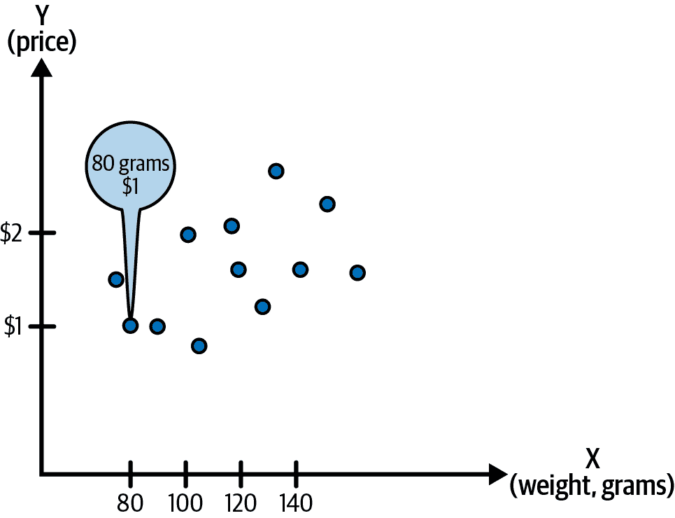

###### 图 3-1\. 用于线性回归的数据点。

线性回归的下一步是将“线”拟合到数据点。在幕后，像 Python、Stata、IBM SPSS、SAS、MATLAB 等软件工具将计算“最佳拟合线”。根据本节先前给出的*模型*定义，该线是*模型*，它是使用你拥有的数据点最好地*逼近*“真相”的最佳*近似*。从初始线开始，软件将计算*残差*：数据点与线之间的 y 轴距离，如 图 3-2 所示。在口语中，*残差*也称为*残差误差*。

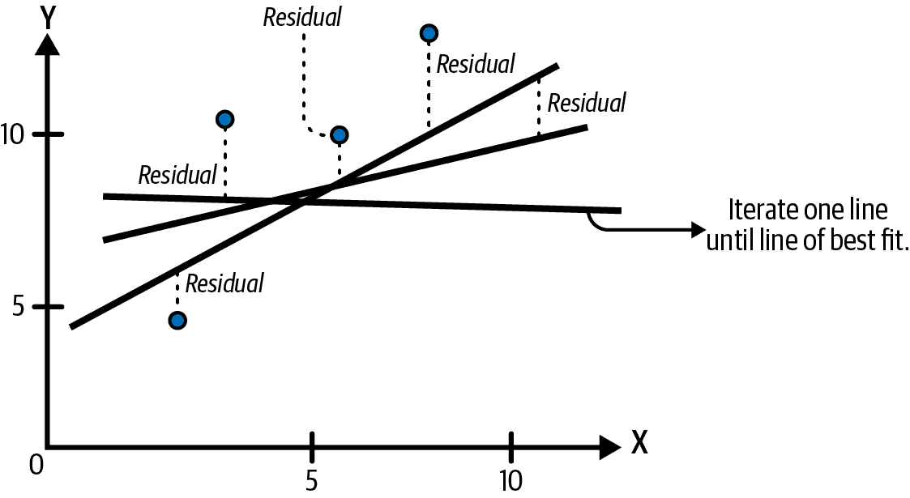

###### 图 3-2\. 在线性回归中拟合最佳拟合线；直到残差尽可能小为止迭代线条。

所有残差都是平方的，以便预测值和线不会因为具有相反符号（正、负）而互相抵消。目标是使残差的总和尽可能小，因为如果你有一条明显偏离数据点的线，这意味着该线与尽可能多的数据点的拟合不佳、不准确。从数学上讲，评估线条拟合程度的常见技术是称为*最小二乘法*的过程。实现最小二乘法意味着找到导致平方残差总和最小的线，这反过来意味着你有了“最佳拟合线”：该线以最小距离适合数据点，如 图 3-3 所示。

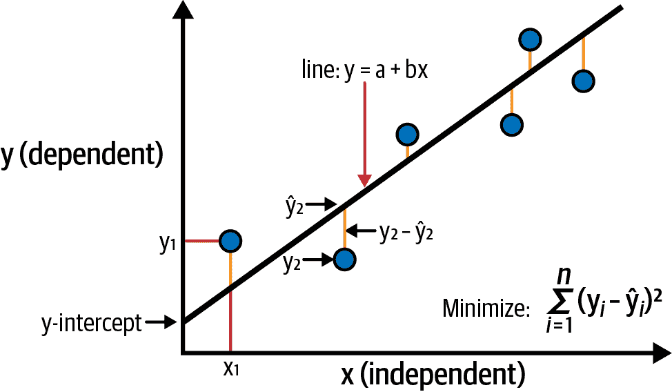

###### 图 3-3\. 最小二乘法和术语；y 表示观测数据点，ŷ（y-hat）表示预测/估计值。

最终的结果是一条线，它对数据点的最小二乘和最小，如 图 3-4 所示。

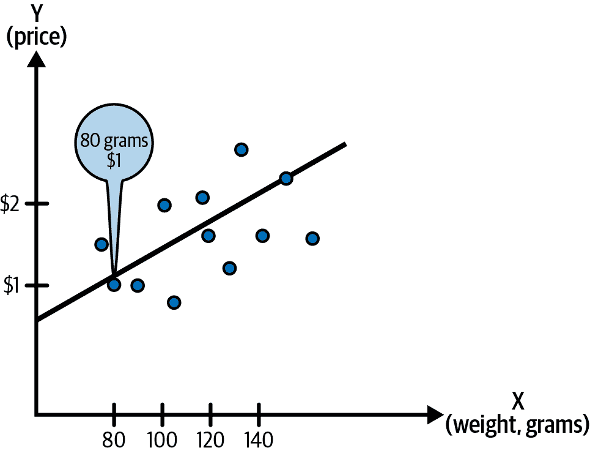

###### 图 3-4\. 从 图 3-1 的数据得到的最小二乘法得到的最佳拟合线。

未来，您可以使用这个“最佳拟合线”作为预测新苹果价格的模型！您可以将苹果重量插入该线条（以方程形式），以获得预测价格的数值。这是从数据点计算模型的最基本方式之一，但与下一章涵盖的更深入的 ML 模型和算法具有相同的模式。换句话说，您将初始化一条线（您不知道这是否是最佳模型），并计算残差或其拟合程度。接下来，您将通过稍微倾斜线条来更改它—在数学上称为*更新系数*或*权重*—并再次计算残差，如图 3-2 所示。

此更新过程称为*训练*，这也是常用短语“训练/训练 ML 模型”来自的地方。如果平方残差的总和变小，则您正走在正确的道路上。当您无法再缩小平方残差时，您已经达到了最小二乘法，这就是您可以说该线条是您在该数据集上的最佳近似的方式（如图 3-4 所示）。这就像一个游戏，房间里有一个隐藏的物品，当你在房间里走动尝试找到它时，你的朋友会说“热”，如果你越来越接近，而在你走远时则说“冷”。您希望朝着房间里越来越热的地方走，直到达到最终位置。

在第四章中，我将介绍通过诸如均方误差（MSE）、均方根误差（RMSE）等误差项来评估模型的方法，这些概念与残差非常相似。主要区别在于，残差是过去观察数据与模型估计值之间的差异，而误差是模型估计值与模型之前未见的实际数据之间的差异。换句话说，在将模型应用于先前未见数据以评估模型性能后，误差即为这些差异。

## 定义训练集和测试集分割

总结一下，在使用监督机器学习³，例如前一节中简单线性回归示例时，通常会从数据集开始，希望 ML 算法能学习事物运作的模型。然后，您将使用模型计算因变量的值，例如预测苹果在实际销售前的售价。换句话说，您有过去数据点的数据集，当然没有未来数据点。在 ML 模型训练时，它正在学习“拟合”您当前拥有的数据。当模型在真实世界中使用时，可能会出现一些问题。首先，真实世界中总会有离群值或变化事件。

例如在使用机器学习进行金融预测时：市场可能突然转向熊市（下跌市场），而我们在牛市（上涨市场）中用金融数据训练的模型会产生可怕且极不准确的预测。另一个例子是，你手上的数据集可能不足以代表现实世界的行为。在前一节中关于苹果的例子中，你假设凭借苹果的重量和高度数据可以预测新苹果的销售价格。但如果你手上的数据不够，像富士或者蜜脆（我最喜欢的之一）这样的苹果品种售价更高怎么办？你的数据集中并没有追踪每个苹果的品种名称，所以一旦投入使用，你的模型可能是错误的。

但目前，你只有当前的数据集。为了充分利用它，你需要保留一些数据用于测试目的。这意味着你可以拿出 80%的苹果数据点用于模型训练，然后保留 20%的苹果数据点用于运行训练后模型的预测。模型训练的 80%数据称为*训练集*（有时称为*训练数据集*），在训练阶段模型未见过的 20%数据称为*测试集*。这模拟了在真实世界中运行模型以预测新数据点的情景；测试集就是为此目的而存在的。在许多情况下，你甚至可能将数据分成三个部分：80%作为训练数据集，10%作为验证（保留）数据集，另外 10%作为测试数据集（图 3-5）。

验证集允许你在训练过程中监控模型的性能，而不是“正式”评估它，并且它能帮助你诊断模型的弱点并调整其参数。如前所述，测试集在训练过程中模型未见过，因此用于正式评估模型性能，尽可能模拟真实世界环境。当然，拥有测试集和验证集并非绝对可靠，这引出了更强大的技术以及模型过拟合和欠拟合的概念。

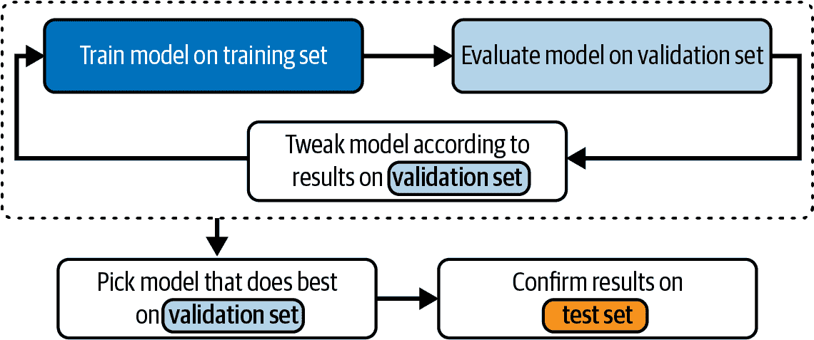

###### 图 3-5\. 训练、验证和测试集的划分。

###### 提示

对于关于训练和测试集的面试问题，请确保你能够命名简单分割的常见方式，例如使用[交叉验证](https://oreil.ly/miQ1N)：⁴将数据分成较小的块并依次作为训练集。

## 定义模型欠拟合和过拟合

模型在真实数据（甚至验证或测试集）上表现不佳的原因有很多。解决过拟合或欠拟合是一个常见的起点。*欠拟合* 是指模型拟合得不好。这可能意味着模型无法捕捉数据集的自变量（例如重量、高度等）与因变量（例如价格）之间的关系。因此，减少欠拟合的一些方法与帮助模型在训练过程中学习更多微妙或模式有关。

例如，添加更多变量或模型特征，例如苹果变种或苹果的年龄，可能有助于模型从训练数据中学习更多模式，并潜在地减少欠拟合。减少欠拟合的第二种方法是增加模型训练的迭代次数[在停止训练之前](https://oreil.ly/ZFqyo)⁵。

*过拟合* 是指模型过于密切地适应训练数据，可能找到只存在于训练集中而不在其他地方的模式。一个简化的例子是，训练数据恰好包含许多尽管重量不同但价格昂贵的苹果（例如，Sekai Ichi 苹果⁶）。模型从这些数据中学习并过拟合于此，因此导致不正确的预测，对便宜的苹果变体定价过高。简而言之，模型过于记忆训练数据，无法推广到新的数据点。有许多技术可以使模型更好地推广，例如添加更多训练数据，数据增强或正则化⁷。接下来我将详细介绍正则化。

## 正则化总结

*正则化* 是减少机器学习模型过拟合的一种技术。一般来说，正则化会对模型的权重/系数施加一个阻尼作用。到这里，你可能已经知道我接下来要做什么了——那就是再次提到苹果！苹果是我最喜欢的水果，这可能是为什么我经常使用这个例子的原因。所以让我们假设模型已经学会更重视“苹果的重量”（不经意的双关语，但模型的“权重”是合法的术语）；然后苹果的重量在数学上会显著增加机器学习模型对价格的预测结果。如果通过正则化减少苹果重量增加模型对价格预测的影响量，那么可以使模型更具普遍性，并更均衡地考虑其他变量。

## 基础技术的样本面试问题

现在我已经在更高层次上涵盖了各种统计和机器学习技术，让我们来看一些样例问题。在这里，我将深入探讨由本节涵盖的概念引发的常见面试问题的细节。这些细节可能之前没有提到过，所以我希望这些样例问题也能帮助解释这些新概念。

### 面试问题 3-1：L1 正则化与 L2 正则化有何区别？

示例回答

*L1 正则化*，也称为[*套索正则化*](https://oreil.ly/hoPuG)，是一种将模型参数收缩至零的正则化类型。*L2 正则化*（也称为*岭正则化*）向目标函数添加一个与模型系数平方成比例的惩罚项。这个惩罚项将模型系数收缩至零，但与 L1（套索）正则化不同，它不会使任何系数完全等于零。

L2 正则化有助于减少过拟合并通过保持系数不会变得过大来改善模型的稳定性。L1 和 L2 正则化都常用于防止过拟合并提高机器学习模型的泛化能力。

###### 提示

关于模型过拟合和欠拟合的面试问题可能会引发跟进问题。例如，如果你提到了 L1 和 L2 正则化，面试官可能会问：“还有哪些类型的正则化可以起作用？”在这种情况下，你可以提到*弹性网*，它是 L1 和 L2 技术的结合体。或者对于过拟合的情况，集成技术也可以帮助（参考“面试问题 3-3：解释提升和装袋以及它们可以帮助解决什么问题。”）。

### 面试问题 3-2：如何处理不平衡数据集带来的挑战？

示例回答

在机器学习中，不平衡数据集指的是某些类别或类别比其他类别多。处理不平衡数据集的技术包括数据增强、过采样、欠采样、集成方法等：

数据增强

数据增强涉及生成更多示例以供机器学习模型训练，例如旋转图像，使数据集包括正常直立的人类图像以及倒立的图像。没有数据增强，模型可能无法正确识别侧卧或做倒立头站的人类图像，因为数据向正常直立的人类倾斜。

过采样

过采样是通过合成生成技术增加少数类数据点数量的一种技术。例如，SMOTE（合成少数过采样技术）¹⁰ 使用少数类的特征向量生成位于真实数据点及其 k 近邻之间的合成数据点。这可以通过合成增加少数类的大小，并提升在过采样处理后训练的机器学习模型的性能。

下采样

下采样则相反：它减少了多数类的示例数量，以平衡多数类和少数类的数据点数量。在实践中通常更喜欢过采样，因为下采样可能导致有用的数据被丢弃，特别是当数据集已经很小时，这种情况会更加严重。

集成方法

集成方法还可以在处理不平衡数据集时提升模型性能。¹¹ 集成中的每个模型可以在数据的不同子集上训练，并有助于更好地学习每个类别的细微差别。

### 面试问题 3-3：解释 boosting 和 bagging，以及它们可以帮助解决的问题。

示例答案

Bagging 和 boosting 是用于提升机器学习模型性能的集成技术：

Bagging

Bagging 训练多个模型在训练数据的不同子集上，并组合它们的预测以进行最终预测。

Boosting

Boosting 训练一系列模型，其中每个模型试图纠正前一个模型的错误。最终的预测由所有模型共同完成。集成技术可以帮助解决机器学习训练过程中遇到的各种问题。例如，它们可以帮助处理不平衡数据¹² 和减少过拟合¹³。

###### 注意

更多关于模型评估的深入问题，请参阅第四章。

# 监督学习、无监督学习和强化学习

在机器学习角色中，了解何时以及从每个技术家族中选择什么是一项重要技能——包括监督、无监督或强化学习。在我的之前的工作中，我使用监督学习来防止欺诈和客户流失，但在其他时候，我根据数据和情况使用无监督学习如异常检测解决同样的问题。有时候（随着你在机器学习职业中的成长），你甚至可能创建一个包含监督和无监督学习的机器学习管道。在强化学习管道中，你可能会在前一步骤使用监督学习来标记特征。理解底层机制可以帮助你在使用不同技术可能比坚持便捷更有效时，适应新情况。

因此，在面试中经常会有关于监督学习和非监督学习的问题。增强学习（RL）被认为是一个稍微高级的主题，在许多面试中可能不会被触及。然而，由于 RL 在行业应用中的增长，如与推荐系统结合使用，我曾在相当多的面试中被问及此问题。正如我在第二章中提到的，如果某事出现在您的简历中，那么在面试中讨论它是公平的！有关 RL 的更全面的概述，请参见“增强学习算法”。

###### 提示

无论您面试的是哪种类型的机器学习职位，了解监督学习和非监督学习都是必备的知识。优先了解增强学习概念。

本节涵盖了标记数据、监督学习、非监督学习、半监督学习、自监督学习和增强学习的基础知识，对于那些不确定是否具有这一领域背景知识的人来说。如果您已经在任何这些领域具有专业知识，则可以跳过这些子部分。无论您的专业知识如何，我都在提示框中强调了 ML 面试的具体建议，帮助您应用每个 ML 领域的知识并在面试中表现出色。

## 定义标记数据

返回到我们的苹果数据集，从“总结独立和因变量”，您拥有过去苹果销售的数据点。在“总结线性回归”中，价格也是依赖变量。您确实拥有数据集的标签¹⁴，这意味着您之前进行的 ML 任务是使用*标记*数据。*非标记*数据的一个例子是当您有苹果的价格和重量但没有苹果品种时，您尝试推断不同苹果品种之间的共同点。因为您最初没有正确或预期的“标签”——在这种情况下是苹果品种——所以您将使用非标记数据进行无监督学习。

## 监督学习总结

在标记和非标记数据的概念基础上，让我们进入监督学习。*监督学习*是机器学习的第一种类型，其定义是利用标记数据，如图 3-6 所示。监督学习利用过去的正确或预期结果来预测新数据点的因变量。例如，利用苹果的重量、品种等来预测新苹果的销售价格就属于监督学习。监督学习可以分为两大类：回归和分类。

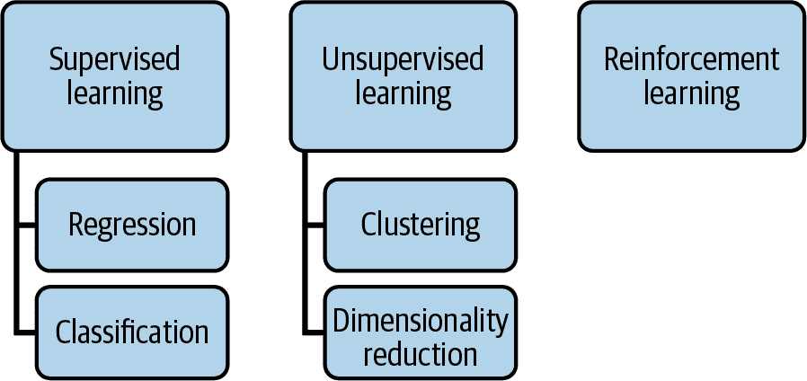

###### 图 3-6\. 机器学习家族概述（简化理解）。

在*回归*任务中，依赖/输出变量是连续值。例如，预测股票价格、房价或天气（温度）都产生连续值。*分类*是一种监督学习类型，其中依赖/输出变量是分类的，即它被放入一个类别，比如“这是狗”或“这是猫”。分类的例子包括检测某物是否是垃圾邮件，使用图像识别如在图片中标记动物类型等。

可以通过诸如*独热编码*之类的技术混合分类数据和连续数据。例如，如果我们尝试分类图像中是否有狗或猫，有狗的图像将使用“狗”类别的 1 编码，以及“猫”类别的 0 编码。可以将这些数字编码（0 或 1）与具有连续值的数据集混合。这样您可以混合这些分类数据（0 或 1）与具有连续值的数据集。

## 定义无监督学习

*无监督学习*是使用未标记数据来训练模型：当您没有“标签”可用时（标签是您正在寻找的正确或预期值）。您可能会使用无监督学习来查找数据集中的模式、共同点或异常，而无需先前知识的 ML 模型的正确或预期结果标签。

无监督学习的常见用途包括聚类和降维（见图 3-6）。许多生成模型是无监督的，例如用于图像生成的变分自编码器（VAE），例如与应用程序如稳定扩散。

*聚类*是一种将相似数据点组合到一起形成聚类的 ML 任务，如图 3-7 所示，这允许您看到任何新出现的模式。虽然您无法推断出您没有的任何标签，但仍然可以找到异常或感兴趣的聚类以进一步调查。无监督学习可用于客户细分，因为您可以假设同一聚类中的客户可能具有类似的偏好或行为。您可以使用无监督学习进行异常和异常检测，因为您可以在不了解“异常”外观的情况下发现数据中的异常模式。

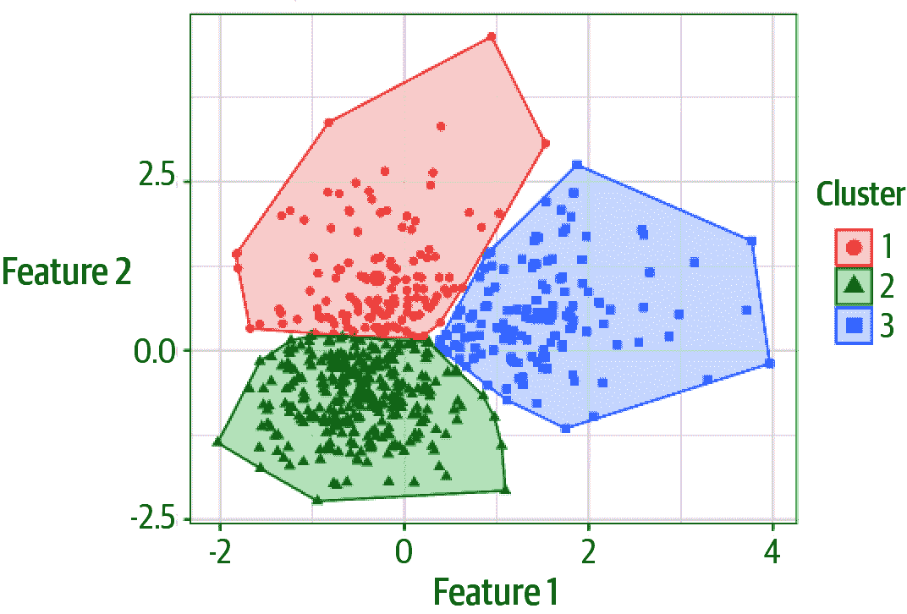

###### 图 3-7\. 无监督学习示例：聚类。

*降维*是一种常见的技术，用于减少训练数据中冗余输入变量的数量。减少特征/输入变量的数量有助于减少过拟合，因为学习过多变量的模型可能还会从这些变量的“噪音”中学习。

## 总结半监督和自监督学习

随着行业对完全标记大量数据的限制，监督学习和无监督学习的扩展变体变得越来越受欢迎。在面试中，你可能不经常遇到这些概念，但你应该意识到它们的存在。如果你正在面试的团队使用这些技术，最好准备好讨论它们。

*半监督学习*使用少量标记数据（通常是手动标记的）来训练一个专门用于帮助机器标记先前未标记数据的 ML 模型。然后，初始标记数据集与具有最高置信度的机器生成标签结合，创建一个更大的标记数据集，如图 3-8 所示。

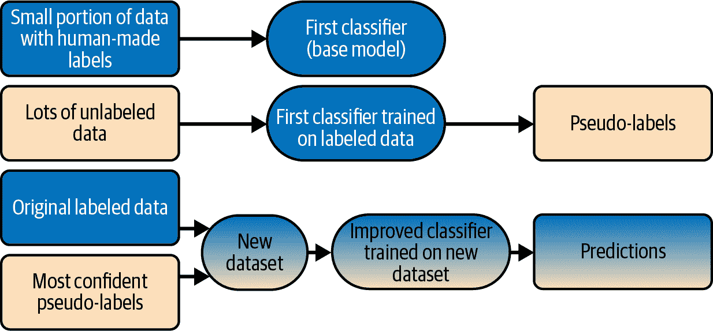

###### 图 3-8\. 半监督学习概述。

*自监督学习*¹⁵依赖于数据集本身来学习潜在的表示，而不需要标签。例如，在图像中，如果删除了某些部分，我们能否预测或生成这些缺失的部分？自监督学习的常见用途包括填补图像、音频、视频¹⁶、文本等的缺失部分。

###### 提示

面试中可以提到半监督学习和自监督学习，以帮助解决标记数据不足或不必要为所有数据进行标记的情况。

## 强化学习总结

基于数据集或标签使用的第三种主要机器学习类型是*强化学习*（RL）。在其最简单的形式中，RL 并不一定需要先前的数据集，尽管通常在行业中，我仍然更喜欢有一些现有的数据集或现有的模型，这样我可以在部署 RL 代理到真实世界或客户手中之前脱机测试 RL 算法。

强化学习依赖于“代理”，这与我之前介绍的机器学习“模型”概念并不相同，尽管它们在改进和学习的迭代过程中有相似之处。强化学习通过试错学习。代理只需在每个新数据点到来时做出反应，通过经验最终学会预测执行下一步最佳动作的最优方式。

一个常见的强化学习示例是机器人学习导航迷宫，迷宫中有奖励、陷阱和出口（例如，参见本章后面的图 3-14）。机器人第一次穿越迷宫时，不知道金子、陷阱和出口的位置。但是随着它在环境中遇到这些事物，它也会获得知识或数据点，类似于通过试错构建自己的数据集。在机器人多次导航迷宫之后，它学会了最快和最安全的路径到达出口。但根据您设计的强化学习代理的方式，它还可以优化各种目标，例如收集最多的金子而不是尽快到达出口。

有各种类型的强化学习，其中一些类似于监督学习，但我将把这些深入讨论留在“强化学习算法”部分。强化学习通常用于游戏、机器人和自动驾驶汽车，但强化学习也可以用于越来越多之前使用监督学习的应用，比如 YouTube 上推荐视频的系统。

## 监督学习和无监督学习的样例面试问题

现在我已经在更高层次上覆盖了监督学习、无监督学习和强化学习，让我们看看一些与这些概念相关的常见面试问题。

###### 注意

本节专门涵盖了监督学习和无监督学习的面试问题；由于强化学习有自己的部分，可以在“强化学习算法”中找到关于强化学习的问题。

### 面试问题 3-4：监督学习中常见的算法有哪些？

示例答案

*回归*算法族包括线性回归和逻辑回归，以及其他算法如广义线性模型（GLMs）和各种时间序列回归模型如自回归移动平均（ARIMA）。

*决策树*算法族可以在监督学习中用于分类和回归任务；这些包括 XGBoost、LightGBM、CatBoost 等。决策树可以在随机森林算法中组合（集成）多个决策树。像决策树一样，随机森林可以用于监督学习中的分类和回归任务。

*神经网络*不仅可以用于监督学习任务，还可以用于无监督学习。在监督学习方面，这些任务包括本节中的许多任务，如图像分类、目标检测、语音识别和自然语言处理（NLP）。

其他算法包括朴素贝叶斯，¹⁷ 这是一种使用[贝叶斯定理](https://oreil.ly/OJqAX)的监督分类算法。¹⁸ 贝叶斯定理在机器学习中的应用包括贝叶斯神经网络，¹⁹ 这些网络预测结果的分布（例如，标准模型可能预测价格为$100，但贝叶斯模型将预测价格为$100，标准差为 5）。

### 面试问题 3-5: 无监督学习中常用的一些算法是什么？它们是如何工作的？

例子答案

无监督学习通常用于聚类、异常检测和降维。我将根据这些类别对算法进行分组。*聚类* 通常使用 k 均值聚类和基于密度的聚类（DBSCAN 算法）等算法。*K 均值聚类* 将数据分组到*k*个簇中，并迭代地使用聚类的质心标记每个数据点。然后更新簇的质心，并继续迭代，直到簇分配达到稳定状态，不再移动或改变。*DBSCAN* 是一个流行的算法，它将彼此靠近的数据点（高密度）分组在一起，并根据它们之间的距离将这些簇分离开来。因为无监督学习算法可以处理大的类别不平衡，所以有常见的无监督学习算法可以处理异常检测。

有许多算法可以用于降维。*主成分分析*（PCA）可以将数据集“压缩”到一个更低维的空间中。这对于数据预处理非常有用，因为它可以减少使用的冗余特征数，同时保持数据中的方差，以便在数据中保留足够的信号和模式。

*自编码器* 是一种无监督学习的类型，具有广泛的应用，特别是在自然语言处理领域，但不限于此。它们可以用于对输入文本进行压缩表示，这也是一种降维的形式，然后解码压缩表示以生成下一块文本数据。这对于文本完成和文本摘要任务非常有用。作为无监督学习的一个子集，自监督学习也是自编码器可以使用的情况之一。例如，自监督学习用于填补图像中缺失的部分或[修复音频和视频](https://oreil.ly/pn61B)。²⁰

### 面试问题 3-6: 监督学习和无监督学习之间有什么区别？

例子答案

这两种类型的机器学习之间的主要区别与使用的训练数据有关。监督学习使用带标签的数据，而无监督学习使用未标记的数据。*带标签的数据* 指的是训练数据集中已经包含 ML 模型的正确输出或结果。

监督学习和无监督学习在 ML 模型输出方面也有所不同。在监督学习中，ML 模型旨在预测标签将是什么。无监督学习不预测特定的标签，而是试图在数据集中找到潜在的模式和分组，这可以用来聚类新数据点。

在评估方面，这两种 ML 方法有不同的评估方法。监督学习通过将其输出与正确输出（使用测试/保留/验证数据集）进行比较来进行评估。在无监督学习中，模型根据其在数据中聚类或捕捉模式的效果进行评估，通过诸如聚类的 Jaccard 分数或轮廓指数以及异常检测的 ROC 曲线/曲线下面积（AUC）等指标来进行正比率比较。²¹

最后，监督学习和无监督学习通常用于不同类型的任务。监督学习通常用于分类（预测正确的类别）或回归（预测正确的值）任务，而无监督学习通常用于聚类、异常检测和降维任务。

### 面试问题 3-7：您在哪些情况下会使用监督学习而不使用无监督学习，反之亦然？请用一些现实世界的例子加以说明。

示例答案

无监督学习和监督学习在结果或标签的使用上存在差异。因此，无监督学习最适用于标记数据不可用或任务不是预测“正确”输出，而是在数据中找到模式或异常的情况。

作为一个现实世界的例子，监督学习可以用于分类和物体检测，例如图像识别任务。在训练数据集中，我将有正确标记的对象，并且算法将知道它们是否学会了根据与地面实况比较它们的预测来正确地检测对象。换句话说，如果算法没有正确地在图像中用框圈出脸部，我会知道，因为我将每个图像（脸部正确框出）与之比较。监督学习的其他场景可能包括基于其特征（如其年龄、系列名称和卡片的条件）预测罕见交易卡的价格。鉴于我已经有了正确标记的欺诈数据集，欺诈检测也可能是监督学习的应用。如果我没有关于欺诈行为的标记数据，我可能会选择使用无监督学习，通过检测异常行为来进行。

###### 注意

在真实的面试中，你可能不需要提供这么多例子，但作为参考答案，我会列举一些。如果你能提供一个在你面试的公司所属行业中普遍关注的例子，那就更好了。例如，时间序列的例子通常与金融和金融科技行业相关，而欺诈检测则与在线销售平台、银行和金融相关。

有时无监督学习比监督学习更合适。对于异常行为的一般警告标志，可以使用异常检测来查找用户在线银行账户的异常登录位置。聚类是一种无监督学习任务，实际应用可以是根据客户的特征（例如行为、偏好）将客户分组，企业可以利用这些信息来确定如何为特定集群的用户量身定制产品或针对市场营销活动。如果我调查一个集群，并且通过聚类算法显示年轻专业人士有类似的行为，那么我们可能会知道在公司下一次数字广告活动中可以向他们提供类似的促销材料。

### 面试问题 3-8：在实施监督学习时可能遇到的常见问题是什么，你会如何解决？

示例答案

可能会影响监督学习的一个常见问题是缺乏标记数据。例如，当我想要用机器学习分类图像中的特定卡通和动漫角色时，我找不到可用于下载和使用的互联网标记数据。有一些开源数据集，比如 CIFAR，²²用于一般对象和物品的标记，但是对于更具体的用例，我需要自己获取并标记图像（供个人使用）。

我曾经处理过标记数据不足的问题；在这种情况下，手动标记一些例子作为起点是有效的。然而，仍然没有足够的*标记*例子，这导致了一个不平衡的数据集。为了人为增加标记数据的数量，我使用了数据增强技术，创建了合成数据和现有数据的变体，以使机器学习模型更加健壮。在图像识别中的数据增强的一个例子是随机翻转或旋转图像。为了说明为什么这可以增加样本，如果我翻转一个向右看的直立动漫角色，那么它就变成了两个模型学习的数据点：一个向右看和一个向左看。旋转也有助于：机器学习算法能够正确地识别侧身倾斜或者倒立做倒立头的动漫角色吗？

# 自然语言处理算法

近年来，自然语言处理领域取得了很大进展，OpenAI 的 ChatGPT 就是一个显著的例子。有很多面试问题是基于变压器模型的基础技术，并且随后是 BERT 和 GPT 系列模型，所以我会在本节中涵盖这些概念。

NLP 通常应用于聊天机器人和情感分析（例如，基于 Reddit 或 Twitter 帖子查看产品或公司的一般态度是积极还是消极），以及生成书面内容。如果您正在为一个从事 NLP 工作的公司或团队面试，那么您肯定会被要求深入展示您对这些概念的理解。即使您不是专门面试 NLP 团队，我仍然建议您对 NLP 应用有一般了解，这将使您成为一个更全面的候选人和 ML 专业人员。更不用说，NLP 技术不再仅用于生成书面内容；它们还与计算机视觉、文本到图像模型结合，用于生成图像、视频、音频等等。甚至时间序列预测和推荐系统也开始采用 NLP 技术。学习 NLP 的基础知识将会给您带来很多好处，因为这些技术的通用性有多大。

本节介绍了 NLP 技术的基础知识，适合那些对该领域的背景知识不确定的人。如果您已经精通其中任何领域，请随意跳过子部分。无论您的专业水平如何，我都在提示框中强调了 ML 面试的具体建议，以帮助您应用您对每个 ML 领域的知识，并在面试中表现出色。

## 总结 NLP 的基本概念

让我们分解支持 NLP 的组件。首先，你有一个数据集，通常称为*文本语料库*。²³ 文本语料库可以包含许多类型的文本，如新闻、在线论坛或任何具有大量真实和有意义文本的内容，而不是胡言乱语。接下来，使用这个数据集，你需要像处理其他机器学习任务一样对数据进行预处理。一些常见的在面试中会问到的技术包括分词、词袋模型或 TF-IDF（词频-逆文档频率）。

*分词*是将文本分解为单词、短语或有用的语义单元的过程。²⁴ 例如，根据情况，“preprocess” 这个词可以作为一个单独的标记保留，也可以分解为“pre”和“process”。而“aren’t”可以作为一个单独的标记保留，但也可以分解为“are”和“n’t”。

一旦数据集经过预处理，语言建模就可以被制定出来，以预测下一个序列的项，这可能是下一个单词（如图 3-9](#next_word_or_phrase_predictioncomma_as_s)所示），下一个句子，下一个段落，缺失的单词等等。


###### 图 3-9\. 如手机或电子邮件上的自动完成中看到的下一个单词或短语预测。²⁵

*词袋模型*（*BoW*）是一种将句子或短语映射到向量的方法。向量可以由单词和其他信息组成，例如单词出现的次数（如果出现一次为 1，出现两次为 2，依此类推）。对于句子“Syd likes to drink bubble tea and chamomile tea”的示例*.json*表示如下：

```
{
    "Syd": 1, "likes": 1, "to": 1, "drink": 1, "bubble": 1, "tea": 2, 
    "and": 1, "chamomile": 1

}
```

注意，“tea”这个词出现了两次，因此计数为 2。

*TF-IDF*利用单词在段落或文档中出现的频率来确定这些单词的相关性。

尽管 NLP 与其他类型的机器学习共享许多基础概念，但它也带来了独特的挑战。在使用监督学习（如下游微调）时，数据很难标记。例如，如果您正在使用监督微调进行情感分析，快速预测用户评论是积极的还是消极的，有时可能会存在歧义。另一个挑战是存在大量的变异性，例如俚语和地方语法差异，这也可能导致数据稀疏性，即文本语料库中确切的单词组合可能很少出现，但仍然是有效的。

NLP 的常见用例包括情感分析、聊天机器人、文本分类（例如，垃圾邮件与非垃圾邮件）、文本生成、文本摘要、文本到图像生成等等。

###### 小贴士

BoW 和 TF-IDF 是我最近在面试中听说的有用的基础技术。

## 摘要长短期记忆网络

长短期记忆（LSTM）网络是一种递归神经网络，专门设计用于处理长数据序列，在自然语言处理（NLP）应用中非常有用。与转换器中的注意力单元类似，长期依赖性和先前文本的上下文对于 NLP 的有效性至关重要。然而，LSTMs 也有一些局限性，比如处理非常长的文本序列时，即理解页面或段落中较早出现的文本背景。为此，转换器（在下一节中介绍）能够更好地处理长期依赖性。

###### 小贴士

LSTMs 不仅可以用于特征工程和时间序列。由于篇幅限制，我在这里不再详细解释，但我鼓励你阅读更多。Christopher Olah 的博客[理解 LSTM 网络](https://oreil.ly/C-jwG)提供了一系列良好的插图，帮助理解 LSTMs 的应用。

## 摘要变压器模型

Transformer 模型由 Google 于 2017 年引入，²⁶ 这使得近年来语言模型的范围得以扩大。相比于卷积神经网络（CNNs）和循环神经网络（RNNs）等现有架构，Transformers 在处理长文本串的上下文和意义时表现出更好的改进。²⁷ Transformers 也更适合在数据集中找到模式，而不像 CNNs 和 RNNs 那样需要大规模标记的数据集。因此，现有数据集的准入门槛更低。有了 transformers，大型的、自由形式的互联网文本语料库可以直接用于分析，无需事先昂贵的标注工作。

transformer 网络内的注意力单元是其有效性的一部分，可以找到单词之间的短距离和长距离关系，这有助于模型正确标记上下文。例如，“Max went to the record store. Later, *he* bought a Jay Chou album.” 自注意力单元可以正确识别“*he*”指的是“Max”。结合 BERT 的编码器架构和多头注意力机制，这显著提高了自然语言处理任务的性能和能力。

## BERT 模型总结

由 Google 开发，BERT（Bidirectional Encoder Representations from Transformers）模型自 2019 年起用于处理 Google 搜索引擎的查询。²⁸ 正如其全名所示，BERT 利用了前述的 transformer 神经网络。BERT 是预训练的，这意味着 Google 进行的初始训练步骤生成了用户可以访问的模型²⁹，通过在大规模文本语料库（如维基百科和其他文本数据集）上进行“自监督”学习。在预训练期间，BERT 接受了两个任务的训练：遮蔽语言建模（MLM）和下一个句子预测（NSP）。

*遮蔽语言建模* 指的是随机“遮蔽”或阻止/删除句子中的几个标记，并让模型学习正确预测这些标记。例如，“Lisa is singing a [MASK]”，其中 [MASK] 表示 BERT 预测的标记。这在 Figure 3-10 中有所说明。如果 BERT 能够预测“歌曲”或“旋律”等词有更高的正确概率，那么模型训练就很顺利。如果它预测的词或标记像“狗”，那么在模型训练的这一点上就不准确。

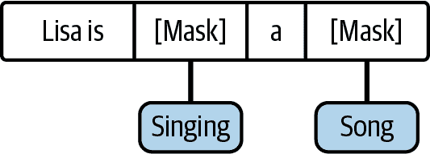

###### 图 3-10\. 遮蔽语言建模示例。

*下一个句子预测* 是 BERT 训练的第二个任务。其目标是准确预测文本序列中的下一个句子。由于这一训练过程可以在没有外部标签的情况下向模型提供反馈，因此它并不是“监督”学习本身，但因为反馈来自文本语料库本身，所以被描述为“自监督”学习。

模型预训练之后，用户可以下载模型或使用 API³⁰来“精细调整”模型以适应其自己的用例。这会改进用户的 BERT 模型副本，并需要监督学习。例如，用户可能希望使用 BERT 进行情感分析；在这种情况下，用户需要提供具有积极情感、消极情感或模糊情感的文本示例和标签（如果用户愿意）。如果你想使用 BERT 生成具有特定语气的文本，例如电影反派，你需要提供特定于 BERT 的示例作为精细调整的一部分。BERT 在这些任务上为用户节省了大量时间，因为它已经对目标语言（包括各种开发者创建的其他语言的预训练模型）有了一般性的理解³¹。

###### 提示

精调可以用于许多其他的 ML 模型，而不仅仅是 BERT。例如，你可以精调像[GPT-3.5](https://oreil.ly/5IMBU)（在写作时）。然而，我将精调作为 BERT 的一部分，因为我看到许多面试都在问关于 BERT 精调的问题。

## 总结 GPT 模型

GPT（生成式预训练变换器）系列的 NLP 模型以推动 OpenAI 工具 ChatGPT 而闻名。截至写作时，GPT 模型家族包括 GPT-1、GPT-2、GPT-3 和 GPT-4³²。它们在大型文本语料库上进行训练³³，例如 BookCorpus、WebText（Reddit）、英文维基百科等等。

GPT 家族利用变换器进行预训练，并且预测下一个单词。像其他主要的 NLP 模型一样，它可以通过精细调整³⁴来更新预训练模型的参数，使其更适合特定任务，例如文本生成。值得注意的是，GPT-3（与在写作时推动 ChatGPT 的 GPT-3.5 和 GPT-4）还利用用户反馈通过强化学习来改进其模型预测。强化学习在“强化学习算法”中有更详细的介绍。

除了 GPT，还有几个其他大型语言模型（LLMs），例如 PaLM2（驱动 Google Bard）、Llama/[Llama 2](https://oreil.ly/MkMeN)（Meta AI）等等³⁵，都是基于类似技术进行训练的。

## 更进一步

NLP 近年来发展迅速，许多知名的 LLM 已经发布（如图 3-11 所示）。我鼓励对该领域感兴趣的候选人更多地了解这些模型和技术。我记得在工作中探索了 Word2vec³⁶ 和 GloVe³⁷，现在还有许多其他开发 NLP 应用的方法。许多基础方法像这两个以及像 BERT 这样的模型仍然被广泛使用，我认识的招聘经理们仍然会询问它们，所以不要忽视基础！

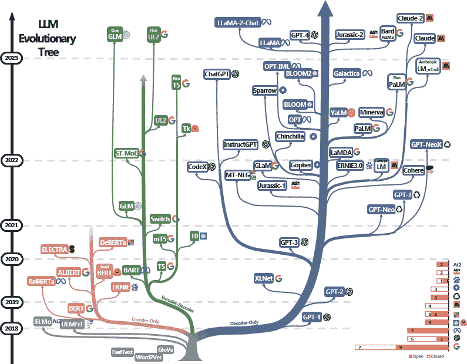

###### 图 3-11\. 大型语言模型的进化树示意图；使用许可来自[“大型语言模型实用指南”](https://oreil.ly/eVJEK)。

## NLP 面试样本问题

现在我已经介绍了一些在 NLP 中使用的基础技术，是时候看一些面试问题了。NLP 领域和生成 AI 中的应用发展非常迅速，因此我们将看到事情如何变化！然而，从我与网络中的招聘经理交流来看，我知道所有的招聘经理仍然期望候选人具备关于基础主题和用于 NLP 应用案例的数据预处理技术的知识。

### 面试问题 3-9：你将如何利用像 BERT 这样的预训练模型来执行特定的下游任务，比如情感分析、聊天机器人或命名实体识别？

示例回答

BERT 和其他预训练的 NLP 模型可以进行微调。一个大型的预训练 NLP 模型库是 Hugging Face 模型库。预训练模型可能包括用户上传的原始模型的微调模型，例如由 Google、OpenAI 等公司提供的原始模型，但用户也可以下载针对情感分析等任务进行微调的模型。

如果我想自己对其中一个原始模型进行微调，我需要为 NLP 模型提供一个带标签的数据集。例如，对于情感分析，这将包括正面和负面情感文本的示例；对于聊天机器人，我可能提供带有正确答案的帮助台问题的标记数据；对于命名实体识别，我将提供命名实体的示例，希望 NLP 模型能正确输出。

### 面试问题 3-10：你如何清洗/处理原始文本语料库以训练 NLP 模型？你能列举一两种技术及其背后的原因吗？

示例回答

从原始语料库开始，一个快速的第一步是使用正则表达式技术清除不需要的字符。某些下游任务并不依赖标点符号，但像情感分析这样的任务可能受益于保留标点符号；我们可以看到“！”在情感分析中可能是有用的。接下来，我们可以使用分词将文本分解为有意义的单元，通常是单词；例如，“Susan is writing a sentence”可以分解为五个标记：“Susan, is, writing, a, sentence.”

词干提取（Stemming）和词形归并（Lemmatization）都旨在将词语还原为其基本形式，以便时态变化和衍生仍指向同一根词。*词干提取* 是一个粗略的启发式技术，去除单词的末尾（例如 cars → car；history → histori 和 historical → histori）。[³⁸] 词干提取比*词形归并*更加粗糙，后者利用词典形式的基本词；例如，在词形归并中，“studying”，“studies”和“study”都会被还原为“study”。这对于 NLP 模型识别这些词在其根本意义上相同是有用的。

### 面试问题 3-11：自然语言处理模型常见的挑战有哪些，你如何解决这些挑战？

示例回答

即使使用了强大的预训练模型，自然语言处理（NLP）可能面临的挑战包括同义词/同形异义词、讽刺以及特定领域（如金融或法律文件等）的语言。这些问题可以通过更多针对特定情况的数据进行更好的下游微调来改善。例如，可以提供更多同义词用法的示例，这样 NLP 模型就能更好地判断何时使用哪个词。

在许多情况下，存在固有的偏见；用于大规模语言模型（LLM）训练的预训练语料库，如维基百科，有大量男性志愿编辑者，这是不成比例的。Reddit 作为一个具有大量文本数据集的论坛，也常用作训练数据集的基础，其用户性别偏差也很明显。

### 面试问题 3-12：BERT-cased 和 BERT-uncased 有什么区别？使用其中之一的优缺点是什么？

示例回答

*BERT-uncased* 有一个分词器，会将输入文本转换为小写，因此不管是传入大小写（包括大写）还是全小写（uncased）文本，对于 BERT-uncased 来说都是相同的。*BERT-cased* 则会为相同的单词不同大小写情况下分别处理；例如，“The”在 BERT-cased 中与“the”是不同的。因此，BERT-cased 能够基于大小写区分不同的语义。在不太重视大小写信息的应用中，BERT-uncased 可能更合适。然而，在需要考虑大小写信息的情境，例如专有名词对于 NLP 任务很重要的情况下，会更倾向选择 BERT-cased。

###### 提示

您可以看到这些问题的趋势：无论是哪种 NLP 应用（即使是生成式 AI！），了解如何适应情况至关重要。如果专有名词有用（不要全部小写），预处理将会不同，有时您可能会保留标点符号（如情感分析），有时则不会。深入理解 NLP 技术可以帮助您在面试中作出比仅仅记忆和复述更好的回答。

# 推荐系统算法

推荐系统（RecSys）无处不在于我们的数字生活中，并负责个性化您访问的网页和应用，例如 Netflix、YouTube、Spotify、任何社交媒体网站等。通过比较两个不同用户登录时显示在其首页或搜索结果中的项目或产品的顺序，可以判断网站是否具有个性化。例如，您的 YouTube 首页显示的内容可能与兄弟或朋友的不同。

推荐系统根据您以前的行为（例如观看过的节目和电影）提供新节目和电影的建议，认为您可能会喜欢、与之互动或购买。例如，Netflix 使用您以前观看的节目和电影的信息作为其推荐系统中的信号，以向您建议新的节目和电影。

###### 提示

由于许多技术产品使用推荐系统，这是大型科技公司面试官常问的“默认”类别。

本节介绍了推荐系统技术的基础知识，供那些不确定是否具备该领域背景知识的人参考。如果您已经在任何这些领域有专业知识，可以跳过子节。无论您的专业知识如何，我都在提示框中强调了 ML 面试的具体建议，以帮助您应用您在每个 ML 领域的知识，并在面试中表现出色。

## 总结协同过滤

*协同过滤* 是推荐系统中常见的技术。该术语来源于使用许多用户和/或物品偏好的数据（协同）来为单个用户进行推荐（过滤）。这基于一个假设，即具有相似过去偏好的个体可能会对新的未见产品产生偏好，因此算法将推荐相似用户喜欢的新物品。

协同过滤技术有两种主要类型：基于用户和基于物品。 *基于用户* 的协同过滤技术识别具有相似兴趣和偏好的用户，然后向这些相似用户推荐他们以前未见过的产品或物品。通过 ML 算法（如矩阵分解），计算“相似”用户，这将在本章后面介绍。 *基于物品* 的协同过滤技术根据其用户评分或用户互动识别相似的物品。如果用户以前喜欢过类似的物品，则协同过滤算法将推荐这些物品。

## 总结显式和隐式评分

在基于用户和基于物品的协同过滤中，通常需要了解用户的评分和偏好。如果用户留下了一个好评和评论，那么你可以*明确地*知道他们喜欢这个产品。但是用户没有足够的时间对每件事情都提供明确的详细反馈——想想你自己留下评论的次数；你很可能并没有为过去使用的每件物品都留下评论。然而，你仍然可以计算*隐式*反馈，比如在 YouTube 视频上花费的时间：如果有人看到最后，这可能意味着观看者比在两秒后关闭视频时更喜欢它。在推荐系统中使用隐式反馈还可以帮助减轻一些常见的偏见；如果人们喜欢或讨厌产品，他们更有可能留下明确的评价（而且你知道如果出了什么问题，人们更有可能大声表达）。

###### 小贴士

在 第四章 中，我将讨论模型训练和数据预处理。对于推荐系统的应用，在探索性数据分析、模型训练、数据预处理、特征工程、评估和监控过程中，理解可用的显式和隐式评分是面试中重要讨论的内容。

## 总结基于内容的推荐系统

另一种常见的推荐系统类型是基于内容的系统。在基于内容的推荐系统中，你需要关于产品本身的详细信息。这些信息可能包括文本描述的特征（书籍简介、电影类型和描述）、图像（产品截图）、音频/视频（预告片、产品视频）等，以便了解哪些物品彼此相似。相比之下，之前描述的基于用户和基于物品的协同过滤依赖于用户对物品或产品的偏好，而不依赖于物品本身的特征。

例如，基于内容的电影推荐系统可以根据用户先前观看并喜欢的电影的类型、导演或演员推荐电影，通过明确和隐式反馈进行衡量。因此，基于内容的推荐系统可以被制定为一个排序或分类问题，像基于树的模型算法非常适合。

## 基于用户/基于物品与基于内容的推荐系统比较

使用基于用户/基于物品或基于内容的推荐系统都有其优缺点。基于用户的系统在处理新用户时表现不佳；这通常被称为“冷启动”问题，因为用户的偏好数据不足，可能因为他们尚未购买或评价任何产品。基于内容的推荐系统可能需要较少的用户行为数据，因为它们不依赖其他用户的偏好或评分，这使得它们适合新用户或整体反馈较少的小众项目。但基于内容的系统可能仅限于推荐与用户之前互动过的物品类似的物品；因此，新物品不会被引入给用户，从而限制了用户可能享受到的产品或物品的多样性。

###### 提示

知道基于用户、基于物品和基于内容的推荐系统之间的权衡可以帮助你在面试和工作中脱颖而出。在现实中，显式反馈可能难以获得，而隐式反馈可能并不完美。知道如何混合和匹配你掌握的所有数据和推荐系统算法将极大地帮助你脱颖而出。

## 总结矩阵分解

*矩阵分解*是协同过滤中使用的一种技术。首先，构建一个矩阵，其中用户作为行，物品作为列，用户对物品的评分或偏好作为单元格的值。这被称为*用户-物品矩阵*，如图 3-12 所示。由于并非所有用户都与所有物品互动，原始矩阵将非常稀疏。例如，一个用户可能只与少数几个物品互动过，但在线平台上有数千或数百万种产品。矩阵分解的目标是预测矩阵中那些空值——也就是用户在之前未与之互动的物品上可能会给出的评分，并推荐那些你估计用户会喜欢的物品。

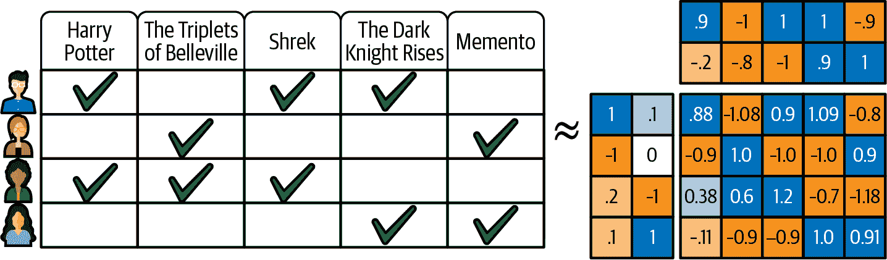

###### 图 3-12\. 矩阵分解示例；来源：[Google](https://oreil.ly/F7Tzg)。

一个经典的算法是奇异值分解（SVD）；然而，除了实践数据集之外，我从未见过它被用于行业应用，因为其昂贵的计算需求。⁴⁰ 对于行业应用，如果作为机器学习从业者选择使用矩阵分解，选择的算法需要能够处理非常稀疏和大型的矩阵，因为许多在线平台拥有大量的产品和用户。例如，ALS 等算法通过最小二乘法的近似来计算它们对矩阵中缺失值的最佳猜测（用户可能会喜欢的物品），而不是传统 SVD 使用的复杂矩阵操作。

## 推荐系统面试常见问题样例

现在我已经介绍了推荐系统的基础知识，让我们来看一些实际面试问题的例子。

### 面试问题 3-13：内容推荐系统和协同过滤推荐系统有什么区别？在什么情况下会选择其中之一？

示例答案

内容推荐系统需要了解被推荐产品的分类或特征，以确定产品的相似性。协同过滤依赖用户行为和用户偏好来推荐用户喜欢的类似口味的产品，因此可能对产品本身知之甚少。

因此，在协同过滤推荐系统无法为用户-物品矩阵构建足够多用户或物品时，内容推荐系统可以很好地工作。换句话说，只要有关于物品/产品特征以及用户特征或偏好的信息，内容推荐系统就可以解决“冷启动”问题，而无需像协同过滤那样需要更多的用户行为和交互数据。

另一方面，协同过滤适用于用户行为数据丰富的情况。有时，很难收集足够的、有意义的描述产品的特征，这使得内容推荐系统失效。在这些情况下，协同过滤可能更合适。

###### 提示

据我所知，我曾经参与过一个项目，其中协同过滤算法（ALS）对长期使用网络平台的用户效果更好，但对新用户效果较差。使用基于内容的过滤和 XGBoost 对新用户效果更好，我们根据用户类型部署了不同的模型。当然，这只是一个例子，对您的情况可能会有所不同。

### 面试问题 3-14：推荐系统中遇到的一些常见问题及其解决方法是什么？

示例答案

冷启动问题：这是指机器学习模型没有足够的过去数据点可供训练。因此，模型无法从过去学到足够的模式，以准确预测新数据点的正确结果。在推荐系统中，可以使用内容推荐系统，它需要较少的用户行为数据，但确实需要足够的产品特征数据。这可以帮助解决冷启动问题，并为新的网站用户提供推荐。

推荐系统在数据质量方面也可能遇到挑战，这个问题并不仅限于推荐系统。这可能包括源数据中的错误，例如在数据摄入过程中出现的错误。这个问题可以通过分析源数据存在问题的地方，并与负责数据质量的团队（有时是数据工程师或平台工程师，或者是 MLE 和数据科学家们）合作进行修复来解决。然而，首先要识别数据质量问题的存在是非常重要的，一些预防措施包括使用数据质量监控工具如 Great Expectations，在数据分布发生变化或者有大量缺失值时提醒团队。

当 ML 数据集中有许多缺失值时，这被称为*稀疏性*。例如，注册网站平台的用户可能在问卷中要求用户偏好时没有正确填写或者完全跳过。例如，当有人注册新的 Reddit 账户时，会显示常见的子论坛，但用户可以跳过这一步。这是为了尽可能减少网站注册过程中的阻力，但是这样的情况可能导致在构建 RecSys 特征集时出现数据稀疏性。可能的解决方案包括插补（例如，用平均值填补缺失值或使用基于树的方法填补数据）、使用协同过滤或矩阵分解技术、特征工程等等。

### 面试问题 3-15：推荐系统中显式反馈和隐式反馈的区别是什么？分别使用每种类型的权衡是什么？

示例答案

显式反馈包括用户评分或评价，而隐式反馈必须从可用的用户行为中派生，例如在网页上花费的时间或点击流行为。显式反馈的好处包括在机器学习中使用明确量化的评级以及与隐式反馈相比的明确性。然而，显式反馈可能更难收集，因为并不是所有用户每次互动后都会留下评价（大多数用户不会）。

因此，通过隐式反馈（例如视频观看时间或在网站上阅读的时间）来衡量用户的参与度或享受程度可能会被使用。当然，这可能导致不完美的度量：用户在网页上花费很长时间是因为他们喜欢内容，还是因为他们对上面的文字感到困惑？总的来说，考虑到这些权衡是很重要的，但实际操作中，你可以经常在你的机器学习模型中结合这两种反馈信号。

### 面试问题 3-16：在推荐系统中如何解决数据不平衡问题？

示例答案

这是 ML 场景中常见的一个问题：有一些类别或类别具有比其他类别更多的观测或数据点，而有许多类别/类别则观测较少，形成了长尾[⁴¹]。

处理这个问题时，过采样技术可能在简单情况下有所帮助，比如创建更多的数据点来增加那些观测次数较少的类别。然而，当观测有许多类别时，简单的过采样技术就不能缓解这个问题了。可以使用其他技术，比如特征工程和集成方法，来替代或与过采样同时使用。集成方法的一个示例可以是为热门项目和低参与度项目分别创建推荐系统。

在像亚马逊和 Spotify 这样的公司中，将 RecSys 与强化学习等家族结合起来，有助于确保长尾产品、艺术家或商品至少在某些时间向用户展示。[⁴²]

###### 提示

回到本节开头，推荐系统是一个常见的默认 ML 话题，因为许多科技公司的 ML 用例可以被制定为排名或推荐问题。在大科技公司中，我看到 NLP 技术或 RL 与 RecSys 的结合增加了，因此请务必查看“了解推荐系统算法的资源”中的论文，例如社交媒体（如 Facebook、Instagram）、娱乐（如 Netflix、Spotify、YouTube）、在线购物（如 Amazon）等已知的 RecSys 专注产品的现有示例。

# 强化学习算法

在“监督学习、无监督学习和强化学习”中，我简要介绍了强化学习（RL）算法。简而言之，RL 依赖于“试错”学习，在最简单的情况下，它不需要预先存在的数据集或已知标签。RL 将通过实时环境（例如机器人多次导航迷宫）收集知识，学习金子、陷阱和出口的位置。

强化学习在工业中有许多应用，比如自动驾驶车辆、游戏[⁴³]、作为大规模推荐系统的一部分、LLMs（RLHF[⁴⁴]对改进[ChatGPT](https://oreil.ly/qoWME)有很大帮助），等等。因此，了解强化学习对于希望加入使用 RL 的团队的面试者来说是必要的。

###### 提示

如前所述，RL 在生产中是一种较为先进的技术家族。因此，对于新毕业生角色，你应该首先专注于获得更广泛的 ML 知识。一旦掌握了这些，了解 RL 可以帮助你在求职过程中脱颖而出（根据我的经验来看）。

本节介绍了强化学习技术的基础知识，供那些不确定自己在这一领域是否具备背景知识的人参考。如果您已经在任何这些领域中具有专业知识，请随意跳过子节。无论您的专业知识如何，我在提示框中强调了关于 ML 面试的具体建议，帮助您应用每个 ML 领域的知识，并在面试中表现出色。

## 总结强化学习代理

在强化学习中，*代理*是一个与环境交互的自主实体，具有特定的目标或目标，并通过试错学习做出最优决策。例如，一辆自动驾驶汽车在测试环境中学习，随着时间的推移，学会了哪些行为是好的（遵守速度限制和道路标志）和哪些是坏的（如撞到树木和闯红灯）。

虽然在前面提到的大多数 ML 算法中，*模型*是焦点，但在 RL 中，*代理*随着其与环境的交互而更新。这并不意味着 RL 中没有“模型”，但模型通常被用作支持组件，可以在整个 RL 工作流程中混合和匹配。

为了说明强化学习，我将继续以自动驾驶汽车的示例简化理解。创建这个基本的强化学习代理需要以下构建块：状态、动作、奖励和策略。

###### 提示

有许多种类的强化学习，因此在每种算法类型中，策略、状态、动作或奖励之间的交互方式可能有所不同，并且它们可能与其他概念混合和匹配。请注意在面试中询问的概念。

强化学习代理正试图学习如何根据环境反应以安全驾驶的最佳策略。当代理被初始化时，它不知道在特定情景下选择最佳动作的策略，因此你只需让它在环境中四处行驶。这个特定场景的构建块包括：

状态

代理遇到的*状态*是环境的表示，或环境的状态。这可能包括更新汽车周围环境的信息；跟踪汽车左侧、右侧、前方或后方是否有物体；以及可行驶道路和交通灯及其状态的特殊标记。

动作

在这个例子中，代理可以选择的*动作*有：左转、右转、前进和刹车。注意：这种情况被简化为离散动作，但复杂的情景可能包括转动方向盘的角度。代理可以执行的所有动作统称为*动作集*，代理旨在在每个决策点执行最佳动作。

奖励

每次代理在环境的某个状态下采取行动后，代理将获得有关获得或损失的利益量的反馈，这在强化学习中称为*奖励*。例如，在自动驾驶汽车 RL 代理面前有红灯的状态下，RL 代理采取制动行动，这可能会被奖励为正奖励。如果 RL 代理选择继续前进并闯红灯，则会受到惩罚：即获得一个负值的奖励，也称为*负奖励*。代理将记住这一点以便下次使用。奖励通常是外部定义的，代理事先不知道它们，只能在试验和错误中学习到。请注意，“在给定状态下进行的行动”这样的措辞是有意的；在不同状态下进行相同的行动可能会产生不同的奖励。例如，在右侧有灯柱时右转并发生碰撞，以及在右转道上右转将分别产生负和正奖励。因此，*状态*对于 RL 代理的决策和学习至关重要，不仅仅是*行动*和*奖励*。

策略

*策略*是代理如何选择行动的方式。在大多数情况下，它将选择已知能产生最高奖励的行动，但这种简单的策略会导致代理停止探索新的场景，并且经常产生奇怪的行为。例如，代理可能早就学会了在红灯时右转不会受到负奖励（在北美的许多地方根据交通法律是允许的）。代理可能会*利用*这个事实，总是在红灯时右转，而不是尝试新的事物，例如在红灯处停车。

因此，策略可以定义为在已知产生最高奖励的状态下选择行动，同时平衡诸如*利用*已知奖励和*探索*环境以学习新的状态-动作-奖励组合等附加因素。常用的策略包括[epsilon-贪婪策略](https://oreil.ly/F1zE6)⁴⁵，其中代理在训练过程的开始阶段更多地进行探索，然后在经历了更多状态、行动和奖励之后更多地进行利用。在某些类型的强化学习中，其策略是一个参数化模型，然后进行更新；我将在关于基于策略的强化学习的后续部分中详细介绍这一点。

总结一下，代理使用策略在给定状态下选择最优行动，然后查看行动带来的奖励，然后更新策略以改进未来的状态和行动，如图 3-13 所示。

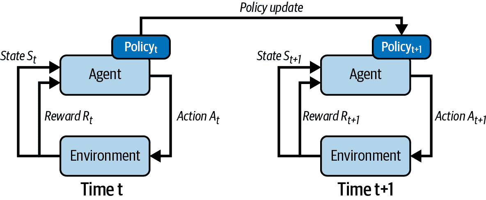

###### 图 3-13\. 强化学习策略更新。

###### 提示

在面试中，我经历了更多关于为什么奖励设定如此的后续问题和深入追问，例如，“为什么你选择将点击率作为正面奖励，而不是视频观看时间？”

## 总结 Q 学习

我将继续在状态、动作、奖励和策略的概念上进行建设，作为接下来章节的基础。强化学习代理通常希望在给定状态下选择动作后获得最高的奖励。然而，在奖励中缺乏进一步的细化时，这可能导致短视行为，正如您在代理仅*利用*而不*探索*时看到的那样。解决强化学习中的短视行为的一种方法是通过在奖励设计中增加更多复杂性来处理。因此，长期的*预期*奖励非常重要，它不仅包括即时动作的奖励，还包括将来可能对代理可用的奖励。

预期的总奖励是作为强化学习过程的一部分计算的，它是当前步骤下可用的未来奖励的期望值的加权和。我将以需要寻找迷宫出口的机器人为例进行说明，如图 3-14 所示：

+   在这个迷宫中，炸弹是坏的，而金钱/财富是好的。

+   出口位于迷宫的右上角，迷宫中间有一条死胡同，机器人在先前的探索中已经了解到。

+   如果机器人选择朝中间走，那么它去到死胡同的概率较高，去到出口的概率较低，这在未来奖励的期望值之和中得到了体现。

+   因此，在其他条件保持不变的情况下，朝右上方向的总预期奖励（又称为预期累积奖励）将高于朝中间方向的总预期奖励。当然，机器人需要已经探索过那些地方；在探索之前，它仍会计算预期奖励，但可能不太准确。

    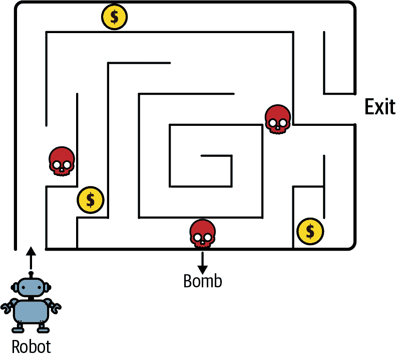

    ###### 图 3-14\. 强化学习示例：机器人在迷宫中导航。

现在让我们将预期的累积奖励概念与*Q 值*联系起来，这是在特定状态下采取行动的预期累积奖励。*Q 函数*是一个相关概念；它接受状态-动作对的输入并输出 Q 值。策略确定 RL 智能体应在给定状态下采取的行动。为了将所有内容联系起来，Q-learning 中的最优策略来自于在每个状态中选择具有最高 Q 值的动作。在每一步之后，评估策略并使用称为 Bellman 方程的优化方法更新 Q 值。⁴⁶ 重复此过程，直到策略收敛并在给定状态下选择相同的行动。

也可以使用 Q-learning 而不是策略迭代，而是使用更简单的ε-贪心策略，这在前面的部分中提到过。在策略不太可能收敛或学习代价高昂，或者状态和/或动作空间非常大的情况下，这种更简单的格式通常更为实际。

## 总结基于模型与无模型的强化学习

因为 Q-learning 不使用模型来尝试模拟世界——或者换句话说，*状态*和*动作*之间的关系，因此它是一种*无模型强化学习*技术。像 Q-learning 这样的无模型强化学习需要表示状态和动作，但之后只需观察奖励即可持续改进其 Q 值和策略（如果使用策略迭代）。

###### 提示

常见的无模型强化学习算法包括 Q-learning、SARSA（状态-动作-奖励-状态-动作）⁴⁷ 和 [近端策略优化（PPO）](https://oreil.ly/M-POc)⁴⁸。

在基于模型的强化学习中，智能体学习环境的模型，包括各种可能状态之间的关系，称为*状态转移*。智能体利用此模型在特定状态下做出最佳行动决策。因此，基于模型的强化学习需要对环境有明确的了解。例如动态规划和 [蒙特卡洛树搜索（MCTS）](https://oreil.ly/ZuF22)⁴⁹。

## 总结基于价值与基于策略的强化学习

*基于价值*的强化学习建立在估计处于某个状态并选择采取某个动作时的预期累积奖励（即“价值”）的基础上，例如在 Q-learning⁵⁰、SARSA⁵¹和深度 Q 网络（DQNs）中。这些算法的重点在于能够预测预期的累积奖励。

另一方面，*基于策略* 的强化学习学习策略，即代理程序在给定状态下选择行动的方法或模式。基于策略的强化学习具有可以使用梯度上升方法优化的参数化策略函数，因为它学习状态和行动之间的映射。使用梯度上升是因为基于策略的强化学习旨在最大化预期累积奖励，而梯度下降用于最小化错误。常见的基于策略的算法包括基于策略梯度的算法，如 REINFORCE 和演员-评论者方法（“演员”学习策略，“评论者”学习值）。您可以在图 3-15 中看到各种类型的强化学习的示意图。

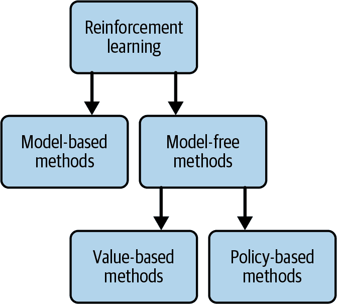

###### 图 3-15\. 强化学习方法概述；来源：[“Introduction to Reinforcement Learning” by J. Zico Kolter](https://oreil.ly/d0sua)。

## 总结基于策略与离策略强化学习

*基于策略* 的强化学习根据在遵循当前策略迭代时收集的数据点更新其策略。请注意，并非所有基于策略的强化学习必须是基于策略的。⁵² 假设一个 RL 算法使用当前策略（p1）执行一个动作（a1），并使用该动作的观察结果使用梯度上升更新该策略，记为（p2）：最新学习的策略。如果代理程序使用新策略（p2）继续下一个动作（a2），那么它被认为是基于策略的。策略迭代方法如 SARSA⁵³是基于策略的 RL。换句话说，如果代理的[行为策略是其目标策略](https://oreil.ly/Fgmck)⁵⁴（正在更新的策略），那么这就是基于策略的 RL。

*离策略* 的 RL 算法根据从不同策略或混合策略收集的数据点或经验更新其策略。这包括 Q-learning 和 DQNs。巧合的是，这些都是基于值的 RL 算法。为了避免混淆，将基于策略与离策略视为代理程序是否使用正在更新的最新策略，而基于策略与基于值则指的是用于推导最佳行为的算法类型。

还有许多其他算法可以探索，如时间差分（TD）、A3C（异步优势演员-评论者）和 PPO；如果您有兴趣了解更多，请查阅 Richard Sutton 和 Andrew Barto 的强化学习教科书，[在线免费提供](https://oreil.ly/MCgBK)，也包括本节开头的资源。

## 强化学习面试问题示例

现在您已经熟悉了强化学习的基础概念，让我们看一些例子面试问题。

### 面试问题 3-17：解释强化学习中的 DQN（深度 Q 网络）算法。

示例回答

DQN 是 Q-learning 的一个扩展；DQN 使用神经网络来逼近 Q 值，这些值表示在给定状态下采取行动后预期的未来奖励（与 Q-learning 的定义相同）。在 DQN 中，您有两个网络：目标网络和 Q 网络。目标网络负责预测从给定状态下所有可能采取的行动中的最佳 Q 值（目标 Q 值）。Q 网络采用当前状态和动作，并预测特定动作的 Q 值（预测的 Q 值）。为了改进 Q 网络，使用预测的 Q 值、目标 Q 值和观察到的奖励之间的差异作为 Q 网络的损失函数。

神经网络的权重是根据预测的 Q-learning 与通过经验获得的实际 Q 值之间的差异进行更新的。使用目标网络的原因是确保训练结果更稳定，因为在强化学习中，每一步都会更新 Q 网络，每个动作的方差可能非常大。经过足够的步骤后，目标网络使用 Q 网络的新权重进行更新，然后继续训练。

### 面试问题 3-18：作为跟进问题，您能解释一下 DQN 在常规 Q-learning 基础上添加的主要修改吗？

示例回答

DQN 主要的新进展之一是使用经验回放。经验回放是在 Q 网络和目标网络之前的一个组件，使用简单的 epsilon-greedy 方法在当前状态下在真实环境中采取行动并获得奖励。它将这些行动、状态和奖励保存为网络用作训练数据的经验。使用经验回放的原因是强化学习的顺序性质；网络的训练数据集应包含每个动作在前一个状态下导致的奖励和新状态的顺序。

### 面试问题 3-19：通过一个例子解释强化学习中的探索与利用。这两个概念的权衡是什么？您会如何平衡探索和利用？

示例回答

我将以一个简单的自动驾驶汽车的 RL 代理为例进行说明。在探索过程中，它首先发现在红灯处右转不会受到惩罚（按照北美的规则）。代理程序可能会继续利用这一知识，而不是尝试新的行为并学会在红灯前停下来，从而导致不良行为：永远不在红灯前停车。因此，鼓励探索同样重要，这样代理程序就可以尝试新的行为。随着代理程序对环境进行了更多次的探索，增加利用参数变得更安全，因为此时对代理程序表现良好并积累的经验来说更为重要。通过早期允许更多的探索，然后通过 epsilon-greedy 策略等技术减少探索并增加利用，我可以平衡探索和利用。

总之，为了平衡探索和利用，我将使用 epsilon-greedy 策略⁵⁵，以便 RL 代理可以更多地探索环境。随着代理程序与环境的互动和学习，epsilon 值会减少，使得代理程序开始增加利用。最终，一旦代理程序进行了足够的探索，它就可以利用过去见过的良好决策并减少探索。

### 面试问题 3-20：在以下情况下，您发现强化学习算法一直推荐将作为其销售价格的 10%错误标记的项目。这可能是什么原因，并假设数据都是正确的，您将调查什么？

例子回答

在我们的 RL 代理中有奖励函数的情况下，我将调查奖励/奖励函数，并查看是否在奖励 RL 代理的异常行为。例如，代理程序可能会利用方式来人为增加用户的点击率，例如推荐高度折扣的商品。在这种情况下，点击率的人为增加会给 RL 代理带来正面奖励。如果奖励函数考虑到了折扣在奖励中的成本，那么代理程序就不太可能只优化点击率而损失产品的利润。

### 面试问题 3-21：解释基于模型或无模型强化学习。各自的例子是什么？在何时选择其中一种？

例子回答

当环境模型难以估计或环境不断变化时，通常更倾向于无模型 RL。这是因为基于模型的算法试图构建准确的完整环境模型。这里“模型”包括从一个状态到另一个状态的转移概率。注意：这里使用“模型”一词并不意味着 RL 的其他组件不是 ML 模型。具体来说，“基于模型的”RL 指的是环境的模型，而不是在工作流中具有其他 ML 模型的独占性。

当您有一个合理的地面真实表示整个环境时，比如在 Atari 或象棋等游戏环境中，模型基 RL 更为可行。这些环境可以模拟多次，通常具有确定性结果，因此可以学习或构建描述环境及其状态转移概率的模型。在大多数实际情况下，完全描述环境是不可行的，尽管通过深度学习和描述环境的非常非常多的特征，比如自动驾驶汽车上的先进传感器，这可能是可能的。总的来说，在环境未知的情况下，无模型 RL 可以使用。

# 计算机视觉算法

*计算机视觉*是一个常见的 ML 应用程序，包括图像分类、图像识别等。例如，将计算机视觉应用于医学图像，如 X 光片，以分类患者是否患有某种疾病，或检查波形图像以分类特定声音。自动驾驶汽车代表了各种计算机视觉技术的复杂应用。

一些计算机视觉应用可以跨多个行业使用。例如，光学字符识别（OCR）可用于银行的在线支票存款系统中读取支票，检测社交媒体帖子中的标志，或者识别广告图像中的产品。⁵⁶ 无论行业如何，利用计算机视觉 ML 的 ML 从业者受益于领域知识，特别是在健康护理或自动驾驶等高影响应用中。

###### 提示

计算机视觉面试问题可能严重依赖领域知识，因此除了本书和技术知识的资源外，我鼓励您阅读与您目标领域特定的计算机视觉应用相关的内容。

本节涵盖了计算机视觉技术的基础，适合那些对这个领域的背景知识不确定的人。如果您已经在任何这些领域有专业知识，可以跳过子节。无论您的专业知识如何，我在提示框中强调了关于 ML 面试的具体建议，帮助您应用每个 ML 领域的知识并在面试中表现出色。

## 汇总常见图像数据集

由于它们的视觉性和相对易于理解的特性，图像数据集通常被用作深度学习的初学者教程。例如，我记得在 Coursera 上一个关于 CNN 的课程中使用了狗和猫的数据集，以及其他数十万名学习者。在图像上使用机器学习引起了机器学习爱好者的想象，并且在自学和项目组合方面非常流行。在研究中，许多相同的数据集推动了机器学习的重大进展。您可能还记得在 第一章 中我提到 ImageNet 数据集和挑战导致了深度学习模型准确率的发展和爆炸式增长，这是前所未有的。

这里是一些在计算机视觉中常用的公共数据集：

+   [ImageNet](https://oreil.ly/yQHl1/)

+   [CIFAR-100](https://oreil.ly/regHX)

+   [MNIST](https://oreil.ly/4Yf5C) 和相关数据集，如 [Fashion-MNIST](https://oreil.ly/OeMdK)

+   [COCO](https://oreil.ly/FsK3V) (上下文中的常见对象)

+   [LVIS](https://oreil.ly/2h6JQ)（注释的 COCO 数据集）

我鼓励您试试。如果这是您第一次尝试，您可以尝试以下 Colab 笔记本：

+   [图像分类——Colaboratory 教程（TensorFlow）](https://oreil.ly/XnUJz)

+   [计算机视觉的迁移学习教程（PyTorch）](https://oreil.ly/AgB50)

一旦您熟悉了基础知识，我鼓励您自己动手做一个项目。您可以在这里找到更多的图像数据集，甚至可以收集您自己的数据：

+   [机器学习数据集——图像分类](https://oreil.ly/b_uhg) 在 *[paperswithcode.com](https://oreil.ly/o6CZ_)* 上

+   [了解您的数据目录](https://oreil.ly/Z2YS4) by Google

+   [Kaggle](https://oreil.ly/Fy-9E) 数据集

###### 提示

许多在线教程都从简单的图像数据集开始，例如分类猫和狗，鸢尾花数据集，MNIST 等等。因此，它们应该用于学习目的，而不是用于组合作品。候选人只使用这些最常见的数据集（这不是夸张），我们面试官已经看过成千上万的申请人，这些项目很难突出。如果您正在构建一个组合项目，请尝试找到更独特的数据集。

## 总结卷积神经网络（CNN）

如前所述，计算机视觉任务的示例包括目标检测、人脸识别和医学分类。计算机视觉算法常用的数据是图像，并且通常使用 CNN 架构实现，如图 3-16 所示。CNN 在图像识别等任务中特别有效，因为它们可以接收图像编码的信息，图像以矩阵形式表示（输入特征图）。然后，输入通过网络中的各种卷积层“卷积”——这个过程从图像的矩阵表示中提取信息，并创建捕捉图像更细微信息的新特征。卷积还允许将图像中的信息压平和压缩，这对计算是有效的。

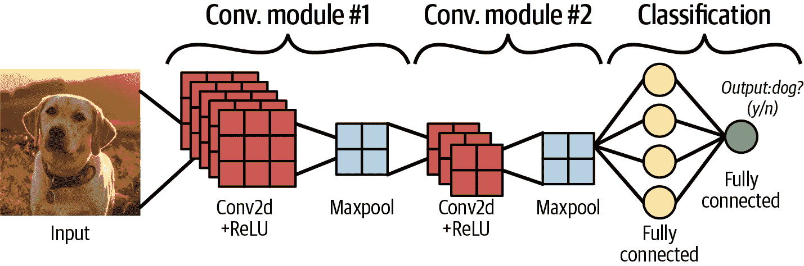

###### 图 3-16\. CNN 接收一张狗的图像，并以矩阵形式表示图像，然后两个卷积模块提取有用的特征，这些特征被馈送到最后的两个全连接层，预测图像是否是狗；基于来自[“ML 实习：图像分类”](https://oreil.ly/I3yeL)，Google 的一张图像。

## 总结转移学习

对于计算机视觉任务，你可以在网上找到许多预训练模型。这些预训练模型已经在通用任务（如图像分类任务）上进行了调整和优化。从头开始训练这些模型耗时且资源密集，因此在实践中，转移学习是一种常见的技术。

转移学习利用预训练模型，并修改最后的层次任务以专注于手头的较小任务。例如，预训练模型可能已经训练好了对一千种物品进行分类。在工作中，你只需对台式电脑和笔记本电脑进行库存跟踪任务的分类。你可以下载预训练模型，使用其架构和权重，除了最后的层次，然后只训练最后的层次，使其专门用于这两种物体。

结果是一个模型，它已经对图像分类有了一般的理解，以及你微调模型以执行的专门任务。这个过程被称为*转移学习*。

这里有一些教程：

+   [转移学习与微调（TensorFlow）](https://oreil.ly/qVisB)

+   [计算机视觉的转移学习（PyTorch）](https://oreil.ly/zO3Af)

###### 提示

在面试中，了解迁移学习是有帮助的。在许多情况下，识别预训练模型并在其基础上进行构建对于特定任务非常有用。在工业界，由于成本问题，很少会选择从头开始训练一个全新的神经网络。如果您只提到从头开始训练计算机视觉模型，这可能显示您还没有考虑或接触到足够的实际情况。

## 总结生成对抗网络

“Deepfakes”（通过深度学习生成的伪造图像）因创建政治家和名人的伪造图像而频登新闻头条。Deepfakes 是生成式 AI 结果已经变得非常逼真的一个例子。它们通常由称为*生成对抗网络*（GANs）的网络生成。

GANs 的架构⁵⁸侧重于两个模型：生成器和鉴别器。*生成器*学习和改进以生成良好的输出。*鉴别器*学习和改进以评估生成器创建的输出是真实还是伪造。

例如，训练生成拉布拉多犬图像的过程如下（参见图 3-17）：

+   训练开始。生成器在生成类似拉布拉多犬的对象方面表现不佳，而鉴别器在区分生成器创建的图像与真实拉布拉多犬图片方面表现不佳。

+   随着生成器的训练加深，它学会了创建看起来更像拉布拉多犬的图像。随着鉴别器的训练加深，它更能够区分生成器生成的伪造拉布拉多犬图像与真实图像的不同。生成器的目标是创建足够逼真的拉布拉多犬图像，以至于鉴别器会误以为它们来自真实世界中的真实拉布拉多犬图片。

+   最后，生成器在生成拉布拉多犬（或简称拉布拉多犬）的图像方面变得非常擅长，鉴别器无法再将它们与真实图像区分开来。

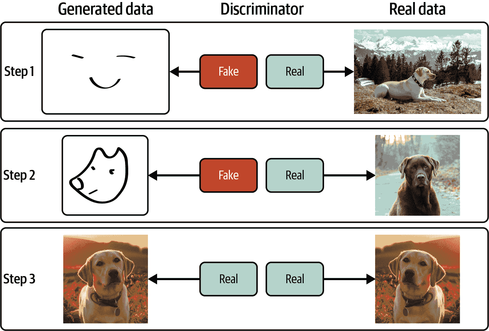

###### 图 3-17\. GAN 训练示例。请注意，GAN 可以生成足以欺骗鉴别器的训练数据集中没有的图像（在本示例中，我们只是简单地翻转了图像，但是真实的网络可以生成更与真实训练数据不同的图像）。

###### 注意

扩散模型现在常用于图像生成任务。我不会在本书中详细介绍，但如果您感兴趣，可以阅读原始论文⁵⁹。

## 总结额外的计算机视觉用例

除了分类和图像生成，计算机视觉还有许多其他用例，例如超分辨率、语义分割和物体检测。我将在这里介绍一些常见的行业用例，但正如之前提到的，我强烈建议您阅读与您正在面试的公司或行业相关的示例，以进一步提升面试回答。

### 超分辨率摘要

*超分辨率* 是将低分辨率图像转换成高分辨率版本的任务。这项任务也被称为*提升*。常见的用例包括提升历史图像、照片、电影等。在健康行业中，这项任务可以用于提高老旧医疗设备的分辨率，以便在难以升级设备的情况下做出更好的诊断。

GANs 和扩散模型通常用于这项任务。更多示例，请参考以下资源：

+   [“使用扩散模型生成高保真度图像”](https://oreil.ly/5b_5Y)，作者为 Jonathan Ho（Google Research Blog）。

+   [“SUPERVEGAN：用于感知提高低比特率流的超分辨率视频增强 GAN”](https://oreil.ly/nw0e2)，作者为 Silviu S. Andrei 等人（Amazon Science）。

### 目标检测摘要

*目标检测* 是用于识别和定位图像中物体的任务。它比图像分类更为先进，后者是对整个图像进行分类；*定位* 告诉我们感兴趣物体在图像中的位置。通过将目标检测应用于视频中的单个帧，可以进行物体跟踪，并跟随视频中的主体或物体位置，甚至跨多个摄像头角度。使用机器学习进行目标检测和物体跟踪可用于体育比赛中追踪球的运动轨迹，例如。

与目标检测相关的算法包括：

+   [YOLO](https://oreil.ly/2RAW5)（You Only Look Once）及其新版本，作者为 Chien-Yao Wang 等人。

+   [“Pix2Seq：用于目标检测的新语言接口”](https://oreil.ly/n14_h)，作者为 Google Research Blog 的 Ting Chen 和 David Fleet。

### 语义图像分割摘要

*语义图像分割* 是将语义标签（如“计算机”、“手机”、“人物”或“狗”）分配给图像中每个像素的任务。示例包括在图像中隔离类别，例如将前景中的人类与背景中的建筑物分离。智能手机相机的人像模式是一个常见的示例。了解更多关于语义分割应用的信息，例如 Google Pixel 手机相机的人像模式⁶⁰。

您可以通过这些资源了解更多信息：

+   [“使用 TensorFlow 中的 DeepLab 进行语义图像分割”](https://oreil.ly/qDr94)，作者为 Google Research Blog 的 Liang-Chieh Chen 和 Yukun Zhu。

+   [“目标检测与语义分割的比较”](https://oreil.ly/UmZhc)，出自 Valliappa Lakshmanan、Martin Görner 和 Ryan Gillard（O’Reilly）的《实用机器学习视觉》。

这里还有一些行业示例（请注意它们通常结合多种技术）：

+   Amazon 一直在实验和研究计算机视觉，以帮助顾客在线购物，例如通过描述现有产品的变化来帮助他们找到相关产品。⁶¹ 例如，顾客可能在搜索连衣裙时看到一款喜欢的款式。然而，该款式的颜色不是他们偏爱的。他们可以通过输入“我想找一个类似的，但把黑色改成粉色”来找到类似当前产品的连衣裙。

+   [Meta AI](https://oreil.ly/yf9xL)经常利用计算机视觉来提高其社交媒体平台上的自动化。例如，它已经改进了为视力障碍人士自动生成的图像描述，⁶² 提供了更好的 Facebook Marketplace 商品的自动分类、内容审核等功能。

+   Netflix 利用计算机视觉来实验和改进内容的缩略图，以及其他使用案例，利用其丰富的视频、音频和图像数据。⁶³

## 图像识别的样例面试问题

现在我已经概述了计算机视觉、常见数据集、算法和使用案例，这里有一些例子面试问题。

### 面试问题 3-22：图像识别任务中的一些常见预处理技术是什么？

样例回答

图像识别任务中常见的预处理技术包括数据归一化、数据增强和图像标准化。数据归一化将图像中像素的数值表示转换为预定义的范围，例如(0, 1)或(-1, 1)。这样，应用于不同层的算法可以遵循相同的数值范围。数据增强有助于减少在训练数据集上的过拟合。例如，如果训练数据偶然只包含向右转的猫，那么卷积神经网络可能不会学习到向左转的猫也是猫。通过使用翻转、旋转、裁剪等多种数据增强技术，我们可以向数据集中添加更多相同对象的表示，并帮助卷积神经网络学习泛化物体检测。图像标准化使数据集更易于处理，通过确保图像具有接近的高度和宽度来实现。在此预处理步骤中，图像被调整大小，使它们在某一范围内具有相似的宽度和高度。

### 面试问题 3-23：在图像识别任务中，你如何处理类别不平衡？

样例回答

处理图像识别任务中的类别不平衡有几种方法。在这里，“类别”指的是一个类别或标签；例如，一幅图像可能包含“猫”或“狗”。处理类别不平衡的一种方法是合并非常相似的类别，比如“橙子”和“柑橘”。当然，我们必须确定合并标签的权衡。如果图像识别模型负责标记柑橘水果，那么我们应该尝试另一种方法或合并其他类型的标签。

第二个选项是重新采样，它生成合成数据或复制少数类别的数据点。在 TensorFlow 和 PyTorch 中有内置工具可以为图像识别任务执行此操作。处理类别不平衡的另一种方法是调整 CNN 的损失函数，使得对少数或稀有类别的错误赋予更高的权重，而不是常见类别和标签的错误。这有助于避免由于类别不平衡导致在稀有类别上的欠拟合。

### 面试问题 3-24：如何处理图像识别任务中的过拟合？

示例答案

在 CNN 中添加一个 dropout 层（一种正则化类型）将随机将神经元的激活设置为 0；这可以防止层次过度利用某些特征。另一种方法是早停止，即在 CNN 无法显著减少损失时停止训练（CNN 旨在最小化损失）。减少层次复杂性也可以减少过拟合，因为当 CNN 层次太复杂时，它可能在图像中找到更多无意义的模式。例如，许多歌手的图像都涉及站在舞台上并拿着麦克风，模型可能会学到图像中麦克风的存在意味着歌手的存在。处理图像识别中过拟合的另一种技术是数据增强，这可以帮助在训练数据集中增加更多多样性，减少过拟合。

### 面试问题 3-25：如何改进和优化用于图像识别的 CNN 架构？

示例答案

如果现有网络表现不佳，例如，出现欠拟合且无法良好分类对象的情况，我可能考虑增加更多特定类型的层次，例如添加卷积层或重新排列各种层次的顺序。这也是研究人员优化各种算法架构的方式，例如在 ResNet 上创建层次变化。

# 总结

恭喜你已经通过了一些复杂的话题！首先，你浏览了一个总结常见的统计技术，包括机器学习中的常见技术，如正则化，以及过拟合和欠拟合等主题。我们详细介绍了监督学习，无监督学习和强化学习。然后，你深入研究了各种核心机器学习领域：自然语言处理，推荐系统，强化学习和计算机视觉。

本章中，您将得到一些示例面试问题以及每个主题的资源，当您准备时可以参考。

现在您已经了解了技术面试中机器学习算法部分的概述，让我们来看看 ML 模型的训练过程和模型评估。

¹ 根据工作在机器学习生命周期中的责任类型，可能会跳过这部分内容，例如“应用机器学习工程师”或“软件工程师，机器学习”等职位，特别是在 Google。如有疑问，请与您的招聘者或招聘经理确认！

² Jason Brownlee，《机器学习掌握》博客，“算法与模型在机器学习中的区别”，2020 年 8 月 19 日，[*https://oreil.ly/TrduX*](https://oreil.ly/TrduX)。

³ 详细信息请参阅“监督学习、无监督学习和强化学习”。

⁴ “交叉验证：评估估算器的性能”，在*Scikit-learn：Python 中的机器学习用户指南*中，2023 年 10 月 24 日访问，[*https://oreil.ly/Spja4*](https://oreil.ly/Spja4)。

⁵ “什么是欠拟合？”IBM，2023 年 10 月 21 日访问，[*https://oreil.ly/SSihF*](https://oreil.ly/SSihF)。

⁶ Sekai Ichi 苹果每个可以售价$20 至$25（来源：[Silver Creek Nursery](https://oreil.ly/U_54R)）。

⁷ “什么是过拟合？”IBM，2023 年 10 月 21 日访问，[*https://oreil.ly/p9V_u*](https://oreil.ly/p9V_u)。

⁸ “Lasso 和 Elastic Net”，MathWorks，2023 年 10 月 21 日访问，[*https://oreil.ly/yOCEe*](https://oreil.ly/yOCEe)。

⁹ “不平衡数据”，Machine Learning，Google for Developers，2023 年 10 月 21 日访问，[*https://oreil.ly/sKP4h*](https://oreil.ly/sKP4h)。

¹⁰ Nitesh V. Chawla, Kevin W. Bowyer, Lawrence O. Hall, and W. Philip Kegelmeyer，《人工智能研究杂志》第 16 卷（2002 年）：321–57，[doi:10.1613/jair.953](https://www.jair.org/index.php/jair/article/view/10302)。

¹¹ Chip Huyen，《设计机器学习系统》第四章“训练数据”（O’Reilly），[*https://oreil.ly/bsqEg*](https://oreil.ly/bsqEg)。

¹² Chip Huyen，《设计机器学习系统》第六章“模型开发与离线评估”。

¹³ “什么是过拟合？”IBM，2023 年 10 月 21 日访问，[*https://oreil.ly/p9V_u*](https://oreil.ly/p9V_u)。

¹⁴ 作为提醒，此苹果数据集的标签是过去苹果价格，换句话说，过去的“正确”或预期结果，以便我们检查训练模型的准确性。

¹⁵ 参见 Randall Balestriero 等人, *自监督学习菜谱*, June 28, 2023, [*https://oreil.ly/M20OU*](https://oreil.ly/M20OU), 以及附带的博客文章 “自监督学习菜谱,” *Meta AI* (blog), April 25, 2023, [*https://oreil.ly/XT6wX*](https://oreil.ly/XT6wX).

¹⁶ 欲了解更多，请参阅 Andrew Zisserman, “自监督学习” (presentation, Google DeepMind), [*https://oreil.ly/wGQ98*](https://oreil.ly/wGQ98).

¹⁷ Jake VanderPlas, [*Python 数据科学手册*](https://oreil.ly/kyA6E) (O’Reilly, 2016).

¹⁸ “贝叶斯定理直观（及简短）解释,” Better Explained, accessed October 23, 2023, [*https://oreil.ly/I7ika*](https://oreil.ly/I7ika).

¹⁹ “贝叶斯神经网络,” 机器学习词汇表, accessed October 23, 2023, [*https://oreil.ly/BotI7*](https://oreil.ly/BotI7).

²⁰ Andrew Zisserman, “自监督学习” (presentation, Google DeepMind), [*https://oreil.ly/o32MY*](https://oreil.ly/o32MY).

²¹ ML 模型评估在第四章中有更详细的涵盖。

²² Alex Krizhevsky, “CIFAR-10 数据集,” Canadian Institute for Advanced Research, accessed October 23, 2023, [*https://oreil.ly/x1g7o*](https://oreil.ly/x1g7o).

²³ “文本语料库,” Wikipedia, updated September 17, 2023, [*https://oreil.ly/v2IbE*](https://oreil.ly/v2IbE).

²⁴ Christopher D. Manning, Prabhakar Raghavan, and Hinrich Schütze, “Tokenization,” in *信息检索导论* (Cambridge University Press, 2022), [*https://oreil.ly/0opkO*](https://oreil.ly/0opkO).

²⁵ Yonghui Wu, “智能撰写: 使用神经网络帮助撰写电子邮件,” *Google Research* (blog), May 16, 2018, [*https://oreil.ly/gqnBt*](https://oreil.ly/gqnBt).

²⁶ Ashish Vaswani 等人, “注意力机制就是你所需的一切” (paper presented at the meeting of the Advances in Neural Information Processing Systems, 2017), [*https://arxiv.org/abs/1706.03762*](https://oreil.ly/0V-UR).

²⁷ Rick Merritt, “转换器模型是什么?” *Nvidia* (blog), March 25, 2022, [*https://oreil.ly/As2W6*](https://oreil.ly/As2W6).

²⁸ Pandu Nayak, “比以往更好地理解搜索,” *The Keyword* (blog), Google, October 25, 2019, [*https://oreil.ly/xONdR*](https://oreil.ly/xONdR).

²⁹ 参见 “预训练模型,” BERT, on GitHub, [*https://oreil.ly/XkaY2*](https://oreil.ly/XkaY2).

³⁰ “使用内置 BERT 算法入门”，AI Platform 培训：文档，Google Cloud，更新于 2023 年 10 月 20 日，[*https://oreil.ly/HeJax*](https://oreil.ly/HeJax)。

³¹ 参见 Hugging Face 上的“BERT 多语言基础模型（带大小写区分）”，[*https://oreil.ly/tyO6D*](https://oreil.ly/tyO6D)。

³² 我在撰写本章草稿后，GPT-4 问世了，所以我不得不添加它！当这本书到达你手中时，我想知道还会发布什么新内容。

³³ “生成式预训练变压器”，维基百科，更新于 2023 年 10 月 23 日，[*https://oreil.ly/Emp_M*](https://oreil.ly/Emp_M)。

³⁴ “微调”，OpenAI 文档，访问日期为 2023 年 10 月 23 日，[*https://oreil.ly/B19eG*](https://oreil.ly/B19eG)。

³⁵ 这个领域发展迅速；当这本书出版时，我不知道这些模型是否已经被淘汰。

³⁶ “Word2vec”，维基百科，更新于 2023 年 9 月 5 日，[*https://oreil.ly/JyqBW*](https://oreil.ly/JyqBW)。

³⁷ Jeffrey Pennington，Richard Socher 和 Christopher D. Manning，“GloVe：全局词向量表示”，斯坦福大学，2014 年 8 月，[*https://oreil.ly/LdCcH*](https://oreil.ly/LdCcH)。

³⁸ Christopher D. Manning，Prabhakar Raghavan 和 Hinrich Schütze，《信息检索导论》（剑桥大学出版社，2008 年），[*https://oreil.ly/JsXCj*](https://oreil.ly/JsXCj)。

³⁹ Weidinger 等人，《语言模型的道德和社会风险》（Google DeepMind，2021 年 12 月 8 日），[*https://oreil.ly/-ZFL7*](https://oreil.ly/-ZFL7)。

⁴⁰ 对于那些好奇的人，奇异值分解（SVD）的时间复杂度，对于一个*m* x *n*的矩阵，其中*m* > *n*：*O*(*m*² × *n* + *n*³)。实际上，这可能取决于实现，正如这个[MathWorks 讨论](https://oreil.ly/GFa4z)所提到的。

⁴¹ 有时，这个问题在 RecSys 中被称为[“长尾”问题](https://oreil.ly/Zd1Yp)。

⁴² Rishabh Mehrotra，“个性化可解释推荐与多目标上下文赌博”（MLconf 的视频演示，YouTube，2019 年 3 月 29 日），[*https://oreil.ly/v587X*](https://oreil.ly/v587X)；Brent Rabowsky 和 Liam Morrison，“推荐系统的新动向”，AWS for M&E（博客），Amazon Web Services，[*https://oreil.ly/Z0Qq2*](https://oreil.ly/Z0Qq2)。

⁴³ 我曾与育碧的一位团队成员交谈过，他们训练了 RL 代理以帮助优化和测试他们的游戏。[这里有更多来自育碧的例子](https://oreil.ly/1RP1h)。

⁴⁴ Chip Huyen，“RLHF: 人类反馈的强化学习”（博客），2023 年 5 月 2 日，[*https://oreil.ly/xE7tR*](https://oreil.ly/xE7tR)。

⁴⁵ “ε贪婪策略”，机器学习词汇表：强化学习，访问于 2023 年 10 月 23 日，[*https://oreil.ly/ZYbkN*](https://oreil.ly/ZYbkN)。

⁴⁶ “贝尔曼方程”，机器学习词汇表：强化学习，访问于 2023 年 10 月 23 日，[*https://oreil.ly/KP8kh*](https://oreil.ly/KP8kh)。

⁴⁷ “SARSA 代理”，MathWorks，访问于 2023 年 10 月 23 日，[*https://oreil.ly/KP8kh*](https://oreil.ly/KP8kh)。

⁴⁸ 孙月文、袁欣、刘文章和辛长银，“基于模型的强化学习：近端策略优化”，*2019 年中国自动化大会 (CAC)*，2019 年，pp. 4736–40，[doi:10.1109/CAC48633.2019.8996875](https://oreil.ly/M-POc)。

⁴⁹ Michael Janner，“基于模型的强化学习：理论与实践”，*伯克利人工智能研究*，2019 年 12 月 12 日，[*https://oreil.ly/ZuF22*](https://oreil.ly/ZuF22)。

⁵⁰ J. Zico Kolter，“强化学习简介”（演示，第 28 届国际自动规划与调度会议，荷兰代尔夫特，2018 年 6 月 24–29 日），[*https://oreil.ly/b_5nO*](https://oreil.ly/b_5nO)。

⁵¹ “SARSA 代理”，MathWorks，访问于 2023 年 10 月 2 日，[*https://oreil.ly/iZOG3*](https://oreil.ly/iZOG3)。

⁵² 王廷武，“通过学习 REINFORCE 学习强化学习”（演示，多伦多大学机器学习组），[*https://oreil.ly/Fgmck*](https://oreil.ly/Fgmck)。

⁵³ David L. Poole 和 Alan K. Mackworth，“关于策略学习”，《人工智能》第 2 版（剑桥大学出版社，2017 年），[*https://oreil.ly/KmgMu*](https://oreil.ly/KmgMu)。

⁵⁴ 王廷武，“通过学习 REINFORCE 学习强化学习”（演示，多伦多大学机器学习组），[*https://oreil.ly/Fgmck*](https://oreil.ly/Fgmck)。

⁵⁵ “ε贪婪策略”，机器学习词汇表：强化学习，访问于 2023 年 10 月 23 日，[*https://oreil.ly/jHrup*](https://oreil.ly/jHrup)。

⁵⁶ “什么是 OCR（光学字符识别）？”亚马逊网络服务，访问于 2023 年 10 月 24 日，[*https://oreil.ly/0ms_Z*](https://oreil.ly/0ms_Z)。

⁵⁷ 除非你有一些真正有创意的转折，但即便如此，使用一个不那么陈词滥调的数据集可能会有更好的投资回报。

⁵⁸ “GAN 结构概述”，机器学习，Google 开发者，2022 年 7 月 18 日，[*https://oreil.ly/EfpSR*](https://oreil.ly/EfpSR)。

⁵⁹ Jascha Sohl-Dickstein 等，“利用非平衡热力学进行深度无监督学习”（2015），[*https://oreil.ly/0Zp8Q*](https://oreil.ly/0Zp8Q)。

⁶⁰ Marc Levoy 和 Yael Pritch，“Pixel 2 和 Pixel 2 XL 智能手机上的肖像模式”，*Google Research*（博客），2017 年 10 月 17 日，[*https://oreil.ly/VdtgX*](https://oreil.ly/VdtgX)。

⁶¹ Larry Hardesty，“计算机视觉如何帮助亚马逊顾客在线购物”，*Amazon Science*（博客），2020 年 6 月 5 日，[*https://oreil.ly/xGyam*](https://oreil.ly/xGyam)。

⁶² “Facebook 如何利用 AI 改善盲人或视觉障碍人士的照片描述”，*AI at Meta*（博客），2021 年 1 月 19 日，[*https://oreil.ly/_3YYj*](https://oreil.ly/_3YYj)。

⁶³ “Ava: 在 Netflix 上的图像发现的艺术与科学”，*Netflix Technology Blog*，Medium，2018 年 2 月 7 日，[*https://oreil.ly/3S9NZ*](https://oreil.ly/3S9NZ)。

[*OceanofPDF.com*](https://oceanofpdf.com)
