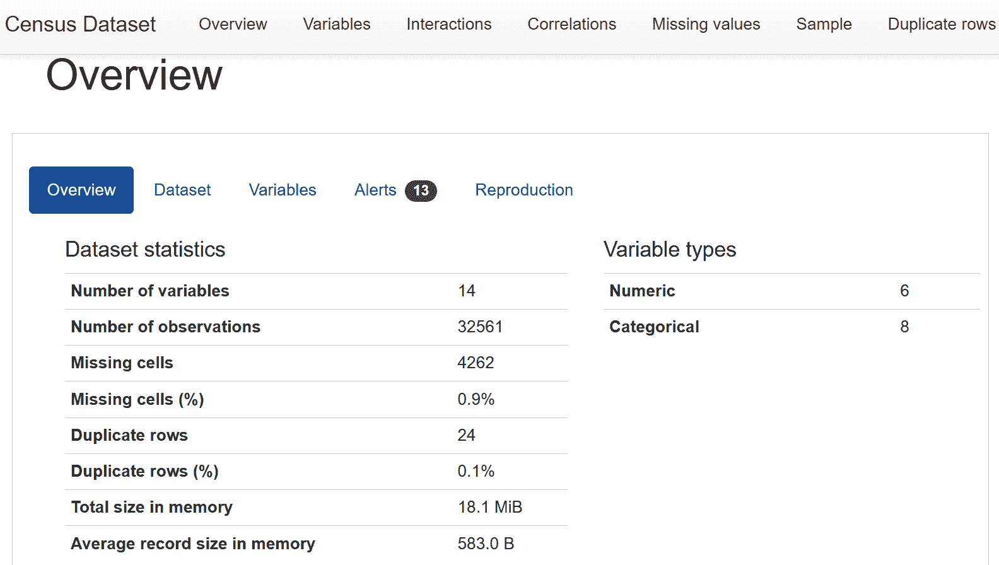
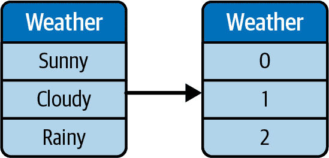
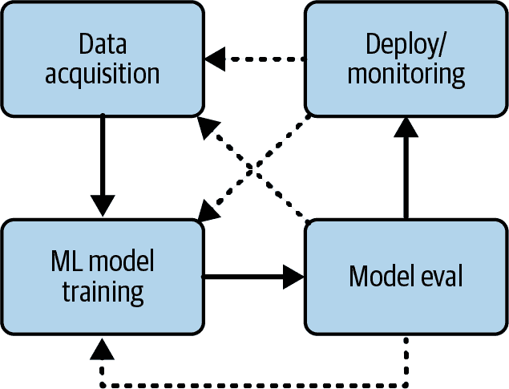
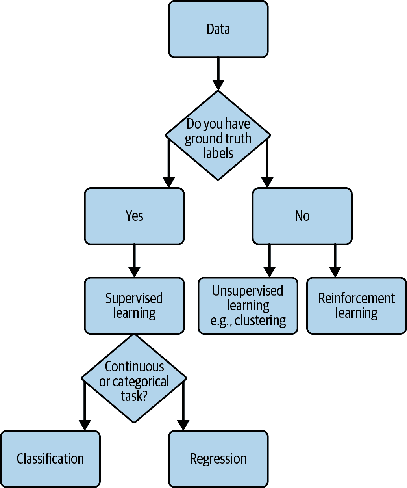
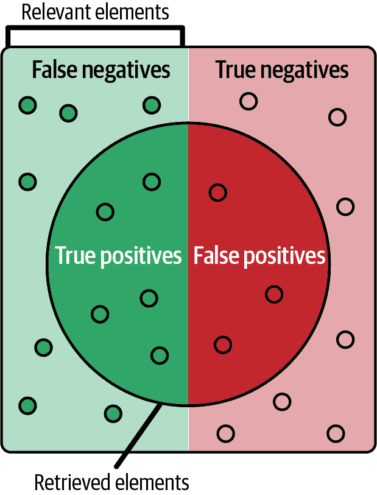
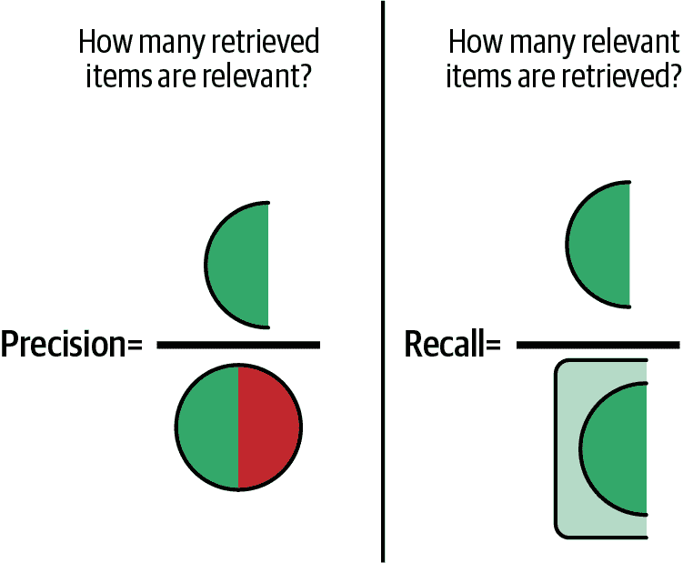
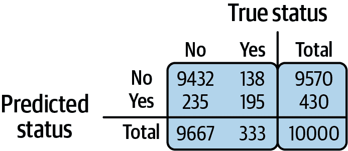

# 第四章：技术面试：模型训练和评估

在本章中，我们将涵盖机器学习模型训练过程及相关面试问题。对许多实践者来说，模型训练是最令人兴奋的部分，我也同意——在整个过程中看到模型变得越来越准确确实令人满足。然而，要开始机器学习模型训练、超参数调整并运行各种算法实验，您需要拥有数据。机器学习的核心是让算法在数据中找到模式，然后根据这些模式进行预测和决策。拥有有用的数据是机器学习的基础，正如行业格言所说：“垃圾进，垃圾出”。也就是说，如果机器学习模型训练在无用数据上，那么产生的模型和推断也将无用。

我将从数据处理和清洗的概述开始，这将把原始数据转换为对机器学习算法有用和兼容的格式。接下来，我将介绍算法选择，例如在不同场景下各种机器学习算法之间的权衡，以及如何一般性地选择最适合给定问题的算法。

之后，我将涵盖模型训练和优化模型性能的过程。这可能是一个模糊而具有挑战性的过程，您将学习到一些最佳实践，如超参数调整和实验跟踪，这可以避免丢失最佳结果，并确保这些结果可以复现。在这一点上，我还将讨论如何判断一个机器学习算法在实际中是否*优秀*。这涉及模型评估以及与一些基准模型或基准启发式方法进行比较。模型评估还可以帮助您确定模型在新的、未见过的数据上的效果，并发现模型可能在现实世界中过拟合、欠拟合或表现不佳。

###### 注意

我尽量提及尽可能多的常见机器学习面试技巧，但阳光下还有更多。务必查看链接的资源，以扩展您的学习和面试准备！

在本章中，我将提供实用的技巧和示例，帮助您在机器学习面试中取得成功。到本章结束时，您应该对数据清洗、预处理、模型训练和评估过程有扎实的理解，并能够在自己的面试中进行深入讨论。

# 定义机器学习问题

在本节中，我将概述定义机器学习问题的高层次概述，包括为什么以及如何在面试问题中展示这一点。

考虑以下场景：你，作为应聘者，正在走你建立的一个机器学习项目。目标是预测用户是否会点击特定歌手音乐会的促销邮件。[¹] 在你概述完后，面试官思考了几秒钟，然后说道：“听起来你可以利用用户听歌手 A 的时间来决定谁会收到该歌手音乐会的促销邮件。例如，如果他们每周听歌手 A 超过五个小时，那么如果该歌手在听众所在地区有音乐会，就发送邮件。考虑到有一些简单的方法，它们不使用机器学习也能达到与你的模型相同的效果，*为什么选择了机器学习*？”

你陷入了冻结状态，因为你没有考虑到这个问题。当时，这似乎是一个有趣的自主项目，你只是想学习一下。你不能完全理解面试官用这个问题探讨什么。你该怎么办？

在此之前了解如何回答这些问题很重要。以下是一些可能的角度：

+   你有考虑过首先使用基于启发式（即基于规则的）基线吗？在适用的情况下，你还可以使用尽可能简单的模型，比如逻辑回归模型，作为一个基线。然后，你的机器学习模型的目标将是比基线表现更好。

+   在现实世界中，新的机器学习项目往往不会启动或批准，除非有明确的商业价值来证明工程时间和精力的投入是值得的。例如，如果实施一个从头开始推荐音乐会的机器学习系统的成本不足以抵消预期的收益，那么使用启发式方法会更容易。预计的节约复杂性、手动工作或时间也是选择机器学习而不是启发式方法的原因之一。

但不要担心——面试官并不是在贬低你的项目，而是在问：“为什么选择了机器学习？”这在专业的机器学习领域非常常见。问“为什么选择了机器学习？”*并不*意味着“你真的不应该使用机器学习。”这只是开始讨论的一部分，专业的机器学习人员在日常生活中经常遇到这种情况。你如何回应这个问题，特别是对于新毕业生来说，可以很好地表明你是否能顺利过渡到在工业界从事机器学习工作。

在这种情况下，你可以这样回答：

+   坦诚地回答：“老实说，我只是想通过一个副业项目学习一些新的建模技术，因为我是 Spotify 的重度用户，我想看看如何用机器学习模拟它的邮件功能。”

+   如果你在谈论一个工作项目：“事实上，我发现启发式方法确实有效，但仅适用于最普通的用户。例如，重度用户需要更长的听歌时间来确定他们喜欢的艺术家。此外，一旦我们在启发式方法中包含了其他数据，比如*喜欢*和*添加到播放列表*，我们注意到对促销电子邮件的反应更高。因此，启发式方法变得过于复杂和难以扩展。这就是为什么我们开始使用 ML，因此它可以在更多特征中找到模式。”

###### Tip

诚实是好的。作为一名新毕业生，我曾经在一次副业项目展示中开头说：“这是一个用于 Ariana Grande 图像的分类器。我只是想做这个项目来娱乐，没有真正的原因必须选择 Ariana Grande。这里是我是如何做的…” 但我仍然成功地被面试官认真对待，因为我解释这个项目是使用卷积神经网络的机会。

如果你正在做自己的副业项目，并期望用它来回答面试问题，考虑哪些启发式方法可以达到你想要的目标。稍后，你可以将它们用作简单的基准线，看看 ML 方法是否更好。这将帮助你脱颖而出。我稍后会讨论模型选择和模型评估。

# 数据预处理和特征工程

在本节中，我将总结常见的数据预处理和特征工程技术和场景，以及涵盖 ML 生命周期中这一步的常见 ML 面试问题。为简单起见，我假设 ML 面试问题的数据是可用的，即使这在现实场景中是一个常见的挑战。我将从数据采集的介绍开始，² 探索性数据分析（EDA）和特征工程。

###### Tip

所有数据和 ML 角色都将使用数据预处理和 EDA。本章的一些技术特别适用于 ML，但对数据分析师或数据工程师也同样有用。

## 数据采集入门

获得数据，在 ML 的背景下通常称为*数据采集*，可以涉及以下选项：

+   工作访问，通常是专有数据

+   公共数据集，例如来自 Kaggle，[人口普查局](https://oreil.ly/_BFu5)等

+   网络爬虫（注意某些网站的条款和条件）

+   学术访问，比如参与你大学的研究实验室

+   从供应商购买数据：

    +   有些供应商还可以帮助注释和标记数据，例如[Figure Eight](https://oreil.ly/LAH7w)和[Scale AI](https://scale.com)。

    +   你的工作场所或学术机构通常会帮助支付成本，因为这些价格通常对个人副业项目来说太高了。

+   通过模拟创建合成数据

+   创建你自己的原始数据，比如拍摄自己的照片，众包数据或使用你自己创建的艺术/设计

## 探索性数据分析入门

现在你已经获取了数据，是时候开始分析了。你在进行探索性数据分析（EDA）时的主要目标是查看数据是否足够作为起点，或者你是否需要更多数据。因此，你需要对数据的分布进行高级概述，并找出任何缺陷和怪异之处。缺陷和怪异可能包括过多的缺失值、数据分布倾斜或重复值。EDA 还涵盖每个特征的一般特征，查看均值、分布等。如果发现缺陷，你可以在数据清洗和特征工程过程中稍后解决这些问题；而在进行 EDA 时，重要的是*意识到*潜在问题。

###### 小贴士

对于机器学习和数据从业者来说，拥有*一些*领域知识非常重要。在我关于视频游戏定价的个人项目中，作为一名狂热的游戏玩家，我对行业动态和客户行为非常了解。在工作中，我需要学习每个领域，以构建有用的机器学习模型；例如，电信客户的行为与金融科技客户不同。

我的常规做法是运行 [ydata-profiling](https://oreil.ly/S3XXt)，之前称为 pandas-profiling，并从生成的报告开始深入分析（示例报告见图 4-1）。请注意，这只是一个起点，使用领域知识来发现模式或异常将非常重要。对一些行业和模型来说可能是问题的东西，在其他行业中可能是预期的。例如，在 RecSys 问题中，数据稀疏性比在时间序列数据集中更常见。仅仅查看生成的统计数据是不够的。此外，一些领域可能有算法来处理该领域的常见问题，因此这些问题可能不会引起太大关注。

###### 图 4-1\. ydata-profiling 屏幕截图；来源：[ydata-profiling 文档](https://oreil.ly/jOE08)。

关于 EDA 的更多细节超出了本书的范围，但我建议阅读 [*Making Sense of Data*](https://oreil.ly/zFoDd)，作者是 Glenn J. Myatt 和 Wayne P. Johnson（Wiley），以获取更多信息。

经过一些迭代，假设你已完成了探索性数据分析（EDA），来到一个决策点：数据现在似乎足够可靠（暂时可以继续），或者你可能需要先获取更多数据或另一个数据集；反复进行。

###### 小贴士

当面试官询问你在解决机器学习问题时从何处开始时，他们希望听到你在获取某些数据源后的早期阶段提到探索性数据分析（EDA）。展示你能够批判性地查看数据甚至发现缺陷是非常重要的，而不仅仅是使用预先清理过的数据集。

## 特征工程介绍

在探索数据后，迭代直到找到模型训练的良好起点，现在是进行特征工程的时候了。在机器学习中，特征指的是 ML 模型的输入。目标是修改数据集，以确保与 ML 模型兼容，同时处理数据中观察到的任何缺陷或不完整性，如缺失值。我在这里讨论的主题包括处理缺失数据、处理重复数据、标准化数据和数据预处理。

###### 注意

一些技术与通常称为“数据清洗”的内容重叠，这可能比特征工程更频繁发生，但在此介绍是很有用的。

### 使用插补处理缺失数据

处理缺失数据的常见插补技术应该能够在面试中提到，并分析其优缺点。这些包括用均值或中位数填充以及使用基于树的模型。

表格 4-1 列出了在填补缺失值时需注意的一些事项。

表格 4-1\. 常见插补技术的优缺点

| 技术 | 优点 | 缺点 |
| --- | --- | --- |
| 均值/中位数/众数 | 实现简单 | 与基于树的方法相比可能无法考虑异常值，对分类变量不太适合 |
| 基于树的模型 | 可捕获更多潜在模式 | 适用于数值和分类变量 添加了数据预处理的复杂度 如果数据的基础分布发生变化，需要重新训练模型 |

### 处理重复数据

几乎有无数种观察结果会被意外复制的方式，所以这是在进行探索性数据分析时需要发现的问题之一：

+   数据摄取作业可能因错误而运行两次。

+   在进行一些复杂的连接操作时，有些行可能会无意中重复，然后没有发现。

+   一些边缘情况可能导致数据源提供重复数据。

… 等等。

如果遇到重复数据，可以使用 SQL 或 Python 对数据进行去重，并确保记录以更便于您后续访问和使用的格式表示。

### 标准化数据

处理缺失和重复数据后，数据应该进行标准化。这包括处理异常值、缩放特征，确保数据类型和格式一致：

处理异常值

处理异常值的技术包括从数据集中删除极端异常值，用较不极端的值替换它们（称为*Winsorizing*），以及对数尺度转换。我建议不要轻易删除异常值，因为这取决于领域知识；在某些领域，后果可能更严重。例如，从自动驾驶汽车训练数据集中删除马车图像数据，仅因为它们不是常见类型的车辆，可能导致模型在现实世界中无法识别马车。因此，在决定具体技术之前，务必仔细评估其影响。

缩放特征

对于具有多个数值特征的数据集，较大的值可能会被 ML 算法误解为具有更大的影响。例如，一个列是价格，范围从$50 到$5,000，而另一个特征是广告显示时间，范围从 0 到 10 次。这两个特征使用不同的单位，但都是数值的，因此价格列可能被表示为具有更高数量级的影响。一些模型，如基于梯度下降的模型，对特征的规模更为敏感。因此，最好将特征缩放到[-1, 1]或[0, 1]的范围内。

###### 警告

缩放特征时要小心。结合不同的技术或使用探索性数据分析（EDA）中发现的信息是有用的。例如，一个特征可能有极端的异常值，如大多数值在[0, 100]范围内，但有一个观测值为 1000。如果不检查，您可能会基于最小值 0 和最大值 1000 来缩放特征值。这可能会导致特征中包含的信息被压缩。

数据类型一致性

我曾经在处理一个 ML 模型时得到了意外的结果，花了一些时间调试。最后，我找到了问题所在：一个数值列被格式化为字符串！在继续流程之前，检查最终数据类型以确保它们在输入 ML 模型时是有意义的，这将对质量保证（QA）很有帮助。

###### 提示

面试官可能会询问您如何处理异常值、特征规模或数据类型一致性的后续问题，因此请确保了解每种方法的原理和权衡。

### 数据预处理

在使用的算法类型的背景下，预处理数据将使特征对 ML 模型有意义。结构化数据的预处理可以包括独热编码、标签编码、分箱、特征选择等。

###### 提示

*非结构化数据*是“未按预设数据模型或架构排列的信息，因此无法存储在传统的关系数据库或关系数据库管理系统（RDBMS）中。文本和多媒体是两种常见的非结构化内容类型。”³ 当遇到非结构化数据时，预处理可能会有所不同（甚至可能将数据转换为结构化）。出于说明目的，本章节专注于预处理结构化数据的示例。

#### 分类数据的独热编码

您可能希望将分类数据表示为数值数据。每个类别成为一个特征，每个观测中的状态由 0 或 1 表示。例如，想象一个简单的天气数据集，只可能有晴天或多云的天气。您将得到以下结果：

3 月 1 日

+   天气：晴天

+   温度（摄氏度）：27

3 月 2 日

+   天气：晴天

+   温度（摄氏度）：25

3 月 3 日

+   天气：多云

+   温度（摄氏度）：20

但是，“天气”特征可以进行独热编码，使其拥有所有可能的天气状态的特征：

3 月 1 日

+   晴天：1

+   多云：0

3 月 2 日

+   晴天：1

+   多云：0

3 月 3 日

+   晴天：0

+   多云：1

独热编码通常被使用，因为数字对机器学习算法更容易理解；某些算法不接受分类值，但这在多年来有所改进，一些实现可以在幕后考虑分类值并进行转换。

一位缺点是独热编码对于原本具有高基数的特征（该特征中有许多唯一值）可能导致特征数量急剧增加，这可能在计算上更昂贵。

###### 提示

有时候，缺乏领域知识或对业务逻辑的理解可能会在数据预处理中引起问题。例如，将退订用户定义为在过去七天内取消产品的用户，但实际上产品或业务逻辑将退订用户定义为在过去 60 天内离开的用户。（如果由于某种原因，业务逻辑不适合机器学习，我们可以讨论一个折中方案。）

#### 标签编码

标签编码将类别映射到数字，但保持在同一个特征中。例如，天气类型可以映射到唯一数字，如图 4-2 所示。

###### 图 4-2\. 标签编码示例。

标签编码的一个缺点是一些机器学习算法可能会混淆比例和值，将它们视为影响的更高级别。举个例子，天气可以进行标签编码：晴天变为 0，多云变为 1。但对于机器学习来说，这可能会导致将多云误认为比较重要，因为 1 比 0 大。

幸运的是，在许多机器学习算法中，您可以使用内置类（例如 scikit-learn 的[`LabelEncoder`](https://oreil.ly/Wm_7r)类），使算法在幕后知道这只是一种分类，而不一定是大小的指示。

###### 小贴士

当然，如果您忘记让算法知道标签编码的特征实际上是标签编码，那么机器学习算法可能会像处理普通数值特征一样处理该特征。如果在面试问题中没有解决这个问题，您可以看到这可能会导致问题。

#### 数值分箱

分箱可以减少基数的数量，并帮助模型更好地概括。例如，如果数据集中的价格为$100，即使在特定应用中，$95 与$100 相似，也可能不会一开始就概括$95。作为例证，您可以定义分箱边界为[15, 25, 35, 45, 55, 65, 75, 85, 99]，这将创建类似的价格范围，如“$15-$25”，“$25-$35”，“$35-$45”等。

箱式分组法的一个缺点是它将分箱的含义引入硬边界，因此，一个观察结果为$46 可能会被视为与“$35-$45”分箱完全不同，即使它可能仍然相似。

#### 特征选择

有时，您的数据集将具有高度相关的特征——即特征之间存在*共线性*。举一个极端的例子，您可能有以厘米为单位的身高和以米为单位的身高，这本质上捕捉了相同的信息。可能还有其他捕捉相同信息高比例的特征，删除它们可能会减少意外过度拟合或改善模型速度，因为模型不需要处理那么多特征。降维是特征选择的常见技术；它在保留最重要信息的同时减少数据的维度。

您还可以使用特征重要性表，例如 XGBoost 或 CatBoost 中提供的表格，并剪枝具有最低重要性的特征——即对模型贡献最低的特征。

## 数据预处理和特征工程示例面试问题

现在我已经介绍了一些数据预处理和特征工程的基础知识，让我们通过一些示例面试问题来进一步讨论。

### 面试问题 4-1：特征工程和特征选择有什么区别？

示例答案

特征工程是关于从原始数据中创建或转换特征的过程。这样做是为了更好地表示数据，并使数据与其原始格式相比更适合机器学习。常见的技术包括处理缺失数据，标准化数据格式等。

特征选择是关于缩小相关的机器学习特征，以简化模型并防止过拟合的过程。常见的技术包括 PCA（主成分分析）或使用基于树的模型的特征重要性来查看哪些特征提供更有用的信号。

### 面试问题 4-2: 在进行数据预处理时，如何防止数据泄露问题？

示例答案

谨慎处理训练、验证和测试数据分割是防止数据泄露的最常见方式之一。然而，事情并不总是那么简单。例如，在数据插补时使用所有观测的平均值，这意味着平均值包含了所有观测的信息，而不仅仅是训练集的。在这种情况下，请务必只使用关于训练集的信息来进行数据插补。数据泄露的其他例子可能包括时间序列分割；我们应该小心，不要错误地对时间序列进行洗牌和分割（例如，使用明天来预测今天，而不是反之）。

### 面试问题 4-3: 在特征工程中如何处理偏斜的数据分布，假设机器学习问题需要少数数据类？

示例答案

采样技术，⁴，例如过采样少数数据类，在预处理和特征工程中可能有所帮助（例如，使用 SMOTE 等技术）。重要的是要注意，对于过采样，任何重复或合成的实例应仅从训练数据生成，以避免与验证或测试集的数据泄露。

# 模型训练过程

现在您已经准备好进行机器学习的数据，是时候进入下一步了：模型训练。这个过程包括定义机器学习任务、选择最适合任务的机器学习算法以及实际训练模型的步骤。在本节中，我还将提供一些常见的面试问题和技巧，这将帮助您取得成功。

## 模型训练中的迭代过程

在机器学习项目的开始阶段，您可能已经考虑过您希望的一般结果，例如“在 Kaggle 竞赛中获得尽可能高的准确率”或“使用这些数据预测视频游戏销售价格”。您可能还开始研究一些在任务中表现良好的算法，例如时间序列预测。确定最终的机器学习任务通常是一个迭代的过程，在这个过程中，您可能会在各个步骤之间来回反复，直到最终确定某些内容，就像在图 4-3 中所示。

###### 图 4-3\. 机器学习训练中的示例迭代过程。

例如，让我们看一下预测视频游戏销售项目中的所有步骤：

1.  定义机器学习任务，选择模型。您可能从一个想法开始：使用时间序列数据和 ARIMA（自回归综合移动平均），因为问题看起来很简单——价格预测通常使用时间序列数据。

1.  数据采集。您可能会获取一个具有时间序列数据的数据集，即只有时间，如日期或时间戳，以及价格。未来价格是模型预测的输出，而历史价格是输入。

    然而，您可能会遇到这样一种情况：使用 ARIMA 似乎行不通，于是您通过更仔细地分析源数据来排除故障。结果发现，您正在将大公司（也称为“AAA”游戏）的数据与独立工作室（也称为“独立”游戏）的较小游戏数据混合在一起。AAA 游戏通常拥有较大的市场营销和推广预算，因此平均销量高于独立游戏。

1.  定义 ML 任务（再次）。下一步是重新评估 ML 任务。经过一番思考，您决定仍然预测时间序列，因此保持 ML 任务不变。

1.  数据采集（再次）。不过，这一次，您已经知道可能需要采取不同的措施以获得更好的结果。因此，您获取了更多数据：游戏是 AAA 还是独立。您甚至可能最终手动标记它。

1.  模型选择（再次）。现在您意识到模型需要更改，因为 ARIMA 不能处理类别变量，比如“独立”和“AAA”标签。因此，您上网查找其他可以混合类别变量和数值变量的[算法](https://oreil.ly/ApYUa)，并尝试其中之一。

1.  继续迭代之前的步骤，直到达到足够好的效果。如果仍然不起作用，您可以重复进行，获取更多类型的特征，尝试不同的模型，或者进行如独热编码之类的特征工程。ML 任务可能也会随之改变：而不是预测精确的销售数字，您可以选择预测类别，例如（高、中、低）销量，其中高销量定义为超过 50,000 单位或通过探索性数据分析定义的某些值。

如果您从头到尾完成了一个项目，您会了解本节描述的步骤的迭代性质。您可能会注意到，在这个例子中，您可以清楚地看到是什么导致您回到数据采集，然后是什么导致您回到定义 ML 任务。即使理由只是为了看看新方法是否比当前方法更好，也总是有一个理由。这为您在面试官提问时提供了很多有趣的信息。

面试官们希望确认以下几点：

+   您了解其领域中常见的 ML 任务。

+   您了解与所述任务相关的常见算法。

+   您知道如何评估这些模型。

## 定义 ML 任务

在前一节中，您看到从数据采集到模型训练的步骤通常是迭代的，解释每次迭代的基本原理将有助于您的面试答案。

要选择机器学习模型，你需要定义机器学习任务。为了弄清楚这一点，你可以问自己要使用什么算法以及与该算法相关的任务是什么。例如，它是分类还是回归？

目前没有固定的方法能告诉你正确的算法，但通常你需要知道：

+   你是否有足够的数据？

+   你是在预测数量/数值还是类别/分类值？

+   你是否有标记数据（即你知道地面真实标签）？这可能决定监督学习还是无监督学习对于任务更好。

任务可能包括回归、分类、异常检测、推荐系统、强化学习、自然语言处理、生成式人工智能等，所有这些内容你都可以在第三章中阅读到。选择机器学习任务的简化概述如图图 4-4 所示。了解目标和可用数据（或计划获取的数据）可以帮助你最初选择任务。例如，根据可用的标记数据或目标变量是连续的还是分类的，不同类型的机器学习任务更适合。

###### 图 4-4\. 机器学习任务选择简化流程图。

## 模型选择概述

现在你对机器学习任务有了一个概念，让我们继续进行模型选择。请记住，这是一个迭代过程，所以你可能不会一次性做出决定。然而，你确实需要选择一个模型（或几个模型）作为起点。在面试中，你会被问及为什么选择这样或那样的算法或模型，仅凭直觉不足以得到成功的答案。正如你在图 4-4 中看到的那样，你已经有了一个基于你定义的机器学习任务的起点。因此，让我们深入了解一些常见的算法和库（主要是 Python），你可以用来实现这些任务。

我想快速澄清一下术语：当你最初选择算法时，那并不在技术上是*模型选择*，直到你测试并比较出结果模型的性能。虽然这两个术语常常被交替使用，因为你最终希望根据实际的模型性能做出最终决定。正如杰森·布朗利在《机器学习精要》中所说：“模型选择是一个可以应用于不同类型的模型（例如逻辑回归、SVM、KNN 等）以及在同一类型的模型配置不同模型超参数（例如在 SVM 中不同的核函数）的过程。”⁵

这里有一些可以作为每个任务简单起点的算法和库。请注意，许多库都是多功能的，可以用于多个目的（例如，决策树既可以用于分类也可以用于回归），但我列出了一些简化的示例以便理解：

分类

算法包括[决策树](https://oreil.ly/EKZWI)，[随机森林](https://oreil.ly/IkQXJ)等。开始使用的示例 Python 库包括[scikit-learn](https://oreil.ly/f2Frn)，[CatBoost](https://catboost.ai)和[LightGBM](https://oreil.ly/_cFT3)。

回归

算法包括[逻辑回归](https://oreil.ly/EaQdP)，决策树等。开始使用的示例 Python 库包括 scikit-learn 和[statsmodels](https://oreil.ly/ASFkP)。

聚类（无监督学习）

算法包括[k-means 聚类](https://oreil.ly/VSTOe)，[DBSCAN](https://oreil.ly/Dd1i0)等。一个开始使用的示例 Python 库是 scikit-learn。

时间序列预测

算法包括[ARIMA](https://oreil.ly/EmD-0)，[LSTM](https://oreil.ly/Ym7mh)等。开始使用的示例 Python 库包括 statsmodels、[Prophet](https://oreil.ly/xOtUh)、Keras/[TensorFlow](https://oreil.ly/_4vBj)等。

推荐系统

算法包括矩阵分解技术，如协同过滤。开始使用的示例库和工具包括 Spark 的[MLlib](https://oreil.ly/tOH7V)或 AWS 上的[Amazon Personalize](https://oreil.ly/jmzwo)。

强化学习

算法包括多臂赌博机、Q 学习和策略梯度。开始使用的示例库包括[Vowpal Wabbit](https://oreil.ly/QgSWp)、[TorchRL](https://oreil.ly/O7V_d)（PyTorch）和 TensorFlow-RL。

计算机视觉

深度学习技术是计算机视觉任务的常见起点。[OpenCV](https://opencv.org)是一个重要的计算机视觉库，也支持一些机器学习模型。流行的深度学习框架包括 TensorFlow、Keras、PyTorch 和 Caffe。

自然语言处理

所有前述的深度学习框架也可以用于自然语言处理。此外，尝试基于 transformer 的方法或在 Hugging Face 找到相关内容是很常见的。如今，使用 OpenAI API 和 GPT 模型也很普遍。[LangChain](https://oreil.ly/t-AJ4)是一个快速增长的用于 NLP 工作流的库。还有谷歌最近推出的[Bard](https://oreil.ly/1OjhJ)。

###### 提示

如果任务来自于著名的机器学习家族之一，那么也有专门针对该任务的著名算法。我提供的启发法只是一个常见的起点，你可能会尝试其他多功能技术，如基于树的模型或集成方法。

## 模型训练概述

现在您已经完成了定义机器学习任务和选择算法的步骤，接下来将开始模型训练的过程，其中包括超参数调优以及优化器或损失函数的调优（如果适用）。这一步骤的目标是通过改变模型本身的参数使模型变得越来越好。有时候这并不奏效，您需要回到较早的阶段通过输入数据来改进模型。本节重点在于调优模型本身而不是数据。

在面试中，雇主更感兴趣的是听到您如何提高模型性能，而不仅仅是您获得了一个高性能的模型。在某些情况下，即使最终的模型表现不佳，只要您在机器学习训练过程中非常深思熟虑，即使其他因素不在您的控制范围内（如数据获取），也可以展示您适合这个角色。在其他情况下，即使您拥有高准确度的模型，如果您没有部署它，面试官可能不会太在意；通常情况下，我们会看到模型在训练阶段和离线评估中表现良好，但在生产或实时场景中表现不佳。

### 超参数调优

*超参数调优*是通过手动调整、网格搜索或甚至自动机器学习来选择模型的最佳超参数。超参数包括模型本身的特性或架构，例如学习率、批量大小、神经网络中隐藏层的数量等。每个具体的模型可能会有其自己的参数，例如 Prophet 中的[changepoint 和季节性先验尺度](https://oreil.ly/6ydRg)。超参数调优的目标是例如看看如果学习率更高或模型会更快地收敛并表现更好。

有一个良好的系统来跟踪超参数调优实验非常重要，这样可以保证实验的可重复性。想象一下，如果您看到一个运行良好的模型，但由于对脚本直接进行了修改，您丢失了确切的更改，无法再现好的结果会有多么痛苦！跟踪将在“实验跟踪”中进一步讨论。

### 机器学习损失函数

*机器学习中的损失函数*测量模型预测输出与真实值之间的差异。模型的目标是最小化损失函数，因为这样可以根据您对模型精度的定义进行最准确的预测。机器学习损失函数的例子包括均方误差（MSE）和平均绝对误差（MAE）。

### 机器学习优化器

*优化器* 是调整机器学习模型参数以最小化损失函数的方式。有时候，可以选择不同的优化器；例如，PyTorch 提供了[13 种常见的优化器](https://oreil.ly/b9o1l)供选择。Adam 和 Adagrad 是流行的优化器，很可能模型的超参数也被调整以提升性能。根据模型结构和当前优化器不理想的原因，这可能是额外的优化点。

### 实验跟踪

在进行超参数调整时，你需要记录每个模型迭代的性能。如果没有过去参数记录来进行比较，你将无法找出哪组参数表现更好。

你面试的公司可能有机器学习实验跟踪工具。通常情况下，你是否有使用过公司具体工具的经验并不重要，只要你知道实验跟踪的重要性。我以前用 Microsoft Excel 进行过实验跟踪，很多其他从业者也有类似经历。然而，现在更普遍的是使用集中式的实验跟踪平台。例如，[MLflow](https://oreil.ly/RNpng)，[TensorBoard](https://oreil.ly/tt-ur)，[Weights & Biases](https://oreil.ly/gIW5j)，以及[Keras Tuner](https://oreil.ly/Xt1k-)。还有很多其他工具，比如[Kubeflow](https://oreil.ly/tTNa4)，[DVC](https://oreil.ly/OPFQ_)，[Comet ML](https://oreil.ly/cig1c)，等等。在面试中，你具体使用过哪些工具并不重要，关键是你知道应该在集中位置跟踪实验结果。

### 模型训练的额外资源

Google 拥有一个[Google 机器学习教育网站](https://oreil.ly/BthDc)（在撰写时免费提供），适合对机器学习有更详细了解的人士；可以从[机器学习入门课程](https://oreil.ly/5rJ1q)开始（专注于机器学习和 TensorFlow，并且可以在 Google Colab 上运行）。

## 模型选择和训练的样例面试问题

现在我们已经复习了模型训练过程中的常见考虑因素，让我们来看一些示例面试问题。

### 面试问题 4-4：在什么场景下你会选择强化学习算法而不是基于树的方法？

示例答案

强化学习算法在重视通过试错学习和行动顺序的场景下非常有用。当结果可能延迟出现但我们希望强化学习代理不断改进时，强化学习也很有用。例如游戏玩法、机器人技术、推荐系统等。

相比之下，基于树的方法（如决策树或随机森林）在问题是静态且非顺序的情况下很有用。换句话说，考虑延迟奖励或顺序决策不如对训练时的静态数据集足够重要。

### 面试问题 4-5：在模型训练过程中常见的一些错误是什么，以及你如何避免它们？

示例答案

过拟合是一个常见问题，当生成的模型捕捉了训练数据中过于复杂的信息，并且不能很好地推广到新的观察数据时。正则化技术⁶可以用于防止过拟合。

如果不调整常见的超参数，模型可能表现不佳，因为默认的超参数通常不会直接出箱成为最佳解决方案。

过度设计问题可能导致模型训练过程中出现问题；有时候，在尝试非常复杂的模型或模型组合之前，尝试简单的基准模型可能更好。

### 面试问题 4-6：在什么情况下集成模型可能会有用？

示例答案

当处理不平衡数据集时，其中一个类别显著多于其他类别时，集成方法可以帮助提高少数类别数据的结果准确性。通过使用集成模型和结合多个模型，我们可以避免并减少模型对多数数据类别的偏向。

# 模型评估

现在你正在训练你的模型，是时候评估它并确定是否应该继续迭代或者认为它已经足够好了。顺便说一句，通常应该在开始机器学习建模之前决定业务度量标准。*业务度量标准*包括提高点击率、提高客户转化率或通过客户调查来衡量更高的满意度。这些指标与本节中提到的机器学习模型指标不同，而是用于查看模型在训练数据集上训练并在评估数据集上评估后是否表现良好。

面试官们希望了解在领域中评估模型的常见方法。例如，时间序列面试问题可能期望你了解平均绝对误差（MAE）、均方根误差（RMSE）以及类似的评估指标，这些是我在金融科技角色面试中遇到的一部分。你还可能讨论假阳性和假阴性之间的权衡，这是我在安全机器学习工作面试中遇到的重要部分。其他常见的期望包括了解方差偏差权衡及其测量方法，或者准确率与精确度和召回率的区别。

## 常见机器学习评估指标总结

这里是用于评估机器学习模型的一些常见指标。你选择的指标将取决于机器学习任务。

注意，我不会在这本书中定义所有术语，以免它变成一本统计学教科书，但我会定义和说明最常见的术语。如果你想深入了解其余的指标，还包括了额外的资源。

### 分类指标

*分类指标*用于衡量分类模型的性能。简而言之，注意到 TP = 真正例，TN = 真负例，FP = 假正例，FN = 假负例，如图 4-5 所示。以下是其他需要了解的术语和数值：

+   精度 = TP / (TP + FP)（如图 4-6 所示）

+   召回率 = TP / (TP + FN)（如图 4-6 所示）

+   准确率 = (TP + TN) / (TP + TN + FP + FN)

###### 图 4-5\. 真正例、假正例、假负例和真负例的示例；来源：[Walber](https://oreil.ly/1oyCp)，CC BY-SA 4.0，[维基媒体共享资源](https://oreil.ly/UJafx)。

###### 图 4-6\. 精度与召回率的示意图。

有了这些术语，我们可以构建各种评估：

混淆矩阵

TP/TN/FP/FN 值的矩阵形式摘要（如图 4-7 所示）

F1 分数

*精度*和*召回率*的调和平均数。

AUC（ROC 曲线下的面积）和 ROC（接收者操作特征曲线）

曲线在不同阈值下绘制真正例率与假正例率。

###### 图 4-7\. 混淆矩阵示例。

### 回归指标

*回归指标*用于衡量回归模型的性能。以下是一些需要了解的术语和数值：

+   MAE：平均绝对误差（<math display="inline"><mi>M</mi><mi>A</mi><mi>E</mi><mo>(</mo><mi>y</mi><mo>,</mo><mi>ŷ</mi><mo>)</mo><mo>=</mo><mfrac><mn>1</mn><mi>n</mi></mfrac><mstyle displaystyle="false"><munderover><mo>∑</mo><mrow><mi>i</mi><mo>=</mo><mn>1</mn></mrow><mi>n</mi></munderover></mstyle><mo>|</mo><msub><mi>y</mi><mi>i</mi></msub><mo>–</mo><msub><mi>ŷ</mi><mi>i</mi></msub><mo>|</mo></math>）

+   MSE：均方误差

+   RMSE：均方根误差

+   R²：R 平方

### 聚类指标

*聚类指标*用于衡量聚类模型的性能。使用聚类指标可能取决于是否有地面实况标签。这里假设你没有，但如果有，分类指标也可以使用。以下是需要了解的术语列表：

轮廓系数

衡量物品与其所在集群中其他物品的凝聚力以及与其他集群中物品的分离度；范围从-1 到 1

Calinski-Harabasz 指数

评分用于确定集群的质量；得分越高，意味着集群更密集且分离良好

### 排名指标

*排名指标*用于推荐或排名系统。以下是需要了解的一些术语：

平均倒数排名（MRR）

衡量排名系统的准确性，即第一个相关文档出现的高低

精度在 K 处

计算推荐项目中顶部相关的比例

标准化折现累计增益（NDCG）

比较 ML 模型预测的重要性/排名与实际相关性

现在你已经决定了指标（有时你会想使用几个），你需要用代码来实现它们。在 Python 的常见 ML 库中，大多数提到的指标都已经有了实现，因此你不必自己从头开始实现它们。以下指标实现是一个很好的起点：

+   [TensorFlow 和 Keras 评估指标](https://oreil.ly/z6UD_)

+   [Scikit-learn 指标](https://oreil.ly/CyyXE)

+   [MLlib 指标](https://oreil.ly/-4ZdG)

此列表并非详尽无遗，请查看您使用的库的文档。如果内置实现由于某些原因不符合您的特定需求，则可以编写自定义代码。如果这在面试中提到，最好解释原因。例如，如果您想要混合匹配几种不同库的不同指标，您可能需要编写一些代码来连接它们并进行聚合。

## 评估指标中的权衡

对于面试官来说，你展示出能够对 ML 评估指标和各种权衡进行批判性思考非常重要。例如，仅使用准确度可能会隐藏模型在少数类（相比于多数类数据点非常少的类别）上预测的缺陷。在这种情况下，最好补充使用更多指标，如 F1 分数。但有时你需要明确地做出权衡。

例如，在医疗模型中，从 X 光扫描图像预测肺癌时，假阴性将会产生非常高的影响。因此，减少假阴性是可取的。当减少假阴性时，召回率指标会增加（请参阅前一节的定义）。但在某些情况下，在减少假阴性的过程中，模型可能会意外地学会将更多的患者分类为阳性，即使他们并没有肺癌。换句话说，假阳性作为间接结果增加了，降低了模型的精确度。

因此，在做出假阳性和假阴性之间的权衡时非常重要；在某些情况下，得失比可能是值得的，而有时则可能不值得。当你回答面试问题时，如果能够讨论这类权衡将会很有帮助。

###### 提示

面试官可以从你思考周到的答案中看出，你能够对模型中的偏差进行批判性思考，并能够选择适当的模型和指标，这使你成为更有效的 ML 从业者。

## 离线评估的附加方法

使用我之前概述的模型指标，您可以衡量模型在预测之前未见标签方面的有效性，与模型隐藏的地面真实标签相比。希望您已经进行了一些调整实验；即使您的第一个模型以度量标准衡量的效果最佳，也值得查看哪些方面不起作用。您的面试官可能也会询问这方面的内容！

然而，在模型部署之前，确认模型在实际生产中表现良好是很困难的。在这种情况下，“实时”意味着它已经在世界上运行，类似于“现场直播”。*生产*是指具有实际输入和输出的软件系统。尽管在模型指标上表现良好，但在生产环境中可能表现不佳的原因有很多：真实世界中的数据分布有时无法由训练数据捕捉，存在边界情况和异常值等。

如今，许多雇主寻求具备了解模型在生产环境中可能表现的经验。这与学校或学术角度不同，因为在实际输入中，表现不佳的模型将给企业带来真正的损失。例如，一种糟糕的欺诈检测模型可能会给银行造成数百万的损失。一个推荐系统如果一直推荐无关或不适当的内容，可能会导致客户对公司失去信任。在某些情况下，公司可能会被起诉。面试官将会很关注你是否意识到这一点，并且是否考虑过如何预防这些情况的发生。

另一方面，在机器学习中工作是非常令人满足的，因为如果模型成功，它可以成为防止数百万欺诈损失的一部分，或者可以在你最喜爱的音乐流媒体应用程序的背后运行！

在模型投入生产之前，您可以进一步评估模型，并评估模型是否确实强大且能够推广到新数据。可以使用以下方法来实现这一点：

扰动测试⁷

引入一些噪声或转换测试数据。例如，对于图像，看看随机添加一些像素是否会导致模型无法预测正确的结果。

不变性测试

测试机器学习模型是否在不同条件下表现一致。例如，删除或更改某些输入不应导致输出发生 drastica 更改。如果完全删除一个特征后，模型做出不同的预测，那么您应考虑调查该特征。如果该特征是或与敏感信息（如种族或人口统计信息）相关，则尤为重要。

基于切片的评估

在测试切分的各种片段或子组上测试您的模型性能。例如，您的模型在总体精度和 F1 等指标上表现良好，但当您进行调查时，发现在 35 岁以上和 15 岁以下的人群中表现不佳。这将是重要的调查和迭代对象，特别是在训练过程中可能忽略了某些群体时。

想了解更多有关这些评估技术的信息，请参阅 Chip Huyen 的《*设计机器学习系统*》（https://oreil.ly/JVYBI）（O'Reilly）。

## 模型版本管理

模型评估的目标是查看模型是否表现足够好，或者是否比基线或其他 ML 模型表现更好。每次模型训练后，您将拥有各种模型工件，例如模型定义、模型参数、数据快照等。当您希望挑选出表现良好的模型时，如果输出的模型工件可以轻松检索，将更为便利。与重新运行整个模型训练管道以重新生成模型工件相比，具有模型版本管理功能更为便利，即使您知道导致该模型的特定超参数。

本章前面已列出的实验跟踪工具（见“实验跟踪”）通常也支持模型版本管理。

## 模型评估中的样本面试问题

现在我们已经介绍了模型评估的常见技术和注意事项，让我们来看一些示例面试问题的内容。

### 面试问题 4-7：什么是 ROC 指标，何时使用它？

示例回答

ROC（接收者操作特征）曲线可用于评估二元分类模型。该曲线在不同阈值下绘制真正率与假正率之间的关系——阈值是介于 0 和 1 之间的概率，超过该概率的模型预测将被标记为该类。例如，如果将阈值设定为 0.6，则模型的概率预测大于 0.6 的类 1 概率将被标记为类 1。

使用 ROC 可以帮助我们确定在各种阈值下真正率和假正率的权衡，并且我们可以决定使用什么是最佳阈值。

### 面试问题 4-8：精确度和召回率有什么区别；在分类任务中何时使用其中之一？

示例回答

*精确度*（*Precision*）衡量模型在进行正确预测时的准确性（质量），*召回率*（*Recall*）衡量模型在正确预测相关项的数量方面的准确性。在数学上，精确度为 TP / (TP + FP)，而召回率为 TP / (TP + FN)。

当关键是减少 FP 并将其保持低时，精度比召回更重要。一个例子是恶意软件检测或电子邮件垃圾邮件检测，在那里太多的假阳性可能会导致用户不信任。电子邮件垃圾邮件检测中的假阳性可以将合法的业务邮件移至垃圾邮件文件夹，导致延误和业务损失。

另一方面，在高风险预测（如医疗诊断）中，召回率比精确率更重要。增加召回率意味着较少的假阴性，即使这可能导致一些意外的假阳性。在这种情况下，最重要的是尽量减少错过真实案例的机会。

### 面试问题 4-9：高层次解释 NDCG（归一化折扣累积增益）是什么？它适用于哪种类型的机器学习任务？

示例答案

NDCG 用于衡量排名任务的质量，如推荐系统、信息检索和搜索引擎/应用程序。它比较了机器学习模型预测的重要性/排名与实际相关性之间的关系。如果模型的预测与实际（或理想）相关性差异很大，例如在购物网站的顶部显示客户不感兴趣的产品，则得分会较低。NDCG 通过预测相关性得分（DCG，折扣累积增益）之和除以 IDCG（理想折扣累积增益）来计算。然后对结果进行归一化，使其在 0 到 1 之间。

# 总结

在本章中，我概述了机器学习建模和训练过程的概述，以及每个步骤如何与机器学习面试相关联。首先，您定义了机器学习任务并获取了合适的数据。接下来，您根据任务的适用算法选择了模型作为起点。您还选择了一个基准模型，从简单的东西开始，以便比较任何进一步的机器学习模型，比如基于启发式方法或尽可能简单的模型，比如逻辑回归。

在所有这些步骤中，在面试中注意如何通过迭代过程来改进模型非常重要，这甚至可能涉及返回到以前的步骤，比如数据获取。在回答有关您在自己的项目上进行机器学习模型训练经验的面试问题时，无论是学校、个人还是工作项目，都需要谈论您面临的权衡以及为什么认为某种技术会有所帮助。

仅仅拥有高度准确的模型（如测试集上的测量）是不够的，因为对于雇主来说，重要的是了解应聘者如何在生产中使用模型。如果您申请的是构建生产管道和基础设施的机器学习角色，那么这一点就更加重要。最后，您审查了如何评估机器学习模型并选择最佳模型。

在下一章中，我将讨论机器学习技术面试的下一个主要组成部分：编码。

¹ 假设在这个项目中，存在适合这个问题的一些公共数据集。

² 请记住任何许可、版权和隐私问题。

³ “非结构化数据”，MongoDB，访问时间 2023 年 10 月 24 日，[*https://oreil.ly/3DqzA*](https://oreil.ly/3DqzA)。

⁴ 在第三章中讨论了抽样技术。

⁵ Jason Brownlee，《机器学习模型选择的简介》，*Machine Learning Mastery*（博客），2019 年 9 月 26 日，[*https://oreil.ly/2ylZa*](https://oreil.ly/2ylZa)。

⁶ 在第三章提到。

⁷ 这个术语在 Chip Huyen 的书籍《设计机器学习系统》（O'Reilly）中使用，出于方便起见，在本节中我使用相同的术语，因为似乎没有统一的术语，而更多是高级别的分组。

[*OceanofPDF.com*](https://oceanofpdf.com)
