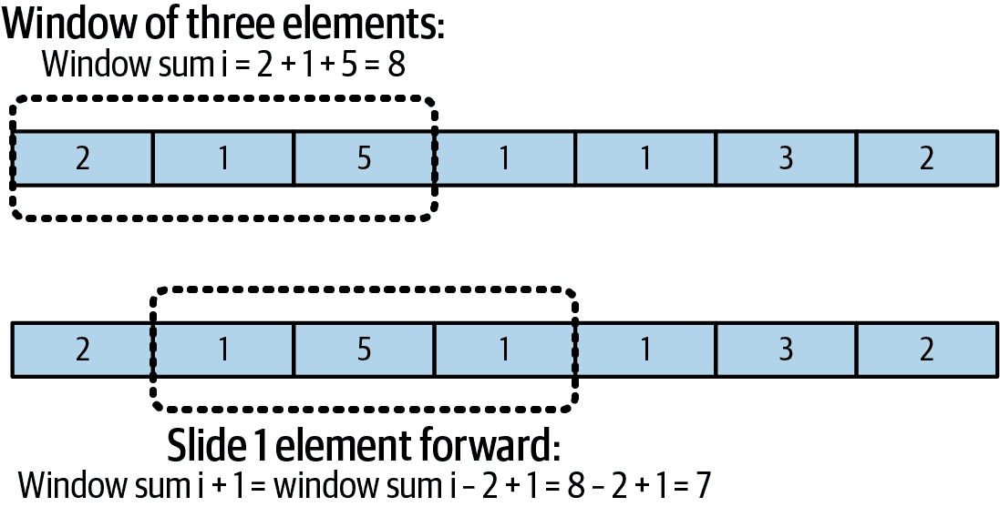
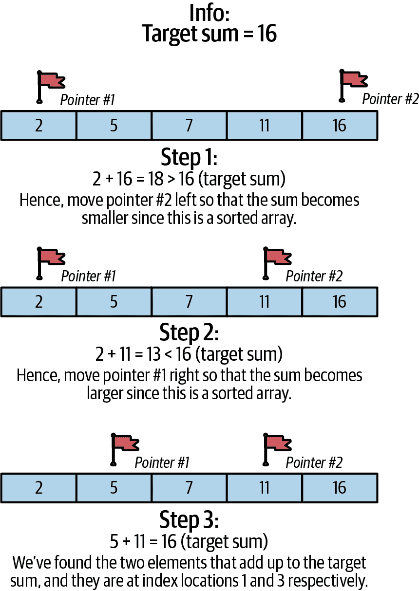

# 第五章：技术面试：编程

在前几章中，我详细介绍了机器学习面试流程以及技术面试中涉及的机器学习算法和模型训练部分。然而，技术面试可能要求候选人掌握更多的内容，不仅限于机器学习算法、统计知识和模型训练。本章将涵盖其中之一，即编程面试。

在机器学习岗位上，不同公司甚至同一公司内不同团队对编程题目的要求也不尽相同。例如，当我面试数据科学家和机器学习工程师岗位时，我遇到了以下类型的编程问题和任务：

+   公司 1：关于在 pandas 中进行数据处理的 Python 问题

+   公司 2：仅有 Python 脑筋急转弯问题（“LeetCode 风格”）

+   公司 3：涉及 SQL 和 Python Pandas 的数据相关编程问题

+   公司 4：带有真实场景的编程作业

…等等。

在编程面试中，不同公司可能会提出完全不同的问题。从我个人的经验和软件工程师同事及招聘经理的反馈来看，相较于软件工程师角色的技术面试，机器学习编程面试的标准化程度要低一些。但是值得一提的是，一些机器学习角色的面试官并不总是会问候选人最难的“LeetCode 风格”问题，也就是“LeetCode 难题”¹，因为候选人可以通过其它技能（如机器学习算法知识）进行评估。然而，这在很大程度上取决于具体的岗位要求，例如，面试 MLOps 等工程师职称的候选人可能会被问及标准的软件工程问题，其中可能包括 LeetCode 难题。像往常一样，与您的招聘顾问确认一下。

正如我在《机器学习角色的三大支柱》中所提到的，从事机器学习工作的人们需要同时具备编程和机器学习/统计方面的能力。你并不需要成为最熟练的编程高手，甚至不需要比软件工程岗位的平均候选人经验更丰富，但你需要足够优秀，可以轻松地与团队合作。

你可能会遇到一些团队，只需具备机器学习/统计知识即可，在小规模数据上工作，并且在面试过程中不需要测试你的编程技能。但对于这本书来说，我更倾向于 ML 角色，这些角色既涉及软件工程又涉及 ML，因为没有一种方法将 ML 模型分发和提供给用户，它们就无法成为我们日常使用的产品的一部分。ML 本身并不能创造 Netflix 推荐系统，而是将该模型投入生产并成为用户前端体验的一部分，从而带来用户的喜爱以及 ML 所带来的收入。 （更多关于测试模型部署知识的面试内容，请参见第六章。）

在本章中，我将解析机器学习工作面试中常见的编程问题类型，并讲解如何准备：

+   如果你不懂 Python 的学习路线图

+   与数据相关的 Python 问题

+   Python 脑筋急转弯问题

+   与数据相关的 SQL 问题

# 从零开始：如果你不懂 Python 的学习路线图

如果你已经了解 Python，请随意跳过本节！我专注于了解 Python 的原因是：

+   我经历的大多数，如果不是全部 ML 面试都假定你在某种程度上了解 Python。工作中大多数你将使用的 ML 库都有 Python 实现。

+   即使是软件工程师也建议在面试时使用 Python 而不是其他语言，因为 Python 的编码速度和抽象性。与其在面试中花费宝贵的时间从头开始用 C 或 C++编码，不如只用 Python 编写一两行代码，这有助于你专注于面试中的重要内容。

+   在 ML 工作中，你通常需要与其他个人和团队合作。即使 ML 可能是你的主要技能，面试官也会看你是否能编写可读性高的代码，供同事使用。

鉴于这些原因，如果你不懂 Python 或者有些生疏，以下是一个自学的建议路线图。

## 选择一本易于理解的书籍或课程

找一本侧重于实用代码的书籍或课程，在这些资源中你可以立即看到结果。²完成书中的练习。这里是我推荐的一些资源：

+   [*用 Python 来玩转枯燥工作*](https://oreil.ly/DAwOt)（由 Al Sweigart 著，No Starch Press 出版）：可以在网上免费阅读，其中的练习与日常活动相关。它从 Python 的基础开始，比如用它进行数学计算（书中的第一行代码是`2+2`），因此任何人都可以轻松上手。

+   对于喜欢视频格式的人，Al Sweigart 在 YouTube 上有一个[播放列表](https://oreil.ly/JbMbT)，分为 15 个视频课程，逐步讲解他的书籍内容。

+   [学习 Python、数据可视化、pandas 及更多内容，在 Kaggle 上的教程](https://oreil.ly/lCzfX)。

## 从 LeetCode、HackerRank 或你选择的平台上开始做简单的问题

有许多类似的在线编码平台，最常见的（在北美）是[LeetCode](https://oreil.ly/-ghT4)和[HackerRank](https://oreil.ly/QNx1z)。为简单起见，我将主要使用这两个平台作为示例，但你的地区或场所可能有其他类似的平台。

两个经典的初学者问题是[Fizz Buzz](https://oreil.ly/b9O_W)和[Two Sum](https://oreil.ly/0WEIZ)。在你选择的平台上试试它们；在学习初期查看答案是可以接受的。目标是理解这段代码——如果现在能理解这些，以后就能理解更难的了。³

## 设定一个可衡量的目标并练习、练习、练习

即使是每天*做一道题*或者每两天做一道题对初学者来说也是有帮助的。在你的日记或手机上保持一个追踪器。尝试一个小时，如果卡住了，看答案，读答案或找视频解释，直到*理解*。几天后可以再做一道题，看看理解是否牢固。避免死记硬背，因为面试可能不会出完全相同的问题，除非你非常幸运。

## 尝试使用与机器学习相关的 Python 包

在你熟悉了 Python 的一些基础知识后，从以下教程开始使用机器学习：

+   CatBoost：“[教程](https://oreil.ly/LLHMA)”

+   NumPy：“[初学者的绝对基础](https://oreil.ly/t_q7L)”

+   pandas：“[10 分钟入门 pandas](https://oreil.ly/BnmdV)”

CatBoost [教程](https://oreil.ly/qTHUE)可以是你第一个机器学习模型的起点！完成这一步后，你可以尝试使用自己的数据集或进行修改，尝试其他类型的模型，并建立自己的项目。

现在，我将介绍一些可能在机器学习工作面试中被问到的编程问题的提示。

# 编程面试成功的建议

在我们进入本章的代码部分之前，这里有一些需要记住的提示。你在面试当天的表现非常重要，无论你准备得多么充分，如果结果对面试官来说不明显都是无用的。我见过很多候选人忽视这一点，从而让他们的辛勤工作付诸东流。另一方面，遵循这些提示表现良好的候选人可以使他们的表现成倍成功。

## 大声思考

即使你是编码的人，面试仍然是你和面试官之间的讨论。对于面试官来说，你写下某一行代码的意图并不总是清晰的。如果你在打字时大声思考，可以帮助面试官理解你的思路，甚至帮助你自己。大声思考的一个例子是：“接下来我要写一些测试，但我在考虑要测试什么…”

即使你编写了一个最佳解决方案，如果整个面试大部分时间都是沉默的，通常也不是一个好迹象。你不必（也不应该）在每个时刻填充思维和对话，只要你向面试官提供足够的信息，而不是在沉默中编码即可。

这里有几个例子：我曾经面试过一个候选人，在整个面试过程中非常沉默。我提了一些问题来促使他们解释他们的代码，但他们可能很紧张，没有提供任何解释。最终，我无法提供帮助来引导他们走向最佳解决方案。在另一次面试中，候选人分享了他们的思维过程，因此我能够在候选人陷入困境之前提出澄清问题。候选人成功走上了正确的道路。请注意，这并不意味着如果你大声思考就会得到一个解决方案，而是通过与面试官的对话增加，面试官可以在你编码时提供更好的澄清。

## 控制对话流程

作为候选人，你可以积极塑造面试的对话流程，帮助你专注于解决问题。如果你需要一些时间集中精力，只需告诉面试官！在思考解决方案时，我曾经用过这句话：“我会专注大约两分钟，试着想出一个解决方案，所以我会安静一会儿。”这对于行为面试问题也很有效，比如“告诉我一次你在团队项目上克服挑战的经历。”如果你脑海中真的没有答案，而且你很紧张，你可以说：“在回答之前我正在整理我的思绪”，而不是在紧张时即兴编造。在编码面试期间同样适用；你可以控制节奏来帮助自己表现最好，因为面试官无法读懂你的思想。

你还应该注意时间，不仅仅依赖面试官来控制。作为面试官，当我们时间用尽时，我曾经不得不中断候选人以进行下一个问题。作为候选人，你可以在面试开始时澄清会问多少个问题以及每个问题大概需要多少时间。有时面试官会直接向你提供这些信息，但并非总是如此。例如：

*候选人：*“有多少个问题？每个问题需要花多少时间？”

*面试官：*“面试持续一个小时，我们有三个问题要让你回答，所以大约每个问题需要 20 分钟。但第一个问题最简单，最后一个问题最复杂，所以我建议你在第一个问题花 10 到 15 分钟，这是比较典型的。”

通过一个简单的问题，您可以获得更多信息来帮助您掌控面试的节奏和流程！现在，如果还有 10 分钟而且还有几个问题要解答，您就不会被措手不及了。

## 您的面试官可以帮助您

类似于“大声思考”的建议是：如果您遇到困难，请告诉面试官。他们通常不会拒绝给您一些提示。作为候选人，我曾直接要求过提示！例如：“您是否有具体的方向建议我如何处理这个问题？”（我在这种情况下通过了面试。）但我会小心：每次询问时，我都清楚地知道，如果请求过多的帮助，会对我的面试评估不利，相比于那些问题较少的人。尽管如此，我宁愿得到一个小提示，能够完成问题的 30%而不是被卡住时间一直流逝。权衡您的情况和时间。询问面试官是否在正确的方向上比完全进入一个不同的歧途要好得多。

"大多数情况下，面试官希望候选人通过面试取得辉煌成绩！因此，他们会提出问题来引导正确的回答，这样他们就有证据证明候选人准备好担任该角色，同时在技术面试中提供反馈和提示。因此，面试官应被视为一个盟友，而不是一个守门人，" 亚马逊的高级应用科学家尤金·延说道。

## 优化您的环境

这应该是不言而喻的，但如果您在电话面试时，尽量选择一个安静的环境，没有干扰性的背景噪音。如果您开启了视频摄像头，请确保背景不会太分散注意力，或者使用虚拟背景。有一个面试官告诉我，当他们面试某人时，候选人的伴侣没有穿全衣服，正在候选人背后的床上移动。这不是一个被人记住的好方式！多亏了 Zoom、Microsoft Teams 和 Google Meet 上的虚拟背景，您可以避免这种情况发生。

总的来说，如果我是候选人，并且没有选择而必须在喧闹的环境中进行面试，比如繁忙的咖啡馆，我会提到因为背景噪音需要将自己（在通话中）静音的可能性。在这些情况下，面试官们总是理解的。主要目标是让您的话清楚地传达给他们听到；如果您不得不一遍又一遍地重复自己，这可能会很尴尬。

如果你现场面试，请确保基本需求得到满足：不要让自己在面试前感到饥饿。如果你面试的公司在面试后为你提供免费午餐，但是你没有时间在现场获取零食或早餐，那么请确保提前吃点东西。在我个人的情况下，我每天都喜欢喝咖啡，所以我确保能在面试前喝到或购买到。不要留事情到最后，即使公司有小厨房和免费零食，也不能保证你需要时能随时取用。我觉得带上自己的食物更方便。

我也会在现场面试时带上水瓶，并尽量在前一天晚上睡好觉。当然，这并不总是可能的，但尽力而为，你不会后悔的。

## 面试需要精力！

我提到所有这些建议是因为面试需要大量的注意力和心理、体力。这不仅仅是关于你在技术主题上的准备；整个面试过程就像标准化考试一样，综合评估你的表现。有些人准备充分但由于压力、紧张或睡眠不足表现不佳。也有些人准备稍微少一点，但因为在面试时心理和身体状态良好表现更好。表现更好的人得到工作。这听起来不公平，但请记住并尽你所能做到最好。

# Python 编程面试：与数据和机器学习相关的问题

现在，让我们深入探讨编程/编码面试问题的第一种类型：与数据和机器学习相关的问题。这些问题侧重于使用 Python，例如使用 NumPy 和 pandas 库或像 XGBoost 这样的 ML 库，编写解决面试问题的代码。这类问题与下一小节涵盖的脑筋急转弯/LeetCode 问题的主要区别在于，这类问题更关注你在机器学习工作中日常角色中的实际操作。

根据你面试的公司类型不同，这些问题可能围绕公司的产品展开主题。例如，一个社交媒体公司可能会询问你如何获取新用户注册信息的一系列问题，以及如何提取用户活跃度的答案，以及上周有多少用户流失（离开）。

## 示例：与数据和机器学习相关的面试和问题

在本节中，我将为你介绍一个面试场景，并提供两个与数据和机器学习相关的 Python 示例问题，这些问题可能会在面试中被问到。请注意，这些示例中给出的数据集意在简单小巧，便于理解。

### 情景

面试当天，面试官会给你发送一个[HackerRank](https://oreil.ly/NK22m)接口的链接。当你打开它时，你会看到一个界面，你可以在那里编写你的代码。你再次确认，这场为期一个小时的面试总共有两道题，你计划在第一个问题上花费 15 分钟，第二个问题上花费 30 分钟。其余时间用于缓冲和与面试官的问答。

面试官将第一个问题复制并粘贴到页面顶部，以注释代码的形式概述问题。编程面试界面可能已经预填了问题，但在我参加过的多种类型公司的数据面试中，从大型科技公司到初创公司，问题可能不会显示在侧边栏，而是直接粘贴到编码区域。作为面试官，我推测这更适合那些不需要完全运行脚本的问题，以及更加侧重于来回讨论的面试。

你再次确认，你不需要完全运行代码，因为 HackerRank 环境实际上不会连接到真实的数据库。面试官确认了这一点。

### 问题 5-1（a）

在*[你正在面试的社交媒体公司]*，我们正在研究用户行为。我们拥有的数据格式是[sample data in *.json* format]。数据以以下两个*.json*对象的形式提供（简便起见称为“表格”）。

*表格 1*：

```
user_signups = {
  "user_signups": [
      { "user_id": 31876, "timestamp": "2023-05-14 09:18:15" },
      { "user_id": 59284, "timestamp": "2023-05-13 15:12:45" },
      { "user_id": 86729, "timestamp": "2023-06-18 09:03:30" },
  ]
}
```

*表格 2*：

```
user_logins = {
  "user_logins": [
      { "user_identifier": 31876, "login_time": "2023-05-15 10:28:15", 
"logoff_time": "2023-07-15 13:47:30" },
      { "user_identifier": 31876, "login_time": "2023-06-17 15:12:45", 
"logoff_time": "2023-07-17 18:31:20" },
      { "user_identifier": 31876, "login_time": "2023-06-20 09:03:30", 
"logoff_time": "2023-07-20 12:17:10" },
      { "user_identifier": 59284, "login_time": "2023-05-16 14:49:10", 
"logoff_time": "2023-07-16 18:02:45" },
      { "user_identifier": 59284, "login_time": "2023-05-18 09:33:25", 
"logoff_time": "2023-07-18 12:48:15" },
      { "user_identifier": 59284, "login_time": "2023-06-19 14:06:40", 
"logoff_time": "2023-07-19 16:34:50" },
      { "user_identifier": 59284, "login_time": "2023-06-21 08:20:05", 
"logoff_time": "2023-07-21 11:36:25" },
      { "user_identifier": 59284, "login_time": "2023-07-23 15:28:50", 
"logoff_time": "2023-07-23 18:44:40" },
      { "user_identifier": 86729, "login_time": "2023-06-18 10:48:30", 
"logoff_time": "2023-07-18 10:58:20" },
      { "user_identifier": 86729, "login_time": "2023-06-19 13:31:05", 
"logoff_time": "2023-07-19 15:50:40" },
      { "user_identifier": 86729, "login_time": "2023-06-21 10:10:25", 
"logoff_time": "2023-06-21 12:21:15" }
  ]
}
```

表格 1 中有新用户注册时间：

+   `user_id`

+   `timestamp`

表格 2 中有当前账户：

+   `user_identifier`

+   `login_time`

+   `logoff_time`

*问题：*给定这两个表格，哪些用户的最新活动超过了注册后 60 天？

在回答第一个问题时，你应该做以下几件事情：

+   如果不清楚每种数据类型的含义，请确认：表格 1 中的`user_id`是否与表格 2 中的`user_identifier`相同？（例如答案示例中，我们假设它们相同。）

+   将*.json*格式加载到你选择的格式中，例如加载到 pandas DataFrame 中。

+   大声思考——在编码时解释你的方法和想法。如果你不确定，请确认问题；在这种情况下，即使有几列，最终你也不需要其中的一些列，或者你可以简化结果。

以下代码是问题 5-1（a）的示例答案：

```
# python

import json
import pandas as pd

user_signins_df = pd.DataFrame(user_signins["user_signins"]) 

user_logins_df = pd.DataFrame(user_logins["user_logins"])
latest_login_times = user_logins_df.groupby(
    'user_identifier')['login_time'].max() 

merged_df = user_signups_df.merge( 
    latest_login_times,
    left_on="user_id",
    right_on="user_identifier",
    how="inner"
    )

merged_df['timestamp'] = pd.to_datetime(merged_df['timestamp'])
merged_df['last_login_time'] = pd.to_datetime(merged_df['login_time'])

# merged_df

|user_id   |timestamp               |login_time
|31876     |2023-05-14 09:18:15     |2023-06-20 09:03:30
|59284     |2023-05-13 15:12:45     |2023-07-23 15:28:50
|86729     |2023-06-18 09:03:30     |2023-06-21 10:10:25

merged_df['time_between_signup_and_latest_login'] = \
merged_df['last_login_time'] - merged_df['timestamp'] 

# merged_df

|user_id |timestamp           |login_time          |time_between
                                                    _signup_and
                                                    _latest_login
|31876   |2023-05-14 09:18:15 |2023-06-20 09:03:30 |36 days 23:45:15
|59284   |2023-05-13 15:12:45 |2023-07-23 15:28:50 |71 days 00:16:05
|86729   |2023-06-18 09:03:30 |2023-06-21 10:10:25 |3 days 01:06:55

filtered_users = merged_df[merged_df['time_between_signup_and_latest_login'] \
> pd.Timedelta(days=60)] 

filtered_user['user_id']
# Result: 59284

```


将.json 对象读取为 pandas DataFrame。


对于每个用户，获取他们的最新登录时间，并存储在名为`latest_login_times`的 DataFrame 中。


合并这两个 DataFrame。现在，对于每个用户，它显示他们的注册时间（timestamp）和最新登录时间（login_time）。 （提示：如果面试时间允许，可以将这些列重命名为更清晰的名称。）


计算注册时间戳和最新`login_time`之间的时间差，并将结果放入一个新列中。


筛选用户，仅保留那些在注册后超过 60 天登录过的用户。

###### 注

对于本书中的代码示例，由于打印书籍的格式化，有时换行不像代码格式化程序输出的那样清晰。

### 问题 5-1（b）

现在，面试官将第二个问题粘贴到了 HackerRank 界面上。

假设你有一个新的数据集，表 3。

*表 3*：

```
{
  "user_information": [
    {
      "user_id": "31876",
      "feature_id": "profile_completion",
      "feature_value": "55%"
    },
    {
      "user_id": "31876",
      "feature_id": "friend_connections",
      "feature_value": "127"
    },
    {
      "user_id": "31876",
      "feature_id": "posts",
      "feature_value": "42"
    },
    {
      "user_id": "31876",
      "feature_id": "saved_posts",
      "feature_value": "3"
    },
    {
      "user_id": "59284",
      "feature_id": "profile_completion",
      "feature_value": "92%"
    },
    {
      "user_id": "59284",
      "feature_id": "friend_connections",
      "feature_value": "95"
    },
    {
      "user_id": "59284",
      "feature_id": "posts",
      "feature_value": "63"
    },
    {
      "user_id": "59284",
      "feature_id": "saved_posts",
      "feature_value": "8"
    },
    {
      "user_id": "86729",
      "feature_id": "profile_completion",
      "feature_value": "75%"
    },
    {
      "user_id": "86729",
      "feature_id": "friend_connections",
      "feature_value": "58"
    },
    {
      "user_id": "86729",
      "feature_id": "posts",
      "feature_value": "31"
    },
    {
      "user_id": "86729",
      "feature_id": "saved_posts",
      "feature_value": "1"
    },
    {
      "user_id": "13985",
      "feature_id": "profile_completion",
      "feature_value": "45%"
    },
    {
      "user_id": "13985",
      "feature_id": "friend_connections",
      "feature_value": "43"
    },
    {
      "user_id": "13985",
      "feature_id": "posts",
      "feature_value": "19"
    },
    {
      "user_id": "13985",
      "feature_id": "saved_posts",
      "feature_value": "0"
    },
    {
      "user_id": "47021",
      "feature_id": "profile_completion",
      "feature_value": "65%"
    },
    {
      "user_id": "47021",
      "feature_id": "friend_connections",
      "feature_value": "73"
    },
    {
      "user_id": "47021",
      "feature_id": "posts",
      "feature_value": "37"
    },
    {
      "user_id": "47021",
      "feature_id": "saved_posts",
      "feature_value": "32"
    }
  ]
}
```

*问题：* 基于上一问题中的表格以及这个新表（表 3），假设可以在比这更多的数据上运行模型，你将如何建立一个预测流失模型？假设分析日期为 2023 年 7 月 25 日。创建流失指标和特征表，并口头描述你将如何进行建模。

这里有一些回答问题 5-1（b）的提示：

+   你应该分析这些数据，即使它是一个玩具数据集，也要详细说明如果数据集更大你会怎么做。

+   定义用户留下或离开的含义。公司是否有关于流失用户的定义？（例如，是指 30 天内未登录的用户吗？）弄清楚任何不清楚的事情。

+   建议一些可能找到的相关性的方法——例如，如果用户的个人资料完成率较低，他们更有可能流失吗？另外，概述和编码出如何在数据集中测试和确认这些假设。

+   对于建模来说，你可以尝试一些低成本的基线模型吗？也许是回归或简单的基于树的模型？

+   对于更复杂的模型，你会怎么做？

+   如果你注意到时间快用完了，告诉面试官你会快速概述复杂模型可能的工作方式，并结束讨论。

举例说明，这里是加载表格后一些行可能看起来像的示例：

| `user_id` | `feature_id` | `feature_value` |
| --- | --- | --- |
| `&#124;31876` | `&#124;profile_completion` | `&#124;55%` |
| `&#124;31876` | `&#124;friend_connections` | `&#124;127` |
| `&#124;31876` | `&#124;posts` | `&#124;42` |
| `&#124;31876` | `&#124;saved_posts` | `&#124;3` |
| `&#124;…` | `&#124;` | `&#124;` |

以下代码是问题 5-1（b）的示例答案的第一部分，加载表 3：

```
# python

import pandas as pd

user_info_df = pd.DataFrame(user_info["user_information"])

user_info_df.head() # print top 5 rows

    |user_id    |feature_id            |feature_value
    |31876      |profile_completion    |55%
    |31876      |friend_connections    |127
    |31876      |posts                 |42
    |31876      |saved_posts           |3
    |59284      |profile_completion    |92%
```

面试官确认，如果用户 30 天内没有登录，则可以视为流失。请注意，我们假设当前日期为 2023 年 7 月 25 日。您创建了一个表示流失的二进制列。以下代码是问题 5-1（b）的答案的第二部分，创建流失指标：

```
# python

import numpy as np

# add churn indicators

merged_df['churn_status'] = np.where(
  pd.to_datetime('2023-07-25') - merged_df['login_time'] >= pd.Timedelta(days=30), 
  1, 
  0
  )

# merged_df

|user_id |timestamp           |login_time           |time_between       |**churn
                                                      _signup_and        _status**
                                                      _latest_login 
|31876   |2023-05-14 09:18:15 |2023-06-20 09:03:30  |36 days 23:45:15   |1
|59284   |2023-05-13 15:12:45 |2023-07-23 15:28:50  |71 days 00:16:05   |0
|86729   |2023-06-18 09:03:30 |2023-06-21 10:10:25  |3 days 01:06:55    |1
```

从这里你可以将其连接到特征表：

```
# python

user_info_df["user_id"] = pd.to_numeric(user_info_df["user_id"])

features_df = user_info_df.merge(merged_df_2[["user_id", "churn_status"]], 
                                 left_on="user_id", right_on="user_id")  

# features_df

|user_id    |feature_id            |feature_value    |churn_status
|31876      |profile_completion    |55%              |1
|31876      |friend_connections    |127              |1
|31876      |posts                 |42               |1
|31876      |saved_posts           |3                |1
|59284      |profile_completion    |92%              |0
|59284      |friend_connections    |95               |0
|59284      |posts                 |63               |0
|59284      |saved_posts           |8                |0
|86729      |profile_completion    |75%              |1
|86729      |friend_connections    |58               |1
|86729      |posts                 |31               |1
|86729      |saved_posts           |1                |1

```


数据框`merged_df`具有您的流失指标，现在您将其与具有特征的表`features_df`连接起来。

接下来，您决定使用简单的 ML 模型 CatBoost，并继续将此数据框转换为所需的格式（在这种情况下，如果列是特征，则更容易）。

一个简单基于规则的方法可以是，如果用户 20 天内没有登录，他们可能已经很可能会流失（30 天未登录）。这种简单的“等待和观察”基于规则的方法是一种选择。另一个选择是，如果他们在 14 天内既没有登录又没有添加任何朋友，那么他们很可能会流失。我们的猜测是，如果此时他们没有朋友，那么可能他们没有回来的动机，因此可能会流失。

###### 提示

如第四章中提到的，在这里可以讨论缩放数据，以使具有较大“数字”的特征不会使量级失衡。讨论一下如果存在缺失值的情况（在这个示例中，没有，但在现实世界中可能会有）。

## 数据和机器学习面试常见问题解答

在上一个场景中，我详细介绍了数据和机器学习面试可能的进行方式。我参与过许多此类面试，有时是作为面试者，有时是作为面试官。以下是我希望能帮助你的一些额外观察和建议。

FAQ：看起来面试方式差异很大。我应该尝试在像 HackerRank 和 CoderPad 这样的平台上练习吗？

*A:* 面试格式可能有所不同，但不要为此担心。一旦你做了几次，你会越来越习惯这种多样性。例如，我曾经参加过需要正确运行代码的面试，也参加过允许伪代码的面试。就像谷歌面试的例子，当然你不能在 Google Docs 中直接执行代码。但如果你不熟悉语法或经常犯一些明显的错误，面试官仍然能看出来，即使你不需要运行代码。

FAQ：大声思考似乎会分散注意力。如果我真的做不到怎么办？

*A:* 如果你知道大声思考会让你分心，那么你就不需要频繁发言。然而，我仍然建议在你自然停顿的时候，比如刚刚定义完一个函数，利用这段时间快速总结一下你做了什么以及为什么这样做。作为面试官，即使我在密切关注候选人输入的每一个字符，我可能会有错误的假设——我不可能读心！总结一下，至少在自然停顿时尝试解释一下你的想法。

FAQ：我没有以往处理数据的工作经验。我怎么样才能回答这些问题？

*A:* 我发现，那些与数据工作的人经常考虑的一件大事是各种算法的优缺点。他们还要考虑更加注意数据的细微差别。例如，回到社交媒体公司的面试场景，面试官可能会提到基于树的模型对于使用时间较长的用户效果更好，但对新用户的效果可能不那么好。当面试者能够提出解决劣势的解决方案时，这是很好的——例如，一种解决方案可以是仅对具有超过 30 天活动的用户使用此模型。

作为数据中细微差别的一个例子：如果一个表格既有用户 ID 又有朋友连接，但没有关于用户使用社交媒体平台时间的信息，那么数字可能不会有相同的意义。使用平台时间更长的用户可能自然会有更多的朋友连接。尽管朋友数量相同，对于仅注册一个月的用户和使用时间为一年的用户来说，拥有 10 个朋友的意义是不同的。

好消息是，即使在没有数据工作经验的情况下，现在你知道了这些要点，你也可以通过侧项目获得相同类型的思考方式。听起来要求很多，但作为一个新毕业生，我能够根据我在计量经济学作业中学到的东西回答这样的问题。只要你有一些实际经验（在面试准备和建立项目组合时应该有），你就能做到。

## 数据和 ML 面试问题的资源

这里有一些进一步练习数据和 ML 相关面试问题的资源：

+   [NumPy 练习及解答](https://oreil.ly/ecEfI)（在撰写本文时在 GitHub 上有 10.6k 星）

+   [pandas 练习](https://oreil.ly/pzbxO)（在撰写本文时在 GitHub 上有 9.2k 星）

+   [使用 Google Colab 进行 pandas 练习](https://oreil.ly/YqMzP)（加州大学伯克利分校）

###### 注意

当搜索关于数据和编码的面试问题时，我发现搜索结果倾向于偏向脑筋急转弯类型的问题，如果你搜索“机器学习编程问题”。我解决这个问题的方式是指定 Python 库然后加上“练习”——例如，“numpy 编程练习”或“pandas 编程练习”。

# Python 编程面试：脑筋急转弯问题

现在，让我们继续讨论下一类编程问题，本书中将其称为“脑筋急转弯问题”。它们也被称为“LeetCode 问题”（人们通常简称为 LC）、编程挑战等等。

在搜索机器学习面试中提出的编程问题时，脑筋急转弯类型的问题在搜索引擎结果中经常出现，但你现在知道这不是唯一可能被问到的问题类型。尽管如此，这些问题之所以重要的原因是：

+   它们更加标准化。

+   它们与历史悠久的软件开发者/软件工程师面试流程共享。

+   对于非常重视软件工程技能的机器学习岗位，这类问题和面试流程与一般的软件工程面试有很大的重叠。

+   即使在你的实际工作中，你所处理的项目可能比编程脑筋急转弯更加广泛，但脑筋急转弯问题仍然主要用于评估候选人的编程技能。

###### 注意

对于那些已经熟悉这类面试问题的人，可以跳过本节。这是针对那些对脑筋急转弯/LeetCode 类型问题新手的指导，解释如何高效准备它——也就是说，工作要聪明，不仅仅是努力。如果你听说过这些模式，那么现在是时候去练习和“刷 LeetCode”了！

在我开始提供建议和资源之前，这里有一些要注意的模式，帮助你准备脑筋急转弯问题。

## [脑筋急转弯编程问题的模式](https://wiki.example.org/brainteaser_programming_patterns)

当你注册 LeetCode 或 HackerRank 时，你将面临平台上数百个问题。这可能导致分析瘫痪：有这么多问题，我应该从哪里开始？接着会感到不知所措：有成千上万的问题；我真的能学会所有这些吗？

别担心 —— 你不必担心。许多问题测试类似的概念或模式。当你开始专注于识别共同模式并从第一原则理解它们时，即使以前没有见过，你也能更灵活地应对新问题。

如果有一百个问题，但实际上只测试了 10 种主要模式，最初做每种类型的两三个问题（20 到 30 个问题）会节省时间，而不是粗暴地准备面试，做所有一百个问题。

可以略过这一节；你不必完全深入理解一切。在开始面试准备之后，你可以回来复习。

下面是一些需要注意的模式：

+   数组和字符串操作

+   滑动窗口

+   双指针

+   快慢指针

+   合并区间

+   图遍历，如深度优先搜索（DFS）和广度优先搜索（BFS）

我将详细介绍前三种模式：数组和字符串操作，滑动窗口和双指针。我看到这些主题的问题在所有数据相关角色中被问得最多，而仅仅关注软件工程的工作面试可能会问到额外的概念，比如图遍历。我将在本节的后面提供资源链接，帮助你为这些额外的概念做好准备。

### 数组和字符串操作

对于许多编程问题，你需要能够操作数组、字符串、字典或其他数据类型。我将这个声明分成两部分来解释一些定义。首先，在这种情况下，“数组”并不是字面上限制于 Python [数组](https://oreil.ly/ncZpX)或 NumPy 数组；相反，这是一个口头上的总称。在面试的背景下，“数组”可能包括 Python 列表和其他可迭代对象，可以在`for`循环中进行迭代。在这种情况下，“操作”指的是像更新、重新排列和提取数组中的元素以实现目标结果的任务。这不是孤立存在的模式；相反，你将使用数组和字符串操作技能与其他模式如滑动窗口和双指针结合使用。

这些问题中，你应该能够轻松使用以下简单函数：

+   [`len()`](https://oreil.ly/T0Etb)

+   [`sum()`](https://oreil.ly/BVbs0)

+   [`min()`](https://oreil.ly/NnOow)

+   [`max()`](https://oreil.ly/qwqK-)

+   [`enumerate()`](https://oreil.ly/7GTvF)

此外，如果你不熟悉语法或者可以通过更简单的内置函数轻松实现结果，你可能会导入模块如[`collections`](https://oreil.ly/Dum4h)或者[`itertools`](https://oreil.ly/EEBfv)或者内置函数`sorted()`，但这可能比它们的价值更麻烦：

+   `abs()`

+   `aiter()`

+   `all()`

+   `any()`

+   `anext()`

+   `ascii()`

+   `bin()`

+   `bool()`

+   `breakpoint()`

+   `bytearray()`

+   `bytes()`

+   `callable()`

+   `chr()`

+   `classmethod()`

+   `compile()`

+   `complex()`

+   `delattr()`

+   `dict()`

+   `dir()`

+   `divmod()`

+   `enumerate()`

+   `eval()`

+   `exec()`

+   `filter()`

+   `float()`

+   `format()`

+   `frozenset()`

+   `getattr()`

+   `globals()`

+   `hasattr()`

+   `hash()`

+   `help()`

+   `hex()`

+   `id()`

+   `input()`

+   `int()`

+   `isinstance()`

+   `issubclass()`

+   `iter()`

+   `len()`

+   `list()`

+   `locals()`

+   `map()`

+   `max()`

+   `memoryview()`

+   `min()`

+   `next()`

+   `object()`

+   `oct()`

+   `open()`

+   `ord()`

+   `pow()`

+   `print()`

+   `property()`

+   `range()`

+   `repr()`

+   `reversed()`

+   `round()`

+   `set()`

+   `setattr()`

+   `slice()`

+   `sorted()`

+   `staticmethod()`

+   `str()`

+   `sum()`

+   `super()`

+   `tuple()`

+   `type()`

+   `vars()`

+   `zip()`

+   `__import__()`

你还应该熟悉常见的数据类型，包括以下内容（记住本书侧重于 Python）：

[列表](https://oreil.ly/domv5)

你应该能够熟练地通过索引循环和切片操作它们。获取从 A 到 B 的元素，获取最后三个元素，等等。

[字符串](https://oreil.ly/u4moU)

你应该能够像操作列表一样操作这些字符串。你能轻松获取第三个字母吗？获取前一到三个字母？最后一个字母？等等。

[各种数值类型](https://oreil.ly/JyA_n)

面试问题是否要求保存为`int`还是`float`？有没有一个更好的选择？

[字典](https://oreil.ly/4CaPK)

这些数据结构可以帮助你通过键值对存储和快速访问数据。它们也非常高效。对于习惯其他语言的人来说，这与 Java 的 `HashMap` 类似。

[集合](https://oreil.ly/dAHtJ)

如果面试问题侧重于唯一值，它们非常适合使用。

[元组](https://oreil.ly/u6kcb)

当你希望一次从程序中返回多个结果时非常有用。

[生成器](https://oreil.ly/UztZh)

在实际生活中非常有用，这些数据结构可以显著节省所需的内存，减少在处理大量数据时可能发生的错误。

[数组](https://oreil.ly/FkFsb)

我在面试中并不常使用 Python 的这种“array”（不同于 NumPy 的 array），因为之前使用的数据类型对我来说已经足够了。然而，了解这种实现可能会有所帮助，特别是对于大量数据和数值操作更为高效的情况。

注意：我对每种数据类型的评论并不详尽，但在面试中我发现它们非常有用。

###### 注意

根据你面试的角色，问题的难度可能远高于本书中的简介。如果你申请大型科技公司的工程师角色（如 MLE 或 ML 软件工程师），强烈建议（甚至必须）在像 LeetCode 这样的在线平台上多加练习。对于初学者，继续在这里介绍的基础上构建也是很有必要的。

### 滑动窗口

现在让我们继续讲解下一个模式：*滑动窗口*。这种模式适用于需要操作或聚合一系列值的问题（见 图 5-1）。在学习这种模式之前，我通常会采用蛮力方法：在每次循环中，例如对整个范围求和。然而，采用这种方法很快就会遇到问题。它在处理较小的数据时效果不错，但在处理大范围数据时，我的解决方案可能会超时，导致无法通过测试用例（如在 LeetCode 上）。在提供测试用例的面试中，这意味着我无法完全解答问题。



###### 图 5-1\. 滑动窗口的示意图。

这种模式帮助你重复使用窗口或范围，这些窗口在每次迭代中重叠。在第一次迭代中，你会对所需范围内的所有内容求和。在循环的第二次迭代中，而不是从头开始对第二次迭代的范围求和，你可以使用第一次迭代的总和，加上新的数字，并减去第一个数字。这样，求和范围问题变得更简单，只需要处理三个数字。当我采用这种方法时，我发现在许多以前失败的问题中，现在在大范围数字上运行时，测试用例能够通过。

现在让我们来看一些简化理解的示例问题。请注意，许多在线平台如 LeetCode 将提供一些样板代码，例如预定义的类，供您插入代码；为简洁起见，示例问题和答案中不包括样板代码。

### 问题 5-2

给定正数数组 `[2, 1, 5, 1, 1, 3, 2]` 和正整数 `k = 3`，找出大小为 `k` 的任意连续子数组的最大和。

在这个例子中，大小为 3 的子数组是：

```
[2, 1, 5] → Sum: 8
[1, 5, 1] → Sum: 7
[5, 1, 1] → Sum: 7
[1, 1, 3] → Sum: 5
[1, 3, 2] → Sum: 6
```

下面的代码是问题 5-2 的示例答案：

```
# python
def max_subarray_sum(arr: List[int], k: int):
    """
    :returns: int
    """
    results = []
    window_sum, window_start = 0, 0

    for window_end in range(len(arr)):
        window_sum += arr[end]                                   

        if window_end >= k-1:                                    
          results.append(window_sum)                             
          window_sum -= arr[window_start]                        
          window_start +=1

    return max(results)

test_arr = [2, 1, 5, 1, 1, 3, 2]
test_k=3
result = max_subarray_sum(test_arr, test_k)

# result: 8

```


在滑动窗口后添加新项（参见图 5-1）。


对于前 k 个元素，将它们全部加在第一个完整的`window_sum`中。我们使用 k-1 是因为列表/数组是从 0 开始索引的，这意味着位置从 0 开始，而不是从 1 开始。


一旦我们开始滑动窗口，将结果存储在名为`results`的数组中。


在滑动后删除窗口中不再存在的项（参见图 5-1）。

###### 提示

根据输入数组是否排序，您可能会有不同的实现。始终双重检查您的问题，看看它们是否指定了排序的输入/输出。

### 双指针

*双指针* 是我接下来要讲解的模式。按照这种模式的问题可以通过两个指针在数组、列表、字符串等中遍历解决（请参见示例答案中的图 5-2）。想象一只乌龟和一只兔子，它们分别位于数组表示的直路的两端。乌龟和兔子向对方移动以找到问题的解决方案，最终在中间相遇。还有其他模式；例如，一个指针可以固定，而另一个可以移动。

为了说明，让我们看一个双指针面试问题的示例，并查看一些在线资源以练习其他相关问题。

### 问题 5-3

从一个*排序*的唯一数字数组中，找到数组中可以相加得到给定目标值的一对数字。返回数组中每个数字的索引（位置）。每个数字只能使用一次，也就是说，不能将相同的数字与自身相加。

这是示例输入：

```
numbers = [2, 5, 7, 11, 16]
target = 16
```

示例目标输出是：`[1, 3]`。

索引为 1 和 3 的数字分别是 5 和 11，它们相加得到目标和 16。

这是一个简单的解释以便理解。首先，我将说明双指针方法如何在图 5-2 中起作用。在这个例子中，指针从数组的开头和结尾开始，向中间移动，使得指针元素的和接近目标和。



###### 图 5-2\. 双指针模式在编程面试问题中的示例。

这里是示例代码实现：

```
# python
import math

def get_pair_with_target_sum(numbers: List[int], target: int):
    """
    :returns: List[int]
    """
    start_ind, end_ind = 0, len(numbers) - 1    

    test_num = math.inf

    while test_num != target_sum:               

      start_num = numbers[start_ind]
      end_num = numbers[end_ind]
      test_num = start_num + end_num

      if test_num > target_sum:
        end_ind -= 1
      elif test_num < target_sum:
        start_ind += 1
      elif test_num == target_sum:
        return [start_ind, end_ind]

    if test_num == math.inf:
      return None

numbers = [2, 5, 7, 11, 16]
target = 16
result = get_pair_with_target_sum(numbers, target)

# result: [1,3]
```


`start_ind` 对应于图 5-2 中的指针#1（最左指针），而`end_ind`对应于指针#2（最右指针）。


如图 5-2 中所示，保持迭代总和，如果目标总和较小，则将最右指针向左移动，如果目标总和较大，则将最左指针向右移动。

###### 提示

如果您正在应聘编程问题较难的角色，面试官可能会继续询问您是否能够提出如何优化或加快初始解决方案。如果您能够从一开始就提出优化的解决方案，那就更好了！进一步优化的示例在以下代码示例中有所体现。

以下代码示例更为简洁，简化了初始答案：

```
# python
def get_pair_with_target_sum(numbers: List[int], target: int):
    """
    :returns: List[int]
    """
    pointer_1, pointer_2 = 0, len(numbers) - 1
    while(pointer_1 < pointer_2):
        current_sum = numbers[pointer_1] + numbers[pointer_2]
        if current_sum == target:
            return [pointer_1, pointer_2]
        if target > current_sum:
            pointer_1 += 1
        else:
            pointer_2 -= 1

numbers = [2, 5, 7, 11, 16]
target = 16
result = get_pair_with_target_sum(numbers, target)

# result: [1,3]
```

###### 注意

根据测试用例，无论是由面试官提供还是您自己设计的，可能会假设是否对输入进行了清理。在问题 5-3 中，我将假设传入的输入是正整数，但有时会有诡计问题，例如当您的代码假设它们始终是正输入时，却传入负数。请与面试官核实并相应地做出反应。

## 脑筋急转弯编程问题资源

本节提供了进一步的资源，用于编程面试的练习。

### 编程面试练习平台

以下是练习 LeetCode 风格或脑筋急转弯编程问题的常见平台：

[LeetCode](https://oreil.ly/1uqha)

一个提供软件工程师和开发人员编程挑战和面试准备资源的在线平台

[HackerRank](https://oreil.ly/ShS4w)

提供在线编程测试和技术面试的在线平台

[Pramp](https://oreil.ly/sh_Bm)

免费的在线同行互助平台，用于练习技术面试

[Interviewing.io](https://oreil.ly/rguzR)

匿名模拟面试，与科技公司的工程师进行

### 精选的编程面试学习资源

以下是这类问题的流行且有用的指南；基本上，它们是您在普通软件工程师面试循环中使用的相同资源：

+   [*破解编程面试*](https://oreil.ly/nf4lu) 由 Gayle Laakmann McDowell 撰写：这本书被认为是大型科技公司风格编程面试的最受欢迎的入门读物之一。它专注于软件工程面试循环，但如果您正在面试与软件工程循环有很大重叠的 ML 角色（例如某些 MLE 角色，ML 软件工程师等），那么您也需要为这些面试循环做好准备。

+   [“如何在 Python 编程面试中脱颖而出”](https://oreil.ly/9pkXS) by James Timmins.

### 精选编程面试练习题

要了解更多模式，你可以查看资源，比如[LeetCode 75 学习计划](https://oreil.ly/YucsS)获取完整的类别列表，并在博客文章如[“编程面试中 7 个最重要的 LeetCode 模式”](https://oreil.ly/_Yfud) by Hunter Johnson 中阅读它们。

# SQL 编程面试：与数据相关的问题

在数据工作的人们可能在职业生涯中的某个时刻遇到 SQL。在我曾经工作过的每家公司中，我都必须同时使用 Python 和 SQL。因此，许多公司专门用 SQL 测试一些数据问题，尽管你可能能够选择 Python 或 SQL 来回答某些问题。

像在数据和 ML 上的 Python 问题一样，SQL 问题可能与你正在面试的公司或团队的行业相关联。例如，一个在大型社交媒体公司搜索团队面试数据科学家职位的人可能会遇到以下问题：

+   在过去 14 天内进行了超过 10 次搜索的用户有多少？

+   有多少百分比的用户得到了多种搜索结果类型？

+   要求你创建一个搜索的自动完成功能。你会如何使用 SQL 实现一个简单版本？

这里我包含了一个 SQL 面试问题样例。

问题 5-4

对于这个问题，你会得到两个表。

表 1 包含每个产品的产品级信息以及产品的价格和数量：

```
Product  Category  Price     Quantity
Product1 Category1 10.99     5
Product2 Category2 25.99     12
Product3 Category1 15.49     20
Product4 Category3 8.99      3
Product5 Category2 17.99     8
```

表 2 包含即将到来的折扣信息：

```
Category Discount
Category1 0.10
Category2 0.00
Category3 0.05
Category4 0.15
Category5 0.05
```

编写一个查询，获取每个类别的总数量和总折扣值（如果所有商品在促销期间出售），例如以下列：

+   `category`

+   `total_category_quantity`

+   `total_discounted_values`

以下代码是问题 5-4 的示例答案：

```
-- SQL
SELECT
P.category AS category,
SUM(P.quantity) AS total_category_quantity,
SUM(P.quantity * P.price * (1-COALESCE(D.discount, 0))) 
AS total_discounted_values
FROM TABLE_1 AS P
LEFT JOIN TABLE_2 AS D
ON A.CATEGORY = B.CATEGORY
GROUP BY P.CATEGORY
;
```

## SQL 编程面试问题的资源

这里给出的示例是为了让你了解 SQL 中基本的连接测试问题。然而，更高级的表可能包括更多的表，更复杂的表，[窗口函数](https://oreil.ly/uyHg3)，子查询等。利用这些资源进一步准备：

+   [学习 SQL 基础](https://oreil.ly/NEO3A)（Coursera, UC Davis）。

+   [LeetCode 上的 SQL 问题](https://oreil.ly/Wkwrg)：通常情况下，你可以（也应该）先从免费问题开始；这里有很多问题。

+   [“高级 SQL 查询：窗口函数实践”](https://oreil.ly/4EKy2)（来自 O’Reilly；需要登录）。

# 为准备编程面试的路线图

有些人可能已经有面试经验，并且已经意识到可能会被问到各种不同类型的问题。当我刚开始面试时，我被各种不同类型的问题搞得措手不及。例如，我专注于准备与数据和机器学习相关的 Python 问题，但没有意识到会有一些与常见的机器学习或统计 Python 库完全不相关的脑筋急转弯问题。从那时起，我确保扩展了我的面试准备覆盖范围。

虽然说起来容易，做起来却难。无论你已经了解 Python 还是 SQL，这些问题的格式可能仍然令人困惑。没有足够的练习，在时间限制下表现良好也是一件困难的事情。面试是孤立的事件，正如我之前提到的，表现优异的面试是一种独立的技能。一个非常充分准备和经验丰富但面试时非常紧张的候选人可能不会被选中。但是，一个准备充分并且在面试压力下表现良好的候选人更有可能得到这份工作。

这本书是关于机器学习职业的，所以我不会对像这样的面试是否是衡量行业中（特别是有经验的）人员表现的最佳系统发表太多评论，他们可能已经有一段时间没有练习 LeetCode 脑筋急转弯了。但我知道的是，当我面试时，我会花时间复习其中的一些问题，并制定一个时间表来做到这一点。你可能已经根据本章内容覆盖的内容知道该准备什么，但如果不动手键盘，你不会在获得工作机会的道路上取得实际进展。

每次我找工作，我都会列出我应该准备的内容，并制定一个练习的时间表。在这里，我包括了一些示例日历，你可以作为大学生或者正在进行职业过渡的人使用，还有一些变体。我鼓励你根据自己的情况调整时间表并开始行动。本章重点介绍编程面试准备路线图，但你可以使用同样的格式来准备本书中提到的所有面试类型（详见第八章了解更一般的机器学习面试准备路线图）。

## 编程面试路线图示例：四周，大学生

概述：你是本科或硕士最后一年的学生。你对 Python 有些了解，但对 SQL 一无所知，因为你没有参加使用 SQL 的课程。你从一位在数据领域工作的校友的信息面试中学到，还有从阅读这本书中了解到，除了练习一些 Python 脑筋急转弯问题外，你应该了解一些 SQL 知识。

可选但鼓励：您还可以联系您项目的学术顾问或相应人员，请他们联系该项目的校友，他们进入数据科学和/或机器学习领域。他们给了您两位校友的联系方式，⁴您在 LinkedIn 上找到并联系了他们。其中一位没有回复，但您与另一位通话了，他谈到了他们的准备情况。您记录了一些笔记并开始制定计划。

目标是在四周内开始申请工作和面试（表 5-1）。

表 5-1\. 一个大学生的示例路线图，设定课程和作业之间的准备时间，每天总计大约两到三小时，每周约 18 小时

| 示例路线图 |
| --- |
|  |  |  |  |  |  |  |
| **第 1 周：计划** |   |   |   |   |   |
| Mon | Tue | Wed | Thur | Fri | Sat | Sun |

| 阅读 ML 面试 | 阅读 ML 面试 | 阅读 ML 面试 | [今天因任务繁忙

明天]^(a) | [今天因任务繁忙] | 进行面试准备

准备

日程表^(b) | 进行面试准备

日程表 |

| **第 2 周：数据和 ML 问题** |   |   |   |   |
| --- | --- | --- | --- | --- |
| Mon | Tue | Wed | Thur | Fri | Sat | Sun |

| 刷新 NumPy 的知识

和 pandas | 在 NumPy 上练习问题 | 在 NumPy 上练习问题 | [俱乐部活动] | 在 pandas 上练习问题 | 练习问题

在 pandas 上 | [与朋友 BBQ] |

| **第 3 周：脑筋急转弯编程问题** |   |   |   |   |
| --- | --- | --- | --- | --- |
| Mon | Tue | Wed | Thur | Fri | Sat | Sun |

| 滑动窗口模式上的 3 个问题^(c) | 两个指针模式上的 3 个问题 | [模式]上的 3 个问题 | [今天因任务繁忙

明天] | [今天因任务繁忙] | 数组和字符串操作的问题（与前两个类别重叠） | 尝试 3 个问题并计时 |

| **第 4 周：从头学习 SQL** |   |   |   |   |
| --- | --- | --- | --- | --- |
| Mon | Tue | Wed | Thur | Fri | Sat | Sun |

| 观看 SQL 介绍视频，跳过部分

他们 | 观看 SQL 介绍视频 | 尝试 3 个问题，查看

解决方案 | 尝试 3 个额外的问题，查看

解决方案 | 尝试 2 个新问题，不查看

解决方案 | [放松] | [放松] |

| **第 5 周：SQL 练习问题 + 脑筋急转弯，计时** |   |   |   |
| --- | --- | --- | --- |
| Mon | Tue | Wed | Thur | Fri | Sat | Sun |

| 不看解决方案练习 5 个 NumPy/pandas 问题

在

解决方案 | 在所有主要模式中练习 4 个 LeetCode 问题，不查看

在

解决方案 | 查看您之前卡住的问题的解决方案 | 练习尝试

3 个 LeetCode 问题中

1 小时不看

在

解决方案 | 尝试 3 个 SQL 问题，不查看

在

解决方案 | 查看前一天 SQL 问题的解决方案

看看是否有

更好

解决它们的方法 | 追赶未完成的任务 |

| ^(a) 你会看到我将这些任务放在这个准备日历中，但这并不意味着你在这个日历之外没有做任务、准备考试或者社交活动。这个计划是每天只有两到三个小时，如果你列出学校或个人事务在这里，那意味着你仍然可以从面试准备时间中抽出时间处理紧急事务、任务或社交活动。^(b) 在这个例子中，第 2 至第 4 周是在规划周期间的专门时间填充的。^(c) 你可以选择两个简单难度的问题开始，以及一个中等难度的问题。每个问题可以花 30 分钟到 1 小时来解决；如果一个小时后仍然卡住了，那就看看解决方案。 |
| --- |

这个路线图之所以可以相对较短，主要是因为我喜欢尽快摆脱仅*消耗学习材料*的阶段。有些人因为不开始动手在键盘上练习和解答问题，所以花费了两倍的时间却进展较少。这就像试图通过阅读学习数学而不自己解决任何问题一样。

我也让我的路线图压力不大。如果你不能做三个问题，那就做一个。就那天只做一个。在至少一半的准备日里，你甚至可以看看解决方案。你可以做到的！

###### 警告

第一次尝试练习问题并发现自己陷入困境时，会感到痛苦。试图回到观看视频和阅读书籍，希望找到那些至关重要、立竿见影的有效技巧，这种诱惑是很强的。*不要陷入这种陷阱。* 越快开始尝试练习问题并犯错，你就会学得越快。根据我的经验，你也会更好地保持信息。

根据我自己的经验，在准备阶段类似这个路线图后，我继续进行迭代和改进，开始面试并在一些面试中失败。也许我需要多练习一些中等难度的问题，或者在面试过程中更快速地识别编码模式。但至少我开始了，每次面试失败并在随后的每次面试中变得更好，都让我离实现机器学习工作的目标更近了一步，远胜于被动地观看视频。

## 编程面试路线图示例：六个月，职业转型

好了。假设你不是学生，但你正在从事机器学习之外的领域工作。此外，你还有一个孩子要照顾，和你的配偶共同承担责任。

概述：您对机器学习/数据领域很感兴趣，并且一直在阅读在线材料，然后无意中发现了这本书。您希望开始迈出这一步，但工作后精力有限。您将周末时间用于家庭，但计划每周六投入两到三小时，周日投入一小时进行面试准备。您希望在六个月内做好准备，这是一个现实可行且可持续的目标（请参考表 5-2）。

表 5-2\. 专业全职职业人士和有孩子的家长的路线图，每周安排约四小时

|  | 第 1 周 | 第 2 周 | 第 3 周 | 第 4 周 |
| --- | --- | --- | --- | --- |
| Month 1 | 阅读机器学习面试 | 制定学习计划 | 制定学习计划 |
| Month 2 | 学习 NumPy | 学习 pandas | 练习 NumPy 问题（看解析后再不看） | 练习 pandas 问题（看解析后再不看） |
| Month 3 | 阅读关于 Python 的 LeetCode | 阅读模式，每种模式做 1 道题 | 每种模式做 2 道简单难度的题 | 每种模式做 2 道中等难度的题 |
| Month 4 | 通过视频学习 SQL | 尝试 3 道带解析的 SQL 问题 | 尝试 5 道不带解析的 SQL 问题 |
| Month 5 | 每周做 3 道题 | 每周做 3 道题 | 每周做 3 道题 | 每周做 3 道题 |
| Month 6 | 每周做 5 道题，计时 | 每周做 5 道题，计时 | 每周做 5 道题，计时 | 每周做 5 道题，计时 |

请注意，您还需要为本书中的其他部分安排准备时间。例如，如果您也在学习机器学习算法，那可能也需要六个月的路线图。如果您在工作，并且每周末只有两到三个小时的空闲时间，或者每个工作日每天只有一小时，那么您可以调整并延长时间框架。这完全取决于您自己！

## 编程面试路线图：创建您自己的！

现在是制定您自己的路线图的时候了。在您的日程中，可以包括其他类型面试的准备。我想强调准备编程面试，因为需要大量的肌肉记忆来快速完成问题。请参考第八章中的空白模板，您可以用于编程准备以及整体面试准备。

在[伴侣网站](https://susanshu.substack.com)的评论区与我分享您的路线图！

# 摘要

在这一章中，你阅读了各种类型的编程面试题目：与数据和机器学习相关的问题，脑筋急转弯以及 SQL 问题。你还了解了面试官在编程面试中寻找的内容以及一些成功的技巧：大声思考，经常与面试官澄清，以及面试过程中的交流。最后，我提供了一些准备编程面试的示例路线图，并鼓励你根据自己的目标时间制定自己的路线图。

¹ 在 LeetCode，一个在线编程实践平台上，有一个被标记为难度高的编程问题。在撰写本文时，其他难度包括简单和中等。

² 我通过在[Ren’Py](https://www.renpy.org)游戏引擎中编码学到了这一点。因为它基于 Python，并且我可以立即在屏幕上看到结果，我能够直观地理解我的代码在做什么。对于一个自学者来说，这非常有帮助。

³ 从学习乐器的类比来看：如果你可以慢慢地弹奏，你也可以快速地弹奏。

⁴ 我有过一些影响我职业生涯的学术顾问，他们以不可思议、改变生活的积极方式影响了我。如果你仅仅是问一下，你可能会对他们能够提供的惊人资源感到惊讶。另一方面，我曾经对学术顾问有过两年的恐惧，因为当我失败了几门课程并且在午餐休息时听到一些抱怨学生的话语时，有一位学术顾问说，“你永远无法从这个失败中恢复过来”。没有恶意，但是我学到了一课——找到那些真正值得他们的重量黄金的好顾问需要努力。我提到这一点是为了鼓励你，如果有可能的话，多与他们交流。这种努力是值得的！

[*OceanofPDF.com*](https://oceanofpdf.com)
