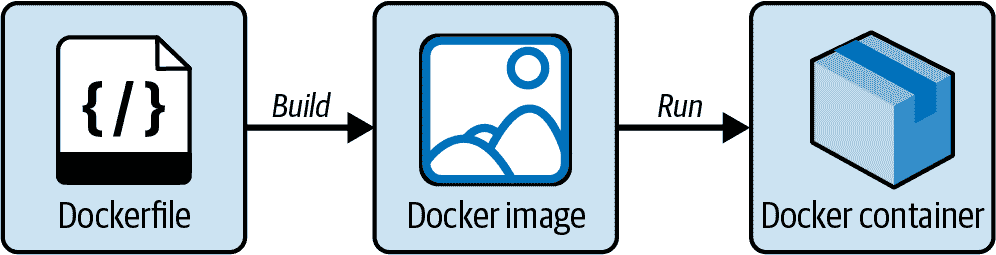
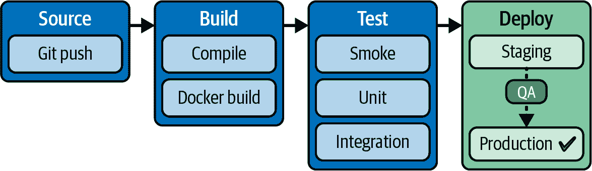
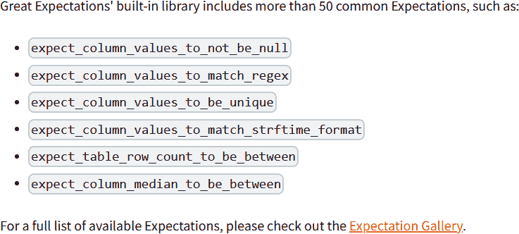
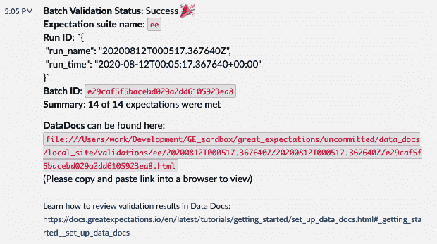

# 第六章：技术面试：模型部署和端到端 ML

在第三章和第四章中，你已经对与 ML 算法、模型训练和评估相关的重要面试概念有了概览。为了让 ML 模型对用户产生影响，无论是公司的客户还是内部用户和同事，模型都需要*部署*。

部署有许多层次，但最重要的是实现模型的最终目标。如果你的模型是手动运行的，并且每次市场团队请求新结果时都是临时的，而且运行良好，那可能就是你的部署级别。或者，你可以拥有一个完全自动化的系统，在这种情况下，模型会作为 A/B 测试的一部分发送给客户，训练模型的人除了进行模型训练外不需要做任何事情。这可能是需要的部署级别。

顺便提一句，ML 专业人士并不需要了解模型部署的所有细节。然而，如果你申请以下职位之一，熟悉本节提到的话题会很有用。通常需要更深入了解模型部署的角色包括：

+   不仅仅进行模型训练的机器学习工程师

+   MLOps 工程师

+   在初创公司担任数据科学家或 MLE，并且没有其他专门从事 ML 部署的人员

巧合的是，如果你的工作正好属于这种类型的角色，那么面试中可能还会包括与软件工程面试环节重叠的编码问题，如第五章所述。

另一方面，如果你感兴趣的公司或团队有非常明确的角色划分，而你申请的职位不需要进行实际的部署工作，或者你感兴趣的工作包括以下工作：

+   产品数据科学家

+   数据科学家、应用科学家、MLE 等，专注于模型开发或其他分析工作

本章将介绍模型部署、部署后的模型监控，以及其他端到端的机器学习流程和工具。此外，我还将简要总结更高级的机器学习面试话题：系统设计、过往项目的技术深度探索和产品感。这样你就知道这些话题，以及如果遇到它们该如何准备。好消息是，更难的变种通常只在高级或资深以上的职位中才会遇到，而不是在入门级别。

# 模型部署

我用来描述模型部署的类比是它“实时且在空中”。在机器学习角色中，这是机器学习生命周期的重要部分，如第一章所述。关于机器学习部署的面试可能涉及的主题包括机器学习或软件基础设施（用于支持模型服务）、机器学习假设检验、监控、模型更新等等，一旦模型部署完成。

这种类型的机器学习经验可能通过自学更难获得，因为当我们作为副业构建机器学习模型时，首先可能没有用户进行测试。因此，在我看来，这通常不是副业项目的重点。

接下来，我将概述模型部署在工业界的重要性的一些原因，并向你展示如何在心理上从模型训练和开发工作转向部署工作。

## 新加入机器学习行业的主要经验差距

在我开始进入机器学习领域时，**生产**和**部署**的概念对我来说是陌生的。因此，我包括了这一部分，描述了我如何首次接触这些概念，并如何从理论的机器学习知识过渡到独立项目再到成熟项目。希望这个故事能让你感同身受，并对你有所帮助。

在我在多伦多大学的硕士项目期间，我在 Jupyter 笔记本上使用 Python 进行了一些研究项目。对于这些项目，我以编程方式进行数据抓取和获取，编写脚本进行数据清理，并分析数据。在这段时间里，我用我的笔记本电脑进行计算：我直接在笔记本电脑的本地环境安装 Python 包。在开发过程中，由于我是唯一的工作人员，我能够快速地编辑我的代码。除了在我的笔记本电脑上本地制作副本之外，我没有对代码进行备份。在完成机器学习模型的训练和分析后，我创建了一些可视化内容，并将它们放入 LaTeX 格式的论文中，这就是项目的结束。我从未再次运行过那些脚本。

所有这些对学习环境来说都是合适的，但与工业环境中的工作环境非常不同。许多机器学习从业者也分享了他们调整心态的经历：现在模型需要*部署*，能够运行，并且可以轻松地被其他同事修改，代码也需要被备份并重新运行 —— 通常是自动化地！

**生产**是一个光谱，取决于你申请的公司。对于某些团队来说，你的主要机器学习成果可能仅仅是在训练模型后生成一些图表，这可能类似于你在学校或个人项目中的经验。对于其他团队（据说这些岗位更具竞争力），生产可能会伴随对可用性和百万用户运行的期望。在这些情况下，一个简单的开发环境中有效的方法可能与生产环境中的不同。

在我的第一份工作中，我开发的机器学习模型每天都必须为数百万用户运行。与我在研究生项目中只有几千条记录的项目相比，所需的计算方式完全不同，我无法再在我的笔记本电脑上运行它。在那份第一份工作中，我不得不学习远程进入我们本地云计算并在虚拟机上工作的方法。我还不得不学习使用版本控制，以便代码可以备份并轻松与同事共享。我不得不编写测试代码，以便自动测试每次更改；这是我在学校项目中没有做过的，因为我手动测试了每个更改。最后，我的第一份工作中的机器学习模型必须通过调度程序运行，以便每天至少生成一次预测结果——这与我在学校的机器学习模型只运行一次训练过程后生成完整结果完全不同。

我分享这些是为了表明，如果你能在学校通过使用版本控制（Git、GitHub 等）进行协作项目中获得这些经验，那么你将能更加流利地谈论这些技能。如果你没有机会学习协作开发，那么无论你申请什么角色，浏览一些本章内容都会对你有所帮助，以便你能熟悉可能需要在工作中学习的内容。

###### 提示

现在，我建议候选人尝试使用诸如 [Streamlit](https://streamlit.io) 这样的工具部署一个简单的 Web 应用程序。过去，我已经使用 Flask 在本地部署过我的项目，或者在 [Heroku](https://oreil.ly/D86D9) 这样的托管网站上部署过。

## 数据科学家和 MLE 是否应该了解这些？

求职者经常会提出这种类型的问题，例如“A 是否应该了解 Docker？”“B 是否应该了解 Tableau？”例如：

+   数据科学家是否应该了解 Kubernetes？

+   MLE 是否应该了解机器学习算法背后的数学？

+   数据科学家是否应该了解 Docker？

我的回答是：*你*必须根据*你自己的情况*决定在你的机器学习职业生涯中是否应该学习技术 X，以下是如何进行决策的。

让我们以 Kubernetes 为例——你可能正在尝试弄清楚你是否应该了解它。我认为事情是有先后顺序的：首先，了解*你申请的角色*需要什么是必要的。使用第一章和第二章中概述的方法，看看你对机器学习生命周期的哪个部分感兴趣，然后通过工作职位描述确定你申请的工作是否需要你了解 Kubernetes。如果角色不要求这一点，专注于准备其他核心主题，如模型训练和评估。

如果你瞄准的角色确实需要 Kubernetes 经验或其他类型的部署知识，比如设置 Jenkins、GitHub 操作和通用 CI/CD，那么务必进行一些研究，并在一个玩具项目中获得一些实际经验。

更进一步，阅读有关该主题的各种可靠和相关来源，并收集广泛的观点是非常重要的。

例如，Chip Huyen，《*设计机器学习系统*》（O’Reilly）的作者，在一篇博文中写道：“为什么数据科学家不需要了解 Kubernetes”：

> 拥有一个端到端的数据科学项目可以实现更快的执行和更低的沟通开销。然而，只有当我们有好的工具来抽象出较低级别的基础设施，帮助数据科学家专注于实际的数据科学而不是配置文件时，才有意义。¹

我还推荐 Eugene Yan 的博文“不受欢迎的观点：数据科学家应该更具端到端”，² 在这篇文章中他写道：“我试图说服[读者]，端到端的可见性、内聚性（即反向康威定律）和所有权会带来更好的结果。”³ 但他并不一定“主张数据科学家/ML 工程师应该全栈，并且深入了解如何设置 K8s，进行博士级研究，设计前端等等。”他补充道。

在此时点，在查看工作职位和各种可靠意见后，你可能会做出决定：“我现在*不需要*学习 Kubernetes，但将来可能会有帮助。”

无论你的结论是肯定还是否定，我认为最好的答案类型是假设当情况改变时，你可以*重新评估*这个答案。就像所有职业一样，无论你是否应该了解 X、Y 或 Z 技术都是会变化的！随着你的职业发展，你可能会发现自己处于以下某种情况中：

+   进入初创企业并承担更广泛职责

+   想要晋升，需要更多 X 经验

+   想要横向转入另一个需要更多 X 经验的 ML 角色

在这些情景中，最终你可能需要了解 X！但这并不意味着你现在就需要了解它。由于你可能在面试准备上时间不足，把它看作是受限制的优化问题。你可能有限的精力、准备时间和研究时间可以用来找到理想的工作。你应该优先考虑那些能给你最优化面试结果的活动。如果学习 Kubernetes 能达到这个效果，那就专注于学习它。如果是模型训练，那就首先专注于模型训练，然后把剩余时间用在其他任务上。

## 端到端机器学习

*端到端* 是一个用来指代整个工作流的术语，“端”是项目或工作流的开始和结束。关于 ML 从业者是否应该更全面已经有了讨论，你可能会想知道你是否应该这样做。要联系机器学习生命周期，答案是你应该了解多个生命周期的方面（参见 图 1-5），而不仅仅是其中的一部分。

在软件工程中，类似的术语是 *全栈工程师* 或 *全栈开发者*，有时候全栈数据科学家、全栈 MLE 等也指那些负责更多端到端 ML 过程的角色。

我的答案会与“我需要知道这个吗？”的问题类似：审视你的工作角色，看看需要什么。然后确定什么是优先的，什么是最有益的。

###### 提示

如 Eugene Yan 在他的博客文章中所写，“不受欢迎的观点：数据科学家应该更全面”，了解端到端的 ML 过程是有帮助的，但你不必成为每一个方面的专家。

这是我自己的故事，随着时间的推移变得更加全面，但不是作为一名初级候选人。当我得到我的第一份数据科学/机器学习工作时，我对规模化模型部署或像 Docker 或 Kubernetes 这样的工具了解不多，⁴ 我对数据工程和 SQL 也不太熟悉。在那份工作期间，我学到了更多关于数据工程和 SQL 到高级水平，Docker 到中级水平，但我仍然不了解 Kubernetes。

在我的第二份工作中，我在一家初创公司，我负责更多的机器学习生命周期，因此我需要学习更多关于规模化部署模型的技术。在那种情况下，学习这些技术并使得端到端连接 ML 工作流到我们应用堆栈的非 ML 部分变得更加合理。我在 [O'Reilly AI Superstream: MLOps](https://oreil.ly/pb83P) 上的主题演讲中谈到，了解部署过程如何帮助 ML 从业者更有效地完成 ML 项目。

总体而言，我认为成为更全面的人对我的职业生涯有益。然而，这是在多年的时间内发生的：我在我的 ML 生涯开始时并不了解很多，而是逐项目、逐角色地积累知识。所以不要太担心需要了解 X、Y 或 Z 的说法：通过审视你最感兴趣的角色，并优先考虑成功面试的顶级技能来评估你的情况。在深入之前，你也可以通过像这本书这样的书籍快速获取其他技能的高级概述。你可以在工作中或通过持续的自学中后续学习新技能，就像我一样。

接下来的部分将涵盖云环境和本地环境、模型部署技术、云提供商和额外的工具。如果你已经熟悉这些概念或者觉得某些部分现在对你来说不相关，可以跳过它们。当这些话题变得更相关时，你也可以回到本章节。

## 云环境和本地环境

在第四章中，我谈到了模型训练和评估。但我没有在那一章节详细描述开发环境。模型在某处训练并在另一处评估。该环境可以是本地机器（比如你的 MacBook Pro）、云虚拟机（VM）等等。

另外，模型训练的环境通常与生产环境不同。例如，模型可以在 VM 上训练并打包成 pickle 文件，然后通过脚本复制到生产环境，这个生产环境可能在完全不同的 Google Cloud Platform（GCP）命名空间中，训练模型的人可能没有个人访问权限。

无论是在云端还是本地工作，你都必须注意模型训练与部署之间的交接。模型训练的工件是如何运送到生产环境的？生产过程是什么样的，每个步骤在*哪里*进行？甚至是否有生产流程？了解 ML 工作流建立在哪些类型的位置基础上的基础知识，可以帮助你简化、自动化或优化 ML 部署的任务。这通常不会直接在面试中询问，但对于面试中其他与模型部署相关的话题是一个重要的基础。

### 本地环境总结

当我刚开始涉足数据领域时，已经更普遍地在远程或云环境中训练模型或配置云虚拟机。然而，有一些事情并非在高性能计算上运行，仍然可以在本地机器上常见地完成（取决于你的工作场所）。这些包括：

+   连接到远程数据存储并在本地运行 Jupyter Notebook 进行临时的探索性数据分析

+   在小样本数据上快速原型化模型训练，但是完整的训练是远程进行的

+   如果公司的技术堆栈设置成可以在本地运行 ML 服务进行测试

本地机器通常只是*开发*环境，除非你是一家初创公司在单台机器上运行服务器（这种情况非常少见，因为会存在停机或计算问题）。在本书中，我不会讨论仅运行单个本地服务器的情况。

了解你的*开发*环境在本地机器（如笔记本电脑）上的运行方式非常重要，这样你就知道如何在生产环境及其反之上复制它。设置[Docker](https://oreil.ly/wsewB)（稍后在本章中介绍）和依赖管理如[Pipenv](https://oreil.ly/kIiKf)、[Poetry](https://oreil.ly/wPvpO)等在 Python 中是必不可少的，这样在某人的笔记本电脑上运行的内容将在生产环境甚至另一个同事的笔记本电脑上运行！

### **云环境总结**

尽管“云”已成为由第三方管理的远程服务器使用的总称，但在 ML 中有一些重要的细微差别以及云环境部署的不同方式。接下来，我将详细介绍几种开发环境类型。

#### **公共云提供商**

*公共云*指的是来自诸如 GCP、Amazon Web Services（AWS）、Microsoft Azure 等供应商的云服务，我将在“云供应商概述”中更详细地介绍。然而，与同一供应商的私有云相比，硬件方面，同一台服务器可以运行来自多家公司的工作负载——也就是说，它们是*多租户*的。公共云提供商的优势在于其极大的便利性，这使得公共云成为软件公司非常流行的选择。

在使用公共云时需要考虑的一些额外问题包括：由于大型供应商的大量资源，使用公共云通常是安全的，但由于法规原因，这可能不是最理想的选择。向公共云迁移的过程可能会导致停机并破坏日常运营，这可能极其不便。如果你准备在 ML 中的中小型公司工作，你可能会使用公共或私有云。如果你在高度监管的大公司工作，你可能会使用本地部署或本地云和/或本地工作。

随着 AWS 等平台的兴起，公共云变得流行起来，促使许多公司将工作负载从本地（on-premises）服务器迁移到云服务上。然而，由于法规原因，许多工作流程或数据存储仍无法迁移到公共云。

#### *本地部署和私有云*

在一些大型公司中，拥有服务器并在其上托管本地平台并不罕见。当我在一家大型电信公司工作时，它拥有许多自己的服务器。事实上，许多大型公共云提供商使用的服务器是从电信公司租赁或拥有的。该公司保留了一些服务器供私人使用，并拥有自己的[GitLab 实例](https://oreil.ly/Osuho)和其他服务。许多企业软件解决方案也提供自托管解决方案，具有企业支持的好处。这被称为*本地部署*。

自托管许多服务的原因包括：

+   公司拥有服务器，比将同一批服务器暴露于公共云更安全。

+   在某些情况下，出于监管目的，如欧盟的通用数据保护条例（General Data Protection Regulation，GDPR），信息隐私的法规更容易实施。

+   金融服务和法律机构等高度受监管的行业对数据存储位置有额外要求，并且是否可以使用公共云来存储个人可识别信息（PII）。

*私有云*位于公共云和本地/私有云之间。如 AWS 等供应商托管服务器并保证这些服务器仅用于一家企业客户（单租户），⁵与公共云使用的共享硬件相对立。公司可能会根据可行性和成本、便利性及法规平衡各种权衡因素，使用这些解决方案的混合方式，包括公共云。

###### 注意

如果您的角色不负责评估、设置或自动化部署环境，那么您开发机器学习的环境在面试时不会有太大差别。当我使用本地云时，与私有云或公共云相比（依我之见），便利性略逊一筹，但总体上需要的知识相似。如果您已经使用了一个远程环境，那么您也可以使用另一个。然而，如果您是 MLOps 平台团队的一员，可能需要更多地了解您所使用平台的基本工作原理。

另一方面，还出现了所谓的[*云回归*](https://oreil.ly/2qcrO)⁶现象，即曾经转向公共云服务的公司现在正在重新评估并回到本地云，因为本地云的各种优势。据我观察，大公司有更多资源自行托管本地云实例，因为他们拥有更多员工，因此能够负担得起专职人员来维护这些本地服务器，并与供应商顾问沟通，解决出现问题时的故障排除方法。在我曾供职的一家大公司，其中一个平台供应商是 IBM；当 IBM 平台的本地实例出现问题时，数据科学团队的高级成员之一会联系 IBM，并安排会议，以便 IBM 提供故障排除支持。全天候提供 IBM 支持服务确实很好，但你可以想象，支持和咨询的成本也相当高。

较小至中型公司可能会发现维护本地云既繁琐又昂贵，而且开销太大。对于这类公司，公共或私有云可能仍然是最常见的选择。

## 模型部署概述

在模型训练完成并准备就绪后，是时候部署它们（到生产环境）了！在不同类型的公司中，这个过程可能大不相同。正如我在本章前面提到的，生产环境有不同的层次，但目标是让模型变得*有用*。

这里是一些部署示例的非详尽列表，从最简单的级别到最复杂的级别：⁷

+   机器学习模型被某处存储并按需运行；结果在本地保存。

+   机器学习模型被某处存储并按需运行，但结果写入到一个中心位置。

+   机器学习模型被某处存储并自动运行为批处理过程，并将结果写出。

+   机器学习模型被包装在一个简单的 Web 应用程序中，例如[Flask](https://oreil.ly/QetyX)，并通过 Docker 容器启动。

+   机器学习模型被包装在一个简单的应用程序中，并通过[Google Cloud Functions](https://oreil.ly/IEjDe)或[AWS Lambda](https://oreil.ly/GRK30)调用。

+   机器学习模型被某处提供并由 Kubernetes 编排和管理；几乎所有事情都是自动化的。

等等。

根据您面试的公司及其典型的部署模式，您会有不同的期望。如果您正在面试一个技术或机器学习团队成熟的公司，您可能需要了解与上述列表中 5 和 6 级相关的工具。公司规模不如技术栈的成熟度重要；当我在一个有 200 人的初创公司时，我们的技术栈正处于第 6 级。

这意味着，一般来说，如果您在一个负责平台的部分、部署和生产生命周期的机器学习角色中，如果您恰好没有这些技术和工具的工作经验，您将需要更多时间进行学习。对于成熟度较低的机器学习团队（如 1 至 4 级），您可能会在训练机器学习模型的同时，负责处理这些角色。

随着一个机器学习团队的成熟度增加，同一个人既训练模型又构建自动化平台的价值将会减少。一个人或一个团队一次做多件事情，将无法专注于使机器学习模型达到最佳状态，特别是随着公司需要越来越多的模型。

例如，一个电子商务公司最初可能制作了一个简单的库存预测模型，后来可能希望开发推荐商品的模型，用于其新闻通讯。然后，公司可能希望仅在销售期间添加一个强大的销售模型。或者，也许有人在公司发现欺诈账户正在使用公司的商品来掩盖偷来的资金流；那么该公司的某人可能会发布指令创建一个欺诈检测模型。

当一个机器学习团队承担了越来越多的责任时，团队会厌倦用胶带（快速、临时的）修复方法，并希望开始引入一些开发者的额外工作量，比如容器化和版本控制。今天，公司通常从一开始就开始使用这些工具，但仅仅几年前，一些软件不够成熟或者机器学习团队可能并未使用 Docker，而有些公司和团队直到几年前（截至 2023 年）才正式开始使用 Git。如今，对 Docker 和版本控制（如 Git）的知识的需求可能比以往更高。

### Docker 简介

Docker 允许将软件应用程序及其依赖项打包在一起，并且是*可移植*的——也就是说，使用 Docker 容器，相同的软件应该能在任何兼容的机器上以相同的方式运行。另一方面，同事的系统上可能可以运行相同脚本，但在你的笔记本电脑上运行同样的脚本可能需要环境*可移植*。因此，Docker 还可以使环境与运行它的基础设施无关。

容器化并不是什么新鲜事物：过去，虚拟机（VMs）经常用来解决类似的问题——例如，一个在 Linux 机器上工作的人想要在 Windows 上测试某些东西，可以安装一个 Windows 虚拟机，反之亦然。缺点是，安装的是整个操作系统，这在其他环境上测试时会导致大量冗余。使用 Docker 容器，你不需要安装整个操作系统（除非特意如此）。例如，你可以有一个 Docker 镜像指定 Python 环境；⁸ 容器使用主机的操作系统，但仍然提供了虚拟机隔离其他部分的功能。

*Docker 镜像* 是一个只读模板，包含创建 *Docker 容器* 的指令。⁹ 因此，镜像就像一个模具。定义这个模具的指令在 *Dockerfile* 中。Docker 容器是镜像的可运行实例，你可以创建、启动、停止等等。你可以从一个单一镜像创建多个相同的容器实例。有关示例，请参见 图 6-1。

###### 图 6-1\. Dockerfile、Docker 镜像和 Docker 容器。

### 与 Kubernetes 协调

现代 Web 服务通常要求具备高可用性。像 Docker 化这样的良好实践有助于将软件以易于移植的方式打包，这有助于应用程序在无需停机的情况下发布。然而，这只是一个谜题的一部分；像 Kubernetes 这样的技术可以自动化地编排容器化应用程序，使其在正确的位置和时间运行。当然，负责 ML 应用程序编排的人（也可能是你？）需要设置自动化并调整配置和策略。¹⁰

请注意，涉及编排的职位角色的责任在不同公司可能有所不同。一些公司可能会让 DevOps 工程师维护编排基础设施。然而，我见过许多更大更成熟的 ML 组织中有基础设施工程师、MLOps 工程师和 ML 工程师（MLE），他们可能都至少负责 ML 应用程序的一部分正常运行时间要求。

在这本书中，我概述了 Docker 和 Kubernetes，但由于篇幅有限，无法像 DevOps/MLOps 书籍那样详细涵盖，因此这里提供了一些我在 O'Reilly 发现的有用资源：

+   [*Kubernetes 实战*](https://oreil.ly/PgXCJ) 由 Brendan Burns 等人编写。

+   [*Kubernetes 最佳实践*](https://oreil.ly/K9HBS) 由 Brendan Burns 等人编写。

如果这些对你完全陌生，不用担心。根据我的工作经验，在工作中我已经学会了大部分容器化和编排工具。事实上，我可以说，在工作时间内通过实践项目的学习贡献了我在这一领域的大部分知识。

## 额外的工具

这里我讨论了一些其他有用的工具：

ML 管道和平台

现今有许多处理 ML 工作流自动化部分的 ML 平台，了解它们是非常有用的。如果你事先得知你面试的公司使用的平台是哪个（些），务必查阅该平台的文档页面，了解平台提供的常见术语和工具。这些 ML 平台可以包括 Airflow、MLflow、Kubeflow、Mage 等。

CI/CD

在一个软件团队更加自动化和成熟的组织中，你可能需要了解更多关于持续集成、持续交付（CI/CD）工具和技术的内容。配置这些工具可以在新的提交合并到主分支时自动部署软件（这是一个简化的例子以便理解）。这样做可以减少手动更新代码的工作量。参见 图 6-2，了解自动化更新源代码、创建软件构建¹¹、测试和部署的示例。一些 CI/CD 工具，结合版本控制，可能包括 Jenkins、GitHub actions 和 GitLab CI/CD。

###### 图 6-2\. CI/CD 在代码更改后自动化流程的示例流程图；来源：[“CI/CD Pipeline: A Gentle Introduction,” Marko Anastasov, Semaphore](https://oreil.ly/SUkIQ)。

## 设备端机器学习

在机器学习中，还有一些特定领域与设备端部署或边缘部署相关。诸如量化¹² 这类技术使得机器学习模型更小更高效，可以在移动设备、物联网设备以及其他类型的边缘设备上运行。在部署时，这需要考虑许多额外的因素。这是一个更高级的话题，所以如果你为面试需要这方面的知识，我建议你进一步补充。

您可以通过以下资源了解更多关于设备端机器学习的内容：

+   [“设备端机器学习”](https://oreil.ly/n4riR) 由 Google for Developers 提供

+   [*AI 和机器学习用于设备端开发*](https://oreil.ly/HvZtW) 由 Laurence Moroney（O’Reilly）撰写

+   [“TensorFlow Lite: 运行设备端机器学习的解决方案”](https://oreil.ly/bk4dZ/)，由 Pete Warden 和 Nupur Garg（Google）演讲

## 面向模型训练角色的面试

即使你主要申请的是机器学习模型训练相关的角色，也不要低估一些高级知识对你面试的帮助。由于在机器学习训练领域有很多有经验的候选人，如果在这方面与其他候选人处于同一水平，拥有更多的模型部署实践和跨团队协作经验可能会起到决定性作用。不过，如果你的角色不太侧重于机器学习运维，你应该优先考虑第三章和第四章中的核心机器学习训练能力。

作为个人趣闻，我成功获得过的一些工作中，面试官反馈称他们对我如何将机器学习训练与部署过程联系起来印象深刻。例如，在面试中我提到如何优化机器学习输入，以确保模型在生产环境中仍能以足够快的速度运行以满足要求。那些对端到端过程留心的候选人可以缩短从机器学习模型原型到集成到公司产品（例如购物网站上的推荐系统）所需的时间。

因此，在工业界，候选人不能将机器学习模型仅视为好奇的项目——在运行时使用尽可能多的数据并且需要过长时间来迭代或无法调试。这在仅在较少的时间间隔内运行整个模型的研究或临时基础上效果不错。但是在生产环境中，如果出现故障或错误可能导致收入或用户信任的损失，修剪一些内容并确保相关脚本可以进行调试是很重要的。

在这个问题上表达我的观点和经验有助于我区别于那些似乎对其机器学习模型的可用性后续处理不负责任的候选人。

# 模型监控

在模型经过（如第四章中概述的过程）训练后，您仍然需要将其部署到生产环境中。在此之前，决定并设置监控非常重要，以便尽早检测到生产中模型存在的问题。例如，如果模型不断拒绝贷款申请人，您希望机器学习团队中的某人查明原因，并有可能与业务或产品团队讨论。可以设置的其他监控类型包括在数据管道失败时发出警报等。

在本节中，我将介绍常见的监控设置，如仪表板和数据质量检查。我还将涵盖特定的与机器学习相关的监控，例如与准确性相关的指标。

###### 小贴士

那些没有经验将机器学习模型部署到生产环境中的求职者可以通过部署一些简单的 Web 应用程序来模仿这些经验，正如本章前面提到的。

## 监控设置

这里是一些在生产环境中监控机器学习模型后常见的方法。

### 仪表板

仪表板通常是监控的第一步。您可能尚未自动化数据质量检查，但我看过的许多公司至少有某种形式的仪表板来监控机器学习预测。

在创建用于机器学习监控的仪表板时，有几个重要的考虑因素：

保持可视化尽可能简单。

如果太复杂，人们会停止查看，这违背了创建仪表板的初衷。

尽可能使标签清晰明了。

过去我与合作并指导过的团队成员都知道，如果任何可视化中缺少或者标签不清晰，我会在代码审查中提到它们的重要性。特别是，请不要忘记轴标签。

良好地显示模式。

有时默认的比例尺不能很好地显示差异或大小；例如，有时图表非常拥挤。您可以使用对数变换使图表更易读。

###### 警告

这些点有些并不是在面试期间确定的，而是在更早的阶段。例如，如果您在简历中链接了 GitHub 作品集，面试官可能已经看过了。如果作品集中的仪表板或图表非常不清晰，并且缺少轴标签，那么甚至在面试之前就已经给出了负面印象。

在实施方面，这里是一些常见的可视化和监控工具：

+   自定义仪表板：[Seaborn](https://oreil.ly/m-0-g)，[Plotly](https://plotly.com)，[Matplotlib](https://oreil.ly/s2smF)，以及[Bokeh](http://bokeh.org)

+   端到端平台：[Amazon SageMaker 仪表板](https://oreil.ly/zuL3R)和[Google 的 Vertex AI 监控](https://oreil.ly/GEIlI)

+   其他商业智能（BI）工具：[Microsoft Power BI](https://oreil.ly/dSwsq)，[Tableau](https://oreil.ly/xPRW6)，以及[Looker](https://oreil.ly/Xokd6)

### 数据质量检查

由于仪表板需要手动检查，您可能希望添加自动化检查以节省时间并确保准确性。这些检查可以包括检查传入数据中的缺失值，甚至检查数据的分布是否发生变化。

数据检查或数据单元测试工具包括：

+   [Great Expectations](https://oreil.ly/OvPXL)（见图 6-3）

+   [deequ](https://oreil.ly/zIGqn)

+   [dbt](https://oreil.ly/WROHG)（流水线可以包括测试）

###### 图 6-3\. Great Expectations 期望的屏幕截图，可测试数据是否满足某些要求。

### 警报

现在您已经自动化了检测数据质量下降或变化的过程，您可以设置警报。警报策略包括警报的逻辑，例如：如果某列开始出现过多的空值，请通知这个 Slack 频道。图 6-4 展示了通过[Great Expectations](https://oreil.ly/UV9ey)在 Slack 上显示测试的示例。

###### 图 6-4\. Great Expectations 网站的屏幕截图：Slack 通知示例；来源：[Great Expectations 文档](https://oreil.ly/7Nozg)。

## 与机器学习相关的监控指标

之前，我讨论了整体监控设置和数据监控，现在我将深入介绍衡量模型性能本身或模型的输出和预测的度量标准。这通常是面试中被问及的问题，用以确定您将如何处理模型性能变化。以下是一些可用的度量指标类别：

准确度相关的度量指标

您可以监控和跟踪准确性相关的度量指标，尽管这可能需要完整的反馈循环才能完成。例如，在一个流失预测模型中，您可能预测本月的周期内某个用户将会流失。一个月后，您再检查该预测是否正确，并对整月的所有预测执行相同的操作。如果您的模型准确性低于预期，则将其作为需要调查的内容记录下来。

与预测相关的度量指标

在模型需要比反馈循环更快做出反应的情况下，您还可以监视预测度量指标。例如，如果模型开始预测异常高的欺诈警报（您可以事先确定阈值），请调查是否有任何变化。由于您已经从前一步骤设置了数据质量检查，这可能是一个很好的起点。换句话说，使用模型的输出作为警报，并通过调查输入或其他因素（如最近的世界事件或销售）进行故障排除。

# 云供应商概述

在本节中，我将概述三大主要云供应商。在机器学习面试中，我认为您拥有哪种云供应商的经验并不重要，只要您了解它们的工作原理即可。例如，我的第一份工作使用本地云，但我的第二份工作主要使用 GCP，并且对此经验非常满意，因为它证明了我能够使用远程机器。我的第三份工作同时使用 AWS 和 GCP，并且完全不介意我到目前为止只使用了 GCP，并且对 Azure 的接触很少。

一旦你熟悉了主要组件，每个主要的三大云供应商的功能通常都有对应的功能。我经常发现自己搜索诸如“GCP [术语] AWS 对应物”，其中[术语]可能是像[服务帐户](https://oreil.ly/cAi6q)这样的东西，因为它们在 AWS 中被称为其他名称。后来我发现它们简单地称为[IAM 角色](https://oreil.ly/f5hTc)。

当然，雇主可能期望候选人在没有太多时间进行培训和适应新技术的情况下就开始工作。在这种情况下，有经验使用公司平台的候选人可能会得到优先考虑。我认为这些情况是候选人无法控制和了解的，如果你怀疑出现了这种情况，也不要感到太难过。

## GCP

GCP（Google Cloud Platform）是 Google 的云服务。在我在多个使用 GCP 的工作场所的经验中，我认为它非常易于使用。我在数据科学/ML 工作流中看到的主要工具有（这是一个非详尽列表）：

[Google Colab](https://oreil.ly/TH4I6)

这是创建、托管和共享 Jupyter Notebooks 的流行解决方案。可用于研发、探索性数据分析和模型训练。

[Google Cloud Storage（GCS）](https://oreil.ly/36cYD)和 buckets

用于存储部分模型训练输入和输出。

[Google Cloud 数据库](https://oreil.ly/XKsAe)

包括 Cloud SQL、BigQuery、Bigtable、Firestore 等。这些是分析型数据库，有时用作批处理 ML 的特征存储。

[Google Kubernetes Engine（GKE）](https://oreil.ly/C4WyB)

对于较大规模的操作，此工具使用 Kubernetes 来 orchestrate ML 部署，例如在需要更多计算资源时进行自动扩展。

[Google Cloud 上的 Kubeflow](https://oreil.ly/MU_jW)

您可以在 GCP 上运行模型管理工具，如 Kubeflow、MLflow 等。

[Vertex AI](https://oreil.ly/YGf0I)

撰写时，此功能正在进行一些更新和更改，但其目的是成为端到端的 ML 解决方案。

当然，根据您加入的 ML 公司，可能会混合使用不同的工具，因为归根结底，所有这些组件只是达到目标的手段。正如我之前说的，您不需要了解所有这些工具；我提到一些工具是为了帮助您获得一般的名字识别和了解每个工具的功能。

要在 Google 技术堆栈上免费开始使用 ML，您可以使用 Google Colab 的免费套餐，在我的经验中非常好用。然后，您可以使用[GCP 的免费套餐](https://oreil.ly/PAhx9)，在特定的月度配额之内。此外，还有一个[高达 300 美元的云计费信用的免费试用](https://oreil.ly/wnTr1)（撰写时可用）。

Google 提供了一系列免费和付费的 ML 课程；撰写时，这是他们的[基础课程页面](https://oreil.ly/KGEZn)和他们的[机器学习工程师学习路径](https://oreil.ly/SVQZ2)。还有[Google Cloud 技能提升](https://oreil.ly/mkFKt)：提供视频讲座和 Qwiklabs 的实践实验室培训服务。

## AWS

Amazon Web Services（AWS）是另一个非常流行的云平台，由亚马逊拥有。它具有多种与 ML 相关的功能和服务；以下是一个非详尽列表：

[Amazon Simple Storage Service（S3）](https://oreil.ly/XaWmX)

可用于存储部分模型训练输入和输出的存储解决方案。

[Amazon Elastic Kubernetes Service（EKS）](https://oreil.ly/kwSLG)

完全托管的 Kubernetes，用于 orchestrate ML 部署，例如在需要更多计算资源时进行自动扩展。

[Amazon EC2](https://oreil.ly/oNArn)

在 AWS 上用于创建 VM 的计算层。

[Amazon SageMaker](https://oreil.ly/i-BAn)

管理的 ML 平台，模型存储和特征存储。其中包括 [模型版本控制](https://oreil.ly/Ydcvj)、[模型监控仪表板](https://oreil.ly/8YnQA) 等。

要免费入门，请使用 [AWS 免费层](https://oreil.ly/Q8OOr)（截至撰写本文时）。AWS 有官方免费课程指导您使用平台。¹⁵ [AWS 机器学习学习计划](https://oreil.ly/rinPk) 也是免费的（截至撰写本文时）。我建议先通过官方的免费课程快速浏览一下，因为它们通常较短，并专注于供应商认为最重要的学习部分。

## Microsoft Azure

下面是 Azure 上的机器学习工具的非详尽列表，这是微软的云平台：

[Azure Blob 存储](https://oreil.ly/b8jnH)

可用于存储部分模型训练输入和输出的存储解决方案

[Azure 虚拟机](https://oreil.ly/UrntN)

Microsoft Azure 上的计算层

[Azure 机器学习](https://oreil.ly/ci02E)

机器学习生命周期的端到端平台

要开始使用 Azure 上提供的 [免费服务](https://oreil.ly/48cUE)。Azure 在 [数据科学家的机器学习培训](https://oreil.ly/LVJ_s) 页面上有官方的免费课程。

# 面试中的开发者最佳实践

在面试过程中，了解候选人是否具有在正式软件环境中工作的经验非常有用。对于入门级候选人，我期望能够在他们之前未使用过的工具上进行指导和辅导。但我见过很多刚从学校毕业的人，他们已经在学校作业或实习中使用过像 Git 这样的工具，并学会了进行代码审查的流程，所以说实话，竞争相当激烈。甚至在实习阶段，我曾面试并指导过许多候选人（例如来自我的母校滑铁卢大学），他们在本节描述的通用开发者工具上已经获得了全职等效的经验。

###### 提示

对于任何从事机器学习工作的人来说，这一节都非常有用，不仅仅是那些专注于模型部署的人。

## 版本控制

任何申请机器学习职位的候选人都应该有一些使用版本控制的经验。最常见的版本控制是使用 [Git](https://git-scm.com)。公司通常使用像 [GitHub](https://github.com) 或 [GitLab](https://oreil.ly/coJq7) 这样支持 Git 版本控制的在线平台。版本控制的目标是能够跟踪代码的变化，回滚（重置）到以前的代码版本，并轻松与团队其他成员合作。当你是唯一在代码库上工作的人（例如在你的个人项目上），你可能看不到它的意义，而是使用复制粘贴来备份你的代码。然而，当涉及到任何两个或更多人共同工作的更大代码库时，请节省自己的头疼时间，使用版本控制。

在我个人看来，花一点时间来设置版本控制前期投入的回报将是指数级的；没有版本控制，你可能会浪费数百小时尝试在多人之间传递代码，或者在代码出现问题且无法恢复之前有效版本时产生恐慌。一想到这些，我就不寒而栗。

## 依赖管理

对于需要候选人具备强大软件开发技能的机器学习角色，依赖管理可能是面试讨论的一个话题。在开发中，使用某种工具来实现可移植性是最佳实践，但在更细粒度的项目级别上，也是必要的。这可以简单地通过设置 Python 依赖管理来实现，比如[Poetry](https://oreil.ly/nyt4A)或[Pipenv](https://oreil.ly/Ev5kg)。

列表并不全面，但它显示了你可以牢记代码的可移植性，并与团队一起合作交付软件/机器学习解决方案。了解依赖管理的最佳实践与本章早期讨论的“Docker”部分相关，显示了候选人可以轻松融入与团队合作的协作软件开发工作流程。

## 代码审查

当你在工作中对生产代码进行更改时，通常会有一个审查过程，在这个过程中，其他团队成员可以给你反馈。你需要证明代码按预期工作，并且没有出现任何问题；测试是一个常见的方法来做到这一点。

那些刚入行或刚从学校毕业的人可能没有经历过代码审查流程。在面试中，这并不太重要，但行为面试可以测试候选人是否能够接受反馈。这是为了防止候选人加入团队后与代码审查产生摩擦；能够良好接受建设性反馈并不将其个人化的人更容易合作。本书不涵盖更多关于如何在代码审查中给予和接受反馈的方式，但我希望你能理解为什么一些面试问题旨在了解你在代码审查中可能的反应，这是 ML/软件工作流程中非常普遍的一部分。要了解更多信息，可以从 Chromium 文档的[“尊重更改”页面](https://oreil.ly/w21h1)和 Google 的[“如何撰写代码审查评论”部分](https://oreil.ly/0xQBP)开始。

作为一个警示的例子，我见过有候选人在面试中对错误或误解作出非协作性和攻击性的反应。最近，我听说过一个候选人在无法很好地回答问题时，甚至发邮件进一步批评面试官并侮辱公司。如果一个候选人对一个标准化、良好进行的、专业的一小时面试都反应如此，那么他们如何对待代码审查呢？如果他们连一小时的互动都不能处理，那么与他们一起工作日复一日的同事会有什么感觉呢？这是一个不被雇佣的简单方式，毫无疑问。

## 测试

在许多编码团队中，为代码编写测试是一种最佳实践。在 Python 中，你可以使用像[pytest](https://oreil.ly/pv2TP)和 unittest（PyUnit）这样的包。你了解哪一个并不是很重要；你可以在 Eric 的 Pytest 博客中看到详细的比较¹⁷。

在许多编码面试中，一个隐藏的要求是你必须为你的代码编写测试。即使在描述中没有包含这一点，也可能是这样。例如，我曾经在 HackerRank 或 CoderPad 上进行过现场编码面试，期望有测试，但这并没有在描述中提到，我还有一次回家编码练习，期望候选人主动添加测试。

###### 提示

为了保险起见，在编码面试期间提到一些测试用例是很重要的。面试官通常期望你至少提到它；如果在面试过程中无法完全编码出来，他们会告诉你。如果是一项回家作业，我强烈建议你为此编写一些测试。

从面试官的角度来看，我也希望面试者要么询问是否应该添加测试，要么主动添加它们。一些遵循软件工程师面试路线的面试官甚至可能期望面试者使用[测试驱动开发（TDD）](https://oreil.ly/qviBo)¹⁸，尽管我发现这种情况较少。如果面试官期望特定的东西，比如 TDD，那么他们会在面试简报中提到。

以下是一些关于为 ML 工作流编写测试的资源：

+   [“如何对深度学习进行单元测试：TensorFlow 中的测试、模拟和测试覆盖率”](https://oreil.ly/PBBge) 作者：Sergios Karagiannakos

+   [“Python 测试入门”](https://oreil.ly/tfkuh) 作者：Anthony Shaw

# 其他技术面试组成部分

正如你在图 1-1 中看到的，还有其他类型的面试。通常，它们是更高级的组件，评估候选人在 ML、编码、训练和部署的各种组合上的能力（迄今为止在第 3、4 和 5 章中已涵盖的内容）。

你可能经常听到的其他类型包括：

+   机器学习系统设计面试

+   技术深度挖掘面试

+   回家作业

+   产品感觉

我将简要介绍每种面试类型，以便你了解如何为它们做准备。当我寻找我的入门级职位时，我个人并不需要为这些类型的面试做准备，因为机器学习理论和编码就足够了。然而，随着我晋升到高级和高级以上职位，我遇到了越来越多的高级面试。每家公司可能只会要求其中的一些，或者完全不要求，所以你在面试中遇到的情况可能会有所不同。例如，Meta 要求 MLE 候选人进行系统设计问题的答辩，而不仅仅是“高级”级别的候选人。

## 机器学习系统设计面试

ML 系统设计面试和问题要求你在通常是假设的情景中设计某事物。这可能包括要求你从头设计一个全新的系统，或者你如何假设地设计一个已知的系统。例如：

+   “假设你是电子商务公司 ML 团队的一员。它旨在利用 ML 提高客户保留率。请详细说明你的初始方法和如何实现这一目标。”

+   “你如何在 Google Maps 上引入基于 ML 的餐厅推荐？”

+   “我们公司正在开发的在线游戏使用强化学习来提升玩家体验。你如何设计这样一个系统？”

ML 系统设计问题通常是开放式的，面试官会就他们感兴趣的问题进行反复交流。ML 系统设计问题可能会因为以下几个原因而变得相当具有挑战性：

他们可能没有一个 100%正确的答案。

由于问题通常涉及假设的情景，问题本身也可能会在过程中发生变化。例如，我（作为候选人）可能会问面试官，“我们对这个 ML 系统预计会有多少日活跃用户？”在相同的问题下，面试官可能并没有定义场景的所有参数，并会即兴提出一个合理的数字。在机器学习系统设计中，你所做的很多事情仅仅是估算和粗略计算，并没有正确的工具可供选择（例如，对于某些情景，你可以使用 XGBoost 或 CatBoost）。

不同公司、团队和面试官之间的 ML 系统设计问题有很大的变化。

你的表现很大程度上不仅取决于你最初的设计，还取决于你如何应对可能朝任何方向发展的开放式问题。面试官可能会对你如何处理 ML 推断速度感到好奇，你可能会在这个话题上再花五分钟。或者，碰巧的话，他们可能会问到在训练模型之前如何确保数据质量高。像即兴表演一样处理，并且能够根据你与面试官之间的对话流动进行调整。

务必查看职位发布内容，了解应重点关注的方面。即使在系统设计问题要求你设计端到端 ML 项目的情况下，你也可以花更多时间专注于职位核心能力。如果你正在应聘数据科学家职位，负责训练和评估 ML 模型，那就详细阐述这一点，而不要过多涉及部署。不过，如果问题涉及端到端系统，也不要忽视 ML 系统的其他方面。如果你正在应聘注重部署的 MLE 职位，花更多时间在此方面，而不要陷入关于数据工程的兔子洞。如有疑问，询问面试官是否专注在正确的方向，并询问是否希望在任何主题上深入讨论。

> 根据面试官的不同，他们可能对所需答案有不同的想法。一些面试官希望你从数据和具体特征开始谈起，例如它们是否连续或分类等。其他一些面试官可能不会过多关注这些细节。作为面试者，与面试官确认他们期望的详细程度至关重要。
> 
> Serena McDonnell，前 Shopify 首席数据科学家

我在这里不会提供更多例子，因为它们将建立在并结合我们已经讨论过的 ML 算法、ML 评估、ML 部署和编码面试信息的基础上。对于入门级角色，如果存在系统设计问题，它们将专注于在前几章中已涵盖的技能。最高级别的系统设计问题主要保留给更高级别和高级职位。

欲深入了解此主题，我推荐以下资源：

+   [“ML 系统设计面试指南”](https://oreil.ly/QuMZw)，Patrick Halina 著

+   *机器学习系统设计面试*，Ali Aminian 和 Alex Xu 著（ByteByteGo）

+   搜索 YouTube 视频，了解关于 ML 系统设计面试的示例；这是一个很好的例子：[“有害内容移除：机器学习（系统设计）高级别导师”](https://oreil.ly/RsjeE)，由 Interviewing.io 提供。（此问题针对 L7 级别职位。）

在 Meta 的面试准备指南中，你会看到反复提到期望候选人对他们提出的 ML 设计的潜在风险和缓解方法。这是所有 ML 面试中思考的有用模式，也是一个更有效和深思熟虑的 ML 从业者的标志。改善你对可能风险的讨论的一个有用和重要的方法是阅读关于 AI 偏见的文章，因为它们是风险的重要组成部分。来自 Timnit Gebru 和 Joy Buolamwini 的研究是良好的资源；例如，他们调查了[ML 算法在性别和种族（通过皮肤类型）上的准确性差异](https://oreil.ly/db8Iq)。Meta 自己在 AI 公平和透明度方面的博客中也提到了各种风险和缓解措施。Meta 的努力包括创建更多数据集，以“帮助研究人员评估他们的计算机视觉和音频模型在不同年龄、性别、肤色和环境光照条件下的准确性”。

## 技术深度挖掘面试

技术深度挖掘问题允许你逐步讲解你过去从零开始设计和构建的东西，讨论你遇到的折衷和挑战，以及你是如何解决它们的。我经常看到这种类型的问题被归类为与过去项目相关的行为问题；例如，Shopify 在其技术面试环节中非常强调[技术深度挖掘](https://oreil.ly/c_F8P)。

###### 注意

有许多公司进行这种类型的面试，我听过它被称为许多名字：案例研究面试（与咨询类型的案例研究不同），反向系统设计，回顾性系统设计等等。我借用 Shopify 的术语*技术深度挖掘*来指代这种类型的面试和本书中的面试问题。

根据面试阶段和面试官的不同，回答这类问题可能需要比通常的行为面试更深入的技术解释和深度挖掘，具有系统设计的深度和交互。然而，它与通常的系统设计问题有所不同，因为在线上有大量的准备材料，那些问题聚焦于假设情境，而不是你过去的工作或项目中实际构建的东西。个人经历来说，我越来越多地收到类似技术深度挖掘变种的问题。

## 在家练习的技巧

有时，公司会为候选人提供一项在家完成的练习或评估。这些可能会自动评分，候选人将被通过或失败。也有开放式的在家练习，其目标不是仅通过练习来判断候选人的通过与否，而是将其与面试讨论结合起来，候选人通过解释其解决方案来进行讨论。

前几章关于 ML 算法和编码的技巧仍然适用：

+   确保你不仅能解释算法，还能解释权衡以及为什么和如何决定你的方法。

+   在面试中通过代码中的文档字符串和口头表达清楚你的思维过程。

+   编写测试！

## 产品感知

在数据科学和机器学习面试中，特别是在大型科技公司，一个隐藏的要求是候选人具备一定的“产品感知”。这是一些公司用来描述一个求职者是否具备关于如何使机器学习对公司产品有益的实际知识的统称。

当谈论机器学习产品以及研究公司的产品时，可以展示这一点。理解机器学习的常见产品目标非常重要，比如：

+   提高用户便利性

+   减少用户流失率

+   改善入职体验

现在这种情况越来越为人所知；如果你在搜索引擎上查找“数据科学产品感知”，会显示一些指南。然而，很多候选人除非招聘人员或招聘过程中明确提到，否则不会考虑为此做准备。作为一个机器学习候选人，你可以将产品感知融入到你的行为面试、系统设计面试、技术深入分析等中。你的准备方式是借鉴产品经理面试的方式。

###### 提示

从面试官的角度来看，我这样想。候选人是否只关心模型准确度指标，还是也关心产品的月均活跃用户？他们是否将他们正在构建的机器学习与产品联系起来？

不要低估这一点——当我刚开始进入机器学习领域时，更有经验的人和成功的同行建议我更多地了解和理解业务方面。这是导师对我的职业生涯有益的一种方式：有许多信息在问题库类型的面试指南中没有被分享。反过来，我在这本书中尽可能包含了尽可能多的潜在信息。

这里有一些入门资源：

+   [“数据科学家破解产品案例面试终极指南”（第一部分）](https://oreil.ly/E83EC) 作者 Emma Ding

+   关于产品感知的指数视频，例如这个[“Meta/Facebook 产品经理模拟面试”](https://oreil.ly/pLj8E)

+   [*破解产品经理面试*](https://oreil.ly/ESol4) 作者 Gayle Laakmann McDowell 和 Jackie Bavaro（CareerCup）

## MLOps 的样例面试问题

这里列举了一些我用来面试从事基础设施工作的 MLOps 工程师和 MLE 的面试问题。这些面试问题包括示例答案，旨在为你的潜在回答提供灵感。我想指出，这些问题主要是询问你的经验；很可能，MLOps 工程师和 MLE 会与其他角色分享核心的编码面试循环（第五章），然后简历详细讨论和技术深度挖掘问题中将包括类似我提供的这些问题。如我在第五章中提到的，那些更专注于运营的角色可能也会有更专业的编码问题，类似于对 DevOps 工程师提出的问题。为了不重复太多，最好你在可能的情况下，仔细检查职位发布和与招聘人员及招聘经理沟通，了解面试的重点和期望。

###### 注

对于本章，特别需要注意的是，你的答案会因个人经验而异；这些答案只是高层次、相对通用的示例，展示了一个答案可能的样子。*请勿*在面试中将其作为真正的答案，除非你已经完成了示例答案中提到的任务/项目。

### 面试问题 6-1：你能详细描述一个你如何提升机器学习基础设施可扩展性的例子吗？

示例回答

使用 Kubernetes 的扩展帮助了；例如，水平扩展有助于将相同的工作负载分布到更多实例中。在请求量大时，我使用[负载平衡](https://oreil.ly/g3E7F)与 Google Kubernetes Engine。在过去，我在与 GCP 合作时使用过云平台的自动扩展功能。

### 面试问题 6-2：你如何处理生产环境中机器学习模型的监控和性能跟踪？

示例回答

对于机器学习，我了解到，在生产环境中监控机器学习应用程序与监控非机器学习应用程序之间的不同之处在于数据和与模型相关的监控。这包括数据漂移、模型准确性和漂移等的监控。为此，我使用诸如 Great Expectations 或 [Alibi Detect](https://oreil.ly/Lk4CR) 的工具。特别是，在我之前的公司，我们使用 Great Expectations 来检查突然出现的大量缺失值或分布变化。

此外，使用这些监控工具，我可以创建警报并在这些平台上定期进行异常检测任务，以报告错误或漂移。在服务可用性方面（更一般，不太与 ML 相关），常用的工具如 Grafana、[ELK Stack](https://oreil.ly/SwUDT)（Elasticsearch、Logstash 和 Kibana，也称为 Elastic Stack）和 Prometheus。

### 面试问题 6-3：你曾经构建过什么样的机器学习模型的持续集成/持续交付（CI/CD）流水线，具体是怎么实现的？

示例回答

我首先自动化了 ML 管道中涉及的步骤，如整理数据预处理、模型训练和评估的脚本。然后，我将这些步骤集成到一个 CI/CD 管道中，使用[Jenkins](https://oreil.ly/dvtoY)触发代码库 GitHub 上的代码更改时运行管道。该管道包括环境搭建、代码检查和测试，随后自动将模型部署到一个用于进一步测试的演示环境。在验证成功后，模型将复制到生产环境。这些步骤自动化了部署过程，节省了手动部署时间，同时也允许质量控制。

# 摘要

在本章中，我演示了 ML 角色在其运营和基础设施经验方面可能会接受的面试。接下来，我讨论了端到端机器学习的几个级别和示例，这些因数据团队的规模和成熟度而异。

你还阅读了不同类型的云环境、私有云和公有云之间的权衡以及 ML 模型部署和编排的常见工具。接着，我讨论了模型部署后的一些监控设置。我简要概述了流行的云服务提供商，指出大多数云提供商都有类似的工具集，如果你使用本书未提及的供应商，可能仍然会找到相应的服务（只是名称可能不同）。

我提出了一些开发者的最佳实践，这些实践对运维和软件开发密集型角色至关重要。很多这些内容会随着工作经验自然而然地学会，但对于有学校或者 bootcamp 经验的人来说，你仍然可以通过团队项目或开源贡献来展示这些技能。

最后，我介绍了 ML 角色的其他类型面试，例如系统设计、技术深度挖掘和产品意识。在下一章中，我们将继续讨论行为面试以及如何在面试中取得成功。

¹ Chip Huyen，《为什么数据科学家不需要了解 Kubernetes》，博客，2021 年 9 月 13 日，[*https://oreil.ly/6c35m*](https://oreil.ly/6c35m)。

² Eugene Yan，《不受欢迎的观点：数据科学家应该更加端到端》，博客，2020 年 8 月，[*https://oreil.ly/iUnlj*](https://oreil.ly/iUnlj)。

³ 想了解更多康威定律的内容，请参考“康威定律”，维基百科，更新时间为 2023 年 10 月 2 日，[*https://oreil.ly/wJIN7*](https://oreil.ly/wJIN7)。

⁴ 对于这个例子，你也不需要知道它们是如何工作的。本章稍后我将概述 Docker 和 Kubernetes，所以不用担心。

⁵ “选择适合工作负载的正确云——公有云、私有云和混合云的区别”，Amazon Web Services，访问时间为 2023 年 10 月 24 日，[*https://oreil.ly/KX5FE*](https://oreil.ly/KX5FE)。

⁶ Tytus Kurek, “什么是云重返？” *Ubuntu* (博客), 2023 年 3 月 17 日, [*https://oreil.ly/2qcrO*](https://oreil.ly/2qcrO).

⁷ 从技术堆栈和用例的确切情况来看，从最简单到最复杂的顺序可能有所不同，但让我们只按照这个列表的顺序来进行说明。

⁸ “将 Python 环境容器化,” Docker 文档, 访问于 2023 年 10 月 24 日, [*https://oreil.ly/fwWoP*](https://oreil.ly/fwWoP).

⁹ “Docker 概述,” Docker 文档, 访问于 2023 年 10 月 24 日, [*https://oreil.ly/JsMan*](https://oreil.ly/JsMan).

¹⁰ “政策,” Kubernetes 文档, 更新于 2023 年 5 月 29 日, [*https://oreil.ly/P37UZ*](https://oreil.ly/P37UZ).

¹¹ 将源代码文件转换为独立软件工件（通常称为*软件构建*或简称*构建*）。

¹² “量化,” Hugging Face, 访问于 2023 年 10 月 24 日, [*https://oreil.ly/L-RAZ*](https://oreil.ly/L-RAZ).

¹³ “宣布 Cloud Run，我们无服务器堆栈的最新成员,” *Google Cloud* (博客), 2019 年 4 月 9 日, [*https://oreil.ly/f5hTc*](https://oreil.ly/f5hTc).

¹⁴ Craig Wiley, “Google Cloud 推出 Vertex AI，一站式 ML 工具平台,” Google Cloud (博客), 2021 年 5 月 18 日, [*https://oreil.ly/hfL1h*](https://oreil.ly/hfL1h).

¹⁵ 关于免费和付费课程的概述，请参阅“云角色—技能构建者,” AWS 培训与认证, 访问于 2023 年 10 月 24 日, [*https://oreil.ly/f9jH-*](https://oreil.ly/f9jH-).

¹⁶ “gittutorial—Git 的入门教程,” Git, 访问于 2023 年 10 月 24 日, [*https://oreil.ly/C7KCS*](https://oreil.ly/C7KCS).

¹⁷ Eric Sales De Andrade, “Pytest vs Unittest（对两个最流行的 Python 测试框架的诚实评价）,” Pytest with Eric (博客), 更新于 2023 年 10 月 24 日, [*https://oreil.ly/rYCOR*](https://oreil.ly/rYCOR).

¹⁸ “测试驱动开发,” Wikipedia, 更新于 2023 年 8 月 27 日, [*https://oreil.ly/i5tPU*](https://oreil.ly/i5tPU).

¹⁹ Joy Buolamwini 和 Timnit Gebru, “性别色调：商业性别分类中的交叉准确性差异,” *公平性、问责性和透明度第一次会议论文集* 81 (2018), 77–91, [*https://oreil.ly/spsb7*](https://oreil.ly/MVmNZ).

²⁰ “Meta 在 AI 公平性和透明度方面的进展与学习,” *Meta* (博客), 2023 年 1 月 11 日, [*https://oreil.ly/AOwku*](https://oreil.ly/AOwku).

²¹ Ashley Sawatsky，“Shopify 的技术面试流程：期望及如何准备”，*Shopify Engineering*（博客），2022 年 7 月 7 日，[*https://oreil.ly/QaUfA*](https://oreil.ly/QaUfA)。

[*OceanofPDF.com*](https://oceanofpdf.com)
