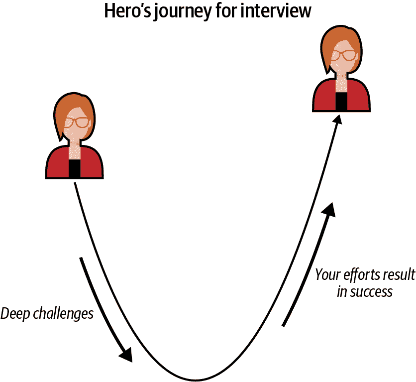
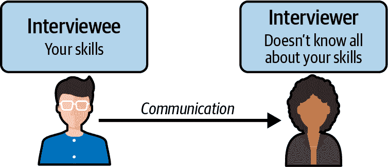
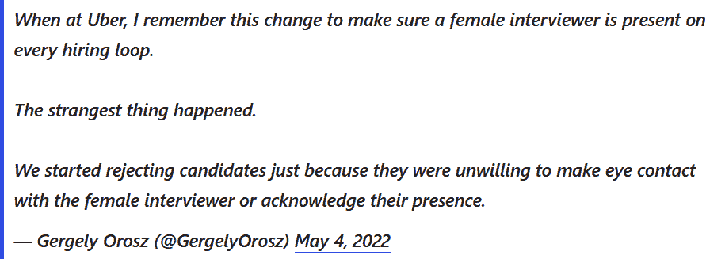

# 第七章：行为面试

面试的目标是评估候选人是否适合特定角色，这包括他们是否能够与团队良好合作。无论候选人在技术技能上有多么出色，如果他们不能与同事良好合作来完成项目，他们就无法交付项目。面试通过多种方式来识别优秀候选人，其中他们的机器学习/编码能力很重要，但并非面试官寻找的全部内容。本章重点介绍设计用于评估您在团队中适应性的面试问题。

换句话说：技术技能有最低要求，候选人至少需要足够的技能来通过技术面试。在这里设定标准，以确保聘用公司对候选人在技术层面能够胜任工作有信心。即使是通过了这一标准的候选人之间仍然存在差异；例如，一些候选人可能需要花费稍多一点时间来适应，但如果雇主期望他们至少能留下一年或更长时间，他们的编程技能的轻微差异在长期内不会造成很大影响。

那么，是什么让所有在技术面试中表现良好的候选人有所区别呢？面试官依赖于额外的措施，例如候选人的沟通能力如何，他们与同事合作的能力如何，他们是否能够良好接受反馈，他们是否具有成长思维等等。例如，一个具有过硬技术技能并达到要求的候选人，如果再加上强大的沟通能力，最终表现可能会比技术技能非常强但难以合作的候选人更好。

> 行为面试通常是整体面试的最重要组成部分。根据我的经验，大多数决定性因素是因为候选人的价值观和过去行为与公司或团队的原则不符合——相对于技术或软技能，这通常有更高的要求。
> 
> 亚马逊高级应用科学家 Eugene Yan

一般来说，只要你有自我意识并在沟通方式上使用常识，你的面试评估不会受到影响。我的观点是：候选人在面试中失败的一个简单方式是表现出他们很难共事。招聘团队知道那些自大、缺乏自我意识等特质的人很可能对团队造成负面影响，因此不会是一个好的招聘选择。

# 行为面试问题与回答

为了衡量面试技术部分未涵盖的所有因素，面试官使用*行为问题*。行为问题可以在专门的行为面试会话中提出，尽管它们也可以在技术面试中穿插进行。术语“行为问题”和“行为面试”在不同地区或不同行业可能有所不同。通常，这种类型的面试会关注所谓的*软技能*。

###### 提示

理解这些软技能对于你在机器学习项目中的技术贡献至关重要，除非你像经营一人创业公司一样。

这里有一些关于行为面试和问题测量的例子：

+   沟通技巧

+   协作和团队合作

+   领导技能

+   解决冲突的能力

+   候选人如何对待反馈

+   候选人如何应对不确定性和学习新技术/工具

+   候选人是否意识到他们的技术工作如何为团队构建的业务/产品做出贡献——有时被称为*产品感*。

这些问题可能会以以下格式出现：

+   “告诉我一个你处理过的冲突情况的例子。”例如，“告诉我一个你在某个机器学习项目中如何应对冲突的例子。”

+   “描述你曾面对过紧迫截止日期并如何应对的情况。”

+   “举一个你曾经为一个机器学习项目做的成功演示的例子，并描述你的准备过程。”

目标是根据你描述过去类似情况下的反应来衡量你作为同事的表现。请注意，行为问题通常是关于你真实的过去经历；不要将其与假设情境混淆，比如，“如果你在团队中遇到冲突的情景，你会怎么做？”

因此，重视行为面试准备作为你机器学习面试准备的关键部分是很重要的。你应该从列举你过去的项目、工作经验和其他相关经历开始。

## 使用 STAR 方法回答行为问题

在机器学习面试中，以及技术面试中，一种广为人知的结构化回答技巧是 STAR 方法。¹ 有了这种结构，确保你为面试官提供足够的背景信息，包括描述你过去经历的情境及你的行动带来的影响。STAR 方法在表 7-1 中有详细介绍。

表 7-1\. STAR 方法

| **情境** | 提供你的例子发生的情境背景。 |
| --- | --- |
| **任务** | 解释你在例子中负责的任务是什么。 |
| **行动** | 解释你在例子中成功应对情况所采取的步骤和行动。 |
| **结果** | 解释你的行动导致的结果和成果。 |

这里是一个例子问题和答案，答案遵循了 STAR 方法：

问题

“告诉我一个你在项目中遇到严重障碍的时间。你是如何克服它们的？”（业务术语表示导致进展受阻的情况）

回答

[*情境*] 我正在参与 Y 项目，即为公司的购物网站创建推荐系统。

[*任务*] 我负责训练机器学习模型，为公司的购物网站用户生成推荐。

[*行动*] 我与数据工程师合作，获取所需数据，并开始使用 XGBoost 训练基准模型。在这个过程中，我发现了对模型有益的新数据来源，最终迭代出了两种模型：一种在新用户上表现更好，另一种适用于现有用户。

[*结果*] 模型在线运行，并与在线实验中的对照组进行比较。最终，ML 驱动的方法比基准对照组提高了 2 倍的参与度指标。

这个答案做得很好的地方如下：

+   避免使用过多行话。

+   它提到了相比对照组 ML 模型的提升（改进）。

作为面试官，我觉得关于购物网站的更多细节可能会更好，但在实际情况中，可能上下文信息已经在早期问题中涵盖，面试者已经描述了他们在这个项目中的责任。此外，作为面试官，我会就我想了解更多的问题进行后续提问，比如“你训练的两种模型是什么？”

## 用英雄之旅法增强你的答案

有时候，仅仅使用 STAR 方法是不够的，特别是当候选人机械地按模板回答面试问题时，答案会显得枯燥和不容易记住。我建议使用英雄之旅法来增强用 STAR 方法构建的答案。目标是进一步描述你克服的挑战和为成功付出的巨大努力，从而使你的答案更具影响力。²

英雄之旅，或称为单一神话模式，是一种常见的故事模板，涉及一个英雄踏上冒险之旅，经历各种试炼和磨难。最终，他们凯旋而归，经历了变化或转变。一些主流媒体中的例子包括《狮子王》、《饥饿游戏》和《星球大战》。当你想起这些电影时，你最记得角色经历的是故事和他们克服的挑战，而不是初期设定世界和背景的场景，或者英雄返回后的几个场景庆祝的部分。

电影的结构通常是这样安排的：可能会用 15–20%的场景来设定背景，60–70%的时间用于描绘旅程和挑战，最后 10–15%的时间则用于振奋人心的结局。

当然，这种结构因故事而异。我想强调的主要观点是大部分时间都花在了旅程和挑战上。这就是为什么我建议在 STAR 方法之上采用这种结构。一个展示这种格式的引人入胜的故事，正如图 7-1 所示，将强调在冒险过程中遇到的挑战的描述，以及最初的催化剂和结果。

###### 图 7-1. 行为面试问题的英雄之旅。

现在，我将演示一个答案的例子，尽管遵循了 STAR 框架，但并不令人难忘或有影响力。回想一下前一节中的示例面试问题：“告诉我你在项目中遇到了困难的时候，你是如何克服的？”

我使用了仅基于 STAR 方法的示例答案；这里是如何通过英雄之旅使这个答案更加出色的示例：

[情境]

我正在进行 Y 项目的工作，这是为我们公司的购物网站创建一个推荐系统。

[任务]

我负责训练机器学习模型，为购物网站的用户生成推荐。

[行动]

我与数据工程部门合作，获取所需的数据，并开始使用 XGBoost 训练基线模型。

[英雄之旅，重点在挑战上]

在训练 XGBoost 模型时，出现了一个问题：整体表现并不理想。我分析了结果，找出了进一步调查的步骤；数据源的质量是正确的，因此我排除了数据质量问题。数据集包含匿名化的客户特征，例如他们最后一次访问购物网站的时间和最后一次购买的价值。然而，由于这些数据中并没有进一步的客户行为细节，模型无法捕捉到更多的细微差别。我向我的经理和团队的高级开发人员建议，我需要更多关于客户行为的遥测数据。在整合新数据之后，还有很长的路要走。新模型在新客户身上表现良好，但在现有客户身上表现不佳。因此，我将数据分开，并根据他们的账户年龄为每种用户类型分别使用两个模型，以达到最佳的整体表现。

[结果]

当我将模型训练的详细结果呈现给团队的各位高级成员以及产品团队后，这些模型被批准在线运行。它们在在线实验中与控制组进行了比较。最终，基于机器学习的方法相比基线控制组获得了 2 倍的参与度提升。

## 面试官的最佳实践和反馈

以下是作为面试官对示例答案的一些评论，这也是一般的最佳实践：

描述你克服的挑战有助于建立面试官对你作为面试者的信心。

作为面试官，这个答案将英雄的旅程方法添加到 STAR 框架上，比第一个示例答案更详细地描述了面试者在开发机器学习模型时面临的挑战。为什么这对面试官很重要？这种类型的答案能更好地展示你是一个能够自我解救（甚至你的团队）的雇员，如果你描述了过去遇到的困难的深度（具有挑战性的情况），面试官可以更有信心，如果你加入他们的公司，你可以做同样的事情。

挑战留下了更深刻的印象。

此外，作为面试官，当我听到并理解候选人遇到的困难的程度时，我能更好地记住它们。这也是向同事轻松解释为什么我支持这位候选人，而不是那些一切都顺利的候选人的一种简单方式。那些没有详细描述他们所面临挑战的面试者，可能实际上解决了比那些详细描述的面试者更困难的问题，但是（1）我不会知道，因此（2）留下的印象更少，我很难在候选人审查调查期间向同事描述它。

解释互动和合作，适时给予功绩。

这个答案不仅更清晰地描绘了情况和挑战，还提到了受访者的队友。面试官可能会对受访者是否具有跨团队沟通的能力感到好奇，或者至少是否与他们的经理或直属同事进行了沟通。由于面试的时间限制，面试官可能没有时间明确询问团队的范围。在最坏的情况下，面试官可能会对受访者没有提及任何合作者感到怀疑，因为面试者声称不是他们自己的工作的模式。

解释面试官可能不了解的上下文和任何具体术语。

一个常见的错误我见过求职者犯的是太快进入问题而不解释背景。当与同一家公司工作的人交谈时，期望你的同事具有一定的熟悉度是合理的，你通常可以跳过解释一个词的含义。但通常情况下在面试中，你可能正在与另一家公司的人交谈。不要说，“我在为 MyShopping 的 ML 模型工作”，而是说，“我在为 MyShopping 的 ML 模型工作，这是顾客可以用来浏览店面页面并支付购买的移动应用程序。”对于没有工作经验但描述学校项目的面试者，要注意不要使用学校术语而不解释它们。例如，在多伦多大学，计算机科学课程标记为 CSC，如 CSC 110Y1，但在滑铁卢大学，它们标记为 CS，如 CS 115。即使你认为面试官应该很容易理解你指的是什么，也要向他们解释任何缩写。

提供对面试官熟悉的可比较技术以解释术语。

不要假设每个人都记得技术的名称及其功能。例如，当提到 Trino 时，您也可以提到它在被重新品牌之前称为 Presto。或者，如果您正在解释过去项目中如何使用 Airflow，可以提到 Airflow 是一个用于创建和管理数据工作流的平台。此外，您还可以提到它与 MLflow 或 Dagster 有些相似之处等等。如果您知道正在面试的公司使用某种工具或技术，并且您使用该技术来解释您如何使用您的工具，那就更好了，例如，“我正在使用 Airflow，类似于您们提到使用 MLflow 的方式，这是…”根据我的经验，这与面试官的联系非常好，他们知道我在听取我们的讨论并且我在通话中与招聘人员问了信息丰富的问题。

根据听众调整详细程度。

能够以不同详细程度解释技术和非技术概念是很重要的。在一些面试中，尤其是现场最后一轮，你可能会与利益相关者如你将要合作的产品经理或者 ML 团队紧密合作的组织的负责人进行一到两个面试。在我的 ML 工作面试经验中，我遇到过这样的场景，通常每个面试会话持续一个小时。对于与产品导向人士的面试会话，我更加关注我的技术工作如何与产品相关或者如何影响业务，而不是深入探讨我为何选择某个 ML 评估指标的细节。延伸到这条规则的另一个方面，在与直接从事 ML 的面试官交谈时，仍需提供一些背景信息。例如，在我日常工作中对计算机视觉的经验不多，可能需要在计算机视觉领域的某些缩略语上得到提醒。如果你主要有强化学习的经验，但所面试的公司或团队并非专注于此，可能你的面试官需要更多关于强化学习的解释。

###### 提示

在由 ML 专家进行的行为面试中，你仍然应提供背景信息。一个合理的方式是记住他们为另一家公司/团队工作，可能在另一个领域是 ML 专家。

如图 7-2 所示，重要的不仅是你掌握的知识量和技能如何，如果在面试中的沟通无法让面试官理解，那么他们就无法了解你所有的优势和你能为他们团队带来的全部价值。花时间梳理如何在行为面试中使用你的沟通作为一个桥梁，帮助面试官更好地理解你，这将带来非常高的回报。

###### 图 7-2\. 面试中的沟通至关重要；如果你无法有效沟通，那么无论你的技能多么出色，也无法传达给面试官。

# 常见的行为问题和建议

现在我已经介绍了如何构建你对行为面试问题的回答结构，让我们直接深入一些常见的问题。

## 有关沟通技能的问题

1.  告诉我一个你不在同一团队的队友或同事理解一段代码或设计的时候，你是如何处理这种情况的？

    *面试官的视角*：一个需要考虑的问题是，候选人是否试图从除了他们自己团队同事的角度来解释问题，例如，通过提供更多的背景信息。

1.  告诉我一个你需要向非技术干系人员呈现的时候，你是如何准备的，结果如何？

    *面试官的视角*：询问候选人如何准备给我作为面试官提供更好的了解，了解他们的价值观以及他们是否对可能存在的沟通障碍有所观察。此外，通过询问他们如何准备，可以让我了解他们如何填补感知的空白，以使演示成功。

1.  描述一个你如何处理一个沮丧的队友或经理的时间。你是如何处理这种情况的？

    *面试官的视角*：候选人提到他们如何尝试解决冲突以及他们如何处理需要在中间见面的情况，这对我评估他们在紧张或高压环境中易于合作的程度也很有帮助。

## 关于协作和团队合作的问题

1.  告诉我一个你犯了错误并且你是如何处理的时间。

    *面试官的视角*：对我来说了解候选人如何处理犯错的情况是很有用的。他们会不惜一切代价掩盖吗？他们是否通过让错误的后果积聚来使情况变得更糟？还是他们会承认情况并提出解决方案？当你回答这类问题时，试着向面试官传达你重视协作和沟通的态度。

1.  当你在项目中进行一次艰难的对话时，有过什么经历？可以是与队友或你在指导的人之间。

    *面试官的视角*：当然，这个问题也涉及到沟通方面。从团队合作的角度来看，我认为了解候选人是否是那种愿意承担责任并找到让团队在这种困难对话和情况中更好地工作的方法是很有用的。

1.  告诉我一个你领导过项目的时间。

    *面试官的视角*：这是一个自由形式的问题，答案可以涉及到高级职位的一些重要方面。对于初级人员来说，这是一个评估你作为领导者如何对待团队成员的好问题。

## 如何回应反馈的问题

1.  告诉我一个你收到过重要反馈的时间。

1.  对于给予和接受反馈，你最看重什么？请举例说明。

1.  如果你能改变过去的任何决定，那会是什么，为什么？

## 处理挑战和学习新技能的问题

1.  告诉我一个你如何应对高压情况，比如紧迫的截止日期，以及你是如何度过的时间。

1.  告诉我一个你对工作或项目感到不满意的时间。你是如何改善情况的？回顾起来，有什么你会做得不同的地方吗？

1.  在过去，你是否需要为一个项目学习一门新的编程语言（或其他新技能）？你是如何确保它有效的？通过一个例子详细说明。

*面试官的角度*：重要的是澄清时间框架以及你学到的如何对项目有所贡献。分享你用来解决困境的方法并且在需要帮助时寻求帮助可以加分。这些对技术工作者非常重要，不仅限于机器学习，因为学会如何解除阻塞（包括尝试现有解决方案后向他人寻求帮助）可以展示出积极主动的态度，避免项目延迟。

这不是一个明确的标准，但根据我的经验，最重要的不是成为“全知全能”的人，而是成为一个愿意接受“初学者心态”并且快速学习的人。这对于在机器学习及科技行业中长期发展至关重要，因为技术每年变化非常快。

## 关于公司的问题

1.  您如何考虑自己的职业生涯，职位是否符合您的目标？

    *面试官的角度*：公司希望确保你的兴趣与职位相符。如果工作不吸引你，你可能更容易提前离职，这就是说，你有风险可能会流失。

1.  你了解公司、产品或团队的一些知识吗？

    *面试官的角度*：在面试之前花 10 分钟浏览公司网站、产品列表和职位发布，作为面试准备的一部分，以便刷新记忆。

## 关于工作项目的问题

1.  告诉我你曾经从零开始建立过什么。

1.  您能否详细介绍一下您最自豪的项目？

    *注意*：这些问题可以是技术面试的一部分，但回答这些问题需要良好的行为面试结构。

1.  您是否曾经使用数据来改进过流程或技术？

## 自由形式的问题

1.  你在工作中最激动的是什么？

1.  你在工作之外有什么爱好？

# 行为面试最佳实践

现在您已经看到一些示例问题，这里是回答行为面试问题时的最佳实践总结：

###### 提示

我建议在准备面试答案时，查看示例问题和最佳实践，以确保您涵盖了您的基础。

确保在较长回答或解释过程中偶尔暂停。

不要无休止地啰嗦而不给面试官插话的机会。现在越来越多的面试是通过虚拟进行的，因此偶尔暂停以便面试官回应尤为重要。如果看不到面试官的身体语言，这有助于创造更自然的对话。

快速总结您对面试官问题的理解。

这可以帮助你确认自己是否正确理解了问题，并给面试官纠正任何误解的机会，以免在错误的方向上花费大量时间回答问题。总结你的理解只需几秒钟，但可以节省几分钟！此外，我发现这为我的大脑提供了几个思考的瞬间，而不是试图在问题被问出后立刻回答。当然，如果你发现自己确实时间不足，你可以跳过这一步。

当有疑问时，请与面试官澄清。

与前一点一样，这是为了确保当你对某事不确定时不会陷入兔子洞。我宁愿安全而不抱歉地问。有些人因为担心提问会让他们显得不确定或缺乏信心而避免提问，但我认为情况恰恰相反：不确认你是否仍在正确的轨道上，可能会给人一种你过于紧张以至于不敢提问的印象。一个简单的“我应该继续讨论我的模型训练方法，还是您希望我转向模型评估？”就足够了。

面试是沟通的过程。

在面试中，通用的沟通规则同样适用。不要无故粗鲁，不要贬低或忽视面试官，并保持专业。查看一个忽视面试官的例子，应该避免在图 7-3 中看到。

###### 图 7-3\. 根据 Gergely Orosz 的推文引用（[完整线索](https://oreil.ly/-pOmb)）。

找到一种方法来利用你的过去经验，不管它是什么。

你可以找到一种方法将你过去的经验与你为何参加这次机器学习面试联系起来。有些人可能会认为提到他们非机器学习或非技术技能是在说谎，但我觉得在许多不同领域，可转移技能非常重要。

## 如果你没有相关工作经验，如何回答行为问题

### 如果你是学生

拥有一个自主的项目，而不仅仅是一切都交给你的东西，表明你是自主的。这需要额外的工作，但你可以通过定义自己的项目来获得自己的经验，比如一个提供机器学习预测的 Web 应用程序。你可以分解构建它所需的任务并执行它们。这些通常被称为*副项目*，不需要你支付数千美元或参加另一个在线课程或训练营。你可以利用这种经验来回答大量的技术和行为问题。

### 如果你在其他领域工作过

你肯定能够带来可转移的沟通和领导技能。如果你曾经管理过一个厨房，从事过服务行业工作或者做过收银员，那么你可能有一些令人难忘的故事，可以作为回答类似“告诉我你在工作中遇到困难情况的经历”的行为问题的答案。不要忽视你拥有的东西。

### 发挥创造力——创造自己的经验

曾经我和一位自学了大量 Python 技能的英语博士候选人进行了指导电话。他想知道如何正式展示自己的技能。我推荐了与我自己做过的相同的事情：找到一种方法将数据科学或 ML 融入到自主学习的学术任务中。作为英语项目的一部分，他们可以轻松地找到应用 NLP 技术的方式，将其应用于正式的学校项目。这相当于一举两得：既展示在 ML 简历上的一个伟大项目，又获得学术学分。

在我的例子中，在攻读硕士学位期间，我利用任何机会都在计量经济学作业中使用 Python，这是允许的（可以在 Stata、R 或其他工具中选择）。我不得不自行解决这个问题，因为大多数教材都是关于 Stata 或 R 的，我搜索了如何将这些程序的指令翻译成 Python。正如你所看到的，这不仅对回答技术问题有帮助，对于回答关于学习新技能和我遇到的挑战的行为问题也很有帮助。

## 高级+行为面试技巧

高级职位和更高级别（如员工或主管）的 ML 面试也将包括行为面试。在此处我将使用“高级+”来指代这些角色。回答这些问题的基本原则通常遵循本章的所有原则，但我想指出某些差异。

高级+面试将强调你是否能够与入门级聘用者区别开来，并且你必须在面试中证明这一点。高级 ML 贡献者将负责的示例包括：

+   你能够独立完成项目，并带领团队一同完成吗？

+   你能够在更困难的情况下找到答案并解决自己的问题吗？

+   你能够通过开发者的杠杆效应使你的团队更加高效吗？⁴

+   你能够指导初级队友吗？

+   你理解你的组织与你公司正在建设的产品之间的关系，并能够利用这一点取得成功吗？

+   你能够与其他团队良好合作，并且额外建立与利益相关者的信任吗？

要成功通过高级+角色的面试，你对面试问题的回答将与你为入门级角色准备的回答有所不同。例如，在入门级别，可能有人分配任务给你，如果你不理解构建 API 如何帮助产品的整体理念，那是可以的。但是在高级水平上，你的问题将要求更高的独立性标准，以及理解底层原因的能力（理解背后的原因），并且能够通过帮助每个人更加高效来成为团队的增值者。

对于员工和主要角色，你需要展示以上所有内容，但在更高的程度上。高级职位可能会与其直接团队及少数相邻团队合作，而员工以上职位需要与更大的组织和其他组织建立信任和关系。例如，员工以上的角色可能会与市场营销、财务、产品等部门共同合作，共同开发公司的主要产品。

# 大科技公司的具体准备示例

如果你在大科技公司面试，已知有一些准备方法。你需要额外努力确保你的答案合适，但这将是值得投入的努力。

知道每家公司都重视其价值观是非常必要的，因此需要量身定制你的行为面试问题。例如，我曾经费力确保我常用的一些领导行为面试问题也能涵盖亚马逊的“行动偏见”原则。

以下是一些示例。

## 亚马逊

亚马逊会告诉每一个机器学习/数据科学面试者要学习他们的[亚马逊领导原则](https://oreil.ly/Zw9Nr)，并在面试中展示足够的这些价值观。

在撰写本文时，其中一些原则包括：

+   客户痴迷

+   拥有权利

+   发明和简化

+   学习并保持好奇心

+   坚持最高标准

+   构想宏伟的未来

+   行动偏见

+   获得信任

+   有骨气；持异见并承诺

+   交付结果

我建议查看[亚马逊的官方页面](https://oreil.ly/healj)获取最新的原则信息，因为[有时会新增](https://oreil.ly/4kY5m)新原则。

这里有一些示例问题和相关原则：

坚持最高标准

告诉我，你曾经提升过团队/项目标准的时候。

学习并保持好奇心

告诉我，你因为好奇心而做出更好决策的经历。

拥有权利

告诉我，你在超越正常职责范围内做出更好决策的经历。

注意这些问题与其他地方提问的问题类似，但如果你在亚马逊面试，要映射到最接近的亚马逊领导原则，并确保在你的答案中涉及该原则。

> 我在亚马逊面试中的独特之处在于行为问题所占比例之大。这使得行为面试故事的准备工作变得更加紧张和有价值。领导原则非常重要，一旦你进入亚马逊，它们就更为重要。
> 
> Ammar，亚马逊的工程师

## Meta/Facebook

Meta 有[六大核心价值观](https://oreil.ly/rfkoO)。在撰写本文时，它们包括：

+   迅速行动

+   注重长期影响

+   创造令人印象深刻的东西

+   居住在未来

+   直接并尊重你的同事

+   Meta、Metamates、我

要重申我之前提到的建议，你需要把这些原则融入到你的行为问题回答中：你不仅仅是列出它们。

Meta 在行为面试中有五个评估信号。它们是：

+   解决冲突

+   持续成长

+   拥抱不确定性

+   推动结果

+   有效沟通

> 这些（五个信号）重点领域被选择，因为它们对在 Meta 的工作环境中茁壮成长至关重要。因此，在与 Meta 面试时，特别强调在这些领域表现出色。
> 
> Meta 的 MLE，Igor

通常情况下，我建议您查看 Meta 的[官方页面](https://oreil.ly/vqORg)，以获取关于其核心价值观和文化的最新信息。Meta 的一位招聘专员建议查看 Meta 职业资料（在邀请面试时可以创建资料）。Meta 职业资料推荐的公开资源包括：

+   [“在 Meta 面试成功的关键”](https://oreil.ly/7Exl0)

+   [“软件工程师，机器学习工程师：全循环面试准备指南”](https://oreil.ly/DIwaq)

+   [“在 Meta 成长职业的五种方式”](https://oreil.ly/kYbkY)

+   [“拥抱变革，演进她的工程之旅”](https://oreil.ly/80MTt)

+   [“机会与信任：在 Facebook 发展工程职业”](https://oreil.ly/XMPeH)

## Alphabet/Google

Google 以试图衡量其面试者的“Googleyness”而闻名⁵，并且有一个题为[“我们所知道的十件真理”](https://oreil.ly/1_aaE)的关于页面帖子，列出了 Google 看重的几个重要价值观。

*Googleyness* 据说没有一个简单的定义，但这里有一个例子。Laszlo Block（Google 前人力资源主管，也是《工作规则》的作者[*Work Rules*](https://oreil.ly/WEroL)*!*)将“Googleyness”定义为：

> 喜欢享乐等特质（谁不喜欢），一定的智力谦逊（如果不能承认可能是错误的话很难学习），高度的责任感（我们想要拥有者，而不是员工），能够处理不明确情况的能力（我们不知道业务如何发展，而在 Google 内部航行需要处理许多不明确情况），以及你在生活中采取了一些勇敢或有趣的路径的证据。

其他资源包括《商业内幕》的一篇文章[概述了 Google 在其员工中寻找的 13 种品质](https://oreil.ly/6HjNA)。此外，像逻辑思维能力、角色相关知识和经验以及领导力这样的特质在您的[行为面试](https://oreil.ly/NV9XF)⁶中将非常重要。

> 他们关心“Googleyness”的原因是因为 Google 希望即使在开发者更年轻时也能保持很大的独立性。
> 
> Google 的工程师（审阅本章）

## Netflix

Netflix 有其[“文化宣言”](https://oreil.ly/UXQqD)。在“职位和文化”网站上列出了 Netflix 作为公司所重视的一些重要价值观。在撰写本文时，它们包括：

+   受重视的行为（如勇气、沟通、包容等）

+   诚实而富有成效的反馈

+   梦幻团队

+   自由和责任

+   信息负责人

+   意见不合而后决定

+   代表性很重要

+   艺术表达

要深入了解这些观点的每一点，我鼓励您查看[Netflix 的官方网页](https://oreil.ly/UXQqD)，其中包括这些价值观的详细信息。

> Netflix 的面试过程（技术和非技术）更依赖于团队，并且该过程也更加注重公司的价值观和文化适配。这就是为什么 Netflix 的文化宣言如此重要。理解 Netflix 运营方式的绝佳来源是书籍[*No Rules Rules*](https://oreil.ly/Byx_7)。
> 
> 路易斯，Netflix 的 ML 工程师。

这只是一些例子的非尽头列表，但希望您可以看到如何为每个不同的公司做准备。无论公司大小，我建议您快速查看其招聘页面，看看是否列出了像这样的价值观；这些可能是面试官评估您的标准！

花时间研究这些信息也是“猜测”有保障问题的一种简单方法。例如，在 Elastic（Elasticsearch）中，这些值被称为[源代码](https://oreil.ly/UkVY2)。在面试中，我们会询问候选人是否知道这一点，以及源代码中他们最喜欢的部分是什么。

###### 提示

被另一家公司收购的公司可能会使用其新母公司的标准。例如，几年前我在 Twitch（被亚马逊收购）面试时，Twitch 建议我也看看亚马逊的领导原则，这也得到了我与的一名亚马逊员工的确认。请注意，这可能会因团队而异。如果有疑问，请向您的招聘专员咨询。

# 概要

在本章中，我讨论了各种结构化回答行为面试问题的方法，即 STAR 方法和英雄之旅。接下来，我们看了看各种行为面试问题的常见类别，并提供了每种问题的示例。然后，我们探讨了行为面试问题的各种最佳实践。最后，我们从亚马逊、Meta/Facebook、Alphabet/Google 和 Netflix 提供了一些大型科技公司的最佳实践示例。我还提出了一些关于如何调整您的行为面试答案以适应其他公司的建议。

¹ 您可以在“使用 STAR 方法进行下一次行为面试”中了解更多关于 STAR 方法的信息，麻省理工学院职业咨询和职业发展部门，于 2023 年 10 月 24 日访问，[*https://oreil.ly/wiO9h*](https://oreil.ly/wiO9h)。

² 我首次看到类似方法提及是在 Steve Huynh 的“A Life Engineered”发布的[视频](https://oreil.ly/K8GW9)中。

³ “单一神话：英雄之旅”，伯克利 ORIAS，于 2023 年 10 月 24 日访问，[*https://oreil.ly/zjWAc*](https://oreil.ly/zjWAc)。

⁴ 要了解更多信息，请参阅我的博文，“从初级到高级开发者——用开发者影响力加倍效果”，2021 年 6 月 20 日，[*https://oreil.ly/TOgB4*](https://oreil.ly/TOgB4)。

⁵ 玛丽·迈森扎尔（Mary Meisenzahl），“谷歌在 2017 年对‘Googleyness’（新员工重视的关键价值观）进行了一项小而重要的改变”，*Business Insider*，2019 年 10 月 31 日，[*https://oreil.ly/HKQ3X*](https://oreil.ly/HKQ3X).

⁶ “如何通过谷歌行为面试成功：一份指南”，*Google Exponent*（博客），于 2023 年 10 月 24 日访问，[*https://oreil.ly/kcsHf*](https://oreil.ly/A0H0k)

[*OceanofPDF.com*](https://oceanofpdf.com)
