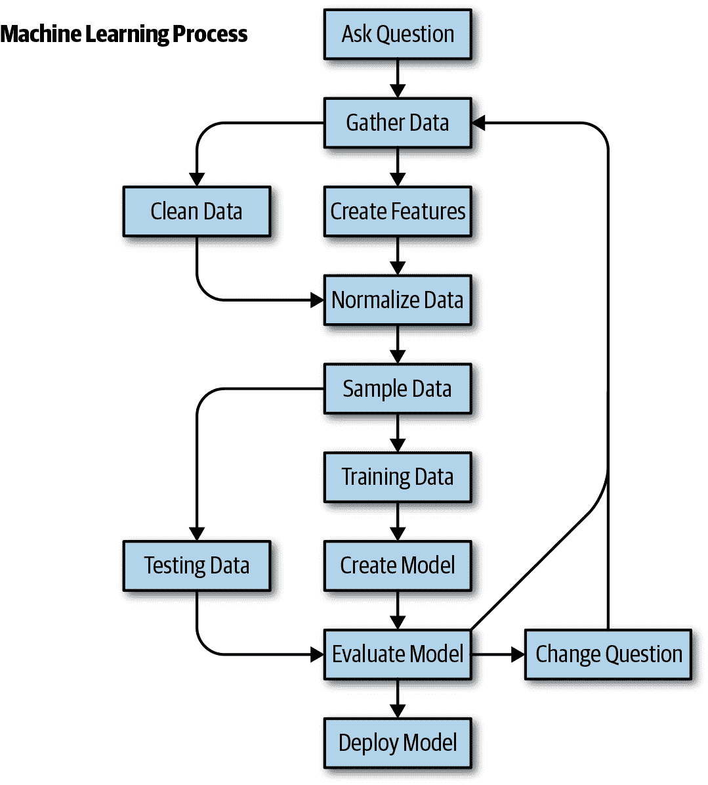

# 第二章\. 机器学习流程概述

数据挖掘的跨行业标准过程（CRISP-DM）是一种进行数据挖掘的过程。它包括几个步骤，可供持续改进参考。它们包括：

+   业务理解

+   数据理解

+   数据准备

+   建模

+   评估

+   部署

图 2-1 展示了我创建预测模型的工作流程，该模型扩展了 CRISP-DM 方法论。下一章节中的详细步骤将覆盖这些基本步骤。

###### 图 2-1\. 机器学习的通用工作流程。
