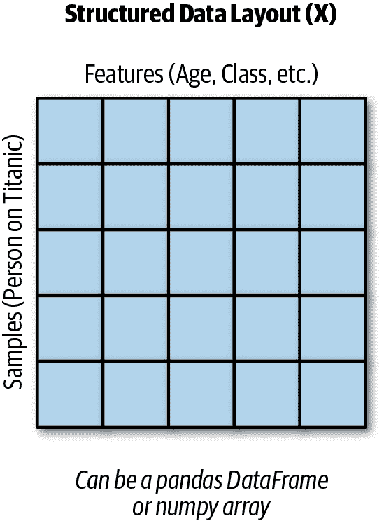
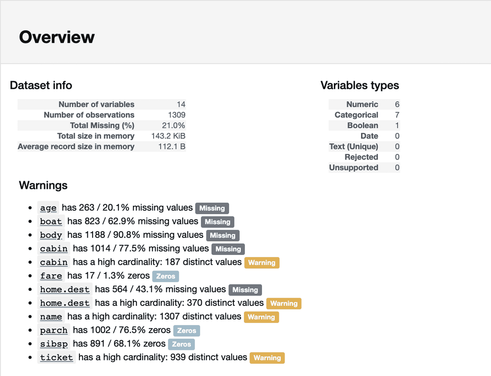
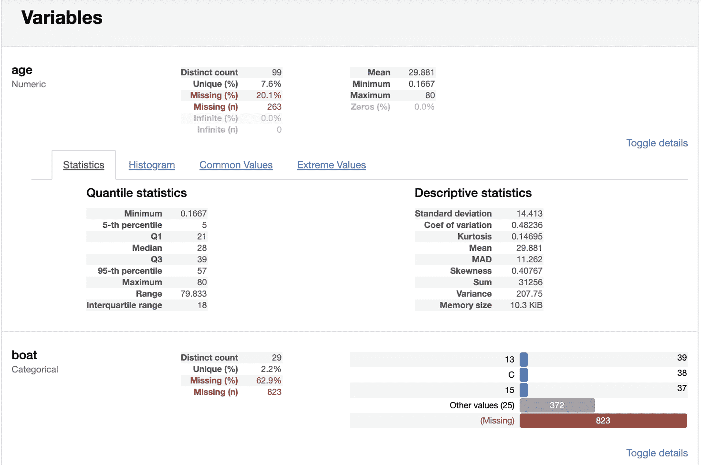
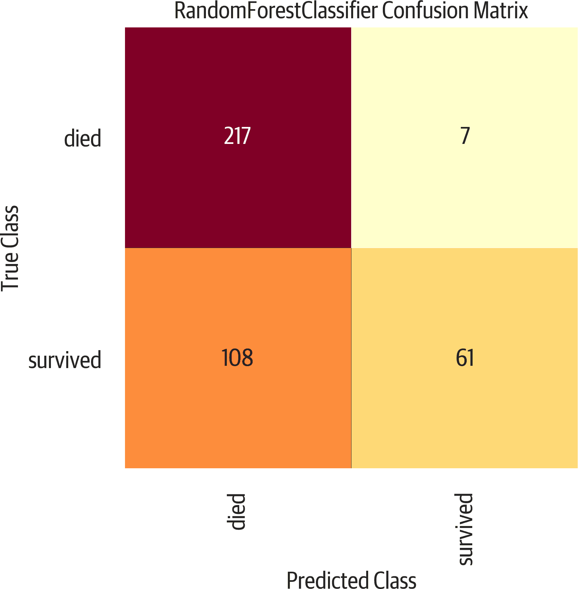
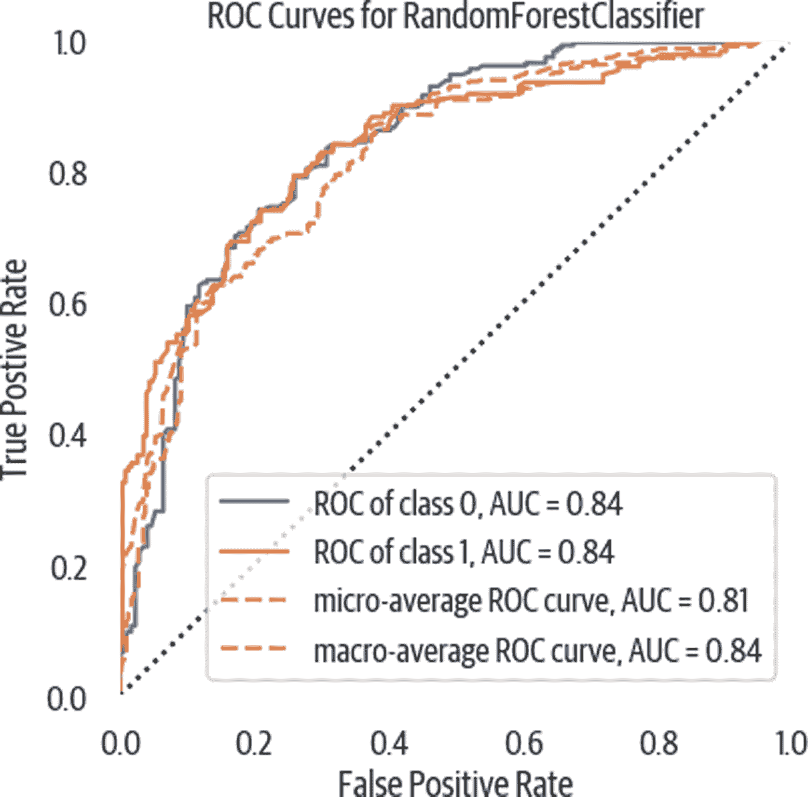
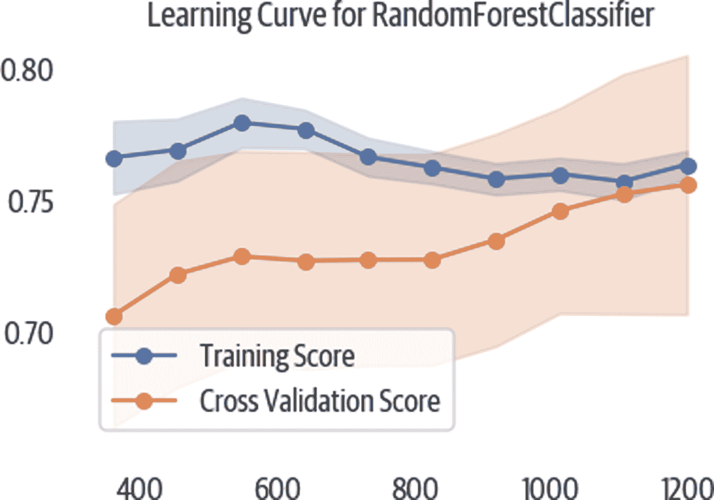

# 第三章。分类演练：泰坦尼克数据集

本章将通过使用[泰坦尼克数据集](https://oreil.ly/PjceO)来解决一个常见的分类问题。后面的章节将深入探讨并扩展在分析过程中执行的常见步骤。

# 项目布局建议

进行探索性数据分析的一个很好的工具是[Jupyter](https://jupyter.org)。Jupyter 是一个支持 Python 和其他语言的开源笔记本环境。它允许您创建代码或 Markdown 内容的*单元格*。

我倾向于使用 Jupyter 有两种模式。一种是用于探索性数据分析和快速尝试。另一种是更多地以可交付的方式使用，我使用 Markdown 单元格格式化报告，并插入代码单元格以说明重要的观点或发现。如果你不小心，你的笔记本可能需要一些重构和应用软件工程实践（删除全局变量，使用函数和类等）。

[cookiecutter 数据科学包](https://oreil.ly/86jL3)建议了一个布局，用于创建一个分析，以便轻松复制和共享代码。

# 导入

这个例子主要基于[pandas](http://pandas.pydata.org/)、[scikit-learn](https://scikit-learn.org/)和[Yellowbrick](http://www.scikit-yb.org/)。pandas 库为我们提供了方便的数据整理工具。scikit-learn 库具有出色的预测建模能力，而 Yellowbrick 是一个用于评估模型的可视化库。

```py
>>> import matplotlib.pyplot as plt
>>> import pandas as pd
>>> from sklearn import (
...     ensemble,
...     preprocessing,
...     tree,
... )
>>> from sklearn.metrics import (
...     auc,
...     confusion_matrix,
...     roc_auc_score,
...     roc_curve,
... )
>>> from sklearn.model_selection import (
...     train_test_split,
...     StratifiedKFold,
... )
>>> from yellowbrick.classifier import (
...     ConfusionMatrix,
...     ROCAUC,
... )
>>> from yellowbrick.model_selection import (
...     LearningCurve,
... )
```

###### 警告

您可能会发现在线文档和示例包括星号导入，例如：

```py
from pandas import *
```

避免使用星号导入。显式表达会使您的代码更易于理解。

# 提出问题

在这个例子中，我们想要创建一个预测模型来回答一个问题。它将根据个人和旅行特征对个体是否在泰坦尼克号船难中幸存进行分类。这是一个玩具示例，但它作为一个教学工具，展示了建模的许多步骤。我们的模型应该能够获取乘客信息并预测该乘客在泰坦尼克号上是否会幸存。

这是一个分类问题，因为我们正在预测幸存的标签；他们是否幸存下来。

# 数据术语

我们通常用一个数据矩阵来训练模型。（我更喜欢使用 pandas DataFrames，因为它很方便有列标签，但 numpy 数组也可以使用。）

对于监督学习，如回归或分类，我们的目的是有一个将特征转换为标签的函数。如果我们将其写成代数公式，它会像这样：

```py
y = f(X)
```

X 是一个矩阵。每一行代表数据的一个*样本*或关于一个个体的信息。X 中的每一列都是一个*特征*。我们函数的输出 y 是一个包含标签（用于分类）或值（用于回归）的向量（见图 3-1）。



###### 图 3-1。结构化数据布局。

这是标准命名过程，用于命名数据和输出。如果您阅读学术论文或查看库的文档，它们会遵循这种约定。在 Python 中，我们使用变量名`X`来保存样本数据，即使变量的大写是违反标准命名约定（PEP 8）的。不用担心，每个人都这样做，如果您将变量命名为`x`，可能会让人觉得有点奇怪。变量`y`存储标签或目标。

表 3-1 显示了一个基本数据集，包括两个样本和每个样本的三个特征。

表 3-1\. 样本（行）和特征（列）

| pclass | age | sibsp |
| --- | --- | --- |
| 1 | 29 | 0 |
| 1 | 2 | 1 |

# 收集数据

我们将加载一个 Excel 文件（确保已安装 pandas 和 xlrd¹），其中包含泰坦尼克号的特征。它有许多列，包括一个包含个体生存情况的 survived 列：

```py
>>> url = (
...     "http://biostat.mc.vanderbilt.edu/"
...     "wiki/pub/Main/DataSets/titanic3.xls"
... )
>>> df = pd.read_excel(url)
>>> orig_df = df
```

数据集包括以下列：

+   pclass - 乘客等级（1 = 1 等，2 = 2 等，3 = 3 等）

+   生存 - 生存（0 = 否，1 = 是）

+   姓名 - 姓名

+   性别 - 性别

+   年龄 - 年龄

+   sibsp - 船上兄弟姐妹/配偶的数量

+   parch - 船上父母/子女的数量

+   票 - 票号

+   票价 - 乘客票价

+   舱室 - 舱室

+   登船 - 登船点（C = 瑟堡，Q = 皇后镇，S = 南安普顿）

+   船 - 救生艇

+   尸体 - 尸体识别号码

+   家庭/目的地 - 家庭/目的地

Pandas 可以读取此电子表格，并将其转换为 DataFrame。我们需要抽查数据，并确保可以进行分析。

# 清洗数据

一旦我们拥有数据，我们需要确保它以我们可以用来创建模型的格式存在。大多数 scikit-learn 模型要求我们的特征是数字（整数或浮点数）。此外，如果模型传递了缺失值（pandas 或 numpy 中的`NaN`），许多模型将失败。某些模型如果数据经过*标准化*（具有平均值为 0 和标准偏差为 1）处理，性能会更好。我们将使用 pandas 或 scikit-learn 解决这些问题。此外，泰坦尼克号数据集具有*泄漏*特征。

泄漏特征是包含有关未来或目标信息的变量。拥有关于目标的数据并不是坏事，并且在模型创建时我们经常会有这些数据。然而，如果这些变量在我们对新样本进行预测时不可用，我们应该将它们从模型中删除，因为它们会泄漏未来的数据。

清洗数据可能需要一些时间。最好有专业主题专家（SME），可以提供处理异常值或缺失数据的指导。

```py
>>> df.dtypes
pclass         int64
survived       int64
name          object
sex           object
age          float64
sibsp          int64
parch          int64
ticket        object
fare         float64
cabin         object
embarked      object
boat          object
body         float64
home.dest     object
dtype: object
```

我们通常看到`int64`，`float64`，`datetime64[ns]`或`object`。这些是 pandas 用于存储数据列的类型。`int64`和`float64`是数值类型。`datetime64[ns]`存储日期和时间数据。`object`通常意味着它存储字符串数据，虽然可能是字符串和其他类型的组合。

在从 CSV 文件读取时，pandas 将尝试将数据强制转换为适当的类型，但会退回到 `object`。从电子表格、数据库或其他系统读取数据可能会提供 DataFrame 中更好的类型。无论如何，浏览数据并确保类型合理都是值得的。

整数类型通常没问题。浮点类型可能有一些缺失值。日期和字符串类型将需要转换或用于特征工程数字类型。低基数的字符串类型称为分类列，从中创建虚拟列可能是值得的（`pd.get_dummies` 函数负责此操作）。

###### 注意

在 pandas 0.23 版本之前，如果类型为 `int64`，我们可以确保没有缺失值。如果类型为 `float64`，值可能是所有浮点数，也可能是类似整数的数字，带有缺失值。pandas 库将具有缺失数字的整数值转换为浮点数，因为这种类型支持缺失值。`object` 通常意味着字符串类型（或字符串和数字混合）。

从 pandas 0.24 开始，有一个新的 `Int64` 类型（请注意大小写）。这不是默认的整数类型，但您可以强制转换为此类型并支持缺失数字。

pandas-profiling 库包括一个配置报告。您可以在笔记本中生成此报告。它将总结列的类型，并允许您查看分位数统计、描述统计、直方图、常见值和极端值的详细信息（见图 3-2 和 3-3）：

```py
>>> import pandas_profiling
>>> pandas_profiling.ProfileReport(df)
```



###### 图 3-2\. Pandas-profiling 概要。



###### 图 3-3\. Pandas-profiling 变量详细信息。

使用 DataFrame 的 `.shape` 属性来检查行数和列数：

```py
>>> df.shape
(1309, 14)
```

使用 `.describe` 方法获取摘要统计信息，并查看非空数据的计数。此方法的默认行为是仅报告数值列。这里的输出被截断，仅显示前两列：

```py
>>> df.describe().iloc[:, :2]
 pclass     survived
count  1309.000000  1309.000000
mean      2.294882     0.381971
std       0.837836     0.486055
min       1.000000     0.000000
25%       2.000000     0.000000
50%       3.000000     0.000000
75%       3.000000     1.000000
max       3.000000     1.000000
```

计数统计仅包括不是 NaN 的值，因此用于检查列是否缺少数据是有用的。还可以通过查看最小值和最大值来检查是否存在异常值。总结统计是一种方法。绘制直方图或箱线图是稍后将要看到的视觉表示。

我们将需要处理缺失数据。使用 `.isnull` 方法查找具有缺失值的列或行。在 DataFrame 上调用 `.isnull` 返回一个新的 DataFrame，其中每个单元格包含 `True` 或 `False` 值。在 Python 中，这些值分别计算为 `1` 和 `0`，这使我们可以对它们进行求和或计算缺失百分比（通过计算均值）。

代码指示每列中缺失数据的计数：

```py
>>> df.isnull().sum()
pclass          0
survived        0
name            0
sex             0
age           263
sibsp           0
parch           0
ticket          0
fare            1
cabin        1014
embarked        2
boat          823
body         1188
home.dest     564
dtype: int64
```

###### 提示

用`.mean`替换`.sum`以获得 null 值的百分比。默认情况下，调用这些方法将沿着 axis 0（沿着索引）应用操作。如果你想获得每个样本的缺失特征的计数，你可以沿 axis 1（沿着列）应用此方法：

```py
>>> df.isnull().sum(axis=1).loc[:10]
0    1
1    1
2    2
3    1
4    2
5    1
6    1
7    2
8    1
9    2
dtype: int64
```

一家中小企业可以帮助确定如何处理缺失数据。年龄列可能是有用的，所以保留它并插值值可能会为模型提供一些信号。大多数值缺失的列（舱位、船和尸体）往往没有提供价值，可以删除。

body 列（身体识别号）对于许多行来说是缺失的。无论如何，我们都应该删除这一列，因为它泄漏了数据。这一列表示乘客没有生存；我们的模型可能会利用这一点来作弊。我们会把它拿出来。（如果我们创建一个模型来预测乘客是否会死亡，知道他们有一个身体识别号的先验信息会让我们知道他们已经死了。我们希望我们的模型不知道这些信息，而是根据其他列进行预测。）同样，船列泄漏了相反的信息（乘客幸存了）。

让我们来看看一些缺失数据的行。我们可以创建一个布尔数组（一个包含`True`或`False`以指示行是否有缺失数据的系列），并使用它来检查缺失数据的行：

```py
>>> mask = df.isnull().any(axis=1)

>>> mask.head()  # rows
0    True
1    True
2    True
3    True
4    True
dtype: bool

>>> df[mask].body.head()
0      NaN
1      NaN
2      NaN
3    135.0
4      NaN
Name: body, dtype: float64
```

我们稍后将为年龄列填充（或推导出）缺失值。

类型为`object`的列往往是分类的（但它们也可能是高基数字符串数据，或者是列类型的混合）。对于我们认为是分类的`object`列，可以使用`.value_counts`方法来检查值的计数：

```py
>>> df.sex.value_counts(dropna=False)
male      843
female    466
Name: sex, dtype: int64
```

请记住，pandas 通常会忽略 null 或 NaN 值。如果你想包括这些值，请使用`dropna=False`来显示 NaN 的计数：

```py
>>> df.embarked.value_counts(dropna=False)
S      914
C      270
Q      123
NaN      2
Name: embarked, dtype: int64
```

对于处理缺失的登船值，我们有几个选项。使用 S 可能看起来是合乎逻辑的，因为那是最常见的值。我们可以深入研究数据，尝试确定是否有其他更好的选项。我们也可以删除这两个值。或者，因为这是分类的，我们可以忽略它们，并使用 pandas 来创建虚拟列，如果这两个样本只是每个选项都有 0 个条目的话。对于这个特征，我们将选择后者。

# 创建特征

我们可以删除没有方差或没有信号的列。在这个数据集中没有这样的特征，但是如果有一个名为“is human”的列，其中每个样本都有 1，那么这一列将不提供任何信息。

或者，除非我们正在使用自然语言处理或从文本列中提取数据，其中每个值都不同，否则模型将无法利用此列。姓名列就是一个例子。有些人已经从姓名中提取了标题 t，并将其视为分类。

我们还想删除泄露信息的列。船和 body 列都泄漏了乘客是否幸存的信息。

pandas 的`.drop`方法可以删除行或列：

```py
>>> name = df.name
>>> name.head(3)
0      Allen, Miss. Elisabeth Walton
1     Allison, Master. Hudson Trevor
2       Allison, Miss. Helen Loraine
Name: name, dtype: object

>>> df = df.drop(
...     columns=[
...         "name",
...         "ticket",
...         "home.dest",
...         "boat",
...         "body",
...         "cabin",
...     ]
... )
```

我们需要从字符串列创建虚拟列。这将为性别和登船港口创建新的列。Pandas 提供了一个方便的`get_dummies`函数来实现：

```py
>>> df = pd.get_dummies(df)

>>> df.columns
Index(['pclass', 'survived', 'age', 'sibsp',
 'parch', 'fare', 'sex_female', 'sex_male',
 'embarked_C', 'embarked_Q', 'embarked_S'],
 dtype='object')
```

此时，性别 _male 和性别 _female 列是完全逆相关的。通常我们会删除任何具有完美或非常高正负相关性的列。多重共线性可能会影响某些模型中特征重要性和系数的解释。以下是删除性别 _male 列的代码：

```py
>>> df = df.drop(columns="sex_male")
```

或者，我们可以在`get_dummies`调用中添加一个`drop_first=True`参数：

```py
>>> df = pd.get_dummies(df, drop_first=True)

>>> df.columns
Index(['pclass', 'survived', 'age', 'sibsp',
 'parch', 'fare', 'sex_male',
 'embarked_Q', 'embarked_S'],
 dtype='object')
```

创建一个带有特征的 DataFrame（`X`）和一个带有标签的系列（`y`）。我们也可以使用 numpy 数组，但那样我们就没有列名了：

```py
>>> y = df.survived
>>> X = df.drop(columns="survived")
```

###### 提示

我们可以使用[pyjanitor 库](https://oreil.ly/_IWbA)来替换最后两行：

```py
>>> import janitor as jn
>>> X, y = jn.get_features_targets(
...     df, target_columns="survived"
... )
```

# 示例数据

我们总是希望在不同的数据集上进行训练和测试。否则，你不会真正知道你的模型在未见过的数据上的泛化能力。我们将使用 scikit-learn 将 30%的数据分离出来进行测试（使用`random_state=42`以消除比较不同模型时的随机性影响）：

```py
>>> X_train, X_test, y_train, y_test = model_selection.train_test_split(
...     X, y, test_size=0.3, random_state=42
... )
```

# 插补数据

年龄列存在缺失值。我们需要从数值中插补年龄。我们只想在训练集上进行插补，然后使用该插补器填充测试集的数据。否则我们会泄漏数据（通过向模型提供未来信息来作弊）。

现在我们有了测试和训练数据，我们可以在训练集上填补缺失值，并使用训练好的插补器填补测试数据集。[fancyimpute 库](https://oreil.ly/Vlf9e)实现了许多算法。不幸的是，这些算法大多数不是以*归纳*的方式实现的。这意味着你不能先调用`.fit`再调用`.transform`，这也意味着你不能基于模型训练的方式来对新数据进行插补。

`IterativeImputer`类（原本在 fancyimpute 中，但已迁移到 scikit-learn）支持归纳模式。要使用它，我们需要添加一个特殊的实验性导入（从 scikit-learn 版本 0.21.2 开始）：

```py
>>> from sklearn.experimental import (
...     enable_iterative_imputer,
... )
>>> from sklearn import impute
>>> num_cols = [
...     "pclass",
...     "age",
...     "sibsp",
...     "parch",
...     "fare",
...     "sex_female",
... ]

>>> imputer = impute.IterativeImputer()
>>> imputed = imputer.fit_transform(
...     X_train[num_cols]
... )
>>> X_train.loc[:, num_cols] = imputed
>>> imputed = imputer.transform(X_test[num_cols])
>>> X_test.loc[:, num_cols] = imputed
```

如果我们想使用中位数进行插补，我们可以使用 pandas 来实现：

```py
>>> meds = X_train.median()
>>> X_train = X_train.fillna(meds)
>>> X_test = X_test.fillna(meds)
```

# 标准化数据

对数据进行归一化或预处理后，许多模型的性能会有所提高。特别是那些依赖距离度量来确定相似性的模型。（请注意，树模型会单独处理每个特征，因此不需要此要求。）

我们将对数据进行标准化预处理。标准化是将数据转换为均值为零、标准差为一的形式。这样模型不会认为具有较大数值范围的变量比具有较小数值范围的变量更重要。我将结果（numpy 数组）放回到 pandas DataFrame 中，以便更轻松地进行操作（并保留列名）。

我通常也不会对虚拟列进行标准化，所以我会忽略它们：

```py
>>> cols = "pclass,age,sibsp,fare".split(",")
>>> sca = preprocessing.StandardScaler()
>>> X_train = sca.fit_transform(X_train)
>>> X_train = pd.DataFrame(X_train, columns=cols)
>>> X_test = sca.transform(X_test)
>>> X_test = pd.DataFrame(X_test, columns=cols)
```

# 重构

在这一点上，我喜欢重构我的代码。我通常制作两个函数。一个用于一般清理，另一个用于将其分成训练和测试集，并执行那些需要在这些集上以不同方式进行的突变：

```py
>>> def tweak_titanic(df):
...     df = df.drop(
...         columns=[
...             "name",
...             "ticket",
...             "home.dest",
...             "boat",
...             "body",
...             "cabin",
...         ]
...     ).pipe(pd.get_dummies, drop_first=True)
...     return df

>>> def get_train_test_X_y(
...     df, y_col, size=0.3, std_cols=None
... ):
...     y = df[y_col]
...     X = df.drop(columns=y_col)
...     X_train, X_test, y_train, y_test = model_selection.train_test_split(
...         X, y, test_size=size, random_state=42
...     )
...     cols = X.columns
...     num_cols = [
...         "pclass",
...         "age",
...         "sibsp",
...         "parch",
...         "fare",
...     ]
...     fi = impute.IterativeImputer()
...     X_train.loc[
...         :, num_cols
...     ] = fi.fit_transform(X_train[num_cols])
...     X_test.loc[:, num_cols] = fi.transform(
...         X_test[num_cols]
...     )
...
...     if std_cols:
...         std = preprocessing.StandardScaler()
...         X_train.loc[
...             :, std_cols
...         ] = std.fit_transform(
...             X_train[std_cols]
...         )
...         X_test.loc[
...             :, std_cols
...         ] = std.transform(X_test[std_cols])
...
...     return X_train, X_test, y_train, y_test

>>> ti_df = tweak_titanic(orig_df)
>>> std_cols = "pclass,age,sibsp,fare".split(",")
>>> X_train, X_test, y_train, y_test = get_train_test_X_y(
...     ti_df, "survived", std_cols=std_cols
... )
```

# 基线模型

创建一个做某些非常简单的基线模型可以让我们有比较的依据。请注意，使用默认的`.score`结果给出的是准确率，这可能会误导。一个问题，其中正例是 10,000 中的 1，通过始终预测负例很容易得到超过 99%的准确率。

```py
>>> from sklearn.dummy import DummyClassifier
>>> bm = DummyClassifier()
>>> bm.fit(X_train, y_train)
>>> bm.score(X_test, y_test)  # accuracy
0.5292620865139949

>>> from sklearn import metrics
>>> metrics.precision_score(
...     y_test, bm.predict(X_test)
... )
0.4027777777777778
```

# 不同的家族

这段代码尝试了多种算法家族。"没有免费午餐"定理指出，没有一个算法能在所有数据上表现良好。然而，对于某些有限的数据集，可能有一个算法能够在该集上表现良好。（这些天结构化学习的流行选择是一种树提升算法，如 XGBoost。）

在这里，我们使用几个不同的家族，并使用 k 折交叉验证比较 AUC 得分和标准差。一个平均分数稍微低一些但标准差较小的算法可能是一个更好的选择。

因为我们使用了 k 折交叉验证，我们将向模型提供所有的`X`和`y`：

```py
>>> X = pd.concat([X_train, X_test])
>>> y = pd.concat([y_train, y_test])
>>> from sklearn import model_selection
>>> from sklearn.dummy import DummyClassifier
>>> from sklearn.linear_model import (
...     LogisticRegression,
... )
>>> from sklearn.tree import DecisionTreeClassifier
>>> from sklearn.neighbors import (
...     KNeighborsClassifier,
... )
>>> from sklearn.naive_bayes import GaussianNB
>>> from sklearn.svm import SVC
>>> from sklearn.ensemble import (
...     RandomForestClassifier,
... )
>>> import xgboost

>>> for model in [
...     DummyClassifier,
...     LogisticRegression,
...     DecisionTreeClassifier,
...     KNeighborsClassifier,
...     GaussianNB,
...     SVC,
...     RandomForestClassifier,
...     xgboost.XGBClassifier,
... ]:
...     cls = model()
...     kfold = model_selection.KFold(
...         n_splits=10, random_state=42
...     )
...     s = model_selection.cross_val_score(
...         cls, X, y, scoring="roc_auc", cv=kfold
...     )
...     print(
...         f"{model.__name__:22}  AUC: "
...         f"{s.mean():.3f} STD: {s.std():.2f}"
...     )
DummyClassifier         AUC: 0.511  STD: 0.04
LogisticRegression      AUC: 0.843  STD: 0.03
DecisionTreeClassifier  AUC: 0.761  STD: 0.03
KNeighborsClassifier    AUC: 0.829  STD: 0.05
GaussianNB              AUC: 0.818  STD: 0.04
SVC                     AUC: 0.838  STD: 0.05
RandomForestClassifier  AUC: 0.829  STD: 0.04
XGBClassifier           AUC: 0.864  STD: 0.04
```

# 堆叠

如果你在走 Kaggle 的路线（或者想要以解释性为代价的最大性能），*堆叠* 是一个选项。堆叠分类器使用其他模型的输出来预测目标或标签。我们将使用之前模型的输出并将它们结合起来，看看堆叠分类器是否可以做得更好：

```py
>>> from mlxtend.classifier import (
...     StackingClassifier,
... )
>>> clfs = [
...     x()
...     for x in [
...         LogisticRegression,
...         DecisionTreeClassifier,
...         KNeighborsClassifier,
...         GaussianNB,
...         SVC,
...         RandomForestClassifier,
...     ]
... ]
>>> stack = StackingClassifier(
...     classifiers=clfs,
...     meta_classifier=LogisticRegression(),
... )
>>> kfold = model_selection.KFold(
...     n_splits=10, random_state=42
... )
>>> s = model_selection.cross_val_score(
...     stack, X, y, scoring="roc_auc", cv=kfold
... )
>>> print(
...     f"{stack.__class__.__name__}  "
...     f"AUC: {s.mean():.3f}  STD: {s.std():.2f}"
... )
StackingClassifier  AUC: 0.804  STD: 0.06
```

在这种情况下，看起来性能稍微下降了一点，以及标准差。

# 创建模型

我将使用随机森林分类器来创建一个模型。这是一个灵活的模型，往往能够给出不错的开箱即用结果。记得用我们之前拆分的训练和测试数据（调用`.fit`）来训练它：

```py
>>> rf = ensemble.RandomForestClassifier(
...     n_estimators=100, random_state=42
... )
>>> rf.fit(X_train, y_train)
RandomForestClassifier(bootstrap=True,
 class_weight=None, criterion='gini',
 max_depth=None, max_features='auto',
 max_leaf_nodes=None,
 min_impurity_decrease=0.0,
 min_impurity_split=None,
 min_samples_leaf=1, min_samples_split=2,
 min_weight_fraction_leaf=0.0, n_estimators=10,
 n_jobs=1, oob_score=False, random_state=42,
 verbose=0, warm_start=False)
```

# 评估模型

现在我们有了一个模型，我们可以使用测试数据来查看模型对它之前未见过的数据的泛化能力。分类器的`.score`方法返回预测准确率的平均值。我们希望确保用测试数据调用`.score`方法（假定它在训练数据上表现更好）：

```py
>>> rf.score(X_test, y_test)
0.7964376590330788
```

我们还可以查看其他指标，比如精确度：

```py
>>> metrics.precision_score(
...     y_test, rf.predict(X_test)
... )
0.8013698630136986
```

基于树的模型的一个好处是可以检查特征重要性。特征重要性告诉您一个特征对模型的贡献有多大。请注意，去除一个特征并不意味着分数会相应下降，因为其他特征可能是共线的（在这种情况下，我们可以删除性别 _male 或性别 _female 列，因为它们具有完美的负相关性）：

```py
>>> for col, val in sorted(
...     zip(
...         X_train.columns,
...         rf.feature_importances_,
...     ),
...     key=lambda x: x[1],
...     reverse=True,
... )[:5]:
...     print(f"{col:10}{val:10.3f}")
age            0.277
fare           0.265
sex_female     0.240
pclass         0.092
sibsp          0.048
```

特征重要性是通过查看错误增加来计算的。如果去除一个特征增加了模型的错误，那么这个特征就更重要。

我非常喜欢 SHAP 库，用于探索模型认为重要的特征，并解释预测。该库适用于黑盒模型，我们稍后会展示它。

# 优化模型

模型有控制它们行为的*超参数*。通过改变这些参数的值，我们改变它们的性能。Sklearn 有一个网格搜索类来评估具有不同参数组合的模型，并返回最佳结果。我们可以使用这些参数来实例化模型类：

```py
>>> rf4 = ensemble.RandomForestClassifier()
>>> params = {
...     "max_features": [0.4, "auto"],
...     "n_estimators": [15, 200],
...     "min_samples_leaf": [1, 0.1],
...     "random_state": [42],
... }
>>> cv = model_selection.GridSearchCV(
...     rf4, params, n_jobs=-1
... ).fit(X_train, y_train)
>>> print(cv.best_params_)
{'max_features': 'auto', 'min_samples_leaf': 0.1,
 'n_estimators': 200, 'random_state': 42}

>>> rf5 = ensemble.RandomForestClassifier(
...     **{
...         "max_features": "auto",
...         "min_samples_leaf": 0.1,
...         "n_estimators": 200,
...         "random_state": 42,
...     }
... )
>>> rf5.fit(X_train, y_train)
>>> rf5.score(X_test, y_test)
0.7888040712468194
```

我们可以传递`scoring`参数给`GridSearchCV`以优化不同的指标。详见第十二章了解指标及其含义的列表。

# 混淆矩阵

混淆矩阵允许我们查看正确的分类，以及假阳性和假阴性。也许我们希望优化假阳性或假阴性，不同的模型或参数可以改变这一点。我们可以使用 sklearn 获取文本版本，或使用 Yellowbrick 进行绘图（参见图 3-4）：

```py
>>> from sklearn.metrics import confusion_matrix
>>> y_pred = rf5.predict(X_test)
>>> confusion_matrix(y_test, y_pred)
array([[196,  28],
 [ 55, 114]])

>>> mapping = {0: "died", 1: "survived"}
>>> fig, ax = plt.subplots(figsize=(6, 6))
>>> cm_viz = ConfusionMatrix(
...     rf5,
...     classes=["died", "survived"],
...     label_encoder=mapping,
... )
>>> cm_viz.score(X_test, y_test)
>>> cm_viz.poof()
>>> fig.savefig(
...     "images/mlpr_0304.png",
...     dpi=300,
...     bbox_inches="tight",
... )
```



###### 图 3-4\. Yellowbrick 混淆矩阵。这是一个有用的评估工具，显示了底部的预测类别和侧面的真实类别。一个好的分类器应该在对角线上有所有的值，并且其他单元格中为零。

# ROC 曲线

接收操作特征曲线（ROC）图是评估分类器常用的工具。通过测量曲线下面积（AUC），我们可以得到一个比较不同分类器的度量。它绘制了真正率与假阳性率。我们可以使用 sklearn 来计算 AUC：

```py
>>> y_pred = rf5.predict(X_test)
>>> roc_auc_score(y_test, y_pred)
0.7747781065088757
```

或者使用 Yellowbrick 来可视化绘图：

```py
>>> fig, ax = plt.subplots(figsize=(6, 6))
>>> roc_viz = ROCAUC(rf5)
>>> roc_viz.score(X_test, y_test)
0.8279691030696217
>>> roc_viz.poof()
>>> fig.savefig("images/mlpr_0305.png")
```



###### 图 3-5\. ROC 曲线。显示真正率与假阳性率。一般来说，曲线越凸出越好。通过测量 AUC 可以得到一个评估数字。接近 1 表示更好。低于 0.5 是一个较差的模型。

# 学习曲线

学习曲线用于告诉我们是否有足够的训练数据。它使用数据的增加部分来训练模型，并测量得分（参见图 3-6）。如果交叉验证得分继续上升，那么我们可能需要投资获取更多数据。以下是一个 Yellowbrick 示例：

```py
>>> import numpy as np
>>> fig, ax = plt.subplots(figsize=(6, 4))
>>> cv = StratifiedKFold(12)
>>> sizes = np.linspace(0.3, 1.0, 10)
>>> lc_viz = LearningCurve(
...     rf5,
...     cv=cv,
...     train_sizes=sizes,
...     scoring="f1_weighted",
...     n_jobs=4,
...     ax=ax,
... )
>>> lc_viz.fit(X, y)
>>> lc_viz.poof()
>>> fig.savefig("images/mlpr_0306.png")
```



###### 图 3-6\. 这个学习曲线显示，随着我们添加更多的训练样本，我们的交叉验证（测试）分数似乎在改善。

# 部署模型

使用 Python 的`pickle`模块，我们可以持久化模型并加载它们。一旦我们有了一个模型，我们调用`.predict`方法来获得分类或回归结果：

```py
>>> import pickle
>>> pic = pickle.dumps(rf5)
>>> rf6 = pickle.loads(pic)
>>> y_pred = rf6.predict(X_test)
>>> roc_auc_score(y_test, y_pred)
0.7747781065088757
```

使用[Flask](https://palletsprojects.com/p/flask)部署预测的 Web 服务非常普遍。现在有其他商业和开源产品推出，支持部署。其中包括[Clipper](http://clipper.ai/)，[Pipeline](https://oreil.ly/UfHdP)，和[Google 的云机器学习引擎](https://oreil.ly/1qYkH)。

¹ 即使我们不直接调用这个库，当我们加载一个 Excel 文件时，pandas 在后台利用它。
