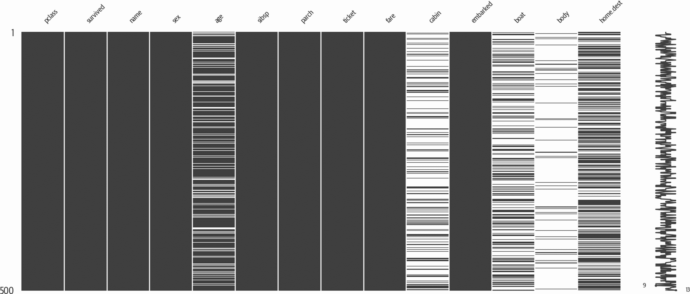
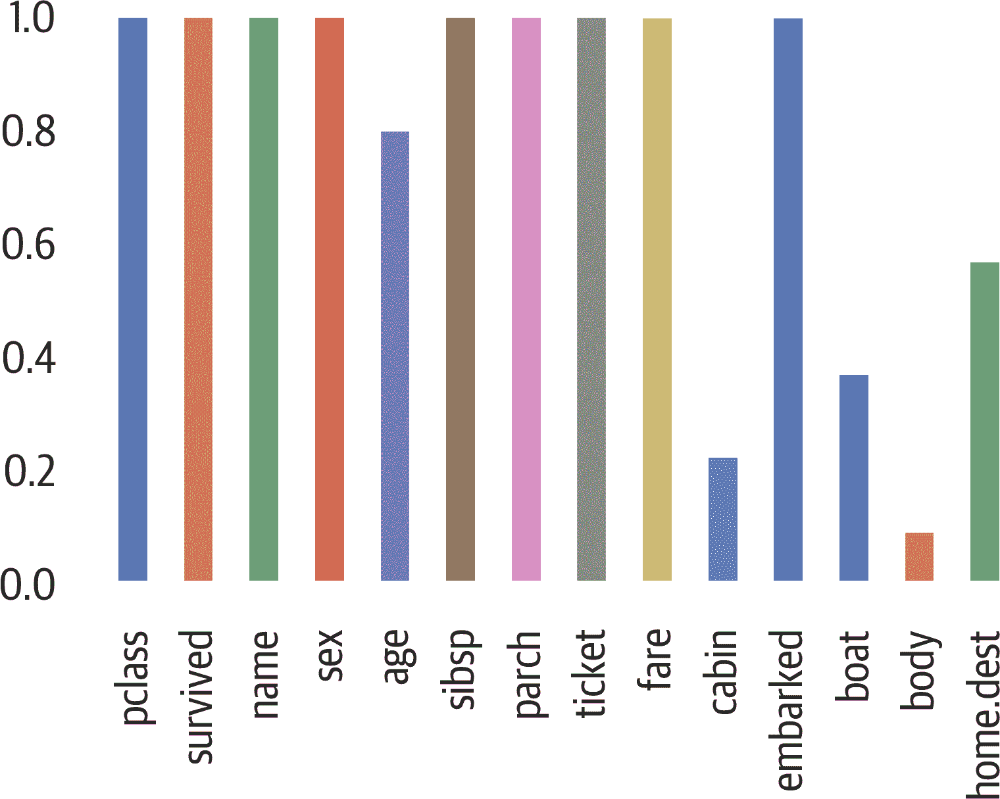
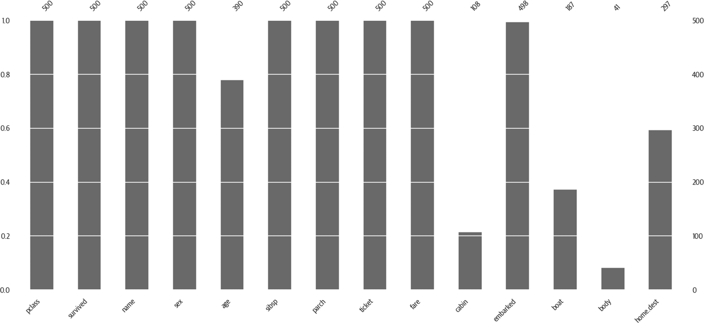
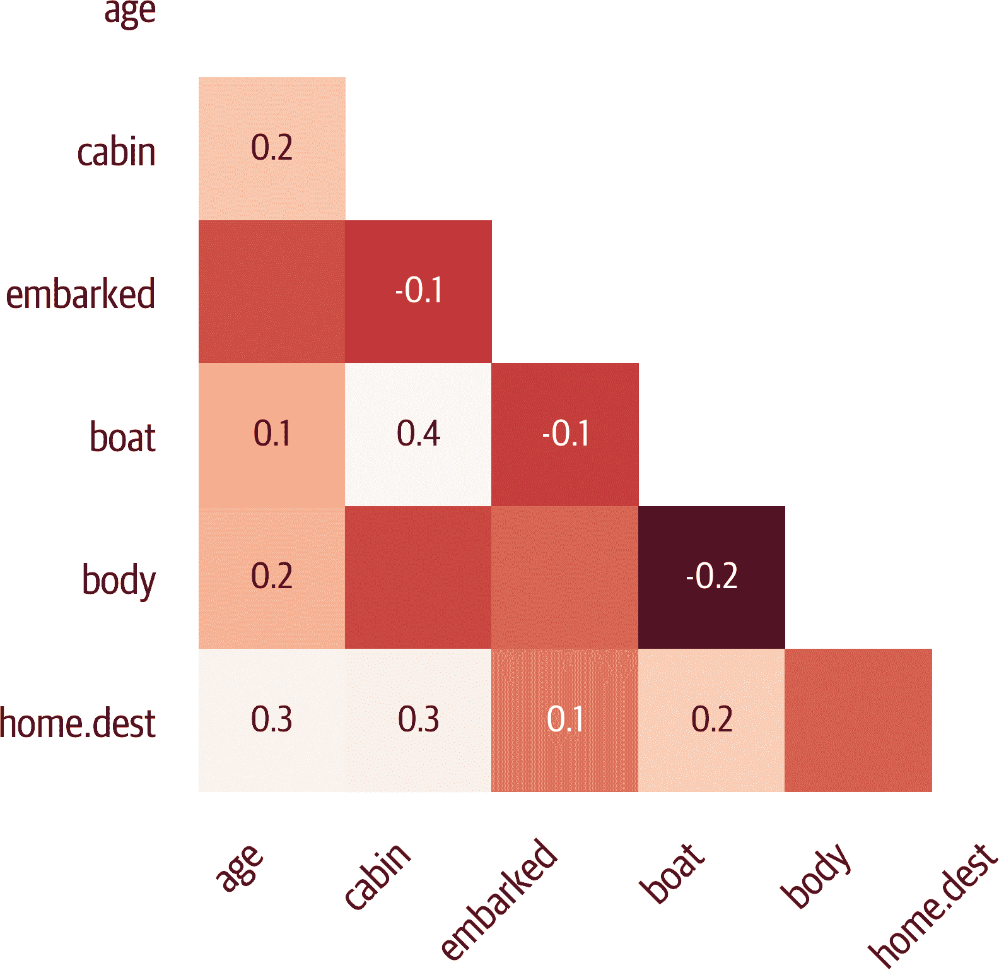
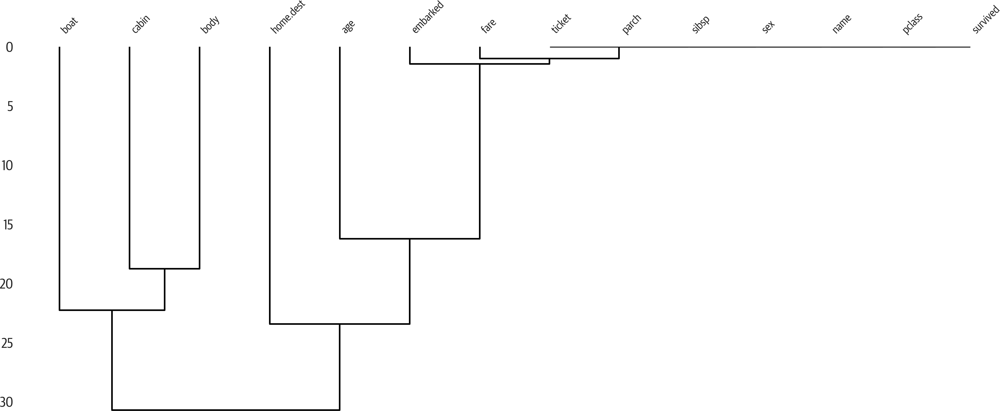

# 第四章：缺失数据

我们需要处理缺失数据。前一章节展示了一个例子。本章将更深入地探讨。如果数据缺失，大多数算法将无法工作。值得注意的例外是最近的增强库：XGBoost、CatBoost 和 LightGBM。

和许多机器学习中的其他事物一样，如何处理缺失数据没有硬性答案。此外，缺失数据可能代表不同的情况。想象一下，人口普查数据返回，一个年龄特征被报告为缺失。这是因为样本不愿透露他们的年龄？他们不知道他们的年龄？问问题的人甚至忘记询问年龄？缺失的年龄是否有模式？它是否与另一个特征相关？它是否完全是随机的？

处理缺失数据的方法有多种：

+   删除任何带有缺失数据的行。

+   删除任何带有缺失数据的列。

+   填补缺失值

+   创建一个指示列来表示数据缺失

# 检查缺失数据

让我们回到泰坦尼克号的数据。因为 Python 将 `True` 和 `False` 分别视为 `1` 和 `0`，我们可以在 pandas 中利用这一技巧来获取缺失数据的百分比：

```py
>>> df.isnull().mean() * 100
pclass        0.000000
survived      0.000000
name          0.000000
sex           0.000000
age          20.091673
sibsp         0.000000
parch         0.000000
ticket        0.000000
fare          0.076394
cabin        77.463713
embarked      0.152788
boat         62.872422
body         90.756303
home.dest    43.086325
dtype: float64
```

要可视化缺失数据的模式，可以使用 [missingno 库](https://oreil.ly/rgYJG)。该库对于查看连续的缺失数据区域非常有用，这表明缺失数据不是随机的（见 图 4-1）。`matrix` 函数在右侧包括一个火花线。这里的模式也表明非随机的缺失数据。您可能需要限制样本数量以便看到这些模式：

```py
>>> import missingno as msno
>>> ax = msno.matrix(orig_df.sample(500))
>>> ax.get_figure().savefig("images/mlpr_0401.png")
```



###### 图 4-1\. 数据缺失的位置。作者看不出明显的模式。

我们可以使用 pandas 创建一个缺失数据计数的条形图（见 图 4-2）：

```py
>>> fig, ax = plt.subplots(figsize=(6, 4))
>>> (1 - df.isnull().mean()).abs().plot.bar(ax=ax)
>>> fig.savefig("images/mlpr_0402.png", dpi=300)
```



###### 图 4-2\. 使用 pandas 的非缺失数据百分比。船和身体有漏洞，所以我们应该忽略它们。有些年龄缺失很有趣。

或者使用 missingno 库创建相同的图（见 图 4-3）：

```py
>>> ax = msno.bar(orig_df.sample(500))
>>> ax.get_figure().savefig("images/mlpr_0403.png")
```



###### 图 4-3\. 使用 missingno 的非缺失数据百分比。

我们可以创建一个热力图，显示数据缺失的相关性（见 图 4-4）。在这种情况下，看起来数据缺失的位置并没有相关性：

```py
>>> ax = msno.heatmap(df, figsize=(6, 6))
>>> ax.get_figure().savefig("/tmp/mlpr_0404.png")
```



###### 图 4-4\. 缺失数据与 missingno 的相关性。

我们可以创建一个树状图，显示数据缺失的聚类情况（见 图 4-5）。处于同一水平的叶子预测彼此的存在（空或填充）。垂直臂用于指示不同聚类的差异程度。短臂意味着分支相似：

```py
>>> ax = msno.dendrogram(df)
>>> ax.get_figure().savefig("images/mlpr_0405.png")
```



###### 图 4-5\. 缺失数据的树状图与 missingno。我们可以看到右上角没有缺失数据的列。

# 删除缺失数据

pandas 库可以使用`.dropna`方法删除所有带有缺失数据的行：

```py
>>> df1 = df.dropna()
```

要删除列，我们可以注意哪些列缺失，并使用`.drop`方法。可以传入一个列名列表或单个列名：

```py
>>> df1 = df.drop(columns="cabin")
```

或者，我们可以使用`.dropna`方法，并设置`axis=1`（沿着列轴删除）：

```py
>>> df1 = df.dropna(axis=1)
```

谨慎处理删除数据。我通常把这看作是最后的选择。

# 填补数据

一旦你有一个预测数据的工具，你可以用它来预测缺失数据。定义缺失值的值的一般任务称为*填充*。

如果你在填补数据，你需要建立一个流水线，并且在模型创建和预测时使用相同的填补逻辑。scikit-learn 中的 `SimpleImputer` 类将处理平均值、中位数和最常见的特征值。

默认行为是计算平均值：

```py
>>> from sklearn.impute import SimpleImputer
>>> num_cols = df.select_dtypes(
...     include="number"
... ).columns
>>> im = SimpleImputer()  # mean
>>> imputed = im.fit_transform(df[num_cols])
```

提供`strategy='median'`或`strategy='most_frequent'`以将替换值更改为中位数或最常见值。如果你希望用常数值填充，比如`-1`，可以使用`strategy='constant'`与`fill_value=-1`结合使用。

###### 小贴士

在 pandas 中，你可以使用`.fillna`方法来填补缺失值。确保不要泄漏数据。如果你使用平均值进行填充，请确保在模型创建和预测时使用相同的平均值。

最频繁和常量策略可以用于数字或字符串数据。平均值和中位数需要数字数据。

fancyimpute 库实现了许多算法并遵循 scikit-learn 接口。遗憾的是，大多数算法是*传导的*，这意味着你不能在拟合算法后单独调用`.transform`方法。`IterativeImputer` 是*归纳的*（已从 fancyimpute 迁移到 scikit-learn）并支持在拟合后进行转换。

# 添加指示列

数据本身的缺失可能为模型提供一些信号。pandas 库可以添加一个新列来指示缺失值：

```py
>>> def add_indicator(col):
...     def wrapper(df):
...         return df[col].isna().astype(int)
...
...     return wrapper

>>> df1 = df.assign(
...     cabin_missing=add_indicator("cabin")
... )
```
