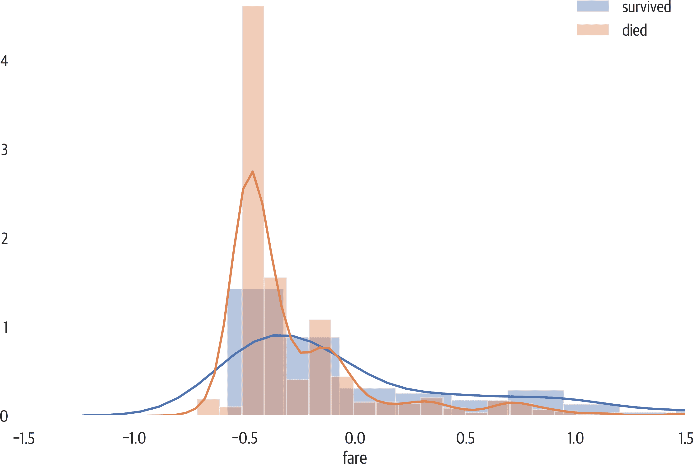

# 第六章：探索

有人说，将一个专家培训成数据科学家比反过来要容易得多。我不完全同意这一观点，但数据确实有细微差别，专家可以帮助分析这些差异。通过理解业务和数据，他们能够创建更好的模型并对业务产生更大的影响。

在创建模型之前，我将进行一些探索性数据分析。这不仅让我对数据有所了解，还是与控制数据的业务单元会面并讨论问题的好借口。

# 数据大小

再次提醒，我们在这里使用泰坦尼克号数据集。pandas 的 `.shape` 属性会返回行数和列数的元组：

```py
>>> X.shape
(1309, 13)
```

我们可以看到这个数据集有 1,309 行和 13 列。

# 汇总统计

我们可以使用 pandas 获取数据的汇总统计信息。`.describe` 方法还将给出非 NaN 值的计数。让我们查看第一列和最后一列的结果：

```py
>>> X.describe().iloc[:, [0, -1]]
 pclass   embarked_S
count  1309.000000  1309.000000
mean     -0.012831     0.698243
std       0.995822     0.459196
min      -1.551881     0.000000
25%      -0.363317     0.000000
50%       0.825248     1.000000
75%       0.825248     1.000000
max       0.825248     1.000000
```

计数行告诉我们这两列都是填充的。没有缺失值。我们还有均值、标准差、最小值、最大值和四分位数值。

###### 注意

pandas DataFrame 有一个 `iloc` 属性，可以根据索引位置进行索引操作。它允许我们通过标量、列表或切片传递行位置，然后我们可以添加逗号并传递列位置作为标量、列表或切片。

这里我们提取第二行和第五行以及最后三列：

```py
>>> X.iloc[[1, 4], -3:]
 sex_male  embarked_Q  embarked_S
677       1.0           0           1
864       0.0           0           1
```

还有一个 `.loc` 属性，我们可以根据名称而不是位置输出行和列。这是 DataFrame 的相同部分：

```py
>>> X.loc[[677, 864], "sex_male":]
 sex_male  embarked_Q  embarked_S
677       1.0           0           1
864       0.0           0           1
```

# 直方图

直方图是可视化数值数据的强大工具。您可以看到有多少个模式，并查看分布（见 图 6-1）。pandas 库有一个 `.plot` 方法来显示直方图：

```py
>>> fig, ax = plt.subplots(figsize=(6, 4))
>>> X.fare.plot(kind="hist", ax=ax)
>>> fig.savefig("images/mlpr_0601.png", dpi=300)
```


###### 图 6-1\. Pandas 直方图。

使用 seaborn 库，我们可以绘制一个连续值的直方图，并与目标变量进行对比（见 图 6-2）：

```py
fig, ax = plt.subplots(figsize=(12, 8))
mask = y_train == 1
ax = sns.distplot(X_train[mask].fare, label='survived')
ax = sns.distplot(X_train[~mask].fare, label='died')
ax.set_xlim(-1.5, 1.5)
ax.legend()
fig.savefig('images/mlpr_0602.png', dpi=300, bbox_inches='tight')
```



###### 图 6-2\. Seaborn 直方图。

# 散点图

散点图显示了两个数值列之间的关系（见 图 6-3）。同样，使用 pandas 很容易。如果数据重叠，调整 `alpha` 参数：

```py
>>> fig, ax = plt.subplots(figsize=(6, 4))
>>> X.plot.scatter(
...     x="age", y="fare", ax=ax, alpha=0.3
... )
>>> fig.savefig("images/mlpr_0603.png", dpi=300)
```


###### 图 6-3\. Pandas 散点图。

这两个特征之间似乎没有太多的相关性。我们可以使用 `.corr` 方法在两个（pandas）列之间进行皮尔逊相关性分析来量化相关性：

```py
>>> X.age.corr(X.fare)
0.17818151568062093
```

# 联合绘图

Yellowbrick 有一个更复杂的散点图，包括边缘的直方图以及一个称为 *联合绘图* 的回归线（见 图 6-4）：

```py
>>> from yellowbrick.features import (
...     JointPlotVisualizer,
... )
>>> fig, ax = plt.subplots(figsize=(6, 6))
>>> jpv = JointPlotVisualizer(
...     feature="age", target="fare"
... )
>>> jpv.fit(X["age"], X["fare"])
>>> jpv.poof()
>>> fig.savefig("images/mlpr_0604.png", dpi=300)
```


###### 图 6-4\. Yellowbrick 联合绘图。

###### 警告

在这个 `.fit` 方法中，`X` 和 `y` 分别指代一列。通常情况下，`X` 是一个 DataFrame，而不是一个 Series。

您还可以使用 [seaborn](https://seaborn.pydata.org) 库创建一个联合图（见图 6-5）：

```py
>>> from seaborn import jointplot
>>> fig, ax = plt.subplots(figsize=(6, 6))
>>> new_df = X.copy()
>>> new_df["target"] = y
>>> p = jointplot(
...     "age", "fare", data=new_df, kind="reg"
... )
>>> p.savefig("images/mlpr_0605.png", dpi=300)
```


###### 图 6-5\. Seaborn 联合图。

# 对角网格

seaborn 库可以创建一个对角网格（见图 6-6）。这个图是列和核密度估计的矩阵。要通过 DataFrame 的某一列进行着色，可以使用 `hue` 参数。通过目标变量进行着色，我们可以看到特征对目标的不同影响：

```py
>>> from seaborn import pairplot
>>> fig, ax = plt.subplots(figsize=(6, 6))
>>> new_df = X.copy()
>>> new_df["target"] = y
>>> vars = ["pclass", "age", "fare"]
>>> p = pairplot(
...     new_df, vars=vars, hue="target", kind="reg"
... )
>>> p.savefig("images/mlpr_0606.png", dpi=300)
```


###### 图 6-6\. Seaborn 对角网格。

# 箱线图和小提琴图

Seaborn 提供了多种绘制分布的图形。我们展示了箱线图和小提琴图的示例（见图 6-7 和 图 6-8）。这些图形可以将一个特征与目标变量可视化：

```py
>>> from seaborn import box plot
>>> fig, ax = plt.subplots(figsize=(8, 6))
>>> new_df = X.copy()
>>> new_df["target"] = y
>>> boxplot(x="target", y="age", data=new_df)
>>> fig.savefig("images/mlpr_0607.png", dpi=300)
```


###### 图 6-7\. Seaborn 箱线图。

小提琴图可以帮助可视化分布：

```py
>>> from seaborn import violinplot
>>> fig, ax = plt.subplots(figsize=(8, 6))
>>> new_df = X.copy()
>>> new_df["target"] = y
>>> violinplot(
...     x="target", y="sex_male", data=new_df
... )
>>> fig.savefig("images/mlpr_0608.png", dpi=300)
```


###### 图 6-8\. Seaborn 小提琴图。

# 比较两个序数值

这是 pandas 代码，用于比较两个序数类别。我将年龄分为十个分位数，将 pclass 分为三个区间。该图被归一化，以填充所有垂直区域。这使得很容易看出，在第 40% 分位数中，大多数票是第三等舱的（见图 6-9）：

```py
>>> fig, ax = plt.subplots(figsize=(8, 6))
>>> (
...     X.assign(
...         age_bin=pd.qcut(
...             X.age, q=10, labels=False
...         ),
...         class_bin=pd.cut(
...             X.pclass, bins=3, labels=False
...         ),
...     )
...     .groupby(["age_bin", "class_bin"])
...     .size()
...     .unstack()
...     .pipe(lambda df: df.div(df.sum(1), axis=0))
...     .plot.bar(
...         stacked=True,
...         width=1,
...         ax=ax,
...         cmap="viridis",
...     )
...     .legend(bbox_to_anchor=(1, 1))
... )
>>> fig.savefig(
...     "image/mlpr_0609.png",
...     dpi=300,
...     bbox_inches="tight",
... )
```

###### 注意

这些行：

```py
.groupby(["age_bin", "class_bin"])
.size()
.unstack()
```

可以用以下内容替换：

```py
.pipe(lambda df: pd.crosstab(
 df.age_bin, df.class_bin)
)
```

在 pandas 中，通常有多种方法可以完成某项任务，还有一些辅助函数可组合其他功能，如 `pd.crosstab`。


###### 图 6-9\. 比较序数值。

# 相关性

Yellowbrick 可以在特征之间创建成对比较（见图 6-10）。此图显示皮尔逊相关性（`algorithm` 参数也接受 `'spearman'` 和 `'covariance'`）：

```py
>>> from yellowbrick.features import Rank2D
>>> fig, ax = plt.subplots(figsize=(6, 6))
>>> pcv = Rank2D(
...     features=X.columns, algorithm="pearson"
... )
>>> pcv.fit(X, y)
>>> pcv.transform(X)
>>> pcv.poof()
>>> fig.savefig(
...     "images/mlpr_0610.png",
...     dpi=300,
...     bbox_inches="tight",
... )
```


###### 图 6-10\. 用 Yellowbrick 创建的协方差相关性。

seaborn 库中还有类似的热图（见图 6-11）。我们需要将相关性 DataFrame 作为数据传入。遗憾的是，除非矩阵中的值允许，或者我们添加 `vmin` 和 `vmax` 参数，否则颜色条不会跨越 -1 到 1：

```py
>>> from seaborn import heatmap
>>> fig, ax = plt.subplots(figsize=(8, 8))
>>> ax = heatmap(
...     X.corr(),
...     fmt=".2f",
...     annot=True,
...     ax=ax,
...     cmap="RdBu_r",
...     vmin=-1,
...     vmax=1,
... )
>>> fig.savefig(
...     "images/mlpr_0611.png",
...     dpi=300,
...     bbox_inches="tight",
... )
```


###### 图 6-11\. Seaborn 热图。

pandas 库也可以提供 DataFrame 列之间的相关性。我们只显示结果的前两列。默认方法是 `'pearson'`，但也可以将 `method` 参数设置为 `'kendall'`、`'spearman'` 或一个返回两列之间浮点数的自定义可调用函数：

```py
>>> X.corr().iloc[:, :2]
 pclass       age
pclass      1.000000 -0.440769
age        -0.440769  1.000000
sibsp       0.060832 -0.292051
parch       0.018322 -0.174992
fare       -0.558831  0.177205
sex_male    0.124617  0.077636
embarked_Q  0.230491 -0.061146
embarked_S  0.096335 -0.041315
```

高度相关的列并不增加价值，反而可能影响特征重要性和回归系数的解释。以下是查找相关列的代码。在我们的数据中，没有任何高度相关的列（记住我们已删除 `sex_male` 列）。

如果我们有相关的列，我们可以选择从特征数据中删除 level_0 或 level_1 中的列之一：

```py
>>> def correlated_columns(df, threshold=0.95):
...     return (
...         df.corr()
...         .pipe(
...             lambda df1: pd.DataFrame(
...                 np.tril(df1, k=-1),
...                 columns=df.columns,
...                 index=df.columns,
...             )
...         )
...         .stack()
...         .rename("pearson")
...         .pipe(
...             lambda s: s[
...                 s.abs() > threshold
...             ].reset_index()
...         )
...         .query("level_0 not in level_1")
...     )

>>> correlated_columns(X)
Empty DataFrame
Columns: [level_0, level_1, pearson]
Index: []
```

使用具有更多列的数据集，我们可以看到许多列之间存在相关性：

```py
>>> c_df = correlated_columns(agg_df)
>>> c_df.style.format({"pearson": "{:.2f}"})
 level_0     level_1   pearson
3   pclass_mean      pclass  1.00
4   pclass_mean  pclass_min  1.00
5   pclass_mean  pclass_max  1.00
6    sibsp_mean   sibsp_max  0.97
7    parch_mean   parch_min  0.95
8    parch_mean   parch_max  0.96
9     fare_mean        fare  0.95
10    fare_mean    fare_max  0.98
12    body_mean    body_min  1.00
13    body_mean    body_max  1.00
14     sex_male  sex_female -1.00
15   embarked_S  embarked_C -0.95
```

# RadViz

RadViz 图将每个样本显示在一个圆圈上，特征显示在圆周上（见 图 6-12）。数值被标准化，你可以想象每个图像都有一个弹簧，根据数值将样本拉向它。

这是一种用于可视化目标间可分性的技术之一。

Yellowbrick 可以做到这一点：

```py
>>> from yellowbrick.features import RadViz
>>> fig, ax = plt.subplots(figsize=(6, 6))
>>> rv = RadViz(
...     classes=["died", "survived"],
...     features=X.columns,
... )
>>> rv.fit(X, y)
>>> _ = rv.transform(X)
>>> rv.poof()
>>> fig.savefig("images/mlpr_0612.png", dpi=300)
```


###### 图 6-12\. Yellowbrick RadViz 图。

pandas 库也可以绘制 RadViz 图（见 图 6-13）：

```py
>>> from pandas.plotting import radviz
>>> fig, ax = plt.subplots(figsize=(6, 6))
>>> new_df = X.copy()
>>> new_df["target"] = y
>>> radviz(
...     new_df, "target", ax=ax, colormap="PiYG"
... )
>>> fig.savefig("images/mlpr_0613.png", dpi=300)
```


###### 图 6-13\. Pandas RadViz 图。

# 平行坐标

对于多变量数据，您可以使用平行坐标图来直观地查看聚类情况（见 图 6-14 和 图 6-15）。

再次，这里是 Yellowbrick 版本：

```py
>>> from yellowbrick.features import (
...     ParallelCoordinates,
... )
>>> fig, ax = plt.subplots(figsize=(6, 4))
>>> pc = ParallelCoordinates(
...     classes=["died", "survived"],
...     features=X.columns,
... )
>>> pc.fit(X, y)
>>> pc.transform(X)
>>> ax.set_xticklabels(
...     ax.get_xticklabels(), rotation=45
... )
>>> pc.poof()
>>> fig.savefig("images/mlpr_0614.png", dpi=300)
```


###### 图 6-14\. Yellowbrick 平行坐标图。

还有一个 pandas 版本：

```py
>>> from pandas.plotting import (
...     parallel_coordinates,
... )
>>> fig, ax = plt.subplots(figsize=(6, 4))
>>> new_df = X.copy()
>>> new_df["target"] = y
>>> parallel_coordinates(
...     new_df,
...     "target",
...     ax=ax,
...     colormap="viridis",
...     alpha=0.5,
... )
>>> ax.set_xticklabels(
...     ax.get_xticklabels(), rotation=45
... )
>>> fig.savefig(
...     "images/mlpr_0615.png",
...     dpi=300,
...     bbox_inches="tight",
... )
```


###### 图 6-15\. Pandas 平行坐标图。
