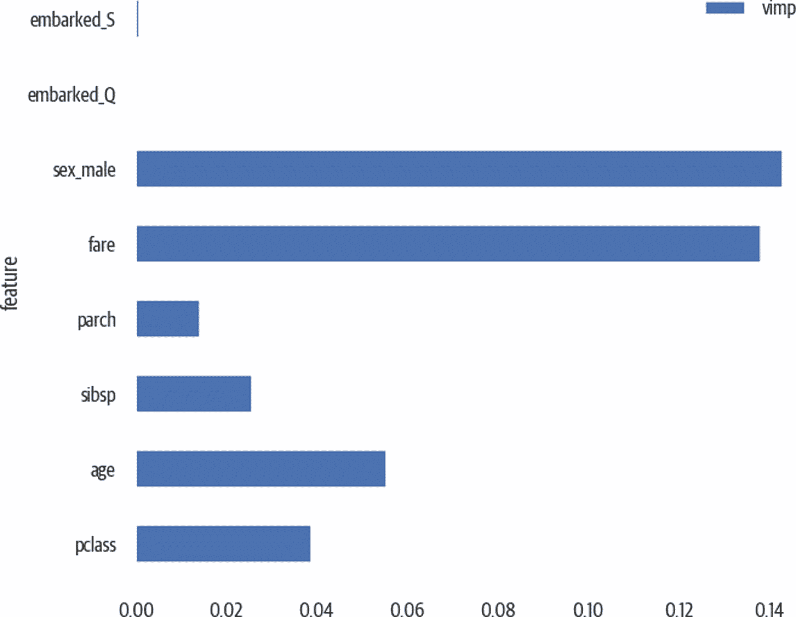

# 第八章 特征选择

我们使用特征选择来选择对模型有用的特征。无关的特征可能会对模型产生负面影响。相关的特征可能会使回归中的系数（或者树模型中的特征重要性）不稳定或难以解释。

*维度诅咒*是另一个需要考虑的问题。随着数据维度的增加，数据变得更加稀疏。这可能使得除非有更多数据，否则很难提取信号。随着维度的增加，邻居计算的效用通常会减弱。

此外，训练时间通常是列数的函数（有时甚至比线性更差）。如果能够用简明和准确的列，可以在更短的时间内获得更好的模型。我们将通过上一章节的`agg_df`数据集来演示一些示例。请记住，这是具有一些额外列（用于舱室信息）的泰坦尼克号数据集的聚合数值数据集。因为这个数据集正在聚合每个舱室的数值值，它将展示许多相关性。其他选项包括 PCA 和查看树分类器的`.feature_importances_`。

# 共线性列

我们可以使用之前定义的`correlated_columns`函数或运行以下代码，以查找具有 0.95 或更高相关系数的列：

```py
>>> limit = 0.95
>>> corr = agg_df.corr()
>>> mask = np.triu(
...     np.ones(corr.shape), k=1
... ).astype(bool)
>>> corr_no_diag = corr.where(mask)
>>> coll = [
...     c
...     for c in corr_no_diag.columns
...     if any(abs(corr_no_diag[c]) > threshold)
... ]
>>> coll
['pclass_min', 'pclass_max', 'pclass_mean',
 'sibsp_mean', 'parch_mean', 'fare_mean',
 'body_max', 'body_mean', 'sex_male', 'embarked_S']
```

Yellowbrick 的`Rank2`可视化器，如前所示，将绘制一个相关性热图。

[rfpimp 包](https://oreil.ly/MsnXc)有一个*多重共线性*的可视化。`plot_dependence_heatmap`函数为训练数据集中的每个数值列训练一个随机森林。依赖值是预测该列的袋外（OOB）估计的 R2 分数（见图 8-1）。

使用此图的建议方法是找到接近 1 的值。X 轴上的标签是预测 Y 轴标签的特征。如果一个特征预测另一个特征，可以移除被预测特征（Y 轴上的特征）。在我们的例子中，`fare`预测`pclass`、`sibsp`、`parch`和`embarked_Q`。我们应该能够保留`fare`并移除其他特征，从而获得类似的性能：

```py
>>> rfpimp.plot_dependence_heatmap(
...     rfpimp.feature_dependence_matrix(X_train),
...     value_fontsize=12,
...     label_fontsize=14,
...     figsize=(8, 8),sn
... )
>>> fig = plt.gcf()
>>> fig.savefig(
...     "images/mlpr_0801.png",
...     dpi=300,
...     bbox_inches="tight",
... )
```


###### 图 8-1\. 依赖热图。Pclass、sibsp、parch 和 embarked_Q 可以从 fare 中预测，因此我们可以移除它们。

下面的代码展示了，如果我们移除这些列，我们可以得到类似的分数：

```py
>>> cols_to_remove = [
...     "pclass",
...     "sibsp",
...     "parch",
...     "embarked_Q",
... ]
>>> rf3 = RandomForestClassifier(random_state=42)
>>> rf3.fit(
...     X_train[
...         [
...             c
...             for c in X_train.columns
...             if c not in cols_to_remove
...         ]
...     ],
...     y_train,
... )
>>> rf3.score(
...     X_test[
...         [
...             c
...             for c in X_train.columns
...             if c not in cols_to_remove
...         ]
...     ],
...     y_test,
... )
0.7684478371501272

>>> rf4 = RandomForestClassifier(random_state=42)
>>> rf4.fit(X_train, y_train)
>>> rf4.score(X_test, y_test)
0.7659033078880407
```

# Lasso 回归

如果使用 lasso 回归，可以设置一个`alpha`参数作为正则化参数。随着值的增加，对不那么重要的特征给予较小的权重。在这里，我们使用`LassoLarsCV`模型迭代各种 alpha 值，并跟踪特征系数（见图 8-2）：

```py
>>> from sklearn import linear_model
>>> model = linear_model.LassoLarsCV(
...     cv=10, max_n_alphas=10
... ).fit(X_train, y_train)
>>> fig, ax = plt.subplots(figsize=(12, 8))
>>> cm = iter(
...     plt.get_cmap("tab20")(
...         np.linspace(0, 1, X.shape[1])
...     )
... )
>>> for i in range(X.shape[1]):
...     c = next(cm)
...     ax.plot(
...         model.alphas_,
...         model.coef_path_.T[:, i],
...         c=c,
...         alpha=0.8,
...         label=X.columns[i],
...     )
>>> ax.axvline(
...     model.alpha_,
...     linestyle="-",
...     c="k",
...     label="alphaCV",
... )
>>> plt.ylabel("Regression Coefficients")
>>> ax.legend(X.columns, bbox_to_anchor=(1, 1))
>>> plt.xlabel("alpha")
>>> plt.title(
...     "Regression Coefficients Progression for Lasso Paths"
... )
>>> fig.savefig(
...     "images/mlpr_0802.png",
...     dpi=300,
...     bbox_inches="tight",
... )
```


###### 图 8-2\. 在 Lasso 回归过程中，随着 alpha 变化，特征的系数。

# 递归特征消除。

递归特征消除将删除最弱的特征，然后拟合一个模型（参见图 8-3）。它通过传入具有 `.coef_` 或 `.feature_importances_` 属性的 scikit-learn 模型来实现：

```py
>>> from yellowbrick.features import RFECV
>>> fig, ax = plt.subplots(figsize=(6, 4))
>>> rfe = RFECV(
...     ensemble.RandomForestClassifier(
...         n_estimators=100
...     ),
...     cv=5,
... )
>>> rfe.fit(X, y)

>>> rfe.rfe_estimator_.ranking_
array([1, 1, 2, 3, 1, 1, 5, 4])

>>> rfe.rfe_estimator_.n_features_
4

>>> rfe.rfe_estimator_.support_
array([ True,  True, False, False,  True,
 True, False, False])

>>> rfe.poof()
>>> fig.savefig("images/mlpr_0803.png", dpi=300)
```


###### 图 8-3\. 递归特征消除。

我们将使用递归特征消除来找出前 10 个最重要的特征。（在这个聚合数据集中，我们发现泄漏了生存列！）

```py
>>> from sklearn.feature_selection import RFE
>>> model = ensemble.RandomForestClassifier(
...     n_estimators=100
... )
>>> rfe = RFE(model, 4)
>>> rfe.fit(X, y)
>>> agg_X.columns[rfe.support_]
Index(['pclass', 'age', 'fare', 'sex_male'], dtype='object')
```

# 互信息。

Sklearn 提供了非参数测试，将使用 k 近邻算法来确定特征与目标之间的*互信息*。互信息量化了观察另一个变量带来的信息增益。该值为零或更高。如果值为零，则它们之间没有关系（参见图 8-4）。这个数字不受限制，并代表特征与目标之间共享的*比特数*：

```py
>>> from sklearn import feature_selection

>>> mic = feature_selection.mutual_info_classif(
...     X, y
... )
>>> fig, ax = plt.subplots(figsize=(10, 8))
>>> (
...     pd.DataFrame(
...         {"feature": X.columns, "vimp": mic}
...     )
...     .set_index("feature")
...     .plot.barh(ax=ax)
... )
>>> fig.savefig("images/mlpr_0804.png")
```



###### 图 8-4\. 互信息图。

# 主成分分析。

特征选择的另一个选项是运行主成分分析。一旦获得了主要的主成分，就检查对它们贡献最大的特征。这些特征具有更大的方差。请注意，这是一种无监督算法，不考虑 `y`。

查看“PCA”以获取更多细节。

# 特征重要性。

大多数树模型在训练后提供了 `.feature_importances_` 属性。更高的重要性通常意味着在将特征从模型中移除时存在更高的错误。有关各种树模型的详细信息，请参阅各章节。
