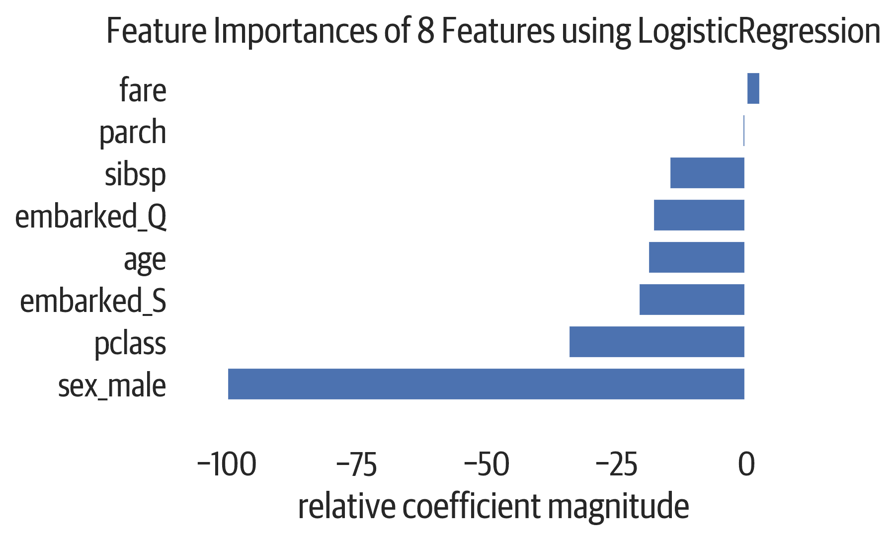
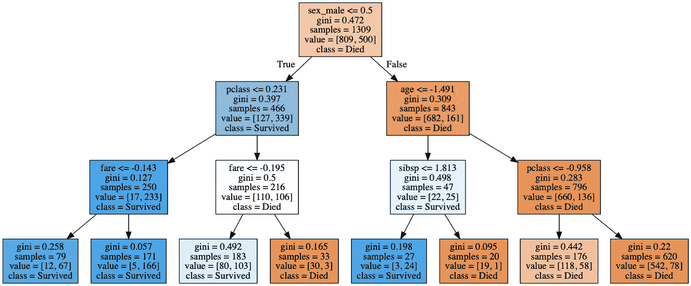
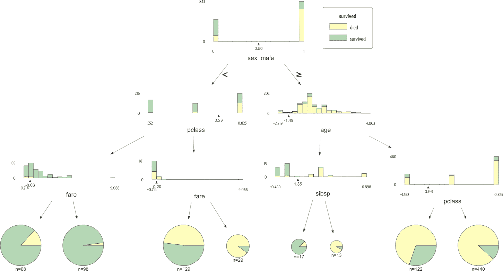
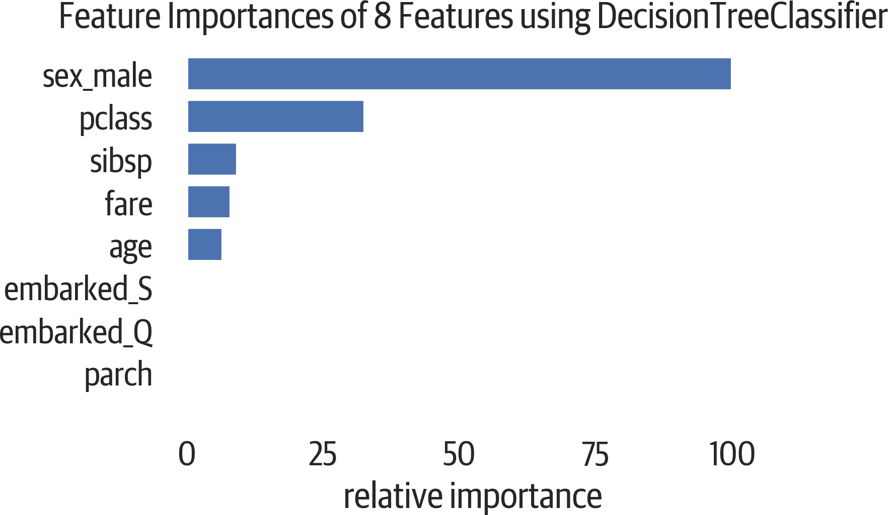
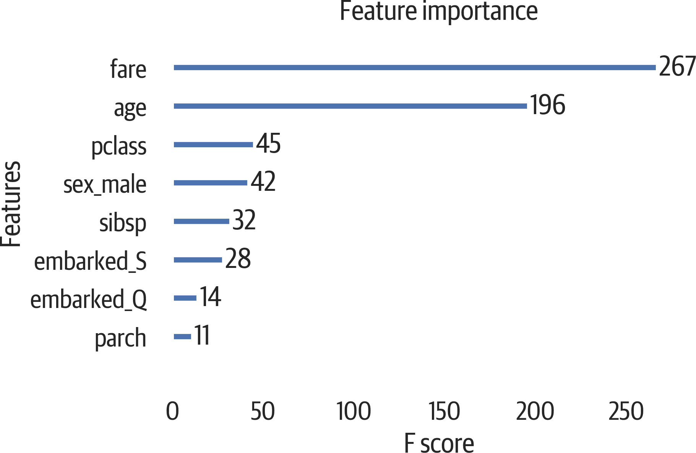
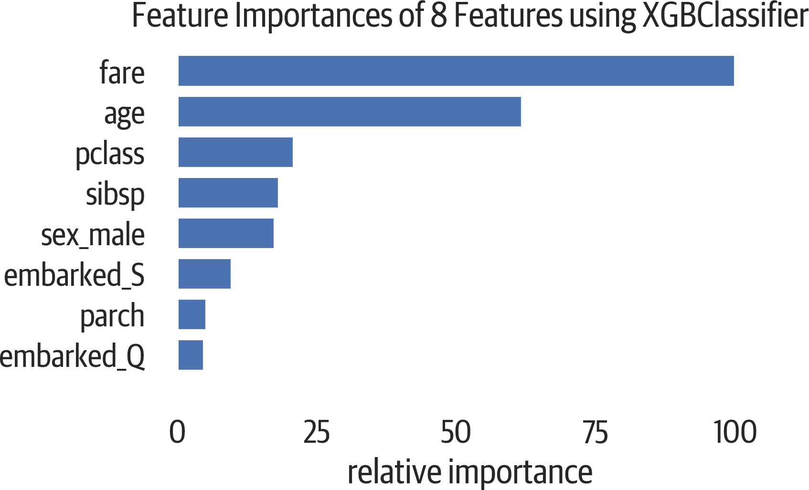
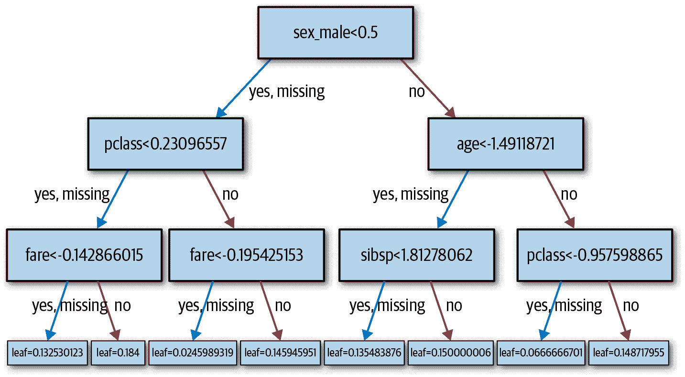
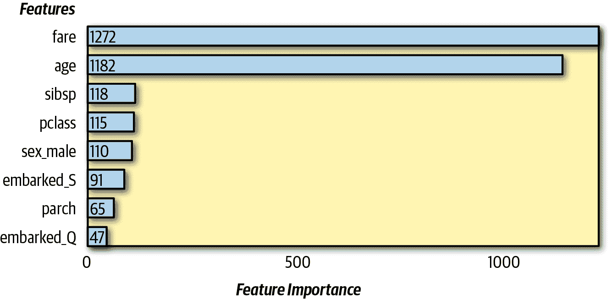
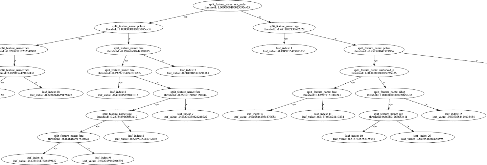

# 第十章。分类

分类是一种基于特征对样本进行标记的*监督学习*机制。监督学习意味着我们对于分类有标签，或者对于回归有数字，算法应该学习这些。

我们将在本章中查看各种分类模型。Sklearn 实现了许多常见且有用的模型。我们还将看到一些不在 sklearn 中的模型，但实现了 sklearn 接口。因为它们遵循相同的接口，所以很容易尝试不同系列的模型，并查看它们的性能如何。

在 sklearn 中，我们创建一个模型实例，并在训练数据和训练标签上调用 `.fit` 方法。现在，我们可以使用拟合模型调用`.predict`方法（或`.predict_proba`或`.predict_log_proba`方法）。要评估模型，我们使用 `.score` 方法与测试数据和测试标签。

更大的挑战通常是将数据安排成与 sklearn 兼容的形式。数据(`X`)应该是一个(m 行 n 列)的 numpy 数组（或 pandas DataFrame），其中每个样本数据都有 n 个特征（列）。标签(`y`)是一个大小为 m 的向量（或 pandas series），其中每个样本都有一个值（类）。

`.score`方法返回平均准确度，单独可能不足以评估分类器。我们将看到其他评估指标。

我们将研究许多模型，并讨论它们的效率，它们所需的预处理技术，如何防止过拟合以及模型是否支持结果的直观解释。

sklearn 类型模型实现的一般方法包括：

`fit(X, y[, sample_weight])`

拟合模型

`predict(X)`

预测类别

`predict_log_proba(X)`

预测对数概率

`predict_proba(X)`

预测概率

`score(X, y[, sample_weight])`

获得准确度

# 逻辑回归

逻辑回归通过使用逻辑函数来估计概率。（注意；尽管它的名字中有回归，但它用于分类。）这一直是大多数科学的标准分类模型。

以下是我们将为每个模型包含的一些模型特征：

运行时效率

如果不使用`'liblinear'`求解器，则可以使用`n_jobs`。

预处理数据

如果`solver`设置为`'sag'`或`'saga'`，则标准化以确保收敛正常。可以处理稀疏输入。

防止过拟合

`C`参数控制正则化。（较低的`C`表示更多的正则化，较高表示较少。）可以指定`penalty`为`'l1'`或`'l2'`（默认值）。

解释结果

拟合模型的`.coef_`属性显示决策函数的系数。x 的一个单位变化会使对数几率比按系数变化。`.intercept_`属性是基线条件的逆对数几率。

这是使用此模型的一个示例：

```py
>>> from sklearn.linear_model import (
...     LogisticRegression,
... )
>>> lr = LogisticRegression(random_state=42)
>>> lr.fit(X_train, y_train)
LogisticRegression(C=1.0, class_weight=None,
 dual=False, fit_intercept=True,
 intercept_scaling=1, max_iter=100,
 multi_class='ovr', n_jobs=1, penalty='l2',
 random_state=42, solver='liblinear',
 tol=0.0001, verbose=0, warm_start=False)
>>> lr.score(X_test, y_test)
0.8040712468193384

>>> lr.predict(X.iloc[[0]])
array([1])
>>> lr.predict_proba(X.iloc[[0]])
array([[0.08698937, 0.91301063]])
>>> lr.predict_log_proba(X.iloc[[0]])
array([[-2.4419694 , -0.09100775]])
>>> lr.decision_function(X.iloc[[0]])
array([2.35096164])
```

实例参数：

`penalty='l2'`

惩罚范数，`'l1'`或`'l2'`。

`dual=False`

使用双重制定（仅适用于`'l2'`和`'liblinear'`）。

`C=1.0`

正浮点数。逆正则化强度。数值越小，正则化越强。

`fit_intercept=True`

为决策函数添加偏置。

`intercept_scaling=1`

如果`fit_intercept`和`'liblinear'`，则缩放截距。

`max_iter=100`

最大迭代次数。

`multi_class='ovr'`

对每个类使用一对其余，或对于`'multinomial'`，训练一个类。

`class_weight=None`

字典或`'balanced'`。

`solver='liblinear'`

`'liblinear'`适用于小数据。`'newton-cg'`、`'sag'`、`'saga'`和`'lbfgs'`适用于多类数据。`'liblinear'`和`'saga'`只适用于`'l1'`惩罚。其他适用于`'l2'`。

`tol=0.0001`

停止容差。

`verbose=0`

如果非零整数，则显示详细信息。

`warm_start=False`

如果为`True`，记住以前的拟合。

`njobs=1`

要使用的 CPU 数。`-1`是全部。仅适用于`multi_class='over'`且`solver`不是`'liblinear'`。

拟合后的属性：

`coef_`

决策函数系数

`intercept_`

决策函数的截距

`n_iter_`

迭代次数

截距是基准条件的对数几率。我们可以将其转换回百分比准确率（比例）：

```py
>>> lr.intercept_
array([-0.62386001])
```

使用逆 logit 函数，我们可以看到生存的基线是 34%：

```py
>>> def inv_logit(p):
...     return np.exp(p) / (1 + np.exp(p))

>>> inv_logit(lr.intercept_)
array([0.34890406])
```

我们可以检查系数。系数的逆 logit 给出正例的比例。在这种情况下，如果票价上涨，我们更有可能生存。如果性别是男性，我们更不可能生存：

```py
>>> cols = X.columns
>>> for col, val in sorted(
...     zip(cols, lr.coef_[0]),
...     key=lambda x: x[1],
...     reverse=True,
... ):
...     print(
...         f"{col:10}{val:10.3f} {inv_logit(val):10.3f}"
...     )
fare           0.104      0.526
parch         -0.062      0.485
sibsp         -0.274      0.432
age           -0.296      0.427
embarked_Q    -0.504      0.377
embarked_S    -0.507      0.376
pclass        -0.740      0.323
sex_male      -2.400      0.083
```

Yellowbrick 还可以可视化系数。此可视化器具有`relative=True`参数，使最大值为 100（或-100），其他值为该百分比（见图 10-1）：

```py
>>> from yellowbrick.features.importances import (
...     FeatureImportances,
... )
>>> fig, ax = plt.subplots(figsize=(6, 4))
>>> fi_viz = FeatureImportances(lr)
>>> fi_viz.fit(X, y)
>>> fi_viz.poof()
>>> fig.savefig("images/mlpr_1001.png", dpi=300)
```



###### 图 10-1. 特征重要性（相对于最大绝对回归系数）。

# 朴素贝叶斯

朴素贝叶斯是一种概率分类器，假设数据特征之间独立。它在文本分类应用中很受欢迎，如捕捉垃圾邮件。该模型的一个优点是，因为它假设特征独立，所以可以用少量样本训练模型（缺点是不能捕捉特征之间的交互作用）。这个简单模型也可以处理具有许多特征的数据。因此，它作为一个良好的基准模型。

sklearn 中有三类：`GaussianNB`、`MultinomialNB`和`BernoulliNB`。第一种假设高斯分布（具有正态分布的连续特征），第二种用于离散发生计数，第三种用于离散布尔特征。

此模型具有以下属性：

运行时效率

训练 O(Nd)，其中 N 是训练样本数，d 是维度。测试 O(cd)，其中 c 是类数。

预处理数据

假设数据是独立的。在删除共线列后，应该表现更好。对于连续数值数据，可能需要对数据进行分箱。高斯假设正态分布，可能需要转换数据以转换为正态分布。

防止过拟合

表现出高偏差和低方差（集成不会减少方差）。

解释结果

百分比是样本属于某一类的概率，基于先验概率。

这是使用该模型的示例：

```py
>>> from sklearn.naive_bayes import GaussianNB
>>> nb = GaussianNB()
>>> nb.fit(X_train, y_train)
GaussianNB(priors=None, var_smoothing=1e-09)
>>> nb.score(X_test, y_test)
0.7837150127226463

>>> nb.predict(X.iloc[[0]])
array([1])
>>> nb.predict_proba(X.iloc[[0]])
array([[2.17472227e-08, 9.99999978e-01]])
>>> nb.predict_log_proba(X.iloc[[0]])
array([[-1.76437798e+01, -2.17472227e-08]])
```

实例参数：

`priors=None`

类别的先验概率。

`var_smoothing=1e-9`

添加到方差以进行稳定计算。

拟合后的属性：

`class_prior_`

类别的概率

`class_count_`

类别的计数

`theta_`

每类别每列的均值

`sigma_`

每类别每列的方差

`epsilon_`

对每个方差添加的附加值

###### 提示

这些模型容易受到*零概率问题*的影响。如果尝试对没有训练数据的新样本进行分类，其概率将为零。一种解决方案是使用*Laplace 平滑*。Sklearn 使用 `alpha` 参数控制此功能，默认为 `1`，并在 `MultinomialNB` 和 `BernoulliNB` 模型上启用平滑。

# 支持向量机

支持向量机（SVM）是一种算法，试图在不同类别之间拟合一条（或平面或超平面）线，以最大化从线到类别点的距离。通过这种方式，它试图找到类别之间的稳健分割。*支持向量*是分隔超平面边缘的点。

###### 注意

sklearn 中有几种不同的 SVM 实现。`SVC` 使用 `libsvm` 库，而 `LinearSVC` 使用 `liblinear` 库。

还有 `linear_model.SGDClassifier`，当使用默认的 `loss` 参数时，它实现了 SVM。本章将描述第一次实现。

SVM 通常表现良好，并且可以通过*核技巧*支持线性空间或非线性空间。核技巧是指我们可以通过最小化一个比实际映射点到新维度更容易计算的公式来在新维度中创建决策边界的想法。默认核函数是径向基函数（`'rbf'`），由 `gamma` 参数控制，并可以将输入空间映射到高维空间。

SVM 具有以下特性：

运行时效率

scikit-learn 的实现是 O(n⁴)，因此很难扩展到大尺寸。使用线性核或 `LinearSVC` 模型可以提高运行时性能，但可能会降低准确性。增加 `cache_size` 参数可以将其降至 O(n³)。

预处理数据

该算法不具备尺度不变性。强烈建议对数据进行标准化。

防止过拟合

`C`（惩罚参数）控制正则化。较小的值允许在超平面上有更小的间隔。较高的`gamma`值倾向于过拟合训练数据。`LinearSVC`模型支持`loss`和`penalty`参数以支持正则化。

解释结果

检查 `.support_vectors_`，尽管这些很难解释。对于线性核，可以检查 `.coef_`。

下面是使用 scikit-learn 的 SVM 实现的示例：

```py
>>> from sklearn.svm import SVC
>>> svc = SVC(random_state=42, probability=True)
>>> svc.fit(X_train, y_train)
SVC(C=1.0, cache_size=200, class_weight=None,
 coef0=0.0, decision_function_shape='ovr',
 degree=3, gamma='auto', kernel='rbf',
 max_iter=-1, probability=True, random_state=42,
 shrinking=True, tol=0.001, verbose=False)
>>> svc.score(X_test, y_test)
0.8015267175572519

>>> svc.predict(X.iloc[[0]])
array([1])
>>> svc.predict_proba(X.iloc[[0]])
array([[0.15344656, 0.84655344]])
>>> svc.predict_log_proba(X.iloc[[0]])
array([[-1.87440289, -0.16658195]])
```

要获取概率，请使用 `probability=True`，这会减慢模型的拟合速度。

这类似于感知器，但会找到最大间隔。如果数据不是线性可分的，它将最小化误差。或者，可以使用不同的核函数。

实例参数：

`C=1.0`

惩罚参数。值越小，决策边界越紧（更容易过拟合）。

`cache_size=200`

缓存大小（MB）。增加这个值可以提高在大数据集上的训练时间。

`class_weight=None`

字典或`'balanced'`。使用字典为每个类设置`C`。

`coef0=0.0`

多项式和 sigmoid 核的独立项。

`decision_function_shape='ovr'`

使用一对其余（`'ovr'`）或一对一。

`degree=3`

多项式核的次数。

`gamma='auto'`

核系数。可以是一个数字，`'scale'`（0.22 版中的默认值，1 /（`num features` * `X.std()`）），或`'auto'`（默认优先，1 / `num features`）。较低的值会导致过拟合训练数据。

`kernel='rbf'`

核类型：`'linear'`，`'poly'`，`'rbf'`（默认），`'sigmoid'`，`'precomputed'`或一个函数。

`max_iter=-1`

求解器的最大迭代次数。设为 -1 表示无限制。

`probability=False`

启用概率估计。训练速度减慢。

`random_state=None`

随机种子。

`shrinking=True`

使用缩减启发式。

`tol=0.001`

停止容差。

`verbose=False`

冗余性。

拟合后的属性：

`support_`

支持向量索引

`support_vectors_`

支持向量

`n_support_vectors_`

每类支持向量的计数

`coef_`

系数（线性核）。

# K-最近邻

K-最近邻（KNN）算法基于到一些训练样本的距离进行分类。这种算法族称为*基于实例*的学习，因为没有要学习的参数。该模型假设距离足以进行推断；否则，它对底层数据或其分布不做任何假设。

棘手的部分是选择合适的 k 值。此外，维度诅咒可能会妨碍距离度量，因为在高维空间中，最近邻和最远邻之间的差异很小。

最近邻模型具有以下属性：

运行时效率

训练 O(1)，但需要存储数据。测试 O(Nd)，其中 N 是训练样本的数量，d 是维度。

预处理数据

是的，当标准化时，基于距离的计算性能更好。

防止过拟合。

增加 `n_neighbors`。对于 L1 或 L2 度量，修改 `p`。

解释结果

解释 k 最近邻样本（使用 `.kneighbors` 方法）。如果可以解释这些邻居，它们可以解释你的结果。

这是使用模型的一个例子：

```py
>>> from sklearn.neighbors import (
...     KNeighborsClassifier,
... )
>>> knc = KNeighborsClassifier()
>>> knc.fit(X_train, y_train)
KNeighborsClassifier(algorithm='auto',
 leaf_size=30, metric='minkowski',
 metric_params=None, n_jobs=1, n_neighbors=5,
 p=2, weights='uniform')
>>> knc.score(X_test, y_test)
0.7837150127226463

>>> knc.predict(X.iloc[[0]])
array([1])

>>> knc.predict_proba(X.iloc[[0]])
array([[0., 1.]])
```

属性：

`algorithm='auto'`

可以是 `'brute'`、`'ball_tree'` 或 `'kd_tree'`。

`leaf_size=30`

用于树算法。

`metric='minkowski'`

距离度量。

`metric_params=None`

自定义度量函数的额外参数字典。

`n_jobs=1`

CPU 的数量。

`n_neighbors=5`

邻居的数量。

`p=2`

Minkowski 功率参数：1 = 曼哈顿（L1）。2 = 欧几里得（L2）。

`weights='uniform'`

可以是 `'distance'`，在这种情况下，更接近的点具有更大的影响力。

距离度量包括：`'euclidean'`、`'manhattan'`、`'chebyshev'`、`'minkowski'`、`'wminkowski'`、`'seuclidean'`、`'mahalanobis'`、`'haversine'`、`'hamming'`、`'canberra'`、`'braycurtis'`、`'jaccard'`、`'matching'`、`'dice'`、`'rogerstanimoto'`、`'russellrao'`、`'sokalmichener'`、`'sokalsneath'`或一个可调用的（用户定义的）函数。

###### 注意

如果 k 是偶数且邻居分开，结果取决于训练数据的顺序。

# 决策树

决策树就像去看医生，医生会问一系列问题来确定症状的原因。我们可以使用一个过程创建决策树，并提出一系列问题来预测目标类。此模型的优点包括对非数值数据的支持（在某些实现中），几乎不需要数据准备（无需缩放），支持处理非线性关系，揭示特征重要性并且易于解释。

用于创建的默认算法称为分类与回归树（CART）。它使用基尼不纯度或指数度量来构建决策。这通过循环特征并找到给出最低误分类概率的值来完成。

###### 提示

默认值会导致一个完全生长（过拟合）的树。使用诸如 `max_depth` 和交叉验证来控制这一情况。

决策树具有以下特性：

运行时效率

对于创建，循环遍历每个 m 特征，并对所有 n 个样本进行排序，O(mn log n)。对于预测，您沿着树行走，O( height)。

预处理数据

缩放不是必需的。需要处理丢失的值并转换为数值。

防止过拟合

将 `max_depth` 设置为较低的数值，提高 `min_impurity_decrease`。

解释结果

可以逐步浏览选择树。因为有步骤，树在处理线性关系时效果不佳（数字的微小变化可能导致不同路径）。该树还高度依赖于训练数据。微小变化可能改变整棵树。

这里是使用 scikit-learn 库的示例：

```py
>>> from sklearn.tree import DecisionTreeClassifier
>>> dt = DecisionTreeClassifier(
...     random_state=42, max_depth=3
... )
>>> dt.fit(X_train, y_train)
DecisionTreeClassifier(class_weight=None,
 criterion='gini', max_depth=None,
 max_features=None, max_leaf_nodes=None,
 min_impurity_decrease=0.0,
 min_impurity_split=None,
 min_samples_leaf=1, min_samples_split=2,
 min_weight_fraction_leaf=0.0, presort=False,
 random_state=42, splitter='best')

>>> dt.score(X_test, y_test)
0.8142493638676844

>>> dt.predict(X.iloc[[0]])
array([1])
>>> dt.predict_proba(X.iloc[[0]])
array([[0.02040816, 0.97959184]])
>>> dt.predict_log_proba(X.iloc[[0]])
array([[-3.8918203 , -0.02061929]])
```

实例参数：

`class_weight=None`

字典中类的权重。`'balanced'` 将值设置为类频率的倒数比例。对于多类问题，需要一个字典列表，每个类别使用一对多（OVR）。

`criterion='gini'`

分裂函数，`'gini'` 或 `'entropy'`。

`max_depth=None`

树的深度。默认将构建直到叶子节点包含少于 `min_samples_split`。

`max_features=None`

用于切分的特征数。默认为全部。

`max_leaf_nodes=None`

限制叶子节点的数量。默认为无限制。

`min_impurity_decrease=0.0`

如果切分能使不纯度减少 >= 给定值，则切分节点。

`min_impurity_split=None`

已弃用。

`min_samples_leaf=1`

每个叶子节点的最小样本数。

`min_samples_split=2`

切分节点所需的最小样本数。

`min_weight_fraction_leaf=0.0`

叶节点所需的权重总和的最小值。

`presort=False`

如果设置为 `True`，可能会加速训练小数据集或限制深度。

`random_state=None`

随机种子。

`splitter='best'`

使用 `'random'` 或 `'best'`。

拟合后的属性：

`classes_`

类标签

`feature_importances_`

基尼重要性数组

`n_classes_`

类的数量

`n_features_`

特征数

`tree_`

底层树对象

使用此代码查看树（见 图 10-2）：

```py
>>> import pydotplus
>>> from io import StringIO
>>> from sklearn.tree import export_graphviz
>>> dot_data = StringIO()
>>> tree.export_graphviz(
...     dt,
...     out_file=dot_data,
...     feature_names=X.columns,
...     class_names=["Died", "Survived"],
...     filled=True,
... )
>>> g = pydotplus.graph_from_dot_data(
...     dot_data.getvalue()
... )
>>> g.write_png("images/mlpr_1002.png")
```

对于 Jupyter，使用：

```py
from IPython.display import Image
Image(g.create_png())
```



###### 图 10-2\. 决策树。

[dtreeviz 包](https://github.com/parrt/dtreeviz) 可帮助理解决策树的工作原理。它创建带有标记直方图的树，提供宝贵的见解（见 图 10-3）。这里是一个示例。在 Jupyter 中，我们可以直接显示 `viz` 对象。如果我们从脚本中工作，我们可以调用 `.save` 方法创建 PDF、SVG 或 PNG：

```py
>>> viz = dtreeviz.trees.dtreeviz(
...     dt,
...     X,
...     y,
...     target_name="survived",
...     feature_names=X.columns,
...     class_names=["died", "survived"],
... )
>>> viz
```



###### 图 10-3\. dtreeviz 输出。

特征重要性显示基尼重要性（使用该特征减少错误）：

```py
>>> for col, val in sorted(
...     zip(X.columns, dt.feature_importances_),
...     key=lambda x: x[1],
...     reverse=True,
... )[:5]:
...     print(f"{col:10}{val:10.3f}")
sex_male       0.607
pclass         0.248
sibsp          0.052
fare           0.050
age            0.043
```

您还可以使用 Yellowbrick 来可视化特征重要性（见 图 10-4）：

```py
>>> from yellowbrick.features.importances import (
...     FeatureImportances,
... )
>>> fig, ax = plt.subplots(figsize=(6, 4))
>>> fi_viz = FeatureImportances(dt)
>>> fi_viz.fit(X, y)
>>> fi_viz.poof()
>>> fig.savefig("images/mlpr_1004.png", dpi=300)
```



###### 图 10-4\. 决策树的特征重要性（基尼系数）（归一化到男性重要性）。

# 随机森林

随机森林是决策树的集成。它使用 *装袋*（bagging）来纠正决策树过拟合的倾向。通过在样本的随机子样本和数据的随机特征上训练多个树，可以降低方差。

因为它们训练在数据的子样本上，随机森林可以评估 OOB 错误并评估性能。它们还可以通过对所有树平均特征重要性来跟踪特征重要性。

理解 bagging 的直觉源自康多塞的 1785 年的一篇文章。其核心是，如果你要创建一个陪审团，你应该加入任何有超过 50%的机会提供正确裁决的人，并平均他们的决策。每次添加另一位成员（并且他们的选择过程是独立于其他人的），你都会得到更好的结果。

随机森林的理念是在训练数据的不同列上创建许多决策树的“森林”。如果每棵树有超过 50%的正确分类几率，应该合并它们的预测。随机森林既可用于分类也可用于回归，尽管最近已经不再流行梯度提升树。

它具有以下属性：

运行时效率

需要创建 j 棵随机树。这可以使用`n_jobs`并行进行。每棵树的复杂度为 O(mn log n)，其中 n 是样本数，m 是特征数。对于创建，遍历每个 m 个特征，并对所有 n 个样本排序，O(mn log n)。对于预测，遍历树 O(高度)。

预处理数据

不必要。

防止过拟合

增加更多的树（`n_estimators`）。使用较低的`max_depth`。

解释结果

支持特征重要性，但我们没有一个可以浏览的单个决策树。可以检查集成中的单个树。

这是一个例子：

```py
>>> from sklearn.ensemble import (
...     RandomForestClassifier,
... )
>>> rf = RandomForestClassifier(random_state=42)
>>> rf.fit(X_train, y_train)
RandomForestClassifier(bootstrap=True,
 class_weight=None, criterion='gini',
 max_depth=None, max_features='auto',
 max_leaf_nodes=None, min_impurity_decrease=0.0,
 min_impurity_split=None, min_samples_leaf=1,
 min_samples_split=2,
 min_weight_fraction_leaf=0.0,
 n_estimators=10, n_jobs=1, oob_score=False,
 random_state=42, verbose=0, warm_start=False)
>>> rf.score(X_test, y_test)
0.7862595419847328

>>> rf.predict(X.iloc[[0]])
array([1])
>>> rf.predict_proba(X.iloc[[0]])
array([[0., 1.]])
>>> rf.predict_log_proba(X.iloc[[0]])
array([[-inf,   0.]])
```

实例参数（这些选项反映了决策树）：

`bootstrap=True`

构建树时的自举法。

`class_weight=None`

字典中类的权重。`'balanced'`会设置为类频率的倒数比例。默认为每个类的值为 1。对于多类别，需要每个类的字典列表（OVR）。

`criterion='gini'`

分裂函数，`'gini'`或`'entropy'`。

`max_depth=None`

树的深度。默认将构建直到叶子节点包含少于`min_samples_split`。

`max_features='auto'`

要检查拆分的特征数。默认为全部。

`max_leaf_nodes=None`

限制叶子节点的数量。默认为无限制。

`min_impurity_decrease=0.0`

如果分裂将使不纯度减少大于或等于值，则分裂节点。

`min_impurity_split=None`

废弃的。

`min_samples_leaf=1`

每个叶子节点的最小样本数。

`min_samples_split=2`

分裂节点所需的最小样本数。`min_weight_fraction_leaf=0.0`- 叶子节点所需的最小总权重。

* `n_estimators=10`

森林中的树的数量。

`n_jobs=1`

用于拟合和预测的作业数。

`oob_score=False`

是否估算`oob_score`。

`random_state=None`

随机种子。

`verbose=0`

冗余性。

`warm_start=False`

拟合新的森林或使用现有的森林。

拟合后的属性：

`classes_`

类标签。

`feature_importances_`

基尼重要性数组。

`n_classes_`

类的数量。

`n_features_`

特征数量。

`oob_score_`

OOB 分数。未在树中使用的每个观察的平均准确度。

特征重要性显示基尼重要性（使用该特征减少误差）：

```py
>>> for col, val in sorted(
...     zip(X.columns, rf.feature_importances_),
...     key=lambda x: x[1],
...     reverse=True,
... )[:5]:
...     print(f"{col:10}{val:10.3f}")
age            0.285
fare           0.268
sex_male       0.232
pclass         0.077
sibsp          0.059
```

###### 提示

随机森林分类器通过确定每个特征的*不纯度平均减少*（也称为基尼重要性）来计算特征重要性。减少分类不确定性的特征得分较高。

如果特征在规模或分类列的基数上变化，则这些数字可能会有所偏差。*排列重要性*是一个更可靠的分数（其中每列的值被排列并测量准确度下降）。*删除列重要性*是一个更可靠的机制（其中删除每列并重新评估模型），但遗憾的是这需要为删除的每列创建一个新模型。请参阅 `rfpimp` 包中的 `importances` 函数：

```py
>>> import rfpimp
>>> rf = RandomForestClassifier(random_state=42)
>>> rf.fit(X_train, y_train)
>>> rfpimp.importances(
...     rf, X_test, y_test
... ).Importance
Feature
sex_male      0.155216
fare          0.043257
age           0.033079
pclass        0.027990
parch         0.020356
embarked_Q    0.005089
sibsp         0.002545
embarked_S    0.000000
Name: Importance, dtype: float64
```

# XGBoost

虽然 sklearn 有一个 `GradientBoostedClassifier`，但最好使用使用极限提升的第三方实现。这些通常提供更好的结果。

[XGBoost](https://oreil.ly/WBo0g) 是 scikit-learn 之外的一个流行库。它创建一个弱树，然后“提升”后续的树以减少残差误差。它试图捕捉并解决任何错误中的模式，直到它们看起来是随机的。

XGBoost 具有以下特性：

运行效率

XGBoost 可并行化。使用 `n_jobs` 选项指示 CPU 数量。使用 GPU 可获得更好的性能。

预处理数据

树模型无需缩放。需要对分类数据进行编码。

防止过拟合

如果经过 N 轮后没有改善，则可以设置 `early_stopping_rounds=N` 参数停止训练。L1 和 L2 正则化分别由 `reg_alpha` 和 `reg_lambda` 控制。较高的数值更为保守。

解释结果

具有特征重要性。

XGBoost 在 `.fit` 方法中有一个额外的参数。`early_stopping_rounds` 参数可以与 `eval_set` 参数结合使用，告诉 XGBoost 如果在这么多提升轮之后评估指标没有改善，则停止创建树。`eval_metric` 也可以设置为以下之一：`'rmse'`、`'mae'`、`'logloss'`、`'error'`（默认）、`'auc'`、`'aucpr'`，以及自定义函数。

以下是使用该库的示例：

```py
>>> import xgboost as xgb
>>> xgb_class = xgb.XGBClassifier(random_state=42)
>>> xgb_class.fit(
...     X_train,
...     y_train,
...     early_stopping_rounds=10,
...     eval_set=[(X_test, y_test)],
... )
XGBClassifier(base_score=0.5, booster='gbtree',
 colsample_bylevel=1, colsample_bytree=1, gamma=0,
 learning_rate=0.1, max_delta_step=0, max_depth=3,
 min_child_weight=1, missing=None,
 n_estimators=100, n_jobs=1, nthread=None,
 objective='binary:logistic', random_state=42,
 reg_alpha=0, reg_lambda=1, scale_pos_weight=1,
 seed=None, silent=True, subsample=1)

>>> xgb_class.score(X_test, y_test)
0.7862595419847328

>>> xgb_class.predict(X.iloc[[0]])
array([1])
>>> xgb_class.predict_proba(X.iloc[[0]])
array([[0.06732017, 0.93267983]], dtype=float32)
```

实例参数：

`max_depth=3`

最大深度。

`learning_rate=0.1`

提升（在 0 和 1 之间）的学习率（也称为 eta）。在每次提升步骤之后，新添加的权重会按此因子进行缩放。值越低，越保守，但也需要更多的树来收敛。在调用 `.train` 时，可以传递一个 `learning_rates` 参数，这是每一轮的速率列表（例如，`[.1]*100 + [.05]*100`）。

`n_estimators=100`

轮次或提升树的数量。

`silent=True`

相反于冗长。在运行提升过程时是否打印消息。

`objective='binary:logistic'`

分类的学习任务或可调用对象。

`booster='gbtree'`

可以是 `'gbtree'`、`'gblinear'` 或 `'dart'`。

`nthread=None`

弃用。

`n_jobs=1`

要使用的线程数。

`gamma=0`

控制剪枝。范围是 0 到无穷大。进一步分割叶子所需的最小损失减少。较高的 gamma 更加保守。如果训练和测试分数发散，请插入一个较高的数字（大约为 10）。如果训练和测试分数接近，请使用较低的数字。

`min_child_weight=1`

子节点的 hessian 和的最小值。

`max_delta_step=0`

使更新更加保守。对于不平衡的类，将 1 设置为 10。

`subsample=1`

下一轮使用的样本比例。

`colsample_bytree=1`

用于回合的列比例。

`colsample_bylevel=1`

用于级别的列比例。

`colsample_bynode=1`

用于节点的列比例。

`reg_alpha=0`

L1 正则化（权重的平均值）鼓励稀疏性。增加以更加保守。

`reg_lambda=1`

L2 正则化（权重平方的根）鼓励小权重。增加以更加保守。

`scale_pos_weight=1`

负/正权重比例。

`base_score=.5`

初始预测。

`seed=None`

已弃用。

`random_state=0`

随机种子。

`missing=None`

`missing` 的解释值。`None` 表示 `np.nan`。

`importance_type='gain'`

特征重要性类型：`'gain'`、`'weight'`、`'cover'`、`'total_gain'` 或 `'total_cover'`。

属性：

`coef_`

gblinear 学习器的系数

`feature_importances_`

gbtree 学习器的特征重要性

特征重要性是使用该特征的所有节点的平均增益：

```py
>>> for col, val in sorted(
...     zip(
...         X.columns,
...         xgb_class.feature_importances_,
...     ),
...     key=lambda x: x[1],
...     reverse=True,
... )[:5]:
...     print(f"{col:10}{val:10.3f}")
fare           0.420
age            0.309
pclass         0.071
sex_male       0.066
sibsp          0.050
```

XGBoost 可以绘制特征重要性（参见图 10-5）。它有一个 `importance_type` 参数。默认值是 `"weight"`，即特征出现在树中的次数。也可以是 `"gain"`，显示特征使用时的平均增益，或者是 `"cover"`，即受到拆分影响的样本数：

```py
>>> fig, ax = plt.subplots(figsize=(6, 4))
>>> xgb.plot_importance(xgb_class, ax=ax)
>>> fig.savefig("images/mlpr_1005.png", dpi=300)
```



###### 图 10-5\. 特征重要性显示权重（特征在树中出现的次数）。

我们可以在 Yellowbrick 中绘制这个，它会归一化这些值（参见图 10-6）：

```py
>>> fig, ax = plt.subplots(figsize=(6, 4))
>>> fi_viz = FeatureImportances(xgb_class)
>>> fi_viz.fit(X, y)
>>> fi_viz.poof()
>>> fig.savefig("images/mlpr_1006.png", dpi=300)
```



###### 图 10-6\. XGBoost 的 Yellowbrick 特征重要性（归一化为 100）。

XGBoost 提供了树的文本表示和图形表示。这是文本表示：

```py
>>> booster = xgb_class.get_booster()
>>> print(booster.get_dump()[0])
0:[sex_male<0.5] yes=1,no=2,missing=1
 1:[pclass<0.23096] yes=3,no=4,missing=3
 3:[fare<-0.142866] yes=7,no=8,missing=7
 7:leaf=0.132530
 8:leaf=0.184
 4:[fare<-0.19542] yes=9,no=10,missing=9
 9:leaf=0.024598
 10:leaf=-0.1459
 2:[age<-1.4911] yes=5,no=6,missing=5
 5:[sibsp<1.81278] yes=11,no=12,missing=11
 11:leaf=0.13548
 12:leaf=-0.15000
 6:[pclass<-0.95759] yes=13,no=14,missing=13
 13:leaf=-0.06666
 14:leaf=-0.1487
```

叶子中的值是类 1 的分数。可以使用 logistic 函数将其转换为概率。如果决策落到叶子 7，则类 1 的概率为 53%。这是单棵树的分数。如果我们的模型有 100 棵树，您将对每个叶子值求和，并使用 logistic 函数获得概率：

```py
>>> # score from first tree leaf 7
>>> 1 / (1 + np.exp(-1 * 0.1238))
0.5309105310475829
```

这是模型中第一棵树的图形版本（参见图 10-7）：

```py
>>> fig, ax = plt.subplots(figsize=(6, 4))
>>> xgb.plot_tree(xgb_class, ax=ax, num_trees=0)
>>> fig.savefig("images/mlpr_1007.png", dpi=300)
```



###### 图 10-7\. XGBoost 的树形结构。

[xgbfir 包](https://oreil.ly/kPnRv) 是建立在 XGBoost 之上的一个库。该库提供关于特征重要性的各种度量。独特之处在于，它提供关于列和列对的这些度量，因此您可以查看交互。此外，您还可以获取关于三元组（三列）交互的信息。

它提供的度量有：

`Gain`

每个特征或特征交互的总增益

`FScore`

每个特征或特征交互可能的分割数量

`wFScore`

每个特征或特征交互可能的分割数量，按照分割发生的概率加权

`Average wFScore`

`wFScore` 除以 `FScore`

`Average Gain`

`Gain` 除以 `FScore`

`Expected Gain`

每个特征或特征交互的总增益，按照收集增益的概率加权

接口只是将其导出到电子表格，因此我们将使用 pandas 将其读取回来。这里是列重要性：

```py
>>> import xgbfir
>>> xgbfir.saveXgbFI(
...     xgb_class,
...     feature_names=X.columns,
...     OutputXlsxFile="fir.xlsx",
... )
>>> pd.read_excel("/tmp/surv-fir.xlsx").head(3).T
 0         1         2
Interaction         sex_male    pclass      fare
Gain                 1311.44   585.794   544.884
FScore                    42        45       267
wFScore              39.2892   21.5038    128.33
Average wFScore     0.935458  0.477861  0.480636
Average Gain         31.2247   13.0177   2.04076
Expected Gain        1307.43   229.565   236.738
Gain Rank                  1         2         3
FScore Rank                4         3         1
wFScore Rank               3         4         1
Avg wFScore Rank           1         5         4
Avg Gain Rank              1         2         4
Expected Gain Rank         1         3         2
Average Rank         1.83333   3.16667       2.5
Average Tree Index   32.2381   20.9778   51.9101
Average Tree Depth  0.142857   1.13333   1.50562
```

从这个表格中，我们看到 sex_male 在增益、平均 wFScore、平均增益和预期增益中排名较高，而 fare 在 FScore 和 wFScore 中占据前列。

让我们来看看列之间的交互对：

```py
>>> pd.read_excel(
...     "fir.xlsx",
...     sheet_name="Interaction Depth 1",
... ).head(2).T
Interaction         pclass|sex_male  age|sex_male
Gain                        2090.27       964.046
FScore                           35            18
wFScore                     14.3608       9.65915
Average wFScore            0.410308      0.536619
Average Gain                 59.722       53.5581
Expected Gain                827.49        616.17
Gain Rank                         1             2
FScore Rank                       5            10
wFScore Rank                      4             8
Avg wFScore Rank                  8             5
Avg Gain Rank                     1             2
Expected Gain Rank                1             2
Average Rank                3.33333       4.83333
Average Tree Index          18.9714       38.1111
Average Tree Depth                1       1.11111
```

在这里，我们看到排名前两位的交互包括 sex_male 列与 pclass 和 age 的组合。如果您只能使用两个特征来建模，您可能会选择 pclass 和 sex_male。

最后，让我们来看一下三元组：

```py
>>> pd.read_excel(
...     "fir.xlsx",
...     sheet_name="Interaction Depth 2",
... ).head(1).T
 0
Interaction         fare|pclass|sex_male
Gain                             2973.16
FScore                                44
wFScore                          8.92572
Average wFScore                 0.202857
Average Gain                     67.5719
Expected Gain                    549.145
Gain Rank                              1
FScore Rank                            1
wFScore Rank                           4
Avg wFScore Rank                      21
Avg Gain Rank                          3
Expected Gain Rank                     2
Average Rank                     5.33333
Average Tree Index               16.6591
Average Tree Depth                     2
```

由于空间限制，这里只展示了第一个三元组，但是电子表格中还有更多：

```py
>>> pd.read_excel(
...     "/tmp/surv-fir.xlsx",
...     sheet_name="Interaction Depth 2",
... )[["Interaction", "Gain"]].head()
 Interaction         Gain
0  fare|pclass|sex_male  2973.162529
1   age|pclass|sex_male  1621.945151
2    age|sex_male|sibsp  1042.320428
3     age|fare|sex_male   366.860828
4    fare|fare|sex_male   196.224791
```

# 使用 LightGBM 进行梯度增强

LightGBM 是 Microsoft 的一种实现。LightGBM 使用采样机制来处理连续值。这使得树的创建更快（比如 XGBoost），并减少了内存使用。

LightGBM 也是深度优先增长树（以叶子为基础而不是层次为基础）。因此，与使用 `max_depth` 控制过拟合不同，应使用 `num_leaves`（其中此值 < 2^(`max_depth`)）。

###### 注意

当前安装这个库需要编译器，并且比简单的 `pip install` 更复杂一些。

它具有以下特性：

运行效率

可以利用多个 CPU。通过使用分箱，比 XGBoost 快 15 倍。

预处理数据

对将分类列编码为整数（或 pandas 的 `Categorical` 类型）提供了一些支持，但是与独热编码相比，AUC 表现似乎有所下降。

防止过拟合

减小 `num_leaves`。增加 `min_data_in_leaf`。使用 `min_gain_to_split` 和 `lambda_l1` 或 `lambda_l2`。

解释结果

可用的特征重要性。单棵树弱，往往难以解释。

下面是使用该库的一个示例：

```py
>>> import lightgbm as lgb
>>> lgbm_class = lgb.LGBMClassifier(
...     random_state=42
... )
>>> lgbm_class.fit(X_train, y_train)
LGBMClassifier(boosting_type='gbdt',
 class_weight=None, colsample_bytree=1.0,
 learning_rate=0.1, max_depth=-1,
 min_child_samples=20, min_child_weight=0.001,
 min_split_gain=0.0, n_estimators=100,
 n_jobs=-1, num_leaves=31, objective=None,
 random_state=42, reg_alpha=0.0, reg_lambda=0.0,
 silent=True, subsample=1.0,
 subsample_for_bin=200000, subsample_freq=0)

>>> lgbm_class.score(X_test, y_test)
0.7964376590330788

>>> lgbm_class.predict(X.iloc[[0]])
array([1])
>>> lgbm_class.predict_proba(X.iloc[[0]])
array([[0.01637168, 0.98362832]])
```

实例参数：

`boosting_type='gbdt'`

可以是：`'gbdt'`（梯度提升树），`'rf'`（随机森林），`'dart'`（Dropouts Meet Multiple Additive Regression Trees），或者`'goss'`（基于梯度的单侧采样）。

`class_weight=None`

字典或者`'balanced'`。在多类问题中，使用字典设置每个类标签的权重。对于二元问题，使用`is_unbalance`或`scale_pos_weight`。

`colsample_bytree=1.0`

范围（0, 1.0]。选择每个增强轮次的特征百分比。

`importance_type='split'`

如何计算特征重要性。`'split'` 表示特征使用次数。`'gain'` 表示特征分裂的总增益。

`learning_rate=0.1`

范围（0, 1.0]。增强学习的学习率。较小的值减缓过拟合，因为增强轮次的影响减少。较小的数字应该提供更好的性能，但会需要更多的`num_iterations`。

`max_depth=-1`

最大树深度。-1 表示无限制。更大的深度往往会导致过拟合。

`min_child_samples=20`

叶子所需的样本数。较低的数字意味着更多的过拟合。

`min_child_weight=0.001`

叶子所需的海森权重总和。

`min_split_gain=0.0`

分区叶子所需的损失减少。

`n_estimators=100`

树的数量或增强轮数。

`n_jobs=-1`

线程数。

`num_leaves=31`

最大树叶子。

`objective=None`

`None` 是分类器的`'binary'`或`'multiclass'`。可以是函数或字符串。

`random_state=42`

随机种子。

`reg_alpha=0.0`

L1 正则化（权重的均值）。增加以更加保守。

`reg_lambda=0.0`

L2 正则化（权重的平方根）。增加以更加保守。

`silent=True`

详细模式。

`subsample=1.0`

下一轮使用的样本比例。

`subsample_for_bin=200000`

创建箱子所需的样本。

`subsample_freq=0`

子采样频率。设置为 1 以启用。

基于`'splits'`（产品使用次数）的特征重要性：

```py
>>> for col, val in sorted(
...     zip(cols, lgbm_class.feature_importances_),
...     key=lambda x: x[1],
...     reverse=True,
... )[:5]:
...     print(f"{col:10}{val:10.3f}")
fare        1272.000
age         1182.000
sibsp        118.000
pclass       115.000
sex_male     110.000
```

LightGBM 库支持创建特征重要性图（见图 10-8）。默认基于`'splits'`，即特征使用次数。如果要更改为`'gain'`，可以指定`'importance_type'`：

```py
>>> fig, ax = plt.subplots(figsize=(6, 4))
>>> lgb.plot_importance(lgbm_class, ax=ax)
>>> fig.tight_layout()
>>> fig.savefig("images/mlpr_1008.png", dpi=300)
```



###### 图 10-8\. LightGBM 的特征重要性拆分。

###### 警告

截至版本 0.9，Yellowbrick 不支持与 LightGBM 一起创建特征重要性图。

我们还可以创建决策树（见图 10-9）：

```py
>>> fig, ax = plt.subplots(figsize=(6, 4))
>>> lgb.plot_tree(lgbm_class, tree_index=0, ax=ax)
>>> fig.savefig("images/mlpr_1009.png", dpi=300)
```



###### 图 10-9\. LightGBM 树。

###### 提示

在 Jupyter 中，使用以下命令查看树：

```py
lgb.create_tree_digraph(lgbm_class)
```

# TPOT

[TPOT](https://oreil.ly/NFJvl) 使用遗传算法尝试不同的模型和集成方法。由于考虑了多个模型、预处理步骤以及这些模型的超参数和集成选项，因此可能需要几小时甚至几天才能运行。在典型的机器上，一代可能需要五分钟或更长时间才能运行。

其具有以下属性：

运行效率

可以花费几小时或几天。使用`n_jobs=-1`可以使用所有 CPU。

预处理数据

您需要删除 NaN 和分类数据。

防止过拟合

理想情况下，结果应使用交叉验证以最小化过拟合。

解释结果

取决于结果。

这是使用该库的示例：

```py
>>> from tpot import TPOTClassifier
>>> tc = TPOTClassifier(generations=2)
>>> tc.fit(X_train, y_train)
>>> tc.score(X_test, y_test)
0.7888040712468194

>>> tc.predict(X.iloc[[0]])
array([1])
>>> tc.predict_proba(X.iloc[[0]])
array([[0.07449919, 0.92550081]])
```

实例参数：

`generations=100`

运行的迭代次数。

`population_size=100`

遗传编程的种群大小。通常较大的大小性能更好，但需要更多内存和时间。

`offspring_size=None`

每代的后代数。默认为`population_size`。

`mutation_rate=.9`

算法的变异率[0, 1]。默认为 0.9。

`crossover_rate=.1`

交叉率（在一代中繁殖多少个管道）。范围[0, 1]。默认为 0.1。

`scoring='accuracy'`

评分机制。使用 sklearn 字符串。

`cv=5`

交叉验证折数。

`subsample=1`

对训练实例进行子采样。范围[0, 1]。默认为 1。

`n_jobs=1`

使用的 CPU 数量，-1 表示所有核心。

`max_time_mins=None`

运行的最大分钟数。

`max_eval_time_mins=5`

评估单个管道的最大分钟数。

`random_state=None`

随机种子。

`config_dict`

优化的配置选项。

`warm_start=False`

重用以前的`.fit`调用。

`memory=None`

可以缓存管道。`'auto'`或路径会持久化到一个目录。

`use_dask=False`

使用 dask。

`periodic_checkpoint_folder=None`

最佳管道定期保存的文件夹路径。

`early_stop=None`

在运行这么多代没有改进后停止。

`verbosity=0`

0 = 无，1 = 最小，2 = 高，或 3 = 全部。2 及以上显示进度条。

`disable_update_check=False`

禁用版本检查。

属性：

`evaluated_individuals_`

包含所有评估过的管道的字典。

`fitted_pipeline_`

最佳管道。

完成后，可以导出管道：

```py
>>> tc.export("tpot_exported_pipeline.py")
```

结果可能如下所示：

```py
import numpy as np
import pandas as pd
from sklearn.ensemble import ExtraTreesClassifier
from sklearn.model_selection import \
    train_test_split
from sklearn.pipeline import make_pipeline, \
    make_union
from sklearn.preprocessing import Normalizer
from tpot.builtins import StackingEstimator

# NOTE: Make sure that the class is labeled
# 'target' in the data file
tpot_data = pd.read_csv('PATH/TO/DATA/FILE',
    sep='COLUMN_SEPARATOR', dtype=np.float64)
features = tpot_data.drop('target', axis=1).values
training_features, testing_features, \
    training_target, testing_target = \
    train_test_split(features,
       tpot_data['target'].values, random_state=42)

# Score on the training set was:0.8122535043953432
exported_pipeline = make_pipeline(
  Normalizer(norm="max"),
  StackingEstimator(
    estimator=ExtraTreesClassifier(bootstrap=True,
      criterion="gini", max_features=0.85,
      min_samples_leaf=2, min_samples_split=19,
      n_estimators=100)),
  ExtraTreesClassifier(bootstrap=False,
    criterion="entropy", max_features=0.3,
    min_samples_leaf=13, min_samples_split=9,
    n_estimators=100)
)

exported_pipeline.fit(training_features,
  training_target)
results = exported_pipeline.predict(
  testing_features)
```
