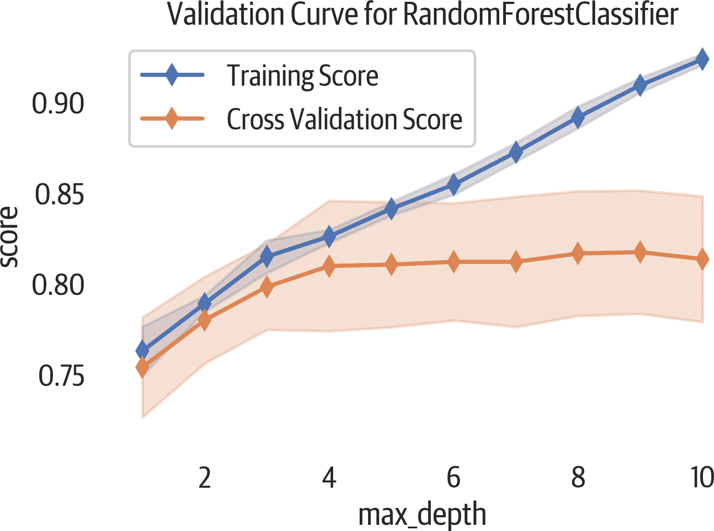

# 第十一章：模型选择

本章将讨论优化超参数，并且探讨模型是否需要更多数据以提升表现。

# 验证曲线

创建验证曲线是确定超参数合适值的一种方法。验证曲线是一个图表，展示模型性能如何随超参数数值变化而变化（见图 11-1）。该图表同时展示训练数据和验证数据。验证分数可以让我们推测模型对未见数据的反应。通常，我们会选择最大化验证分数的超参数。

在下面的示例中，我们将使用 Yellowbrick 来查看改变`max_depth`超参数值是否会改变随机森林模型的性能。您可以提供一个`scoring`参数设置为 scikit-learn 模型度量（分类默认为`'accuracy'`）：

###### 提示

使用`n_jobs`参数来充分利用 CPU，并且加快运行速度。如果将其设置为`-1`，将会使用所有的 CPU。

```py
>>> from yellowbrick.model_selection import (
...     ValidationCurve,
... )
>>> fig, ax = plt.subplots(figsize=(6, 4))
>>> vc_viz = ValidationCurve(
...     RandomForestClassifier(n_estimators=100),
...     param_name="max_depth",
...     param_range=np.arange(1, 11),
...     cv=10,
...     n_jobs=-1,
... )
>>> vc_viz.fit(X, y)
>>> vc_viz.poof()
>>> fig.savefig("images/mlpr_1101.png", dpi=300)
```



###### 图 11-1\. 验证曲线报告。

`ValidationCurve`类支持`scoring`参数。该参数可以是自定义函数或以下选项之一，具体取决于任务。

分类`scoring`选项包括：`'accuracy'`, `'average_precision'`, `'f1'`, `'f1_micro'`, `'f1_macro'`, `'f1_weighted'`, `'f1_samples'`, `'neg_log_loss'`, `'precision'`, `'recall'` 和 `'roc_auc'`。

聚类`scoring`选项：`'adjusted_mutual_info_score'`, `'adjusted_rand_score'`, `'completeness_score'`, `'fowlkes_mallows_score'`, `'homogeneity_score'`, `'mutual_info_score'`, `'normalized_mutual_info_score'` 和 `'v_measure_score'`。

回归`scoring`选项：`'explained_variance'`, `'neg_mean_absolute_error'`, `'neg_mean_squared_error'`, `'neg_mean_squared_log_error'`, `'neg_median_absolute_error'` 和 `'r2'`。

# 学习曲线

为了为您的项目选择最佳模型，您需要多少数据？学习曲线可以帮助我们回答这个问题。该曲线绘制了随着样本增加创建模型时的训练和交叉验证分数。例如，如果交叉验证分数继续上升，那可能表明更多数据将有助于模型表现更好。

下面的可视化展示了一个验证曲线，并且帮助我们探索模型的偏差和方差（见图 11-2）。如果训练分数有变化（一个大的阴影区域），则模型存在偏差误差，过于简单（欠拟合）。如果交叉验证分数有变化，则模型存在方差误差，过于复杂（过拟合）。另一个过拟合的指示是验证集的性能远远不如训练集。

这里是使用 Yellowbrick 创建学习曲线的示例：

```py
>>> from yellowbrick.model_selection import (
...     LearningCurve,
... )
>>> fig, ax = plt.subplots(figsize=(6, 4))
>>> lc3_viz = LearningCurve(
...     RandomForestClassifier(n_estimators=100),
...     cv=10,
... )
>>> lc3_viz.fit(X, y)
>>> lc3_viz.poof()
>>> fig.savefig("images/mlpr_1102.png", dpi=300)
```


###### 图 11-2\. 学习曲线图。验证分数的平稳期表明添加更多数据不会改善该模型。

这种可视化方法也可以通过改变评分选项用于回归或聚类。
