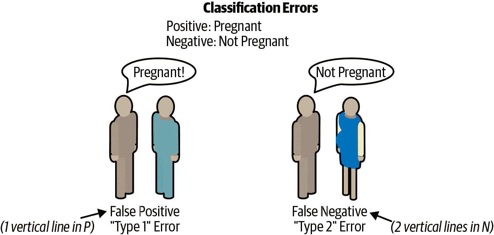
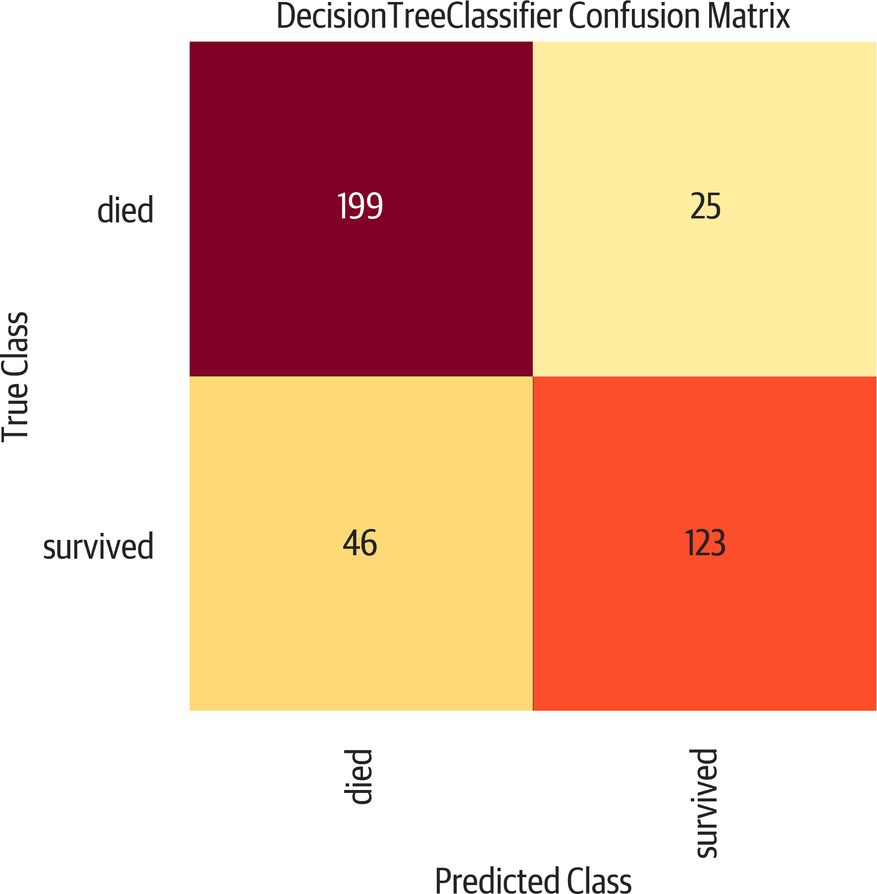
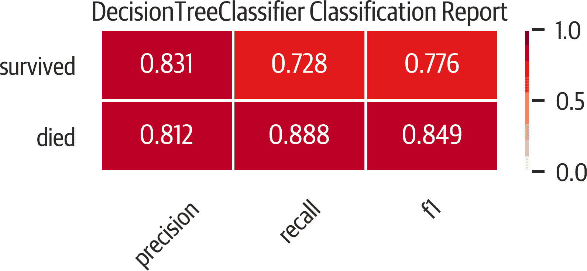
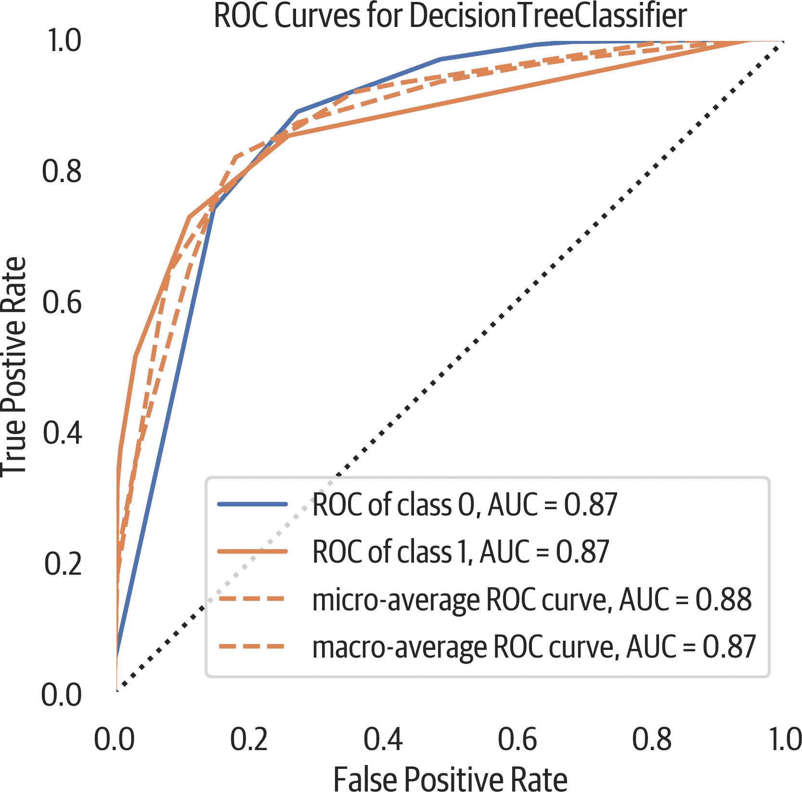
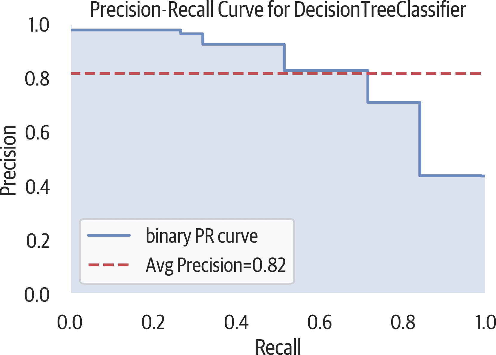
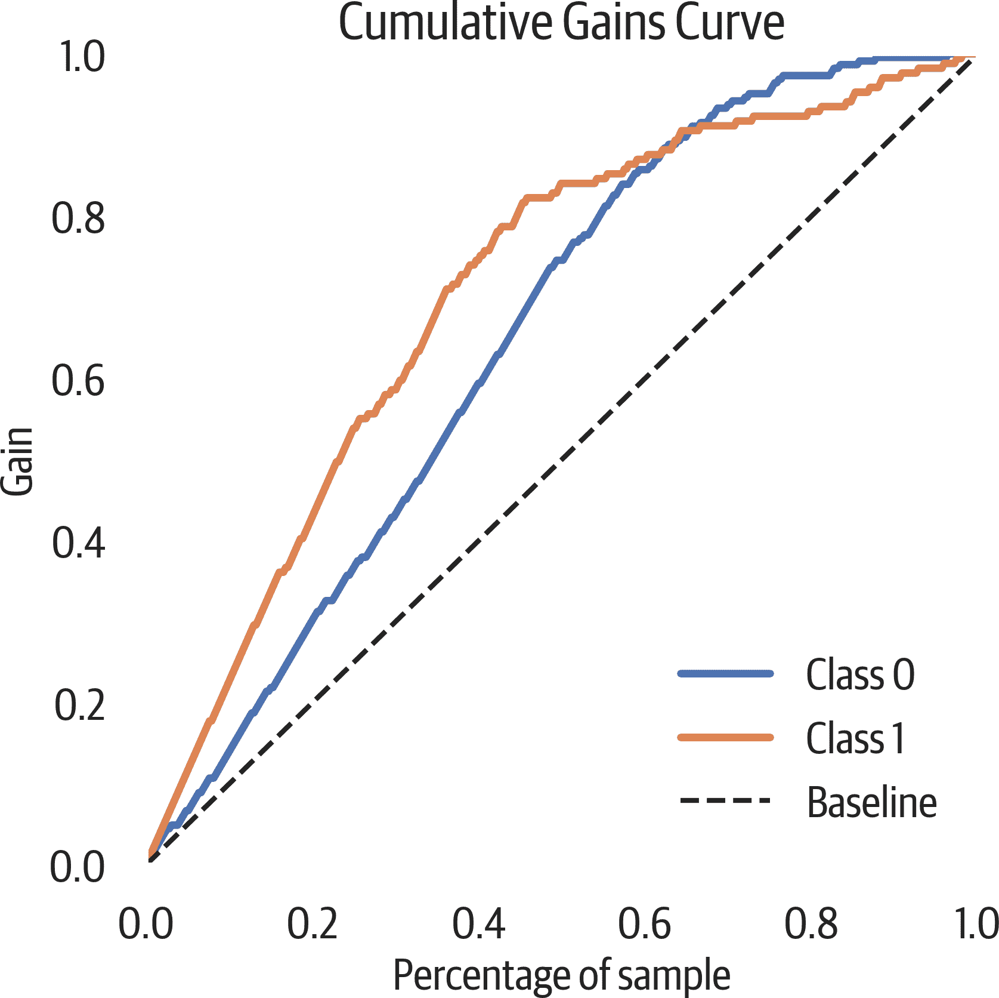
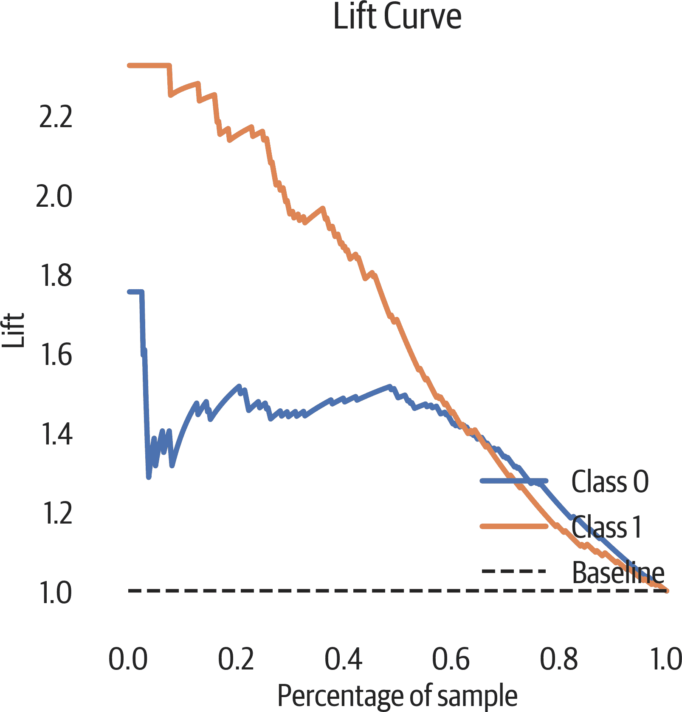
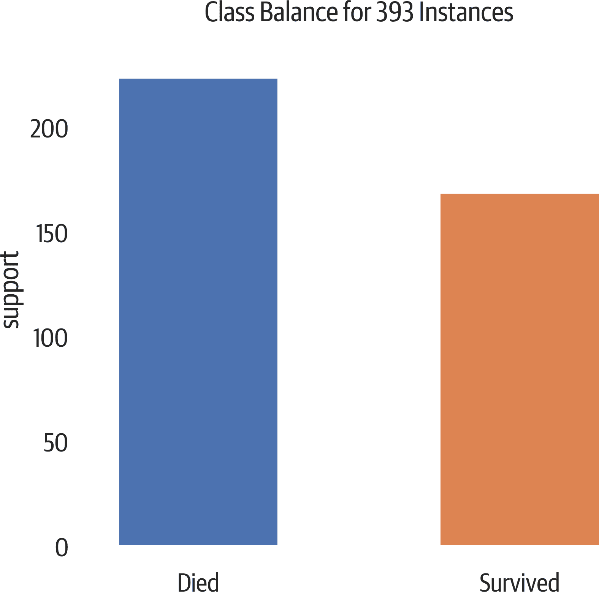
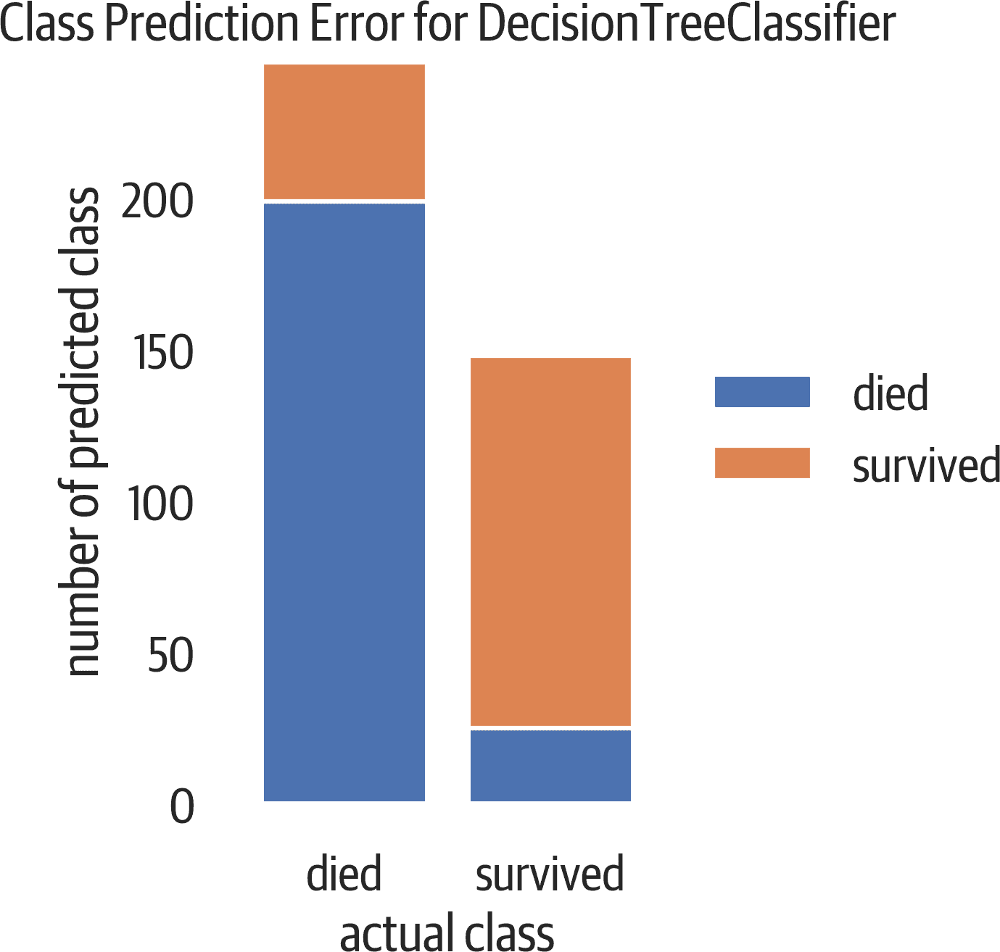
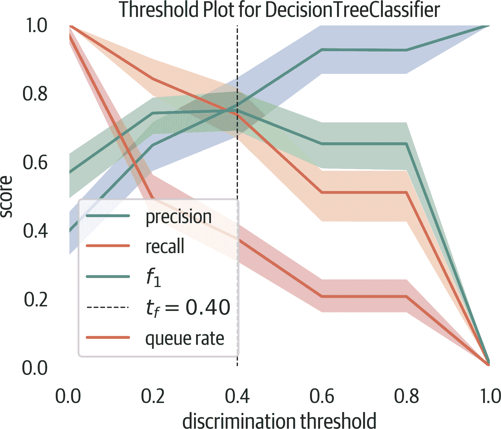

# 第十二章。指标和分类评估

在本章中我们将涵盖以下指标和评估工具：混淆矩阵、各种指标、分类报告和一些可视化。

这将作为一个预测泰坦尼克号生存的决策树模型进行评估。

# 混淆矩阵

混淆矩阵有助于理解分类器的表现。

二元分类器可以有四种分类结果：真正例（TP）、真反例（TN）、假正例（FP）和假反例（FN）。前两者是正确分类。

这里是一个常见的例子，用于记忆其他结果。假设正表示怀孕，负表示未怀孕，假阳性就像声称一个男性怀孕。假阴性是声称一个怀孕的女性不是（当她显然有显示）（见图 12-1）。这些错误称为 *类型 1* 和 *类型 2* 错误，分别参见表 12-1。

记住这些的另一种方法是，P（表示假阳性）中有一条直线（类型 1 错误），而 N（表示假阴性）中有两条竖线。



###### 图 12-1\. 分类错误。

表 12-1\. 从混淆矩阵中得出的二元分类结果

| 实际 | 预测为负 | 预测为正 |
| --- | --- | --- |
| 实际负样本 | 真阴性 | 假阳性（类型 1） |
| 实际正样本 | 假阴性（类型 2） | 真正例 |

这里是计算分类结果的 pandas 代码。注释显示了结果。我们将使用这些变量来计算其他指标：

```py
>>> y_predict = dt.predict(X_test)
>>> tp = (
...     (y_test == 1) & (y_test == y_predict)
... ).sum()  # 123
>>> tn = (
...     (y_test == 0) & (y_test == y_predict)
... ).sum()  # 199
>>> fp = (
...     (y_test == 0) & (y_test != y_predict)
... ).sum()  # 25
>>> fn = (
...     (y_test == 1) & (y_test != y_predict)
... ).sum()  # 46
```

良好表现的分类器理想情况下在真实对角线上有高计数。我们可以使用 sklearn 的 `confusion_matrix` 函数创建一个 DataFrame：

```py
>>> from sklearn.metrics import confusion_matrix
>>> y_predict = dt.predict(X_test)
>>> pd.DataFrame(
...     confusion_matrix(y_test, y_predict),
...     columns=[
...         "Predict died",
...         "Predict Survive",
...     ],
...     index=["True Death", "True Survive"],
... )
 Predict died  Predict Survive
True Death             199               25
True Survive            46              123
```

Yellowbrick 有一个混淆矩阵的绘图（见图 12-2）：

```py
>>> import matplotlib.pyplot as plt
>>> from yellowbrick.classifier import (
...     ConfusionMatrix,
... )
>>> mapping = {0: "died", 1: "survived"}
>>> fig, ax = plt.subplots(figsize=(6, 6))
>>> cm_viz = ConfusionMatrix(
...     dt,
...     classes=["died", "survived"],
...     label_encoder=mapping,
... )
>>> cm_viz.score(X_test, y_test)
>>> cm_viz.poof()
>>> fig.savefig("images/mlpr_1202.png", dpi=300)
```



###### 图 12-2\. 混淆矩阵。左上角和右下角是正确分类。左下角是假阴性。右上角是假阳性。

# 指标

`sklearn.metrics` 模块实现了许多常见的分类度量，包括：

`'accuracy'`

正确预测的百分比

`'average_precision'`

精确率-召回率曲线总结

`'f1'`

精度和召回率的调和平均数

`'neg_log_loss'`

逻辑或交叉熵损失（模型必须支持 `predict_proba`）

`'precision'`

能够仅找到相关样本（不将负样本误标为正样本）

`'recall'`

能够找到所有正样本

`'roc_auc'`

ROC 曲线下的面积

这些字符串可以作为网格搜索中的 `scoring` 参数使用，或者你可以使用 `sklearn.metrics` 模块中具有相同名称但以 `_score` 结尾的函数。详见下面的示例。

###### 注意

`'f1'`, `'precision'` 和 `'recall'` 都支持多类分类器的以下后缀：

`'_micro'`

全局加权平均指标

`'_macro'`

指标的未加权平均

`'_weighted'`

多类加权平均指标

`'_samples'`

每个样本的指标

# 准确率

准确率是正确分类的百分比：

```py
>>> (tp + tn) / (tp + tn + fp + fn)
0.8142493638676844
```

什么是良好的准确率？这取决于情况。如果我在预测欺诈（通常是罕见事件，比如一万分之一），我可以通过始终预测不是欺诈来获得非常高的准确率。但这种模型并不是很有用。查看其他指标以及预测假阳性和假阴性的成本可以帮助我们确定模型是否合适。

我们可以使用 sklearn 来计算它：

```py
>>> from sklearn.metrics import accuracy_score
>>> y_predict = dt.predict(X_test)
>>> accuracy_score(y_test, y_predict)
0.8142493638676844
```

# 召回率

召回率（也称为*灵敏度*）是正确分类的正值的百分比。（返回多少相关的结果？）

```py
>>> tp / (tp + fn)
0.7159763313609467

>>> from sklearn.metrics import recall_score
>>> y_predict = dt.predict(X_test)
>>> recall_score(y_test, y_predict)
0.7159763313609467
```

# 精度

精度是正确预测的正预测的百分比（TP 除以（TP + FP））。（结果有多相关？）

```py
>>> tp / (tp + fp)
0.8287671232876712

>>> from sklearn.metrics import precision_score
>>> y_predict = dt.predict(X_test)
>>> precision_score(y_test, y_predict)
0.8287671232876712
```

# F1

F1 是召回率和精度的调和平均值：

```py
>>> pre = tp / (tp + fp)
>>> rec = tp / (tp + fn)
>>> (2 * pre * rec) / (pre + rec)
0.7682539682539683

>>> from sklearn.metrics import f1_score
>>> y_predict = dt.predict(X_test)
>>> f1_score(y_test, y_predict)
0.7682539682539683
```

# 分类报告

Yellowbrick 有一个分类报告，显示正负值的精度、召回率和 F1 分数（见图 12-3）。颜色标记，红色越深（接近 1），得分越好：

```py
>>> import matplotlib.pyplot as plt
>>> from yellowbrick.classifier import (
...     ClassificationReport,
... )
>>> fig, ax = plt.subplots(figsize=(6, 3))
>>> cm_viz = ClassificationReport(
...     dt,
...     classes=["died", "survived"],
...     label_encoder=mapping,
... )
>>> cm_viz.score(X_test, y_test)
>>> cm_viz.poof()
>>> fig.savefig("images/mlpr_1203.png", dpi=300)
```



###### 图 12-3\. 分类报告。

# ROC

ROC 曲线说明分类器在真正例率（召回率/灵敏度）随假正例率（倒置特异性）变化时的表现（见图 12-4）。

一个经验法则是图形应该朝向左上角凸出。一个位于另一个图形左侧且上方的图形表示性能更好。这个图中的对角线表示随机猜测分类器的行为。通过计算 AUC，您可以得到一个评估性能的度量：

```py
>>> from sklearn.metrics import roc_auc_score
>>> y_predict = dt.predict(X_test)
>>> roc_auc_score(y_test, y_predict)
0.8706304346418559
```

Yellowbrick 可以为我们绘制这个图：

```py
>>> from yellowbrick.classifier import ROCAUC
>>> fig, ax = plt.subplots(figsize=(6, 6))
>>> roc_viz = ROCAUC(dt)
>>> roc_viz.score(X_test, y_test)
0.8706304346418559
>>> roc_viz.poof()
>>> fig.savefig("images/mlpr_1204.png", dpi=300)
```



###### 图 12-4\. ROC 曲线。

# 精度-召回曲线

ROC 曲线对于不平衡类可能过于乐观。评估分类器的另一种选择是使用精度-召回曲线（见图 12-5）。分类是在找到所有需要的内容（召回率）和限制垃圾结果（精度）之间进行权衡。这通常是一个权衡。随着召回率的提高，精度通常会下降，反之亦然。

```py
>>> from sklearn.metrics import (
...     average_precision_score,
... )
>>> y_predict = dt.predict(X_test)
>>> average_precision_score(y_test, y_predict)
0.7155150490642249
```

这是一个 Yellowbrick 精度-召回曲线：

```py
>>> from yellowbrick.classifier import (
...     PrecisionRecallCurve,
... )
>>> fig, ax = plt.subplots(figsize=(6, 4))
>>> viz = PrecisionRecallCurve(
...     DecisionTreeClassifier(max_depth=3)
... )
>>> viz.fit(X_train, y_train)
>>> print(viz.score(X_test, y_test))
>>> viz.poof()
>>> fig.savefig("images/mlpr_1205.png", dpi=300)
```



###### 图 12-5\. 精度-召回曲线。

# 累积增益图

累积增益图可用于评估二元分类器。它将真正率（灵敏度）模型化为正预测的分数率。该图背后的直觉是按预测概率对所有分类进行排序。理想情况下，应有一个清晰的分界线，将正样本与负样本分开。如果前 10%的预测具有 30%的正样本，则应绘制从（0,0）到（.1，.3）的点。继续这个过程直至所有样本（见图 12-6）。

这通常用于确定客户反应。累积增益曲线沿 x 轴绘制支持或预测的正率。我们的图表将其标记为“样本百分比”。它沿 y 轴绘制灵敏度或真正率。在我们的图中标记为“增益”。

如果您想联系 90%会响应的客户（灵敏度），您可以从 y 轴上的 0.9 追溯到右侧，直到碰到该曲线。此时的 x 轴指示您需要联系多少总客户（支持），以达到 90%。

在这种情况下，我们不联系会对调查做出反应的客户，而是预测泰坦尼克号上的生存。如果按照我们的模型将泰坦尼克号的所有乘客排序，根据其生存可能性，如果你拿前 65%的乘客，你将得到 90%的幸存者。如果有每次联系的相关成本和每次响应的收入，您可以计算出最佳数量是多少。

一般来说，处于左上方的模型比另一个模型更好。最佳模型是上升到顶部的线（如果样本的 10%为正，它将在（.1, 1）处达到）。然后直接到右侧。如果图表在基线以下，我们最好随机分配标签以使用我们的模型。

[scikit-plot 库](https://oreil.ly/dg0iQ)可以创建一个累积增益图：

```py
>>> fig, ax = plt.subplots(figsize=(6, 6))
>>> y_probas = dt.predict_proba(X_test)
>>> scikitplot.metrics.plot_cumulative_gain(
...     y_test, y_probas, ax=ax
... )
>>> fig.savefig(
...     "images/mlpr_1206.png",
...     dpi=300,
...     bbox_inches="tight",
... )
```



###### 图 12-6\. 累积增益图。如果我们根据我们的模型对泰坦尼克号上的人进行排序，查看其中的 20%，我们将获得 40%的幸存者。

# 抬升曲线

抬升曲线是查看累积增益图中信息的另一种方式。抬升是我们比基线模型做得更好的程度。在我们的图中，我们可以看到，如果按照生存概率对泰坦尼克号乘客进行排序并取前 20%的人，我们的提升将约为基线模型的 2.2 倍（增益除以样本百分比）好（见图 12-7）。 （我们将获得 2.2 倍的幸存者。）

scikit-plot 库可以创建一个抬升曲线：

```py
>>> fig, ax = plt.subplots(figsize=(6, 6))
>>> y_probas = dt.predict_proba(X_test)
>>> scikitplot.metrics.plot_lift_curve(
...     y_test, y_probas, ax=ax
... )
>>> fig.savefig(
...     "images/mlpr_1207.png",
...     dpi=300,
...     bbox_inches="tight",
... )
```



###### 图 12-7\. 抬升曲线。

# 类别平衡

Yellowbrick 提供了一个简单的柱状图，用于查看类别大小。当相对类别大小不同时，准确率不是一个良好的评估指标（见图 12-8）。在将数据分成训练集和测试集时，请使用*分层抽样*，以保持类别的相对比例（当你将 `stratify` 参数设置为标签时，`test_train_split` 函数会执行此操作）。

```py
>>> from yellowbrick.classifier import ClassBalance
>>> fig, ax = plt.subplots(figsize=(6, 6))
>>> cb_viz = ClassBalance(
...     labels=["Died", "Survived"]
... )
>>> cb_viz.fit(y_test)
>>> cb_viz.poof()
>>> fig.savefig("images/mlpr_1208.png", dpi=300)
```



###### 图 12-8\. 轻微的类别不平衡。

# 类预测错误

Yellowbrick 的类预测错误图是一个柱状图，用于可视化混淆矩阵（参见图 12-9）：

```py
>>> from yellowbrick.classifier import (
...     ClassPredictionError,
... )
>>> fig, ax = plt.subplots(figsize=(6, 3))
>>> cpe_viz = ClassPredictionError(
...     dt, classes=["died", "survived"]
... )
>>> cpe_viz.score(X_test, y_test)
>>> cpe_viz.poof()
>>> fig.savefig("images/mlpr_1209.png", dpi=300)
```



###### 图 12-9\. 类预测错误。在左侧条的顶部是死亡者，但我们预测他们幸存（假阳性）。在右侧条的底部是幸存者，但模型预测为死亡（假阴性）。

# 判别阈值

大多数预测概率的二元分类器具有 50%的*判别阈值*。如果预测概率高于 50%，分类器会分配正标签。图 12-10 在 0 到 100 之间移动该阈值，并显示对精确度、召回率、f1 和队列率的影响。

这个图表对于查看精确度和召回率之间的权衡是有用的。假设我们正在寻找欺诈（并将欺诈视为正分类）。为了获得高召回率（捕捉到所有的欺诈），我们可以将所有东西都分类为欺诈。但在银行情境下，这不会盈利，而且需要大量的工作人员。为了获得高精确度（只有在确实是欺诈时才捕捉到欺诈），我们可以有一个只对极端欺诈案例触发的模型。但这会错过许多不那么明显的欺诈行为。这里存在一种权衡。

*队列率*是高于阈值的预测百分比。如果您正在处理欺诈案件，可以将其视为需要审查的案例百分比。

如果您有正、负和错误计算的成本，您可以确定您可以接受的阈值。

以下图表有助于查看在与队列率结合时，哪个判别阈值能够最大化 f1 得分或调整精确度或召回率至可接受水平。

Yellowbrick 提供了这个可视化工具。默认情况下，这个可视化工具对数据进行洗牌，并运行 50 次试验，其中分离出 10%作为验证集：

```py
>>> from yellowbrick.classifier import (
...     DiscriminationThreshold,
... )
>>> fig, ax = plt.subplots(figsize=(6, 5))
>>> dt_viz = DiscriminationThreshold(dt)
>>> dt_viz.fit(X, y)
>>> dt_viz.poof()
>>> fig.savefig("images/mlpr_1210.png", dpi=300)
```



###### 图 12-10\. 判别阈值。
