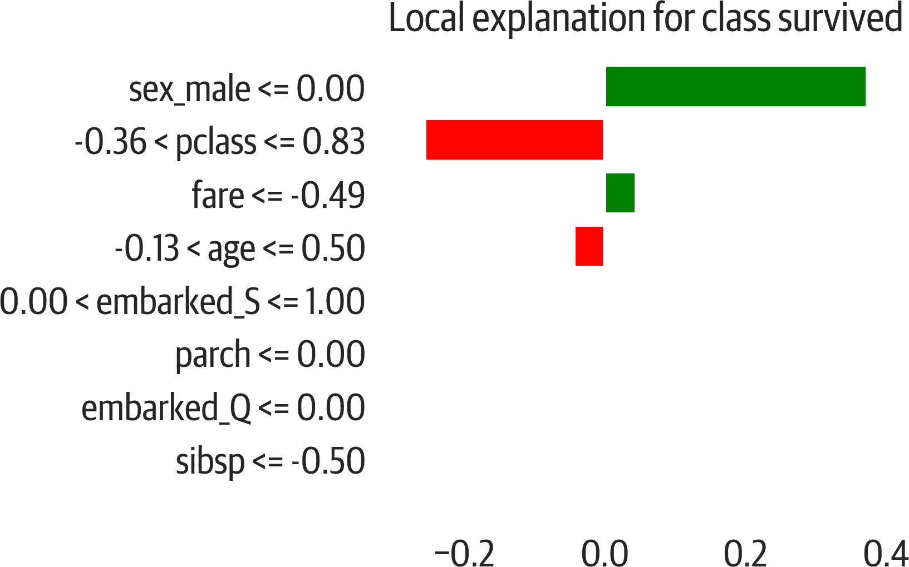
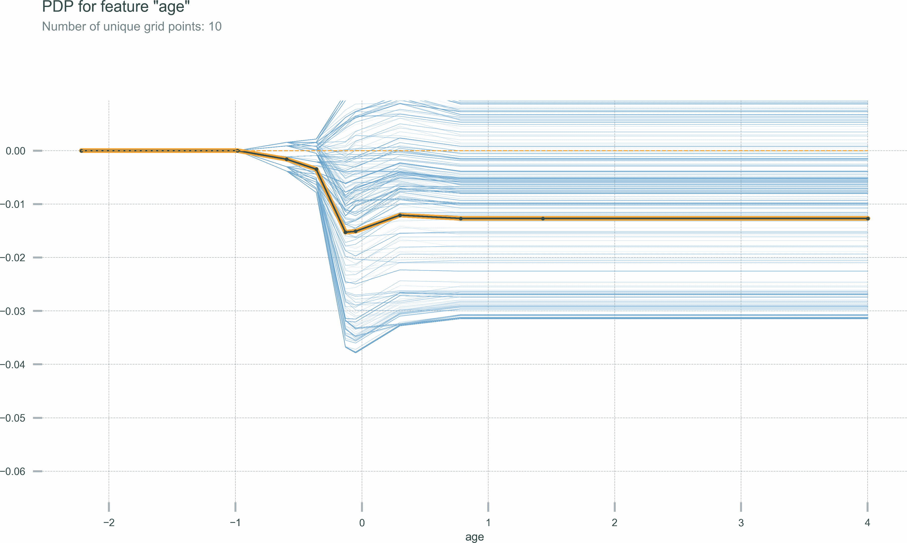
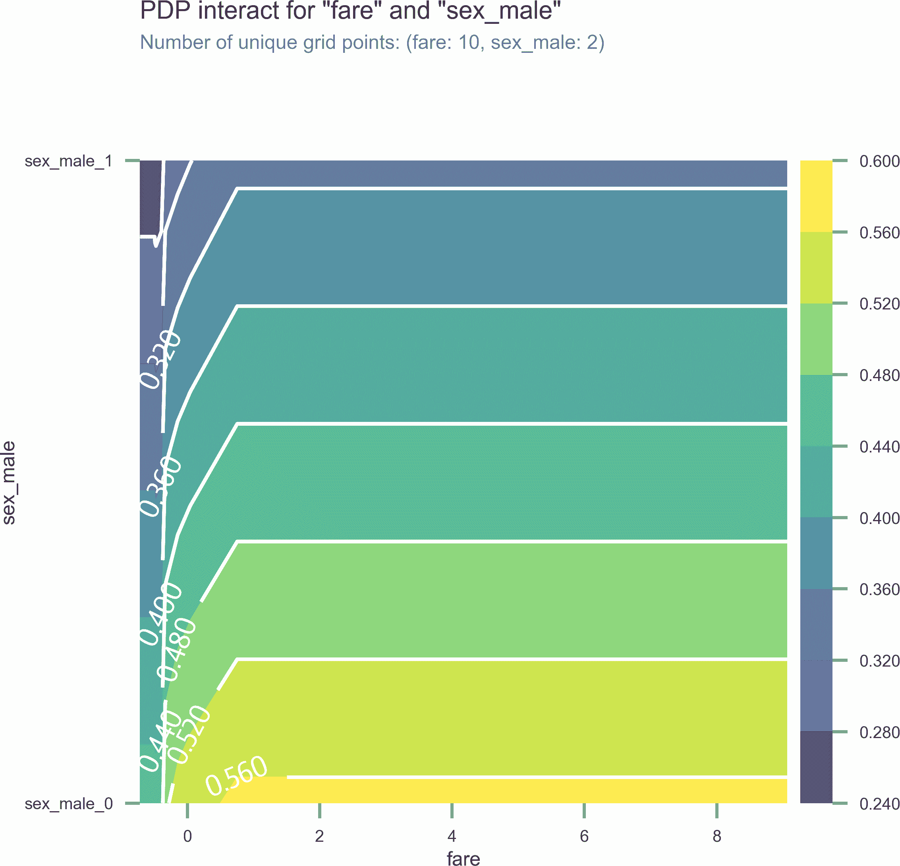
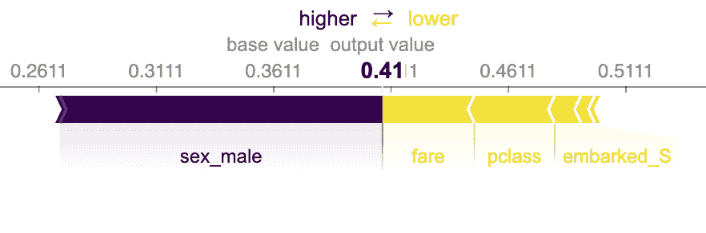
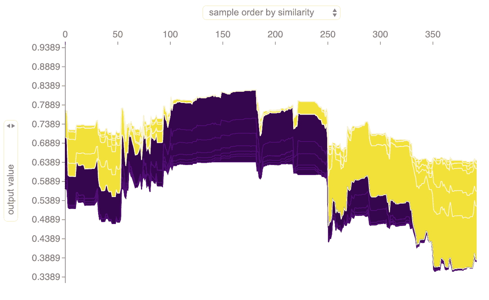
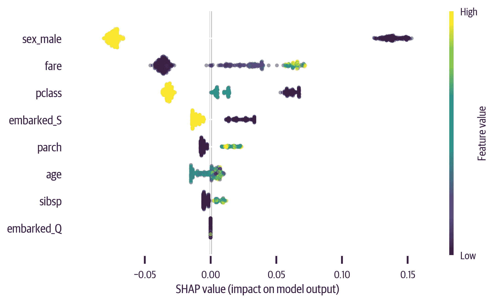

# 第十三章：解释模型

预测模型具有不同的属性。有些设计用于处理线性数据。其他可以适应更复杂的输入。有些模型很容易解释，而其他模型则像黑盒子，不提供有关如何进行预测的深入见解。

在本章中，我们将探讨解释不同的模型。我们将查看一些使用泰坦尼克号数据的示例。

```py
>>> dt = DecisionTreeClassifier(
...     random_state=42, max_depth=3
... )
>>> dt.fit(X_train, y_train)
```

# 回归系数

截距和回归系数解释了预期值以及特征如何影响预测。正系数表明随着特征值的增加，预测也会增加。

# 特征重要性

scikit-learn 库中的基于树的模型包括 `.fea⁠ture_``importances_` 属性，用于检查数据集的特征如何影响模型。我们可以检查或绘制它们。

# LIME

[LIME](https://oreil.ly/shCR_) 用于帮助解释黑盒模型。它执行*局部*解释而不是整体解释。它将帮助解释单个样本。

对于给定的数据点或样本，LIME 指示了确定结果的重要特征。它通过扰动所讨论的样本并将线性模型拟合到它来实现这一点。线性模型近似于样本附近的模型（参见 Figure 13-1）。

这里有一个例子，解释了训练数据中最后一个样本（我们的决策树预测会存活）：

```py
>>> from lime import lime_tabular
>>> explainer = lime_tabular.LimeTabularExplainer(
...     X_train.values,
...     feature_names=X.columns,
...     class_names=["died", "survived"],
... )
>>> exp = explainer.explain_instance(
...     X_train.iloc[-1].values, dt.predict_proba
... )
```

LIME 不喜欢使用 DataFrame 作为输入。请注意，我们使用 `.values` 将数据转换为 numpy 数组。

###### 提示

如果您在 Jupyter 中进行此操作，请使用以下代码进行后续操作：

```py
exp.show_in_notebook()
```

这将呈现解释的 HTML 版本。

如果我们想导出解释（或者不使用 Jupyter），我们可以创建一个 matplotlib 图形：

```py
>>> fig = exp.as_pyplot_figure()
>>> fig.tight_layout()
>>> fig.savefig("images/mlpr_1301.png")
```



###### 图 13-1\. 泰坦尼克号数据集的 LIME 解释。样本的特征将预测推向右侧（存活）或左侧（已故）。

尝试一下，注意到如果更改性别，结果会受到影响。下面我们获取训练数据中的倒数第二行。该行的预测为 48% 的死亡和 52% 的生还。如果我们更改性别，我们发现预测向 88% 的死亡方向移动：

```py
>>> data = X_train.iloc[-2].values.copy()
>>> dt.predict_proba(
...     [data]
... )  # predicting that a woman lives
[[0.48062016 0.51937984]]
>>> data[5] = 1  # change to male
>>> dt.predict_proba([data])
array([[0.87954545, 0.12045455]])
```

###### 注意

`.predict_proba` 方法返回每个标签的概率。

# 树解释

对于 sklearn 的基于树的模型（决策树、随机森林和额外树模型），您可以使用 [treeinterpreter package](https://oreil.ly/vN1Bl)。这将计算每个特征的偏差和贡献。偏差是训练集的均值。

每个贡献列表说明了它对每个标签的贡献。 （偏差加上贡献应该等于预测。）由于这是二分类问题，只有两种。我们看到 sex_male 是最重要的，其次是 age 和 fare：

```py
>>> from treeinterpreter import (
...     treeinterpreter as ti,
... )
>>> instances = X.iloc[:2]
>>> prediction, bias, contribs = ti.predict(
...     rf5, instances
... )
>>> i = 0
>>> print("Instance", i)
>>> print("Prediction", prediction[i])
>>> print("Bias (trainset mean)", bias[i])
>>> print("Feature contributions:")
>>> for c, feature in zip(
...     contribs[i], instances.columns
... ):
...     print("  {} {}".format(feature, c))
Instance 0
Prediction [0.98571429 0.01428571]
Bias (trainset mean) [0.63984716 0.36015284]
Feature contributions:
 pclass [ 0.03588478 -0.03588478]
 age [ 0.08569306 -0.08569306]
 sibsp [ 0.01024538 -0.01024538]
 parch [ 0.0100742 -0.0100742]
 fare [ 0.06850243 -0.06850243]
 sex_male [ 0.12000073 -0.12000073]
 embarked_Q [ 0.0026364 -0.0026364]
 embarked_S [ 0.01283015 -0.01283015]
```

###### 注意

此示例用于分类，但也支持回归。

# 部分依赖图

使用树中的特征重要性，我们知道某个特征影响了结果，但我们不知道随着特征值的变化，影响如何变化。部分依赖图允许我们可视化单个特征变化与结果之间的关系。我们将使用[pdpbox](https://oreil.ly/O9zY2)来可视化年龄如何影响生存（参见图 13-2）。

此示例使用随机森林模型：

```py
>>> rf5 = ensemble.RandomForestClassifier(
...     **{
...         "max_features": "auto",
...         "min_samples_leaf": 0.1,
...         "n_estimators": 200,
...         "random_state": 42,
...     }
... )
>>> rf5.fit(X_train, y_train)
```

```py
>>> from pdpbox import pdp
>>> feat_name = "age"
>>> p = pdp.pdp_isolate(
...     rf5, X, X.columns, feat_name
... )
>>> fig, _ = pdp.pdp_plot(
...     p, feat_name, plot_lines=True
... )
>>> fig.savefig("images/mlpr_1302.png", dpi=300)
```



###### 图 13-2\. 显示随着年龄变化目标发生变化的部分依赖图。

我们还可以可视化两个特征之间的交互作用（参见图 13-3）：

```py
>>> features = ["fare", "sex_male"]
>>> p = pdp.pdp_interact(
...     rf5, X, X.columns, features
... )
>>> fig, _ = pdp.pdp_interact_plot(p, features)
>>> fig.savefig("images/mlpr_1303.png", dpi=300)
```



###### 图 13-3\. 具有两个特征的部分依赖图。随着票价上涨和性别从男性变为女性，生存率上升。

###### 注意

部分依赖图固定了样本中的特征值，然后对结果进行平均。（小心异常值和平均值。）此外，此图假设特征是独立的。（并非总是如此；例如，保持萼片的宽度稳定可能会影响其高度。）pdpbox 库还打印出单个条件期望，以更好地可视化这些关系。

# 替代模型

如果您有一个不可解释的模型（如 SVM 或神经网络），您可以为该模型拟合一个可解释的模型（决策树）。使用替代模型，您可以检查特征的重要性。

在这里，我们创建了一个支持向量分类器（SVC），但是训练了一个决策树（没有深度限制，以过度拟合并捕获该模型中发生的情况）来解释它：

```py
>>> from sklearn import svm
>>> sv = svm.SVC()
>>> sv.fit(X_train, y_train)
>>> sur_dt = tree.DecisionTreeClassifier()
>>> sur_dt.fit(X_test, sv.predict(X_test))
>>> for col, val in sorted(
...     zip(
...         X_test.columns,
...         sur_dt.feature_importances_,
...     ),
...     key=lambda x: x[1],
...     reverse=True,
... )[:7]:
...     print(f"{col:10}{val:10.3f}")
sex_male       0.723
pclass         0.076
sibsp          0.061
age            0.056
embarked_S     0.050
fare           0.028
parch          0.005
```

# 夏普利

SHapley Additive exPlanations，([SHAP](https://oreil.ly/QYj-q)) 包可以可视化任何模型的特征贡献。这是一个非常好的包，因为它不仅适用于大多数模型，还可以解释个别预测和全局特征贡献。

SHAP 适用于分类和回归。它生成“SHAP”值。对于分类模型，SHAP 值总和为二元分类的对数几率。对于回归，SHAP 值总和为目标预测。

此库需要 Jupyter（JavaScript）以实现部分图的交互性（一些可以使用 matplotlib 渲染静态图像）。这是一个例子，用于样本 20，预测为死亡：

```py
>>> rf5.predict_proba(X_test.iloc[[20]])
array([[0.59223553, 0.40776447]])
```

在样本 20 的力图中，您可以看到“基值”。这是一个被预测为死亡的女性（参见图 13-4）。我们将使用生存指数（1），因为我们希望图的右侧是生存。特征将此推向右侧或左侧。特征越大，影响越大。在这种情况下，低票价和第三类推向死亡（输出值低于 .5）：

```py
>>> import shap
>>> s = shap.TreeExplainer(rf5)
>>> shap_vals = s.shap_values(X_test)
>>> target_idx = 1
>>> shap.force_plot(
...     s.expected_value[target_idx],
...     shap_vals[target_idx][20, :],
...     feature_names=X_test.columns,
... )
```



###### 图 13-4\. 样本 20 的 Shapley 特征贡献。此图显示基值和推向死亡的特征。

您还可以可视化整个数据集的解释（将其旋转 90 度并沿 x 轴绘制）（见图 13-5）：

```py
>>> shap.force_plot(
...     s.expected_value[1],
...     shap_vals[1],
...     feature_names=X_test.columns,
... )
```



###### 图 13-5\. 数据集的 Shapley 特征贡献。

SHAP 库还可以生成依赖图。以下图（见图 13-6）可视化了年龄和 SHAP 值之间的关系（它根据 `pclass` 进行了着色，这是 SHAP 自动选择的；指定一个列名称作为 `interaction_index` 参数以选择您自己的）：

```py
>>> fig, ax = plt.subplots(figsize=(6, 4))
>>> res = shap.dependence_plot(
...     "age",
...     shap_vals[target_idx],
...     X_test,
...     feature_names=X_test.columns,
...     alpha=0.7,
... )
>>> fig.savefig(
...     "images/mlpr_1306.png",
...     bbox_inches="tight",
...     dpi=300,
... )
```


###### 图 13-6\. 年龄的 Shapley 依赖图。年轻人和老年人的生存率较高。随着年龄增长，较低的 `pclass` 有更多的生存机会。

###### 提示

您可能会得到一个具有垂直线的依赖图。如果查看有序分类特征，则将 `x_jitter` 参数设置为 1 是有用的。

此外，我们可以总结所有特征。这是一个非常强大的图表，可以理解。它显示了全局影响，但也显示了个别影响。特征按重要性排名。最重要的特征位于顶部。

同时，特征根据它们的值进行了着色。我们可以看到低`sex_male`得分（女性）对生存有很强的推动作用，而高得分对死亡的推动作用较弱。年龄特征有点难以解释。这是因为年轻和年老的值对生存有推动作用，而中间值则对死亡有推动作用。

当您将摘要图与依赖图结合起来时，您可以深入了解模型行为（见图 13-7）：

```py
>>> fig, ax = plt.subplots(figsize=(6, 4))
>>> shap.summary_plot(shap_vals[0], X_test)
>>> fig.savefig("images/mlpr_1307.png", dpi=300)
```



###### 图 13-7\. Shapley 摘要图显示最重要的特征在顶部。着色显示特征值对目标的影响。
