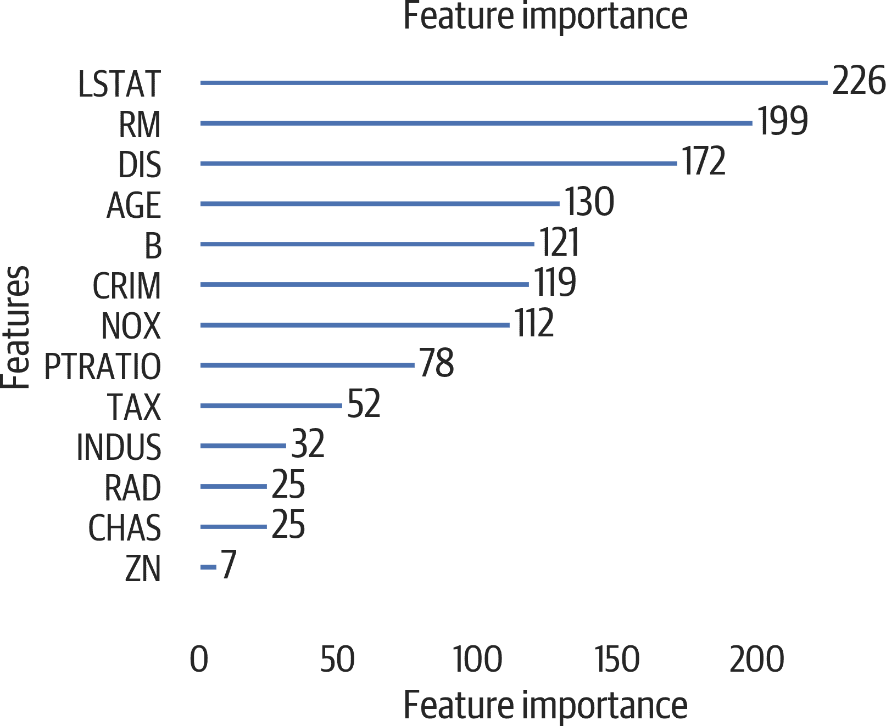

# 第十四章：回归

回归是一种监督机器学习过程。它类似于分类，但不是预测标签，而是预测连续值。如果您要预测一个数字，那么使用回归。

结果表明，sklearn 支持许多相同的分类模型用于回归问题。实际上，API 是相同的，调用`.fit`、`.score`和`.predict`。对于下一代增强库 XGBoost 和 LightGBM 也是如此。

尽管分类模型和超参数有相似之处，但回归的评估指标不同。本章将回顾许多种回归模型。我们将使用[Boston 房屋数据集](https://oreil.ly/b2bKQ)进行探索。

在这里，我们加载数据，创建一个用于训练和测试的拆分版本，并创建另一个具有标准化数据的拆分版本：

```py
>>> import pandas as pd
>>> from sklearn.datasets import load_boston
>>> from sklearn import (
...     model_selection,
...     preprocessing,
... )
>>> b = load_boston()
>>> bos_X = pd.DataFrame(
...     b.data, columns=b.feature_names
... )
>>> bos_y = b.target

>>> bos_X_train, bos_X_test, bos_y_train, bos_y_test = model_selection.train_test_split(
...     bos_X,
...     bos_y,
...     test_size=0.3,
...     random_state=42,
... )

>>> bos_sX = preprocessing.StandardScaler().fit_transform(
...     bos_X
... )
>>> bos_sX_train, bos_sX_test, bos_sy_train, bos_sy_test = model_selection.train_test_split(
...     bos_sX,
...     bos_y,
...     test_size=0.3,
...     random_state=42,
... )
```

这里是从数据集中提取的住房数据集特征的描述：

犯罪率

按城镇计算的人均犯罪率

ZN

住宅土地超过 25000 平方英尺的比例

INDUS

每个城镇非零售业务用地比例

CHAS

查尔斯河虚拟变量（如果地区与河流接壤则为 1；否则为 0）

NOX

一氧化氮浓度（每千万分之一）

房屋的平均房间数

每个住宅的平均房间数

年龄

业主自住单位建于 1940 年之前的比例

DIS

到波士顿五个就业中心的加权距离

RAD

径向高速公路的可达性指数

税

每 10000 美元的全额财产税率

PTRATIO

按城镇计算的师生比

B

1000(Bk - 0.63)²，其中 Bk 是城镇中黑人的比例（此数据集来自 1978 年）

LSTAT

人口的较低地位百分比

MEDV

以每 1000 美元递增的业主自住房屋的中位数价值

# 基线模型

基线回归模型将为我们提供一个与其他模型进行比较的标准。在 sklearn 中，`.score`方法的默认结果是*确定系数*（r²或 R²）。该数值解释了预测捕捉的输入数据变化的百分比。通常在 0 到 1 之间，但在极差模型情况下可能为负数。

`DummyRegressor`的默认策略是预测训练集的平均值。我们可以看到这个模型表现不佳：

```py
>>> from sklearn.dummy import DummyRegressor
>>> dr = DummyRegressor()
>>> dr.fit(bos_X_train, bos_y_train)
>>> dr.score(bos_X_test, bos_y_test)
-0.03469753992352409
```

# 线性回归

简单线性回归教授数学和初级统计课程。它试图拟合形式为 y = mx + b 的公式，同时最小化误差的平方。求解后，我们有一个截距和系数。截距提供了一个预测的基础值，通过添加系数和输入的乘积进行修改。

这种形式可以推广到更高的维度。在这种情况下，每个特征都有一个系数。系数的绝对值越大，该特征对目标的影响越大。

该模型假设预测是输入的线性组合。对于某些数据集，这可能不够灵活。可以通过转换特征（sklearn 的`preprocessing.PolynomialFeatures`转换器可以创建特征的多项式组合）来增加复杂性。如果这导致过拟合，可以使用岭回归和 Lasso 回归来正则化估计器。

该模型也容易受到*异方差性*的影响。这意味着随着输入值的变化，预测误差（或残差）通常也会变化。如果您绘制输入与残差的图表，您将看到一个扇形或锥形。稍后我们将看到这方面的示例。

另一个要注意的问题是*多重共线性*。如果列之间存在高相关性，可能会影响系数的解释。这通常不会影响模型，只影响系数的含义。

线性回归模型具有以下属性：

运行效率

使用`n_jobs`来加快性能。

预处理数据

在训练模型之前对数据进行标准化。

防止过拟合

您可以通过不使用或添加多项式特征来简化模型。

解释结果

可以解释结果作为特征贡献的权重，但是假设特征是正态分布且独立的。您可能需要移除共线特征以提高可解释性。R²将告诉您模型解释结果中总方差的百分比。

这里是使用默认数据的样本运行：

```py
>>> from sklearn.linear_model import (
...     LinearRegression,
... )
>>> lr = LinearRegression()
>>> lr.fit(bos_X_train, bos_y_train)
LinearRegression(copy_X=True, fit_intercept=True,
 n_jobs=1, normalize=False)
>>> lr.score(bos_X_test, bos_y_test)
0.7109203586326287
>>> lr.coef_
array([-1.32774155e-01,  3.57812335e-02,
 4.99454423e-02,  3.12127706e+00,
 -1.54698463e+01,  4.04872721e+00,
 -1.07515901e-02, -1.38699758e+00,
 2.42353741e-01, -8.69095363e-03,
 -9.11917342e-01,  1.19435253e-02,
 -5.48080157e-01])
```

实例参数：

`n_jobs=None`

使用的 CPU 数目。`-1`表示全部。

拟合后的属性：

`coef_`

线性回归系数

`intercept_`

线性模型的截距

`.intercept_`值是预期的均值。您可以看到数据缩放如何影响系数。系数的符号说明特征与目标之间的关系方向。正号表示特征增加时，标签也增加。负号表示特征增加时，标签减少。系数的绝对值越大，其影响越大：

```py
>>> lr2 = LinearRegression()
>>> lr2.fit(bos_sX_train, bos_sy_train)
LinearRegression(copy_X=True, fit_intercept=True,
 n_jobs=1, normalize=False)
>>> lr2.score(bos_sX_test, bos_sy_test)
0.7109203586326278
>>> lr2.intercept_
22.50945471291039
>>> lr2.coef_
array([-1.14030209,  0.83368112,  0.34230461,
 0.792002, -1.7908376, 2.84189278, -0.30234582,
 -2.91772744,  2.10815064, -1.46330017,
 -1.97229956,  1.08930453, -3.91000474])
```

您可以使用 Yellowbrick 来可视化系数（参见图 14-1）。因为缩放后的波士顿数据是一个 numpy 数组而不是 pandas DataFrame，如果我们想使用列名，我们需要传递`labels`参数：

```py
>>> from yellowbrick.features import (
...     FeatureImportances,
... )
>>> fig, ax = plt.subplots(figsize=(6, 4))
>>> fi_viz = FeatureImportances(
...     lr2, labels=bos_X.columns
... )
>>> fi_viz.fit(bos_sX, bos_sy)
>>> fi_viz.poof()
>>> fig.savefig(
...     "images/mlpr_1401.png",
...     bbox_inches="tight",
...     dpi=300,
... )
```


###### 图 14-1\. 特征重要性。这表明 RM（房间数量）增加价格，年龄并不重要，而 LSTAT（低收入人口比例）降低价格。

# SVM

支持向量机也可以执行回归任务。

SVM 具有以下属性：

运行效率

scikit-learn 实现的时间复杂度为 O(n⁴)，因此在大规模数据集上很难扩展。使用线性核或 `LinearSVR` 模型可以提高运行时性能，可能会牺牲一些准确性。增加 `cache_size` 参数可以将复杂度降低到 O(n³)。

预处理数据

该算法不是尺度不变的，因此强烈建议对数据进行标准化。

防止过拟合

`C`（惩罚参数）控制正则化。较小的值允许较小的超平面间隔。较高的 `gamma` 值会导致过拟合训练数据。`LinearSVR` 模型支持 `loss` 和 `penalty` 参数进行正则化。`epsilon` 参数可以提高（使用 0 可能会导致过拟合）。

解释结果

检查 `.support_vectors_`，尽管这些很难解释。对于线性核，您可以检查 `.coef_`。

下面是使用库的示例：

```py
>>> from sklearn.svm import SVR
>>> svr = SVR()
>>> svr.fit(bos_sX_train, bos_sy_train)
SVR(C=1.0, cache_size=200, coef0=0.0, degree=3,
 epsilon=0.1, gamma='auto', kernel='rbf',
 max_iter=-1, shrinking=True, tol=0.001,
 verbose=False)

>>> svr.score(bos_sX_test, bos_sy_test)
0.6555356362002485
```

实例参数：

`C=1.0`

惩罚参数。值越小，决策边界越紧（更容易过拟合）。

`cache_size=200`

缓存大小（MB）。增加此值可以改善大数据集上的训练时间。

`coef0=0.0`

多项式和 sigmoid 核的独立项。

`epsilon=0.1`

定义容错边距，不会对错误给予惩罚。对于较大的数据集，应该更小。

`degree=3`

多项式核的度。

`gamma='auto'`

核系数。可以是数字，`'scale'`（0.22 版本的默认值，1 /（特征数 * `X.std()`）），或 `'auto'`（默认值，1 / 特征数）。较低的值会导致过拟合训练数据。

`kernel='rbf'`

核类型：`'linear'`、`'poly'`、`'rbf'`（默认）、`'sigmoid'`、`'precomputed'`或函数。

`max_iter=-1`

求解器的最大迭代次数。-1 表示无限制。

`probability=False`

启用概率估计。训练过程会变慢。

`random_state=None`

随机种子。

`shrinking=True`

使用缩减启发式。

`tol=0.001`

停止容差。

`verbose=False`

冗余性。

拟合后的属性：

`support_`

支持向量索引

`support_vectors_`

支持向量

`coef_`

系数（用于线性）核

`intercept_`

决策函数的常数

# K-最近邻

KNN 模型也支持回归，通过找到 k 个最近邻的目标来预测样本。对于回归，该模型会将目标值平均，以确定预测结果。

最近邻模型具有以下特性：

运行效率

训练运行时为 O(1)，但需要权衡，因为样本数据需要存储。测试运行时为 O(Nd)，其中 N 是训练样本数，d 是维度。

预处理数据

是的，基于距离的计算在标准化后性能更好。

防止过拟合

增加 `n_neighbors`。为 L1 或 L2 距离修改 `p`。

解释结果

解释样本的 k 最近邻（使用 `.kneighbors` 方法）。如果可以解释它们，这些邻居解释了你的结果。

下面是使用该模型的示例：

```py
>>> from sklearn.neighbors import (
...     KNeighborsRegressor,
... )
>>> knr = KNeighborsRegressor()
>>> knr.fit(bos_sX_train, bos_sy_train)
KNeighborsRegressor(algorithm='auto',
 leaf_size=30, metric='minkowski',
 metric_params=None, n_jobs=1, n_neighbors=5,
 p=2, weights='uniform')

>>> knr.score(bos_sX_test, bos_sy_test)
0.747112767457727
```

属性：

`algorithm='auto'`

可以是`'brute'`，`'ball_tree'`或`'kd_tree'`。

`leaf_size=30`

用于树算法。

`metric='minkowski'`

距离度量。

`metric_params=None`

用于自定义度量函数的额外参数字典。

`n_jobs=1`

CPU 数量。

`n_neighbors=5`

邻居数。

`p=2`

Minkowski 幂参数。1 = 曼哈顿距离（L1）。2 = 欧几里得距离（L2）。

`weights='uniform'`

可以是`'distance'`，此时距离较近的点影响较大。

# 决策树

决策树支持分类和回归。树的每个层次都会评估特征的各种分裂。选择能够产生最低误差（不纯度）的分裂。可以调整`criterion`参数来确定不纯度的度量标准。

决策树具有以下属性：

运行效率

创建时，对每个 m 个特征进行循环，必须对所有 n 个样本进行排序：O(mn log n)。预测时，遍历树：O(高度)。

预处理数据

不需要缩放。需要消除缺失值并转换为数值型。

防止过拟合

将`max_depth`设置为较低的数字，提高`min_impurity_decrease`。

解释结果

可以通过选择树的选择步骤来步进。由于有步骤，树处理线性关系不佳（特征值的微小变化可能导致完全不同的树形成）。树也高度依赖于训练数据。小的变化可能改变整个树。

这里是使用 scikit-learn 库的一个例子：

```py
>>> from sklearn.tree import DecisionTreeRegressor
>>> dtr = DecisionTreeRegressor(random_state=42)
>>> dtr.fit(bos_X_train, bos_y_train)
DecisionTreeRegressor(criterion='mse',
 max_depth=None, max_features=None,
 max_leaf_nodes=None, min_impurity_decrease=0.0,
 min_impurity_split=None, min_samples_leaf=1,
 min_samples_split=2,
 min_weight_fraction_leaf=0.0, presort=False,
 random_state=42, splitter='best')

>>> dtr.score(bos_X_test, bos_y_test)
0.8426751288675483
```

实例参数：

`criterion='mse'`

分裂函数。默认是均方误差（L2 损失）。`'friedman_mse'`或`'mae'`（L1 损失）。

`max_depth=None`

树的深度。默认会构建直到叶子节点包含少于`min_samples_split`个样本。

`max_features=None`

用于分裂的特征数。默认为所有。

`max_leaf_nodes=None`

限制叶子节点数。默认为无限制。

`min_impurity_decrease=0.0`

如果分裂会使不纯度减少大于等于某个值，则进行分裂。

`min_impurity_split=None`

已弃用。

`min_samples_leaf=1`

每个叶子节点所需的最小样本数。

`min_samples_split=2`

要求分裂节点的最小样本数。

`min_weight_fraction_leaf=0.0`

叶子节点所需的最小权重总和。

`presort=False`

如果设置为`True`，则可以通过小数据集或限制深度来加速训练。

`random_state=None`

随机种子。

`splitter='best'`

使用`'random'`或`'best'`。

拟合后的属性：

`feature_importances_`

基尼重要性数组

`max_features_`

计算出的`max_features`值

`n_outputs_`

输出数

`n_features_`

特征数

`tree_`

底层树对象

查看树（参见图 14-2）：

```py
>>> import pydotplus
>>> from io import StringIO
>>> from sklearn.tree import export_graphviz
>>> dot_data = StringIO()
>>> tree.export_graphviz(
...     dtr,
...     out_file=dot_data,
...     feature_names=bos_X.columns,
...     filled=True,
... )
>>> g = pydotplus.graph_from_dot_data(
...     dot_data.getvalue()
... )
>>> g.write_png("images/mlpr_1402.png")
```

对于 Jupyter，请使用：

```py
from IPython.display import Image
Image(g.create_png())
```


###### 图 14-2。决策树。

这个图有点宽。在电脑上，你可以放大它的某些部分。你还可以通过限制图的深度（见图 14-3）来做到这一点。（事实证明，最重要的特征通常靠近树的顶部。）我们将使用`max_depth`参数来实现这一点：

```py
>>> dot_data = StringIO()
>>> tree.export_graphviz(
...     dtr,
...     max_depth=2,
...     out_file=dot_data,
...     feature_names=bos_X.columns,
...     filled=True,
... )
>>> g = pydotplus.graph_from_dot_data(
...     dot_data.getvalue()
... )
>>> g.write_png("images/mlpr_1403.png")
```


###### 图 14-3\. 决策树的前两层。

我们还可以使用 dtreeviz 包，在树的每个节点查看散点图（见图 14-4）。我们将使用深度限制为两层的树以查看详细信息：

```py
>>> dtr3 = DecisionTreeRegressor(max_depth=2)
>>> dtr3.fit(bos_X_train, bos_y_train)
>>> viz = dtreeviz.trees.dtreeviz(
...     dtr3,
...     bos_X,
...     bos_y,
...     target_name="price",
...     feature_names=bos_X.columns,
... )
>>> viz
```


###### 图 14-4\. 使用 dtviz 进行回归。

特征重要性：

```py
>>> for col, val in sorted(
...     zip(
...         bos_X.columns, dtr.feature_importances_
...     ),
...     key=lambda x: x[1],
...     reverse=True,
... )[:5]:
...     print(f"{col:10}{val:10.3f}")
RM             0.574
LSTAT          0.191
DIS            0.110
CRIM           0.061
RAD            0.018
```

# 随机森林

决策树很好因为它们是可解释的，但它们有过拟合的倾向。随机森林为了更好地泛化模型而牺牲了一些可解释性。这种模型也可用于回归。

随机森林具有以下特性：

运行效率

需要创建 j 个随机树。可以使用`n_jobs`并行处理。每棵树的复杂度为 O(mn log n)，其中 n 是样本数，m 是特征数。创建时，循环遍历每个 m 个特征，并对所有 n 个样本进行排序：O(mn log n)。预测时，按树行走：O(高度)。

预处理数据

只要输入是数值型且没有缺失值，这些都不是必需的。

防止过拟合

添加更多树（`n_estimators`）。使用较低的`max_depth`。

解释结果

支持特征重要性，但我们没有可以遍历的单棵决策树。可以检查集成中的单棵树。

这里是使用模型的示例：

```py
>>> from sklearn.ensemble import (
...     RandomForestRegressor,
... )
>>> rfr = RandomForestRegressor(
...     random_state=42, n_estimators=100
... )
>>> rfr.fit(bos_X_train, bos_y_train)
RandomForestRegressor(bootstrap=True,
 criterion='mse', max_depth=None,
 max_features='auto', max_leaf_nodes=None,
 min_impurity_decrease=0.0,
 min_impurity_split=None,_samples_leaf=1,
 min_samples_split=2,
 min_weight_fraction_leaf=0.0,
 n_estimators=100, n_jobs=1,
 oob_score=False, random_state=42,
 verbose=0, warm_start=False)

>>> rfr.score(bos_X_test, bos_y_test)
0.8641887615545837
```

实例参数（这些选项与决策树相似）：

`bootstrap=True`

构建树时使用自举法。

`criterion='mse'`

分裂函数，`'mae'`。

`max_depth=None`

树的深度。默认会一直构建，直到叶子包含小于`min_samples_split`。

`max_features='auto'`

用于分割的特征数。默认为全部。

`max_leaf_nodes=None`

限制叶子的数量。默认是无限制的。

`min_impurity_decrease=0.0`

如果分裂可以减少这个值或更多的不纯度，则分割节点。

`min_impurity_split=None`

已弃用。

`min_samples_leaf=1`

每个叶子节点的最小样本数。

`min_samples_split=2`

分裂节点所需的最小样本数。

`min_weight_fraction_leaf=0.0`

叶子节点所需的最小总权重和。

`n_estimators=10`

森林中的树木数量。

`n_jobs=None`

用于拟合和预测的作业数量。（`None`表示 1。）

`oob_score=False`

是否使用 OOB 样本来估计未见数据的得分。

`random_state=None`

随机种子。

`verbose=0`

冗余度。

`warm_start=False`

拟合一个新的森林或使用现有的森林。

拟合后的属性：

`estimators_`

树的集合

`feature_importances_`

基尼重要性的数组

`n_classes_`

类的数量

`n_features_`

特征数量

`oob_score_`

使用 OOB 估计的训练数据集的得分

特征重要性：

```py
>>> for col, val in sorted(
...     zip(
...         bos_X.columns, rfr.feature_importances_
...     ),
...     key=lambda x: x[1],
...     reverse=True,
... )[:5]:
...     print(f"{col:10}{val:10.3f}")
RM             0.505
LSTAT          0.283
DIS            0.115
CRIM           0.029
PTRATIO        0.016
```

# XGBoost 回归

XGBoost 库还支持回归。它构建一个简单的决策树，然后通过添加后续树来“增强”它。每棵树都试图纠正前一个输出的残差。实际上，这在结构化数据上效果非常好。

它具有以下属性：

运行效率

XGBoost 是可并行化的。使用`n_jobs`选项指定 CPU 的数量。使用 GPU 可以获得更好的性能。

预处理数据

树模型不需要缩放。需要编码分类数据。支持缺失数据！

防止过拟合

如果在 N 轮后没有改进，则可以设置`early_stopping_rounds=N`参数停止训练。L1 和 L2 正则化分别由`reg_alpha`和`reg_lambda`控制。较高的数字意味着更为保守。

解释结果

具有特征重要性。

下面是使用该库的一个示例：

```py
>>> xgr = xgb.XGBRegressor(random_state=42)
>>> xgr.fit(bos_X_train, bos_y_train)
XGBRegressor(base_score=0.5, booster='gbtree',
 colsample_bylevel=1, colsample_bytree=1,
 gamma=0, learning_rate=0.1, max_delta_step=0,
 max_depth=3, min_child_weight=1, missing=None,
 n_estimators=100, n_jobs=1, nthread=None,
 objective='reg:linear', random_state=42,
 reg_alpha=0, reg_lambda=1, scale_pos_weight=1,
 seed=None, silent=True, subsample=1)

>>> xgr.score(bos_X_test, bos_y_test)
0.871679473122472

>>> xgr.predict(bos_X.iloc[[0]])
array([27.013563], dtype=float32)
```

实例参数：

`max_depth=3`

最大深度。

`learning_rate=0.1`

提升（boosting）的学习率（eta）（在 0 到 1 之间）。每次提升步骤后，新添加的权重会按此因子进行缩放。值越低越保守，但也需要更多的树来收敛。在调用`.train`时，可以传递一个`learning_rates`参数，这是每轮的速率列表（例如，`[.1]*100 + [.05]*100`）。

`n_estimators=100`

回合或增强树的数量。

`silent=True`

是否在运行提升时打印消息。

`objective="reg:linear"`

分类的学习任务或可调用对象。

`booster="gbtree"`

可以是`'gbtree'`，`'gblinear'`或`'dart'`。`'dart'`选项添加了 dropout（随机丢弃树以防止过拟合）。`'gblinear'`选项创建了一个正则化的线性模型（不是树，但类似于 lasso 回归）。

`nthread=None`

不推荐使用。

`n_jobs=1`

要使用的线程数。

`gamma=0`

进一步分割叶子所需的最小损失减少量。

`min_child_weight=1`

子节点的 Hessian 和的最小值。

`max_delta_step=0`

使更新更为保守。对于不平衡的类，设置 1 到 10。

`subsample=1`

用于下一次提升回合的样本分数的分数。

`colsample_bytree=1`

用于提升回合的列分数的分数。

`colsample_bylevel=1`

用于树中级别的列分数。

`colsample_bynode=1`

用于分割的列的分数（树中的节点）。

`reg_alpha=0`

L1 正则化（权重的均值）。增加以更为保守。

`reg_lambda=1`

L2 正则化（平方权重的根）。增加以更为保守。

`base_score=.5`

初始预测。

`seed=None`

不推荐使用。

`random_state=0`

随机种子。

`missing=None`

用于缺失值的解释值。`None`表示`np.nan`。

`importance_type='gain'`

特征重要性类型：`'gain'`，`'weight'`，`'cover'`，`'total_gain'`或`'total_cover'`。

属性：

`coef_`

gblinear 学习器的系数（`booster = 'gblinear'`）

`intercept_`

gblinear 学习器的截距

`feature_importances_`

gbtree 学习器的特征重要性

特征重要性是该特征在所有使用它的节点上的平均增益：

```py
>>> for col, val in sorted(
...     zip(
...         bos_X.columns, xgr.feature_importances_
...     ),
...     key=lambda x: x[1],
...     reverse=True,
... )[:5]:
...     print(f"{col:10}{val:10.3f}")
DIS            0.187
CRIM           0.137
RM             0.137
LSTAT          0.134
AGE            0.110
```

XGBoost 包括用于特征重要性的绘图功能。注意，`importance_type`参数会改变此图中的值（参见图 14-5）。默认使用权重来确定特征重要性：

```py
>>> fig, ax = plt.subplots(figsize=(6, 4))
>>> xgb.plot_importance(xgr, ax=ax)
>>> fig.savefig("images/mlpr_1405.png", dpi=300)
```


###### 图 14-5. 使用权重的特征重要性（特征在树中分裂的次数）。

使用 Yellowbrick 绘制特征重要性（它将规范化`feature_importances_`属性）（参见图 14-6）：

```py
>>> fig, ax = plt.subplots(figsize=(6, 4))
>>> fi_viz = FeatureImportances(xgr)
>>> fi_viz.fit(bos_X_train, bos_y_train)
>>> fi_viz.poof()
>>> fig.savefig("images/mlpr_1406.png", dpi=300)
```


###### 图 14-6. 使用增益的相对重要性的特征重要性（最重要特征的百分比重要性）。

XGBoost 提供了树的文本表示和图形表示。这是文本表示：

```py
>>> booster = xgr.get_booster()
>>> print(booster.get_dump()[0])
0:[LSTAT<9.72500038] yes=1,no=2,missing=1
 1:[RM<6.94099998] yes=3,no=4,missing=3
 3:[DIS<1.48494995] yes=7,no=8,missing=7
 7:leaf=3.9599998
 8:leaf=2.40158272
 4:[RM<7.43700027] yes=9,no=10,missing=9
 9:leaf=3.22561002
 10:leaf=4.31580687
 2:[LSTAT<16.0849991] yes=5,no=6,missing=5
 5:[B<116.024994] yes=11,no=12,missing=11
 11:leaf=1.1825
 12:leaf=1.99701393
 6:[NOX<0.603000045] yes=13,no=14,missing=13
 13:leaf=1.6868
 14:leaf=1.18572915
```

叶子值可以解释为`base_score`和叶子的总和。（要验证此点，使用`ntree_limit=1`参数调用`.predict`以限制模型仅使用第一棵树的结果。）

这是树的图形版本（参见图 14-7）：

```py
fig, ax = plt.subplots(figsize=(6, 4))
xgb.plot_tree(xgr, ax=ax, num_trees=0)
fig.savefig('images/mlpr_1407.png', dpi=300)
```


###### 图 14-7. XGBoost 树。

# LightGBM 回归

梯度提升树库 LightGBM 也支持回归。正如分类章节中提到的那样，由于用于确定节点分裂的抽样机制，它可能比 XGBoost 创建树更快。

它是按深度优先方式生成树的，因此限制深度可能会损害模型。它具有以下特性：

运行效率

可以利用多个 CPU。通过使用分箱，可以比 XGBoost 快 15 倍。

预处理数据

对将分类列编码为整数（或 pandas 的`Categorical`类型）提供了一些支持，但与独热编码相比，AUC 似乎表现较差。

预防过拟合

降低`num_leaves`。增加`min_data_in_leaf`。使用`lambda_l1`或`lambda_l2`的`min_gain_to_split`。

解释结果

可用的特征重要性。单独的树较弱且往往难以解释。

这是使用模型的一个示例：

```py
>>> import lightgbm as lgb
>>> lgr = lgb.LGBMRegressor(random_state=42)
>>> lgr.fit(bos_X_train, bos_y_train)
LGBMRegressor(boosting_type='gbdt',
 class_weight=None, colsample_bytree=1.0,
 learning_rate=0.1, max_depth=-1,
 min_child_samples=20, min_child_weight=0.001,
 min_split_gain=0.0, n_estimators=100,
 n_jobs=-1, num_leaves=31, objective=None,
 random_state=42, reg_alpha=0.0,
 reg_lambda=0.0, silent=True, subsample=1.0,
 subsample_for_bin=200000, subsample_freq=0)

>>> lgr.score(bos_X_test, bos_y_test)
0.847729219534575

>>> lgr.predict(bos_X.iloc[[0]])
array([30.31689569])
```

实例参数：

`boosting_type='gbdt'`

可以是`'gbdt'`（梯度提升）、`'rf'`（随机森林）、`'dart'`（dropout meet multiple additive regression trees）或`'goss'`（基于梯度的单侧抽样）。

`num_leaves=31`

最大树叶子数。

`max_depth=-1`

最大树深度。-1 表示无限制。较大的深度往往会导致过拟合。

`learning_rate=0.1`

范围为(0, 1.0]。提升（boosting）的学习率。较小的值减缓过拟合，因为提升轮次对结果的影响较小。较小的数字应该能够提供更好的性能，但会需要更多的`num_iterations`。

`n_estimators=100`

树的数量或提升轮次。

`subsample_for_bin=200000`

创建分箱所需的样本数。

`objective=None`

`None` - 默认执行回归。可以是函数或字符串。

`min_split_gain=0.0`

损失减少所需的叶子分区。

`min_child_weight=0.001`

叶子节点所需的 hessian 权重之和。值越大越保守。

`min_child_samples=20`

叶子节点所需的样本数。数值越低表示过拟合越严重。

`subsample=1.0`

用于下一轮的样本分数比例。

`subsample_freq=0`

子采样频率。设置为 1 以启用。

`colsample_bytree=1.0`

范围是 (0, 1.0]。每轮提升选择的特征百分比。

`reg_alpha=0.0`

L1 正则化（权重的均值）。增加以更加保守。

`reg_lambda=0.0`

L2 正则化（平方权重的根）。增加以更加保守。

`random_state=42`

随机种子。

`n_jobs=-1`

线程数。

`silent=True`

冗长模式。

`importance_type='split'`

确定重要性计算方式：`*split*`（特征使用次数）或 `*gain*`（特征使用时的总增益）。

LightGBM 支持特征重要性。`importance_type` 参数确定计算方式（默认基于特征使用次数）：

```py
>>> for col, val in sorted(
...     zip(
...         bos_X.columns, lgr.feature_importances_
...     ),
...     key=lambda x: x[1],
...     reverse=True,
... )[:5]:
...     print(f"{col:10}{val:10.3f}")
LSTAT        226.000
RM           199.000
DIS          172.000
AGE          130.000
B            121.000
```

特征重要性图显示特征被使用的次数（见 Figure 14-8）：

```py
>>> fig, ax = plt.subplots(figsize=(6, 4))
>>> lgb.plot_importance(lgr, ax=ax)
>>> fig.tight_layout()
>>> fig.savefig("images/mlpr_1408.png", dpi=300)
```



###### 图 14-8\. 显示特征被使用次数的特征重要性。

###### 提示

在 Jupyter 中，使用以下命令查看树：

```py
lgb.create_tree_digraph(lgbr)
```
