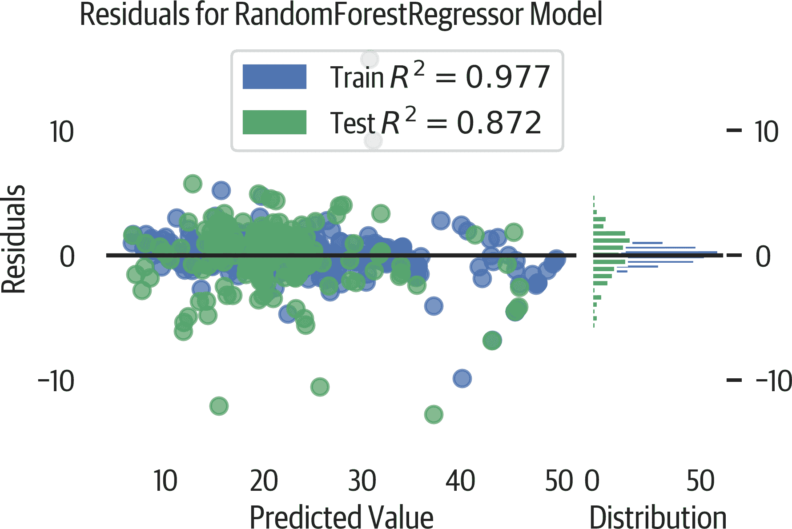
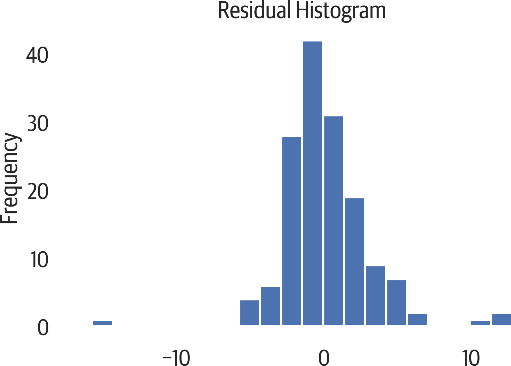
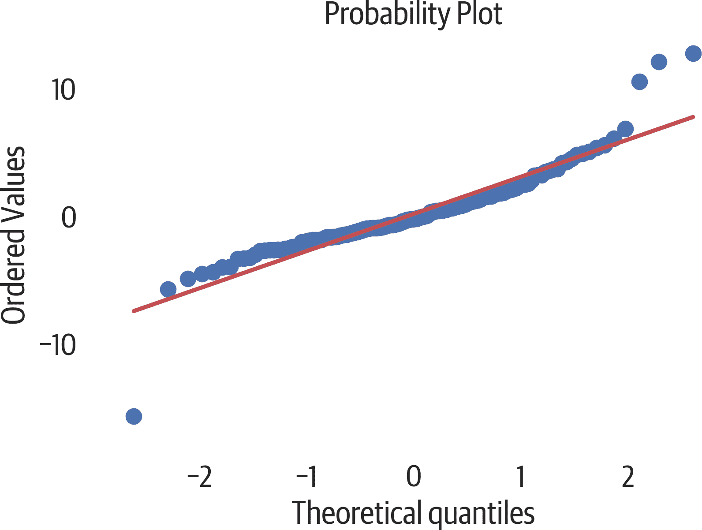
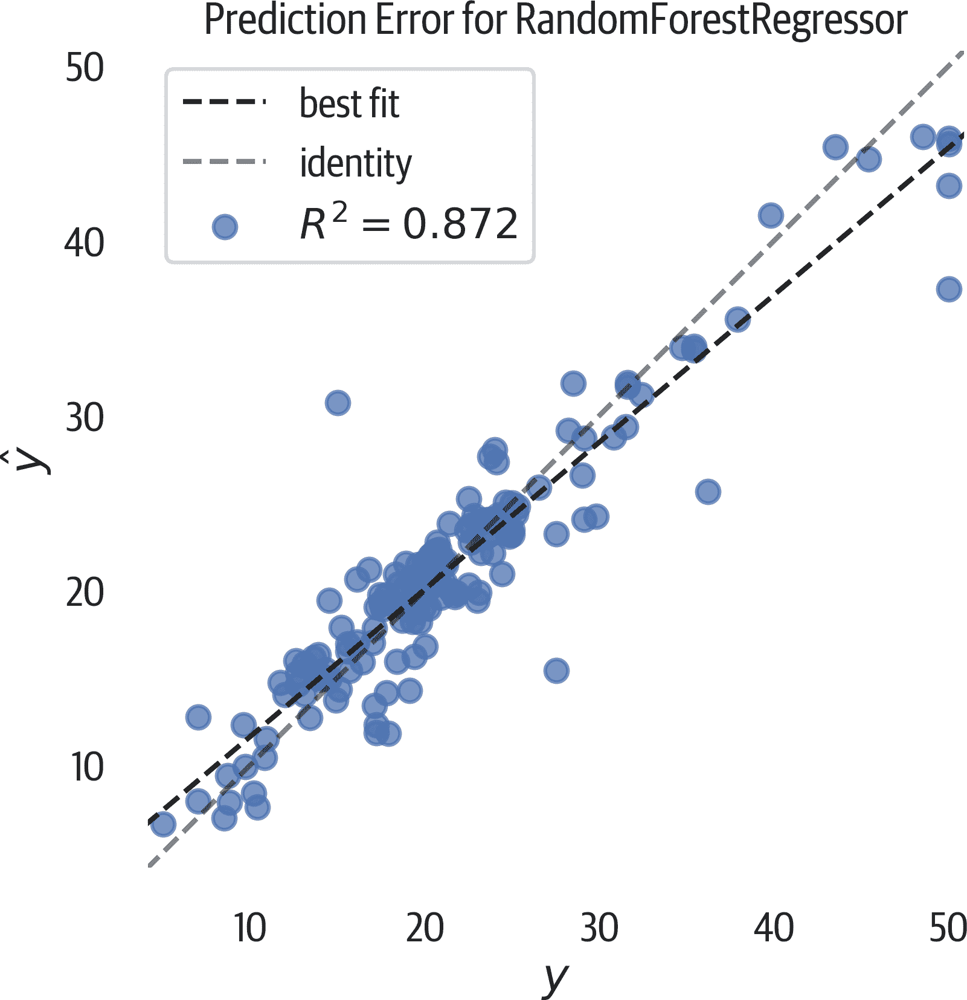

# 第十五章：指标与回归评估

本章将评估在波士顿房价数据上训练的随机森林回归器的结果：

```py
>>> rfr = RandomForestRegressor(
...     random_state=42, n_estimators=100
... )
>>> rfr.fit(bos_X_train, bos_y_train)
```

# 指标

`sklearn.metrics` 模块包含用于评估回归模型的指标。以 `loss` 或 `error` 结尾的指标函数应该最小化。以 `score` 结尾的函数应该最大化。

*决定系数*（r²）是常见的回归指标。该值通常介于 0 到 1 之间。它表示特征对目标变量贡献的方差百分比。较高的值更好，但通常单凭这个指标很难评估模型。0.7 是一个好分数吗？这取决于数据集。对于某个数据集，0.5 可能是一个好分数，而对于另一个数据集，0.9 可能是一个坏分数。通常我们会结合其他指标或可视化来评估模型。

例如，很容易使用 r² 预测第二天的股票价格模型达到 0.99，但我不会用这个模型交易我的钱。它可能略低或略高，这可能对交易造成严重影响。

r² 指标是网格搜索中使用的默认指标。您可以使用 `scoring` 参数指定其他指标。

`.score` 方法用于计算回归模型的这一指标：

```py
>>> from sklearn import metrics
>>> rfr.score(bos_X_test, bos_y_test)
0.8721182042634867

>>> metrics.r2_score(bos_y_test, bos_y_test_pred)
0.8721182042634867
```

###### 注意

还有一个 *解释方差* 指标（在网格搜索中为 `'explained_variance'`）。如果 *残差*（预测误差）的平均值为 0（在普通最小二乘（OLS）模型中），则解释的方差与决定系数相同：

```py
>>> metrics.explained_variance_score(
...     bos_y_test, bos_y_test_pred
... )
0.8724890451227875
```

*平均绝对误差*（在网格搜索中使用 `'neg_mean_absolute_error'`）表示平均绝对模型预测误差。一个完美的模型得分为 0，但与决定系数不同，该指标没有上限。然而，由于它以目标单位表示，因此更具可解释性。如果要忽略异常值，这是一个好指标。

这个度量不能表明模型有多糟糕，但可以用来比较两个模型。如果有两个模型，得分较低的模型更好。

这个数字告诉我们平均误差大约比真实值高或低两个单位：

```py
>>> metrics.mean_absolute_error(
...     bos_y_test, bos_y_test_pred
... )
2.0839802631578945
```

*均方根误差*（在网格搜索中为 `'neg_mean_squared_error'`）也是用目标的角度来衡量模型误差的。然而，因为它在取平方根之前先平均了误差的平方，所以会惩罚较大的误差。如果你想惩罚大误差，这是一个很好的指标。例如，偏差为八比偏差为四差两倍以上。

和平均绝对误差一样，这个度量不能表明模型有多糟糕，但可以用来比较两个模型。如果假设误差服从正态分布，这是一个不错的选择。

结果告诉我们，如果我们平方误差并求平均，结果大约是 9.5：

```py
>>> metrics.mean_squared_error(
...     bos_y_test, bos_y_test_pred
... )
9.52886846710526
```

*均方对数误差*（在网格搜索中为`'neg_mean_squared_log_error'`）对低估的惩罚大于高估。如果你的目标经历指数增长（如人口、股票等），这是一个很好的度量标准。

如果你取误差的对数然后平方，这些结果的平均值将是 0.021：

```py
>>> metrics.mean_squared_log_error(
...     bos_y_test, bos_y_test_pred
... )
0.02128263061776433
```

# 残差图

好的模型（具有适当的 R2 分数）将表现出*同方差性*。这意味着目标值的方差对于所有输入值都是相同的。在图中绘制，这看起来像残差图中随机分布的值。如果存在模式，则模型或数据存在问题。

残差图还显示了离群值，这可能会对模型拟合产生重大影响（见图 15-1）。

Yellowbrick 可以制作残差图来可视化这一点：

```py
>>> from yellowbrick.regressor import ResidualsPlot
>>> fig, ax = plt.subplots(figsize=(6, 4))
>>> rpv = ResidualsPlot(rfr)
>>> rpv.fit(bos_X_train, bos_y_train)
>>> rpv.score(bos_X_test, bos_y_test)
>>> rpv.poof()
>>> fig.savefig("images/mlpr_1501.png", dpi=300)
```



###### 图 15-1\. 残差图。进一步的测试将表明这些残差是异方差的。

# 异方差性

[statsmodel 库](https://oreil.ly/HtIi5)包括*Breusch-Pagan 测试*用于异方差性。这意味着残差的方差随预测值的变化而变化。在 Breusch-Pagan 测试中，如果 p 值显著小于 0.05，则拒绝同方差性的原假设。这表明残差是异方差的，预测存在偏差。

测试确认存在异方差性：

```py
>>> import statsmodels.stats.api as sms
>>> hb = sms.het_breuschpagan(resids, bos_X_test)
>>> labels = [
...     "Lagrange multiplier statistic",
...     "p-value",
...     "f-value",
...     "f p-value",
... ]
>>> for name, num in zip(name, hb):
...     print(f"{name}: {num:.2}")
Lagrange multiplier statistic: 3.6e+01
p-value: 0.00036
f-value: 3.3
f p-value: 0.00022
```

# 正态残差

scipy 库包括*概率图*和*Kolmogorov-Smirnov 测试*，两者都用于衡量残差是否符合正态分布。

我们可以绘制一个直方图（见图 15-2）来可视化残差并检查正态性：

```py
>>> fig, ax = plt.subplots(figsize=(6, 4))
>>> resids = bos_y_test - rfr.predict(bos_X_test)
>>> pd.Series(resids, name="residuals").plot.hist(
...     bins=20, ax=ax, title="Residual Histogram"
... )
>>> fig.savefig("images/mlpr_1502.png", dpi=300)
```



###### 图 15-2\. 残差的直方图。

图 15-3 显示了一个概率图。如果样本与分位数直线对齐，残差是正态的。我们可以看到这在本例中失败了：

```py
>>> from scipy import stats
>>> fig, ax = plt.subplots(figsize=(6, 4))
>>> _ = stats.probplot(resids, plot=ax)
>>> fig.savefig("images/mlpr_1503.png", dpi=300)
```



###### 图 15-3\. 残差的概率图。

Kolmogorov-Smirnov 检验可以评估分布是否为正态分布。如果 p 值显著小于 0.05，则这些值不是正态分布的。

这也失败了，这告诉我们残差不服从正态分布：

```py
>>> stats.kstest(resids, cdf="norm")
KstestResult(statistic=0.1962230021010155, pvalue=1.3283596864921421e-05)
```

# 预测误差图

预测误差图显示了真实目标与预测值之间的关系。对于一个完美的模型，这些点将在一个 45 度的直线上对齐。

由于我们的模型似乎对 y 的高端预测较低的值，因此模型存在一些性能问题。这也在残差图中明显（见图 15-4）。

这是 Yellowbrick 版本：

```py
>>> from yellowbrick.regressor import (
...     PredictionError,
... )
>>> fig, ax = plt.subplots(figsize=(6, 6))
>>> pev = PredictionError(rfr)
>>> pev.fit(bos_X_train, bos_y_train)
>>> pev.score(bos_X_test, bos_y_test)
>>> pev.poof()
>>> fig.savefig("images/mlpr_1504.png", dpi=300)
```



###### 图 15-4\. 预测误差。绘制了预测的 y（y-hat）与实际 y 的图形。
