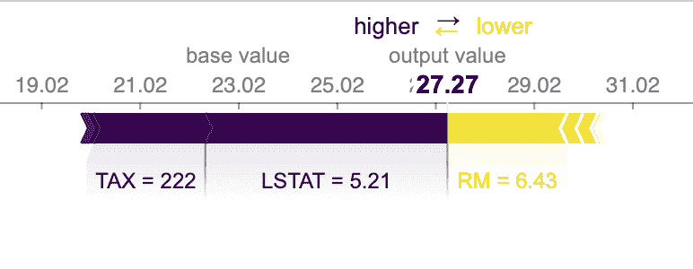
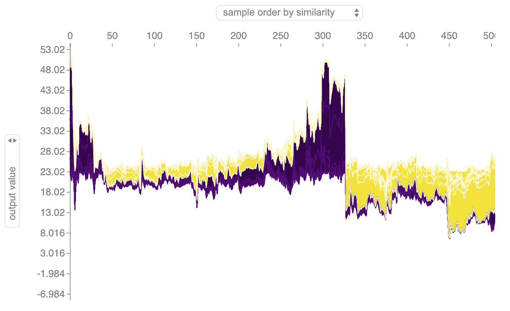
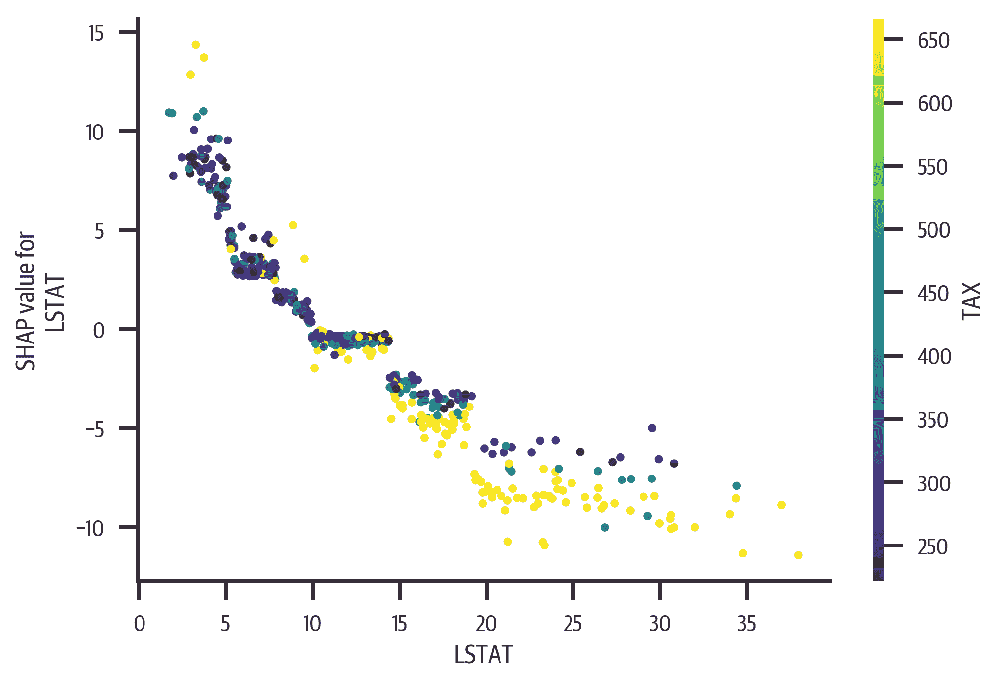
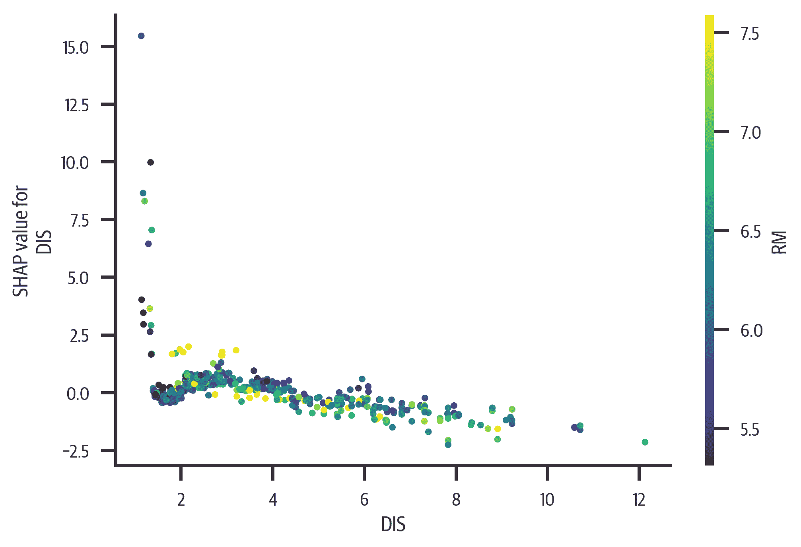
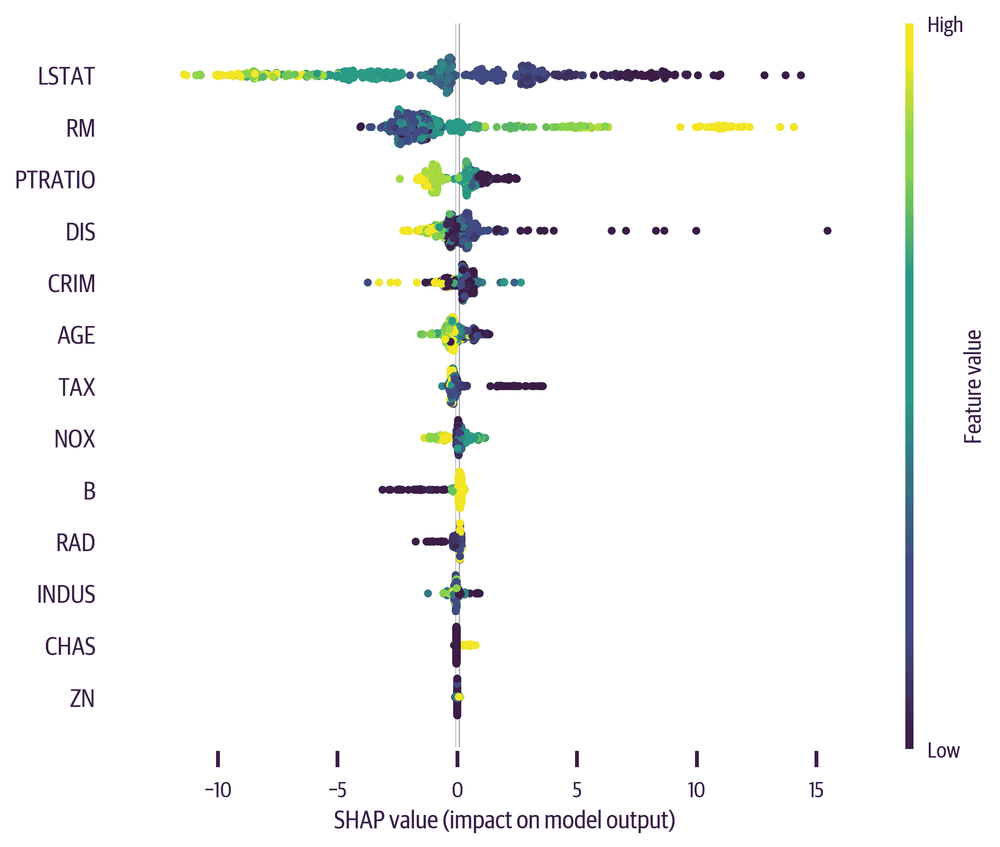

# 第十六章\. 解释回归模型

大多数用于解释分类模型的技术同样适用于回归模型。在本章中，我将展示如何使用 SHAP 库解释回归模型。

我们将解释波士顿房屋数据集的 XGBoost 模型：

```py
>>> import xgboost as xgb
>>> xgr = xgb.XGBRegressor(
...     random_state=42, base_score=0.5
... )
>>> xgr.fit(bos_X_train, bos_y_train)
```

# Shapley

我非常喜欢 Shapley 因为它对模型不可知。这个库还为我们提供了全局对模型的洞察，并帮助解释单个预测。如果你有一个黑盒模型，我发现它非常有用。

我们首先来看看索引 5 的预测。我们的模型预测值为 27.26：

```py
>>> sample_idx = 5
>>> xgr.predict(bos_X.iloc[[sample_idx]])
array([27.269186], dtype=float32)
```

要使用模型，我们必须从我们的模型创建一个`TreeExplainer`，并估算我们样本的 SHAP 值。如果我们想在 Jupyter 上使用交互界面，我们还需要调用`initjs`函数：

```py
>>> import shap
>>> shap.initjs()

>>> exp = shap.TreeExplainer(xgr)
>>> vals = exp.shap_values(bos_X)
```

有了解释器和 SHAP 值，我们可以创建一个力图来解释预测（见图 16-1）。这告诉我们基础预测值为 23，人口状态（LSTAT）和财产税率（TAX）将价格推高，而房间数（RM）将价格推低：

```py
>>> shap.force_plot(
...     exp.expected_value,
...     vals[sample_idx],
...     bos_X.iloc[sample_idx],
... )
```



###### 图 16-1\. 回归的力图。由于人口状态和税率，预期值从 23 增至 27。

我们也可以查看所有样本的力图，以获得整体行为的感觉。如果我们在 Jupyter 上使用交互式 JavaScript 模式，我们可以将鼠标悬停在样本上，查看影响结果的特征（见图 16-2）：

```py
>>> shap.force_plot(
...     exp.expected_value, vals, bos_X
... )
```



###### 图 16-2\. 所有样本的回归力图。

从样本的力图中，我们看到 LSTAT 特征有很大的影响。为了可视化 LSTAT 如何影响结果，我们可以创建一个依赖图。库将自动选择一个特征进行着色（您可以提供`interaction_index`参数来设置您自己的）。

从 LSTAT 的依赖图中（见图 16-3），我们可以看到随着 LSTAT 的增加（低社会地位人口的百分比），SHAP 值下降（推动目标向下）。非常低的 LSTAT 值会提升 SHAP。通过查看 TAX（财产税率）的颜色，我们可以看到随着税率的降低（更蓝色），SHAP 值上升：

```py
>>> fig, ax = plt.subplots(figsize=(6, 4))
>>> shap.dependence_plot("LSTAT", vals, bos_X)
>>> fig.savefig(
...     "images/mlpr_1603.png",
...     bbox_inches="tight",
...     dpi=300,
... )
```



###### 图 16-3\. LSTAT 的依赖图。随着 LSTAT 的增加，预测值下降。

这里是另一个依赖图，在图 16-4 中展示了 DIS（到就业中心的距离）。看起来这个特征的影响很小，除非它非常小：

```py
>>> fig, ax = plt.subplots(figsize=(6, 4))
>>> shap.dependence_plot(
...     "DIS", vals, bos_X, interaction_index="RM"
... )
>>> fig.savefig(
...     "images/mlpr_1604.png",
...     bbox_inches="tight",
...     dpi=300,
... )
```



###### 图 16-4\. DIS 的依赖图。除非 DIS 非常小，否则 SHAP 保持相对平稳。

最后，我们将使用总结图来查看特征的全局效果（见 Figure 16-5）。顶部的特征对模型影响最大。从这个视角可以看出，RM（房间数）的大值显著提升了目标值，而中等和较小值则略微降低了它：

```py
>>> fig, ax = plt.subplots(figsize=(6, 4))
>>> shap.summary_plot(vals, bos_X)
>>> fig.savefig(
...     "images/mlpr_1605.png",
...     bbox_inches="tight",
...     dpi=300,
... )
```



###### 图 16-5\. 总结图。最重要的特征位于顶部。

SHAP 库是您工具箱中的一个很好的工具。它帮助理解特征的全局影响，同时也有助于解释单个预测。
