# 第十七章。降维

有许多技术将特征分解为较小的子集。这对于探索性数据分析、可视化、制作预测模型或聚类很有用。

在本章中，我们将使用各种技术探索泰坦尼克号数据集。我们将查看 PCA、UMAP、t-SNE 和 PHATE。

这是数据：

```py
>>> ti_df = tweak_titanic(orig_df)
>>> std_cols = "pclass,age,sibsp,fare".split(",")
>>> X_train, X_test, y_train, y_test = get_train_test_X_y(
...     ti_df, "survived", std_cols=std_cols
... )
>>> X = pd.concat([X_train, X_test])
>>> y = pd.concat([y_train, y_test])
```

# 主成分分析（PCA）

主成分分析（PCA）接受一个行（样本）和列（特征）的矩阵（X）。PCA 返回一个新的矩阵，其列是原始列的线性组合。这些线性组合最大化方差。

每列与其他列正交（成直角）。列按方差递减的顺序排序。

Scikit-learn 有这个模型的实现。在运行算法之前最好标准化数据。调用`.fit`方法后，您将可以访问一个`.explained_variance_ratio_`属性，列出每列中方差的百分比。

PCA 对于在二维（或三维）中可视化数据很有用。它还用作预处理步骤，以过滤数据中的随机噪声。它适合于找到全局结构，但不适合找到局部结构，并且在处理线性数据时表现良好。

在这个例子中，我们将在泰坦尼克号特征上运行 PCA。PCA 类是 scikit-learn 中的一个*转换器*；您调用`.fit`方法来教它如何获取主成分，然后调用`.transform`将矩阵转换为主成分矩阵：

```py
>>> from sklearn.decomposition import PCA
>>> from sklearn.preprocessing import (
...     StandardScaler,
... )
>>> pca = PCA(random_state=42)
>>> X_pca = pca.fit_transform(
...     StandardScaler().fit_transform(X)
... )
>>> pca.explained_variance_ratio_
array([0.23917891, 0.21623078, 0.19265028,
 0.10460882, 0.08170342, 0.07229959,
 0.05133752, 0.04199068])

>>> pca.components_[0]
arrayarray([-0.63368693,  0.39682566,
 0.00614498,  0.11488415,  0.58075352,
 -0.19046812, -0.21190808, -0.09631388])
```

实例参数：

`n_components=None`

生成的组件数量。如果为`None`，则返回与列数相同的组件数量。可以是一个浮点数（0, 1），那么将创建所需数量的组件以获得该方差比例。

`copy=True`

如果为`True`，将在`.fit`时改变数据。

`whiten=False`

转换后的白化数据以确保无关联的组件。

`svd_solver='auto'`

如果`n_components`小于最小维度的 80％，则运行`'randomized'` SVD（更快但是近似）。否则运行`'full'`。

`tol=0.0`

对奇异值的容差。

`iterated_power='auto'`

`'randomized'` `svd_solver`的迭代次数。

`random_state=None`

`'randomized'` `svd_solver`的随机状态。

属性：

`components_`

主成分（原始特征的线性组合权重列）。

`explained_variance_`

每个组件的方差量。

`explained_variance_ratio_`

每个组件的方差量归一化（总和为 1）。

`singular_values_`

每个组件的奇异值。

`mean_`

每个特征的均值。

`n_components_`

当`n_components`是浮点数时，这是组件的大小。

`noise_variance_`

估计的噪声协方差。

绘制解释方差比例的累积和被称为*屏幕图*（见图 17-1）。它将显示组件中存储了多少信息。您可以使用*肘方法*来确定使用多少个组件：

```py
>>> fig, ax = plt.subplots(figsize=(6, 4))
>>> ax.plot(pca.explained_variance_ratio_)
>>> ax.set(
...     xlabel="Component",
...     ylabel="Percent of Explained variance",
...     title="Scree Plot",
...     ylim=(0, 1),
... )
>>> fig.savefig(
...     "images/mlpr_1701.png",
...     dpi=300,
...     bbox_inches="tight",
... )
```

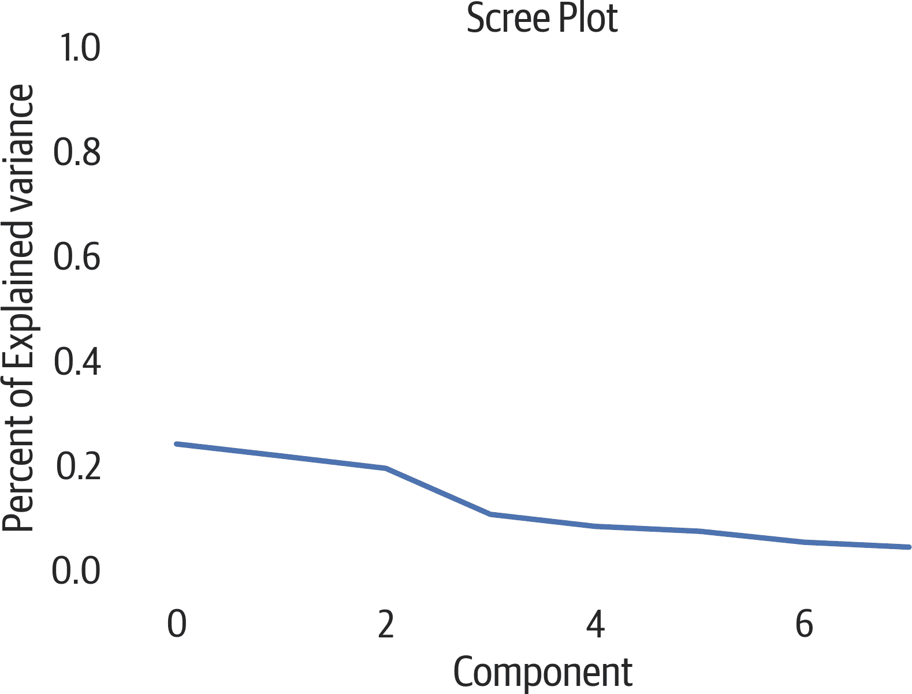

###### 图 17-1\. PCA 屏幕图。

查看数据的另一种方法是使用累计图（见图 17-2）。我们的原始数据有 8 列，但从图中看来，如果仅使用 4 个 PCA 成分，我们可以保留大约 90% 的方差：

```py
>>> fig, ax = plt.subplots(figsize=(6, 4))
>>> ax.plot(
...     np.cumsum(pca.explained_variance_ratio_)
... )
>>> ax.set(
...     xlabel="Component",
...     ylabel="Percent of Explained variance",
...     title="Cumulative Variance",
...     ylim=(0, 1),
... )
>>> fig.savefig("images/mlpr_1702.png", dpi=300)
```

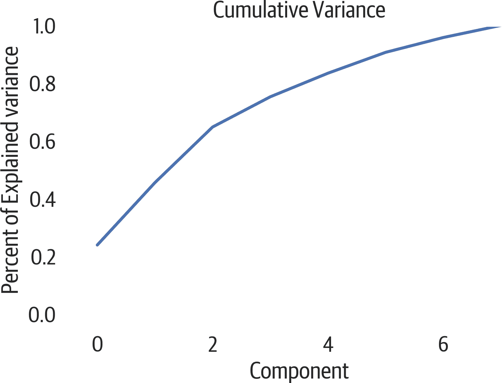

###### 图 17-2\. PCA 累计解释方差。

特征对成分的影响有多大？使用 matplotlib 的 `imshow` 函数将成分沿 x 轴和原始特征沿 y 轴绘制出来（见图 17-3）。颜色越深，原始列对成分的贡献越大。

看起来第一个成分受到 pclass、age 和 fare 列的影响很大。（使用光谱色图（`cmap`）强调非零值，并提供 `vmin` 和 `vmax` 为色条图例添加限制。）

```py
>>> fig, ax = plt.subplots(figsize=(6, 4))
>>> plt.imshow(
...     pca.components_.T,
...     cmap="Spectral",
...     vmin=-1,
...     vmax=1,
... )
>>> plt.yticks(range(len(X.columns)), X.columns)
>>> plt.xticks(range(8), range(1, 9))
>>> plt.xlabel("Principal Component")
>>> plt.ylabel("Contribution")
>>> plt.title(
...     "Contribution of Features to Components"
... )
>>> plt.colorbar()
>>> fig.savefig("images/mlpr_1703.png", dpi=300)
```

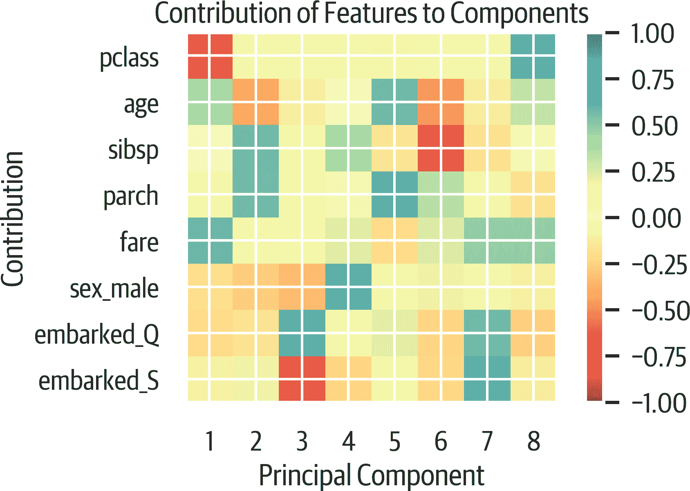

###### 图 17-3\. 主成分分析中的 PCA 特征。

另一种查看数据的方式是使用条形图（见图 17-4）。每个成分显示了来自原始数据的贡献：

```py
>>> fig, ax = plt.subplots(figsize=(8, 4))
>>> pd.DataFrame(
...     pca.components_, columns=X.columns
... ).plot(kind="bar", ax=ax).legend(
...     bbox_to_anchor=(1, 1)
... )
>>> fig.savefig("images/mlpr_1704.png", dpi=300)
```

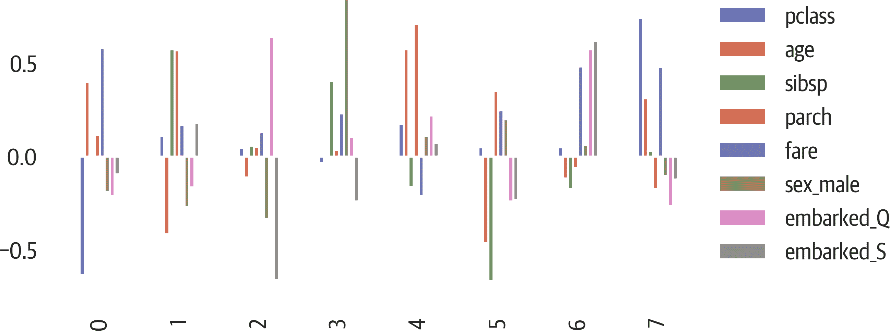

###### 图 17-4\. 主成分分析中的 PCA 特征。

如果我们有很多特征，可能希望通过仅显示满足最小权重要求的特征来限制上述图形。以下是找出前两个成分中具有至少 0.5 绝对值的所有特征的代码：

```py
>>> comps = pd.DataFrame(
...     pca.components_, columns=X.columns
... )
>>> min_val = 0.5
>>> num_components = 2
>>> pca_cols = set()
>>> for i in range(num_components):
...     parts = comps.iloc[i][
...         comps.iloc[i].abs() > min_val
...     ]
...     pca_cols.update(set(parts.index))
>>> pca_cols
{'fare', 'parch', 'pclass', 'sibsp'}
```

PCA 常用于以两个成分可视化高维数据集。在这里，我们在 2D 中可视化了 Titanic 的特征。它们根据生存状态进行了着色。有时可视化中可能会出现聚类。在这种情况下，似乎没有幸存者的聚类现象（见图 17-5）。

我们使用 Yellowbrick 生成此可视化：

```py
>>> from yellowbrick.features.pca import (
...     PCADecomposition,
... )
>>> fig, ax = plt.subplots(figsize=(6, 4))
>>> colors = ["rg"[j] for j in y]
>>> pca_viz = PCADecomposition(color=colors)
>>> pca_viz.fit_transform(X, y)
>>> pca_viz.poof()
>>> fig.savefig("images/mlpr_1705.png", dpi=300)
```

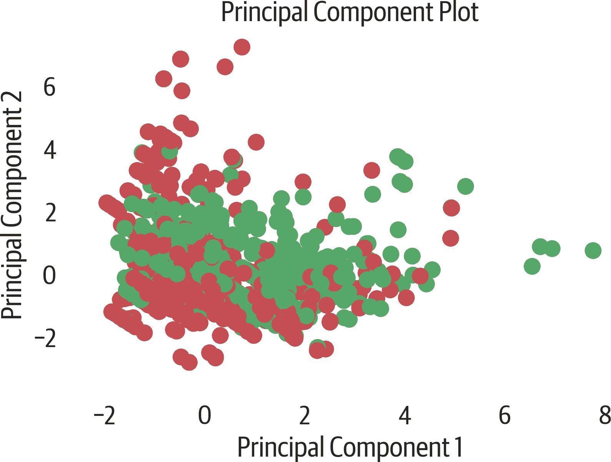

###### 图 17-5\. Yellowbrick PCA 绘图。

如果要根据一列着色散点图并添加图例（而不是色条图），则需要在 pandas 或 matplotlib 中循环每个颜色并单独绘制该组（或使用 seaborn）。下面我们还将纵横比设置为我们查看的成分解释方差的比率（见图 17-6）。因为第二个成分仅具有第一个成分的 90%，所以它会稍微短一些。

这是 seaborn 版本：

```py
>>> fig, ax = plt.subplots(figsize=(6, 4))
>>> pca_df = pd.DataFrame(
...     X_pca,
...     columns=[
...         f"PC{i+1}"
...         for i in range(X_pca.shape[1])
...     ],
... )
>>> pca_df["status"] = [
...     ("deceased", "survived")[i] for i in y
... ]
>>> evr = pca.explained_variance_ratio_
>>> ax.set_aspect(evr[1] / evr[0])
>>> sns.scatterplot(
...     x="PC1",
...     y="PC2",
...     hue="status",
...     data=pca_df,
...     alpha=0.5,
...     ax=ax,
... )
>>> fig.savefig(
...     "images/mlpr_1706.png",
...     dpi=300,
...     bbox_inches="tight",
... )
```

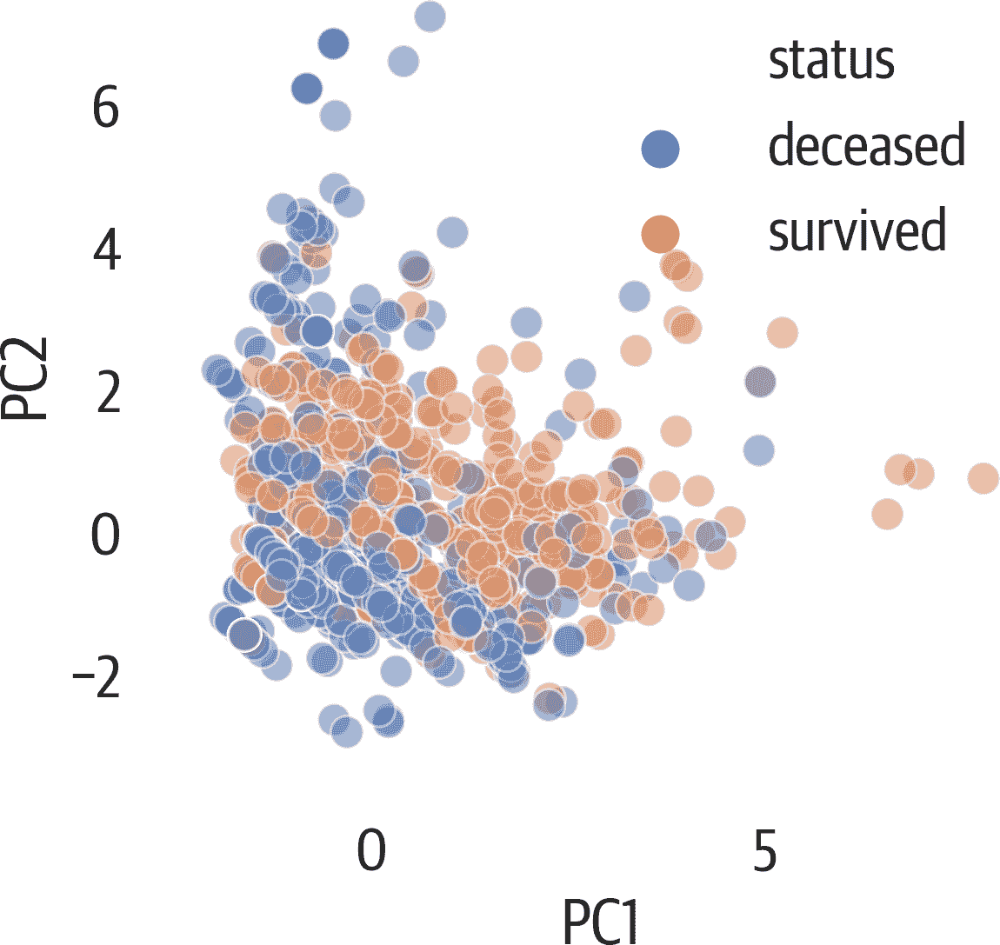

###### 图 17-6\. 带有图例和相对纵横比的 Seaborn PCA。

下面，我们通过在散点图上显示一个*载荷图*来增强可视化效果。这种图被称为双标图，因为它包含散点图和载荷（见图 17-7）。载荷显示特征的强度和它们的相关性。如果它们的角度接近，则它们可能相关。如果角度为 90 度，则它们可能不相关。最后，如果它们之间的角度接近 180 度，则它们具有负相关性：

```py
>>> fig, ax = plt.subplots(figsize=(6, 4))
>>> pca_df = pd.DataFrame(
...     X_pca,
...     columns=[
...         f"PC{i+1}"
...         for i in range(X_pca.shape[1])
...     ],
... )
>>> pca_df["status"] = [
...     ("deceased", "survived")[i] for i in y
... ]
>>> evr = pca.explained_variance_ratio_
>>> x_idx = 0  # x_pc
>>> y_idx = 1  # y_pc
>>> ax.set_aspect(evr[y_idx] / evr[x_idx])
>>> x_col = pca_df.columns[x_idx]
>>> y_col = pca_df.columns[y_idx]
>>> sns.scatterplot(
...     x=x_col,
...     y=y_col,
...     hue="status",
...     data=pca_df,
...     alpha=0.5,
...     ax=ax,
... )
>>> scale = 8
>>> comps = pd.DataFrame(
...     pca.components_, columns=X.columns
... )
>>> for idx, s in comps.T.iterrows():
...     plt.arrow(
...         0,
...         0,
...         s[x_idx] * scale,
...         s[y_idx] * scale,
...         color="k",
...     )
...     plt.text(
...         s[x_idx] * scale,
...         s[y_idx] * scale,
...         idx,
...         weight="bold",
...     )
>>> fig.savefig(
...     "images/mlpr_1707.png",
...     dpi=300,
...     bbox_inches="tight",
... )
```

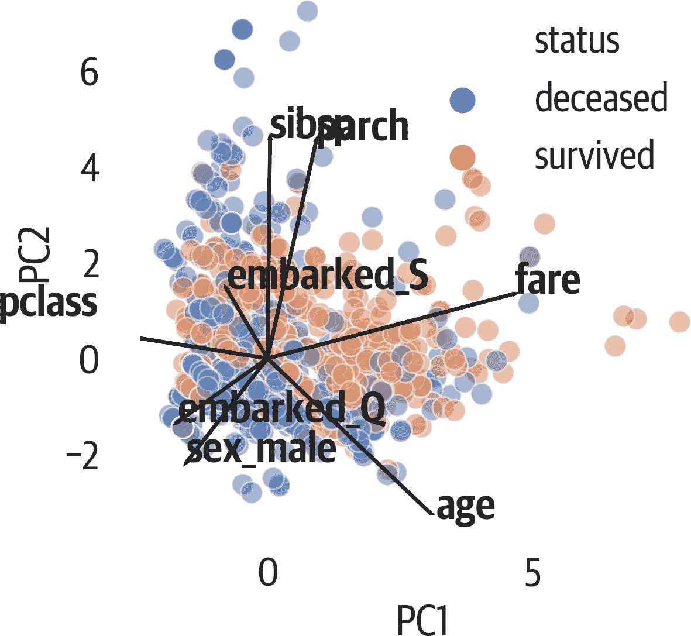

###### 图 17-7\. Seaborn 双图绘图和加载图。

根据先前的树模型，我们知道年龄、票价和性别对乘客是否生存很重要。第一个主成分受 pclass、年龄和票价的影响，而第四个主成分受性别的影响。让我们将这些组件相互绘制。

同样，这个图是根据组件方差比例调整了绘图的纵横比（见图 17-8）。

此图似乎更准确地区分了幸存者：

```py
>>> fig, ax = plt.subplots(figsize=(6, 4))
>>> pca_df = pd.DataFrame(
...     X_pca,
...     columns=[
...         f"PC{i+1}"
...         for i in range(X_pca.shape[1])
...     ],
... )
>>> pca_df["status"] = [
...     ("deceased", "survived")[i] for i in y
... ]
>>> evr = pca.explained_variance_ratio_
>>> ax.set_aspect(evr[3] / evr[0])
>>> sns.scatterplot(
...     x="PC1",
...     y="PC4",
...     hue="status",
...     data=pca_df,
...     alpha=0.5,
...     ax=ax,
... )
>>> fig.savefig(
...     "images/mlpr_1708.png",
...     dpi=300,
...     bbox_inches="tight",
... )
```

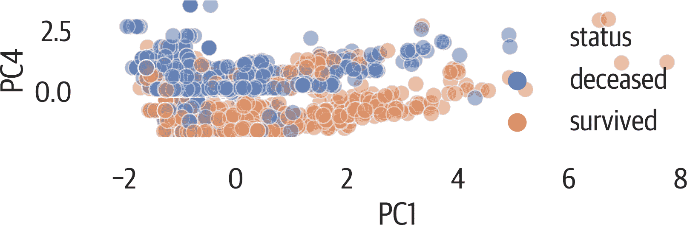

###### 图 17-8\. PCA 组件 1 与 4 的图示。

Matplotlib 可以创建漂亮的图表，但在交互图上不太实用。在执行 PCA 时，查看散点图通常很有用。我已经包含了一个使用 [Bokeh 库](https://bokeh.pydata.org) 的函数，用于与散点图进行交互（见图 17-9）。它在 Jupyter 中运行良好：

```py
>>> from bokeh.io import output_notebook
>>> from bokeh import models, palettes, transform
>>> from bokeh.plotting import figure, show
>>>
>>> def bokeh_scatter(
...     x,
...     y,
...     data,
...     hue=None,
...     label_cols=None,
...     size=None,
...     legend=None,
...     alpha=0.5,
... ):
...     """
...     x - x column name to plot
...     y - y column name to plot
...     data - pandas DataFrame
...     hue - column name to color by (numeric)
...     legend - column name to label by
...     label_cols - columns to use in tooltip
...                  (None all in DataFrame)
...     size - size of points in screen space unigs
...     alpha - transparency
...     """
...     output_notebook()
...     circle_kwargs = {}
...     if legend:
...         circle_kwargs["legend"] = legend
...     if size:
...         circle_kwargs["size"] = size
...     if hue:
...         color_seq = data[hue]
...         mapper = models.LinearColorMapper(
...             palette=palettes.viridis(256),
...             low=min(color_seq),
...             high=max(color_seq),
...         )
...         circle_kwargs[
...             "fill_color"
...         ] = transform.transform(hue, mapper)
...     ds = models.ColumnDataSource(data)
...     if label_cols is None:
...         label_cols = data.columns
...     tool_tips = sorted(
...         [
...             (x, "@{}".format(x))
...             for x in label_cols
...         ],
...         key=lambda tup: tup[0],
...     )
...     hover = models.HoverTool(
...         tooltips=tool_tips
...     )
...     fig = figure(
...         tools=[
...             hover,
...             "pan",
...             "zoom_in",
...             "zoom_out",
...             "reset",
...         ],
...         toolbar_location="below",
...     )
...
...     fig.circle(
...         x,
...         y,
...         source=ds,
...         alpha=alpha,
...         **circle_kwargs
...     )
...     show(fig)
...     return fig
>>> res = bokeh_scatter(
...     "PC1",
...     "PC2",
...     data=pca_df.assign(
...         surv=y.reset_index(drop=True)
...     ),
...     hue="surv",
...     size=10,
...     legend="surv",
... )
```

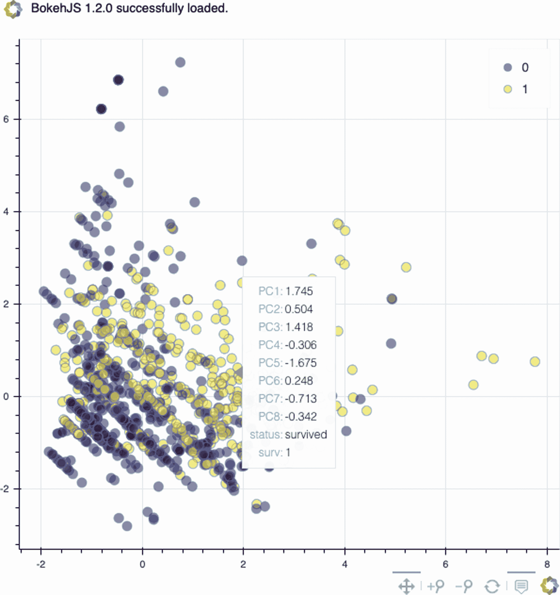

###### 图 17-9\. 带有工具提示的 Bokeh 散点图。

Yellowbrick 也可以在三维中绘图（见图 17-10）：

```py
>>> from yellowbrick.features.pca import (
...     PCADecomposition,
... )
>>> colors = ["rg"[j] for j in y]
>>> pca3_viz = PCADecomposition(
...     proj_dim=3, color=colors
... )
>>> pca3_viz.fit_transform(X, y)
>>> pca3_viz.finalize()
>>> fig = plt.gcf()
>>> plt.tight_layout()
>>> fig.savefig(
...     "images/mlpr_1710.png",
...     dpi=300,
...     bbox_inches="tight",
... )
```

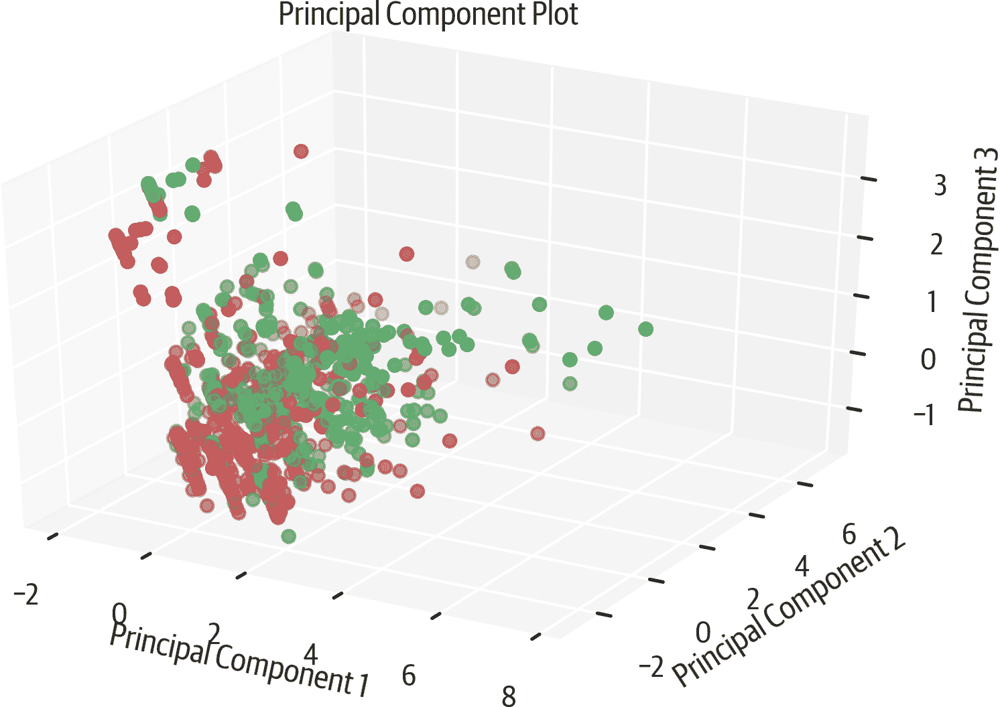

###### 图 17-10\. Yellowbrick 3D PCA。

[scprep 库](https://oreil.ly/Jdq1s)（这是 PHATE 库的依赖项，我们稍后会讨论）具有一个有用的绘图函数。`rotate_scatter3d` 函数可以生成一个在 Jupyter 中动画显示的图形（见图 17-11）。这使得理解 3D 图形变得更容易。

您可以使用此库可视化任何 3D 数据，而不仅限于 PHATE：

```py
>>> import scprep
>>> scprep.plot.rotate_scatter3d(
...     X_pca[:, :3],
...     c=y,
...     cmap="Spectral",
...     figsize=(8, 6),
...     label_prefix="Principal Component",
... )
```

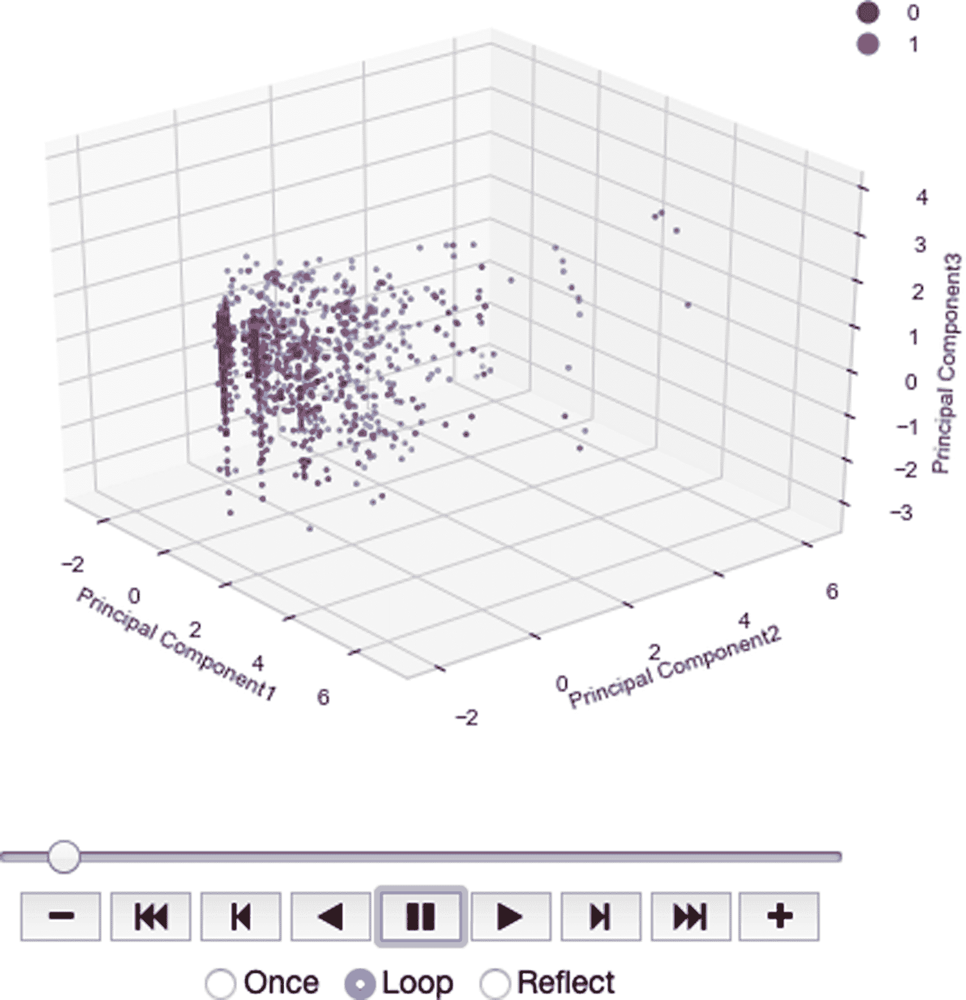

###### 图 17-11\. scprep 3D PCA 动画。

如果您在 Jupyter 中将 matplotlib 的单元格魔术模式更改为 `notebook`，您可以从 matplotlib 获取交互式 3D 绘图（见图 17-12）。

```py
>>> from mpl_toolkits.mplot3d import Axes3D
>>> fig = plt.figure(figsize=(6, 4))
>>> ax = fig.add_subplot(111, projection="3d")
>>> ax.scatter(
...     xs=X_pca[:, 0],
...     ys=X_pca[:, 1],
...     zs=X_pca[:, 2],
...     c=y,
...     cmap="viridis",
... )
>>> ax.set_xlabel("PC 1")
>>> ax.set_ylabel("PC 2")
>>> ax.set_zlabel("PC 3")
```

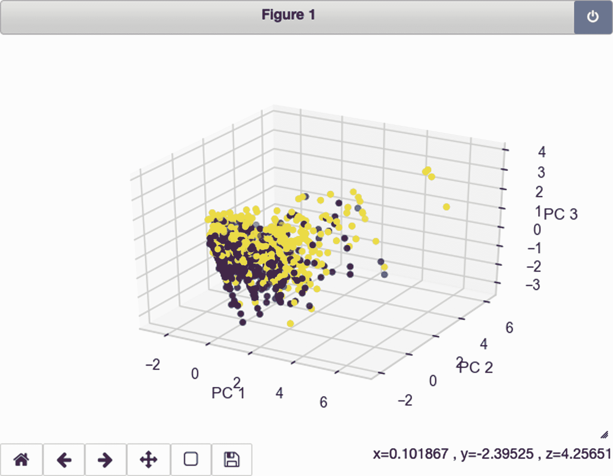

###### 图 17-12\. Matplotlib 在笔记本模式下的交互式 3D PCA。

###### 警告

请注意，从：

```py
% matplotlib inline
```

转到：

```py
% matplotlib notebook
```

有时可能会导致 Jupyter 停止响应。请谨慎使用。

# UMAP

统一流形逼近和投影 [(UMAP)](https://oreil.ly/qF8RJ) 是一种使用流形学习的降维技术。因此，它倾向于将相似的项目在拓扑上保持在一起。它试图同时保留全局和局部结构，与偏好局部结构的 t-SNE 相反（详见“t-SNE”）。

Python 实现不支持多核。

特征归一化是将值放在相同尺度上的一个好主意。

UMAP 对超参数（`n_neighbors`、`min_dist`、`n_components` 或 `metric`）非常敏感。以下是一些示例：

```py
>>> import umap
>>> u = umap.UMAP(random_state=42)
>>> X_umap = u.fit_transform(
...     StandardScaler().fit_transform(X)
... )
>>> X_umap.shape
(1309, 2)
```

实例参数：

`n_neighbors=15`

本地邻域大小。较大意味着使用全局视图，较小意味着更局部。

`n_components=2`

嵌入的维度数。

`metric='euclidean'`

用于距离的度量。可以是一个接受两个 1D 数组并返回浮点数的函数。

`n_epochs=None`

训练时期的数量。默认为 200 或 500（取决于数据大小）。

`learning_rate=1.0`

嵌入优化的学习率。

`init='spectral'`

初始化类型。谱嵌入是默认值。可以是`'random'`或 numpy 数组的位置。

`min_dist=0.1`

0 到 1 之间。嵌入点之间的最小距离。较小意味着更多聚集，较大意味着分散。

`spread=1.0`

确定嵌入点的距离。

`set_op_mix_ratio=1.0`

0 到 1 之间：模糊联合（1）或模糊交集（0）。

`local_connectivity=1.0`

本地连接的邻居数。增加此值会创建更多的局部连接。

`repulsion_strength=1.0`

排斥强度。较高的值给负样本更多权重。

`negative_sample_rate=5`

负样本每个正样本。更高的值具有更多的排斥力，更多的优化成本和更好的准确性。

`transform_queue_size=4.0`

用于最近邻搜索的侵略性。较高的值是较低的性能但更好的准确性。

`a=None`

参数来控制嵌入。如果等于`None`，UMAP 则从`min_dist`和`spread`中确定这些值。

`b=None`

参数来控制嵌入。如果等于`None`，UMAP 则从`min_dist`和`spread`中确定这些值。

`random_state=None`

随机种子。

`metric_kwds=None`

如果函数用于`metric`，则用于额外参数的指标字典。也可以使用`minkowski`（和其他指标）来参数化。

`angular_rp_forest=False`

使用角度随机投影。

`target_n_neighbors=-1`

简易设置的邻居数。

`target_metric='categorical'`

用于使用监督降维。也可以是`'L1'`或`'L2'`。还支持一个接受`X`中两个数组作为输入并返回它们之间距离值的函数。

`target_metric_kwds=None`

如果`target_metric`的函数被使用，使用的指标字典。

`target_weight=0.5`

权重因子。介于 0.0 和 1.0 之间，其中 0 表示仅基于数据，而 1 表示仅基于目标。

`transform_seed=42`

变换操作的随机种子。

`verbose=False`

冗余性。

属性：

`embedding_`

嵌入结果

让我们可视化泰坦尼克号数据集上 UMAP 的默认结果（参见图 17-13）：

```py
>>> fig, ax = plt.subplots(figsize=(8, 4))
>>> pd.DataFrame(X_umap).plot(
...     kind="scatter",
...     x=0,
...     y=1,
...     ax=ax,
...     c=y,
...     alpha=0.2,
...     cmap="Spectral",
... )
>>> fig.savefig("images/mlpr_1713.png", dpi=300)
```

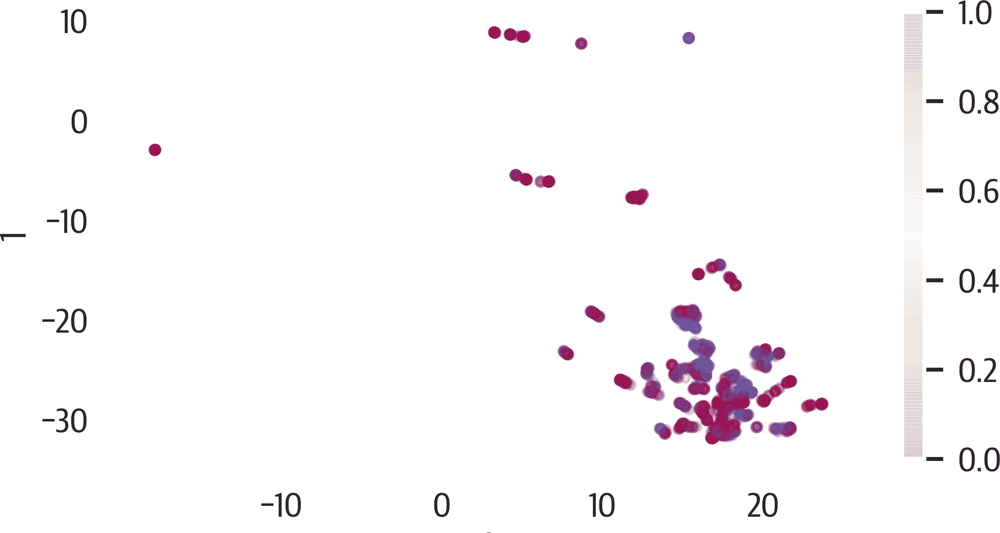

###### 图 17-13. UMAP 结果。

要调整 UMAP 结果，首先关注`n_neighbors`和`min_dist`超参数。以下是更改这些值的示例（见图 17-14 和 17-15）：

```py
>>> X_std = StandardScaler().fit_transform(X)
>>> fig, axes = plt.subplots(2, 2, figsize=(6, 4))
>>> axes = axes.reshape(4)
>>> for i, n in enumerate([2, 5, 10, 50]):
...     ax = axes[i]
...     u = umap.UMAP(
...         random_state=42, n_neighbors=n
...     )
...     X_umap = u.fit_transform(X_std)
...
...     pd.DataFrame(X_umap).plot(
...         kind="scatter",
...         x=0,
...         y=1,
...         ax=ax,
...         c=y,
...         cmap="Spectral",
...         alpha=0.5,
...     )
...     ax.set_title(f"nn={n}")
>>> plt.tight_layout()
>>> fig.savefig("images/mlpr_1714.png", dpi=300)
```


###### 图 17-14. 调整 UMAP 结果`n_neighbors`。

```py
>>> fig, axes = plt.subplots(2, 2, figsize=(6, 4))
>>> axes = axes.reshape(4)
>>> for i, n in enumerate([0, 0.33, 0.66, 0.99]):
...     ax = axes[i]
...     u = umap.UMAP(random_state=42, min_dist=n)
...     X_umap = u.fit_transform(X_std)
...     pd.DataFrame(X_umap).plot(
...         kind="scatter",
...         x=0,
...         y=1,
...         ax=ax,
...         c=y,
...         cmap="Spectral",
...         alpha=0.5,
...     )
...     ax.set_title(f"min_dist={n}")
>>> plt.tight_layout()
>>> fig.savefig("images/mlpr_1715.png", dpi=300)
```


###### 图 17-15. 调整 UMAP 结果`min_dist`。

有时在 UMAP 之前执行 PCA 以减少维数并加快计算速度。

# t-SNE

t-分布随机邻域嵌入（t-SNE）技术是一种可视化和降维技术。它使用输入的分布和低维嵌入，并最小化它们之间的联合概率。由于计算量大，可能无法在大数据集上使用这种技术。

t-SNE 的一个特征是对超参数非常敏感。此外，虽然它能够很好地保留局部聚类，但全局信息并未保留。最后，这不是一个确定性算法，可能不会收敛。

在使用此技术之前标准化数据是一个好主意：

```py
>>> from sklearn.manifold import TSNE
>>> X_std = StandardScaler().fit_transform(X)
>>> ts = TSNE()
>>> X_tsne = ts.fit_transform(X_std)
```

实例参数：

`n_components=2`

嵌入的维度数。

`perplexity=30.0`

建议的取值范围为 5 到 50。较小的数值倾向于形成更紧密的聚类。

`early_exaggeration=12.0`

控制簇紧密度和它们之间的间距。较大的值意味着较大的间距。

`learning_rate=200.0`

通常在 10 到 1000 之间。如果数据看起来像一个球，则降低它。如果数据看起来压缩，则增加它。

`n_iter=1000`

迭代次数。

`n_iter_without_progress=300`

如果在这些迭代次数之后没有进展，则中止。

`min_grad_norm=1e-07`

如果梯度范数低于此值，则优化停止。

`metric='euclidean'`

来自`scipy.spatial.distance.pdist`、`pairwise.PAIRWISE_DISTANCE_METRIC`或函数的距离度量。

`init='random'`

嵌入初始化。

`verbose=0`

冗长性。

`random_state=None`

随机种子。

`method='barnes_hut'`

梯度计算算法。

`angle=0.5`

用于梯度计算。小于 0.2 会增加运行时间。大于 0.8 会增加错误。

属性：

`embedding_`

嵌入向量。

`kl_divergence_`

Kullback-Leibler 散度。

`n_iter_`

迭代次数。

这里展示了使用 matplotlib 进行 t-SNE 结果的可视化（见图 17-16）：

```py
>>> fig, ax = plt.subplots(figsize=(6, 4))
>>> colors = ["rg"[j] for j in y]
>>> scat = ax.scatter(
...     X_tsne[:, 0],
...     X_tsne[:, 1],
...     c=colors,
...     alpha=0.5,
... )
>>> ax.set_xlabel("Embedding 1")
>>> ax.set_ylabel("Embedding 2")
>>> fig.savefig("images/mlpr_1716.png", dpi=300)
```

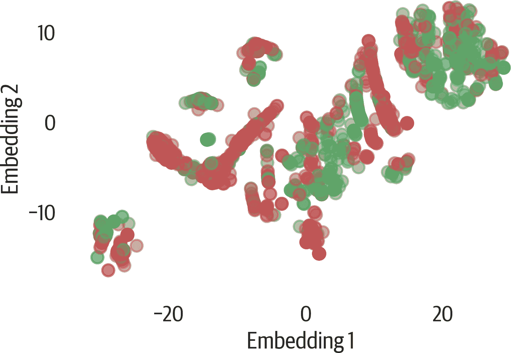

###### 图 17-16。使用 matplotlib 进行 t-SNE 结果。

改变`perplexity`的值可能会对绘图产生重大影响（见图 17-17）。

```py
>>> fig, axes = plt.subplots(2, 2, figsize=(6, 4))
>>> axes = axes.reshape(4)
>>> for i, n in enumerate((2, 30, 50, 100)):
...     ax = axes[i]
...     t = TSNE(random_state=42, perplexity=n)
...     X_tsne = t.fit_transform(X)
...     pd.DataFrame(X_tsne).plot(
...         kind="scatter",
...         x=0,
...         y=1,
...         ax=ax,
...         c=y,
...         cmap="Spectral",
...         alpha=0.5,
...     )
...     ax.set_title(f"perplexity={n}")
... plt.tight_layout()
... fig.savefig("images/mlpr_1717.png", dpi=300)
```


###### 图 17-17。改变`t-SNE`的`perplexity`。

# PHATE

通过 Affinity-based Trajectory Embedding（PHATE）进行热扩散的潜力是高维数据可视化的工具。它倾向于同时保留全局结构（如 PCA）和局部结构（如 t-SNE）。

PHATE 首先编码局部信息（接近的点应该保持接近）。它使用“扩散”来发现全局数据，然后减少维度：

```py
>>> import phate
>>> p = phate.PHATE(random_state=42)
>>> X_phate = p.fit_transform(X)
>>> X_phate.shape
```

实例参数：

`n_components=2`

维度数。

`knn=5`

核的邻居数。如果嵌入是断开的或数据集大于 10 万个样本，则增加。

`decay=40`

核的衰减率。降低此值会增加图的连通性。

`n_landmark=2000`

用于标记的地标点。

`t='auto'`

扩散力度。对数据进行平滑处理。如果嵌入缺乏结构，请增加；如果结构紧密而紧凑，请减少。

`gamma=1`

对数潜力（在 -1 到 1 之间）。如果嵌入集中在单个点周围，请尝试将其设置为 0。

`n_pca=100`

用于邻域计算的主成分数。

`knn_dist='euclidean'`

KNN 距离度量。

`mds_dist='euclidean'`

多维缩放（MDS）度量。

`mds='metric'`

MDS 算法用于降维。

`n_jobs=1`

要使用的 CPU 数量。

`random_state=None`

随机种子。

`verbose=1`

冗余性。

属性（请注意这些后面没有 `_`）：

`X`

输入数据

`embedding`

嵌入空间

`diff_op`

扩散算子

`graph`

基于输入构建的 KNN 图

这是使用 PHATE 的一个示例（见 Figure 17-18）：

```py
>>> fig, ax = plt.subplots(figsize=(6, 4))
>>> phate.plot.scatter2d(p, c=y, ax=ax, alpha=0.5)
>>> fig.savefig("images/mlpr_1718.png", dpi=300)
```

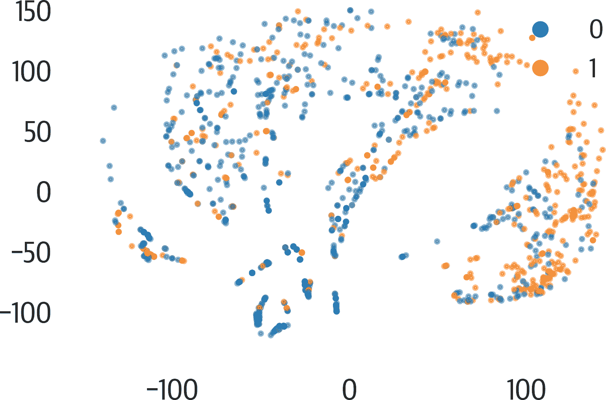

###### 图 17-18\. PHATE 结果。

如上所述的实例参数中，有一些参数可以调整以改变模型的行为。以下是调整 `knn` 参数的示例（见 Figure 17-19）。请注意，如果使用 `.set_params` 方法，它将加快计算速度，因为它使用预计算的图和扩散算子：

```py
>>> fig, axes = plt.subplots(2, 2, figsize=(6, 4))
>>> axes = axes.reshape(4)
>>> p = phate.PHATE(random_state=42, n_jobs=-1)

>>> for i, n in enumerate((2, 5, 20, 100)):
...     ax = axes[i]
...     p.set_params(knn=n)
...     X_phate = p.fit_transform(X)
...     pd.DataFrame(X_phate).plot(
...         kind="scatter",
...         x=0,
...         y=1,
...         ax=ax,
...         c=y,
...         cmap="Spectral",
...         alpha=0.5,
...     )
...     ax.set_title(f"knn={n}")
... plt.tight_layout()
... fig.savefig("images/mlpr_1719.png", dpi=300)
```


###### 图 17-19\. 更改 PHATE 的 `knn` 参数。
