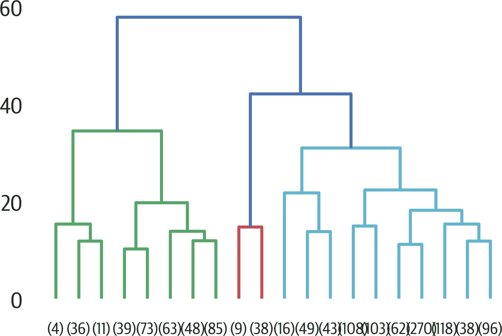
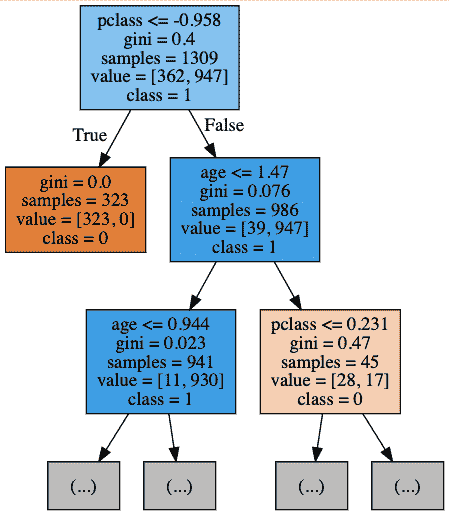

# 第十八章 聚类

聚类是一种无监督机器学习技术，用于将群体分成几个组。它是无监督的，因为我们没有给模型任何标签；它只是检查特征并确定哪些样本相似并属于一个簇。在本章中，我们将研究 K 均值和层次聚类方法。我们还将再次使用各种技术探索泰坦尼克号数据集。

# K 均值

K 均值算法需要用户选择簇的数量或“k”。然后它随机选择 k 个质心，并根据从质心到每个样本的距离度量将每个样本分配给一个簇。分配完成后，它根据分配给一个标签的每个样本的中心重新计算质心。然后它根据新的质心再次将样本分配到簇中。经过几次迭代后，它应该会收敛。

因为聚类使用距离度量来确定哪些样本相似，所以行为可能会根据数据的规模而变化。您可以标准化数据并使所有特征处于相同的比例。有些人建议，如果规模提示某些特征更重要，SME 可能会建议不要标准化。我们将在这个例子中对数据进行标准化。

在这个例子中，我们将对泰坦尼克号乘客进行聚类。我们将从两个簇开始，看看聚类是否能够分开生存（我们不会将生存数据泄漏到聚类中，只使用`X`，而不是`y`）。

无监督算法具有`.fit`方法和`.predict`方法。我们只将`X`传递给`.fit`：

```py
>>> from sklearn.cluster import KMeans
>>> X_std = preprocessing.StandardScaler().fit_transform(
...     X
... )
>>> km = KMeans(2, random_state=42)
>>> km.fit(X_std)
KMeans(algorithm='auto', copy_x=True,
 init='k-means', max_iter=300,
 n_clusters=2, n_init=10, n_jobs=1,
 precompute_distances='auto',
 random_state=42, tol=0.0001, verbose=0)
```

在模型训练后，我们可以调用`.predict`方法将新样本分配给一个簇：

```py
>>> X_km = km.predict(X)
>>> X_km
array([1, 1, 1, ..., 1, 1, 1], dtype=int32)
```

实例参数：

`n_clusters=8`

创建的簇的数量。

`init='kmeans++'`

初始化方法。

`n_init=10`

使用不同质心运行算法的次数。最佳得分将获胜。

`max_iter=300`

运行的迭代次数。

`tol=0.0001`

收敛的公差。

`precompute_distances='auto'`

预计算距离（需要更多内存但更快）。如果`n_samples` * `n_clusters`小于或等于 1200 万，`auto`将预先计算。

`verbose=0`

冗余性。

`random_state=None`

随机种子。

`copy_x=True`

在计算之前复制数据。

`n_jobs=1`

要使用的 CPU 数量。

`algorithm='auto'`

K 均值算法。`'full'`适用于稀疏数据，但`'elkan'`更高效。`'auto'`在密集数据中使用`'elkan'`。

属性：

`cluster_centers_`

中心的坐标

`labels_`

样本的标签

`inertia_`

到聚类质心的平方距离之和

`n_iter_`

迭代次数

如果事先不知道需要多少个簇，可以以一系列大小运行算法并评估各种指标。这可能有些棘手。

您可以使用 `.inertia_` 计算自己的肘部图。寻找曲线弯曲的位置，因为那可能是选择聚类数量的一个良好选择。在这种情况下，曲线很平滑，但在八个之后似乎没有太多改善（见 Figure 18-1）。

对于没有肘部的图，我们有几个选择。我们可以使用其他指标，其中一些如下所示。我们还可以检查聚类的可视化，看看聚类是否可见。我们可以向数据添加特征，看看是否有帮助进行聚类。

这里是肘部图的代码：

```py
>>> inertias = []
>>> sizes = range(2, 12)
>>> for k in sizes:
...     k2 = KMeans(random_state=42, n_clusters=k)
...     k2.fit(X)
...     inertias.append(k2.inertia_)
>>> fig, ax = plt.subplots(figsize=(6, 4))
>>> pd.Series(inertias, index=sizes).plot(ax=ax)
>>> ax.set_xlabel("K")
>>> ax.set_ylabel("Inertia")
>>> fig.savefig("images/mlpr_1801.png", dpi=300)
```


###### 图 18-1\. 看起来相当平滑的肘部图。

当地面真实标签未知时，Scikit-learn 具有其他聚类指标。我们也可以计算并绘制这些指标。*轮廓系数* 是介于 -1 和 1 之间的值。得分越高越好。1 表示紧密的聚类，0 表示重叠的聚类。根据这个度量，两个聚类给我们带来了最佳分数。

*Calinski-Harabasz 指数* 是介于类间离散度和类内离散度之间的比率。分数越高越好。对于这个指标，两个聚类给出了最佳分数。

*Davis-Bouldin 指数* 是每个聚类与最接近的聚类之间相似性的平均值。分数从 0 开始。0 表示更好的聚类。

在这里，我们将绘制惯性、轮廓系数、Calinski-Harabasz 指数和 Davies-Bouldin 指数在一系列聚类大小上的情况，以查看数据是否有明确的聚类大小（见 Figure 18-2）。大多数这些指标都同意选择两个聚类：

```py
>>> from sklearn import metrics
>>> inertias = []
>>> sils = []
>>> chs = []
>>> dbs = []
>>> sizes = range(2, 12)
>>> for k in sizes:
...     k2 = KMeans(random_state=42, n_clusters=k)
...     k2.fit(X_std)
...     inertias.append(k2.inertia_)
...     sils.append(
...         metrics.silhouette_score(X, k2.labels_)
...     )
...     chs.append(
...         metrics.calinski_harabasz_score(
...             X, k2.labels_
...         )
...     )
...     dbs.append(
...         metrics.davies_bouldin_score(
...             X, k2.labels_
...         )
...     )
>>> fig, ax = plt.subplots(figsize=(6, 4))
>>> (
...     pd.DataFrame(
...         {
...             "inertia": inertias,
...             "silhouette": sils,
...             "calinski": chs,
...             "davis": dbs,
...             "k": sizes,
...         }
...     )
...     .set_index("k")
...     .plot(ax=ax, subplots=True, layout=(2, 2))
... )
>>> fig.savefig("images/mlpr_1802.png", dpi=300)
```


###### 图 18-2\. 聚类指标。这些指标大多数同意选择两个聚类。

另一种确定聚类的技术是可视化每个聚类的轮廓分数。Yellowbrick 有一个此类的可视化工具（见 Figure 18-3）。

在这个图中，垂直的虚线是平均分数。一种解释方法是确保每个聚类都突出于平均水平之上，并且聚类分数看起来还不错。确保使用相同的 x 轴限制 (`ax.set_xlim`)。我会从这些图中选择两个聚类：

```py
>>> from yellowbrick.cluster.silhouette import (
...     SilhouetteVisualizer,
... )
>>> fig, axes = plt.subplots(2, 2, figsize=(12, 8))
>>> axes = axes.reshape(4)
>>> for i, k in enumerate(range(2, 6)):
...     ax = axes[i]
...     sil = SilhouetteVisualizer(
...         KMeans(n_clusters=k, random_state=42),
...         ax=ax,
...     )
...     sil.fit(X_std)
...     sil.finalize()
...     ax.set_xlim(-0.2, 0.8)
>>> plt.tight_layout()
>>> fig.savefig("images/mlpr_1803.png", dpi=300)
```


###### 图 18-3\. Yellowbrick 轮廓可视化器

# 聚合（层次）聚类

聚合聚类是另一种方法。你从每个样本单独的聚类开始。然后将“最近的”聚类组合起来。重复此过程，同时跟踪最近的大小。

当您完成这些操作时，您将得到一棵*dendrogram*，或者一棵跟踪聚类创建时间和距离度量的树。您可以使用 scipy 库可视化这棵树。

我们可以使用 scipy 创建一棵树状图（见 Figure 18-4）。如您所见，如果样本很多，则叶节点很难阅读：

```py
>>> from scipy.cluster import hierarchy
>>> fig, ax = plt.subplots(figsize=(6, 4))
>>> dend = hierarchy.dendrogram(
...     hierarchy.linkage(X_std, method="ward")
... )
>>> fig.savefig("images/mlpr_1804.png", dpi=300)
```


###### 图 18-4\. Scipy 层次聚类树状图

一旦您有了树状图，您就拥有了所有的聚类（从样本数为一到样本数为止）。高度表示加入时相似聚类的相似程度。为了找出数据中有多少个聚类，您需要在最高的线交叉处“切割”一条水平线。

在这种情况下，当您执行该切割时，看起来有三个聚类。

前一个图表太嘈杂了，其中包含了所有的样本。您还可以使用`truncate_mode`参数将叶子节点合并为单个节点（参见图 18-5）：

```py
>>> from scipy.cluster import hierarchy
>>> fig, ax = plt.subplots(figsize=(6, 4))
>>> dend = hierarchy.dendrogram(
...     hierarchy.linkage(X_std, method="ward"),
...     truncate_mode="lastp",
...     p=20,
...     show_contracted=True,
... )
>>> fig.savefig("images/mlpr_1805.png", dpi=300)
```



###### 图 18-5\. 截断的层次聚类树状图。如果我们在最大的垂直线上切割，我们将得到三个聚类。

一旦我们知道需要多少个聚类，我们可以使用 scikit-learn 创建一个模型：

```py
>>> from sklearn.cluster import (
...     AgglomerativeClustering,
... )
>>> ag = AgglomerativeClustering(
...     n_clusters=4,
...     affinity="euclidean",
...     linkage="ward",
... )
>>> ag.fit(X)
```

###### 注意

[fastcluster 包](https://oreil.ly/OuNuo) 提供了一个优化的凝聚聚类包，如果 scikit-learn 的实现速度太慢的话。

# 理解聚类

在 Titanic 数据集上使用 K-means，我们将得到两个聚类。我们可以使用 pandas 中的分组功能来检查聚类之间的差异。下面的代码检查每个特征的均值和方差。看起来 pclass 的均值变化相当大。

我将生存数据重新放回，看看聚类是否与此相关：

```py
>>> km = KMeans(n_clusters=2)
>>> km.fit(X_std)
>>> labels = km.predict(X_std)
>>> (
...     X.assign(cluster=labels, survived=y)
...     .groupby("cluster")
...     .agg(["mean", "var"])
...     .T
... )
cluster                 0         1
pclass     mean  0.526538 -1.423831
 var   0.266089  0.136175
age        mean -0.280471  0.921668
 var   0.653027  1.145303
sibsp      mean -0.010464 -0.107849
 var   1.163848  0.303881
parch      mean  0.387540  0.378453
 var   0.829570  0.540587
fare       mean -0.349335  0.886400
 var   0.056321  2.225399
sex_male   mean  0.678986  0.552486
 var   0.218194  0.247930
embarked_Q mean  0.123548  0.016575
 var   0.108398  0.016345
embarked_S mean  0.741288  0.585635
 var   0.191983  0.243339
survived   mean  0.596685  0.299894
 var   0.241319  0.210180
```

###### 注意

在 Jupyter 中，您可以将以下代码添加到 DataFrame 中，并突出显示每行的高低值。这对于直观地查看哪些值在上述聚类摘要中显著是有用的：

```py
.style.background_gradient(cmap='RdBu', axis=1)
```

在图 18-6 中，我们绘制了每个聚类的均值条形图：

```py
>>> fig, ax = plt.subplots(figsize=(6, 4))
... (
...     X.assign(cluster=labels, survived=y)
...     .groupby("cluster")
...     .mean()
...     .T.plot.bar(ax=ax)
... )
>>> fig.savefig(
...     "images/mlpr_1806.png",
...     dpi=300,
...     bbox_inches="tight",
... )
```


###### 图 18-6\. 每个聚类的均值

我还喜欢绘制 PCA 组件，但是按聚类标签着色（见图 18-7）。在这里，我们使用 Seaborn 来执行此操作。将`hue`的值更改为深入研究聚类中显著的特征也很有趣。

```py
>>> fig, ax = plt.subplots(figsize=(6, 4))
>>> sns.scatterplot(
...     "PC1",
...     "PC2",
...     data=X.assign(
...         PC1=X_pca[:, 0],
...         PC2=X_pca[:, 1],
...         cluster=labels,
...     ),
...     hue="cluster",
...     alpha=0.5,
...     ax=ax,
... )
>>> fig.savefig(
...     "images/mlpr_1807.png",
...     dpi=300,
...     bbox_inches="tight",
... )
```


###### 图 18-7\. 聚类的 PCA 图

如果我们想检查单个特征，可以使用 pandas 的`.describe`方法：

```py
>>> (
...     X.assign(cluster=label)
...     .groupby("cluster")
...     .age.describe()
...     .T
... )
cluster           0           1
count    362.000000  947.000000
mean       0.921668   -0.280471
std        1.070188    0.808101
min       -2.160126   -2.218578
25%        0.184415   -0.672870
50%        0.867467   -0.283195
75%        1.665179    0.106480
max        4.003228    3.535618
```

我们还可以创建一个替代模型来解释这些聚类。在这里，我们使用决策树来解释它们。这还显示了 pclass（其均值差异很大）非常重要：

```py
>>> dt = tree.DecisionTreeClassifier()
>>> dt.fit(X, labels)
>>> for col, val in sorted(
...     zip(X.columns, dt.feature_importances_),
...     key=lambda col_val: col_val[1],
...     reverse=True,
... ):
...     print(f"{col:10}{val:10.3f}")
pclass         0.902
age            0.074
sex_male       0.016
embarked_S     0.003
fare           0.003
parch          0.003
sibsp          0.000
embarked_Q     0.000
```

我们可以通过图 18-8 来可视化决策。它显示 pclass 是第一个特征，用于做出决策：

```py
>>> dot_data = StringIO()
>>> tree.export_graphviz(
...     dt,
...     out_file=dot_data,
...     feature_names=X.columns,
...     class_names=["0", "1"],
...     max_depth=2,
...     filled=True,
... )
>>> g = pydotplus.graph_from_dot_data(
...     dot_data.getvalue()
... )
>>> g.write_png("images/mlpr_1808.png")
```



###### 图 18-8\. 解释聚类的决策树
