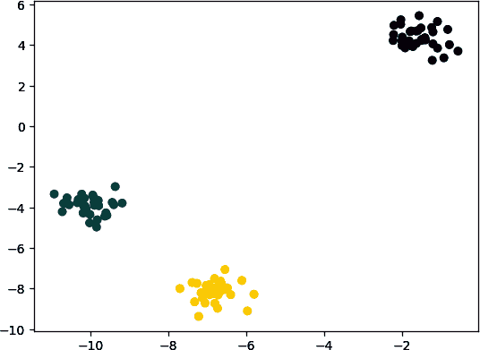

# 第二章：载入数据

# 2.0 简介

任何机器学习工作的第一步是将原始数据导入到我们的系统中。原始数据可以是日志文件、数据集文件、数据库，或者像亚马逊 S3 这样的云存储。此外，通常我们会希望从多个来源检索数据。

本章中的示例将介绍从多种来源加载数据的方法，包括 CSV 文件和 SQL 数据库。我们还将介绍如何使用具有可配置属性的模拟数据生成方法进行实验。最后，虽然在 Python 生态系统中有许多加载数据的方式，但我们将重点介绍使用 pandas 库的广泛方法来加载外部数据，以及使用 scikit-learn——一个开源的 Python 机器学习库——来生成模拟数据。

# 2.1 载入一个示例数据集

## 问题

您希望加载 scikit-learn 库中预先存在的示例数据集。

## 解决方案

scikit-learn 自带许多流行的数据集供您使用：

```py
# Load scikit-learn's datasets
from sklearn import datasets

# Load digits dataset
digits = datasets.load_digits()

# Create features matrix
features = digits.data

# Create target vector
target = digits.target

# View first observation
features[0]
```

```py
array([  0.,   0.,   5.,  13.,   9.,   1.,   0.,   0.,   0.,   0.,  13.,
        15.,  10.,  15.,   5.,   0.,   0.,   3.,  15.,   2.,   0.,  11.,
         8.,   0.,   0.,   4.,  12.,   0.,   0.,   8.,   8.,   0.,   0.,
         5.,   8.,   0.,   0.,   9.,   8.,   0.,   0.,   4.,  11.,   0.,
         1.,  12.,   7.,   0.,   0.,   2.,  14.,   5.,  10.,  12.,   0.,
         0.,   0.,   0.,   6.,  13.,  10.,   0.,   0.,   0.])
```

## 讨论

我们通常不希望在能够探索一些机器学习算法或方法之前，就必须加载、转换和清理真实世界的数据集。幸运的是，scikit-learn 提供了一些常见的数据集，我们可以快速加载。这些数据集通常被称为“玩具”数据集，因为它们比真实世界中的数据集要小得多，也更干净。scikit-learn 中一些流行的示例数据集包括：

`load_iris`

包含 150 个鸢尾花测量数据的观察结果。这是一个很好的数据集，用于探索分类算法。

`load_digits`

包含 1,797 个手写数字图像的观察结果。这是一个很好的数据集，适合用于图像分类的教学。

要查看这些数据集的更多细节，请打印 `DESCR` 属性：

```py
# Load scikit-learn's datasets
from sklearn import datasets

# Load digits dataset
digits = datasets.load_digits()

# Print the attribute
print(digits.DESCR)
```

```py
.. _digits_dataset:

Optical recognition of handwritten digits dataset
--------------------------------------------------

**Data Set Characteristics:**

    :Number of Instances: 1797
    :Number of Attributes: 64
    :Attribute Information: 8x8 image of integer pixels in the range 0..16.
    :Missing Attribute Values: None
    :Creator: E. Alpaydin (alpaydin '@' boun.edu.tr)
    :Date: July; 1998
...
```

## 参见

+   [scikit-learn 玩具数据集](https://oreil.ly/WS1gc)

+   [数字数据集](https://oreil.ly/0hukv)

# 2.2 创建一个模拟数据集

## 问题

您需要生成一个模拟数据集。

## 解决方案

scikit-learn 提供了许多用于创建模拟数据的方法。其中，三种方法特别有用：`make_regression`、`make_classification` 和 `make_blobs`。

当我们需要一个设计用于线性回归的数据集时，`make_regression` 是一个不错的选择：

```py
# Load library
from sklearn.datasets import make_regression

# Generate features matrix, target vector, and the true coefficients
features, target, coefficients = make_regression(n_samples = 100,
                                                 n_features = 3,
                                                 n_informative = 3,
                                                 n_targets = 1,
                                                 noise = 0.0,
                                                 coef = True,
                                                 random_state = 1)

# View feature matrix and target vector
print('Feature Matrix\n', features[:3])
print('Target Vector\n', target[:3])
```

```py
Feature Matrix
 [[ 1.29322588 -0.61736206 -0.11044703]
 [-2.793085    0.36633201  1.93752881]
 [ 0.80186103 -0.18656977  0.0465673 ]]
Target Vector
 [-10.37865986  25.5124503   19.67705609]
```

如果我们有兴趣创建一个用于分类的模拟数据集，我们可以使用 `make_classification`：

```py
# Load library
from sklearn.datasets import make_classification

# Generate features matrix and target vector
features, target = make_classification(n_samples = 100,
                                       n_features = 3,
                                       n_informative = 3,
                                       n_redundant = 0,
                                       n_classes = 2,
                                       weights = [.25, .75],
                                       random_state = 1)

# View feature matrix and target vector
print('Feature Matrix\n', features[:3])
print('Target Vector\n', target[:3])
```

```py
Feature Matrix
 [[ 1.06354768 -1.42632219  1.02163151]
 [ 0.23156977  1.49535261  0.33251578]
 [ 0.15972951  0.83533515 -0.40869554]]
Target Vector
 [1 0 0]
```

最后，如果我们需要一个设计用于聚类技术的数据集，scikit-learn 提供了 `make_blobs`：

```py
# Load library
from sklearn.datasets import make_blobs

# Generate features matrix and target vector
features, target = make_blobs(n_samples = 100,
                              n_features = 2,
                              centers = 3,
                              cluster_std = 0.5,
                              shuffle = True,
                              random_state = 1)

# View feature matrix and target vector
print('Feature Matrix\n', features[:3])
print('Target Vector\n', target[:3])
```

```py
Feature Matrix
 [[ -1.22685609   3.25572052]
 [ -9.57463218  -4.38310652]
 [-10.71976941  -4.20558148]]
Target Vector
 [0 1 1]
```

## 讨论

从解决方案中可以看出，`make_regression` 返回一个浮点值的特征矩阵和一个浮点值的目标向量，而 `make_classification` 和 `make_blobs` 返回一个浮点值的特征矩阵和一个整数的目标向量，代表类的成员身份。

scikit-learn 的模拟数据集提供了广泛的选项来控制生成数据的类型。scikit-learn 的文档包含了所有参数的详细描述，但有几个值得注意。

在 `make_regression` 和 `make_classification` 中，`n_informative` 确定用于生成目标向量的特征数量。如果 `n_informative` 小于总特征数 (`n_features`)，则生成的数据集将具有冗余特征，可通过特征选择技术识别。

此外，`make_classification` 包含 `weights` 参数，允许我们模拟不平衡类别的数据集。例如，`weights = [.25, .75]` 将返回一个数据集，其中 25%的观测属于一类，75%的观测属于第二类。

对于 `make_blobs`，`centers` 参数确定生成的簇数量。使用 `matplotlib` 可视化库，我们可以可视化 `make_blobs` 生成的簇：

```py
# Load library
import matplotlib.pyplot as plt

# View scatterplot
plt.scatter(features[:,0], features[:,1], c=target)
plt.show()
```



## 参见

+   [`make_regression` 文档](https://oreil.ly/VrtN3)

+   [`make_classification` 文档](https://oreil.ly/rehc-)

+   [`make_blobs` 文档](https://oreil.ly/1LZAI)

# 2.3 加载 CSV 文件

## 问题

您需要导入逗号分隔值（CSV）文件。

## 解决方案

使用 pandas 库的 `read_csv` 将本地或托管的 CSV 文件加载到 pandas DataFrame 中：

```py
# Load library
import pandas as pd

# Create URL
url = 'https://raw.githubusercontent.com/chrisalbon/sim_data/master/data.csv'

# Load dataset
dataframe = pd.read_csv(url)

# View first two rows
dataframe.head(2)
```

|  | integer | datetime | category |
| --- | --- | --- | --- |
| 0 | 5 | 2015-01-01 00:00:00 | 0 |
| 1 | 5 | 2015-01-01 00:00:01 | 0 |

## 讨论

关于加载 CSV 文件有两件事情需要注意。首先，在加载之前快速查看文件内容通常很有用。事先了解数据集的结构以及我们需要设置的参数是非常有帮助的。其次，`read_csv` 有超过 30 个参数，因此文档可能令人望而却步。幸运的是，这些参数大多是为了处理各种 CSV 格式而设定的。

CSV 文件的名称源于数值之间确实以逗号分隔（例如，一行可能是 `2,"2015-01-01 00:00:00",0`）；然而，常见的 CSV 文件使用其他分隔符，如制表符（称为 TSV 文件）。pandas 的`sep`参数允许我们定义文件中使用的分隔符。尽管并非总是如此，CSV 文件常见的格式问题是文件的第一行用于定义列标题（例如，在我们的解决方案中是 `integer, datetime, category`）。`header`参数允许我们指定是否存在标题行以及其位置。如果不存在标题行，我们设置`header=None`。

`read_csv` 函数返回一个 pandas DataFrame：这是处理表格数据常见且有用的对象，在本书中我们将更深入地讨论它。

# 2.4 加载 Excel 文件

## 问题

您需要导入 Excel 电子表格。

## 解决方案

使用 pandas 库的 `read_excel` 加载 Excel 电子表格：

```py
# Load library
import pandas as pd

# Create URL
url = 'https://raw.githubusercontent.com/chrisalbon/sim_data/master/data.xlsx'

# Load data
dataframe = pd.read_excel(url, sheet_name=0, header=0)

# View the first two rows
dataframe.head(2)
```

|  | integer | datetime | category |
| --- | --- | --- | --- |
|  | 5 | 2015-01-01 00:00:00 | 0 |
| 0 | 5 | 2015-01-01 00:00:01 | 0 |
| 1 | 9 | 2015-01-01 00:00:02 | 0 |

## 讨论

此解决方案类似于我们用于读取 CSV 文件的解决方案。主要区别在于附加参数 `sheet_name`，它指定了我们希望加载的 Excel 文件中的哪个工作表。`sheet_name` 可以接受包含工作表名称的字符串和指向工作表位置（从零开始计数）的整数。如果我们需要加载多个工作表，我们将它们包含在列表中。例如，`sheet_name=[0,1,2, "Monthly Sales"]` 将返回一个包含第一个、第二个和第三个工作表以及名为 `Monthly Sales` 的工作表的 pandas DataFrame 字典。

# 2.5 加载 JSON 文件

## 问题

您需要加载一个 JSON 文件进行数据预处理。

## 解决方案

pandas 库提供了 `read_json` 来将 JSON 文件转换为 pandas 对象：

```py
# Load library
import pandas as pd

# Create URL
url = 'https://raw.githubusercontent.com/chrisalbon/sim_data/master/data.json'

# Load data
dataframe = pd.read_json(url, orient='columns')

# View the first two rows
dataframe.head(2)
```

|  | 类别 | 时间 | 整数 |
| --- | --- | --- | --- |
| 0 | 0 | 2015-01-01 00:00:00 | 5 |
| 1 | 0 | 2015-01-01 00:00:01 | 5 |

## 讨论

将 JSON 文件导入 pandas 类似于我们之前看到的几个示例。主要区别在于 `orient` 参数，它指示 pandas JSON 文件的结构。但是，可能需要一些试验才能弄清楚哪个参数（`split`、`records`、`index`、`columns` 或 `values`）是正确的。另一个 pandas 提供的有用工具是 `json_normalize`，它可以帮助将半结构化的 JSON 数据转换为 pandas DataFrame。

## 参见

+   [`json_normalize` 文档](https://oreil.ly/nuvIB)

# 2.6 加载 Parquet 文件

## 问题

您需要加载一个 Parquet 文件。

## 解决方案

pandas 的 `read_parquet` 函数允许我们读取 Parquet 文件：

```py
# Load library
import pandas as pd

# Create URL
url = 'https://machine-learning-python-cookbook.s3.amazonaws.com/data.parquet'

# Load data
dataframe = pd.read_parquet(url)

# View the first two rows
dataframe.head(2)
```

|  | 类别 | 时间 | 整数 |
| --- | --- | --- | --- |
| 0 | 0 | 2015-01-01 00:00:00 | 5 |
| 1 | 0 | 2015-01-01 00:00:01 | 5 |

## 讨论

Parquet 是大数据领域中流行的数据存储格式。它通常与 Hadoop 和 Spark 等大数据工具一起使用。虽然 PySpark 超出了本书的重点，但大规模运营的公司很可能会使用高效的数据存储格式，比如 Parquet，了解如何将其读入数据框架并对其进行操作是很有价值的。

## 参见

+   [Apache Parquet 文档](https://oreil.ly/M5bRq)

# 2.7 加载 Avro 文件

## 问题

您需要将 Avro 文件加载到 pandas DataFrame 中。

## 解决方案

使用 `pandavro` 库的 `read_avro` 方法：

```py
# Load library
import requests
import pandavro as pdx

# Create URL
url = 'https://machine-learning-python-cookbook.s3.amazonaws.com/data.avro'

# Download file
r = requests.get(url)
open('data.avro', 'wb').write(r.content)

# Load data
dataframe = pdx.read_avro('data.avro')

# View the first two rows
dataframe.head(2)
```

|  | 类别 | 时间 | 整数 |
| --- | --- | --- | --- |
| 0 | 0 | 2015-01-01 00:00:00 | 5 |
| 1 | 0 | 2015-01-01 00:00:01 | 5 |

## 讨论

Apache Avro 是一种开源的二进制数据格式，依赖于数据结构。在撰写本文时，它还不像 Parquet 那样普遍。但是，由于其高效的特性，大型二进制数据格式（如 Avro、thrift 和 Protocol Buffers）正变得越来越流行。如果您使用大型数据系统，很可能在不久的将来会遇到其中一种格式。

## 参见

+   [Apache Avro 文档](https://oreil.ly/Y1TJA)

# 2.8 查询 SQLite 数据库

## 问题

您需要使用结构化查询语言(SQL)从数据库加载数据。

## 解决方案

pandas 的`read_sql_query`允许我们向数据库发出 SQL 查询并加载数据：

```py
# Load libraries
import pandas as pd
from sqlalchemy import create_engine

# Create a connection to the database
database_connection = create_engine('sqlite:///sample.db')

# Load data
dataframe = pd.read_sql_query('SELECT * FROM data', database_connection)

# View first two rows
dataframe.head(2)
```

|  | 名字 | 姓氏 | 年龄 | 预测试分数 | 后测试分数 |
| --- | --- | --- | --- | --- | --- |
| 0 | Jason | Miller | 42 | 4 | 25 |
| 1 | Molly | Jacobson | 52 | 24 | 94 |

## 讨论

SQL 是从数据库提取数据的通用语言。在这个配方中，我们首先使用`create_engine`定义了一个连接到名为 SQLite 的 SQL 数据库引擎。接下来，我们使用 pandas 的`read_sql_query`使用 SQL 查询该数据库，并将结果放入 DataFrame 中。

SQL 是一门独立的语言，虽然超出本书的范围，但对于希望学习机器学习的任何人来说，了解它肯定是值得的。我们的 SQL 查询`SELECT * FROM data`要求数据库给我们表名为`data`的所有列(`*`)。

请注意，这是本书中几个配方之一，如果没有额外的代码将无法运行。具体来说，`create_engine('sqlite:///sample.db')`假定 SQLite 数据库已经存在。

## 参见

+   [SQLite](https://oreil.ly/8Y91T)

+   [W3Schools SQL 教程](https://oreil.ly/A7H1m)

# 2.9 查询远程 SQL 数据库

## 问题

您需要连接并从远程 SQL 数据库中读取数据。

## 解决方案

使用`pymysql`建立连接，并用 pandas 将其读入数据框：

```py
# Import libraries
import pymysql
import pandas as pd

# Create a DB connection
# Use the following example to start a DB instance
# https://github.com/kylegallatin/mysql-db-example
conn = pymysql.connect(
    host='localhost',
    user='root',
    password = "",
    db='db',
)

# Read the SQL query into a dataframe
dataframe = pd.read_sql("select * from data", conn)

# View the first two rows
dataframe.head(2)
```

|  | 整数 | 日期时间 | 类别 |
| --- | --- | --- | --- |
| 0 | 5 | 2015-01-01 00:00:00 | 0 |
| 1 | 5 | 2015-01-01 00:00:01 | 0 |

## 讨论

在本章中呈现的所有配方中，这可能是我们在现实世界中最常使用的一个。虽然连接并从示例`sqlite`数据库中读取数据很有用，但它可能不代表您将需要连接的企业环境中的表。您将连接的大多数 SQL 实例都将要求您连接到远程计算机的主机和端口，并指定用于身份验证的用户名和密码。此示例需要您[在本地启动运行的 SQL 实例](https://oreil.ly/Sxjqz)，以模仿远程服务器上的工作流程。

## 参见

+   [PyMySQL 文档](https://oreil.ly/8zSnj)

+   [pandas 读取 SQL 文档](https://oreil.ly/Yb7sH)

# 2.10 从 Google 表格加载数据

## 问题

您需要直接从 Google 表格中读取数据。

## 解决方案

使用 pandas 的`read_CSV`并传递一个将 Google 表格导出为 CSV 的 URL：

```py
# Import libraries
import pandas as pd

# Google Sheet URL that downloads the sheet as a CSV
url = "https://docs.google.com/spreadsheets/d/"\
      "1ehC-9otcAuitqnmWksqt1mOrTRCL38dv0K9UjhwzTOA/export?format=csv"

# Read the CSV into a dataframe
dataframe = pd.read_csv(url)

# View the first two rows
dataframe.head(2)
```

|  | 整数 | 日期时间 | 类别 |
| --- | --- | --- | --- |
| 0 | 5 | 2015-01-01 00:00:00 | 0 |
| 1 | 5 | 2015-01-01 00:00:01 | 0 |

## 讨论

虽然 Google 表格可以轻松下载，但直接在 Python 中读取它们而无需任何中间步骤有时会很有帮助。上述 URL 末尾的`/export?format=csv`查询参数创建了一个端点，我们可以从中下载文件或将其读入 pandas。

## 参见

+   [Google 表格 API](https://oreil.ly/GRLzg)

# 2.11 从 S3 存储桶加载数据

## 问题

您需要从您有访问权限的 S3 存储桶中读取 CSV 文件。

## 解决方案

向 pandas 添加存储选项，使其可以访问 S3 对象：

```py
# Import libraries
import pandas as pd

# S3 path to CSV
s3_uri = "s3://machine-learning-python-cookbook/data.csv"

# Set AWS credentials (replace with your own)
ACCESS_KEY_ID = "*`xxxxxxxxxxxxx`*"
SECRET_ACCESS_KEY = "*`xxxxxxxxxxxxxxxx`*"

# Read the CSV into a dataframe
dataframe = pd.read_csv(s3_uri,storage_options={
        "key": ACCESS_KEY_ID,
        "secret": SECRET_ACCESS_KEY,
  }
)

# View first two rows
dataframe.head(2)

```

|  | 整数 | 日期时间 | 类别 |
| --- | --- | --- | --- |
| 0 | 5 | 2015-01-01 00:00:00 | 0 |
| 1 | 5 | 2015-01-01 00:00:01 | 0 |

## 讨论

许多企业现在将数据保存在云提供商的 Blob 存储中，如 Amazon S3 或 Google Cloud Storage（GCS）。机器学习从业者通常连接到这些来源以检索数据。虽然 S3 URI（`s3://machine-learning-python-cookbook/data.csv`）是公共的，但仍然需要您提供自己的 AWS 访问凭据才能访问它。值得注意的是，公共对象还有 HTTP URL，可以从中下载文件，[比如这个 CSV 文件的链接](https://oreil.ly/byelc)。

## 参见

+   [Amazon S3](https://oreil.ly/E-CZX)

+   [AWS 安全凭证](https://oreil.ly/aHBBb)

# 2.12 加载非结构化数据

## 问题

您需要加载文本或图像等非结构化数据。

## 解决方案

使用基本的 Python `open`函数加载信息：

```py
# Import libraries
import requests

# URL to download the txt file from
txt_url = "https://machine-learning-python-cookbook.s3.amazonaws.com/text.txt"

# Get the txt file
r = requests.get(txt_url)

# Write it to text.txt locally
with open('text.txt', 'wb') as f:
    f.write(r.content)

# Read in the file
with open('text.txt', 'r') as f:
    text = f.read()

# Print the content
print(text)
```

```py
Hello there!
```

## 讨论

虽然结构化数据可以轻松从 CSV、JSON 或各种数据库中读取，但非结构化数据可能更具挑战性，可能需要稍后进行定制处理。有时使用 Python 的基本`open`函数打开并读取文件会很有帮助。这样我们就可以打开文件然后读取文件的内容。

## 参见

+   [Python 的 open 函数](https://oreil.ly/Xuuom)

+   [Python 中的上下文管理器](https://oreil.ly/UyZnL)
