# 第八章. 处理图像

# 8.0 介绍

图像分类是机器学习中最激动人心的领域之一。计算机从图像中识别模式和物体的能力是我们工具箱中非常强大的工具。然而，在将机器学习应用于图像之前，我们通常需要将原始图像转换为我们的学习算法可用的特征。与文本数据一样，也有许多预训练的分类器可用于图像，我们可以使用这些分类器来提取我们自己模型的输入中感兴趣的特征或对象。

为了处理图像，我们将主要使用开源计算机视觉库（OpenCV）。虽然市面上有许多优秀的库，但 OpenCV 是处理图像最流行和文档最完善的库。安装时可能会遇到一些挑战，但如果遇到问题，网上有很多指南。本书特别使用的是 `opencv-python-headless==4.7.0.68`。您也可以使用 [Python Cookbook Runner 中的 ML](https://oreil.ly/MLwPython) 确保所有命令可复现。

在本章中，我们将使用一组图像作为示例，可以从 [GitHub](https://oreil.ly/gV5Zc) 下载。

# 8.1 加载图像

## 问题

您想要加载一幅图像进行预处理。

## 解决方案

使用 OpenCV 的 `imread`：

```py
# Load libraries
import cv2
import numpy as np
from matplotlib import pyplot as plt

# Load image as grayscale
image = cv2.imread("images/plane.jpg", cv2.IMREAD_GRAYSCALE)
```

如果我们想查看图像，我们可以使用 Python 绘图库 Matplotlib：

```py
# Show image
plt.imshow(image, cmap="gray"), plt.axis("off")
plt.show()
```

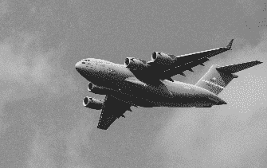

## 讨论

从根本上讲，图像是数据，当我们使用`imread`时，我们将该数据转换为我们非常熟悉的数据类型——一个 NumPy 数组：

```py
# Show data type
type(image)
```

```py
numpy.ndarray
```

我们已将图像转换为一个矩阵，其元素对应于各个像素。我们甚至可以查看矩阵的实际值：

```py
# Show image data
image
```

```py
array([[140, 136, 146, ..., 132, 139, 134],
       [144, 136, 149, ..., 142, 124, 126],
       [152, 139, 144, ..., 121, 127, 134],
       ...,
       [156, 146, 144, ..., 157, 154, 151],
       [146, 150, 147, ..., 156, 158, 157],
       [143, 138, 147, ..., 156, 157, 157]], dtype=uint8)
```

我们图像的分辨率是 3600 × 2270，正好是我们矩阵的确切尺寸：

```py
# Show dimensions
image.shape
```

```py
(2270, 3600)
```

矩阵中的每个元素实际上表示什么？在灰度图像中，单个元素的值是像素强度。强度值从黑色（0）到白色（255）变化。例如，我们图像左上角像素的强度值为 140：

```py
# Show first pixel
image[0,0]
```

```py
140
```

在表示彩色图像的矩阵中，每个元素实际上包含三个值，分别对应蓝色、绿色和红色的值（BGR）：

```py
# Load image in color
image_bgr = cv2.imread("images/plane.jpg", cv2.IMREAD_COLOR)

# Show pixel
image_bgr[0,0]
```

```py
array([195, 144, 111], dtype=uint8)
```

有一个小细节：默认情况下，OpenCV 使用 BGR，但许多图像应用程序——包括 Matplotlib——使用红色、绿色、蓝色（RGB），这意味着红色和蓝色值被交换了。为了在 Matplotlib 中正确显示 OpenCV 彩色图像，我们首先需要将颜色转换为 RGB（对于硬拷贝读者，没有彩色图像我们深感抱歉）。

```py
# Convert to RGB
image_rgb = cv2.cvtColor(image_bgr, cv2.COLOR_BGR2RGB)

# Show image
plt.imshow(image_rgb), plt.axis("off")
plt.show()
```

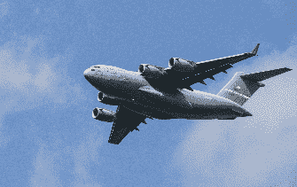

## 参见

+   [RGB 和 BGR 的区别](https://oreil.ly/N1Ub6)

+   [RGB 颜色模型，维基百科](https://oreil.ly/OEesQ)

# 8.2 保存图像

## 问题

您想要保存一幅图像进行预处理。

## 解决方案

使用 OpenCV 的 `imwrite`：

```py
# Load libraries
import cv2
import numpy as np
from matplotlib import pyplot as plt

# Load image as grayscale
image = cv2.imread("images/plane.jpg", cv2.IMREAD_GRAYSCALE)

# Save image
cv2.imwrite("images/plane_new.jpg", image)
```

```py
True
```

## 讨论

OpenCV 的`imwrite`将图像保存到指定的文件路径。图像的格式由文件名的扩展名（*.jpg*，*.png*等）定义。要注意的一个行为是：`imwrite`会覆盖现有文件而不输出错误或要求确认。

# 8.3 调整图像大小

## 问题

您想要调整图像的大小以进行进一步的预处理。

## 解决方案

使用`resize`来改变图像的大小：

```py
# Load libraries
import cv2
import numpy as np
from matplotlib import pyplot as plt

# Load image as grayscale
image = cv2.imread("images/plane_256x256.jpg", cv2.IMREAD_GRAYSCALE)

# Resize image to 50 pixels by 50 pixels
image_50x50 = cv2.resize(image, (50, 50))

# View image
plt.imshow(image_50x50, cmap="gray"), plt.axis("off")
plt.show()
```

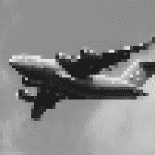

## 讨论

调整图像大小是图像预处理中的常见任务，有两个原因。首先，图像以各种形状和大小出现，为了作为特征可用，图像必须具有相同的尺寸。标准化（调整大小）图像的过程会丢失较大图像中存在的一些信息，就像飞机图片中所看到的那样。图像是信息的矩阵，当我们减小图像的尺寸时，我们减少了该矩阵及其所包含信息的大小。其次，机器学习可能需要成千上万张图像。当这些图像非常大时，它们会占用大量内存，通过调整它们的大小，我们可以显著减少内存使用量。机器学习中常见的一些图像尺寸包括 32 × 32、64 × 64、96 × 96 和 256 × 256。总的来说，我们选择的图像调整方法往往是模型统计性能与训练计算成本之间的权衡。出于这个原因，[Pillow 库提供了许多调整图像大小的选项](https://oreil.ly/NiJn_)。

# 8.4 裁剪图像

## 问题

您想要删除图像的外部部分以更改其尺寸。

## 解决方案

图像被编码为二维 NumPy 数组，因此我们可以通过切片数组轻松地裁剪图像：

```py
# Load libraries
import cv2
import numpy as np
from matplotlib import pyplot as plt

# Load image in grayscale
image = cv2.imread("images/plane_256x256.jpg", cv2.IMREAD_GRAYSCALE)

# Select first half of the columns and all rows
image_cropped = image[:,:128]

# Show image
plt.imshow(image_cropped, cmap="gray"), plt.axis("off")
plt.show()
```

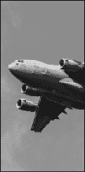

## 讨论

由于 OpenCV 将图像表示为元素的矩阵，通过选择我们想保留的行和列，我们可以轻松地裁剪图像。如果我们知道我们只想保留每个图像的特定部分，裁剪可以特别有用。例如，如果我们的图像来自固定的安全摄像机，我们可以裁剪所有图像，使它们仅包含感兴趣的区域。

## 参见

+   [切片 NumPy 数组](https://oreil.ly/8JN5p)

# 8.5 模糊图像

## 问题

您想要使图像变得平滑。

## 解决方案

为了模糊图像，每个像素被转换为其邻居的平均值。数学上将这个邻居和操作表示为一个核（如果你不知道核是什么也不用担心）。这个核的大小决定了模糊的程度，较大的核产生更平滑的图像。在这里，我们通过对每个像素周围的 5 × 5 核的值取平均来模糊图像：

```py
# Load libraries
import cv2
import numpy as np
from matplotlib import pyplot as plt

# Load image as grayscale
image = cv2.imread("images/plane_256x256.jpg", cv2.IMREAD_GRAYSCALE)

# Blur image
image_blurry = cv2.blur(image, (5,5))

# Show image
plt.imshow(image_blurry, cmap="gray"), plt.axis("off")
plt.show()
```

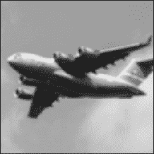

为了突出显示核大小的效果，这里是使用 100 × 100 核进行的相同模糊处理的图像：

```py
# Blur image
image_very_blurry = cv2.blur(image, (100,100))

# Show image
plt.imshow(image_very_blurry, cmap="gray"), plt.xticks([]), plt.yticks([])
plt.show()
```

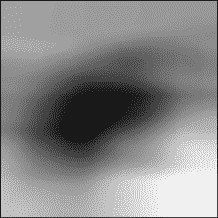

## 讨论

卷积核在图像处理中被广泛使用，从锐化到边缘检测等方面，本章节将反复讨论。我们使用的模糊核如下所示：

```py
# Create kernel
kernel = np.ones((5,5)) / 25.0

# Show kernel
kernel
```

```py
array([[ 0.04,  0.04,  0.04,  0.04,  0.04],
       [ 0.04,  0.04,  0.04,  0.04,  0.04],
       [ 0.04,  0.04,  0.04,  0.04,  0.04],
       [ 0.04,  0.04,  0.04,  0.04,  0.04],
       [ 0.04,  0.04,  0.04,  0.04,  0.04]])
```

核心元素在内核中是被检查的像素，而其余元素是其邻居。由于所有元素具有相同的值（归一化为总和为 1），因此每个元素对感兴趣像素的结果值都有相同的影响力。我们可以使用`filter2D`手动将内核应用于图像，以产生类似的模糊效果：

```py
# Apply kernel
image_kernel = cv2.filter2D(image, -1, kernel)

# Show image
plt.imshow(image_kernel, cmap="gray"), plt.xticks([]), plt.yticks([])
plt.show()
```


## 参见

+   [图像卷积核的直观解释](https://oreil.ly/9yvdg)

+   [卷积核（图像处理），维基百科](https://oreil.ly/ByREC)

# 8.6 锐化图像

## 问题

您想要锐化图像。

## 解决方案

创建一个突出显示目标像素的内核。然后使用`filter2D`将其应用于图像：

```py
# Load libraries
import cv2
import numpy as np
from matplotlib import pyplot as plt

# Load image as grayscale
image = cv2.imread("images/plane_256x256.jpg", cv2.IMREAD_GRAYSCALE)

# Create kernel
kernel = np.array([[0, -1, 0],
                   [-1, 5,-1],
                   [0, -1, 0]])

# Sharpen image
image_sharp = cv2.filter2D(image, -1, kernel)

# Show image
plt.imshow(image_sharp, cmap="gray"), plt.axis("off")
plt.show()
```

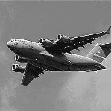

## 讨论

锐化的工作原理与模糊类似，但不同于使用内核来平均周围值，我们构建了一个内核来突出像素本身。其结果效果使得边缘处的对比更加明显。

# 8.7 增强对比度

## 问题

我们希望增加图像中像素之间的对比度。

## 解决方案

*直方图均衡化* 是一种图像处理工具，可以使物体和形状更加突出。当我们有一个灰度图像时，可以直接在图像上应用 OpenCV 的`equalizeHist`：

```py
# Load libraries
import cv2
import numpy as np
from matplotlib import pyplot as plt

# Load image
image = cv2.imread("images/plane_256x256.jpg", cv2.IMREAD_GRAYSCALE)

# Enhance image
image_enhanced = cv2.equalizeHist(image)

# Show image
plt.imshow(image_enhanced, cmap="gray"), plt.axis("off")
plt.show()
```

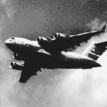

然而，当我们有一幅彩色图像时，我们首先需要将图像转换为 YUV 颜色格式。Y 代表亮度，U 和 V 表示颜色。转换后，我们可以将`equalizeHist`应用于图像，然后再转换回 BGR 或 RGB（对于只有黑白图像的读者表示抱歉）：

```py
# Load image
image_bgr = cv2.imread("images/plane.jpg")

# Convert to YUV
image_yuv = cv2.cvtColor(image_bgr, cv2.COLOR_BGR2YUV)

# Apply histogram equalization
image_yuv[:, :, 0] = cv2.equalizeHist(image_yuv[:, :, 0])

# Convert to RGB
image_rgb = cv2.cvtColor(image_yuv, cv2.COLOR_YUV2RGB)

# Show image
plt.imshow(image_rgb), plt.axis("off")
plt.show()
```

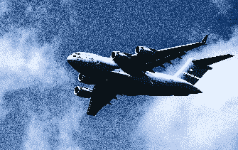

## 讨论

虽然详细解释直方图均衡化的工作原理超出了本书的范围，简短的解释是它转换图像，使其使用更广泛的像素强度范围。

虽然生成的图像通常看起来不够“真实”，但我们需要记住，图像只是底层数据的视觉表示。如果直方图均衡化能够使感兴趣的对象与其他对象或背景更易于区分（这并非总是如此），那么它可以成为我们图像预处理流程中的有价值的补充。

# 8.8 分离颜色

## 问题

您想要在图像中隔离一种颜色。

## 解决方案

定义一个颜色范围，然后将掩码应用于图像（对于只有黑白图像的读者表示抱歉）：

```py
# Load libraries
import cv2
import numpy as np
from matplotlib import pyplot as plt

# Load image
image_bgr = cv2.imread('images/plane_256x256.jpg')

# Convert BGR to HSV
image_hsv = cv2.cvtColor(image_bgr, cv2.COLOR_BGR2HSV)

# Define range of blue values in HSV
lower_blue = np.array([50,100,50])
upper_blue = np.array([130,255,255])

# Create mask
mask = cv2.inRange(image_hsv, lower_blue, upper_blue)

# Mask image
image_bgr_masked = cv2.bitwise_and(image_bgr, image_bgr, mask=mask)

# Convert BGR to RGB
image_rgb = cv2.cvtColor(image_bgr_masked, cv2.COLOR_BGR2RGB)

# Show image
plt.imshow(image_rgb), plt.axis("off")
plt.show()
```

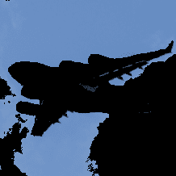

## 讨论

在 OpenCV 中隔离颜色是直接的。首先我们将图像转换为 HSV（色调、饱和度和值）。其次，我们定义我们想要隔离的值范围，这可能是最困难和耗时的部分。第三，我们为图像创建一个掩码。图像掩码是一种常见的技术，旨在提取感兴趣的区域。在这种情况下，我们的掩码仅保留白色区域：

```py
# Show image
plt.imshow(mask, cmap='gray'), plt.axis("off")
plt.show()
```

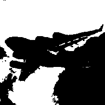

最后，我们使用 `bitwise_and` 将掩码应用于图像，并将其转换为我们期望的输出格式。

# 8.9 图像二值化

## 问题

给定一张图像，您想要输出一个简化版本。

## 解决方案

*阈值化* 是将像素强度大于某个值的像素设置为白色，小于该值的像素设置为黑色的过程。更高级的技术是 *自适应阈值化*，其中像素的阈值由其邻域的像素强度决定。当图像中不同区域的光照条件发生变化时，这可能会有所帮助：

```py
# Load libraries
import cv2
import numpy as np
from matplotlib import pyplot as plt

# Load image as grayscale
image_grey = cv2.imread("images/plane_256x256.jpg", cv2.IMREAD_GRAYSCALE)

# Apply adaptive thresholding
max_output_value = 255
neighborhood_size = 99
subtract_from_mean = 10
image_binarized = cv2.adaptiveThreshold(image_grey,
                                        max_output_value,
                                        cv2.ADAPTIVE_THRESH_GAUSSIAN_C,
                                        cv2.THRESH_BINARY,
                                        neighborhood_size,
                                        subtract_from_mean)

# Show image
plt.imshow(image_binarized, cmap="gray"), plt.axis("off")
plt.show()
```

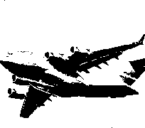

## 讨论

对图像进行二值化的过程涉及将灰度图像转换为其黑白形式。我们的解决方案在 `adaptiveThreshold` 中有四个重要参数。`max_output_value` 简单地确定输出像素强度的最大值。`cv2.ADAPTIVE_THRESH_GAUSSIAN_C` 将像素的阈值设置为其相邻像素强度的加权和。权重由高斯窗口确定。或者，我们可以将阈值简单地设置为相邻像素的平均值，使用 `cv2.ADAPTIVE_THRESH_MEAN_C`：

```py
# Apply cv2.ADAPTIVE_THRESH_MEAN_C
image_mean_threshold = cv2.adaptiveThreshold(image_grey,
                                             max_output_value,
                                             cv2.ADAPTIVE_THRESH_MEAN_C,
                                             cv2.THRESH_BINARY,
                                             neighborhood_size,
                                             subtract_from_mean)

# Show image
plt.imshow(image_mean_threshold, cmap="gray"), plt.axis("off")
plt.show()
```

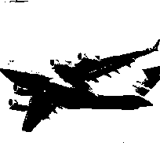

最后两个参数是块大小（用于确定像素阈值的邻域大小）和从计算阈值中减去的常数（用于手动微调阈值）。

阈值化的一个主要好处是 *去噪* 图像 —— 仅保留最重要的元素。例如，经常将阈值应用于印刷文本的照片，以隔离页面上的字母。

# 8.10 移除背景

## 问题

您想要隔离图像的前景。

## 解决方案

在所需前景周围标记一个矩形，然后运行 GrabCut 算法：

```py
# Load library
import cv2
import numpy as np
from matplotlib import pyplot as plt

# Load image and convert to RGB
image_bgr = cv2.imread('images/plane_256x256.jpg')
image_rgb = cv2.cvtColor(image_bgr, cv2.COLOR_BGR2RGB)

# Rectangle values: start x, start y, width, height
rectangle = (0, 56, 256, 150)

# Create initial mask
mask = np.zeros(image_rgb.shape[:2], np.uint8)

# Create temporary arrays used by grabCut
bgdModel = np.zeros((1, 65), np.float64)
fgdModel = np.zeros((1, 65), np.float64)

# Run grabCut
cv2.grabCut(image_rgb, # Our image
            mask, # The Mask
            rectangle, # Our rectangle
            bgdModel, # Temporary array for background
            fgdModel, # Temporary array for background
            5, # Number of iterations
            cv2.GC_INIT_WITH_RECT) # Initiative using our rectangle

# Create mask where sure and likely backgrounds set to 0, otherwise 1
mask_2 = np.where((mask==2) | (mask==0), 0, 1).astype('uint8')

# Multiply image with new mask to subtract background
image_rgb_nobg = image_rgb * mask_2[:, :, np.newaxis]

# Show image
plt.imshow(image_rgb_nobg), plt.axis("off")
plt.show()
```

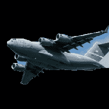

## 讨论

我们首先注意到，即使 GrabCut 做得相当不错，图像中仍然有一些背景区域。我们可以回去手动标记这些区域为背景，但在现实世界中，我们有成千上万张图片，逐个手动修复它们是不可行的。因此，我们最好接受图像数据仍然会包含一些背景噪声。

在我们的解决方案中，我们首先在包含前景的区域周围标记一个矩形。GrabCut 假定这个矩形外的所有内容都是背景，并利用这些信息来推断出正方形内部可能是背景的区域。（要了解算法如何做到这一点，请参阅[Itay Blumenthal](https://oreil.ly/DTGwb)的解释。）然后创建一个标记不同明确/可能背景/前景区域的掩码：

```py
# Show mask
plt.imshow(mask, cmap='gray'), plt.axis("off")
plt.show()
```

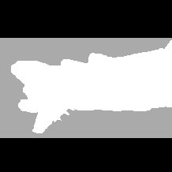

黑色区域是矩形外部被假定为明确背景的区域。灰色区域是 GrabCut 认为可能是背景的区域，而白色区域则是可能是前景的区域。

然后使用该掩码创建第二个掩码，将黑色和灰色区域合并：

```py
# Show mask
plt.imshow(mask_2, cmap='gray'), plt.axis("off")
plt.show()
```

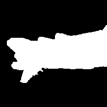

然后将第二个掩码应用于图像，以便仅保留前景。

# 8.11 检测边缘

## 问题

您希望在图像中找到边缘。

## 解决方案

使用像 Canny 边缘检测器这样的边缘检测技术：

```py
# Load libraries
import cv2
import numpy as np
from matplotlib import pyplot as plt

# Load image as grayscale
image_gray = cv2.imread("images/plane_256x256.jpg", cv2.IMREAD_GRAYSCALE)

# Calculate median intensity
median_intensity = np.median(image_gray)

# Set thresholds to be one standard deviation above and below median intensity
lower_threshold = int(max(0, (1.0 - 0.33) * median_intensity))
upper_threshold = int(min(255, (1.0 + 0.33) * median_intensity))

# Apply Canny edge detector
image_canny = cv2.Canny(image_gray, lower_threshold, upper_threshold)

# Show image
plt.imshow(image_canny, cmap="gray"), plt.axis("off")
plt.show()
```

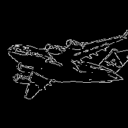

## 讨论

边缘检测是计算机视觉中的一个主要话题。边缘非常重要，因为它们是信息量最大的区域。例如，在我们的图像中，一片天空看起来非常相似，不太可能包含独特或有趣的信息。然而，背景天空与飞机相遇的区域包含大量信息（例如，物体的形状）。边缘检测允许我们去除低信息量的区域，并分离包含最多信息的图像区域。

边缘检测有许多技术（Sobel 滤波器、Laplacian 边缘检测器等）。然而，我们的解决方案使用常用的 Canny 边缘检测器。Canny 检测器的工作原理对本书来说过于详细，但有一点我们需要解决。Canny 检测器需要两个参数来指定低梯度阈值和高梯度阈值。低和高阈值之间的潜在边缘像素被认为是弱边缘像素，而高于高阈值的像素被认为是强边缘像素。OpenCV 的`Canny`方法包括所需的低和高阈值参数。在我们的解决方案中，我们将低和高阈值设置为图像中位数下方和上方的一个标准偏差。然而，在运行`Canny`处理整个图像集之前，我们经常通过手动在几幅图像上试错来确定一对好的低和高阈值，以获得更好的结果。

## 参见

+   [Canny 边缘检测器，维基百科](https://oreil.ly/gG9xo)

+   [Canny 边缘检测自动阈值](https://oreil.ly/YvjM5)

# 8.12 检测角点

## 问题

您希望检测图像中的角点。

## 解决方案

使用 OpenCV 的 Harris 角检测器`cornerHarris`的实现：

```py
# Load libraries
import cv2
import numpy as np
from matplotlib import pyplot as plt

# Load image
image_bgr = cv2.imread("images/plane_256x256.jpg")
image_gray = cv2.cvtColor(image_bgr, cv2.COLOR_BGR2GRAY)
image_gray = np.float32(image_gray)

# Set corner detector parameters
block_size = 2
aperture = 29
free_parameter = 0.04

# Detect corners
detector_responses = cv2.cornerHarris(image_gray,
                                      block_size,
                                      aperture,
                                      free_parameter)

# Large corner markers
detector_responses = cv2.dilate(detector_responses, None)

# Only keep detector responses greater than threshold, mark as white
threshold = 0.02
image_bgr[detector_responses >
          threshold *
          detector_responses.max()] = [255,255,255]

# Convert to grayscale
image_gray = cv2.cvtColor(image_bgr, cv2.COLOR_BGR2GRAY)

# Show image
plt.imshow(image_gray, cmap="gray"), plt.axis("off")
plt.show()
```

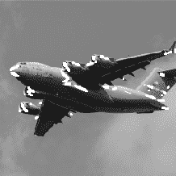

## 讨论

*Harris 角点检测器*是一种常用的检测两条边交点的方法。我们对检测角点的兴趣与检测边缘的原因相同：角点是信息量很高的点。Harris 角点检测器的完整解释可以在本文末尾的外部资源中找到，但简化的解释是它寻找窗口（也称为*邻域*或*补丁*），在这些窗口中，窗口的微小移动（想象抖动窗口）导致窗口内像素内容的显著变化。`cornerHarris`包含三个重要参数，我们可以用它来控制检测到的边缘。首先，`block_size`是用于角点检测的每个像素周围的邻域的大小。其次，`aperture`是使用的 Sobel 核的大小（如果你不知道是什么也没关系），最后有一个自由参数，较大的值对应于识别更软的角点。

输出是一个灰度图像，描述了潜在的角点：

```py
# Show potential corners
plt.imshow(detector_responses, cmap='gray'), plt.axis("off")
plt.show()
```

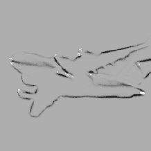

然后我们应用阈值处理，仅保留最可能的角点。或者，我们可以使用类似的检测器，即 Shi-Tomasi 角点检测器，它的工作方式与 Harris 检测器类似（`goodFeaturesToTrack`），用于识别固定数量的强角点。`goodFeaturesToTrack`有三个主要参数——要检测的角点数目，角点的最小质量（0 到 1 之间），以及角点之间的最小欧氏距离：

```py
# Load images
image_bgr = cv2.imread('images/plane_256x256.jpg')
image_gray = cv2.cvtColor(image_bgr, cv2.COLOR_BGR2GRAY)

# Number of corners to detect
corners_to_detect = 10
minimum_quality_score = 0.05
minimum_distance = 25

# Detect corners
corners = cv2.goodFeaturesToTrack(image_gray,
                                  corners_to_detect,
                                  minimum_quality_score,
                                  minimum_distance)
corners = np.int16(corners)

# Draw white circle at each corner
for corner in corners:
    x, y = corner[0]
    cv2.circle(image_bgr, (x,y), 10, (255,255,255), -1)

# Convert to grayscale
image_rgb = cv2.cvtColor(image_bgr, cv2.COLOR_BGR2GRAY)

# Show image
plt.imshow(image_rgb, cmap='gray'), plt.axis("off")
plt.show()
```

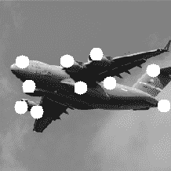

## 另请参阅

+   [OpenCV 的 cornerHarris](https://oreil.ly/vLMBj)

+   [OpenCV 的 goodFeaturesToTrack](https://oreil.ly/Ra-x6)

# 8.13 为机器学习创建特征

## 问题

您希望将图像转换为机器学习的观察结果。

## 解决方案

使用 NumPy 的`flatten`将包含图像数据的多维数组转换为包含观察值的向量：

```py
# Load libraries
import cv2
import numpy as np
from matplotlib import pyplot as plt

# Load image as grayscale
image = cv2.imread("images/plane_256x256.jpg", cv2.IMREAD_GRAYSCALE)

# Resize image to 10 pixels by 10 pixels
image_10x10 = cv2.resize(image, (10, 10))

# Convert image data to one-dimensional vector
image_10x10.flatten()
```

```py
array([133, 130, 130, 129, 130, 129, 129, 128, 128, 127, 135, 131, 131,
       131, 130, 130, 129, 128, 128, 128, 134, 132, 131, 131, 130, 129,
       129, 128, 130, 133, 132, 158, 130, 133, 130,  46,  97,  26, 132,
       143, 141,  36,  54,  91,   9,   9,  49, 144, 179,  41, 142,  95,
        32,  36,  29,  43, 113, 141, 179, 187, 141, 124,  26,  25, 132,
       135, 151, 175, 174, 184, 143, 151,  38, 133, 134, 139, 174, 177,
       169, 174, 155, 141, 135, 137, 137, 152, 169, 168, 168, 179, 152,
       139, 136, 135, 137, 143, 159, 166, 171, 175], dtype=uint8)
```

## 讨论

图像呈像素网格的形式呈现。如果图像是灰度的，每个像素由一个值表示（即，如果是白色，则像素强度为`1`，如果是黑色则为`0`）。例如，想象我们有一个 10 × 10 像素的图像：

```py
plt.imshow(image_10x10, cmap="gray"), plt.axis("off")
plt.show()
```

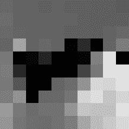

在这种情况下，图像数据的尺寸将是 10 × 10：

```py
image_10x10.shape
```

```py
(10, 10)
```

如果我们展平数组，我们得到长度为 100 的向量（10 乘以 10）：

```py
image_10x10.flatten().shape
```

```py
(100,)
```

这是我们图像的特征数据，可以与其他图像的向量合并，以创建我们将提供给机器学习算法的数据。

如果图像是彩色的，每个像素不是由一个值表示，而是由多个值表示（通常是三个），表示混合以形成该像素的最终颜色的通道（红色、绿色、蓝色等）。因此，如果我们的 10 × 10 图像是彩色的，每个观察值将有 300 个特征值：

```py
# Load image in color
image_color = cv2.imread("images/plane_256x256.jpg", cv2.IMREAD_COLOR)

# Resize image to 10 pixels by 10 pixels
image_color_10x10 = cv2.resize(image_color, (10, 10))

# Convert image data to one-dimensional vector, show dimensions
image_color_10x10.flatten().shape
```

```py
(300,)
```

图像处理和计算机视觉的一个主要挑战是，由于图像集合中每个像素位置都是一个特征，随着图像变大，特征数量会急剧增加：

```py
# Load image in grayscale
image_256x256_gray = cv2.imread("images/plane_256x256.jpg", cv2.IMREAD_GRAYSCALE)

# Convert image data to one-dimensional vector, show dimensions
image_256x256_gray.flatten().shape
```

```py
(65536,)
```

当图像为彩色时，特征数量甚至变得更大：

```py
# Load image in color
image_256x256_color = cv2.imread("images/plane_256x256.jpg", cv2.IMREAD_COLOR)

# Convert image data to one-dimensional vector, show dimensions
image_256x256_color.flatten().shape
```

```py
(196608,)
```

如输出所示，即使是小型彩色图像也有接近 200,000 个特征，这可能在训练模型时会引发问题，因为特征数量可能远远超过观察值的数量。

这个问题将推动后面章节讨论的降维策略，试图在不失去数据中过多信息的情况下减少特征数量。

# 8.14 将颜色直方图编码为特征

## 问题

您想创建一组表示图像中出现的颜色的特征。

## 解决方案

计算每个颜色通道的直方图：

```py
# Load libraries
import cv2
import numpy as np
from matplotlib import pyplot as plt

np.random.seed(0)

# Load image
image_bgr = cv2.imread("images/plane_256x256.jpg", cv2.IMREAD_COLOR)

# Convert to RGB
image_rgb = cv2.cvtColor(image_bgr, cv2.COLOR_BGR2RGB)

# Create a list for feature values
features = []

# Calculate the histogram for each color channel
colors = ("r","g","b")

# For each channel: calculate histogram and add to feature value list
for i, channel in enumerate(colors):
    histogram = cv2.calcHist([image_rgb], # Image
                        [i], # Index of channel
                        None, # No mask
                        [256], # Histogram size
                        [0,256]) # Range
    features.extend(histogram)

# Create a vector for an observation's feature values
observation = np.array(features).flatten()

# Show the observation's value for the first five features
observation[0:5]
```

```py
array([ 1008.,   217.,   184.,   165.,   116.], dtype=float32)
```

## 讨论

在 RGB 颜色模型中，每种颜色都是三个颜色通道（即红色、绿色、蓝色）的组合。每个通道可以取 0 到 255 之间的 256 个值（由整数表示）。例如，我们图像中左上角的像素具有以下通道值：

```py
# Show RGB channel values
image_rgb[0,0]
```

```py
array([107, 163, 212], dtype=uint8)
```

直方图是数据值分布的表示。这里有一个简单的例子：

```py
# Import pandas
import pandas as pd

# Create some data
data = pd.Series([1, 1, 2, 2, 3, 3, 3, 4, 5])

# Show the histogram
data.hist(grid=False)
plt.show()
```

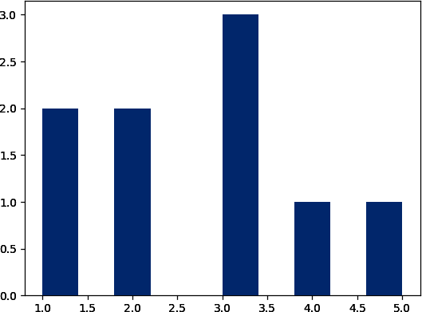

在这个例子中，我们有一些数据，其中有两个`1`，两个`2`，三个`3`，一个`4`和一个`5`。在直方图中，每个条形表示数据中每个值（`1`，`2`等）出现的次数。

我们可以将这种技术应用到每个颜色通道上，但是不是五种可能的值，而是 256 种（通道值的可能数）。x 轴表示 256 个可能的通道值，y 轴表示图像中所有像素中特定通道值出现的次数（对于没有彩色图像的纸质读者表示歉意）：

```py
# Calculate the histogram for each color channel
colors = ("r","g","b")

# For each channel: calculate histogram, make plot
for i, channel in enumerate(colors):
    histogram = cv2.calcHist([image_rgb], # Image
                        [i], # Index of channel
                        None, # No mask
                        [256], # Histogram size
                        [0,256]) # Range
    plt.plot(histogram, color = channel)
    plt.xlim([0,256])

# Show plot
plt.show()
```

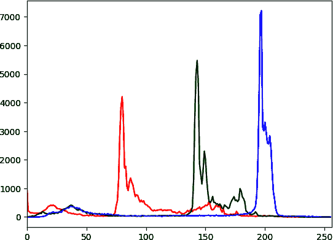

正如我们在直方图中看到的，几乎没有像素包含蓝色通道值在 0 到约 180 之间，而许多像素包含蓝色通道值在约 190 到约 210 之间。该通道值分布显示了所有三个通道的情况。然而，直方图不仅仅是一种可视化工具；每个颜色通道有 256 个特征，总共为 768 个特征，代表图像中颜色分布。

## 参见

+   [直方图，维基百科](https://oreil.ly/nPbJT)

+   [pandas 文档：直方图](https://oreil.ly/h60M5)

+   [OpenCV 教程：直方图](https://oreil.ly/BuX1C)

# 8.15 使用预训练的嵌入作为特征

## 问题

您想从现有的 PyTorch 模型中加载预训练的嵌入，并将其用作您自己模型的输入。

## 解决方案

使用`torchvision.models`选择模型，然后从中检索给定图像的嵌入：

```py
# Load libraries
import cv2
import numpy as np
import torch
from torchvision import transforms
import torchvision.models as models

# Load image
image_bgr = cv2.imread("images/plane.jpg", cv2.IMREAD_COLOR)

# Convert to pytorch data type
convert_tensor = transforms.ToTensor()
pytorch_image = convert_tensor(np.array(image_rgb))

# Load the pretrained model
model = models.resnet18(pretrained=True)

# Select the specific layer of the model we want output from
layer = model._modules.get('avgpool')

# Set model to evaluation mode
model.eval()

# Infer the embedding with the no_grad option
with torch.no_grad():
    embedding = model(pytorch_image.unsqueeze(0))

print(embedding.shape)
```

```py
torch.Size([1, 1000])
```

## 讨论

在机器学习领域，*迁移学习*通常被定义为从一个任务学到的信息，并将其作为另一个任务的输入。我们可以利用已经从大型预训练图像模型（如 ResNet）学到的表示来快速启动我们自己的机器学习模型，而不是从零开始。更直观地说，你可以理解为，我们可以使用一个训练用于识别猫的模型的权重作为我们想要训练用于识别狗的模型的一个良好的起点。通过从一个模型向另一个模型共享信息，我们可以利用从其他数据集和模型架构学到的信息，而无需从头开始训练模型。

在计算机视觉中应用迁移学习的整个过程超出了本书的范围；然而，我们可以在 PyTorch 之外的许多不同方式中提取基于嵌入的图像表示。在 TensorFlow 中，另一个常见的深度学习库，我们可以使用`tensorflow_hub`：

```py
# Load libraries
import cv2
import tensorflow as tf
import tensorflow_hub as hub

# Load image
image_bgr = cv2.imread("images/plane.jpg", cv2.IMREAD_COLOR)
image_rgb = cv2.cvtColor(image_bgr, cv2.COLOR_BGR2RGB)

# Convert to tensorflow data type
tf_image = tf.image.convert_image_dtype([image_rgb], tf.float32)

# Create the model and get embeddings using the inception V1 model
embedding_model = hub.KerasLayer(
    "https://tfhub.dev/google/imagenet/inception_v1/feature_vector/5"
)
embeddings = embedding_model(tf_image)

# Print the shape of the embedding
print(embeddings.shape)
```

```py
(1, 1024)
```

## 参见

+   [PyTorch 教程：计算机视觉的迁移学习](https://oreil.ly/R8RTk)

+   [TensorFlow Hub](https://oreil.ly/iwHI6)

# 8.16 使用 OpenCV 检测对象

## 问题

您希望使用 OpenCV 中预训练的级联分类器来检测图像中的对象。

## 解决方案

下载并运行一个 OpenCV 的[Haar 级联分类器](https://oreil.ly/XlXbm)。在这种情况下，我们使用一个预训练的人脸检测模型来检测图像中的人脸并画一个矩形框：

```py
# Import libraries
import cv2
from matplotlib import pyplot as plt

# first run:
# mkdir models && cd models
# wget https://tinyurl.com/mrc6jwhp
face_cascade = cv2.CascadeClassifier()
face_cascade.load(
    cv2.samples.findFile(
        "models/haarcascade_frontalface_default.xml"
    )
)

# Load image
image_bgr = cv2.imread("images/kyle_pic.jpg", cv2.IMREAD_COLOR)
image_rgb = cv2.cvtColor(image_bgr, cv2.COLOR_BGR2RGB)

# Detect faces and draw a rectangle
faces = face_cascade.detectMultiScale(image_rgb)
for (x,y,w,h) in faces:
    cv2.rectangle(image_rgb, (x, y),
                      (x + h, y + w),
                      (0, 255, 0), 5)

# Show the image
plt.subplot(1, 1, 1)
plt.imshow(image_rgb)
plt.show()
```

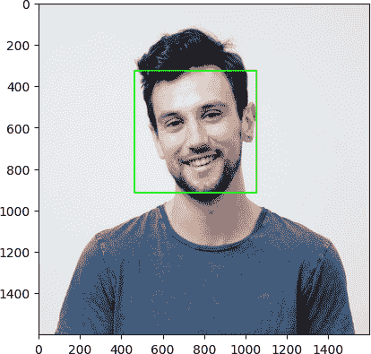

## 讨论

*Haar 级联分类器*是用于学习一组图像特征（特别是 Haar 特征）的机器学习模型，这些特征可以用于检测图像中的对象。这些特征本身是简单的矩形特征，通过计算矩形区域之间的和的差异来确定。随后，应用梯度提升算法来学习最重要的特征，并最终使用级联分类器创建相对强大的模型。

虽然这个过程的详细信息超出了本书的范围，但值得注意的是，这些预训练模型可以轻松从诸如[OpenCV GitHub](https://oreil.ly/273DA)这样的地方下载为 XML 文件，并应用于图像，而无需自己训练模型。在你想要将简单的二进制图像特征（如`contains_face`或任何其他对象）添加到你的数据中的情况下，这非常有用。

## 参见

+   [OpenCV 教程：级联分类器](https://oreil.ly/dFhu6)

# 8.17 使用 Pytorch 对图像进行分类

## 问题

您希望使用 Pytorch 中预训练的深度学习模型对图像进行分类。

## 解决方案

使用`torchvision.models`选择一个预训练的图像分类模型，并将图像输入其中：

```py
# Load libraries
import cv2
import json
import numpy as np
import torch
from torchvision import transforms
from torchvision.models import resnet18
import urllib.request

# Get imagenet classes
with urllib.request.urlopen(
    "https://raw.githubusercontent.com/raghakot/keras-vis/master/resources/"
    ):
    imagenet_class_index = json.load(url)

# Instantiate pretrained model
model = resnet18(pretrained=True)

# Load image
image_bgr = cv2.imread("images/plane.jpg", cv2.IMREAD_COLOR)
image_rgb = cv2.cvtColor(image_bgr, cv2.COLOR_BGR2RGB)

# Convert to pytorch data type
convert_tensor = transforms.ToTensor()
pytorch_image = convert_tensor(np.array(image_rgb))

# Set model to evaluation mode
model.eval()

# Make a prediction
prediction = model(pytorch_image.unsqueeze(0))

# Get the index of the highest predicted probability
_, index = torch.max(prediction, 1)

# Convert that to a percentage value
percentage = torch.nn.functional.softmax(prediction, dim=1)[0] * 100

# Print the name of the item at the index along with the percent confidence
print(imagenet_class_index[str(index.tolist()[0])][1],
    percentage[index.tolist()[0]].item())
```

```py
airship 6.0569939613342285
```

## 讨论

许多预训练的深度学习模型用于图像分类，通过 PyTorch 和 TensorFlow 都很容易获取。在这个例子中，我们使用了 ResNet18，这是一个深度神经网络架构，它在 ImageNet 数据集上训练，深度为 18 层。在 PyTorch 中还有更深的 ResNet 模型，如 ResNet101 和 ResNet152，此外还有许多其他可供选择的图像模型。在 ImageNet 数据集上训练的模型能够为我们在之前代码片段中从 GitHub 下载的`imagenet_class_index`变量中定义的所有类别输出预测概率。

就像在 OpenCV 中的面部识别示例（参见 Recipe 8.16）一样，我们可以将预测的图像类别作为未来 ML 模型的下游特征，或者作为有用的元数据标签，为我们的图像添加更多信息。

## 参见

+   [PyTorch 文档：模型和预训练权重](https://oreil.ly/MhlxR)
