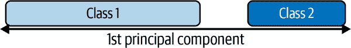

# 第九章：使用特征提取进行降维

# 9.0 介绍

通常情况下，我们可以接触到成千上万的特征。例如，在 第八章 中，我们将一个 256 × 256 像素的彩色图像转换成了 196,608 个特征。此外，因为每个像素可以取 256 个可能的值，我们的观察可以有 256¹⁹⁶⁶⁰⁸ 种不同的配置。许多机器学习算法在学习这样的数据时会遇到困难，因为收集足够的观察数据使算法能够正确运行是不现实的。即使在更结构化的表格数据集中，经过特征工程处理后，我们很容易就能得到数千个特征。

幸运的是，并非所有的特征都是相同的，*特征提取* 的目标是为了降低维度，将我们的特征集合 *p[original]* 转换成一个新的集合 *p[new]*，使得 *p[original] > p[new]*，同时保留大部分底层信息。换句话说，我们通过仅有少量数据丢失来减少特征数目，而数据仍能生成高质量的预测。在本章中，我们将涵盖多种特征提取技术来实现这一目标。

我们讨论的特征提取技术的一个缺点是，我们生成的新特征对人类来说是不可解释的。它们将具有与训练模型几乎相同的能力，但在人眼中看起来像是一组随机数。如果我们希望保留解释模型的能力，通过*特征选择*进行降维是更好的选择（将在 第十章 中讨论）。在特征选择期间，我们会移除我们认为不重要的特征，但保留其他特征。虽然这可能不像特征提取那样保留所有特征的信息，但它保留了我们不删除的特征——因此在分析过程中完全可解释。

# 9.1 使用主成分减少特征

## 问题

给定一组特征，你希望减少特征数目同时保留数据中的方差（重要信息）。

## 解决方案

使用 scikit 的 `PCA` 进行主成分分析：

```py
# Load libraries
from sklearn.preprocessing import StandardScaler
from sklearn.decomposition import PCA
from sklearn import datasets

# Load the data
digits = datasets.load_digits()

# Standardize the feature matrix
features = StandardScaler().fit_transform(digits.data)

# Create a PCA that will retain 99% of variance
pca = PCA(n_components=0.99, whiten=True)

# Conduct PCA
features_pca = pca.fit_transform(features)

# Show results
print("Original number of features:", features.shape[1])
print("Reduced number of features:", features_pca.shape[1])
```

```py
Original number of features: 64
Reduced number of features: 54
```

## 讨论

*主成分分析* (PCA) 是一种流行的线性降维技术。PCA 将观察结果投影到特征矩阵的（希望较少的）主成分上，这些主成分保留了数据中最多的*方差*，从实际上来说，我们保留了信息。PCA 是一种无监督技术，意味着它不使用目标向量的信息，而只考虑特征矩阵。

要了解 PCA 的工作原理的数学描述，请参阅本食谱末尾列出的外部资源。然而，我们可以使用一个简单的例子来理解 PCA 的直觉。在图 9-1 中，我们的数据包含两个特征，<math display="inline"><msub><mi>x</mi><mn>1</mn></msub></math>和<math display="inline"><msub><mi>x</mi><mn>2</mn></msub></math>。通过观察可视化结果，应该清楚地看到观察结果像雪茄一样散开，长度很长，高度很低。更具体地说，我们可以说“长度”的方差显著大于“高度”的方差。我们将“方向”中的最大方差称为第一主成分，“方向”中的第二大方差称为第二主成分（依此类推）。

如果我们想要减少特征，一个策略是将我们二维空间中的所有观察投影到一维主成分上。我们会丢失第二主成分中捕获的信息，但在某些情况下，这是可以接受的权衡。这就是 PCA。


###### 图 9-1\. PCA 的第一和第二主成分

PCA 在 scikit-learn 中是通过`PCA`类实现的。`n_components`有两个操作，取决于提供的参数。如果参数大于 1，`pca`将返回那么多特征。这引出了如何选择最优特征数量的问题。幸运的是，如果`n_components`的参数在 0 到 1 之间，`pca`将返回保留原始特征方差百分之多少的最小特征数。通常使用 0.95 和 0.99 的值，分别表示保留原始特征方差的 95%和 99%。`whiten=True`将每个主成分的值转换为具有零均值和单位方差。另一个参数和参数是`svd_solver="randomized"`，它实现了一种随机算法，通常能够在更短的时间内找到第一个主成分。

我们的解决方案的输出显示，PCA 使我们能够通过减少 10 个特征的维度，同时仍保留特征矩阵中 99%的信息（方差）。

## 参见

+   [scikit-learn 文档：PCA](https://oreil.ly/OT_gN)

+   [线性代数中的主成分分析，Jeff Jauregui](https://oreil.ly/Uns61)

# 9.2 在数据线性不可分时减少特征

## 问题

您怀疑您的数据是线性不可分的，并希望降低维度。

## 解决方案

使用使用核函数的主成分分析的扩展，以实现非线性降维：

```py
# Load libraries
from sklearn.decomposition import PCA, KernelPCA
from sklearn.datasets import make_circles

# Create linearly inseparable data
features, _ = make_circles(n_samples=1000, random_state=1, noise=0.1, factor=0.1)

# Apply kernel PCA with radius basis function (RBF) kernel
kpca = KernelPCA(kernel="rbf", gamma=15, n_components=1)
features_kpca = kpca.fit_transform(features)

print("Original number of features:", features.shape[1])
print("Reduced number of features:", features_kpca.shape[1])
```

```py
Original number of features: 2
Reduced number of features: 1
```

## 讨论

PCA 能够减少我们特征矩阵的维度（即特征数量）。标准 PCA 使用线性投影来减少特征。如果数据是*线性可分*的（即你可以在不同类别之间画一条直线或超平面），那么 PCA 效果很好。然而，如果你的数据不是线性可分的（即你只能使用曲线决策边界来分离类别），线性变换效果就不那么好了。在我们的解决方案中，我们使用了 scikit-learn 的`make_circles`来生成一个模拟数据集，其中包含两个类别和两个特征的目标向量。`make_circles`生成线性不可分的数据；具体来说，一个类别被另一个类别包围在所有方向上，如图 9-2 所示。


###### 图 9-2\. 线性不可分数据上投影的第一个主成分

如果我们使用线性 PCA 来降低数据维度，那么这两个类别将线性投影到第一个主成分上，使它们变得交织在一起，如图 9-3 所示。


###### 图 9-3\. 线性不可分数据的第一个主成分，没有核 PCA

理想情况下，我们希望进行一种转换，能够减少维度并使数据线性可分。核 PCA 可以做到这两点，如图 9-4 所示。



###### 图 9-4\. 带有核 PCA 的线性不可分数据的第一个主成分

核函数允许我们将线性不可分的数据投影到一个更高维度，使其线性可分；这被称为“核技巧”。如果你不理解核技巧的细节也不要担心；只需把核函数看作是投影数据的不同方法。在 scikit-learn 的`kernelPCA`类中，我们可以使用多种核，通过`kernel`参数指定。一个常用的核是高斯径向基函数核`rbf`，但其他选项包括多项式核（`poly`）和 sigmoid 核（`sigmoid`）。我们甚至可以指定一个线性投影（`linear`），它将产生与标准 PCA 相同的结果。

核 PCA 的一个缺点是我们需要指定一些参数。例如，在第 9.1 节中，我们将`n_components`设置为`0.99`，以便使`PCA`选择保留 99%方差的成分数量。在核 PCA 中我们没有这个选项。相反，我们必须定义成分的数量（例如`n_components=1`）。此外，核函数自带它们自己的超参数，我们需要设置；例如，径向基函数需要一个`gamma`值。

那么我们如何知道使用哪些值？通过试错。具体而言，我们可以多次训练我们的机器学习模型，每次使用不同的核函数或不同的参数值。一旦找到产生最高质量预测值组合的值，我们就完成了。这是机器学习中的一个常见主题，我们将在第十二章深入学习这一策略。

## 参见

+   [Kernel PCA 的 scikit-learn 文档](https://oreil.ly/SCAX-)

+   [通过 RBF Kernel PCA 进行核技巧和非线性降维](https://oreil.ly/ktm5Z)

# 9.3 通过最大化类别可分性来减少特征

## 问题

您希望通过最大化类别之间的分离来减少分类器使用的特征数量。

## 解决方案

尝试*线性判别分析*（LDA）将特征投影到最大化类别分离的组件轴上：

```py
# Load libraries
from sklearn import datasets
from sklearn.discriminant_analysis import LinearDiscriminantAnalysis

# Load Iris flower dataset:
iris = datasets.load_iris()
features = iris.data
target = iris.target

# Create and run an LDA, then use it to transform the features
lda = LinearDiscriminantAnalysis(n_components=1)
features_lda = lda.fit(features, target).transform(features)

# Print the number of features
print("Original number of features:", features.shape[1])
print("Reduced number of features:", features_lda.shape[1])
```

```py
Original number of features: 4
Reduced number of features: 1
```

我们可以使用`explained_variance_ratio_`来查看每个组件解释的方差量。在我们的解决方案中，单个组件解释了超过 99%的方差：

```py
lda.explained_variance_ratio_
```

```py
array([0.9912126])
```

## 讨论

LDA 是一个分类技术，也是一种流行的降维技术。LDA 的工作方式类似于 PCA，即将我们的特征空间投影到较低维空间上。然而，在 PCA 中，我们只对最大化数据方差的组件轴感兴趣，而在 LDA 中，我们还有额外的目标是最大化类别之间的差异。在图 9-5 中，我们有包含两个目标类别和两个特征的数据。如果我们将数据投影到 y 轴上，两个类别不容易分开（即它们重叠），而如果我们将数据投影到 x 轴上，我们将得到一个特征向量（即我们通过减少一个维度），它仍然保留了类别可分性。在现实世界中，当然，类别之间的关系会更复杂，维度会更高，但概念保持不变。


###### 图 9-5\. LDA 试图最大化我们类别之间的差异

在 scikit-learn 中，LDA 使用`LinearDiscriminantAnalysis`实现，其中包括一个参数`n_components`，表示我们希望返回的特征数量。要确定`n_components`参数值（例如，要保留多少个参数），我们可以利用`explained_variance_ratio_`告诉我们每个输出特征解释的方差，并且是一个排序数组。例如：

```py
lda.explained_variance_ratio_
```

```py
array([0.9912126])
```

具体地，我们可以运行`LinearDiscriminantAnalysis`，将`n_components`设置为`None`，返回每个组件特征解释的方差比率，然后计算需要多少个组件才能超过一定阈值的方差解释（通常是 0.95 或 0.99）：

```py
# Create and run LDA
lda = LinearDiscriminantAnalysis(n_components=None)
features_lda = lda.fit(features, target)

# Create array of explained variance ratios
lda_var_ratios = lda.explained_variance_ratio_

# Create function
def select_n_components(var_ratio, goal_var: float) -> int:
    # Set initial variance explained so far
    total_variance = 0.0

    # Set initial number of features
    n_components = 0

    # For the explained variance of each feature:
    for explained_variance in var_ratio:

        # Add the explained variance to the total
        total_variance += explained_variance

        # Add one to the number of components
        n_components += 1

        # If we reach our goal level of explained variance
        if total_variance >= goal_var:
            # End the loop
            break

    # Return the number of components
    return n_components

# Run function
select_n_components(lda_var_ratios, 0.95)
```

```py
1
```

## 参见

+   [LDA 和 PCA 在鸢尾花数据集的 2D 投影比较](https://oreil.ly/evGsx)

+   [线性判别分析](https://oreil.ly/uOB81)

# 9.4 使用矩阵分解减少特征

## 问题

您有一个非负值的特征矩阵，并希望降低其维度。

## 解决方案

使用*非负矩阵分解*（NMF）来降低特征矩阵的维度：

```py
# Load libraries
from sklearn.decomposition import NMF
from sklearn import datasets

# Load the data
digits = datasets.load_digits()

# Load feature matrix
features = digits.data

# Create, fit, and apply NMF
nmf = NMF(n_components=10, random_state=4)
features_nmf = nmf.fit_transform(features)

# Show results
print("Original number of features:", features.shape[1])
print("Reduced number of features:", features_nmf.shape[1])
```

```py
Original number of features: 64
Reduced number of features: 10
```

## 讨论

NMF 是一种用于线性降维的无监督技术，*分解*（即将原始矩阵分解为多个矩阵，其乘积近似原始矩阵）特征矩阵为表示观察和其特征之间潜在关系的矩阵。直观地说，NMF 可以降低维度，因为在矩阵乘法中，两个因子（相乘的矩阵）的维度可以显著少于乘积矩阵。正式地说，给定所需的返回特征数*r*，NMF 将分解我们的特征矩阵，使之：

<math display="block"><mrow><mi mathvariant="bold">V</mi> <mo>≈</mo> <mi mathvariant="bold">W</mi> <mi mathvariant="bold">H</mi></mrow></math>

这里，**V**是我们的*n × d*特征矩阵（即*d*个特征，*n*个观察值），**W**是一个*n* × *r*的矩阵，**H**是一个*r* × *d*的矩阵。通过调整*r*的值，我们可以设置所需的降维量。

NMF 的一个主要要求是，正如其名称所示，特征矩阵不能包含负值。此外，与我们已经研究过的 PCA 和其他技术不同，NMF 不提供输出特征的解释方差。因此，我们找到`n_components`的最佳值的最佳方式是尝试一系列值，找到在我们最终模型中产生最佳结果的值（见第十二章）。

## 参见

+   [非负矩阵分解，维基百科](https://oreil.ly/HJ_Qe)

# 9.5 在稀疏数据上减少特征

## 问题

您有一个稀疏的特征矩阵，并希望降低其维度。

## 解决方案

使用*截断奇异值分解*（TSVD）：

```py
# Load libraries
from sklearn.preprocessing import StandardScaler
from sklearn.decomposition import TruncatedSVD
from scipy.sparse import csr_matrix
from sklearn import datasets
import numpy as np

# Load the data
digits = datasets.load_digits()

# Standardize feature matrix
features = StandardScaler().fit_transform(digits.data)

# Make sparse matrix
features_sparse = csr_matrix(features)

# Create a TSVD
tsvd = TruncatedSVD(n_components=10)

# Conduct TSVD on sparse matrix
features_sparse_tsvd = tsvd.fit(features_sparse).transform(features_sparse)

# Show results
print("Original number of features:", features_sparse.shape[1])
print("Reduced number of features:", features_sparse_tsvd.shape[1])
```

```py
Original number of features: 64
Reduced number of features: 10
```

## 讨论

TSVD 与 PCA 类似，并且事实上，PCA 在其步骤中经常使用非截断的*奇异值分解*（SVD）。给定*d*个特征，SVD 将创建*d* × *d*的因子矩阵，而 TSVD 将返回*n* × *n*的因子，其中*n*是由参数预先指定的。TSVD 的实际优势在于，与 PCA 不同，它适用于稀疏特征矩阵。

TSVD 的一个问题是：由于它如何使用随机数生成器，输出的符号在拟合过程中可能会翻转。一个简单的解决方法是仅在预处理流水线中使用`fit`一次，然后多次使用`transform`。

与线性判别分析类似，我们必须指定要输出的特征（组件）的数量。这通过参数`n_components`来完成。一个自然的问题是：什么是最佳的组件数量？一种策略是将`n_components`作为超参数包含在模型选择中进行优化（即选择使模型训练效果最佳的`n_components`值）。另一种方法是因为 TSVD 提供了原始特征矩阵每个组件解释的方差比例，我们可以选择解释所需方差的组件数量（常见值为 95%和 99%）。例如，在我们的解决方案中，前三个输出的组件大约解释了原始数据约 30%的方差：

```py
# Sum of first three components' explained variance ratios
tsvd.explained_variance_ratio_[0:3].sum()
```

```py
0.3003938537287226
```

我们可以通过创建一个函数来自动化这个过程，该函数将`n_components`设置为原始特征数减一，然后计算解释原始数据所需方差量的组件数量：

```py
# Create and run a TSVD with one less than number of features
tsvd = TruncatedSVD(n_components=features_sparse.shape[1]-1)
features_tsvd = tsvd.fit(features)

# List of explained variances
tsvd_var_ratios = tsvd.explained_variance_ratio_

# Create a function
def select_n_components(var_ratio, goal_var):
    # Set initial variance explained so far
    total_variance = 0.0

    # Set initial number of features
    n_components = 0

    # For the explained variance of each feature:
    for explained_variance in var_ratio:

        # Add the explained variance to the total
        total_variance += explained_variance

        # Add one to the number of components
        n_components += 1

        # If we reach our goal level of explained variance
        if total_variance >= goal_var:
            # End the loop
            break

    # Return the number of components
    return n_components

# Run function
select_n_components(tsvd_var_ratios, 0.95)
```

```py
40
```

## 参见

+   [scikit-learn 文档：截断 SVD](https://oreil.ly/nD1pF)
