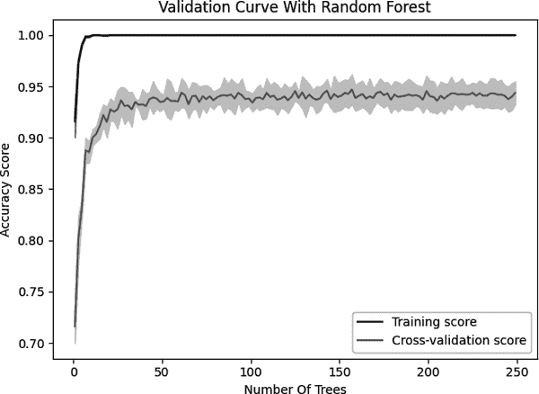

# 第十一章：模型评估

# 11.0 介绍

在本章中，我们将探讨评估通过我们的学习算法创建的模型质量的策略。在讨论如何创建它们之前讨论模型评估可能看起来很奇怪，但我们的疯狂之中有一种方法。模型的实用性取决于其预测的质量，因此，从根本上说，我们的目标不是创建模型（这很容易），而是创建高质量的模型（这很难）。因此，在探索多种学习算法之前，让我们首先了解如何评估它们产生的模型。

# 11.1 交叉验证模型

## 问题

您希望评估您的分类模型在未预料到的数据上的泛化能力。

## 解决方案

创建一个管道，对数据进行预处理，训练模型，然后使用交叉验证进行评估：

```py
# Load libraries
from sklearn import datasets
from sklearn import metrics
from sklearn.model_selection import KFold, cross_val_score
from sklearn.pipeline import make_pipeline
from sklearn.linear_model import LogisticRegression
from sklearn.preprocessing import StandardScaler

# Load digits dataset
digits = datasets.load_digits()

# Create features matrix
features = digits.data

# Create target vector
target = digits.target

# Create standardizer
standardizer = StandardScaler()

# Create logistic regression object
logit = LogisticRegression()

# Create a pipeline that standardizes, then runs logistic regression
pipeline = make_pipeline(standardizer, logit)

# Create k-fold cross-validation
kf = KFold(n_splits=5, shuffle=True, random_state=0)

# Conduct k-fold cross-validation
cv_results = cross_val_score(pipeline, # Pipeline
                             features, # Feature matrix
                             target, # Target vector
                             cv=kf, # Performance metric
                             scoring="accuracy", # Loss function
                             n_jobs=-1) # Use all CPU cores

# Calculate mean
cv_results.mean()
```

```py
0.969958217270195
```

## 讨论

乍一看，评估监督学习模型似乎很简单：训练一个模型，然后使用某种性能指标（准确率、平方误差等）计算其表现。然而，这种方法基本上是有缺陷的。如果我们使用我们的数据训练一个模型，然后评估它在该数据上的表现，我们并没有达到我们的预期目标。我们的目标不是评估模型在训练数据上的表现，而是评估它在从未见过的数据上的表现（例如新客户、新犯罪案件、新图像）。因此，我们的评估方法应该帮助我们理解模型在从未见过的数据上进行预测的能力有多好。

一种策略可能是留出一部分数据用于测试。这被称为*验证*（或*留出法*）。在验证中，我们的观察（特征和目标）被分成两个集合，传统上称为*训练集*和*测试集*。我们拿出测试集并将其放在一边，假装我们以前从未见过它。接下来，我们使用训练集训练我们的模型，使用特征和目标向量来教模型如何做出最佳预测。最后，我们通过评估模型在测试集上的表现来模拟从未见过的外部数据。然而，验证方法有两个主要弱点。首先，模型的性能可能高度依赖于被选择为测试集的少数观察结果。其次，模型不是在所有可用数据上进行训练，也没有在所有可用数据上进行评估。

克服这些弱点的更好策略被称为*k 折交叉验证*（KFCV）。在 KFCV 中，我们将数据分成*k*个部分，称为*折叠*。然后，模型使用*k-1*个折叠组成的一个训练集进行训练，然后最后一个折叠被用作测试集。我们重复这个过程*k*次，每次使用不同的折叠作为测试集。然后对每个*k*次迭代中模型的表现进行平均，以产生一个总体测量。

在我们的解决方案中，我们使用五折交叉验证并将评估分数输出到 `cv_results` 中：

```py
# View score for all 5 folds
cv_results
```

```py
array([0.96111111, 0.96388889, 0.98050139, 0.97214485, 0.97214485])
```

在使用 KFCV 时有三个重要的注意事项。首先，KFCV 假设每个观察结果都是独立生成的（即数据是独立同分布的[IID]）。如果数据是 IID 的，将观察结果随机分配到 fold 时进行洗牌是一个好主意。在 scikit-learn 中，我们可以设置 `shuffle=True` 来执行洗牌。

其次，在使用 KFCV 评估分类器时，通常有利于每个 fold 中大致包含来自不同目标类的观察结果的相同百分比（称为*分层 k 折*）。例如，如果我们的目标向量包含性别信息，并且观察结果中有 80% 是男性，那么每个 fold 将包含 80% 的男性和 20% 的女性观察结果。在 scikit-learn 中，我们可以通过将 `KFold` 类替换为 `StratifiedKFold` 来执行分层 k 折交叉验证。

最后，在使用验证集或交叉验证时，重要的是基于训练集预处理数据，然后将这些转换应用到训练集和测试集。例如，当我们对标准化对象 `standardizer` 进行 `fit` 操作时，我们仅计算训练集的均值和方差。然后，我们使用 `transform` 将该转换应用于训练集和测试集：

```py
# Import library
from sklearn.model_selection import train_test_split

# Create training and test sets
features_train, features_test, target_train, target_test = train_test_split(
    features, target, test_size=0.1, random_state=1)

# Fit standardizer to training set
standardizer.fit(features_train)

# Apply to both training and test sets which can then be used to train models
features_train_std = standardizer.transform(features_train)
features_test_std = standardizer.transform(features_test)
```

这样做的原因是因为我们假设测试集是未知数据。如果我们使用观察结果来同时拟合训练集和测试集的预处理器，测试集中的部分信息就会泄漏到训练集中。对于任何预处理步骤，如特征选择，都适用这一规则。

scikit-learn 的 `pipeline` 包使得在使用交叉验证技术时变得更加简单。我们首先创建一个管道来预处理数据（例如 `standardizer`），然后训练一个模型（逻辑回归，`logit`）：

```py
# Create a pipeline
pipeline = make_pipeline(standardizer, logit)
```

然后，我们使用该管道运行 KFCV，scikit 会为我们完成所有工作：

```py
# Do k-fold cross-validation
cv_results = cross_val_score(pipeline, # Pipeline
                             features, # Feature matrix
                             target, # Target vector
                             cv=kf, # Performance metric
                             scoring="accuracy", # Loss function
                             n_jobs=-1) # Use all CPU cores
```

`cross_val_score` 带有三个参数，我们还没有讨论过，但值得注意：

`cv`

`cv` 确定了我们的交叉验证技术。K 折是目前最常用的，但还有其他方法，例如留一法交叉验证，其中 fold 的数量 *k* 等于数据集中的数据点数量。

`scoring`

`scoring` 定义了成功的度量标准，本章的其他示例中讨论了其中一些。

`n_jobs=-1`

`n_jobs=-1` 告诉 scikit-learn 使用所有可用的核心。例如，如果您的计算机有四个核心（笔记本电脑上常见的数量），那么 scikit-learn 将同时使用所有四个核心来加速操作。

一个小提示：当运行其中一些示例时，您可能会看到一个警告，提示“ConvergenceWarning: lbfgs failed to converge.” 这些示例中使用的配置旨在防止这种情况发生，但如果仍然发生，您可以暂时忽略它。我们将在本书后面深入研究具体类型的模型时解决此类问题。

## 参见

+   [为什么每个统计学家都应该了解交叉验证](https://oreil.ly/vrGXy)

+   [交叉验证的错误应用](https://oreil.ly/NE-B8)

# 11.2 创建一个基线回归模型

## 问题

您想要一个简单的基线回归模型，以便与您训练的其他模型进行比较。

## 解决方案

使用 scikit-learn 的`DummyRegressor`创建一个简单的基线模型：

```py
# Load libraries
from sklearn.datasets import load_wine
from sklearn.dummy import DummyRegressor
from sklearn.model_selection import train_test_split

# Load data
wine = load_wine()

# Create features
features, target = wine.data, wine.target

# Make test and training split
features_train, features_test, target_train, target_test = train_test_split(
    features, target, random_state=0)

# Create a dummy regressor
dummy = DummyRegressor(strategy='mean')

# "Train" dummy regressor
dummy.fit(features_train, target_train)

# Get R-squared score
dummy.score(features_test, target_test)
```

```py
-0.0480213580840978
```

为了比较，我们训练我们的模型并评估性能分数：

```py
# Load library
from sklearn.linear_model import LinearRegression

# Train simple linear regression model
ols = LinearRegression()
ols.fit(features_train, target_train)

# Get R-squared score
ols.score(features_test, target_test)
```

```py
0.804353263176954
```

## 讨论

`DummyRegressor` 允许我们创建一个非常简单的模型，我们可以用作基线，以与我们训练的任何其他模型进行比较。这通常可以用来模拟产品或系统中的“天真”现有预测过程。例如，产品可能最初被硬编码为假设所有新用户在第一个月内都会花费 100 美元，而不考虑其特征。如果我们将这种假设编码到基线模型中，我们就能够通过比较虚拟模型的`score`与训练模型的分数来明确说明使用机器学习方法的好处。

`DummyRegressor` 使用`strategy`参数来设置预测方法，包括在训练集中使用平均值或中位数。此外，如果我们将`strategy`设置为`constant`并使用`constant`参数，我们可以设置虚拟回归器来预测每个观测的某个常数值：

```py
# Create dummy regressor that predicts 1s for everything
clf = DummyRegressor(strategy='constant', constant=1)
clf.fit(features_train, target_train)

# Evaluate score
clf.score(features_test, target_test)
```

```py
-0.06299212598425186
```

关于`score`的一个小注意事项。默认情况下，`score`返回确定系数（R-squared，<math display="inline"><msup><mi>R</mi> <mn>2</mn></msup></math>）得分：

<math display="block"><mrow><msup><mi>R</mi> <mn>2</mn></msup> <mo>=</mo> <mn>1</mn> <mo>-</mo> <mfrac><mrow><msub><mo>∑</mo> <mi>i</mi></msub> <msup><mrow><mo>(</mo><msub><mi>y</mi> <mi>i</mi></msub> <mo>-</mo><msub><mover accent="true"><mi>y</mi> <mo>^</mo></mover> <mi>i</mi></msub> <mo>)</mo></mrow> <mn>2</mn></msup></mrow> <mrow><msub><mo>∑</mo> <mi>i</mi></msub> <msup><mrow><mo>(</mo><msub><mi>y</mi> <mi>i</mi></msub> <mo>-</mo><mover accent="true"><mi>y</mi> <mo>¯</mo></mover><mo>)</mo></mrow> <mn>2</mn></msup></mrow></mfrac></mrow></math>

其中<math display="inline"><msub><mi>y</mi> <mi>i</mi></msub></math>是目标观测的真实值，<math display="inline"><msub><mover accent="true"><mi>y</mi><mo>^</mo></mover> <mi>i</mi></msub></math>是预测值，而<math display="inline"><mover accent="true"><mi>y</mi><mo>¯</mo></mover></math>是目标向量的平均值。

<math display="inline"><msup><mi>R</mi> <mn>2</mn></msup></math>越接近 1，目标向量中方差被特征解释的程度就越高。

# 11.3 创建一个基准分类模型

## 问题

您想要一个简单的基线分类器来与您的模型进行比较。

## 解决方案

使用 scikit-learn 的`DummyClassifier`：

```py
# Load libraries
from sklearn.datasets import load_iris
from sklearn.dummy import DummyClassifier
from sklearn.model_selection import train_test_split

# Load data
iris = load_iris()

# Create target vector and feature matrix
features, target = iris.data, iris.target

# Split into training and test set
features_train, features_test, target_train, target_test = train_test_split(
   features, target, random_state=0)

# Create dummy classifier
dummy = DummyClassifier(strategy='uniform', random_state=1)

# "Train" model
dummy.fit(features_train, target_train)

# Get accuracy score
dummy.score(features_test, target_test)
```

```py
0.42105263157894735
```

通过比较基线分类器和我们训练的分类器，我们可以看到改进：

```py
# Load library
from sklearn.ensemble import RandomForestClassifier

# Create classifier
classifier = RandomForestClassifier()

# Train model
classifier.fit(features_train, target_train)

# Get accuracy score
classifier.score(features_test, target_test)
```

```py
0.9736842105263158
```

## 讨论

一个分类器性能的常见测量是它比随机猜测好多少。scikit-learn 的`DummyClassifier`使得这种比较变得容易。`strategy`参数提供了多种生成值的选项。有两种特别有用的策略。首先，`stratified`按训练集目标向量的类比例生成预测（例如，如果训练数据中有 20%的观察结果是女性，则`DummyClassifier`将 20%的时间预测为女性）。其次，`uniform`将在不同类别之间以均匀随机方式生成预测。例如，如果观察结果中有 20%是女性，80%是男性，则`uniform`会生成 50%女性和 50%男性的预测。

## 参见

+   [scikit-learn 文档：DummyClassifier](https://oreil.ly/bwqQU)

# 11.4 评估二元分类器预测

## 问题

给定一个训练好的分类模型，你想评估其质量。

## 解决方案

使用 scikit-learn 的`cross_val_score`进行交叉验证，同时使用`scoring`参数来定义一系列性能指标，包括准确度、精确度、召回率和*F[1]*。*准确度*是一种常见的性能指标。它简单地表示预测正确的观察比例：

<math display="block"><mstyle displaystyle="true" scriptlevel="0"><mrow><mi>A</mi> <mi>c</mi> <mi>c</mi> <mi>u</mi> <mi>r</mi> <mi>a</mi> <mi>c</mi> <mi>y</mi> <mo>=</mo> <mfrac><mrow><mi>T</mi><mi>P</mi><mo>+</mo><mi>T</mi><mi>N</mi></mrow> <mrow><mi>T</mi><mi>P</mi><mo>+</mo><mi>T</mi><mi>N</mi><mo>+</mo><mi>F</mi><mi>P</mi><mo>+</mo><mi>F</mi><mi>N</mi></mrow></mfrac></mrow></mstyle></math>

其中：

<math display="inline"><mi>T</mi><mi>P</mi></math>

真阳性数量。这些是属于*阳性*类别（患病、购买产品等）并且我们预测正确的观察结果。

<math display="inline"><mi>T</mi><mi>N</mi></math>

真阴性数量。这些是属于*阴性*类别（未患病、未购买产品等）并且我们预测正确的观察结果。

<math display="inline"><mi>F</mi><mi>P</mi></math>

假阳性数量，也称为*I 型错误*。这些是被预测为*阳性*类别但实际上属于*阴性*类别的观察结果。

<math display="inline"><mi>F</mi><mi>N</mi></math>

假阴性数量，也称为*II 型错误*。这些是被预测为*阴性*类别但实际上属于*阳性*类别的观察结果。

我们可以通过设置`scoring="accuracy"`来在三折（默认折数）交叉验证中测量准确度：

```py
# Load libraries
from sklearn.model_selection import cross_val_score
from sklearn.linear_model import LogisticRegression
from sklearn.datasets import make_classification

# Generate features matrix and target vector
X, y = make_classification(n_samples = 10000,
                           n_features = 3,
                           n_informative = 3,
                           n_redundant = 0,
                           n_classes = 2,
                           random_state = 1)

# Create logistic regression
logit = LogisticRegression()

# Cross-validate model using accuracy
cross_val_score(logit, X, y, scoring="accuracy")
```

```py
array([0.9555, 0.95  , 0.9585, 0.9555, 0.956 ])
```

准确率的吸引力在于它有一个直观和简单的英文解释：被正确预测的观测的比例。然而，在现实世界中，通常我们的数据有不平衡的类别（例如，99.9%的观测属于类别 1，只有 0.1%属于类别 2）。当面对不平衡的类别时，准确率会遇到一个悖论，即模型准确率很高，但缺乏预测能力。例如，想象我们试图预测一个在人群中发生率为 0.1%的非常罕见的癌症的存在。在训练完我们的模型后，我们发现准确率为 95%。然而，99.9%的人没有这种癌症：如果我们简单地创建一个“预测”没有人有这种癌症的模型，我们的天真模型将更准确，但显然它不能*预测*任何事情。因此，我们常常有动机使用其他指标，如精确度、召回率和*F[1]*分数。

*精确度*是每个被预测为正类的观测中实际为正类的比例。我们可以将其看作是我们预测中的噪声测量——也就是说，我们在预测某事是正的时候有多大可能是对的。精确度高的模型是悲观的，因为他们仅在非常肯定的情况下预测某个观测属于正类。形式上，精确度是：

<math display="block"><mstyle displaystyle="true" scriptlevel="0"><mrow><mi fontstyle="italic">Precision</mi> <mo>=</mo> <mfrac><mrow><mi>T</mi><mi>P</mi></mrow> <mrow><mi>T</mi><mi>P</mi><mo>+</mo><mi>F</mi><mi>P</mi></mrow></mfrac></mrow></mstyle></math>

```py
# Cross-validate model using precision
cross_val_score(logit, X, y, scoring="precision")
```

```py
array([0.95963673, 0.94820717, 0.9635996 , 0.96149949, 0.96060606])
```

*召回率*是每个真正正例中被正确预测的比例。召回率衡量了模型识别正类观测的能力。召回率高的模型是乐观的，因为他们在预测某个观测属于正类时的门槛很低：

<math display="block"><mstyle displaystyle="true" scriptlevel="0"><mrow><mi fontstyle="italic">Recall</mi> <mo>=</mo> <mfrac><mrow><mi>T</mi><mi>P</mi></mrow> <mrow><mi>T</mi><mi>P</mi><mo>+</mo><mi>F</mi><mi>N</mi></mrow></mfrac></mrow></mstyle></math>

```py
# Cross-validate model using recall
cross_val_score(logit, X, y, scoring="recall")
```

```py
array([0.951, 0.952, 0.953, 0.949, 0.951])
```

如果这是你第一次遇到精确度和召回率，如果需要一些时间才能完全理解它们，那是可以理解的。这是准确率的一个缺点；精确度和召回率不太直观。几乎总是我们希望在精确度和召回率之间达到某种平衡，而这种角色由*F[1]*分数扮演。*F[1]*分数是*调和平均数*（一种用于比率的平均数）：

<math display="block"><mstyle displaystyle="true" scriptlevel="0"><mrow><msub><mi>F</mi> <mn fontstyle="italic">1</mn></msub> <mo>=</mo> <mn>2</mn> <mo>×</mo> <mfrac><mrow><mi fontstyle="italic">Precision</mi> <mo>×</mo> <mi fontstyle="italic">Recall</mi></mrow> <mrow><mi fontstyle="italic">Precision</mi> <mo>+</mo> <mi fontstyle="italic">Recall</mi></mrow></mfrac></mrow></mstyle></math>

这个分数是正预测中实现的正确性的一种度量——也就是说，标记为正的观测中有多少实际上是正的：

```py
# Cross-validate model using F1
cross_val_score(logit, X, y, scoring="f1")
```

```py
array([0.95529884, 0.9500998 , 0.95827049, 0.95520886, 0.95577889])
```

## 讨论

作为评估指标，准确率具有一些有价值的特性，特别是它的直观性。然而，更好的指标通常涉及使用一定平衡的精确度和召回率——也就是说，我们模型的乐观和悲观之间存在一种权衡。*F[1]*代表着召回率和精确度之间的平衡，其中两者的相对贡献是相等的。

作为使用`cross_val_score`的替代方案，如果我们已经有了真实的 y 值和预测的 y 值，我们可以直接计算准确率和召回率等指标：

```py
# Load libraries
from sklearn.model_selection import train_test_split
from sklearn.metrics import accuracy_score

# Create training and test split
X_train, X_test, y_train, y_test = train_test_split(X,
                                                    y,
                                                    test_size=0.1,
                                                    random_state=1)

# Predict values for training target vector
y_hat = logit.fit(X_train, y_train).predict(X_test)

# Calculate accuracy
accuracy_score(y_test, y_hat)
```

```py
0.947
```

## 参见

+   [准确率悖论，维基百科](https://oreil.ly/vjgZ-) 

# 11.5 评估二元分类器阈值

## 问题

你想评估一个二元分类器和各种概率阈值。

## 解决方案

使用*接收者操作特征曲线*（ROC 曲线）来评估二元分类器的质量。在 scikit-learn 中，我们可以使用`roc_curve`来计算每个阈值下的真正例和假正例，然后绘制它们：

```py
# Load libraries
import matplotlib.pyplot as plt
from sklearn.datasets import make_classification
from sklearn.linear_model import LogisticRegression
from sklearn.metrics import roc_curve, roc_auc_score
from sklearn.model_selection import train_test_split

# Create feature matrix and target vector
features, target = make_classification(n_samples=10000,
                                       n_features=10,
                                       n_classes=2,
                                       n_informative=3,
                                       random_state=3)

# Split into training and test sets
features_train, features_test, target_train, target_test = train_test_split(
    features, target, test_size=0.1, random_state=1)

# Create classifier
logit = LogisticRegression()

# Train model
logit.fit(features_train, target_train)

# Get predicted probabilities
target_probabilities = logit.predict_proba(features_test)[:,1]

# Create true and false positive rates
false_positive_rate, true_positive_rate, threshold = roc_curve(
  target_test,
  target_probabilities
)

# Plot ROC curve
plt.title("Receiver Operating Characteristic")
plt.plot(false_positive_rate, true_positive_rate)
plt.plot([0, 1], ls="--")
plt.plot([0, 0], [1, 0] , c=".7"), plt.plot([1, 1] , c=".7")
plt.ylabel("True Positive Rate")
plt.xlabel("False Positive Rate")
plt.show()
```


## 讨论

接收者操作特征曲线是评估二元分类器质量的常见方法。ROC 在每个概率阈值（即观测被预测为一类的概率）下比较真正例和假正例的存在。通过绘制 ROC 曲线，我们可以看到模型的表现。一个完全正确预测每个观测的分类器将看起来像前一图中 ROC 输出的实线浅灰色线，立即向顶部直线上升。预测随机的分类器将出现为对角线。模型越好，它距实线越接近。

到目前为止，我们只根据它们预测的值来检查模型。然而，在许多学习算法中，这些预测的值是基于概率估计的。也就是说，每个观测都被赋予属于每个类别的显式概率。在我们的解决方案中，我们可以使用`predict_proba`来查看第一个观测的预测概率：

```py
# Get predicted probabilities
logit.predict_proba(features_test)[0:1]
```

```py
array([[0.86891533, 0.13108467]])
```

我们可以使用`classes_`来查看类别：

```py
logit.classes_
```

```py
array([0, 1])
```

在这个例子中，第一个观测有约 87%的概率属于负类（`0`），13%的概率属于正类（`1`）。默认情况下，scikit-learn 预测如果概率大于 0.5，则观测属于正类（称为*阈值*）。然而，我们经常希望明确地偏置我们的模型以使用不同的阈值出于实质性原因，而不是中间地带。例如，如果一个假阳性对我们的公司造成很高的成本，我们可能更喜欢一个概率阈值较高的模型。我们未能预测一些正例，但当观测被预测为正例时，我们可以非常确信预测是正确的。这种权衡体现在*真正例率*（TPR）和*假正例率*（FPR）中。TPR 是正确预测为真的观测数除以所有真正的正例观测数：

<math display="block"><mrow><mtext>TPR</mtext> <mo>=</mo> <mfrac><mrow><mtext>TP</mtext></mrow> <mrow><mtext>TP</mtext><mo>+</mo><mtext>FN</mtext></mrow></mfrac></mrow></math>

FPR 是错误预测的正例数除以所有真负例观测数：

<math display="block"><mrow><mtext>FPR</mtext> <mo>=</mo> <mfrac><mrow><mtext>FP</mtext></mrow> <mrow><mtext>FP</mtext><mo>+</mo><mtext>TN</mtext></mrow></mfrac></mrow></math>

ROC 曲线代表每个概率阈值下的相应 TPR 和 FPR。例如，在我们的解决方案中，大约 0.50 的阈值具有约 0.83 的 TPR 和约 0.16 的 FPR：

```py
print("Threshold:", threshold[124])
print("True Positive Rate:", true_positive_rate[124])
print("False Positive Rate:", false_positive_rate[124])
```

```py
Threshold: 0.5008252732632008
True Positive Rate: 0.8346938775510204
False Positive Rate: 0.1607843137254902
```

然而，如果我们将阈值提高到约 80%（即，在模型预测观测为正类之前，增加其必须确定的程度），TPR 显著下降，但 FPR 也是如此：

```py
print("Threshold:", threshold[49])
print("True Positive Rate:", true_positive_rate[49])
print("False Positive Rate:", false_positive_rate[49])
```

```py
Threshold: 0.8058575028551827
True Positive Rate: 0.5653061224489796
False Positive Rate: 0.052941176470588235
```

这是因为我们对预测为正类有更高要求，导致模型未能识别出一些正例（较低的 TPR），但也减少了负面观测被预测为正面的噪声（较低的 FPR）。

除了能够可视化 TPR 和 FPR 之间的权衡之外，ROC 曲线还可以用作模型的一般度量。模型越好，曲线越高，因此曲线下面积也越大。因此，通常计算 ROC 曲线下面积（AUC ROC）来判断模型在所有可能阈值下的总体质量。AUC ROC 越接近 1，模型越好。在 scikit-learn 中，我们可以使用`roc_auc_score`来计算 AUC ROC：

```py
# Calculate area under curve
roc_auc_score(target_test, target_probabilities)
```

```py
0.9073389355742297
```

## 参见

+   [Python 和 R 中的 ROC 曲线](https://oreil.ly/0qcpZ)

+   [ROC 曲线下面积](https://oreil.ly/re7sT)

# 11.6 评估多类分类器预测

## 问题

您有一个预测三个或更多类别的模型，并希望评估模型的性能。

## 解决方案

使用能够处理两个以上类别的评估指标进行交叉验证：

```py
# Load libraries
from sklearn.model_selection import cross_val_score
from sklearn.linear_model import LogisticRegression
from sklearn.datasets import make_classification

# Generate features matrix and target vector
features, target = make_classification(n_samples = 10000,
                           n_features = 3,
                           n_informative = 3,
                           n_redundant = 0,
                           n_classes = 3,
                           random_state = 1)

# Create logistic regression
logit = LogisticRegression()

# Cross-validate model using accuracy
cross_val_score(logit, features, target, scoring='accuracy')
```

```py
array([0.841 , 0.829 , 0.8265, 0.8155, 0.82  ])
```

## 讨论

当我们有均衡的类别（即目标向量中每个类别的观测值数量大致相等）时，准确率就像在二分类设置中一样，是一种简单且可解释的评估指标选择。准确率是正确预测数量除以观测数量，无论是在多分类还是二分类设置中都同样有效。然而，当我们有不平衡的类别（这是一个常见情况）时，我们应该倾向于使用其他评估指标。

许多 scikit-learn 内置的度量是用于评估二元分类器的。然而，许多这些度量可以扩展用于当我们有两个以上类别时的情况。精确率、召回率和*F[1]*分数是我们在之前的配方中已经详细介绍过的有用度量。虽然它们都是最初设计用于二元分类器的，但我们可以将它们应用于多类别设置，通过将我们的数据视为一组二元类别来处理。这样做使我们能够将度量应用于每个类别，就好像它是数据中唯一的类别一样，然后通过对所有类别的评估分数进行平均来聚合它们：

```py
# Cross-validate model using macro averaged F1 score
cross_val_score(logit, features, target, scoring='f1_macro')
```

```py
array([0.84061272, 0.82895312, 0.82625661, 0.81515121, 0.81992692])
```

这段代码中，`macro` 指的是用于计算类别评估分数平均值的方法。选项包括`macro`、`weighted`和`micro`：

`macro`

计算每个类别的度量分数的均值，每个类别的权重相等。

`weighted`

计算每个类别的度量分数的均值，权重为数据中每个类别的大小。

`micro`

计算每个观测-类别组合的度量分数的均值。

# 11.7 可视化分类器的性能

## 问题

给定测试数据的预测类别和真实类别，您希望直观比较模型的质量。

## 解决方案

使用*混淆矩阵*，比较预测类别和真实类别：

```py
# Load libraries
import matplotlib.pyplot as plt
import seaborn as sns
from sklearn import datasets
from sklearn.linear_model import LogisticRegression
from sklearn.model_selection import train_test_split
from sklearn.metrics import confusion_matrix
import pandas as pd

# Load data
iris = datasets.load_iris()

# Create features matrix
features = iris.data

# Create target vector
target = iris.target

# Create list of target class names
class_names = iris.target_names

# Create training and test set
features_train, features_test, target_train, target_test = train_test_split(
    features, target, random_state=2)

# Create logistic regression
classifier = LogisticRegression()

# Train model and make predictions
target_predicted = classifier.fit(features_train,
    target_train).predict(features_test)

# Create confusion matrix
matrix = confusion_matrix(target_test, target_predicted)

# Create pandas dataframe
dataframe = pd.DataFrame(matrix, index=class_names, columns=class_names)

# Create heatmap
sns.heatmap(dataframe, annot=True, cbar=None, cmap="Blues")
plt.title("Confusion Matrix"), plt.tight_layout()
plt.ylabel("True Class"), plt.xlabel("Predicted Class")
plt.show()
```


## 讨论

混淆矩阵是分类器性能的一种简单有效的可视化方式。混淆矩阵的主要优势之一是它们的可解释性。矩阵的每一列（通常可视化为热图）代表预测类别，而每一行显示真实类别。结果是每个单元格都是预测和真实类别的一种可能组合。这可能最好通过一个例子来解释。在解决方案中，左上角的单元格是预测为*Iris setosa*（由列表示）的观察数量，它们实际上是*Iris setosa*（由行表示）。这意味着模型准确地预测了所有*Iris setosa*的花。然而，该模型在预测*Iris virginica*时并不那么成功。右下角的单元格表示模型成功预测了十一个观察结果为*Iris virginica*，但（向上查看一个单元格）预测了一个实际上是*Iris versicolor*的花为*virginica*。

关于混淆矩阵有三点值得注意。首先，一个完美的模型会在对角线上有数值，其他地方都是零。一个糟糕的模型会使观察计数均匀地分布在单元格周围。其次，混淆矩阵让我们不仅能看到模型错在哪里，还能看到它错在哪里。也就是说，我们可以看到误分类的模式。例如，我们的模型很容易区分*Iris virginica*和*Iris setosa*，但在分类*Iris virginica*和*Iris versicolor*时稍微困难一些。最后，混淆矩阵适用于任意数量的类别（尽管如果目标向量中有一百万个类别，混淆矩阵的可视化可能会难以阅读）。

## 参见

+   [混淆矩阵，维基百科](https://oreil.ly/tDWPB)

+   [scikit-learn 文档：混淆矩阵](https://oreil.ly/fdsTg)

# 11.8 评估回归模型

## 问题

您想要评估回归模型的性能。

## 解决方案

使用 *均方误差*（MSE）：

```py
# Load libraries
from sklearn.datasets import make_regression
from sklearn.model_selection import cross_val_score
from sklearn.linear_model import LinearRegression

# Generate features matrix, target vector
features, target = make_regression(n_samples = 100,
                                   n_features = 3,
                                   n_informative = 3,
                                   n_targets = 1,
                                   noise = 50,
                                   coef = False,
                                   random_state = 1)

# Create a linear regression object
ols = LinearRegression()

# Cross-validate the linear regression using (negative) MSE
cross_val_score(ols, features, target, scoring='neg_mean_squared_error')
```

```py
array([-1974.65337976, -2004.54137625, -3935.19355723, -1060.04361386,
       -1598.74104702])
```

另一个常见的回归指标是确定系数，*R²*：

```py
# Cross-validate the linear regression using R-squared
cross_val_score(ols, features, target, scoring='r2')
```

```py
array([0.8622399 , 0.85838075, 0.74723548, 0.91354743, 0.84469331])
```

## 讨论

MSE 是回归模型中最常见的评估指标之一。形式上，MSE 是：

<math display="block"><mrow><mo form="prefix">MSE</mo> <mo>=</mo> <mfrac><mn>1</mn> <mi>n</mi></mfrac> <munderover><mo>∑</mo> <mrow><mrow><mi>i</mi><mo>=</mo><mn>1</mn></mrow></mrow> <mi>n</mi></munderover> <msup><mrow><mo>(</mo><msub><mover accent="true"><mi>y</mi> <mo>^</mo></mover><mi>i</mi></msub><mo>-</mo><msub><mi>y</mi> <mi>i</mi></msub> <mo>)</mo></mrow> <mn>2</mn></msup></mrow></math>

其中 <math display="inline"><mi>n</mi></math> 是观察次数，<math display="inline"><msub><mi>y</mi><mi>i</mi></msub></math> 是我们试图预测的目标的真实值，对于观察 <math display="inline"><mi>i</mi></math>，<math display="inline"><msub><mover accent="true"><mi>y</mi> <mo>^</mo></mover><mi>i</mi></msub></math> 是模型对 <math display="inline"><msub><mi>y</mi><mi>i</mi></msub></math> 的预测值。均方误差（MSE）是所有预测值与真实值之间距离的平方和的度量。MSE 值越高，总体平方误差越大，因此模型越糟糕。平方误差项的数学优势包括强制所有误差值为正，但一个常常未被意识到的影响是，平方会比许多小误差更严厉地惩罚少量大误差，即使这些误差的绝对值相同。例如，想象两个模型，A 和 B，每个模型有两个观察：

+   模型 A 的误差为 0 和 10，因此其 MSE 为 *0² + 10² = 100*。

+   模型 B 每个误差为 5，因此其 MSE 为 *5² + 5² = 50*。

两个模型的总误差都是 10；然而，MSE 认为模型 A（MSE = 100）比模型 B（MSE = 50）更差。在实践中，这种影响很少成问题（实际上理论上有益），并且 MSE 作为评估指标运行得非常好。

一个重要的注释：在 scikit-learn 中，默认情况下，`scoring` 参数假定更高的值优于较低的值。然而，对于 MSE，情况并非如此，较高的值意味着模型较差。因此，scikit-learn 使用 `neg_mean_squared_error` 参数来观察 *负* MSE。

一种常见的替代回归评估指标是我们在 Recipe 11.2 中使用的默认指标 <math display="inline"><msup><mi>R</mi><mn>2</mn></msup></math>，它衡量模型解释的目标向量方差量。

<math display="block"><mrow><msup><mi>R</mi> <mn>2</mn></msup> <mo>=</mo> <mn>1</mn> <mo>-</mo> <mfrac><mrow><msubsup><mo>∑</mo> <mrow><mi>i</mi><mo>=</mo><mn>1</mn></mrow> <mi>n</mi></msubsup> <msup><mrow><mo>(</mo><msub><mi>y</mi> <mi>i</mi></msub> <mo>-</mo><msub><mover accent="true"><mi>y</mi> <mo>^</mo></mover> <mi>i</mi></msub> <mo>)</mo></mrow> <mn>2</mn></msup></mrow> <mrow><msubsup><mo>∑</mo> <mrow><mi>i</mi><mo>=</mo><mn>1</mn></mrow> <mi>n</mi></msubsup> <msup><mrow><mo>(</mo><msub><mi>y</mi> <mi>i</mi></msub> <mo>-</mo><mover accent="true"><mi>y</mi> <mo>¯</mo></mover><mo>)</mo></mrow> <mn>2</mn></msup></mrow></mfrac></mrow></math>

其中 <math display="inline"><msub><mi>y</mi> <mi>i</mi></msub></math> 是第 *i* 个观察的真实目标值，<math display="inline"><msub><mover accent="true"><mi>y</mi><mo>^</mo></mover> <mi>i</mi></msub></math> 是第 *i* 个观察的预测值，<math display="inline"><mover accent="true"><mi>y</mi> <mo>¯</mo></mover></math> 是目标向量的均值。当 <math display="inline"><msup><mi>R</mi><mn>2</mn></msup></math> 接近 1.0 时，模型越好。

## 参见

+   [均方误差，维基百科](https://oreil.ly/MWDlR)

+   [决定系数，维基百科](https://oreil.ly/lKKWk)

# 11.9 评估聚类模型

## 问题

您已经使用了无监督学习算法来对数据进行聚类。现在您想知道它的表现如何。

## 解决方案

使用 *轮廓系数* 来衡量聚类的质量（请注意，这不是衡量预测性能的指标）：

```py
# Load libraries
import numpy as np
from sklearn.metrics import silhouette_score
from sklearn import datasets
from sklearn.cluster import KMeans
from sklearn.datasets import make_blobs

# Generate features matrix
features, _ = make_blobs(n_samples = 1000,
                         n_features = 10,
                         centers = 2,
                         cluster_std = 0.5,
                         shuffle = True,
                         random_state = 1)

# Cluster data using k-means to predict classes
model = KMeans(n_clusters=2, random_state=1).fit(features)

# Get predicted classes
target_predicted = model.labels_

# Evaluate model
silhouette_score(features, target_predicted)
```

```py
0.8916265564072141
```

## 讨论

*监督模型评估*比较预测（例如类别或定量值）与目标向量中对应的真实值。然而，使用聚类方法的最常见动机是你的数据没有目标向量。许多聚类评估指标需要一个目标向量，但是当你有一个可用的目标向量时，再次使用聚类这样的无监督学习方法可能会不必要地束手无策。

如果我们没有目标向量，我们无法评估预测与真实值之间的情况，但是我们可以评估簇本身的特性。直观地，我们可以想象“好”的簇在同一簇内的观察之间有非常小的距离（即密集的簇），而在不同簇之间有很大的距离（即分离良好的簇）。轮廓系数提供了一个单一值，同时衡量了这两个特性。形式上，第*i*个观察的轮廓系数为：

<math display="block"><mrow><msub><mi>s</mi> <mi>i</mi></msub> <mo>=</mo> <mfrac><mrow><msub><mi>b</mi> <mi>i</mi></msub> <mo>-</mo><msub><mi>a</mi> <mi>i</mi></msub></mrow> <mrow><mtext>max</mtext><mo>(</mo><msub><mi>a</mi> <mi>i</mi></msub> <mo>,</mo><msub><mi>b</mi> <mi>i</mi></msub> <mo>)</mo></mrow></mfrac></mrow></math>

其中<math display="inline"><msub><mi>s</mi><mi>i</mi></msub></math>是观察的轮廓系数，<math display="inline"><msub><mi>a</mi><mi>i</mi></msub></math>是<math display="inline"><mi>i</mi></math>与同一类别所有观察之间的平均距离，<math display="inline"><msub><mi>b</mi><mi>i</mi></msub></math>是<math display="inline"><mi>i</mi></math>与不同类别最接近的簇中所有观察之间的平均距离。`silhouette_score`返回的值是所有观察的平均轮廓系数。轮廓系数的范围在-1 到 1 之间，1 表示密集且分离良好的簇。

## 参见

+   [scikit-learn 文档：silhouette_score](https://oreil.ly/gGjQj)

# 11.10 创建自定义评估度量

## 问题

您希望使用您创建的度量来评估一个模型。

## 解决方案

创建度量作为一个函数，并使用 scikit-learn 的`make_scorer`将其转换为评分器函数：

```py
# Load libraries
from sklearn.metrics import make_scorer, r2_score
from sklearn.model_selection import train_test_split
from sklearn.linear_model import Ridge
from sklearn.datasets import make_regression

# Generate features matrix and target vector
features, target = make_regression(n_samples = 100,
                                   n_features = 3,
                                   random_state = 1)

# Create training set and test set
features_train, features_test, target_train, target_test = train_test_split(
     features, target, test_size=0.10, random_state=1)

# Create custom metric
def custom_metric(target_test, target_predicted):
    # Calculate R-squared score
    r2 = r2_score(target_test, target_predicted)
    # Return R-squared score
    return r2

# Make scorer and define that higher scores are better
score = make_scorer(custom_metric, greater_is_better=True)

# Create ridge regression object
classifier = Ridge()

# Train ridge regression model
model = classifier.fit(features_train, target_train)

# Apply custom scorer
score(model, features_test, target_test)
```

```py
0.9997906102882058
```

## 讨论

虽然 scikit-learn 有许多内置的度量指标来评估模型性能，但通常定义我们自己的度量也很有用。scikit-learn 通过使用`make_scorer`使这变得简单。首先，我们定义一个接受两个参数（真实目标向量和我们的预测值）并输出某个分数的函数。其次，我们使用`make_scorer`创建一个评分器对象，确保指定高或低分数是可取的（使用`greater_is_better`参数）。

在解决方案中，自定义度量(`custom_metric`)只是一个玩具示例，因为它简单地包装了一个用于计算*R²*分数的内置度量。在实际情况中，我们将用我们想要的任何自定义度量替换`custom_metric`函数。然而，我们可以通过将结果与 scikit-learn 的`r2_score`内置方法进行比较，看到计算*R²*的自定义度量确实有效：

```py
# Predict values
target_predicted = model.predict(features_test)

# Calculate R-squared score
r2_score(target_test, target_predicted)
```

```py
0.9997906102882058
```

## 参见

+   [scikit-learn 文档：make_scorer](https://oreil.ly/-RqFY)

# 11.11 可视化训练集大小的效果

## 问题

你想要评估训练集中观测数量对某些指标（准确率、*F[1]* 等）的影响。

## 解决方案

绘制准确性与训练集大小的图表：

```py
# Load libraries
import numpy as np
import matplotlib.pyplot as plt
from sklearn.ensemble import RandomForestClassifier
from sklearn.datasets import load_digits
from sklearn.model_selection import learning_curve

# Load data
digits = load_digits()

# Create feature matrix and target vector
features, target = digits.data, digits.target

# Create CV training and test scores for various training set sizes
train_sizes, train_scores, test_scores = learning_curve(# Classifier
                                                        RandomForestClassifier(),
                                                        # Feature matrix
                                                        features,
                                                        # Target vector
                                                        target,
                                                        # Number of folds
                                                        cv=10,
                                                        # Performance metric
                                                        scoring='accuracy',
                                                        # Use all computer cores
                                                        n_jobs=-1,
                                                        # Sizes of 50
                                                        # Training set
                                                       train_sizes=np.linspace(
                                                       0.01,
                                                       1.0,
                                                       50))

# Create means and standard deviations of training set scores
train_mean = np.mean(train_scores, axis=1)
train_std = np.std(train_scores, axis=1)

# Create means and standard deviations of test set scores
test_mean = np.mean(test_scores, axis=1)
test_std = np.std(test_scores, axis=1)

# Draw lines
plt.plot(train_sizes, train_mean, '--', color="#111111",  label="Training score")
plt.plot(train_sizes, test_mean, color="#111111", label="Cross-validation score")

# Draw bands
plt.fill_between(train_sizes, train_mean - train_std,
                 train_mean + train_std, color="#DDDDDD")
plt.fill_between(train_sizes, test_mean - test_std,
                 test_mean + test_std, color="#DDDDDD")

# Create plot
plt.title("Learning Curve")
plt.xlabel("Training Set Size"), plt.ylabel("Accuracy Score"),
plt.legend(loc="best")
plt.tight_layout()
plt.show()
```


## 讨论

*学习曲线* 可视化模型在训练集和交叉验证中随着训练集观测数量增加而表现的性能（例如准确率、召回率）。它们通常用于确定我们的学习算法是否会从收集额外的训练数据中受益。

在我们的解决方案中，我们绘制了随机森林分类器在 50 个不同训练集大小上的准确性，范围从观测数据的 1%到 100%。交叉验证模型的逐渐增加的准确性得分告诉我们，我们可能会从额外的观测中受益（尽管在实践中这可能并不可行）。

## 参见

+   [scikit-learn 文档：学习曲线](https://oreil.ly/jAKwy)

# 11.12 创建评估指标的文本报告

## 问题

你想要一个分类器性能的快速描述。

## 解决方案

使用 scikit-learn 的 `classification_report`：

```py
# Load libraries
from sklearn import datasets
from sklearn.linear_model import LogisticRegression
from sklearn.model_selection import train_test_split
from sklearn.metrics import classification_report

# Load data
iris = datasets.load_iris()

# Create features matrix
features = iris.data

# Create target vector
target = iris.target

# Create list of target class names
class_names = iris.target_names

# Create training and test set
features_train, features_test, target_train, target_test = train_test_split(
    features, target, random_state=0)

# Create logistic regression
classifier = LogisticRegression()

# Train model and make predictions
model = classifier.fit(features_train, target_train)
target_predicted = model.predict(features_test)

# Create a classification report
print(classification_report(target_test,
                            target_predicted,
                            target_names=class_names))
```

```py
              precision    recall  f1-score   support

      setosa       1.00      1.00      1.00        16
  versicolor       1.00      0.91      0.95        11
   virginica       0.92      1.00      0.96        11

    accuracy                           0.97        38
   macro avg       0.97      0.97      0.97        38
weighted avg       0.98      0.97      0.97        38
```

## 讨论

`classification_report` 提供了一个快速查看一些常见评估指标（包括精确度、召回率和 *F[1]* 分数，详见 Recipe 11.4）的方法。支持是每个类别中的观测数量。

## 参见

+   [精确度和召回率，维基百科](https://oreil.ly/9mBSF)

# 11.13 可视化超参数值效果

## 问题

你想要了解模型在某些超参数值变化时的性能变化。

## 解决方案

绘制超参数与模型准确性的图表（验证曲线）：

```py
# Load libraries
import matplotlib.pyplot as plt
import numpy as np
from sklearn.datasets import load_digits
from sklearn.ensemble import RandomForestClassifier
from sklearn.model_selection import validation_curve

# Load data
digits = load_digits()

# Create feature matrix and target vector
features, target = digits.data, digits.target

# Create range of values for parameter
param_range = np.arange(1, 250, 2)

# Calculate accuracy on training and test set using range of parameter values
train_scores, test_scores = validation_curve(
    # Classifier
    RandomForestClassifier(),
    # Feature matrix
    features,
    # Target vector
    target,
    # Hyperparameter to examine
    param_name="n_estimators",
    # Range of hyperparameter's values
    param_range=param_range,
    # Number of folds
    cv=3,
    # Performance metric
    scoring="accuracy",
    # Use all computer cores
    n_jobs=-1)

# Calculate mean and standard deviation for training set scores
train_mean = np.mean(train_scores, axis=1)
train_std = np.std(train_scores, axis=1)

# Calculate mean and standard deviation for test set scores
test_mean = np.mean(test_scores, axis=1)
test_std = np.std(test_scores, axis=1)

# Plot mean accuracy scores for training and test sets
plt.plot(param_range, train_mean, label="Training score", color="black")
plt.plot(param_range, test_mean, label="Cross-validation score",
         color="dimgrey")

# Plot accuracy bands for training and test sets
plt.fill_between(param_range, train_mean - train_std,
                 train_mean + train_std, color="gray")
plt.fill_between(param_range, test_mean - test_std,
                 test_mean + test_std, color="gainsboro")

# Create plot
plt.title("Validation Curve With Random Forest")
plt.xlabel("Number Of Trees")
plt.ylabel("Accuracy Score")
plt.tight_layout()
plt.legend(loc="best")
plt.show()
```



## 讨论

大多数训练算法（包括本书涵盖的许多算法）在开始训练过程之前必须选择的超参数。例如，*随机森林分类器* 创建一个“森林”由决策树组成，每棵树对观测的预测类进行投票。随机森林分类器的一个超参数是森林中的树的数量。通常在模型选择过程中选择超参数值（参见 第十二章）。然而，偶尔可视化模型性能随着超参数值的变化而变化是有用的。在我们的解决方案中，我们绘制了随机森林分类器在训练集和交叉验证中随着树的数量增加而准确性的变化。当我们有少量树时，训练和交叉验证分数都很低，表明模型欠拟合。随着树的数量增加到 250，两者的准确性趋于稳定，表明在训练大量森林的计算成本上可能没有太多价值。

在 scikit-learn 中，我们可以使用 `validation_curve` 计算验证曲线，其中包含三个重要参数：

`param_name`

要变化的超参数名称

`param_range`

要使用的超参数的值

`scoring`

评估模型的评估指标

## 参见

+   [scikit-learn 文档：验证曲线](https://oreil.ly/FH_kH)
