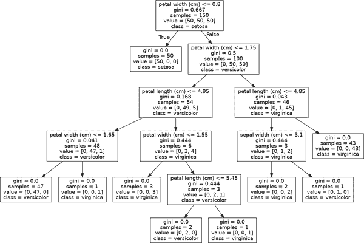
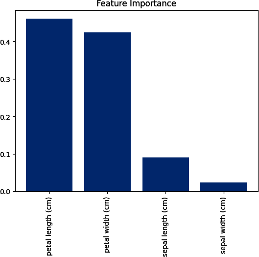

# 第十四章 树和森林

# 14.0 引言

基于树的学习算法是一类广泛且流行的非参数化监督方法，既适用于分类又适用于回归。基于树的学习器的基础是*决策树*，其中一系列决策规则（例如，“如果一个人的信用评分大于 720…​”）被链接起来。结果看起来略像一个倒置的树形，顶部是第一个决策规则，下面是后续的决策规则分支开展。在决策树中，每个决策规则出现在一个决策节点，规则创建通向新节点的分支。末端没有决策规则的分支称为*叶节点*。

树模型之所以受欢迎的一个原因是它们的可解释性。事实上，决策树可以以完整形式绘制出来（参见配方 14.3），以创建一个高度直观的模型。从这个基本的树系统中产生了多种扩展，从随机森林到堆叠。在本章中，我们将讨论如何训练、处理、调整、可视化和评估多种基于树的模型。

# 14.1 训练决策树分类器

## 问题

你需要使用决策树训练一个分类器。

## 解决方案

使用 scikit-learn 的 `DecisionTreeClassifier`：

```py
# Load libraries
from sklearn.tree import DecisionTreeClassifier
from sklearn import datasets

# Load data
iris = datasets.load_iris()
features = iris.data
target = iris.target

# Create decision tree classifier object
decisiontree = DecisionTreeClassifier(random_state=0)

# Train model
model = decisiontree.fit(features, target)
```

## 讨论

决策树学习器试图找到一个决策规则，在节点处产生最大的不纯度减少。虽然有多种不纯度的测量方法，但默认情况下，`DecisionTreeClassifier` 使用基尼不纯度：

<math display="block"><mrow><mi>G</mi> <mrow><mo>(</mo> <mi>t</mi> <mo>)</mo></mrow> <mo>=</mo> <mn>1</mn> <mo>-</mo> <munderover><mo>∑</mo> <mrow><mi>i</mi><mo>=</mo><mn>1</mn></mrow> <mi>c</mi></munderover> <msup><mrow><msub><mi>p</mi> <mi>i</mi></msub></mrow> <mn>2</mn></msup></mrow></math>

其中 <math display="inline"><mi>G</mi><mrow><mo>(</mo><mi>t</mi><mo>)</mo></mrow></math> 是节点 <math display="inline"><mi>t</mi></math> 处的基尼不纯度，<math display="inline"><msub><mi>p</mi><mi>i</mi></msub></math> 是节点 <math display="inline"><mi>t</mi></math> 处类别 <math display="inline"><mi>c</mi></math> 的观察比例。这个找到减少不纯度的决策规则并创建分裂的过程会递归重复，直到所有叶节点是纯净的（即只包含一个类别）或达到某个任意的截止点。

在 scikit-learn 中，`DecisionTreeClassifier` 的操作类似于其他学习方法；在使用 `fit` 训练模型之后，我们可以使用模型预测观察的类别：

```py
# Make new observation
observation = [[ 5,  4,  3,  2]]

# Predict observation's class
model.predict(observation)
```

```py
array([1])
```

我们还可以看到观察的预测类别概率：

```py
# View predicted class probabilities for the three classes
model.predict_proba(observation)
```

```py
array([[0., 1., 0.]])
```

最后，如果我们想使用不同的不纯度测量，我们可以使用 `criterion` 参数：

```py
# Create decision tree classifier object using entropy
decisiontree_entropy = DecisionTreeClassifier(
    criterion='entropy', random_state=0)

# Train model
model_entropy = decisiontree_entropy.fit(features, target)
```

## 参见

+   [决策树学习，普林斯顿](https://oreil.ly/lCPBG)

# 14.2 训练决策树回归器

## 问题

你需要使用决策树训练一个回归模型。

## 解决方案

使用 scikit-learn 的 `DecisionTreeRegressor`：

```py
# Load libraries
from sklearn.tree import DecisionTreeRegressor
from sklearn import datasets

# Load data with only two features
diabetes = datasets.load_diabetes()
features = diabetes.data
target = diabetes.target

# Create decision tree regressor object
decisiontree = DecisionTreeRegressor(random_state=0)

# Train model
model = decisiontree.fit(features, target)
```

## 讨论

决策树回归与决策树分类类似；但是，它不是减少基尼不纯度或熵，而是默认情况下测量潜在分裂如何减少均方误差（MSE）：

<math display="block"><mrow><mtext>MSE</mtext> <mo>=</mo> <mfrac><mn>1</mn> <mi>n</mi></mfrac> <munderover><mo>∑</mo> <mrow><mi>i</mi><mo>=</mo><mn>1</mn></mrow> <mi>n</mi></munderover> <msup><mrow><mo>(</mo><msub><mi>y</mi> <mi>i</mi></msub> <mo>-</mo><msub><mover accent="true"><mi>y</mi> <mo>¯</mo></mover> <mi>i</mi></msub> <mo>)</mo></mrow> <mn>2</mn></msup></mrow></math>

其中 <math display="inline"><msub><mi>y</mi><mi>i</mi></msub></math> 是目标的真实值，而 <math display="inline"><msub><mover accent="true"><mi>y</mi> <mo>¯</mo></mover> <mi>i</mi></msub></math> 是平均值。在 scikit-learn 中，可以使用 `DecisionTreeRegressor` 进行决策树回归。一旦我们训练好一个决策树，就可以用它来预测观测值的目标值：

```py
# Make new observation
observation = [features[0]]

# Predict observation's value
model.predict(observation)
```

```py
array([151.])
```

就像使用 `DecisionTreeClassifier` 一样，我们可以使用 `criterion` 参数来选择所需的分裂质量测量。例如，我们可以构建一个树，其分裂减少平均绝对误差（MAE）：

```py
# Create decision tree classifier object using MAE
decisiontree_mae = DecisionTreeRegressor(criterion="absolute_error",
  random_state=0)

# Train model
model_mae = decisiontree_mae.fit(features, target)
```

## 参见

+   [scikit-learn 文档：决策树回归](https://oreil.ly/EGkU_)

# 14.3 可视化决策树模型

## 问题

需要可视化由决策树学习算法创建的模型。

## 解决方案

将决策树模型导出为 DOT 格式，然后进行可视化：

```py
# Load libraries
import pydotplus
from sklearn.tree import DecisionTreeClassifier
from sklearn import datasets
from IPython.display import Image
from sklearn import tree

# Load data
iris = datasets.load_iris()
features = iris.data
target = iris.target

# Create decision tree classifier object
decisiontree = DecisionTreeClassifier(random_state=0)

# Train model
model = decisiontree.fit(features, target)

# Create DOT data
dot_data = tree.export_graphviz(decisiontree,
                                out_file=None,
                                feature_names=iris.feature_names,
                                class_names=iris.target_names)

# Draw graph
graph = pydotplus.graph_from_dot_data(dot_data)

# Show graph
Image(graph.create_png())
```



## 讨论

决策树分类器的一个优点是，我们可以可视化整个训练好的模型，使决策树成为机器学习中最具可解释性的模型之一。在我们的解决方案中，我们将训练好的模型导出为 DOT 格式（一种图形描述语言），然后用它来绘制图形。

如果我们看根节点，我们可以看到决策规则是，如果花瓣宽度小于或等于 0.8 厘米，则进入左分支；否则，进入右分支。我们还可以看到基尼不纯度指数（0.667）、观测数量（150）、每个类中的观测数量（[50,50,50]）以及如果我们在该节点停止，观测将被预测为的类别（*setosa*）。我们还可以看到在该节点，学习者发现单个决策规则（`花瓣宽度（厘米）<= 0.8`）能够完美识别所有 *setosa* 类观测。此外，再增加一个相同特征的决策规则（`花瓣宽度（厘米）<= 1.75`），决策树能够正确分类 150 个观测中的 144 个。这使得花瓣宽度成为非常重要的特征！

如果我们想在其他应用程序或报告中使用决策树，可以将可视化导出为 PDF 或 PNG 图像：

```py
# Create PDF
graph.write_pdf("iris.pdf")
```

```py
True
```

```py
# Create PNG
graph.write_png("iris.png")
```

```py
True
```

虽然这个解决方案可视化了决策树分类器，但同样可以轻松用于可视化决策树回归器。

注意：macOS 用户可能需要安装 Graphviz 的可执行文件才能运行上述代码。可以使用 Homebrew 命令 `brew install graphviz` 完成安装。有关 Homebrew 安装说明，请访问 Homebrew 的网站。

## 参见

+   [Homebrew](https://oreil.ly/GgeNI)

# 14.4 训练随机森林分类器

## 问题

要使用随机决策树“森林”训练分类模型。

## 解决方案

使用 scikit-learn 的 `RandomForestClassifier` 训练随机森林分类模型。

```py
# Load libraries
from sklearn.ensemble import RandomForestClassifier
from sklearn import datasets

# Load data
iris = datasets.load_iris()
features = iris.data
target = iris.target

# Create random forest classifier object
randomforest = RandomForestClassifier(random_state=0, n_jobs=-1)

# Train model
model = randomforest.fit(features, target)
```

## 讨论

决策树的一个常见问题是它们往往过度拟合训练数据。这促使了一种称为*随机森林*的集成学习方法的广泛使用。在随机森林中，训练许多决策树，但每棵树只接收一个自举样本的观测集（即使用替换的原始观测数量的随机样本），并且在确定最佳分裂时，每个节点只考虑特征的一个子集。这些随机化决策树的森林（因此得名）投票以确定预测类别。

通过将这个解决方案与配方 14.1 进行比较，我们可以看到 scikit-learn 的`RandomForestClassifier`与`DecisionTreeClassifier`类似：

```py
# Make new observation
observation = [[ 5,  4,  3,  2]]

# Predict observation's class
model.predict(observation)
```

```py
array([1])
```

`RandomForestClassifier`也使用与`DecisionTreeClassifier`许多相同的参数。例如，我们可以改变用于分裂质量的测量：

```py
# Create random forest classifier object using entropy
randomforest_entropy = RandomForestClassifier(
    criterion="entropy", random_state=0)

# Train model
model_entropy = randomforest_entropy.fit(features, target)
```

然而，作为一组森林而不是单个决策树，`RandomForestClassifier`有一些参数是随机森林特有的或特别重要的。首先，`max_features`参数确定在每个节点考虑的最大特征数，并接受多个参数，包括整数（特征数量）、浮点数（特征百分比）和`sqrt`（特征数量的平方根）。默认情况下，`max_features`设置为`auto`，与`sqrt`相同。其次，`bootstrap`参数允许我们设置是否使用替换创建考虑树的观测子集（默认设置）或不使用替换。第三，`n_estimators`设置森林中包含的决策树数量。最后，虽然不特定于随机森林分类器，因为我们实际上在训练许多决策树模型，通常通过设置`n_jobs=-1`来使用所有可用核心是很有用的。

## 参见

+   [随机森林，伯克利统计学](https://oreil.ly/h-LQL)

# 14.5 训练随机森林回归器

## 问题

你希望使用“森林”中的随机决策树来训练回归模型。

## 解决方案

使用 scikit-learn 的`RandomForestRegressor`训练随机森林回归模型：

```py
# Load libraries
from sklearn.ensemble import RandomForestRegressor
from sklearn import datasets

# Load data with only two features
diabetes = datasets.load_diabetes()
features = diabetes.data
target = diabetes.target

# Create random forest regressor object
randomforest = RandomForestRegressor(random_state=0, n_jobs=-1)

# Train model
model = randomforest.fit(features, target)
```

## 讨论

就像我们可以制作一组决策树分类器的森林一样，我们也可以制作一组决策树回归器，其中每棵树都使用一个自举样本集合，并且在每个节点处，决策规则只考虑特征的一个子集。与`RandomForestClassifier`一样，我们有一些重要的参数：

`max_features`

设置在每个节点考虑的最大特征数的最大值。默认为*p*个特征，其中*p*是总特征数。

`bootstrap`

设置是否使用替换采样。默认为`True`。

`n_estimators`

设置要构建的决策树数量。默认为`10`。

## 参见

+   [scikit-learn 文档：RandomForestRegressor](https://oreil.ly/ksa9Z)

# 14.6 使用袋外错误评估随机森林

## 问题

您需要在不使用交叉验证的情况下评估随机森林模型。

## 解决方案

计算模型的袋外得分：

```py
# Load libraries
from sklearn.ensemble import RandomForestClassifier
from sklearn import datasets

# Load data
iris = datasets.load_iris()
features = iris.data
target = iris.target

# Create random forest classifier object
randomforest = RandomForestClassifier(
    random_state=0, n_estimators=1000, oob_score=True, n_jobs=-1)

# Train model
model = randomforest.fit(features, target)

# View out-of-bag-error
randomforest.oob_score_
```

```py
0.9533333333333334
```

## 讨论

在随机森林中，每棵决策树使用自举子样本集进行训练。这意味着对于每棵树，都有一个单独的未用于训练该树的观察子集。这些称为袋外观察。我们可以使用袋外观察作为测试集来评估我们的随机森林的性能。

对于每个观察值，学习算法将观察的真实值与未使用该观察训练的树的预测进行比较。计算总体分数并提供随机森林性能的单一度量。袋外得分估计是交叉验证的一种替代方法。

在 scikit-learn 中，我们可以通过在随机森林对象（即 `RandomForestClassifier`）中设置 `oob_score=True` 来计算随机森林的袋外得分。可以使用 `oob_score_` 属性来检索得分。

# 14.7 随机森林中重要特征的识别

## 问题

您需要知道随机森林模型中哪些特征最重要。

## 解决方案

通过检查模型的 `feature_importances_` 属性计算和可视化每个特征的重要性：

```py
# Load libraries
import numpy as np
import matplotlib.pyplot as plt
from sklearn.ensemble import RandomForestClassifier
from sklearn import datasets

# Load data
iris = datasets.load_iris()
features = iris.data
target = iris.target

# Create random forest classifier object
randomforest = RandomForestClassifier(random_state=0, n_jobs=-1)

# Train model
model = randomforest.fit(features, target)

# Calculate feature importances
importances = model.feature_importances_

# Sort feature importances in descending order
indices = np.argsort(importances)[::-1]

# Rearrange feature names so they match the sorted feature importances
names = [iris.feature_names[i] for i in indices]

# Create plot
plt.figure()

# Create plot title
plt.title("Feature Importance")

# Add bars
plt.bar(range(features.shape[1]), importances[indices])

# Add feature names as x-axis labels
plt.xticks(range(features.shape[1]), names, rotation=90)

# Show plot
plt.show()
```



## 讨论

决策树的一个主要优点是可解释性。具体而言，我们可以可视化整个模型（参见 Recipe 14.3）。然而，随机森林模型由数十、数百甚至数千棵决策树组成。这使得对随机森林模型进行简单直观的可视化变得不切实际。尽管如此，还有另一种选择：我们可以比较（和可视化）每个特征的相对重要性。

在 Recipe 14.3 中，我们可视化了一个决策树分类器模型，并看到基于花瓣宽度的决策规则能够正确分类许多观察结果。直观地说，这意味着花瓣宽度在我们的分类器中是一个重要特征。更正式地说，具有分裂平均不纯度（例如分类器中的基尼不纯度或熵以及回归器中的方差）更大的特征被认为更重要。

但是，有两件事情需要注意关于特征重要性。首先，scikit-learn 要求我们将名义分类特征拆分为多个二进制特征。这会使得该特征的重要性分布在所有二进制特征上，即使原始的名义分类特征非常重要，也会使得每个特征看起来不重要。其次，如果两个特征高度相关，一个特征将会获得大部分重要性，使另一个特征看起来不太重要，这对解释有影响如果不考虑。

在 scikit-learn 中，分类和回归决策树以及随机森林可以使用 `feature_importances_` 方法报告每个特征的相对重要性：

```py
# View feature importances
model.feature_importances_
```

```py
array([0.09090795, 0.02453104, 0.46044474, 0.42411627])
```

数值越高，特征越重要（所有重要性得分总和为 1）。通过绘制这些值，我们可以为我们的随机森林模型增加可解释性。

# 14.8 在随机森林中选择重要特征

## 问题

您需要对随机森林进行特征选择。

## 解决方案

确定重要特征并仅使用最重要的特征重新训练模型：

```py
# Load libraries
from sklearn.ensemble import RandomForestClassifier
from sklearn import datasets
from sklearn.feature_selection import SelectFromModel

# Load data
iris = datasets.load_iris()
features = iris.data
target = iris.target

# Create random forest classifier
randomforest = RandomForestClassifier(random_state=0, n_jobs=-1)

# Create object that selects features with importance greater
# than or equal to a threshold
selector = SelectFromModel(randomforest, threshold=0.3)

# Create new feature matrix using selector
features_important = selector.fit_transform(features, target)

# Train random forest using most important features
model = randomforest.fit(features_important, target)
```

## 讨论

有些情况下，我们可能希望减少模型中特征的数量。例如，我们可能希望减少模型的方差，或者我们可能希望通过只包含最重要的特征来提高可解释性。

在 scikit-learn 中，我们可以使用一个简单的两阶段工作流程来创建一个具有减少特征的模型。首先，我们使用所有特征训练一个随机森林模型。然后，我们使用这个模型来识别最重要的特征。接下来，我们创建一个只包含这些特征的新特征矩阵。在我们的解决方案中，我们使用 `SelectFromModel` 方法创建一个包含重要性大于或等于某个 `threshold` 值的特征的特征矩阵。最后，我们使用这些特征创建一个新模型。

我们必须注意这种方法的两个限制。首先，已经进行了一次独热编码的名义分类特征会导致特征重要性在二元特征中被稀释。其次，高度相关特征的特征重要性将有效地分配给一个特征，而不是均匀分布在两个特征之间。

## 另请参阅

+   [使用随机森林进行变量选择，Robin Genuer, Jean-Michel Poggi, 和 Christine Tuleau-Malot](https://oreil.ly/y9k2U)

# 14.9 处理不平衡类别

## 问题

您有一个目标向量，其中包含高度不平衡的类别，并希望训练一个随机森林模型。

## 解决方案

使用 `class_weight="balanced"` 训练决策树或随机森林模型：

```py
# Load libraries
import numpy as np
from sklearn.ensemble import RandomForestClassifier
from sklearn import datasets

# Load data
iris = datasets.load_iris()
features = iris.data
target = iris.target

# Make class highly imbalanced by removing first 40 observations
features = features[40:,:]
target = target[40:]

# Create target vector indicating if class 0, otherwise 1
target = np.where((target == 0), 0, 1)

# Create random forest classifier object
randomforest = RandomForestClassifier(
    random_state=0, n_jobs=-1, class_weight="balanced")

# Train model
model = randomforest.fit(features, target)
```

## 讨论

在实际进行机器学习时，不平衡类别是一个常见问题。如果不加以解决，不平衡类别的存在会降低模型的性能。我们将在预处理过程中讨论如何处理不平衡类别 Recipe 17.5。然而，在 scikit-learn 中的许多学习算法都具有用于纠正不平衡类别的内置方法。我们可以使用 `class_weight` 参数将 `RandomForestClassifier` 设置为纠正不平衡类别。如果提供了一个字典，其形式为类别名称和所需权重（例如 `{"male": 0.2, "female": 0.8}`），`RandomForestClassifier` 将相应地加权类别。然而，更常见的参数是 `balanced`，其中类别的权重自动与其在数据中出现的频率成反比：

<math display="block"><mrow><msub><mi>w</mi> <mi>j</mi></msub> <mo>=</mo> <mfrac><mi>n</mi> <mrow><mi>k</mi><msub><mi>n</mi> <mi>j</mi></msub></mrow></mfrac></mrow></math>

其中<math display="inline"><msub><mi>w</mi><mi>j</mi></msub></math>是类<math display="inline"><mi>j</mi></math>的权重，<math display="inline"><mi>n</mi></math>是观察次数，<math display="inline"><msub><mi>n</mi><mi>j</mi></msub></math>是类<math display="inline"><mi>j</mi></math>中的观察次数，<math display="inline"><mi>k</mi></math>是总类数。例如，在我们的解决方案中，有 2 个类别（<math display="inline"><mi>k</mi></math>），110 次观察（<math display="inline"><mi>n</mi></math>），分别有 10 和 100 次观察在每个类中（<math display="inline"><msub><mi>n</mi><mi>j</mi></msub></math>）。如果我们使用`class_weight="balanced"`来加权类别，则较小的类别被加权更多：

```py
# Calculate weight for small class
110/(2*10)
```

```py
5.5
```

而较大的类别被加权更少：

```py
# Calculate weight for large class
110/(2*100)
```

```py
0.55
```

# 14.10 控制树的大小

## 问题

您希望手动确定决策树的结构和大小。

## 解决方案

在 scikit-learn 基于树的学习算法中使用树结构参数：

```py
# Load libraries
from sklearn.tree import DecisionTreeClassifier
from sklearn import datasets

# Load data
iris = datasets.load_iris()
features = iris.data
target = iris.target

# Create decision tree classifier object
decisiontree = DecisionTreeClassifier(random_state=0,
                                      max_depth=None,
                                      min_samples_split=2,
                                      min_samples_leaf=1,
                                      min_weight_fraction_leaf=0,
                                      max_leaf_nodes=None,
                                      min_impurity_decrease=0)

# Train model
model = decisiontree.fit(features, target)
```

## 讨论

scikit-learn 的基于树的学习算法有多种控制决策树大小的技术。这些通过参数访问：

`max_depth`

树的最大深度。如果为`None`，则树会生长直到所有叶子节点都是纯净的。如果是整数，则树被“修剪”到该深度。

`min_samples_split`

在一个节点上分裂之前所需的最小观察次数。如果提供整数作为参数，则确定原始最小值，如果提供浮点数，则最小值是总观察次数的百分比。

`min_samples_leaf`

在叶子节点上所需的最小观察次数。与`min_samples_split`相同的参数。

`max_leaf_nodes`

最大叶子节点数。

`min_impurity_split`

在执行分割之前所需的最小不纯度减少。

虽然知道这些参数存在是有用的，但最可能我们只会使用`max_depth`和`min_impurity_split`，因为更浅的树（有时称为*树桩*）是更简单的模型，因此具有较低的方差。

# 14.11 通过增强提高性能

## 问题

您需要比决策树或随机森林性能更好的模型。

## 解决方案

使用`AdaBoostClassifier`或`AdaBoostRegressor`训练增强模型：

```py
# Load libraries
from sklearn.ensemble import AdaBoostClassifier
from sklearn import datasets

# Load data
iris = datasets.load_iris()
features = iris.data
target = iris.target

# Create adaboost tree classifier object
adaboost = AdaBoostClassifier(random_state=0)

# Train model
model = adaboost.fit(features, target)
```

## 讨论

在随机森林中，随机化决策树的集合预测目标向量。另一种常用且通常更强大的方法称为*增强*。在增强的一种形式中称为 AdaBoost，我们迭代地训练一系列弱模型（通常是浅决策树，有时称为树桩），每次迭代都优先考虑前一个模型预测错误的观察结果。更具体地，在 AdaBoost 中：

1.  为每个观察值 <math display="inline"><msub><mi>x</mi><mi>i</mi></msub></math> 分配初始权重值 <math display="inline"><mrow><msub><mi>w</mi> <mi>i</mi></msub> <mo>=</mo> <mfrac><mn>1</mn> <mi>n</mi></mfrac></mrow></math>，其中 <math display="inline"><mi>n</mi></math> 是数据中观察总数。

1.  在数据上训练一个“弱”模型。

1.  对于每个观察：

    1.  如果弱模型正确预测 <math display="inline"><msub><mi>x</mi><mi>i</mi></msub></math>，则 <math display="inline"><msub><mi>w</mi><mi>i</mi></msub></math> 减少。

    1.  如果弱模型错误预测 <math display="inline"><msub><mi>x</mi><mi>i</mi></msub></math>，则 <math display="inline"><msub><mi>w</mi><mi>i</mi></msub></math> 增加。

1.  训练一个新的弱模型，其中具有较大 <math display="inline"><msub><mi>w</mi><mi>i</mi></msub></math> 的观察值优先考虑。

1.  重复步骤 4 和 5，直到数据完全预测或训练了预设数量的弱模型。

结果是一个聚合模型，个体弱模型专注于更难（从预测角度）的观察。在 scikit-learn 中，我们可以使用 `AdaBoostClassifier` 或 `AdaBoostRegressor` 实现 AdaBoost。最重要的参数是 `base_estimator`、`n_estimators`、`learning_rate` 和 `loss`：

`base_estimator`

`base_estimator` 是用于训练弱模型的学习算法。与 AdaBoost 一起使用的最常见的学习器是决策树，默认参数。

`n_estimators`

`n_estimators` 是要迭代训练的模型数量。

`learning_rate`

`learning_rate` 是每个模型对权重的贡献，默认为 `1`。减小学习率意味着权重将略微增加或减少，迫使模型训练速度变慢（但有时会导致更好的性能分数）。

`loss`

`loss` 仅适用于 `AdaBoostRegressor`，设置更新权重时使用的损失函数。默认为线性损失函数，但可以更改为 `square` 或 `exponential`。

## 参见

+   [解释 AdaBoost, Robert E. Schapire](https://oreil.ly/5E1v4)

# 14.12 训练 XGBoost 模型

## 问题

您需要训练具有高预测能力的基于树的模型。

## 解决方案

使用 `xgboost` Python 库：

```py
# Load libraries
import xgboost as xgb
from sklearn import datasets, preprocessing
from sklearn.metrics import classification_report
from numpy import argmax

# Load data
iris = datasets.load_iris()
features = iris.data
target = iris.target

# Create dataset
xgb_train = xgb.DMatrix(features, label=target)

# Define parameters
param = {
    'objective': 'multi:softprob',
    'num_class': 3
}

# Train model
gbm = xgb.train(param, xgb_train)

# Get predictions
predictions = argmax(gbm.predict(xgb_train), axis=1)

# Get a classification report
print(classification_report(target, predictions))
```

```py
              precision    recall  f1-score   support

           0       1.00      1.00      1.00        50
           1       1.00      0.96      0.98        50
           2       0.96      1.00      0.98        50

    accuracy                           0.99       150
   macro avg       0.99      0.99      0.99       150
weighted avg       0.99      0.99      0.99       150
```

## 讨论

XGBoost（即极端梯度提升）是机器学习领域中非常流行的梯度提升算法。尽管它不总是基于树的模型，但经常应用于决策树集成中。由于在机器学习竞赛网站 Kaggle 上取得了广泛成功，XGBoost 因其卓越的性能提升而备受青睐，已成为提高性能的可靠算法，超越了典型随机森林或梯度增强机器的性能。

尽管 XGBoost 因计算密集而闻名，但过去几年的计算性能优化（例如 GPU 支持）显著简化了与 XGBoost 的快速迭代，它仍然是在统计性能要求时的常见选择算法。

## 另请参阅

+   [XGBoost 文档](https://oreil.ly/cAuGX)

# 14.13 使用 LightGBM 提升实时性能

## 问题

您需要训练一个在计算上优化的基于梯度提升树的模型。

## 解决方案

使用梯度提升机库 `lightgbm`：

```py
# Load libraries
import lightgbm as lgb
from sklearn import datasets, preprocessing
from sklearn.metrics import classification_report
from numpy import argmax

# Load data
iris = datasets.load_iris()
features = iris.data
target = iris.target

# Create dataset
lgb_train = lgb.Dataset(features, target)

# Define parameters
params = {
    'objective': 'multiclass',
    'num_class': 3,
    'verbose': -1,
}

# Train model
gbm = lgb.train(params, lgb_train)

# Get predictions
predictions = argmax(gbm.predict(features), axis=1)

# Get a classification report
print(classification_report(target, predictions))
```

```py
              precision    recall  f1-score   support

           0       1.00      1.00      1.00        50
           1       1.00      1.00      1.00        50
           2       1.00      1.00      1.00        50

    accuracy                           1.00       150
   macro avg       1.00      1.00      1.00       150
weighted avg       1.00      1.00      1.00       150
```

## 讨论

`lightgbm` 库用于梯度提升机，在训练时间、推断和 GPU 支持方面都经过高度优化。由于其计算效率高，常用于生产环境和大规模设置中。尽管 scikit-learn 模型通常更易于使用，但某些库如 `lightgbm` 在受限于大数据或严格的模型训练/服务时间时会更实用。

## 另请参阅

+   [LightGBM 文档](https://oreil.ly/XDcpG)

+   [CatBoost 文档（另一个优化的梯度提升库）](https://oreil.ly/4Bb8g)
