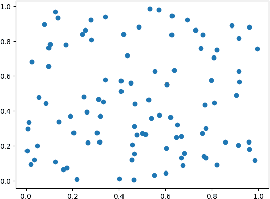
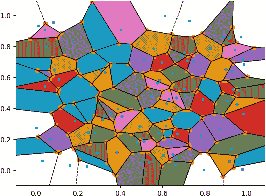

# 第十五章：K 近邻算法

# 15.0 简介

k-最近邻（KNN）分类器是监督机器学习中最简单但最常用的分类器之一。KNN 通常被认为是一种惰性学习器；它不会技术上训练一个模型来进行预测。相反，一个观测值被预测为与 *k* 个最近观测值中最大比例的类相同。

例如，如果一个具有未知类的观测值被一个类为 1 的观测值所包围，则该观测值将被分类为类 1。在本章中，我们将探讨如何使用 scikit-learn 创建和使用 KNN 分类器。

# 15.1 寻找一个观测值的最近邻居

## 问题

您需要找到一个观测值的 *k* 个最近邻居。

## 解决方案

使用 scikit-learn 的 `NearestNeighbors`：

```py
# Load libraries
from sklearn import datasets
from sklearn.neighbors import NearestNeighbors
from sklearn.preprocessing import StandardScaler

# Load data
iris = datasets.load_iris()
features = iris.data

# Create standardizer
standardizer = StandardScaler()

# Standardize features
features_standardized = standardizer.fit_transform(features)

# Two nearest neighbors
nearest_neighbors = NearestNeighbors(n_neighbors=2).fit(features_standardized)

# Create an observation
new_observation = [ 1,  1,  1,  1]

# Find distances and indices of the observation's nearest neighbors
distances, indices = nearest_neighbors.kneighbors([new_observation])

# View the nearest neighbors
features_standardized[indices]
```

```py
array([[[1.03800476, 0.55861082, 1.10378283, 1.18556721],
        [0.79566902, 0.32841405, 0.76275827, 1.05393502]]])
```

## 讨论

在我们的解决方案中，我们使用了鸢尾花数据集。我们创建了一个观测值，`new_observation`，具有一些值，然后找到了最接近我们观测值的两个观测值。 `indices` 包含了最接近我们数据集中的观测值的位置，所以 `X[indices]` 显示了这些观测值的值。直观地，距离可以被看作是相似性的度量，因此两个最接近的观测值是与我们创建的花最相似的两朵花。

我们如何衡量距离？scikit-learn 提供了多种距离度量方式，<math display="inline"><mi>d</mi></math>，包括欧几里得距离：

<math display="block"><mrow><msub><mi>d</mi> <mrow><mi>e</mi><mi>u</mi><mi>c</mi><mi>l</mi><mi>i</mi><mi>d</mi><mi>e</mi><mi>a</mi><mi>n</mi></mrow></msub> <mo>=</mo> <msqrt><mrow><msubsup><mo>∑</mo> <mrow><mi>i</mi><mo>=</mo><mn>1</mn></mrow> <mi>n</mi></msubsup> <msup><mrow><mo>(</mo><msub><mi>x</mi> <mi>i</mi></msub> <mo>-</mo><msub><mi>y</mi> <mi>i</mi></msub> <mo>)</mo></mrow> <mn>2</mn></msup></mrow></msqrt></mrow></math>

和曼哈顿距离：

<math display="block"><mrow><msub><mi>d</mi> <mrow><mi>m</mi><mi>a</mi><mi>n</mi><mi>h</mi><mi>a</mi><mi>t</mi><mi>t</mi><mi>a</mi><mi>n</mi></mrow></msub> <mo>=</mo> <munderover><mo>∑</mo> <mrow><mi>i</mi><mo>=</mo><mn>1</mn></mrow> <mi>n</mi></munderover> <mfenced close="|" open="|" separators=""><msub><mi>x</mi> <mi>i</mi></msub> <mo>-</mo> <msub><mi>y</mi> <mi>i</mi></msub></mfenced></mrow></math>

默认情况下，`NearestNeighbors` 使用闵可夫斯基距离：

<math display="block"><mrow><msub><mi>d</mi> <mrow><mi>m</mi><mi>i</mi><mi>n</mi><mi>k</mi><mi>o</mi><mi>w</mi><mi>s</mi><mi>k</mi><mi>i</mi></mrow></msub> <mo>=</mo> <msup><mfenced close=")" open="(" separators=""><munderover><mo>∑</mo> <mrow><mi>i</mi><mo>=</mo><mn>1</mn></mrow> <mi>n</mi></munderover> <msup><mfenced close="|" open="|" separators=""><msub><mi>x</mi> <mi>i</mi></msub> <mo>-</mo><msub><mi>y</mi> <mi>i</mi></msub></mfenced> <mi>p</mi></msup></mfenced> <mrow><mn>1</mn><mo>/</mo><mi>p</mi></mrow></msup></mrow></math>

其中<math display="inline"><msub><mi>x</mi><mi>i</mi></msub></math>和<math display="inline"><msub><mi>y</mi><mi>i</mi></msub></math>是我们计算距离的两个观测值。闵可夫斯基距离包括一个超参数<math display="inline"><mi>p</mi></math>，其中<math display="inline"><mi>p</mi></math>=1 是曼哈顿距离，<math display="inline"><mi>p</mi></math>=2 是欧几里得距离，等等。在 scikit-learn 中，默认情况下<math display="inline"><mi>p</mi></math>=2。

我们可以使用 `metric` 参数设置距离度量：

```py
# Find two nearest neighbors based on Euclidean distance
nearestneighbors_euclidean = NearestNeighbors(
    n_neighbors=2, metric='euclidean').fit(features_standardized)
```

我们创建的 `distance` 变量包含了到两个最近邻居的实际距离测量：

```py
# View distances
distances
```

```py
array([[0.49140089, 0.74294782]])
```

此外，我们可以使用 `kneighbors_graph` 创建一个矩阵，指示每个观测值的最近邻居：

```py
# Find each observation's three nearest neighbors
# based on Euclidean distance (including itself)
nearestneighbors_euclidean = NearestNeighbors(
    n_neighbors=3, metric="euclidean").fit(features_standardized)

# List of lists indicating each observation's three nearest neighbors
# (including itself)
nearest_neighbors_with_self = nearestneighbors_euclidean.kneighbors_graph(
    features_standardized).toarray()

# Remove 1s marking an observation is a nearest neighbor to itself
for i, x in enumerate(nearest_neighbors_with_self):
    x[i] = 0

# View first observation's two nearest neighbors
nearest_neighbors_with_self[0]
```

```py
array([0., 0., 0., 0., 0., 0., 0., 0., 0., 0., 0., 0., 0., 0., 0., 0., 0.,
       1., 0., 0., 0., 0., 0., 0., 0., 0., 0., 1., 0., 0., 0., 0., 0., 0.,
       0., 0., 0., 0., 0., 0., 0., 0., 0., 0., 0., 0., 0., 0., 0., 0., 0.,
       0., 0., 0., 0., 0., 0., 0., 0., 0., 0., 0., 0., 0., 0., 0., 0., 0.,
       0., 0., 0., 0., 0., 0., 0., 0., 0., 0., 0., 0., 0., 0., 0., 0., 0.,
       0., 0., 0., 0., 0., 0., 0., 0., 0., 0., 0., 0., 0., 0., 0., 0., 0.,
       0., 0., 0., 0., 0., 0., 0., 0., 0., 0., 0., 0., 0., 0., 0., 0., 0.,
       0., 0., 0., 0., 0., 0., 0., 0., 0., 0., 0., 0., 0., 0., 0., 0., 0.,
       0., 0., 0., 0., 0., 0., 0., 0., 0., 0., 0., 0., 0., 0.])
```

当我们寻找最近邻居或使用基于距离的任何学习算法时，重要的是要转换特征，使它们处于相同的尺度上。这是因为距离度量将所有特征都视为处于相同的尺度上，但如果一个特征是以百万美元计算的，而第二个特征是以百分比计算的，那么计算出的距离将偏向于前者。在我们的解决方案中，我们通过使用 `StandardScaler` 对特征进行了标准化，以解决这个潜在的问题。

# 15.2 创建 K 近邻分类器

## 问题

给定一个未知类别的观测值，你需要根据其邻居的类别预测其类别。

## 解答

如果数据集不太大，使用 `KNeighborsClassifier`：

```py
# Load libraries
from sklearn.neighbors import KNeighborsClassifier
from sklearn.preprocessing import StandardScaler
from sklearn import datasets

# Load data
iris = datasets.load_iris()
X = iris.data
y = iris.target

# Create standardizer
standardizer = StandardScaler()

# Standardize features
X_std = standardizer.fit_transform(X)

# Train a KNN classifier with 5 neighbors
knn = KNeighborsClassifier(n_neighbors=5, n_jobs=-1).fit(X_std, y)

# Create two observations
new_observations = [[ 0.75,  0.75,  0.75,  0.75],
                    [ 1,  1,  1,  1]]

# Predict the class of two observations
knn.predict(new_observations)
```

```py
array([1, 2])
```

## 讨论

在 KNN 中，给定一个观测值，<math display="inline"><msub><mi>x</mi><mi>u</mi></msub></math>，其目标类别未知，算法首先基于某种距离度量（例如欧几里得距离）确定最近的 <math display="inline"><mi>k</mi></math> 个观测值（有时称为 <math display="inline"><msub><mi>x</mi><mi>u</mi></msub></math> 的 *邻域*），然后这些 <math display="inline"><mi>k</mi></math> 个观测值基于它们的类别“投票”，获胜的类别就是 <math display="inline"><msub><mi>x</mi><mi>u</mi></msub></math> 的预测类别。更正式地，某个类别 <math display="inline"><mi>j</mi></math> 的概率 <math display="inline"><msub><mi>x</mi><mi>u</mi></msub></math> 为：

<math display="block"><mrow><mfrac><mn>1</mn> <mi>k</mi></mfrac> <munderover><mo>∑</mo> <mrow><mi>i</mi><mo>∈</mo><mi>ν</mi></mrow></munderover> <mi>I</mi> <mrow><mo>(</mo> <msub><mi>y</mi> <mi>i</mi></msub> <mo>=</mo> <mi>j</mi> <mo>)</mo></mrow></mrow></math>

其中 ν 是 <math display="inline"><mi>k</mi></math> 个观测值在 <math display="inline"><msub><mi>x</mi><mi>u</mi></msub></math> 的邻域中，<math display="inline"><msub><mi>y</mi><mi>i</mi></msub></math> 是第 *i* 个观测值的类别，<math display="inline"><mi>I</mi></math> 是一个指示函数（即，1 为真，0 其他）。在 scikit-learn 中，我们可以使用 `predict_proba` 查看这些概率：

```py
# View probability that each observation is one of three classes
knn.predict_proba(new_observations)
```

```py
array([[0\. , 0.6, 0.4],
       [0\. , 0\. , 1\. ]])
```

概率最高的类别成为预测类别。例如，在前面的输出中，第一观测值应该是类别 1 (*Pr* = 0.6)，而第二观测值应该是类别 2 (*Pr* = 1)，这正是我们所看到的：

```py
knn.predict(new_observations)
```

```py
array([1, 2])
```

`KNeighborsClassifier` 包含许多重要参数需要考虑。首先，`metric` 设置使用的距离度量。其次，`n_jobs` 决定使用计算机的多少核心。因为做出预测需要计算一个点与数据中每个点的距离，推荐使用多个核心。第三，`algorithm` 设置计算最近邻的方法。虽然算法之间存在实际差异，默认情况下 `KNeighborsClassifier` 尝试自动选择最佳算法，因此通常不需要担心这个参数。第四，默认情况下 `KNeighborsClassifier` 的工作方式与我们之前描述的相同，每个邻域中的观测值获得一个投票；然而，如果我们将 `weights` 参数设置为 `distance`，则更靠近的观测值的投票比更远的观测值更重要。直观上这很有道理，因为更相似的邻居可能会告诉我们更多关于一个观测值类别的信息。

最后，由于距离计算将所有特征视为在相同尺度上，因此在使用 KNN 分类器之前，标准化特征是很重要的。

# 15.3 确定最佳邻域大小

## 问题

你想在 k 最近邻分类器中选择最佳的 *k* 值。

## 解答

使用模型选择技术如 `GridSearchCV`：

```py
# Load libraries
from sklearn.neighbors import KNeighborsClassifier
from sklearn import datasets
from sklearn.preprocessing import StandardScaler
from sklearn.pipeline import Pipeline, FeatureUnion
from sklearn.model_selection import GridSearchCV

# Load data
iris = datasets.load_iris()
features = iris.data
target = iris.target

# Create standardizer
standardizer = StandardScaler()

# Create a KNN classifier
knn = KNeighborsClassifier(n_neighbors=5, n_jobs=-1)

# Create a pipeline
pipe = Pipeline([("standardizer", standardizer), ("knn", knn)])

# Create space of candidate values
search_space = [{"knn__n_neighbors": [1, 2, 3, 4, 5, 6, 7, 8, 9, 10]}]

# Create grid search
classifier = GridSearchCV(
    pipe, search_space, cv=5, verbose=0).fit(features_standardized, target)
```

## 讨论

*k* 的大小在 KNN 分类器中有着真实的影响。在机器学习中，我们试图在偏差和方差之间找到一个平衡点，*k* 的值在其中的显性展示是极其重要的。如果 *k* = *n*，其中 *n* 是观测数量，那么我们具有高偏差但低方差。如果 *k* = 1，我们将具有低偏差但高方差。最佳模型将通过找到能平衡这种偏差-方差权衡的*k*的值来获得。在我们的解决方案中，我们使用`GridSearchCV`对具有不同*k*值的 KNN 分类器进行了五折交叉验证。完成后，我们可以看到产生最佳模型的*k*值：

```py
# Best neighborhood size (k)
classifier.best_estimator_.get_params()["knn__n_neighbors"]
```

```py
6
```

# 15.4 创建基于半径的最近邻分类器

## 问题

给定一个未知类的观测值，您需要基于一定距离内所有观测值的类来预测其类别。

## 解决方案

使用 `RadiusNeighborsClassifier`：

```py
# Load libraries
from sklearn.neighbors import RadiusNeighborsClassifier
from sklearn.preprocessing import StandardScaler
from sklearn import datasets

# Load data
iris = datasets.load_iris()
features = iris.data
target = iris.target

# Create standardizer
standardizer = StandardScaler()

# Standardize features
features_standardized = standardizer.fit_transform(features)

# Train a radius neighbors classifier
rnn = RadiusNeighborsClassifier(
    radius=.5, n_jobs=-1).fit(features_standardized, target)

# Create two observations
new_observations = [[ 1,  1,  1,  1]]

# Predict the class of two observations
rnn.predict(new_observations)
```

```py
array([2])
```

## 讨论

在 KNN 分类中，一个观测的类别是根据其 *k* 个邻居的类别预测的。一种不太常见的技术是基于半径的最近邻（RNN）分类器，其中一个观测的类别是根据给定半径 *r* 内所有观测的类别预测的。

在 scikit-learn 中，`RadiusNeighborsClassifier`与`KNeighbors​Classi⁠fier`非常相似，只有两个参数例外。首先，在`RadiusNeighbors​Clas⁠sifier`中，我们需要指定用于确定观测是否为邻居的固定区域半径使用`radius`。除非有设置`radius`到某个值的实质性原因，否则最好在模型选择过程中像其他超参数一样进行调整。第二个有用的参数是`outlier_label`，它指示如果半径内没有观测值，则给出一个观测的标签—这本身可以是一个用于识别异常值的有用工具。

# 15.5 寻找近似最近邻

## 问题

您希望在低延迟下获取大数据的最近邻：

## 解决方案

使用 *近似最近邻*（ANN）搜索，使用 Facebook 的 `faiss` 库：

```py
# Load libraries
import faiss
import numpy as np
from sklearn import datasets
from sklearn.neighbors import NearestNeighbors
from sklearn.preprocessing import StandardScaler

# Load data
iris = datasets.load_iris()
features = iris.data

# Create standardizer
standardizer = StandardScaler()

# Standardize features
features_standardized = standardizer.fit_transform(features)

# Set faiss parameters
n_features = features_standardized.shape[1]
nlist = 3
k = 2

# Create an IVF index
quantizer = faiss.IndexFlatIP(n_features)
index = faiss.IndexIVFFlat(quantizer, n_features, nlist)

# Train the index and add feature vectors
index.train(features_standardized)
index.add(features_standardized)

# Create an observation
new_observation = np.array([[ 1,  1,  1,  1]])

# Search the index for the 2 nearest neighbors
distances, indices = index.search(new_observation, k)

# Show the feature vectors for the two nearest neighbors
np.array([list(features_standardized[i]) for i in indices[0]])
```

```py
array([[1.03800476, 0.55861082, 1.10378283, 1.18556721],
       [0.79566902, 0.32841405, 0.76275827, 1.05393502]])
```

## 讨论

KNN 是在小数据集中找到最相似观测的一个很好的方法。然而，随着数据集的增大，计算任意观测与数据集中所有其他点之间距离所需的时间也会增加。大规模的 ML 系统如搜索或推荐引擎通常使用某种形式的向量相似度测量来检索相似的观测。但在实时规模中，我们需要在不到 100 毫秒内获得结果，KNN 变得不可行。

ANN 通过牺牲精确最近邻搜索的一些质量以换取速度来帮助我们克服这个问题。换句话说，虽然 ANN 搜索的前 10 个最近邻的顺序和项可能与精确 KNN 搜索的前 10 个结果不匹配，但我们能更快地得到这前 10 个最近邻。

在这个例子中，我们使用了一种名为倒排文件索引（IVF）的 ANN 方法。这种方法通过使用聚类来限制最近邻搜索的范围。IVF 使用 Voronoi 镶嵌将我们的搜索空间划分为多个不同的区域（或聚类）。当我们去查找最近邻时，我们访问了有限数量的聚类以找到相似的观测值，而不是对数据集中的每一个点进行比较。

如何从数据中创建 Voronoi 镶嵌最好通过简单的数据可视化。例如，取随机数据的散点图在二维中可视化，如图 15-1 所示。



###### 图 15-1\. 一组随机生成的二维数据的散点图

使用 Voronoi 镶嵌，我们可以创建多个子空间，每个子空间只包含我们想要搜索的总观测的一个小子集，如图 15-2 所示。



###### 图 15-2\. 将随机生成的二维数据分割成多个不同子空间

在`Faiss`库中，`nlist`参数允许我们定义要创建的聚类数。还可以在查询时使用一个额外的参数`nprobe`来定义要搜索的聚类数，以检索给定观测值的最近邻。增加`nlist`和`nprobe`都可以提高邻居的质量，但会增加计算成本，从而导致 IVF 索引的运行时间更长。减少这些参数会产生相反的效果，您的代码将运行得更快，但可能返回质量较低的结果。

注意，此示例返回与本章第一个配方完全相同的输出。这是因为我们处理的是非常小的数据，并且仅使用了三个聚类，这使得我们的 ANN 结果与我们的 KNN 结果没有显著差异。

## 参见

+   [用于相似性搜索的最近邻索引（不同的 ANN 索引类型）](https://oreil.ly/DVqgn)

# 15.6 评估近似最近邻

## 问题

您想看看您的 ANN 与精确最近邻（KNN）的比较情况：

## 解决方案

计算 ANN 相对于 KNN 的 Recall @k 最近邻

```py
# Load libraries
import faiss
import numpy as np
from sklearn import datasets
from sklearn.neighbors import NearestNeighbors
from sklearn.preprocessing import StandardScaler

# Number of nearest neighbors
k = 10

# Load data
iris = datasets.load_iris()
features = iris.data

# Create standardizer
standardizer = StandardScaler()

# Standardize features
features_standardized = standardizer.fit_transform(features)

# Create KNN with 10 NN
nearest_neighbors = NearestNeighbors(n_neighbors=k).fit(features_standardized)

# Set faiss parameters
n_features = features_standardized.shape[1]
nlist = 3

# Create an IVF index
quantizer = faiss.IndexFlatIP(n_features)
index = faiss.IndexIVFFlat(quantizer, n_features, nlist)

# Train the index and add feature vectors
index.train(features_standardized)
index.add(features_standardized)
index.nprobe = 1

# Create an observation
new_observation = np.array([[ 1,  1,  1,  1]])

# Find distances and indices of the observation's exact nearest neighbors
knn_distances, knn_indices = nearest_neighbors.kneighbors(new_observation)

# Search the index for the two nearest neighbors
ivf_distances, ivf_indices = index.search(new_observation, k)

# Get the set overlap
recalled_items = set(list(knn_indices[0])) & set(list(ivf_indices[0]))

# Print the recall
print(f"Recall @k={k}: {len(recalled_items)/k * 100}%")
```

```py
Recall @k=10: 100.0%
```

## 讨论

*Recall @k* 最简单的定义是 ANN 在某个*k*个最近邻处返回的项目数，这些项目同时也出现在相同*k*个精确最近邻中，除以*k*。在这个例子中，在 10 个最近邻处，我们有 100%的召回率，这意味着我们的 ANN 返回的索引与我们的 KNN 在 k=10 时是相同的（尽管不一定是相同的顺序）。

在评估 ANN 与精确最近邻时，Recall 是一个常用的度量标准。

## 参见

+   [Google 对其 Vertex 匹配引擎服务的 ANN 的注意事项](https://oreil.ly/-COc9)
