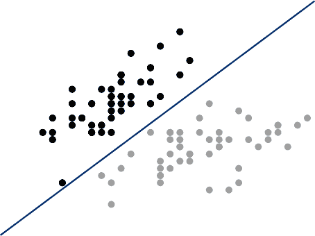
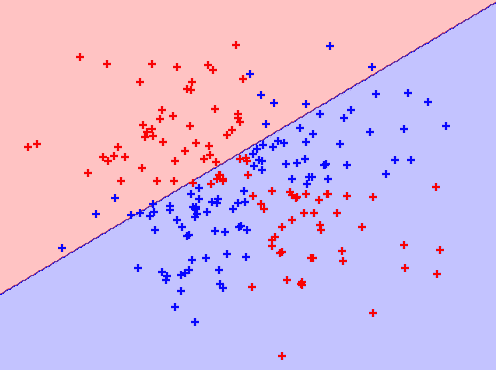
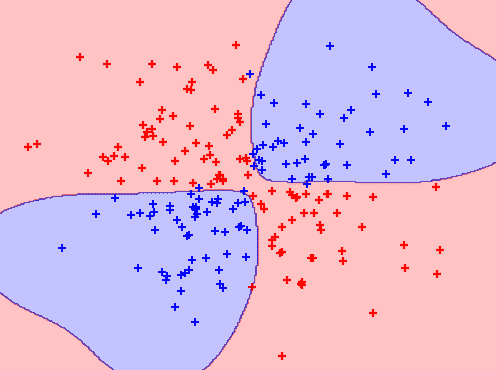

# 第十七章 支持向量机

# 17.0 引言

要理解支持向量机，我们必须了解超平面。形式上，*超平面*是*n - 1*维空间中的一个* n * -维子空间。尽管听起来复杂，但实际上相当简单。例如，如果我们想要划分一个二维空间，我们会使用一维超平面（即，一条线）。如果我们想要划分一个三维空间，我们会使用二维超平面（即，一张平面或一张床单）。超平面只是将该概念推广到*n*维空间的一种方式。

*支持向量机*通过找到在训练数据中最大化类之间间隔的超平面来对数据进行分类。在一个二维示例中，我们可以将超平面看作是分开两个类的最宽的直线“带”（即，具有间隔的线）。

在本章中，我们将涵盖在各种情况下训练支持向量机，并深入了解如何扩展该方法以解决常见问题。

# 17.1 训练线性分类器

## 问题

您需要训练一个模型来对观察结果进行分类。

## 解决方案

使用*支持向量分类器*（SVC）找到最大化类之间间隔的超平面：

```py
# Load libraries
from sklearn.svm import LinearSVC
from sklearn import datasets
from sklearn.preprocessing import StandardScaler
import numpy as np

# Load data with only two classes and two features
iris = datasets.load_iris()
features = iris.data[:100,:2]
target = iris.target[:100]

# Standardize features
scaler = StandardScaler()
features_standardized = scaler.fit_transform(features)

# Create support vector classifier
svc = LinearSVC(C=1.0)

# Train model
model = svc.fit(features_standardized, target)
```

## 讨论

scikit-learn 的`LinearSVC`实现了一个简单的 SVC。为了理解 SVC 正在做什么，让我们绘制出数据和超平面的图像。虽然 SVC 在高维度下工作得很好，但在我们的解决方案中，我们只加载了两个特征并取了一部分观察结果，使得数据只包含两个类。这将让我们可以可视化模型。回想一下，当我们只有两个维度时，SVC 试图找到具有最大间隔的超平面—​一条线—​来分离类。在下面的代码中，我们在二维空间中绘制了两个类，然后绘制了超平面：

```py
# Load library
from matplotlib import pyplot as plt

# Plot data points and color using their class
color = ["black" if c == 0 else "lightgrey" for c in target]
plt.scatter(features_standardized[:,0], features_standardized[:,1], c=color)

# Create the hyperplane
w = svc.coef_[0]
a = -w[0] / w[1]
xx = np.linspace(-2.5, 2.5)
yy = a * xx - (svc.intercept_[0]) / w[1]

# Plot the hyperplane
plt.plot(xx, yy)
plt.axis("off"), plt.show();
```



在这个可视化中，所有类 0 的观察结果都是黑色的，而类 1 的观察结果是浅灰色的。超平面是决策边界，决定了如何对新的观察结果进行分类。具体来说，线上方的任何观察结果将被分类为类 0，而线下方的任何观察结果将被分类为类 1。我们可以通过在可视化的左上角创建一个新的观察结果来证明这一点，这意味着它应该被预测为类 0：

```py
# Create new observation
new_observation = [[ -2,  3]]

# Predict class of new observation
svc.predict(new_observation)
```

```py
array([0])
```

关于 SVC 有几点需要注意。首先，为了可视化的目的，我们将示例限制为二元示例（即，只有两个类）；但是，SVC 可以很好地处理多类问题。其次，正如我们的可视化所示，超平面在定义上是线性的（即，不是曲线的）。在这个示例中这是可以的，因为数据是线性可分的，意味着有一个能够完美分离两个类的超平面。不幸的是，在现实世界中，这种情况很少见。

更典型地，我们将无法完全分开类别。在这些情况下，支持向量分类器在最大化超平面间隔和最小化误分类之间存在平衡。在 SVC 中，后者由超参数 *C* 控制。*C* 是 SVC 学习器的参数，是对误分类数据点的惩罚。当 *C* 较小时，分类器可以接受误分类的数据点（高偏差但低方差）。当 *C* 较大时，分类器对误分类数据点进行严格惩罚，因此竭尽全力避免任何误分类数据点（低偏差但高方差）。

在 scikit-learn 中，*C* 是由参数 `C` 确定的，默认为 `C=1.0`。我们应该将 *C* 视为我们学习算法的超参数，通过模型选择技术在 第十二章 中进行调优。

# 17.2 使用核处理线性不可分类

## 问题

你需要训练一个支持向量分类器，但你的类别是线性不可分的。

## 解决方案

使用核函数训练支持向量机的扩展，以创建非线性决策边界：

```py
# Load libraries
from sklearn.svm import SVC
from sklearn import datasets
from sklearn.preprocessing import StandardScaler
import numpy as np

# Set randomization seed
np.random.seed(0)

# Generate two features
features = np.random.randn(200, 2)

# Use an XOR gate (you don't need to know what this is) to generate
# linearly inseparable classes
target_xor = np.logical_xor(features[:, 0] > 0, features[:, 1] > 0)
target = np.where(target_xor, 0, 1)

# Create a support vector machine with a radial basis function kernel
svc = SVC(kernel="rbf", random_state=0, gamma=1, C=1)

# Train the classifier
model = svc.fit(features, target)
```

## 讨论

对支持向量机的全面解释超出了本书的范围。但是，简短的解释可能有助于理解支持向量机和核。出于最好在其他地方学习的原因，支持向量分类器可以表示为：

<math display="block"><mrow><mi>f</mi> <mrow><mo>(</mo> <mi>x</mi> <mo>)</mo></mrow> <mo>=</mo> <msub><mi>β</mi> <mn>0</mn></msub> <mo>+</mo> <munder><mo>∑</mo> <mrow><mi>i</mi><mi>ϵ</mi><mi>S</mi></mrow></munder> <msub><mi>α</mi> <mi>i</mi></msub> <mi>K</mi> <mrow><mo>(</mo> <msub><mi>x</mi> <mi>i</mi></msub> <mo>,</mo> <msub><mi>x</mi> <mrow><mi>i</mi> <mo>'</mo></mrow></msub> <mo>)</mo></mrow></mrow></math>

其中 <math display="inline"><msub><mi>β</mi><mn>0</mn></msub></math> 是偏差，<math display="inline"><mi>S</mi></math> 是所有支持向量观测的集合，<math display="inline"><mi>α</mi></math> 是待学习的模型参数，<math display="inline"><mo>(</mo> <msub><mi>x</mi> <mi>i</mi></msub> <mo>,</mo> <msub><mi>x</mi> <mrow><mi>i</mi> <mo>'</mo></mrow></msub> <mo>)</mo></math> 是两个支持向量观测 <math display="inline"><msub><mi>x</mi><mi>i</mi></msub></math> 和 <math display="inline"><msub><mi>x</mi> <mrow><mi>i</mi> <mo>'</mo></mrow></msub></math> 的对。最重要的是，<math display="inline"><mi>K</mi></math> 是一个核函数，用于比较 <math display="inline"><msub><mi>x</mi><mi>i</mi></msub></math> 和 <math display="inline"><msub><mi>x</mi> <mrow><mi>i</mi> <mo>'</mo></mrow></msub></math> 之间的相似性。如果你不理解核函数也不用担心。对于我们的目的，只需意识到：（1）<math display="inline"><mi>K</mi></math> 决定了用于分离我们类别的超平面类型，（2）我们通过使用不同的核函数创建不同的超平面。例如，如果我们想要一个类似于我们在 配方 17.1 中创建的基本线性超平面，我们可以使用线性核：

<math display="block"><mrow><mi>K</mi> <mrow><mo>(</mo> <msub><mi>x</mi> <mi>i</mi></msub> <mo>,</mo> <msub><mi>x</mi> <mrow><mi>i</mi> <mo>'</mo></mrow></msub> <mo>)</mo></mrow> <mo>=</mo> <munderover><mo>∑</mo> <mrow><mi>j</mi><mo>=</mo><mn>1</mn></mrow> <mi>p</mi></munderover> <msub><mi>x</mi> <mrow><mi>i</mi><mi>j</mi></mrow></msub> <msub><mi>x</mi> <mrow><mi>i</mi> <mo>'</mo> <mi>j</mi></mrow></msub></mrow></math>

其中 <math display="inline"><mi>p</mi></math> 是特征数。然而，如果我们想要一个非线性决策边界，我们可以将线性核替换为多项式核：

<math display="block"><mrow><mi>K</mi> <mrow><mo>(</mo> <msub><mi>x</mi> <mi>i</mi></msub> <mo>,</mo> <msub><mi>x</mi> <mrow><mi>i</mi> <mo>'</mo></mrow></msub> <mo>)</mo></mrow> <mo>=</mo> <msup><mrow><mo>(</mo><mi>r</mi><mo>+</mo><mi>γ</mi><msubsup><mo>∑</mo> <mrow><mi>j</mi><mo>=</mo><mn>1</mn></mrow> <mi>p</mi></msubsup> <msub><mi>x</mi> <mrow><mi>i</mi><mi>j</mi></mrow></msub> <msub><mi>x</mi> <mrow><mi>i</mi> <mo>'</mo> <mi>j</mi></mrow></msub> <mo>)</mo></mrow> <mi>d</mi></msup></mrow></math>

其中<math display="inline"><mi>d</mi></math>是多项式核函数的阶数。或者，我们可以使用支持向量机中最常见的核函数之一，*径向基函数核*：

<math display="block"><mrow><mi>K</mi> <mrow><mo>(</mo> <msub><mi>x</mi> <mi>i</mi></msub> <mo>,</mo> <msub><mi>x</mi> <mrow><mi>i</mi> <mo>'</mo></mrow></msub> <mo>)</mo></mrow> <mo>=</mo> <msup><mi>e</mi> <mrow><mo>(</mo><mo>-</mo><mi>γ</mi><msubsup><mo>∑</mo> <mrow><mi>j</mi><mo>=</mo><mn>1</mn></mrow> <mi>p</mi></msubsup> <msup><mrow><mo>(</mo><msub><mi>x</mi> <mrow><mi>i</mi><mi>j</mi></mrow></msub> <msub><mi>x</mi> <mrow><mi>i</mi> <mo>'</mo> <mi>j</mi></mrow></msub> <mo>)</mo></mrow> <mn>2</mn></msup> <mo>)</mo></mrow></msup></mrow></math>

其中<math display="inline"><mi>γ</mi></math>是一个超参数，必须大于零。上述解释的主要观点是，如果我们有线性不可分的数据，我们可以用替代核函数替换线性核函数，从而创建非线性超平面决策边界。

我们可以通过可视化一个简单的例子来理解核函数的直觉。这个函数基于 Sebastian Raschka 的一个函数，绘制了二维空间的观测和决策边界超平面。您不需要理解这个函数的工作原理；我在这里包含它，以便您自己进行实验：

```py
# Plot observations and decision boundary hyperplane
from matplotlib.colors import ListedColormap
import matplotlib.pyplot as plt

def plot_decision_regions(X, y, classifier):
    cmap = ListedColormap(("red", "blue"))
    xx1, xx2 = np.meshgrid(np.arange(-3, 3, 0.02), np.arange(-3, 3, 0.02))
    Z = classifier.predict(np.array([xx1.ravel(), xx2.ravel()]).T)
    Z = Z.reshape(xx1.shape)
    plt.contourf(xx1, xx2, Z, alpha=0.1, cmap=cmap)

    for idx, cl in enumerate(np.unique(y)):
        plt.scatter(x=X[y == cl, 0], y=X[y == cl, 1],
                    alpha=0.8, c=cmap(idx),
                    marker="+", label=cl)
```

在我们的解决方案中，我们有包含两个特征（即两个维度）和一个目标向量的数据。重要的是，这些类别被分配得*线性不可分*。也就是说，我们无法画出一条直线来分隔这两类数据。首先，让我们创建一个带有线性核函数的支持向量机分类器：

```py
# Create support vector classifier with a linear kernel
svc_linear = SVC(kernel="linear", random_state=0, C=1)

# Train model
svc_linear.fit(features, target)
```

```py
SVC(C=1, kernel='linear', random_state=0)
```

接下来，由于我们只有两个特征，我们是在二维空间中工作，可以可视化观测、它们的类别以及我们模型的线性超平面：

```py
# Plot observations and hyperplane
plot_decision_regions(features, target, classifier=svc_linear)
plt.axis("off"), plt.show();
```



我们可以看到，我们的线性超平面在分隔这两类数据时表现非常糟糕！现在，让我们将线性核函数替换为径向基函数核，并用它来训练一个新模型：

```py
# Create a support vector machine with a radial basis function kernel
svc = SVC(kernel="rbf", random_state=0, gamma=1, C=1)

# Train the classifier
model = svc.fit(features, target)
```

然后可视化观测和超平面：

```py
# Plot observations and hyperplane
plot_decision_regions(features, target, classifier=svc)
plt.axis("off"), plt.show();
```



通过使用径向基函数核，我们可以创建一个决策边界，它能够比线性核函数更好地分离这两类数据。这就是支持向量机中使用核函数的动机。

在 scikit-learn 中，我们可以通过使用`kernel`参数来选择要使用的核函数。选择核函数后，我们需要指定适当的核选项，如多项式核中的*阶数*（使用`degree`参数）和径向基函数核中的*γ*值（使用`gamma`参数）。我们还需要设置惩罚参数`C`。在训练模型时，大多数情况下，我们应该将所有这些视为超参数，并使用模型选择技术来确定它们值的组合，以生成性能最佳的模型。

# 17.3 创建预测概率

## 问题

您需要知道观测的预测类别概率。

## 解决方案

当使用 scikit-learn 的`SVC`时，设置`probability=True`，训练模型，然后使用`predict_proba`来查看校准概率：

```py
# Load libraries
from sklearn.svm import SVC
from sklearn import datasets
from sklearn.preprocessing import StandardScaler
import numpy as np

# Load data
iris = datasets.load_iris()
features = iris.data
target = iris.target

# Standardize features
scaler = StandardScaler()
features_standardized = scaler.fit_transform(features)

# Create support vector classifier object
svc = SVC(kernel="linear", probability=True, random_state=0)

# Train classifier
model = svc.fit(features_standardized, target)

# Create new observation
new_observation = [[.4, .4, .4, .4]]

# View predicted probabilities
model.predict_proba(new_observation)
```

```py
array([[0.00541761, 0.97348825, 0.02109414]])
```

## 讨论

我们讨论过的许多监督学习算法使用概率估计来预测类别。例如，在 k 最近邻算法中，一个观测的*k*个邻居的类别被视为投票，以创建该观测属于该类别的概率。然后预测具有最高概率的类别。支持向量机使用超平面来创建决策区域，并不会自然输出一个观测属于某个类别的概率估计。但是，事实上我们可以在一些条件下输出校准的类别概率。在具有两个类别的支持向量机中，可以使用*Platt 缩放*，首先训练支持向量机，然后训练一个单独的交叉验证逻辑回归，将支持向量机的输出映射到概率：

<math display="block"><mrow><mi>P</mi> <mrow><mo>(</mo> <mi>y</mi> <mo>=</mo> <mn>1</mn> <mo>∣</mo> <mi>x</mi> <mo>)</mo></mrow> <mo>=</mo> <mfrac><mn>1</mn> <mrow><mn>1</mn><mo>+</mo><msup><mi>e</mi> <mrow><mo>(</mo><mi>A</mi><mo>×</mo><mi>f</mi><mo>(</mo><mi>x</mi><mo>)</mo><mo>+</mo><mi>B</mi><mo>)</mo></mrow></msup></mrow></mfrac></mrow></math>

其中<math display="inline"><mi>A</mi></math>和<math display="inline"><mi>B</mi></math>是参数向量，<math display="inline"><mi>f</mi><mo>(</mo><mi>x</mi><mo>)</mo></math>是第<math display="inline"><mi>i</mi></math>个观测到超平面的有符号距离。当我们有超过两个类别时，会使用 Platt 缩放的扩展。

更实际地说，创建预测概率有两个主要问题。首先，因为我们使用交叉验证训练第二个模型，生成预测概率可能会显著增加训练模型的时间。其次，因为预测概率是使用交叉验证创建的，它们可能并不总是与预测类别匹配。也就是说，一个观测可能被预测为类别 1，但其预测的概率小于 0.5。

在 scikit-learn 中，必须在训练模型时生成预测概率。我们可以通过将`SVC`的`probability`设置为`True`来实现这一点。模型训练完成后，可以使用`predict_proba`输出每个类别的估计概率。

# 17.4 识别支持向量

## 问题

需要确定哪些观测是决策超平面的支持向量。

## 解决方案

训练模型，然后使用`support_vectors_`：

```py
# Load libraries
from sklearn.svm import SVC
from sklearn import datasets
from sklearn.preprocessing import StandardScaler
import numpy as np

# Load data with only two classes
iris = datasets.load_iris()
features = iris.data[:100,:]
target = iris.target[:100]

# Standardize features
scaler = StandardScaler()
features_standardized = scaler.fit_transform(features)

# Create support vector classifier object
svc = SVC(kernel="linear", random_state=0)

# Train classifier
model = svc.fit(features_standardized, target)

# View support vectors
model.support_vectors_
```

```py
array([[-0.5810659 ,  0.42196824, -0.80497402, -0.50860702],
       [-1.52079513, -1.67737625, -1.08231219, -0.86427627],
       [-0.89430898, -1.4674418 ,  0.30437864,  0.38056609],
       [-0.5810659 , -1.25750735,  0.09637501,  0.55840072]])
```

## 讨论

支持向量机得名于这个事实：决策超平面由相对较少的被称为*支持向量*的观测决定。直观地说，可以将超平面看作由这些支持向量“支持”。因此，这些支持向量对我们的模型非常重要。例如，如果从数据中删除一个非支持向量的观测，模型不会改变；但是，如果删除一个支持向量，超平面将不会具有最大间隔。

在我们训练了支持向量机之后，scikit-learn 提供了多种选项来识别支持向量。在我们的解决方案中，我们使用了`support_vectors_`来输出我们模型中四个支持向量的实际观测特征。或者，我们可以使用`support_`查看支持向量的索引：

```py
model.support_
```

```py
array([23, 41, 57, 98], dtype=int32)
```

最后，我们可以使用`n_support_`来查找属于每个类的支持向量的数量：

```py
model.n_support_
```

```py
array([2, 2], dtype=int32)
```

# 17.5 处理不平衡类

## 问题

在存在类不平衡的情况下，您需要训练支持向量机分类器。

## 解决方案

使用`class_weight`增加误分类较小类别的惩罚：

```py
# Load libraries
from sklearn.svm import SVC
from sklearn import datasets
from sklearn.preprocessing import StandardScaler
import numpy as np

# Load data with only two classes
iris = datasets.load_iris()
features = iris.data[:100,:]
target = iris.target[:100]

# Make class highly imbalanced by removing first 40 observations
features = features[40:,:]
target = target[40:]

# Create target vector indicating if class 0, otherwise 1
target = np.where((target == 0), 0, 1)

# Standardize features
scaler = StandardScaler()
features_standardized = scaler.fit_transform(features)

# Create support vector classifier
svc = SVC(kernel="linear", class_weight="balanced", C=1.0, random_state=0)

# Train classifier
model = svc.fit(features_standardized, target)
```

## 讨论

在支持向量机中，<math display="inline"><mi>C</mi></math>是一个超参数，用于确定误分类观察的惩罚。处理支持向量机中的不平衡类的一种方法是通过按类别加权<math display="inline"><mi>C</mi></math>，使得：

<math display="block"><mrow><msub><mi>C</mi> <mi>k</mi></msub> <mo>=</mo> <mi>C</mi> <mo>×</mo> <msub><mi>w</mi> <mi>j</mi></msub></mrow></math>

其中<math display="inline"><mi>C</mi></math>是错误分类的惩罚，<math display="inline"><msub><mi>w</mi><mi>j</mi></msub></math>是与类<math display="inline"><mi>j</mi></math>频率成反比的权重，<math display="inline"><msub><mi>C</mi><mi>k</mi></msub></math>是类<math display="inline"><mi>k</mi></math>的<math display="inline"><mi>C</mi></math>值。总体思路是增加对误分类少数类的惩罚，以防止它们被多数类“淹没”。

在 scikit-learn 中，当使用`SVC`时，可以通过设置`class_weight="balanced"`来自动设置<math display="inline"><msub><mi>C</mi><mi>k</mi></msub></math>的值。`balanced`参数会自动加权各个类别，以便：

<math display="block"><mrow><msub><mi>w</mi> <mi>j</mi></msub> <mo>=</mo> <mfrac><mi>n</mi> <mrow><mi>k</mi><msub><mi>n</mi> <mi>j</mi></msub></mrow></mfrac></mrow></math>

其中<math display="inline"><msub><mi>w</mi><mi>j</mi></msub></math>是类<math display="inline"><mi>j</mi></math>的权重，<math display="inline"><mi>n</mi></math>是观察次数，<math display="inline"><msub><mi>n</mi><mi>j</mi></msub></math>是类<math display="inline"><mi>j</mi></math>中的观察次数，<math display="inline"><mi>k</mi></math>是总类数。
