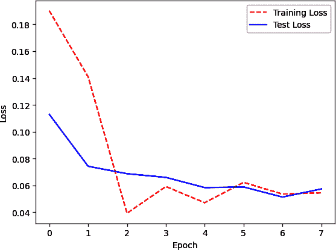
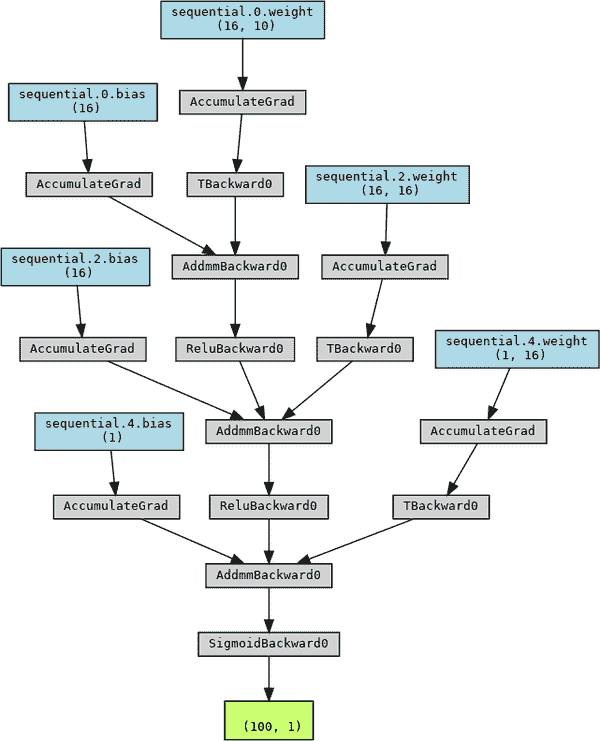

# 第二十一章 神经网络

# 21.0 引言

基本神经网络的核心是*单元*（也称为*节点*或*神经元*）。一个单元接收一个或多个输入，将每个输入乘以一个参数（也称为*权重*），将加权输入的值与一些偏置值（通常为 0）求和，然后将值馈送到激活函数中。然后，该输出被发送到神经网络中更深层的其他神经元（如果存在）。

神经网络可以被视为一系列连接的层，形成一个网络，将观察的特征值连接在一端，目标值（例如，观察的类）连接在另一端。*前馈*神经网络—也称为*多层感知器*—是任何实际设置中使用的最简单的人工神经网络。名称“前馈”来自于这样一个事实：观察的特征值被“前向”传递到网络中，每一层逐渐地转换特征值，目标是输出与目标值相同（或接近）。

具体而言，前馈神经网络包含三种类型的层。在神经网络的开始处是输入层，每个单元包含单个特征的观察值。例如，如果一个观察有 100 个特征，输入层有 100 个单元。在神经网络的末端是输出层，它将中间层（称为*隐藏层*）的输出转换为对任务有用的值。例如，如果我们的目标是二元分类，可以使用一个输出层，其中一个单元使用 sigmoid 函数将自己的输出缩放到 0 到 1 之间，表示预测的类概率。

在输入层和输出层之间是所谓的隐藏层。这些隐藏层逐步转换从输入层获取的特征值，以使其在被输出层处理后类似于目标类。具有许多隐藏层（例如，10、100、1,000）的神经网络被认为是“深”网络。训练深度神经网络的过程称为*深度学习*。

神经网络通常是用高斯或正态均匀分布中的小随机值初始化所有参数。一旦观察到（或更频繁地说是一组称为*批量*的观察），通过网络，输出的值与观察到的真实值使用损失函数进行比较。这称为*前向传播*。接下来，算法通过网络“向后”传播，识别每个参数在预测值和真实值之间误差中的贡献，这个过程称为*反向传播*。在每个参数处，优化算法确定每个权重应该调整多少以改善输出。

神经网络通过重复进行前向传播和反向传播的过程来学习，每个观察结果都会多次（每次所有观察结果都通过网络称为*epoch*，训练通常包含多个 epoch），通过使用*梯度下降*过程来逐步优化参数值，从而优化给定输出的参数值。

在本章中，我们将使用上一章节中使用的同一 Python 库 PyTorch 来构建、训练和评估各种神经网络。PyTorch 是深度学习领域内流行的工具，因为其良好编写的 API 和直观表示低级张量操作的能力。PyTorch 的一个关键特性被称为*autograd*，它在前向传播和反向传播后自动计算和存储用于优化网络参数的梯度。

使用 PyTorch 代码创建的神经网络可以使用 CPU（例如，您的笔记本电脑）和 GPU（例如，专门的深度学习计算机）进行训练。在现实世界中使用真实数据时，通常需要使用 GPU 来训练神经网络，因为对于大数据和复杂网络，使用 GPU 比使用 CPU 快数个数量级。然而，本书中的所有神经网络都足够小和简单，可以仅使用 CPU 在几分钟内训练。只需注意，当我们有更大的网络和更多的训练数据时，使用 CPU 训练比使用 GPU 训练*显著*慢。

# 21.1 使用 PyTorch 的 Autograd

## 问题

您希望在前向传播和反向传播后使用 PyTorch 的自动微分功能来计算和存储梯度。

## 解决方案

使用`requires_grad`选项设置为`True`创建张量：

```py
# Import libraries
import torch

# Create a torch tensor that requires gradients
t = torch.tensor([1.0, 2.0, 3.0], requires_grad=True)

# Perform a tensor operation simulating "forward propagation"
tensor_sum = t.sum()

# Perform back propagation
tensor_sum.backward()

# View the gradients
t.grad
```

```py
tensor([1., 1., 1.])
```

## 讨论

自动微分是 PyTorch 的核心特性之一，也是其作为深度学习库受欢迎的重要因素之一。能够轻松计算、存储和可视化梯度使得 PyTorch 对于从头构建神经网络的研究人员和爱好者来说非常直观。

PyTorch 使用有向无环图（DAG）来记录在数据上执行的所有数据和计算操作。这非常有用，但也意味着我们在尝试应用需要梯度的 PyTorch 数据的操作时需要小心。在使用自动微分时，我们不能轻松地将张量转换为 NumPy 数组，也不能将其转换回来，而不会“破坏图”，这是用来描述不支持自动微分的操作的术语：

```py
import torch

tensor = torch.tensor([1.0,2.0,3.0], requires_grad=True)
tensor.numpy()
```

```py
RuntimeError: Can't call numpy() on Tensor that requires grad. Use
    tensor.detach().numpy() instead.
```

要将此张量转换为 NumPy 数组，我们需要在其上调用`detach()`方法，这将中断计算图，从而无法自动计算梯度。虽然这确实有用，但值得注意的是，分离张量将阻止 PyTorch 自动计算梯度。

## 参见

+   [PyTorch Autograd 教程](https://oreil.ly/mOWSw)

# 21.2 为神经网络预处理数据

## 问题

你想为神经网络预处理数据。

## 解决方案

使用 scikit-learn 的`StandardScaler`标准化每个特征：

```py
# Load libraries
from sklearn import preprocessing
import numpy as np

# Create feature
features = np.array([[-100.1, 3240.1],
                     [-200.2, -234.1],
                     [5000.5, 150.1],
                     [6000.6, -125.1],
                     [9000.9, -673.1]])

# Create scaler
scaler = preprocessing.StandardScaler()

# Convert to a tensor
features_standardized_tensor = torch.from_numpy(features)

# Show features
features_standardized_tensor
```

```py
tensor([[-100.1000, 3240.1000],
        [-200.2000, -234.1000],
        [5000.5000,  150.1000],
        [6000.6000, -125.1000],
        [9000.9000, -673.1000]], dtype=torch.float64)
```

## 讨论

尽管这个配方与配方 4.2 非常相似，但由于对神经网络的重要性，值得重复。通常情况下，神经网络的参数被初始化（即创建）为小的随机数。当特征值远远大于参数值时，神经网络的表现通常不佳。此外，由于观察的特征值在通过各个单元时被合并，因此重要的是所有特征具有相同的尺度。

出于这些原因，最佳实践是（虽然不总是必要；例如，当所有特征都是二进制时）标准化每个特征，使得特征值具有均值为 0 和标准差为 1。使用 scikit-learn 的`StandardScaler`可以轻松实现这一点。

然而，如果你需要在创建了`requires_grad=True`的张量之后执行此操作，则需要在 PyTorch 中原生地执行，以避免破坏图形。虽然通常会在开始训练网络之前标准化特征，但了解如何在 PyTorch 中完成相同的事情也是值得的：

```py
# Load library
import torch

# Create features
torch_features = torch.tensor([[-100.1, 3240.1],
                               [-200.2, -234.1],
                               [5000.5, 150.1],
                               [6000.6, -125.1],
                               [9000.9, -673.1]], requires_grad=True)

# Compute the mean and standard deviation
mean = torch_features.mean(0, keepdim=True)
standard_deviation = torch_features.std(0, unbiased=False, keepdim=True)

# Standardize the features using the mean and standard deviation
torch_features_standardized = torch_features - mean
torch_features_standardized /= standard_deviation

# Show standardized features
torch_features_standardized
```

```py
tensor([[-1.1254,  1.9643],
        [-1.1533, -0.5007],
        [ 0.2953, -0.2281],
        [ 0.5739, -0.4234],
        [ 1.4096, -0.8122]], grad_fn=<DivBackward0>)
```

# 21.3 设计一个神经网络

## 问题

你想设计一个神经网络。

## 解决方案

使用 PyTorch 的`nn.Module`类定义一个简单的神经网络架构：

```py
# Import libraries
import torch
import torch.nn as nn

# Define a neural network
class SimpleNeuralNet(nn.Module):
    def __init__(self):
        super(SimpleNeuralNet, self).__init__()
        self.fc1 = nn.Linear(10, 16)
        self.fc2 = nn.Linear(16, 16)
        self.fc3 = nn.Linear(16, 1)

    def forward(self, x):
        x = nn.functional.relu(self.fc1(x))
        x = nn.functional.relu(self.fc2(x))
        x = nn.functional.sigmoid(self.fc3(x))
        return x

# Initialize the neural network
network = SimpleNeuralNet()

# Define loss function, optimizer
loss_criterion = nn.BCELoss()
optimizer = torch.optim.RMSprop(network.parameters())

# Show the network
network
```

```py
SimpleNeuralNet(
  (fc1): Linear(in_features=10, out_features=16, bias=True)
  (fc2): Linear(in_features=16, out_features=16, bias=True)
  (fc3): Linear(in_features=16, out_features=1, bias=True)
)
```

## 讨论

神经网络由多层单元组成。然而，关于层类型及其如何组合形成网络架构有很多不同的选择。虽然有一些常用的架构模式（我们将在本章中介绍），但选择正确的架构大多是一门艺术，并且是大量研究的主题。

要在 PyTorch 中构建一个前馈神经网络，我们需要就网络架构和训练过程做出许多选择。请记住，每个隐藏层中的每个单元：

1.  接收若干个输入。

1.  通过参数值加权每个输入。

1.  将所有加权输入与一些偏差（通常为 0）相加。

1.  最常见的是应用一些函数（称为*激活函数*）。

1.  将输出发送到下一层的单元。

首先，对于隐藏层和输出层中的每一层，我们必须定义包括在该层中的单元数和激活函数。总体来说，一个层中有更多的单元，我们的网络就能够学习更复杂的模式。然而，更多的单元可能会使我们的网络过度拟合训练数据，从而损害测试数据的性能。

对于隐藏层，一个流行的激活函数是*修正线性单元*（ReLU）：

<math display="block"><mrow><mi>f</mi> <mo>(</mo> <mi>z</mi> <mo>)</mo> <mo>=</mo> <mo form="prefix" movablelimits="true">max</mo> <mo>(</mo> <mn>0</mn> <mo>,</mo> <mi>z</mi> <mo>)</mo></mrow></math>

其中<math display="inline"><mi>z</mi></math>是加权输入和偏差的总和。正如我们所见，如果<math display="inline"><mi>z</mi></math>大于 0，则激活函数返回<math display="inline"><mi>z</mi></math>；否则，函数返回 0。这个简单的激活函数具有许多理想的特性（其讨论超出了本书的范围），这使其成为神经网络中的热门选择。然而，我们应该注意，存在许多十几种激活函数。

第二步，我们需要定义网络中要使用的隐藏层的数量。更多的层允许网络学习更复杂的关系，但需要计算成本。

第三步，我们必须定义输出层激活函数（如果有的话）的结构。输出函数的性质通常由网络的目标确定。以下是一些常见的输出层模式：

二元分类

一个带有 sigmoid 激活函数的单元

多类别分类

*k*个单元（其中*k*是目标类别的数量）和 softmax 激活函数

回归

一个没有激活函数的单元

第四步，我们需要定义一个损失函数（衡量预测值与真实值匹配程度的函数）；同样，这通常由问题类型决定：

二元分类

二元交叉熵

多类别分类

分类交叉熵

回归

均方误差

第五步，我们需要定义一个优化器，直观上可以将其视为我们在损失函数上“漫步”以找到产生最低误差的参数值的策略。常见的优化器选择包括随机梯度下降、带动量的随机梯度下降、均方根传播以及自适应矩估计（有关这些优化器的更多信息，请参见“参考文献”）。

第六步，我们可以选择一个或多个指标来评估性能，如准确性。

在我们的例子中，我们使用`torch.nn.Module`命名空间来组成一个简单的顺序神经网络，可以进行二元分类。在 PyTorch 中，标准的方法是创建一个子类，继承`torch.nn.Module`类，在`__init__`方法中实例化网络架构，并在类的`forward`方法中定义我们希望在每次前向传递中执行的数学操作。在 PyTorch 中定义网络的方法有很多种，虽然在本例中我们使用了函数式方法作为我们的激活函数（如`nn.functional.relu`），我们也可以将这些激活函数定义为层。如果我们希望将网络中的所有东西组成一层，我们可以使用`Sequential`类：

```py
# Import libraries
import torch

# Define a neural network using `Sequential`
class SimpleNeuralNet(nn.Module):
    def __init__(self):
        super(SimpleNeuralNet, self).__init__()
        self.sequential = torch.nn.Sequential(
            torch.nn.Linear(10, 16),
            torch.nn.ReLU(),
            torch.nn.Linear(16,16),
            torch.nn.ReLU(),
            torch.nn.Linear(16, 1),
            torch.nn.Sigmoid()
        )

    def forward(self, x):
        x = self.sequential(x)
        return x

# Instantiate and view the network
SimpleNeuralNet()
```

```py
SimpleNeuralNet(
  (sequential): Sequential(
    (0): Linear(in_features=10, out_features=16, bias=True)
    (1): ReLU()
    (2): Linear(in_features=16, out_features=16, bias=True)
    (3): ReLU()
    (4): Linear(in_features=16, out_features=1, bias=True)
    (5): Sigmoid()
  )
)
```

在这两种情况下，网络本身都是一个两层神经网络（当计算层数时，不包括输入层，因为它没有任何要学习的参数），使用 PyTorch 的顺序模型进行定义。每一层都是“密集的”（也称为“全连接的”），意味着前一层中的所有单元都连接到下一层中的所有单元。

在第一个隐藏层中，我们设置 `out_features=16`，意味着该层包含 16 个单元。这些单元在我们类的 `forward` 方法中使用 ReLU 激活函数定义为 `x = nn.functional.relu(self.fc1(x))`。我们网络的第一层大小为 `(10, 16)`，这告诉第一层期望从输入数据中每个观测值有 10 个特征值。这个网络设计用于二元分类，因此输出层只包含一个单元，使用 sigmoid 激活函数将输出约束在 0 到 1 之间（表示观测为类别 1 的概率）。

## 另请参阅

+   [PyTorch 教程：构建神经网络](https://oreil.ly/iT8iv)

+   [分类中的损失函数，维基百科](https://oreil.ly/4bPXv)

+   [深度神经网络分类中的损失函数，Katarzyna Janocha 和 Wojciech Marian Czarnecki](https://oreil.ly/pplP-)

# 21.4 训练二元分类器

## 问题

您希望训练一个二元分类器神经网络。

## 解决方案

使用 PyTorch 构建一个前馈神经网络并对其进行训练：

```py
# Import libraries
import torch
import torch.nn as nn
import numpy as np
from torch.utils.data import DataLoader, TensorDataset
from torch.optim import RMSprop
from sklearn.datasets import make_classification
from sklearn.model_selection import train_test_split

# Create training and test sets
features, target = make_classification(n_classes=2, n_features=10,
    n_samples=1000)
features_train, features_test, target_train, target_test = train_test_split(
    features, target, test_size=0.1, random_state=1)

# Set random seed
torch.manual_seed(0)
np.random.seed(0)

# Convert data to PyTorch tensors
x_train = torch.from_numpy(features_train).float()
y_train = torch.from_numpy(target_train).float().view(-1, 1)
x_test = torch.from_numpy(features_test).float()
y_test = torch.from_numpy(target_test).float().view(-1, 1)

# Define a neural network using `Sequential`
class SimpleNeuralNet(nn.Module):
    def __init__(self):
        super(SimpleNeuralNet, self).__init__()
        self.sequential = torch.nn.Sequential(
            torch.nn.Linear(10, 16),
            torch.nn.ReLU(),
            torch.nn.Linear(16,16),
            torch.nn.ReLU(),
            torch.nn.Linear(16, 1),
            torch.nn.Sigmoid()
        )

    def forward(self, x):
        x = self.sequential(x)
        return x

# Initialize neural network
network = SimpleNeuralNet()

# Define loss function, optimizer
criterion = nn.BCELoss()
optimizer = RMSprop(network.parameters())

# Define data loader
train_data = TensorDataset(x_train, y_train)
train_loader = DataLoader(train_data, batch_size=100, shuffle=True)

# Compile the model using torch 2.0's optimizer
network = torch.compile(network)

# Train neural network
epochs = 3
for epoch in range(epochs):
    for batch_idx, (data, target) in enumerate(train_loader):
        optimizer.zero_grad()
        output = network(data)
        loss = criterion(output, target)
        loss.backward()
        optimizer.step()
    print("Epoch:", epoch+1, "\tLoss:", loss.item())

# Evaluate neural network
with torch.no_grad():
    output = network(x_test)
    test_loss = criterion(output, y_test)
    test_accuracy = (output.round() == y_test).float().mean()
    print("Test Loss:", test_loss.item(), "\tTest Accuracy:",
        test_accuracy.item())
```

```py
Epoch: 1 	Loss: 0.19006995856761932
Epoch: 2 	Loss: 0.14092367887496948
Epoch: 3 	Loss: 0.03935524448752403
Test Loss: 0.06877756118774414 	Test Accuracy: 0.9700000286102295
```

## 讨论

在 Recipe 21.3 中，我们讨论了如何使用 PyTorch 的顺序模型构建神经网络。在这个配方中，我们使用了来自 scikit-learn 的 `make_classification` 函数生成的具有 10 个特征和 1,000 个观测值的假分类数据集来训练该神经网络。

我们使用的神经网络与 Recipe 21.3 中的相同（详见该配方进行详细解释）。不同之处在于，我们只是创建了神经网络，而没有对其进行训练。

最后，我们使用 `with torch.no_grad()` 来评估网络。这表示我们不应计算在代码这一部分中进行的任何张量操作的梯度。由于我们只在模型训练过程中使用梯度，因此我们不希望为在其外部发生的操作（如预测或评估）存储新梯度。

`epochs` 变量定义了在训练数据时使用的 epochs 数量。`batch_size` 设置了在更新参数之前要通过网络传播的观测值数量。

然后，我们迭代多个 epochs，通过网络进行前向传递使用 `forward` 方法，然后反向传递以更新梯度。结果是一个经过训练的模型。

# 21.5 训练多类分类器

## 问题

您希望训练一个多类分类器神经网络。

## 解决方案

使用 PyTorch 构建一个具有 softmax 激活函数输出层的前馈神经网络：

```py
# Import libraries
import torch
import torch.nn as nn
import numpy as np
from torch.utils.data import DataLoader, TensorDataset
from torch.optim import RMSprop
from sklearn.datasets import make_classification
from sklearn.model_selection import train_test_split

N_CLASSES=3
EPOCHS=3

# Create training and test sets
features, target = make_classification(n_classes=N_CLASSES, n_informative=9,
    n_redundant=0, n_features=10, n_samples=1000)
features_train, features_test, target_train, target_test = train_test_split(
    features, target, test_size=0.1, random_state=1)

# Set random seed
torch.manual_seed(0)
np.random.seed(0)

# Convert data to PyTorch tensors
x_train = torch.from_numpy(features_train).float()
y_train = torch.nn.functional.one_hot(torch.from_numpy(target_train).long(),
    num_classes=N_CLASSES).float()
x_test = torch.from_numpy(features_test).float()
y_test = torch.nn.functional.one_hot(torch.from_numpy(target_test).long(),
    num_classes=N_CLASSES).float()

# Define a neural network using `Sequential`
class SimpleNeuralNet(nn.Module):
    def __init__(self):
        super(SimpleNeuralNet, self).__init__()
        self.sequential = torch.nn.Sequential(
            torch.nn.Linear(10, 16),
            torch.nn.ReLU(),
            torch.nn.Linear(16,16),
            torch.nn.ReLU(),
            torch.nn.Linear(16,3),
            torch.nn.Softmax()
        )

    def forward(self, x):
        x = self.sequential(x)
        return x

# Initialize neural network
network = SimpleNeuralNet()

# Define loss function, optimizer
criterion = nn.CrossEntropyLoss()
optimizer = RMSprop(network.parameters())

# Define data loader
train_data = TensorDataset(x_train, y_train)
train_loader = DataLoader(train_data, batch_size=100, shuffle=True)

# Compile the model using torch 2.0's optimizer
network = torch.compile(network)

# Train neural network
for epoch in range(EPOCHS):
    for batch_idx, (data, target) in enumerate(train_loader):
        optimizer.zero_grad()
        output = network(data)
        loss = criterion(output, target)
        loss.backward()
        optimizer.step()
    print("Epoch:", epoch+1, "\tLoss:", loss.item())

# Evaluate neural network
with torch.no_grad():
    output = network(x_test)
    test_loss = criterion(output, y_test)
    test_accuracy = (output.round() == y_test).float().mean()
    print("Test Loss:", test_loss.item(), "\tTest Accuracy:",
        test_accuracy.item())
```

```py
Epoch: 1 	Loss: 0.8022041916847229
Epoch: 2 	Loss: 0.775616466999054
Epoch: 3 	Loss: 0.7751263380050659
Test Loss: 0.8105319142341614 	Test Accuracy: 0.8199999928474426
```

## 讨论

在这个解决方案中，我们创建了一个类似于上一个示例中的二元分类器的神经网络，但是有一些显著的改变。在我们生成的分类数据中，我们设置了`N_CLASSES=3`。为了处理多类分类问题，我们还使用了`nn.CrossEntropyLoss()`，该函数期望目标是独热编码的。为了实现这一点，我们使用了`torch.nn.functional.one_hot`函数，最终得到一个独热编码的数组，其中`1.`的位置表示给定观察的类别：

```py
# View target matrix
y_train
```

```py
tensor([[1., 0., 0.],
        [0., 1., 0.],
        [1., 0., 0.],
        ...,
        [0., 1., 0.],
        [1., 0., 0.],
        [0., 0., 1.]])
```

因为这是一个多类分类问题，我们使用了大小为 3 的输出层（每个类别一个）并包含 softmax 激活函数。Softmax 激活函数将返回一个数组，其中的 3 个值相加为 1。这 3 个值表示一个观察结果属于每个类别的概率。

如本文提到的，我们使用了适合多类分类的损失函数，即分类交叉熵损失函数：`nn.CrossEntropyLoss()`。

# 21.6 训练回归器

## 问题

您希望为回归训练一个神经网络。

## 解决方案

使用 PyTorch 构建一个只有一个输出单元且没有激活函数的前馈神经网络：

```py
# Import libraries
import torch
import torch.nn as nn
import numpy as np
from torch.utils.data import DataLoader, TensorDataset
from torch.optim import RMSprop
from sklearn.datasets import make_regression
from sklearn.model_selection import train_test_split

EPOCHS=5

# Create training and test sets
features, target = make_regression(n_features=10, n_samples=1000)
features_train, features_test, target_train, target_test = train_test_split(
    features, target, test_size=0.1, random_state=1)

# Set random seed
torch.manual_seed(0)
np.random.seed(0)

# Convert data to PyTorch tensors
x_train = torch.from_numpy(features_train).float()
y_train = torch.from_numpy(target_train).float().view(-1,1)
x_test = torch.from_numpy(features_test).float()
y_test = torch.from_numpy(target_test).float().view(-1,1)

# Define a neural network using `Sequential`
class SimpleNeuralNet(nn.Module):
    def __init__(self):
        super(SimpleNeuralNet, self).__init__()
        self.sequential = torch.nn.Sequential(
            torch.nn.Linear(10, 16),
            torch.nn.ReLU(),
            torch.nn.Linear(16,16),
            torch.nn.ReLU(),
            torch.nn.Linear(16,1),
        )

    def forward(self, x):
        x = self.sequential(x)
        return x

# Initialize neural network
network = SimpleNeuralNet()

# Define loss function, optimizer
criterion = nn.MSELoss()
optimizer = RMSprop(network.parameters())

# Define data loader
train_data = TensorDataset(x_train, y_train)
train_loader = DataLoader(train_data, batch_size=100, shuffle=True)

# Compile the model using torch 2.0's optimizer
network = torch.compile(network)

# Train neural network
for epoch in range(EPOCHS):
    for batch_idx, (data, target) in enumerate(train_loader):
        optimizer.zero_grad()
        output = network(data)
        loss = criterion(output, target)
        loss.backward()
        optimizer.step()
    print("Epoch:", epoch+1, "\tLoss:", loss.item())

# Evaluate neural network
with torch.no_grad():
    output = network(x_test)
    test_loss = float(criterion(output, y_test))
    print("Test MSE:", test_loss)
```

```py
Epoch: 1 	Loss: 10764.02734375
Epoch: 2 	Loss: 1356.510009765625
Epoch: 3 	Loss: 504.9664306640625
Epoch: 4 	Loss: 199.11314392089844
Epoch: 5 	Loss: 191.20834350585938
Test MSE: 162.24497985839844
```

## 讨论

完全可以创建一个神经网络来预测连续值，而不是类概率。在我们的二元分类器的情况下（Recipe 21.4），我们使用了一个具有单个单元和 sigmoid 激活函数的输出层，以生成观察是类 1 的概率。重要的是，sigmoid 激活函数将输出值限制在 0 到 1 之间。如果我们去除这种约束，即没有激活函数，我们允许输出为连续值。

此外，因为我们正在训练回归模型，我们应该使用适当的损失函数和评估指标，在我们的情况下是均方误差：

<math display="block"><mrow><mo form="prefix">MSE</mo> <mo>=</mo> <mfrac><mn>1</mn> <mi>n</mi></mfrac> <munderover><mo>∑</mo> <mrow><mrow><mi>i</mi><mo>=</mo><mn>1</mn></mrow></mrow> <mi>n</mi></munderover> <msup><mrow><mo>(</mo><msub><mover accent="true"><mi>y</mi> <mo>^</mo></mover> <mi>i</mi></msub> <mo>-</mo><msub><mi>y</mi> <mi>i</mi></msub> <mo>)</mo></mrow> <mn>2</mn></msup></mrow></math>

其中<math display="inline"><mi>n</mi></math>是观察数量；<math display="inline"><msub><mi>y</mi><mi>i</mi></msub></math>是我们试图预测的目标<math display="inline"><mi>y</mi></math>的真实值，对于观察<math display="inline"><mi>i</mi></math>；<math display="inline"><msub><mover accent="true"><mi>y</mi> <mo>^</mo></mover><mi>i</mi></msub></math>是模型对<math display="inline"><msub><mi>y</mi><mi>i</mi></msub></math>的预测值。

最后，由于我们使用了使用 scikit-learn 的`make_regression`生成的模拟数据，我们不需要对特征进行标准化。然而，需要注意的是，在几乎所有实际情况下，标准化是必要的。

# 21.7 进行预测

## 问题

您希望使用神经网络进行预测。

## 解决方案

使用 PyTorch 构建一个前馈神经网络，然后使用`forward`进行预测：

```py
# Import libraries
import torch
import torch.nn as nn
import numpy as np
from torch.utils.data import DataLoader, TensorDataset
from torch.optim import RMSprop
from sklearn.datasets import make_classification
from sklearn.model_selection import train_test_split

# Create training and test sets
features, target = make_classification(n_classes=2, n_features=10,
    n_samples=1000)
features_train, features_test, target_train, target_test = train_test_split(
    features, target, test_size=0.1, random_state=1)

# Set random seed
torch.manual_seed(0)
np.random.seed(0)

# Convert data to PyTorch tensors
x_train = torch.from_numpy(features_train).float()
y_train = torch.from_numpy(target_train).float().view(-1, 1)
x_test = torch.from_numpy(features_test).float()
y_test = torch.from_numpy(target_test).float().view(-1, 1)

# Define a neural network using `Sequential`
class SimpleNeuralNet(nn.Module):
    def __init__(self):
        super(SimpleNeuralNet, self).__init__()
        self.sequential = torch.nn.Sequential(
            torch.nn.Linear(10, 16),
            torch.nn.ReLU(),
            torch.nn.Linear(16,16),
            torch.nn.ReLU(),
            torch.nn.Linear(16, 1),
            torch.nn.Sigmoid()
        )

    def forward(self, x):
        x = self.sequential(x)
        return x

# Initialize neural network
network = SimpleNeuralNet()

# Define loss function, optimizer
criterion = nn.BCELoss()
optimizer = RMSprop(network.parameters())

# Define data loader
train_data = TensorDataset(x_train, y_train)
train_loader = DataLoader(train_data, batch_size=100, shuffle=True)

# Compile the model using torch 2.0's optimizer
network = torch.compile(network)

# Train neural network
epochs = 3
for epoch in range(epochs):
    for batch_idx, (data, target) in enumerate(train_loader):
        optimizer.zero_grad()
        output = network(data)
        loss = criterion(output, target)
        loss.backward()
        optimizer.step()
    print("Epoch:", epoch+1, "\tLoss:", loss.item())

# Evaluate neural network
with torch.no_grad():
    predicted_class = network.forward(x_train).round()

predicted_class[0]
```

```py
Epoch: 1 	Loss: 0.19006995856761932
Epoch: 2 	Loss: 0.14092367887496948
Epoch: 3 	Loss: 0.03935524448752403
tensor([1.])
```

## 讨论

在 PyTorch 中进行预测非常容易。一旦我们训练了神经网络，我们可以使用 `forward` 方法（已作为训练过程的一部分使用），该方法接受一组特征作为输入，并通过网络进行前向传递。在我们的解决方案中，神经网络被设置为二元分类，因此预测的输出是属于类 1 的概率。预测值接近 1 的观察结果高度可能属于类 1，而预测值接近 0 的观察结果高度可能属于类 0。因此，我们使用 `round` 方法将这些值转换为二元分类器中的 1 和 0。

# 21.8 可视化训练历史

## 问题

您希望找到神经网络损失和/或准确率得分的“甜蜜点”。

## 解决方案

使用 Matplotlib 可视化每个 epoch 中测试集和训练集的损失：

```py
# Load libraries
import torch
import torch.nn as nn
from torch.utils.data import DataLoader, TensorDataset
from torch.optim import RMSprop
from sklearn.datasets import make_classification
from sklearn.model_selection import train_test_split

import numpy as np
import matplotlib.pyplot as plt

# Create training and test sets
features, target = make_classification(n_classes=2, n_features=10,
    n_samples=1000)
features_train, features_test, target_train, target_test = train_test_split(
    features, target, test_size=0.1, random_state=1)

# Set random seed
torch.manual_seed(0)
np.random.seed(0)

# Convert data to PyTorch tensors
x_train = torch.from_numpy(features_train).float()
y_train = torch.from_numpy(target_train).float().view(-1, 1)
x_test = torch.from_numpy(features_test).float()
y_test = torch.from_numpy(target_test).float().view(-1, 1)

# Define a neural network using `Sequential`
class SimpleNeuralNet(nn.Module):
    def __init__(self):
        super(SimpleNeuralNet, self).__init__()
        self.sequential = torch.nn.Sequential(
            torch.nn.Linear(10, 16),
            torch.nn.ReLU(),
            torch.nn.Linear(16,16),
            torch.nn.ReLU(),
            torch.nn.Linear(16, 1),
            torch.nn.Sigmoid()
        )

    def forward(self, x):
        x = self.sequential(x)
        return x

# Initialize neural network
network = SimpleNeuralNet()

# Define loss function, optimizer
criterion = nn.BCELoss()
optimizer = RMSprop(network.parameters())

# Define data loader
train_data = TensorDataset(x_train, y_train)
train_loader = DataLoader(train_data, batch_size=100, shuffle=True)

# Compile the model using torch 2.0's optimizer
network = torch.compile(network)

# Train neural network
epochs = 8
train_losses = []
test_losses = []
for epoch in range(epochs):
    for batch_idx, (data, target) in enumerate(train_loader):
        optimizer.zero_grad()
        output = network(data)
        loss = criterion(output, target)
        loss.backward()
        optimizer.step()

    with torch.no_grad():
        train_output = network(x_train)
        train_loss = criterion(output, target)
        train_losses.append(train_loss.item())

        test_output = network(x_test)
        test_loss = criterion(test_output, y_test)
        test_losses.append(test_loss.item())

# Visualize loss history
epochs = range(0, epochs)
plt.plot(epochs, train_losses, "r--")
plt.plot(epochs, test_losses, "b-")
plt.legend(["Training Loss", "Test Loss"])
plt.xlabel("Epoch")
plt.ylabel("Loss")
plt.show();
```



## 讨论

当我们的神经网络是新的时，它的性能会比较差。随着神经网络在训练数据上的学习，模型在训练集和测试集上的错误通常会减少。然而，在某个点上，神经网络可能会开始“记忆”训练数据并过拟合。当这种情况发生时，训练错误可能会减少，而测试错误则开始增加。因此，在许多情况下，存在一个“甜蜜点”，在这个点上测试错误（我们主要关心的错误）达到最低点。这种效果可以在解决方案中看到，我们可视化了每个 epoch 的训练和测试损失。请注意，测试错误在第 6 个 epoch 左右达到最低点，此后训练损失趋于平稳，而测试损失开始增加。从这一点开始，模型开始过拟合。

# 21.9 使用权重正则化来减少过拟合

## 问题

您希望通过正则化网络的权重来减少过拟合。

## 解决方案

尝试对网络参数进行惩罚，也称为 *weight regularization*：

```py
# Import libraries
import torch
import torch.nn as nn
import numpy as np
from torch.utils.data import DataLoader, TensorDataset
from torch.optim import RMSprop
from sklearn.datasets import make_classification
from sklearn.model_selection import train_test_split

# Create training and test sets
features, target = make_classification(n_classes=2, n_features=10,
    n_samples=1000)
features_train, features_test, target_train, target_test = train_test_split(
    features, target, test_size=0.1, random_state=1)

# Set random seed
torch.manual_seed(0)
np.random.seed(0)

# Convert data to PyTorch tensors
x_train = torch.from_numpy(features_train).float()
y_train = torch.from_numpy(target_train).float().view(-1, 1)
x_test = torch.from_numpy(features_test).float()
y_test = torch.from_numpy(target_test).float().view(-1, 1)

# Define a neural network using `Sequential`
class SimpleNeuralNet(nn.Module):
    def __init__(self):
        super(SimpleNeuralNet, self).__init__()
        self.sequential = torch.nn.Sequential(
            torch.nn.Linear(10, 16),
            torch.nn.ReLU(),
            torch.nn.Linear(16,16),
            torch.nn.ReLU(),
            torch.nn.Linear(16, 1),
            torch.nn.Sigmoid()
        )

    def forward(self, x):
        x = self.sequential(x)
        return x

# Initialize neural network
network = SimpleNeuralNet()

# Define loss function, optimizer
criterion = nn.BCELoss()
optimizer = torch.optim.Adam(network.parameters(), lr=1e-4, weight_decay=1e-5)

# Define data loader
train_data = TensorDataset(x_train, y_train)
train_loader = DataLoader(train_data, batch_size=100, shuffle=True)

# Compile the model using torch 2.0's optimizer
network = torch.compile(network)

# Train neural network
epochs = 100
for epoch in range(epochs):
    for batch_idx, (data, target) in enumerate(train_loader):
        optimizer.zero_grad()
        output = network(data)
        loss = criterion(output, target)
        loss.backward()
        optimizer.step()

# Evaluate neural network
with torch.no_grad():
    output = network(x_test)
    test_loss = criterion(output, y_test)
    test_accuracy = (output.round() == y_test).float().mean()
    print("Test Loss:", test_loss.item(), "\tTest Accuracy:",
        test_accuracy.item())
```

```py
Test Loss: 0.4030887186527252 	Test Accuracy: 0.9599999785423279
```

## 讨论

抑制过拟合神经网络的一种策略是通过对神经网络的参数（即权重）施加惩罚，使它们趋向于较小的值，从而创建一个不容易过拟合的简单模型。这种方法称为权重正则化或权重衰减。具体而言，在权重正则化中，将惩罚项添加到损失函数中，如 L2 范数。

在 PyTorch 中，我们可以通过在优化器中包含 `weight_decay=1e-5` 来添加权重正则化，在这里正则化发生。在这个例子中，`1e-5` 决定了我们对较高参数值施加的惩罚程度。大于 0 的数值表示在 PyTorch 中使用 L2 正则化。

# 21.10 使用早停策略来减少过拟合

## 问题

您希望通过在训练和测试得分发散时停止训练来减少过拟合。

## 解决方案

使用 PyTorch Lightning 实现一种名为 *early stopping* 的策略：

```py
# Import libraries
import torch
import torch.nn as nn
import numpy as np
from torch.utils.data import DataLoader, TensorDataset
from torch.optim import RMSprop
import lightning as pl
from lightning.pytorch.callbacks.early_stopping import EarlyStopping
from sklearn.datasets import make_classification
from sklearn.model_selection import train_test_split

# Create training and test sets
features, target = make_classification(n_classes=2, n_features=10,
    n_samples=1000)
features_train, features_test, target_train, target_test = train_test_split(
    features, target, test_size=0.1, random_state=1)

# Set random seed
torch.manual_seed(0)
np.random.seed(0)

# Convert data to PyTorch tensors
x_train = torch.from_numpy(features_train).float()
y_train = torch.from_numpy(target_train).float().view(-1, 1)
x_test = torch.from_numpy(features_test).float()
y_test = torch.from_numpy(target_test).float().view(-1, 1)

# Define a neural network using `Sequential`
class SimpleNeuralNet(nn.Module):
    def __init__(self):
        super(SimpleNeuralNet, self).__init__()
        self.sequential = torch.nn.Sequential(
            torch.nn.Linear(10, 16),
            torch.nn.ReLU(),
            torch.nn.Linear(16,16),
            torch.nn.ReLU(),
            torch.nn.Linear(16, 1),
            torch.nn.Sigmoid()
        )

    def forward(self, x):
        x = self.sequential(x)
        return x

class LightningNetwork(pl.LightningModule):
    def __init__(self, network):
        super().__init__()
        self.network = network
        self.criterion = nn.BCELoss()
        self.metric = nn.functional.binary_cross_entropy

    def training_step(self, batch, batch_idx):
        # training_step defines the train loop.
        data, target = batch
        output = self.network(data)
        loss = self.criterion(output, target)
        self.log("val_loss", loss)
        return loss

    def configure_optimizers(self):
        return torch.optim.Adam(self.parameters(), lr=1e-3)

# Define data loader
train_data = TensorDataset(x_train, y_train)
train_loader = DataLoader(train_data, batch_size=100, shuffle=True)

# Initialize neural network
network = LightningNetwork(SimpleNeuralNet())

# Train network
trainer = pl.Trainer(callbacks=[EarlyStopping(monitor="val_loss", mode="min",
    patience=3)], max_epochs=1000)
trainer.fit(model=network, train_dataloaders=train_loader)
```

```py
GPU available: False, used: False
TPU available: False, using: 0 TPU cores
IPU available: False, using: 0 IPUs
HPU available: False, using: 0 HPUs

  | Name      | Type            | Params
----------------------------------------------
0 | network   | SimpleNeuralNet | 465
1 | criterion | BCELoss         | 0
----------------------------------------------
465       Trainable params
0         Non-trainable params
465       Total params
0.002     Total estimated model params size (MB)
/usr/local/lib/python3.10/site-packages/lightning/pytorch/trainer/
    connectors/data_connector.py:224: PossibleUserWarning:
    The dataloader, train_dataloader, does not have many workers which
    may be a bottleneck. Consider increasing the value of the `num_workers`
    argument (try 7 which is the number of cpus on this machine)
    in the `DataLoader` init to improve performance.
  rank_zero_warn(
/usr/local/lib/python3.10/site-packages/lightning/pytorch/trainer/
    trainer.py:1609: PossibleUserWarning: The number of training batches (9)
    is smaller than the logging interval Trainer(log_every_n_steps=50).
    Set a lower value for log_every_n_steps if you want to see logs
    for the training epoch.
  rank_zero_warn(
Epoch 23: 100%|███████████████| 9/9 [00:00<00:00, 59.29it/s, loss=0.147, v_num=5]
```

## 讨论

正如我们在 Recipe 21.8 中讨论的，通常在最初的几个训练 epoch 中，训练和测试错误都会减少，但是在某个时候，网络将开始“记忆”训练数据，导致训练错误继续减少，而测试错误开始增加。因此，对抗过拟合最常见且非常有效的方法之一是监控训练过程，并在测试错误开始增加时停止训练。这种策略称为*早期停止*。

在 PyTorch 中，我们可以将早期停止作为回调函数来实现。回调函数是在训练过程的特定阶段应用的函数，例如在每个 epoch 结束时。然而，PyTorch 本身并没有为您定义一个早期停止的类，因此在这里我们使用流行的库`lightning`（即 PyTorch Lightning）来使用现成的早期停止功能。PyTorch Lightning 是一个为 PyTorch 提供大量有用功能的高级库。在我们的解决方案中，我们包括了 PyTorch Lightning 的`EarlyStopping(monitor="val_loss", mode="min", patience=3)`，以定义我们希望在每个 epoch 监控测试（验证）损失，并且如果经过三个 epoch（默认值）后测试损失没有改善，则中断训练。

如果我们没有包含`EarlyStopping`回调，模型将在完整的 1,000 个最大 epoch 中训练而不会自行停止：

```py
# Train network
trainer = pl.Trainer(max_epochs=1000)
trainer.fit(model=network, train_dataloaders=train_loader)
```

```py
GPU available: False, used: False
TPU available: False, using: 0 TPU cores
IPU available: False, using: 0 IPUs
HPU available: False, using: 0 HPUs

  | Name      | Type            | Params
----------------------------------------------
0 | network   | SimpleNeuralNet | 465
1 | criterion | BCELoss         | 0
----------------------------------------------
465       Trainable params
0         Non-trainable params
465       Total params
0.002     Total estimated model params size (MB)
Epoch 999: 100%|████████████| 9/9 [00:01<00:00,  7.95it/s, loss=0.00188, v_num=6]
`Trainer.fit` stopped: `max_epochs=1000` reached.
Epoch 999: 100%|████████████| 9/9 [00:01<00:00,  7.80it/s, loss=0.00188, v_num=6]
```

# 21.11 使用 Dropout 减少过拟合

## 问题

您希望减少过拟合。

## 解决方案

使用 dropout 在您的网络架构中引入噪声：

```py
# Load libraries
import torch
import torch.nn as nn
import numpy as np
from torch.utils.data import DataLoader, TensorDataset
from torch.optim import RMSprop
from sklearn.datasets import make_classification
from sklearn.model_selection import train_test_split

# Create training and test sets
features, target = make_classification(n_classes=2, n_features=10,
    n_samples=1000)
features_train, features_test, target_train, target_test = train_test_split(
    features, target, test_size=0.1, random_state=1)

# Set random seed
torch.manual_seed(0)
np.random.seed(0)

# Convert data to PyTorch tensors
x_train = torch.from_numpy(features_train).float()
y_train = torch.from_numpy(target_train).float().view(-1, 1)
x_test = torch.from_numpy(features_test).float()
y_test = torch.from_numpy(target_test).float().view(-1, 1)

# Define a neural network using `Sequential`
class SimpleNeuralNet(nn.Module):
    def __init__(self):
        super(SimpleNeuralNet, self).__init__()
        self.sequential = torch.nn.Sequential(
            torch.nn.Linear(10, 16),
            torch.nn.ReLU(),
            torch.nn.Linear(16,16),
            torch.nn.ReLU(),
            torch.nn.Linear(16, 1),
            torch.nn.Dropout(0.1), # Drop 10% of neurons
            torch.nn.Sigmoid(),
        )

    def forward(self, x):
        x = self.sequential(x)
        return x

# Initialize neural network
network = SimpleNeuralNet()

# Define loss function, optimizer
criterion = nn.BCELoss()
optimizer = RMSprop(network.parameters())

# Define data loader
train_data = TensorDataset(x_train, y_train)
train_loader = DataLoader(train_data, batch_size=100, shuffle=True)

# Compile the model using torch 2.0's optimizer
network = torch.compile(network)

# Train neural network
epochs = 3
for epoch in range(epochs):
    for batch_idx, (data, target) in enumerate(train_loader):
        optimizer.zero_grad()
        output = network(data)
        loss = criterion(output, target)
        loss.backward()
        optimizer.step()
    print("Epoch:", epoch+1, "\tLoss:", loss.item())

# Evaluate neural network
with torch.no_grad():
    output = network(x_test)
    test_loss = criterion(output, y_test)
    test_accuracy = (output.round() == y_test).float().mean()
    print("Test Loss:", test_loss.item(), "\tTest Accuracy:",
        test_accuracy.item())
```

```py
Epoch: 1 	Loss: 0.18791493773460388
Epoch: 2 	Loss: 0.17331615090370178
Epoch: 3 	Loss: 0.1384529024362564
Test Loss: 0.12702330946922302 	Test Accuracy: 0.9100000262260437
```

## 讨论

*Dropout* 是一种相对常见的正则化较小神经网络的方法。在 dropout 中，每次为训练创建一批观察时，一个或多个层中的单位比例被乘以零（即被删除）。在此设置中，每个批次都在相同的网络上训练（例如相同的参数），但是每个批次都面对稍微不同版本的该网络的*架构*。

Dropout 被认为是有效的，因为通过在每个批次中不断随机删除单位，它强制单位学习能够在各种网络架构下执行的参数值。也就是说，它们学会了对其他隐藏单元中的干扰（即噪声）具有鲁棒性，从而防止网络简单地记住训练数据。

可以将 dropout 添加到隐藏层和输入层中。当输入层被删除时，其特征值在该批次中不会被引入网络中。

在 PyTorch 中，我们可以通过在网络架构中添加一个`nn.Dropout`层来实现 dropout。每个`nn.Dropout`层将在每个批次中删除前一层中用户定义的超参数单位。

# 21.12 保存模型训练进度

## 问题

鉴于神经网络训练时间较长，您希望在训练过程中保存进度以防中断。

## 解决方案

使用 `torch.save` 函数在每个 epoch 后保存模型：

```py
# Load libraries
import torch
import torch.nn as nn
import numpy as np
from torch.utils.data import DataLoader, TensorDataset
from torch.optim import RMSprop
from sklearn.datasets import make_classification
from sklearn.model_selection import train_test_split

# Create training and test sets
features, target = make_classification(n_classes=2, n_features=10,
    n_samples=1000)
features_train, features_test, target_train, target_test = train_test_split(
    features, target, test_size=0.1, random_state=1)

# Set random seed
torch.manual_seed(0)
np.random.seed(0)

# Convert data to PyTorch tensors
x_train = torch.from_numpy(features_train).float()
y_train = torch.from_numpy(target_train).float().view(-1, 1)
x_test = torch.from_numpy(features_test).float()
y_test = torch.from_numpy(target_test).float().view(-1, 1)

# Define a neural network using `Sequential`
class SimpleNeuralNet(nn.Module):
    def __init__(self):
        super(SimpleNeuralNet, self).__init__()
        self.sequential = torch.nn.Sequential(
            torch.nn.Linear(10, 16),
            torch.nn.ReLU(),
            torch.nn.Linear(16,16),
            torch.nn.ReLU(),
            torch.nn.Linear(16, 1),
            torch.nn.Dropout(0.1), # Drop 10% of neurons
            torch.nn.Sigmoid(),
        )

    def forward(self, x):
        x = self.sequential(x)
        return x

# Initialize neural network
network = SimpleNeuralNet()

# Define loss function, optimizer
criterion = nn.BCELoss()
optimizer = RMSprop(network.parameters())

# Define data loader
train_data = TensorDataset(x_train, y_train)
train_loader = DataLoader(train_data, batch_size=100, shuffle=True)

# Compile the model using torch 2.0's optimizer
network = torch.compile(network)

# Train neural network
epochs = 5
for epoch in range(epochs):
    for batch_idx, (data, target) in enumerate(train_loader):
        optimizer.zero_grad()
        output = network(data)
        loss = criterion(output, target)
        loss.backward()
        optimizer.step()
        # Save the model at the end of every epoch
        torch.save(
            {
                'epoch': epoch,
                'model_state_dict': network.state_dict(),
                'optimizer_state_dict': optimizer.state_dict(),
                'loss': loss,
            },
            "model.pt"
        )
    print("Epoch:", epoch+1, "\tLoss:", loss.item())
```

```py
Epoch: 1 	Loss: 0.18791493773460388
Epoch: 2 	Loss: 0.17331615090370178
Epoch: 3 	Loss: 0.1384529024362564
Epoch: 4 	Loss: 0.1435958743095398
Epoch: 5 	Loss: 0.17967987060546875
```

## 讨论

在现实世界中，神经网络通常需要训练几个小时甚至几天。在此期间，可能发生很多问题：计算机断电、服务器崩溃，或者不体贴的研究生关掉你的笔记本电脑。

我们可以使用 `torch.save` 函数来缓解这个问题，通过在每个 epoch 后保存模型。具体来说，在每个 epoch 后，我们将模型保存到位置 `model.pt`，这是 `torch.save` 函数的第二个参数。如果我们只包含一个文件名（例如 *model.pt*），那么该文件将在每个 epoch 都被最新的模型覆盖。

正如你可以想象的，我们可以引入额外的逻辑，在每几个 epochs 保存模型，仅在损失减少时保存模型等。我们甚至可以将这种方法与 PyTorch Lightning 的提前停止方法结合起来，以确保无论训练在哪个 epoch 结束，我们都能保存模型。

# 21.13 调整神经网络

## 问题

您想自动选择神经网络的最佳超参数。

## 解决方案

使用 PyTorch 的 `ray` 调优库：

```py
# Load libraries
from functools import partial
import numpy as np
import os
import torch
import torch.nn as nn
import torch.nn.functional as F
import torch.optim as optim
from torch.optim import RMSprop
from torch.utils.data import random_split, DataLoader, TensorDataset
from ray import tune
from ray.tune import CLIReporter
from ray.tune.schedulers import ASHAScheduler
from sklearn.datasets import make_classification
from sklearn.model_selection import train_test_split

# Create training and test sets
features, target = make_classification(n_classes=2, n_features=10,
    n_samples=1000)
features_train, features_test, target_train, target_test = train_test_split(
    features, target, test_size=0.1, random_state=1)

# Set random seed
torch.manual_seed(0)
np.random.seed(0)

# Convert data to PyTorch tensors
x_train = torch.from_numpy(features_train).float()
y_train = torch.from_numpy(target_train).float().view(-1, 1)
x_test = torch.from_numpy(features_test).float()
y_test = torch.from_numpy(target_test).float().view(-1, 1)

# Define a neural network using `Sequential`
class SimpleNeuralNet(nn.Module):
    def __init__(self, layer_size_1=10, layer_size_2=10):
        super(SimpleNeuralNet, self).__init__()
        self.sequential = torch.nn.Sequential(
            torch.nn.Linear(10, layer_size_1),
            torch.nn.ReLU(),
            torch.nn.Linear(layer_size_1, layer_size_2),
            torch.nn.ReLU(),
            torch.nn.Linear(layer_size_2, 1),
            torch.nn.Sigmoid()
        )

    def forward(self, x):
        x = self.sequential(x)
        return x

config = {
    "layer_size_1": tune.sample_from(lambda _: 2 ** np.random.randint(2, 9)),
    "layer_size_2": tune.sample_from(lambda _: 2 ** np.random.randint(2, 9)),
    "lr": tune.loguniform(1e-4, 1e-1),
}

scheduler = ASHAScheduler(
    metric="loss",
    mode="min",
    max_t=1000,
    grace_period=1,
    reduction_factor=2
)

reporter = CLIReporter(
    parameter_columns=["layer_size_1", "layer_size_2", "lr"],
    metric_columns=["loss"]
)

# # Train neural network
def train_model(config, epochs=3):
    network = SimpleNeuralNet(config["layer_size_1"], config["layer_size_2"])

    criterion = nn.BCELoss()
    optimizer = optim.SGD(network.parameters(), lr=config["lr"], momentum=0.9)

    train_data = TensorDataset(x_train, y_train)
    train_loader = DataLoader(train_data, batch_size=100, shuffle=True)

    # Compile the model using torch 2.0's optimizer
    network = torch.compile(network)

    for epoch in range(epochs):
        for batch_idx, (data, target) in enumerate(train_loader):
            optimizer.zero_grad()
            output = network(data)
            loss = criterion(output, target)
            loss.backward()
            optimizer.step()
            tune.report(loss=(loss.item()))

result = tune.run(
    train_model,
    resources_per_trial={"cpu": 2},
    config=config,
    num_samples=1,
    scheduler=scheduler,
    progress_reporter=reporter
)

best_trial = result.get_best_trial("loss", "min", "last")
print("Best trial config: {}".format(best_trial.config))
print("Best trial final validation loss: {}".format(
    best_trial.last_result["loss"]))

best_trained_model = SimpleNeuralNet(best_trial.config["layer_size_1"],
    best_trial.config["layer_size_2"])
```

```py
== Status ==
Current time: 2023-03-05 23:31:33 (running for 00:00:00.07)
Memory usage on this node: 1.7/15.6 GiB
Using AsyncHyperBand: num_stopped=0
Bracket: Iter 512.000: None | Iter 256.000: None | Iter 128.000: None |
    Iter 64.000: None | Iter 32.000: None | Iter 16.000: None |
    Iter 8.000: None | Iter 4.000: None | Iter 2.000: None |
    Iter 1.000: None
Resources requested: 2.0/7 CPUs, 0/0 GPUs, 0.0/8.95 GiB heap,
    0.0/4.48 GiB objects
Result logdir: /root/ray_results/train_model_2023-03-05_23-31-33
Number of trials: 1/1 (1 RUNNING)
...
```

## 讨论

在第 12.1 和 12.2 节中，我们介绍了使用 scikit-learn 的模型选择技术来识别 scikit-learn 模型的最佳超参数。尽管一般来说，scikit-learn 的方法也可以应用于神经网络，但 `ray` 调优库提供了一个复杂的 API，允许您在 CPU 和 GPU 上调度实验。

模型的超参数*很重要*，应该仔细选择。然而，运行实验来选择超参数可能会成本高昂且耗时。因此，神经网络的自动超参数调整并非万能药，但在特定情况下是一个有用的工具。

在我们的解决方案中，我们对不同的参数进行了搜索，包括层大小和优化器的学习率。`best_trial.config` 显示了在我们的 `ray` 调优配置中导致最低损失和最佳实验结果的参数。

# 21.14 可视化神经网络

## 问题

您想快速可视化神经网络的架构。

## 解决方案

使用 `torch_viz` 的 `make_dot` 函数：

```py
# Load libraries
import torch
import torch.nn as nn
import numpy as np
from torch.utils.data import DataLoader, TensorDataset
from torch.optim import RMSprop
from torchviz import make_dot
from sklearn.datasets import make_classification
from sklearn.model_selection import train_test_split

# Create training and test sets
features, target = make_classification(n_classes=2, n_features=10,
    n_samples=1000)
features_train, features_test, target_train, target_test = train_test_split(
    features, target, test_size=0.1, random_state=1)

# Set random seed
torch.manual_seed(0)
np.random.seed(0)

# Convert data to PyTorch tensors
x_train = torch.from_numpy(features_train).float()
y_train = torch.from_numpy(target_train).float().view(-1, 1)
x_test = torch.from_numpy(features_test).float()
y_test = torch.from_numpy(target_test).float().view(-1, 1)

# Define a neural network using Sequential
class SimpleNeuralNet(nn.Module):
    def __init__(self):
        super(SimpleNeuralNet, self).__init__()
        self.sequential = torch.nn.Sequential(
            torch.nn.Linear(10, 16),
            torch.nn.ReLU(),
            torch.nn.Linear(16,16),
            torch.nn.ReLU(),
            torch.nn.Linear(16, 1),
            torch.nn.Sigmoid()
        )

    def forward(self, x):
        x = self.sequential(x)
        return x

# Initialize neural network
network = SimpleNeuralNet()

# Define loss function, optimizer
criterion = nn.BCELoss()
optimizer = RMSprop(network.parameters())

# Define data loader
train_data = TensorDataset(x_train, y_train)
train_loader = DataLoader(train_data, batch_size=100, shuffle=True)

# Compile the model using torch 2.0's optimizer
network = torch.compile(network)

# Train neural network
epochs = 3
for epoch in range(epochs):
    for batch_idx, (data, target) in enumerate(train_loader):
        optimizer.zero_grad()
        output = network(data)
        loss = criterion(output, target)
        loss.backward()
        optimizer.step()

make_dot(output.detach(), params=dict(
    list(
        network.named_parameters()
        )
      )
    ).render(
        "simple_neural_network",
        format="png"
)
```

```py
'simple_neural_network.png'
```

如果我们打开保存到我们机器上的图像，我们可以看到以下内容：



## 讨论

`torchviz` 库提供了简单的实用函数，可以快速可视化我们的神经网络并将其输出为图像。
