## 第一部分. 简介

尽管这本书的第一部分只有两章，但提供给您在整本书中都将依赖的基本知识和技能是至关重要的。

第一章向您介绍了某些基本的机器学习术语。拥有核心概念的良好词汇量可以帮助您看到机器学习的整体图景，并有助于您理解我们在书中稍后将要探讨的更复杂主题。本章教您什么是机器学习，它如何（或可能）对我们有益或有害，以及我们如何对不同的机器学习任务进行分类。本章最后解释了为什么我们使用 R 进行机器学习，您将使用哪些数据集，以及您可以期待从本书中学到什么。

在第二章中，我们暂时离开机器学习，专注于通过介绍名为*tidyverse*的一系列包来提高您的 R 技能。tidyverse 的包为我们提供了使用更易于阅读、更直观的代码来存储、操作、转换和可视化数据的工具。在处理机器学习项目时，您不需要使用 tidyverse，但这样做可以帮助您简化数据处理过程。我们将在本书的项目中使用 tidyverse 工具，因此在第二章中对其有扎实的了解将有助于您在后续章节中。我相信您会发现这些技能提高了您的 R 编程和数据科学技能。

从第二章开始，我鼓励您与我一起开始编码。为了最大限度地提高您对知识的保留，我强烈建议您在自己的 R 会话中运行代码示例，并保存您的.R 文件，这样您可以在将来参考您的代码。确保您理解每一行代码与其输出之间的关系。

## 第一章. 机器学习简介

*本章涵盖*

+   什么是机器学习

+   监督学习与无监督学习

+   分类、回归、降维和聚类

+   为什么我们使用 R

+   我们将使用哪些数据集

无论你是否意识到，你每天都在与机器学习互动。你在线上看到的广告是基于你之前购买或查看的产品更有可能购买的产品。你上传到社交媒体平台的照片中的人脸会自动识别并标记。你的汽车的 GPS 预测在一天中的某些时间哪些路线会最繁忙，并重新规划路线以缩短行程。你的电子邮件客户端会逐渐学习你想要的电子邮件和你认为垃圾邮件的电子邮件，以使你的收件箱更整洁；你的家庭个人助理能识别你的声音并回应你的请求。从这些对我们日常生活的小改进，到自动驾驶汽车、机器人手术和自动扫描其他类地行星等改变社会的大想法，机器学习已经成为现代生活越来越重要的部分。

但这里有一件事我想让你立刻明白：机器学习不仅仅是大型科技公司或计算机科学家的领域。**任何人**只要有基本的编程技能，就可以在自己的工作中实现机器学习。如果你是一位科学家，机器学习可以让你对所研究的现象有非凡的洞察力。如果你是一位记者，它可以帮助你理解数据中的模式，从而描绘你的故事。如果你是一位商人，机器学习可以帮助你定位正确的客户并预测哪些产品会卖得最好。如果你有疑问或问题，并且你有足够的数据来回答它，机器学习可以帮助你做到这一点。虽然阅读这本书后，你们不会建造智能汽车或会说话的机器人（就像谷歌和 Deep Mind 那样），但你们将获得做出强大预测和识别数据中信息性模式的能力。

我将用任何具备 R 语言基础知识的读者都能理解的水平，教你们机器学习的理论和实践。自从高中以来，我就对数学很糟糕，所以我不期望你们在这方面很出色。尽管你们即将学习的技巧基于数学，但我坚信机器学习中没有难以理解的概念。我们将一起探索的所有过程都将通过图形和直观的方式进行解释。这不仅意味着你们将能够应用和理解这些过程，而且你们将无需通过数学符号就能学到所有这些知识。然而，如果你对数学有浓厚的兴趣，你会发现书中呈现的方程式是“了解即可”，而不是“必须知道”。

在本章中，我们将定义我实际上所说的**机器学习**是什么。你们将了解算法和模型之间的区别，并发现机器学习技术可以根据类型划分，这有助于我们在选择给定任务的最佳技术时进行指导。

### 1.1. 什么是机器学习？

想象一下，你是一家医院的科研人员。如果当新患者入院时，你能计算出他们死亡的风险呢？这将允许临床医生更加积极地治疗高风险患者，并最终挽救更多生命。但你应该从哪里开始呢？你将使用哪些数据？你将如何从数据中获取这些信息？答案是使用机器学习。

机器学习，有时被称为*统计学习*，是人工智能（AI）的一个子领域，其中*算法*“学习”数据中的模式以执行特定任务。尽管算法可能听起来很复杂，但实际上并不复杂。事实上，算法背后的想法一点也不复杂。算法只是一个一步一步的过程，我们用它来实现有开始和结束的事情。厨师们对算法有不同的说法——他们称之为“食谱”。在食谱的每个阶段，你执行某种过程，比如打鸡蛋，然后你遵循食谱中的下一个指令，比如混合原料。

看一下图 1.1 中我制作的制作蛋糕的算法。它从顶部开始，通过一系列操作来烘焙并供应蛋糕。有时会有决策点，我们选择的路线取决于当前的情况，有时我们需要返回或*迭代*到算法的先前步骤。虽然确实可以用算法实现极其复杂的事情，但我希望你能理解，它们只是简单操作的顺序链。

##### 图 1.1。制作和供应蛋糕的算法。我们从顶部开始，并在执行每个操作后，跟随下一个箭头。菱形是决策点，我们接下来跟随的箭头取决于我们蛋糕的状态。虚线箭头显示返回先前操作的路线。这个算法以原料作为输入，输出带有冰淇淋或奶油的蛋糕！


因此，在收集了患者的数据之后，你训练一个机器学习算法来学习与患者生存相关的数据模式。现在，当你收集到一个新患者的数据时，该算法可以估算该患者死亡的风险。

作为另一个例子，想象一下，你为一家电力公司工作，你的工作是确保客户的账单估算准确。你训练一个算法来学习与家庭电力使用相关的数据模式。现在，当一个新的家庭加入电力公司时，你可以估算每个月应该向他们收取多少费用。

最后，假设你是一位政治学家，你正在寻找没有人（包括你）知道的选民类型。你训练一个算法来识别调查数据中的选民模式，以更好地理解什么因素激励特定政治党的选民。你在这两个问题上看到了任何相似之处吗？那么——如果解决方案隐藏在你的数据中——你可以训练一个机器学习算法来为你提取它。

#### 1.1.1\. 人工智能与机器学习

IBM 的科学家亚瑟·萨缪尔在 1959 年首次使用了*机器学习*这个术语。他用来描述一种涉及训练算法学习如何玩国际象棋的 AI 形式。这里的*学习*这个词很重要，因为它区分了机器学习方法与传统 AI。

传统 AI 是程序化的。换句话说，你给计算机一套规则，这样当它遇到新数据时，它就知道应该给出哪个输出。一个例子就是使用`if else`语句来分类动物为狗、猫或蛇：

```
numberOfLegs <- c(4, 4, 0)
climbsTrees <- c(TRUE, FALSE, TRUE)

for (i in 1:3) {
  if (numberOfLegs[i] == 4) {
    if (climbsTrees[i]) print("cat") else print("dog")
  } else print("snake")
}
```

在这段 R 代码中，我创建了三条规则，将我们可用的每一个可能的输入映射到一个输出：

1.  如果动物有四条腿且会爬树，它就是猫。

1.  如果动物有四条腿且不会爬树，它就是狗。

1.  否则，该动物是蛇。

现在，如果我们将这些规则应用于数据，我们会得到预期的答案：

```
[1] "cat"
[1] "dog"
[1] "snake"
```

这种方法的缺点在于我们需要事先知道计算机应该给出的所有可能的输出，而系统永远不会给出我们没有告诉它给出的输出。这与机器学习方法形成对比，在机器学习方法中，我们不是告诉计算机规则，而是给它数据，并允许它自己学习规则。这种方法的优点是机器可以“学习”我们甚至不知道数据中存在的模式——我们提供的数据越多，它在学习这些模式方面就越好（图 1.2）。

##### 图 1.2\. 传统 AI 与机器学习 AI 的比较。在传统的 AI 应用中，我们向计算机提供一套完整的规则。当它接收到数据时，它会输出相关的答案。在机器学习中，我们向计算机提供数据和答案，然后它自己学习规则。当我们通过这些规则传递新的数据时，我们得到这些新数据的答案。

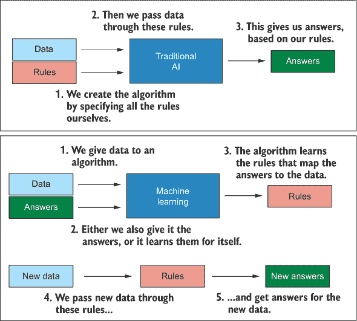

#### 1.1.2\. 模型与算法的区别

在实践中，我们称机器学习算法学习的一组规则为*模型*。一旦模型被学习，我们可以给它提供新的观察数据，它将输出对新数据的预测。我们称之为模型，因为它们以足够简单的方式表示现实世界现象，以至于我们和计算机可以解释和理解它。就像埃菲尔铁塔的模型可能很好地代表了真实的事物，但并不完全相同一样，所以统计模型是现实世界现象的尝试性表示，但不会完美匹配。

| |
| --- |

##### 注意

你可能听说过统计学家乔治·博克斯提出的著名短语：“所有模型都是错误的，但有些是有用的”，这指的是模型的近似性质。

| |
| --- |

学习模型的过程被称为*算法*。正如我们之前发现的，算法只是一系列共同工作的操作，用于解决问题。那么在实践中是如何工作的呢？让我们举一个简单的例子。假设我们有两个连续变量，我们希望训练一个算法，可以基于另一个变量（*结果*或*依赖*变量）预测一个（*预测器*或*独立*变量）。这些变量之间的关系可以用一条直线来描述，这条直线可以用仅两个参数来定义：它的斜率和它与 y 轴交叉的位置（y 截距）。这如图图 1.3 所示。

##### 图 1.3\. 任何直线都可以用其斜率（y 的变化除以 x 的变化）和其截距（当 x=0 时与 y 轴交叉的位置）来描述。方程 *y* = intercept + slope * *x* 可以用来预测给定 x 值的 y 值。

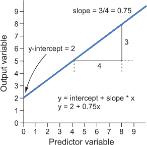

学习这种关系的算法可能看起来像图 1.4 中的例子。我们首先通过所有数据的平均值拟合一条没有斜率的直线。我们计算每个数据点到直线的距离，平方它，并将这些平方值相加。这个*平方和*是衡量直线拟合数据紧密程度的指标。接下来，我们将直线顺时针旋转一点，并测量这条直线的平方和。如果平方和比之前更大，那么我们使拟合变得更差，所以我们将斜率旋转到另一个方向并再次尝试。如果平方和变得更小，那么我们使拟合变得更好。我们继续这个过程，每次我们更接近时，斜率的旋转幅度都稍微小一点，直到我们之前迭代的改进小于我们选择的某个预设值。该算法通过迭代学习模型（斜率和 y 截距），根据预测变量预测输出变量的未来值。这个例子稍微有些粗糙，但希望它能说明这样的算法是如何工作的。

| |
| --- |

##### 注意

机器学习最初令人困惑但最终有趣的方面之一是，有大量的算法可以解决同一类型的问题。原因是不同的人提出了略微不同的解决同一问题的方法，所有这些方法都在试图改进之前的尝试。对于给定的任务，作为数据科学家，我们的任务是选择哪个算法（或算法组合）将学习到最佳性能的模型。

| |
| --- |

虽然某些算法在处理某些类型的数据时可能比其他算法表现更好，但没有任何一个算法会在所有问题上始终优于所有其他算法。这个概念被称为**没有免费午餐定理**。换句话说，你不会得到不劳而获的东西；你需要付出一些努力来找出最适合你特定问题的最佳算法。数据科学家通常会选择一些他们知道对于他们正在处理的数据类型和问题表现良好的算法，并查看哪个算法生成的模型性能最佳。你将在本书后面的章节中看到我们是如何做到这一点的。然而，我们可以通过根据它们执行的功能和执行方式将机器学习算法分为类别来缩小我们的初始选择范围。

##### 图 1.4\. 一个假设的算法，用于学习直线的参数。此算法将两个连续变量作为输入，并通过均值拟合一条直线。它迭代地旋转直线，直到找到一个最小化平方和的解。直线的参数作为学习模型输出。

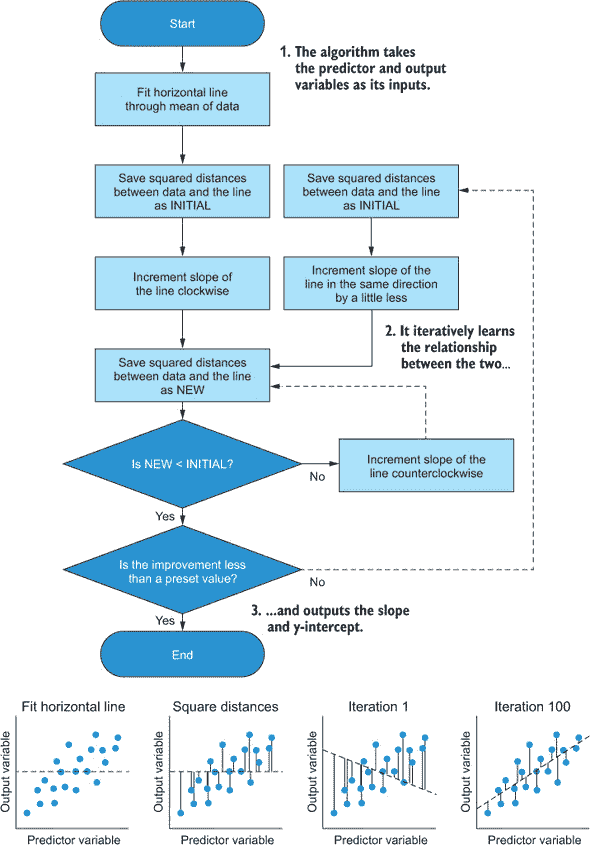

### 1.2. 类别机器学习算法

所有机器学习算法都可以根据它们的学习类型和执行的任务进行分类。有三种学习类型：

+   监督

+   无监督

+   半监督

类型取决于算法的学习方式。它们需要我们通过学习过程来引导吗？还是它们自己学习答案？监督和无监督算法可以进一步分为每类两个子类：

+   监督

    +   分类

    +   回归

+   无监督

    +   维度降低

    +   聚类

该类别取决于算法学习去**做什么**。

因此，我们根据它们的学习方式和它们学习去做的事情来分类算法。但我们为什么要关心这个呢？嗯，我们有**很多**机器学习算法可供选择。我们如何知道该选择哪一个？它们需要什么类型的数据才能正常工作？了解不同算法属于哪些类别可以使我们选择最合适的算法的工作变得简单得多。在下一节中，我将介绍每个类别的定义以及为什么它们与其他类别不同。在本节结束时，你将清楚地了解为什么你会选择一个类别的算法而不是另一个类别的算法。到本书结束时，你将具备应用每个类别中多个算法的技能。

#### 1.2.1. 监督、无监督和半监督学习之间的差异

想象一下，你试图通过使用木块来让幼儿学习形状。在他们面前，他们有一个球、一个立方体和一个星星。你要求他们给你展示立方体，如果他们指向正确的形状，你就告诉他们他们是对的；如果他们错了，你也告诉他们。你重复这个过程，直到幼儿几乎每次都能正确识别形状。这被称为**监督学习**，因为你知道哪种形状是哪种的人，通过告诉他们答案来监督学习者。

现在想象一个幼儿被给了多个球、立方体和星星，但这次还给了三个袋子。幼儿必须把所有的球放在一个袋子里，立方体放在另一个袋子里，星星放在另一个袋子里，但你不会告诉他们是否正确——他们必须自己根据面前的信息来解决这个问题。这被称为**无监督学习**，因为学习者必须自己识别模式，没有任何外部帮助。

如果一个机器学习算法使用的是真实数据或换句话说，是**标记数据**，那么它被称为**监督学习**。例如，如果我们想根据基因表达将患者的活检分类为健康或癌症，我们会给算法提供标记的基因表达数据，标明该组织是健康还是癌症。现在算法知道哪些案例来自两种类型中的每一种，并试图学习数据中的模式来区分它们。

另一个例子可能是如果我们试图估算一个人的月度信用卡支出。我们可以向算法提供有关其他人的信息，例如他们的收入、家庭规模、是否拥有自己的房子等等，包括他们通常一个月在信用卡上花费的金额。算法会寻找数据中的模式，以可重复的方式预测这些值。当我们从新的人那里收集数据时，算法可以根据它学到的模式来估算他们将花费多少。

如果一个机器学习算法不使用真实数据，而是自己寻找数据中的模式，这些模式暗示着某些潜在的结构，那么它被称为**无监督学习**。例如，假设我们从许多癌症活检中提取基因表达数据，并要求一个算法告诉我们是否有活检的集群。**集群**是一组彼此相似但与其他集群中的数据不同的数据点。这种分析可以告诉我们是否有需要不同方式治疗的癌症亚型。

或者，我们可能有一个包含大量变量的数据集——如此之多以至于难以手动解释数据并寻找关系。我们可以要求一个算法寻找一种方法，在尽可能保持原始数据信息的情况下，将这个高维数据集表示为低维数据集。看看图 1.5 的总结。如果你的算法使用标记数据（真实标签），那么它是监督的；如果没有使用标记数据，那么它是无监督的。

##### 图 1.5. 监督学习与无监督学习。监督算法使用已经标记有真实标签的数据来构建一个可以预测未标记、新数据标签的模型。无监督算法使用未标记的数据，并从中学习模式，使得新数据可以被映射到这些模式上。

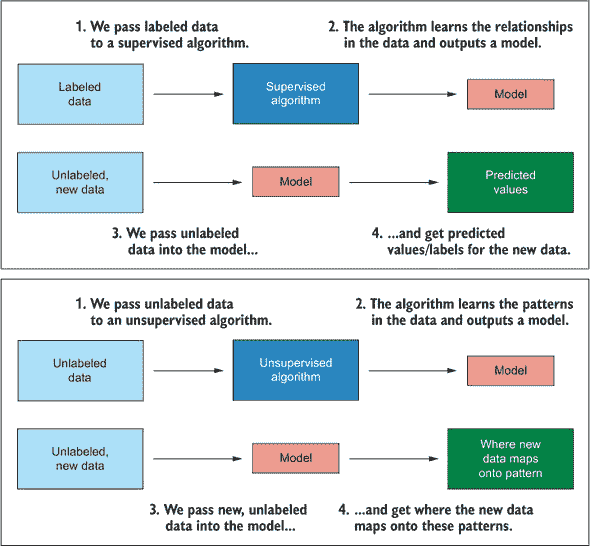

| |
| --- |

**半监督学习**

大多数机器学习算法都将属于这些类别之一，但还有一种称为*半监督学习*的额外方法。正如其名称所暗示的，半监督机器学习既不是完全监督的，也不是完全无监督的。

半监督学习通常描述的是一种机器学习方法，它将监督和无监督算法结合起来，而不是严格定义一个算法类别。半监督学习的前提是，通常，标记数据集需要专家观察者进行大量手动工作。这个过程可能非常耗时、昂贵且容易出错，可能对于整个数据集来说都是不可能的。因此，我们尽可能精确地标记尽可能多的案例，然后我们只使用标记的数据来构建一个监督模型。我们将剩余的数据（未标记的案例）输入模型以获取它们的预测标签，这些标签被称为*伪标签*，因为我们不知道它们是否全部正确。现在我们将数据与手动标签和伪标签结合起来，并使用结果来训练一个新的模型。

这种方法允许我们训练一个模型，该模型可以从标记和无标记的数据中学习，并且它可以提高整体预测性能，因为我们能够使用所有可以利用的数据。如果你在完成这本书后想了解更多关于半监督学习的信息，请参阅 Olivier Chapelle、Bernhard Scholkopf 和 Alexander Zien 合著的《半监督学习》（MIT Press，2006 年）。这个参考可能看起来相当过时，但它仍然非常好。

| |
| --- |

在监督和无监督类别中，机器学习算法可以根据它们执行的任务进一步分类。正如机械工程师知道如何使用适当的工具来完成手头的任务一样，数据科学家需要知道他们应该使用哪些算法来完成他们的任务。有四个主要类别可供选择：分类、回归、降维和聚类。

#### 1.2.2\. 分类、回归、降维和聚类

监督机器学习算法可以分为两类：

+   *分类算法*接受标记数据（因为它们是监督学习方法），并学习数据中的模式，这些模式可以用来预测一个*分类*的输出变量。这通常是一个*分组变量*（指定特定案例属于哪个组的变量）可以是*二项式*（两组）或*多项式*（多于两组）。分类问题是机器学习任务中非常常见的问题。哪些客户会拖欠付款？哪些患者会存活？望远镜图像中的哪些物体是恒星、行星或星系？面对这些问题时，你应该使用分类算法。

+   *回归算法*接受标记数据，并学习数据中的模式，这些模式可以用来预测一个*连续*的输出变量。一个家庭对大气贡献了多少二氧化碳？一家公司的股价明天会怎样？患者血液中胰岛素的浓度是多少？面对这些问题时，你应该使用回归算法。

无监督机器学习算法也可以分为两类：

+   *降维算法*接受未标记的（因为它们是无监督学习方法）和高维数据（具有许多变量的数据），并学习一种方法，以更少的维度来表示它。降维算法可以用作探索性技术（因为人类很难同时视觉解释两个或三个以上的维度）或作为机器学习管道中的预处理步骤（它可以帮助缓解诸如*多重共线性*和*维度诅咒*等问题，这些术语我将在后面的章节中定义）。降维算法还可以帮助我们通过允许我们在两个或三个维度中绘制数据来直观地确认分类和聚类算法的性能。

+   *聚类算法*接受未标记数据，并学习数据中的聚类模式。一个*簇*是一组相互之间比其他簇中的数据点更相似的观察值。我们假设同一簇中的观察值共享一些统一特征，使它们与其他簇可识别地不同。聚类算法可以用作探索性技术来了解我们的数据结构，并可能表明可以输入到分类算法中的分组结构。临床试验中是否存在患者反应的亚型？调查中有多少个受访者类别？不同类型的客户是否使用我们的公司？面对这些问题时，你应该使用聚类算法。

见图 1.6 以总结不同类型算法的类型和功能。

通过将机器学习算法分为这四类，你会发现选择合适的算法来完成手头任务更容易。这就是本书结构安排的原因：我们首先处理分类，然后是回归，接着是降维，最后是聚类，这样你可以清晰地构建起针对特定应用的算法工具箱的清晰心理图像。决定选择哪种算法类别通常很简单：

+   如果你需要预测一个分类变量，请使用分类算法。

+   如果你需要预测一个连续变量，请使用回归算法。

+   如果你需要用更少的变量来表示许多变量的信息，请使用降维。

+   如果你需要识别案例的簇，请使用聚类算法。

#### 1.2.3. 简述深度学习

如果你阅读过关于机器学习的相关内容，你很可能已经遇到过“深度学习”这个术语，甚至可能在媒体上听说过。深度学习是机器学习的一个子领域（所有深度学习都是机器学习，但并非所有机器学习都是深度学习），在过去 5 到 10 年中因其两个主要原因而变得极为流行：

+   它可以产生具有卓越性能的模型。

+   我们现在有了更广泛的计算能力来应用它。

深度学习使用**神经网络**来学习数据中的模式，这个术语指的是这些模型的结构在表面上类似于大脑中的神经元，它们之间有连接来传递信息。人工智能、机器学习和深度学习之间的关系总结在图 1.7 中。

##### 图 1.6. 分类、回归、降维和聚类。分类和回归算法构建模型来预测未标记的新数据的分类和连续变量。降维算法在更少的维度中创建原始数据的新表示，并将新数据映射到这个表示上。聚类算法在数据中识别簇，并将新数据映射到这些簇上。

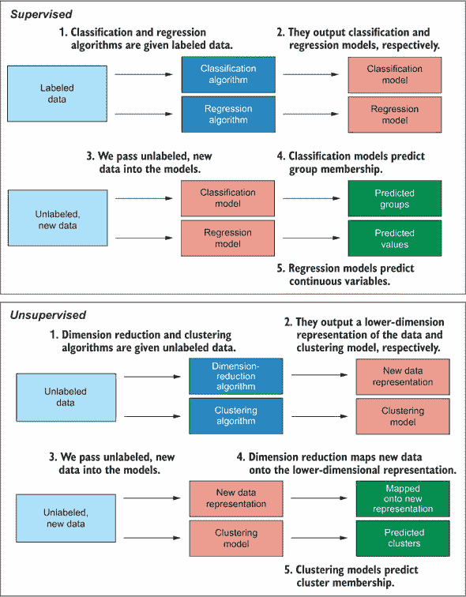

##### 图 1.7. 人工智能（AI）、机器学习与深度学习之间的关系。深度学习包含一系列技术，这些技术构成了机器学习技术的一个子集，而机器学习本身又是人工智能的一个子领域。

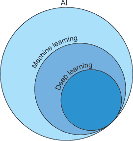

虽然深度学习方法对于同一数据集通常会比“浅层”学习方法（有时用来区分不是深度学习的机器学习方法）表现更好，但它们并不总是最佳选择。深度学习方法通常不是解决特定问题的最合适方法，原因有三：

+   ***它们在计算上非常昂贵。*** 当然，我们这里所说的“昂贵”并不是指货币成本，而是指它们需要大量的计算能力，这意味着它们可能需要很长时间（几个小时甚至几天！）来训练。可以说，这不是不使用深度学习的一个不那么重要的原因，因为如果你认为某个任务很重要，你可以投入所需的时间和计算资源来解决它。但如果你能在几分钟内训练出一个表现良好的模型，那么为什么还要浪费额外的时间和资源呢？

+   ***它们往往需要更多的数据。*** 深度学习模型通常需要数百到数千个案例才能表现出色。这很大程度上取决于手头问题的复杂性，但浅层方法在小数据集上的表现通常优于它们的深度学习对应物。

+   ***规则的可解释性较低。*** 从本质上讲，深度学习模型更倾向于性能而非模型的可解释性。可以说，我们的重点应该是性能；但通常我们不仅对获得正确的输出感兴趣，我们还对算法学到的规则感兴趣，因为这些有助于我们理解关于现实世界的事情，并可能帮助我们进一步研究。神经网络学到的规则不易解释。

因此，虽然深度学习方法可能非常强大，但浅层学习技术仍然是数据科学家武器库中的无价之宝。


##### 注意事项

深度学习算法特别擅长处理涉及复杂数据的任务，例如图像分类和音频转录。

由于深度学习技术需要大量的额外理论，我认为它们需要自己的书籍，因此我们在这里不会讨论它们。如果您想了解如何应用深度学习方法（并且完成这本书后，我建议您这样做），我强烈推荐 Francois Chollet 和 Joseph J. Allaire 合著的《使用 R 进行深度学习》（Manning, 2018）。

### 1.3. 考虑机器学习的伦理影响

> ¹
> 
> 王一伦和米哈伊尔·科斯金斯基，“从面部图像中检测性取向，深度神经网络比人类更准确，”2017 年，[`osf.io/zn79k`](https://osf.io/zn79k).

这里还有一个例子：2015 年，发现谷歌的图像识别算法会将有色人种的图像分类为大猩猩。^[[2]]. 这里的伦理考虑是，该算法训练所使用的数据偏向于白人图像，在非白人图像上做出了不准确（和非种族主义）的预测。为了避免这种偏见，确保我们的数据集充分代表我们的模型将要释放的人群至关重要。无论是通过合理的抽样策略来完成，还是在训练后测试和纠正偏见，我们都有责任确保我们的模型不会对特定群体产生偏见。

> ²
> 
> Jessica Guynn, “Google Photos Labeled Black People ‘Gorillas,’” *USA Today*, 2015, [`mng.bz/j5Na`](http://mng.bz/j5Na).

机器学习研究的一个额外的伦理问题涉及安全和可信度。虽然这听起来像是直接来自科幻电影中的情节，但机器学习研究现在已经达到一个地步，模型可以从一个人的面部图像创建他们说话的视频。研究人员已经使用这种所谓的*深度伪造*技术来制作巴拉克·奥巴马说话的任何他们提供的音频的视频。^[[3]]. 想象一下，如果滥用这项技术来伪造一个在刑事审判中被告从未说过的话的证据。类似的技术也已被用来在视频中用一个人的脸替换成另一个人的脸。遗憾的是，这被滥用来将名人面孔换成色情视频。想象一下这可能会对一个人的职业生涯和尊严造成多大的破坏。

> ³
> 
> Supasorn Suwajanakorn, Steven M. Seitz, and Ira Kemelmacher-Shlizerman, “Synthesizing Obama: Learning Lip Sync from Audio,” *ACM Transactions on Graphics* 36 (4), article 95, 2017, [`mng.bz/WOQg`](http://mng.bz/WOQg).

前一个观点让我想到了数据保护和同意的问题。为了训练表现良好的有用机器学习模型，我们需要数据。但是，考虑你使用的数据是否是按照伦理收集的很重要。它是否包含个人、敏感或财务信息？数据是否属于任何人？如果是的话，他们是否已经就其如何使用提供了知情同意？2018 年，咨询公司剑桥分析公司未经同意挖掘了数百万人的社交媒体数据，这些问题受到了关注。随后媒体的强烈抗议和剑桥分析公司的清算应该成为对伦理数据收集程序重要性的一个鲜明提醒。^[[3]]

另外两个伦理考虑因素是：

+   当一个模型建议采取特定的行动方案时，我们应该盲目地跟随它的预测，还是仅仅作为参考？

+   当事情出错时，谁应该承担责任？

想象一下，我们有一个机器学习模型，它根据患者的诊断数据告诉我们是否对病人进行手术。如果它在所有之前的案例中都已被证明是正确的，你会愿意遵循模型的建议吗？关于一个预测被告是否有罪或无罪的模型呢？你可以认为第二个例子是荒谬的，但它突出了我的观点：人类应该参与由机器学习信息支持的决策过程吗？如果是这样，*人类应该如何参与这些过程*？这些问题的答案取决于所做出的决策、它对涉及的人的影响，以及是否应该在决策过程中考虑人类情感。

责任问题提出了这个问题：当机器学习算法做出的决策导致伤害时，谁应该负责？我们生活在一个要求人们对其行为负责的社会。当发生不好的事情时，无论是对是错，我们都期望有人会被发现负有责任。2018 年，一辆具备自动驾驶能力的汽车与一名行人相撞并致其死亡.^([4]) 谁应该负责？制造商？车上的那个人？行人？如果行人是在闯红灯，这有关系吗？在将这些机器学习技术发布到世界之前，需要考虑并仔细解决这类道德困境。

> ⁴
> 
> “Elaine Herzberg 之死”，维基百科，[`mng.bz/8zqK`](http://mng.bz/8zqK)。

当你训练一个机器学习模型时，我要求你问自己这五个问题：

+   我的意图是否道德？

+   即使我的意图是道德的，其他人是否可能用我的模型造成伤害？

+   我的模型是否存在可能导致伤害或歧视的偏见？

+   数据是否被道德地收集？

+   一旦部署，人类将如何适应模型所做的决策？

如果对任何问题的回答让你感到不安，请仔细考虑你所做的事情是否道德。仅仅因为我们*能够*做某事，并不意味着我们*应该*这样做。如果你想深入了解如何进行道德机器学习，我建议阅读 Paula Boddington 的《迈向人工智能道德规范》（Springer，2017 年）。

### 1.4. 为什么使用 R 进行机器学习？

在两种最常用的数据科学语言之间，R 和 Python，存在某种竞争关系。任何刚开始学习机器学习的人都会选择其中之一来入门，他们的选择通常会受到他们可访问的学习资源、他们所在领域的工作中哪种语言更常见以及他们的同事使用哪种语言的影响。没有只能在一种语言中应用的机器学习任务，尽管一些更前沿的深度学习方法在 Python 中应用起来更容易（它们通常首先用 Python 编写，然后才在 R 中实现）。Python 虽然非常适合数据科学，但它是一种更通用的编程语言，而 R 则专门针对数学和统计应用。这意味着 R 的用户可以纯粹关注数据，但如果他们需要基于他们的模型构建应用程序，可能会感到受限。

当将这两个语言对比用于数据科学时，实际上并没有一个绝对的优势（尽管当然每个人都有他们偏爱的语言）。那么我为什么选择写一本关于 R 中机器学习的书呢？因为 R 中有专门设计来简化数据科学任务并使其易于人类阅读的现代工具，例如来自*tidyverse*的工具（我们将在第二章中深入探讨这些工具）。

传统上，R 中的机器学习算法分散在由不同作者编写的多个包中。这意味着每次你想应用一个新的算法时，都需要学习使用具有不同参数和实现的新的函数。Python 的支持者可能会用这个例子来说明为什么 Python 更适合机器学习，因为 Python 有一个著名的 scikit-learn 包，它包含大量的内置机器学习算法。但 R 现在也效仿了这一做法，有了 caret 和 mlr 包。虽然 mlr 在目的和功能上与 caret 相当相似，但我认为 mlr 更加灵活和直观；因此，我们在书中将使用 mlr。

mlr 包（代表*R 中的机器学习*）为大量机器学习算法提供了一个接口，并允许你用非常少的代码执行极其复杂的机器学习任务。在可能的情况下，我们将在这本书中始终使用 mlr 包，这样当你完成学习后，你将能够熟练使用目前最现代的机器学习包之一。

### 1.5. 我们将使用哪些数据集？

为了使你的学习过程尽可能有趣和吸引人，我们将在我们的机器学习管道中使用真实数据集。R 语言自带相当数量的内置数据集，这些数据集通过我们将加载到 R 会话中的包中的数据集得到补充。我决定使用 R 或其包中自带的数据集，以便你在离线状态下更容易地完成本书。我们将使用这些数据集来帮助我们构建机器学习模型，并比较不同模型在不同类型数据上的表现。

| |
| --- |

##### 小贴士

在这么多数据集中选择，完成每一章后，我建议你将所学应用到不同的数据集上。

| |
| --- |

### 1.6. 在这本书中你将学到什么？

这本书通过 R 语言为你提供了一个动手学习的机器学习入门。为了从本书中受益，你应该熟悉基本的 R 语言编码，例如加载包和操作对象和数据结构。你将学习以下内容：

+   如何使用 tidyverse 组织、整理和绘制你的数据

+   诸如过拟合、欠拟合和偏差-方差权衡等关键概念

+   如何应用来自四个类别（分类、回归、降维和聚类）中的几个机器学习算法

+   如何验证模型性能并防止过拟合

+   如何比较多个模型以决定最适合你目的的最佳模型

在整本书中，我们将使用有趣的例子来学习概念并应用我们的知识。在可能的情况下，我们还将将多个算法应用于同一数据集，以便你了解不同算法在特定情况下的表现。

### 摘要

+   人工智能是计算机过程产生智能知识的表现。

+   机器学习是人工智能的一个子领域，其中计算机通过学习数据中的关系来对未来的、未见过的数据进行预测，或者识别有助于我们更好地理解数据的有意义模式。

+   机器学习算法是通过学习数据中的模式和规则的过程。模型是一组这些模式和规则，它接受新的数据，将这些规则应用于数据，并输出答案。

+   深度学习是机器学习的一个子领域，而机器学习本身又是人工智能的一个子领域。

+   根据它们是否从真实标签数据（监督学习）或无标签数据（无监督学习）中学习，机器学习算法被分为监督学习和无监督学习。

+   监督学习算法被分为分类（如果它们预测一个分类变量）或回归（如果它们预测一个连续变量）。

+   无监督学习算法被分为降维（如果它们找到数据的低维表示）或聚类（如果它们在数据中识别案例簇）。

+   除了 Python 之外，R 也是一种流行的数据科学语言，它包含许多工具和内置数据集，这些工具和数据集简化了数据科学和机器学习的过程。

## 第二章\. 使用 tidyverse 整理、操作和绘制数据

*本章涵盖*

+   理解 tidyverse

+   什么是“tidy”数据

+   安装和加载 tidyverse

+   使用 tibble、dplyr、ggplot2、tidyr 和 purrr 包

我非常兴奋地开始教你机器学习。但在我们深入探讨之前，我想教你一些技能，这些技能将使你的学习体验更加简单和有效。这些技能还将提高你的数据科学和 R 编程技能。

想象一下，我要求你为我造一辆车（朋友之间常见的请求）。你可以选择老式方法：你可以购买金属、玻璃和其他组件；手工切割所有零件；用锤子将其塑形；并用铆钉将其固定在一起。这辆车可能看起来很漂亮，工作得也很完美，但建造它需要非常长的时间，而且如果你需要再造一辆，你可能很难确切地记住你做了什么。

相反，你可以采取一种现代方法，在工厂中使用机械臂。你可以编程它们来切割和弯曲零件成预定义的形状，并为你组装零件。在这种情况下，对你来说，制造一辆汽车会更快、更简单，而且你很容易在未来重复同样的过程。

现在想象一下，我提出一个更合理的要求，让你重新组织和绘制一个数据集，以便通过机器学习流程。你可以使用基本的 R 函数来完成这个任务，它们会运行得很好。但是代码会很长，可读性不会很高（所以一个月后你可能会很难记住你做了什么），而且生成图表会相当繁琐。

相反，你可以采取更现代的方法，并使用来自 *tidyverse* 包族的功能。这些功能有助于简化数据处理过程，可读性很高，并且允许你通过最少的输入生成非常吸引人的图形。

### 2.1\. tidyverse 是什么，tidy 数据是什么？

这本书的目的是给你提供将机器学习方法应用于你的数据的技能。虽然我的意图不是涵盖数据科学的各个方面（在一个单本书中我也无法做到），但我确实想介绍你认识 tidyverse。在你将数据输入到机器学习算法之前，它需要以算法愿意处理的形式存在。

tidyverse 是一个“有偏见的 R 包集合，专为数据科学设计”，旨在使 R 中的数据科学任务更简单、更易于阅读和复现。这些包之所以“有偏见”，是因为它们旨在使包作者认为的良好实践变得容易，而使他们认为的不良实践变得困难。这个名字来源于 *tidy data* 的概念，这是一种数据结构，其中

+   每一行代表一个单独的观察。

+   每一列代表一个变量。

看看 表 2.1 中的数据。想象一下，我们取四位跑者并将他们置于新的训练计划中。我们想知道这个计划是否在提高他们的跑步时间，因此我们记录了他们在新训练开始前（月份 0）以及之后的三个月的最佳时间。

##### 表 2.1\. 不整洁数据的示例。此表包含四位跑者在开始新的训练计划之前以及之后的三个月的跑步时间。

| 运动员 | 月份 0 | 月份 1 | 月份 2 | 月份 3 |
| --- | --- | --- | --- | --- |
| Joana | 12.50 | 12.1 | 11.98 | 11.99 |
| Debi | 14.86 | 14.9 | 14.70 | 14.30 |
| Sukhveer | 12.10 | 12.1 | 12.00 | 11.80 |
| Kerol | 19.60 | 19.7 | 19.30 | 19.00 |

这是一个不整洁数据的示例。你能看出为什么吗？好吧，让我们回到我们的规则。每一行代表一个单独的观察吗？不。实际上，每一行有四个观察（每个月份一个）。每一列代表一个变量吗？不。此数据中只有三个变量：运动员、月份和最佳时间，但我们有五个列！

同样的数据在整洁格式下看起来会怎样？表 2.2 展示了这一点。

##### 表 2.2\. 此表包含与 表 2.1 相同的数据，但以整洁格式呈现。

| 运动员 | 月份 | 最佳 |
| --- | --- | --- |
| Joana | 0 | 12.50 |
| Debi | 0 | 14.86 |
| Sukhveer | 0 | 12.10 |
| Kerol | 0 | 19.60 |
| Joana | 1 | 12.10 |
| Debi | 1 | 14.90 |
| Sukhveer | 1 | 12.10 |
| Kerol | 1 | 19.70 |
| Joana | 2 | 11.98 |
| Debi | 2 | 14.70 |
| Sukhveer | 2 | 12.00 |
| Kerol | 2 | 19.30 |
| Joana | 3 | 11.99 |
| Debi | 3 | 14.30 |
| Sukhveer | 3 | 11.80 |
| Kerol | 3 | 19.00 |

这次，我们有了包含之前作为单独列使用的月份标识符的“月份”列，以及包含每个运动员每月最佳时间的“最佳”列。每一行代表一个单独的观察吗？是的！每一列代表一个变量吗？是的！因此，这些数据是整洁格式。

确保你的数据是整洁格式是任何机器学习流程中的早期重要步骤，因此 tidyverse 包含 tidyr 包，它可以帮助你实现这一点。tidyverse 中的其他包与 tidyr 和彼此一起工作，帮助你完成以下任务：

+   以合理的方式组织和显示你的数据（tibble）

+   操作和子集你的数据（dplyr）

+   绘制你的数据（ggplot2）

+   将 `for` 循环替换为函数式编程方法（purrr）

在 tidyverse 中你可以执行的所有操作都可以使用 base R 代码实现，但我强烈建议你在工作中使用 tidyverse：它将帮助你使代码更简单、更易于阅读，并且可重复。

| |
| --- |

**tidyverse 的核心和可选包**

我将教你如何使用 tidyverse 的 tibble、dplyr、ggplot2、tidyr 和 purrr 包。这些是 tidyverse 的“核心”包，还包括以下这些：

+   readr，用于将外部文件中的数据读入 R

+   forcats，用于处理因子

+   stringr，用于处理字符串

除了可以一起加载的核心包之外，tidyverse 还包括一些需要单独加载的可选包。

想了解更多关于 tidyverse 其他工具的信息，请参阅 Garrett Grolemund 和 Hadley Wickham 所著的《R for Data Science》（O’Reilly 媒体，2016 年）。

| |
| --- |

### 2.2\. 加载 tidyverse

tidyverse 的包都可以一起安装和加载（推荐）

```
install.packages("tidyverse")
library(tidyverse)
```

或根据需要安装和单独加载：

```
install.packages(c("tibble", "dplyr", "ggplot2", "tidyr", "purrr"))
library(tibble)
library(dplyr)
library(ggplot2)
library(tidyr)
library(purrr)
```

### 2.3\. tibble 包是什么以及它的作用

如果你曾在 R 中进行过任何形式的数据科学或分析，你肯定遇到过数据框作为存储矩形数据的结构。数据框工作得很好，并且长期以来一直是存储具有不同类型列的矩形数据的唯一方式（与只能处理相同类型数据的矩阵相比），但很少对数据科学家不喜欢的数据框方面进行改进。

| |
| --- |

##### 注意

如果每一行都有与列数相等的元素数量，并且每一列都有与行数相等的元素数量，则数据是*矩形的*。数据并不总是这种类型！

| |
| --- |

tibble 包引入了一种新的数据结构，即 tibble，目的是“保留那些经得起时间考验的特性，并丢弃那些曾经方便但现在令人沮丧的特性”([`mng.bz/1wxj`](http://mng.bz/1wxj))。让我们看看这是什么意思。

#### 2.3.1\. 创建 tibbles

使用 `tibble()` 函数创建 tibbles 与创建数据框的工作方式相同：

```
myTib <- tibble(x =  1:4,
                y = c("london", "beijing", "las vegas", "berlin"))

myTib

# A tibble: 4 x 2     *1*
      x y             *2*
  <int> <chr>         *3*
1     1 london
2     2 beijing
3     3 las vegas
4     4 berlin
```

+   ***1* 告诉我们这是一个有四行两列的 tibble**

+   ***2* 变量名**

+   ***3* 变量类型：<int> = 整数，<chr> = 字符**

如果你习惯于使用数据框，你将立即注意到 tibbles 打印时的两个不同之处：

+   当你打印一个 tibble 时，它会告诉你它是一个 tibble 以及其维度。

+   Tibbles 会告诉你每个变量的类型。

第二个特性特别有用，可以避免因变量类型不正确而导致的错误。

| |
| --- |

##### 小贴士

当打印一个 tibble 时，`<int>` 表示整数变量，`<chr>` 表示字符变量，`<dbl>` 表示浮点数（小数），`<lgl>` 表示逻辑变量。

| |
| --- |

#### 2.3.2\. 将现有数据框转换为 tibbles

正如你可以使用`as.data.frame()`函数将对象强制转换为数据框一样，你也可以使用`as_tibble()`函数将对象强制转换为 tibbles：

```
myDf <- data.frame(x =  1:4,
                   y = c("london", "beijing", "las vegas", "berlin"))

dfToTib <- as_tibble(myDf)

dfToTib

# A tibble: 4 x 2
      x y
  <int> <fct>
1     1 london
2     2 beijing
3     3 las vegas
4     4 berlin
```

| |
| --- |

##### 注意

在这本书中，我们将使用 R 中已经构建好的数据。通常，我们需要从.csv 文件中读取数据到 R 会话中。要作为 tibble 加载数据，你使用`read_csv()`函数。`read_csv()`来自 readr 包，当调用`library(tidyverse)`时加载，是 tidyverse 版本的`read.csv()`。

| |
| --- |

#### 2.3.3\. 数据框和 tibbles 之间的区别

如果你习惯于使用数据框，你将注意到与 tibbles 有一些不同。我在本节中总结了数据框和 tibbles 之间最显著的区别。

##### Tibbles 不会转换你的数据类型

当人们创建数据框时，常见的烦恼是他们默认将字符串变量转换为因子。这可能很烦人，因为这可能不是处理变量的最佳方式。为了防止这种转换，在创建数据框时必须提供`stringsAsFactors = FALSE`参数。

与此相反，tibbles 默认不会将字符串变量转换为因子。这种行为是可取的，因为自动将数据转换为特定类型可能会成为令人沮丧的 bug 来源：

```
myDf <- data.frame(x =  1:4,
                   y = c("london", "beijing", "las vegas", "berlin"))

myDfNotFactor <- data.frame(x =  1:4,
                            y = c("london", "beijing", "las vegas", "berlin"),
                            stringsAsFactors = FALSE)

myTib <- tibble(x =  1:4,
                y = c("london", "beijing", "las vegas", "berlin"))

class(myDf$y)
[1] "factor"

class(myDfNotFactor$y)
[1] "character"

class(myTib$y)
[1] "character"
```

如果你希望一个变量在 tibble 中是因子类型，你只需将`c()`函数包裹在`factor()`函数内部即可：

```
myTib <- tibble(x =  1:4,
                y = factor(c("london", "beijing", "las vegas", "berlin")))
myTib
```

##### 简洁的输出，无论数据大小

当你打印数据框时，所有列都会打印到控制台（默认情况下），这使得查看早期变量和案例变得困难。当你打印 tibble 时，它只打印默认情况下适合屏幕的前 10 行和列数，这使得快速了解数据变得更容易。注意，未打印的变量名称列在输出底部列出。运行以下代码，对比`starwars` tibble（包含在 dplyr 中，当调用`library(tidyverse)`时可用）的输出与转换为数据框时的外观。

##### 列表 2.1\. `starwars`数据作为 tibble 和数据框

```
data(starwars)

starwars

as.data.frame(starwars)
```

| |
| --- |

##### 小贴士

`data()`函数将包含在 R 基础包或 R 包中的数据集加载到你的全局环境中。使用不带参数的`data()`来列出当前加载的包中可用的所有数据集。

| |
| --- |

##### 使用`[`进行子集操作始终返回另一个 tibble

当对数据框进行子集操作时，如果你保留多于一个列，`[`运算符将返回另一个数据框；如果你只保留一个列，则返回一个向量。当对 tibble 进行子集操作时，`[`运算符将*始终*返回另一个 tibble。如果你希望显式地将 tibble 列作为向量返回，可以使用`[[`或`$`运算符。这种行为是可取的，因为我们应该明确我们想要向量还是矩形数据结构，以避免 bug：

```
myDf[, 1]

[1] 1 2 3 4

myTib[, 1]

# A tibble: 4 x 1
      x
  <int>
1     1
2     2
3     3
4     4

myTib[[1]]

[1] 1 2 3 4

myTib$x
[1] 1 2 3 4
```

| |
| --- |

##### 注意

这里的一个例外是，如果你使用单个索引（没有逗号，例如 `myDf[1]`）对数据框进行子集化。在这种情况下，`[` 操作符将返回一个单列数据框，但这种方法不允许我们结合行和列的子集化。


##### 变量是按顺序创建的

当构建 tibble 时，变量是按顺序创建的，以便后续变量可以引用之前定义的变量。这意味着我们可以在同一函数调用中动态创建引用其他变量的变量：

```
sequentialTib <- tibble(nItems = c(12, 45, 107),
                        cost = c(0.5, 1.2, 1.8),
                        totalWorth = nItems * cost)

sequentialTib

# A tibble: 3 x 3
  nItems  cost totalWorth
   <dbl> <dbl>      <dbl>
1     12   0.5         6
2     45   1.2        54
3    107   1.8       193
```


**练习 1**

使用 `data()` 函数加载 `mtcars` 数据集，将其转换为 tibble，并使用 `summary()` 函数进行探索。


### 2.4\. dplyr 包是什么以及它做什么

在处理数据时，我们经常需要执行以下操作-:

+   选择感兴趣的行和/或列

+   创建新变量

+   按某些变量的升序或降序排列数据

+   获取汇总统计量

在执行这些操作时，数据中可能也存在我们希望保持的自然分组结构。dplyr 包允许我们以非常直观的方式执行这些操作。让我们通过一个例子来操作。

#### 2.4.1\. 使用 dplyr 操作 CO2 数据集

让我们在 R 中加载内置的 CO2 数据集。我们有一个包含 84 个案例和 5 个变量的 tibble，记录了在不同条件下不同植物对二氧化碳的吸收情况。我将使用这个数据集来教你们一些基本的 dplyr 技能。

##### 列表 2.2\. 探索 CO2 数据集

```
library(tibble)

data(CO2)

CO2tib <- as_tibble(CO2)
CO2tib

# A tibble: 84 x 5
   Plant Type   Treatment   conc uptake
 * <ord> <fct>  <fct>      <dbl>  <dbl>
 1 Qn1   Quebec nonchilled    95   16
 2 Qn1   Quebec nonchilled   175   30.4
 3 Qn1   Quebec nonchilled   250   34.8
 4 Qn1   Quebec nonchilled   350   37.2
 5 Qn1   Quebec nonchilled   500   35.3
 6 Qn1   Quebec nonchilled   675   39.2
 7 Qn1   Quebec nonchilled  1000   39.7
 8 Qn2   Quebec nonchilled    95   13.6
 9 Qn2   Quebec nonchilled   175   27.3
10 Qn2   Quebec nonchilled   250   37.1
# ... with 74 more rows
```

假设我们只想 *选择* 第 1、2、3 和 5 列。我们可以使用 `select()` 函数来完成这个操作。在以下列表中的 `select()` 函数调用中，第一个参数是数据；然后我们提供我们希望选择的列的数字或名称，用逗号分隔。

##### 列表 2.3\. 使用 `select()` 选择列

```
library(dplyr)

selectedData <- select(CO2tib, 1, 2, 3, 5)

selectedData

# A tibble: 84 x 4
   Plant Type   Treatment  uptake
 * <ord> <fct>  <fct>       <dbl>
 1 Qn1   Quebec nonchilled   16
 2 Qn1   Quebec nonchilled   30.4
 3 Qn1   Quebec nonchilled   34.8
 4 Qn1   Quebec nonchilled   37.2
 5 Qn1   Quebec nonchilled   35.3
 6 Qn1   Quebec nonchilled   39.2
 7 Qn1   Quebec nonchilled   39.7
 8 Qn2   Quebec nonchilled   13.6
 9 Qn2   Quebec nonchilled   27.3
10 Qn2   Quebec nonchilled   37.1
# ... with 74 more rows
```


**练习 2**

选择你的 `mtcars` tibble 的所有列，除了 `qsec` 和 `vs` 变量。


现在假设我们希望 *过滤* 数据，只包含吸收量大于 16 的案例。我们可以使用 `filter()` 函数来完成这个操作。`filter()` 的第一个参数再次是数据，第二个参数是一个逻辑表达式，它将对每一行进行评估。我们可以通过逗号分隔来包含多个条件。

##### 列表 2.4\. 使用 `filter()` 过滤行

```
filteredData <- filter(selectedData, uptake > 16)

filteredData

# A tibble: 66 x 4
   Plant Type   Treatment  uptake
   <ord> <fct>  <fct>       <dbl>
 1 Qn1   Quebec nonchilled   30.4
 2 Qn1   Quebec nonchilled   34.8
 3 Qn1   Quebec nonchilled   37.2
 4 Qn1   Quebec nonchilled   35.3
 5 Qn1   Quebec nonchilled   39.2
 6 Qn1   Quebec nonchilled   39.7
 7 Qn2   Quebec nonchilled   27.3
 8 Qn2   Quebec nonchilled   37.1
 9 Qn2   Quebec nonchilled   41.8
10 Qn2   Quebec nonchilled   40.6
# ... with 56 more rows
```


**练习 3**

过滤你的 `mtcars` tibble，只包含气缸数（`cyl`）不等于 8 的案例。


接下来，我们希望按单个植物 *分组* 并使用 `group_by()` 和 `summarize()` 函数分别对数据进行汇总，以获取每个组内吸收量的平均值和标准差。

在 `group_by()` 函数中，第一个参数是——没错——数据（看这里的模式？），后面跟着分组变量。我们可以通过逗号分隔来按多个变量进行分组。当我们打印 `groupedData` 时，除了数据上方有一个表示它们已分组的指示，以及它们是根据哪个变量分组的以及有多少组之外，没有太多变化。这告诉我们，我们将对每个组进行进一步的操作。

##### 列表 2.5\. 使用 `group_by()` 分组数据

```
groupedData <- group_by(filteredData, Plant)

groupedData

# A tibble: 66 x 4
# Groups:   Plant [11]
   Plant Type   Treatment  uptake
   <ord> <fct>  <fct>       <dbl>
 1 Qn1   Quebec nonchilled   30.4
 2 Qn1   Quebec nonchilled   34.8
 3 Qn1   Quebec nonchilled   37.2
 4 Qn1   Quebec nonchilled   35.3
 5 Qn1   Quebec nonchilled   39.2
 6 Qn1   Quebec nonchilled   39.7
 7 Qn2   Quebec nonchilled   27.3
 8 Qn2   Quebec nonchilled   37.1
 9 Qn2   Quebec nonchilled   41.8
10 Qn2   Quebec nonchilled   40.6
# ... with 56 more rows
```

| |
| --- |

##### 提示

你可以通过将 tibble 包裹在 `ungroup()` 函数中来移除分组结构。

| |
| --- |

在 `summarize()` 函数中，第一个参数是数据；在第二个参数中，我们命名我们正在创建的新变量，后面跟着一个 `=` 符号，然后是该变量的定义。我们可以通过逗号分隔来创建尽可能多的新变量。在 列表 2.6 中，我们创建了两个汇总变量：每个组的吸收量平均值（`meanUp`）和每个组的吸收量标准差（`sdUp`）。现在，当我们打印 `summarizedData` 时，我们可以看到除了我们的分组变量外，我们的原始变量已经被我们刚刚创建的汇总变量所取代。

##### 列表 2.6\. 使用 `summarize()` 创建变量的汇总

```
summarizedData <- summarize(groupedData, meanUp = mean(uptake),
                            sdUp = sd(uptake))

summarizedData

# A tibble: 11 x 3
   Plant meanUp   sdUp
   <ord>  <dbl>  <dbl>
 1 Qn1     36.1  3.42
 2 Qn2     38.8  6.07
 3 Qn3     37.6 10.3
 4 Qc1     32.6  5.03
 5 Qc3     35.5  7.52
 6 Qc2     36.6  5.14
 7 Mn3     26.2  3.49
 8 Mn2     29.9  3.92
 9 Mn1     29.0  5.70
10 Mc3     18.4  0.826
11 Mc1     20.1  1.83
```

最后，我们将从现有变量中**突变**一个新变量来计算每个组的变异系数，然后我们将使用 `mutate()` 和 `arrange()` 函数对数据进行排序，使得新变量值最小的行在顶部，值最大的行在底部。我们可以使用 `mutate()` 和 `arrange()` 函数来完成此操作。

对于 `mutate()` 函数，第一个参数是数据。第二个参数是新变量的名称，后面跟着一个 `=` 符号，然后是其定义。我们可以通过逗号分隔来创建尽可能多的新变量。

##### 列表 2.7\. 使用 `mutate()` 创建新变量

```
mutatedData <- mutate(summarizedData,  CV = (sdUp / meanUp) * 100)

mutatedData

# A tibble: 11 x 4
   Plant meanUp   sdUp    CV
   <ord>  <dbl>  <dbl> <dbl>
 1 Qn1     36.1  3.42   9.48
 2 Qn2     38.8  6.07  15.7
 3 Qn3     37.6 10.3   27.5
 4 Qc1     32.6  5.03  15.4
 5 Qc3     35.5  7.52  21.2
 6 Qc2     36.6  5.14  14.1
 7 Mn3     26.2  3.49  13.3
 8 Mn2     29.9  3.92  13.1
 9 Mn1     29.0  5.70  19.6
10 Mc3     18.4  0.826  4.48
11 Mc1     20.1  1.83   9.11
```

| |
| --- |

##### 提示

dplyr 函数中的参数评估是顺序的，这意味着我们可以在 `summarize()` 函数中通过引用 `meanUp` 和 `sdUp` 变量来定义 `CV` 变量，即使它们尚未创建！

| |
| --- |

`arrange()` 函数将数据作为第一个参数，后面跟着我们希望按其排列案例的变量。我们可以通过逗号分隔多个列来按多列排列：这样做将按第一个变量的顺序排列案例，任何平局将根据第二个变量的值进行排序，依此类推。

##### 列表 2.8\. 使用 `arrange()` 按变量排列 tibbles

```
arrangedData <- arrange(mutatedData, CV)

arrangedData

# A tibble: 11 x 4
   Plant meanUp   sdUp    CV
   <ord>  <dbl>  <dbl> <dbl>
 1 Mc3     18.4  0.826  4.48
 2 Mc1     20.1  1.83   9.11
 3 Qn1     36.1  3.42   9.48
 4 Mn2     29.9  3.92  13.1
 5 Mn3     26.2  3.49  13.3
 6 Qc2     36.6  5.14  14.1
 7 Qc1     32.6  5.03  15.4
 8 Qn2     38.8  6.07  15.7
 9 Mn1     29.0  5.70  19.6
10 Qc3     35.5  7.52  21.2
11 Qn3     37.6 10.3   27.5
```

| |
| --- |

##### 提示

如果你想要根据变量的值将 tibble 排序为**降序**，只需将变量包裹在 `desc()` 中：`arrange(mutatedData, desc(CV))`。

| |
| --- |

#### 2.4.2\. 连接 dplyr 函数

我们在第 2.4.1 节中做的所有事情都可以使用基础 R 实现，但我希望你能看到 dplyr 函数——通常被称为*动词*（因为它们是可读的，并且清楚地表明了它们的作用）——有助于使代码更简单、更易读。但 dplyr 的真正力量来自于将函数链在一起形成直观、顺序的过程的能力。

在我们处理 CO2 数据的每个阶段，我们都保存了中间数据，并对其应用下一个函数。这样做很繁琐，在我们的 R 环境中创建了大量的不必要的数据对象，而且可读性也不强。相反，我们可以使用管道操作符`%>%`，当我们加载 dplyr 时它就可用。管道将左侧函数的输出作为右侧函数的第一个参数。让我们看看一个基本的例子：

```
library(dplyr)

c(1, 4, 7, 3, 5) %>% mean()

[1] 4
```

`%>%`操作符将左侧`c()`函数的输出（长度为 5 的向量）"管道"到`mean()`函数的第一个参数。我们可以使用`%>%`操作符将多个函数链在一起，使代码更简洁、更易读。

记得我强调过每个 dplyr 函数的第一个参数是数据吗？嗯，这之所以如此重要且有用，是因为它允许我们将前一个操作的数据管道传输到下一个操作。我们在第 2.4.1 节中经历的数据处理整个流程变成了以下列表。

##### 列表 2.9. 使用`%>%`操作符将 dplyr 操作链在一起

```
arrangedData <- CO2tib %>%
  select(c(1:3, 5)) %>%
  filter(uptake > 16) %>%
  group_by(Plant) %>%
  summarize(meanUp = mean(uptake), sdUp = sd(uptake)) %>%
  mutate(CV = (sdUp / meanUp) * 100) %>%
  arrange(CV)

arrangedData

# A tibble: 11 x 4
   Plant meanUp   sdUp    CV
   <ord>  <dbl>  <dbl> <dbl>
 1 Mc3     18.4  0.826  4.48
 2 Mc1     20.1  1.83   9.11
 3 Qn1     36.1  3.42   9.48
 4 Mn2     29.9  3.92  13.1
 5 Mn3     26.2  3.49  13.3
 6 Qc2     36.6  5.14  14.1
 7 Qc1     32.6  5.03  15.4
 8 Qn2     38.8  6.07  15.7
 9 Mn1     29.0  5.70  19.6
10 Qc3     35.5  7.52  21.2
11 Qn3     37.6 10.3   27.5
```

从上到下阅读代码，每次遇到`%>%`操作符时，就说出“然后”。你会读作“取 CO2 数据，*然后*选择这些列，*然后*过滤这些行，*然后*按此变量分组，*然后*用这些变量汇总，*然后*突变这个新变量，*然后*按此变量的顺序排列并保存输出为`arrangedData`。你能看到这是你如何用普通英语向同事解释你的数据处理过程吗？这就是 dplyr 的力量：能够以逻辑的、可读的方式执行复杂的数据处理。


##### 小贴士

在`%>%`操作符之后开始新一行是一种惯例，有助于使代码更容易阅读。

|  |

**练习 4**

将`mtcars` tibble 按`gear`变量分组，总结`mpg`和`disp`变量的中位数，并突变一个新变量，该变量是`mpg`中位数除以`disp`中位数，所有这些操作都通过`%>%`操作符链在一起。


### 2.5. ggplot2 包是什么以及它做什么

在 R 中，有三个主要的绘图系统：

+   基础图形

+   Lattice

+   ggplot2

不可否认，ggplot2 是数据科学家中最受欢迎的系统之一；由于它是 tidyverse 的一部分，我们将使用这个系统在本书中绘制我们的数据。ggplot2 中的“gg”代表*图形语法*，这是一种思想流派，认为任何数据图形都可以通过将数据与绘图组件的层（如轴、刻度、网格线、点、条形和线）相结合来创建。通过以这种方式分层绘图组件，您可以使用 ggplot2 以非常直观的方式创建具有沟通性和吸引力的图表。

让我们加载 R 中附带的数据集 iris，并创建其两个变量的散点图。这些数据由 Edgar Anderson 在 1935 年收集并发表，包含三种鸢尾花植物花瓣和萼片的长度和宽度测量值。

##### 图 2.1\. 使用 ggplot2 创建的散点图。`Sepal.Length`变量映射到 x 美学，`Sepal.Width`变量映射到 y 美学。通过添加`theme_bw()`层应用了黑白主题。

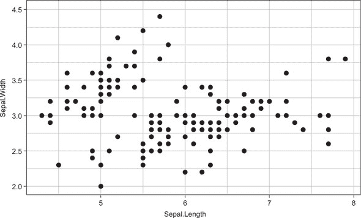

创建图 2.1 中图表的代码显示在代码清单 2.10。函数`ggplot()`将您提供的数据作为第一个参数，将函数`aes()`作为第二个参数（稍后将有更多关于此的介绍）。这创建了一个基于数据的绘图环境、轴和轴标签。

`aes()`函数代表*美学映射*，如果您习惯了基本的 R 绘图，这可能对您来说是新的。*美学*是图表的一个特征，可以通过数据中的变量来控制。美学的例子包括 x 轴、y 轴、颜色、形状、大小，甚至是绘制在图上的数据点的透明度。在代码清单 2.10 中的函数调用中，我们要求`ggplot()`将`Sepal.Length`和`Sepal.Width`变量分别映射到 x 轴和 y 轴。

##### 代码清单 2.10\. 使用`ggplot()`函数绘制数据

```
library(ggplot2)
data(iris)
myPlot <- ggplot(iris, aes(x = Sepal.Length, y = Sepal.Width)) +
  geom_point() +
  theme_bw()

myPlot
```

| |
| --- |

##### 小贴士

注意，我们不需要用引号括起变量名；`ggplot()`很聪明！

| |
| --- |

我们以`+`符号结束行，我们使用`+`来添加我们的绘图中的额外层（我们可以添加尽可能多的层来创建我们想要的图表）。惯例是，当我们向我们的图表添加额外的层时，我们以`+`结束当前层，并在新行上放置下一层。这有助于保持可读性。

| |
| --- |

##### 备注

当向初始`ggplot()`函数调用添加层时，每一行都需要以`+`结束；您不能将`+`放在新行上。

| |
| --- |

下一层是一个名为`geom_point()`的函数。*Geom*代表*几何对象*，这是一种用于表示数据点的图形元素，例如条形、线条、箱线图和更多；用于生成这些层的函数都命名为`geom_[图形元素]`。例如，让我们向我们的图表添加两个新的层：`geom_density_2d()`，它添加密度轮廓；以及`geom_smooth()`，它将带有置信带的平滑线拟合到数据（见图 2.2）。

##### 图 2.2\. 与图 2.1 相同的散点图，添加了 2D 密度等高线和平滑线作为层，分别使用`geom_density_2d()`和`geom_smooth`函数。

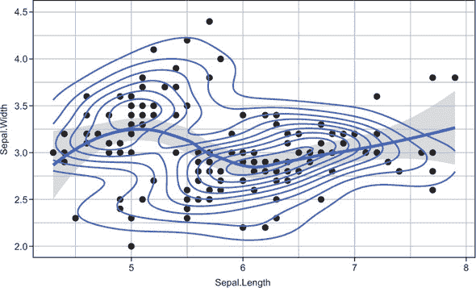

这个图表相当复杂，要在基础 R 中实现相同的效果需要很多行代码。而使用 ggplot2 则非常简单！

##### [代码列表 2.11\. 向`ggplot`对象添加 geom 层]

```
myPlot +
  geom_density_2d() +
  geom_smooth()
```

| |
| --- |

##### 注意

你可以将`ggplot`保存为命名对象，并简单地向该对象添加新层，而不是每次都从头开始创建图表。

| |
| --- |

最后，通常很重要的一点是要突出数据中的分组结构，我们可以通过添加颜色或形状美学映射来实现这一点，如图 2.3 所示。生成这些图表的代码在代码列表 2.12 中展示。它们之间的唯一区别是`species`被用作`shape`或`col`（颜色）美学的参数。

##### 图 2.3\. 与图 2.1 相同的散点图，将`Species`变量映射到形状和`col`美学

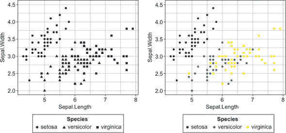

##### [代码列表 2.12\. 将`species`映射到形状和颜色美学]

```
ggplot(iris, aes(x = Sepal.Length, y = Sepal.Width, shape = Species)) +
  geom_point()  +
  theme_bw()

ggplot(iris, aes(x = Sepal.Length, y = Sepal.Width, col = Species)) +
  geom_point()  +
  theme_bw()
```

| |
| --- |

##### 注意

注意到`ggplot()`在添加除 x 和 y 之外的美学映射时，会自动生成图例。在基础图形中，你必须手动生成这些图例！

| |
| --- |

我还想教你们关于`ggplot()`的最后一个非常强大的功能——*分面*功能。有时我们可能希望创建子图，其中每个子图或*面元*显示数据中属于某个分组的数据。

例如，图 2.4 显示了相同的数据，但这次按`Species`变量分面。创建此图表的代码在代码列表 2.13 中展示：我只是在`ggplot`调用中添加了一个`facet_wrap()`层，并指定我想按`(~Species)`分面。

##### 图 2.4\. 展示了相同的数据，但不同鸢尾花物种分别绘制在单独的子图或面元上。

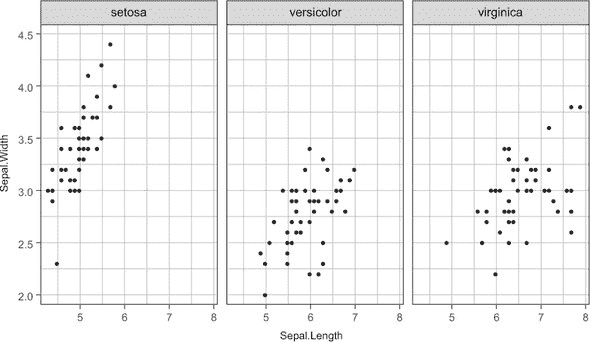

##### [代码列表 2.13\. 使用`facet_wrap()`函数分组子图]

```
ggplot(iris, aes(x = Sepal.Length, y = Sepal.Width)) +
  facet_wrap(~ Species) +
  geom_point()  +
  theme_bw()
```

尽管 ggplot2 还有更多功能（包括几乎可以自定义任何外观），但我只想让你了解如何创建复制书中图表所需的基本图表。如果你想将数据可视化技能提升到下一个层次，我强烈推荐 Hadley Wickham 的《ggplot2：数据分析的优雅图形》（Springer International Publishing，2016 年）。

| |
| --- |

##### 提示

ggplot 中的绘图元素顺序很重要！绘图元素是按顺序叠加的，所以在一个`ggplot()`调用中添加的元素将位于所有其他元素之上。重新排列用于创建图 2.2 的`geom_density_2d()`和`geom_point()`函数，并仔细观察发生了什么（图表可能看起来相同，但实际上并不相同！）。

| |
| --- |
| |

**练习 5**

从你的 `mtcars` tibble 中创建 `drat` 和 `wt` 变量的散点图，并按 `carb` 变量着色点。看看当你将 `carb` 美学映射包裹在 `as.factor()` 中时会发生什么。

| |
| --- |

### 2.6\. tidyr 包是什么以及它做什么

在 第 2.1 节 中，我们查看了一个非整洁数据示例，然后是重新结构化为整洁格式后的相同数据。作为数据科学家，我们通常对数据格式没有太多控制权；我们通常必须将不整洁的数据重新结构化为整洁格式，以便我们可以将其传递到我们的机器学习管道中。让我们创建一个不整洁的 tibble 并将其转换为它的整洁格式。

列表 2.14 展示了一个虚构的患者数据 tibble，其中患者的身体质量指数（BMI）在开始某些想象中的干预措施后的第 0 个月、第 3 个月和第 6 个月进行了测量。这是整洁数据吗？嗯，不是。数据中只有三个变量：

+   患者 ID

+   测量时月份

+   BMI 测量

但是我们有四列！而且每一行并不包含单个观察的数据：它包含了在该患者身上进行的所有观察数据。

##### 列表 2.14\. 不整洁的 tibble

```
library(tibble)

library(tidyr)

patientData <- tibble(Patient = c("A", "B", "C"),
                      Month0 = c(21, 17, 29),
                      Month3 = c(20, 21, 27),
                      Month6 = c(21, 22, 23))

patientData

# A tibble: 3 x 4
  Patient Month0 Month3 Month6
  <chr>    <dbl>  <dbl>  <dbl>
1 A           21     20     21
2 B           17     21     22
3 C           29     27     23
```

要将这个不整洁的 tibble 转换为其整洁对应物，我们可以使用 tidyr 的 `gather()` 函数。`gather()` 函数将数据作为其第一个参数。`key` 参数定义了将代表我们“聚集”的列的新变量名称。在这种情况下，我们正在聚集的列命名为 `Month0`、`Month3` 和 `Month6`，因此我们将包含这些 *keys* 的新列称为 `Month`。`value` 参数定义了将代表我们从聚集的列中获取的数据的新变量名称。在这种情况下，值是 BMI 测量值，因此我们将代表这些值的新的列称为 `BMI`。最后一个参数是一个定义要聚集并转换为键值对的变量的向量。通过使用 `-Patient`，我们告诉 `gather()` 使用除标识变量 `Patient` 之外的所有变量。

##### 列表 2.15\. 使用 `gather()` 函数整理数据

```
tidyPatientData <- gather(patientData, key = Month,
                          value = BMI, -Patient)

tidyPatientData

# A tibble: 9 x 3
  Patient Month    BMI
  <chr>   <chr>  <dbl>
1 A       Month0    21
2 B       Month0    17
3 C       Month0    29
4 A       Month3    20
5 B       Month3    21
6 C       Month3    27
7 A       Month6    21
8 B       Month6    22
9 C       Month6    23
```

我们可以通过输入以下内容达到相同的结果（注意，两个列表返回的 tibble 是相同的）。

##### 列表 2.16\. 选择列进行聚集的不同方式

```
gather(patientData, key = Month, value = BMI, Month0:Month6)

# A tibble: 9 x 3
  Patient Month    BMI
  <chr>   <chr>  <dbl>
1 A       Month0    21
2 B       Month0    17
3 C       Month0    29
4 A       Month3    20
5 B       Month3    21
6 C       Month3    27
7 A       Month6    21
8 B       Month6    22
9 C       Month6    23

gather(patientData, key = Month, value = BMI, c(Month0, Month3, Month6))

# A tibble: 9 x 3
  Patient Month    BMI
  <chr>   <chr>  <dbl>
1 A       Month0    21
2 B       Month0    17
3 C       Month0    29
4 A       Month3    20
5 B       Month3    21
6 C       Month3    27
7 A       Month6    21
8 B       Month6    22
9 C       Month6    23
```

| |
| --- |

**将数据转换为宽格式**

数据结构在`patientData` tibble 中被称为*宽格式*，其中单个案例的观测值放置在同一行，跨越多个列。我们通常想要处理整洁数据，因为它使我们的生活更简单：我们可以立即看到我们有哪些变量，分组结构变得清晰，并且大多数函数都设计得可以轻松与整洁数据一起工作。然而，有些罕见的情况下，我们需要将我们的整洁数据转换为宽格式，可能是因为我们需要的函数期望数据以这种格式。我们可以使用`spread()`函数将整洁数据转换为宽格式：

```
spread(tidyPatientData, key = Month, value = BMI)

# A tibble: 3 x 4
  Patient Month0 Month3 Month6
  <chr>    <dbl>  <dbl>  <dbl>
1 A           21     20     21
2 B           17     21     22
3 C           29     27     23
```

它的使用与`gather()`相反：我们提供`key`和`value`参数作为使用`gather()`函数创建的键和值列的名称，该函数为我们将这些转换为宽格式。

| |
| --- |
| |

**练习 6**

将`mtcars` tibble 中的`vs`、`am`、`gear`和`carb`变量收集到一个单个键值对中。

| |
| --- |

### 2.7\. purrr 包是什么以及它做什么

我将要向你展示的最后一个 tidyverse 包是 purrr（有三个 r）。R 为我们提供了将其用作函数式编程语言所需的工具。这意味着它为我们提供了将所有计算视为返回其值而不改变工作区中的任何内容的数学函数的工具。

| |
| --- |

##### 注意

当一个函数执行的操作不仅仅是返回一个值（例如绘制一个图表或改变环境），我们称其为函数的*副作用*。一个不产生任何副作用的函数被称为*纯函数*。

| |
| --- |

函数是否产生副作用的一个简单例子可以在列表 2.17 中找到。`pure()`函数返回`a + 1`的值，但不会改变全局环境中的任何内容。`side_effects()`函数使用超级赋值运算符`<<-`重新分配全局环境中的对象`a`。每次运行`pure()`函数，它都会给出相同的输出；但运行`side_effect()`函数每次都会给出一个新的值（并且还会影响后续`pure()`函数调用的输出）。

##### 列表 2.17\. 创建一个数值向量的列表

```
a <- 20

pure <- function() {
  a <- a + 1
  a
}

side_effect <- function() {
  a <<- a + 1
  a
}

c(pure(), pure())
[1] 21 21

c(side_effect(), side_effect())
[1] 21 22
```

调用没有副作用的函数通常是可取的，因为这更容易预测函数将做什么。如果一个函数没有副作用，它可以被替换为不同的实现，而不会破坏你的代码中的任何内容。

一个重要的后果是，`for`循环，当单独使用时可以产生不希望出现的副作用（例如修改现有变量），可以被包裹在其他函数中。将`for`循环包裹在内的函数允许我们遍历向量/列表的每个元素（包括数据框或 tibble 的列和行），对该元素应用一个函数，并返回整个迭代过程的输出结果。

| |
| --- |

##### 注意

如果你熟悉基础 R 的 `apply()` 家族函数，`purrr` 包中的函数帮助我们实现相同的功能，但使用一致的语法和一些方便的特性。

| |
| --- |

#### 2.7.1\. 用 map() 替换 for 循环

`purrr` 包提供了一套函数，允许我们对列表的每个元素应用一个函数。我们使用哪个 `purrr` 函数取决于输入的数量以及我们想要的输出类型；在本节中，我将演示这个包中最常用函数的重要性。

假设我们有一个包含三个数值向量的列表：

```
listOfNumerics <- list(a = rnorm(5),
                       b = rnorm(9),
                       c = rnorm(10))

listOfNumerics

$a
[1] -1.4617 -0.3948  2.1335 -0.2203  0.3429

$b
[1]  0.2438 -1.3541  0.6164 -0.5524  0.4519  0.3592 -1.3415 -1.7594  1.2160

$c
 [1] -1.1325  0.2792  0.5152 -1.1657 -0.7668  0.1778  1.4004  0.6492 -1.6320
[10] -1.0986
```

现在，假设我们想要分别对三个列表元素应用一个函数，比如使用 `length()` 函数来返回每个元素的长度。我们可以使用 `for` 循环来做这件事，遍历每个列表元素，并将长度保存为新列表的一个元素，我们预先定义这个新列表以节省时间：

```
elementLengths <- vector("list", length = 3)

for(i in seq_along(listOfNumerics)) {
  elementLengths[[i]] <- length(listOfNumerics[[i]])
}

elementLengths

[[1]]
[1] 5

[[2]]
[1] 9

[[3]]
[1] 20
```

这段代码难以阅读，需要我们预先定义一个空向量以防止循环变慢，并且有一个副作用：如果我们再次运行循环，它将覆盖 `elementLengths` 列表。

相反，我们可以用 `map()` 函数来替换 `for` 循环。`map` 家族中所有函数的第一个参数是我们正在迭代的 数据。第二个参数是我们应用到的每个列表元素的函数。看看 图 2.5，它说明了 `map()` 函数如何将一个函数应用到列表/向量的每个元素上，并返回一个包含输出的列表。

在这个例子中，`map()` 函数将 `length()` 函数应用到 `listOfNumerics` 列表的每个元素上，并返回这些值作为一个列表。注意，`map()` 函数还使用输入元素的名称作为输出元素的名称（`a`、`b` 和 `c`）：

```
map(listOfNumerics, length)

$a
[1] 5

$b
[1] 9

$c
[1] 20
```

| |
| --- |

##### 注意

如果你熟悉 `apply` 家族的基础 R 函数，`map()` 就是 `purrr` 的 `lapply()` 对应函数。

| |
| --- |

##### 图 2.5\. `map()` 函数接受一个向量或列表作为输入，对每个元素单独应用一个函数，并返回一个包含返回值的列表。

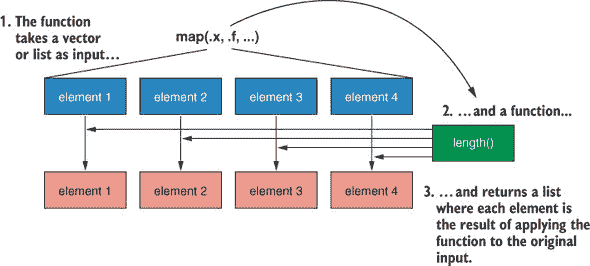

我希望你能立即看到，这比 `for` 循环简单得多，而且更容易阅读！

#### 2.7.2\. 返回原子向量而不是列表

所以 `map()` 函数总是返回一个列表。但如果，我们想要返回一个原子向量而不是列表，怎么办？`purrr` 包提供了一系列函数来完成这个任务：

+   `map_dbl()` 返回一个双精度浮点数向量。

+   `map_chr()` 返回一个字符向量。

+   `map_int()` 返回一个整数向量。

+   `map_lgl()` 返回一个逻辑向量。

这些函数中的每一个都返回一个由其后缀指定的原子向量。这样，我们被迫思考和预先确定我们的输出应该是哪种类型的数据。例如，正如代码清单 2.18 所示，我们可以像以前一样使用`map_int()`函数返回我们的`listOfNumerics`列表中每个元素的长度。就像`map()`一样，`map_int()`函数将`length()`函数应用到我们的列表的每个元素上，但它返回一个整数向量。我们可以使用`map_chr()`函数做同样的事情，它会将输出强制转换为字符向量，但`map_lgl()`函数会抛出一个错误，因为它无法将输出强制转换为逻辑向量。


##### 注意

强迫我们明确声明我们想要的输出类型可以防止意外类型输出导致的错误。


##### 列表 2.18\. 返回原子向量

```
map_int(listOfNumerics, length)

 a  b  c
 5  9 20

map_chr(listOfNumerics, length)

   a    b    c
 "5"  "9" "20"

map_lgl(listOfNumerics, length)

Error: Can't coerce element 1 from a integer to a logical
```


**练习 7**

使用来自 purrr 包的函数返回一个逻辑向量，指示`mtcars`数据集中每列值的总和是否大于 1,000。


最后，我们可以使用`map_df()`函数返回一个 tibble 而不是列表。

##### 列表 2.19\. 使用`map_df()`返回一个 tibble

```
map_df(listOfNumerics, length)

# A tibble: 1 x 3
      a     b     c
  <int> <int> <int>
1     5     9    10
```

#### 2.7.3\. 在 map()家族中使用匿名函数

有时我们想要将一个函数应用到我们尚未定义的列表的每个元素上。在即兴定义的函数称为*匿名函数*，当我们要应用的函数不太可能经常使用到足以将其分配给一个对象时，它们非常有用。使用基础 R，我们通过简单地调用`function()`函数来定义一个匿名函数。

##### 列表 2.20\. 使用`function()`定义匿名函数

```
map(listOfNumerics, function(.) . + 2)

$a
[1] 0.5383 1.6052 4.1335 1.7797 2.3429

$b
[1] 2.2438 0.6459 2.6164 1.4476 2.4519 2.3592 0.6585 0.2406 3.2160

$c
 [1] 0.8675 2.2792 2.5152 0.8343 1.2332 2.1778 3.4004 2.6492 0.3680 0.9014
```


##### 注意

注意匿名函数中的`.`。这代表`map()`当前正在迭代的元素。


`function(.)`后面的表达式是函数的主体。这种语法没有问题——它工作得很好——但 purrr 提供了`function(.)`的简写：波浪号`~`符号。因此，我们可以简化`map()`调用为

```
map(listOfNumerics, ~. + 2)
```

通过用`~`替换`function(.)`。

#### 2.7.4\. 使用 walk()产生函数的副作用

有时我们想要迭代一个函数以产生其副作用。最常见的一个例子是我们想要生成一系列图表。在这种情况下，我们可以使用`walk()`函数将一个函数应用到列表的每个元素上，以产生函数的副作用。`walk()`函数还会返回我们传递给它的原始输入数据，因此它在一系列管道操作中的中间步骤绘图时非常有用。以下是一个使用`walk()`为列表中的每个元素创建单独直方图的例子：

```
par(mfrow = c(1, 3))

walk(listOfNumerics, hist)
```


##### 注意

`par(mfrow = c(1, 3))`函数调用只是将绘图设备分成两行四列，用于基本绘图。


生成的图表显示在图 2.6 中。

但如果我们想使用每个列表元素的名称作为其直方图的标题呢？我们可以使用`iwalk()`函数，它使我们能够获取每个元素的名字或索引。在提供给`iwalk()`的函数中，我们可以使用`.x`来引用正在迭代的列表元素，使用`.y`来引用其名称/索引：

```
iwalk(listOfNumerics, ~hist(.x, main = .y))
```


##### 注意

每个`map()`函数都有一个`i`版本，允许我们引用每个元素的名字/索引。


##### 图 2.6\. 使用`walk()`函数遍历列表中每个元素的`hist()`函数的结果

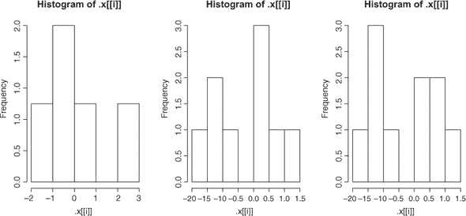

结果图显示在图 2.7。注意，现在每个直方图的标题显示了它所绘制的列表元素的名称。

##### 图 2.7\. 使用`iwalk()`遍历列表中每个元素的`hist()`函数的结果

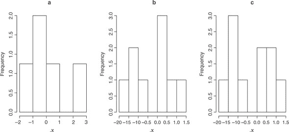

#### 2.7.5\. 同时遍历多个列表

有时候我们想要迭代的不是单个列表中的数据。想象一下，我们想要将列表中的每个元素乘以不同的值。我们可以将这些值存储在单独的列表中，并使用`map2()`函数同时遍历这两个列表，将第一个列表中的元素乘以第二个列表中的元素。这次，我们不是使用`.`来引用数据，而是分别使用`.x`和`.y`来特别引用第一个和第二个列表：

```
multipliers <- list(0.5, 10, 3)

map2(.x = listOfNumerics, .y = multipliers, ~.x * .y)
```

现在，想象一下，如果我们想迭代的不只是两个列表，而是三个或更多。`pmap()`函数允许我们同时遍历多个列表。当我想要测试函数的多个参数组合时，我会使用`pmap()`。`rnorm()`函数从正态分布中抽取随机样本，有三个参数：`n`（样本数量）、`mean`（分布的中心）和`sd`（标准差）。我们可以为每个参数创建一个值列表，然后使用`pmap()`迭代每个列表，对每种组合运行函数。

我们首先使用`expand.grid()`函数创建一个包含所有输入向量组合的数据框。因为数据框实际上只是列的列表，所以提供给`pmap()`的数据框将迭代数据框中的每一列。本质上，我们要求`pmap()`迭代的函数将使用数据框每一行的参数运行。因此，`pmap()`将返回八个不同的随机样本，每个样本对应数据框中参数组合的一种。

因为所有`map`族函数的第一个参数是我们想要迭代的的数据，所以我们可以使用`%>%`运算符将它们连接起来。以下代码将`pmap()`返回的随机样本传递给`iwalk()`函数，为每个样本绘制一个单独的直方图，并标注其索引。

##### 列表 2.21\. 使用`pmap()`遍历多个列表

```
arguments <- expand.grid(n = c(100, 200),
                         mean = c(1, 10),
                         sd = c(1, 10))

arguments

    n mean sd
1 100    1  1
2 200    1  1
3 100   10  1
4 200   10  1
5 100    1 10
6 200    1 10
7 100   10 10
8 200   10 10
par(mfrow = c(2, 4))

pmap(arguments, rnorm) %>%
  iwalk(~hist(.x, main = paste("Element", .y)))
```

结果图显示在图 2.8 中。

##### 图 2.8。使用了 `pmap()` 函数对三个参数向量进行迭代 `rnorm()` 函数。`pmap()` 的输出被传递到 `iwalk()` 中，以迭代每个随机样本的 `hist()` 函数。

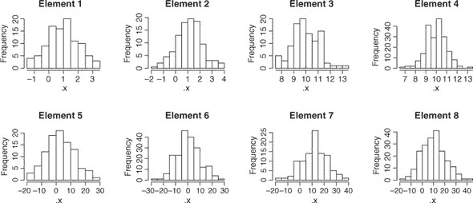

如果你没有记住我刚才提到的所有 tidyverse 函数，不要担心——我们将在本书的机器学习管道中一直使用这些工具。此外，我们还可以使用 tidyverse 工具做更多的事情，但我所涵盖的这些内容将足以解决你将遇到的最常见的数据操作问题。现在，你已经掌握了如何使用这本书的知识，在下一章中，我们将深入探讨机器学习的理论。

### 摘要

+   tidyverse 是一系列 R 包的集合，它简化了数据的组织、操作和绘图。

+   整洁数据是矩形数据，其中每一行是一个单独的观测值，每一列是一个变量。在将数据传递给机器学习函数之前，确保数据处于整洁格式通常很重要。

+   Tibbles 是对数据框的现代改进，它具有更好的打印矩形数据的规则，永远不会改变变量类型，并且在用 `[` 子集时总是返回另一个 tibble。

+   dplyr 包提供了人类可读的、动词样式的数据操作函数，其中最重要的是 `select()`、`filter()`、`group_by()`、`summarize()` 和 `arrange()`。

+   dplyr 的最强大之处在于能够使用 `%>%` 操作符将函数连接起来，该操作符将左侧函数的输出作为右侧函数的第一个参数。

+   ggplot2 包是一个现代且流行的 R 语言绘图系统，它允许你以简单、分层的方式创建有效的图表。

+   tidyr 包提供了重要的 `gather()` 函数，它允许你轻松地将不整洁的数据转换为整洁格式。与此函数相反的是 `spread()`，它将整洁数据转换为宽格式。

+   purrr 包提供了一种简单、一致的方式来迭代地对列表中的每个元素应用函数。

### 练习解答

1.  加载 `mtcars`，将其转换为 tibble，并使用 `summary()` 进行探索：

    ```
    library(tidyverse)

    data(mtcars)

    mtcarsTib <- as_tibble(mtcars)

    summary(mtcarsTib)
    ```

1.  选择除 `qsec` 和 `vs` 之外的所有列：

    ```
    select(mtcarsTib, c(-qsec, -vs))
    # or
    select(mtcarsTib, c(-7, -8))
    ```

1.  筛选出气缸数不等于 8 的行：

    ```
    filter(mtcarsTib, cyl != 8)
    ```

1.  按 `gear` 分组，计算 `mpg` 和 `disp` 的中位数，并创建一个新变量，该变量是 `mpg` 中位数除以 `disp` 中位数：

    ```
    mtcarsTib %>%
      group_by(gear) %>%
      summarize(mpgMed = median(mpg), dispMed = median(disp)) %>%
      mutate(mpgOverDisp = mpgMed / dispMed)
    ```

1.  创建 `drat` 和 `wt` 变量的散点图，并按 `carb` 分色：

    ```
    ggplot(mtcarsTib, aes(drat, wt, col = carb)) +
      geom_point()

    ggplot(mtcarsTib, aes(drat, wt, col = as.factor(carb))) +
      geom_point()
    ```

1.  将 `vs`、`am`、`gear` 和 `carb` 聚合成一个单一的关键值对：

    ```
    gather(mtcarsTib, key = "variable", value = "value", c(vs, am, gear, carb))
    # or
    gather(mtcarsTib, key = "variable", value = "value", c(8:11))
    ```

1.  对 `mtcars` 的每一列进行迭代，返回一个逻辑向量：

    ```
    map_lgl(mtcars, ~sum(.) > 1000)
    # or
    map_lgl(mtcars, function(.) sum(.) > 1000)
    ```
