## 第二部分. 分类

现在我们已经覆盖了一些基本的机器学习术语，并且您的 tidyverse 技能正在发展，让我们最终开始学习一些实用的机器学习技能。本书的其余部分分为四个部分：

+   分类

+   回归

+   维度降低

+   聚类

在这些各个部分中，每一章都将专注于不同的算法（或算法集）。每一章将从解释算法学习背后的理论开始，以图形化的方式呈现，然后本章的其余部分将通过将算法应用于真实数据集来将我们的知识转化为技能。

回想一下第一章，分类和回归都是监督学习任务。它们是监督学习，因为我们有一个可以用来训练模型的基准真实值。我们将从关注第三章到第八章（kindle_split_013.html#ch03 到 kindle_split_018.html#ch08）中的分类变量的预测开始，欢迎来到本书的分类部分。在向您介绍算法的工作原理和使用方法的同时，我还会向您介绍一系列其他机器学习技能，例如如何评估模型性能以及如何调整模型以最大化其性能。当您完成本书的这一部分时，我希望您会对使用 R 中的 mlr 包进行机器学习任务感到非常有信心。mlr 包为任何机器学习任务创建了一个非常简单、重复的工作流程，这将使您的学习变得更加简单。一旦我们完成了本书的分类部分，我们将转向回归部分，预测连续变量。

## 第三章. 基于 k 近邻相似性的分类

*本章涵盖*

+   理解偏差-方差权衡

+   欠拟合与过拟合

+   使用交叉验证来评估模型性能

+   构建 k 近邻分类器

+   调整超参数

这可能是整本书中最重要的章节。在这章中，我将向您展示 k 近邻（kNN）算法是如何工作的，我们将用它来对潜在的糖尿病患者进行分类。此外，我还会使用 kNN 算法向您介绍一些机器学习中的基本概念，这些概念我们将贯穿整本书。

到本章结束时，您不仅将理解和能够使用 kNN 算法来构建分类模型，而且您还将能够验证其性能并调整它以尽可能提高其性能。一旦模型构建完成，您将学习如何将新的、未见过的数据输入其中，并获取数据的预测类别（我们试图预测的类别或分组变量的值）。我将向您介绍 R 中的极其强大的 mlr 包，它包含大量令人垂涎的机器学习算法，极大地简化了我们的所有机器学习任务。

### 3.1. k 近邻算法是什么？

我认为生活中的简单事情是最好的：在公园里玩飞盘、遛狗、和家人玩桌游，以及使用 kNN 算法。一些机器学习从业者对 kNN 有点不屑，因为它非常简单。事实上，kNN 可能是*最*简单的机器学习算法，这也是我喜欢它的一个原因。尽管它很简单，但 kNN 可以提供令人惊讶的分类性能，而且它的简单性使得它易于解释。

| |
| --- |

##### 注意

记住，因为 kNN 使用标记数据，所以它是一个监督学习算法。

| |
| --- |

#### 3.1.1\. k-最近邻算法是如何学习的？

那么，kNN 是如何学习的呢？好吧，我将用蛇来帮助我解释。我来自英国，有些人可能会惊讶地了解到，我们有一些本土的蛇种。两个例子是草蛇和蝰蛇，这是英国唯一的毒蛇。但我们还有一种可爱、无肢的爬行动物，叫做蚺蜥，它通常被误认为是蛇。

想象一下，你在一个旨在统计林地中草蛇、蝰蛇和蚺蜥数量的爬行动物保护项目中工作。你的任务是构建一个模型，让你能够快速地将你发现的爬行动物分类到这三个类别之一。当你发现这些动物之一时，你只有足够的时间快速估计它的长度以及它对你攻击性的某种度量，然后它就会滑走（你的项目资金非常紧张）。一位爬行动物专家帮助你手动分类你迄今为止所做的观察，但你决定构建一个 kNN 分类器来帮助你快速分类你将来遇到的样本。

在图 3.1 中查看分类前的数据图。我们的每个案例都是针对身体长度和攻击性绘制的，而你专家所识别的物种由数据点的形状表示。你再次进入林地并收集了三个新样本的数据，这些样本用黑色十字表示。

##### 图 3.1\. 爬行动物的身体长度和攻击性。蝰蛇、草蛇和蚺蜥的标记案例由其形状表示。新的未标记数据用黑色十字表示。

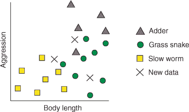

我们可以用两个阶段来描述 kNN 算法（以及其他机器学习算法）：

1.  训练阶段

1.  预测阶段

kNN 算法的训练阶段仅包括存储数据。这在机器学习算法中是不寻常的（你将在后面的章节中了解到），这意味着大部分计算都是在预测阶段完成的。

在预测阶段，kNN 算法计算每个新的、未标记的案例与所有标记案例之间的*距离*。当我说“距离”时，我是指它们在攻击性和身体长度变量方面的接近程度，而不是你在树林中找到它们的距离！这个距离度量通常称为*欧几里得距离*，在二维甚至三维中，你可以将其想象为图上两点之间的直线距离（这个距离在图 3.2 中显示）。这是在数据中存在的维度数上计算的。

##### 图 3.2。kNN 算法的第一步：计算距离。线条代表一个未标记案例（十字架）与每个标记案例之间的距离。

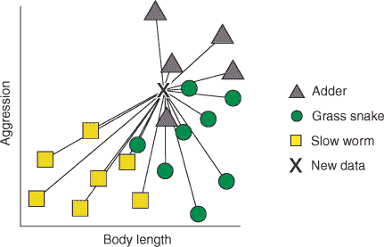

接下来，对于每个未标记的案例，算法将邻居从最近的（最相似的）到最远的（最不相似的）进行排序。这如图图 3.3 所示。

##### 图 3.3。kNN 算法的第二步：排序邻居。线条代表一个未标记案例（十字架）与每个标记案例之间的距离。数字代表未标记案例（十字架）与每个标记案例（1 = 最接近）之间的排序距离。

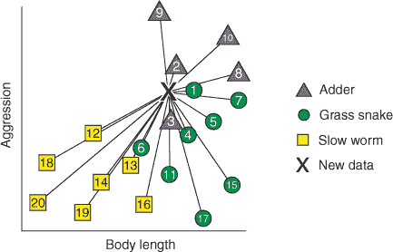

算法识别每个未标记案例最近的*k*个标记案例（邻居）。*k*是一个我们指定的整数（我将在 3.1 节中介绍我们如何选择*k*）。换句话说，找到与未标记案例在变量方面最相似的*k*个标记案例。最后，每个 k 个最近邻案例“投票”决定未标记数据属于哪个类别，基于最近邻自己的类别。换句话说，k 个最近邻中大多数属于的类别就是未标记案例被分类为的类别。

| |
| --- |

##### 注意

因为所有的计算都是在预测阶段完成的，所以 kNN 被称为*懒惰学习器*。

| |
| --- |

让我们通过图 3.4 来实际操作，看看这个方法。当我们把*k*设为 1 时，算法找到与每个未标记数据项最相似的单一标记案例。每个未标记的爬行动物最接近草蛇类的一个成员，所以它们都被分配到这个类别。

##### 图 3.4。kNN 算法的最终步骤：识别 k 个最近邻并进行多数投票。线条将未标记的数据与它们的单个、三个和五个最近邻连接起来。每个场景的多数投票由每个十字架下绘制的形状表示。

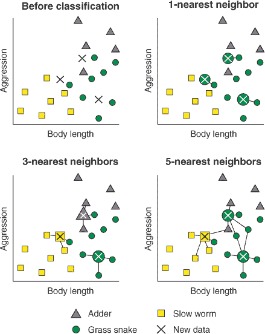

当我们将 *k* 设置为 3 时，算法会找到与每个未标记数据项最相似的三个标记案例。正如你在图中可以看到的，两个未标记案例的最近邻属于多个类别。在这种情况下，每个最近邻“投票”支持它自己的类别，多数投票获胜。这非常直观，因为如果一条异常好斗的草蛇恰好是尚未标记的蝰蛇的最近邻，它将被数据中的邻近蝰蛇所投票击败。

希望现在你能看到这是如何扩展到 *k* 的其他值的。例如，当我们把 *k* 设置为 5 时，算法只是找到与未标记数据最近的五个案例，并将多数投票作为未标记案例的类别。请注意，在这三种情况下，*k* 的值直接影响到每个未标记案例的分类。


##### 小贴士

kNN 算法实际上可以用于分类 *和* 回归问题！我将在第十二章中向你展示如何做到这一点，但唯一的区别是，算法不是采取多数类投票，而是找到最近邻值的平均值或中位数。


#### 3.1.2\. 如果投票结果平局会怎样？

有可能所有 k 个最近邻属于不同的类别，投票结果出现平局。在这种情况下会发生什么？嗯，在二分类问题中（当数据只能属于两个互斥组之一时），我们可以通过确保选择奇数个 *k* 来避免这种情况。这样，总会有一票决定。但在像我们的爬行动物分类问题这样的情况下，我们有超过两个组怎么办？

处理这种情况的一种方法是将 *k* 减小，直到可以赢得多数投票。但如果一个未标记案例与它的两个最近邻等距，这并没有帮助。

相反，一种更常见（也更实用）的方法是将没有多数投票的案例随机分配到其中一个类别。实际上，在最近邻之间出现平局的案例比例非常小，所以这对模型的分类精度影响有限。然而，如果你数据中的平局很多，你的选择如下：

+   选择不同的 *k* 值。

+   向数据添加少量噪声。

+   考虑使用不同的算法！我将在第八章的末尾向你展示如何比较同一问题的不同算法的性能。

### 3.2\. 构建你的第一个 kNN 模型

想象一下，你在医院工作，并试图改善糖尿病患者的诊断。你从疑似糖尿病患者那里收集了几个月的诊断数据，并记录他们是否被诊断为健康、化学性糖尿病或显性糖尿病。你希望使用 kNN 算法训练一个模型，可以预测新患者属于这些类别中的哪一个，以便提高诊断。这是一个三分类问题。

我们将从构建一个简单的、直观的 kNN 模型开始，然后在接下来的章节中逐步改进它。首先的事情是——让我们安装 mlr 包并加载它以及 tidyverse：

```
install.packages("mlr", dependencies = TRUE)

library(mlr)

library(tidyverse)
```

| |
| --- |

##### 警告

安装 mlr 包可能需要几分钟。您只需要做一次。

| |
| --- |

#### 3.2.1\. 加载和探索糖尿病数据集

现在，让我们加载 mclust 包中内置的一些数据，将其转换为 tibble，并对其进行一些探索（回想一下第二章中提到的，tibble 是 tidyverse 存储矩形数据的方式）：见列表 3.1。我们有一个包含 145 个案例和 4 个变量的 tibble。`class`因子显示 76 个案例是非糖尿病的（`Normal`），36 个是化学性糖尿病的（`Chemical`），33 个是显性糖尿病的（`Overt`）。其他三个变量是葡萄糖耐量测试后血糖和胰岛素水平的连续测量（分别称为`glucose`和`insulin`），以及血糖的稳态水平（`sspg`）。

##### 列表 3.1\. 加载糖尿病数据

```
data(diabetes, package = "mclust")

diabetesTib <- as_tibble(diabetes)

summary(diabetesTib)

class       glucose       insulin            sspg
Chemical:36    Min.   : 70   Min.   :  45.0   Min.   : 10.0
Normal  :76    1st Qu.: 90   1st Qu.: 352.0   1st Qu.:118.0
Overt   :33    Median : 97   Median : 403.0   Median :156.0
               Mean   :122   Mean   : 540.8   Mean   :186.1
               3rd Qu.:112   3rd Qu.: 558.0   3rd Qu.:221.0
               Max.   :353   Max.   :1568.0   Max.   :748.0

diabetesTib

# A tibble: 145 x 4
   class  glucose insulin  sspg
 * <fct>    <dbl>   <dbl> <dbl>
 1 Normal      80     356   124
 2 Normal      97     289   117
 3 Normal     105     319   143
 4 Normal      90     356   199
 5 Normal      90     323   240
 6 Normal      86     381   157
 7 Normal     100     350   221
 8 Normal      85     301   186
 9 Normal      97     379   142
10 Normal      97     296   131
# ... with 135 more rows
```

为了展示这些变量之间的关系，它们被绘制在一起，见图 3.5。生成这些图表的代码在列表 3.2 中。

##### 图 3.5\. 在`diabetesTib`中绘制变量之间的关系。所有连续变量的三种组合都显示出来，并用颜色阴影表示类别。

![fig3-5_alt.jpg]

##### 列表 3.2\. 绘制糖尿病数据

```
ggplot(diabetesTib, aes(glucose, insulin, col = class)) +
  geom_point()  +
  theme_bw()

ggplot(diabetesTib, aes(sspg, insulin, col = class)) +
  geom_point() +
  theme_bw()

ggplot(diabetesTib, aes(sspg, glucose, col = class)) +
  geom_point() +
  theme_bw()
```

观察数据，我们可以看到三个类别之间连续变量的差异，因此让我们构建一个 kNN 分类器，我们可以用它来预测未来患者的糖尿病状态。

| |
| --- |

**练习 1**

重新绘制图 3.5 中`glucose`与`insulin`的关系图，但使用形状而不是颜色来表示每个案例所属的类别。完成此操作后，修改您的代码以使用形状*和*颜色来表示类别。

| |
| --- |

我们的数据集只包含连续预测变量，但通常我们可能还要处理分类预测变量。kNN 算法不能直接处理分类变量；它们需要首先以某种方式编码，或者必须使用除欧几里得距离之外的距离度量。

对于 kNN（以及许多机器学习算法）来说，通过将预测变量除以它们的方差来缩放预测变量也非常重要。这保留了变量之间的关系，但确保算法不会因为变量测量在更大的尺度上而给予它们更多的重视。在当前示例中，如果我们把`glucose`和`insulin`变量除以 1000000，那么预测将主要依赖于`sspg`变量的值。我们不需要自己缩放预测变量，因为默认情况下，由 mlr 包包装的 kNN 算法会为我们完成这项工作。

#### 3.2.2\. 使用 mlr 训练第一个 kNN 模型

我们理解我们试图解决的问题（将新患者分类为三个类别之一），现在我们需要训练 kNN 算法来构建一个可以解决该问题的模型。使用 mlr 包构建机器学习模型有三个主要阶段：

1.  ***定义任务。*** 任务由数据和我们要对其做什么组成。在这种情况下，数据是`diabetesTib`，我们想要使用`class`变量作为目标变量进行数据分类。

1.  ***定义学习器。*** 学习器只是我们计划使用的算法的名称，以及算法接受的任何附加参数。

1.  ***训练模型。*** 这个阶段正如其名：你将任务传递给学习器，学习器生成一个你可以用来进行未来预测的模型。


##### 小贴士

这可能看起来有些过于繁琐，但将任务、学习器和模型分成不同的阶段是非常有用的。这意味着我们可以定义一个单独的任务并对其应用多个学习器，或者定义一个单独的学习器并用多个不同的任务对其进行测试。


#### 3.2.3\. 告诉 mlr 我们想要实现的目标：定义任务

让我们从定义我们的任务开始。定义任务所需的组件

+   包含预测变量的数据（我们希望包含用于做出预测/解决我们问题的所需信息的变量）

+   我们想要预测的目标变量

对于监督学习，如果存在分类问题，目标变量将是分类的，如果存在回归问题，目标变量将是连续的。对于无监督学习，我们从任务定义中省略目标变量，因为我们没有访问到标记数据。任务组件在图 3.6 中展示。

##### 图 3.6\. 在 mlr 中定义一个任务。任务定义包括包含预测变量的数据，以及对于分类和回归问题，我们想要预测的目标变量。对于无监督学习，目标变量被省略。

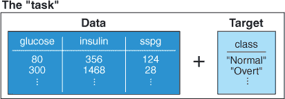

我们想构建一个分类模型，所以我们使用`makeClassifTask()`函数来定义一个分类任务。当我们构建第三部分和第五部分的回归和聚类模型时，我们将分别使用`makeRegrTask()`和`makeClusterTask()`。我们将我们的 tibble 的名称作为`data`参数，将包含类别标签的因子的名称作为`target`参数：

```
diabetesTask <- makeClassifTask(data = diabetesTib, target = "class")
```


##### 注意

你可能会注意到当构建任务时，mlr 会发出一个警告消息，指出你的数据不是一个纯`data.frame`（它是一个 tibble）。这不是问题，因为该函数会为你将 tibble 转换为`data.frame`。


如果我们调用任务，我们可以看到它是在`diabetesTib` tibble 上的分类任务，其目标是`class`变量。我们还获得了有关观测数和不同类型变量（在机器学习术语中通常称为*特征*）数量的信息。一些其他信息包括是否有缺失数据，每个类别的观测数，以及哪个类别被认为是“阳性”类别（仅适用于双类任务）：

```
diabetesTask

Supervised task: diabetesTib
Type: classif
Target: class
Observations: 145
Features:
   numerics     factors     ordered functionals
          3           0           0           0
Missings: FALSE
Has weights: FALSE
Has blocking: FALSE
Has coordinates: FALSE
Classes: 3
Chemical   Normal    Overt
      36       76       33
Positive class: NA
```

#### 3.2.4\. 告诉 mlr 使用哪个算法：定义学习器

接下来，让我们定义我们的学习器。定义学习器所需的组件如下：

+   我们正在使用的算法类别：

    +   `"classif."`用于分类

    +   `"regr."`用于回归

    +   `"cluster."`用于聚类

    +   `"surv."`和`"multilabel."`用于预测生存和多层分类，这里不做讨论

+   我们正在使用的算法

+   我们可能希望使用的任何其他选项来控制算法

正如你所看到的，第一个和第二个组件组合成一个字符参数来定义将使用哪个算法（例如，`"classif.knn"`）。学习器的组件在图 3.7 中显示。

##### 图 3.7\. 在 mlr 中定义学习器。学习器定义包括你想要使用的算法类别、单个算法的名称，以及可选的任何其他参数来控制算法的行为。

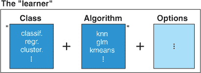

我们使用`makeLearner()`函数来定义一个学习器。`makeLearner()`函数的第一个参数是我们将要用于训练模型的算法。在这种情况下，我们想使用 kNN 算法，所以我们提供`"classif.knn"`作为参数。看看这是如何将类（`"classif."`）与算法的名称（`knn"`)结合在一起的吗？

参数`par.vals`代表参数值，这允许我们指定算法要使用的 k-最近邻的数量。现在，我们将其设置为 2，但我们将很快讨论如何选择*k*：

```
knn <- makeLearner("classif.knn", par.vals = list("k" = 2))
```


**如何列出 mlr 的所有算法**

mlr 包有大量的机器学习算法可以提供给`makeLearner()`函数，多到我不检查就无法记住！要列出所有可用的学习器，只需使用

```
listLearners()$class
```

或者按功能列表：

```
listLearners("classif")$class
listLearners("regr")$class
listLearners("cluster")$class
```

如果你不确定有哪些算法可供选择，或者对于特定的算法，应该传递给`makeLearner()`函数的哪个参数，可以使用这些函数来提醒自己。

| |
| --- |

#### 3.2.5. 将所有内容组合起来：训练模型

现在我们已经定义了我们的任务和我们的学习器，我们现在可以训练我们的模型了。训练模型所需的组件是我们之前定义的学习器和任务。定义任务和学习器并将它们组合起来以训练模型的全过程在图 3.8 中展示。

##### 图 3.8. 在 mlr 中训练模型。训练模型简单来说就是将学习器与任务相结合。

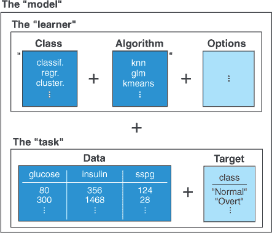

这是通过`train()`函数实现的，它将学习器作为第一个参数，将任务作为第二个参数：

```
knnModel <- train(knn, diabetesTask)
```

我们已经有了我们的模型，现在让我们通过它传递数据来查看它的表现。`predict()`函数接受未标记的数据并将其通过模型传递以获取预测类别。第一个参数是模型，传递给它的数据作为`newdata`参数给出：

```
knnPred <- predict(knnModel, newdata = diabetesTib)
```

我们可以将这些预测作为`performance()`函数的第一个参数传递。这个函数将模型预测的类别与真实类别进行比较，并返回预测值和真实值匹配程度的*性能指标*。`predict()`和`performance()`函数的使用在图 3.9 中得到了说明。

##### 图 3.9. mlr 的`predict()`和`performance()`函数的总结。`predict()`函数将观测值传递给模型并输出预测值。`performance()`函数将这些预测值与案例的真实值进行比较，并输出一个或多个性能指标，总结这两个值之间的相似性。

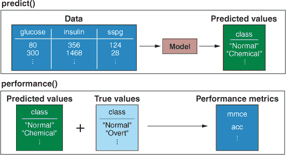

我们通过将它们作为列表提供给`measures`参数来指定我们希望函数返回的性能指标。我请求的两个指标是`mmce`，即*平均误分类误差*；和`acc`，或*准确率*。MMCE 简单地说就是被错误分类为非真实类别的案例比例。准确率是它的对立面：模型正确分类的案例比例。你可以看到这两个指标的总和为 1.00：

```
performance(knnPred, measures = list(mmce, acc))

      mmce        acc
0.04827586 0.95172414
```

因此，我们的模型正确分类了 95.2%的案例！这是否意味着它在处理新、未见过的患者时表现良好？事实是，*我们不知道*。通过要求模型在最初用于训练它的数据上做出预测来评估模型性能，告诉你关于模型在完全未见过的数据上做出预测时表现如何的信息非常有限。因此，你*永远*不应该以这种方式评估模型性能。在我们讨论原因之前，我想介绍一个重要的概念，称为偏差-方差权衡。

### 3.3. 平衡模型误差的两个来源：偏差-方差权衡

机器学习中有一个概念非常重要，但很多人对此理解有误，我想花时间好好解释一下：*偏差-方差权衡*。让我们从一个例子开始。一位同事给你发送了公司收到的电子邮件数据，并请你构建一个模型来分类 incoming emails 为垃圾邮件或非垃圾邮件（这当然是一个分类问题）。数据集包含 30 个变量，包括电子邮件中的字符数、URL 的存在以及发送到的电子邮件地址数量，以及电子邮件是否为垃圾邮件。

你懒洋洋地构建了一个仅使用四个预测变量的分类模型（因为快到午餐时间了，今天有咖喱鸡块供应）。你将模型发送给你的同事，他将其作为公司的垃圾邮件过滤器实施。

一周后，你的同事回来抱怨垃圾邮件过滤器表现不佳，并且持续错误地分类某些类型的电子邮件。你将用于训练模型的原始数据重新输入到模型中，发现它只正确分类了 60%的电子邮件。你决定你可能对数据进行了*欠拟合*：换句话说，你的模型过于简单，并且倾向于错误分类某些类型的电子邮件。

你回到数据，这次你在模型中将所有 30 个变量作为预测变量。你将数据再次通过模型，发现它正确分类了 98%的电子邮件：一个改进，当然！你将这个第二个模型发送给你的同事，并告诉他们你确信它更好。又过去了一周，你的同事再次来找你抱怨模型表现不佳：它错误地分类了许多电子邮件，并且以一种不可预测的方式。你决定你已经对数据进行了*过拟合*：换句话说，你的模型过于复杂，正在模拟你用于训练它的数据中的噪声。现在，当你给模型提供新的数据集时，它给出的预测有很大的*方差*。一个过拟合的模型在训练数据上表现良好，但在新的数据上表现较差。

在模型构建中，欠拟合和过拟合是两种重要的错误来源。在欠拟合中，我们包含的预测变量太少或模型过于简单，无法充分描述数据中的关系/模式。结果是，模型被认为是*有偏差的*：一个在训练数据和新的数据上表现都差的模型。

| |
| --- |

##### 备注

由于我们通常喜欢解释掉数据中的尽可能多的变化，并且因为我们通常有比问题重要的变量多得多，所以欠拟合不如过拟合常见。

| |
| --- |

过拟合是欠拟合的对立面，描述了包含过多预测因子或过于复杂的模型的情况，以至于我们不仅模拟了数据中的关系/模式，还模拟了*噪声*。数据集中的噪声是与我们所测量的变量没有系统关系的变异，而是由于我们变量的固有变异和/或测量误差。噪声的模式对单个数据集非常具体，因此如果我们开始模拟噪声，我们的模型可能在训练数据上表现非常好，但对于未来的数据集给出相当可变的结果。

欠拟合和过拟合都引入了误差并降低了模型的*泛化能力*：模型泛化到未来、未见数据的能力。它们也是对立的：在欠拟合且有偏差的模型和过拟合且有方差的模型之间，有一个平衡偏差-方差权衡的最优模型；参见图 3.10。

##### 图 3.10. 偏差-方差权衡。泛化误差是模型做出错误预测的比例，是过拟合和欠拟合的结果。与过拟合（模型过于复杂）相关的误差是方差。与欠拟合（模型过于简单）相关的误差是偏差。与过拟合（模型过于复杂）相关的误差是方差。一个最优模型平衡了这种权衡。

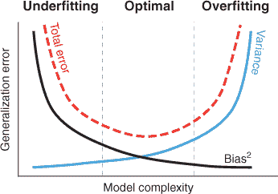

现在，看看图 3.11。你能看到欠拟合模型在表示数据中的模式方面表现不佳，而过拟合模型过于细致，并且模型了数据中的噪声而不是真实模式吗？

##### 图 3.11. 对于一个二分类问题的欠拟合、最优拟合和过拟合的示例。虚线代表决策边界。

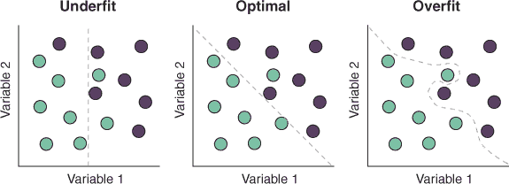

在我们的 kNN 算法的情况下，选择一个小的*k*值（其中只包含少量非常相似的案例进行投票）更有可能模拟我们数据中的噪声，导致一个更复杂的模型，当使用它来分类未来的患者时会产生很多方差。相比之下，选择一个大的*k*值（其中包含更多的邻居进行投票）更有可能错过我们数据中的局部差异，导致一个不太复杂的模型，是欠拟合的，并且倾向于错误分类某些类型的患者。我保证你很快就会学到如何选择*k*！

所以你现在可能想知道的问题可能是，“我如何判断我是欠拟合还是过拟合？”答案是称为*交叉验证*的技术。

### 3.4. 使用交叉验证来判断我们是否过拟合或欠拟合

在电子邮件示例中，一旦你训练了第二个过度拟合的模型，你试图通过查看它对你用于训练的数据的分类效果来评估其性能。我提到这是一个极其糟糕的想法，原因如下：模型几乎总是会在你训练它的数据上比在新未见过的数据上表现更好。你可以构建一个极度过度拟合的模型，模拟数据集中的所有噪声，而你永远不会知道，因为将数据再次通过模型会给你良好的预测准确性。

答案是评估你的模型在尚未见过的数据上的性能。你可以采取的一种方法是在所有可用的数据上训练模型，然后，在接下来的几周和几个月里，随着你收集新的数据，将其通过模型并评估模型的性能。这种方法非常缓慢且效率低下，可能会使模型构建耗时数年！

相反，我们通常将数据分成两部分。我们使用一部分来训练模型：这部分被称为*训练集*。我们使用剩下的部分，算法在训练过程中从未见过，来测试模型：这部分是*测试集*。然后，我们评估模型在测试集上的预测与真实值之间的接近程度。我们用*性能指标*来总结这些预测的接近程度，我们将在 3.1 节中探讨这些指标。测量训练模型在测试集上的表现有助于我们确定我们的模型是否会在未见过的数据上表现良好，或者我们是否需要进一步改进它。

这个过程被称为*交叉验证*（CV），在任何监督机器学习流程中都是一个极其重要的方法。一旦我们交叉验证了模型并且对其性能感到满意，我们就使用我们拥有的所有数据（包括测试集中的数据）来训练最终的模型（因为通常，我们训练模型的数据越多，其偏差就越小）。

常见的交叉验证方法有三种：

+   保留法交叉验证

+   K 折交叉验证

+   留一法交叉验证

### 3.5\. 对我们的 kNN 模型进行交叉验证

让我们先回顾一下我们之前创建的任务和学习器：

```
diabetesTask <- makeClassifTask(data = diabetesTib, target = "class")

knn <- makeLearner("classif.knn", par.vals = list("k" = 2))
```

太好了！在我们用所有数据训练最终模型之前，让我们先交叉验证学习器。通常，你会决定最适合你数据的 CV 策略；但为了演示目的，我将向你展示保留法、k 折和*留一法*交叉验证。

#### 3.5.1\. 保留法交叉验证

保留法交叉验证是理解起来最简单的方法：你只需随机保留你数据的一部分作为测试集，并在剩余的数据上训练你的模型。然后，你将测试集通过模型并计算其性能指标（我们很快会讨论这些）。你可以在图 3.12 中看到保留法交叉验证的方案。

##### 图 3.12\. 保留集交叉验证。数据被随机分为训练集和测试集。训练集用于训练模型，然后使用该模型在测试集上进行预测。预测值与测试集真实值的相似性用于评估模型性能。

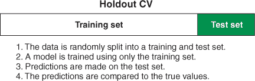

在遵循此方法时，您需要决定使用多少比例的数据作为测试集。测试集越大，训练集就越小。这里令人困惑的部分是：通过交叉验证进行性能估计也受误差和偏差-方差权衡的影响。如果您的测试集太小，那么性能估计将具有高方差；但如果训练集太小，那么性能估计将具有高偏差。常用的分割方法是使用三分之二的数据进行训练，剩余的三分之一作为测试集，但这取决于数据中的案例数量等因素。

##### 创建保留集重采样描述

在 mlr 中应用任何 CV 的第一步是创建一个重采样描述，这仅仅是一组关于如何将数据分割为测试集和训练集的指令。`makeResampleDesc()`函数的第一个参数是我们将要使用的 CV 方法：在这种情况下，`"Holdout"`。对于保留集交叉验证，我们需要告诉函数将使用多少比例的数据作为训练集，因此我们将其提供给`split`参数：

```
holdout <- makeResampleDesc(method = "Holdout", split = 2/3,
                            stratify = TRUE)
```

我包括了一个额外的、可选的参数，`stratify = TRUE`。它要求函数在将数据分割为训练集和测试集时，尝试保持每个集合中每个患者类别的比例。这在我们的分类问题中很重要，因为组别非常不平衡（我们拥有的健康患者比其他两组的总和还多），否则我们可能会得到一个包含我们较小类别中非常少数量的测试集。

##### 进行保留集交叉验证

现在我们已经定义了如何交叉验证我们的学习器，我们可以使用`resample()`函数运行 CV。我们将我们创建的学习者和任务以及我们刚才定义的重采样方法提供给`resample()`函数。我们还要求它给我们提供 MMCE 和准确度的度量：

```
holdoutCV <- resample(learner = knn, task = diabetesTask,
                      resampling = holdout, measures = list(mmce, acc))
```

当您运行`resample()`函数时，它会打印性能指标，但您可以通过从`resampling`对象中提取`$aggr`组件来访问它们：

```
holdoutCV$aggr

mmce.test.mean  acc.test.mean
     0.1020408      0.8979592
```

您会注意到两点：

+   通过保留集交叉验证估计的模型准确度低于我们在使用训练完整模型的数据上评估其性能时的准确度。这证明了我之前提到的观点，即模型在训练它们的数据上表现会比在未见过的数据上更好。

+   你的性能指标可能和我的不同。实际上，反复运行 `resample()` 函数，你每次都会得到一个非常不同的结果！这种 *方差* 的原因是数据被随机分割成测试集和训练集。有时分割使得模型在测试集上表现良好；有时分割使得模型表现不佳。

| |
| --- |

**练习 2**

使用 `makeResampleDesc()` 函数创建另一个保留样本重采样描述，该描述使用 10%的数据作为测试集，并且不使用分层抽样（不要覆盖你现有的重采样描述）。

| |
| --- |

##### 计算混淆矩阵

为了更好地了解哪些组被正确分类，哪些组被错误分类，我们可以构建一个混淆矩阵。一个 *混淆矩阵* 简单地是测试集中每个案例的真实和预测类别的表格表示。

使用 mlr，我们可以通过 `calculateConfusionMatrix()` 函数计算混淆矩阵。第一个参数是我们 `holdoutCV` 对象的 `$pred` 组件，它包含测试集的真实和预测类别。可选参数 `relative` 请求函数显示真实和预测类别标签中每个类别的比例：

```
calculateConfusionMatrix(holdoutCV$pred, relative = TRUE)

Relative confusion matrix (normalized by row/column):
          predicted
true       Chemical  Normal    Overt     -err.-
  Chemical 0.92/0.73 0.08/0.04 0.00/0.00 0.08
  Normal   0.12/0.20 0.88/0.96 0.00/0.00 0.12
  Overt    0.09/0.07 0.00/0.00 0.91/1.00 0.09
  -err.-        0.27      0.04      0.00 0.10

Absolute confusion matrix:
          predicted
true       Chemical Normal Overt -err.-
  Chemical       11      1     0      1
  Normal          3     23     0      3
  Overt           1      0    10      1
  -err.-          4      1     0      5
```

绝对混淆矩阵更容易解释。行显示真实的类别标签，列显示预测的标签。数字代表真实类别和预测类别组合中每种情况的数量。例如，在这个矩阵中，11 名患者被正确分类为化学性糖尿病患者，但其中一名被错误地分类为健康人。正确分类的患者位于矩阵的对角线上（即真实类别等于预测类别）。

相对混淆矩阵看起来有点吓人，但原理是相同的。这次，我们不是每个真实类别和预测类别组合的案例数量，而是比例。`/` 前面的数字是这一列中该行的比例，`/` 后面的数字是该行中这一列的比例。例如，在这个矩阵中，92%的化学性糖尿病患者被正确分类，而 8%被错误地分类为健康人。（你注意到这些比例和我在绝对混淆矩阵中使用的数字是一样的吗？）

混淆矩阵帮助我们了解模型在哪些类别上分类得很好，在哪些类别上分类得较差。例如，根据这个混淆矩阵，看起来我们的模型在区分健康患者和化学性糖尿病患者方面有困难。

| |
| --- |

##### 注意

你的混淆矩阵看起来和我的不一样吗？当然不一样了！混淆矩阵是基于对测试集的预测结果；由于测试集是在保留样本交叉验证中随机选择的，因此每次重新运行交叉验证时，混淆矩阵都会发生变化。

| |
| --- |

由于保留法交叉验证报告的性能指标严重依赖于我们用作训练集和测试集的数据量，因此我尽量避免使用它，除非我的模型训练成本非常高，所以我通常更喜欢 k-fold 交叉验证。这种方法唯一的真正好处是，它比其他形式的交叉验证计算成本更低。这可以使它成为计算成本高昂的算法的唯一可行交叉验证方法。但交叉验证的目的是尽可能准确地估计模型性能，而保留法交叉验证可能会在每次应用时给出非常不同的结果，因为并非所有数据都用于训练集和测试集。这就是其他形式的交叉验证发挥作用的地方。

#### 3.5.2. K-fold 交叉验证

在 k-fold 交叉验证中，我们将数据随机分成大约等大小的块，称为*折叠*。然后我们保留其中一个折叠作为测试集，并使用剩余的数据作为训练集（就像保留法一样）。我们将测试集通过模型，并记录相关的性能指标。现在，我们使用数据的不同折叠作为我们的测试集，并做同样的事情。我们继续这样做，直到所有折叠都至少被用作一次测试集。然后我们得到性能指标的平均值，作为模型性能的估计。您可以在图 3.13 中看到 k-fold 交叉验证的方案。

##### 图 3.13. K-fold 交叉验证。数据被随机分成几乎等大小的块。每个块被用作测试集一次，其余数据用作训练集。使用测试集的真实值来评估模型性能的相似性。

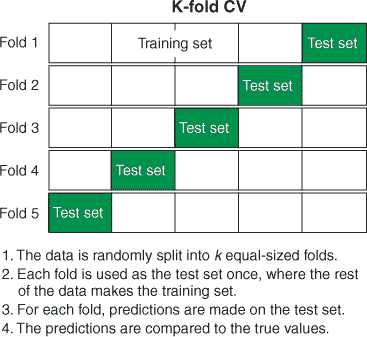

| |
| --- |

##### 备注

重要的是要注意，在这个程序中，数据中的每个案例在测试集中只出现一次。

| |
| --- |

这种方法通常会给出模型性能的更准确估计，因为每个案例在测试集中只出现一次，并且我们在多次运行中平均估计。但我们可以通过使用*重复*的 k-fold 交叉验证来稍微改进这一点，在这种方法中，在之前的程序之后，我们重新排列数据并再次执行。

例如，对于 k-fold 交叉验证，通常选择的 k 值是 10。同样，这取决于数据的大小等因素，但对于许多数据集来说，这是一个合理的值。这意味着我们将数据分成 10 个几乎等大小的块，并执行交叉验证。如果我们重复这个程序 5 次，那么我们就有 10 次交叉验证重复了 5 次（这不同于 50 次交叉验证），模型性能的估计将是 50 次不同运行的平均值。

因此，如果您有计算能力，通常更倾向于使用重复的 k-fold 交叉验证而不是普通的 k-fold 交叉验证。这正是本书许多示例中将使用的方法。

##### 执行 k-fold 交叉验证

我们以与保留法相同的方式进行 k 折交叉验证。这次，当我们创建重采样描述时，我们告诉它我们将使用重复的 k 折交叉验证（`"RepCV"`），并告诉它我们想要将数据分成多少折。默认折数是 10，这通常是一个不错的选择，但我想向你展示如何显式地控制分割。接下来，我们告诉函数我们想要使用 `reps` 参数重复 10 折交叉验证 50 次。这给我们提供了 500 个性能指标来平均！再次，我们要求在折之间分层分配类别：

```
kFold <- makeResampleDesc(method = "RepCV", folds = 10, reps = 50,
                          stratify = TRUE)

kFoldCV <- resample(learner = knn, task = diabetesTask,
                    resampling = kFold, measures = list(mmce, acc))
```

现在，让我们提取平均性能指标：

```
kFoldCV$aggr

mmce.test.mean  acc.test.mean
     0.1022788      0.8977212
```

该模型平均正确分类了 89.8%的案例——这比我们预测用于训练模型的那些数据时低得多！多次重新运行 `resample()` 函数，并比较每次运行后的平均准确率。估计值比我们重复保留法交叉验证时的估计值更稳定。

| |
| --- |

##### 提示

我们通常只对平均性能指标感兴趣，但你可以通过运行 `kFoldCV$measures.test` 来访问每次迭代的性能指标。

| |
| --- |

##### 选择重复次数

当交叉验证模型时，你的目标是尽可能准确地估计模型性能。一般来说，你能够进行的重复越多，这些估计的准确性和稳定性就越高。然而，在某个点上，增加重复次数不会提高性能估计的准确性和稳定性。

那么，你如何决定执行多少次重复？一个合理的方法是选择一个计算上合理的重复次数，运行几次过程，看看平均性能估计是否变化很大。如果没有，那就很好。如果变化很大，你应该增加重复次数。

| |
| --- |

**练习 3**

定义两个新的重采样描述：一个执行 5 次重复的 3 折交叉验证，另一个执行 500 次重复的 3 折交叉验证（不要覆盖你现有的描述）。使用 `resample()` 函数使用这两种重采样描述对 kNN 算法进行交叉验证。每种方法重复重采样 5 次，看看哪一个给出更稳定的结果。

| |
| --- |

##### 计算混淆矩阵

现在，让我们基于重复的 k 折交叉验证构建混淆矩阵：

```
calculateConfusionMatrix(kFoldCV$pred, relative = TRUE)

Relative confusion matrix (normalized by row/column):
          predicted
true       Chemical  Normal    Overt     -err.-
  Chemical 0.81/0.78 0.10/0.05 0.09/0.10 0.19
  Normal   0.04/0.07 0.96/0.95 0.00/0.00 0.04
  Overt    0.16/0.14 0.00/0.00 0.84/0.90 0.16
  -err.-        0.22      0.05      0.10 0.10

Absolute confusion matrix:
          predicted
true       Chemical Normal Overt -err.-
  Chemical     1463    179   158    337
  Normal        136   3664     0    136
  Overt         269      0  1381    269
  -err.-        405    179   158    742
```

| |
| --- |

##### 注意

注意案例数量大得多。这是因为我们重复了 50 次该过程。

| |
| --- |

#### 3.5.3\. 留一法交叉验证

留一法交叉验证可以被视为 k 折交叉验证的极端形式：我们不是将数据分成折，而是保留一个观测值作为测试案例，在其余所有数据上训练模型，然后通过它传递测试案例并记录相关的性能指标。接下来，我们做同样的事情，但选择不同的观测值作为测试案例。我们继续这样做，直到每个观测值都作为测试案例使用过一次，我们取性能指标的平均值。你可以在图 3.14 中看到留一法交叉验证的方案。

由于测试集只有一个观测值，留一法交叉验证往往会对模型性能给出相当可变估计（因为每个迭代的性能估计都取决于正确标记那个单个测试案例）。但是，当你的数据集较小时，它给出的模型性能估计比 k 折交叉验证更稳定。当你有一个小数据集时，将其分成*k*折会让你剩下一个非常小的训练集。在小数据集上训练的模型的方差往往较高，因为它会受到抽样误差/异常情况的影响更大。因此，留一法交叉验证对于将数据集分成*k*折会给出可变结果的小数据集是有用的。它也比重复的 k 折交叉验证计算成本更低。

##### 图 3.14。留一法交叉验证是 k 折交叉验证的极端形式，我们保留一个案例作为测试集，在剩余数据上训练模型。使用测试集的真实值与预测值的相似性来评估模型性能。

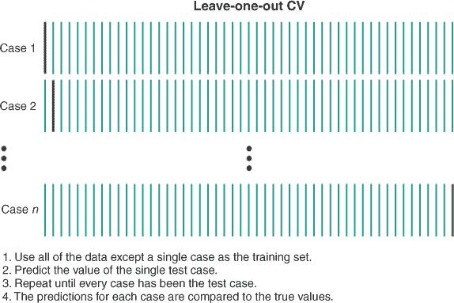


##### 注意

一个未经交叉验证的监督学习模型几乎毫无用处，因为你不知道它在新的数据上做出的预测是否准确。


##### 执行留一法交叉验证

创建留一法重采样的描述与留出法和 k 折交叉验证一样简单。我们在创建重采样描述时指定留一法交叉验证，通过将`LOO`作为方法的参数。因为测试集只有一个案例，所以我们显然不能使用留一法进行分层。另外，因为每个案例都作为测试集使用一次，其余所有数据作为训练集，所以没有必要重复该过程：

```
LOO <- makeResampleDesc(method = "LOO")
```


**练习 4**

尝试创建两个新的留一法重采样描述：一个使用分层抽样，另一个重复该过程五次。会发生什么？


现在，让我们运行交叉验证并获取平均性能指标：

```
LOOCV <- resample(learner = knn, task = diabetesTask, resampling = LOO,
                  measures = list(mmce, acc))

LOOCV$aggr

mmce.test.mean  acc.test.mean
     0.1172414      0.8827586
```

如果你反复运行交叉验证，你会发现对于这个模型和数据，性能估计的变异性比 k 折交叉验证更大，但比我们之前运行的留出法更小。

##### 计算混淆矩阵

再次，让我们看看混淆矩阵：

```
calculateConfusionMatrix(LOOCV$pred, relative = TRUE)

Relative confusion matrix (normalized by row/column):
          predicted
true       Chemical  Normal    Overt     -err.-
  Chemical 0.81/0.74 0.14/0.06 0.06/0.07 0.19
  Normal   0.05/0.10 0.95/0.94 0.00/0.00 0.05
  Overt    0.18/0.15 0.00/0.00 0.82/0.93 0.18
  -err.-        0.26      0.06      0.07 0.12

Absolute confusion matrix:
          predicted
true       Chemical Normal Overt -err.-
  Chemical       29      5     2      7
  Normal          4     72     0      4
  Overt           6      0    27      6
  -err.-         10      5     2     17
```

因此，你现在知道了如何应用三种常用的交叉验证类型！如果我们已经交叉验证了我们的模型，并且满意它在未见过的数据上表现良好，那么我们就会在所有可用的数据上训练模型，并使用它来做出未来的预测。

但是我认为我们仍然可以改进我们的 kNN 模型。记得之前我们手动选择 *k* 的值为 2 吗？好吧，随机选择一个 *k* 的值并不聪明，而且我们有更好的方法来找到最佳值。

### 3.6. 算法可以学习的内容以及它们必须被告知的内容：参数和超参数

机器学习模型通常与它们相关的 *参数* 有关。参数是从数据中估计的变量或值，它是模型内部的，并控制模型如何对新数据进行预测。模型参数的一个例子是回归线的斜率。

在 kNN 算法中，*k* 不是一个参数，因为算法不会从数据中估计它（实际上，kNN 算法实际上并没有学习任何参数）。相反，*k* 是所谓的 *超参数*：一个控制模型如何进行预测的变量或选项，但它 *不是* 从数据中估计的。作为数据科学家，我们不需要向我们的模型提供参数；我们只需提供数据，算法会自己学习参数。然而，我们确实需要提供它们所需的任何超参数。你会在本书中看到，不同的算法需要并使用不同的超参数来控制它们如何学习模型。

因此，由于 *k* 是 kNN 算法的超参数，它不能由算法本身估计，而需要我们选择一个值。我们如何决定呢？好吧，有三种方法你可以选择 *k*，或者实际上任何超参数：

+   ***选择一个“合理”或默认值，这个值在之前类似的问题上已经有效。*** 这个选项是个坏主意。你无法知道你选择的 *k* 值是否是最佳的。仅仅因为某个值在其他数据集上有效，并不意味着它会在当前数据集上表现良好。这是懒惰的数据科学家选择，他们不太关心从数据中获得最大价值。

+   ***手动尝试几个不同的值，看看哪个给你最好的性能。*** 这个选项稍微好一些。这里的想法是，你选择几个合理的 *k* 值，为每个值构建一个模型，并查看哪个模型表现最好。这更好，因为你更有可能找到最佳性能的 *k* 值；但你仍然不能保证找到它，而且手动做这件事可能会很繁琐且缓慢。这是关心但不太清楚自己在做什么的数据科学家的选择。

+   ***使用一种称为超参数调优的流程来自动化选择过程。*** 这种解决方案是最好的。它最大化了你找到最佳性能的 *k* 值的可能性，同时为你自动化了这一过程。这是我们将在整本书中使用的这种方法。


##### 注意

虽然在可能的情况下，第三个选项通常是最好的，但有些算法计算成本非常高，以至于它们禁止进行广泛的超参数调整，在这种情况下，你可能不得不手动尝试不同的值。


但改变 *k* 的值会如何影响模型性能呢？嗯，*k* 的值太低可能会导致开始模拟数据中的噪声。例如，如果我们设置 *k* = 1，那么一个健康的病人可能会被错误地分类为化学性糖尿病患者，仅仅是因为他们最近的邻居是一个胰岛素水平异常低的化学性糖尿病患者。在这种情况下，我们不仅模拟了类之间的系统性差异，还在模拟数据中的噪声和不可预测的变异性。

另一方面，如果我们设置 *k* 太高，大量的不同病人将被包括在投票中，模型将不会对数据的局部差异敏感。这当然是我们在前面讨论过的偏差-方差权衡。

### 3.7\. 调整 *k* 以改进模型

让我们应用超参数调优来优化模型中 *k* 的值。我们可以采取的一种方法是用不同的 *k* 值构建模型，使用我们的完整数据集，然后将数据再次通过模型，看看哪个 *k* 值能给出最佳性能。这是不好的做法，因为我们有很大可能会得到一个过度拟合我们所调优的数据集的 *k* 值。所以，我们又依靠交叉验证（CV）来帮助我们防止过拟合。

我们需要做的第一件事是定义一个范围，mlr 将在调整 *k* 时尝试这个范围：

```
knnParamSpace <- makeParamSet(makeDiscreteParam("k", values = 1:10))
```

`makeDiscreteParam()` 函数位于 `makeParamSet()` 函数内部，允许我们指定我们将要调整的超参数是 *k*，并且我们想要在 1 和 10 之间搜索最佳的 *k* 值。正如其名称所暗示的，`makeDiscreteParam()` 用于定义离散的超参数值，例如 kNN 中的 *k*，但书中还会探索定义连续和逻辑超参数的函数。`makeParamSet()` 函数定义了我们定义的超参数空间作为参数集，如果我们想在调整过程中调整多个超参数，我们只需在这个函数内部用逗号简单地分隔它们。

接下来，我们定义 mlr 如何搜索参数空间。这里有几种选择，在后面的章节中我们将探讨其他方法，但现在是使用*网格搜索*方法。这可能是最简单的方法：在寻找最佳性能值时，它会尝试参数空间中的每一个值。对于调整连续超参数，或者当我们同时调整多个超参数时，网格搜索变得过于昂贵，因此更倾向于使用像*随机搜索*这样的其他方法：

```
gridSearch <- makeTuneControlGrid()
```

接下来，我们定义我们将如何交叉验证调整过程，我将使用我最喜欢的：重复 k 折交叉验证。这里的原理是，对于参数空间中的每一个值（整数 1 到 10），我们执行重复 k 折交叉验证。对于*k*的每一个值，我们取所有这些迭代中的平均性能度量，并将其与所有其他*k*值的平均性能度量进行比较。这可能会给我们提供性能最佳的*k*值：

```
cvForTuning <- makeResampleDesc("RepCV", folds = 10, reps = 20)
```

现在，我们调用`tuneParams()`函数来执行调整：

```
tunedK <- tuneParams("classif.knn", task = diabetesTask,
                     resampling = cvForTuning,
                     par.set = knnParamSpace, control = gridSearch)
```

第一个和第二个参数分别是我们要应用的算法和任务的名称。我们将我们的 CV 策略作为`resampling`参数，我们将定义的超参数空间作为`par.set`参数，将搜索过程作为`control`参数。

如果我们调用我们的`tunedK`对象，我们得到性能最佳的*k*值，7，以及该值的平均 MMCE 值。我们可以直接通过选择`$x`组件来访问性能最佳的*k*值：

```
tunedK

Tune result:
Op. pars: k=7
mmce.test.mean=0.0769524

tunedK$x
$k
[1] 7
```

我们还可以可视化调整过程（此代码的结果显示在图 3.15 中）：

```
knnTuningData <- generateHyperParsEffectData(tunedK)

plotHyperParsEffect(knnTuningData, x = "k", y = "mmce.test.mean",
                    plot.type = "line") +
  theme_bw()
```

现在，我们可以使用调整后的*k*值来训练我们的最终模型：

```
tunedKnn <- setHyperPars(makeLearner("classif.knn"),
                         par.vals = tunedK$x)

tunedKnnModel <- train(tunedKnn, diabetesTask)
```

##### 图 3.15\. 在网格搜索过程中，使用不同值的*k*拟合 kNN 模型时的 MMCE 值

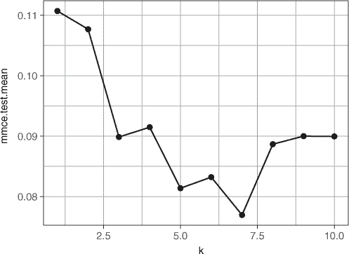

这就像将`makeLearner()`函数（我们创建一个新的 kNN 学习器）包裹在`setHyperPars()`函数中一样简单，并提供调整后的*k*值作为`par.vals`参数。然后我们使用`train()`函数像以前一样训练我们的最终模型。

#### 3.7.1\. 将超参数调整纳入交叉验证

现在，当我们对我们的数据或模型进行某种预处理时，例如调整超参数，将这个预处理包括在我们的 CV 中是很重要的，这样我们就可以交叉验证整个模型训练过程。这采取的形式是嵌套 CV，其中内部循环交叉验证我们的超参数的不同值（就像我们之前做的那样），然后获胜的超参数值被传递到外部 CV 循环。在外部 CV 循环中，获胜的超参数用于每个折。

嵌套 CV 的过程如下：

1.  将数据分为训练集和测试集（这可以通过保留、k 折或留一法来完成）。这种划分称为*外部循环*。

1.  使用训练集交叉验证我们超参数搜索空间中的每个值（使用我们决定的方法）。这被称为“内层循环”。

1.  来自每个内层循环的最佳交叉验证性能超参数被传递到外层循环。

1.  在外层循环的每个训练集上训练一个模型，使用其内层循环中的最佳超参数。这些模型用于对其测试集进行预测。

1.  这些模型在外层循环中的平均性能指标被报告为对模型在未见数据上表现的估计。

如果你更喜欢图形化的解释，请查看图 3.16。

##### 图 3.16。嵌套交叉验证。数据集被分成几个折。对于每个折，训练集被用来创建内层 k 折交叉验证的集合。这些内层集合通过将数据分成训练集和测试集来交叉验证单个超参数值。对于这些内层集合中的每个折，使用训练集训练一个模型，并使用该集合的超参数值在该测试集上进行评估。来自每个内层交叉验证循环的最佳性能超参数被用来在外层循环中训练模型。


在图 3.16 的例子中，外层循环是 3 折交叉验证。对于每个折，应用 4 折交叉验证的内层集合，仅使用外层循环的训练集。这个 4 折交叉验证用于评估我们正在搜索的每个超参数值的性能。*k*（给出最佳性能的值）的获胜值随后传递到外层循环，然后用于训练模型，并在测试集上评估其性能。你能看到我们正在交叉验证整个模型构建过程，包括超参数调整吗？

这有什么目的呢？它验证了我们的整个模型构建过程，包括超参数调整步骤。从这个过程中我们得到的交叉验证性能估计应该很好地代表我们期望模型在完全新的、未见数据上的表现。

这个过程看起来相当复杂，但使用 mlr 执行起来却非常简单。首先，我们定义我们将如何执行内层和外层交叉验证：

```
inner <- makeResampleDesc("CV")

outer <- makeResampleDesc("RepCV", folds = 10, reps = 5)
```

我选择在外层循环中执行普通 k 折交叉验证（默认折数为 10）和 10 折 CV，重复 5 次。

接下来，我们创建一个所谓的“包装器”，这基本上是一个与某些预处理步骤相关联的学习器。在我们的例子中，这是超参数调整，因此我们使用`makeTuneWrapper()`创建一个调整包装器：

```
knnWrapper <- makeTuneWrapper("classif.knn", resampling = inner,
                              par.set = knnParamSpace,
                              control = gridSearch)
```

在这里，我们将算法作为第一个参数传递，并将我们的内部 CV 过程作为`resampling`参数。我们将超参数搜索空间作为`par.set`参数，并将我们的`gridSearch`方法作为`control`参数（记住我们之前创建了这两个对象）。这“包装”了学习算法和将在内部 CV 循环中应用的超参数调整过程。

现在我们已经定义了我们的内部和外部 CV 策略以及我们的调整包装器，我们运行嵌套 CV 过程：

```
cvWithTuning <- resample(knnWrapper, diabetesTask, resampling = outer)
```

第一个参数是我们刚才创建的包装器，第二个参数是任务的名称，我们提供我们的外部 CV 策略作为重采样参数。现在请放松并休息——这可能需要一段时间！

一旦完成，你可以打印平均 MMCE：

```
cvWithTuning

Resample Result
Task: diabetesTib
Learner: classif.knn.tuned
Aggr perf: mmce.test.mean=0.0856190
Runtime: 42.9978
```

由于验证过程的随机性，你的 MMCE 值可能与我有所不同，但模型估计在未见过的数据上正确分类了 91.4%的案例。这还不错；现在我们已经正确地交叉验证了我们的模型，我们可以自信地认为我们没有过度拟合数据。

#### 3.7.2\. 使用我们的模型进行预测

我们有了我们的模型，我们可以自由地使用它来对新患者进行分类！让我们想象一些新患者来到诊所：

```
newDiabetesPatients <- tibble(glucose = c(82, 108, 300),
                              insulin = c(361, 288, 1052),
                              sspg = c(200, 186, 135))

newDiabetesPatients

# A tibble: 3 x 3
  glucose insulin  sspg
    <dbl>   <dbl> <dbl>
1      82     361   200
2     108     288   186
3     300    1052   135
```

我们可以将这些患者输入我们的模型，并获取他们的预测糖尿病状态：

```
newPatientsPred <- predict(tunedKnnModel, newdata = newDiabetesPatients)

getPredictionResponse(newPatientsPred)

[1] Normal Normal Overt
Levels: Chemical Normal Overt
```

恭喜！你不仅构建了你的第一个机器学习模型，我们还覆盖了一些相当复杂的理论。在下一章中，我们将学习逻辑回归，但首先我想列出 k-最近邻算法的优缺点。

### 3.8\. kNN 的优缺点

虽然通常很难判断哪些算法会对给定的任务表现良好，但以下是一些优势和弱点，这将帮助你决定 kNN 是否适合你的任务。

kNN 算法的优势如下：

+   算法非常简单易懂。

+   在学习过程中没有计算成本；所有计算都是在预测过程中完成的。

+   它对数据没有任何假设，例如数据的分布情况。

kNN 算法的弱点如下：

+   它不能原生地处理分类变量（它们必须首先重新编码，或者必须使用不同的距离度量）。

+   当训练集很大时，计算新数据与训练集中所有案例之间的距离可能会很昂贵。

+   模型不能从数据中的现实世界关系来解释。

+   预测准确性可能会受到噪声数据和异常值的影响。

+   在高维数据集中，kNN 往往表现不佳。这是由于你将在第五章中了解到的一种现象，称为“维度诅咒”。简而言之，在高维中，案例之间的距离开始看起来相同，因此找到最近邻变得困难。

| |
| --- |

**练习 5**

使用`data()`函数加载鸢尾花数据集，并构建一个 kNN 模型来对它的三种鸢尾花种类进行分类（包括调整*k*超参数）。

|  |

**练习 6**

使用嵌套交叉验证来交叉验证这个鸢尾花 kNN 模型，其中外部交叉验证采用三分之二的比例进行保留。

|  |

**练习 7**

重复前一个练习中的嵌套 CV，但使用 5 折、非重复 CV 作为外部循环。当你重复这些方法时，哪种方法给你更稳定的 MMCE 估计？


### 摘要

+   kNN 是一种简单的监督学习算法，它根据训练集中最近的*k*个案例的类别成员资格对新数据进行分类。

+   要在 mlr 中创建机器学习模型，我们创建一个任务和一个学习器，然后使用它们来训练模型。

+   MMCE 是平均误分类误差，即在分类问题中误分类案例的比例。它与准确度相反。

+   偏差-方差权衡是预测准确度中两种类型错误的平衡。具有高偏差的模型欠拟合，而具有高方差模型的模型过拟合。

+   模型性能不应在用于训练的数据上评估；应使用交叉验证。

+   交叉验证是一组通过将数据分为训练集和测试集来评估模型性能的技术。

+   三种常见的交叉验证类型是保留法，其中使用单个分割；k 折法，其中数据被分割成*k*个块，并在每个块上执行验证；以及留一法，其中测试集是一个单独的案例。

+   超参数是控制机器学习算法如何学习的选项，这些选项不能由算法本身学习。超参数调整是找到最佳超参数的最佳方式。

+   如果我们执行一个数据依赖的前处理步骤，例如超参数调整，那么将其纳入我们的交叉验证策略中，使用嵌套交叉验证是很重要的。

### 练习的解答

1.  将`葡萄糖`和`胰岛素`变量相互绘制，使用形状表示`类别`变量，然后使用形状*和*颜色：

    ```
    ggplot(diabetesTib, aes(glucose, insulin,
                            shape = class)) +
      geom_point()  +
      theme_bw()

    ggplot(diabetesTib, aes(glucose, insulin,
                            shape = class, col = class)) +
      geom_point()  +
      theme_bw()
    ```

1.  创建一个使用 10%的案例作为测试集且不使用分层抽样的留一法重采样描述：

    ```
    holdoutNoStrat <- makeResampleDesc(method = "Holdout", split = 0.9,
                                stratify = FALSE)
    ```

1.  比较重复 5 次或 500 次的 3 折交叉验证的性能估计的稳定性：

    ```
    kFold500 <- makeResampleDesc(method = "RepCV", folds = 3, reps = 500,
                              stratify = TRUE)

    kFoldCV500 <- resample(learner = knn, task = diabetesTask,
                        resampling = kFold500, measures = list(mmce, acc))

    kFold5 <- makeResampleDesc(method = "RepCV", folds = 3, reps = 5,
                                 stratify = TRUE)

    kFoldCV5 <- resample(learner = knn, task = diabetesTask,
                           resampling = kFold5, measures = list(mmce, acc))

    kFoldCV500$aggr
    kFoldCV5$aggr
    ```

1.  尝试制作使用分层抽样和重复抽样的留一法重采样描述：

    ```
    makeResampleDesc(method = "LOO", stratify = TRUE)

    makeResampleDesc(method = "LOO", reps = 5)

    # Both will result in an error as LOO cross-validation cannot
    # be stratified or repeated.
    ```

1.  加载鸢尾花数据集，并构建一个 kNN 模型来对它的三种鸢尾花种类进行分类（包括调整*k*超参数）：

    ```
    data(iris)

    irisTask <- makeClassifTask(data = iris, target = "Species")

    knnParamSpace <- makeParamSet(makeDiscreteParam("k", values = 1:25))

    gridSearch <- makeTuneControlGrid()

    cvForTuning <- makeResampleDesc("RepCV", folds = 10, reps = 20)

    tunedK <- tuneParams("classif.knn", task = irisTask,
                         resampling = cvForTuning,
                         par.set = knnParamSpace,
                         control = gridSearch)

    tunedK

    tunedK$x

    knnTuningData <- generateHyperParsEffectData(tunedK)

    plotHyperParsEffect(knnTuningData, x = "k", y = "mmce.test.mean",
                        plot.type = "line") +
                        theme_bw()

    tunedKnn <- setHyperPars(makeLearner("classif.knn"), par.vals = tunedK$x)

    tunedKnnModel <- train(tunedKnn, irisTask)
    ```

1.  使用嵌套交叉验证交叉验证这个鸢尾花 kNN 模型，其中外部交叉验证采用三分之二的比例进行保留：

    ```
    inner <- makeResampleDesc("CV")

    outerHoldout <- makeResampleDesc("Holdout", split = 2/3, stratify = TRUE)

    knnWrapper <- makeTuneWrapper("classif.knn", resampling = inner,
                                  par.set = knnParamSpace,
                                  control = gridSearch)

    holdoutCVWithTuning <- resample(knnWrapper, irisTask,
                                    resampling = outerHoldout)

    holdoutCVWithTuning
    ```

1.  使用 5 折、非重复交叉验证作为外部循环重复嵌套交叉验证。当你重复这些方法时，哪种方法给你更稳定的 MMCE 估计？

    ```
    outerKfold <- makeResampleDesc("CV", iters = 5, stratify = TRUE)

    kFoldCVWithTuning <- resample(knnWrapper, irisTask,
                                  resampling = outerKfold)

    kFoldCVWithTuning

    resample(knnWrapper, irisTask, resampling = outerKfold)

    # Repeat each validation procedure 10 times and save the mmce value.
    # WARNING: this may take a few minutes to complete.

    kSamples <- map_dbl(1:10, ~resample(
      knnWrapper, irisTask, resampling = outerKfold)$aggr
      )

    hSamples <- map_dbl(1:10, ~resample(
      knnWrapper, irisTask, resampling = outerHoldout)$aggr
      )

    hist(kSamples, xlim = c(0, 0.11))
    hist(hSamples, xlim = c(0, 0.11))

    # Holdout CV gives more variable estimates of model performance.
    ```

## 第四章\. 基于概率的逻辑回归进行分类

*本章涵盖*

+   与逻辑回归算法一起工作

+   理解特征工程

+   理解缺失值插补

在本章中，我将向你工具箱中添加一个新的分类算法：**逻辑回归**。就像你在上一章中学到的 k-最近邻算法一样，逻辑回归是一种监督学习方法，它预测类成员资格。逻辑回归依赖于直线的方程，并产生易于解释和传达的模型。

逻辑回归可以处理连续（没有离散类别）和分类（有离散类别）的预测变量。在其最简单形式中，逻辑回归用于预测二元结果（案例可以属于两个类别之一），但算法的变体也可以处理多个类别。它的名字来源于算法使用**逻辑函数**，这是一个计算案例属于某一类别的概率的方程。

虽然逻辑回归确实是一种分类算法，但它使用**线性回归**和直线的方程来结合多个预测器的信息。在本章中，你将学习逻辑函数是如何工作的，以及直线的方程是如何用来构建模型的。

| |
| --- |

##### 注意

如果你已经熟悉线性回归，线性回归和逻辑回归之间的一个关键区别是，前者学习预测变量与一个**连续**的输出变量之间的关系，而后者学习预测变量与一个**分类**的输出变量之间的关系。

| |
| --- |

在本章结束时，你将应用在第二章和第三章中学到的技能来准备你的数据，并构建、解释和评估逻辑回归模型的表现。你还将了解什么是**缺失值插补**，这是一种在处理无法处理缺失值的算法时，用合理的值填充缺失数据的方法。你将应用缺失值插补的基本形式作为处理缺失数据的一种策略。

### 4.1\. 什么是逻辑回归？

想象一下，你是博物馆中 15 世纪艺术品的馆长。当据说由著名画家创作的艺术品来到博物馆时，你的任务是确定它们是真迹还是赝品（一个二分类问题）。你可以访问对每幅画进行的化学分析，并且你知道这个时期的许多赝品使用的颜料铜含量低于原作。你可以使用逻辑回归来学习一个模型，告诉你根据画中颜料的铜含量判断画作为真迹的概率。然后，该模型将把这幅画分配给概率最高的类别（见图 4.1）。

##### 图 4.1\. 逻辑回归学习模型，输出新数据属于每个类别的概率（*p*）。通常，新数据被分配给它最有可能属于的类别。虚线箭头表示在计算概率时还有额外的步骤，我们将在 4.1.1 节中讨论。

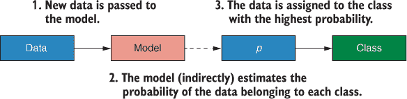

| |
| --- |

##### 注意

该算法通常应用于二分类问题（这被称为*二项式*逻辑回归），但一种称为*多项式*逻辑回归的变体可以处理有三个或更多类别的分类问题。

| |
| --- |

逻辑回归是一个非常流行的分类算法，在医学界尤其受欢迎，部分原因是因为模型的解释性。在我们的模型中，对于每个预测变量，我们都会得到一个估计值，说明该变量的值是如何影响案例属于某一类别而不是另一类别的概率的。

我们知道逻辑回归学习模型，这些模型估计新案例属于每个类别的概率。让我们深入了解算法是如何学习模型的。

#### 4.1.1\. 逻辑回归是如何学习的？

看一下图 4.2 中的（想象中的）数据。我绘制了我们已知是真实或伪造的样本画作中的铜含量，将其类别作为 0 到 1 之间的连续变量。我们可以看到，平均而言，伪造品在其油漆中的铜含量比原作少。我们可以用直线来模拟这种关系，如图所示。当你的预测变量与你要预测的连续变量有线性关系时，这种方法效果很好（我们将在第九章中介绍）；但正如你所见，它并不能很好地模拟连续变量与类别变量之间的关系。

##### 图 4.2\. 将铜含量与类别进行绘图。y 轴显示类别成员资格，仿佛它是一个连续变量，伪造品和原作分别取值为 0 和 1。实线代表尝试用线性关系来模拟铜含量与类别之间的关系。y = 0.5 处的虚线表示分类的阈值。

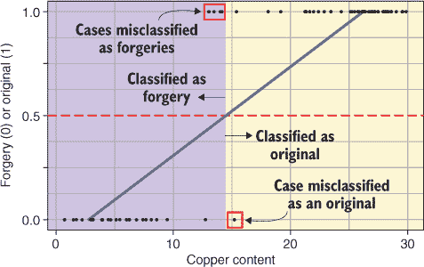

如图中所示，我们可以找到铜含量，使得直线穿过 0 和 1 之间的中点，并将铜含量低于此值的画作归类为伪造品，高于此值的画作归类为原作。这可能会导致许多误分类，因此需要更好的方法。

我们可以使用*逻辑*函数更好地建模铜含量与类别成员之间的关系，如图 4.3 所示。逻辑函数是一个 S 形曲线，将连续变量（在我们的例子中是铜含量）映射到 0 和 1 之间的值。这比用直线表示铜含量与画作是否为原作之间的关系要好得多。该图显示了与图 4.2 相同的逻辑函数拟合数据。我们可以找到逻辑函数在 0 和 1 之间通过一半值时的铜含量，并将铜含量低于此值的画作归类为伪造品，高于此值的画作归类为原作。这通常比我们使用直线分类时产生的误分类要少。

##### 图 4.3\. 使用逻辑函数建模数据。S 形曲线表示拟合数据的逻辑函数。曲线的中心通过铜含量的平均值，并将其映射到 0 和 1 之间。

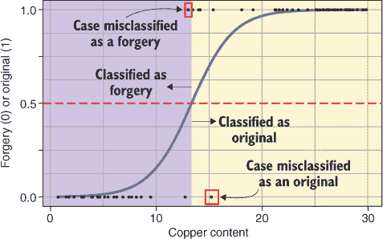

重要的是，由于逻辑函数将我们的*x*变量映射到 0 和 1 之间的值，我们可以将其输出解释为具有特定铜含量的案例是原作的概率。再看看图 4.3。你能看到随着铜含量的增加，逻辑函数趋近于 1 吗？这表示，平均而言，原作铜含量较高，因此如果你随机选择一幅画，发现其铜含量为 20，那么它有大约 0.99 或 99%的概率是原作。

| |
| --- |

##### 注意

如果我以另一种方式编码分组变量（伪造品为 1，原作为 0），那么逻辑函数在低铜含量时趋近于 1，在高铜含量时趋近于 0。我们只需将输出解释为伪造品的概率即可。

| |
| --- |

反之亦然：随着铜含量的减少，逻辑函数趋近于 0。这表示，平均而言，伪造品铜含量较低，因此如果你随机选择一幅画，发现其铜含量为 7，那么它有大约 0.99 或 99%的概率是伪造品。

太好了！我们可以通过使用逻辑函数来估计一幅画是原作的概率。但如果我们有多个预测变量呢？由于概率被限制在 0 和 1 之间，很难结合两个预测变量的信息。例如，假设逻辑函数估计一幅画对于某个预测变量有 0.6 的概率是原作，对于另一个预测变量有 0.7 的概率。我们不能简单地将这些估计相加，因为它们会超过 1，这没有意义。

相反，我们可以将这些概率转换为它们的*对数几率*（逻辑回归模型的“原始”输出）。为了介绍对数几率，让我首先解释一下我所说的*几率*，以及几率和概率之间的区别。

画作是原作的几率

##### 方程式 4.1。

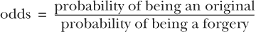

你可能会看到它写成

##### 方程式 4.2。

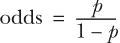

几率是表示某事发生可能性的便捷方式。它们告诉我们事件发生的可能性有多大，而不是不发生的可能性有多大。

在《帝国反击战》中，C3PO 说“成功穿越小行星带的几率大约是 3,720 比 1！”C3PO 试图告诉汉和莉娅的是，成功穿越小行星带的概率大约是不成功穿越它的概率的 3,720 倍小。仅仅陈述几率通常是一种更方便表示可能性的方式，因为我们知道，对于每成功穿越一个小行星带，就有 3,720 个没有成功穿越！此外，虽然概率介于 0 和 1 之间，但几率可以取任何正值。

| |
| --- |

##### 注意

尽管 C3PO 是一个高度智能的礼仪机器人，但他把几率搞错了（正如许多人所做的那样）。他*应该*说的是成功穿越小行星带的几率大约是 1 比 3,720！

| |
| --- |

图 4.4 显示了铜含量与画作是否为原作的几率之间的关系。请注意，几率不在 0 和 1 之间有界，并且它们取正值。

然而，正如我们所看到的，油漆中的铜含量与画作是否为原作的几率之间的关系不是线性的。相反，如果我们对几率取自然对数（以 e 为底的对数，简写为*ln*），我们得到的是*对数几率*：

##### 方程式 4.3。

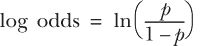

| |
| --- |

##### 小贴士

方程式 4.3，它将概率转换为对数几率，也被称为*logit*函数。你经常会看到*logit 回归*和*逻辑回归*被互换使用。

| |
| --- |

##### 图 4.4。将原作几率与铜含量绘制在一起。从逻辑函数中导出的概率被转换为几率，并绘制在铜含量上。几率可以取任何正值。直线代表尝试将铜含量与几率之间的线性关系模型化的一次糟糕尝试。

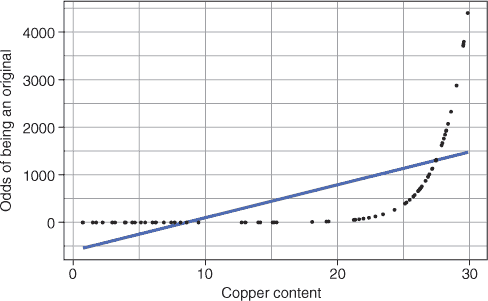

我已经对图 4.3 中显示的几率取了自然对数，以生成它们的对数几率，并将这些对数几率与铜含量绘制在图 4.5 中。太棒了！我们预测变量与画作是否为原作的对数几率之间存在线性关系。此外，请注意，对数几率是完全无界的：它们可以延伸到正负无穷大。在解释对数几率时

+   正值意味着某事发生的可能性大于不发生的可能性。

+   负值意味着某事发生的可能性小于不发生的可能性。

+   对数几率为 0 意味着某事发生的可能性与不发生的可能性相同。

##### 图 4.5。绘制成为原作的对数几率与铜含量的关系图。几率通过 logit 函数转换为对数几率，并绘制在铜含量上。对数几率是无界的，可以取任何值。直线代表铜含量与对数几率之间的线性关系。

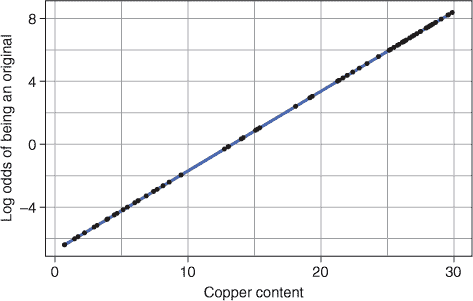

当讨论图 4.4 时，我强调了铜含量与成为原作画作几率之间的关系不是线性的。接着，我在图 4.5 中展示了铜含量与对数几率之间的关系是线性的。实际上，线性化这种关系是我们取几率自然对数的原因。为什么我对预测变量与其对数几率之间存在线性关系如此重视呢？因为建模直线是容易的。回想一下第一章，算法要学习建模直线关系只需要 y 截距和直线的斜率。因此，逻辑回归学习当铜含量为 0（y 截距）时画作成为原作的对数几率，以及随着铜含量增加对数几率如何变化（斜率）。

| |
| --- |

##### 备注

预测变量对对数几率的影响越大，斜率就越陡峭，而没有任何预测价值的变量将具有几乎水平的斜率。

| |
| --- |

此外，具有线性关系意味着当我们有多个预测变量时，我们可以将它们的贡献相加到对数几率中，以获得基于所有预测变量的整体对数几率，即画作成为原作的对数几率。

现在，我们如何从铜含量与成为原作的对数几率之间的直线关系，过渡到对新画作进行预测呢？模型通过以下方式计算新数据成为原作画作的对数几率：

+   *对数几率* = *y 截距* + *斜率* * *铜*

在我们的新画作中，我们添加了 y 截距以及斜率和铜值的乘积。一旦我们计算出新画作的对数几率，我们就使用逻辑函数将其转换为成为原作的几率：

##### 公式 4.4。

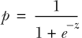

其中 *p* 是概率，*e* 是欧拉数（一个固定常数 ~ 2.718），*z* 是特定情况的对数几率。

然后，简单来说，如果画作成为原作的几率大于 0.5，它就被分类为原作。如果几率小于 0.5，它就被分类为赝品。这种将对数几率转换为几率再转换为概率的过程在图 4.6 中得到了说明。

| |
| --- |

##### 备注

默认情况下，这个阈值概率是 0.5。换句话说，如果一个案例属于阳性类的几率超过 50%，则将其分配到阳性类。然而，在需要在我们将案例分类为阳性类之前“非常”确定的情况下，我们可以改变这个阈值。例如，如果我们使用该模型来预测患者是否需要高风险手术，我们在进行手术之前一定要非常确定！

| |
| --- |

##### 图 4.6. 总结了逻辑回归模型预测类别成员的方法。数据被转换为对数几率（logits），然后转换为几率，最后转换为属于“阳性”类的概率。如果案例的概率超过一个阈值概率（默认为 0.5），则将其分配到阳性类。

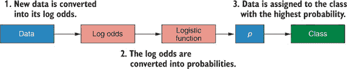

你经常会看到模型

+   *对数几率* = *y 截距* + *斜率* * *铜*

重写为方程 4.5。

##### 方程 4.5。

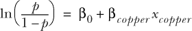

不要被吓到！再看一遍方程 4.5。这是统计学家表示预测直线模型的方式，它与描述对数几率的方程完全相同。逻辑回归模型通过添加 y 截距（*β*[0]）和线的斜率（*β*[铜]）乘以铜的值（*x*[铜]）来预测对数几率（等号左边）。

你可能想知道：你为什么在我答应你不会的时候还给我展示方程？好吧，在大多数情况下，我们不会只有一个预测因子；我们会有很多。通过以这种方式表示模型，你可以看到它如何可以用来线性地组合多个预测因子：换句话说，通过将它们的效果相加。

假设我们还将金属铅的含量作为预测绘画是否为原作的一个指标。模型将看起来像这样：

##### 方程 4.6。

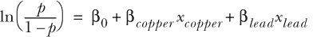

该模型可能的样子示例显示在图 4.7 中。有两个预测变量时，我们可以将模型表示为一个平面，对数几率显示在垂直轴上。对于超过两个预测因子的情况，同样适用这个原理，但在二维表面上难以可视化。

现在，对于任何我们传递给模型的绘画，模型会执行以下操作：

1.  将其铜含量乘以铜的斜率

1.  将铅的含量乘以铅的斜率

1.  将这两个值和 y 截距相加，得到该绘画为原作的对数几率

1.  将对数几率转换为概率

1.  如果概率大于 0.5，则将绘画分类为原作，如果概率小于 0.5，则将绘画分类为赝品

##### 图 4.7\. 可视化具有两个预测变量的逻辑回归模型。铜含量和铅含量分别绘制在 x 轴和 z 轴上。对数几率绘制在 y 轴上。图中显示的平面代表结合截距和铜含量、铅含量的斜率来预测对数几率的线性模型。

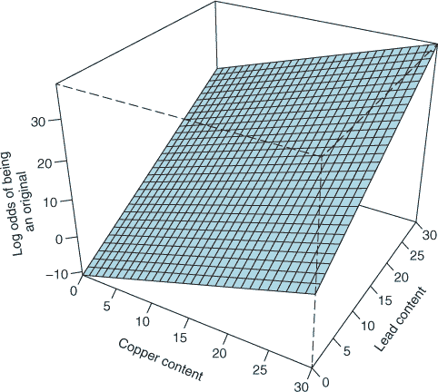

我们可以将模型扩展到包括我们想要的任何数量的预测变量：

##### 方程式 4.7\.


其中 *k* 是数据集中预测变量的数量，... 表示所有中间变量。

| |
| --- |

##### 提示

记得在第三章，当我解释参数和超参数之间的区别时？嗯，*β*[0]，*β*[1]等等是模型参数，因为它们是由算法从数据中学习的。

| |
| --- |

对新画作进行分类的整个流程总结在图 4.8 中。首先，我们使用算法学习到的线性模型将新数据的铜和铅值转换为它们的对数几率（logits）。接下来，我们使用逻辑函数将对数几率转换为概率。最后，如果概率大于 0.5，我们将画作分类为原作；如果其概率小于 0.5，我们将其分类为赝品。

##### 图 4.8\. 对新画作进行分类的过程。三幅画作的预测变量值根据学习到的模型参数（截距和斜率）转换为对数几率。对数几率转换为概率（*p*），如果 *p* > 0.5，则将案例分类为“阳性”类别。

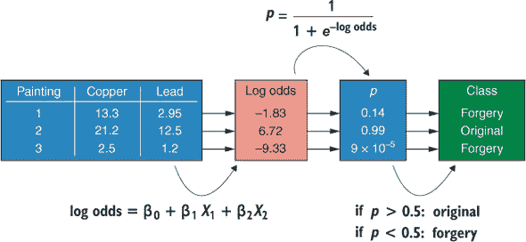

| |
| --- |

##### 注意

尽管图 4.8 中的第一幅和第三幅画作都被分类为赝品，但它们的概率却非常不同。由于第三幅画作的几率远小于第一幅，我们可以更有信心地认为画作 3 是赝品，而不是我们有信心画作 1 是赝品。

| |
| --- |

#### 4.1.2\. 如果我们有超过两个类别怎么办？

之前的场景是二项逻辑回归的一个例子。换句话说，关于将哪个类别分配给新数据的决定只能采取两种命名的类别之一（分别来自拉丁语和希腊语的*bi*和*nomos*）。但我们可以使用逻辑回归的变体来预测多个类别中的一个。这被称为*多项式逻辑回归*，因为现在有多个可能的类别可供选择。

在多项式逻辑回归中，模型不是为每个案例估计一个 logit，而是为每个案例的每个输出类别估计一个 logit。然后，将这些 logit 传递到一个称为*softmax 函数*的方程中，该函数将这些 logit 转换为每个类别的概率，这些概率之和为 1（见图 4.9）。然后，选择具有最大概率的类别作为输出类别。

##### 图 4.9\. softmax 函数的总结。在二项式情况下，每个案例只需要一个 logit（正类的 logit）。在存在多个类别的情况下（本例中的 a，b 和 c），模型为每个案例估计每个类别的 logit。softmax 函数将这些 logits 映射到总和为 1 的概率。案例被分配给概率最大的类别。

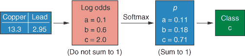


##### 提示

你有时会看到 *softmax 回归* 和 *多项式逻辑回归* 被互换使用。


由 mlr 包装的`classif.logreg`学习器只会处理二项逻辑回归。目前还没有 mlr 包装的普通多项式逻辑回归实现。然而，我们可以使用`classif.LiblineaRL1LogReg`学习器来执行多项式逻辑回归（尽管它有一些差异，我不会讨论）。


**softmax 函数**

你不需要记住 softmax 函数，所以可以自由跳过这部分，但 softmax 函数的定义如下

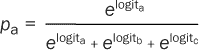

其中 *p*[a] 是一个案例属于类别 a 的概率，*e* 是欧拉数（一个固定常数 ~ 2.718），而 logit[a]，logit[b] 和 logit[c] 分别是这个案例属于类别 a，b 和 c 的 logits。

如果你是一个数学爱好者，这可以推广到任意数量的类别，使用以下方程

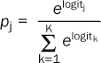

其中 *p*[j] 是属于类别 j 的概率，而 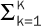 表示从类别 1 到类别 K（总共有 K 个类别）的 *e*^(logits) 的和。

在 R 中编写自己的 softmax 函数实现，并尝试将其他数字向量插入其中。你会发现它总是将输入映射到所有元素之和为 1 的输出。


现在你已经知道了逻辑回归是如何工作的，你将构建你的第一个二项逻辑回归模型。

### 4.2\. 构建你的第一个逻辑回归模型

想象一下，你是一位对 1912 年著名沉没的 RMS *泰坦尼克号* 感兴趣的历史学家。你想要知道社会经济因素是否影响了一个人在灾难中幸存的概率。幸运的是，这样的社会经济数据是公开可用的！

你的目标是构建一个二项逻辑回归模型来预测乘客是否会在 *泰坦尼克号* 灾难中幸存，基于他们的性别和票价等数据。你还将解释模型以决定哪些变量在影响乘客幸存概率方面很重要。让我们首先加载 mlr 和 tidyverse 包：

```
library(mlr)
library(tidyverse)
```

#### 4.2.1\. 加载和探索泰坦尼克号数据集

现在让我们加载数据，该数据包含在`titanic`包中，将其转换为 tibble（使用`as_tibble()`），并对其进行初步探索。我们有一个包含 891 个案例和 12 个乘客变量的 tibble，这些乘客来自*泰坦尼克号*。我们的目标是训练一个模型，可以使用这些变量中的信息来预测乘客是否能在灾难中幸存。

##### 列表 4.1\. 加载和探索*泰坦尼克号*数据集

```
install.packages("titanic")

data(titanic_train, package = "titanic")

titanicTib <- as_tibble(titanic_train)

titanicTib

# A tibble: 891 x 12
   PassengerId Survived Pclass Name  Sex     Age SibSp Parch Ticket
         <int>    <int>  <int> <chr> <chr> <dbl> <int> <int> <chr>
 1           1        0      3 Brau… male     22     1     0 A/5 2…
 2           2        1      1 Cumi… fema…    38     1     0 PC 17…
 3           3        1      3 Heik… fema…    26     0     0 STON/…
 4           4        1      1 Futr… fema…    35     1     0 113803
 5           5        0      3 Alle… male     35     0     0 373450
 6           6        0      3 Mora… male     NA     0     0 330877
 7           7        0      1 McCa… male     54     0     0 17463
 8           8        0      3 Pals… male      2     3     1 349909
 9           9        1      3 John… fema…    27     0     2 347742
10          10        1      2 Nass… fema…    14     1     0 237736
# … with 881 more rows, and 3 more variables: Fare <dbl>,
#   Cabin <chr>, Embarked <chr>
```

tibble 包含以下变量：

+   `PassengerId`—每个乘客独特的任意数字

+   `Survived`—表示生存的整数（1 = 幸存，0 = 死亡）

+   `Pclass`—乘客是否被安排在头等舱、二等舱或三等舱

+   `Name`—乘客名字的字符向量

+   `Sex`—包含“男性”和“女性”的字符向量

+   `Age`—乘客的年龄

+   `SibSp`—船上兄弟姐妹和配偶的总数

+   `Parch`—船上父母和孩子的总数

+   `Ticket`—包含每个乘客票号的字符向量

+   `Fare`—每位乘客为他们的票支付的金额

+   `Cabin`—每个乘客的舱号的字符向量

+   `Embarked`—乘客登船的港口的字符向量

我们将要做的第一件事是使用 tidyverse 工具来清理和准备数据以供建模。

#### 4.2.2\. 充分利用数据：特征工程和特征选择

很少会有一个数据集可以直接用于建模。通常，我们需要先进行一些清理以确保我们能从数据中获得最大价值。这包括将数据转换为正确的类型、纠正错误和删除无关数据等步骤。`titanicTib` tibble 也不例外；在我们将其传递给逻辑回归算法之前，我们需要对其进行清理。我们将执行三个任务：

1.  将`Survived`、`Sex`和`Pclass`变量转换为因子。

1.  通过将`SibSp`和`Parch`相加创建一个新的变量`FamSize`。

1.  选择我们认为对我们模型有预测价值的变量。

如果一个变量应该是因子，那么让 R 知道它是一个因子是很重要的，这样 R 就会适当地处理它。我们可以从列表 4.1 中`titanicTib`的输出中看到，`Survived`和`Pclass`都是整数向量（输出中列上方显示`<int>`），而`Sex`是一个字符向量（列上方显示`<chr>`）。每个这些变量都应该被视为因子，因为它代表了在整个数据集中重复出现的案例之间的离散差异。

我们可以假设乘客在船上的家庭成员数量可能会影响他们的生存。例如，有众多家庭成员的人可能不愿意登上没有足够空间容纳整个家庭的救生艇。虽然`SibSp`和`Parch`变量分别按兄弟姐妹和配偶、父母和子女来存储这些信息，但将它们合并成一个包含整体家庭规模的单一变量可能更有信息量。

这是一个极其重要的机器学习任务，称为*特征工程*：修改你的数据集中的变量以提高它们的预测价值。特征工程有两种形式：

+   ***特征提取—*** 预测信息存储在一个变量中，但以一个无用的格式。例如，假设你有一个变量，其中包含某些事件发生的年份、月份、日期和一天中的时间。一天中的时间具有重要的预测价值，但年份、月份和日期没有。为了使这个变量在你的模型中变得有用，你需要提取仅包含一天中时间信息的新变量。

+   ***特征创建—*** 将现有变量合并以创建新的变量。将`SibSp`和`Parch`变量合并以创建`FamSize`就是一个例子。

使用特征提取和特征创建使我们能够提取数据集中存在的预测信息，但当前格式并未最大化其有用性。

最后，我们数据中的变量可能没有任何预测价值。例如，知道乘客的名字或船舱号码能帮助我们预测生存吗？可能不能，所以让我们移除它们。包括预测价值很小或没有的变量会给数据增加噪声，并会负面影响我们的模型表现，所以最好移除它们。

这又是一个极其重要的机器学习任务，称为*特征选择*，基本上就是它听起来那样：保留那些增加预测价值的变量，移除那些没有的。有时对我们人类来说，是否变量是有用的预测因子是显而易见的。例如，乘客姓名可能没有用，因为每个乘客都有一个不同的名字！在这些情况下，移除这样的变量是常识。然而，通常情况下，这并不那么明显，我们可以有更复杂的方法来自动化特征选择过程。我们将在后面的章节中探讨这一点。

这三个任务（转换为因子、特征工程和特征选择）都在 列表 4.2 中执行。我通过定义一个我们希望转换为因子的变量向量来简化了我们的工作，然后使用 `mutate_at()` 函数将它们全部转换为因子。`mutate_at()` 函数类似于 `mutate()` 函数，但它允许我们一次修改多个列。我们将现有变量作为字符向量提供给 `.vars` 参数，并使用 `.funs` 参数告诉它对这些变量要做什么。在这种情况下，我们提供了我们定义的变量向量，以及将它们转换为因子的“factor”函数。我们将这个结果通过管道传递给一个 `mutate()` 函数调用，该调用定义了一个新变量 `FamSize`，它是 `SibSp` 和 `Parch` 的总和。最后，我们将这个结果通过管道传递给一个 `select()` 函数调用，以选择我们相信可能对我们的模型有某些预测价值的变量。

##### 列表 4.2\. 清理 *泰坦尼克号* 数据，准备建模

```
fctrs <- c("Survived", "Sex", "Pclass")

titanicClean <- titanicTib %>%
  mutate_at(.vars = fctrs, .funs = factor) %>%
  mutate(FamSize = SibSp + Parch) %>%
  select(Survived, Pclass, Sex, Age, Fare, FamSize)

titanicClean

# A tibble: 891 x 6
   Survived Pclass Sex      Age  Fare FamSize
   <fct>    <fct>  <fct>  <dbl> <dbl>   <int>
 1 0        3      male      22  7.25       1
 2 1        1      female    38 71.3        1
 3 1        3      female    26  7.92       0
 4 1        1      female    35 53.1        1
 5 0        3      male      35  8.05       0
 6 0        3      male      NA  8.46       0
 7 0        1      male      54 51.9        0
 8 0        3      male       2 21.1        4
 9 1        3      female    27 11.1        2
10 1        2      female    14 30.1        1
# … with 881 more rows
```

当我们打印我们的新 tibble 时，我们可以看到 `Survived`、`Pclass` 和 `Sex` 现在是因子（在输出中显示为 `<fct>` 在其列上方）；我们有我们的新变量 `FamSize`；并且我们移除了无关变量。


##### 注意

我在从 tibble 中移除 `Name` 变量时是否过于草率？这个变量中隐藏着每位乘客的称呼（小姐、夫人、先生、少爷等），这些可能具有预测价值。使用这些信息需要进行特征提取。


#### 4.2.3\. 绘制数据

现在我们已经稍微清理了数据，让我们绘制它以更好地了解数据中的关系。这里有一个使用 ggplot2 简化绘制多个变量的小技巧。让我们将数据转换为不整洁的格式，使得每个预测变量名称在一个列中，其值在另一个列中，使用 `gather()` 函数（通过查看第二章末尾来刷新你的记忆 chapter 2)。


##### 注意

`gather()` 函数将警告“度量变量之间的属性不相同；它们将被丢弃。”这只是一个警告，告诉你你正在收集在一起的变量没有相同的因子水平。通常这可能会意味着你意外地合并了你不打算合并的变量，但在这个情况下我们可以安全地忽略这个警告。


##### 列表 4.3\. 创建用于绘制的杂乱 tibble

```
titanicUntidy <- gather(titanicClean, key = "Variable", value = "Value",
                        -Survived)
titanicUntidy

# A tibble: 4,455 x 3
   Survived Variable Value
   <fct>    <chr>    <chr>
 1 0        Pclass   3
 2 1        Pclass   1
 3 1        Pclass   3
 4 1        Pclass   1
 5 0        Pclass   3
 6 0        Pclass   3
 7 0        Pclass   1
 8 0        Pclass   3
 9 1        Pclass   3
10 1        Pclass   2
# … with 4,445 more rows
```

我们现在有一个包含三个列的不整洁 tibble：一列包含 `Survived` 因子，一列包含预测变量的名称，另一列包含它们的值。


##### 注意

注意，值列是一个字符向量 (`<chr>`）。这是因为它包含了来自 `Sex` 变量的“男性”和“女性”。由于一列只能持有单一类型的数据，所有数值数据也被转换为字符。


你可能想知道我们为什么要这样做。嗯，这使我们能够使用 ggplot2 的*分面*系统来一起绘制我们的不同变量。在列表 4.4 中，我选取了`titanicUntidy` tibble，筛选出不包含`Pclass`或`Sex`变量（因为这些是因素，我们将单独绘制它们）的行，并将这些数据通过管道传递到`ggplot()`调用中。

##### 列表 4.4\. 为每个连续变量创建子图

```
titanicUntidy %>%
  filter(Variable != "Pclass" & Variable != "Sex") %>%
  ggplot(aes(Survived, as.numeric(Value))) +
  facet_wrap(~ Variable, scales = "free_y") +
  geom_violin(draw_quantiles = c(0.25, 0.5, 0.75)) +
  theme_bw()
```

在`ggplot()`函数调用中，我们提供`Survived`作为 x 美学，`Value`作为 y 美学（通过`as.numeric()`将其强制转换为数值向量，因为我们的`gather()`函数调用之前将其转换为字符）。接下来——这是亮点——我们要求 ggplot2 按`Variable`列分面，使用`facet_wrap()`函数，并允许 y 轴在分面之间变化。分面使我们能够绘制数据的子图，这些子图由分面变量索引。最后，我们添加一个小提琴几何对象，它类似于箱线图，但也显示了 y 轴上的数据密度。结果图表显示在图 4.10 中。

##### 图 4.10\. `Survived`与`FamSize`和`Fare`的分面图。小提琴图显示了 y 轴上的数据密度。每个小提琴上的线条代表第一四分位数、中位数和第三四分位数（从最低到最高）。

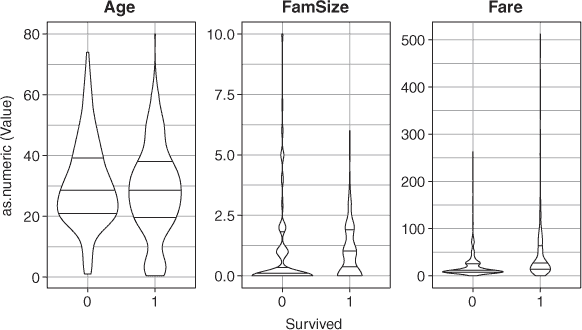

你能看出分面是如何工作的吗？具有不同`Variable`值的行被绘制在不同的子图中！这就是为什么我们需要将数据收集到不整洁的格式中：这样我们就可以提供一个变量供 ggplot2 分面使用。

| |
| --- |

**练习 1**

重新绘制图 4.10 中的图表，但添加一个`geom_point()`层，将`alpha`参数设置为 0.05，将`size`参数设置为 3。这会使小提琴图更有意义吗？

| |
| --- |

现在，让我们通过筛选只包含`Pclass`和`Sex`变量的数据行来对我们数据集中的因素做同样的事情。这次，我们想看到因素每个级别的乘客生存比例。要做到这一点，我们将因素级别放在 x 轴上，通过提供`Value`作为 x 美学映射；我们还想用不同的颜色来表示生存与非生存，所以我们提供`Survived`作为填充美学。我们像以前一样按`Variable`分面，并添加一个带有`position = "fill"`参数的条形几何对象，这样就可以堆叠生存者和非生存者的数据，使它们相加等于 1，以显示每个的比例。结果图表显示在图 4.11 中。

##### 列表 4.5\. 为每个分类变量创建子图

```
titanicUntidy %>%
  filter(Variable == "Pclass" | Variable == "Sex") %>%
  ggplot(aes(Value, fill = Survived)) +
  facet_wrap(~ Variable, scales = "free_x") +
  geom_bar(position = "fill") +
  theme_bw()
```

##### 图 4.11\. `Survived`与`Pclass`和`Sex`的分面图。填充条形表示因素每个级别的乘客生存比例（1 = 生存）。

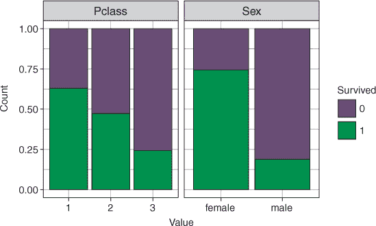

| |
| --- |

##### 注意

在列表 4.4 和 4.5 中的`filter()`函数调用中，我使用了`&`和`|`运算符分别表示“和”和“或”。


因此，似乎幸存下来的乘客倾向于在船上拥有更多的家庭成员（可能与我们假设相矛盾），尽管在船上拥有非常大家庭的乘客往往不会幸存。年龄似乎对生存没有明显的影响，但女性意味着你更有可能幸存。为你的船票支付更多费用增加了你幸存的可能性，同样，处于更高等级也是如此（尽管这两个可能相关）。


**练习 2**

重新绘制图 4.11 中的图表，但将`geom_bar()`参数`position`设置为`"dodge"`。再次这样做，但将`position`参数设置为`"stack"`。你能看到三种方法之间的区别吗？


#### 4.2.4\. 训练模型

现在我们有了清洗过的数据，让我们使用 mlr 创建一个任务、学习者和模型（指定`"classif.logreg"`以使用逻辑回归作为我们的学习器）。通过设置参数`predict.type = "prob"`，训练好的模型在对新数据进行预测时将输出每个类别的估计概率，而不仅仅是预测的类别成员资格。

##### 列表 4.6\. 创建任务和学习者，并训练模型

```
titanicTask <- makeClassifTask(data = titanicClean, target = "Survived")

logReg <- makeLearner("classif.logreg", predict.type = "prob")

logRegModel <- train(logReg, titanicTask)

Error in checkLearnerBeforeTrain(task, learner, weights) :
  Task 'titanicClean' has missing values in 'Age', but learner 'classif.logre
     g' does not support that!
```

哎呀！出错了。错误信息是什么？嗯，看起来我们在`Age`变量中有些缺失数据，逻辑回归算法不知道如何处理这种情况。让我们看看这个变量。（我仅显示前 60 个元素以节省空间，但你可以打印整个向量。）

##### 列表 4.7\. 在`Age`变量中计数缺失值

```
titanicClean$Age[1:60]
 [1] 22.0 38.0 26.0 35.0 35.0   NA 54.0  2.0 27.0 14.0  4.0 58.0 20.0
[14] 39.0 14.0 55.0  2.0   NA 31.0   NA 35.0 34.0 15.0 28.0  8.0 38.0
[27]   NA 19.0   NA   NA 40.0   NA   NA 66.0 28.0 42.0   NA 21.0 18.0
[40] 14.0 40.0 27.0   NA  3.0 19.0   NA   NA   NA   NA 18.0  7.0 21.0
[53] 49.0 29.0 65.0   NA 21.0 28.5  5.0 11.0
sum(is.na(titanicClean$Age))
[1] 177
```

啊，我们有很多 NA（实际上有 177 个！），这是 R 标记缺失数据的方式。

#### 4.2.5\. 处理缺失数据

处理缺失数据有两种方法：

+   简单地从分析中排除具有缺失数据的案例

+   应用一个*插补*机制来填补空白

当缺失值案例与完整案例的比例非常小的时候，第一个选项可能是有效的。在这种情况下，省略具有缺失数据的案例不太可能对我们的模型性能产生重大影响。这是一个简单（如果不是优雅）的解决方案。

第二种选项，缺失值插补，是我们使用某种算法估计那些缺失值可能是什么，用这些估计值替换 NA，并使用这个插补数据集来训练我们的模型的过程。有几种不同的方法可以估计缺失数据的值，我们将在整本书中使用更复杂的方法，但就目前而言，我们将采用均值插补，即简单地取缺失数据的变量的平均值，并用这个值替换缺失值。

在代码列表 4.8 中，我使用 mlr 的`impute()`函数替换缺失数据。第一个参数是数据名称，`cols`参数询问我们想要填充哪些列以及想要应用哪种方法。如果我们有多个列，我们将`cols`参数作为列名称的列表提供，列名称之间用逗号分隔。每个列名称后面应跟一个`=`符号和填充方法（`imputeMean()`使用变量的平均值来替换 NAs）。我将填充后的数据结构保存为对象`imp`，并使用`sum(is.na())`来计算数据中的缺失值数量。

##### 代码列表 4.8. 在`Age`变量中填充缺失值

```
imp <- impute(titanicClean, cols = list(Age = imputeMean()))

sum(is.na(titanicClean$Age))
[1] 177

sum(is.na(imp$data$Age))
[1] 0
```

我们可以看到，那些 177 个缺失值都已经填充了！

#### 4.2.6. 训练模型（第二部分）

好的，我们已经用平均值填充了那些讨厌的缺失值，并创建了新的对象`imp`。现在让我们再次尝试，通过使用填充数据创建一个任务。`imp`对象包含填充后的数据和我们所使用的填充过程的描述。要提取数据，我们只需使用`imp$data`。

##### 代码列表 4.9. 在填充数据上训练模型

```
titanicTask <- makeClassifTask(data = imp$data, target = "Survived")

logRegModel <- train(logReg, titanicTask)
```

这次没有错误信息。接下来，让我们交叉验证我们的模型以估计其性能。

### 4.3. 交叉验证逻辑回归模型

记住，当我们进行交叉验证时，我们应该交叉验证整个模型构建过程。这应该包括任何数据相关的预处理步骤，例如缺失值填充。在第三章中，我们使用包装函数将我们的学习者和超参数调整过程包装在一起。这次，我们将为我们的学习者和缺失值填充创建一个包装器。

#### 4.3.1. 在交叉验证中包含缺失值填充

`makeImputeWrapper()`函数将一个学习器（作为第一个参数给出）和一个填充方法包装在一起。注意我们如何以与代码列表 4.8 中的`impute()`函数完全相同的方式指定填充方法，通过提供列的列表及其填充方法。

##### 代码列表 4.10. 包装学习器和填充方法

```
logRegWrapper <- makeImputeWrapper("classif.logreg",
                                   cols = list(Age = imputeMean()))
```

现在让我们应用分层 10 折交叉验证，重复 50 次，到我们的包装学习器。

| |
| --- |

##### 注意

记住，我们首先使用`makeResampleDesc()`定义我们的重采样方法，然后使用`resample()`运行交叉验证。

| |
| --- |

由于我们向`resample()`函数提供了包装后的学习器，对于交叉验证的每个折叠，训练集中`Age`变量的平均值将用于填充任何缺失值。

##### 代码列表 4.11. 交叉验证模型构建过程

```
kFold <- makeResampleDesc(method = "RepCV", folds = 10, reps = 50,
                          stratify = TRUE)

logRegwithImpute <- resample(logRegWrapper, titanicTask,
                             resampling = kFold,
                             measures = list(acc, fpr, fnr))

logRegwithImpute
Resample Result
Task: imp$data
Learner: classif.logreg.imputed
Aggr perf: acc.test.mean=0.7961500,fpr.test.mean=0.2992605,fnr.test.mean=0.14
     44175
Runtime: 10.6986
```

由于这是一个二分类问题，我们可以访问一些额外的性能指标，例如假阳性率（`fpr`）和假阴性率（`fnr`）。在列表 4.11 中的交叉验证过程中，我们要求报告准确率、假阳性率和假阴性率作为性能指标。我们可以看到，尽管在重复实验中，我们的模型平均正确分类了 79.6%的乘客，但它错误地将 29.9%的死亡乘客分类为幸存者（假阳性），并将 14.4%的幸存乘客分类为死亡（假阴性）。

#### 4.3.2. 准确率是最重要的性能指标，对吗？

你可能会认为模型预测的准确率是其性能的衡量标准。通常情况下是这样的，但有时并非如此。

假设你是一家银行的数据科学家，在欺诈检测部门工作。你的任务是构建一个模型，预测信用卡交易是合法的还是欺诈的。比如说，在 100,000 笔信用卡交易中，只有 1 笔是欺诈的。由于欺诈相对较少（并且因为他们今天午餐在提供披萨），你决定构建一个模型，简单地将所有交易分类为合法。

模型的准确率为 99.999%。很好吗？当然不是！该模型无法识别任何欺诈交易，并且具有 100%的假阴性率！

这里的教训是，你应该在特定问题的背景下评估模型性能。另一个例子可能是构建一个模型，指导医生为患者使用或不使用不愉快的治疗方法。在这个问题的背景下，可能可以接受错误地不给予患者不愉快的治疗，但如果你错误地给予患者不需要的治疗，这是绝对必要的！

如果积极事件很少见（如我们欺诈信用卡的例子），或者如果你特别重要，不要将阳性案例错误分类为阴性，你应该选择具有低假阴性率的模型。如果阴性事件很少见，或者如果你特别重要，不要将阴性案例错误分类为阳性（如我们的医疗治疗例子），你应该选择具有低假阳性率的模型。

查看以下链接以了解 mlr 目前包含的所有性能指标及其可用情况：[`mlr.mlr-org.com/articles/tutorial/measures.html`](https://mlr.mlr-org.com/articles/tutorial/measures.html)。

### 4.4. 解释模型：优势比

我在章节开头提到，逻辑回归之所以非常流行，是因为模型参数（y 截距和每个预测因子的斜率）的可解释性。为了提取模型参数，我们必须首先使用`getLearnerModel()`函数将我们的 mlr 模型对象`logRegModel`转换为 R 模型对象。接下来，我们将这个 R 模型对象作为`coef()`函数的参数传递，该函数代表*系数*（参数的另一个术语），因此这个函数返回模型参数。

##### 列表 4.12\. 提取模型参数

```
logRegModelData <- getLearnerModel(logRegModel)

coef(logRegModelData)

 (Intercept)      Pclass2      Pclass3      Sexmale          Age
 3.809661697 -1.000344806 -2.132428850 -2.775928255 -0.038822458
        Fare      FamSize
 0.003218432 -0.243029114
```

截距是在所有连续变量均为 0 且因素变量处于其参考水平时，生存“泰坦尼克号”灾难的对数概率。我们通常对斜率比 y 截距更感兴趣，但这些值是以对数概率单位表示的，难以解释。相反，人们通常将它们转换为*概率比*。

概率比（odds ratio）实际上就是概率之比。例如，如果你是女性，在“泰坦尼克号”上的生存概率大约是 7 比 10，而如果你是男性，生存概率是 2 比 10，那么如果你是女性的生存概率比是 3.5。换句话说，如果你是女性，你生存的可能性比男性高 3.5 倍。概率比是解释预测因子对结果影响的一种非常流行的方式，因为它们很容易理解。

#### 4.4.1\. 将模型参数转换为概率比

我们如何从对数概率转换为概率比？通过取它们的指数（*e*^(对数概率)）。我们还可以使用`confint()`函数计算 95%置信区间，以帮助我们决定每个变量具有预测价值的证据强度。

##### 列表 4.13\. 将模型参数转换为概率比

```
exp(cbind(Odds_Ratio = coef(logRegModelData), confint(logRegModelData)))

Waiting for profiling to be done…
             Odds_Ratio       2.5 %       97.5 %
(Intercept) 45.13516691 19.14718874 109.72483921
Pclass2      0.36775262  0.20650392   0.65220841
Pclass3      0.11854901  0.06700311   0.20885220
Sexmale      0.06229163  0.04182164   0.09116657
Age          0.96192148  0.94700049   0.97652950
Fare         1.00322362  0.99872001   1.00863263
FamSize      0.78424868  0.68315465   0.89110044
```

这些概率比中大多数都小于 1。小于 1 的概率比意味着事件发生的可能性*较低*。如果你将 1 除以它们，通常更容易解释这些值。例如，如果你是男性的生存概率比是 0.06，而 1 除以 0.06 = 16.7。这意味着，在保持所有其他变量不变的情况下，男性比女性生存的可能性低 16.7 倍。

对于连续变量，我们解释概率比是指乘客在变量每增加一个单位时生存可能性增加多少。例如，对于每个额外的家庭成员，乘客的生存可能性降低了 1/0.78 = 1.28 倍。

对于因素变量，我们解释概率比是指乘客相对于该变量的参考水平生存可能性增加多少。例如，我们有`Pclass2`和`Pclass3`的概率比，分别表示 2 等和 3 等舱乘客相对于 1 等舱乘客生存可能性增加的倍数。

95%置信区间表明每个变量具有预测价值的证据强度。优势比率为 1 表示机会相等，变量对预测没有影响。因此，如果 95%置信区间包括值 1，例如`Fare`变量的那些，那么这*可能*表明这个变量没有做出贡献。

#### 4.4.2. 当单位增加没有意义时

单位增加通常不容易解释。比如说，你得到一个优势比率为，对于每个额外的蚂蚁，蚁丘存活于白蚁攻击的可能性是 1.000005 倍。你如何理解这样一个小的优势比率的重要性？

当考虑单位增加没有意义时，一种流行的技术是在训练模型之前对连续变量进行 log[2]变换。这不会影响模型做出的预测，但现在优势比率可以这样解释：每次蚂蚁数量*翻倍*，蚁丘存活于白蚁攻击的可能性是*x*倍。这将给出更大且更易于解释的优势比率。

### 4.5. 使用我们的模型进行预测

我们已经构建、交叉验证并解释了我们的模型，现在使用该模型对新数据进行预测将是一件很棒的事情。这种情况有些不寻常，因为我们基于历史事件构建了一个模型，所以（希望！）我们不会用它来预测另一场泰坦尼克号的灾难。尽管如此，我想向你展示如何使用逻辑回归模型进行预测，就像你可以对任何其他监督算法做的那样。让我们加载一些未标记的乘客数据，对其进行清理以便预测，并将其通过我们的模型。

##### 列表 4.14. 使用我们的模型对新数据进行预测

```
data(titanic_test, package = "titanic")

titanicNew <- as_tibble(titanic_test)

titanicNewClean <- titanicNew %>%
  mutate_at(.vars = c("Sex", "Pclass"), .funs = factor) %>%
  mutate(FamSize = SibSp + Parch) %>%
  select(Pclass, Sex, Age, Fare, FamSize)

predict(logRegModel, newdata = titanicNewClean)

Prediction: 418 observations
predict.type: prob
threshold: 0=0.50,1=0.50
time: 0.00
     prob.0     prob.1 response
1 0.9178036 0.08219636        0
2 0.5909570 0.40904305        0
3 0.9123303 0.08766974        0
4 0.8927383 0.10726167        0
5 0.4069407 0.59305933        1
6 0.8337609 0.16623907        0
… (#rows: 418, #cols: 3)
```

### 4.6. 逻辑回归的优势和弱点

虽然通常很难判断哪种算法对于特定任务会表现良好，但以下是一些优势和弱点，这将帮助你决定逻辑回归是否适合你。

逻辑回归算法的优势如下：

+   它可以处理连续和分类预测变量。

+   模型参数非常易于解释。

+   预测变量*不*假设是正态分布的。

逻辑回归算法的弱点如下：

+   当类别之间完全分离时，它将不起作用。

+   它假设类别是*线性可分*的。换句话说，它假设在*n*-维空间（其中*n*是预测变量的数量）中的一个平面可以用来分离类别。如果需要曲面来分离类别，与一些其他算法相比，逻辑回归的表现将不佳。

+   它假设每个预测变量与对数几率之间存在线性关系。例如，如果预测变量的低值和高值案例属于一个类别，而预测变量的中等值案例属于另一个类别，这种线性关系就会破裂。

| |
| --- |

**练习 3**

重复模型构建过程，但省略`Fare`变量。交叉验证估计的模型性能是否有差异？为什么？

| |
| --- |
| |

**练习 4**

从`Name`变量中提取称呼，并将任何不是`"Mr"`、`"Dr"`、`"Master"`、`"Miss"`、`"Mrs"`或`"Rev"`的称呼转换为`"Other"`。查看以下代码，了解如何使用 stringr tidyverse 包中的`str_split()`函数提取称呼：

```
names <- c("Mrs. Pool", "Mr. Johnson")

str_split(names, pattern = "\\.")
[[1]]
[1] "Mrs"   " Pool"

[[2]]
[1] "Mr"       " Johnson"
```

| |
| --- |
| |

**练习 5**

构建一个包含`Salutation`作为另一个预测变量的模型，并进行交叉验证。这会提高模型性能吗？

| |
| --- |

### 摘要

+   逻辑回归是一种监督学习算法，通过计算数据属于每个类的概率来对新数据进行分类。

+   逻辑回归可以处理连续和分类预测变量，并建模预测变量与属于正类对数几率之间的线性关系。

+   特征工程是从现有变量中提取信息或创建新变量的过程，以最大化其预测价值。

+   特征选择是选择数据集中哪些变量对机器学习模型具有预测价值的过程。

+   假设缺失值处理策略，其中使用某些算法来估计缺失值可能是什么。你学习了如何为*泰坦尼克号*数据集应用均值填充。

+   几率比是一种解释每个预测变量对案例属于正类几率影响的有信息量的方式。它们可以通过取模型斜率的指数（*e*^(对数几率)）来计算。

### 练习题解答

1.  重新绘制小提琴图，添加一个透明度的`geom_point()`层：

    ```
    titanicUntidy %>%
      filter(Variable != "Pclass" & Variable != "Sex") %>%
      ggplot(aes(Survived, as.numeric(Value))) +
      facet_wrap(~ Variable, scales = "free_y") +
      geom_violin(draw_quantiles = c(0.25, 0.5, 0.75)) +
      geom_point(alpha = 0.05, size = 3) +
      theme_bw()
    ```

1.  重新绘制条形图，但使用`"dodge"`和`"stack"`位置参数：

    ```
    titanicUntidy %>%
      filter(Variable == "Pclass" | Variable == "Sex") %>%
      ggplot(aes(Value, fill = Survived)) +
      facet_wrap(~ Variable, scales = "free_x") +
      geom_bar(position = "dodge") +
      theme_bw()

    titanicUntidy %>%
      filter(Variable == "Pclass" | Variable == "Sex") %>%
      ggplot(aes(Value, fill = Survived)) +
      facet_wrap(~ Variable, scales = "free_x") +
      geom_bar(position = "stack") +
      theme_bw()
    ```

1.  构建模型，但省略`Fare`变量：

    ```
    titanicNoFare <- select(titanicClean, -Fare)

    titanicNoFareTask <- makeClassifTask(data = titanicNoFare,
                                         target = "Survived")

    logRegNoFare <- resample(logRegWrapper, titanicNoFareTask,
                             resampling = kFold,
                             measures = list(acc, fpr, fnr))

    logRegNoFare
    ```

    忽略`Fare`变量对模型性能的影响很小，因为它对`Pclass`变量没有额外的预测价值（查看列表 4.13 中`Fare`的几率比和置信区间）。

1.  从`Name`变量中提取称呼（有多种方法可以做到这一点，所以不要担心你的方法与我的不同）：

    ```
    surnames <- map_chr(str_split(titanicTib$Name, "\\."), 1)

    salutations <- map_chr(str_split(surnames, ", "), 2)

    salutations[!(salutations %in% c("Mr", "Dr", "Master",
                                     "Miss", "Mrs", "Rev"))] <- "Other"
    ```

1.  使用`Salutation`作为预测变量构建模型：

    ```
    fctrsInclSals <- c("Survived", "Sex", "Pclass", "Salutation")

    titanicWithSals <- titanicTib %>%
      mutate(FamSize = SibSp + Parch, Salutation = salutations) %>%
      mutate_at(.vars = fctrsInclSals, .funs = factor) %>%
      select(Survived, Pclass, Sex, Age, Fare, FamSize, Salutation)

    titanicTaskWithSals <- makeClassifTask(data = titanicWithSals,
                                           target = "Survived")

    logRegWrapper <- makeImputeWrapper("classif.logreg",
                                       cols = list(Age = imputeMean()))

    kFold <- makeResampleDesc(method = "RepCV", folds = 10, reps = 50,
                              stratify = TRUE)

    logRegWithSals <- resample(logRegWrapper, titanicTaskWithSals,
                               resampling = kFold,
                               measures = list(acc, fpr, fnr))
    logRegWithSals
    ```

特征提取效果显著！将`Salutation`作为预测变量提高了模型性能。

## 第五章：通过判别分析最大化分离进行分类

*本章涵盖*

+   理解线性与二次判别分析

+   构建判别分析分类器以预测葡萄酒

*判别分析* 是一个总称，指的是多种解决分类问题（我们希望预测一个分类变量）的算法。虽然不同的判别分析算法学习方式略有不同，但它们都找到了原始数据的新表示，以最大化类之间的分离。

回想一下第一章，预测变量是我们希望包含对新数据进行预测所需信息的变量。判别函数分析算法通过将它们组合成新的变量（这些变量必须是连续的）来找到预测变量的新表示，这些新变量最好地 *区分* 类别。这种预测变量的组合通常有一个有用的好处，即减少预测变量的数量到一个更小的数量。正因为如此，尽管判别分析算法是分类算法，但它们与我们在本书第四部分（kindle_split_024.html#part04）中将要遇到的某些降维算法相似。

| |
| --- |

##### 注意

*降维* 是一个过程，它学习如何将一组变量中的信息尽可能少地损失地压缩成更少的变量。

| |
| --- |

### 5.1\. 什么是判别分析？

在本节中，你将了解判别分析为何有用以及它是如何工作的。想象一下，你想要找出是否可以根据患者的基因表达预测他们对药物的反应。你测量了 1,000 个基因的表达水平，并记录它们对药物的反应是积极、消极还是完全没有反应（一个三分类问题）。

一个具有如此多预测变量（并且找到这样大的数据集并不罕见）的数据集会带来一些问题：

+   数据非常难以手动探索和绘制。

+   可能存在许多预测变量，它们几乎不包含或只包含很少的预测信息。

+   我们必须应对 *维度灾难*（算法在尝试学习高维数据中的模式时遇到的问题）。

在我们的基因表达示例中，要这样绘制所有 1,000 个基因，以便我们能够解释类之间的相似性/差异性几乎是不可能的。相反，我们可以使用判别分析将所有这些信息压缩成可管理的数量的 *判别函数*，每个函数都是原始变量的组合。换句话说，判别分析将预测变量作为输入，并找到这些变量的新、低维表示，以最大化类之间的分离。因此，尽管判别分析是一种分类技术，但它使用降维来实现其目标。这如图 5.1 所示。

| |
| --- |

##### 注意

由于它们的降维，判别分析算法是分类问题中流行的技术，在这些问题中，你有很多连续的预测变量。

| |
| --- |

##### 图 5.1。判别分析算法将原始数据与连续预测变量结合，形成新的变量，这些变量最大化类别的分离。

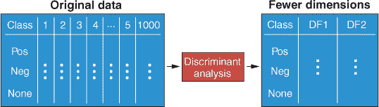

这些判别函数的数量将是以下两者中的较小者：

+   类别数减去 1

+   预测变量的数量

在基因表达示例中，那些 1,000 个预测变量包含的信息将浓缩成仅仅 2 个变量（三个类别减去 1）。现在我们可以轻松地将这两个新变量相互对比，以查看我们的三个类别是如何分离的！

正如你在第四章中学到的，包括包含很少或没有预测价值的预测变量会增加噪声，这可能会对学习到的模型的表现产生负面影响。当判别分析算法学习它们的判别函数时，会给予更好地区分类别的预测变量更大的权重或重要性。包含很少或没有预测价值的预测变量得到的权重较小，对最终模型的贡献也较小。在一定程度上，这种对无信息预测变量的低权重减轻了它们对模型性能的影响。

| |
| --- |

##### 注意

尽管可以减轻弱预测变量的影响，但在进行特征选择（移除弱预测变量）后，判别分析模型仍然倾向于表现更好。

| |
| --- |

维度灾难是一个听起来令人恐惧的现象，当处理高维数据（具有许多预测变量的数据）时会引起问题。随着*特征空间*（所有可能的预测变量组合的集合）的增加，该空间中的数据变得更加*稀疏*。更简单地说，对于数据集中相同数量的案例，如果你增加特征空间，案例彼此之间的距离会变得更远，它们之间的空隙也会更大。这通过从一维特征空间到三维特征空间的转换在图 5.2 中得到了演示。

##### 图 5.2。随着维度的增加，数据变得更加稀疏。两个类别在一维、二维和三维特征空间中显示。三维表示中的虚线用于澄清点在 z 轴上的位置。注意随着维度的增加，空隙越来越大。

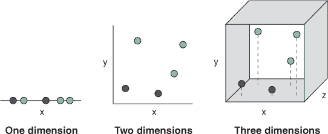

维度增加的后果是特征空间的一个区域可能只有很少的案例占据，因此算法更有可能从数据中的“异常”案例中学习。当算法从异常案例中学习时，这会导致过度拟合的模型，其预测的方差很大。这就是维度灾难。

| |
| --- |

##### 注意

随着预测变量数量的线性增加，案例的数量需要指数级增加，以保持特征空间中的相同密度。

| |
| --- |

这并不是说变量越多就越不好！对于大多数问题，添加具有有价值信息的预测变量可以提高模型的预测精度……直到它不再这样做（直到我们得到递减的回报）。那么我们如何防止由于维度诅咒导致的过拟合？通过执行特征选择（正如我们在第四章中所做的那样），只包括具有预测价值的变量，以及/或者通过执行降维。你将在本书的第四部分中了解到许多具体的降维算法，但判别分析实际上在它的学习过程中执行降维。

| |
| --- |

##### 备注

当预测变量的数量增加时，模型的预测能力会增加，但当我们继续添加更多预测变量时，这种增加又会再次减少，这种现象被称为*休斯现象*，以统计学家 G. Hughes 的名字命名。

| |
| --- |

判别分析不是一个算法，而是有许多不同的版本。我将教你两种最基本且最常用的算法：

+   线性判别分析（LDA）

+   二次判别分析（QDA）

在下一节中，你将了解这些算法是如何工作的以及它们之间的区别。现在，只需说 LDA 和 QDA 分别学习线性（直线）和曲线决策边界之间的类别即可。

#### 5.1.1\. 如何进行判别分析的学习？

我将从解释 LDA 的工作原理开始，然后将其推广到 QDA。想象一下，我们有两个预测变量，我们试图使用这些变量来分离数据中的两个类别（参见图 5.3）。LDA 的目标是学习数据的新表示，该表示可以分离每个类别的*质心*，同时尽可能保持类内方差最低。质心简单地是特征空间中所有预测变量的平均值（一个均值向量，每个维度一个）。然后 LDA 找到一条通过原点的线，当数据被*投影*到这条线上时，它同时完成以下操作：

+   沿着线最大化类中心之间的差异

+   沿着线最小化类内方差

为了选择这条线，算法在所有可能的轴上最大化方程 5.1 中的表达式：

##### 方程 5.1。

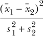

分子是类别均值之间的差异（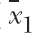 和  分别为类别 1 和类别 2 的均值），平方以确保值为正（因为我们不知道哪个会更大）。分母是每个类别沿线的方差之和（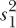 和 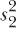 分别为类别 1 和类别 2 的方差）。这种直觉背后的想法是我们希望类别的均值尽可能分离，每个类别内的散点/方差尽可能小。

##### 图 5.3. 在二维中学习判别函数。LDA 学习一个新轴，使得当数据投影到它上（虚线）时，它最大化类别均值之间的差异，同时最小化类内方差。 和 *s*² 分别是每个类别沿新轴的均值和方差。

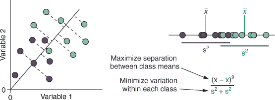

##### 图 5.4. 仅通过构建一个最大化类别质心分离的新轴并不能完全解决类别问题（左侧示例）。构建一个同时最大化质心分离并最小化每个类别内方差的轴，可以更好地分离类别（右侧）。 和 *s*² 分别是每个类别沿新轴的均值和方差。

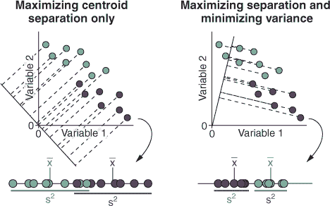

为什么不简单地找到最大化质心分离的线呢？因为最佳分离质心的线并不能保证在不同类别中案例的最佳分离。这可以在图 5.4 中看到。在左侧的示例中，画出一个新轴，它仅仅最大化两个类别的质心分离。当我们把数据投影到这个新轴上时，由于相对较高的方差，类别并没有完全分离。然而，在右侧的示例中，新轴试图在最大化质心分离的同时，最小化每个类别沿该轴的方差。这导致质心稍微靠近，但方差却小得多，从而使得两个类别的案例完全分离。

这个新轴被称为**判别函数**，它是原始变量的线性组合。例如，一个判别函数可以由以下方程描述：

+   *DF = –0.5* × *var[1] + 1.2* × *var[2] + 0.85* × *var[3]*

以这种方式，该方程中的判别函数（DF）是变量*var*[1]、*var*[2]和*var*[3]的线性组合。这种组合是线性的，因为我们只是将每个变量的贡献相加。每个变量乘以的值被称为*典型判别函数系数*，并按每个变量对类别分离的贡献程度对其进行加权。换句话说，对类别分离贡献最大的变量将具有较大的绝对典型判别函数系数（正或负）。包含少量或没有类别分离信息的变量将具有接近零的典型判别函数系数。

| |
| --- |

**线性判别分析 vs. 主成分分析**

如果你之前遇到过主成分分析（PCA），你可能想知道它与线性判别分析（LDA）有何不同。PCA 是一种无监督的降维学习算法，这意味着，与 LDA 不同，它不依赖于标记数据。

虽然这两个算法都可以用来降低数据集的维度，但它们以不同的方式这样做，以达到不同的目标。LDA 创建新的轴，最大化类别分离，这样我们就可以使用这些新轴来对新数据进行分类，而 PCA 创建新的轴，最大化投影到这些轴上的数据的方差。PCA 的目标不是分类，而是尽可能多地解释数据中的变异和信息，只使用少量新轴。然后，这种新的、低维度的表示可以输入到其他机器学习算法中。（如果你对 PCA 不熟悉，不要担心！你将在第十三章中深入了解它。）

如果你想要降低具有标记类别成员资格的数据的维度，你应该通常优先考虑 LDA 而不是 PCA。如果你想要降低未标记数据的维度，你应该优先考虑 PCA（或书中第四部分 part 4 中我们将讨论的许多其他降维算法）。

| |
| --- |

#### 5.1.2\. 如果我们有超过两个类别怎么办？

判别分析可以处理多于两个类别的分类问题。但它是如何在这种情况下学习最佳轴的呢？它不是试图最大化类别质心的分离，而是最大化每个类别质心与数据的*总体质心*（忽略类别成员资格的所有数据的质心）之间的分离。这在图 5.5 中得到了说明，其中我们对来自三个类别的案例进行了两个连续的测量。类别质心用三角形表示，总体质心用十字表示。

##### 图 5.5\. 当类别超过两个时，LDA 最大化每个类别质心（三角形）与总体质心（交叉）之间的距离，同时最小化类内方差。一旦找到第一个判别函数，就构建第二个与它正交的函数。原始数据可以与这些函数进行绘图。

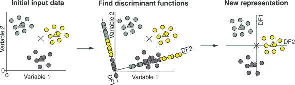

LDA 首先找到最佳分离类别质心与总体质心的轴，同时最小化沿其的每个类别的方差。然后，LDA 构建第二个与第一个正交的 DF。这仅仅意味着第二个 DF 必须与第一个垂直（在这个 2D 例子中是直角）。


##### 注意

DF 的数量将是以下两者中较小的一个：（类别数）减 1，或预测变量数。


然后，数据被投影到这些新轴上，使得每个案例对每个函数都有一个*判别得分*（它在新轴上的值）。这些判别得分可以相互绘制，以形成原始数据的新表示。

但这有什么大不了的？我们从一个预测变量变成了……两个预测变量！实际上，你能看到我们所做的只是将数据居中和缩放，并围绕零旋转？当我们只有两个变量时，判别分析无法执行任何降维，因为 DF 的数量是类别数减 1 和变量数中的较小者（我们只有两个变量）。

但当我们有超过两个预测变量时怎么办？图 5.6 展示了有一个三个预测变量（*x*、*y*和*z*）和三个类别的例子。就像在图 5.5 中一样，LDA 找到最大化每个类别质心与总体质心之间分离度的 DF，同时最小化沿其的方差。这条线穿过三维空间。

##### 图 5.6\. 当预测变量超过两个时，立方体代表一个包含三个预测变量（*x*、*y*和*z*）和三个类别（虚线有助于指示每个案例沿*z*-轴的位置）的特征空间。找到了判别函数 1（DF1），然后找到与 DF1 正交的 DF2。虚线表示 DF1 和 DF2 在 z 轴上的“阴影”，有助于显示它们的深度。数据可以被投影到 DF1 和 DF2 上。

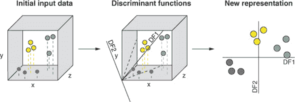

接下来，LDA 找到第二个 DF（与第一个正交），它也试图最大化分离度同时最小化方差。因为我们只有三个类别（且 DF 的数量是类别数减 1 和预测变量数中的较小者），所以我们停在两个 DF 上。通过取数据中每个案例的判别得分（每个案例沿两个 DF 的值），我们可以在仅两个维度上绘制我们的数据。


##### 注意

第一个 DF 总是做得最好，其次是第二个、第三个，依此类推。


LDA 已经将一个三维数据集合并，将这三个变量中的信息合并成两个新的变量，这些变量最大化了类别的分离。这很酷——但如果不是只有三个预测变量，而是有 1,000 个（如我之前使用的示例中所示），LDA 仍然会将所有这些信息压缩成只有 2 个变量！这太酷了。

#### 5.1.3\. 用曲线而不是直线来学习：QDA

当每个类别的数据在所有预测变量上都是正态分布，并且类别具有相似的*协方差*时，LDA 表现良好。协方差简单地说就是当一个变量增加/减少时，另一个变量增加/减少的程度。因此，LDA 假设对于数据集中的每个类别，预测变量之间的协方差是相同的。

这通常并不是情况，不同的类别有不同的协方差。在这种情况下，QDA 往往比 LDA 表现更好，因为它不做出这个假设（尽管它仍然假设数据是正态分布的）。QDA 不是学习直线来分隔类别，而是学习曲线。因此，它也非常适合那些类别最好通过非线性决策边界来分隔的情况。这可以在图 5.7 中看到。

##### 图 5.7\. 具有相同协方差（变量 1 和 2 之间的关系对于两个类别都是相同的）和不同协方差的两个类别的示例。椭圆形代表每个类别内的数据分布。展示了二次和线性 DFs（QDF 和 LDF）。展示了具有不同协方差类别的每个 DF 上的投影。

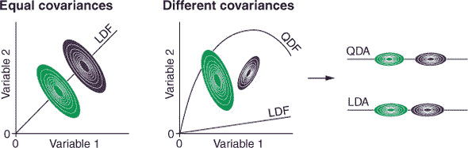

在图中的左侧示例中，两个类别在两个变量上都是正态分布的，并且具有相同的协方差。我们可以看到协方差是相等的，因为对于两个类别，当变量 1 增加时，变量 2 以相同的量减少。在这种情况下，LDA 和 QDA 将找到相似的 DFs，尽管 LDA 比 QDA 更不容易过拟合，因为它不太灵活。

在图中的右侧示例中，两个类别都是正态分布的，但它们的协方差不同。在这种情况下，QDA 将找到一个曲线 DF，当数据投影到它上面时，将比线性 DF 更好地分隔类别。

#### 5.1.4\. LDA 和 QDA 如何进行预测？

无论你选择了哪种方法，DFs 都已经构建，你已经将你的高维数据减少到少数几个判别变量。LDA 和 QDA 如何使用这些信息来对新观测进行分类？它们使用一个极其重要的统计定理，称为*贝叶斯定理*。

贝叶斯定理为我们提供了一种回答以下问题的方法：给定数据中任何案例的预测变量值，该案例属于类别 k 的概率是多少？这表示为 *p(k|x)*，其中 *k* 代表属于类别 k 的成员资格，而 *x* 代表预测变量的值。我们会读作“在数据 *x* 的条件下，属于类别 k 的概率。”这是由贝叶斯定理给出的：

##### 方程 5.2。

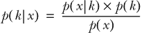

不要被这个吓到！方程中只有四个术语，我将带你逐一了解它们。你已经知道 *p(k|x)* 是在给定数据的情况下，一个案例属于类别 k 的概率。这被称为 *后验概率*。

*p(x|k)* 与此相同，但方向相反：在案例属于类别 k 的情况下，观察这些数据点的概率是什么？换句话说：如果这个案例 *确实* 在类别 k 中，那么它具有这些预测变量值的 *似然性* 是多少？这被称为 *似然性*。

*p(k)* 被称为 *先验概率*，它简单地表示任何案例属于类别 k 的概率。这是数据中属于类别 *k* 的所有案例的比例。例如，如果 30% 的案例属于类别 k，那么 *p(k)* 等于 0.3。

最后，*p(x)* 是在数据集中观察到一个具有这些预测变量值的案例的概率。这被称为 *证据*。估计证据通常非常困难（因为数据集中的每个案例可能都有独特的预测变量值的组合），它只用于确保所有后验概率之和为 1。因此，我们可以从方程中省略证据，并说

##### 方程 5.3。

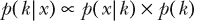

其中 ∝ 符号表示其两侧的值是 *成比例的*，而不是 *相等的*。以更易于理解的方式，

+   *后验* ∝ *似然* × *先验*

案例的先验概率 (*p(k)*) 很容易计算：它是数据集中属于类别 *k* 的案例的比例。但我们如何计算似然 (*p(x|k)*) 呢？似然是通过将数据投影到其 DF 上并估计其 *概率密度* 来计算的。概率密度是观察具有特定判别分数组合的案例的相对概率。

判别分析假设数据是正态分布的，因此它通过将每个类别拟合到每个 DF 上来估计概率密度。每个正态分布的中心是类别质心，其标准差是判别轴上的一个单位。这在 图 5.8 中对单个 DF 和两个 DF 进行了说明（在超过两个维度的情况下也会发生相同的事情，但难以可视化）。你可以看到，沿着判别轴靠近类别质心的案例具有该类的高概率密度，而远离的案例具有较低的概率密度。

##### 图 5.8\. 每个类别的概率密度假设为正态分布，其中每个分布的中心是类别的质心。这在一个 DF（对于类别 k 和 j）以及两个 DF 中显示。

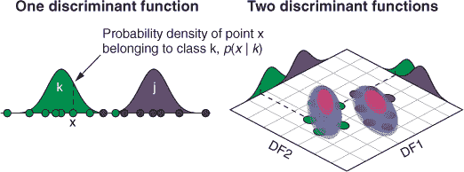

一旦为给定类别的案例估计了概率密度，就可以将其传递到方程中：

+   *后验概率* = *似然率* × *先验概率*

为每个类别估计后验概率，并且具有最高概率的类别就是案例被分类为的类别。


##### 注意

前验概率（该类别的案例比例）很重要，因为如果类别严重不平衡，尽管案例离类别的质心很远，但由于该类别中有许多更多的案例，案例更有可能属于该类别。


贝叶斯定理在统计学和机器学习中非常重要。如果你现在还不完全理解它，请不要担心；这是故意的。我现在想轻轻地介绍它，我们将在第六章（[kindle_split_016.html#ch06](https://kindle_split_016.html#ch06)）中更深入地探讨它。

### 5.2\. 构建你的第一个线性判别分析和二次判别分析模型

现在你已经知道了判别分析是如何工作的，你将构建你的第一个 LDA 模型。如果你还没有做的话，请加载 mlr 和 tidyverse 包：

```
library(mlr)
library(tidyverse)
```

#### 5.2.1\. 加载和探索葡萄酒数据集

在本节中，你将学习如何构建和评估线性判别分析和二次判别分析模型的表现。想象一下，你是一名侦探，正在一个谋杀谜案中。一位当地葡萄酒生产商，罗纳德·费希尔，在一次晚宴上被人用含有砒霜的葡萄酒替换了酒壶中的葡萄酒而被毒害。

三位其他（竞争对手）葡萄酒生产商也在晚宴上，他们是你的主要嫌疑人。如果你能追踪到这些葡萄园之一，你就能找到凶手。幸运的是，你能够访问到来自每个葡萄园的葡萄酒的一些之前的化学分析，并且你要求对犯罪现场中的有毒酒壶进行分析。你的任务是构建一个模型，告诉你含有砒霜的葡萄酒来自哪个葡萄园，因此找出罪犯。

让我们加载 HDclassif 包中内置的葡萄酒数据，将其转换为 tibble，并对其进行一些探索。我们有一个包含 178 个案例和 14 个变量（对各种葡萄酒瓶进行的测量）的 tibble。

##### 列表 5.1\. 加载和探索葡萄酒数据集

```
install.packages("HDclassif")

data(wine, package = "HDclassif")

wineTib <- as_tibble(wine)
wineTib

# A tibble: 178 x 14
   class    V1    V2    V3    V4    V5    V6    V7    V8    V9
   <int> <dbl> <dbl> <dbl> <dbl> <int> <dbl> <dbl> <dbl> <dbl>
 1     1  14.2  1.71  2.43  15.6   127  2.8   3.06 0.28   2.29
 2     1  13.2  1.78  2.14  11.2   100  2.65  2.76 0.26   1.28
 3     1  13.2  2.36  2.67  18.6   101  2.8   3.24 0.3    2.81
 4     1  14.4  1.95  2.5   16.8   113  3.85  3.49 0.24   2.18
 5     1  13.2  2.59  2.87  21     118  2.8   2.69 0.39   1.82
 6     1  14.2  1.76  2.45  15.2   112  3.27  3.39 0.34   1.97
 7     1  14.4  1.87  2.45  14.6    96  2.5   2.52 0.3    1.98
 8     1  14.1  2.15  2.61  17.6   121  2.6   2.51 0.31   1.25
 9     1  14.8  1.64  2.17  14      97  2.8   2.98 0.290  1.98
10     1  13.9  1.35  2.27  16      98  2.98  3.15 0.22   1.85
# ... with 168 more rows, and 4 more variables: V10 <dbl>,
#   V11 <dbl>, V12 <dbl>, V13 <int>
```

通常，作为数据科学家，我们接收到的数据可能是杂乱无章的或者整理得不够好。在这种情况下，变量的名称缺失！我们可以继续使用 `V1`、`V2` 等等，但很难追踪哪个变量是哪个。因此，我们将手动添加变量名称。谁说数据科学家的生活是光鲜亮丽的？然后，我们将 `class` 变量转换为因子。

##### 列表 5.2\. 清洗数据集

```
names(wineTib) <- c("Class", "Alco", "Malic", "Ash", "Alk", "Mag",
                    "Phe", "Flav", "Non_flav", "Proan", "Col", "Hue",
                    "OD", "Prol")

wineTib$Class <- as.factor(wineTib$Class)

wineTib

# A tibble: 178 x 14
   Class  Alco Malic   Ash   Alk   Mag   Phe  Flav Non_flav Proan
   <fct> <dbl> <dbl> <dbl> <dbl> <int> <dbl> <dbl>    <dbl> <dbl>
 1 1      14.2  1.71  2.43  15.6   127  2.8   3.06    0.28   2.29
 2 1      13.2  1.78  2.14  11.2   100  2.65  2.76    0.26   1.28
 3 1      13.2  2.36  2.67  18.6   101  2.8   3.24    0.3    2.81
 4 1      14.4  1.95  2.5   16.8   113  3.85  3.49    0.24   2.18
 5 1      13.2  2.59  2.87  21     118  2.8   2.69    0.39   1.82
 6 1      14.2  1.76  2.45  15.2   112  3.27  3.39    0.34   1.97
 7 1      14.4  1.87  2.45  14.6    96  2.5   2.52    0.3    1.98
 8 1      14.1  2.15  2.61  17.6   121  2.6   2.51    0.31   1.25
 9 1      14.8  1.64  2.17  14      97  2.8   2.98    0.290  1.98
10 1      13.9  1.35  2.27  16      98  2.98  3.15    0.22   1.85
# ... with 168 more rows, and 4 more variables: Col <dbl>,
#   Hue <dbl>, OD <dbl>, Prol <int>
```

这好多了。我们可以看到，我们对 178 瓶葡萄酒进行了 13 次连续测量，其中每次测量都是葡萄酒中不同化合物/元素的含量。我们还有一个单个的分类变量 `Class`，它告诉我们这瓶酒来自哪个葡萄园。


##### 注意

许多人认为保持变量名小写是一种好的做法。只要我的风格一致，我就不太介意。因此，请注意，我将分组变量 `class` 的名称更改为 `Class`。


#### 5.2.2\. 绘制数据

让我们绘制数据，以了解化合物在葡萄园之间的变化情况。至于 第四章 中的 *Titanic* 数据集，我们将数据收集到一个杂乱格式中，这样我们就可以按每个变量进行分面。

##### 列表 5.3\. 创建用于绘图的杂乱 tibble

```
wineUntidy <- gather(wineTib, "Variable", "Value", -Class)

ggplot(wineUntidy, aes(Class, Value)) +
  facet_wrap(~ Variable, scales = "free_y") +
  geom_boxplot() +
  theme_bw()
```

结果图示在 图 5.9 中。

##### 图 5.9\. 数据中每个连续变量与葡萄园编号的箱线图。对于箱线图，粗横线代表中位数，箱子代表四分位距（IQR），胡须代表 Tukey 范围（四分位数以上和以下 1.5 倍的 IQR），点代表 Tukey 范围之外的数据。

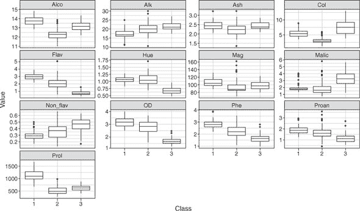

一个数据科学家（以及正在处理这个案件的大侦探）看到这些数据会非常高兴！看看来自三个不同葡萄园的葡萄酒之间有多少明显的差异。由于类别非常可分，我们应该能够轻松构建一个表现良好的分类模型。

#### 5.2.3\. 训练模型

让我们定义我们的任务和学习者，并像往常一样构建一个模型。这次，我们将 `"classif.lda"` 作为 `makeLearner()` 函数的参数，以指定我们将使用 LDA。


##### 小贴士

LDA 和 QDA 没有需要调整的超参数，因此它们被称为具有 *闭式解*。换句话说，LDA 和 QDA 所需要的信息都在数据中。它们的性能也不受不同尺度变量的影响。无论数据是否缩放，它们都会给出相同的结果！


##### 列表 5.4\. 创建任务和学习者，并训练模型

```
wineTask <- makeClassifTask(data = wineTib, target = "Class")

lda <- makeLearner("classif.lda")

ldaModel <- train(lda, wineTask)
```


##### 注意

回想一下 第三章，`makeClassifTask()` 函数会警告我们的数据是 tibble 而不是纯 `data.frame`。这个警告可以安全地忽略。


让我们使用 `getLearnerModel()` 函数提取模型信息，并使用 `predict()` 函数获取每个案例的 DF 值。通过打印 `head(ldaPreds)`，我们可以看到模型已经学习了两个 DF，`LD1` 和 `LD2`，并且 `predict()` 函数确实为我们的 `wineTib` 数据集中的每个案例返回了这些函数的值。

##### 列表 5.5\. 提取每个案例的 DF 值

```
ldaModelData <- getLearnerModel(ldaModel)

ldaPreds <- predict(ldaModelData)$x

head(ldaPreds)
        LD1       LD2
1 -4.700244 1.9791383
2 -4.301958 1.1704129
3 -3.420720 1.4291014
4 -4.205754 4.0028715
5 -1.509982 0.4512239
6 -4.518689 3.2131376
```

为了可视化这两个学习到的 DF 如何将来自三个葡萄园的酒瓶分开，让我们将它们相互绘制。我们首先将 `wineTib` 数据集通过一个 `mutate()` 调用，为每个 DF 创建一个新列。然后，我们将这个变异的 tibble 通过一个 `ggplot()` 调用，并将 `LD1`、`LD2` 和 `Class` 分别设置为 x、y 和颜色美学。最后，我们添加一个 `geom_point()` 层来添加点，并添加一个 `stat_ellipse()` 层来在每个类别周围绘制 95% 置信椭圆。

##### 列表 5.6\. 将 DF 值相互绘制

```
wineTib %>%
  mutate(LD1 = ldaPreds[, 1],
         LD2 = ldaPreds[, 2]) %>%
  ggplot(aes(LD1, LD2, col = Class)) +
  geom_point() +
  stat_ellipse() +
  theme_bw()
```

结果图示在 图 5.10 中。

##### 图 5.10\. 将 DF 相互绘制。每个案例的 `LD1` 和 `LD2` 值相互绘制，并按其类别着色。

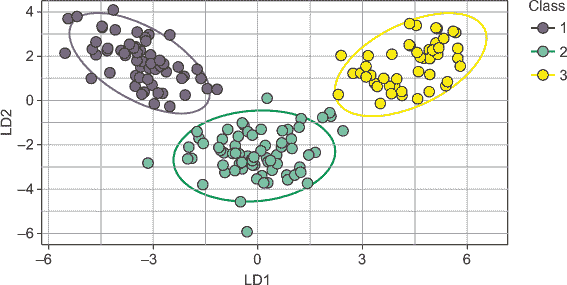

看起来不错。你能看到 LDA 将我们的 13 个预测变量减少到仅仅两个 DF，这两个 DF 在将葡萄酒与每个葡萄园分开方面做得非常出色吗？

接下来，让我们使用完全相同的程序来构建一个 QDA 模型。

##### 列表 5.7\. 将 DF 值相互绘制

```
qda <- makeLearner("classif.qda")

qdaModel <- train(qda, wineTask)
```

| |
| --- |

##### 注释

很遗憾，从 mlr 实现的 QDA 中提取 DF 并绘制它们，就像我们对 LDA 所做的那样，并不容易。

| |
| --- |

现在，让我们将我们的 LDA 和 QDA 模型一起进行交叉验证，以估计它们在新数据上的表现。

##### 列表 5.8\. 交叉验证 LDA 和 QDA 模型

```
kFold <- makeResampleDesc(method = "RepCV", folds = 10, reps = 50,
                          stratify = TRUE)

ldaCV <- resample(learner = lda, task = wineTask, resampling = kFold,
                  measures = list(mmce, acc))

qdaCV <- resample(learner = qda, task = wineTask, resampling = kFold,
                  measures = list(mmce, acc))

ldaCV$aggr
mmce.test.mean  acc.test.mean
    0.01177012     0.98822988

qdaCV$aggr
mmce.test.mean  acc.test.mean
   0.007977296    0.992022704
```

太好了！我们的 LDA 模型平均正确分类了 98.8% 的酒瓶。这里几乎没有改进的余地，但我们的 QDA 模型设法正确分类了 99.2% 的案例！让我们也看看混淆矩阵（解释它们是本章练习的一部分）：

```
calculateConfusionMatrix(ldaCV$pred, relative = TRUE)

Relative confusion matrix (normalized by row/column):
        predicted
true     1           2           3           -err.-
  1      1e+00/1e+00 3e-04/3e-04 0e+00/0e+00 3e-04
  2      8e-03/1e-02 1e+00/1e+00 1e-02/2e-02 2e-02
  3      0e+00/0e+00 1e-02/7e-03 1e+00/1e+00 1e-02
  -err.-       0.010       0.007       0.021 0.01

Absolute confusion matrix:
        predicted
true        1    2    3 -err.-
  1      2949    1    0      1
  2        29 3470   51     80
  3         0   23 2377     23
  -err.-   29   24   51    104

calculateConfusionMatrix(qdaCV$pred, relative = TRUE)

Relative confusion matrix (normalized by row/column):
        predicted
true     1           2           3           -err.-
  1      0.993/0.984 0.007/0.006 0.000/0.000 0.007
  2      0.014/0.016 0.986/0.991 0.000/0.000 0.014
  3      0.000/0.000 0.005/0.003 0.995/1.000 0.005
  -err.-       0.016       0.009       0.000 0.009

Absolute confusion matrix:
        predicted
true        1    2    3 -err.-
  1      2930   20    0     20
  2        49 3501    0     49
  3         0   12 2388     12
  -err.-   49   32    0     81
```

现在，侦探，毒酒化学分析的结果出来了。让我们使用我们的 QDA 模型来预测它来自哪个葡萄园：

```
poisoned <- tibble(Alco = 13, Malic = 2, Ash = 2.2, Alk = 19, Mag = 100,
                   Phe = 2.3, Flav = 2.5, Non_flav = 0.35, Proan = 1.7,
                   Col = 4, Hue = 1.1, OD = 3, Prol = 750)

predict(qdaModel, newdata = poisoned)

Prediction: 1 observations
predict.type: response
threshold:
time: 0.00
  response
1        1
```

模型预测毒害的瓶子来自葡萄园 1。是时候去逮捕了！

| |
| --- |

**罗纳德·费舍尔**

你可能会很高兴地知道，在现实世界中，罗纳德·费舍尔并没有在晚宴上中毒。这可能对你来说是个幸运的事，因为罗纳德·费舍尔爵士（1890-1962）是一位著名的生物统计学家，后来被称为统计学的奠基人。费舍尔开发了今天我们使用的许多统计工具和概念，包括判别分析。事实上，线性判别分析通常与 *费舍尔的判别分析* 混淆，这是费舍尔开发的判别分析的原型（但略有不同）。

然而，费舍尔也是优生学的支持者，认为某些种族比其他种族优越。事实上，他在 1952 年的联合国教科文组织声明“种族问题”中分享了他的观点，他说“人类群体在先天的智力和情感发展能力上存在深刻差异” ([`unesdoc.unesco.org/ark:/48223/pf0000073351`](https://unesdoc.unesco.org/ark:/48223/pf0000073351))。也许现在你不再为我们的谋杀之谜受害者感到那么遗憾了。

| |
| --- |

### 5.3. LDA 和 QDA 的优点和缺点

虽然通常不容易判断哪种算法会对给定的任务表现良好，但以下是一些优点和缺点，这将帮助您决定 LDA 和 QDA 是否适合您。

LDA 和 QDA 算法的优点如下：

+   它们可以将高维特征空间减少到更易于管理的数量。

+   它们可以用作分类或作为其他可能在该数据集上表现更好的分类算法的预处理（降维）技术。

+   QDA 可以学习类之间的曲线决策边界（LDA 不是这种情况）。

LDA 和 QDA 算法的缺点如下：

+   它们只能处理连续预测因子（尽管在某些情况下将分类变量重新编码为数值可能有所帮助）。

+   它们假设数据在预测因子上是正态分布的。如果数据不是，性能将受到影响。

+   LDA 只能学习类之间的线性决策边界（QDA 不是这种情况）。

+   LDA 假设类的协方差相等，如果这种情况不成立（对于 QDA 来说情况就是这样），性能将受到影响。

+   QDA 比 LDA 更灵活，因此更容易过拟合。

| |
| --- |

**练习 1**

解释上一节中显示的混淆矩阵。

1.  哪个模型在识别 3 号葡萄园的酒方面更好？

1.  我们的 LDA 模型是否将更多来自 2 号葡萄园的酒误分类为来自 1 号或 3 号葡萄园？

| |
| --- |
| |

**练习 2**

从我们的 LDA 模型中提取判别得分，并仅使用这些作为 kNN 模型的预测因子（包括调整*k*）。尝试您自己的交叉验证策略。如果您需要复习如何训练 kNN 模型，请回顾第三章。

| |
| --- |

### 摘要

+   判别分析是一种监督学习算法，它将数据投影到低维表示以创建判别函数。

+   判别函数是原始（连续）变量的线性组合，它们最大化类质心的分离，同时最小化每个类沿其的方差。

+   判别分析有多种形式，其中最基本的是 LDA 和 QDA。

+   LDA 学习类之间的线性决策边界，并假设类是正态分布的，并且具有相等的协方差。

+   QDA 可以学习类之间的曲线决策边界，并假设每个类都是正态分布的，但**不**假设协方差相等。

+   判别函数的数量是类数减 1 和预测变量数中的较小者。

+   类预测使用贝叶斯规则来估计案例属于每个类的后验概率。

### 练习解答

1.  解释混淆矩阵：

    1.  我们的 QDA 模型在识别 3 号葡萄园的酒方面表现更好。它将 12 号酒误分类为 2 号葡萄园，而 LDA 模型将 23 号酒误分类。

    1.  我们的 LDA 模型将来自葡萄园 2 的案例误分类为来自葡萄园 3 的案例，多于来自葡萄园 1 的案例。

1.  将 LDA 的判别分数用作 kNN 模型的预测变量：

    ```
    # CREATE TASK ----
    wineDiscr <- wineTib %>%
      mutate(LD1 = ldaPreds[, 1], LD2 = ldaPreds[, 2]) %>%
      select(Class, LD1, LD2)

    wineDiscrTask <- makeClassifTask(data = wineDiscr, target = "Class")

    # TUNE K ----
    knnParamSpace <- makeParamSet(makeDiscreteParam("k", values = 1:10))
    gridSearch <- makeTuneControlGrid()
    cvForTuning <- makeResampleDesc("RepCV", folds = 10, reps = 20)
    tunedK <- tuneParams("classif.knn", task = wineDiscrTask,
                         resampling = cvForTuning,
                         par.set = knnParamSpace,
                         control = gridSearch)

    knnTuningData <- generateHyperParsEffectData(tunedK)
    plotHyperParsEffect(knnTuningData, x = "k", y = "mmce.test.mean",
                        plot.type = "line") +
        theme_bw()
    # CROSS-VALIDATE MODEL-BUILDING PROCESS ----
    inner <- makeResampleDesc("CV")
    outer <- makeResampleDesc("CV", iters = 10)
    knnWrapper <- makeTuneWrapper("classif.knn", resampling = inner,
                                  par.set = knnParamSpace,
                                  control = gridSearch)

    cvWithTuning <- resample(knnWrapper, wineDiscrTask, resampling = outer)
    cvWithTuning

    # TRAINING FINAL MODEL WITH TUNED K ----
    tunedKnn <- setHyperPars(makeLearner("classif.knn"), par.vals = tunedK$x)

    tunedKnnModel <- train(tunedKnn, wineDiscrTask)
    ```

## 第六章\. 使用朴素贝叶斯和支持向量机进行分类

*本章涵盖*

+   使用朴素贝叶斯算法工作

+   理解支持向量机算法

+   使用随机搜索同时调整许多超参数

朴素贝叶斯和支持向量机（SVM）算法是用于分类的监督学习算法。每个算法以不同的方式学习。朴素贝叶斯算法使用*贝叶斯定理*，这是你在第五章中学到的，来估计新数据属于数据集中某一类别的概率。然后，将案例分配给概率最高的类别。SVM 算法寻找一个*超平面*（一个维度比预测变量少的表面），将类别分开。这个超平面的位置和方向取决于*支持向量*：位于类别边界最近的案例。

| |
| --- |

##### 注意

虽然 SVM 算法常用于分类，但它也可以用于回归问题。这里不会讨论这一点，但如果您感兴趣（并希望更深入地探索 SVM），请参阅 Andreas Christmann 和 Ingo Steinwart 所著的《支持向量机》（Springer，2008 年）。

| |
| --- |

朴素贝叶斯和 SVM 算法具有不同的特性，使它们在不同的环境下都适用。例如，朴素贝叶斯可以原生地混合连续和分类预测变量，而 SVM 则需要首先将分类变量重新编码为数值格式。另一方面，SVM 在寻找非线性可分类别的决策边界方面表现出色，通过向数据添加一个新维度来揭示线性边界。朴素贝叶斯算法很少会优于在相同问题上训练的 SVM，但朴素贝叶斯在诸如垃圾邮件检测和文本分类等问题上往往表现良好。

使用朴素贝叶斯训练的模型也具有概率解释。对于模型做出预测的每个案例，模型会输出该案例属于某一类别而非另一类别的概率，这为我们提供了预测确定性的度量。这在我们需要进一步审查概率接近 50%的案例的情况下很有用。相反，使用 SVM 算法训练的模型通常不会输出易于解释的概率，但具有几何解释。换句话说，它们将特征空间划分为几个部分，并根据案例所属的部分进行分类。与朴素贝叶斯模型相比，SVM 模型在训练时计算成本更高，因此如果朴素贝叶斯模型在您的问题上表现良好，可能没有必要选择一个训练成本更高的模型。

到本章结束时，你将了解朴素贝叶斯和 SVM 算法是如何工作的，以及如何将它们应用于你的数据。你还将学会如何同时调整多个超参数，因为 SVM 算法有很多这样的超参数。你还将理解如何应用更实用的方法，即使用 *随机搜索*——而不是我们在第三章中应用的网格搜索——来找到表现最佳的超参数组合。

### 6.1. 什么是朴素贝叶斯算法？

在上一章中，我向你介绍了贝叶斯定理（以数学家托马斯·贝叶斯的名字命名）。我展示了判别分析算法如何使用贝叶斯定理，根据其判别函数值预测案例属于每个类别的概率。朴素贝叶斯算法以完全相同的方式工作，除了它不像判别分析那样执行降维，并且它可以处理分类变量，以及连续变量。在本节中，我希望通过几个例子传达对贝叶斯定理如何工作的更深入理解。

想象一下，0.2%的人口患有独角兽病（症状包括对闪光的痴迷和强迫性的彩虹绘画）。独角兽病的测试具有 90%的真阳性率（如果你有这种病，测试 90%的时间会检测到它）。当进行测试时，整个人口的 5%从测试中获得阳性结果。基于这些信息，如果你从测试中获得阳性结果，你患有独角兽病的概率是多少？

许多人本能地会说 90%，但这没有考虑到疾病的普遍性和阳性测试的比例（这也包括假阳性）。那么，我们如何估计在阳性测试结果下患病的概率呢？嗯，我们使用贝叶斯定理。让我们提醒一下贝叶斯定理是什么：


其中

+   *p*(*k*|*x*) 是在阳性测试结果(*x*)下患有疾病(*k*)的概率。这被称为 *后验概率*。

+   *p*(*x*|*k*) 是如果你确实患有疾病，获得阳性测试结果的概率。这被称为 *似然*。

+   *p*(*k*) 是不考虑任何测试的患病概率。这是人群中患病者的比例，被称为 *先验概率*。

+   *p*(*x*) 是获得阳性测试结果（包括真阳性假阳性）的概率。这被称为 *证据*。

我们可以用普通英语重写：


因此，我们的似然（如果我们确实有独角兽病，获得阳性测试结果的可能性）是 90%，或者以小数表示为 0.9。我们的先验概率（独角兽病患者的比例）是 0.2%，或者以小数表示为 0.002。最后，我们的证据（获得阳性测试结果的可能性）是 5%，或者以小数表示为 0.05。您可以在图 6.1 中看到所有这些值的说明。现在我们只需将这些值代入贝叶斯定理：


呼吁！在考虑疾病的流行率和测试结果为阳性的比例（包括假阳性）后，阳性测试结果意味着我们实际上患有该病的可能性只有 3.6%——比 90%好得多！这是贝叶斯定理的力量：它允许你结合先验信息，以获得对*条件概率*（给定数据的概率）的更准确估计。

##### 图 6.1\. 使用贝叶斯定理计算在测试结果为阳性时拥有独角兽病的后验概率。先验是患有或未患病的比例。似然是每种疾病状态下获得阳性或阴性测试结果的可能性。证据是获得阳性测试结果（真阳性加上假阳性）的概率。


#### 6.1.1\. 使用朴素贝叶斯进行分类

让我们再举一个更侧重于机器学习的例子。想象一下，你有一个来自社交媒体平台 Twitter 的推文数据库，你想建立一个模型，自动将每条推文分类到某个主题。这些主题是

+   政治

+   体育

+   电影

+   其他

你创建了四个分类预测变量：

+   是否包含单词*opinion*

+   是否包含单词*score*

+   是否包含单词*game*

+   是否包含单词*cinema*

| |
| --- |

##### 注意

我在这个例子中保持内容简单。如果我们真的试图建立一个模型来预测推文主题，我们需要包括比这更多的单词！

| |
| --- |

对于我们的四个主题中的每一个，我们可以将一个案例属于该主题的概率表示为


现在我们有多个预测变量，*p*(words|topic)是在该主题下推文具有该确切单词组合的似然性。我们通过找到每个预测变量值的似然性，假设推文属于该主题，并将它们相乘来估计这个值。这看起来是这样的：


例如，如果一个推文包含单词*opinion*、*score*和*game*，但不包含*cinema*，那么对于任何特定主题，似然性如下：


现在，如果一个推文包含某个特定主题中的某个词，那么这个推文在该主题中的似然率就是包含该词的推文在该主题中的比例。将每个预测变量的似然率相乘，我们得到观察这个*组合*（这些词的组合）的似然率，前提是它属于特定的类别。

这就是为什么朴素贝叶斯被称为“朴素”。通过单独估计每个预测变量的似然率，然后相乘，我们做出了一个非常强的假设，即预测变量是*独立的*。换句话说，我们假设一个变量的值与另一个变量的值没有关系。在大多数情况下，这个假设是不成立的。例如，如果一个推文包含单词*score*，那么它可能也更可能包含单词*game*。

尽管这种朴素假设经常是错误的，但朴素贝叶斯即使在存在非独立预测变量的情况下也往往表现良好。话虽如此，高度相关的预测变量将影响性能。

因此，似然率和先验概率的计算相对简单，是算法学习到的参数；但关于证据（*p*(words)）呢？在实践中，由于预测变量的值通常对数据中的每个案例都是相对独特的，计算证据（观察该值组合的概率）是非常困难的。由于证据实际上只是一个归一化常数，使得所有后验概率之和为 1，我们可以忽略它，只需将似然率和先验概率相乘即可：

+   *后验概率* ∝ *似然率* × *先验概率*

注意，我使用∝而不是等号=，表示“成比例于”，因为没有证据来归一化方程，后验概率就不再等于似然率乘以先验概率。尽管如此，这是可以接受的，因为成比例性足以找到最可能的类别。现在，对于每条推文，我们计算每个主题的相对后验概率：

| *p*(*politics* | *words*) ∝ *p*(*words* | *politics*) × *p*(*politics*) |
| --- | --- | --- |
| *p*(*sports* | *words*) ∝ *p*(*words* | *sports*) × *p*(*sports*) |
| *p*(*movies* | *words*) ∝ *p*(*words* | *movies*) × *p*(*movies*) |
| *p*(*other* | *words*) ∝ *p*(*words* | *other*) × *p*(*other*) |

然后，我们将推文分配给相对后验概率最高的主题。

#### 6.1.2\. 计算分类和连续预测变量的似然率

当我们有一个分类预测变量（例如，一个单词是否存在）时，朴素贝叶斯使用该特定类别中训练案例的该预测变量的比例。当我们有一个连续变量时，朴素贝叶斯（通常）假设每个组内的数据是正态分布的。然后，根据这个拟合的正态分布，每个案例的概率密度被用来估计在该类别中观察到该预测变量值的可能性。这样，接近特定类别正态分布均值的案例将具有该类别的高概率密度，而远离均值的案例将具有低概率密度。这与你在第五章中看到的判别分析在图 5.7 中计算似然性的方式相同。

当你的数据包含分类和连续预测变量的混合时，因为朴素贝叶斯假设数据值之间是独立的，它将简单地使用适当的方法来估计似然性，这取决于每个预测变量是分类的还是连续的。

### 6.2. 构建您的第一个朴素贝叶斯模型

在本节中，我将向您介绍如何构建和评估一个朴素贝叶斯模型以预测政党归属。想象一下，你是一位政治学家。你正在寻找 20 世纪 80 年代中期的共同投票模式，以预测美国国会议员是民主党人还是共和党人。您拥有 1984 年众议院每位成员的投票记录，并确定了 16 个您认为最能将两个政党区分开的投票。您的任务是训练一个朴素贝叶斯模型，根据议员一整年的投票情况来预测他们是否是民主党人或共和党人。让我们先加载 mlr 和 tidyverse 包：

```
library(mlr)
library(tidyverse)
```

#### 6.2.1. 加载和探索 HouseVotes84 数据集

现在，让我们加载数据，该数据内置在 mlbench 包中，将其转换为 tibble（使用`as_tibble()`），并对其进行探索。

| |
| --- |

##### 注意

记住，tibble 只是 tidyverse 版本的数据框，它有助于使我们的生活更加轻松。

| |
| --- |

我们有一个包含 1984 年众议院 435 名成员的 17 个变量的 tibble。`Class`变量是一个因子，表示政党成员资格，其他 16 个变量是因子，表示个人在每个 16 个投票上的投票情况。`y`值表示他们投了赞成票，`n`值表示他们投了反对票，而缺失值（`NA`）表示个人弃权或未投票。我们的目标是训练一个模型，该模型可以使用这些变量中的信息，根据议员如何投票来预测他们是否是民主党人或共和党人。

##### 列表 6.1. 加载和探索`HouseVotes84`数据集

```
data(HouseVotes84, package = "mlbench")

votesTib <- as_tibble(HouseVotes84)

votesTib

# A tibble: 435 x 17
   Class V1    V2    V3    V4    V5    V6    V7    V8    V9    V10
   <fct> <fct> <fct> <fct> <fct> <fct> <fct> <fct> <fct> <fct> <fct>
 1 repu... n     y     n     y     y     y     n     n     n     y
 2 repu... n     y     n     y     y     y     n     n     n     n
 3 demo... NA    y     y     NA    y     y     n     n     n     n
 4 demo... n     y     y     n     NA    y     n     n     n     n
 5 demo... y     y     y     n     y     y     n     n     n     n
 6 demo... n     y     y     n     y     y     n     n     n     n
 7 demo... n     y     n     y     y     y     n     n     n     n
 8 repu... n     y     n     y     y     y     n     n     n     n
 9 repu... n     y     n     y     y     y     n     n     n     n
10 demo... y     y     y     n     n     n     y     y     y     n
# ... with 425 more rows, and 6 more variables: V11 <fct>, V12 <fct>,
#   V13 <fct>, V14 <fct>, V15 <fct>, V16 <fct>
```

| |
| --- |

##### 注意

通常我会手动给未命名的列命名，以便更清楚地知道我在处理什么。在这个例子中，变量名称是投票的名称，有点繁琐，所以我们将坚持使用 V1、V2 等等。如果你想查看每个投票是针对什么问题，请运行 `?mlbench::HouseVotes84`。

| |
| --- |

看起来我们的 tibble 中有一些缺失值（`NA`）。让我们使用 `map_dbl()` 函数总结每个变量中缺失值的数量。回想一下 第二章，`map_dbl()` 会遍历向量/列表（或在这种情况下，tibble 的每一列）中的每个元素，对该元素应用一个函数，并返回包含函数输出的向量。

`map_dbl()` 函数的第一个参数是要应用函数的数据名称，第二个参数是我们想要应用的函数。我选择使用匿名函数（使用 `~` 符号作为 `function(.)` 的简写）。

| |
| --- |

##### 注意

回想一下 第二章，一个 *匿名* 函数是我们即时定义的函数，而不是预先定义一个函数并将其分配给一个对象。

| |
| --- |

我们的功能将每个向量传递给 `sum(is.na(.))` 来计算该向量中缺失值的数量。这个函数应用于 tibble 的每一列，并返回每一列的缺失值数量。

##### 列表 6.2\. 使用 `map_dbl()` 函数显示缺失值

```
map_dbl(votesTib, ~sum(is.na(.)))

Class    V1    V2    V3    V4    V5    V6    V7    V8    V9   V10
    0    12    48    11    11    15    11    14    15    22     7
  V11   V12   V13   V14   V15   V16
   21    31    25    17    28   104
```

除了 `Class` 变量外，我们 tibble 中的每一列都有缺失值！幸运的是，朴素贝叶斯算法可以以两种方式处理缺失数据：

+   通过省略特定情况下的缺失值变量，但仍然使用该情况来训练模型

+   通过完全从训练集中省略该情况

默认情况下，mlr 使用的朴素贝叶斯实现是保留案例并删除变量。如果大多数案例中缺失值与完整值的比例相当小，这通常工作得很好。然而，如果你有少量变量并且缺失值的比例很大，你可能希望省略这些案例（并且更广泛地考虑你的数据集是否足够用于训练）。

| |
| --- |

**练习 1**

使用我们在 列表 6.2 中使用的 `map_dbl()` 函数来统计 `votesTib` 每一列中 `y` 值的数量。提示：使用 `which(. == "y")` 来返回每一列中等于 `y` 的行。

| |
| --- |

#### 6.2.2\. 绘制数据

让我们绘制我们的数据，以更好地理解政治党和投票之间的关系。再一次，我们将使用我们的技巧将数据收集到一个不整洁的格式中，这样我们就可以在预测变量上分面。因为我们正在绘制相互之间的分类变量，我们将 `geom_bar()` 函数的 `position` 参数设置为 `"fill"`，这为 `y`、`n` 和 `NA` 响应创建了堆叠条形图，它们的总和为 1。

##### 列表 6.3\. 绘制 `HouseVotes84` 数据集

```
votesUntidy <- gather(votesTib, "Variable", "Value", -Class)

ggplot(votesUntidy, aes(Class, fill = Value)) +
  facet_wrap(~ Variable, scales = "free_y") +
  geom_bar(position = "fill") +
  theme_bw()
```

结果图显示在 图 6.2。我们可以看到，民主党和共和党之间存在着一些非常明显的意见差异！

##### 图 6.2\. 填充条形图显示了在 16 次不同投票中民主党人和共和党人投票支持 (`y`)、反对 (`n`) 或弃权 (`NA`) 的比例。


#### 6.2.3\. 训练模型

现在，让我们创建我们的任务和学习者，并构建我们的模型。我们将 `Class` 变量设置为 `makeClassifTask()` 函数的分类目标，并将我们提供给 `makeLearner()` 函数的算法设置为 `"classif.naiveBayes"`。

##### 列表 6.4\. 创建任务和学习者，并训练模型

```
votesTask <- makeClassifTask(data = votesTib, target = "Class")

bayes <- makeLearner("classif.naiveBayes")

bayesModel <- train(bayes, votesTask)
```

模型训练完成后没有错误，因为朴素贝叶斯可以处理缺失数据。

接下来，我们将使用重复 50 次的 10 折交叉验证来评估我们的模型构建过程的性能。同样，因为这是一个双类分类问题，我们可以访问假阳性率和假阴性率，所以我们也在 `resample()` 函数的 `measures` 参数中请求这些。

##### 列表 6.5\. 交叉验证朴素贝叶斯模型

```
kFold <- makeResampleDesc(method = "RepCV", folds = 10, reps = 50,
                          stratify = TRUE)

bayesCV <- resample(learner = bayes, task = votesTask,
                    resampling = kFold,
                    measures = list(mmce, acc, fpr, fnr))

bayesCV$aggr

mmce.test.mean  acc.test.mean  fpr.test.mean  fnr.test.mean
    0.09820658     0.90179342     0.08223529     0.10819658
```

在我们的交叉验证中，我们的模型正确预测了 90% 的测试集案例。这还不错！现在让我们使用我们的模型来预测新政治家的政党，基于他们的投票。

##### 列表 6.6\. 使用模型进行预测

```
politician <- tibble(V1 = "n", V2 = "n", V3 = "y", V4 = "n", V5 = "n",
                     V6 = "y", V7 = "y", V8 = "y", V9 = "y", V10 = "y",
                     V11 = "n", V12 = "y", V13 = "n", V14 = "n",
                     V15 = "y", V16 = "n")

politicianPred <- predict(bayesModel, newdata = politician)

getPredictionResponse(politicianPred)

[1] democrat
Levels: democrat republican
[source]
```

我们的模型预测这位新政治家是民主党人。


**练习 2**

将您的朴素贝叶斯模型包裹在 `getLearnerModel()` 函数中。您能识别出每个投票的先验概率和似然吗？


### 6.3\. 朴素贝叶斯的优缺点

虽然通常很难判断哪些算法会对给定的任务表现良好，但以下是一些优势和劣势，这将帮助您决定朴素贝叶斯是否会对您的任务表现良好。

朴素贝叶斯的优点如下：

+   它可以处理连续和分类预测变量。

+   训练它计算上并不昂贵。

+   它通常在基于包含的单词对文档进行分类的主题分类问题上表现良好。

+   它没有需要调整的超参数。

+   它是概率性的，并输出新数据属于每个类别的概率。

+   它可以处理缺失数据的情况。

朴素贝叶斯的劣势如下：

+   它假设连续预测变量是正态分布的（通常是），如果它们不是，性能将受到影响。

+   它假设预测变量之间相互独立，这通常并不真实。如果这个假设被严重违反，性能将受到影响。

### 6.4\. 什么是支持向量机 (SVM) 算法？

在本节中，你将了解 SVM 算法的工作原理以及它如何为数据添加一个额外的维度，使其类别线性可分。想象一下，你想要预测你的老板是否会心情愉快（这是一个非常重要的机器学习应用）。在接下来的几周里，你记录了你在办公桌前玩游戏的小时数以及你每天为公司赚多少钱。你还记录了第二天老板的心情，是好的还是坏的（他们非常二元）。你决定使用 SVM 算法构建一个分类器，帮助你决定是否需要在某一天避免见到你的老板。SVM 算法将学习一个线性超平面，将老板心情好的日子与心情不好的日子分开。SVM 算法还能够为数据添加一个额外的维度，以找到最佳的超平面。

#### 6.4.1\. 线性可分数据的 SVM

看一下 图 6.3 中显示的数据。这些图显示了基于你工作努力程度和为公司赚多少钱，你记录的老板心情数据。

SVM 算法找到一个最优的线性超平面，将类别分开。超平面是一个比数据集中的变量少一个维度的表面。对于二维特征空间，例如 图 6.3 中的例子，超平面就是一个简单的直线。对于三维特征空间，超平面是一个表面。在四维或更高维度的特征空间中，超平面很难想象，但原理是相同的：它们是穿过特征空间的表面。

##### 图 6.3\. SVM 算法找到一个通过特征空间的超平面（实线）。一个最优的超平面是最大化其周围边界的超平面（虚线）。边界是一个围绕超平面的区域，接触到的案例最少。支持向量用双圆圈表示。


对于类别完全线性可分的问题，可能存在许多不同的超平面，它们在训练数据中分离类别的效果一样好。为了找到一个最优的超平面（希望它能更好地泛化到未见过的数据），算法找到最大化其周围 *边界* 的超平面。边界是围绕超平面的一个距离，接触到的训练案例最少。接触边界的案例被称为 *支持向量*，因为它们支撑着超平面的位置（因此，算法的名称）。

支持向量是训练集中最重要的案例，因为它们定义了类之间的边界。不仅如此，算法学习的超平面完全依赖于支持向量的位置，而训练集中的其他案例则不然。看看图 6.4。如果我们移动其中一个支持向量的位置，那么超平面的位置也会移动。然而，如果我们移动一个非支持向量案例，对超平面没有任何影响！

##### 图 6.4。超平面的位置完全取决于支持向量的位置。移动一个支持向量会将超平面从其原始位置（虚线）移动到新的位置（顶部两个图）。移动一个非支持向量对超平面没有任何影响（底部两个图）。


SVMs 目前非常受欢迎。这主要基于三个原因：

+   它们擅长找到分离非线性可分类的方法。

+   它们在各种任务中表现良好。

+   我们现在有了足够的计算能力来处理更大、更复杂的数据集。

最后一点很重要，因为它突显了 SVMs 的一个潜在缺点：它们在训练时往往比许多其他分类算法更耗费计算资源。因此，如果你有一个非常大的数据集，且计算能力有限，尝试更便宜的算法并观察其表现可能对你来说更经济。

| |
| --- |

##### 小贴士

通常，我们更倾向于预测性能而非速度。但一个计算成本较低且足以解决你问题的算法，可能比你选择的昂贵算法更受欢迎。因此，我可能会在尝试昂贵算法之前先尝试更便宜的算法。

| |
| --- |
| |

**SVM 算法是如何找到最优超平面的？**

支持 SVM 工作原理的数学原理很复杂，但如果你感兴趣，这里有一些关于如何学习超平面的基础知识。回想一下第四章，一条直线的方程可以写成 *y* = *ax* + *b*，其中 *a* 和 *b* 分别是直线的斜率和 y 截距。我们可以通过将所有项移到等号的一侧来重新排列这个方程，使其成为 *y* – *ax* – *b* = 0。使用这种公式，我们可以说任何落在直线上的点都满足这个方程（表达式将等于零）。

你经常会看到超平面的方程被表示为 *wx* + *b* = 0，其中 *w* 是向量（–*b* –*a* 1），*x* 是向量（1 *x y*），而 *b* 仍然是截距。与任何位于直线上的点都满足 *y* – *ax* – *b* = 0 的方式相同，任何位于超平面上的点都满足方程 *wx* + *b* = 0。

向量 *w* 与超平面正交或垂直。因此，通过改变截距 *b*，我们可以创建与原始超平面平行的新的超平面。通过改变 *b*（以及重新缩放 *w*），我们可以任意定义标记间隔为 *wx* + *b* = –1 和 *wx* + *b* = +1 的超平面。这些间隔之间的距离由 2/||*w*|| 给出，其中 ||*w*|| 是 。由于我们想要找到最大化这个距离的超平面，我们需要在确保每个案例被正确分类的同时最小化 ||*w*||。算法通过确保一个类别的所有案例都位于 *wx* + *b* = –1 下方，而另一个类别的所有案例都位于 *wx* + *b* = +1 之上来实现这一点。一种简单的方法是将每个案例的预测值乘以其相应的标签（–1 或 +1），使所有输出都为正。这创建了间隔必须满足的约束 *y[i]*(*wx[i]* + *b*) ≥ 1。因此，SVM 算法试图解决以下最小化问题：

+   最小化 ||*w*||，同时满足 *y[i]*(*wx[i]* + *b*) ≥ 1 对于 *i* = 1 ... *N*。

| |
| --- |

#### 6.4.2. 如果类别不是完全可分的，会怎样？

在我之前向你展示的示例中，类别是完全可分的。这样做是为了清楚地向你展示如何选择超平面的位置以最大化间隔。但是，当类别*不是*完全可分时怎么办？当没有间隔时，算法如何找到超平面？其中会有案例*位于*间隔内部。

SVMs 的原始公式使用通常被称为*硬间隔*的方法。如果一个 SVM 使用硬间隔，则不允许任何案例落在间隔内。这意味着，如果类别不是完全可分的，算法将失败。这当然是一个大问题，因为它将*硬间隔 SVM*限制在只能处理“简单”的分类问题，其中训练集可以清楚地划分为其组成部分类别。因此，一个称为*软间隔 SVM*的 SVM 算法的扩展被更广泛地使用。在软间隔 SVM 中，算法仍然学习一个最佳地分离类别的超平面，但它允许案例落在其间隔内。

软间隔支持向量机（SVM）算法仍然试图找到最佳的超平面来分离类别，但它会因为在其边界内有案例而受到惩罚。案例在边界内受到的惩罚程度由一个超参数控制，该超参数控制边界的“硬”或“软”程度（我们将在本章后面讨论这个超参数及其对超平面位置的影响）。边界越硬，内部案例越少；超平面将依赖于更少的支持向量。边界越软，内部案例越多；超平面将依赖于更多的支持向量。这对偏差-方差权衡有影响：如果我们的边界太硬，我们可能会在决策边界附近的噪声上过度拟合，而如果我们的边界太软，我们可能会欠拟合数据，并学习到一个在分离类别方面做得不好的决策边界。

#### 6.4.3. 用于非线性可分数据的 SVM

太好了！到目前为止，SVM 算法看起来相当简单——对于像我们老板情绪示例中的线性可分类别，它确实是这样的。但我提到 SVM 算法的一个优点是它可以学习非线性可分类别之间的决策边界。我已经告诉你该算法学习线性超平面，这似乎是一种矛盾。好吧，这就是 SVM 算法之所以强大的原因：它可以为你的数据添加一个额外的维度，以找到一种线性方式来分离非线性数据。

##### 图 6.5. SVM 算法为线性分离数据添加了一个额外的维度。原始数据中的类别无法线性分离。SVM 算法添加了一个额外的维度，在二维特征空间中，可以将其表示为数据的“拉伸”到第三维度。这个额外的维度允许数据被线性分离。当这个超平面投影回原始的两个维度时，它看起来像是一个弯曲的决策边界。


看一下图 6.5 中的示例。使用两个预测变量无法线性分离类别。SVM 算法为数据添加了一个额外的维度，使得在这个新的、更高维的空间中，线性超平面可以分离类别。我们可以将这视为特征空间的一种变形或拉伸。这个额外的维度被称为**核函数**。


##### 注意

回想一下第五章中的内容，判别分析将预测变量的信息压缩成更少的变量。这与 SVM 算法形成对比，SVM 算法将预测变量的信息扩展到一个额外的变量！

|  |

**为什么叫核函数？**

词语**核函数**可能会让你感到困惑（它确实让我感到困惑）。它与计算机中的核函数（直接与计算机硬件接口的操作系统的一部分）或玉米或水果中的核没有关系。

事实上，它们被称为核的原因并不明确。1904 年，一位名叫 David Hilbert 的德国数学家发表了《Grundzüge einer allgemeinen theorie der linearen integralgleichungen》（*线性积分方程的一般理论原理*）。在这本书中，Hilbert 使用*kern*这个词来表示积分方程的*核心*。1909 年，一位名叫 Maxime Bôcher 的美国数学家发表了《An introduction to the study of integral equations》，其中他将 Hilbert 对*kern*的使用翻译成了*kernel*。

核函数的数学是从这些出版物的工作中演变而来的，并且带着这个名字*核*。令人极其困惑的是，数学中包含*核*这个词的多个看似无关的概念！

| |
| --- |

算法是如何找到这个新核的？它使用了一种称为*核函数*的数据数学变换。有许多核函数可供选择，每个核函数都对数据进行不同的变换，适用于找到不同情况下的线性决策边界。图 6.6 显示了某些常见核函数可以分离非线性可分数据的示例：

+   线性核（相当于没有核）

+   多项式核

+   高斯径向基核

+   Sigmoid 核

对于给定问题的核函数类型并不是从数据中学习得到的——我们必须指定它。正因为如此，核函数的选择是一个**分类**超参数（一个取离散值而不是连续值的超参数）。因此，选择最佳性能核函数的最佳方法是进行超参数调整。

##### 图 6.6\. 核函数的示例。对于每个示例，实线表示决策边界（投影回原始特征空间），虚线表示边界。除了线性核外，想象一下其中一个组的一个案例在第三维中被抬离页面。


#### 6.4.4\. SVM 算法的超参数

这取决于你的问题、计算预算和幽默感，SVM 变得有趣/困难/痛苦。在构建 SVM 时，我们需要调整相当多的超参数。这，加上训练单个模型可能相当昂贵的事实，可能会使训练一个最优性能的 SVM 花费相当长的时间。你将在第 6.5.2 节的工作示例中看到这一点。

因此，SVM 算法有很多超参数需要调整，但最重要的考虑因素如下：

+   *核*超参数（如图 6.6 所示）

+   *度*超参数，它控制多项式核的决策边界将有多“弯曲”（如图 6.6 所示）

+   *成本*或*C*超参数，它控制边界有多“硬”或“软”（如图 6.7 所示）

+   *gamma*超参数控制单个案例对决策边界位置的影响程度（如图 6.7 所示）

核函数和*degree*超参数的影响在图 6.6 中展示。注意二次和三次多项式决策边界的形状差异。

| |
| --- |

##### 注意

多项式的度数越高，学习的决策边界可以越弯曲和复杂，但这可能导致过拟合训练集。

| |
| --- |

软间隔 SVM 中的*cost*（也称为*C*）超参数将成本或惩罚分配给边缘内的案例，或者换句话说，告诉算法边缘内案例有多糟糕。低成本告诉算法边缘内可以有更多案例，这将导致更宽的间隔，受类别边界附近局部差异的影响较小。高成本对边缘内案例施加更严厉的惩罚，将导致更窄的间隔，受类别边界附近局部差异的影响较大。*cost*的影响在图 6.6 的顶部部分展示。

| |
| --- |

##### 注意

边缘内的案例也是支持向量，因为移动它们会改变超平面的位置。

| |
| --- |

*gamma*超参数控制每个案例对超平面位置的影响，除了线性核以外的所有核函数都会使用它。想象训练集中的每个案例都在上下跳跃，大声喊道，“我！我！正确分类我！”*gamma*值越大，每个案例越想吸引注意，决策边界将越细粒度（可能导致过拟合）。*gamma*值越小，每个案例越不吸引注意，决策边界将越粗粒度（可能导致欠拟合）。*gamma*的影响在图 6.7 的底部部分展示。

##### 图 6.7. 成本和*gamma*超参数的影响。*成本*超参数的值越大，对边缘内案例的惩罚越重。*gamma*超参数的值越大，意味着单个案例对决策边界的位置影响越大，导致决策边界更加复杂。


因此，SVM 算法有多个超参数需要调整！我将向您展示如何使用 mlr 同时调整这些超参数，请参阅第 6.5.2 节。

#### 6.4.5. 如果我们有多于两个类别怎么办？

到目前为止，我只展示了二元分类问题的例子。这是因为 SVM 算法本质上是为了分离两个类别而设计的。但我们能否用它来解决多类问题（我们试图预测多于两个类别的情况）？当然可以！当有多个类别时，我们不是创建一个单一的 SVM，而是创建多个模型，并让它们竞争以预测新数据的可能性最大的类别。有两种方法可以实现这一点：

+   一对一对抗所有

+   一对一

在一对一（也称为一对一对抗所有）方法中，我们创建与类别数量相等的 SVM 模型。每个 SVM 模型描述了一个最佳的超平面，该超平面能够将一个类别与所有其他类别分开。因此得名一对一对抗所有。当我们对新的、未见过的案例进行分类时，模型会玩一场“赢家通吃”的游戏。简单来说，将新案例放在其超平面的“正确”一侧（与所有其他类别分开的那一侧）的模型获胜。然后，该案例被分配给模型试图与之分开的类别。这如图 6.8 中的左侧所示。

##### 图 6.8\. 多类 SVM 的一对一和一对一方法。在一对一方法中，为每个类别学习一个超平面，将其与其他所有案例分开。在一对一方法中，为每一对类别学习一个超平面，在忽略其他类别的数据的同时将它们分开。


在一对一方法中，我们为每一对类别创建一个 SVM 模型。每个 SVM 模型描述了一个最佳的超平面，该超平面能够将一个类别与另一个类别分开，而忽略其他类别的数据。因此，得名一对一。当我们对新的、未见过的案例进行分类时，每个模型都会投一票。例如，如果一个模型将类别 A 和 B 分开，并且新的数据落在决策边界的 B 侧，那么这个模型将投票给 B。这个过程会持续对所有模型进行，多数类别的投票获胜。这如图 6.8 中的右侧所示。

我们应该选择哪一种？实际上，两种方法的性能通常没有太大差异。尽管训练了更多的模型（对于多于三个类别），但一对一有时比一对一对抗所有在计算上更节省。这是因为，尽管我们训练了更多的模型，但训练集更小（因为忽略了案例）。mlr 调用的 SVM 算法实现使用一对一方法。

然而，这些方法存在一个问题。特征空间中往往会有一些区域，其中没有任何一个模型给出明确的胜出类别。你能在图 6.8 中看到超平面之间的三角形空间吗？如果一个新的案例出现在这个三角形内部，三个模型中的任何一个都不会明显胜出。这是一种分类的无人区。虽然在图 6.8 中不是很明显，这种情况也出现在单对一方法中。

如果在预测新案例时没有明确的胜者，将使用一种称为*Platt 缩放*的技术（以计算机科学家约翰·Platt 命名）。Platt 缩放法将每个案例到每个超平面的距离转换为概率，使用逻辑函数。回想一下第四章中提到的逻辑函数将连续变量映射到 0 到 1 之间的概率。使用 Platt 缩放法进行预测的过程如下：

1.  对于每个超平面（无论我们使用单对多还是单对一）：

    1.  测量每个案例到超平面的距离。

    1.  使用逻辑函数将这些距离转换为概率。

1.  将新数据分类为具有最高概率的超平面所属的类别。

如果这看起来很困惑，请查看图 6.9。图中我们采用了单对多方法，并生成了三个独立的超平面（每个超平面用于将每个类别与其它类别分开）。图中的虚线箭头表示距离，即从超平面出发的任意方向的距离。Platt 缩放法使用逻辑函数将这些距离转换为概率（每个超平面将其它类别分开时具有正距离）。

当我们分类新的、未见过的数据时，新数据的距离会使用三个 S 形曲线中的每一个转换为概率，并将案例分类为给出最高概率的那个。方便的是，所有这些在 mlr 中调用 SVM 的实现时都为我们处理好了。如果我们提供一个三分类任务，我们将得到一个带有 Platt 缩放的单对一 SVM 模型，而无需更改我们的代码。

##### 图 6.9。如何使用 Platt 缩放法为每个超平面获取概率。这个例子展示了单对多方法（它也适用于单对一）。对于每个超平面，记录每个案例到超平面的距离（由双头箭头表示）。这些距离使用逻辑函数转换为概率。


### 6.5. 构建你的第一个 SVM 模型

在本节中，我将教你如何构建 SVM 模型并同时调整多个超参数。想象一下，你厌倦了收到如此多的垃圾邮件（也许你不需要想象！）！由于你收到了许多要求你提供银行详情以获取神秘的乌干达遗产的邮件，以及试图向你推销伟哥的邮件，你很难保持生产力。

你决定对你收到的几个月的电子邮件进行特征提取，这些电子邮件你手动分类为垃圾邮件或非垃圾邮件。这些特征包括感叹号的数量和某些单词的频率等。有了这些数据，你想要制作一个 SVM，可以用作垃圾邮件过滤器，将新电子邮件分类为垃圾邮件或非垃圾邮件。

在本节中，你将学习如何训练一个 SVM 模型并同时调整多个超参数。让我们首先加载 mlr 和 tidyverse 包：

```
library(mlr)
library(tidyverse)
```

#### 6.5.1\. 加载和探索垃圾邮件数据集

现在我们来加载数据，这些数据是 kernlab 包内置的，将其转换为 tibble（使用 `as_tibble()`），并对其进行探索。

| |
| --- |

##### 注意

kernlab 包应该作为 mlr 的建议包一起安装。如果在尝试加载数据时遇到错误，你可能需要使用 `install.packages("kernlab")` 来安装它。

| |
| --- |

我们有一个包含 4,601 封电子邮件和 58 个从电子邮件中提取的变量的 tibble。我们的目标是训练一个模型，该模型可以使用这些变量中的信息来预测新电子邮件是否为垃圾邮件。

| |
| --- |

##### 注意

除了表示电子邮件是否为垃圾邮件的因子 `type` 之外，所有变量都是连续的，因为 SVM 算法无法处理分类预测变量。

| |
| --- |

##### 列表 6.7\. 加载和探索垃圾邮件数据集

```
data(spam, package = "kernlab")

spamTib <- as_tibble(spam)

spamTib

# A tibble: 4,601 x 58
    make address   all num3d   our  over remove internet order  mail
   <dbl>   <dbl> <dbl> <dbl> <dbl> <dbl>  <dbl>    <dbl> <dbl> <dbl>
 1  0       0.64  0.64     0  0.32  0      0        0     0     0
 2  0.21    0.28  0.5      0  0.14  0.28   0.21     0.07  0     0.94
 3  0.06    0     0.71     0  1.23  0.19   0.19     0.12  0.64  0.25
 4  0       0     0        0  0.63  0      0.31     0.63  0.31  0.63
 5  0       0     0        0  0.63  0      0.31     0.63  0.31  0.63
 6  0       0     0        0  1.85  0      0        1.85  0     0
 7  0       0     0        0  1.92  0      0        0     0     0.64
 8  0       0     0        0  1.88  0      0        1.88  0     0
 9  0.15    0     0.46     0  0.61  0      0.3      0     0.92  0.76
10  0.06    0.12  0.77     0  0.19  0.32   0.38     0     0.06  0
# ... with 4,591 more rows, and 48 more variables...
```

| |
| --- |

##### 小贴士

这个数据集有很多特征！我不会讨论每个特征的含义，但你可以通过运行 `?kernlab::spam` 来查看它们的描述。

| |
| --- |

#### 6.5.2\. 调整我们的超参数

让我们定义我们的任务和学习器。这次，我们将 `"classif.svm"` 作为 `makeLearner()` 的参数传递，以指定我们将使用 SVM。

##### 列表 6.8\. 创建任务和学习器

```
spamTask <- makeClassifTask(data = spamTib, target = "type")

svm <- makeLearner("classif.svm")
```

在我们训练模型之前，我们需要调整我们的超参数。要找出算法中可用于调整的超参数，我们只需将算法的名称用引号传递给 `getParamSet()`。例如，列表 6.9 展示了如何打印 SVM 算法的超参数。我已经删除了一些输出行和列以使其适合，但最重要的列都在那里：

+   行名是超参数的名称。

+   `Type` 表示超参数是取数值、整数、离散值还是逻辑值。

+   `Def` 是默认值（如果你不调整超参数，将使用的值）。

+   `Constr` 定义了超参数的约束：要么是一组特定值，要么是可接受值的范围。

+   `Req` 定义了超参数是否被学习器所必需。

+   `Tunable` 是逻辑值，表示该超参数是否可以被调整（某些算法有用户可以设置但不能调整的选项）。

##### 列表 6.9\. 打印可用的 SVM 超参数

```
getParamSet("classif.svm")

                  Type     Def              Constr  Req  Tunable
cost           numeric       1            0 to Inf    Y     TRUE
kernel        discrete  radial  [lin,poly,rad,sig]    -     TRUE
degree         integer       3            1 to Inf    Y     TRUE
gamma          numeric       -            0 to Inf    Y     TRUE
scale    logicalvector    TRUE                   -    -     TRUE
```

SVM 算法对变量处于不同尺度敏感，因此通常在首先缩放预测变量是一个好主意。注意缩放超参数：它告诉我们算法将默认为我们缩放数据。


**提取超参数的可能值**

虽然 `getParamSet()` 函数很有用，但我发现从它中提取信息并不特别简单。如果你调用 `str(getParamSet("classif.svm"))`，你会看到它有一个相当复杂的结构。

要提取有关特定超参数的信息，你需要调用 `getParamSet("classif.svm")$pars$[HYPERPAR]`（其中 `[HYPERPAR]` 被你感兴趣的超参数所替换）。要提取该超参数的可能值，你需要在调用中附加 `$values`。例如，以下提取了可能的核函数：

```
getParamSet("classif.svm")$pars$kernel$values

$linear
[1] "linear"
$polynomial
[1] "polynomial"

$radial
[1] "radial"

$sigmoid
[1] "sigmoid"
```


这些是我们需要调整的最重要超参数：

+   *核*

+   *成本*

+   *度数*

+   *Gamma*

列表 6.10 定义了我们想要调整的超参数。我们将从定义一个我们希望调整的核函数向量开始。


##### 小贴士

注意，我省略了线性核。这是因为线性核与 *度数* = 1 的多项式核相同，所以我们将确保将 1 作为 *度数* 超参数的可能值之一。包括线性核和一阶多项式核纯粹是浪费计算时间。


接下来，我们使用 `makeParamSet()` 函数来定义我们希望调整的超参数空间。我们将定义我们希望调整的每个超参数所需的信息提供给 `makeParamSet()` 函数，用逗号分隔。让我们逐行分析：

+   *核* 超参数取离散值（核函数的名称），因此我们使用 `makeDiscreteParam()` 函数来定义其值为我们所创建的核函数向量。

+   *度数* 超参数取整数值（整数），因此我们使用 `makeIntegerParam()` 函数并定义我们希望调整的下限和上限值。

+   *成本* 和 *gamma* 超参数取数值（零和无穷大之间的任何数），因此我们使用 `makeNumericParam()` 函数来定义我们希望调整的下限和上限值。

对于这些函数中的每一个，第一个参数是由 `getParamSet("classif.svm")` 给出的超参数名称，用引号括起来。

##### 列表 6.10\. 定义调整超参数的空间

```
kernels <- c("polynomial", "radial", "sigmoid")

svmParamSpace <- makeParamSet(
  makeDiscreteParam("kernel", values = kernels),
  makeIntegerParam("degree", lower = 1, upper = 3),
  makeNumericParam("cost", lower = 0.1, upper = 10),
  makeNumericParam("gamma", lower = 0.1, 10))
```

想想 第三章，当我们为 kNN 算法调整 *k* 时。我们在调整过程中使用了网格搜索过程来尝试我们定义的 *k* 的每一个值。这就是网格搜索方法所做的事情：它尝试你定义的超参数空间中的每一个组合，并找到性能最佳的组合。

网格搜索非常出色，因为只要你指定一个合理的超参数搜索空间，它总是会找到最佳性能的超参数。但看看我们为我们的 SVM 定义的超参数空间。假设我们想要尝试从 0.1 到 10 的*cost*和*gamma*超参数的值，步长为 0.1（这意味着每个参数有 100 个值）。我们正在尝试三种核函数和*degree*超参数的三个值。要在这样的参数空间上进行网格搜索，需要训练模型 90,000 次！在这种情况下，如果你有足够的时间、耐心和计算预算来进行这样的网格搜索，那么恭喜你。至少对我来说，我可以用我的电脑做更有意义的事情！

相反，我们可以采用一种称为*随机搜索*的技术。随机搜索不是尝试所有可能的参数组合，而是按照以下步骤进行：

1.  随机选择一个超参数值组合。

1.  使用交叉验证来训练和评估使用这些超参数值的模型。

1.  记录模型的性能指标（通常对于分类任务是平均误分类错误）。

1.  重复（迭代）步骤 1 到 3，直到你的计算预算允许。

1.  选择给你带来最佳性能模型的超参数值组合。

与网格搜索不同，随机搜索并不能保证找到最佳的超参数值组合。然而，随着迭代次数的增加，它通常可以找到一个表现良好的组合。通过使用随机搜索，我们可以运行 500 个超参数值的组合，而不是全部 90,000 个组合。

让我们使用`makeTuneControlRandom()`函数来定义我们的随机搜索。我们使用`maxit`参数来告诉函数我们想要使用多少次随机搜索过程的迭代。你应该尽量设置这个值，但要考虑到你的计算预算，在这个例子中，我们将坚持使用 20 次以防止示例运行时间过长。接下来，我们将描述我们的交叉验证过程。记得我在第三章中提到，除非过程计算成本高昂，否则我更喜欢 k 折交叉验证。但是，这个过程计算成本很高，所以我们妥协使用保留交叉验证。

##### 列表 6.11\. 定义随机搜索

```
randSearch <- makeTuneControlRandom(maxit = 20)

cvForTuning <- makeResampleDesc("Holdout", split = 2/3)
```

我们还可以采取其他措施来加快这一过程。R 语言作为一种语言，并不大量使用多线程（同时使用多个 CPU 来完成任务）。然而，mlr 包的一个好处是它允许在函数中使用多线程。这可以帮助你使用计算机上的多个核心/CPU 来更快地完成超参数调整和交叉验证等任务。


##### 小贴士

如果你不知道你的计算机有多少个核心，你可以在 R 中运行`parallel::detectCores()`来找出（如果你的计算机只有一个核心，90 秒后——他们想要他们的电脑回来）。


要并行运行一个 mlr 过程，我们将它的代码放在 parallelMap 包中的`parallelStartSocket()`和`parallelStop()`函数之间。为了开始我们的超参数调整过程，我们调用`tuneParams()`函数并传递以下参数：

+   第一个参数 = 学习者的名称

+   `task` = 我们任务的名称

+   `resampling` = 交叉验证过程（定义在列表 6.11）

+   `par.set` = 超参数空间（定义在列表 6.10）

+   `control` = 搜索过程（随机搜索，定义在列表 6.11）

在`parallelStartSocket()`和`parallelStop()`函数之间的代码显示在列表 6.12 中。请注意，并行运行交叉验证过程的缺点是我们不再能获得进度更新的实时信息。


##### 警告

我编写这段代码的电脑有四个核心，这段代码在这台电脑上运行几乎需要一分钟。在它运行的时候，你最好去泡一杯茶。请加牛奶，不加糖。


##### 列表 6.12\. 执行超参数调整

```
library(parallelMap)
library(parallel)

parallelStartSocket(cpus = detectCores())

tunedSvmPars <- tuneParams("classif.svm", task = spamTask,
                     resampling = cvForTuning,
                     par.set = svmParamSpace,
                     control = randSearch)

parallelStop()
```


##### 小贴士

*degree* 超参数仅适用于多项式核函数，而*gamma*超参数不适用于线性核。这会在随机搜索选择不合理的组合时创建错误吗？不。如果随机搜索选择了 sigmoid 核，例如，它将简单地忽略*degree*超参数的值。


在我们的插曲之后欢迎回来！你可以通过调用`tunedSvm`来打印最佳性能的超参数值和用它们构建的模型的性能，或者通过调用`tunedSvm$x`来提取仅命名的值（这样你可以使用它们来训练一个新的模型）。查看以下列表，我们可以看到一阶多项式核函数（相当于线性核函数）给出了性能最佳的模型，其*成本*为 5.8，*gamma* 为 1.56。

##### 列表 6.13\. 从调整中提取获胜的超参数值

```
tunedSvmPars

Tune result:
Op. pars: kernel=polynomial; degree=1; cost=5.82; gamma=1.56
mmce.test.mean=0.0645372

tunedSvmPars$x
$kernel
[1] "polynomial"

$degree
[1] 1

$cost
[1] 5.816232

$gamma
[1] 1.561584
```

你的值可能和我不同。这就是随机搜索的本质：每次运行时，它可能会找到不同的超参数值的获胜组合。为了减少这种差异，我们应该承诺增加搜索的迭代次数。

#### 6.5.3\. 使用调整后的超参数训练模型

现在我们已经调整了超参数，让我们使用表现最好的组合来构建我们的模型。回想一下第三章，我们使用`setHyperPars()`函数将一个学习者和一组预定义的超参数值结合起来。第一个参数是我们想要使用的学习者，而`par.vals`参数是包含我们调整后的超参数值的对象。然后我们使用`train()`函数和我们的`tunedSvm`学习者来训练一个模型。

##### 列表 6.14\. 使用调整后的超参数训练模型

```
tunedSvm <- setHyperPars(makeLearner("classif.svm"),
                         par.vals = tunedSvmPars$x)

tunedSvmModel <- train(tunedSvm, spamTask)
```


##### 小贴士

由于我们已经在列表 6.8 中定义了我们的学习器，我们可以简单地运行 `setHyperPars(svm, par.vals = tunedSvmPars$x)` 来达到相同的结果。

| |
| --- |

### 6.6\. 交叉验证我们的 SVM 模型

我们已经使用调整过的超参数构建了一个模型。在本节中，我们将交叉验证该模型以估计它在新的、未见过的数据上的表现。

从第三章回忆一下，交叉验证 *整个模型构建过程* 是很重要的。这意味着我们模型构建过程中的任何 *数据相关* 步骤（例如超参数调整）都需要包含在我们的交叉验证中。如果我们不包括它们，我们的交叉验证很可能会给出一个过于乐观的估计（一个 *有偏* 估计）关于模型将如何表现。

| |
| --- |

##### 小贴士

在模型构建中，什么算作一个数据-*独立*步骤？例如，手动删除无意义变量、更改变量名称和类型，以及用 `NA` 替换缺失值代码。这些步骤是数据独立的，因为无论数据中的值如何，它们都会是相同的。

| |
| --- |

还要记住，为了将超参数调整纳入我们的交叉验证，我们需要使用一个 *包装函数*，该函数将我们的学习器和超参数调整过程包装在一起。交叉验证过程在列表 6.15 中展示。

由于 mlr 将使用嵌套交叉验证（其中超参数调整在内循环中执行，获胜的值组合传递到外循环），我们首先使用 `makeResamplDesc()` 函数定义我们的外部交叉验证策略。在这个例子中，我选择了外循环的 3 折交叉验证。对于内循环，我们将使用在列表 6.11 中定义的 `cvForTuning` 交叉验证描述（保留 2/3 的数据作为验证集）。

接下来，我们使用 `makeTuneWrapper()` 函数构建我们的包装学习器。参数如下：

+   第一个参数 = 学习器的名称

+   `resampling` = 内循环交叉验证策略

+   `par.set` = 超参数空间（在列表 6.10 中定义）

+   `control` = 搜索过程（在列表 6.11 中定义）

由于交叉验证需要一段时间，我们明智地使用 `parallelStartSocket()` 函数开始并行化。现在，为了运行我们的嵌套交叉验证，我们调用 `resample()` 函数，其中第一个参数是我们的包装学习器，第二个参数是我们的任务，第三个参数是我们的外部交叉验证策略。

| |
| --- |

##### 警告

这在我的四核计算机上需要超过一分钟的时间。与此同时，你知道该做什么。请加牛奶不加糖。你有蛋糕吗？

| |
| --- |

##### 列表 6.15\. 模型构建过程的交叉验证

```
outer <- makeResampleDesc("CV", iters = 3)

svmWrapper <- makeTuneWrapper("classif.svm", resampling = cvForTuning,
                              par.set = svmParamSpace,
                              control = randSearch)

parallelStartSocket(cpus = detectCores())

cvWithTuning <- resample(svmWrapper, spamTask, resampling = outer)

parallelStop()
```

现在我们通过打印 `cvWithTuning` 对象的内容来查看我们的交叉验证过程的结果。

##### 列表 6.16\. 提取交叉验证结果

```
cvWithTuning

Resample Result
Task: spamTib
Learner: classif.svm.tuned
Aggr perf: mmce.test.mean=0.0988956
Runtime: 73.89
```

我们正确地将 1 - 0.099 = 0.901 = 90.1%的电子邮件分类为垃圾邮件或非垃圾邮件。对于第一次尝试来说，还不错！

### 6.7. SVM 算法的优点和缺点

虽然通常不容易判断哪些算法会对给定的任务表现良好，但以下是一些优点和缺点，这将帮助您决定 SVM 算法是否会在您的案例中表现良好。

SVM 算法的优点如下：

+   它非常擅长学习复杂的非线性决策边界。

+   它在各种任务上表现都非常出色。

+   它不对预测变量的分布做出假设。

SVM 算法的缺点如下：

+   它是训练成本最高的算法之一。

+   它具有多个需要同时调整的超参数。

+   它只能处理连续的自变量（尽管在某些情况下将分类变量编码为数值*可能*有所帮助）。

| |
| --- |

**练习 3**

`votesTib`中的`NA`值包括政治家弃权的情况，因此将这些值重新编码为值`"a"`，并对包含这些值的朴素贝叶斯模型进行交叉验证。这会提高性能吗？

| |
| --- |
| |

**练习 4**

使用嵌套交叉验证进行另一轮随机搜索以找到最佳 SVM 超参数。这次，将搜索限制在线性核（因此不需要调整*degree*或*gamma*），在*cost*超参数的范围内搜索 0.1 和 100，并将迭代次数增加到 100。警告：在我的机器上完成这项操作几乎需要 12 分钟！

| |
| --- |

### 摘要

+   朴素贝叶斯和支持向量机（SVM）算法是用于分类问题的监督学习器。

+   朴素贝叶斯使用贝叶斯定理（在第五章中定义）来估计新数据属于每个可能的输出类别的概率。

+   SVM 算法找到一个超平面（一个维度比预测变量少的表面），它能最好地分离类别。

+   虽然朴素贝叶斯可以处理连续和分类的自变量，但支持向量机（SVM）算法只能处理连续的自变量。

+   朴素贝叶斯在计算上成本低廉，而 SVM 算法是最昂贵的算法之一。

+   SVM 算法可以使用核函数为数据添加一个额外的维度，这有助于找到线性决策边界。

+   SVM 算法对超参数的值很敏感，必须调整以最大化性能。

+   mlr 包允许通过使用 parallelMap 包并行化密集型过程，如超参数调整。

### 练习题解答

1.  使用`map_dbl()`函数计算`votesTib`中每列的`y`值的数量：

    ```
    map_dbl(votesTib, ~ length(which(. == "y")))
    ```

1.  从您的朴素贝叶斯模型中提取先验概率和似然度：

    ```
    getLearnerModel(bayesModel)

    # The prior probabilities are 0.61 for democrat and
    # 0.39 for republican (at the time these data were collected!).

    # The likelihoods are shown in 2x2 tables for each vote.
    ```

1.  将`votesTib`中的`NA`值重新编码，并对包含这些值的模型进行交叉验证：

    ```
    votesTib[] <- map(votesTib, as.character)

    votesTib[is.na(votesTib)] <- "a"

    votesTib[] <- map(votesTib, as.factor)

    votesTask <- makeClassifTask(data = votesTib, target = "Class")

    bayes <- makeLearner("classif.naiveBayes")

    kFold <- makeResampleDesc(method = "RepCV", folds = 10, reps = 50,
                              stratify = TRUE)

    bayesCV <- resample(learner = bayes, task = votesTask, resampling = kFold,
                        measures = list(mmce, acc, fpr, fnr))

    bayesCV$aggr

    # Only a very slight increase in accuracy
    ```

1.  在线性核中执行随机搜索，对*成本*超参数的范围进行更大范围的调整：

    ```
    svmParamSpace <- makeParamSet(
      makeDiscreteParam("kernel", values = "linear"),
      makeNumericParam("cost", lower = 0.1, upper = 100))

    randSearch <- makeTuneControlRandom(maxit = 100)

    cvForTuning <- makeResampleDesc("Holdout", split = 2/3)

    outer <- makeResampleDesc("CV", iters = 3)

    svmWrapper <- makeTuneWrapper("classif.svm", resampling = cvForTuning,
                                  par.set = svmParamSpace,
                                  control = randSearch)

    parallelStartSocket(cpus = detectCores())

    cvWithTuning <- resample(svmWrapper, spamTask, resampling = outer) # ~1 min

    parallelStop()

    cvWithTuning
    ```

## 第七章\. 使用决策树进行分类

*本章涵盖*

+   与决策树一起工作

+   使用递归分割算法

+   决策树的一个重要弱点

没有什么比伟大的户外更棒了。我住在乡村，当我带着我的狗在树林里散步时，我就会想起我们有多么依赖树木。树木产生我们呼吸的空气，为野生动物创造栖息地，为我们提供食物，并且出人意料地擅长预测。是的，你没听错：树木擅长预测。但在你向你家后院的桦树询问下周的彩票号码之前，我应该澄清我指的是几个使用分支树结构的监督学习算法。这个算法家族可以用于解决分类和回归任务，可以处理连续和分类预测因子，并且自然适合解决多类分类问题。

| |
| --- |

##### 注意

记住，预测变量是我们认为可能包含关于我们的结果变量值的信息的变量。连续预测变量可以在它们的测量尺度上具有任何数值，而分类变量只能具有有限、离散的值/类别。

| |
| --- |

所有基于树的分类算法的基本前提是它们学习一系列问题，这些问题将案例分为不同的类别。每个问题都有二元答案，案例将根据它们满足的哪个标准被发送到左分支或右分支。分支中可以有分支；一旦模型被学习，它可以用图形表示为树。你有没有玩过 20 个问题的游戏，你必须通过提出是或否的问题来猜测某人正在想什么物体？又或者猜猜看的游戏，你必须通过询问关于他们外观的问题来猜测其他玩家的角色？这些都是基于树的分类器的例子。

到本章结束时，你将看到如何使用这样简单、可解释的模型进行预测。我们将通过强调决策树的一个重要弱点来结束本章，你将在下一章中学习如何克服这个弱点。

### 7.1\. 递归分割算法是什么？

在本节中，你将了解决策树算法——特别是*递归划分*（rpart）算法——是如何学习树结构的。想象一下，你想要创建一个模型来表示人们根据车辆特征上下班的方式。你收集有关车辆的信息，例如它们有多少轮子，是否有引擎，以及它们的重量。你可以将你的分类过程表述为一系列连续的问题。每辆车在每个问题上进行评估，并根据其特征如何满足问题在模型中向左或向右移动。这种模型的例子在图 7.1 中展示。

##### 图 7.1. 决策树的结构。根节点是包含所有在分裂之前的数据的节点。节点通过分裂标准被分成两个分支，每个分支都指向另一个节点。不再分裂的节点被称为*叶子*。


注意到我们的模型具有分支和树状结构，其中每个问题将数据分成两个分支。每个分支可以引出更多的问题，这些问题又有自己的分支。树的提问部分被称为*节点*，而非常第一个问题/节点被称为*根节点*。节点有一个分支指向它们，有两个分支从它们离开。一系列问题结束处的节点被称为*叶节点*或*叶子*。叶节点只有一个分支指向它们，但没有分支从它们离开。当一个案例找到其路径进入叶节点时，它不再进一步发展，并被分类为该叶节点内的多数类。对你来说（至少对我来说）可能看起来很奇怪，根节点在顶部而叶子在底部，但这是基于树的模型通常表示的方式。

| |
| --- |

##### 注意

尽管在这个小示例中没有展示，但在树的不同的部分对同一特征提出问题是完全正常（并且常见）的。

| |
| --- |

到目前为止，这一切似乎都很简单。但在之前的简单示例中，我们完全可以通过手工构建这样的模型。（事实上，我就是这么做的！）因此，基于树的模型并不一定是通过机器学习来学习的。例如，决策树可能是一个现成的 HR 流程，用于处理纪律处分。你可以采用基于树的策略来决定购买哪架航班（价格是否超出你的预算，航空公司是否可靠，食物是否糟糕，等等）。那么，我们如何自动学习具有许多特征的复杂数据集的决策树结构呢？这就引入了 rpart 算法。

| |
| --- |

##### 注意

基于树的模型可以用于*分类*和*回归*任务，因此你可能会看到它们被描述为*分类和回归树*（CART）。然而，CART 是一个商标算法，其代码是专有的。rpart 算法只是 CART 的开源实现。你将在第十二章中学习如何使用树进行回归任务。

| |
| --- |

在构建树的每个阶段，rpart 算法考虑所有预测变量，并选择那个在区分类别方面做得最好的预测变量。它从根节点开始，然后在每个分支上再次寻找将最好地区分该分支上案例类别的下一个特征。但是，rpart 是如何决定每个分割的最佳特征的？这可以通过几种不同的方式来完成，rpart 提供了两种方法：*熵*的差异（称为*信息增益*）和*基尼指数*的差异（称为*基尼增益*）。这两种方法通常给出非常相似的结果；但基尼指数（以社会学家和统计学家 Corrado Gini 命名）计算速度略快，所以我们重点关注它。

| |
| --- |

##### 提示

基尼指数是 rpart 默认用于决定如何分割树的指标。如果你担心你可能会错过最佳性能的模型，你可以在超参数调整期间始终比较基尼指数和熵。

| |
| --- |

#### 7.1.1\. 使用基尼增益来分割树

在本节中，我将向你展示如何计算基尼增益，以找到在生长决策树时特定节点的最佳分割。熵和基尼指数是试图衡量同一事物（*不纯度*）的两种方式。不纯度是衡量节点内类别异质性的度量。

| |
| --- |

##### 备注

如果一个节点只包含一个类别（这将使其成为叶子节点），则可以说它是*纯*的。

| |
| --- |

通过估计使用每个预测变量进行下一次分割将产生的*不纯度*（无论你选择哪种方法），算法可以选择将导致最小不纯度的特征。换句话说，算法选择将导致后续节点尽可能同质的特征。

那么，基尼系数看起来是什么样子呢？图 7.2 展示了一个示例分割。我们有一个父节点，包含属于两个类别 A 和 B 的 20 个案例。我们根据某些标准将该节点分割成两个叶子节点。在左叶子节点中，我们有来自类别 A 的 11 个案例和来自类别 B 的 3 个案例。在右叶子节点中，我们有来自类别 B 的 5 个案例和来自类别 A 的 1 个案例。

##### 图 7.2\. 属于类别 A 和 B 的 20 个案例的示例决策树分割


我们想知道这个分割的*基尼增益*。基尼增益是父节点基尼指数与分割基尼指数之间的差异。查看我们的示例图 7.2，任何节点的基尼指数计算如下

+   基尼指数 = 1 –(*p*(*A*)² + *p*(*B*)²)

其中*p*(*A*)和*p*(*B*)分别是属于类别 A 和 B 的案例比例。因此，父节点、左叶和右叶的基尼指数如图 7.3 所示。

##### 图 7.3\. 计算父节点和左右叶子的基尼指数


现在我们有了左右叶子的基尼指数，我们可以计算整个分割的基尼指数。分割的基尼指数是左右基尼指数的总和乘以它们从父节点接受的案例比例：


并且基尼增益（父节点和分割的基尼指数之间的差异）简单地是

+   基尼增益 = 0.48 – 0.32 = 0.16

其中 0.48 是父节点的基尼指数，如图 7.3 中计算所得。

在特定节点上，为每个预测变量计算基尼增益，并使用产生最大基尼增益的预测变量来分割该节点。随着树的生长，这个过程会重复应用于每个节点。

| |
| --- |

**将基尼指数推广到任意数量的类别**

在这个例子中，我们只考虑了两个类别，但对于有多个类别的实际问题，节点的基尼指数很容易计算。在这种情况下，基尼指数的方程推广为


这只是说我们计算每个类别从 1 到*K*（类别数量）的*p*(*class[k]*)²，将它们全部加起来，然后从 1 中减去这个值的一种花哨的说法。

如果你对熵的公式感兴趣，它是


这只是说我们计算每个类别从 1 到*K*（类别数量）的-p*(*class*) × log[2]*p*(*class*)，并将它们全部加起来（由于第一个项是负数，这变成了减法）。至于基尼增益，信息增益是父节点的熵减去分割的熵（分割的熵计算方式与分割的基尼指数完全相同）。

| |
| --- |

#### 7.1.2\. 关于连续和多级分类预测变量怎么办？

在本节中，我将向你展示如何为连续和分类预测变量选择分割。当一个预测变量是二元的（只有两个级别）时，如何用它进行分割是很明显的：具有一个值的案例向左走，具有另一个值的案例向右走。决策树也可以使用连续变量来分割案例，但分割点选择什么值呢？看看图 7.4 中的例子。我们有来自三个类别的案例，它们与两个连续变量相关。特征空间由每个节点分割成矩形。在第一个节点，案例被分割成变量 2 的值大于或小于 20 的案例。到达第二个节点的案例进一步被分割成变量 1 的值大于或小于 10,000 的案例。

##### 图 7.4\. 如何对连续预测变量进行分割。属于三个类别的案例是针对两个连续变量绘制的。第一个节点根据变量 2 的值将特征空间分割成矩形。第二个节点进一步根据变量 1 的值将变量 2 ≥ 20 的特征空间分割成矩形。


##### 注意

注意到变量处于截然不同的尺度上。rpart 算法对变量处于不同尺度不敏感，因此不需要对预测变量进行缩放和中心化！


但是，对于一个连续预测变量，如何选择确切的分割点呢？嗯，训练集中的案例是按照连续变量的顺序排列的，并且评估了每对相邻案例之间的中点处的基尼增益。如果所有预测变量中最大的基尼增益是这些中点之一，那么这个中点就被选为该节点的分割点。这可以在图 7.5 中看到。

对于具有超过两个水平的分类预测变量，使用类似的程序。首先，计算预测变量的每个水平的基尼指数（使用具有该预测变量值的每个类的比例）。因素水平按照它们的基尼指数顺序排列，并且评估相邻水平之间的分割的基尼增益。看看图 7.6 中的例子。我们有一个有三个水平（A、B 和 C）的因素：我们评估每个水平的基尼指数，并发现它们的值是 B < A < C。现在我们评估分割 B 与 A 和 C，以及 C 与 B 和 A 的基尼增益。

这样，我们可以在不需要尝试每个可能的水平分割组合（2^m^(-1)，其中*m*是变量的水平数）的情况下，从具有许多预测变量的分类变量中创建二分分割。如果发现分割 B 与 A 和 C 具有最大的基尼增益，那么具有该变量 B 值的案例将沿着一个分支向下，而具有 A 或 C 值的案例将沿着另一个分支向下。

##### 图 7.5\. 如何为连续预测变量选择分割点。案例（圆圈）按照它们的连续预测变量的值排列。考虑每个相邻案例对之间的中点作为候选分割点，并计算每个的基尼增益。如果这些分割中的任何一个具有任何候选分割中最高的基尼增益，它将用于在此节点分割树。


##### 图 7.6\. 如何为分类预测变量选择分割点。每个因素水平的基尼指数是通过计算具有该因素水平的每个类别的案例比例来计算的。因素水平按照它们的基尼指数顺序排列，并且评估了相邻水平之间的每个分割的基尼增益。


#### 7.1.3\. rpart 算法的超参数

在本节中，我将向您展示对于 rpart 算法，哪些超参数需要调整，它们的作用，以及为什么我们需要调整它们以获得性能最佳的树。决策树算法被描述为*贪婪的*。这里的“贪婪”并不是指它们在自助餐线上多拿一份；我的意思是它们寻找的是在当前节点上表现最佳的分割，而不是全局上产生最佳结果的分割。例如，某个分割可能在当前节点上对类别进行最佳区分，但在该分支的更深处导致分离效果差。相反，在当前节点上导致分离效果差的分割可能在树的更深处产生更好的分离。决策树算法永远不会选择第二个分割，因为它们只关注*局部最优*的分割，而不是*全局最优*的分割。这种方法的三个问题是：

+   算法不保证学习到全局最优模型。

+   如果不加以控制，树将继续生长，直到所有叶子都是纯的（仅有一个类别）。

+   对于大型数据集，生长非常深的树在计算上变得昂贵。

虽然 rpart 不保证学习到全局最优模型，但树的深度对我们来说更为重要。除了计算成本外，将树生长到所有叶子都是纯的，很可能过度拟合训练集并创建一个具有高方差度的模型。这是因为随着特征空间被分割成越来越小的部分，我们更有可能开始模拟数据中的噪声。

我们如何防止这种过度构建的树？有两种方法可以做到：

+   首先生长一棵完整的树，然后*剪枝*。

+   采用*停止标准*。

在第一种方法中，我们允许贪婪算法生长完整的、过度拟合的树，然后我们拿出我们的园艺剪刀，移除不符合某些标准的叶子。这个过程被富有想象力地命名为*剪枝*，因为我们最终从树中移除了分支和叶子。这有时被称为*自底向上*剪枝，因为我们从叶子开始，向上修剪到根。

在第二种方法中，我们在构建树的过程中包含条件，如果未满足某些标准，将强制停止分割。这有时被称为*自顶向下*剪枝，因为我们是从根向下修剪树的。

实际上，两种方法可能产生相似的结果，但自顶向下剪枝在计算上略有优势，因为我们不需要先生长完整的树然后再修剪它们。因此，我们将使用停止标准方法。

我们可以在树构建过程的每个阶段应用的停止标准如下：

+   分割前节点中的最小案例数

+   树的最大深度

+   分割的最小性能提升

+   叶子中的最小案例数

这些标准在图 7.7 中得到了说明。在构建树的过程中，对每个候选分割，都会评估这些标准，并且节点必须通过这些标准才能进一步分割。

##### 图 7.7\. rpart 的超参数。在每个示例中突出显示重要节点，每个节点中的数字代表案例数。*minsplit*、*maxdepth*、*cp* 和 *minbucket* 这几个超参数同时约束每个节点的分割。


rpart 中将分割节点所需的最小案例数称为 *minsplit*。如果一个节点少于指定的数量，则该节点将不会进一步分割。rpart 中将树的最高深度称为 *maxdepth*。如果一个节点已经达到这个深度，则该节点将不会进一步分割。性能的最小改进，令人困惑的是，不是分割的基尼增益。相反，为树的每个深度级别计算一个称为 *复杂性参数* 的统计量（rpart 中的 *cp*）。如果一个深度的 *cp* 值小于选择的阈值值，则该级别的节点将不会进一步分割。换句话说，如果添加另一层到树中不通过 *cp* 改善模型的性能，则不要分割节点。*cp* 值的计算如下


其中 *p*(错误) 是在树的特定深度上错误分类案例的比例，而 *n*(分割) 是在该深度上的分割数。索引 *l* 和 *l* + 1 表示当前深度 (*l*) 和比它高一个深度的深度 (*l* + 1)。这相当于将一个深度与比它高一个深度的深度中错误分类案例的差异除以添加到树中的新分割数。如果现在这个概念听起来有点抽象，我们将在第 7.7 节中构建自己的决策树时通过一个例子来解释。

最后，rpart 中将叶节点中的最小案例数称为 *minbucket*。如果分割一个节点会导致叶节点包含的案例数少于 *minbucket*，则该节点将不会进行分割。

这四个标准结合在一起可以形成非常严格和复杂的停止标准。因为这些标准的值不能直接从数据中学习，所以它们是超参数。我们对超参数怎么办？调整它们！因此，当我们使用 rpart 构建模型时，我们将调整这些停止标准以获得最佳性能模型的值。

| |
| --- |

##### 注意

从第三章回忆起，一个变量或选项控制算法如何学习，但不能从数据中学习，被称为 *超参数*。

| |
| --- |

### 7.2\. 构建你的第一个决策树模型

在本节中，你将学习如何使用 rpart 构建决策树以及如何调整其超参数。想象一下，你在野生动物保护区从事公众参与工作。你的任务是创建一个互动游戏，向孩子们介绍不同的动物类别。游戏要求孩子们想到保护区中的任何一种动物，然后询问他们关于该动物身体特征的问题。根据孩子给出的回答，模型应该告诉孩子他们的动物属于哪个类别（哺乳动物、鸟类、爬行动物等）。对于你的模型来说，重要的是它足够通用，可以在其他野生动物保护区使用。让我们首先加载 mlr 和 tidyverse 包：

```
library(mlr)
library(tidyverse)
```

### 7.3\. 加载和探索 zoo 数据集

让我们加载内置在 mlbench 包中的 zoo 数据集，将其转换为 tibble，并对其进行探索。我们有一个包含 101 个案例和 17 个变量的 tibble，这些变量是关于各种动物观察的结果；其中 16 个变量是逻辑变量，表示某些特征的缺失或存在，而`type`变量是一个因子，包含我们希望预测的动物类别。

##### 列表 7.1\. 加载和探索 zoo 数据集

```
data(Zoo, package = "mlbench")

zooTib <- as_tibble(Zoo)

zooTib

# A tibble: 101 x 17
   hair  feathers eggs  milk  airborne aquatic predator toothed backbone
   <lgl> <lgl>    <lgl> <lgl> <lgl>    <lgl>   <lgl>    <lgl>   <lgl>
 1 TRUE  FALSE    FALSE TRUE  FALSE    FALSE   TRUE     TRUE    TRUE
 2 TRUE  FALSE    FALSE TRUE  FALSE    FALSE   FALSE    TRUE    TRUE
 3 FALSE FALSE    TRUE  FALSE FALSE    TRUE    TRUE     TRUE    TRUE
 4 TRUE  FALSE    FALSE TRUE  FALSE    FALSE   TRUE     TRUE    TRUE
 5 TRUE  FALSE    FALSE TRUE  FALSE    FALSE   TRUE     TRUE    TRUE
 6 TRUE  FALSE    FALSE TRUE  FALSE    FALSE   FALSE    TRUE    TRUE
 7 TRUE  FALSE    FALSE TRUE  FALSE    FALSE   FALSE    TRUE    TRUE
 8 FALSE FALSE    TRUE  FALSE FALSE    TRUE    FALSE    TRUE    TRUE
 9 FALSE FALSE    TRUE  FALSE FALSE    TRUE    TRUE     TRUE    TRUE
10 TRUE  FALSE    FALSE TRUE  FALSE    FALSE   FALSE    TRUE    TRUE
# ... with 91 more rows, and 8 more variables: breathes <lgl>, venomous <lgl>,
#   fins <lgl>, legs <int>, tail <lgl>, domestic <lgl>, catsize <lgl>,
#   type <fct>
```

不幸的是，mlr 不允许我们创建带有逻辑预测器的任务，所以让我们将它们转换为因子。有几种方法可以做到这一点，但 dplyr 的`mutate_if()`函数在这里很有用。这个函数将数据作为第一个参数（或者我们可以使用`%>%`管道将其引入）。第二个参数是我们选择列的标准，所以我使用了`is.logical`来考虑只有逻辑列。最后一个参数是针对这些列要做什么，所以我使用了`as.factor`将逻辑列转换为因子。这将保留现有的因子`type`不变。

##### 列表 7.2\. 将逻辑变量转换为因子

```
zooTib <- mutate_if(zooTib, is.logical, as.factor)
```


##### 提示

或者，我本可以使用`mutate_all(zooTib, as.factor)`，因为`type`列已经是因子类型。


### 7.4\. 训练决策树模型

在本节中，我将指导你使用 rpart 算法训练决策树模型。我们将调整算法的超参数，并使用最佳超参数组合来训练模型。

让我们定义我们的任务和学习器，并像往常一样构建模型。这次，我们将`"classif.rpart"`作为`makeLearner()`的参数传递，以指定我们将使用 rpart。

##### 列表 7.3\. 创建任务和学习器

```
zooTask <- makeClassifTask(data = zooTib, target = "type")

tree <- makeLearner("classif.rpart")
```

接下来，我们需要进行超参数调整。回想一下，第一步是在我们想要搜索的超参数空间中定义超参数。让我们看看 rpart 算法为我们提供的超参数，在列表 7.4 中。我们已经讨论了调整时最重要的超参数：*minsplit*、*minbucket*、*cp*和*maxdepth*。还有一些其他你可能想了解的超参数。

*maxcompete* 超参数控制模型总结中每个节点可以显示多少个候选分割。模型总结按它们提高模型（基尼增益）的顺序显示候选分割。了解实际使用的下一个最佳分割可能是有用的，但调整 *maxcompete* 不会影响模型性能，只会影响其总结。

*maxsurrogate* 超参数类似于 *maxcompete*，但它控制显示多少个 *代理分割*。代理分割是在特定案例缺少实际分割数据时使用的分割。通过这种方式，rpart 可以处理缺失数据，因为它学习哪些分割可以用作缺失变量的替代。*maxsurrogate* 超参数控制模型中保留多少个这些代理（如果主分割缺少值，它将被传递到第一个代理分割，然后如果它也缺少第一个代理的值，它将被传递到第二个代理，依此类推）。尽管我们的数据集中没有缺失数据，但我们希望预测的未来案例可能会有。我们可以将其设置为 0 以节省一些计算时间，这相当于不使用代理变量，但这样做可能会降低对未来案例缺失数据做出的预测的准确性。默认值 5 通常是可以的。

| |
| --- |

##### 小贴士

回想一下第六章，我们可以通过运行 `map_dbl(zooTib, ~sum(is.na(.))))` 快速计算每个数据框或 tibble 列中缺失值的数量。

| |
| --- |

*usesurrogate* 超参数控制算法如何使用代理分割。值为 0 表示不会使用代理，并且带有缺失数据的案例将不会被分类。值为 1 表示将使用代理，但如果一个案例的实际分割和所有代理分割都缺少数据，该案例将不会被分类。默认值 2 表示将使用代理，但一个实际分割和所有代理分割都缺少数据的案例将被发送到包含最多案例的分支。默认值 2 通常是合适的。

| |
| --- |

##### 注意

如果你有一些实际分割和所有代理分割都缺少数据的案例，你应该考虑缺少数据对你的数据集质量产生的影响！

| |
| --- |

##### 列表 7.4\. 打印可用的 rpart 超参数

```
getParamSet(tree)

                   Type len  Def   Constr Req Tunable Trafo
minsplit        integer   -   20 1 to Inf   -    TRUE     -
minbucket       integer   -    - 1 to Inf   -    TRUE     -
cp              numeric   - 0.01   0 to 1   -    TRUE     -
maxcompete      integer   -    4 0 to Inf   -    TRUE     -
maxsurrogate    integer   -    5 0 to Inf   -    TRUE     -
usesurrogate   discrete   -    2    0,1,2   -    TRUE     -
surrogatestyle discrete   -    0      0,1   -    TRUE     -
maxdepth        integer   -   30  1 to 30   -    TRUE     -
xval            integer   -   10 0 to Inf   -   FALSE     -
parms           untyped   -    -        -   -    TRUE     -
```

现在，让我们定义我们想要搜索的超参数空间。我们将调整 *minsplit*（一个整数）、*minbucket*（一个整数）、*cp*（一个数值）和 *maxdepth*（一个整数）的值。

| |
| --- |

##### 注意

记住，我们使用 `makeIntegerParam()` 和 `makeNumericParam()` 分别定义整数和数值超参数的搜索空间。

| |
| --- |

##### 列表 7.5\. 定义超参数空间以进行调整

```
treeParamSpace <- makeParamSet(
  makeIntegerParam("minsplit", lower = 5, upper = 20),
  makeIntegerParam("minbucket", lower = 3, upper = 10),
  makeNumericParam("cp", lower = 0.01, upper = 0.1),
  makeIntegerParam("maxdepth", lower = 3, upper = 10))
```

接下来，我们可以定义如何搜索我们在列表 7.5 中定义的超参数空间。由于超参数空间相当大，我们将使用随机搜索而不是网格搜索。回想一下第六章，随机搜索不是穷尽的（不会尝试每个超参数组合），但会随机选择组合，次数（迭代）如我们告诉它的那样。我们将使用 200 次迭代。

在列表 7.6 中，我们还定义了用于调整的交叉验证策略。在这里，我将使用普通的 5 折交叉验证。回想一下第三章，这将把数据分成五个部分，并且每次使用其中一个部分作为测试集。对于每个测试集，将在剩余的数据（训练集）上训练一个模型。这将针对随机搜索尝试的每个超参数值组合进行。

| |
| --- |

##### 注意

通常情况下，如果类别不平衡，我会使用分层抽样。然而，在这里，由于某些类别中案例非常少，没有足够多的案例来进行分层（试一试：你会得到一个错误）。在这个例子中，我们不会进行分层；但在你有一个类别中案例非常少的情况下，你应该考虑是否有足够的数据来证明保留该类别在模型中的合理性。

| |
| --- |

##### 列表 7.6\. 定义随机搜索

```
randSearch <- makeTuneControlRandom(maxit = 200)

cvForTuning <- makeResampleDesc("CV", iters = 5)
```

最后，让我们执行超参数调整！

##### 列表 7.7\. 执行超参数调整

```
library(parallel)
library(parallelMap)

parallelStartSocket(cpus = detectCores())

tunedTreePars <- tuneParams(tree, task = zooTask,
                           resampling = cvForTuning,
                           par.set = treeParamSpace,
                           control = randSearch)

parallelStop()

tunedTreePars

Tune result:
Op. pars: minsplit=10; minbucket=4; cp=0.0133; maxdepth=9
mmce.test.mean=0.0698
```

为了加快速度，我们首先通过运行`parallelStartSocket()`来启动并行化，将 CPU 的数量设置为可用的数量。

| |
| --- |

##### 提示

如果你想在调整过程中使用计算机做其他事情，你可能希望将使用的 CPU 数量设置为小于你可用的最大数量。

| |
| --- |

然后我们使用`tuneParams()`函数开始调整过程。参数与之前使用的一样：第一个是学习者，第二个是任务，`resampling`是交叉验证方法，`par.set`是超参数空间，`control`是搜索方法。一旦完成，我们停止并行化并打印调整结果。

| |
| --- |

##### 警告

在我的四核机器上运行大约需要 30 秒。

| |
| --- |

rpart 算法在计算上并不像我们在第六章中用于分类的支持向量机（SVM）算法那样昂贵。因此，尽管调整了四个超参数，调整过程并不需要花费很长时间（这意味着我们可以进行更多的搜索迭代）。

#### 7.4.1\. 使用调整后的超参数训练模型

现在我们已经调整了超参数，我们可以使用它们来训练最终的模型。就像上一章一样，我们使用`setHyperPars()`函数创建一个使用调整超参数的学习者，我们通过`tunedTreePars$x`来访问它。然后我们可以使用`train()`函数像往常一样训练最终的模型。

##### 列表 7.8\. 训练最终调整后的模型

```
tunedTree <- setHyperPars(tree, par.vals = tunedTreePars$x)

tunedTreeModel <- train(tunedTree, zooTask)
```

决策树的一个美妙之处在于其可解释性。解释模型的最简单方法就是绘制树的图形表示。在 R 中绘制决策树模型有多种方法，但我最喜欢的是同名的`rpart.plot()`函数。让我们首先安装 rpart.plot 包，然后使用`getLearnerModel()`函数提取模型数据。

##### 列表 7.9\. 绘制决策树

```
install.packages("rpart.plot")

library(rpart.plot)

treeModelData <- getLearnerModel(tunedTreeModel)

rpart.plot(treeModelData, roundint = FALSE,
           box.palette = "BuBn",
           type = 5)
```

`rpart.plot()`函数的第一个参数是模型数据。因为我们使用 mlr 训练了这个模型，所以函数会给出一个警告，表示它找不到用于训练模型的数据。我们可以安全地忽略这个警告，但如果它像对我一样让你感到烦恼，你可以通过提供`roundint = FALSE`参数来防止它。如果我们的类别比其默认调色板（最需要的函数！）多，该函数也会抱怨。要么忽略它，要么通过设置`box.palette`参数为预定义调色板之一来请求不同的调色板（运行`?rpart.plot`以获取可用调色板的列表）。`type`参数改变树显示的方式。我非常喜欢选项 5 的简洁性，但请检查`?rpart.plot`以实验其他选项。

由列表 7.9 生成的图显示在图 7.8 中。你能看到这棵树是多么简单且易于理解吗？在预测新案例的类别时，它们从顶部（根节点）开始，根据每个节点的分割标准跟随分支。

第一个节点询问动物是否产奶。这个分割被选择是因为它在所有候选分割中具有最高的 Gini 增益（它立即区分出哺乳动物，占训练集的 41%，而其他类别）。叶节点告诉我们该节点分类了哪个类别以及该节点中每个类别的比例。例如，将案例分类为 mollusc.et.al 的叶节点包含 83%的 mollusc.et.al 案例和 17%的昆虫案例。每个叶节点底部的百分比表示该叶节点中训练集中案例的百分比。

要检查每个分割的*cp*值，我们可以使用`printcp()`函数。此函数将模型数据作为第一个参数，并可选地使用`digits`参数指定输出中要打印的小数位数。输出中包含一些有用的信息，例如实际用于分割数据的变量和根节点错误（任何分割之前的错误）。最后，输出还包括每个分割的*cp*值表。

##### 图 7.8\. 我们决策树模型的图形表示。每个节点显示了分割标准。每个叶节点显示了预测的类别，该叶节点中每个类别的比例，以及该叶节点中所有案例的比例。

![fig7-8_alt.jpg]

##### 列表 7.10\. 探索模型

```
printcp(treeModelData, digits = 3)

Classification tree:
rpart::rpart(formula = f, data = d, xval = 0, minsplit = 7, minbucket = 3,
    cp = 0.0248179216007702, maxdepth = 5)

Variables actually used in tree construction:
[1] airborne aquatic  backbone feathers fins     milk

Root node error: 60/101 = 0.594

n= 101

      CP nsplit rel error
1 0.3333      0     1.000
2 0.2167      1     0.667
3 0.1667      2     0.450
4 0.0917      3     0.283
5 0.0500      5     0.100
6 0.0248      6     0.050
```

记住，在 第 7.1.3 节 中，我向您展示了 *cp* 值是如何计算的：


为了让您更好地理解 *cp* 值的含义，让我们通过查看 列表 7.10 中的表格来了解 *cp* 值是如何计算的。

第一次分割的 *cp* 值为


第二次分割的 *cp* 值为


等等。如果任何候选分割会产生低于调整设置的阈值的 *cp* 值，则节点不会进一步分割。

| |
| --- |

##### 小贴士

要获取模型的详细摘要，请运行 `summary(treeModelData)`。输出相当长（随着树的深入而变长），所以这里不打印。它包括 *cp* 表，按重要性排序预测变量，并显示每个节点的初级和替代分割。

| |
| --- |

### 7.5\. 对我们的决策树模型进行交叉验证

在本节中，我们将交叉验证我们的模型构建过程，包括超参数调整。我们已经这样做了几次，但这是如此重要，以至于我要重申：您 *必须* 在交叉验证中包含数据相关的预处理。这包括我们在 列表 7.7 中执行的超参数调整。

首先，我们定义我们的外部交叉验证策略。这次我使用 5 折交叉验证作为我的外部交叉验证循环。我们将使用在 列表 7.6 中创建的 `cvForTuning` 重采样描述作为内部循环。

接下来，我们通过“包装在一起”我们的学习器和超参数调整过程来创建包装器。我们将内部交叉验证策略、超参数空间和搜索方法提供给 `makeTuneWrapper()` 函数。

最后，我们可以使用 `parallelStartSocket()` 函数开始并行化，并使用 `resample()` 函数开始交叉验证过程。`resample()` 函数将我们的包装学习器、任务和外部交叉验证策略作为参数。

| |
| --- |

##### 警告

这在我的四核机器上大约需要 2 分钟。

| |
| --- |

##### 列表 7.11\. 交叉验证模型构建过程

```
outer <- makeResampleDesc("CV", iters = 5)

treeWrapper <- makeTuneWrapper("classif.rpart", resampling = cvForTuning,
                              par.set = treeParamSpace,
                              control = randSearch)

parallelStartSocket(cpus = detectCores())

cvWithTuning <- resample(treeWrapper, zooTask, resampling = outer)

parallelStop()
```

现在让我们看看交叉验证结果，看看我们的模型构建过程表现如何。

##### 列表 7.12\. 提取交叉验证结果

```
cvWithTuning

Resample Result
Task: zooTib
Learner: classif.rpart.tuned
Aggr perf: mmce.test.mean=0.1200
Runtime: 112.196
```

嗯，这有点令人失望，不是吗？在超参数调整期间，最佳超参数组合给我们带来了平均误分类误差 (MMCE) 为 0.0698（你很可能得到了不同的值）。但我们的交叉验证模型性能估计给出了 MMCE 为 0.12。相当大的差异！发生了什么事？嗯，这是一个过度拟合的例子。我们的模型在超参数调整期间的表现比在交叉验证期间要好。这也是为什么在交叉验证过程中包含超参数调整很重要的好例子。

我们刚刚发现了 rpart 算法（以及决策树一般）的主要问题：它们倾向于产生过拟合的模型。我们如何克服这个问题？答案是使用**集成方法**，这是一种我们使用多个模型对一个单一任务进行预测的方法。在下一章中，我将向您展示集成方法是如何工作的，我们将使用它们来大幅提高我们的决策树模型。我建议您保存您的.R 文件，因为我们将在下一章继续使用相同的 dataset 和 task。这样我就可以向您突出显示这些集成技术相比普通决策树有多好。

### 7.6. 基于树的算法的优缺点

虽然通常很难判断哪些算法会对给定的任务表现良好，但以下是一些优势和弱点，这将帮助您决定决策树是否适合您。

基于树的算法的优点如下：

+   树构建背后的直觉非常简单，每个单独的树都非常可解释。

+   它可以处理分类和连续预测变量。

+   它对预测变量的分布没有假设。

+   它可以以合理的方式处理缺失值。

+   它可以处理不同尺度的连续变量。

基于树的算法的弱点如下：

+   单个树模型非常容易过拟合——如此之容易以至于它们很少被使用。

### 摘要

+   rpart 算法是用于分类和回归问题的监督学习器。

+   基于树的算法从根节点中的所有案例开始，找到顺序的二分分割，直到案例找到自己在叶节点中。

+   树构建是一个贪婪的过程，可以通过设置停止标准（例如，在节点可以分割之前所需的案例的最小数量）来限制。

+   Gini 增益是一个用于决定在特定节点上哪个预测变量将导致最佳分割的标准。

+   决策树有过度拟合训练集的倾向。

## 第八章. 使用随机森林和 boosting 改进决策树

**本章涵盖**

+   理解集成方法

+   使用 bagging、boosting 和 stacking

+   使用随机森林和 XGBoost 算法

+   将多个算法与同一任务进行基准测试

在上一章中，我向您展示了我们可以如何使用递归分割算法来训练非常可解释的决策树。我们通过强调决策树的一个重要限制结束：它们有过度拟合训练集的倾向。这导致模型对新数据的泛化能力差。因此，单个决策树很少被使用，但当许多树组合在一起时，它们可以成为极其强大的预测因子。

到本章结束时，你将了解普通决策树和*集成方法*（如*随机森林*和*梯度提升*），这些方法通过结合多个树来进行预测之间的区别。最后，由于这是本书分类部分的最后一章，你将学习什么是*基准测试*以及如何使用它来找到特定问题的最佳性能算法。基准测试是让一组不同的学习算法竞争，以选择在特定问题中表现最佳的算法的过程。

我们将继续使用我们在上一章中使用过的动物园数据集。如果你在你的全局环境中不再有`zooTib`、`zooTask`和`tunedTree`对象定义（运行`ls()`以查找），只需重新运行上一章的列表 7.1 到 7.8。

### 8.1. 集成技术：Bagging、Boosting 和 Stacking

在本节中，我将向您展示什么是集成方法以及它们如何被用来提高基于树的模型的性能。想象一下，如果你想知道一个国家在某个特定问题上的观点，你会认为哪个更能反映公众舆论：你在街上询问的某一个人的观点，还是许多人在投票箱上的集体投票？在这个场景中，决策树就是街上那个人。你创建一个单一模型，传递新数据，并询问其关于预测输出的观点。另一方面，集成方法是集体投票。

集成方法背后的想法是，而不是训练一个单一模型，你训练多个模型（有时是数百甚至数千个模型）。接下来，你询问每个模型关于新数据预测输出的观点。然后，在做出最终预测时，你考虑所有模型的投票。想法是，基于多数投票的预测将比单个模型做出的预测具有更小的方差。

有三种不同的集成方法：

+   Bootstrap aggregating

+   Boosting

+   Stacking

让我们更详细地讨论这些内容。

#### 8.1.1. 在样本数据上训练模型：Bootstrap aggregating

在本节中，我将解释 bootstrap aggregating 集成技术的原理，以及这是如何在称为*随机森林*的算法中使用的。机器学习算法可能对异常值和测量误差产生的噪声敏感。如果我们的训练集中存在噪声数据，那么我们的模型在预测未来数据时更有可能具有高方差。我们如何训练一个利用我们所有可用数据的学习者，但可以忽略这些噪声数据并减少预测方差？答案是使用*b*ootstrap *agg*regat*ing*（或简称为*bagging*）。

Bagging 的前提非常简单：

1.  决定你将要训练多少个子模型。

1.  对于每个子模型，从训练集中随机采样案例，有放回地采样，直到你有一个与原始训练集大小相同的样本。

1.  在每个案例样本上训练一个子模型。

1.  将新数据通过每个子模型，并让他们对预测进行投票。

1.  所有子模型的**模态**预测（最频繁的预测）被用作预测输出。

袋装法最关键的部分是案例的随机采样。想象一下你在玩 Scrabble 游戏，手里有一袋 100 个字母棋子。现在想象你把手伸进袋子，盲目地翻找一番，抽出一个棋子，并写下你得到的字母。这就是随机采样。然后，关键的是，你把棋子放回去。这被称为**放回**，有放回地采样简单来说就是在你抽取值之后将它们放回。这意味着相同的值可能再次被抽取。你继续这样做，直到你抽取了 100 个随机样本，这与最初袋子里的数量相同。这个过程被称为**自举**，是统计学和机器学习中的一个重要技术。你的 100 个棋子的自举样本应该能够合理地反映原始袋子中每个字母的频率。

那么，为什么在训练集的自举样本上训练子模型能帮助我们呢？想象一下案例分布在它们的特征空间中。每次我们进行自举样本采样时，因为我们是在有放回地采样，所以我们更有可能选择一个位于分布中心的案例，而不是一个位于分布极端的案例。一些自举样本可能包含许多极端值，并且它们自己做出的预测可能很差，但这里是袋装法的第二个关键部分：我们**聚合**了所有这些模型的预测。这仅仅意味着我们让它们都做出预测，然后进行多数投票。这种效果是所有模型的一种平均，这减少了噪声数据的影响，并减少了过拟合。决策树的袋装法在图 8.1 中展示。

##### 图 8.1\. 使用决策树的袋装法（bootstrap aggregating，bagging）。并行学习多个决策树，每个决策树都训练于训练集中案例的自举样本。在预测新数据时，每棵树做出一个预测，并且模态（最频繁）的预测获胜。


袋装法（以及你将学习的提升和堆叠）是一种可以应用于任何监督机器学习算法的技术。话虽如此，它最适合那些倾向于创建低偏差、高方差模型的算法，例如决策树。事实上，有一个著名的、非常流行的决策树袋装法实现，称为**随机森林**。为什么它被称为随机森林呢？因为它使用了训练集中的许多随机样本来训练决策树。许多树能做什么？一个森林！

| |
| --- |

##### 小贴士

尽管仍然适用“没有免费午餐”定理（如第一章中提到的），单个决策树很少比它们的随机森林对应物表现更好。因此，我可能会构建一个决策树来对数据中的关系有一个广泛的理解，但我倾向于直接使用集成技术进行预测建模。

| |
| --- |

因此，随机森林算法使用 bagging 来创建大量树。这些树作为模型的一部分被保存；当我们向模型传递新数据时，每棵树都会做出自己的预测，并返回模型预测。然而，随机森林算法还有一个额外的技巧。在特定树的每个节点上，算法随机选择一个比例的预测变量，它将考虑用于该分割。在下一个节点上，算法再次随机选择用于该分割的预测变量，依此类推。虽然这看起来可能有些不合逻辑，但随机抽样案例和随机抽样特征的组合结果是创建出高度*非相关*的单独树。

| |
| --- |

##### 注意

如果数据中的一些变量高度预测结果，那么这些变量将被选为许多树的分割标准。包含相同分割的树不会提供更多信息。这就是为什么希望有非相关树，以便不同的树提供不同的预测信息。随机抽样*案例*可以减少噪声和异常案例对模型的影响。

| |
| --- |

#### 8.1.2. 从先前模型的错误中学习：Boosting

在本节中，我将解释 boosting 集成技术的原理以及它在称为*AdaBoost*、*XGBoost*和其他算法中的应用。与 bagging 不同，boosting 是一种集成技术，它再次训练许多单个模型，但按顺序构建它们。每个额外的模型都试图纠正先前集成模型的错误。

就像 bagging 一样，boosting 可以应用于任何监督机器学习算法。然而，当使用*弱学习器*作为子模型时，boosting 最有益。这里的*弱学习器*不是指那些驾驶考试总是不及格的人；我指的是一个在预测上仅略好于随机猜测的模型。因此，boosting 传统上应用于浅层决策树。这里的*浅层*是指没有很多层深度的决策树，或者可能只有一个分割。

| |
| --- |

##### 注意

只有一个分割的决策树被富有想象力地称为*决策桩*。如果你回顾图 7.2，你可以看到一个决策桩的例子。

| |
| --- |

提升的功能是将许多弱学习器组合在一起形成一个强大的集成学习器。我们使用弱学习器的原因是，与弱学习器相比，使用强学习器进行提升并不会提高模型性能。所以，为什么我们要浪费计算资源来训练数百个强大、可能更复杂的学习者，当我们可以通过训练弱、更简单的一些来获得相同性能时？

提升模型性能有两种方法，它们在纠正先前模型错误的方式上有所不同：

+   自适应提升

+   梯度提升

##### 权重错误预测的案例：自适应提升

只有一种著名的自适应提升算法，那就是 1997 年发表的著名 AdaBoost 算法。AdaBoost 的工作原理如下。最初，训练集中的所有案例都具有相同的重要性，或者说*权重*。一个初始模型在训练集的 bootstrap 样本上训练，其中案例被采样的概率与其权重成正比（在这个点上都是相等的）。这个初始模型错误分类的案例被赋予更多的权重/重要性，而正确分类的案例则被赋予较少的权重/重要性。

下一个模型从训练集中再次进行 bootstrap 采样，但权重不再相等。记住，案例被采样的概率与其权重成正比。因此，一个权重是另一个案例两倍的案例更有可能被采样（并且更有可能被反复采样）。这确保了先前模型错误分类的案例更有可能出现在后续模型的 bootstrap 中。因此，后续模型更有可能学习到能够正确分类这些案例的规则。

一旦我们至少有两个模型，数据就会根据聚合投票进行分类，就像在 bagging 中一样。然后，被多数投票错误分类的案例会被赋予更多的权重，而被多数投票正确分类的案例则会被赋予较少的权重。可能有些令人困惑的是，模型本身也有权重。这个模型权重基于特定模型犯的错误数量（错误越多，权重越少）。如果你只有一个集成中的两个模型，其中一个预测组 A，另一个预测组 B，那么权重更高的模型将赢得投票。

此过程持续进行：向集成中添加新的模型，所有模型进行投票，更新权重，下一个模型根据新的权重采样数据。一旦达到预定义的最大树的数量，过程停止，我们得到最终的集成模型。这如图 8.2 所示。[#ch08fig02]。考虑这种影响：新的模型正在纠正先前模型集的错误。这就是为什么提升是一种减少偏差的优秀方法。然而，就像袋装一样，它也减少了方差，因为我们也在进行自助采样！当未知的案例被传递到最终模型进行预测时，每棵树单独投票（就像在袋装中一样），但每个投票都由模型权重加权。

##### 图 8.2\. 基于决策树的自适应提升。初始模型在训练集的随机样本上训练。正确分类的案例获得较低的权重，而错误分类的案例获得较高的权重（由数据点大小表示）。后续模型采样每个案例的概率与案例的权重成正比。随着树的增加，它们投票形成一个集成模型，其预测用于在每次迭代中更新权重。


**模型权重和案例权重是如何计算的？**

模型权重计算如下


其中 ln 是自然对数，*p*(incorrect)是错误分类案例的比例。

案例权重计算如下


这种表示法只是意味着对于正确分类的案例，我们使用顶部的公式；对于错误分类的案例，我们使用底部的公式。唯一的细微差别是，对于正确分类的案例，模型权重是负的。将这些数字代入这些公式：你会发现，正确分类案例的公式会降低它们的权重，而错误分类案例的公式会增加它们的权重。


##### 从先前模型的残差中进行学习：梯度提升

梯度提升与自适应提升非常相似，只是它在纠正先前模型错误的方式上有所不同。后续模型不是根据分类的准确性来不同地加权案例，而是尝试预测先前集成模型的*残差*。

一个*残差*，或残差误差，是真实值（“观察”值）与模型预测值之间的差异。当考虑预测一个连续变量（回归）时，这更容易理解。想象一下，你正在尝试预测一个人有多少债务。如果一个人实际债务为 2,500 美元，但我们的模型预测他们有 2,100 美元的债务，那么残差是 400 美元。它被称为残差，因为这是模型做出预测后留下的误差。

对于分类模型来说，思考残差可能有点困难，但我们可以将分类模型的残差误差量化为

+   所有被错误分类的案例的比例

+   *对数损失*

被错误分类的案例比例相当直观。对数损失类似，但更严厉地惩罚那些自信地做出错误分类的模型。如果你的朋友“绝对肯定”地告诉你赫尔辛基是瑞典的首都（它不是），你可能会对他们有更少的信心，而如果他们说是“可能”，你可能会对他们有更多的信心。这就是对数损失对待错误分类误差的方式。对于任何一种方法，给出正确分类的模型将比那些做出大量错误分类的模型具有更低的误差。哪种方法更好？再一次，这取决于具体情况，所以我们将让超参数调整来选择最好的一个。

| |
| --- |

##### 注意

使用被错误分类的案例比例作为残差误差往往会导致模型对少量错误分类的案例的容忍度略高，而使用对数损失则不然。在每个迭代中最小化的这些残差误差度量被称为*损失函数*。

| |
| --- |

因此，在梯度提升中，后续模型的选择是为了最小化先前模型集的残差误差。通过最小化残差误差，后续模型实际上将更倾向于正确分类先前被错误分类的案例（从而建模残差）。

| |
| --- |

**计算对数损失**

你不需要知道对数损失的公式，但对于对数学感兴趣的数学爱好者来说，它是这样计算的


其中 *N* 是案例数量，*K* 是类别数量，ln 是自然对数，*y*[ik] 是一个指示器，表示标签 *k* 是否是案例 *i* 的正确分类，*p[ik]* 是属于与案例 *i* 相同类别的、被正确分类的案例的比例。我们可以这样读：

1.  对于训练集中的每个案例：

    1.  取与该案例属于同一类别的、被正确分类的案例的比例。

    1.  取这些比例的自然对数。

1.  求和这些对数。

1.  乘以 –1 / *N*。

| |
| --- |

梯度提升不一定在训练集的样本上训练子模型。如果我们选择对训练集进行采样，这个过程被称为*随机梯度提升*（*随机*只是意味着“随机”，但这是一个能让你在朋友面前炫耀的好词）。在随机梯度下降中采样通常是*不放回*的，这意味着它不是一个自举样本。我们不需要在采样过程中替换每个案例，因为根据它们的权重（如 AdaBoost）进行采样并不重要，并且对性能的影响很小。就像 AdaBoost 和随机森林一样，对训练集进行采样是个好主意，因为这样做可以减少方差。我们从训练集中采样的案例比例可以作为超参数进行调整。

目前有众多梯度提升算法，但可能最广为人知的是 XGBoost（极端梯度提升）算法。2014 年发布的 XGBoost 是一种非常流行的分类和回归算法。它的流行归功于它在各种任务上的出色表现，因为它往往能超越大多数其他监督学习算法。许多 Kaggle（一个运行机器学习竞赛的在线社区）数据科学竞赛都是使用 XGBoost 赢得的，它已成为许多数据科学家在尝试其他算法之前首选的监督学习算法。

虽然 XGBoost 是梯度提升的一种实现，但它还有一些小技巧：

+   它可以**并行**地构建每棵树的各个分支，从而加快模型构建速度。

+   它可以处理缺失数据。

+   它采用了**正则化**。你将在第十一章中了解更多关于它的内容，但它可以防止单个预测器对预测产生太大的影响（这有助于防止过拟合）。

| |
| --- |

##### 小贴士

还有更多最新的梯度提升算法可用，如 LightGBM 和 CatBoost。这些算法目前尚未被 mlr 包封装，因此我们将坚持使用 XGBoost，但你可以自由探索它们！

| |
| --- |

#### 8.1.3. 从其他模型的预测中学习：堆叠

在本节中，我将解释堆叠集成技术的原理以及它是如何用于结合多个算法的预测的。堆叠是一种集成技术，虽然很有价值，但不如袋装和提升算法常用。因此，我不会过多地讨论它，但如果你对了解更多感兴趣，我推荐周志华的《集成方法：基础与算法》（Chapman and Hall/CRC，2012 年）。

在袋装和提升中，学习器通常是（但不必总是）**同质化的**。换句话说，所有子模型都是由相同的算法（决策树）学习的。堆叠明确使用不同的算法来学习子模型。例如，我们可能选择使用 kNN 算法（来自第三章），逻辑回归算法（来自第四章），以及 SVM 算法（来自第六章）来构建三个独立的**基础模型**。

Stacking 背后的想法是创建擅长学习特征空间中不同模式的基模型。一个模型可能在特征空间的一个区域预测得很好，但在另一个区域犯错误。另一个模型可能在其他模型表现不佳的特征空间区域中很好地预测值。因此，Stacking 的关键在于：基模型的预测被用作预测变量（连同所有原始预测变量）由另一个模型使用：*堆叠模型*。这个堆叠模型随后能够从基模型的预测中学习，以做出更准确的预测。Stacking 可能既繁琐又复杂，但如果你使用足够不同的基学习器，它通常会导致模型性能的提高。

我希望我已经传达了对集成技术的基本理解，特别是随机森林和 XGBoost 算法。在下一节中，我们将使用这两种算法在我们的动物园任务上训练模型，并看看哪种表现最好！


##### 注意

集成方法，如 bagging、boosting 和 stacking，本身并不是严格的机器学习算法。它们是可以应用于其他机器学习算法的算法。例如，我在这里将 bagging 和 boosting 描述为应用于决策树。这是因为集成通常最常应用于基于树的学习者；但我们同样可以将 bagging 和 boosting 应用于其他机器学习算法，如 kNN 和线性回归。


### 8.2\. 构建您的第一个随机森林模型

在本节中，我将向您展示如何构建随机森林模型（使用自助法训练多个树并聚合它们的预测）以及如何调整其超参数。以下是我们需要考虑的四个重要超参数：

+   ***ntree—*** 森林中单独树的数量

+   ***mtry—*** 在每个节点随机采样的特征数量

+   ***nodesize—*** 叶子中允许的最小案例数（与 rpart 中的*minbucket*相同）

+   ***maxnodes—*** 允许的最大叶子数

由于我们在随机森林中聚合了许多树的投票，因此树的数量越多，效果越好。除了计算成本之外，没有增加树的数量的缺点：在某个点上，我们得到的是递减的回报。我通常不会调整这个值，而是将其固定为一个我知道适合我的计算预算的数字，通常是几百到低千位数。在本节的后面部分，我将向您展示如何判断您是否已经使用了足够的树，或者是否可以减少树的数量以加快训练时间。

尽管其他三个超参数—*mtry*、*nodesize*和*maxnodes*—需要调整，但让我们开始吧。我们将继续使用我们在上一章中定义的`zooTask`（如果你在你的全局环境中不再有`zooTask`定义，只需重新运行列表 7.1、7.2 和 7.3）。首先要做的事情是使用`makeLearner()`函数创建一个学习器。这次，我们的学习器是`"classif.randomForest"`：

```
forest <- makeLearner("classif.randomForest")
```

接下来，我们将创建我们将要调整的超参数空间。首先，我们希望将树的数量固定在 300，所以我们只需在其`makeIntegerParam()`调用中指定`lower = 300`和`upper = 300`。在我们的数据集中有 16 个预测变量，所以让我们在 6 到 12 之间寻找*mtry*的最佳值。因为我们的某些组非常小（可能太小），我们需要允许我们的叶子节点包含少量案例，所以我们将*nodesize*调整在 1 到 5 之间。最后，我们不想过多地约束树的大小，所以我们将搜索*maxnodes*值在 5 到 20 之间。

##### 列表 8.1\. 调整随机森林超参数

```
forestParamSpace <- makeParamSet(                         *1*
  makeIntegerParam("ntree", lower = 300, upper = 300),
  makeIntegerParam("mtry", lower = 6, upper = 12),
  makeIntegerParam("nodesize", lower = 1, upper = 5),
  makeIntegerParam("maxnodes", lower = 5, upper = 20))

randSearch <- makeTuneControlRandom(maxit = 100)          *2*

cvForTuning <- makeResampleDesc("CV", iters = 5)          *3*

parallelStartSocket(cpus = detectCores())

tunedForestPars <- tuneParams(forest, task = zooTask,     *4*
                            resampling = cvForTuning,     *4*
                            par.set = forestParamSpace,   *4*
                            control = randSearch)         *4*

parallelStop()

tunedForestPars                                           *5*

Tune result:
Op. pars: ntree=300; mtry=11; nodesize=1; maxnodes=13
mmce.test.mean=0.0100
```

+   ***1* 创建超参数调整空间**

+   ***2* 定义了一个具有 100 次迭代的随机搜索方法**

+   ***3* 定义了 5 折交叉验证策略**

+   ***4* 调整超参数**

+   ***5* 打印调整结果**

现在，让我们通过使用`setHyperPars()`来创建具有调整超参数的学习器，并将其传递给`train()`函数来训练一个最终模型：

```
tunedForest <- setHyperPars(forest, par.vals = tunedForestPars$x)

tunedForestModel <- train(tunedForest, zooTask)
```

我们如何知道我们在森林中是否包含了足够的树？我们可以将平均的*袋外误差*与树的数量进行绘图。在构建随机森林时，请记住我们为每棵树取一个自助样本。袋外误差是每个案例的预测误差的平均值，这些误差是由*没有*包含该案例在其自助样本中的树产生的。袋外误差估计是特定于使用袋装算法的算法，它允许我们估计森林随着其增长的性能。

我们需要做的第一件事是使用`getLearnerModel()`函数提取模型信息。然后我们可以在该模型数据对象上简单地调用`plot()`函数（指定每个类使用的颜色和线型）。让我们使用`legend()`函数添加一个图例，以便我们知道我们在看什么。

##### 列表 8.2\. 绘制袋外误差图

```
forestModelData <- getLearnerModel(tunedForestModel)

species <- colnames(forestModelData$err.rate)

plot(forestModelData, col = 1:length(species), lty = 1:length(species))

legend("topright", species,
       col = 1:length(species),
       lty = 1:length(species))
```

结果图显示在图 8.3 中。你无法在书的打印版本中看到线条颜色，但在电子书或如果你自己在 R 中重现该图时可以看到。该图显示了每个类别的平均袋外误差（单独的线条和平均值的线条）与森林中树的不同数量之间的关系。你能看到一旦森林中有至少 100 棵树，我们的误差估计就会稳定吗？这表明我们的森林中有足够的树（甚至可以使用更少的树）。如果你训练的模型中平均袋外误差没有稳定，你应该添加更多的树！

好的，所以我们很高兴我们的森林里有足够的树木。现在让我们正确地交叉验证我们的模型构建过程，包括超参数调整。我们将首先定义我们的外部交叉验证策略，即普通的 5 折交叉验证。

##### 图 8.3\. 绘制平均袋外误差与树数量的关系图。在训练过程中，对于给定的森林大小，平均袋外误差在 y 轴上针对每个类别（不同线条）和整体袋外（OOB）误差进行绘制。袋外误差是每个案例的平均预测误差，由那些*没有*将此案例包含在其自助样本中的树进行预测。y 轴显示所有案例的平均袋外误差。


##### 列表 8.3\. 交叉验证模型构建过程

```
outer <- makeResampleDesc("CV", iters = 5)

forestWrapper <- makeTuneWrapper("classif.randomForest",
                                 resampling = cvForTuning,
                                 par.set = forestParamSpace,
                                 control = randSearch)

parallelStartSocket(cpus = detectCores())

cvWithTuning <- resample(forestWrapper, zooTask, resampling = outer)

parallelStop()

cvWithTuning

Resample Result
Task: zooTib
Learner: classif.randomForest.tuned
Aggr perf: mmce.test.mean=0.0400
Runtime: 66.1805
```

哇！看看我们的随机森林模型与原始决策树相比表现得有多好（通过查看上一章中的列表 7.12 来提醒自己）！Bagging 大大提高了我们的分类准确率。接下来，让我们看看 XGBoost 是否能做得更好。

### 8.3\. 构建你的第一个 XGBoost 模型

在本节中，我将向您展示如何构建 XGBoost 模型以及如何调整其超参数。我们有八个(!)重要的超参数需要考虑：

+   ***eta—*** 也称为*学习率*。这是一个介于 0 和 1 之间的数字，模型权重乘以以给出它们的最终权重。将此值设置为 1 以下会减慢学习过程，因为它“缩小”了每个额外模型所做的改进。防止集成学习得太快可以防止过拟合。通常，低值更好，但会使模型训练时间更长，因为需要许多模型子模型才能达到良好的预测准确率。

+   ***gamma—*** 节点必须通过的最小分割量来提高预测。类似于我们为 rpart 调整的*cp*值。

+   ***max_depth—*** 每棵树可以生长的最大深度。

+   ***min_child_weight—*** 在尝试分割节点之前，节点中需要的最小不纯度度数（如果一个节点足够纯净，就不再尝试分割它）。

+   ***subsample—*** 每棵树随机采样（不替换）的案例比例。将此设置为 1 使用训练集中的所有案例。

+   ***colsample_bytree—*** 每棵树中采样的预测变量的比例。我们也可以调整 *colsample_bylevel* 和 *colsample_bynode*，它们分别在每个树的每个深度级别和每个节点上采样预测变量。

+   ***nrounds—*** 模型中按顺序构建的树的数目。

+   ***eval_metric—*** 我们将要使用的残差误差/损失函数的类型。对于多类分类，这将是错误分类的案例比例（由 XGBoost 称为 *merror*）或对数损失（由 XGBoost 称为 *mlogloss*）。

首先要做的事情是使用 `makeLearner()` 函数创建一个学习器。这次，我们的学习器是 `"classif.xgboost"`:

```
xgb <- makeLearner("classif.xgboost")
```

让人烦恼的是，XGBoost 只喜欢与数值预测变量玩耍。我们的预测变量目前是因子，所以我们需要将它们转换为数值，然后定义一个新的任务，使用这个转换后的 tibble。我使用了 `mutate_at()` 函数将除了 `type` 之外的所有变量（通过设置 `.vars = vars(-type)`）转换为数值（通过设置 `.funs = as.numeric`）。

##### 列表 8.4\. 将因子转换为数值

```
zooXgb <- mutate_at(zooTib, .vars = vars(-type), .funs = as.numeric)

xgbTask <- makeClassifTask(data = zooXgb, target = "type")
```

| |
| --- |

##### 注意

在我们的例子中，我们的预测变量都是数值的这一点并没有什么区别。这是因为我们的大部分预测变量都是二元的，除了 *legs*，它作为一个数值变量是有意义的。然而，如果我们有一个具有许多离散级别的因子，将其视为数值是否有意义？从理论上讲，没有；但在实践中，它可以非常有效。我们只需将因子的每个级别重新编码为一个任意的整数，然后让决策树为我们找到最佳的分割。这被称为 *数值编码*（这是我们对我们数据集中的变量所做的那样）。你可能听说过另一种编码分类特征的方法，称为 *独热编码*。虽然我不会在这里讨论独热编码，但我想要提到的是，基于树的模型的独热编码因子通常会导致 *性能不佳*。

| |
| --- |

现在我们可以定义我们的超参数空间以进行调整。

| |
| --- |

##### 警告

这在我的四核机器上大约需要 3 分钟。

| |
| --- |

##### 列表 8.5\. 调整 XGBoost 超参数

```
xgbParamSpace <- makeParamSet(
  makeNumericParam("eta", lower = 0, upper = 1),
  makeNumericParam("gamma", lower = 0, upper = 5),
  makeIntegerParam("max_depth", lower = 1, upper = 5),
  makeNumericParam("min_child_weight", lower = 1, upper = 10),
  makeNumericParam("subsample", lower = 0.5, upper = 1),
  makeNumericParam("colsample_bytree", lower = 0.5, upper = 1),
  makeIntegerParam("nrounds", lower = 20, upper = 20),
  makeDiscreteParam("eval_metric", values = c("merror", "mlogloss")))

randSearch <- makeTuneControlRandom(maxit = 1000)

cvForTuning <- makeResampleDesc("CV", iters = 5)

tunedXgbPars <- tuneParams(xgb, task = xgbTask,
                              resampling = cvForTuning,
                              par.set = xgbParamSpace,
                              control = randSearch)

tunedXgbPars

Tune result:
Op. pars: eta=0.669; gamma=0.368; max_depth=1; min_child_weight=1.26;
subsample=0.993; colsample_bytree=0.847; nrounds=10;
eval_metric=mlogloss; mmce.test.mean=0.0190
```

因为通常情况下，更多的树会更好，直到我们看不到任何收益为止，所以我通常不会调整 *nrounds* 超参数，而是根据我的计算预算来设置它（在这里，我将其设置为 20，通过使 `lower` 和 `upper` 参数相同）。一旦我们构建了模型，我们就可以检查在构建了一定数量的树之后错误是否趋于平稳，并决定我们是否需要更多的树或者可以使用更少的树（就像我们对随机森林模型所做的那样）。

一旦我们定义了超参数空间，我们将搜索方法定义为具有 1,000 次迭代的随机搜索。我喜欢将迭代次数设置得尽可能高，尤其是在我们同时调整许多超参数时。我们将交叉验证策略定义为普通的 5 折交叉验证，然后运行调整程序。因为 XGBoost 将使用所有核心并行化构建每个树（在超参数调整期间查看您的 CPU 使用情况），所以我们不会并行化调整程序。

现在，让我们使用调整好的超参数训练最终的 XGBoost 模型。你现在应该开始熟悉这个过程了。我们首先使用 `setHyperPars()` 创建一个学习器，然后将其传递给 `train()` 函数。

##### 列表 8.6\. 训练最终的调整模型

```
tunedXgb <- setHyperPars(xgb, par.vals = tunedXgbPars$x)

tunedXgbModel <- train(tunedXgb, xgbTask)
```

让我们绘制损失函数与迭代次数的对比图，以了解我们是否包含了足够的树。

##### 列表 8.7\. 绘制迭代次数与对数损失的对比图

```
xgbModelData <- getLearnerModel(tunedXgbModel)

ggplot(xgbModelData$evaluation_log, aes(iter, train_mlogloss)) +
  geom_line() +
  geom_point()
```

首先，我们使用 `getLearnerModel()` 提取模型数据。接下来，我们可以使用模型数据的 `$evaluation_log` 组件提取包含每个迭代损失函数数据的 DataFrame。这包含 `iter`（迭代次数）和 `train_mlogloss`（该迭代的对数损失）列。我们可以将它们相互绘制以查看损失是否已经平坦化（这表明我们已经训练了足够的树）。

| |
| --- |

##### 注意

我的超参数调整选择了对数损失作为最佳损失函数。如果您的选择了分类错误，您将需要在这里使用 `$train_merror` 而不是 `$train_mlogloss`。

| |
| --- |

列表 8.7 的结果图显示在 图 8.4 中。你能看到对数损失在大约 15 次迭代后平坦化吗？这意味着我们已经训练了足够的树，并没有通过训练过多的树浪费计算资源。

还可以绘制集成中的单个树，这是一种解释模型构建过程的好方法（除非你有大量的树）。为此，我们首先需要安装 DiagrammeR 包，然后将模型数据对象作为参数传递给 XGBoost 包的函数 `xgb.plot.tree()`。我们还可以使用 `trees` 参数指定要绘制的树。

##### 图 8.4\. 在模型构建过程中绘制对数损失与树数量的对比图。曲线在 15 棵树之后平坦化，表明增加更多树到模型中没有任何好处。


##### 列表 8.8\. 绘制单个决策树

```
install.packages("DiagrammeR")
xgboost::xgb.plot.tree(model = xgbModelData, trees = 1:5)
```

结果图形显示在 图 8.5 中。注意我们使用的树都很浅，其中一些是决策树桩（第 2 棵树甚至没有分裂）。

| |
| --- |

##### 提示

我不会讨论图 8.5 中每个节点显示的信息，但为了更好地理解，你可以运行`?xgboost::xgb.plot.tree`。你还可以使用`xgboost::xgb .plot.multi.trees(xgbModelData)`将最终集成表示为单个树结构；这有助于你整体地解释你的模型。

| |
| --- |

最后，让我们像对随机森林和 rpart 模型所做的那样，对我们的模型构建过程进行交叉验证。

| |
| --- |

##### 警告

这在我的四核机器上几乎需要 15 分钟！我强烈建议你在这段时间内做些其他事情。

| |
| --- |

##### 列表 8.9. 绘制单个决策树

```
outer <- makeResampleDesc("CV", iters = 3)

xgbWrapper <- makeTuneWrapper("classif.xgboost",
                              resampling = cvForTuning,
                              par.set = xgbParamSpace,
                              control = randSearch)

cvWithTuning <- resample(xgbWrapper, xgbTask, resampling = outer)

cvWithTuning
Resample Result
Task: zooXgb
Learner: classif.xgboost.tuned
Aggr perf: mmce.test.mean=0.0390
Runtime: 890.29
```

太棒了！交叉验证估计我们的模型准确率为 1 - 0.039 = 0.961 = 96.1%！加油 XGBoost！

##### 图 8.5. 从我们的 XGBoost 模型绘制单个树


### 8.4. 基于树的算法的优缺点

虽然通常很难判断哪些算法对特定任务表现良好，但以下是一些优势和劣势，将帮助你决定随机森林或 XGBoost 是否适合你。

随机森林和 XGBoost 算法的优点如下：

+   它们可以处理分类和连续预测变量（尽管 XGBoost 需要一些数值编码）。

+   它们对预测变量的分布没有做出任何假设。

+   它们可以以合理的方式处理缺失值。

+   它们可以处理不同尺度的连续变量。

+   集成技术可以显著提高模型性能，超过单个树。特别是 XGBoost 在减少偏差和方差方面表现出色。

基于树的算法的缺点如下：

+   与 rpart 相比，随机森林降低了方差，但没有降低偏差（XGBoost 两者都降低）。

+   XGBoost 的调整可能很昂贵，因为它有很多超参数并且按顺序生长树。

### 8.5. 对比基准算法

在本节中，我将教你们什么是*基准测试*，我们将用它来比较特定任务上几个算法的性能。你的工具箱中的分类器现在有很多算法！经验是选择特定任务算法的好方法。但请记住，我们总是受到“没有免费午餐”定理的约束。有时你可能会惊讶地发现，一个简单的算法在特定任务上比一个更复杂的算法表现更好。决定哪个算法在特定任务上表现最好的好方法是进行*基准测试*实验。

基准测试很简单。你创建一个你感兴趣尝试的学习者列表，让他们竞争以找到学习最佳性能模型的一个。让我们用`xgbTask`来做这件事。

##### 列表 8.10. 绘制单个决策树

```
learners = list(makeLearner("classif.knn"),
                makeLearner("classif.LiblineaRL1LogReg"),
                makeLearner("classif.svm"),
                tunedTree,
                tunedForest,
                tunedXgb)

benchCV <- makeResampleDesc("RepCV", folds = 10, reps = 5)

bench <- benchmark(learners, xgbTask, benchCV)
bench

  task.id                learner.id mmce.test.mean
1  zooXgb               classif.knn        0.03182
2  zooXgb classif.LiblineaRL1LogReg        0.09091
3  zooXgb               classif.svm        0.07109
4  zooXgb             classif.rpart        0.09891
5  zooXgb      classif.randomForest        0.03200
6  zooXgb           classif.xgboost        0.04564
```

首先，我们创建了一个包含学习算法列表，包括 k 近邻（`"classif .knn"`）、多项式逻辑回归（`"classif.LiblineaRL1LogReg"`）、支持向量机（`"classif.svm"`）、我们在上一章中训练的 `tunedTree` 模型，以及我们在本章中训练的 `tunedForest` 和 `tunedXgb` 模型。如果你在你的全局环境中不再有定义的 `tunedTree` 模型，请重新运行 7.1 到 7.8 的代码。

| |
| --- |

##### 备注

这并不是一个完全公平的比较，因为前三个学习者将使用默认的超参数进行训练，而基于树的模型已经进行了调整。

| |
| --- |

我们使用 `makeResampleDesc()` 定义我们的交叉验证方法。这次，我选择了重复 5 次的 10 折交叉验证。重要的是要注意，mlr 在这里很聪明：虽然数据在每次重复时随机分成几部分，但 *相同的划分* 被用于每个学习者。更简单地说，对于每次交叉验证重复，基准中的每个学习者在每个交叉验证重复中都得到完全相同的训练集和测试集。

最后，我们使用 `benchmark()` 函数运行基准实验。第一个参数是学习者的列表，第二个参数是任务的名称，第三个参数是交叉验证方法。

我之前告诉过你关于免费午餐的事情吗？谦逊的 k 近邻算法在这个任务上的表现比强大的 XGBoost 算法还要好——即使我们没有对其进行调整！

### 摘要

+   随机森林和 XGBoost 算法是用于分类和回归问题的监督学习器。

+   集成技术构建多个子模型，以产生一个比其单个组件单独表现更好的模型。

+   Bagging 是一种集成技术，它并行地在训练集的 bootstrap 样本上训练多个子模型。然后每个子模型对新案例的预测进行投票。随机森林是 bagging 算法的一个例子。

+   Boosting 是一种集成技术，它按顺序训练多个子模型，其中每个后续子模型专注于前一组子模型的错误。AdaBoost 和 XGBoost 是 boosting 算法的例子。

+   基准测试使我们能够比较多个算法/模型在单个任务上的性能。
