## 第三部分\. 回归

抽空回顾一下你到目前为止学到的内容。假设你已经完成了本书的第一部分和第二部分，你现在拥有了处理大量分类问题的技能。在本部分书中，我们将把重点从预测分类变量转移到预测连续变量。

正如你在第一章中学到的，我们使用术语*回归*来表示预测连续结果变量的监督机器学习。在第九章（kindle_split_020.html#ch09）至第十二章（kindle_split_023.html#ch12）中，你将学习各种回归算法，这些算法将帮助你处理不同的数据情况。其中一些适合于预测变量与结果之间存在线性关系的场景，并且具有高度的可解释性。其他算法能够模拟非线性关系，但可能不太容易解释。

我们将从介绍线性回归开始——正如你将要学习的，它与我们在第四章中使用的逻辑回归密切相关。事实上，如果你已经熟悉线性回归，你可能想知道为什么我等到现在才介绍线性回归，因为逻辑回归的理论建立在它之上。这是因为为了让你的学习更加简单和愉快，我想分别介绍分类、回归、降维和聚类，这样每个主题在你的脑海中都是独立的。但我希望我们在下一部分将要涵盖的理论将巩固你对逻辑回归的理解。

## 第九章\. 线性回归

*本章涵盖*

+   使用线性回归

+   回归任务的性能指标

+   使用机器学习算法来填充缺失值

+   算法性地执行特征选择

+   在 mlr 中组合预处理包装器

在第三部分“回归”的第一站，我们将来到*线性回归*。这是一种经典且常用的统计方法，通过估计预测变量与结果变量之间关系的强度来构建预测模型。线性回归之所以得名，是因为它假设预测变量与结果变量之间的关系是线性的。线性回归可以处理连续和分类预测变量，我将在本章中向你展示。

到本章结束时，我希望你能理解使用 mlr 解决回归问题的通用方法，以及这与分类有何不同。特别是，你将了解我们用于回归任务的不同性能指标，因为平均误分类误差（MMCE）不再有意义。我还会像在第四章承诺的那样，展示更复杂的缺失值插补和特征选择方法。最后，我将介绍如何使用序列包装器结合尽可能多的预处理步骤，这样我们就可以将它们包含在我们的交叉验证中。

### 9.1. 什么是线性回归？

在本节中，你将学习线性回归是什么以及它是如何使用直线的方程来进行预测的。想象一下，你想要根据每批苹果汁中苹果含量的数量（以千克为单位）来预测这些批次的 pH 值。这种关系可能的样子在图 9.1 中有展示。

##### 图 9.1. 苹果含量与苹果汁批次 pH 值变化的假设数据

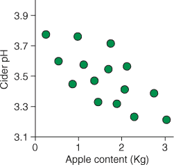

| |
| --- |

##### 注意

回想一下高中化学，pH 值越低，物质越酸。

| |
| --- |

苹果重量与苹果汁 pH 值之间的关系看起来是线性的，我们可以用直线来模拟这种关系。回想一下第一章，描述一条直线所需的唯一参数是斜率和截距：

+   *y* = intercept + slope × *x*

*y* 是结果变量，*x* 是预测变量，截距是当 *x* 为零时 *y* 的值（即直线与 y 轴的交点），斜率是当 *x* 增加一个单位时 *y* 的变化量。

| |
| --- |

##### 注意

解释斜率是有用的，因为它告诉我们结果变量如何随着预测变量（们）的变化而变化，但解释截距通常并不那么直接（或不那么有用）。例如，一个预测弹簧张力的模型，其长度为零时可能有一个正的截距，这表明长度为零的弹簧有张力！如果所有变量都中心化，使得均值为零，那么截距可以解释为 *x* 均值处的 *y* 值（这通常是更有用的信息）。以这种方式中心化变量不会影响斜率，因为变量之间的关系保持不变。因此，线性回归模型做出的预测不受数据中心化和缩放的影响。

| |
| --- |

如果你用普通英语大声读出来，你会说：“对于任何特定的情况，结果变量 *y* 的值是模型截距，加上预测变量 *x* 的值乘以其斜率。”

统计学家将这个方程写作

+   *y* = β[0] + β[1]*x*[1] + ϵ

其中 β[0] 是截距，β[1] 是变量 *x*[1] 的斜率，ϵ 是模型未观察到的、无法解释的误差。

| |
| --- |

##### 注意

线性回归模型的参数（也称为*系数*）只是真实值的估计。这是因为我们通常只处理来自更广泛人群的有限样本。推导出真实参数值的方法只能是测量整个群体，而这通常是不可能的。

| |
| --- |

因此，为了学习一个可以预测 pH 值的模型，我们需要一种方法来估计最能代表这种关系的直线截距和斜率。

线性回归在技术上不是一个算法。相反，它是使用直线方程建模关系的途径。我们可以使用几种不同的算法来估计直线的截距和斜率。对于像我们的苹果汁 pH 问题这样的简单情况，最常用的算法是*普通最小二乘法*（OLS）。

OLS 的职责是学习截距和斜率的值组合，以最小化*残差平方和*。我们在第七章中遇到了残差的概念，即模型未解释的信息量。在线性回归中，我们可以将此视为案例与直线之间的垂直距离（沿 y 轴）。但 OLS 不仅考虑每个案例与线之间的原始距离：它首先将它们平方，然后将它们全部加起来（因此，*平方和*）。这在我们苹果汁示例的图 9.2 中得到了说明。

##### 图 9.2\. 通过数据找到最小二乘线。残差是案例与线之间的垂直距离。方框的面积代表三个案例的平方残差。截距（β[*0*]）是当*x* = 0 时线与 y 轴相交的点。斜率是*y*（Δ*y*）的变化除以*x*（Δ*x*）的变化。


为什么 OLS 要平方距离？你可能读到这是因为它使得任何负残差（对于位于线下的案例）变为正数，因此它们对平方和的贡献而不是减去它。这当然是一个方便的副产品，但如果这是真的，我们就会简单地使用|*残差*|来表示*绝对值*（去除负号）。我们使用平方残差是为了不成比例地惩罚远离其预测值的案例。

#### 9.1.1\. 如果我们有多个预测变量怎么办？

最小二乘法（OLS）找到斜率和截距的组合，使得平方和最小化，通过这种方式学习到的线将是最适合数据的线。但回归问题很少像尝试用一个预测变量预测一个结果那样简单；当我们有多个预测变量时怎么办？让我们给我们的苹果汁 pH 问题添加另一个变量：发酵时间（见图 9.3）。

##### 图 9.3\. 添加一个额外的变量：每个点的尺寸对应于每个苹果汁批次的发酵时间。

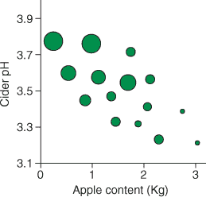

当我们有多个预测变量时，为每个变量估计一个斜率（使用 OLS），并将每个变量的贡献线性相加，同时加上模型截距（现在每个预测变量等于零时*y*的值）。线性回归中的斜率告诉我们，在保持所有其他预测变量不变的情况下，每个预测变量增加一个单位时，因变量如何变化。换句话说，斜率告诉我们当我们逐个改变预测变量时，因变量如何变化。例如，我们的两个预测变量苹果酒模型看起来会是这样：

+   *y* = β[0] + β*[apples]* × *apples* + β*[fermentation]* × *fermentation* + ϵ

| |
| --- |

##### 备注

你有时会看到单变量线性回归和多变量回归被描述为*简单线性回归*和*多元回归*，分别。然而，我认为这种区分有点不必要，因为我们很少只处理单个预测变量。

| |
| --- |

当我们有两个预测变量时，我们的线就变成了一个表面/平面。你可以在图 9.4 中看到我们苹果酒示例的说明。当我们有超过两个预测变量时，我们的平面就变成了超平面。实际上，我们的直线方程可以推广到任何数量的预测变量

+   *y* = β[0] + β[1]*x*[1] + β[2]*x*[2] ... β[k]*x*[k] + ϵ

##### 图 9.4\. 用两个预测变量表示线性模型。在我们的线性模型中将苹果含量和发酵时间结合可以表示为一个表面。实线显示了每个案例的残差误差（其垂直距离从表面）。


其中模型中有 *k* 个预测变量。这被称为*一般线性模型*，它是所有线性模型的核心方程。如果你来自传统的统计建模背景，你可能熟悉*t*检验和方差分析。这些方法都使用一般线性模型来表示预测变量和因变量之间的关系。

| |
| --- |

##### 备注

一般线性模型并不完全等同于广义线性模型，后者指的是一类允许因变量具有不同分布的模型。我很快就会谈到广义线性模型。

| |
| --- |

你能认出一般线性模型吗？在我们讲解逻辑回归的第四章时，你曾见过与之类似的东西。实际上，方程右侧的所有内容都是相同的。唯一的区别在于等号左侧的内容。回想一下，在逻辑回归中，我们预测一个案例属于特定类别的对数几率。而在线性回归中，我们只是预测案例的因变量值。

| |
| --- |

**当可解释性与其性能同样重要或更重要时**

虽然另一个回归算法可能在特定任务上表现更好，但使用一般线性模型构建的模型通常因其可解释性而受到青睐。斜率告诉你，在保持所有其他变量不变的情况下，结果变量随着每个预测变量单位增加而变化的程度。

还有其他算法可能学习到在特定任务上表现更好的模型，但可解释性较差。这样的模型通常被描述为黑盒，其中模型接受输入并给出输出，但很难看到和/或解释导致该特定输出的模型内部的规则。随机森林、XGBoost 和 SVMs 是黑盒模型的例子。

所以，我们什么时候会倾向于选择一个可解释的模型（例如线性回归模型），而不是表现更好的黑盒模型呢？嗯，一个例子是，如果我们的模型具有区分能力。想象一下，如果模型在训练过程中引入了对女性的偏见。使用黑盒模型可能很难立即检测到这种偏见，而如果我们能解释规则，我们就可以检查这种偏见。类似的考虑还有安全性，确保我们的模型不会给出可能危险的结果（例如不必要的医疗干预）是至关重要的。

另一个例子是，当我们使用机器学习来更好地理解一个系统或自然时。从模型中获得预测可能是有用的，但理解这些规则以深化我们的理解和刺激进一步的研究可能更为重要。黑盒可能会使这变得困难。

最后，理解我们模型的规则允许我们改变做事的方式。想象一下，一家企业使用线性回归模型来预测特定产品的需求，基于其成本和公司在广告上的支出等因素。公司不仅能够预测未来的需求，而且还可以通过解释预测变量如何影响结果来控制需求。

| |
| --- |

当我们使用一般线性模型来建模我们的数据时，我们假设我们的残差是正态分布的，并且*同方差*。同方差是一个听起来很荒谬的词（用这个词让你的朋友印象深刻），它仅仅意味着结果变量的方差不会随着结果预测值的增加而增加。

| |
| --- |

##### 小贴士

同样均方误差的对立面是*异方差*。

| |
| --- |

我们还假设每个预测变量和结果之间存在线性关系，以及预测变量对响应变量的影响是可加的（而不是乘法的）。

当这些假设有效时，我们的模型将做出更准确和无偏的预测。然而，一般线性模型可以扩展以处理违反正态分布残差假设的情况（逻辑回归就是一个例子）。

| |
| --- |

##### 注意

我会在本章后面构建我们自己的线性回归模型时，向你展示如何检查这些假设的有效性。


在这种情况下，我们转向*广义线性模型*。广义线性模型与一般线性模型相同（实际上，后者是前者的一种特殊情况），只不过它使用各种称为*链接函数*的转换将结果变量映射到等号右侧做出的线性预测。例如，计数数据很少呈正态分布，但通过构建一个具有适当链接函数的广义模型，我们可以将模型做出的线性预测转换回计数。我不打算在这里进一步讨论广义线性模型，但关于这个主题的一个很好的资源（如果有点沉重）是 Peter K. Dunn 和 Gordon K. Smyth 合著的《带有 R 示例的广义线性模型》（Springer，2018 年）。


##### 小贴士

如果残差是异方差性的，有时构建一个预测结果变量某些转换的模型会有所帮助。例如，预测响应变量的对数[10]是一个常见的选择。这样的模型做出的预测可以转换回原始尺度进行解释。当多个预测变量对结果的影响不是加性的，我们可以在模型中添加*交互项*，说明当一个预测变量变化时，另一个预测变量对结果的影响。


#### 9.1.2\. 如果我们的预测变量是分类的怎么办？

到目前为止，我们只考虑了我们的预测变量是连续的情况。因为一般线性模型本质上是一条直线的方程，我们用它来寻找变量之间的斜率，那么我们如何找到一个分类变量的斜率呢？这甚至有意义吗？好吧，结果是我们可以通过将分类变量重新编码为*虚拟变量*来作弊。虚拟变量是分类变量的新表示，将类别映射到 0 和 1。

假设我们想要根据苹果类型（Gala 或 Braeburn）预测苹果酒的酸度。我们想要找到描述这两种苹果类型和酸度之间关系的截距和斜率，但我们如何做到这一点？记住，早些时候斜率是当*x*增加一个单位时*y*增加的量。如果我们重新编码我们的苹果类型变量，使得 Gala = 0 和 Braeburn = 1，我们可以将苹果类型视为连续变量，并找出从 0 到 1 时酸度如何变化。查看图 9.5：截距是*x*为 0 时*y*的值，即苹果类型 = Gala 时的平均酸度。因此，Gala 被认为是我们的参考水平。斜率是*x*增加一个单位时*y*的变化，这是 Gala 的平均酸度与 Braeburn 的平均酸度之间的差异。这可能感觉像是在作弊，但它有效，并且最小二乘法中的斜率将是连接类别均值的斜率。


##### 注意

你选择哪个类别作为参考水平对模型做出的预测没有影响，并且它是因子的第一级（默认情况下按字母顺序排列）。

| |
| --- |

##### 图 9.5。使用虚拟变量在分类变量的两个水平之间找到斜率。苹果类型被重新编码为 0 和 1，并被视为连续变量。现在的斜率代表两种苹果类型之间的均值差异，截距代表参考类别（Gala）的均值。

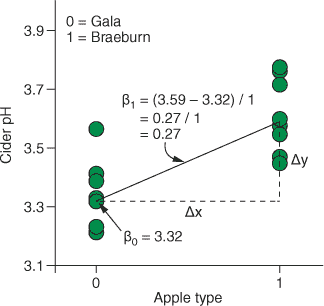

将二进制（两级）因子重新编码为单个虚拟变量，其值为 0 和 1 是有意义的，但如果我们有一个多级因子（具有超过两个级别的因子）怎么办？我们将它们编码为 1、2、3、4 等等，并将它们视为单个连续预测变量？嗯，这不会起作用，因为不太可能有一条直线能连接各个类别的均值。相反，我们创建* k* - 1 个虚拟变量，其中* k* 是因子的级别数。

查看图 9.6 中的示例。图 9.6。我们有四种苹果类型（Granny Smith 是我最喜欢的），并希望根据用于制作特定一批苹果酒的苹果类型来预测 pH 值。为了将我们的四级因子转换为虚拟变量，我们执行以下操作：

1.  创建一个三列的表格，其中每一列代表一个虚拟变量。

1.  选择一个参考水平（在本例中为 Gala）。

1.  将每个虚拟变量的值设为 0 以表示参考水平。

1.  将每个虚拟变量的值设为 1 以表示特定的因子水平。

##### 图 9.6。将多级分类变量重新编码为*k* - 1 个虚拟变量。一个四级因子可以用三个(* k* - 1)虚拟变量表示。参考水平（Gala）在每个虚拟变量中的值为 0。其他水平在特定虚拟变量中的值为 1。为每个虚拟变量估计一个斜率。

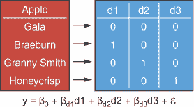

我们现在将我们的四个级别的单一变量转换成了三个不同的虚拟变量，每个虚拟变量取值为 1 或 0。但这如何帮助我们呢？嗯，每个虚拟变量在模型公式中充当一个标志，表示特定案例属于哪个级别。如图 9.6 所示，完整模型如下

+   *y* = β[0] + β[*d*1] *d*1 + β[*d*2] *d*2 + β[*d*3] *d*3 + ϵ

现在，因为截距（β[0]）代表当所有预测变量都等于 0 时的酸度，所以这现在是参考水平 Gala 的平均值。模型中的斜率（β[*d*1]，β[*d*2]，等等）代表参考水平与其他每个水平平均值的差异。如果一批苹果酒是用某种类型的苹果制作的，其虚拟变量将“开启”该类型苹果与参考类别之间的斜率，并“关闭”其他斜率。例如，假设一批苹果酒是用 Braeburn 苹果制作的。模型将如下所示：

+   *y* = β[0] + β[*d*1] × 1 + β[*d*2] × 0 + β[*d*3] × 0 + ϵ

其他苹果类型的斜率仍然在模型中，但由于它们的虚拟变量被设置为 0，它们对预测值没有贡献！

我们使用广义线性模型建立的模型可以混合连续和分类预测变量。当我们使用我们的模型对新数据进行预测时，我们只需做以下几步：

1.  取该数据中每个预测变量的值。

1.  将这些值乘以模型学习到的相关斜率。

1.  将这些值相加。

1.  添加截距。

结果就是该数据的预测值。

我希望到现在你已经对线性回归有了基本的理解，那么让我们通过建立你的第一个线性回归模型来将这一知识转化为技能吧！

### 9.2. 建立你的第一个线性回归模型

在本节中，我将教你如何建立、评估和解释一个线性回归模型来预测每日空气污染。我还会展示其他填充缺失数据和选择相关特征的方法，以及如何将尽可能多的预处理步骤捆绑到你的交叉验证中。

想象一下，你是一名对预测洛杉矶每日大气臭氧污染水平感兴趣的环境科学家。回想一下高中化学，臭氧是氧分子的一种同素异形体（一种说法是“另一种形式”），它有三个氧原子而不是两个（就像你现在呼吸的二氧化氧那样）。虽然平流层中的臭氧可以保护我们免受太阳紫外线的伤害，但燃烧化石燃料的产物可以在地面转化为臭氧，那里它是有毒的。你的任务是建立一个回归模型，可以根据年份和气象读数（如湿度和温度）预测臭氧污染水平。让我们先加载 mlr 和 tidyverse 包：

```
library(mlr)

library(tidyverse)
```

#### 9.2.1. 加载和探索臭氧数据集

现在我们来加载数据，这些数据内置在 mlbench 包中（我喜欢这个包中的数据示例），将其转换为 tibble（使用 `as_tibble()`），并对其进行探索。我们还将给变量起更易读的名字。我们有一个包含 366 个案例和 13 个变量的 tibble，这些变量是每日气象和臭氧读数。

##### 列表 9.1\. 加载和探索 `Ozone` 数据集

```
data(Ozone, package = "mlbench")

ozoneTib <- as_tibble(Ozone)

names(ozoneTib) <- c("Month", "Date", "Day", "Ozone", "Press_height",
                     "Wind", "Humid", "Temp_Sand", "Temp_Monte",
                     "Inv_height", "Press_grad", "Inv_temp", "Visib")

ozoneTib

# A tibble: 366 x 13
   Month Date  Day   Ozone Press_height  Wind Humid Temp_Sand Temp_Monte
   <fct> <fct> <fct> <dbl>        <dbl> <dbl> <dbl>     <dbl>      <dbl>
 1 1     1     4         3         5480     8    20        NA       NA
 2 1     2     5         3         5660     6    NA        38       NA
 3 1     3     6         3         5710     4    28        40       NA
 4 1     4     7         5         5700     3    37        45       NA
 5 1     5     1         5         5760     3    51        54       45.3
 6 1     6     2         6         5720     4    69        35       49.6
 7 1     7     3         4         5790     6    19        45       46.4
 8 1     8     4         4         5790     3    25        55       52.7
 9 1     9     5         6         5700     3    73        41       48.0
10 1     10    6         7         5700     3    59        44       NA
# ... with 356 more rows, and 4 more variables: Inv_height <dbl>,
#   Press_grad <dbl>, Inv_temp <dbl>, Visib <dbl>
```

目前，`Month`、`Day` 和 `Date` 变量是因子。可以说这可能有意义，但在这个练习中我们将它们视为数值。为此，我们使用方便的 `mutate_all()` 函数，它将数据作为第一个参数，将转换/函数作为第二个参数。在这里，我们使用 `as.numeric` 将所有变量转换为数值类别。

| |
| --- |

##### 注意

`mutate_all()` 函数不会改变变量的名称，它只是就地转换它们。

| |
| --- |

接下来，这个数据集中有一些缺失数据（使用 `map_dbl(ozoneTib, ~sum(is .na(.)))` 来查看有多少）。在我们的预测变量中，缺失数据是可以接受的（我们稍后会使用插补来处理这个问题），但我们不能接受我们试图预测的变量的缺失数据。因此，我们通过将 `mutate_all()` 调用的结果通过管道传递到 `filter()` 函数中，移除没有臭氧测量的案例，从而移除具有 `NA` 值的 `Ozone` 的案例。

##### 列表 9.2\. 清洗数据

```
ozoneClean <- mutate_all(ozoneTib, as.numeric) %>%
  filter(is.na(Ozone) == FALSE)

ozoneClean

# A tibble: 361 x 13
   Month  Date   Day Ozone Press_height  Wind Humid Temp_Sand Temp_Monte
   <dbl> <dbl> <dbl> <dbl>        <dbl> <dbl> <dbl>     <dbl>      <dbl>
 1     1     1     4     3         5480     8    20        NA       NA
 2     1     2     5     3         5660     6    NA        38       NA
 3     1     3     6     3         5710     4    28        40       NA
 4     1     4     7     5         5700     3    37        45       NA
 5     1     5     1     5         5760     3    51        54       45.3
# ... with 356 more rows, and 4 more variables: Inv_height <dbl>,
#   Press_grad <dbl>, Inv_temp <dbl>, Visib <dbl>
```

| |
| --- |

##### 注意

我们能否在我们的目标变量中插补缺失数据？是的，我们可以，但这可能会将偏差引入我们的模型。这是因为我们将训练一个模型来预测由模型本身生成的值。

| |
| --- |

让我们绘制每个预测变量与 `Ozone` 的关系图，以了解数据中的关系。我们首先使用 `gather()` 函数收集变量，这样我们就可以在单独的面板上绘制它们。

##### 列表 9.3\. 绘制数据

```
ozoneUntidy <- gather(ozoneClean, key = "Variable",
                      value = "Value", -Ozone)

ggplot(ozoneUntidy, aes(Value, Ozone)) +
  facet_wrap(~ Variable, scale = "free_x") +
  geom_point() +
  geom_smooth() +
  geom_smooth(method = "lm", col = "red") +
  theme_bw()
```

| |
| --- |

##### 注意

记得我们必须使用 `-Ozone` 来防止 `Ozone` 变量与其他变量一起收集。

| |
| --- |

在我们的 `ggplot()` 调用中，我们按 `Variable` 分面，并通过将 `scale` 参数设置为 `"free_x"` 允许面元的 x 轴根据变量变化。然后，除了一个 `geom_point` 层，我们还添加了两个 `geom_smooth` 层。第一个 `geom_smooth` 没有给出任何参数，因此使用默认设置。默认情况下，如果案例少于 1,000 个，`geom_smooth` 将在数据上绘制 LOESS 曲线（一条曲线，局部回归线），如果案例有 1,000 个或更多，则绘制 GAM 曲线。这两种方法都会给我们一个关于关系形状的线索。第二个 `geom_smooth` 层专门要求 `lm` 方法（线性模型），它绘制最佳拟合数据的线性回归线。绘制这两个层将帮助我们识别数据中是否存在非线性关系。

结果图示在图 9.7 中。嗯，一些预测变量与臭氧水平呈线性关系，一些呈非线性关系，还有一些似乎完全没有关系！

##### 图 9.7。在`Ozone`数据集中，将每个预测变量与`Ozone`变量进行绘图。直线代表线性回归线，曲线代表 GAM 线。

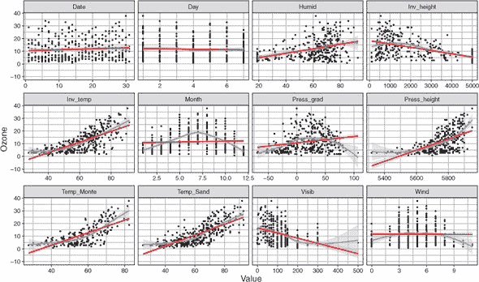

#### 9.2.2. 插补缺失值

线性回归无法处理缺失值。因此，为了避免丢弃大量数据集，我们将使用插补来填补空白。在第四章中，我们使用均值插补用变量的均值替换缺失值（`NA`）。虽然这可能有效，但它只使用了该单个变量内的信息来预测缺失值，并且一个变量中的所有缺失值都将取相同的值，这可能会对模型产生偏差。相反，我们实际上可以使用机器学习算法来预测缺失观察值的值，使用数据集中所有其他变量！在本节中，我将向你展示我们如何使用 mlr 来完成这项工作。

如果你运行 `?imputations`，你将能够看到 mlr 附带的各种插补方法。这些方法包括例如 `imputeMean()`、`imputeMedian()` 和 `imputeMode()`（分别用每个变量的均值、中位数和众数来替换缺失值）。但最重要的方法是列表中最后一个：`imputeLearner()`。`imputeLearner()` 函数允许我们指定一个监督机器学习算法来预测缺失值可能是什么，基于所有其他变量中包含的信息。例如，如果我们想插补连续变量的缺失值，过程如下：

1.  将数据集分为包含和不包含缺失值的特定变量案例。

1.  决定一个回归算法来预测缺失值可能是什么。

1.  仅考虑没有缺失值的案例，使用算法预测变量缺失值的值，使用数据集中的其他变量（包括你最终模型中试图预测的因变量）。

1.  仅考虑包含缺失值的案例，使用第 3 步中学习的模型根据其他预测变量的值来预测缺失值。

在插补分类变量时，我们采用相同的策略，只是我们选择一个分类算法而不是回归算法。因此，我们最终使用一个监督学习算法来填补空白，以便我们可以使用另一个算法来训练我们的最终模型！

我们如何选择一个插补算法呢？有几个实际考虑因素，但就像往常一样，这多少取决于具体情况，尝试不同的方法并看看哪种方法能给你带来最佳性能可能是有益的。我们至少最初可以将其缩小到分类或回归算法，这取决于缺失值的变量是连续的还是分类的。接下来，我们是否在一个或多个变量中存在缺失值是有区别的，因为如果是后者，我们需要选择一个可以自己处理缺失值的算法。例如，假设我们尝试使用逻辑回归来插补一个分类变量的缺失值。我们将到达上一个流程的第 3 步并停止，因为数据中的其他变量（算法试图用来预测分类变量的）也包含缺失值。逻辑回归无法处理这种情况，并将抛出错误。如果只有缺失值的变量是我们试图插补的，这就不会是问题。最后，唯一其他的考虑因素是计算预算。如果你用来学习最终模型的算法已经计算成本很高，使用一个计算成本高的算法来插补你的缺失值将增加额外的开销。在这些限制条件下，通常最好的做法是尝试不同的插补学习器，看看哪个最适合当前任务。

在进行任何形式的缺失值插补时，确保数据是*随机缺失*（MAR）或*完全随机缺失*（MCAR），而不是*非随机缺失*（MNAR）这一点极为重要。如果数据是 MCAR，这意味着缺失值的可能性与数据集中的任何变量无关。如果数据是 MAR，这意味着缺失值的可能性仅与数据集中其他变量的值有关。例如，某人可能因为年龄而不太可能填写他们的薪水。在这两种情况下，我们仍然可以构建由于缺失数据的存在而具有无偏性的模型。但考虑这种情况，某人可能因为他们的薪水低而不太可能填写他们的薪水。这是一个数据*非随机缺失*（MNAR）的例子，其中缺失值的可能性取决于变量的值本身。在这种情况下，你可能会构建一个倾向于高估调查中人们薪水的模型。

我们如何判断我们的数据是 MCAR、MAR 还是 MNAR？并不容易。有方法可以区分 MCAR 和 MAR。例如，您可以构建一个分类模型，预测一个案例是否对特定变量有缺失值。如果模型在预测缺失值方面比随机猜测做得更好，那么数据就是 MAR。如果模型做得不比随机猜测好多少，那么数据可能就是 MCAR。有没有办法判断数据是否是 MNAR？很遗憾，没有。确信您的数据不是 MNAR 取决于良好的实验设计和对预测变量的深思熟虑。

| |
| --- |

##### 小贴士

有一种更强大的插补技术叫做**多重插补**。多重插补的前提是您创建许多新的数据集，在每个数据集中用合理的值替换缺失数据。然后，您在每个插补数据集上训练一个模型，并返回平均模型。虽然这可能是最广泛使用的插补技术，但遗憾的是，它还没有在 mlr 中实现，所以我们在这里不会使用它。然而，我强烈建议您阅读 R 中 mice 包的文档。

| |
| --- |

对于我们的臭氧数据，我们在几个变量上都有缺失值，而且它们都是连续变量。因此，我将选择一个可以处理缺失数据的回归算法：rpart。是的，您没听错：我们将使用 rpart 决策树算法来插补缺失值。在我们讨论基于树的算法时第七章，我们只考虑了它们用于分类问题；但决策树也可以用来预测连续变量。我将在第十二章中详细展示这是如何工作的；但现在，我们将让 rpart 做它的事情，为我们插补缺失值。

##### 列表 9.4\. 使用 rpart 插补缺失值

```
imputeMethod <- imputeLearner("regr.rpart")

ozoneImp <- impute(as.data.frame(ozoneClean),
                   classes = list(numeric = imputeMethod))
```

我们首先使用`imputeLearner()`函数来定义我们将要使用什么算法来插补缺失值。我们提供给这个函数的唯一参数是学习者的名称，在这种情况下是`"regr.rpart"`。

| |
| --- |

##### 小贴士

此外，还有一个可选的参数，`features`，允许我们指定在预测缺失值时使用数据集中的哪些变量。默认情况下，使用所有其他变量，但您可以使用它来指定没有任何缺失值的变量，这样您就可以使用无法处理缺失数据的算法。有关更多详细信息，请参阅`?imputeLearner`。

| |
| --- |

接下来，我们使用`impute()`函数创建填充后的数据集，其中第一个参数是数据。我们只是将我们的 tibble 包裹在`as.data.frame()`函数中，以防止重复警告数据是 tibble 而不是数据框（这些可以安全忽略）。我们可以通过向`cols`参数提供一个命名列表来为不同的列指定不同的填充技术。例如，我们可以说`cols = list(var1 = imputeMean(), var2 = imputeLearner("regr.lm"))`。我们还可以通过在相同的`classes`参数中使用相同的方式为不同类别的变量指定不同的填充技术（一个技术用于数值变量，另一个用于因子）。在下面的列表中，我们使用`classes`参数使用我们定义的`imputeMethod`来填充所有变量（它们都是数值变量）。

这将产生一个我们可以使用`ozoneImp$data`访问的数据集，其中缺失值已被 rpart 算法学习到的模型预测值所替换。现在我们可以使用填充后的数据集定义我们的任务和学习器。通过将`"regr.lm"`作为`makeLearner()`函数的参数，我们告诉 mlr 我们想要使用线性回归。

##### 列表 9.5\. 定义我们的任务和学习器

```
ozoneTask <- makeRegrTask(data = ozoneImp$data, target = "Ozone")

lin <- makeLearner("regr.lm")
```


##### 注意

在本书的第二部分（part 2），我们习惯于将学习器定义为`classif .[ALGORITHM]`。在本书的这一部分，而不是`classif.`，前缀将是`regr.`。这很重要，因为同一个算法有时可以用于分类和回归，所以前缀告诉 mlr 我们想要使用算法执行哪种任务。


#### 9.2.3\. 自动化特征选择

有时可能很明显哪些变量没有预测价值，可以从分析中移除。领域知识在这里也非常重要，我们在这里包括我们认为对我们要研究的输出结果有某些预测价值的变量。但通常更好的方法是采取更客观的特征选择方法，并允许算法为我们选择相关特征。在本节中，我将向您展示我们如何在 mlr 中实现这一点。

自动化特征选择有两种方法：

+   ***过滤方法—*** 过滤方法将每个预测变量与结果变量进行比较，并计算结果变量随预测变量变化的度量。这个度量可以是相关系数：例如，如果两个变量都是连续的。预测变量将按照这个度量排序（理论上，按照它们可以贡献给模型的信息量排序），我们可以选择从我们的模型中删除一定数量或比例的最差表现变量。我们可以将删除变量数量或比例作为模型构建过程中的超参数进行调整。

+   ***包装方法—*** 在包装方法中，我们不是使用单个模型外的统计量来估计特征重要性，而是迭代地使用不同的预测变量训练我们的模型。最终，选择能够给出最佳性能的预测变量组合。有几种不同的方法可以做到这一点，但一个例子是*顺序前向选择*。在顺序前向选择中，我们从没有预测变量开始，然后逐个添加预测变量。在算法的每个步骤中，选择导致模型性能最佳的特性。最后，当添加任何更多预测变量都不会提高性能时，特征添加停止，并在选定的预测变量上训练最终模型。

我们应该选择哪种方法？这归结为：包装方法可能会导致性能更好的模型，因为我们实际上正在使用我们正在训练的模型来估计预测变量的重要性。然而，由于我们在选择过程的每次迭代中（每个步骤可能包括其他预处理步骤，如插补），包装方法往往计算成本较高。另一方面，过滤方法可能或可能不会选择表现最佳的预测变量集，但计算成本要低得多。

##### 特征选择中的过滤方法

我将向您展示我们臭氧示例中的两种方法，首先是过滤方法。我们可以使用许多指标来估计预测变量的重要性。要查看 mlr 中内置的可用过滤方法列表，请运行 `listFilterMethods()`。描述全部内容太多，但常见的选项包括这些：

+   ***线性相关性—*** 当预测变量和结果变量都是连续变量时

+   ***方差分析（ANOVA）—*** 当预测变量是分类变量且结果变量是连续变量时

+   ***卡方检验（Chi-squared）—*** 当预测变量和结果变量都是连续变量时

+   ***随机森林重要性—*** 可以用于预测变量和结果变量是分类变量或连续变量的情况（默认）

| |
| --- |

##### 小贴士

欢迎尝试 mlr 中实现的方法。其中许多方法需要您首先安装 FSelector 包：`install.packages("FSelector")`。

| |
| --- |

mlr 默认使用的方法（因为它不依赖于变量是否为分类变量）是构建随机森林来预测结果，并返回对模型预测贡献最大的变量（使用我们在第八章中讨论的袋外误差）。在这个例子中，由于预测变量和结果变量都是连续的，我们将使用线性相关性来估计变量重要性（它比随机森林的重要性更容易解释）。

首先，我们使用 `generateFilterValuesData()` 函数（最长的函数名！）为每个预测变量生成一个重要性度量。第一个参数是任务，其中包含我们的数据集，并让函数知道 `Ozone` 是我们的目标变量。第二个可选参数是 `method`，我们可以向其中提供 `listFilterMethods()` 列出的方法之一。在这个例子中，我使用了 `"linear.correlation"`。通过提取此对象中的 `$data` 组件，我们得到包含预测变量及其皮尔逊相关系数的表格。

##### 列表 9.6. 使用过滤方法进行特征选择

```
filterVals <- generateFilterValuesData(ozoneTask,
                                       method = "linear.correlation")

filterVals$data

           name    type linear.correlation
1         Month numeric           0.053714
2          Date numeric           0.082051
3           Day numeric           0.041514
4  Press_height numeric           0.587524
5          Wind numeric           0.004681
6         Humid numeric           0.451481
7     Temp_Sand numeric           0.769777
8    Temp_Monte numeric           0.741590
9    Inv_height numeric           0.575634
10   Press_grad numeric           0.233318
11     Inv_temp numeric           0.727127
12        Visib numeric           0.414715

plotFilterValues(filterVals) + theme_bw()
```

将此信息解释为图表更为容易，我们可以使用 `plotFilterValues()` 函数生成图表，将保存过滤值的对象作为其参数。生成的图表显示在图 9.8 中。

| |
| --- |

**练习 1**

为 `ozoneTask` 生成和绘制过滤值，但使用默认方法 `randomForestSRC_importance`（不要覆盖 `filterVals` 对象）。两种方法中变量的重要性排名是否相同？

| |
| --- |

现在我们有了按估计重要性对预测变量进行排名的方法，我们可以决定如何“去除”最不具信息量的变量。我们使用 `filterFeatures()` 函数来完成这项任务，该函数将任务作为第一个参数，将我们的 `filterVals` 对象作为 `fval` 参数，以及 `abs`、`per` 或 `threshold` 参数。`abs` 参数允许我们指定要保留的最佳预测变量的绝对数量。`per` 参数允许我们指定要保留的最佳预测变量的百分比。`threshold` 参数允许我们指定过滤度量（在本例中为相关系数）的值，预测变量必须超过此值才能被保留。我们可以手动使用这三种方法之一过滤我们的预测变量。这将在下面的列表中展示，但我已经注释掉了这些行，因为我们不会这样做。相反，我们可以将我们的学习器（线性回归）和过滤方法包装在一起，这样我们就可以将 `abs`、`per` 和 `threshold` 视为超参数并进行调整。

##### 图 9.8. 使用 `plotFilterValues()` 绘制每个预测变量与臭氧水平的相关性

![fig9-8_alt.jpg]

##### 列表 9.7. 手动选择要删除的特征

```
#ozoneFiltTask <- filterFeatures(ozoneTask,
#                                fval = filterVals, abs = 6)
#ozoneFiltTask <- filterFeatures(ozoneTask,
#                                fval = filterVals, per = 0.25)
#ozoneFiltTask <- filterFeatures(ozoneTask,
#                                fval = filterVals, threshold = 0.2)
```

为了将我们的学习器和过滤方法包装在一起，我们使用 `makeFilterWrapper()` 函数，将我们定义的线性回归学习器作为 `learner` 参数，并将我们的过滤度量作为 `fw.method` 参数。

##### 列表 9.8. 创建过滤包装器

```
filterWrapper = makeFilterWrapper(learner = lin,
                                  fw.method = "linear.correlation")
```

| |
| --- |

##### 警告

注意术语混淆！我们仍在使用 *过滤方法* 进行特征选择。不幸的是，我们创建了一个 *过滤包装器*，但这并不是特征选择的 *包装方法*。我们将在稍后介绍这一点。

| |
| --- |

当我们将学习器和预处理步骤组合在一起时，两者的超参数都成为我们包装学习器的一部分可供调整。在这种情况下，这意味着我们可以使用交叉验证调整`abs`、`per`或`threshold`超参数，以选择最佳性能的特征。在这个例子中，我们将调整要保留的绝对特征数量。

##### 列表 9.9\. 调整要保留的预测因子数量

```
lmParamSpace <- makeParamSet(
  makeIntegerParam("fw.abs", lower = 1, upper = 12)
)

gridSearch <- makeTuneControlGrid()

kFold <- makeResampleDesc("CV", iters = 10)

tunedFeats <- tuneParams(filterWrapper, task = ozoneTask, resampling = kFold,
                        par.set = lmParamSpace, control = gridSearch)

tunedFeats

Tune result:
Op. pars: fw.abs=10
mse.test.mean=20.8834
```

| |
| --- |

##### 小贴士

如果你运行`getParamSet(filterWrapper)`，你会看到由于我们包装了过滤方法，`abs`、`per`和`threshold`的超参数名称已经变成了`fw.abs`、`fw.per`和`fw.threshold`。现在，另一个有用的超参数`fw.mandatory.feat`允许你强制某些变量被包含，无论它们的分数如何。

| |
| --- |

首先，我们像往常一样使用`makeParamSet()`定义超参数空间，并将`fw.abs`定义为介于 1 到 12 之间的整数（我们将保留的最小和最大特征数量）。接下来，我们使用`makeTuneControlGrid()`定义我们熟悉的老朋友——网格搜索，这将尝试我们超参数的每个值。我们使用`makeResampleDesc()`定义一个普通的 10 折交叉验证策略，然后使用`tuneParams()`进行调优。第一个参数是我们的包装学习器，然后我们提供我们的任务、交叉验证方法、超参数空间和搜索过程。

我们的选择过程挑选出与臭氧相关性最高的 10 个预测因子作为最佳性能组合。但什么是`mse.test.mean`？你之前还没有见过这个性能指标。好吧，我们用于分类的性能指标，如平均误分类误差，在预测连续变量时没有意义。对于回归问题，有三个常用的性能指标：

+   ***平均绝对误差 (MAE)***——找到每个案例与模型之间的绝对残差，将它们全部加起来，然后除以案例数量。我们可以将这解释为案例与模型之间的平均绝对距离。

+   ***均方误差 (MSE)***——与 MAE 类似，但在找到平均值之前将残差平方。这意味着 MSE 比 MAE 对异常值更敏感，因为平方残差的大小随着与模型预测的距离的平方增长。MSE 是 mlr 中回归学习者的默认性能指标。MSE 或 MAE 的选择取决于你如何处理数据中的异常值：如果你想让你的模型能够预测这样的案例，使用 MSE；否则，如果你想让你的模型对异常值不太敏感，使用 MAE。

+   ***均方根误差（RMSE）——*** 由于 MSE 对残差进行平方，其值与结果变量的尺度不同。相反，如果我们对 MSE 取平方根，我们得到的是 RMSE。在调整超参数和比较模型时，MSE 和 RMSE 总是会选择相同的模型（因为 RMSE 只是 MSE 的一种变换），但 RMSE 的好处是它与我们的结果变量处于相同的尺度，因此更具可解释性。

| |
| --- |

##### 提示

我们还有其他回归性能指标可供选择，例如 MAE 和 MSE 的百分比版本。如果你对阅读 mlr 中可用的更多性能指标感兴趣（而且有很多），请运行`?measures`。

| |
| --- |
| |

**练习 2**

在列表 9.8 和 9.9 中重复特征过滤过程，但使用默认的`fw.method`参数（`randomForestSRC_importance`，或者不提供它）。这会选择与使用线性相关性相同的预测因子数量吗？哪种方法更快？

| |
| --- |

使用均方误差（MSE）性能指标，我们的调整滤波器方法得出结论，保留与臭氧水平相关性最高的 10 个特征会导致性能最佳的模型。我们现在可以训练一个只包含这些前 10 个特征的最终模型。

##### 列表 9.10\. 使用过滤特征训练模型

```
filteredTask <- filterFeatures(ozoneTask, fval = filterVals,
                               abs = unlist(tunedFeats$x))

filteredModel <- train(lin, filteredTask)
```

首先，我们使用`filterFeatures()`函数创建一个只包含过滤特征的新的任务。我们将现有任务的名称、我们在列表 9.6 中定义的`filterVals`对象以及要保留的特征数量作为`abs`函数的参数传递给这个函数。这个值可以作为`tunedFeats`的`$x`组件访问，并且需要用`unlist()`包装；否则，函数将抛出错误。这创建了一个只包含过滤预测因子并保留`Ozone`作为目标变量的新任务。最后，我们使用这个任务训练线性模型。

##### 特征选择的包装方法

使用过滤方法，我们生成描述每个预测因子如何与结果变量相关的单变量统计量。这可能会导致选择最有信息的预测因子，但并不保证。相反，我们可以使用我们试图训练的实际模型来确定哪些特征有助于它做出最佳预测。这有可能选择更好的预测因子组合，但因为它为预测变量的每个排列都训练一个新的模型，所以计算成本更高。

让我们首先定义我们将如何搜索最佳预测因子组合。我们有四种选择：

+   ***穷举搜索—*** 这基本上是一个网格搜索。它将尝试你数据集中预测变量可能的所有组合，并选择表现最好的那个。这保证找到最佳组合，但可能速度过慢。例如，在我们的 12 个预测变量数据集中，穷举搜索需要尝试超过 1.3 × 10⁹种不同的变量组合！

+   ***随机搜索—*** 这就像超参数调优中的随机搜索。我们定义一系列迭代次数，并随机选择特征组合。最终迭代后的最佳组合获胜。这通常不那么密集（取决于你选择的迭代次数），但它并不保证找到最佳特征组合。

+   ***顺序搜索—*** 从一个特定的起点开始，我们在每个步骤中添加或移除特征，以改善性能。这可以是以下之一：

    +   ***正向搜索—*** 我们从一个空模型开始，依次添加改进模型最多的特征，直到额外的特征不再提高性能。

    +   ***反向搜索—*** 我们从所有特征开始，移除移除后模型改进最大的特征，直到额外的移除不再提高性能。

    +   ***浮动正向搜索—*** 从一个空模型开始，我们在每个步骤中添加一个变量或移除一个变量， whichever improves the model the most，直到添加或移除都不再提高模型性能。

    +   ***浮动反向搜索—*** 与浮动正向搜索相同，只是我们从完整的模型开始。

+   ***遗传算法—*** 这种方法受到达尔文进化论的启发，找到作为“父母”的“后代”变量组合的特征组合对，这些组合继承了表现最好的特征。这种方法非常酷，但随着特征空间的扩大，计算成本可能会很高。

哇！有这么多选项可以选择，我们从哪里开始呢？嗯，我发现对于大特征空间，穷举搜索和遗传搜索速度过慢。虽然随机搜索可以缓解这个问题，但我发现顺序搜索在计算成本和找到最佳性能特征组合的概率之间是一个很好的折衷方案。在其不同的变体中，你可能想尝试不同的选项，看看哪个会产生最佳性能的模型。我喜欢浮动版本，因为它们在每个步骤都考虑了添加和移除，所以在这个例子中，我们将使用浮动反向选择。

首先，我们使用 `makeFeatSelControlSequential()` 函数定义搜索方法（哇，mlr 的作者真的非常喜欢他们的长函数名）。我们使用 `"sfbs"` 作为方法参数来使用序列浮点向后选择。然后，我们使用 `selectFeatures()` 函数执行特征选择。我们将学习者、任务、在列表 9.9 中定义的交叉验证策略和搜索方法提供给此函数。就这么简单。当我们运行函数时，使用我们的 `kFold` 策略对预测变量的每个排列进行交叉验证，以获得其性能的估计。通过打印此过程的结果，我们可以看到算法选择了六个预测变量，其 MSE 值略低于列表 9.9 中通过过滤器方法选择的预测变量。

| |
| --- |

##### 小贴士

要查看所有可用的包装器方法和如何使用它们，请运行 `?FeatSelControl`。

| |
| --- |

现在我需要提醒你关于序列浮点前向搜索的一个令人沮丧的错误。截至本文写作时，在某些情况下，使用 `"sffs"` 作为特征选择方法将抛出以下错误：`Error in sum(x) : invalid 'type' (list) of argument`。如果你尝试在这个例子中使用 `"sffs"` 作为搜索方法，可能会遇到这样的错误。因此，虽然这非常令人沮丧，但我选择使用序列浮点*向后*搜索 (`"sfbs"`) 代替。

##### 列表 9.11\. 使用包装方法进行特征选择

```
featSelControl <- makeFeatSelControlSequential(method = "sfbs")

selFeats <- selectFeatures(learner = lin, task = ozoneTask,
                           resampling = kFold, control = featSelControl)

selFeats

FeatSel result:
Features (6): Month, Press_height, Humid, Temp_Sand, Temp_Monte, Inv_height
mse.test.mean=20.4038
```

现在，就像我们对过滤器方法所做的那样，我们可以使用只包含所选预测因子的插补数据创建一个新的任务，并在其上训练模型。

##### 列表 9.12\. 使用包装方法进行特征选择

```
ozoneSelFeat <- ozoneImp$data[, c("Ozone", selFeats$x)]

ozoneSelFeatTask <- makeRegrTask(data = ozoneSelFeat, target = "Ozone")

wrapperModel <- train(lin, ozoneSelFeatTask)
```

#### 9.2.4\. 在交叉验证中包含插补和特征选择

我已经说过很多次了，但我要再说一遍：在交叉验证中包含所有数据相关的预处理步骤！但到目前为止，我们只需要考虑一个预处理步骤。我们如何组合多个步骤呢？嗯，mlr 使得这个过程非常简单。当我们把一个学习者和一个预处理步骤包装在一起时，我们实际上创建了一个包含该预处理的新学习算法。因此，为了包含一个额外的预处理步骤，我们只需包装包装过的学习者！我在图 9.9 中展示了这一点。这导致了一种类似套娃的包装器，其中一个是被另一个封装的，然后是被另一个封装的，以此类推。

##### 图 9.9\. 组合多个预处理包装器。一旦一个学习者和预处理步骤（如插补）在包装器中组合，这个包装器就可以用作另一个包装器中的学习者。

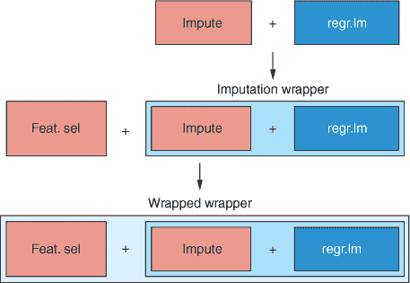

使用这个策略，我们可以组合任意多的预处理步骤来创建一个管道。最内层的包装器将始终首先使用，然后是下一个内层的，依此类推。

| |
| --- |

##### 注意

因为最内层的包装器首先使用，一直到最外层，所以仔细思考你希望预处理步骤采取的顺序是很重要的。


让我们通过实际操作来加强这一点。我们将创建一个填补包装器，然后将其作为学习器传递给一个特征选择包装器。

##### 列表 9.13\. 结合填补和特征选择包装器

```
imputeMethod <- imputeLearner("regr.rpart")

imputeWrapper <- makeImputeWrapper(lin,
                                   classes = list(numeric = imputeMethod))

featSelWrapper <- makeFeatSelWrapper(learner = imputeWrapper,
                                     resampling = kFold,
                                     control = featSelControl)
```

首先，我们使用`imputeLearner()`函数（首次定义在列表 9.4）重新定义我们的填补方法。然后，我们使用`makeImputeWrapper()`函数创建一个填补包装器，该函数将学习器作为第一个参数。我们使用`list(numeric = imputeMethod)`作为`classes`参数，将此填补策略应用于我们所有的数值预测因子（所有这些，duh）。

现在是时候展示一些巧妙的部分了：我们使用`makeFeatSelWrapper()`创建一个特征选择包装器，并提供我们创建的填补包装器作为学习器。这是关键步骤，因为我们正在创建一个包含另一个包装器的包装器！我们将交叉验证方法设置为`kFold`（在列表 9.9 中定义）和搜索特征组合的方法为`featSelControl`（在列表 9.11 中定义）。

现在，让我们像优秀的数据科学家一样交叉验证我们的整个模型构建过程。

##### 列表 9.14\. 交叉验证模型构建过程

```
library(parallel)
library(parallelMap)

ozoneTaskWithNAs <- makeRegrTask(data = ozoneClean, target = "Ozone")

kFold3 <- makeResampleDesc("CV", iters = 3)

parallelStartSocket(cpus = detectCores())

lmCV <- resample(featSelWrapper, ozoneTaskWithNAs, resampling = kFold3)

parallelStop()

lmCV

Resample Result
Task: ozoneClean
Learner: regr.lm.imputed.featsel
Aggr perf: mse.test.mean=20.5394
Runtime: 86.7071
```

在加载了并行和 parallelMap 包的朋友之后，我们使用`ozoneClean` tibble 定义一个任务，它仍然包含缺失数据。接下来，我们为交叉验证过程定义一个普通的 3 折交叉验证策略。最后，我们使用`parallelStartSocket()`开始并行化，并通过将学习器（包装的包装器）、任务和交叉验证策略提供给`resample()`函数来启动交叉验证过程。在我的四核机器上，这几乎花费了 90 秒，所以我建议你开始这个过程，然后继续阅读代码的总结。

交叉验证过程如下进行：

1.  将数据分为三个折叠。

1.  对于每个折叠：

    1.  使用 rpart 算法来填补缺失值。

    1.  执行特征选择：更新模板以支持超过两层嵌套有序列表。

    1.  使用选择方法（例如反向搜索）来选择特征组合以训练模型。

    1.  使用 10 折交叉验证来评估每个模型的表现。

1.  返回三个外部折叠中每个表现最好的模型。

1.  返回平均 MSE 以给出我们性能的估计。

我们可以看到，我们的模型构建过程给我们一个平均均方误差（MSE）为 20.54，这表明在原始臭氧尺度上的平均残差误差为 4.53（取 20.54 的平方根）。

#### 9.2.5\. 解释模型

由于它们的简单结构，线性模型通常很容易解释，因为我们可以通过查看每个预测因子的斜率来推断结果变量受到的影响程度。然而，这些解释是否合理取决于是否满足某些模型假设，因此在本节中，我将向您展示如何解释模型输出并生成一些诊断图。

首先，我们需要使用 `getLearnerModel()` 函数从我们的模型对象中提取模型信息。通过在模型数据上调用 `summary()`，我们得到一个包含大量关于我们模型信息的输出。请看下面的列表。

##### 列表 9.15\. 解释模型

```
wrapperModelData <- getLearnerModel(wrapperModel)

summary(wrapperModelData)

Call:
stats::lm(formula = f, data = d)

Residuals:
    Min      1Q  Median      3Q     Max
-13.934  -2.950  -0.284   2.722  13.829
Coefficients:
              Estimate Std. Error t value Pr(>|t|)
(Intercept)  41.796670  27.800562    1.50  0.13362
Month        -0.296659   0.078272   -3.79  0.00018
Press_height -0.010353   0.005161   -2.01  0.04562
Wind         -0.122521   0.128593   -0.95  0.34136
Humid         0.076434   0.014982    5.10  5.5e-07
Temp_Sand     0.227055   0.043397    5.23  2.9e-07
Temp_Monte    0.266534   0.063619    4.19  3.5e-05
Inv_height   -0.000474   0.000185   -2.56  0.01099
Visib        -0.005226   0.003558   -1.47  0.14275

Residual standard error: 4.46 on 352 degrees of freedom
Multiple R-squared:  0.689, Adjusted R-squared:  0.682
F-statistic: 97.7 on 8 and 352 DF,  p-value: <2e-16
```

`Call` 组件通常会告诉我们创建模型所使用的公式（哪些变量，以及我们是否在它们之间添加了更复杂的关系）。由于我们使用 mlr 构建了这个模型，所以我们很遗憾地在这里没有获得这些信息；但模型公式是所有选定的预测因子线性组合在一起的结果。

`Residuals` 组件为我们提供了关于模型残差的某些汇总统计信息。在这里，我们正在查看中位数是否大约为 0，以及第一四分位数和第三四分位数是否大约相同。如果它们不相同，这可能会表明残差要么不是正态分布的，要么是异方差性的。在这两种情况下，这不仅可能对模型性能产生负面影响，还可能使我们对斜率的解释不正确。

`Coefficients` 组件显示了一个模型参数及其标准误差的表格。截距为 41.8，这是当所有其他变量都为 0 时臭氧水平的估计值。在这个特定情况下，某些变量为 0（例如 `month`）实际上并没有太多意义，所以我们不会过多地从这个结果中得出解释。预测因子的估计值是它们的斜率。例如，我们的模型估计，当 `Temp_Sand` 变量增加一个单位时，`Ozone` 增加 0.227（保持所有其他变量不变）。`Pr(>|t|)` 列包含的 *p* 值，在理论上，如果总体斜率实际上是 0，则表示看到如此大的斜率的概率。无论如何，请使用 *p* 值来指导你的模型构建过程；但与 *p* 值相关的问题有一些，所以不要过分依赖它们。

最后，`Residual standard error` 与 RMSE 相同，`Multiple R-squared` 是我们模型解释数据方差的估计比例（68.9%），而 `F-statistic` 是模型解释的方差与模型未解释的方差的比率。这里的 *p* 值是对我们模型比仅使用 `Ozone` 的平均值进行预测更好的概率的估计。


##### 注意

注意残差标准误差值接近但并不等于通过交叉验证估计的模型构建过程的 RMSE。这种差异是因为我们交叉验证了模型构建过程，而不是这个特定的模型本身。


我们可以通过将模型数据作为`plot()`函数的参数来快速轻松地打印线性模型的诊断图。通常，这将提示你按 Enter 键循环浏览图表。我发现这很烦人，所以我更喜欢使用`par()`函数的`mfrow`参数将绘图设备分成四个部分。这意味着当我们创建我们的诊断图（将有四个）时，它们将在同一个绘图窗口中平铺。这些图表可能有助于我们识别影响预测性能的模型缺陷。


##### 小贴士

我随后又用`par()`函数将其改回。


##### 列表 9.16. 创建模型的诊断图

```
par(mfrow = c(2, 2))
plot(wrapperModelData)
par(mfrow = c(1, 1))
```

结果图如图 9.10 所示。残差与拟合值图显示了每个案例的预测臭氧水平（x 轴）和残差（y 轴）。我们*希望*在这个图中没有模式。换句话说，误差量不应取决于预测值。在这种情况下，我们有一个曲线关系。这表明我们在预测因子和臭氧之间存在非线性关系，以及/或异方差性。

##### 图 9.10. 为我们的线性模型绘制诊断图。残差与拟合值图和尺度位置图有助于识别非线性异方差性的模式。正态 Q-Q 图有助于识别残差的非正态性，而残差与杠杆作用图有助于识别有影响力的异常值。

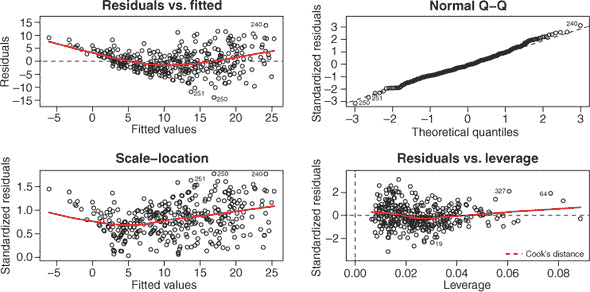

正态 Q-Q（分位数-分位数）图显示了模型残差的分位数与如果它们是从理论正态分布中抽取的分位数之间的关系。如果数据与 1:1 对角线有显著偏差，这表明残差不是正态分布的。这似乎不是这个模型的问题：残差很好地排列在对角线上。

尺度位置图帮助我们识别残差的异方差性。这里不应该有模式，但看起来残差随着预测值的增大而越来越多样化，这表明存在异方差性。

最后，残差与杠杆作用图帮助我们识别对模型参数有过度影响的案例（潜在的异常值）。落在称为*库克距离*的虚线区域内的案例可能是异常值，其包含或排除对模型有很大影响。因为我们甚至看不到库克距离在这里（它超出了坐标轴限制），所以我们不用担心异常值。

这些诊断图（尤其是残差与拟合图）表明预测变量和结果变量之间存在非线性关系。因此，我们可能能够从假设线性的模型中获得更好的预测性能。在下一章中，我将向您展示广义加性模型是如何工作的，我们将训练一个模型来提高我们的模型性能。我建议您保存您的 .R 文件，因为我们将在下一章继续使用相同的 dataset 和任务。这样我可以向您强调非线性对线性回归性能的影响有多大。

### 9.3. 线性回归的优缺点

虽然通常很难判断哪些算法会对特定任务表现良好，但以下是一些优缺点，这将帮助您决定线性回归是否适合您。

线性回归的优点如下：

+   它产生的模型非常易于解释。

+   它可以处理连续和分类预测变量。

+   它在计算上非常经济。

线性回归的缺点如下：

+   它对数据做出了强烈的假设，例如同方差性、线性性和残差的分布（如果违反这些假设，性能可能会受到影响）。

+   它只能学习数据中的线性关系。

+   它无法处理缺失数据。


**练习 3**

而不是使用包装方法，使用过滤器方法交叉验证构建我们的模型过程。估计的 MSE 值是否相似？哪种方法更快？提示：

1.  首先，使用我们的 `imputeWrapper` 作为学习器创建一个过滤器包装器。

1.  定义一个超参数空间，使用 `makeParamSet()` 调整 `"fw.abs"`。

1.  定义一个调整包装器，它将过滤器包装器作为学习器并执行网格搜索。

1.  使用 `resample()` 进行交叉验证，使用调整包装器作为学习器。


### 摘要

+   线性回归可以处理连续和分类预测变量。

+   线性回归使用直线的方程来模拟数据中的关系，表现为直线。

+   可以使用使用所有其他变量信息的监督学习算法来填充缺失值。

+   自动特征选择有两种形式：过滤器方法和包装方法。

+   特征选择的过滤器方法在模型之外计算单变量统计量，以估计预测变量与结果之间的关系。

+   包装方法通过在预测变量的不同排列中主动训练模型来选择最佳性能的组合。

+   在 mlr 中可以通过包装函数的顺序包装将预处理步骤组合在一起。

### 练习题的解答

1.  使用默认的 `randomForestSRC_importance` 方法生成过滤器值：

    ```
    filterValsForest <- generateFilterValuesData(ozoneTask,
                                  method = "randomForestSRC_importance")

    filterValsForest$data

    plotFilterValues(filterValsForest) + theme_bw()

    # The randomForestSRC_importance method ranks variables
    # in a different order of importance.
    ```

1.  使用默认的过滤器统计量重复特征过滤：

    ```
    filterWrapperDefault <- makeFilterWrapper(learner = lin)

    tunedFeats <- tuneParams(filterWrapperDefault, task = ozoneTask,
                             resampling = kFold, par.set = lmParamSpace,
                             control = gridSearch)

    tunedFeats

    # The default filter statistic (randomForestSRC) tends to select fewer
    # predictors in this case, but the linear.correlation statistic was faster.
    ```

1.  使用过滤器方法交叉验证构建线性回归模型：

    ```
    filterWrapperImp <- makeFilterWrapper(learner = imputeWrapper,
                                       fw.method = "linear.correlation")
    filterParam <- makeParamSet(
      makeIntegerParam("fw.abs", lower = 1, upper = 12)
    )

    tuneWrapper <- makeTuneWrapper(learner = filterWrapperImp,
                                   resampling = kFold,
                                   par.set = filterParam,
                                   control = gridSearch)

    filterCV <- resample(tuneWrapper, ozoneTask, resampling = kFold)

    filterCV

    # We have a similar MSE estimate for the filter method
    # but it is considerably faster than the wrapper method. No free lunch!
    ```

## 第十章. 使用广义加性模型的非线性回归

*本章涵盖*

+   在线性回归中包含多项式项

+   在回归中使用样条

+   使用广义加性模型（GAMs）进行非线性回归

在 第九章 中，我向您展示了如何使用线性回归创建非常可解释的回归模型。线性回归做出的最强假设之一是每个预测变量和结果之间存在线性关系。这通常并不成立，因此在本章中，我将向您介绍一类模型，它允许我们模拟数据中的非线性关系。

我们将首先讨论如何在线性回归中包含 *多项式* 项来模拟非线性关系，以及这样做的好处和坏处。然后，我们将转向更复杂的 *广义加性模型*，这些模型为我们提供了更多的灵活性来模拟复杂非线性关系。我还会向您展示这些广义加性模型如何处理连续变量和分类变量，就像在线性回归中一样。

到本章结束时，我希望您能理解如何创建仍然非常可解释的非线性回归模型。我们将继续使用我们在上一章中使用过的臭氧数据集。如果您在全局环境中不再有定义的 `ozoneClean` 对象，只需重新运行 第九章的列表 9.1 和 9.2。

### 10.1\. 使用多项式项使线性回归非线性

在本节中，我将向您展示如何将我们在上一章讨论的通用线性模型扩展，以包括预测变量和结果变量之间的非线性、多项式关系。线性回归强加了一个假设，即预测变量和结果之间存在线性关系。有时现实世界的变量具有线性关系，或者可以被一个线性关系充分近似，但通常并非如此。当面对非线性关系时，通用线性模型显然会失效，对吧？毕竟，它被称为通用 *线性* 模型，并使用直线方程。然而，结果出人意料，通用线性模型非常灵活，我们可以用它来模拟 *多项式* 关系。

回想一下高中数学，多项式方程只是一个包含多个项（单个数字或变量）的方程。如果方程中的所有项都提高到 1 的幂（即 1 的指数）——换句话说，它们都等于自身——那么这个方程就是一个*一次多项式*。如果方程中的最高指数是 2——换句话说，一个或多个项是平方的，但没有更高的指数——那么这个方程就是一个*二次多项式*或*二次方程*。如果最高指数是 3，那么方程就是一个*三次多项式*；如果最高指数是 4，那么方程就是一个*四次多项式*。

| |
| --- |

##### 小贴士

虽然有更高次多项式的名称，但人们通常只是称它们为*n*次多项式（例如，五次多项式）。当然，除非你想显得特别聪明！

| |
| --- |

让我们看看一些*n*次多项式的例子：

+   *y* = *x*¹ (线性)

+   *y* = *x*² (二次方)

+   *y* = *x*³ (三次方)

+   *y* = *x*⁴ (四次方)

这些函数的形状在图 10.1 中显示，*x*的值在-30 到 30 之间。当指数为 1 时，函数是直线；但当指数大于 1 时，函数是曲线的。

我们可以利用这一点：如果我们的预测变量与结果变量之间的关系是曲线关系，我们可能可以通过在模型定义中包含*n*次多项式来模拟这种关系。回想一下我们在第九章中的苹果醋例子。想象一下，如果我们不是苹果含量与苹果醋批次 pH 值之间的线性关系，而是像图 10.2 中所示的下凹曲线关系，那么一条直线就不再很好地模拟这种关系，这种模型做出的预测很可能有很高的偏差。相反，我们可以在模型定义中包含一个二次项来更好地模拟这种关系。

##### 图 10.1. 从一次到四次多项式函数的形状。当*x*变量提高到一次幂时，方程模拟一条直线。随着*x*提高的幂次增加，方程模拟的线条具有不同程度的灵活性。

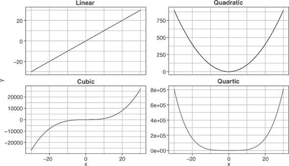

##### 图 10.2. 比较线性拟合和二次拟合在苹果含量与苹果醋酸度之间的假设非线性关系

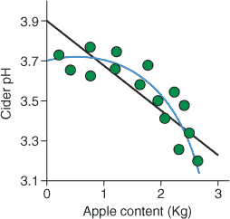

图 10.2 中所示模型的公式将是

+   *y* = β*[apples]* × *apples* + β*[apples]*² × *apples*² + ϵ

其中β*[apples]*²是*apples*²项的*斜率*，这更容易理解为随着苹果含量的增加，线条弯曲的程度（绝对值越大，曲线越极端）。对于单个预测变量，我们可以将任何*n*次多项式关系推广为

+   *y* = β[0] + β[1]*x* + β[1]*x*² + ... β*[n]x^n* + ϵ

其中 *n* 是你正在建模的多项式的最高次数。请注意，在进行多项式回归时，通常还会包括该预测变量的所有低次项。例如，如果你正在建模两个变量之间的四次关系，你会在你的模型定义中包含 *x*，*x*²，*x*³和 *x*⁴ 项。为什么这样做呢？如果我们不在模型中包含低次项，曲线的**顶点**——它变平的部分（取决于曲线弯曲的方向，在曲线的顶部或底部）——被迫通过 *x* = 0。这可能是对模型的一个合理的约束，但通常不是这样。相反，如果我们把低次项包含在模型中，曲线就不需要通过 *x* = 0，并且可以“摇摆”得更多，以（希望）更好地拟合数据。这通过图 10.3 进行了说明。

##### 图 10.3. 比较包含和不包含一次项的多项式函数的形状。垂直虚线表示每个函数顶点在 x 轴上的位置。

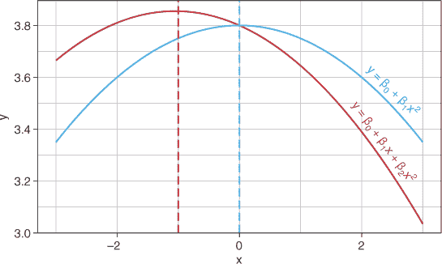

正如我们在第九章中看到的，当模型接收到新数据时，它会将预测变量的值（包括指定的指数）乘以它们的斜率，然后将它们全部与截距相加以得到预测值。我们使用的模型仍然是广义线性模型，因为我们是以**线性**方式组合模型项（将它们相加）。

### 10.2. 更大的灵活性：样条函数和广义加性模型

当在线性回归中使用多项式项时，我们使用的多项式次数越高，我们的模型就越灵活。高次多项式使我们能够捕捉数据中的复杂非线性关系，但因此也更可能过度拟合训练集。有时，增加多项式的次数也没有帮助，因为预测变量和结果变量之间的关系可能不会跨越预测变量的整个范围。在这种情况下，我们不是使用高次多项式，而是可以使用**样条函数**。在本节中，我将解释样条函数是什么，如何使用它们，以及它们与多项式和一组称为**广义加性模型**（GAMs）的模型之间的关系。

样条函数是一种**分段**多项式函数。这意味着它将预测变量分割成若干区域，并在每个区域内拟合一个单独的多项式，这些区域通过节点相互连接。**节点**是沿着预测变量位置的点，它将区域分割成单独多项式拟合的区域。预测变量每个区域的多项式曲线都通过界定该区域的节点。这使我们能够模拟预测变量范围中不恒定的复杂非线性关系。这通过我们的苹果汁示例在图 10.4 中进行了说明。

##### 图 10.4. 将样条拟合到非线性关系。实心点表示节点。单个多项式函数在节点之间拟合数据，并通过它们相互连接。

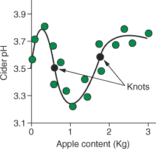

使用样条是一种建模复杂关系的极好方法，如图 10.4 中所示，但这种方法有一些局限性：

+   节点的位置和数量需要手动选择。这两个选择都会对样条形状产生重大影响。节点的位置选择通常是数据中变化明显的区域，或者在预测变量的常规间隔处，例如在四分位数处。

+   需要选择节点之间多项式的次数。我们通常使用三次样条或更高次，因为这些确保多项式通过节点平滑地连接（二次多项式可能在节点处使样条断开）。

+   将不同预测器的样条组合起来可能会变得困难。

那么，我们能否比简单的样条回归做得更好？当然可以。解决方案是 GAMs（广义加性模型）。GAMs 扩展了广义线性模型，使得不再

+   *y* = β[0] + β[1]*x* + β[2]*x*[2] + ... β[2]*x*[2] + ϵ

它们具有以下形式

+   *y* = β[0] + *f*1 + *f*2 + ...*f*k + ϵ

其中每个*f*(*x*)代表特定预测变量的函数。这些函数可以是任何类型的平滑函数，但通常将是多个样条的组合。


##### 注意

你能看出广义线性模型是广义加性模型的一个特例，其中每个预测变量的函数是*恒等函数* (*f*(*x*) = *x*)吗？我们可以更进一步，并说*广义线性*模型是*广义加性*模型的一个特例。这是因为我们还可以使用 GAMs 中的不同连接函数，这使我们能够使用它们来预测分类变量（如逻辑回归）或计数变量。


#### 10.2.1. GAMs 如何学习它们的平滑函数

##### 图 10.5. GAMs 中连续变量的平滑函数通常是多个基函数之和，这些基函数通常是样条。在每个*x*的值处，将三个样条基函数相加来预测*y*的值。虚线显示了三个基函数的和，它模拟了数据中的非线性关系。

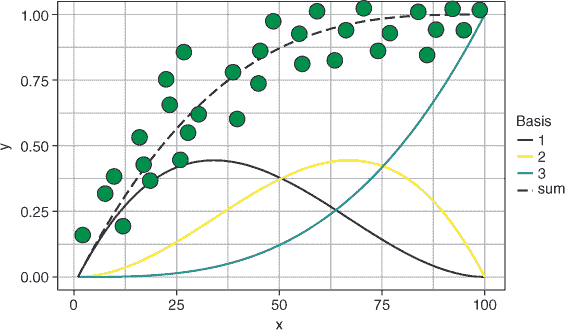

构建这些平滑函数最常见的方法是使用样条函数作为**基函数**。基函数是简单的函数，可以组合成更复杂的函数。请看图 10.5。变量*x*和*y*之间的非线性关系被建模为三个样条函数的加权总和。换句话说，对于*x*的每个值，我们都会将这些基函数的每个贡献相加，从而得到一个模型关系的函数（虚线）。整体函数是一个**加权**的总和，因为每个基函数都有一个相应的权重，决定了它对最终函数的贡献程度。

让我们再次看看 GAM 公式：

+   y = β[0] + *f*1 + *f*2 + ... *f*k + ϵ

因此，每个*f[k]*(*x[k]*)是该特定变量的平滑函数。当这些平滑函数使用样条函数作为基函数时，该函数可以表示为

+   *f*(*x[i]*) = *a*[1]*b*1 + *a*[2]*b*2 + ... + *a[n]b[n]*(*x[i]*)

其中*b*1 是在*x*的特定值处评估的第一个基函数的值，而*a*[1]是第一个基函数的权重。GAMs 通过最小化模型的残差平方误差来估计这些基函数的权重。

GAMs 自动学习每个预测变量和结果变量之间的非线性关系，然后将这些效应线性地加在一起，包括截距。GAMs 通过以下方式克服了在一般线性模型中仅使用样条函数的局限性：

+   自动选择样条函数的节点

+   通过控制基函数的权重来自动选择平滑函数的灵活性程度

+   允许我们同时组合多个预测变量的样条函数

| |
| --- |

##### 小贴士

如果我想使用线性建模，并且我的预测变量和结果变量之间的关系是非线性的，那么 GAMs 是我的首选模型。这是因为它们的灵活性和克服多项式回归局限性的能力。例外情况是，如果我有理论上的理由相信数据中存在特定的多项式关系（比如，二次），在这种情况下，使用带有多项式项的线性回归可能会导致一个更简单的模型，而 GAMs 可能会过拟合。

| |
| --- |

#### 10.2.2\. GAMs 如何处理分类变量

到目前为止，我已经向你展示了 GAMs 如何学习预测变量和结果变量之间的非线性关系。但是，当我们的预测变量是分类变量时怎么办呢？嗯，GAMs 可以通过两种不同的方式处理分类变量。

一种方法是将分类变量处理得与一般线性模型完全相同，并为每个预测变量的每个水平创建* k* - 1 个虚拟变量，以编码每个水平对结果的影响。当我们使用这种方法时，案例的预测值只是所有平滑函数的总和，加上分类变量效应的贡献。这种方法假设分类变量和连续变量之间是独立的（换句话说，平滑函数在分类变量的每个水平上都是相同的）。

另一种方法是为分类变量的每个水平建模一个单独的平滑函数。在连续变量和每个分类变量水平上的结果之间存在明显非线性关系的情况下，这一点很重要。

| |
| --- |

##### 注意

当通过 mlr 指定 GAM 作为我们的学习器时，默认方法是第一种方法。

| |
| --- |

GAMs 对于广泛的机器学习问题来说非常灵活且强大。如果您想深入了解 GAMs 的细节，我推荐 Simon Wood 的《广义加性模型：R 语言导论》（Chapman and Hall/CRC，2017 年）。

我希望到现在为止，您已经对多项式回归和 GAMs 有了基本的了解，所以让我们通过构建您的第一个非线性回归模型来将这种知识转化为技能！

### 10.3. 构建你的第一个 GAM

我们通过检查线性回归模型的诊断图完成了第九章的内容，并决定数据中似乎存在非线性关系。因此，在本节中，我将向您展示如何使用 GAM（广义加性模型）来建模数据，以解释预测变量和结果之间的非线性关系。

我将从一些特征工程开始。从第九章图 9.7 来看，`Month`和`Ozone`之间存在一种曲线关系，夏季达到峰值，冬季下降。因为我们也有月份的日信息，让我们看看是否可以通过结合这两个变量来获得更预测的价值。换句话说，我们不是从年月分辨率来获取数据，而是从年日分辨率来获取数据。

为了实现这一点，我们创建了一个名为`DayOfYear`的新列。我们使用`interaction()`函数生成一个包含`Date`和`Month`变量信息的变量。因为`interaction()`函数返回一个因子，所以我们将其包裹在`as.numeric()`函数中，将其转换为表示年日的数值向量。

| |
| --- |

**练习 1**

为了更好地了解`interaction()`函数的作用，运行以下代码：

```
interaction(1:4, c("a", "b", "c", "d"))
```

| |
| --- |

因为新变量包含了`Date`和`Month`变量的信息，我们使用`select()`函数将它们从数据中删除——它们现在是多余的。然后我们绘制我们的新变量，以查看它与`Ozone`的关系。

##### 列表 10.1\. 创建 `Date` 和 `Month` 之间的交互

```
ozoneForGam <- mutate(ozoneClean,
                      DayOfYear = as.numeric(interaction(Date, Month))) %>%
               select(c(-"Date", -"Month"))

ggplot(ozoneForGam, aes(DayOfYear, Ozone)) +
  geom_point() +
  geom_smooth() +
  theme_bw()
```

结果图显示在 图 10.6 中。啊哈！如果我们使用天而不是月来分辨，臭氧水平和年份之间的关系就更加清晰了。

| |
| --- |

**练习 2**

在图表中添加另一个 `geom_smooth()` 层，使用以下参数将二次多项式线拟合到数据：

+   `method = "lm"`

+   `formula = "y ~` *x* `+ I(x²)"`

+   `col = "red"`

这个多项式关系是否很好地拟合了数据？

| |
| --- |

##### 图 10.6\. 将 `DayOfYear` 变量与臭氧水平绘制成图

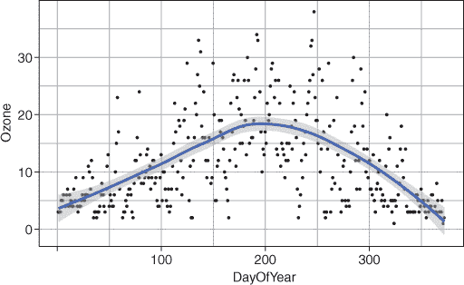

现在我们定义我们的任务、插补包装器和特征选择包装器，就像我们为线性回归模型所做的那样。遗憾的是，mlr 的作者还没有实现普通 GAM 的包装（例如来自 mgcv 包）。然而，我们仍然可以访问 gamboost 算法，该算法使用提升（正如你在第八章中了解的那样）来学习 GAM 模型的集成。因此，对于这个练习，我们将使用 `regr.gamboost` 学习者。除了不同的学习者（`regr.gamboost` 而不是 `regr.lm`），我们创建插补和特征选择包装器的方式与 列表 9.13 中完全相同。

##### 列表 10.2\. 定义任务和包装器

```
gamTask <- makeRegrTask(data = ozoneForGam, target = "Ozone")

imputeMethod <- imputeLearner("regr.rpart")

gamImputeWrapper <- makeImputeWrapper("regr.gamboost",
                                    classes = list(numeric = imputeMethod))

gamFeatSelControl <- makeFeatSelControlSequential(method = "sfbs")

kFold <- makeResampleDesc("CV", iters = 10)

gamFeatSelWrapper <- makeFeatSelWrapper(learner = gamImputeWrapper,
                                        resampling = kFold,
                                        control = gamFeatSelControl)
```

| |
| --- |

##### 注意

mlr 的作者编写它是为了允许几乎任何机器学习算法的集成。如果你想要使用尚未由 mlr 包装的包中的算法，你可以自己实现它，以便可以使用 mlr 的功能。虽然这样做并不超级复杂，但确实需要一些解释。因此，如果你想这样做，我建议遵循 [`mng.bz/gV5x`](http://mng.bz/gV5x) 上的 mlr 教程，它很好地解释了整个过程。

| |
| --- |

剩下的工作就是交叉验证模型构建过程。由于 gamboost 算法比线性回归计算量更大，所以我们只将 `holdout` 作为外部交叉验证的方法。

| |
| --- |

##### 警告

这在我的四核机器上运行大约需要 1.5 分钟。

| |
| --- |

##### 列表 10.3\. 交叉验证 GAM 模型构建过程

```
holdout <- makeResampleDesc("Holdout")

gamCV <- resample(gamFeatSelWrapper, gamTask, resampling = holdout)

gamCV

Resample Result
Task: ozoneForGam
Learner: regr.gamboost.imputed.featsel
Aggr perf: mse.test.mean=16.4009
Runtime: 147.441
```

太好了！我们的交叉验证表明，使用 gamboost 算法对数据进行建模将优于通过线性回归学习到的模型（后者在上一章中给出了平均 MSE 为 22.8）。

现在我们实际上构建一个模型，这样我就可以向您展示如何调查您的 GAM 模型，以了解它们为预测变量学习到的非线性函数。

| |
| --- |

##### 警告

这在我的四核机器上运行大约需要 3 分钟。

| |
| --- |

##### 列表 10.4\. 训练 GAM

```
library(parallel)
library(parallelMap)

parallelStartSocket(cpus = detectCores())

gamModel <- train(gamFeatSelWrapper, gamTask)

parallelStop()

gamModelData <- getLearnerModel(gamModel, more.unwrap = TRUE)
```

首先，我们使用`gamTask`训练一个增强型广义线性混合模型（GAM）。我们可以直接使用`gamFeatSelWrapper`作为我们的学习器，因为它会为我们执行插补和特征选择。为了加快速度，我们可以在运行`train()`函数实际训练模型之前，通过运行`parallelStartSocket()`函数来并行化特征选择。

我们使用`getLearnerModel()`函数提取模型信息。这次，因为我们的学习器是一个包装函数，我们需要提供一个额外的参数，`more.unwrap = TRUE`，来告诉 mlr 它需要一路向下通过包装器来提取基础模型信息。

现在，让我们通过绘制模型为每个预测变量学习到的函数来更好地理解我们的模型。这就像在我们的模型信息上调用`plot()`一样简单。我们还可以通过使用`resid()`函数提取残差来查看模型中的残差。这允许我们绘制预测值（通过提取`$fitted()`组件）与其残差的关系，以寻找表明拟合不良的模式。我们还可以使用`qqnorm()`和`qqline()`将残差的分位数与理论正态分布的分位数进行比较，以查看它们是否呈正态分布。

##### 列表 10.5\. 绘制我们的 GAM

```
par(mfrow = c(3, 3))

plot(gamModelData, type = "l")

plot(gamModelData$fitted(), resid(gamModelData))

qqnorm(resid(gamModelData))

qqline(resid(gamModelData))

par(mfrow = c(1, 1))
```

| |
| --- |

##### 小贴士

由于我们即将为每个预测变量创建一个子图，以及两个残差图，我们首先使用`par()`函数的`mfrow`参数将绘图设备分成九个部分。我们使用相同的函数将其恢复。您可能具有与我不同的预测变量数量，这是从您的特征选择中返回的。

| |
| --- |

结果图显示在图 10.7。对于每个预测变量，我们得到一个其值与该预测变量对其值范围内的臭氧估计贡献的图。线条显示了算法学习到的函数形状，我们可以看到它们都是非线性的。

##### 图 10.7\. 绘制我们的 GAM 学习到的非线性关系。每个图底部的地毯显示了沿 x 轴的每个案例的位置。残差与拟合图（第二行的中间面板）显示了一个表明异方差性的模式，而正态 Q-Q 图（第二行的右侧面板）显示残差呈正态分布。

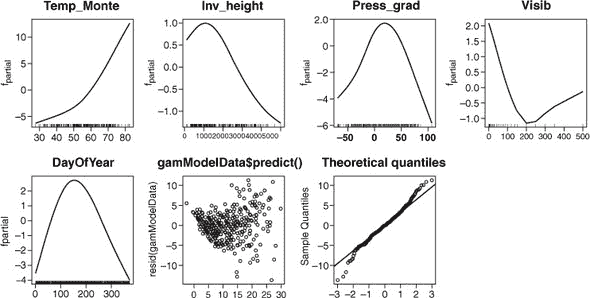

| |
| --- |

##### 小贴士

每个图底部“地毯”状的刻度标记表示训练案例的位置。这有助于我们识别每个变量中案例数量较少的区域，例如在`Visib`变量的顶部。GAM 在案例数量较少的区域有过度拟合的潜力。

| |
| --- |

最后，查看残差图，我们仍然可以看到一个模式，这可能表明数据中的异方差性。我们可以尝试在转换后的`Ozone`变量（如 log[10]）上训练模型，看看这是否有帮助，或者使用不做出这种假设的模型。分位数图显示，大部分残差都靠近对角线，表明它们近似于正态分布，尾部有一些偏差（这是不常见的）。

### 10.4. GAMs 的优势和劣势

虽然通常不容易判断哪些算法会对给定的任务表现良好，但以下是一些优势和劣势，这将帮助您决定 GAMs 是否会对您表现良好。

GAMs 的优势如下：

+   尽管是非线性的，但它们产生的模型非常可解释。

+   它们可以处理连续和分类预测变量。

+   它们可以自动学习数据中的非线性关系。

GAMs 的劣势如下：

+   它们仍然对数据做出强烈的假设，例如同方差性和残差的分布（如果违反这些假设，性能可能会受到影响）。

+   GAMs 倾向于过度拟合训练集。

+   GAMs 在预测训练集值范围之外的数据时可能特别差。

+   它们无法处理缺失数据。

| |
| --- |

**练习 3**

正如第九章练习 3 中所述，而不是使用包装器方法，使用 filter 方法交叉验证构建我们的 GAM 的过程。估计的 MSE 值是否相似？哪种方法更快？提示：

1.  首先，创建一个 filter 包装器，使用`gamImputeWrapper`作为学习器。

1.  定义一个超参数空间以调整`"fw.abs"`，使用`makeParamSet()`。

1.  使用`makeTuneControlGrid()`创建一个网格搜索定义。

1.  定义一个 tune 包装器，它接受 filter 包装器作为学习器并执行网格搜索。

1.  使用`resample()`执行交叉验证，使用 tune 包装器作为学习器。

| |
| --- |

### 摘要

+   多项式项可以包含在线性回归中，以模拟预测变量和结果之间的非线性关系。

+   广义加性模型（GAMs）是用于回归问题的监督学习器，可以处理连续和分类预测变量。

+   GAMs 使用直线方程，但允许预测变量和结果之间存在非线性关系。

+   GAMs 学习的非线性函数通常是通过对一系列基函数求和创建的样条函数。

### 练习题解答

1.  尝试使用`interaction()`函数：

    ```
    interaction(1:4, c("a", "b", "c", "d"))
    ```

1.  添加一个`geom_smooth()`层，将二次关系拟合到数据中：

    ```
    ggplot(ozoneForGam, aes(DayOfYear, Ozone)) +
      geom_point() +
      geom_smooth() +
      geom_smooth(method = "lm", formula = "y ~ x + I(x²)", col = "red") +
      theme_bw()

    # The quadratic polynomial does a pretty good job of modeling the
    # relationship between the variables.
    ```

1.  使用 filter 方法交叉验证构建 GAM：

    ```
    filterWrapperImp <- makeFilterWrapper(learner = gamImputeWrapper,
                                       fw.method = "linear.correlation")

    filterParam <- makeParamSet(
      makeIntegerParam("fw.abs", lower = 1, upper = 12)
    )

    gridSearch <- makeTuneControlGrid()

    tuneWrapper <- makeTuneWrapper(learner = filterWrapperImp,
                                   resampling = kFold,
                                   par.set = filterParam,
                                   control = gridSearch)

    filterGamCV <- resample(tuneWrapper, gamTask, resampling = holdout)

    filterGamCV
    ```

## 第十一章. 使用岭回归、LASSO 和弹性网络防止过度拟合

*本章涵盖*

+   在回归问题中管理过度拟合

+   理解正则化

+   使用 L1 和 L2 范数来收缩参数

我们的社会充满了制衡。在我们的政治体系中，政党相互制衡（理论上）以找到既不是彼此观点的极端解决方案。专业领域，如金融服务，有监管机构来防止它们做错事，并确保他们所说的和所做的是真实和正确的。当涉及到机器学习时，我们发现我们可以将我们自己的形式应用于学习过程，以防止算法过度拟合训练集。我们将这种机器学习中的制衡称为*正则化*。

### 11.1. 什么是正则化？

在本节中，我将解释正则化是什么以及为什么它有用。正则化（有时也称为*收缩*）是一种防止模型参数变得过大并将它们“缩小”到 0 的技术。正则化的结果是，当在新数据上做出预测时，模型具有更小的方差。

| |
| --- |

##### 注意

回想一下，当我们说一个模型有“更小的方差”时，我们的意思是它在新的数据上做出更稳定的预测，因为它对训练集中的噪声不太敏感。

| |
| --- |

虽然我们可以将正则化应用于大多数机器学习问题，但它最常用于线性建模，其中它将每个预测器的斜率参数缩小到 0。以下三种特别著名且常用的线性模型正则化技术如下：

+   岭回归

+   最小绝对收缩和选择算子（LASSO）

+   弹性网络

这三种技术可以被视为线性模型的扩展，用于减少过拟合。因为它们将模型参数缩小到 0，它们还可以通过强制信息量少的预测器对预测没有或可忽略的影响来自动执行特征选择。

| |
| --- |

##### 注意

当我说“线性建模”时，我指的是使用我在第九章和第十章中展示的广义线性模型、广义线性模型或广义加性模型对数据进行建模。

| |
| --- |

到本章结束时，我希望你能对正则化是什么、它是如何工作的以及为什么它很重要有一个直观的理解。你将了解岭回归和 LASSO 是如何工作的以及它们为什么有用，以及弹性网络是如何结合两者的。最后，你将构建岭回归、LASSO 和弹性网络模型，并使用基准测试来比较它们以及与没有正则化的线性回归模型。

### 11.2. 什么是岭回归？

在本节中，我将向您展示岭回归是什么，它是如何工作的，以及为什么它是有用的。请查看图 11.1，这是我从第三章中复制的示例。我在第三章中使用这个图向您展示分类问题中欠拟合和过拟合的样子。当我们欠拟合问题时，我们会以一种无法很好地捕捉决策边界附近局部差异的方式划分特征空间。当我们过拟合时，我们过于重视这些局部差异，最终得到的决策边界捕捉了训练集中的大部分噪声，导致决策边界过于复杂。

##### 图 11.1\. 对于二分类问题的欠拟合、最佳拟合和过拟合的示例。虚线代表决策边界。


现在请看图 11.2，它展示了欠拟合和过拟合在回归问题中的样子。当我们欠拟合数据时，我们会错过关系中的局部差异，并产生一个具有高偏差（做出不准确预测）的模型。当我们过拟合数据时，我们的模型对关系的局部差异过于敏感，具有高方差（将在新数据上做出非常变化的预测）。

##### 图 11.2\. 对于单预测回归问题的欠拟合、最佳拟合和过拟合的示例。虚线代表回归线。

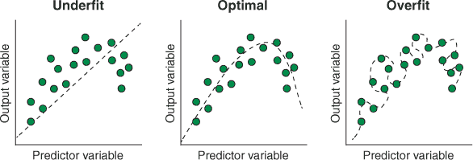

| |
| --- |

##### 注意

我用来阐述这个观点的例子是一个非线性关系，但这个例子也适用于线性关系模型。

| |
| --- |

正则化的主要任务是防止算法学习过拟合的模型，通过不鼓励复杂性来实现。这是通过惩罚大的模型参数，将它们缩小到 0 来实现的。这听起来可能有些反直觉：普通最小二乘法（OLS，见第九章）学习的模型参数无疑是最好的，因为它们最小化了残差误差。问题是，这只有在训练集上是必要的，而不是在测试集上。

考虑图 11.3 中的例子。在左侧图中，假设我们只测量了两个较深阴影的案例。OLS 会学习一条穿过这两个案例的线，因为这会最小化平方和。我们在研究中收集了更多的案例，当我们将它们绘制在右侧图中时，我们可以看到我们最初训练的模型对新数据推广得不好。这是由于*抽样误差*，即我们样本案例中的数据分布与我们要进行预测的更广泛群体中的数据分布之间的差异。在这个（稍微有些人为的）案例中，因为我们只测量了两个案例，样本并不能很好地代表更广泛的群体，我们学习到的模型过度拟合了训练集。

这就是正则化的作用所在。虽然 OLS 会学习最适合训练集的模型，但训练集可能并不能完美地代表更广泛的群体。过度拟合训练集更有可能导致模型参数过大，因此正则化会给最小二乘法添加一个惩罚项，该惩罚项随着估计的模型参数增大而增大。这个过程通常会给模型添加一点偏差，因为我们有意地欠拟合训练集，但模型方差减少通常会导致更好的模型。这在预测者与案例之间的比例很大的情况下尤其正确。

##### 图 11.3. 抽样误差导致模型无法很好地推广到新数据。在左侧示例中，拟合回归线时只考虑了较深阴影的案例。在右侧示例中，使用了所有案例来构建回归线。虚线有助于表明左侧的斜率幅度大于右侧。

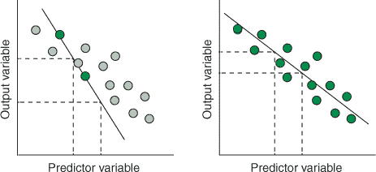

| |
| --- |

##### 注意

你的数据集代表更广泛群体的程度取决于你精心规划数据获取、避免在实验设计中引入偏差（或者如果数据已经存在，识别并纠正它），并确保你的数据集足够大，以便学习真实模式。如果你的数据集不能很好地代表更广泛的群体，没有任何机器学习技术，包括交叉验证，能够帮助你！

| |
| --- |

因此，正则化可以帮助防止由于采样误差导致的过拟合，但正则化可能更为重要的用途是防止包含虚假预测因子。如果我们向现有的线性回归模型中添加预测因子，我们很可能会在训练集上得到更好的预测。这可能会让我们（错误地）相信，通过包含更多的预测因子，我们正在创建一个更好的模型。这有时被称为*厨房水槽回归*（因为所有东西都放进去，包括厨房水槽）。例如，想象一下，您想预测某一天公园的人数，并且您将那天 FTSE 100 的值作为一个预测因子。除非公园靠近伦敦证券交易所，否则 FTSE 100 的值不太可能对公园的人数有影响。保留这个虚假预测因子在模型中可能会导致训练集过拟合。因为正则化会缩小这个参数，它将减少模型过拟合训练集的程度。

正则化也可以帮助解决那些*病态的*问题。数学中的病态问题是那些不满足以下三个条件的问题：有解、有唯一解以及解依赖于初始条件。在统计建模中，一个常见的病态问题是当参数的数量高于案例数量时，通常会遇到没有最优参数值的情况。在这种情况下，正则化可以使估计参数的问题更加稳定。

我们添加到最小二乘估计中的这种惩罚看起来是什么样子？常用的两种惩罚是 L1 范数和 L2 范数。我将首先向您展示 L2 范数是什么以及它是如何工作的，因为这是岭回归中使用的正则化方法。然后，我将扩展这个概念向您展示 LASSO 如何使用 L1 范数方法，以及弹性网络如何结合 L1 和 L2 范数。

### 11.3. L2 范数是什么，岭回归是如何使用它的？

在本节中，我将向您展示 L2 范数的数学和图形解释，岭回归如何使用它，以及为什么您会使用它。想象一下，您想根据当天的温度预测您当地的公园会有多繁忙。这个数据可能看起来的一个例子如图 11.4 所示。

##### 图 11.4. 基于温度预测公园人数的模型计算平方和

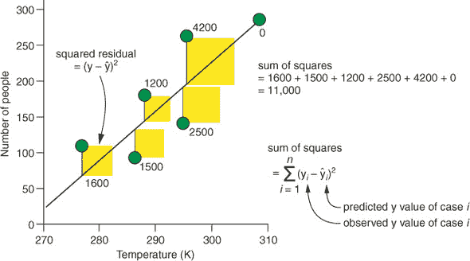

| |
| --- |

##### 注意

我意识到可能有人来自使用华氏度或摄氏度来测量温度的国家，所以我展示了开尔文尺度，让每个人都同样感到烦恼。

| |
| --- |

当使用 OLS 时，对于每个截距和斜率的特定组合，都会计算每个案例的残差并平方。然后，将这些平方残差全部加起来，得到平方和。我们可以在数学符号中表示为方程 11.1。

##### 方程 11.1.

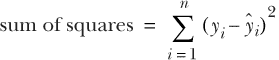

*y[i]*是案例*i*的因变量值，而ŷ*[i]*是模型预测的值。这是每个案例与线的垂直距离。希腊字母 sigma 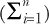简单地意味着我们计算这个垂直距离并将其平方，对于从第一个案例(*i* = 1)到最后一个案例(*n*)的所有案例，然后将所有这些值加起来。

机器学习算法通过最小化参数的最佳组合来选择数学函数，这些函数被称为*损失函数*。因此，最小二乘法是 OLS 算法的损失函数。

岭回归稍微修改了最小二乘损失函数，以包括一个使函数值随着参数估计值的增大而增大的项。因此，算法现在必须平衡选择最小化平方和的模型参数，以及选择最小化这个新惩罚的参数。在岭回归中，这个惩罚被称为*L2 范数*，它非常容易计算：我们只需将所有模型参数平方并相加（除了截距）。当我们只有一个连续预测因子时，我们只有一个参数（斜率），所以 L2 范数就是它的平方。当我们有两个预测因子时，我们分别平方每个斜率，然后将这些平方相加，依此类推。这在我们公园的例子中图 11.5 中得到了说明。

##### 图 11.5. 计算温度和公园人数之间的斜率的平方和与 L2 范数。

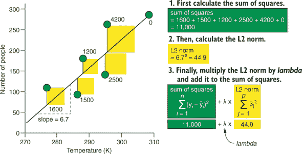

| |
| --- |

##### 注意

你能看出，一般来说，模型拥有的预测因子越多，其 L2 范数就越大，因为我们正在将它们的平方相加吗？因此，岭回归正则化惩罚过于复杂的模型（因为它们有太多的预测因子）。

| |
| --- |

为了我们可以控制我们想要惩罚模型复杂性的程度，我们将 L2 范数乘以一个称为*lambda*（λ，因为希腊字母听起来总是很酷）的值。*Lambda*可以是 0 到无穷大之间的任何值，它充当一个音量旋钮：*lambda*的大值会强烈惩罚模型复杂性，而小值会弱化惩罚模型复杂性。*Lambda*不能从数据中估计出来，因此它是一个需要通过交叉验证调整的超参数，以实现最佳性能。一旦我们计算出 L2 范数并将其乘以*lambda*，然后我们再将这个乘积加到平方和中，以得到我们的惩罚最小二乘损失函数。

| |
| --- |

##### 注意

如果我们将*lambda*设为 0，这将从方程中移除 L2 范数惩罚，我们就会回到 OLS 损失函数。如果我们将*lambda*设为一个非常大的值，所有斜率都会收缩到接近 0。

| |
| --- |

如果我们数学思维，那么我们可以用数学符号表示，如方程 11.2。你能看出这与方程 11.1 中的平方和相同，但我们增加了λ和 L2 范数项吗？

##### 方程 11.2。

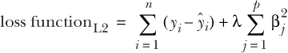

因此，岭回归学习一组模型参数，以最小化这个新的损失函数。想象一下我们有很多预测因子的情况。OLS 可能估计一组模型参数，这些参数在最小化平方损失函数方面做得很好，但这个组合的 L2 范数可能非常大。在这种情况下，岭回归将估计一组参数，这些参数的平方损失值略高，但 L2 范数显著降低。因为当模型参数较小时，L2 范数会变小，所以岭回归估计的斜率可能会比 OLS 估计的斜率小。


##### 重要

当使用 L2 或 L1 惩罚损失函数时，关键是要首先对预测变量进行缩放（除以它们的标准差，使它们处于相同的尺度）。这是因为我们在添加平方斜率（在 L2 正则化的情况下），这个值对于较大尺度的预测因子（例如毫米与千米）将会大得多。如果我们不首先缩放预测变量，它们将不会得到同等的重要性。


如果你更喜欢图形化的解释 L2 惩罚损失函数（我知道我确实如此），请查看图 11.6。x 轴和 y 轴显示两个斜率参数（β[1]和β[2]）的值。阴影轮廓线代表两个参数不同组合的不同平方和值，其中导致最小平方和的组合位于轮廓的中心。以 0 为中心的虚线圆代表乘以不同λ值的 L2 范数，对于β[1]和β[2]的组合，虚线穿过。

##### 图 11.6。岭回归惩罚的图形表示。x 轴和 y 轴代表两个模型参数的值。实心、同心圆代表参数不同组合的平方和值。虚线圆代表乘以λ值的 L2 范数。

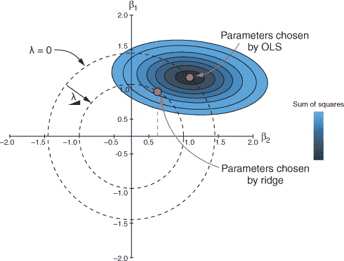

注意，当λ = 0 时，圆通过最小化平方和的β[1]和β[2]的组合。当λ增加时，圆对称地向 0 缩小。现在，最小化惩罚损失函数的参数组合是位于圆上的最小平方和组合。换句话说，使用岭回归的最优解总是在圆和围绕 OLS 估计的椭圆的交点处。你能看出随着λ的增加，圆缩小，所选的模型参数组合被吸向 0 吗？


##### 备注

在这个例子中，我展示了 L2 正则化对两个斜率参数的应用。如果我们只有一个斜率，我们将在数轴上表示相同的过程。如果我们有三个参数，在三维空间中也会同样适用，惩罚圆将变成惩罚球体。这将继续适用于你拥有的非截距参数的维度数（其中惩罚变成超球体）。


因此，通过使用 L2 惩罚的损失函数来学习斜率参数，岭回归阻止我们训练过度拟合训练数据的模型。


##### 注意

在计算 L2 范数时，不包括截距，因为它是当所有斜率参数都等于 0 时结果变量的值。


### 11.4\. L1 范数是什么，LASSO 如何使用它？

现在你已经了解了岭回归，学习 LASSO 的工作原理将是你对已学知识的简单扩展。在本节中，我将向你展示 L1 范数是什么，它与 L2 范数有何不同，以及最小绝对收缩和选择算子（LASSO）如何使用它来收缩参数估计。

让我们回顾一下 L2 范数在 方程式 11.3 中的样子。回想一下，我们平方每个斜率参数的值并将它们全部加起来。然后我们将这个 L2 范数乘以 *lambda* 以得到我们添加到平方损失函数总和的惩罚项。

##### 方程式 11.3\.

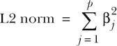

L1 范数与 L2 范数只有细微的差别。我们不是平方参数值，而是取它们的绝对值，然后求和。这通过 方程式 11.4 中的 β*[j]* 周围的垂直线来表示。

##### 方程式 11.4\.

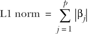

我们以与岭回归相同的方式创建 LASSO（L1 惩罚的损失函数）：我们将 L1 范数乘以 *lambda*（具有相同的意义）并将其添加到平方和。L1 惩罚的损失函数在 方程式 11.5 中显示。注意，这个方程与 方程式 11.2 的唯一区别在于，我们在求和之前取参数的绝对值，而不是平方它们。假设我们有三个斜率，其中一个是负数：2.2，–3.1，0.8\. 这三个斜率的 L1 范数将是 2.2 + 3.1 + 0.8 = 6.1。

##### 方程式 11.5\.

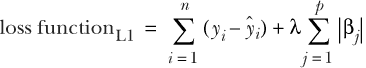

我已经能听到你在想，“那又怎样？使用 L1 范数而不是 L2 范数有什么好处/区别？”好吧，岭回归可以将参数估计值缩小到 0，但它们永远不会真正**是**0（除非 OLS 估计一开始就是 0）。所以如果你有一个机器学习任务，你相信所有变量都应该有一定的预测价值，岭回归是非常好的，因为它不会移除任何变量。但如果你有很多变量，或者你想要一个能够为你进行特征选择的算法呢？LASSO 在这里很有帮助，因为与岭回归不同，LASSO**确实**能够将小的参数值缩小到 0，从而有效地从模型中移除那个预测因子。

让我们以与岭回归相同的方式图形化地表示这一点。图 11.7 显示了与图 11.6 中相同的两个假设参数的平方和的等高线。LASSO 惩罚形成的是一个正方形，旋转了 45 度，使得其顶点沿着轴（我想你可以称之为一个菱形）。你能看到，对于与我们的岭回归示例中相同的*lambda*，接触菱形的具有最小平方和的参数组合是参数β[2]为 0 的那个吗？这意味着代表这个参数的预测因子已经被从模型中移除了。

##### 图 11.7\. LASSO 惩罚的图形表示。x 轴和 y 轴代表两个模型参数的值。实心、同心圆代表参数的不同组合的平方和值。虚线菱形代表乘以*lambda*的 L2 范数。

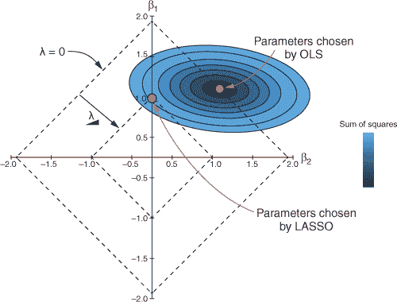


##### 注意

如果我们有三个参数，我们可以将 LASSO 惩罚表示为一个立方体（其顶点与轴对齐）。在超过三个维度中可视化这一点是困难的，但 LASSO 惩罚将是一个超立方体。


为了使这一点更加清晰，我在图 11.8 中叠加了 LASSO 和岭回归的惩罚，包括突出显示每种方法选择的参数值的虚线。

### 11.5\. 弹性网络是什么？

在本节中，我将向你展示弹性网络是什么，以及它是如何混合 L2 和 L1 正则化，在岭回归和 LASSO 参数估计之间找到一个折衷方案的。有时你可能有一个先验的理由来解释为什么你想使用岭回归或 LASSO。然而，如果你认为必须将所有预测因子包括在模型中，无论它们的贡献有多小，那么使用岭回归。如果你想算法通过将无信息斜率缩小到 0 来为你进行特征选择，那么使用 LASSO。但通常情况下，岭回归和 LASSO 之间的选择并不是一个明确的选择。在这种情况下，**不要**在它们之间做出选择：使用弹性网络。

##### 图 11.8\. 比较岭回归和 LASSO 惩罚

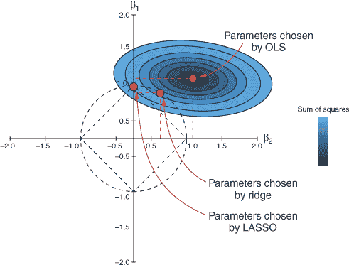


##### 注意

LASSO 的一个重要限制是，如果你有比案例更多的预测变量，它最多会选择与数据中案例数量相等的预测变量数量。换句话说，如果你的数据集包含 100 个预测变量和 50 个案例，LASSO 将至少将 50 个预测变量的斜率设置为 0！

| |
| --- |

弹性网络是线性建模的扩展，其损失函数中包括 L2 和 L1 正则化。它找到岭回归和 LASSO 找到的参数估计值之间的组合。我们还可以使用超参数*alpha*来控制我们对 L2 范数和 L1 范数的重视程度。

看一下方程 11.6。我们乘以 L2 范数和 1-α，乘以 L1 范数和α，然后将这些值相加。我们将这个值乘以*lambda*并加到平方和上。*Alpha*在这里可以取 0 到 1 之间的任何值：

+   当*alpha*为 0 时，L1 范数变为 0，我们得到岭回归。

+   当*alpha*为 1 时，L2 范数变为 0，我们得到 LASSO。

+   当*alpha*介于 0 和 1 之间时，我们得到岭回归和 LASSO 的混合。

我们如何选择*alpha*？我们不做！我们将其作为超参数进行调整，让交叉验证为我们选择最佳性能的值。

##### 方程 11.6.

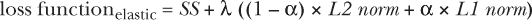

如果你更倾向于数学，完整的弹性网络损失函数在方程 11.7 中显示。如果你不倾向于数学，请随意跳过；但如果你仔细看，我相信你一定能看到弹性网络损失函数是如何结合岭回归和 LASSO 损失函数的。

##### 方程 11.7.

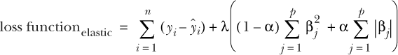

倾向于图形解释？是的，我也是。图 11.9 比较了岭回归、LASSO 和弹性网络惩罚的形状。因为弹性网络惩罚介于岭回归和 LASSO 惩罚之间，它看起来像一个边角圆润的方形。

##### 图 11.9. 比较岭回归、LASSO 和弹性网络惩罚的形状

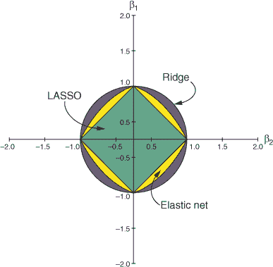

那么为什么我们可能更倾向于弹性网络而不是岭回归或 LASSO 呢？嗯，弹性网络可以将参数估计值缩小到 0，使其能够像 LASSO 一样进行特征选择。但它也避免了 LASSO 无法选择比案例更多的变量的限制。LASSO 的另一个限制是，如果有一组预测变量彼此相关，LASSO 只会选择其中一个预测变量。另一方面，弹性网络能够保留这组预测变量。

由于这些原因，我通常直接选择弹性网络作为我的正则化方法。即使纯岭回归或 LASSO 会产生性能最佳的模型，调整 *alpha* 作为超参数的能力仍然允许选择岭回归或 LASSO，尽管最佳解通常位于它们之间。一个例外是当我们对我们模型中包含的预测变量的影响有先验知识时。如果我们有非常强的领域知识，认为预测变量应该包含在模型中，那么我们可能更喜欢岭回归。相反，如果我们有一个强烈的先验信念，认为有一些变量可能没有任何贡献（但我们不知道是哪些），我们可能更喜欢 LASSO。

我希望我已经传达了如何使用正则化来扩展线性模型以避免过拟合。现在你也应该对岭回归、LASSO 和弹性网络有一个概念性的理解，所以让我们通过训练每个模型来将概念转化为经验！

### 11.6\. 构建你的第一个岭回归、LASSO 和弹性网络模型

在本节中，我们将使用相同的数据集构建岭回归、LASSO 和弹性网络模型，并使用基准测试来比较它们之间的性能以及与普通（未正则化）线性模型的性能。想象一下，你正在尝试估算爱荷华州下一年度的市场小麦价格。市场价格取决于那一年的产量，因此你正在尝试通过降雨量和温度测量来预测小麦产量。让我们首先加载 mlr 和 tidyverse 包：

```
library(mlr)

library(tidyverse)
```

#### 11.6.1\. 加载和探索 Iowa 数据集

现在，让我们加载数据，该数据内置在 lasso2 包中，将其转换为 tibble（使用 `as_tibble()`），并对其进行探索。

| |
| --- |

##### 注意

你可能需要首先使用 `install.packages("lasso2")` 安装 lasso2 包。

| |
| --- |

我们有一个包含仅 33 个案例和 10 个变量的 tibble，这些变量包括各种降雨量和温度测量值、年份和小麦产量。

##### 列表 11.1\. 加载和探索 `Iowa` 数据集

```
data(Iowa, package = "lasso2")

iowaTib <- as_tibble(Iowa)

iowaTib

# A tibble: 33 x 10
    Year Rain0 Temp1 Rain1 Temp2 Rain2 Temp3 Rain3 Temp4 Yield
   <int> <dbl> <dbl> <dbl> <dbl> <dbl> <dbl> <dbl> <dbl> <dbl>
 1  1930  17.8  60.2  5.83  69    1.49  77.9  2.42  74.4  34
 2  1931  14.8  57.5  3.83  75    2.72  77.2  3.3   72.6  32.9
 3  1932  28.0  62.3  5.17  72    3.12  75.8  7.1   72.2  43
 4  1933  16.8  60.5  1.64  77.8  3.45  76.4  3.01  70.5  40
 5  1934  11.4  69.5  3.49  77.2  3.85  79.7  2.84  73.4  23
 6  1935  22.7  55    7     65.9  3.35  79.4  2.42  73.6  38.4
 7  1936  17.9  66.2  2.85  70.1  0.51  83.4  3.48  79.2  20
 8  1937  23.3  61.8  3.8   69    2.63  75.9  3.99  77.8  44.6
 9  1938  18.5  59.5  4.67  69.2  4.24  76.5  3.82  75.7  46.3
10  1939  18.6  66.4  5.32  71.4  3.15  76.2  4.72  70.7  52.2
# ... with 23 more rows
```

让我们绘制数据以更好地理解其中的关系。我们将使用我们常用的技巧来收集数据，以便我们可以按每个变量进行分面，将 `"free_x"` 作为 `scales` 参数，以允许 x 轴在分面之间变化。为了得到与 `Yield` 之间任何线性关系的指示，我还应用了一个 `geom_smooth` 层，使用 `"lm"` 作为 `method` 参数以获取线性拟合。

##### 列表 11.2\. 绘制数据

```
iowaUntidy <- gather(iowaTib, "Variable", "Value", -Yield)

ggplot(iowaUntidy, aes(Value, Yield)) +
  facet_wrap(~ Variable, scales = "free_x") +
  geom_point() +
  geom_smooth(method = "lm") +
  theme_bw()
```

最终的图表显示在图 11.10 中。看起来一些变量与`Yield`相关联；但请注意，因为我们没有大量的案例，如果我们只移除 x 轴极端附近的一两个案例，这些关系中的某些斜率可能会急剧变化。例如，如果我们没有测量那三个降雨量最高的案例，`Rain2`和`Yield`之间的斜率会接近那么陡峭吗？我们需要正则化来防止这个数据集过拟合。

##### 图 11.10\. 将每个预测变量与`Iowa`数据集中的小麦产量进行绘图。线条代表每个预测变量和产量之间的线性模型拟合。

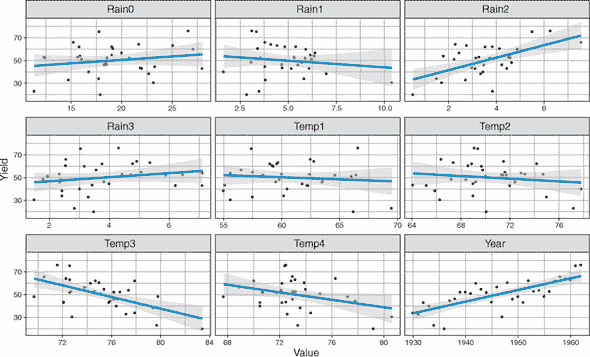

#### 11.6.2\. 训练岭回归模型

在本节中，我将指导你训练一个岭回归模型来从我们的`Iowa`数据集中预测`Yield`。我们将调整*lambda*超参数，并使用其最佳值来训练模型。

让我们定义我们的任务和学习器，这次将`"regr.glmnet"`作为`makeLearner()`的参数。方便的是，`glmnet`函数（来自同名包）允许我们使用相同的函数创建岭回归、LASSO 和弹性网络模型。请注意，我们在这里将*alpha*的值设为 0。这就是我们如何指定我们想要使用纯岭回归的`glmnet`函数。我们还提供了一个你之前没有见过的参数：`id`。`id`参数只是让我们为每个学习器提供一个唯一的名称。我们需要这个参数的原因是，在本章的后面部分，我们将基准测试我们的岭回归、LASSO 和弹性网络学习器。因为我们使用相同的`glmnet`函数创建它们，所以我们会得到一个错误，因为它们不会有唯一的标识符。

##### 列表 11.3\. 创建任务和学习器

```
iowaTask <- makeRegrTask(data = iowaTib, target = "Yield")

ridge <- makeLearner("regr.glmnet", alpha = 0, id = "ridge")
```

让我们了解每个预测变量对模型预测`Yield`能力的贡献程度。我们可以使用我们在第九章中使用的`generateFilterValuesData()`和`plotFilterValues()`函数，当时我们使用过滤方法进行特征选择。

##### 列表 11.4\. 生成和绘制过滤值

```
filterVals <- generateFilterValuesData(iowaTask)

plotFilterValues(filterVals) + theme_bw()
```

最终的图表显示在图 11.11 中。我们可以看到`Year`包含关于`Yield`的最多的预测信息；`Rain3`、`Rain1`和`Rain0`似乎贡献很小；而`Temp1`似乎有负贡献，这表明将其包含在模型中将损害预测精度。

但我们不会执行特征选择。相反，我们将输入所有预测变量，并让算法缩小对模型贡献较小的那些变量。我们需要做的第一件事是调整控制参数估计惩罚大小的*lambda*超参数。

| |
| --- |

##### 备注

记住，当*lambda*等于 0 时，我们正在应用无惩罚并得到 OLS 参数估计。*lambda*越大，参数就越会被压缩到 0。

| |
| --- |

##### 图 11.11。绘制`generateFilterValuesData()`的结果。条形高度表示每个预测变量包含多少关于小麦产量的信息。

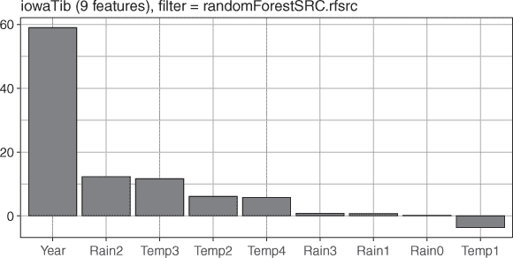

我们将首先定义我们要搜索的超参数空间，以找到*lambda*的最佳值。回想一下，为了做到这一点，我们使用`makeParamSet()`函数，将每个要搜索的超参数通过逗号分隔开来。因为我们只有一个超参数需要调整，而且因为*lambda*可以取 0 到无穷大之间的任何数值，所以我们使用`makeNumericParam()`函数来指定我们想要搜索 0 到 15 之间的*lambda*的数值。

| |
| --- |

##### 注意

注意，我使用的是超参数`"s"`而不是`"lambda"`。如果你运行`getParamSet(ridge)`，你确实会看到一个名为*lambda*的可调整超参数，那么`"s"`是怎么回事呢？glmnet 的作者们很贴心地这样写，以便为我们构建一系列*lambda*值的模型。然后我们可以绘制*lambda*值，看看哪一个给出了最佳的交叉验证性能。这很方便，但鉴于我们正在使用 mlr 作为许多机器学习包的通用接口，我们以我们习惯的方式自己调整*lambda*是有意义的。glmnet 的*lambda*超参数用于指定要尝试的*lambda*值的*序列*，作者们特别建议不要为这个超参数提供一个单一值。相反，*s*超参数用于训练一个使用单个、特定*lambda*的模型，因此这就是我们在使用 mlr 时将要调整的内容。有关更多信息，我建议通过运行`?glmnet::glmnet`来阅读 glmnet 的文档。

| |
| --- |

接下来，让我们使用`makeTuneControlRandom()`定义我们的搜索方法为随机搜索，200 次迭代，并定义我们的交叉验证方法为重复 5 次的 3 折交叉验证，使用`makeResampleDesc()`。最后，我们使用`tuneParams()`函数运行我们的超参数调整过程。为了加快速度，让我们使用`parallelStartSocket()`来并行化搜索。

| |
| --- |

##### 警告

这在我的四核机器上大约需要 30 秒。

| |
| --- |

##### 列表 11.5。调整*lambda* (*s*)超参数

```
ridgeParamSpace <- makeParamSet(
  makeNumericParam("s", lower = 0, upper = 15))

randSearch <- makeTuneControlRandom(maxit = 200)

cvForTuning <- makeResampleDesc("RepCV", folds = 3, reps = 10)

library(parallel)
library(parallelMap)

parallelStartSocket(cpus = detectCores())

tunedRidgePars <- tuneParams(ridge, task = iowaTask,
                             resampling = cvForTuning,
                             par.set = ridgeParamSpace,
                             control = randSearch)

parallelStop()

tunedRidgePars

Tune result:
Op. pars: s=6.04
mse.test.mean=96.8360
```

我们的选择过程选择了 6.04 作为最佳性能的*lambda*（由于随机搜索，你的可能略有不同）。但我们如何确保我们搜索了足够大的*lambda*值范围？让我们绘制每个*lambda*值与其模型平均 MSE 的对应关系，看看是否可能存在搜索空间之外（大于 15）的更好值。

首先，我们通过将我们的调整对象作为 `generateHyperParsEffectData()` 函数的参数，提取每次随机搜索的 *lambda* 和均方误差 (MSE) 值。然后，我们将这些数据作为 `plotHyperParsEffect()` 函数的第一个参数，并告诉它我们想在 x 轴上绘制 *s* 的值，在 y 轴上绘制均方误差 ("mse.test.mean")，并且我们想要一条连接数据点的线。

##### 列表 11.6\. 绘制超参数调整过程

```
ridgeTuningData <- generateHyperParsEffectData(tunedRidgePars)

plotHyperParsEffect(ridgeTuningData, x = "s", y = "mse.test.mean",
                    plot.type = "line") +
  theme_bw()
```

结果图显示在 图 11.12 中。我们可以看到，当 *lambda* 在 5 和 6 之间时，MSE 最小化，并且看起来当 *lambda* 超过 6 时，模型的表现会变差。如果 MSE 在搜索空间的边缘似乎仍在下降，我们就需要扩大搜索范围，以防我们错过了更好的超参数值。因为我们看起来已经达到了最小值，所以我们将在这里停止搜索。

##### 图 11.12\. 绘制岭回归 *lambda* 调整过程。x 轴代表 *lambda*，y 轴代表均方误差。点代表随机搜索中采样的 *lambda* 值。线连接这些点。

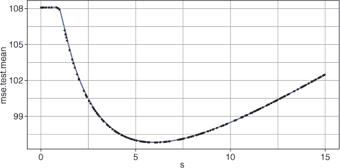


##### 注意

也许我太急躁了，因为我们可能只是处于一个 *局部最小值*，即与周围 *lambda* 值相比最小的 MSE 值。在搜索超参数空间时，可能会有许多局部最小值（*minimum* 的复数形式）；但我们真正想要找到的是 *全局最小值*，这是所有可能的超参数值中的最低 MSE 值。例如，想象一下，如果我们继续增加 *lambda*，MSE 会先升高然后开始下降，形成一个山丘。这个山丘可能比 图 11.12 中显示的最小值下降得更多。因此，真正搜索超参数空间以尝试找到那个全局最小值是一个好主意。

|  |

**练习 1**

重复调整过程，但这次将搜索空间扩大到包括 0 到 50 之间的 *s* 值（不要覆盖任何内容）。我们的原始搜索是否找到了局部最小值或全局最小值？


好的，既然我们认为我们已经选择了最佳性能的 *lambda* 值，那么我们就用这个值来训练一个模型。首先，我们使用 `setHyperPars()` 函数定义一个新的学习器，使用我们调整过的 *lambda* 值。然后，我们使用 `train()` 函数在 `iowaTask` 上训练模型。

##### 列表 11.7\. 使用调整过的 *lambda* 训练岭回归模型

```
tunedRidge <- setHyperPars(ridge, par.vals = tunedRidgePars$x)

tunedRidgeModel <- train(tunedRidge, iowaTask)
```

使用线性模型的主要动机之一是我们可以通过解释斜率来了解结果变量随着每个预测变量的变化情况。所以让我们从岭回归模型中提取参数估计。首先，我们使用`getLearnerModel()`函数提取模型数据。然后，我们使用`coef()`函数（简称*系数*）来提取参数估计。请注意，由于 glmnet 的工作方式，我们需要提供*lambda*的值来获取该模型的参数。

当我们打印`ridgeCoefs`时，我们得到一个包含每个参数名称及其斜率的矩阵。截距是当所有预测变量都为 0 时的估计`Yield`。当然，负小麦产量没有多少意义，但因为我们不能让所有预测变量都为 0（例如年份），所以我们不会对此进行解释。我们更感兴趣的是解释斜率，这些斜率报告在预测变量的原始尺度上。我们可以看到，对于每增加一年，小麦产量每英亩增加 0.533 蒲式耳。对于`Rain1`每增加一英寸，小麦产量*减少*了 0.703，等等。

| |
| --- |

##### 注意

回想一下，我提到过如何重要地对我们预测变量进行缩放，以便在计算 L1 和/或 L2 范数时它们被同等加权。嗯，glmnet 默认为我们做了这件事，使用其`standardize = TRUE`参数。这很方便，但重要的是要记住，参数估计被转换回变量的原始尺度。

| |
| --- |

##### 列表 11.8\. 提取模型参数

```
ridgeModelData <- getLearnerModel(tunedRidgeModel)

ridgeCoefs <- coef(ridgeModelData, s = tunedRidgePars$x$s)

ridgeCoefs

10 x 1 sparse Matrix of class "dgCMatrix"
                     1
(Intercept) -908.45834
Year           0.53278
Rain0          0.34269
Temp1         -0.23601
Rain1         -0.70286
Temp2          0.03184
Rain2          1.91915
Temp3         -0.57963
Rain3          0.63953
Temp4         -0.47821
```

让我们绘制这些参数估计与无正则化线性回归估计的对比图，这样你可以看到参数收缩的影响。首先，我们需要使用 OLS 训练一个线性模型。我们可以使用 mlr 来做这件事，但因为我们不会对这个模型做任何复杂的事情，我们可以快速使用`lm()`函数创建一个。`lm()`的第一个参数是公式`Yield ~ .`，这意味着`Yield`是我们的结果变量，我们希望使用数据中的所有其他变量（`~`）来对其进行建模。我们告诉函数在哪里找到数据，并将整个`lm()`函数包裹在`coef()`函数中，以提取其参数估计。

接下来，我们创建一个包含三个变量的 tibble：

+   参数名称

+   岭回归参数值

+   `lm`参数值

因为我们想排除截距，所以我们使用`[-1]`来选择除了第一个参数（截距）之外的所有参数。

为了能够按模型进行分解，我们使用`gather()`函数收集数据，然后使用`ggplot()`函数进行绘图。因为按升序或降序查看事物很方便，所以我们提供了`reorder(Coef, Beta)`，这将使用`Coef`变量作为 x 美学，按`Beta`变量排序。默认情况下，`geom_bar()`试图绘制频率，但因为我们希望条形图代表每个参数的实际值，所以我们设置了`stat = "identity"`参数。

##### 列表 11.9\. 绘制模型参数

```
lmCoefs <- coef(lm(Yield ~ ., data = iowaTib))

coefTib <- tibble(Coef = rownames(ridgeCoefs)[-1],
                  Ridge = as.vector(ridgeCoefs)[-1],
                  Lm = as.vector(lmCoefs)[-1])

coefUntidy <- gather(coefTib, key = Model, value = Beta, -Coef)

ggplot(coefUntidy, aes(reorder(Coef, Beta), Beta, fill = Model)) +
  geom_bar(stat = "identity", col = "black") +
  facet_wrap(~Model) +
  theme_bw()  +
  theme(legend.position = "none")
```

最终的图表显示在图 11.13 中。在左侧部分，我们有未正则化模型的参数估计；在右侧部分，我们有岭回归模型的估计。你能看到大多数岭回归参数（尽管不是全部）比未正则化模型的参数要小吗？这就是正则化的效果。

| |
| --- |

**练习 2**

创建另一个与图 11.13 完全相同的图表，但这次*包含*截距。它们在两个模型中是否相同？为什么？

| |
| --- |

##### 图 11.13\. 比较我们的岭回归模型和 OLS 回归模型的参数估计

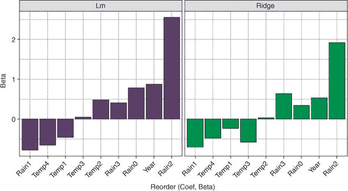

#### 11.6.3\. 训练 LASSO 模型

在本节中，我们将重复上一节的模型构建过程，但这次使用 LASSO。一旦我们训练了模型，我们将将其添加到我们的图中，这样我们就可以比较模型之间的参数估计，以便更好地理解这些技术之间的差异。

我们首先定义 LASSO 学习器，这次将*alpha*设置为 1（使其成为纯 LASSO）。我们给学习器一个 ID，稍后我们将用它来基准测试模型：

```
lasso <- makeLearner("regr.glmnet", alpha = 1, id = "lasso")
```

现在，让我们像之前对岭回归那样调整*lambda*。

| |
| --- |

##### 警告

这在我的四核机器上大约需要 30 秒。

| |
| --- |

##### 列表 11.10\. 调整 LASSO 的*lambda*

```
lassoParamSpace <- makeParamSet(
  makeNumericParam("s", lower = 0, upper = 15))

parallelStartSocket(cpus = detectCores())

tunedLassoPars <- tuneParams(lasso, task = iowaTask,
                             resampling = cvForTuning,
                             par.set = lassoParamSpace,
                             control = randSearch)

parallelStop()

tunedLassoPars

Tune result:
Op. pars: s=1.37
mse.test.mean=87.0126
```

现在我们绘制调整过程，以查看是否需要扩大搜索范围。

##### 列表 11.11\. 绘制超参数调整过程

```
lassoTuningData <- generateHyperParsEffectData(tunedLassoPars)

plotHyperParsEffect(lassoTuningData, x = "s", y = "mse.test.mean",
                    plot.type = "line") +
  theme_bw()
```

最终的图表显示在图 11.14 中。再次，我们可以看到所选的*lambda*值位于平均均方误差值低谷的底部。请注意，当*lambda*值达到 10 时，平均均方误差变得平坦：这是因为这里的惩罚如此之大，以至于所有预测变量都被从模型中移除，我们得到了仅包含截距项的模型的平均均方误差。

##### 图 11.14\. 绘制 LASSO *lambda*调整过程。x 轴代表*lambda*，y 轴代表平均均方误差。点代表随机搜索采样的*lambda*值。线连接这些点。

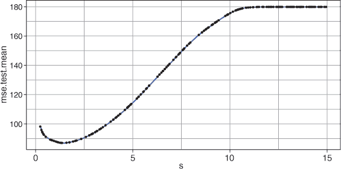

让我们使用调整后的*lambda*值训练一个 LASSO 模型。

##### 列表 11.12\. 使用调整后的*lambda*训练 LASSO 模型

```
tunedLasso <- setHyperPars(lasso, par.vals = tunedLassoPars$x)

tunedLassoModel <- train(tunedLasso, iowaTask)
```

现在，让我们查看调整后的 LASSO 模型的参数估计，并看看它们与岭回归和 OLS 估计相比如何。再次，我们使用`getLearnerModel()`函数提取模型数据，然后使用`coef()`函数提取参数估计。有什么不寻常的地方吗？我们的三个参数估计只是点。实际上，这些点代表 0.0。什么都没有。零。什么都没有。这些参数在数据集中的斜率被设置为正好为 0。这意味着它们已经被完全从模型中移除。这就是 LASSO 可以用于执行特征选择的方法。

##### 列表 11.13\. 提取模型参数

```
lassoModelData <- getLearnerModel(tunedLassoModel)

lassoCoefs <- coef(lassoModelData, s = tunedLassoPars$x$s)

lassoCoefs

10 x 1 sparse Matrix of class "dgCMatrix"
                     1
(Intercept) -1.361e+03
Year         7.389e-01
Rain0        2.217e-01
Temp1        .
Rain1        .
Temp2        .
Rain2        2.005e+00
Temp3       -4.065e-02
Rain3        1.669e-01
Temp4       -4.829e-01
```

让我们将这些参数估计与我们的岭回归和 OLS 模型的参数估计并排放置，以进行更直观的比较。为此，我们只需在`coefTib` tibble 中添加一个新的列，使用`$LASSO`；它包含我们的 LASSO 模型的参数估计（不包括截距）。然后我们收集这些数据，以便我们可以按模型进行细分，并使用`ggplot()`像以前一样绘制它。

##### 列表 11.14\. 绘制模型参数

```
coefTib$LASSO <- as.vector(lassoCoefs)[-1]

coefUntidy <- gather(coefTib, key = Model, value = Beta, -Coef)

ggplot(coefUntidy, aes(reorder(Coef, Beta), Beta, fill = Model)) +
  geom_bar(stat = "identity", col = "black") +
  facet_wrap(~ Model) +
  theme_bw() +
  theme(legend.position = "none")
```

结果图显示在图 11.15 中。该图很好地突出了岭回归（将参数缩小到 0，但永远不会真正缩小到 0）和 LASSO（可以将参数缩小到正好为 0）之间的差异。

##### 图 11.15\. 比较我们的岭回归模型、LASSO 模型和 OLS 回归模型的参数估计

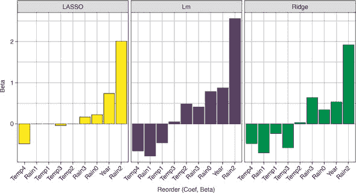

#### 11.6.4\. 训练弹性网络模型

这一节将非常类似于前两个章节，但我将向您展示如何通过调整*lambda*和*alpha*来训练弹性网络模型。我们将首先创建一个弹性网络学习器；这次我们不会提供一个*alpha*的值，因为我们打算调整它以找到 L1 和 L2 正则化之间的最佳权衡。我们还给它一个 ID，我们可以在以后进行基准测试时使用：

```
elastic <- makeLearner("regr.glmnet", id = "elastic")
```

现在让我们定义我们将要调整的超参数空间，这次包括*alpha*作为一个介于 0 和 1 之间的数值超参数。因为我们现在正在调整两个超参数，所以让我们增加随机搜索的迭代次数，以获得对搜索空间的更多覆盖。最后，我们像以前一样运行调整过程并打印出最佳结果。


##### 警告

这在我的四核机器上大约需要一分钟。


##### 列表 11.15\. 调整弹性网络中的*lambda*和*alpha*

```
elasticParamSpace <- makeParamSet(
  makeNumericParam("s", lower = 0, upper = 10),
  makeNumericParam("alpha", lower = 0, upper = 1))

randSearchElastic <- makeTuneControlRandom(maxit = 400)

parallelStartSocket(cpus = detectCores())

tunedElasticPars <- tuneParams(elastic, task = iowaTask,
                               resampling = cvForTuning,
                               par.set = elasticParamSpace,
                               control = randSearchElastic)

parallelStop()

tunedElasticPars

Tune result:
Op. pars: s=1.24; alpha=0.981
mse.test.mean=84.7701
```

现在，让我们绘制我们的调整过程以确认我们的搜索空间是否足够大。这次，因为我们同时调整两个超参数，我们将*lambda*和*alpha*作为 x 轴和 y 轴，将平均均方误差（`"mse.test.mean"`）作为 z 轴。将`plot.type`参数设置为`"heatmap"`将绘制一个热图，其中颜色映射到我们设置为 z 轴的任何内容。但是，为了使其工作，我们需要填充我们 1,000 次搜索迭代之间的空白。为此，我们将任何回归算法的名称提供给`interpolate`参数。在这里，我使用了`"regr.kknn"`，它使用 k 最近邻根据最近的搜索迭代的 MSE 值来填充空白。我们向图中添加一个`geom_point`来指示由我们的调整过程选择的*lambda*和*alpha*的组合。


##### 注意

这种插值仅用于可视化，因此选择不同的插值学习器可能会改变调整图，但不会影响我们选择的超参数。


##### 列表 11.16\. 绘制调整过程

```
elasticTuningData <- generateHyperParsEffectData(tunedElasticPars)

plotHyperParsEffect(elasticTuningData, x = "s", y = "alpha",
                    z = "mse.test.mean", interpolate = "regr.kknn",
                    plot.type = "heatmap") +
  scale_fill_gradientn(colours = terrain.colors(5)) +
  geom_point(x = tunedElasticPars$x$s, y = tunedElasticPars$x$alpha,
             col = "white") +
  theme_bw()
```

结果图表显示在图 11.16 中。太棒了！你可以把它挂在墙上，称之为艺术。注意，选择的*lambda*和*alpha*组合（白色点）落在平均均方误差值的山谷中，这表明我们的超参数搜索空间足够宽。

##### 图 11.16\. 绘制我们的弹性网络模型超参数调整过程。x 轴代表*lambda*，y 轴代表*alpha*，阴影代表平均均方误差。白色点代表我们的调整过程选择的超参数组合。

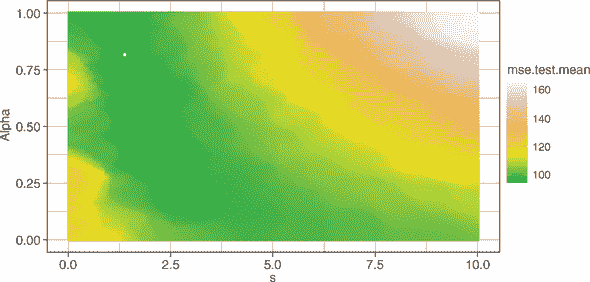

| |
| --- |

**练习 3**

让我们实验一下`plotHyperParsEffect()`函数。将`plot.type`参数更改为`"contour"`，添加参数`show.experiments = TRUE`，并重新绘制图表。接下来，将`plot.type`更改为`"scatter"`，移除`interpolate`和`show .experiments`参数，并移除`scale_fill_gradientn()`层。

| |
| --- |

现在，让我们使用调整后的超参数来训练最终的弹性网络模型。

##### 列表 11.17\. 使用调整后的超参数训练弹性网络模型

```
tunedElastic <- setHyperPars(elastic, par.vals = tunedElasticPars$x)

tunedElasticModel <- train(tunedElastic, iowaTask)
```

接下来，我们可以提取模型参数，并将它们与其他三个模型一起绘制，就像我们在列表 11.9 和 11.14 中所做的那样。

##### 列表 11.18\. 绘制模型参数

```
elasticModelData <- getLearnerModel(tunedElasticModel)

elasticCoefs <- coef(elasticModelData, s = tunedElasticPars$x$s)

coefTib$Elastic <- as.vector(elasticCoefs)[-1]

coefUntidy <- gather(coefTib, key = Model, value = Beta, -Coef)

ggplot(coefUntidy, aes(reorder(Coef, Beta), Beta, fill = Model)) +
  geom_bar(stat = "identity", position = "dodge", col = "black") +
  facet_wrap(~ Model) +
  theme_bw()
```

结果图表显示在图 11.17 中。注意，我们的弹性网络模型的参数估计介于岭回归估计和 LASSO 估计之间。然而，由于我们的调整值*alpha*接近 1（记住当*alpha*等于 1 时，我们得到纯 LASSO），弹性网络模型的参数与纯 LASSO 估计的参数更相似。

| |
| --- |

**练习 4**

重新绘制图 11.17 中的图表，但移除`facet_wrap()`层，并将`geom_bar()`的位置参数设置为`"dodge"`。你更喜欢哪种可视化？

| |
| --- |

##### 图 11.17\. 比较我们的岭回归模型、LASSO 模型、弹性网络模型和 OLS 回归模型的参数估计

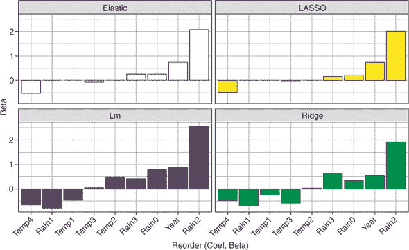

### 11.7\. 将岭回归、LASSO、弹性网络和 OLS 相互基准测试

让我们使用基准测试来同时交叉验证并比较我们的岭回归、LASSO、弹性网络和 OLS 建模过程的表现。回想一下第八章，基准测试需要一个学习者列表、一个任务和一个交叉验证过程。然后，对于交叉验证过程的每个迭代/折，使用每个学习者在相同的训练集上训练一个模型，并在相同的测试集上评估。一旦整个交叉验证过程完成，我们得到每个学习者的平均性能指标（在这种情况下是均方误差），这使我们能够比较哪个表现最好。

##### 列表 11.19\. 绘制模型参数

```
ridgeWrapper <- makeTuneWrapper(ridge, resampling = cvForTuning,
                                par.set = ridgeParamSpace,
                                control = randSearch)

lassoWrapper <- makeTuneWrapper(lasso, resampling = cvForTuning,
                                par.set = lassoParamSpace,
                                control = randSearch)

elasticWrapper <- makeTuneWrapper(elastic, resampling = cvForTuning,
                                  par.set = elasticParamSpace,
                                  control = randSearchElastic)

learners = list(ridgeWrapper, lassoWrapper, elasticWrapper, "regr.lm")
```

我们首先为每个学习器定义调整包装器，这样我们就可以在我们的交叉验证循环中包含超参数调整。对于每个包装器（分别为 Ridge、LASSO 和弹性网络），我们提供学习器、交叉验证策略、该学习器的参数空间以及该学习器的搜索过程（注意，我们为弹性网络使用不同的搜索过程）。OLS 回归不需要超参数调整，所以我们不为它创建包装器。因为`benchmark()`函数需要一个学习器列表，所以我们接下来创建一个这些包装器的列表（以及`"regr.lm"`，我们的 OLS 回归学习器）。

要运行基准实验，让我们定义我们的外部重采样策略为 3 折交叉验证。在启动并行化后，我们通过向`benchmark()`实验提供学习器列表、任务和外部交叉验证策略来运行基准实验。

| |
| --- |

##### 警告

这在我的四核机器上几乎花费了 6 分钟。

| |
| --- |

##### 列表 11.20\. 绘制模型参数

```
library(parallel)
library(parallelMap)

kFold3 <- makeResampleDesc("CV", iters = 3)

parallelStartSocket(cpus = detectCores())

bench <- benchmark(learners, iowaTask, kFold3)

parallelStop()

bench

  task.id    learner.id mse.test.mean
1 iowaTib   ridge.tuned         95.48
2 iowaTib   lasso.tuned         93.98
3 iowaTib elastic.tuned         99.19
4 iowaTib       regr.lm        120.37
```

比起弹性网络，Ridge 和 LASSO 回归都表现更好，尽管所有三种正则化技术都比 OLS 回归表现更好。因为弹性网络有可能选择纯 Ridge 或纯 LASSO（基于*alpha*超参数的值），增加随机搜索的迭代次数可能会导致弹性网络处于领先地位。

### 11.8\. Ridge、LASSO 和弹性网络的优势与劣势

虽然对于给定的任务通常不容易判断哪些算法会表现良好，但以下是一些优势和劣势，可以帮助你决定 Ridge 回归、LASSO 和弹性网络是否适合你。

Ridge、LASSO 和弹性网络的优势如下：

+   它们产生的模型非常易于解释。

+   它们可以处理连续和分类预测器。

+   它们在计算上成本较低。

+   它们通常优于 OLS 回归。

+   LASSO 和弹性网络可以通过将无信息预测器的斜率设置为 0 来执行特征选择。

+   它们也可以应用于广义线性模型（如逻辑回归）。

Ridge、LASSO 和弹性网络的劣势如下：

+   它们对数据做出了强烈的假设，例如同方差性（常数方差）和残差的分布（如果违反这些假设，性能可能会受到影响）。

+   Ridge 回归无法自动执行特征选择。

+   LASSO 无法估计比训练集中案例更多的参数。

+   它们无法处理缺失数据。

| |
| --- |

**练习 5**

创建一个新的 tibble，其中只包含`Yield`变量，并使用这些数据创建一个新的回归任务，将`Yield`设置为目标变量。

1.  在此数据上训练一个普通 OLS 模型（一个没有预测器的模型）。

1.  在原始`iowaTask`上训练一个*lambda*值为 500 的 LASSO 模型。

1.  使用留一法交叉验证（`makeResampleDesc("LOO")`）对两个模型进行交叉验证。

1.  两个模型的平均均方误差值如何比较？为什么？

| |
| --- |
| |

**练习 6**

在`glmnet`模型对象上调用`plot()`不会绘制模型残差。安装 plotmo 包并使用其`plotres()`函数，将岭回归、LASSO 和弹性网络模型的模型数据对象作为参数传递。

| |
| --- |

### 摘要

+   正则化是一组通过缩小模型参数估计来防止过拟合的技术。

+   线性模型有三种正则化技术：岭回归、LASSO 和弹性网络。

+   岭回归使用 L2 范数将参数估计缩小到 0（但永远不会精确到 0，除非它们一开始就是 0）。

+   LASSO 使用 L1 范数将参数估计缩小到 0（并且可能精确到 0，从而实现特征选择）。

+   弹性网络结合了 L2 和 L1 正则化，其比例由*alpha*超参数控制。

+   对于所有三个模型，*lambda*超参数控制收缩的强度。

### 练习题解答

1.  将搜索空间扩展到包括从 0 到 50 的*lambda*值：

    ```
    ridgeParamSpaceExtended <- makeParamSet(
      makeNumericParam("s", lower = 0, upper = 50))

    parallelStartSocket(cpus = detectCores())

    tunedRidgeParsExtended <- tuneParams(ridge, task = iowaTask, # ~30 sec
                                 resampling = cvForTuning,
                                 par.set = ridgeParamSpaceExtended,
                                 control = randSearch)

    parallelStop()

    ridgeTuningDataExtended <- generateHyperParsEffectData(
                                          tunedRidgeParsExtended)

    plotHyperParsEffect(ridgeTuningDataExtended, x = "s", y = "mse.test.mean",
                        plot.type = "line") +
      theme_bw()

    # The previous value of s was not just a local minimum,
    # but the global minimum.
    ```

1.  绘制岭回归和 LASSO 模型的截距：

    ```
    coefTibInts <- tibble(Coef = rownames(ridgeCoefs),
                      Ridge = as.vector(ridgeCoefs),
                      Lm = as.vector(lmCoefs))
    coefUntidyInts <- gather(coefTibInts, key = Model, value = Beta, -Coef)

    ggplot(coefUntidyInts, aes(reorder(Coef, Beta), Beta, fill = Model)) +
      geom_bar(stat = "identity", col = "black") +
      facet_wrap(~Model) +
      theme_bw()  +
      theme(legend.position = "none")

    # The intercepts are different. The intercept isn't included when
    # calculating the L2 norm, but is the value of the outcome when all
    # the predictors are zero. Because ridge regression changes the parameter
    # estimates of the predictors, the intercept changes as a result.
    ```

1.  尝试不同的方法来绘制超参数调整过程：

    ```
    plotHyperParsEffect(elasticTuningData, x = "s", y = "alpha",
                        z = "mse.test.mean", interpolate = "regr.kknn",
                        plot.type = "contour", show.experiments = TRUE) +
      scale_fill_gradientn(colours = terrain.colors(5)) +
      geom_point(x = tunedElasticPars$x$s, y = tunedElasticPars$x$alpha) +
      theme_bw()

    plotHyperParsEffect(elasticTuningData, x = "s", y = "alpha",
                        z = "mse.test.mean", plot.type = "scatter") +
      theme_bw()
    ```

1.  使用水平错位条形图而不是小面元绘制模型系数：

    ```
    ggplot(coefUntidy, aes(reorder(Coef, Beta), Beta, fill = Model)) +
      geom_bar(stat = "identity", position = "dodge", col = "black") +
      theme_bw()
    ```

1.  比较具有高*lambda*的 LASSO 模型和没有预测变量的 OLS 模型的性能：

    ```
    yieldOnly <- select(iowaTib, Yield)

    yieldOnlyTask <- makeRegrTask(data = yieldOnly, target = "Yield")

    lassoStrict <- makeLearner("regr.glmnet", lambda = 500)

    loo <- makeResampleDesc("LOO")

    resample("regr.lm", yieldOnlyTask, loo)

    Resample Result
    Task: yieldOnly
    Learner: regr.lm
    Aggr perf: mse.test.mean=179.3428
    Runtime: 0.11691

    resample(lassoStrict, iowaTask, loo)

    Resample Result
    Task: iowaTib
    Learner: regr.glmnet
    Aggr perf: mse.test.mean=179.3428
    Runtime: 0.316366

    # The MSE values are identical. This is because when lambda is high
    # enough, all predictors will be removed from the model, just as if
    # we trained a model with no predictors.
    ```

1.  使用`plotres()`函数绘制 glmnet 模型的模型诊断：

    ```
    install.packages("plotmo")

    library(plotmo)

    plotres(ridgeModelData)

    plotres(lassoModelData)

    plotres(elasticModelData)

    # The first plot shows the estimated slope for each parameter for
    # different values of (log) lambda. Notice the different shape
    # between ridge and LASSO.
    ```

## 第十二章\. 使用 kNN、随机森林和 XGBoost 进行回归

*本章涵盖*

+   使用 k 最近邻算法进行回归

+   使用基于树的回归算法

+   比较 k 最近邻、随机森林和 XGBoost 模型

你会发现本章内容轻松易懂。这是因为你之前已经做过其中的所有内容（某种程度上）。在第三章中，我向你介绍了 k 最近邻（kNN）算法作为分类工具。在第七章中，我向你介绍了决策树，然后在第八章中扩展了这一内容，涵盖了用于分类的随机森林和 XGBoost。方便的是，这些算法也可以用于预测连续变量。因此，在本章中，我将帮助你扩展这些技能来解决回归问题。

到本章结束时，我希望你能理解如何将 kNN 和基于树的算法扩展到预测连续变量。正如你在第七章中学到的，决策树倾向于过拟合其训练数据，因此通常通过使用集成技术来大幅改进。因此，在本章中，你将训练一个随机森林模型和一个 XGBoost 模型，并将它们的性能与 kNN 算法进行比较。

| |
| --- |

##### 注意

从第八章回顾，随机森林和 XGBoost 是两种基于树的算法，它们通过创建许多树的集成来提高预测精度。随机森林在数据的不同自助样本上并行训练许多树，而 XGBoost 则优先训练那些被错误分类的序列树。

| |
| --- |

### 12.1. 使用 k 近邻预测连续变量

在本节中，我将向你展示如何使用 kNN 算法进行回归，图形化和直观化。想象一下，你不是个早睡早起的人（也许，像我一样，你不需要非常努力地想象），你尽可能地想多在床上多待一会儿。为了最大化你睡眠的时间，你决定训练一个机器学习模型来预测你通勤到工作地点所需的时间，基于你离开家的时间。你早上需要 40 分钟来准备，所以你希望这个模型能告诉你你需要什么时候离开家才能准时到达工作地点，因此你需要什么时候起床。

在接下来的两周内，你记录你离开家的时间和你的旅程所需的时间。你的旅程时间受交通状况（在早晨变化）的影响，所以你的旅程长度取决于你离开的时间。离开时间和旅程长度之间可能存在的关系示例在图 12.1 中展示。

##### 图 12.1. 根据你离开家的时间，通勤所需时间的示例关系

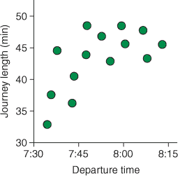

从第三章回顾，kNN 算法是一种懒惰学习器。换句话说，它在模型训练期间不做任何工作（相反，它只是存储训练数据）；它所有的工都在进行预测时完成。在做出预测时，kNN 算法会在训练集中寻找与每个新的、未标记的数据值最相似的*k*个案例。这些*k*个最相似的案例会对新数据的预测值进行投票。当使用 kNN 进行分类时，这些投票是关于类成员的，并且获得多数票的投票选择模型为新的数据输出的类别。为了提醒你这个过程是如何工作的，我重新绘制了第三章的图 3.4 的修改版，即图 12.2。

##### 图 12.2. kNN 算法进行分类：识别*k*个最近邻并采取多数投票。线条将未标记的数据与它们的单个、三个和五个最近邻连接起来。每种情况下的多数投票由每个十字下方的形状表示。

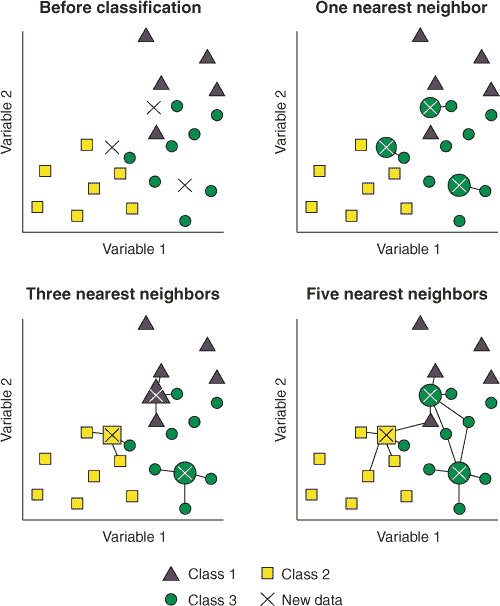

使用 kNN 进行回归时的投票过程非常相似，只是我们取这些*k*个投票的平均值作为新数据的预测值。

此过程在图 12.3 中用我们的通勤示例进行了说明。x 轴上的交叉点代表新的数据：我们离开家的时刻，我们想要预测行程长度。如果我们训练一个一最近邻模型，模型会找到训练集中与每个新数据点的出发时间最接近的单个案例，并使用该值作为预测的行程长度。如果我们训练一个三最近邻模型，模型会找到与每个新数据点的出发时间最相似的三个训练案例，取这些最近案例的平均行程长度，并将此作为新数据的预测值。对于任何我们用于训练模型的 k 值，情况都是相同的。

##### 图 12.3\. kNN 算法如何预测连续变量。交叉点代表我们希望预测行程长度的新的数据点。对于一、三和五个最近邻模型，每个新数据点的最近邻被以较浅的阴影突出显示。在每种情况下，预测值是最近邻的平均行程长度。

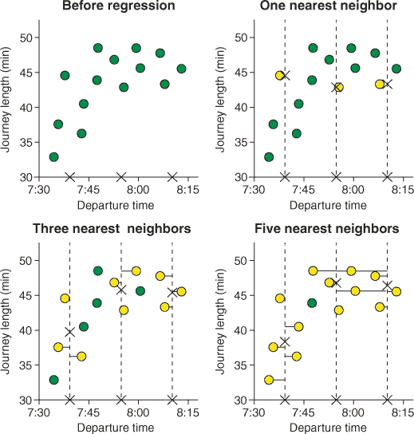

| |
| --- |

##### 备注

就像当我们使用 kNN 进行分类时，选择最佳性能的*k*值对于模型性能至关重要。如果我们选择一个太低的*k*，我们可能会产生一个过度拟合的模型，并做出具有高方差预测。如果我们选择一个太高的*k*，我们可能会产生一个欠拟合的模型，并做出具有高偏差的预测。

| |
| --- |

### 12.2\. 使用基于树的算法预测连续变量

在本节中，我将向您展示如何使用基于树的算法来预测连续结果变量。在第七章中，我向您展示了基于树的算法（如 rpart 算法）如何一次分割特征空间成单独的区域，每次一个二分分割。算法试图将特征空间分割成每个区域只包含特定类别的案例。换句话说，算法试图学习导致尽可能纯净区域的二分分割。

| |
| --- |

##### 备注

记住，*特征空间*指的是预测变量值的所有可能组合，而*purity*指的是单个区域内案例的均匀程度。

| |
| --- |

为了刷新您的记忆，我在图 12.4 中重新绘制了图 7.4，展示了如何将两个预测变量的特征空间分割以预测三个类别的成员资格。

##### 图 12.4\. 如何对分类问题进行分割。属于三个类别的案例被绘制在两个连续变量上。第一个节点根据变量 2 的值将特征空间分割成矩形。第二个节点进一步根据变量 1 的值将变量 2 ≥ 20 的特征空间分割成矩形。

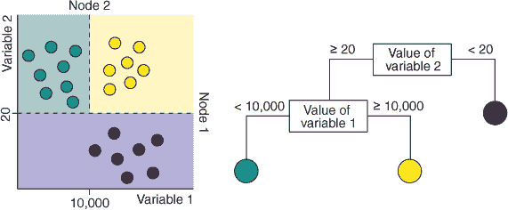

基于树的算法进行分类有点像在农场把动物赶到不同的围栏里。很明显，我们想要一个围栏放鸡，一个放牛，一个放羊驼（我不认为你在农场看到很多羊驼，但我特别喜欢它们）。所以从概念上讲，我们很容易想象将特征空间的区域分割成不同类别的不同围栏。但也许想象将特征空间分割来预测一个连续变量并不那么容易。

那么，这种分割对于回归问题是如何工作的呢？完全一样：唯一的区别是，每个区域代表的是连续结果变量的值，而不是一个类别。看看图 12.5，在那里我们使用旅程长度示例创建回归树。回归树的节点将特征空间（出发时间）分割成不同的区域。每个区域代表其中案例的结果变量的平均值。当对新数据进行预测时，模型将预测新数据所属区域的值。树的叶子不再是类别，而是数字。这在图 12.5 中用有一个和两个预测变量的情况进行了说明，但它可以扩展到任何数量的预测变量。

正如分类一样，回归树可以处理连续和分类预测变量（除了 XGBoost，它要求分类变量进行数值编码）。对于连续和分类变量决定分割的方式与分类树相同，只是算法寻找的是具有最低平方和的分割，而不是具有最高 Gini 增益的分割。

##### 图 12.5. 对于回归问题，如何进行分割。特征空间根据每个图表旁边的树节点分割成阴影区域。每个区域内部显示了预测的旅程长度。顶部图表中的虚线展示了如何根据树从出发时间预测旅程长度。底部图表显示了两个预测变量的情况。

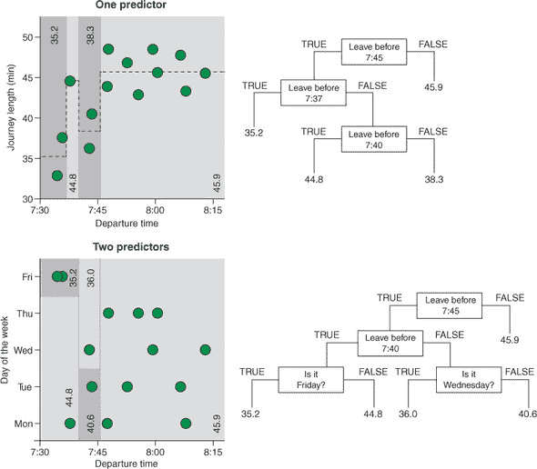

| |
| --- |

##### 注意

回想一下第七章，Gini 增益是父节点和分割的 Gini 指数之间的差异。Gini 指数是不纯度的度量，等于 1 – (*p*(*A*)² + *p*(*B*)²)，其中*p*(*A*)和*p*(*B*)分别是属于类别*A*和*B*的案例的比例。

| |
| --- |

对于每个候选分割，算法计算左右分割的平方残差之和，并将它们相加以形成整个分割的平方残差之和。在 图 12.6 中，算法正在考虑 7:45 之前的出发时间的候选分割。对于每个出发时间在 7:45 之前的案例，算法计算平均旅程长度，找到残差误差（每个案例的旅程长度与平均值的差异），并将其平方。对于你在 7:45 之后离开房子的案例，也以它们各自的平均值进行同样的操作。这两个平方残差之和给出了分割的平方和。如果您更喜欢用数学符号表示，它显示在 方程式 12.1 中。

##### 图 12.6\. 如何为回归问题选择候选分割。纯度的度量是分割的平方和，即左右节点的组合平方和。每个平方和是每个案例与其所属叶子的预测值之间的垂直距离。

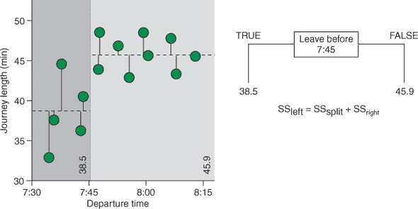

##### 方程式 12.1。

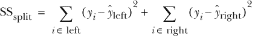

其中 *i* ∈ *left* 和 *i* ∈ *right* 分别表示属于左分割和右分割的案例。

具有最低平方和的候选分割被选为树中任何特定点的分割。因此，对于回归树来说，*纯度*指的是数据围绕节点均值的分布程度。

### 12.3\. 构建您的第一个 kNN 回归模型

在本节中，我将教你如何定义一个用于回归的 kNN 学习者，调整 *k* 超参数，并训练一个模型，这样你就可以用它来预测一个连续变量。想象一下，你是一位化学工程师，试图根据对每个批次的测量来预测各种批次燃料释放的热量。我们将首先在这个任务上训练一个 kNN 模型，然后在章节的后面部分将其性能与随机森林和 XGBoost 模型进行比较。

让我们从加载 mlr 和 tidyverse 包开始：

```
library(mlr)

library(tidyverse)
```

#### 12.3.1\. 加载和探索燃料数据集

mlr 包方便地包含几个预定义的任务，以帮助您尝试不同的学习者和过程。我们将在本章中使用的数据集包含在 mlr 的 `fuelsubset.task` 中。我们以加载任何内置数据集相同的方式将此任务加载到我们的 R 会话中：使用 `data()` 函数。然后我们可以使用 mlr 的 `getTaskData()` 函数从任务中提取数据，以便我们可以探索它。像往常一样，我们使用 `as_tibble()` 函数将数据框转换为 tibble。

##### 列表 12.1\. 加载和探索燃料数据集

```
data("fuelsubset.task")

fuel <- getTaskData(fuelsubset.task)

fuelTib <- as_tibble(fuel)

fuelTib

# A tibble: 129 x 367
   heatan   h20 UVVIS.UVVIS.1 UVVIS.UVVIS.2 UVVIS.UVVIS.3 UVVIS.UVVIS.4
    <dbl> <dbl>         <dbl>         <dbl>         <dbl>         <dbl>
 1   26.8  2.3         0.874          0.748        0.774         0.747
 2   27.5  3          -0.855         -1.29        -0.833        -0.976
 3   23.8  2.00       -0.0847        -0.294       -0.202        -0.262
 4   18.2  1.85       -0.582         -0.485       -0.328        -0.539
 5   17.5  2.39       -0.644         -1.12        -0.665        -0.791
 6   20.2  2.43       -0.504         -0.890       -0.662        -0.744
 7   15.1  1.92       -0.569         -0.507       -0.454        -0.576
 8   20.4  3.61        0.158          0.186        0.0303        0.183
 9   26.7  2.5         0.334          0.191        0.0777        0.0410
10   24.9  1.28        0.0766         0.266        0.0808       -0.0733
# ... with 119 more rows, and 361 more variables
```

我们有一个包含 129 个不同批次的燃料和 367 个变量/特征的 tibble！实际上，变量如此之多，以至于我已经截断了 tibble 的打印输出，以删除不适合我控制台的变量名称。


##### 小贴士

运行`names(fuelTib)`以返回数据集中所有变量的名称。当处理具有太多列而无法在控制台可视化的大型数据集时，这很有用。

| |
| --- |

`heatan`变量是当一定量的燃料燃烧时释放的能量量（以兆焦耳计量）。`h20`变量是燃料容器中湿度的百分比。其余变量显示了每批燃料吸收特定波长的紫外或近红外光量（每个变量代表不同的波长）。

| |
| --- |

##### 小贴士

要查看 mlr 中内置的所有任务，请使用`data(package = "mlr")`。

| |
| --- |

让我们绘制数据，以了解`heatan`变量在紫外和近红外光的各个波长下与`absorbance`变量之间的相关性。我们将通过进行一些更复杂的操作来提升 tidyverse 的使用水平，所以让我一步步带你通过列表 12.2 中的过程：

1.  因为我们要为数据中的每个案例绘制一个单独的`geom_smooth()`线，所以我们首先将数据通过管道传递给一个`mutate()`函数调用，在那里我们创建一个仅作为行索引的`id`变量。我们使用`nrow(.)`来指定通过`mutate()`传递的数据对象中的行数。

1.  我们将步骤 1 的结果通过管道传递给一个`gather()`函数，以创建包含光谱信息的键值对变量（`wavelength`作为键，该波长的`absorbance`作为值）。我们在收集过程中省略了`heatan`、`h20`和`id`变量（`c(-heatan, -h20, -id)`）。

1.  我们将步骤 2 的结果通过管道传递给另一个`mutate()`函数，以创建两个新变量：

    1.  一个表示行是否显示紫外或近红外光谱吸收率的字符向量

    1.  一个表示该特定光谱波长的数值向量

我在这里介绍了来自 stringr tidyverse 包的两个函数：`str_sub()`和`str_extract()`。`str_sub()`函数将字符字符串分割成其单个字母数字字符和符号，并返回位于`start`和`end`参数之间的那些。例如，`str_sub("UVVIS.UVVIS.1", 1, 3)`返回`"UVV"`。我们使用此函数在光谱为紫外时将列值更改为`"UVV"`，在光谱为近红外时更改为`"NIR"`。

`str_extract()`函数在字符字符串中查找特定的模式，并返回该模式。在列表 12.2 的例子中，我们要求该函数查找任何数字，使用`\\d`。`\\d`后面的`+`告诉函数该模式可能被匹配多次。例如，比较`str_extract("hello123", "\\d")`和`str_extract("hello123", "\\d+")`的输出。

##### 列表 12.2\. 准备绘图数据

```
fuelUntidy <- fuelTib %>%
  mutate(id = 1:nrow(.)) %>%
  gather(key = "variable", value = "absorbance",
  c(-heatan, -h20, -id)) %>%
  mutate(spectrum = str_sub(variable, 1, 3),
         wavelength = as.numeric(str_extract(variable, "(\\d)+")))

fuelUntidy
# A tibble: 47,085 x 7
   heatan   h20    id variable      absorbance spectrum wavelength
    <dbl> <dbl> <int> <chr>              <dbl> <chr>         <dbl>
 1   26.8  2.3      1 UVVIS.UVVIS.1     0.874  UVV               1
 2   27.5  3        2 UVVIS.UVVIS.1    -0.855  UVV               1
 3   23.8  2.00     3 UVVIS.UVVIS.1    -0.0847 UVV               1
 4   18.2  1.85     4 UVVIS.UVVIS.1    -0.582  UVV               1
 5   17.5  2.39     5 UVVIS.UVVIS.1    -0.644  UVV               1
 6   20.2  2.43     6 UVVIS.UVVIS.1    -0.504  UVV               1
 7   15.1  1.92     7 UVVIS.UVVIS.1    -0.569  UVV               1
 8   20.4  3.61     8 UVVIS.UVVIS.1     0.158  UVV               1
 9   26.7  2.5      9 UVVIS.UVVIS.1     0.334  UVV               1
10   24.9  1.28    10 UVVIS.UVVIS.1     0.0766 UVV               1
# ... with 47,075 more rows
```

这是一些相当复杂的数据处理，所以运行代码并查看生成的 tibble，确保你理解我们是如何创建它的。

| |
| --- |

##### 小贴士

我们通过指定**正则表达式**来在字符向量中寻找模式，例如列表 12.2 中的`"\\d+"`。正则表达式是用来描述搜索模式的一种特殊文本字符串。正则表达式是提取（有时是复杂的）字符字符串模式非常有用的工具。如果我对您对正则表达式产生了兴趣，您可以通过运行`?regex`来了解更多关于如何在 R 中使用它们的信息。

| |
| --- |

现在我们已经格式化好了数据以供绘图，我们将绘制三个图：

+   `吸光度`与`加热量`的关系，每个波长都有单独的曲线

+   `波长`与`吸光度`的关系，每个案例都有单独的曲线

+   湿度(`h20`)与`加热量`的关系

在`吸光度`与`加热量`的图中，我们将`波长`放在`as.factor()`函数内，这样每个波长都会用离散的颜色绘制（而不是从低波长到高波长的颜色渐变）。为了防止`ggplot()`函数绘制一个显示每条线颜色的巨大图例，我们通过添加`theme(legend.position = "none")`来抑制图例。我们通过光谱进行分面，为紫外光谱和近红外光谱创建子图，允许使用`scales = "free_x"`参数在子图之间变化 x 轴。

我不知道你们是否如此，但我在学校总是被告知要在我的图中添加标题。我们可以在 ggplot2 中使用`ggtitle()`函数，在引号中提供我们想要的标题。

| |
| --- |

##### 提示

`theme()`函数允许您几乎可以自定义 ggplot 的任何外观，包括字体大小和网格线的存在/不存在。我不会深入讨论这个问题，但我建议您使用`?theme`查看帮助页面，以了解您可以做什么。

| |
| --- |

在`波长`与`吸光度`的图中，我们将`group`美学设置为创建的`id`变量，这样`geom_smooth()`层将为每批燃料绘制单独的曲线。

##### 列表 12.3\. 绘制数据

```
fuelUntidy %>%
  ggplot(aes(absorbance, heatan, col = as.factor(wavelength))) +
  facet_wrap(~ spectrum, scales = "free_x") +
  geom_smooth(se = FALSE, size = 0.2) +
  ggtitle("Absorbance vs heatan for each wavelength") +
  theme_bw() +
  theme(legend.position = "none")

fuelUntidy %>%
  ggplot(aes(wavelength, absorbance, group = id, col = heatan)) +
  facet_wrap(~ spectrum, scales = "free_x") +
  geom_smooth(se = FALSE, size = 0.2) +
  ggtitle("Wavelength vs absorbance for each batch") +
  theme_bw()

fuelUntidy %>%
  ggplot(aes(h20, heatan)) +
  geom_smooth(se = FALSE) +
  ggtitle("Humidity vs heatan") +
  theme_bw()
```

结果图示显示在图 12.7 中（我将它们合并成单个图以节省空间）。有时数据确实很美，不是吗？在`吸光度`对`加热量`的图中，每条线对应一个特定的波长。每个预测变量与结果变量之间的关系是复杂且非线性的。`h20`与`加热量`之间也存在非线性关系。

在`波长`对`吸光度`的图中，每条线对应一个特定的燃料批次，线显示了其紫外和近红外光的`吸光度`。线的阴影对应于该批次的`加热量`值。在这些图中识别模式很困难，但某些`吸光度`轮廓似乎与更高的`加热量`值和更低的`加热量`值相关联。

| |
| --- |

##### 提示

虽然你当然可以过拟合你的数据，但你永远不能过拟合你的图。在开始探索性分析时，我会以多种不同的方式绘制我的数据集，以便从不同的角度/视角更好地理解它。

| |
| --- |
| |

**练习 1**

向`absorbance`与`heatan`的图中添加一个额外的`geom_smooth()`层，并使用以下参数：

+   `group = 1`

+   `col = "blue"`

使用`group = 1`参数，创建一条平滑线，以建模*所有*数据，忽略分组。

| |
| --- |

##### 图 12.7\. 在 fuelTib 数据集中绘制关系。最上面的图显示了`absorbance`与`heatan`的关系，每个`wavelength`都有单独的线条，按近红外（NIR）或紫外（UVV）光进行分面。中间的图显示了`wavelength`与`absorbance`的关系，按`heatan`着色，每个燃料批次都有单独的线条，按 NIR 或 UVV 光进行分面。最下面的图显示了`h20`与`heatan`的关系。

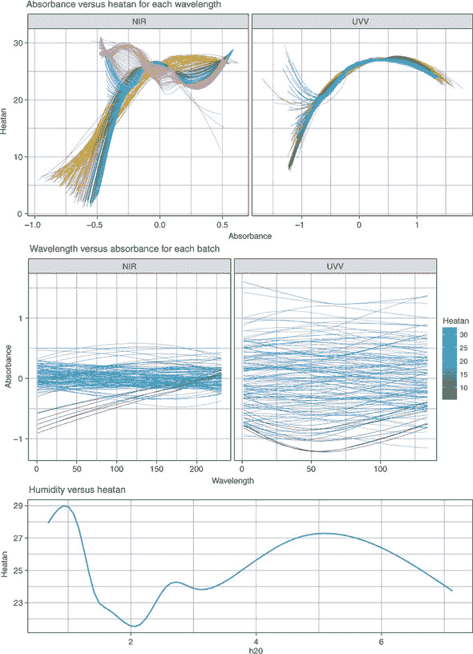

| |
| --- |

**建模光谱数据**

我们正在处理的数据集是*光谱数据*的一个例子。光谱数据包含在一系列（通常是）波长范围内进行的观测。例如，我们可能会测量一种物质从一系列不同颜色中吸收光量的多少。

统计学家和数据科学家将此类数据称为*泛函数据*，其中数据集具有许多维度（我们测量的波长），并且这些维度具有特定的顺序（从测量最低波长处的吸光度开始，逐步到最高波长）。

统计学的一个分支，称为*泛函数据分析*，致力于建模此类数据。在泛函数据分析中，每个预测变量都被转换为一个函数（例如，一个描述紫外和近红外波长范围内吸光度变化的函数）。然后，这个函数在模型中用作预测变量，以预测结果变量。我们不会将此类技术应用于这些数据，但如果你对泛函数据分析感兴趣，可以查看 James Ramsay 所著的*泛函数据分析*（Springer，2005 年）。

| |
| --- |

因为预定义的`fuelsubset.task`将紫外和近红外光谱定义为泛函变量，我们将定义自己的任务，将每个波长视为一个单独的预测变量。我们像往常一样使用`makeRegrTask()`函数做这件事，将`heatan`变量作为我们的目标。然后我们使用`makeLearner()`函数定义我们的 kNN 学习器。

##### 列表 12.4\. 定义任务和 kNN 学习器

```
fuelTask <- makeRegrTask(data = fuelTib, target = "heatan")

kknn <- makeLearner("regr.kknn")
```

| |
| --- |

##### 注意

注意到，对于回归，学习器的名称是`"regr.kknn"`，有两个 k，而不是我们在第三章中使用的`"classif.knn"`。这是因为此函数来自 kknn 包，它允许我们执行*核 k 最近邻*，其中我们使用核函数（就像在第六章中使用的 SVMs 一样）在类别之间找到线性决策边界。

| |
| --- |

#### 12.3.2\. 调整 k 超参数

在本节中，我们将调整 *k* 以获得最佳性能的 kNN 模型。记住，对于回归，*k* 的值决定了在为新案例进行预测时平均多少个最近邻的输出值。我们首先使用 `makeParamSet()` 函数定义超参数搜索空间，并将 *k* 定义为一个离散超参数，其可能值为 1 到 12。然后，我们将搜索过程定义为网格搜索（这样我们将尝试搜索空间中的每个值），并定义一个 10 折交叉验证策略。

正如我们之前多次做的那样，我们使用 `tuneParams()` 函数运行调整过程，将学习器、任务、交叉验证方法、超参数空间和搜索过程作为参数传递。

##### 列表 12.5\. 调整 *k*

```
kknnParamSpace <- makeParamSet(makeDiscreteParam("k", values = 1:12))

gridSearch <- makeTuneControlGrid()

kFold <- makeResampleDesc("CV", iters = 10)

tunedK <- tuneParams(kknn, task = fuelTask,
                     resampling = kFold,
                     par.set = kknnParamSpace,
                     control = gridSearch)

tunedK

Tune result:
Op. pars: k=7
mse.test.mean=10.7413
```

我们可以通过使用 `generateHyperParsEffectData()` 函数提取调整数据，并将其传递给 `plotHyperParsEffect()` 函数来绘制超参数调整过程，将我们的超参数（`"k"`) 作为 x 轴，MSE（`"mse.test.mean"`) 作为 y 轴。将 `plot.type` 参数设置为 `"line"` 将样本用线连接起来。

##### 列表 12.6\. 绘制调整过程

```
knnTuningData <- generateHyperParsEffectData(tunedK)

plotHyperParsEffect(knnTuningData, x = "k", y = "mse.test.mean",
                    plot.type = "line") +
  theme_bw()
```

结果图显示在 图 12.8。我们可以看到，随着 *k* 超过 7，平均 MSE 开始上升，所以看起来我们的搜索空间是合适的。

| |
| --- |

**练习 2**

让我们确保我们的搜索空间足够大。重复调整过程，但搜索 *k* 的值从 1 到 50。像我们在 图 12.8 中做的那样绘制这个调整过程。我们的原始搜索空间是否足够大？

| |
| --- |

现在我们已经得到了调整后的 *k* 值，我们可以使用 `setHyperPars()` 函数定义一个使用该值的学习者，并使用它来训练一个模型。

##### 图 12.8\. 绘制我们的超参数调整过程。显示了每个 *k* 值的平均 MSE（`mse.test.mean`）。

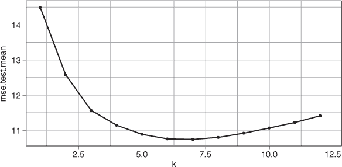

##### 列表 12.7\. 训练最终的、调整后的 kNN 模型

```
tunedKnn <- setHyperPars(makeLearner("regr.kknn"), par.vals = tunedK$x)

tunedKnnModel <- train(tunedKnn, fuelTask)
```

### 12.4\. 构建你的第一个随机森林回归模型

在本节中，我将教你如何定义一个用于回归的随机森林学习者，调整其许多超参数，并为我们燃料任务训练一个模型。

| |
| --- |

##### 注意

我们还可以使用 rpart 算法构建回归树，但由于它几乎总是被集成学习和提升学习所超越，我们将跳过它，直接进入随机森林和 XGBoost。回想一下，集成（自助聚合）学习者在数据的自助样本上训练多个模型，并返回多数投票。提升学习器按顺序训练模型，更加重视纠正先前集成模型的错误。

| |
| --- |

我们将首先定义我们的随机森林学习者。请注意，与 第八章 中的 `"classif .randomForest"` 不同，回归的等效是 `"regr.randomForest"`：

```
forest <- makeLearner("regr.randomForest")
```

接下来，我们将调整我们的随机森林学习者的超参数：`ntree`、`mtry`、`nodesize`和`maxnodes`。我首先在第八章中定义了这些超参数的作用，但让我们在这里回顾一下每个参数：

+   `ntree`控制要训练的单独树的数量。更多的树通常更好，直到增加更多的树不再进一步提高性能。

+   `mtry`控制为每个单独的树随机采样的预测变量数量。在每个单独的树上使用预测变量的随机选择进行训练有助于保持树的不相关性，从而有助于防止集成模型过度拟合训练集。

+   `nodesize`定义了在叶节点中允许的最小案例数。例如，将`nodesize`设置为 1 将允许训练集中的每个案例都有自己的叶节点。

+   `maxnodes`定义了每个单独树中的最大节点数。

如同往常，我们使用`makeParamSet()`函数创建我们的超参数搜索空间，将每个超参数定义为具有合理上下限的整数。

我们定义了一个具有 100 次迭代的随机搜索，并使用森林学习者、fuel 任务和`holdout`交叉验证策略开始调整过程。

| |
| --- |

##### 警告

这个调整过程需要一点时间，所以让我们使用我们的好朋友并行和 parallelMap 包。使用并行化，在我的四核机器上这需要 2 分钟。

| |
| --- |

##### 列表 12.8. 随机森林的超参数调整

```
forestParamSpace <- makeParamSet(
  makeIntegerParam("ntree", lower = 50, upper = 50),
  makeIntegerParam("mtry", lower = 100, upper = 367),
  makeIntegerParam("nodesize", lower = 1, upper = 10),
  makeIntegerParam("maxnodes", lower = 5, upper = 30))

randSearch <- makeTuneControlRandom(maxit = 100)

library(parallel)

library(parallelMap)

parallelStartSocket(cpus = detectCores())

tunedForestPars <- tuneParams(forest, task = fuelTask,
                              resampling = kFold,
                              par.set = forestParamSpace,
                              control = randSearch)

parallelStop()

tunedForestPars

Tune result:
Op. pars: ntree=50; mtry=244; nodesize=6; maxnodes=25
mse.test.mean=6.3293
```

接下来，让我们使用调整好的超参数来训练随机森林模型。一旦我们训练了模型，提取模型信息并将其传递给`plot()`函数以绘制袋外误差是个好主意。回想一下第八章，袋外误差是由没有包含在该树的 bootstrap 样本中的树对每个案例的平均预测误差。分类和回归随机森林的袋外误差之间的唯一区别在于，在分类中，误差是错误分类的案例比例；但在回归中，误差是均方误差。

##### 列表 12.9. 训练模型并绘制袋外误差

```
tunedForest <- setHyperPars(forest, par.vals = tunedForestPars$x)

tunedForestModel <- train(tunedForest, fuelTask)

forestModelData <- getLearnerModel(tunedForestModel)

plot(forestModelData)
```

结果图显示在图 12.9 中。看起来袋外误差在 30-40 个袋装树之后稳定下来，因此我们可以满意地认为我们已经包含了足够多的树在我们的森林中。

##### 图 12.9. 绘制我们的随机森林模型的袋外误差。误差 y 轴显示了所有情况预测的均方误差，这些预测是由没有包含该案例的训练集的树做出的。这显示了集成中不同树的数量。线条变平表明我们已经包含了足够单独的树在森林中。

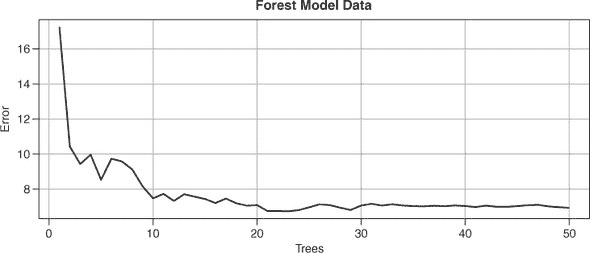

### 12.5. 构建你的第一个 XGBoost 回归模型

在本节中，我将向您介绍如何定义一个用于回归的 XGBoost 学习器，调整其众多超参数，并为我们燃料任务训练一个模型。我们将首先定义我们的 XGBoost 学习器。就像在第八章中使用的 kNN 和随机森林学习器一样，我们不是使用`"classif.xgboost"`，而是使用回归等效的`"regr.xgboost"`：

```
xgb <- makeLearner("regr.xgboost")
```

接下来，我们将调整我们的 XGBoost 学习器的超参数：`eta`、`gamma`、`max_depth`、`min_child_weight`、`subsample`、`colsample_bytree`和`nrounds`。我在第八章中首先定义了这些超参数的作用，但再次，让我们在这里回顾每个参数：

+   `eta`被称为*学习率*。它取 0 到 1 之间的值，乘以每棵树的模型权重，以减慢学习过程，防止过拟合。

+   `gamma`是节点必须通过分割改进损失函数（在回归的情况下为 MSE）的最小分割量。

+   `max_depth`是每棵树可以生长的最大深度。

+   `min_child_weight`是在尝试分割节点之前，节点中需要的最小不纯度（如果一个节点足够纯净，则不要再次尝试分割它）。

+   `subsample`是每个树随机采样（不重复）的案例比例。将此设置为 1 将使用训练集中的所有案例。

+   `colsample_bytree`是每个树中采样的预测变量比例。我们还可以调整`colsample_bylevel`和`colsample_bynode`，它们分别在每个树的每个深度级别和每个节点处采样预测变量。

+   `nrounds`是模型中按顺序构建的树的数目。

| |
| --- |

##### 注意

当我们使用 XGBoost 进行分类问题时，我们还可以调整`eval_metric`超参数，以在日志损失和分类错误损失函数之间进行选择。对于回归问题，我们只有一个可用的损失函数——RMSE，因此不需要调整此超参数。

| |
| --- |

在列表 12.10 中，我们定义了我们将搜索的每个这些超参数的类型和上下限。我们将`max_depth`和`nrounds`定义为整数超参数，其余的为数值。我为每个超参数的上限和下限选择了合理的起始值，但您可能在自己的项目中发现需要调整搜索空间以找到最佳值的组合。我通常将`nrounds`超参数固定为一个适合我的计算预算的单个值，然后绘制损失函数（RMSE）与树数的关系图，以查看模型误差是否已经平坦化。如果没有，我将增加`nrounds`超参数，直到它平坦化。我们将在列表 12.11 中执行此操作。

一旦定义了搜索空间，我们就开始调整过程，就像我们在本章的前两次一样。

| |
| --- |

##### 警告

这在我的四核机器上大约需要 1.5 分钟。

| |
| --- |

##### 列表 12.10\. XGBoost 的超参数调整

```
xgbParamSpace <- makeParamSet(
  makeNumericParam("eta", lower = 0, upper = 1),
  makeNumericParam("gamma", lower = 0, upper = 10),
  makeIntegerParam("max_depth", lower = 1, upper = 20),
  makeNumericParam("min_child_weight", lower = 1, upper = 10),
  makeNumericParam("subsample", lower = 0.5, upper = 1),
  makeNumericParam("colsample_bytree", lower = 0.5, upper = 1),
  makeIntegerParam("nrounds", lower = 30, upper = 30))

tunedXgbPars <- tuneParams(xgb, task = fuelTask,
                           resampling = kFold,
                           par.set = xgbParamSpace,
                           control = randSearch)

tunedXgbPars

Tune result:
Op. pars: eta=0.188; gamma=6.44; max_depth=11; min_child_weight=1.55; subsamp
     le=0.96; colsample_bytree=0.7; nrounds=30
mse.test.mean=6.2830
```

现在我们已经得到了调整后的超参数组合，让我们使用这个组合来训练最终的模型。一旦我们这样做，我们就可以提取模型信息，并使用它来绘制迭代次数（树数）与 RMSE 的关系，以查看我们是否在我们的集成中包含了足够的树。每个树数的 RMSE 信息包含在模型信息的`$evaluation_log`组件中，因此我们使用这个作为`ggplot()`函数的数据参数，指定`iter`和`train_rmse`来分别绘制树数及其 RMSE 作为 x 和 y 的美学。

##### 列表 12.11\. 训练模型并绘制 RMSE 与树数的关系

```
tunedXgb <- setHyperPars(xgb, par.vals = tunedXgbPars$x)

tunedXgbModel <- train(tunedXgb, fuelTask)

xgbModelData <- getLearnerModel(tunedXgbModel)

ggplot(xgbModelData$evaluation_log, aes(iter, train_rmse)) +
  geom_line() +
  geom_point() +
  theme_bw()
```

结果图显示在图 12.10 中。我们可以看到，30 次迭代/树数几乎足以使 RMSE 平缓（增加更多的迭代不会导致更好的模型）。

### 12.6\. 基准测试 kNN、随机森林和 XGBoost 模型构建过程

我喜欢一点健康的竞争。在本节中，我们将对 kNN、随机森林和 XGBoost 模型构建过程进行相互基准测试。我们首先创建调整包装器，将每个学习器及其超参数调整过程包装在一起。然后我们创建一个这些包装学习器的列表，将其传递给`benchmark()`函数。由于这个过程将花费一些时间，我们将定义并使用`holdout`交叉验证程序来评估每个包装器的性能（理想情况下我们会使用 k 折或重复 k 折）。

##### 图 12.10\. 绘制平均均方根误差(`train_rmse`)与提升过程迭代的对比。曲线在 30 次迭代前变平，表明我们已经在我们的集成中包含了足够的树。

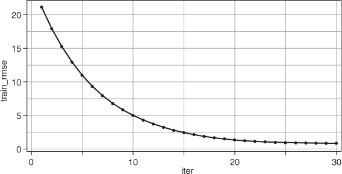


##### 警告

是时候喝茶吃蛋糕了！在我的四核机器上运行大约需要 7 分钟。使用 parallelMap 包不会有所帮助，因为我们正在将 XGBoost 模型作为基准测试的一部分进行训练，而 XGBoost 在允许其进行内部并行化时运行最快。


##### 列表 12.12\. 基准测试 kNN、随机森林和 XGBoost

```
kknnWrapper <- makeTuneWrapper(kknn, resampling = kFold,
                                par.set = kknnParamSpace,
                                control = gridSearch)

forestWrapper <- makeTuneWrapper(forest, resampling = kFold,
                                par.set = forestParamSpace,
                                control = randSearch)

xgbWrapper <- makeTuneWrapper(xgb, resampling = kFold,
                                  par.set = xgbParamSpace,
                                  control = randSearch)

learners = list(kknnWrapper, forestWrapper, xgbWrapper)

holdout <- makeResampleDesc("Holdout")

bench <- benchmark(learners, fuelTask, holdout)

bench

  task.id              learner.id mse.test.mean
1 fuelTib         regr.kknn.tuned        10.403
2 fuelTib regr.randomForest.tuned         6.174
3 fuelTib      regr.xgboost.tuned         8.043
```

根据这个基准结果，随机森林算法可能为我们提供性能最好的模型，平均预测误差为 2.485（6.174 的平方根）。

### 12.7\. kNN、随机森林和 XGBoost 的优缺点

kNN、随机森林和 XGBoost 算法的优缺点在回归方面与在分类方面相同。


**练习 3**

通过重新运行基准实验，将我们的`holdout`交叉验证对象更改为`kFold`对象，我们可以更准确地估计我们的模型构建过程。警告：在我的四核机器上这几乎花了一个小时！将基准结果保存到对象中，并将该对象作为唯一参数传递给`plotBMRBoxplots()`函数。

|  |

**练习 4**

对在练习 3 中赢得基准的模型的建模过程进行交叉验证，但在超参数调整期间进行 2,000 次随机搜索迭代。使用`holdout`作为内部交叉验证循环，10 折交叉验证作为外部循环。警告：我建议您使用并行化，并在午餐或夜间运行此操作。

| |
| --- |

### 摘要

+   k-最近邻（kNN）和基于树的算法可以用于回归以及分类。

+   当预测连续的因变量时，kNN 做出的预测是 k 个最近邻的平均结果值。

+   当预测连续的因变量时，基于树的算法的叶子是那个叶子内案例的平均值。

+   在回归问题中，可以使用袋外误差和 RMSE 来识别随机森林和 XGBoost 集成是否具有足够的树。

### 练习题的解决方案

1.  使用额外的`geom_smooth()`层绘制`absorbance`与`heatan`的关系图，以模拟整个数据集：

    ```
    fuelUntidy %>%
      ggplot(aes(absorbance, heatan, col = as.factor(wavelength))) +
      facet_wrap(~ spectrum, scales = "free_x") +
      geom_smooth(se = FALSE, size = 0.2) +
      geom_smooth(group = 1, col = "blue") +
      ggtitle("Absorbance vs heatan for each wavelength") +
      theme_bw() +
      theme(legend.position = "none")
    ```

1.  将 kNN 搜索空间扩展到包括 1 到 50 之间的值：

    ```
    kknnParamSpace50 <- makeParamSet(makeDiscreteParam("k", values = 1:50))

    tunedK50 <- tuneParams(kknn, task = fuelTask,
                         resampling = kFold,
                         par.set = kknnParamSpace50,
                         control = gridSearch)

    tunedK50

    knnTuningData50 <- generateHyperParsEffectData(tunedK50)

    plotHyperParsEffect(knnTuningData50, x = "k", y = "mse.test.mean",
                        plot.type = "line") +
      theme_bw()

    # Our original search space was large enough.
    ```

1.  在基准实验中，使用 10 折交叉验证作为外部交叉验证循环：

    ```
    benchKFold <- benchmark(learners, fuelTask, kFold)

    plotBMRBoxplots(benchKFold)
    ```

1.  对赢得基准的算法的建模过程进行交叉验证，执行 2,000 次随机搜索迭代，并使用`holdout`作为内部交叉验证策略（在调整包装器内部）：

    ```
    holdout <- makeResampleDesc("Holdout")

    randSearch2000 <- makeTuneControlRandom(maxit = 2000)

    forestWrapper2000 <- makeTuneWrapper(forest, resampling = holdout,
                                         par.set = forestParamSpace,
                                         control = randSearch2000)

    parallelStartSocket(cpus = detectCores())

    cvWithTuning <- resample(forestWrapper2000, fuelTask, resampling = kFold)

    parallelStop()
    ```
