## 第四部分：降维

您现在正走在成为监督机器学习大师的路上！到目前为止，您的机器学习算法工具箱已经为您提供了解决许多现实世界分类和回归问题的技能。我们现在将进入无监督学习的领域，在那里我们不再依赖于标记数据来从数据中学习模式。因为我们不再有真实标签进行比较，验证无监督学习者的性能可能会很具挑战性，但我将展示确保最佳性能的实用方法。

回想一下第一章，无监督学习可以分为两个目标：降维和聚类。在第十三章、第十四章和第十五章中，我将向您介绍几种降维算法，您可以使用这些算法将大量变量转换为更少、更易于管理的数量。我们这样做的原因可能是为了简化可视化高维数据中模式的过程；或者作为将数据传递给监督算法之前的预处理步骤，以减轻维度灾难。

## 第十三章：使用主成分分析最大化方差

*本章涵盖*

+   理解降维

+   处理高维性和多重共线性

+   使用主成分分析进行降维

降维包括多种方法，可以将一组（可能很多）变量转换为更少的变量，同时尽可能保留原始的多维信息。我们有时希望减少我们在数据集中处理的维度数量，以帮助我们可视化数据中的关系或避免高维中出现的奇怪现象。因此，降维是您机器学习工具箱中需要添加的一项关键技能！

我们在降维的第一站将带我们到一个非常著名且实用的技术：*主成分分析* (*PCA*)。PCA 自 20 世纪初以来一直存在，它创建了新的变量，这些变量是原始变量的线性组合。因此，PCA 与我们在第五章中遇到的判别分析类似；但 PCA 不是构建新的变量来区分类别，而是构建新的变量来解释数据中的大部分变化/信息。实际上，PCA 没有标签，因为它是无监督的，并且在不依赖真实标签的情况下从数据本身中学习模式。然后我们可以使用这些新变量中的两个或三个来捕获大部分信息，作为回归、分类或聚类算法的输入，同时也可以使用它们来更好地理解我们数据中的变量是如何相互关联的。

| |
| --- |

##### 注意

降维的第一个历史例子是具有两个维度的地图。我们在日常生活中遇到的另一种降维形式是将音频压缩成 .mp3 和 .flac 等格式。

| |
| --- |

mlr 包没有降维任务的类别，也没有降维学习者的类别（我想象中可能是 `dimred.[ALGORITHM]` 这样的）。PCA 是 mlr 包中唯一被封装的降维算法，我们可以将其作为预处理步骤（如插补或特征选择）包括在内。鉴于这一点，我们暂时将 mlr 包的安全性放在一边。

到本章结束时，我希望你能理解降维是什么以及为什么我们有时需要它。我将向你展示 PCA 算法是如何工作的，以及你如何可以使用它来降低数据集的维度，以帮助识别假钞。

### 13.1. 为什么需要降维？

在本节中，我将向您展示应用降维的主要理由：

+   使可视化具有许多变量的数据集变得更加容易

+   缓解维度灾难

+   缓解多重共线性的影响

我将扩展说明维度灾难和多重共线性是什么，以及它们为什么会给机器学习带来问题，以及为什么降维可以减少我们在数据中寻找模式时这两种问题的冲击。

#### 13.1.1. 可视化高维数据

在开始探索性分析时，你应该做的第一件事之一就是绘制你的数据。对我们这些数据科学家来说，理解我们数据的结构、变量之间的关系以及数据的分布方式是很重要的。但如果我们有一个包含数千个变量的数据集呢？我们甚至从哪里开始？将每个变量与其他变量一一绘制出来已经不再是可行的选项了，那么我们如何获得我们数据中整体结构的感受呢？嗯，我们可以将维度降低到一个更易于管理的数量，并绘制这些数据。当我们这样做时，我们不会得到原始数据集的所有信息，但这将帮助我们识别数据中的模式，比如可能表明数据中存在分组结构的案例集群。

#### 13.1.2. 维度灾难的后果

在第五章中，我讨论了维度的诅咒。这个听起来有些戏剧性的现象描述了我们在尝试从具有许多变量的数据集中识别模式时遇到的挑战。维度诅咒的一个方面是，对于固定数量的案例，当我们增加数据集中的维度（增加特征空间）时，案例之间的距离会越来越远。为了重申这一点，在图 13.1 中，我重新绘制了第五章中的图 5.2。在这种情况下，数据被称为*稀疏的*。许多机器学习算法在从稀疏数据中学习模式时都会遇到困难，并且可能开始从数据集中的噪声中学习。

##### 图 13.1\. 随着维度的增加，数据变得更加稀疏。在单维、二维和三维特征空间中显示了两个类别。三维表示中的虚线用于澄清点在 z 轴上的位置。注意随着维度的增加，空隙越来越大。

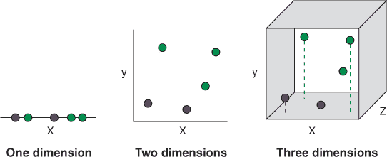

维度诅咒的另一个方面是，随着维度的增加，案例之间的距离开始收敛到一个单一值。换句话说，对于特定的案例，其最近邻和最远邻之间的距离比在高度维度中趋向于 1。这对依赖于测量距离（尤其是欧几里得距离）的算法提出了挑战，如 k 最近邻算法，因为距离开始变得没有意义。

最后，我们经常会遇到这样的情况：我们拥有的变量比数据中的案例多得多。这被称为*p >> n 问题*，其中*p*是变量的数量，*n*是案例的数量。这再次导致特征空间的稀疏区域，使得许多算法难以收敛到最优解。

#### 13.1.3\. 共线性的后果

数据集中的变量往往与其他变量有不同程度的关联。有时我们可能有两个高度相关的变量，以至于一个基本上包含了另一个的信息（例如，皮尔逊相关系数> 0.9）。在这种情况下，这些变量被称为*共线性*或表现出*共线性*。两个可能共线性的变量的例子是年收入和银行愿意贷款给某人的最大金额；你可能会以很高的准确性从其中一个预测另一个。

| |
| --- |

##### 提示

当超过两个变量共线性时，我们说我们的数据集中存在*多重共线性*。当一个变量可以从另一个变量或变量的组合中*完美地*预测时，我们说存在*完美共线性*。

| |
| --- |

那么，多重共线性有什么问题呢？嗯，这取决于你分析的目标以及你使用的算法。多重共线性最常遇到的负面影响是线性回归模型参数估计。

假设你正在尝试根据卧室数量、房屋年龄（以年为单位）和房屋年龄（以月为单位）来预测房屋的价值，使用线性回归。年龄变量之间完全多重共线性，因为其中一个变量所包含的信息在另一个变量中都没有。两个预测变量的参数估计（斜率）描述了每个预测变量与结果变量之间的关系，在考虑其他变量的影响之后。如果两个预测变量捕捉到关于结果变量的大部分（或全部，在这种情况下）相同信息，那么当我们考虑一个变量的影响时，另一个变量将没有信息可以贡献。因此，两个预测变量的参数估计将比应有的要小（因为每个都是在考虑了另一个变量的影响之后估计的）。

因此，多重共线性使得参数估计更加多变，并且对数据的小幅变化更加敏感。这主要是一个问题，如果你对解释和推断参数估计感兴趣的话。如果你只关心预测准确性，而不是解释模型参数，那么多重共线性对你来说可能根本不是问题。

然而，值得注意的是，当使用你在第六章中学习的朴素贝叶斯算法时，多重共线性尤其成问题。第六章中提到的“朴素”指的是该算法假设预测变量之间是独立的。这种假设在现实世界中通常是不成立的，但朴素贝叶斯通常对预测变量之间的小相关性具有抵抗力。然而，当预测变量高度相关时，朴素贝叶斯的预测性能将显著下降，尽管在交叉验证模型时通常很容易识别这一点。

#### 13.1.4\. 通过使用 - 维度降低来缓解维度诅咒和多重共线性

你如何减轻维度诅咒和/或多重共线性对模型预测性能的影响？当然，通过维度降低！如果你能将 100 个变量的大部分信息压缩到仅仅 2 或 3 个变量中，那么数据稀疏性和接近相等距离的问题就会消失。如果你将两个多重共线性变量转换为一个新变量，该变量可以捕捉到两个变量的所有信息，那么变量之间的依赖性问题就会消失。

但我们已经遇到了另一组可以减轻维度灾难和多重共线性问题的技术：正则化。正如我们在第十一章（kindle_split_022.html#ch11）中看到的，正则化可以用来缩小参数估计，甚至完全移除贡献较弱的预测因子。因此，正则化可以减少维度灾难导致的稀疏性，并移除与其他变量共线的变量。

| |
| --- |

##### 注意

对于大多数人来说，解决维度灾难比减少多重共线性更重要。

| |
| --- |

### 13.2\. 主成分分析是什么？

在本节中，我将向您展示 PCA 是什么，它是如何工作的，以及为什么它是有用的。想象一下，我们测量了七个人的两个变量，并希望使用 PCA 将这些信息压缩成一个单一的变量。我们首先需要做的是通过从每个案例中每个变量的对应值中减去每个变量的均值来对变量进行中心化。

除了对变量进行中心化之外，我们还可以通过将每个变量除以其标准差来对它们进行缩放。如果变量是在不同的尺度上测量的，这很重要——否则，那些在大尺度上的变量会被赋予更重的权重。如果我们的变量在相似的尺度上，这个标准化步骤就不必要了。

在我们的数据被中心化（可能还进行了缩放）之后，PCA 现在找到一个满足两个条件的新轴：

+   这个轴穿过原点。

+   这个轴最大化了数据沿自身的方差。

满足这些条件的新轴被称为第一个 *主轴*。当数据投影到这个主轴上（以直角移动到轴上的最近点）时，这个新变量被称为第一个 *主成分*，通常缩写为 PC1。数据中心化和找到 PC1 的这个过程如图 13.2 所示。

##### 图 13.2\. 在应用 PCA 算法之前，我们首先（通常）通过减去每个案例中每个变量的均值来对数据进行中心化。这使数据原点位于数据中心。然后找到第一个主轴：它是通过原点并且当数据投影到它上面时，最大化数据方差的轴。


第一个主轴是通过数据原点的线，一旦数据投影到它上面，沿着这条线具有最大的方差，并被称为“最大化方差”。这如图 13.3 所示。这个轴被选择是因为如果这条线解释了数据中大部分的方差，那么它也解释了数据中大部分的信息。

##### 图 13.3. 首要主轴“最大化方差”的含义。左侧图显示了次优候选主轴。右侧图显示了最优候选主轴。数据在各自的图表下方投影到每个主轴上。数据沿轴的方差在右侧最大。

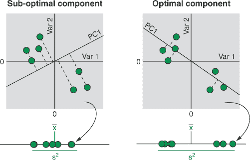

这个新的主轴实际上是预测变量的线性组合。再次看看图 13.3。第一个主轴穿过两个案例簇，在 var 1 和 var 2 之间形成一个负斜率。就像在线性回归中一样，我们可以通过一个变量随另一个变量变化（当线通过原点时，截距为 0）来表示这条线。看看图 13.4，我突出显示了当 var 1 沿主轴增加两个单位时，var 2 的变化量。对于 var 1 的每两个单位的变化，var 2 减少 0.68 个单位。

有一个标准化的方式来描述通过我们的特征空间的斜率是有用的。在线性回归中，我们可以通过 y 随 x 增加一个单位而变化的量来定义斜率。但在执行 PCA 时，我们通常没有预测变量和结果变量的任何概念：我们只有一组我们希望压缩的变量。相反，我们通过每个变量（在图 13.4 中二维示例中的 x 轴和 y 轴）需要走多远来定义主轴（这样从原点的距离等于 1）。

再看看图 13.4。我们试图计算当长度 c 等于 1 时，三角形的边 a 和 b 的长度。这将告诉我们沿着 var 1 和 var 2 需要走多远，才能在主轴上离原点有 1 个单位的距离。我们如何计算 c 的长度？为什么，我们的好朋友毕达哥拉斯定理可以帮助我们！通过应用 c² = a² + b²，我们可以计算出如果我们沿着 var 1 走 2.00 个单位，沿着 var 2 走-0.68 个单位，c 的长度等于 2.11。为了使 c 的长度等于 1，我们只需将三角形的三个边都除以 2.11。现在我们定义我们的主轴如下：对于 var 1 每增加 0.95 个单位，我们在 var 2 上减少 0.32 个单位。

##### 图 13.4. 计算主成分的特征向量。每个变量的距离都进行了缩放，以便它们标记一个点，该点距离原点沿主轴有 1 个单位的距离。我们可以通过取一个由一个变量的变化量除以另一个变量的变化量定义的三角形，并使用毕达哥拉斯定理来找到从原点到该点的距离来进行图形说明。

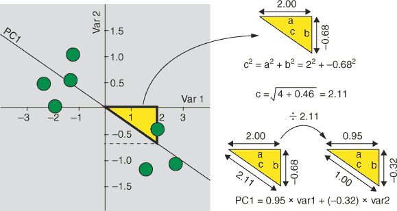

注意，这种变换不会改变线的方向；它所做的只是将所有东西标准化，使得从原点到点的距离为 1。这些定义主轴的每个变量的标准化距离被称为*特征向量*。因此，从主轴得到的主成分的公式是

##### 方程式 13.1。

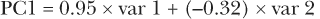

因此，对于任何特定的情况，我们将其中心化（减去每个变量的均值），取其方差 1 的值并乘以 0.95，然后将结果加到方差 2 乘以-0.32 的值上，以得到该案例的 PC1 值。一个案例的主成分值被称为其*成分得分*。

一旦我们找到了第一个主轴，我们需要找到下一个。PCA 将找到与变量数量一样多或比数据集中的案例数量少一个的主轴，取较小者。因此，第一个主成分总是解释数据中大部分方差的那个。具体来说，如果我们计算每个主成分的案例方差，PC1 将具有最大的值。沿着特定主成分的数据方差被称为其*特征值*。

| |
| --- |

##### 注意

如果特征空间中的特征向量定义了主轴的方向，那么特征值定义了沿着主轴的扩散程度。

| |
| --- |

一旦找到第一个主轴，下一个主轴必须与它正交。当我们数据集中只有两个维度时，这意味着第二个主轴将与第一个主轴形成直角。图 13.5 中的例子显示了一组案例被投影到它们的第一和第二个主轴上。当仅将两个变量转换为两个主成分时，绘制数据的成分得分相当于围绕原点旋转数据。

##### 图 13.5。在二维特征空间中，第一个主轴是最大化方差的那一个（正如它总是那样），第二个主轴与第一个主轴正交（成直角）。在这种情况下，绘制主成分仅仅导致数据的旋转。

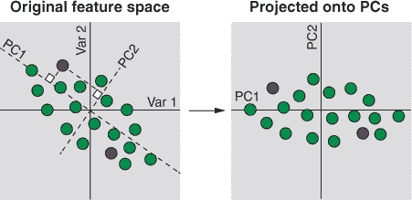

| |
| --- |

##### 注意

这种强加的正交性是 PCA 擅长去除变量之间共线性原因之一：它可以将一组相关变量转换为一组不相关（正交）变量。

| |
| --- |

在旋转了图 13.5 中的数据后，数据中的大部分方差都由 PC1 解释，而 PC2 与它正交。但主成分分析（PCA）通常用于**降低维度**，而不仅仅是旋转双变量数据，那么当我们处于更高维空间时，主轴是如何计算的？看看图 13.6 吧。我们在三维空间中有一个数据云，它在特征空间的右下角离我们最近，而在左上角离我们越来越远（注意点变得越小）。第一个主成分轴仍然是解释数据中大部分方差的那个轴，但这次它延伸到了三维空间（从右前到左上）。在具有超过三个维度的特征空间中，这个过程也会发生，但可视化起来比较困难！

第二个主成分轴仍然与第一个正交，但现在我们有三个维度可以操作，它可以在保持它们之间直角关系的平面上自由围绕第一个轴旋转。我用一个围绕原点的圆圈来表示这种旋转自由度，离我们越远，圆圈就越淡。第二个主成分轴是那个与第一个正交但解释数据中剩余大部分方差的主成分轴。第三个主成分轴必须与前两个轴正交（与它们都成直角），因此没有移动的自由。第一个主成分总是解释最多的方差，然后是第二个、第三个，以此类推。

##### 图 13.6。在三维特征空间中，第二个主成分轴仍然与第一个主成分轴正交，但它有自由在第一个轴周围旋转（左侧图表中的箭头椭圆所示），直到最大化剩余的方差。第三个主成分轴与第一个和第二个主成分轴正交，因此没有旋转的自由；它解释的方差最少。

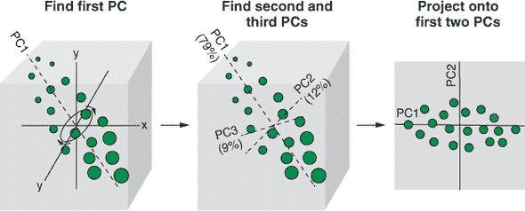

在这一点上，你可能想知道，如果 PCA 计算的是变量数量较少的那个或案例数量减一，那么它究竟是如何降低维度数的？好吧，仅仅计算主成分根本就不是降维！降维涉及到**我们在分析剩余部分决定保留多少主成分**。在图 13.6 的例子中，我们有三个主成分，但前两个解释了数据集中 79% + 12% = 91%的变异。如果这两个主成分能够捕捉到原始数据集中足够的信息，使得降维变得有价值（也许我们可以从聚类或分类算法中获得更好的结果），那么我们可以愉快地丢弃剩余的 9%的信息。在章节的后面部分，我会向你展示一些决定保留多少主成分的方法。

### 13.3. 构建你的第一个 PCA 模型

在本节中，我们将通过使用 PCA 降低数据集的维度，将我们刚刚讨论的 PCA 理论转化为技能。想象一下，你为瑞士联邦财政部工作（由于你对金钱、巧克力、奶酪和政治中立性的热爱）。该部门认为流通中有大量伪造的瑞士银行券，你的任务是找到一种方法来识别它们。在此之前没有人研究过这个问题，也没有标记的数据可以依据。因此，你要求 200 名同事每人给你一张纸币（你承诺会还给他们），并测量每张纸币的尺寸。你希望真钞和假钞之间可能存在一些差异，你可以使用 PCA 来识别。

在本节中，我们将通过以下方法来解决这个问题：

1.  在 PCA 之前探索和绘制原始数据集

1.  使用`prcomp()`函数从数据中学习主成分

1.  探索和绘制 PCA 模型的结果

#### 13.3.1\. 加载和探索银行券数据集

我们将首先加载 tidyverse 包，从 mclust 包中加载数据，并将数据框转换为 tibble。我们有一个包含 200 张纸币的 tibble，有 7 个变量。

##### 列表 13.1\. 加载银行券数据集

```
library(tidyverse)

data(banknote, package = "mclust")

swissTib <- as_tibble(banknote)

swissTib

# A tibble: 200 x 7
   Status  Length  Left Right Bottom   Top Diagonal
   <fct>    <dbl> <dbl> <dbl>  <dbl> <dbl>    <dbl>
 1 genuine   215\.  131   131\.    9     9.7     141
 2 genuine   215\.  130\.  130\.    8.1   9.5     142.
 3 genuine   215\.  130\.  130\.    8.7   9.6     142.
 4 genuine   215\.  130\.  130\.    7.5  10.4     142
 5 genuine   215   130\.  130\.   10.4   7.7     142.
 6 genuine   216\.  131\.  130\.    9    10.1     141.
 7 genuine   216\.  130\.  130\.    7.9   9.6     142.
 8 genuine   214\.  130\.  129\.    7.2  10.7     142.
 9 genuine   215\.  129\.  130\.    8.2  11       142.
10 genuine   215\.  130\.  130\.    9.2  10       141.
# ... with 190 more rows
```

眼尖的你们可能已经注意到，这个 tibble 实际上是标记过的。我们有变量`Status`告诉我们每张纸币是真钞还是假钞。这纯粹是为了教学目的；我们将从 PCA 分析中排除它，但稍后会将标签映射到最终的主成分上，以查看 PCA 模型是否将类别分开。

在我有明确的因变量的情况下，我经常将每个预测变量与因变量（如我们在前面的章节中所做的那样）进行绘图。在不监督学习的情况下，我们没有因变量，所以我更喜欢将所有变量相互绘制（前提是我没有那么多变量以至于无法这样做）。我们可以使用 GGally 包中的`ggpairs()`函数轻松完成此操作，你可能需要先安装它。我们将我们的 tibble 作为第一个参数传递给`ggpairs()`函数，然后通过将 ggplot2 的`aes()`函数传递给映射参数来提供任何额外的美学映射。最后，我们添加一个`theme_bw()`层来添加黑白主题。

##### 列表 13.2\. 使用`ggpairs()`绘制数据

```
install.packages("GGally")

library(GGally)
ggpairs(swissTib, mapping = aes(col = Status)) +
  theme_bw()
```

结果图表显示在 图 13.7。`ggpairs()` 函数的输出需要一点时间来习惯，但它为每种变量类型的组合绘制了不同类型的图表。例如，在面板顶部的一行是箱线图，显示了每个连续变量相对于分类变量的分布。在面板左侧的列中，我们以直方图的形式得到相同的结果。对角面板显示了每个变量的值分布，忽略所有其他变量。最后，点图显示了成对连续变量之间的二元关系。

##### 图 13.7\. 在我们的纸币数据集上调用 `ggpairs()` 函数的结果。每个变量都与每个其他变量进行绘图，根据变量类型的组合绘制不同的图表类型。

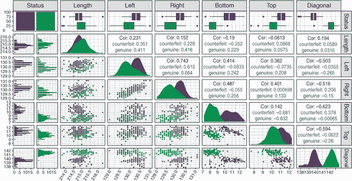

观察图表，我们可以看到一些变量似乎可以区分真伪纸币，例如 `Diagonal` 变量。然而，`Length` 变量却包含很少的信息来区分这两种纸币类别。


##### 注意

你会看到，如果我们有更多的变量，以这种方式可视化它们之间的关系将开始变得困难！


#### 13.3.2\. 执行主成分分析

在本节中，我们将使用主成分分析算法来学习我们的纸币数据集的主成分。为此，我将向您介绍随您的 base R 安装一起提供的 stats 包中的 `prcomp()` 函数。一旦我们完成这个，我们将检查该函数的输出以解释主成分的成分得分。然后，我将向您展示如何从主成分中提取和解释 *变量载荷*，这告诉我们每个原始变量与每个主成分的相关程度。

##### 列表 13.3\. 执行主成分分析

```
pca <- select(swissTib, -Status) %>%
    prcomp(center = TRUE, scale = TRUE)

pca

Standard deviations (1, .., p=6):
[1] 1.7163 1.1305 0.9322 0.6706 0.5183 0.4346

Rotation (n x k) = (6 x 6):
               PC1      PC2      PC3     PC4     PC5      PC6
Length    0.006987 -0.81549  0.01768  0.5746 -0.0588  0.03106
Left     -0.467758 -0.34197 -0.10338 -0.3949  0.6395 -0.29775
Right    -0.486679 -0.25246 -0.12347 -0.4303 -0.6141  0.34915
Bottom   -0.406758  0.26623 -0.58354  0.4037 -0.2155 -0.46235
Top      -0.367891  0.09149  0.78757  0.1102 -0.2198 -0.41897
Diagonal  0.493458 -0.27394 -0.11388 -0.3919 -0.3402 -0.63180

summary(pca)

Importance of components:
                         PC1   PC2   PC3   PC4    PC5    PC6
Standard deviation     1.716 1.131 0.932 0.671 0.5183 0.4346
Proportion of Variance 0.491 0.213 0.145 0.075 0.0448 0.0315
Cumulative Proportion  0.491 0.704 0.849 0.924 0.9685 1.0000
```

我们首先使用 `select()` 函数删除 `Status` 变量，然后将结果数据管道输入到 `prcomp()` 函数中。`prcomp()` 函数有两个额外的重要参数：`center` 和 `scale`。`center` 参数控制是否在应用主成分分析之前对数据进行均值中心化，其默认值是 `TRUE`。我们应该在应用主成分分析之前始终对数据进行中心化，因为这会移除截距并迫使主轴通过原点。

`scale`参数控制变量是否通过它们的方差除以以使它们彼此处于相同的尺度，其默认值是`FALSE`。在运行 PCA 之前是否应该标准化变量并没有明确的共识。一个常见的经验法则是，如果原始变量是在相似的尺度上测量的，则不需要标准化；但如果有一个变量测量的是克，另一个变量测量的是千克，你应该通过设置`scale = TRUE`来标准化它们，使它们处于相同的尺度。这很重要，因为如果你有一个变量在很大的尺度上测量，这个变量将主导特征向量，而其他变量对主成分的贡献将少得多。在这个例子中，我们将设置`scale = TRUE`，但本章的一个练习是设置`scale = FALSE`并比较结果。


##### 注意

在这个例子中，我们并不感兴趣将`Status`变量包含在我们的降维模型中；但即使我们感兴趣，PCA 也无法处理分类变量。如果你有分类变量，你的选择是将它们编码为数值（这可能或可能不起作用），使用不同的降维方法（有一些可以处理分类变量，这里不会讨论），或者从连续变量中提取主成分，然后在最终数据集中将这些主成分与分类变量重新组合。


当我们打印`pca`对象时，我们得到了模型的一些信息输出。`标准差`组件是沿着每个主成分数据的标准差向量。因为方差是标准差的平方，要将这些标准差转换为主成分的特征值，我们只需将它们平方。注意，值是从左到右逐渐变小的吗？这是因为主成分按顺序解释了数据中越来越少的方差。

`旋转`组件包含六个特征向量。记住，这些特征向量描述了我们在每个原始变量上的距离，这样我们就沿着主轴离原点有一个单位。这些特征向量描述了主轴的方向。

如果我们将 PCA 结果传递给`summary()`函数，我们将得到每个主成分重要性的分解。`标准差`行与我们刚才看到的相同，包含特征值的平方根。`方差比例`行告诉我们每个主成分解释了多少总方差。这是通过将每个特征值除以特征值的总和来计算的。`累积比例`行告诉我们到目前为止主成分解释了多少方差。例如，我们可以看到 PC1 和 PC2 分别解释了总方差的 49.1%和 21.3%；累积起来，它们共同解释了 70.4%。当我们决定为下游分析保留多少主成分时，这些信息是有用的。

如果我们对解释主成分感兴趣，提取*变量载荷*是有用的。变量载荷告诉我们原始变量中的每一个与每一个主成分的相关程度。计算特定主成分变量载荷的公式是

##### 公式 13.2。

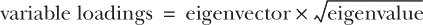

我们可以使用`map_dfc()`函数同时计算所有主成分的变量载荷，并将它们作为 tibble 返回。

##### 列表 13.4\. 计算变量载荷

```
map_dfc(1:6, ~pca$rotation[, .] * sqrt(pca$sdev ^ 2)[.])

# A tibble: 6 x 6
       V1     V2      V3      V4      V5      V6
    <dbl>  <dbl>   <dbl>   <dbl>   <dbl>   <dbl>
1  0.0120 -0.922  0.0165  0.385  -0.0305  0.0135
2 -0.803  -0.387 -0.0964 -0.265   0.331  -0.129
3 -0.835  -0.285 -0.115  -0.289  -0.318   0.152
4 -0.698   0.301 -0.544   0.271  -0.112  -0.201
5 -0.631   0.103  0.734   0.0739 -0.114  -0.182
6  0.847  -0.310 -0.106  -0.263  -0.176  -0.275
```

我们可以将这些值解释为皮尔逊相关系数，因此我们可以看到`长度`变量与 PC1 的相关性非常小（0.012），但与 PC2 有非常强的负相关性（-0.922）。这有助于我们得出结论，平均而言，PC2 成分得分较小的案例，其`长度`较大。

#### 13.3.3\. 绘制我们的 PCA 结果

接下来，让我们通过查看模型是否揭示了任何模式来绘制我们的 PCA 模型结果，以更好地理解数据中的关系。factoextra 包中有一些用于 PCA 结果的优秀绘图函数，所以让我们安装并加载这个包，并对其进行操作（见列表 13.5）。一旦加载了包，使用`get_pca()`函数从我们的 PCA 模型中获取信息，以便我们可以对其应用 factoextra 函数。

| |
| --- |

##### 提示

尽管我们在列表 13.4 中手动计算了变量载荷，但提取这些信息的一种更简单的方法是打印我们在列表 13.5 中创建的`pcaDat`对象的`$coord`组件。

| |
| --- |

`fviz_pca_biplot()` 函数绘制一个 *载荷图*。载荷图是一种常见的绘图方法，可以同时绘制前两个主成分的成分得分和变量载荷。您可以在 图 13.8 的左上角看到载荷图。点表示每张纸币相对于前两个主成分的成分得分，箭头指示每个变量的载荷。这个图帮助我们确定似乎有两群不同的纸币，箭头帮助我们看到哪些变量倾向于与每个群组相关。例如，这个图中最右侧的群组在 `Diagonal` 变量上往往有更高的值。


##### 提示

`label = "var"` 参数告诉函数只标记变量；否则，它将每个案例的行号作为标签，这让我感到非常不适。


`fviz_pca_var()` 函数绘制一个 *变量载荷图*。您可以在 图 13.8 的右上角看到变量载荷图。请注意，这显示了与载荷图相同的变量载荷箭头，但现在轴代表每个变量与每个主成分的相关性。如果您再次查看 列表 13.4 中计算出的变量载荷，您会看到这个图显示了相同的信息：每个原始变量与第一个两个主成分的相关程度。

##### 图 13.8\. 由 factoextra 包提供的 PCA 分析的典型探索性图。左上角的图显示了一个载荷图，结合了每个案例的成分得分和表示变量载荷的箭头。右上角的图显示了带有相关圆（变量载荷必须位于其边界内）的变量载荷图。底部的 scree 图显示了特征值（左）和百分比解释方差（右）。

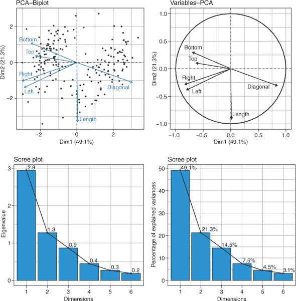

`fviz_screeplot()` 函数绘制一个 *碎石图*。碎石图是一种常见的绘图方式，将主成分与它们在数据中解释的方差量进行对比，作为一种图形化的方式来帮助确定保留多少个主成分。该函数允许我们使用 `choice` 参数来绘制每个主成分的特征值或百分比方差。您可以在 图 13.8 的底部两个图中看到这两种不同的 y 轴上的 scree 图。


##### 注意

碎石图之所以得名，是因为它们类似于 *碎石坡*，这是由于风化侵蚀而在悬崖脚下积累的岩石和碎屑。


##### 列表 13.5\. 绘制 PCA 结果

```
install.packages("factoextra")

library(factoextra)

pcaDat <- get_pca(pca)

fviz_pca_biplot(pca, label = "var")

fviz_pca_var(pca)

fviz_screeplot(pca, addlabels = TRUE, choice = "eigenvalue")

fviz_screeplot(pca, addlabels = TRUE, choice = "variance")
```

我将 列表 13.5 中的四个图压缩成一个单独的图 (图 13.8) 以节省空间。

在决定保留多少个主成分时，有一些经验法则。一个是保留累积解释至少 80%方差的成分。另一个是保留所有特征值至少为 1 的成分；所有特征值的平均值总是 1，因此这会导致保留包含比平均值更多信息的成分。第三个经验法则是寻找“拐点”在特征值分布图上，并排除拐点之后的成分（尽管在我们的例子中没有明显的拐点）。而不是过分依赖这些经验法则，我会查看我的数据在主成分上的投影，并考虑我可以为我的应用容忍丢失多少信息。如果我在应用机器学习算法之前对我的数据进行 PCA，我更喜欢使用自动特征选择方法，就像我们在前面的章节中所做的那样，以选择导致最佳性能的主成分组合。

最后，让我们将我们的前两个主成分相互对比，看看它们能有多好地分离真伪银行钞票。我们首先将原始数据集变异，包括一个 PC1 和 PC2 的成分得分列（使用`$x`从我们的`pca`对象中提取）。然后我们将主成分相互对比，并为`Status`变量添加颜色美学。

##### 列表 13.6\. 映射真伪标签

```
swissPca <- swissTib %>%
  mutate(PCA1 = pca$x[, 1], PCA2 = pca$x[, 2])

ggplot(swissPca, aes(PCA1, PCA2, col = Status)) +
  geom_point() +
  theme_bw()
```

##### 图 13.9\. 对于每个案例，PCA 成分得分被绘制出来，根据它们是否为真钞或假钞进行着色。

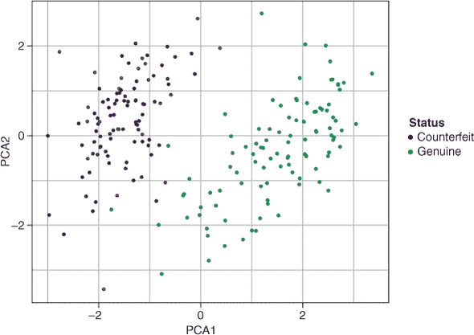

结果图表显示在图 13.9 中。我们开始时有六个连续变量，并将大部分信息压缩成仅包含两个主成分，这两个主成分包含了足够的信息来分离两种银行钞票的集群！如果我们没有标签，已经识别出不同的数据集群，我们现在会尝试理解这两个集群是什么，也许会想出一个区分真钞和假钞的方法。


**练习 1**

在图 13.9 的图表中添加一个`stat_ellipse()`层，为每种银行钞票类别添加 95%置信椭圆。


#### 13.3.4\. 计算新数据的成分得分

我们已经有了 PCA 模型，但当我们得到新数据时我们该怎么办？嗯，因为特征向量精确地描述了每个变量对每个主成分价值的贡献程度，我们可以简单地计算新数据的成分得分（包括中心化和缩放，如果我们将其作为模型的一部分执行）。

让我们生成一些新的数据来查看这在实践中是如何工作的。在 列表 13.7 中，我们首先定义了一个包含两个新案例的 tibble，以及所有输入到我们的 PCA 模型中的相同变量。为了计算这些新案例的成分得分，我们只需使用 `predict()` 函数，将模型作为第一个参数，将新数据作为第二个参数。正如我们所看到的，`predict()` 函数返回每个主成分的每个案例的成分得分。

##### 列表 13.7\. 计算新数据的成分得分

```
newBanknotes <- tibble(
  Length = c(214, 216),
  Left = c(130, 128),
  Right = c(132, 129),
  Bottom = c(12, 7),
  Top = c(12, 8),
  Diagonal = c(138, 142)
)

predict(pca, newBanknotes)

        PC1     PC2     PC3    PC4    PC5   PC6
[1,] -4.729  1.9989 -0.1058 -1.659 -3.203 1.623
[2,]  6.466 -0.8918 -0.8215  3.469 -1.838 2.339
```

您已经学会了如何将 PCA 应用于您的数据并解释它提供的信息。在下一章中，我将介绍两种 *非线性* 维度降低技术。我建议您保存您的 .R 文件，因为我们将在下一章继续使用相同的数据集。这样我们可以比较这些非线性算法的性能与这里使用 PCA 创建的表示。

### 13.4\. PCA 的优势和劣势

虽然通常不容易判断哪些算法会对给定的任务表现良好，但以下是一些优势和劣势，这将帮助您决定 PCA 是否适合您。

PCA 的优势如下：

+   PCA 创建了可以直接用原始变量解释的新轴。

+   新数据可以投影到主轴上。

+   PCA 实际上是一种数学变换，因此计算成本较低。

PCA 的劣势如下：

+   从高维到低维的映射不能是非线性的。

+   它无法原生处理分类变量。

+   对于手头的应用，必须由我们决定保留最终主成分的数量。

| |
| --- |

**练习 2**

在我们的瑞士纸币数据集上重新运行 PCA，但这次将 `scale` 参数设置为 `FALSE`。将以下结果与我们在缩放数据上训练的 PCA 进行比较：

1.  特征值

1.  特征向量

1.  双变量图

1.  变量加载图

1.  切片图

| |
| --- |
| |

**练习 3**

再次执行与 练习 2 相同的操作，但这次将参数 `center = FALSE` 和 `scale = TRUE` 设置。

| |
| --- |

### 摘要

+   维度降低是一种无监督学习，它在尽可能保留信息的同时，学习高维数据集的低维表示。

+   PCA 是一种线性维度降低技术，它找到新的轴，以最大化数据中的方差。这些主轴中的第一个最大化最大方差，然后是第二个，第三个，以此类推，它们都与之前计算过的轴正交。

+   当数据投影到这些主轴上时，新的变量被称为主成分。

+   在 PCA 中，特征值表示主成分沿方差的大小，而特征向量表示通过原始特征空间的主轴方向。

### 练习解答

1.  将 95% 置信椭圆添加到 PCA1 与 PCA2 的图中：

    ```
    ggplot(swissPca, aes(PCA1, PCA2, col = Status)) +
      geom_point() +
      stat_ellipse() +
      theme_bw()
    ```

1.  比较当 `scale = FALSE` 时的 PCA 结果：

    ```
    pcaUnscaled <- select(swissTib, -Status) %>%
      prcomp(center = TRUE, scale = FALSE)

    pcaUnscaled

    fviz_pca_biplot(pcaUnscaled, label = "var")

    fviz_pca_var(pcaUnscaled)

    fviz_screeplot(pcaUnscaled, addlabels = TRUE, choice = "variance")
    ```

1.  比较当`center = FALSE`和`scale = TRUE`时的 PCA 结果：

    ```
    pcaUncentered <- select(swissTib, -Status) %>%
      prcomp(center = FALSE, scale = TRUE)

    pcaUncentered

    fviz_pca_biplot(pcaUncentered, label = "var")

    fviz_pca_var(pcaUncentered)

    fviz_screeplot(pcaUncentered, addlabels = TRUE, choice = "variance")
    ```

## 第十四章. 使用 t-SNE 和 UMAP 最大化相似性

*本章涵盖*

+   理解非线性降维

+   使用 t 分布随机邻域嵌入

+   使用均匀流形近似和投影

在上一章中，我向您介绍了 PCA 作为我们的第一个降维技术。虽然 PCA 是一个线性降维算法（它找到原始变量的线性组合），但有时一组变量中的信息不能提取为这些变量的线性组合。在这种情况下，我们可以转向许多非线性降维算法，例如*t 分布随机邻域嵌入*（t-SNE）和*均匀流形近似和投影*（UMAP）。

t-SNE 是最受欢迎的非线性降维算法之一。它测量数据集中每个观测值与其他每个观测值之间的距离，然后随机地将观测值分配到（通常是）两个新的轴上。然后，观测值在这些新轴周围迭代地重新排列，直到它们在这个二维空间中的距离尽可能接近原始高维空间中的距离。

UMAP 是另一种非线性降维算法，它克服了 t-SNE 的一些局限性。它的工作方式与 t-SNE 相似（在具有许多变量的特征空间中找到距离，然后试图在低维空间中重现这些距离），但在测量距离的方式上有所不同。

到本章结束时，我希望您能理解非线性降维是什么，以及为什么它比线性降维更有益。我将向您展示 t-SNE 和 UMAP 算法是如何工作的，以及它们之间的不同之处，并且我们将将它们应用到第十三章中的钞票数据集 chapter 13 上，以便我们可以比较它们的性能与 PCA。如果您在全局环境中不再有`swissTib`和`newBanknotes`对象，只需重新运行列表 13.1 和 13.7。

### 14.1. 什么是 t-SNE？

在本节中，我将向您展示什么是 t 分布随机邻域嵌入，它是如何工作的，以及为什么它是有用的。t 分布随机邻域嵌入这个名字太长了——我很高兴人们把它缩写为 t-SNE（通常发音为“tee-snee”，偶尔为“tiz-nee”），至少当你听到有人这么说时，你可以回答“愿上帝保佑你”，然后大家都会笑（至少最初几次）。

与 PCA 是一个线性降维算法（因为它找到新的轴，这些轴是原始变量的线性组合）不同，t-SNE 是一个非线性降维算法。它是非线性的，因为它不是寻找新的轴，这些轴是原始变量的逻辑组合，而是关注数据集中附近案例之间的相似性，并试图在低维空间中重现这些相似性。这种方法的主要好处是，t-SNE 几乎总是比 PCA 更好地突出数据中的模式（如集群）。这种方法的一个缺点是，轴不再可解释，因为它们不代表原始变量的逻辑组合。

t-SNE 算法的第一步是计算数据集中每个案例与其他每个案例之间的距离。默认情况下，这个距离是欧几里得距离，即特征空间中任意两点之间的直线距离（但我们也可以使用其他距离度量）。然后，这些距离被转换成概率。这可以在图 14.1 中看到。

对于数据集中特定的一个案例，测量这个案例与其他所有案例之间的距离。然后在这个案例上建立一个正态分布，并将距离转换成概率，通过将它们映射到正态分布的概率密度。这个正态分布的标准差与问题案例周围案例的密度成反比。换句话说，如果附近有很多案例（更密集），那么正态分布的标准差会更小；但如果附近案例较少（密度较低），那么标准差会更大。

将距离转换为概率后，每个案例的概率通过除以它们的总和进行缩放。这使得数据集中每个案例的概率总和为 1。使用不同的标准差来处理不同的密度，并将每个案例的概率归一化到 1，意味着如果数据集中有密集的案例集群和稀疏的案例集群，t-SNE 将扩展密集集群并压缩稀疏集群，以便更容易一起可视化。数据密度与正态分布标准差之间的确切关系取决于一个称为*困惑度*的超参数，我们将在稍后讨论。

##### 图 14.1\. t-SNE 通过在当前案例上拟合正态分布来测量每个案例到其他每个案例的距离，并将其转换为概率。这些概率通过除以它们的总和进行缩放，因此它们加起来为 1。

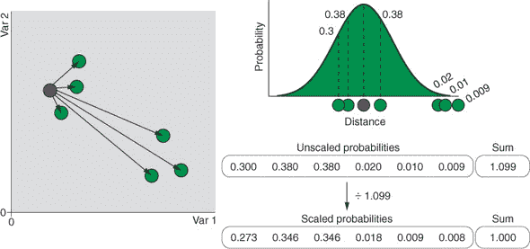

一旦计算出了数据集中每个案例的缩放概率，我们就得到了一个概率矩阵，它描述了每个案例与其他每个案例的相似程度。这在图 14.2 中以热图的形式展示，这是一种思考它的有用方式。

我们的概率矩阵现在是我们如何将数据值关联到原始、高维空间中的参考，或模板。t-SNE 算法的下一步是在（通常是）两个新轴上随机化案例（这就是“随机”这个名字的由来）。


##### 注意

不需要是两个轴，但通常是这样的。这是因为人类难以同时可视化超过两个维度中的数据，而且因为，超过三个维度，t-SNE 的计算成本会越来越高，变得难以承受。


t-SNE 计算在这个新的、随机化的低维空间中案例之间的距离，并将它们转换为概率，就像之前一样。唯一的不同是，它现在使用 Student’s t 分布，而不是正态分布。t 分布看起来有点像正态分布，但中间部分不那么高，尾部更平，延伸得更远（参见图 14.3）。这就像有人在正态分布上坐下并把它压扁了。这就是 t-SNE 中“t”的由来。我马上会解释为什么我们使用 t 分布。

##### 图 14.2\. 每个案例的缩放概率存储为一个值矩阵。这里以热图的形式展示：两个案例越接近，代表它们在热图中的距离的方框就越暗。

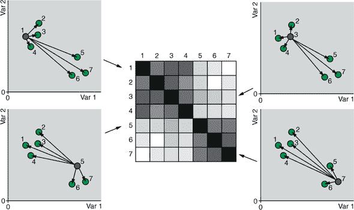

##### 图 14.3\. 在将低维表示中的距离转换为概率时，t-SNE 在当前案例上拟合 Student’s t 分布，而不是正态分布。Student’s t 分布的尾部更长，这意味着不相似的案例被推得更远，以达到与高维表示相同概率。

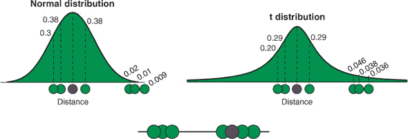

t-SNE 现在的任务是“重新排列”这些新轴上的数据点，逐步进行，使得低维空间中的概率矩阵尽可能接近原始、高维空间中的概率矩阵。这里的直觉是，如果矩阵尽可能相似，那么每个案例在原始特征空间中接近的数据点在低维空间中仍然会接近。你可以把这想成一个吸引和排斥的游戏。

为了使低维空间中的概率矩阵看起来像高维空间中的矩阵，每个案例都需要移动到在原始数据中与其靠近的案例附近，并远离远离的案例。因此，应该靠近的案例会将其邻居拉向自己，而应该远离的案例则会将非邻居推开。这些吸引力和排斥力的平衡导致数据集中的每个案例都朝着使两个概率矩阵稍微更相似的方向移动。现在，在这个新位置，再次计算低维概率矩阵，案例再次移动，使低维和高维矩阵看起来稍微更相似。这个过程会继续进行，直到达到预定的迭代次数，或者直到矩阵之间的**散度**（差异）不再改善。整个过程在图 14.4 中得到了说明。

##### 图 14.4。案例在新的轴上随机初始化（这里显示了其中一个轴）。为此轴计算概率矩阵，并通过最小化 Kullback-Leibler（KL）散度来重新排列案例，使这个矩阵类似于原始的高维矩阵。在重新排列过程中，案例会被吸引向与其相似的案例（带有圆圈的线条）并排斥不相似的案例（带有三角形的线条）。

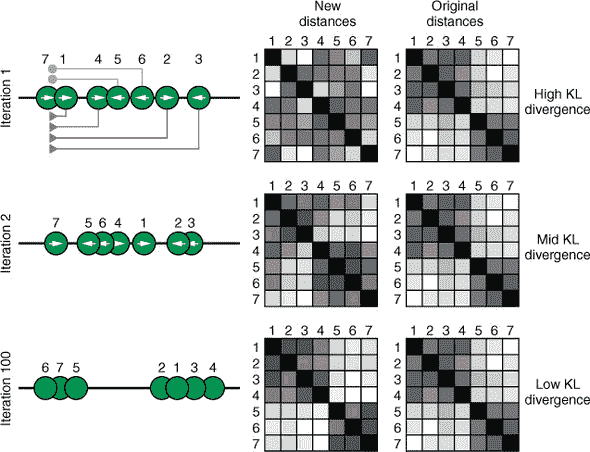

| |
| --- |

##### 注意

两个矩阵之间的差异是通过一个称为**Kullback-Leibler 散度**的统计量来衡量的，当矩阵非常不同时，这个散度很大，而当矩阵完全相同的时候，散度为零。

| |
| --- |

为什么我们要使用 t 分布将距离转换为低维空间中的概率？再次注意，从图 14.4 中可以看出，t 分布的尾部比正态分布的尾部更宽。这意味着，为了得到与正态分布相同的概率，不相似的案例需要被推得更远，远离 t 分布中心所在的案例。这有助于分散数据中可能存在的数据簇，帮助我们更容易地识别它们。然而，这一点的重大后果是，t-SNE 通常被认为在低维表示中保留了**局部**结构，但它通常不保留**全局**结构。实际上，这意味着我们可以将最终表示中彼此靠近的案例解释为彼此相似，但我们不能轻易地说原始数据中哪些案例簇比其他案例簇更相似。

一旦这个迭代过程在低 KL 散度下收敛，我们应该有一个低维度的原始数据表示，它保留了附近案例之间的相似性。虽然 t-SNE 通常在突出数据中的模式方面优于 PCA，但它确实有一些显著的局限性：

+   它在计算上非常昂贵：其计算时间随着数据集中案例数量的增加而呈指数增长。有一个多核实现（见 [`github.com/RGLab/Rtsne.multicore`](https://github.com/RGLab/Rtsne.multicore)），但对于极其大的数据集，t-SNE 可能需要数小时才能运行。

+   它不能将新数据投影到嵌入中。我的意思是，由于数据在新的轴上的初始放置是随机的，反复在相同的数据集上运行 t-SNE 将会给出略微不同的结果。因此，我们不能像使用 PCA 那样使用 `predict()` 函数将新数据映射到低维表示。这阻止了我们将 t-SNE 作为机器学习流程的一部分使用，实际上将其使用限制在数据探索和可视化中。

+   聚类之间的距离通常没有意义。比如说，在我们的最终 t-SNE 表示中，有三个数据点聚类：两个彼此靠近，第三个离其他两个较远。因为 t-SNE 专注于局部结构而不是全局结构，所以我们不能说前两个聚类比第三个聚类更相似。

+   t-SNE 并不一定保留最终表示中数据的距离或密度，因此将 t-SNE 的输出传递给依赖于距离或密度的聚类算法通常不如预期有效。

+   我们需要为许多超参数选择合理的值，如果 t-SNE 算法在数据集上运行需要数分钟到数小时，这可能会很困难。

### 14.2. 构建第一个 t-SNE 嵌入

在本节中，我将向您展示如何使用 t-SNE 算法创建瑞士银行钞票数据集的低维嵌入，以比较我们在上一章中创建的 PCA 模型。首先，我们将安装并加载 Rtsne 包到 R 中，然后我将解释控制 t-SNE 学习方式的各个超参数。然后，我们将使用最佳的超参数组合创建 t-SNE 嵌入。最后，我们将绘制 t-SNE 算法学习的新低维表示，并将其与我们之前在 第十三章 中绘制的 PCA 表示进行比较。

#### 14.2.1. 执行 t-SNE

让我们从安装和加载 Rtsne 包开始：

```
install.packages("Rtsne")

library(Rtsne)
```

t-SNE 有四个重要的超参数，这些参数可以极大地改变结果嵌入：

+   ***perplexity（困惑度）*** — 控制用于将距离转换为概率的分布的宽度。高值更多地关注全局结构，而小值更多地关注局部结构。典型值位于 5 到 50 的范围内。默认值为 30。

+   ***theta—*** 控制速度和准确度之间的权衡。因为 t-SNE 很慢，人们通常使用一个称为*Barnes-Hut* t-SNE 的实现，这允许我们更快地执行嵌入，但会损失一些准确性。*theta*超参数控制这种权衡，0 表示“精确”的 t-SNE，1 表示最快但最不准确的 t-SNE。默认值是 0.5。

+   ***eta—*** 每次迭代中每个数据点移动的距离（也称为*学习率*）。较低的值需要更多的迭代次数以达到收敛，但可能会导致更准确的嵌入。默认值是 200，这通常是可以接受的。

+   ***max_iter—*** 允许在计算停止之前的最大迭代次数。这取决于你的计算预算，但确保有足够的迭代次数以达到收敛是很重要的。默认值是 1,000。


##### 小贴士

通常需要调整的最重要超参数是*perplexity*和*max_iter*。


到目前为止，我们调整超参数的方法是允许自动调整过程为我们选择最佳组合，通过网格搜索或随机搜索。但由于其计算成本，大多数人会使用 t-SNE 的默认超参数值，并在嵌入看起来不合理时更改它们。如果这听起来非常主观，那是因为它是；但人们通常能够通过视觉识别 t-SNE 是否很好地将观察到的簇分开。

为了提供一个视觉辅助，说明每个超参数如何影响最终的嵌入，我已经使用一组超参数值在我们的瑞士银行票据数据上运行了 t-SNE。图 14.5 显示了使用默认的*eta*和*max_iter*值的*theta*（行）和*perplexity*（列）的不同组合的最终嵌入。注意，随着*perplexity*值的增大，簇变得更加紧密，而在非常低的值时簇会丢失。此外，注意对于合理的*perplexity*值，当*theta*设置为 0（精确的 t-SNE）时，簇的分辨率最佳。

##### 图 14.5\. 使用默认的*eta*和*max_iter*值，改变*theta*（行面元）和*perplexity*（列面元）对银行票据数据集最终 t-SNE 嵌入的影响

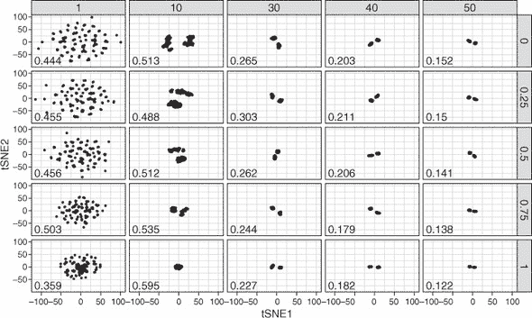

##### 图 14.6\. 使用默认的*theta*和*perplexity*值，改变*max_iter*（行面元）和*eta*（列面元）对银行票据数据集最终 t-SNE 嵌入的影响

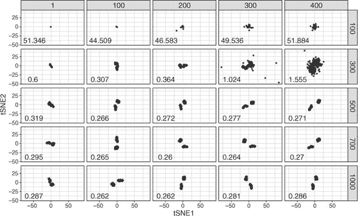

图 14.6 展示了不同组合的 *max_iter*（行）和 *eta*（列）的最终嵌入。这里的效果稍微微妙一些，但较小的 *eta* 值需要更多的迭代次数才能收敛（因为每个迭代中案例移动的步长更小）。例如，对于 *eta* 为 100 的情况，1,000 次迭代就足以分离簇；但使用 *eta* 为 1 的情况下，簇在 1,000 次迭代后仍然分辨率不佳。如果你想看到我用来生成这些图代码，本章的代码可在 [www.manning.com/books/machine-learning-with-r-tidyverse-and-mlr](http://www.manning.com/books/machine-learning-with-r-tidyverse-and-mlr) 获取。

现在你已经对 t-SNE 的超参数如何影响其性能有了更多的了解，让我们在我们的瑞士纸币数据集上运行 t-SNE。就像 PCA 一样，我们首先选择除了分类变量之外的所有列（t-SNE 也不能处理分类变量），并将这些数据通过 `Rtsne()` 函数传递。我们手动设置 *perplexity*、*theta* 和 *max_iter* 超参数的值（说实话，我很少改变 *eta*），并将 `verbose = TRUE` 参数设置为真，以便算法在每次迭代时打印出 KL 散度的运行注释。

##### 列表 14.1\. 运行 t-SNE

```
swissTsne <- select(swissTib, -Status) %>%
  Rtsne(perplexity = 30, theta = 0, max_iter = 5000, verbose = TRUE)
```

| |
| --- |

##### 小贴士

默认情况下，`Rtsne()` 函数将数据集减少到二维。如果你想返回另一个数字，你可以使用 `dims` 参数来设置这个值。

| |
| --- |

这没有花太多时间，对吧？对于如此小的数据集，t-SNE 只需要几秒钟。但随着数据集大小的增加，它会迅速变慢（看我在这里做了什么？）。

#### 14.2.2\. 绘制 t-SNE 的结果

接下来，让我们将两个 t-SNE 维度相互绘制，以查看它们如何将真钞和假钞分开。因为我们不能根据每个变量与它们的关联程度来解释轴，所以人们通常根据它们原始变量的值来着色 t-SNE 图，以帮助识别哪些簇具有更高的和更低的值。为此，我们首先使用 `mutate_if()` 函数将原始数据集中的数值变量居中（通过设置 `.funs = scale` 和 `.predicate = is.numeric`）。我们包括 `scale = FALSE` 以仅居中变量，而不是除以其标准差。我们居中变量的原因是我们将根据它们的值在图上着色，我们不希望具有较大值的变量主导颜色刻度（省略此行，并亲自查看最终图中的差异）。

接下来，我们突变两个包含每个案例 t-SNE 轴值的新的列。最后，我们收集数据，以便我们可以根据原始变量进行分面。我们绘制这些数据，将每个原始变量的值映射到颜色美学，并将每张纸币的状态（真币与假币）映射到形状美学，并根据原始变量进行分面。我们添加一个自定义颜色渐变，使颜色刻度在打印时更易读。

##### 列表 14.2\. 绘制 t-SNE 嵌入图

```
swissTibTsne <- swissTib %>%
  mutate_if(.funs = scale, .predicate = is.numeric, scale = FALSE) %>%
  mutate(tSNE1 = swissTsne$Y[, 1], tSNE2 = swissTsne$Y[, 2]) %>%
  gather(key = "Variable", value = "Value", c(-tSNE1, -tSNE2, -Status))

ggplot(swissTibTsne, aes(tSNE1, tSNE2, col = Value, shape = Status)) +
  facet_wrap(~ Variable) +
  geom_point(size = 3) +
  scale_color_gradient(low = "dark blue", high = "cyan") +
  theme_bw()
```

##### 图 14.7\. tSNE1 和 tSNE2 轴相互绘制，根据原始变量分面和着色，以及根据每个案例是真实纸币还是假币进行形状绘制

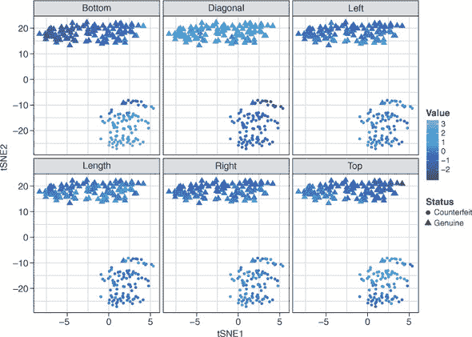

结果图表显示在图 14.7。哇！注意 t-SNE 在仅用两个维度表示特征空间中两个簇之间的差异时比 PCA 做得好得多。簇被很好地解析，尽管如果你仔细看，你可以看到一些似乎在错误簇中的案例。通过每个变量的值着色点也有助于我们识别假币往往具有较低的`对角线`变量值和较高的`底部`和`顶部`变量值。似乎还可能有一个小的假币第二簇：这可能是由不同的伪造者制作的纸币集，或者是不完美的超参数组合的产物。需要更多的调查来确定这些是否实际上是不同的簇。

| |
| --- |

##### 注意

你的图表看起来和我的一样吗？当然不一样了！记住，初始嵌入是随机的（随机性的），所以每次你在相同的数据和相同的超参数上运行 t-SNE 时，你都会得到一个略微不同的嵌入。

| |
| --- |
| |

**练习 1**

重新绘制图 14.7 中的图表，但这次在运行 t-SNE 之前不要对变量进行中心化（只需移除`mutate_if()`层）。你能看出为什么缩放是必要的吗？

| |
| --- |

### 14.3\. 什么是 UMAP？

在本节中，我将向您展示 UMAP 是什么，它是如何工作的，以及为什么它有用。均匀流形近似和投影，幸运的是简称为 UMAP，是一种类似于 t-SNE 的非线性降维算法。UMAP 是前沿技术，仅在 2018 年发表，并且它相对于 t-SNE 算法有一些优势。

首先，它比 t-SNE 快得多，t-SNE 的运行时间长度增加小于数据集中案例数量的平方。为了更具体地说明这一点，一个可能需要 t-SNE 数小时来压缩的数据集将只需要 UMAP 几分钟。

第二个优势（在我看来是主要优势）是 UMAP 是一个确定性算法。换句话说，给定相同的输入，它总是会给出相同的输出。这意味着，与 t-SNE 不同，我们可以将新数据投影到低维表示中，使我们能够将 UMAP 纳入我们的机器学习流程中。

第三个好处是 UMAP 保留了局部**和**全局结构。实际上，这意味着我们不仅可以将低维空间中彼此靠近的两个案例解释为在高层空间中彼此相似，而且我们还可以将彼此靠近的两个**簇**解释为在高层空间中更相似。

那么，UMAP 是如何工作的呢？嗯，UMAP 假设数据分布在一条**流形**上。流形是一个**n**维光滑几何形状，其中，对于流形上的每个点，都存在一个围绕该点的小邻域，该邻域看起来像是一个平坦的二维平面。如果你觉得这很难理解，可以考虑世界是一个三维流形，其任何部分都可以映射到一个平面的表示，即地图。UMAP 在数据分布的表面或具有许多维度的空间中搜索。然后可以计算案例在流形上的距离，并通过迭代优化数据的低维表示来重现这些距离。

倾向于视觉表示？我也是。看看图 14.8。我在两个变量上围绕流形随机放置了 15 个案例，并将问号作为流形绘制出来。UMAP 的工作是学习问号流形，以便它可以测量案例在流形上的距离，而不是像 t-SNE 那样测量普通欧几里得距离。它通过在每个案例周围搜索另一个案例来实现这一点。在这些区域包含另一个案例的地方，案例通过边连接起来。这就是我在图 14.8 的上排中所做的——但你能否看出流形是不完整的？我的问号中存在间隙。这是因为我在每个案例周围搜索的区域具有相同的半径，数据在流形上分布不均匀。如果案例在问号上以均匀间隔排列，那么这种方法将有效，前提是我选择了适当的搜索区域半径。

##### 图 14.8\. UMAP 如何学习一个流形。UMAP 在每个案例周围扩展一个搜索区域。这种形式的直观表示在上排中，其中每个搜索区域的半径相同。当具有重叠搜索区域的案例通过边连接时，流形中会有间隙。在下排中，搜索区域扩展到最近的邻居，然后以一种模糊的方式向外扩展，其半径与该区域数据的密度成反比。这导致了一个完整的流形。

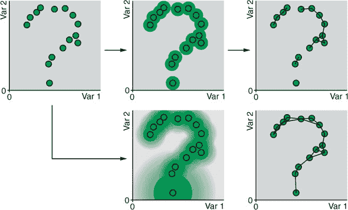

现实世界的数据很少均匀分布，UMAP 以两种方式解决这个问题。首先，它为每个案例扩展每个搜索区域，直到它遇到其最近邻。这确保了没有孤儿案例：虽然数据集中可以有多个不相连的流形，但每个案例必须至少连接到另一个案例。其次，UMAP 在低密度区域创建一个具有更大半径的额外搜索区域，在高密度区域创建一个具有更小半径的搜索区域。这些搜索区域被描述为*模糊的*，因为另一个案例离中心越远，这些案例之间存在边的概率就越低。这强制对案例进行人工均匀分布（这也是 UMAP 中“均匀”一词的来源）。这个过程在图 14.8 的下方行中表示；请注意，我们现在得到了对潜在流形的更完整估计。

下一步是将数据放置在（通常是）两个新维度的新流形上。然后算法迭代地围绕这个新流形进行随机排列，直到流形上案例之间的距离看起来像原始高维流形上案例之间的距离。这与 t-SNE 的优化步骤类似，但 UMAP 最小化的是称为*交叉熵*的不同损失函数（而 t-SNE 最小化 KL 散度）。


##### 注意

就像 t-SNE 一样，如果我们想的话，我们可以创建超过两个新维度。


一旦 UMAP 学会了低维流形，新的数据就可以投影到这个流形上，以获得新轴上的值，用于可视化或作为其他机器学习算法的输入。


##### 注意

UMAP 还可以用于执行*监督降维*，这实际上只是意味着给定高维、标记的数据，它学习一个流形，可以用来将案例分类到组中。


### 14.4. 构建您的第一个 UMAP 模型

在本节中，我将向您展示如何使用 UMAP 算法创建瑞士银行钞票数据集的低维嵌入。请记住，我们正在尝试找到这个数据集的低维表示，以帮助我们识别模式，例如不同类型的钞票。我们将首先在 R 中安装和加载 umap 包。就像我们对 t-SNE 所做的那样，我们将讨论 UMAP 的超参数以及它们如何影响嵌入。然后我们将在银行钞票数据集上训练一个 UMAP 模型，并绘制它以比较它与我们的 PCA 模型和 t-SNE 嵌入。 

#### 14.4.1. 执行 UMAP

在本节中，我们将安装并加载 umap 包，然后调整和训练我们的 UMAP 模型。让我们首先安装并加载 umap 包：

```
install.packages("umap")

library(umap)
```

就像 t-SNE 一样，UMAP 有四个重要的超参数，它们控制着结果的嵌入：

+   ***n_neighbors—*** 控制模糊搜索区域的半径。较大的值将包括更多的邻近案例，迫使算法关注更全局的结构。较小的值将包括较少的邻居，迫使算法关注更局部结构。

+   ***min_dist—*** 定义了案例在低维表示中允许的最小距离。低值会导致“密集”的嵌入，而高值会导致案例分布得更远。

+   ***metric—*** 定义了 UMAP 将使用哪种距离度量来测量流形上的距离。默认情况下，UMAP 使用普通欧几里得距离，但也可以使用其他（有时很疯狂）的距离度量。欧几里得距离的常见替代方案是*曼哈顿距离*（也称为*出租车距离*）：它不是将两点之间的距离作为一个单一的（可能是对角线）距离来测量，而是逐个变量地测量两点之间的距离，并将这些小旅程相加，就像出租车在城市街区中行驶一样。我们还可以使用除了欧几里得距离以外的距离度量来应用 t-SNE，但我们首先需要手动计算这些距离。UMAP 实现只是让我们指定我们想要的距离，然后它会处理其余的事情。

+   ***n_epochs—*** 定义了优化步骤的迭代次数。

再次强调，为了给您提供一个视觉辅助，展示每个超参数如何影响最终的嵌入，我已经使用一组超参数值在我们的瑞士纸币数据上运行了 UMAP。图 14.9 显示了使用默认的*metric*和*n_epochs*值，不同组合的*n_neighbors*（行）和*min_dist*（列）的最终嵌入。请注意，*n_neighbors*和*min_dist*的值较小时，案例分布得更开，并且当*n_neighbors*超参数的值较低时，聚类开始分解。

##### 图 14.9\. 通过改变*n_neighbors*（行面元）和*min_dist*（列面元）的默认值，对纸币数据集的最终 UMAP 嵌入的影响，其中*n_neighbors*表示邻居数量，*min_dist*表示最小距离。

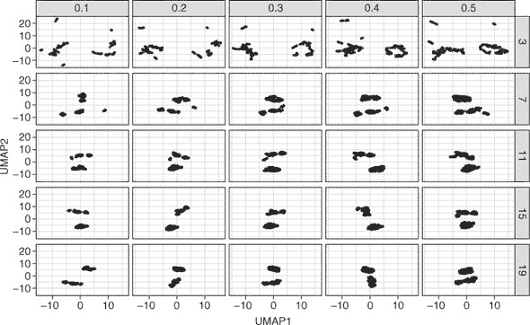

##### 图 14.10\. 通过改变*metric*（行面元）和*n_epochs*（列面元）的默认值，对瑞士纸币数据集的最终 UMAP 嵌入的影响，其中*metric*表示度量，*n_epochs*表示迭代次数。

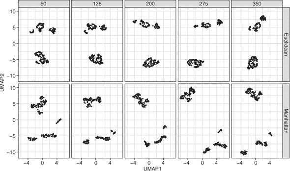

图 14.10 显示了具有不同组合的*度量*（行）和*n_epochs*（列）的最终嵌入。这里的效果稍微微妙一些，但集群在更多迭代中往往更远。看起来曼哈顿距离在打破那些三个较小的集群（我们之前没有见过！）方面做得稍微好一些！如果你想看到我用来生成这些图形的代码，本章的代码可在[www.manning.com/books/machine-learning-with-r-the-tidyverse-and-mlr](http://www.manning.com/books/machine-learning-with-r-the-tidyverse-and-mlr)找到。

我希望这能稍微揭开 UMAP 超参数的神秘面纱。现在让我们在我们的瑞士钞票数据集上运行 UMAP。就像之前一样，我们首先选择所有除了分类变量（目前 UMAP 无法处理分类变量，但将来可能会改变）之外的所有列，并将这些数据通过`as.matrix()`函数（只是为了防止一个令人烦恼的警告信息）。然后，这个矩阵被传递到`umap()`函数中，我们在其中手动设置所有四个超参数的值，并将`verbose = TRUE`参数设置为，以便算法打印出经过的每个 epoch（迭代）的运行注释。

##### 列表 14.3. 执行 UMAP

```
swissUmap <- select(swissTib, -Status) %>%
             as.matrix() %>%
             umap(n_neighbors = 7, min_dist = 0.1,
                  metric = "manhattan", n_epochs = 200, verbose = TRUE)
```

#### 14.4.2. 绘制 UMAP 的结果

接下来，让我们将两个 UMAP 维度相互对比，看看它们如何将真钞和假钞分开。我们通过与列表 14.2 中相同的步骤来重塑数据，使其准备好绘图。

##### 列表 14.4. 绘制 UMAP 嵌入

```
swissTibUmap <- swissTib %>%
  mutate_if(.funs = scale, .predicate = is.numeric, scale = FALSE) %>%
  mutate(UMAP1 = swissUmap$layout[, 1], UMAP2 = swissUmap$layout[, 2]) %>%
  gather(key = "Variable", value = "Value", c(-UMAP1, -UMAP2, -Status))

ggplot(swissTibUmap, aes(UMAP1, UMAP2, col = Value, shape = Status)) +
  facet_wrap(~ Variable) +
  geom_point(size = 3) +
  scale_color_gradient(low = "dark blue", high = "cyan") +
  theme_bw()
```

结果图显示在图 14.11 中。UMAP 嵌入似乎暗示存在三个不同的假钞集群！也许有三个不同的造假者活跃着。

##### 图 14.11. UMAP1 和 UMAP2 轴相互对比，通过原始变量进行分面和着色，并通过每个案例是真钞还是假钞进行形状塑造

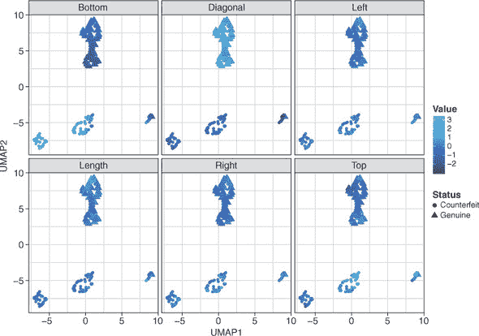

#### 14.4.3. 计算新数据的 UMAP 嵌入

记得我之前说过，与 t-SNE 不同，新数据可以被可重复地投影到 UMAP 嵌入中吗？好吧，让我们为在第十三章中预测 PCA 成分得分时定义的`newBanknotes` tibble 做这件事（如果你不再有这个定义，请重新运行列表 13.7）。实际上，这个过程完全相同：我们使用`predict()`函数，将模型作为第一个参数，新数据作为第二个参数。这将输出一个矩阵，其中行代表两个案例，列代表 UMAP 轴：

```
predict(swissUmap, newBanknotes)

     [,1]   [,2]
1 -6.9516 -7.777
2  0.1213  6.160
```

### 14.5. t-SNE 和 UMAP 的优势和劣势

虽然通常不容易判断哪些算法会对给定的任务表现良好，但以下是一些优势和劣势，这将帮助你决定 t-SNE 和 UMAP 是否适合你。

t-SNE 和 UMAP 的优势如下：

+   它们可以在数据中学习非线性模式。

+   它们比 PCA 更好地分离案例的簇。

+   UMAP 可以对新数据进行预测。

+   UMAP 计算成本较低。

+   UMAP 保留局部和全局距离。

t-SNE 和 UMAP 的弱点如下：

+   t-SNE 和 UMAP 的新轴不能直接从原始变量中解释。

+   t-SNE 不能对新数据进行预测（每次结果都不同）。

+   t-SNE 计算成本较高。

+   t-SNE 不一定保留全局结构。

+   它们无法原生处理分类变量。

| |
| --- |

**练习 2**

在我们的瑞士钞票数据集上重新运行 UMAP，但这次包括参数`n_components = 3`（请随意通过更改其他超参数的值进行实验）。将 UMAP 对象的`$layout`组件传递给`GGally::ggpairs()`函数。（提示：您需要将此对象包裹在`as.data.frame()`中，否则`ggpairs()`会发怒。）

| |
| --- |

### 摘要

+   t-SNE 和 UMAP 是非线性降维算法。

+   t-SNE 将数据中所有案例之间的距离转换为基于正态分布的概率，然后迭代地在低维空间中重新排列案例以再现这些距离。

+   在低维空间中，t-SNE 使用 Student 的 t 分布将距离转换为概率，以更好地分离数据簇。

+   UMAP 学习数据排列的流形，然后在低维空间中迭代地重新排列数据以再现沿流形的案例之间的距离。

### 练习解答

1.  不对变量进行缩放，重新创建 t-SNE1 与 t-SNE2 的绘图：

    ```
    swissTib %>%
      mutate(tSNE1 = swissTsne$Y[, 1], tSNE2 = swissTsne$Y[, 2]) %>%
      gather(key = "Variable",
             value = "Value",
             c(-tSNE1, -tSNE2, -Status)) %>%
      ggplot(aes(tSNE1, tSNE2, col = Value, shape = Status)) +
      facet_wrap(~ Variable) +
      geom_point(size = 3) +
      scale_color_gradient(low = "dark blue", high = "cyan") +
      theme_bw()

    # Scaling is necessary because the scales of the variables are different
    # from each other.
    ```

1.  重新运行 UMAP，但输出和绘制三个新轴而不是两个：

    ```
    umap3d <- select(swissTib, -Status) %>%
      as.matrix() %>%
      umap(n_neighbors = 7, min_dist = 0.1, n_components = 3,
           metric = "manhattan", n_epochs = 200, verbose = TRUE)

    library(GGally)

    ggpairs(as.data.frame(umap3d$layout), mapping = aes(col = swissTib$Status))
    ```

## 第十五章\. 自组织映射和局部线性嵌入

*本章涵盖*

+   创建自组织映射以降低维度

+   创建高维数据的局部线性嵌入

在本章中，我们将继续讨论降维：一类机器学习任务，专注于以更少的变量表示大量变量中包含的信息。正如你在第十三章和第十四章中学到的，有多种方法可以降低数据集的维度。哪种降维算法最适合你取决于你的数据结构和你要实现的目标。因此，在本章中，我将向你的不断增长的机器学习工具箱中添加两个额外的非线性降维算法：自组织映射（SOMs）和局部线性嵌入（LLE）。

### 15.1\. 前提：节点网格和流形

SOM 算法和 LLE 算法都将大量数据集缩减为更小、更易于管理的变量数量，但它们的工作方式非常不同。SOM 算法创建了一个二维的节点网格，就像地图上的网格参考。数据中的每个案例都被放置在一个节点中，然后在这些节点周围进行随机排列，使得在原始数据中彼此更相似的案例在地图上被放置得更近。

这可能很难在脑海中想象，所以让我们来看一个类比。想象一下，你有一个装满珠子的罐子，里面有你缝纫工具的珠子。珠子大小和重量不同，有些比其他的长。外面在下雨，没有更好的事情可做，所以你决定将珠子组织成几组，以便将来更容易找到所需的珠子。你在桌子上排列了一个碗的网格，并依次考虑每个珠子。然后，你将彼此最相似的珠子放在同一个碗里。相似的但不同的珠子放在相邻的碗里，而非常不同的珠子则放在彼此远离的碗里。一个可能的样子示例显示在图 15.1 中。

##### 图 15.1\. 基于珠子的特征将珠子放入碗中。相似的珠子被放在同一个或附近的碗中，而不相似的珠子被放在彼此远离的碗中。有一个碗没有放入任何珠子，但这没关系。

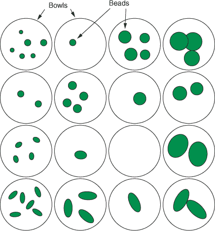

一旦你将所有珠子都放入碗中，你看看你的网格，会发现出现了一种模式。所有的大球形珠子都聚集在网格的右上角。当你从右向左移动时，珠子变小；当你从上向下移动时，珠子变得更长。你根据珠子之间的相似性将珠子放入碗中的过程揭示了珠子的结构。

这就是自组织图试图做的事情。自组织图的“地图”相当于碗的网格，其中每个碗被称为*节点*。

另一方面，LLE 算法学习数据所在的手性，类似于你在第十四章中看到 UMAP 算法。回想一下，手性是一个*n*-维光滑的几何形状，可以通过一系列线性“补丁”构建。UMAP 试图一次性学习手性，而 LLE 则寻找每个案例周围的局部线性补丁，然后将这些线性补丁组合起来形成（可能是非线性的）手性。

如果这很难想象，请看图 15.2。球是一个光滑的三维流形。我们可以通过将其分解成一系列组合在一起的平面来近似球体（我们使用的这些表面越多，我们就能越接近地近似球体）。这显示在图 15.2 的左侧。想象一下，有人给你一张平面的纸张和一把剪刀，并要求你制作一个球体。你可能会将纸张切割成图 15.2 右侧所示的那种形状。然后你可以折叠这张平面的纸张来近似球体。你能看出这个平面的二维切割是球体的低维表示吗？这是 LLE 背后的基本原理，只不过它试图学习表示数据的流形，并以更少的维度表示它。

##### 图 15.2. 球是一个三维流形。我们可以通过一系列相互连接的线性补丁来重建球体。这个球体的三维流形可以通过以某种方式切割纸张来在二维中表示。

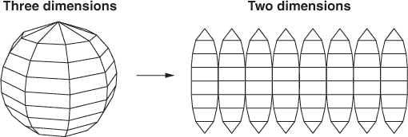

在本章中，我将更详细地展示 SOM 和 LLE 算法的工作原理以及我们如何使用它们来降低各种跳甲虫收集的数据的维度。我还会展示一个特别有趣的例子，说明 LLE 如何“展开”一些复杂和形状异常的数据。

### 15.2. 什么是自组织映射？

在本节中，我将解释 SOM 是什么，它们是如何工作的，以及为什么它们对降维很有用。考虑地图的目的。地图方便地将地球的一部分（不是平面的）以二维的形式表示出来，使得在地图上彼此靠近的地球区域实际上是彼此靠近的。这是以一种复杂的方式来说明，你会发现印度比马达加斯加更靠近斯里兰卡，因为它们在空间上彼此更近。

SOM 的目标非常相似；但与国家、城镇和城市不同，SOM 试图在二维中表示数据集，使得彼此更相似的数据案例在地图上彼此靠近。算法的第一步是在二维晶格中创建一个节点网格（就像图 15.1 中的碗的网格一样）。

#### 15.2.1. 创建节点网格

在本节中，我将全面解释当我提到 SOM 算法创建节点网格时我的意思。这与我们在图 15.1 中排序珠子的碗的网格非常相似，SOM 算法首先创建一个节点网格。目前，你可以将节点想象成一个碗，我们将最终将数据集中的案例放入其中。我使用“网格”这个词来帮助你想象节点的晶格结构，但“地图”这个词更常用，所以从现在起我们将使用这个词。

地图可以由正方形/矩形节点组成，就像地图上的正方形网格参考一样；或者由六边形节点组成，它们紧密地像蜂巢一样排列。当地图由正方形节点组成时，每个节点与其四个邻居相连（可以说它们是它的北、南、东和西邻居）。当地图由六边形节点组成时，每个节点与其六个邻居相连（东北、东、东南、西南、西和西北）。图 15.3 展示了正方形和六边形 SOMs 的两种常见表示方式。左侧表示将每个节点表示为一个圆圈，通过线条或**边**与邻居相连。右侧表示将每个节点表示为一个正方形或六边形，通过其平坦的侧面与邻居相连。地图的尺寸（有多少行和列）需要我们决定；我将在本章后面向你展示如何选择合适的地图大小。记住，我们仍然将这些节点视为碗。

##### 图 15.3\. 常见的正方形和六边形自组织地图的图形表示。上面两张地图显示了一个由矩形节点组成的网格，每个节点都与四个邻居相连。下面两张地图显示了一个由六边形节点组成的网格，每个节点都与六个邻居相连。

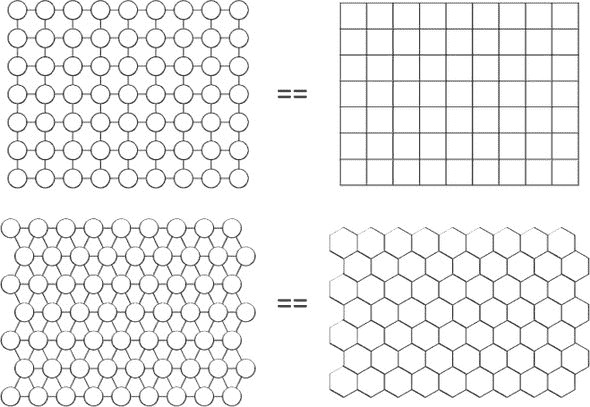

| |
| --- |

##### 注意

自组织地图（SOMs）是由一位名叫 Teuvo Kohonen 的芬兰计算机科学家创建的，因此有时你会看到它们被称为**Kohonen 地图**。SOM 算法如此受欢迎，以至于 Kohonen 教授是有史以来被引用次数最多的芬兰计算机科学家。

| |
| --- |

一旦创建了地图，下一步就是随机为每个节点分配一组**权重**。

#### 15.2.2\. 随机分配权重，并将案例放置在节点中

在本节中，我将解释“权重”这个术语的含义以及它们的相关性。我会向你展示这些权重是如何为地图中的每个节点随机初始化的。

假设我们有一个包含三个变量的数据集，我们希望将这个数据集的案例分布到地图的节点上。最终，我们希望算法将案例放置在节点上，使得相似的案例位于同一个节点或附近的节点，而不同的案例则放置在彼此远离的节点上。

在创建地图之后，算法接下来要做的事情是随机为每个节点分配一组权重：数据集中每个变量的一个权重。所以，在我们的例子中，每个节点有三个权重，因为我们有三个变量。这些权重只是随机数，你可以把它们看作是对每个变量值的猜测。如果这很难想象，请看图 15.4。我们有一个包含三个变量的数据集，我们正在查看地图上的三个节点。每个节点下面都写着三个数字：一个对应于数据集中的每个变量。例如，节点 1 的权重是 3（变量 1）、9（变量 2）和 1（变量 3）。记住，在这个阶段，这些只是对每个变量值的随机猜测。

接下来，算法从数据集中随机选择一个案例，并计算每个变量的值与该案例的值最接近的节点权重。例如，如果数据集中有一个案例，其变量 1、变量 2 和变量 3 的值分别为 3、9 和 1，那么这个案例将完美匹配节点 1 的权重。为了找到与所讨论案例最相似的节点权重，算法计算每个案例与地图中每个节点权重的距离。这个距离通常是平方欧几里得距离。记住，欧几里得距离只是两点之间的直线距离，所以平方欧几里得距离只是省略了开方步骤，以加快计算速度。

在图 15.4 中，你可以看到计算出的第一个案例与每个节点权重之间的距离。这个案例与节点 1 的权重最相似，因为它与它们的平方欧几里得距离最小（93.09）。


##### 注意

图 15.4 中的插图只显示了三个节点，为了简洁起见，但地图上的每个节点都会计算距离。


一旦计算出特定案例与所有节点的距离，就选择距离最小的节点（与案例最相似）作为该案例的*最佳匹配单元*（BMU）。这如图 15.5 所示。就像我们往碗里放珠子一样，算法将那个案例放在它的 BMU 里。

##### 图 15.4。计算每个案例与每个节点之间距离的方法。从每个变量指向每个节点的箭头代表该变量在该特定节点上的权重（例如，节点 1 的权重是 3、9 和 1）。距离是通过找到节点权重与案例每个变量的值的差异，平方这些差异，并将它们相加来计算的。

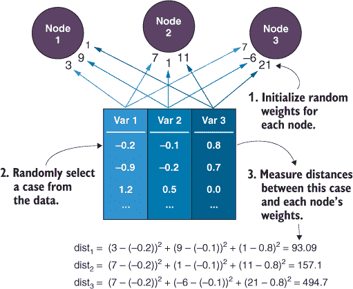

##### 图 15.5。在算法的每个阶段，选择与特定案例距离最小的节点作为该案例的最佳匹配单元（BMU）。

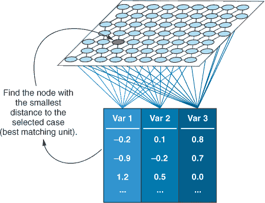

#### 15.2.3。更新节点权重以更好地匹配其内部的案例

在本节中，我将向您展示如何更新案例的 BMU 及其周围节点的权重，以更接近数据。首先，让我们总结一下到目前为止我们对 SOM 算法的了解：

1.  创建节点图。

1.  随机为每个节点分配权重（每个变量一个）。

1.  随机选择一个案例，并计算其与地图中每个节点权重的距离。

1.  将案例放入权重与案例距离最小的节点（案例的 BMU）中。

现在 BMU 已经被选中，其权重被更新，以使其与我们放入其中的案例更相似。然而，不仅仅是 BMU 的权重被更新。BMU 的**邻域**中的节点也更新了它们的权重（靠近 BMU 的节点）。我们可以以几种不同的方式定义邻域：一种常见的方式是使用**气泡函数**。使用气泡函数，我们只需在 BMU 周围定义一个半径（或气泡），半径内的所有节点都会以相同的程度更新权重。半径外的节点则完全不更新。对于气泡函数，半径为 3 将包括 BMU 三个直接连接内的任何节点。

另一个流行的选择是根据节点与 BMU 的距离来更新地图中节点的权重（距离 BMU 越远，节点的权重更新越少）。这通常使用**高斯**函数来完成。你可以想象，我们为 BMU 拟合一个中心的高斯分布，BMU 周围的节点权重将按照高斯密度成比例更新。我们仍然定义一个围绕 BMU 的半径，以定义高斯分布的宽度或瘦度，但这次它是一个没有硬截止的软半径。高斯函数很受欢迎，但它的计算成本比简单的气泡函数要高一些。


##### 注意

用于更新 BMU 周围节点权重的气泡函数和高斯函数被称为**邻域函数**。


我们选择的邻域函数是一个超参数，因为它会影响地图更新节点的方式，但不能从数据本身估计出来。


##### 注意

你有时会看到节点的权重集被称为其**代码向量**。


无论我们使用哪种邻域函数，在 BMU 周围更新节点权重的优点是，随着时间的推移，这样做会创建出彼此相似但仍然捕捉到数据中一些变化的节点邻域。算法使用的另一个技巧是，随着时间的推移，这个邻域的半径以及更新权重的量都会变小。这意味着地图最初更新得非常快，然后在学习过程中继续进行越来越小的更新。这有助于地图收敛到一个解决方案，希望将相似的案例放置在相同或附近的节点中。这个过程在图 15.6 中说明了在 BMU 邻域更新节点权重。

##### 图 15.6. 在算法的第一次迭代和最后一次迭代之间，BMU 周围邻域的半径（最暗的节点）以及更新相邻节点权重的量都变小了。高斯邻域函数的半径以半透明的圆圈形式显示在 BMU 上方，每个相邻节点更新的量通过其阴影的深浅来表示。如果显示气泡邻域函数，所有节点都会被同样着色（因为它们以相同的量更新）。

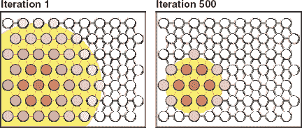

现在我们已经确定了一个特定案例的 BMU 并更新了其权重及其邻居的权重，我们只需重复该过程进行下一次迭代，从数据中随机选择另一个案例。随着这个过程继续，案例可能会被多次选择，并且随着其 BMU 随时间变化，它们将在图上移动。换句话说，如果它们当前所在的节点不再是它们的 BMU，案例将改变节点。最终，相似的案例将收敛到图上的特定区域。

结果是，随着时间的推移，地图上的节点开始更好地拟合数据集。最终，在原始特征空间中相似的案例将被放置在同一个节点或地图上附近的节点。

| |
| --- |

##### 注意

记住，*特征空间*指的是预测变量值的所有可能组合。

| |
| --- |

在我们动手构建自己的 SOM 之前，让我们回顾一下整个算法，以确保它留在你的脑海中：

1.  创建节点图。

1.  随机为每个节点分配权重（每个变量一个）。

1.  随机选择一个案例，并计算其与图中每个节点权重的距离。

1.  将案例放入权重与案例距离最小的节点（案例的 BMU）。

1.  更新 BMU 及其邻域（根据邻域函数）的权重，以更接近其内部的案例。

1.  重复步骤 3-5，直到指定的迭代次数。

### 15.3. 构建你的第一个 SOM

在本节中，我将向您展示如何使用 SOM 算法将数据集的维度减少到二维地图。通过这样做，我们希望通过将相似的案例放置在相同的或附近的节点上，揭示数据中的某些结构。例如，如果数据中隐藏着分组结构，我们希望不同的组会分开到地图的不同区域。我还会向您展示算法的超参数以及它们的作用。

| |
| --- |

##### 注意

记住，超参数是一个控制算法性能/功能的变量，但不能直接从数据本身估计出来。

| |
| --- |

想象一下，你是跳蚤马戏团的头目。你决定测量所有跳蚤，看看不同的跳蚤群体在特定的马戏团任务中表现是否更好。让我们先加载 tidyverse 和 GGally 包：

```
library(tidyverse)

library(GGally)
```

#### 15.3.1\. 加载和探索跳蚤数据集

现在，让我们加载数据，这些数据是 GGally 包内置的；将其转换为 tibble（使用`as_tibble()`）；并使用我们在第十四章中发现的`ggpairs()`函数绘制它。

##### 列表 15.1\. 加载和探索跳蚤数据集

```
data(flea)

fleaTib <- as_tibble(flea)

fleaTib

# A tibble: 74 x 7
   species  tars1 tars2  head aede1 aede2 aede3
   <fct>    <int> <int> <int> <int> <int> <int>
 1 Concinna   191   131    53   150    15   104
 2 Concinna   185   134    50   147    13   105
 3 Concinna   200   137    52   144    14   102
 4 Concinna   173   127    50   144    16    97
 5 Concinna   171   118    49   153    13   106
 6 Concinna   160   118    47   140    15    99
 7 Concinna   188   134    54   151    14    98
 8 Concinna   186   129    51   143    14   110
 9 Concinna   174   131    52   144    14   116
10 Concinna   163   115    47   142    15    95
# ... with 64 more rows

ggpairs(flea, mapping = aes(col = species)) +
  theme_bw()
```

我们有一个包含 7 个变量的 tibble 数据集，这些变量是在 74 只跳蚤的不同部位测量的。`species`变量是一个因子，告诉我们每只跳蚤属于哪个物种，而其他变量是对跳蚤身体各个部位的连续测量。在降维过程中，我们将省略`species`变量，但稍后我们会使用它来查看 SOM 是否将同一物种的跳蚤聚在一起。

结果图显示在图 15.7。我们可以看到，通过使用连续变量的不同组合，可以区分三种跳蚤的物种。让我们训练一个 SOM，将这六个连续变量减少到只有两个维度的表示，并看看它如何将三种跳蚤的物种分开。

##### 图 15.7\. 使用`ggpairs()`函数创建的矩阵图，将跳蚤数据集中的所有变量相互绘制。由于单个图相当小，我已手动使用虚拟放大镜放大了一个图（就像你可能需要用来看跳蚤的放大镜一样）。

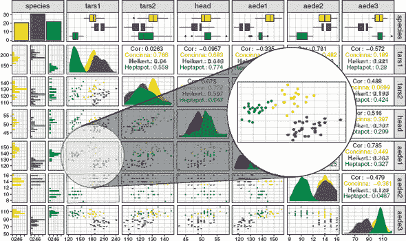

#### 15.3.2\. 训练 SOM

让我们训练我们的 SOM，将跳蚤放置在节点上，以便（希望）同一物种的跳蚤彼此靠近，而不同物种的跳蚤则分开。我们首先安装并加载 kohonen 包（当然是以 Teuvo Kohonen 的名字命名的）。接下来，我们需要做的是创建一个将成为我们地图的节点网格。我们使用`somgrid()`函数来完成此操作（如列表 15.2 所示），并且我们有几个选择：

+   地图的维度

+   我们的地图是由矩形节点还是六边形节点组成

+   使用哪种邻域函数

+   地图的边缘将如何表现

我已经使用了`somgrid()`函数的参数来做出这些选择，但让我们来探讨一下它们各自的意义以及它们如何影响生成的地图。

##### 列表 15.2\. 加载 kohonen 包并创建 SOM 网格

```
install.packages("kohonen")

library(kohonen)

somGrid <- somgrid(xdim = 5, ydim = 5, topo = "hexagonal",
                   neighbourhood.fct = "bubble", toroidal = FALSE)
```

##### 选择地图的维度

首先，我们需要使用`xdim`和`ydim`参数分别选择 x 和 y 维度的节点数量。这一点非常重要，因为它决定了地图的大小以及它将如何划分我们的案例。我们如何选择地图的维度？实际上，这并不是一个容易回答的问题。节点太少，所有数据都会堆积在一起，以至于案例的簇会相互合并。节点太多，我们可能会得到包含单个案例或根本没有案例的节点，这会稀释任何簇并阻止解释。

SOM 的最佳维度在很大程度上取决于数据中的案例数量。我们首先希望大多数节点中都有案例，但真正最佳的 SOM 节点数量是能最好揭示数据中模式的数量。我们还可以绘制每个节点的*质量*，这是衡量特定节点中每个案例与该节点最终权重之间平均差异的度量。然后我们可以考虑选择一个地图大小，以给我们提供最佳质量的节点。在这个例子中，我们将从一个 5×5 的网格开始，但选择地图维度的主观性可以说是 SOM 的一个弱点。

| |
| --- |

##### 提示

网格的 x 和 y 维度不需要长度相等。如果我发现某个网格维度在数据集中合理地揭示了模式，我可能会在某一维度上扩展地图，看看这能否进一步帮助区分案例的簇。有一种 SOM 算法的实现称为*增长 SOM*，该算法根据数据增长网格的大小。完成这一章后，我建议您查看 R 中的 GrowingSOM 包：[`github.com/alexhunziker/GrowingSOM`](https://github.com/alexhunziker/GrowingSOM)。

| |
| --- |

##### 选择地图是否具有矩形或六边形节点

下一个选择是决定我们的网格是由矩形节点还是六边形节点组成。矩形节点与四个相邻节点相连，而六边形节点与六个相邻节点相连。因此，当一个节点的权重更新时，六边形节点将最多更新其六个直接邻居，而矩形节点将最多更新其四个直接邻居。虽然六边形节点可能产生“更平滑”的地图，其中数据簇看起来更圆滑（而矩形节点的网格中的数据簇可能看起来“块状”），但这取决于你的数据。在这个例子中，我们将通过设置`topo = "hexagonal"`参数来指定我们想要一个六边形拓扑。

| |
| --- |

##### 提示

我通常更喜欢六边形节点给出的结果，无论是从它们在我数据中揭示的模式，还是从美学角度来看。

| |
| --- |

##### 选择邻域函数

接下来，我们需要选择我们将使用哪个邻域函数，将我们的选择提供给 `neighbourhood.fct` 参数（注意英国拼写）。两个选项是 `"bubble"` 和 `"gaussian"`，对应于我们之前讨论的两个邻域函数。我们选择的邻域函数是一个超参数，我们可以调整它；但在这个例子中，我们只是将使用气泡邻域函数，这是默认设置。

##### 选择映射边的行为

我们需要做的最后一个选择是是否希望我们的网格是 *toroidal*（另一个可以用来让你的朋友印象深刻的话）。如果网格是 toroidal，则地图左边的节点连接到右边的节点（以及顶部和底部边界的等效节点）。如果你从一个 toroidal 地图的左边边缘走开，你会在右边重新出现！因为边缘上的节点与其他节点的连接较少，它们的权重更新往往少于地图中间的节点。因此，使用 toroidal 地图可能有助于防止案例在地图边缘“堆积”，尽管 toroidal 地图往往更难解释。在这个例子中，我们将 toroidal 参数设置为 `FALSE`，以便使最终的地图更容易解释。

##### 使用 `som()` 函数训练 SOM

现在我们已经初始化了我们的网格，我们可以将我们的 tibble 传递给 `som()` 函数来训练我们的映射。

##### 清单 15.3\. 训练 SOM

```
fleaScaled <- fleaTib %>%
  select(-species) %>%
  scale()

fleaSom <- som(fleaScaled, grid = somGrid, rlen = 5000,
               alpha = c(0.05, 0.01))
```

我们首先通过将 tibble 管道到 `select()` 函数来移除 `species` 因子。案例被分配到具有最相似权重的节点，因此我们需要对变量进行缩放，以确保大尺度上的变量不会得到更多的重视。为此，我们将 `select()` 函数调用的输出管道到 `scale()` 函数，以对每个变量进行居中和缩放。

要构建 SOM，我们使用 kohonen 包中的 `som()` 函数，提供以下内容：

+   数据作为第一个参数

+   在 清单 15.2 中创建的网格对象作为第二个参数

+   两个超参数参数 *rlen* 和 *alpha*

*rlen* 超参数简单来说就是数据集被算法用于采样的次数（即迭代次数）；默认值为 100。就像我们在其他算法中看到的那样，更多的迭代通常更好，直到我们得到递减的回报。我很快就会向你展示如何评估你是否已经包含了足够的迭代次数。

*alpha* 超参数是学习率，它是一个包含两个值的向量。记住，随着迭代次数的增加，每个节点权重更新的量会减少。这是由 *alpha* 的两个值控制的。第 1 次迭代使用 *alpha* 的第一个值，它以线性方式递减到第 1 次迭代的第二个 *alpha* 值。

向量 `c(0.05, 0.01)` 是默认值；但对于较大的 SOM，如果你担心 SOM 在区分具有微妙差异的类别时做得不好，你可以尝试将这些值降低以使学习率变得更慢。

| |
| --- |

##### 备注

如果你将算法的学习率设置得更慢，通常需要增加迭代次数以帮助它收敛到稳定的结果。

| |
| --- |

#### 15.3.3\. 绘制 SOM 结果图

现在我们已经训练了我们的 SOM，让我们绘制一些关于它的诊断信息。kohonen 包附带用于绘制 SOM 的绘图函数，但它使用的是基础 R 图形而不是 ggplot2。绘制 SOM 对象的语法是 `plot(x, type, shape)`，其中 `x` 是我们的 SOM 对象，`type` 是我们想要绘制的图表类型，而 `shape` 允许我们指定是否要将节点绘制为圆形或带有直线边（如果网格是矩形的则为正方形，如果网格是六边形的则为六边形）。

##### 列表 15.4\. 绘制 SOM 诊断图

```
par(mfrow = c(2, 3))

plotTypes <- c("codes", "changes", "counts", "quality",
               "dist.neighbours", "mapping")

walk(plotTypes, ~plot(fleaSom, type = ., shape = "straight"))
```

| |
| --- |

##### 备注

我更喜欢绘制边缘直线的图表，但这个选择只是美学上的。尝试将 `shape` 参数设置为 `"round"` 和 `"straight"` 进行实验。

| |
| --- |

我们可以为我们的 SOM 绘制六种不同的诊断图表，但与其将 `plot()` 函数写六次，我们定义一个包含图表类型名称的向量，并使用 `walk()` 一次性绘制它们。我们首先通过运行 `par(mfrow = c(2, 3))` 将绘图设备分为六个区域。

我们可以用 `purrr::map()` 实现相同的效果，但 `purrr::walk()` 调用一个函数以产生副作用（如绘制图表）并静默返回其输入（如果你想在一系列操作中绘制中间数据集，这很有用）。这里的便利之处在于 `purrr:::walk()` 不会向控制台打印任何输出。

| |
| --- |

##### 警告

kohonen 包还包含一个名为 `map()` 的函数。如果你已经加载了 kohonen 包和 purrr 包，那么在函数调用中包含包前缀是一个好主意（`kohonen::map()` 和 `purrr::map()`）。

| |
| --- |

生成的图表显示在图 15.8 中。代码图是每个节点权重的扇形图表示。扇形的每一部分代表特定变量（如图例中所示）的权重，扇形从中心延伸的距离代表其权重的幅度。例如，我图表的左上角的节点对于 `tars2` 变量的权重最高。这个图表可以帮助我们识别与特定变量值较高或较低相关的地图区域。

##### 图 15.8\. 我们 SOM 的诊断图。每个节点的代码扇形图表示每个变量的权重。训练进度图显示了每个迭代中每个案例与其 BMU 之间的平均距离。案例数量图显示了每个节点的案例数量。质量图显示了每个案例与其 BMU 权重之间的平均距离。邻域距离图显示了同一节点中案例与相邻节点中案例之间差异的总和。映射图绘制了分配给每个节点的案例。

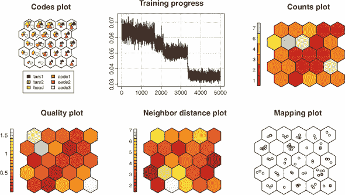


##### 注意

你的图看起来和我的一样吗？这是因为每次运行算法时节点权重都是随机初始化的。可以说，这是 SOM 算法的一个缺点，因为它可能在重复运行时对相同的数据产生不同的结果。这个缺点通过以下事实得到了缓解——与 t-SNE 不同，我们可以将新数据映射到现有的 SOM 上。


训练进度图帮助我们评估在训练 SOM 时是否包含了足够的迭代。x 轴显示了迭代次数（由*rlen*参数指定），y 轴显示了每个迭代中每个案例与其 BMU 之间的平均距离。我们希望看到这个图的轮廓在我们达到最大迭代次数之前变平，在这个例子中似乎就是这样。如果我们觉得这个图还没有平缓下来，我们会增加迭代次数。

案例数量图是一个热力图，显示了分配给每个节点的案例数量。在这个图中，我们希望确保我们没有很多空节点（表明地图太大），并且案例在地图上的分布相当均匀。如果我们有很多案例堆积在边缘，我们可能会考虑增加地图维度或训练一个环状地图。

质量图显示了每个案例与其 BMU 权重之间的平均距离。这个值越低，越好。

邻域距离图显示了同一节点中案例与相邻节点中案例之间的距离总和。有时你会看到这被称为*U 矩阵图*，它有助于在地图上识别案例的簇。由于簇边缘的案例与相邻簇的案例距离更远，因此高距离节点往往将簇分开。这通常看起来像是地图上的暗区（潜在簇）被亮区（潜在簇）分开。解释如此小的地图是困难的，但看起来我们可能在左右边缘和可能在上中心有一个簇。

最后，映射图显示了案例在节点中的分布。请注意，案例在节点内的位置没有任何意义——它们只是*避开*（移动一小段随机距离），这样它们就不会全部堆叠在一起。

代码图是可视化每个节点权重的有用方式，但当变量很多时，它变得难以阅读，并且不提供可解释的量级指示。相反，我更喜欢创建热图：每个变量一个。我们使用`getCodes()`函数提取每个节点的权重，其中每一行是一个节点，每一列是一个变量，并将其转换为 tibble。以下列表显示了如何为每个变量创建单独的热图，这次使用`iwalk()`遍历每一列。

##### 列表 15.5。为每个变量绘制热图

```
getCodes(fleaSom) %>%
  as_tibble() %>%
  iwalk(~plot(fleaSom, type = "property", property = .,
             main = .y, shape = "straight"))
```

| |
| --- |

##### 注意

回想一下第二章，每个`map()`函数都有一个`i`等价物（`imap()`、`imap_dbl()`、`iwalk()`等），它允许我们将每个元素的名称/位置传递给函数。`iwalk()`函数是`walk2(.x, .y = names(.x), .f)`的简写，允许我们通过在函数内部使用`.y`来访问每个元素的名称。

| |
| --- |

我们将`type`参数设置为`"property"`，这允许我们根据某些数值属性对每个节点进行着色。然后我们使用`property`参数告诉函数我们想要绘制哪个属性。为了将每个图的标题设置为显示的变量的名称，我们将`main`参数设置为`.y`（这就是为什么我选择使用`iwalk()`而不是`walk()`）。

最终的图表显示在图 15.9 中。热图显示了每个变量非常不同的权重模式。地图右侧的节点对于`tars1`和`aede2`变量具有更高的权重，而对于`aede3`变量（在地图右下角最低）具有较低的权重。地图左上角的节点对于`tars2`、`head`和`aede1`变量具有更高的权重。由于变量在训练 SOM 之前进行了缩放，因此热图的刻度是以每个变量的标准差单位。

由于我们对跳蚤有一些类别信息，让我们根据物种对 SOM 进行着色。

##### 列表 15.6。将跳蚤物种绘制到 SOM 上

```
par(mfrow = c(1, 2))

nodeCols <- c("cyan3", "yellow", "purple")

plot(fleaSom, type = "mapping", pch = 21,
     bg = nodeCols[as.numeric(fleaTib$species)],
     shape = "straight", bgcol = "lightgrey")
```

##### 图 15.9。分别显示每个原始变量节点权重的热图。刻度是以标准差单位。

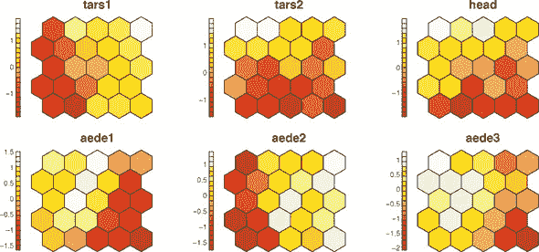

首先，我们定义一个颜色向量，用于区分不同的类别。然后，我们使用`plot()`函数创建一个映射图，并使用`type = "mapping"`参数。我们将`pch = 21`参数设置为使用实心圆来表示每个案例（因此我们可以为每个物种设置背景颜色）。`bg`参数设置点的背景颜色。通过将`species`变量转换为数值向量并使用它来子集颜色向量，每个点都将有一个与其物种对应的背景颜色。最后，我们使用`shape`参数绘制六边形而不是圆形，并将背景颜色（`bgcol`）设置为`"lightgrey"`。

结果图显示在图 15.10 中。你能看到 SOM 已经自行排列，使得来自同一物种的跳蚤（彼此之间比来自其他物种的跳蚤更相似）被分配到与同一物种案例相近的节点中吗？我在图 15.10 的右侧创建了一个图，该图使用聚类算法找到节点簇。我根据每个节点所属的簇给节点着色，并添加了分隔簇的粗边框。因为我们还没有介绍聚类，所以我不想解释我是如何做到这一点的（代码可在[www.manning.com/books/machine-learning-with-r-the-tidyverse-and-mlr](http://www.manning.com/books/machine-learning-with-r-the-tidyverse-and-mlr)找到），但我想向你展示 SOM 成功地将不同的类别分开，并且可以在 SOM 上执行聚类！我们将在下一章开始介绍聚类。 

##### 图 15.10\. 在 SOM 上显示类别成员。左侧映射图显示了绘制在其分配节点内的案例，根据它们所属的跳蚤物种进行着色。右侧图显示了相同的信息，但节点在应用聚类算法后根据簇成员进行着色。实线黑色线条分隔了分配给不同簇的节点。

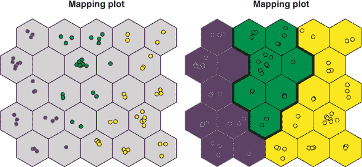

| |
| --- |

##### 注意

SOMs 与其他降维技术略有不同，因为它们并不真正创建新的变量，每个案例都赋予一个值（例如，PCA 中的主成分）。SOMs 通过将案例放置在二维地图上的节点中而不是创建新变量来降低维度。因此，如果我们想在 SOM 的结果上执行聚类分析，我们可以使用权重来聚类节点。这本质上是将每个节点视为新数据集中的一个案例。如果我们的聚类分析返回节点簇，我们可以将原始数据集中的案例分配给其节点所属的簇。

| |
| --- |
| |

**练习 1**

使用 `somgrid()` 函数创建另一个地图，但这次设置参数如下：

+   `topo = rectangular`

+   `toroidal = TRUE`

使用此地图训练一个 SOM，并创建其映射图，如图 15.10 所示。注意每个节点现在与四个邻居节点相连。你能看到 `toroidal` 参数如何影响最终地图吗？如果不能，将此参数设置为 `FALSE`，但保持其他一切不变，看看有什么区别。

| |
| --- |

#### 15.3.4\. 将新数据映射到 SOM 上

在本节中，我将向您展示如何将新数据映射到我们的训练好的 SOM 上。让我们创建两个新案例，这些案例包含我们用于训练 SOM 的数据中的所有连续变量。

##### 列表 15.7\. 在 SOM 上绘制跳蚤物种

```
newData <- tibble(tars1 = c(120, 200),
                  tars2 = c(125, 120),
                  head = c(52, 48),
                  aede1 = c(140, 128),
                  aede2 = c(12, 14),
                  aede3 = c(100, 85)) %>%
           scale(center = attr(fleaScaled, "scaled:center"),
                 scale = attr(fleaScaled, "scaled:scale"))

predicted <- predict(fleaSom, newData)

par(mfrow = c(1, 1))

plot(fleaSom, type = "mapping", classif = predicted, shape = "round")
```

一旦我们定义了 tibble，我们就将其管道输入到`scale()`函数中，因为我们是在缩放数据上训练 SOM 的。但这里有一个非常重要的部分：一个常见的错误是通过对新数据减去其自身的平均值并除以其自身的标准差来缩放新数据。这可能会导致错误的映射，因为我们需要减去训练集的平均值并除以标准差。幸运的是，这些值存储为缩放数据集的属性，我们可以使用`attr()`函数来访问它们。

| |
| --- |

##### 小贴士

如果您不确定`attr()`函数正在检索什么，请运行`attributes(fleaScaled)`以查看`fleaScaled`对象的完整属性列表。

| |
| --- |

我们使用`predict()`函数，将 SOM 对象作为第一个参数，将新的、缩放后的数据作为第二个参数，将新数据映射到我们的 SOM 上。然后，我们可以使用`plot()`函数，提供`type = "mapping"`参数，在地图上绘制新数据的位置。`classif`参数允许我们指定由`predict()`函数返回的对象，以仅绘制新数据。这次，我们使用`shape = "round"`参数来显示圆形节点的外观。

结果图显示在图 15.11。每个案例都被放置在一个单独的节点中，其权重最能代表案例的变量值。回顾图 15.9 和 15.10，看看您可以根据它们在地图上的位置对这些两个案例做出什么推断。

##### 图 15.11.新数据可以映射到现有的 SOM 上。此映射图显示了分配给两个新案例的节点图形表示。

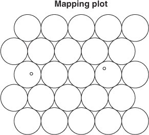

| |
| --- |

**使用 SOMs 进行监督学习**

我们专注于 SOMs，因为它们作为无监督学习器用于降维。这可能是 SOMs 最常见的使用方式，但它们也可以用于回归和分类，这使得 SOMs 在机器学习算法中非常独特。

在监督学习环境中，SOMs 实际上创建了两个映射：让我们称它们为 x 映射和 y 映射。x 映射与您迄今为止所学的相同；其节点的权重会迭代更新，以便将相似案例放置在附近的节点中，将不相似案例放置在较远的节点中，仅使用数据集中的预测变量。一旦案例被放置在 x 映射上的相应节点中，它们就不会移动。y 映射的节点权重代表结果变量的值。现在，算法再次随机选择案例，并迭代更新每个 y 映射节点的权重，以更好地匹配该节点中案例的结果变量值。这些权重可以代表连续的结果变量（在回归的情况下）或一组类别概率（在分类的情况下）。

我们可以使用 kohonen 包中的`xyf()`函数来训练一个监督 SOM。使用`?xyf()`了解更多信息。

| |
| --- |

### 15.4.什么是局部线性嵌入？

在本节中，我将解释 LLE 是什么，它是如何工作的，为什么它有用，以及它与 SOMs 的不同之处。就像 UMAP 一样，LLE 算法试图识别数据所在的基础流形。但 LLE 以略不同的方式做到这一点：它不是试图一次性学习流形，而是在每个案例周围学习局部、线性的数据片段，然后将这些线性片段组合起来形成（可能是非线性的）流形。

| |
| --- |

##### 注意

LLE 算法经常引用的格言是“全局思考，局部拟合”：算法查看每个案例周围的局部小片，并使用这些小片来构建更广泛的流形。

| |
| --- |

LLE 算法特别擅长“展开”或“展开”卷曲或扭曲成不寻常形状的数据。例如，想象一个三维数据集，其中案例被卷成瑞士卷。LLE 算法能够展开数据，并将其表示为数据点的二维矩形。

##### 图 15.12. 计算每个案例与其他每个案例之间的距离，并分配它们的 k 个最近邻（左上角图中沿 z 轴的距离通过圆圈的大小表示）。对于每个案例，算法学习一组权重，每个最近邻一个，这些权重之和为 1。每个邻居的变量值乘以其权重（因此第 1 行变为 x = 3.1 × 0.1，y = 2.0 × 0.1，z = 0.1 × 0.1）。每个邻居的加权值相加（列相加）以近似所选案例的原始值。

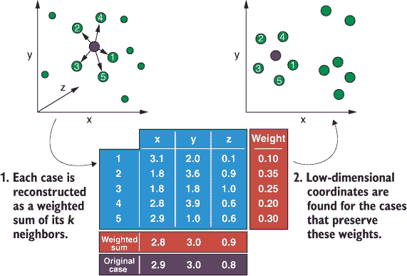

那么，LLE 算法是如何工作的呢？看看图 15.12。它首先从数据集中选择一个案例并计算其 k 个最近邻（这就像第三章中的 kNN 算法一样，所以*k*是 LLE 算法的超参数）。LLE 随后将此案例表示为其*k*个邻居的线性、加权总和。我都能听到你在问：那是什么意思？好吧，每个*k*个邻居都被分配了一个权重：一个介于 0 和 1 之间的值，使得所有 k 个最近邻的权重之和为 1。特定邻居的变量值乘以其权重（因此加权值是原始值的一部分）。

| |
| --- |

##### 注意

因为 LLE 算法依赖于测量案例之间的距离来计算最近邻，所以它对变量尺度之间的差异很敏感。在嵌入之前对数据进行缩放通常是一个好主意。

| |
| --- |

当每个变量的加权值在 k 个最近邻中累加时，这个新的加权总和应该近似于我们最初计算 k 个最近邻的案例的变量值。因此，LLE 算法为每个最近邻学习一个权重，使得当我们乘以每个邻居的权重并将这些值相加时，我们得到原始案例（或近似值）。这就是我说 LLE 将每个案例表示为其邻居的线性加权总和时的意思。

这个过程对数据集中的每个案例重复进行：计算其 k 个最近邻，然后学习可以用来重建它的权重。因为权重是线性组合的（相加），所以该算法本质上是在每个案例周围学习一个线性“补丁”。但是它是如何组合这些补丁来学习流形的呢？嗯，数据被放置在一个低维空间中，通常是两到三个维度，这样在这个新空间中的坐标保留了之前步骤中学习的权重。换句话说，数据被放置在这个新特征空间中，这样每个案例仍然可以通过其邻居的加权总和来计算。

### 15.5\. 构建您的第一个 LLE

在本节中，我将向您展示如何使用 LLE 算法将数据集的维度降低到二维地图。我们将从一个非常规的例子开始，这个例子真正展示了 LLE 作为非线性降维算法的强大功能。这个例子之所以不寻常，是因为它表示的是三维形状为*S*的数据，这与我们在现实世界中可能遇到的情况不同。然后我们将使用 LLE 创建我们跳蚤马戏团数据的二维嵌入，以查看它与我们之前创建的 SOM 相比如何。

#### 15.5.1\. 加载和探索 S 曲线数据集

首先，让我们安装并加载 lle 包：

```
install.packages("lle")

library(lle)
```

接下来，让我们从 lle 包中加载 lle_scurve_data 数据集，为其变量命名，并将其转换为 tibble。我们有一个包含 800 个案例和 3 个变量的 tibble。

##### 列表 15.8\. 加载 S 曲线数据集

```
data(lle_scurve_data)

colnames(lle_scurve_data) <- c("x", "y", "z")

sTib <- as_tibble(lle_scurve_data)

sTib

# A tibble: 800 x 3
        x     y      z
    <dbl> <dbl>  <dbl>
 1  0.955 4.95  -0.174
 2 -0.660 3.27  -0.773
 3 -0.983 1.26  -0.296
 4  0.954 1.68  -0.180
 5  0.958 0.186 -0.161
 6  0.852 0.558 -0.471
 7  0.168 1.62  -0.978
 8  0.948 2.32   0.215
 9 -0.931 1.51  -0.430
10  0.355 4.06   0.926
# ... with 790 more rows
```

这个数据集包含折叠成三维中字母*S*形状的案例。让我们创建一个三维图来可视化这一点，使用 plot3D 和 plot3Drgl 包（从它们的安装开始）。

##### 列表 15.9\. 在三维中绘制 S 曲线数据集

```
install.packages(c("plot3D", "plot3Drgl"))

library(plot3D)

scatter3D(x = sTib$x, y = sTib$y, z = sTib$z, pch = 19,
          bty = "b2", colkey = FALSE, theta = 35, phi = 10,
          col = ramp.col(c("darkred", "lightblue")))

plot3Drgl::plotrgl()
```

`scatter3D()`函数允许我们创建一个三维图，而`plotrgl()`函数允许我们交互式地旋转它。以下是`scatter3D()`函数参数的摘要：

+   `x`、`y`和`z`—要在各自的轴上绘制哪些变量。

+   `pch`—我们希望绘制的点的形状（`19`绘制实心圆圈）。

+   `bty`—绘制在数据周围的框类型（`"b2"`绘制带有网格线的白色框；使用`?scatter3D`查看其他选项）。

+   `colkey`—我们是否想要为每个点的着色添加图例。

+   `theta`和`phi`—该图的视角角度。

+   `col`—我们想要使用的调色板，以指示 `z` 变量的值。在这里，我们使用 `ramp.col()` 函数来指定颜色渐变的起始和结束颜色。

一旦我们创建了我们的静态图表，我们可以通过简单地调用 `plotrgl()` 函数（不带任何参数）将其转换为交互式图表，我们可以通过点击和旋转鼠标来旋转它。


##### 小贴士

你可以使用鼠标滚轮来放大和缩小这个交互式图表。


生成的图表显示在 图 15.13 中。你能看到数据形成了一个三维的 *S* 形吗？这确实是一个不寻常的数据集，但我希望它能展示 LLE 在学习数据集下隐含的流形时的强大能力。

##### 图 15.13\. 使用 `scatter3D()` 函数在三维中绘制的 S 曲线数据集。点的阴影映射到 `z` 变量。

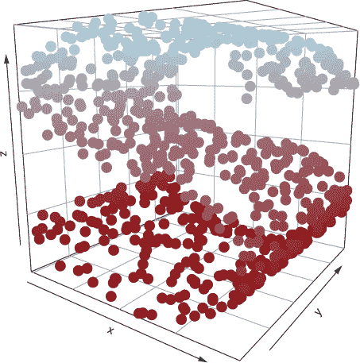

#### 15.5.2\. 训练 LLE

除了我们想要将数据集减少到的维度数量（通常是两到三个），*k* 是我们唯一需要选择的超参数。我们可以通过使用 `calc_k()` 函数来选择 *k* 的最佳性能值。这个函数将 LLE 算法应用于我们的数据，使用我们在指定范围内指定的不同 *k* 值。对于使用不同 *k* 的每个嵌入，`calc_k()` 计算原始数据中以及在低维表示中的案例之间的距离。这些距离之间的相关系数被计算出来（ρ，或“rho”），并用于计算一个指标（1 – ρ²），该指标可用于选择 *k*。这个指标值最小的 *k* 是在高低维表示之间最好地保留了案例之间距离的值。

这里是 `calc_k()` 函数参数的摘要：

+   第一个参数是数据集。

+   `m` 参数是我们想要将数据集减少到的维数。

+   `kmin` 和 `kmax` 参数指定函数将使用的 *k* 值范围的最低值和最高值。

+   `cpus` 参数让我们指定我们想要用于并行化的核心数（我使用了 `parallel::detectCores()` 来使用所有核心）。


##### 注意

由于我们为每个 *k* 值计算一个嵌入，如果我们的值范围很大，并且/或者我们的数据集中包含许多案例，我建议通过将 `parallel` 参数设置为 `TRUE` 来并行化此函数。


当这个函数完成后，它将绘制一个图表，显示每个 *k* 值的 1 – ρ² 指标（见 图 15.14）。

##### 图 15.14\. 将 1 – ρ² 对 *k* 进行绘图以找到 *k* 的最佳值。实线水平线表示 1 – ρ² 最低的 *k* 值。

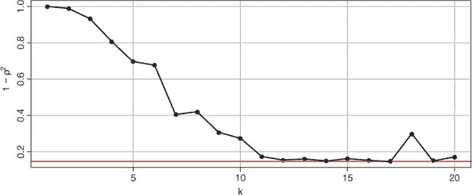

`calc_k()` 函数还返回一个包含每个 *k* 值的 1 – ρ² 度量的 `data.frame`。我们使用 `filter()` 函数选择包含 `rho` 列最低值的行。我们将使用与这个最小值相对应的 *k* 值来训练我们的最终 LLE。在这个例子中，*k* 的最佳值是 17 个邻居。

| |
| --- |

##### 注意

这有点令人困惑，因为我们实际上想要最高的 rho (ρ) 值，这给我们最小的 1 – ρ² 值。尽管这个列被称为 `rho`，但它包含 1 – ρ² 的值，因此我们想要这些值中最小的一个。

| |
| --- |

最后，我们使用 `lle()` 函数运行 LLE 算法，提供以下内容：

+   数据作为第一个参数

+   我们想要嵌入的维数的数量作为 `m` 参数

+   *k* 超参数的值

##### 列表 15.10\. 计算 *k* 并执行 LLE

```
lleK <- calc_k(lle_scurve_data, m = 2, kmin = 1, kmax = 20,
               parallel = TRUE, cpus = parallel::detectCores())

lleBestK <- filter(lleK, rho == min(lleK$rho))

lleBestK

   k    rho
1 17 0.1469

lleCurve <- lle(lle_scurve_data, m = 2, k = lleBestK$k)
```

#### 15.5.3\. 绘制 LLE 结果

现在我们已经完成了嵌入，让我们提取两个新的 LLE 轴并将数据绘制到它们上面。这将使我们能够在这个新的二维空间中可视化我们的数据，以查看算法是否揭示了分组结构。

##### 列表 15.11\. 绘制 LLE

```
sTib <- sTib %>%
  mutate(LLE1 = lleCurve$Y[, 1],
         LLE2 = lleCurve$Y[, 2])

ggplot(sTib, aes(LLE1, LLE2, col = z)) +
  geom_point() +
  scale_color_gradient(low = "darkred", high = "lightblue") +
  theme_bw()
```

我们首先在我们的原始 tibble 上突变两个新列，每个列包含一个新 LLE 轴的值。然后我们使用 `ggplot()` 函数将两个 LLE 轴相互绘制，将 *z* 变量映射到颜色美学。我们添加一个 `geom_point()` 层和一个 `scale_color_gradient()` 层，该层指定将映射到 *z* 变量的颜色尺度的极端颜色。这将使我们能够直接比较每个案例在我们新的二维表示中的位置与其在 图 15.13 中的三维图中的位置。

结果图显示在 图 15.15 中。你能看到 LLE 将 *S* 形状扁平化为一个平坦的二维点矩形吗？如果不能，请回顾 图 15.13 并尝试将两个图联系起来。这几乎就像数据被画在折叠的纸张上，而 LLE 将其拉直了！这是降维的流形学习算法的力量。

##### 图 15.15\. 绘制 S 曲线数据的二维嵌入图。点的阴影映射到 `z` 变量，与 图 15.11 中的相同。

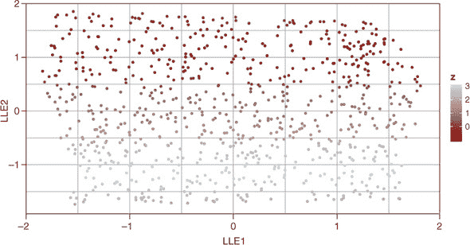

### 15.6\. 构建我们跳蚤数据的 LLE

有时对 LLE 的批评是，它被设计来处理“玩具数据”——换句话说，是构建成有趣和不同形状的数据，但在现实世界的数据集中很少（如果有的话）体现出来。我们在上一节中工作的 S 曲线数据是这种玩具数据的例子，它是为了测试学习数据所在流形的算法而生成的。因此，在本节中，我们将看到 LLE 在我们的跳蚤马戏团数据集上的表现如何，以及它是否能够像我们的 SOM 一样识别跳蚤簇。

我们将遵循与 S 曲线数据集相同的程序：

1.  使用`calc_k()`函数计算最佳性能的*k*值。

1.  在二维空间中进行嵌入。

1.  将两个新的 LLE 轴相互绘制出来。

这次，让我们将`物种`变量映射到颜色美学上，看看我们的 LLE 嵌入如何将簇分离得有多好。

##### 列表 15.12。在跳蚤数据集上执行和绘制 LLE

```
lleFleaK <- calc_k(fleaScaled, m = 2, kmin = 1, kmax = 20,
                   parallel = TRUE, cpus = parallel::detectCores())

lleBestFleaK <- filter(lleFleaK, rho == min(lleFleaK$rho))

lleBestFleaK

   k    rho
1 12 0.2482

lleFlea <- lle(fleaScaled, m = 2, k = lleBestFleaK$k)
fleaTib <- fleaTib %>%
  mutate(LLE1 = lleFlea$Y[, 1],
         LLE2 = lleFlea$Y[, 2])

ggplot(fleaTib, aes(LLE1, LLE2, col = species)) +
  geom_point() +
  theme_bw()
```

结果图显示在图 15.16 中（我将图表合并到一个图中以节省空间）。LLE 似乎在分离跳蚤的不同物种方面做得相当不错，尽管结果并不像 LLE 能够解开 S 曲线数据集那样令人印象深刻。

##### 图 15.16。绘制列表 15.12 的输出。顶部图显示了不同*k*值的 1 – ρ²。底部图显示了跳蚤数据的二维嵌入，按物种着色。

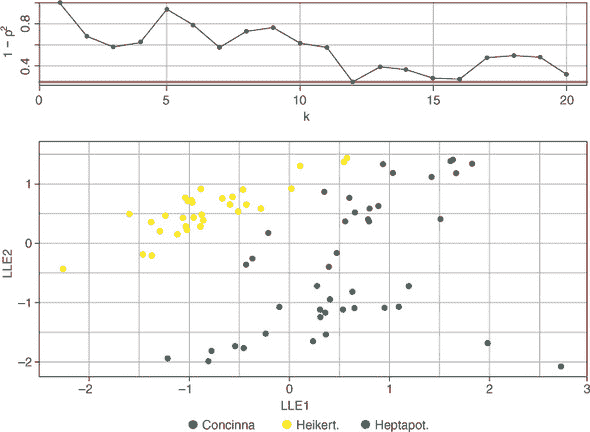

| |
| --- |

##### 注意

很遗憾，因为每个案例都被重建为其邻居的加权求和，新数据不能投影到 LLE 映射上。因此，LLE 不能轻易用作其他机器学习算法的预处理步骤，因为新数据不能通过它。

| |
| --- |
| |

**练习 2**

将每个跳蚤物种的 95%置信椭圆添加到图 15.16 中显示的底部图中。

| |
| --- |

### 15.7。SOMs 和 LLE 的优势与劣势

虽然通常不容易判断哪些算法会对特定任务表现良好，但以下是一些优势和劣势，这将帮助您决定 SOM 或 LLE 是否适合您。

SOMs 和 LLE 的优势如下：

+   它们都是非线性降维算法，因此可以揭示数据中的模式，而线性算法（如 PCA）可能无法揭示这些模式。

+   新数据可以映射到现有的 SOM 上。

+   它们的训练成本相对较低。

+   在相同的*k*值下，重新运行 LLE 算法在相同的数据集上会产生相同的嵌入。

SOMs 和 LLE 的劣势如下：

+   它们无法原生地处理分类变量。

+   低维表示在原始变量的意义上不可直接解释。

+   它们对不同尺度的数据敏感。

+   新数据不能映射到现有的 LLE 上。

+   它们不一定保留数据的全局结构。

+   在相同的数据集上重新运行 SOM 算法每次都会产生不同的映射。

+   小型 SOM 可能难以解释，因此该算法在大型数据集（超过数百个案例）上表现最佳。


**练习 3**

使用我们创建的原始 `somGrid`，创建另一个 SOM，但将迭代次数增加到 10,000，并将 *alpha* 参数设置为 `c(0.1, 0.001)` 以减慢学习速率。创建与练习 1 中相同的映射图。多次重新训练并绘制 SOM。映射是否比之前更稳定？你能想到为什么吗？

|  |

**练习 4**

重复我们的 LLE 嵌入，但将嵌入在三维而不是二维空间中。使用 `scatter3()` 函数绘制这个新的嵌入，并按物种着色点。

|  |

**练习 5**

重复我们的 LLE 嵌入（在二维中），但这次使用未缩放的变量。将两个 LLE 轴相互绘制，并将 `species` 变量映射到颜色美学。将此嵌入与使用缩放变量的结果进行比较。


### 概述

+   SOMs 创建一个网格/地图，将数据集中的案例分配到节点上。

+   SOMs 通过更新每个节点的权重来学习数据中的模式，直到地图收敛到一组权重，该权重保留案例之间的相似性。

+   新数据可以映射到现有的 SOM 上，并且可以根据它们的权重对 SOM 节点进行聚类。

+   LLE 将每个案例重建为其邻居的线性加权总和。

+   LLE 然后将数据嵌入到一个低维特征空间中，该空间保留了权重。

+   LLE 极佳于学习一组数据下复杂的流形，但新数据不能映射到现有的嵌入中。

### 练习解答

1.  训练一个矩形、环形的 SOM：

    ```
    somGridRect <- somgrid(xdim = 5, ydim = 5, topo = "rectangular",
                       toroidal = TRUE)

    fleaSomRect <- som(fleaScaled, grid = somGridRect, rlen = 5000,
                       alpha = c(0.05, 0.01))

    plot(fleaSomRect, type = "mapping", pch = 21,
         bg = nodeCols[as.numeric(fleaTib$species)],
         shape = "straight", bgcol = "lightgrey")

    # Making the map toroidal means that nodes on one edge are connected to
    # adjacent nodes on the opposite side of the map.
    ```

1.  将每个跳蚤物种的 95% 置信椭圆添加到 LLE1 与 LLE2 的图中：

    ```
    ggplot(fleaTib, aes(LLE1, LLE2, col = species)) +
      geom_point() +
      stat_ellipse() +
      theme_bw()
    ```

1.  使用更多迭代但较慢的学习速率训练 SOM：

    ```
    fleaSomAlpha <- som(fleaScaled, grid = somGrid, rlen = 10000,
                       alpha = c(0.01, 0.001))

    plot(fleaSomAlpha, type = "mapping", pch = 21,
         bg = nodeCols[as.numeric(fleaTib$species)],
         shape = "straight", bgcol = "lightgrey")

    # While the positions of the groups change between repeats, there is less
    # variation in how well cases from the same species cluster together.
    # This is because the learning rate is slower and there are more iterations.
    ```

1.  在三维空间中训练 LLE：

    ```
    lleFlea3 <- lle(fleaScaled, m = 3, k = lleBestFleaK$k)

    fleaTib <- fleaTib %>%
      mutate(LLE1 = lleFlea3$Y[, 1],
             LLE2 = lleFlea3$Y[, 2],
             LLE3 = lleFlea3$Y[, 3])

    scatter3D(x = fleaTib$LLE1, y = fleaTib$LLE2, z = fleaTib$LLE3, pch = 19,
              bty = "b2", colkey = FALSE, theta = 35, phi = 10, cex = 2,
              col = c("red", "blue", "green")[as.integer(fleaTib$species)],
              ticktype = "detailed")

    plot3Drgl::plotrgl()
    ```

1.  在未缩放的跳蚤数据上训练 LLE：

    ```
    lleFleaUnscaled <- lle(dplyr::select(fleaTib, -species),
                           m = 2, k = lleBestFleaK$k)

    fleaTib <- fleaTib %>%
      mutate(LLE1 = lleFleaUnscaled$Y[, 1],
             LLE2 = lleFleaUnscaled$Y[, 2])

    ggplot(fleaTib, aes(LLE1, LLE2, col = species)) +
      geom_point() +
      theme_bw()

    # As we can see, the embedding is different depending on
    # whether the variables are scaled or not.
    ```
