## 第五部分\. 聚类

我们在无监督学习中的下一个停留点是聚类。聚类涵盖了用于在数据集中识别案例簇的一系列技术。*簇*是一组案例，它们彼此之间比与其他簇中的案例更相似。

从概念上讲，聚类可以看作与分类相似，因为我们试图为每个案例分配一个离散值。区别在于，虽然分类使用标记的案例来学习数据中的模式，以区分类别，但我们使用聚类是因为我们没有关于类别成员资格或数据中是否存在不同类别的先验知识。因此，聚类描述了一组试图在数据集中识别分组结构的算法。

在第十六章到第十九章中，我将为你提供不同的聚类技术，这些技术可以处理各种聚类问题。验证聚类算法的性能可能是一个挑战，并且可能并不总是有一个明显或甚至“正确”的答案，但我将教你技能，帮助你最大化从这些方法中获得的信息。

## 第十六章\. 使用 k-means 寻找中心进行聚类

*本章涵盖*

+   理解聚类需求

+   理解聚类过拟合和欠拟合

+   验证聚类算法的性能

我们在聚类中的第一个停留点带我们到一个非常常用的技术：*k-means 聚类*。我在这里使用的是*技术*这个词，而不是*算法*，因为 k-means 描述了聚类的一个特定*方法*，多个算法都遵循这种方法。我将在本章的后面讨论这些个别算法。

| |
| --- |

##### 注意

不要混淆 k-means 和 k-最近邻！k-means 用于无监督学习，而 k-最近邻是一个用于分类的监督算法。

| |
| --- |

K-means 聚类试图在数据集中学习分组结构。k-means 方法首先由我们定义我们认为数据集中有多少个簇。这就是*k*的含义；如果我们把*k*设为 3，我们将识别出三个簇（无论这些是否代表真实的分组结构）。这可以说是 k-means 的一个弱点，因为我们可能没有关于要搜索多少个簇的先验知识，但我将向你展示如何选择一个合理的*k*值。

一旦我们定义了要搜索的集群数量*k*，k-means 将在数据集中初始化（通常随机）*k*个中心或质心。每个质心可能不是数据中的实际案例，但每个变量都有一个随机值。这些质心中的每一个代表一个集群，案例被分配到与它们最近的质心的集群。迭代地，质心在特征空间中移动，试图最小化每个集群内的数据方差，但最大化不同集群之间的分离。在每次迭代中，案例被分配到与它们最近的质心的集群。

到本章结束时，我希望你能理解聚类的一般方法以及聚类任务中的过拟合和欠拟合是什么样的。我将向你展示如何将 k-means 聚类应用于数据集以及评估聚类性能的方法。

### 16.1. 什么是 k-means 聚类？

在本节中，我将向您展示 k-means 聚类的通用过程，然后解释实现它的各种算法以及它们的区别。K-means 算法将数据集中的案例划分为*k*个集群，其中*k*是我们定义的一个整数。k-means 算法返回的集群倾向于是*n*-维度的球形（其中*n*是特征空间的维度数）。这意味着集群在二维空间中倾向于形成一个圆圈，在三维空间中形成一个球体，在超过三维的空间中形成一个超球体。K-means 集群也倾向于具有相似的大径。这些可能是数据基础结构中不真实的特征。

有许多 k-means 算法，但一些常用的算法如下：

+   Lloyd 算法（也称为 Lloyd-Forgy 算法）

+   MacQueen 算法

+   Hartigan-Wong 算法

Lloyd、MacQueen 和 Hartigan-Wong 算法在概念上非常相似，但它们之间的一些差异会影响它们的计算成本以及在特定问题上的性能。让我们逐一介绍每个算法，解释它们是如何工作的。

#### 16.1.1. Lloyd 算法

在本节中，我将向您展示这三个算法中最容易理解的一个：Lloyd 算法。想象一下，你是一名体育科学家，对跑者的生物物理差异感兴趣。你测量了一组跑者的静息心率和最大摄氧量，并希望使用 k-means 算法来识别可能从不同训练方案中受益的跑者集群。

假设你事先有理由相信数据集中可能存在三个不同的运动员集群。Lloyd 算法的第一步是在数据中随机初始化*k*（在这个例子中是三个）质心（见图 16.1）。接下来，计算每个案例与每个质心之间的距离。这个距离通常是欧几里得距离（直线距离），但也可以是其他距离度量，例如曼哈顿距离（出租车距离）。

##### 图 16.1\. k-means 聚类的五次迭代。在左上角的图中，在特征空间中随机生成了三个初始中心（交叉点）。案例被分配给其最近中心的簇。在每次迭代中，每个中心移动到其簇中案例的平均值处（由箭头指示）。特征空间可以被划分为 Voronoi 单元（我将在稍后讨论这些），由阴影区域表示，显示特征空间中距离特定质心最近的区域。

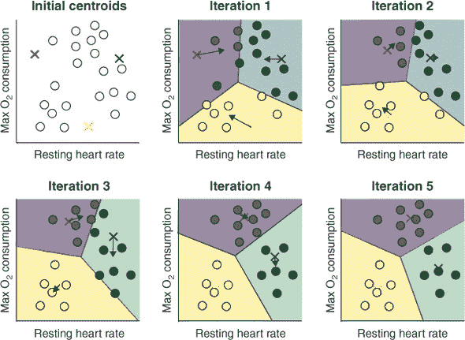

| |
| --- |

##### 注意

因为 k-means 依赖于距离度量，如果变量在不同的尺度上测量，那么缩放变量是很重要的；否则，较大尺度的变量将不成比例地影响结果。

| |
| --- |

每个案例都被分配给由其最近的质心表示的簇。这样，每个质心都作为其簇的*原型*案例。接下来，将质心移动，使它们位于上一步分配给其簇的案例的平均值处（这就是为什么这种方法被称为*k-means*）。

现在过程会重复进行：计算每个案例与每个质心的距离，并将案例分配给最近的质心所在的簇。你能看到，因为质心会更新并在特征空间中移动，所以一个特定案例最近的质心可能会随时间改变吗？这个过程会一直持续到没有案例从一个迭代到下一个迭代改变簇，或者达到最大迭代次数。注意，在图 16.1 的迭代 4 和 5 之间，没有案例改变簇，所以算法停止。

| |
| --- |

##### 注意

因为初始中心通常随机选择，所以我们重复执行此过程几次，每次都使用新的随机初始中心是很重要的。然后我们可以使用开始时具有最低簇内平方误差和的中心。

| |
| --- |

让我们总结一下 Lloyd 算法的步骤：

1.  选择*k*。

1.  在特征空间中随机初始化*k*个中心。

1.  对于每个案例：

    1.  计算案例与每个中心之间的距离。

    1.  将案例分配给最近的质心所在的簇。

1.  将每个中心放置在其簇分配的案例的平均值处。

1.  重复步骤 3 和 4，直到没有案例改变簇或达到最大迭代次数。

在 图 16.1 中，你能看到在每次迭代中，质心的位置是如何更新的（箭头），以便它们向真实聚类的中心移动？在每次迭代中，我们可以将特征空间划分为围绕每个质心的多边形（或多面体，在两个以上维度中）区域，这些区域显示了“属于”特定聚类的区域。这些区域被称为 *Voronoi 单元*；如果一个案例落在其中，这意味着该案例最接近该单元的质心，并将被分配到其聚类。在图上可视化 Voronoi 单元（有时称为 *Voronoi 地图*）是可视化聚类算法如何划分特征空间的有用方法。

#### 16.1.2. MacQueen 算法

MacQueen 算法与 Lloyd 算法极为相似，只是在质心更新时间上略有不同。Lloyd 算法被称为 *批量* 或 *离线* 算法，意味着它在迭代结束时一起更新质心。另一方面，MacQueen 算法每次案例改变聚类并且算法已经遍历了数据中的所有案例时，都会更新质心。

| |
| --- |

##### 备注

与 Lloyd 算法被称为批量或离线算法相比，MacQueen 算法被称为 *增量* 或 *在线* 算法，因为它每次案例移动聚类时都会更新质心，而不是在遍历所有数据后更新。 

| |
| --- |

就像 Lloyd 算法一样，MacQueen 算法初始化 *k* 个中心，将每个案例分配到最近的质心的聚类，并将质心的位置更新为与其最近的案例的平均值。然后算法逐个考虑每个案例，并计算其到每个质心的距离。如果案例改变了聚类（因为它现在更接近不同的质心），则更新新旧质心的位置。算法继续通过数据集，逐个考虑每个案例。一旦所有案例都已考虑，再次更新质心的位置。如果没有案例改变聚类，则算法停止；否则，它将进行另一轮遍历。

与 Lloyd 算法相比，MacQueen 算法的优点是它往往更快地收敛到最优解。然而，对于非常大的数据集，它可能稍微计算成本更高。

让我们总结一下 MacQueen 算法的步骤：

1.  选择 *k*。

1.  在特征空间中随机初始化 *k* 个中心。

1.  将每个案例分配到其最近中心的聚类。

1.  将每个中心放置在其分配给其聚类的案例的平均值处。

1.  对于每个案例：

    1.  计算案例与每个质心之间的距离。

    1.  将案例分配到最近的质心的聚类。

    1.  如果案例改变了聚类，则更新新旧质心的位置。

1.  一旦所有案例都已考虑，更新所有质心。

1.  如果没有案例改变聚类，则停止；否则，重复步骤 5。

#### 16.1.3. Hartigan-Wong 算法

第三个 k-means 算法与 Lloyd 和 MacQueen 算法略有不同。Hartigan-Wong 算法首先初始化 *k* 个随机中心，并将每个案例分配给其最近中心的聚类，就像我们在其他两个算法中看到的那样。这里的不同之处在于：对于数据集中的每个案例，算法计算如果该案例被移除，则其当前聚类的平方误差之和，以及如果该案例包含在那些聚类中，则每个其他聚类的平方误差之和。回想一下，从前几章中我们知道，平方误差之和（或简称为平方和）是每个案例的值与其预测值（在此上下文中，其质心）之间的差异，平方后对所有案例求和。如果您更喜欢数学符号，请查看方程 16.1。

##### 方程 16.1。

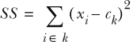

其中 *i* ∈ *k* 是属于聚类 *k* 的第 *i* 个案例，而 *c[k]* 是聚类 *k* 的质心。

当包括当前正在考虑的案例时，具有最小平方误差之和的聚类被分配为该案例的聚类。如果一个案例改变了聚类，那么旧聚类和新聚类的质心将被更新为它们聚类中案例的平均值。算法继续进行，直到没有案例改变聚类。因此，一个案例可能被分配给特定的聚类（因为它减少了平方误差之和），即使它更接近另一个聚类的质心。

让我们总结一下 Hartigan-Wong 算法的步骤：

1.  选择 *k*。

1.  在特征空间中随机初始化 *k* 个中心。

1.  将每个案例分配给其最近中心的聚类。

1.  将每个中心放置在其分配给其聚类的案例的平均值处。

1.  对于每个案例：

    1.  计算其聚类的平方误差之和，忽略正在考虑的案例。

    1.  计算其他聚类的平方误差之和，就像那个案例被包含在内一样。

    1.  将案例分配给具有最小平方误差之和的聚类。

    1.  如果案例改变了聚类，则更新新聚类和旧聚类的位置。

1.  如果没有案例改变聚类，则停止；否则，重复步骤 5。

Hartigan-Wong 算法 *倾向于*比 Lloyd 或 MacQueen 算法找到更好的聚类结构，尽管我们总是受到“没有免费午餐”定理的限制。Hartigan-Wong 算法也比其他两个算法更耗费计算资源，因此对于大型数据集来说会慢得多。

我们应该选择哪种算法呢？嗯，选择是一个离散的超参数，因此我们可以使用超参数调整来帮助我们选择表现最好的方法，并确保我们不会做出错误的抉择！

### 16.2\. 构建您的第一个 k-means 模型

在本节中，我将向您展示如何使用 R 中的 mlr 包构建 k-means 模型。我将介绍创建聚类任务和学习者，以及我们可以用来评估聚类算法性能的一些方法。

想象一下，你正在寻找来自移植物抗宿主病（GvHD）患者的白细胞簇。GvHD 是一种令人不快的疾病，其中移植组织中残留的白细胞攻击接受移植的患者。你从每位患者那里取活检，并测量每个细胞表面的不同蛋白质。你希望创建一个聚类模型，帮助你从活检中识别不同的细胞类型，以帮助你更好地理解这种疾病。让我们先加载 mlr 和 tidyverse 包：

```
library(mlr)

library(tidyverse)
```

#### 16.2.1\. 加载和探索 GvHD 数据集

现在让我们加载数据，这些数据内置在 mclust 包中，将其转换为 tibble（使用`as_tibble()`），并对其进行一些探索。我们有一个包含 6,809 个案例和 4 个变量的 tibble，每个变量都是测量在每个细胞表面的不同蛋白质。

##### 列表 16.1\. 加载和探索 GvHD 数据集

```
data(GvHD, package = "mclust")

gvhdTib <- as_tibble(GvHD.control)
gvhdTib

# A tibble: 6,809 x 4
     CD4  CD8b   CD3   CD8
   <dbl> <dbl> <dbl> <dbl>
 1   199   420   132   226
 2   294   311   241   164
 3    85    79    14   218
 4    19     1   141   130
 5    35    29     6   135
 6   376   346   138   176
 7    97   329   527   406
 8   200   342   145   189
 9   422   433   163    47
10   391   390   147   190
# ... with 6,799 more rows
```

| |
| --- |

##### 备注

调用`data(GvHD, package = "mclust")`实际上加载了两个数据集：GvHD.control 和 GvHD.pos。我们将使用 GvHD.control 数据集，但在本节的最后，我还会指导你使用 GvHD.pos 数据集构建一个聚类模型。

| |
| --- |

由于 k-means 算法使用距离度量来将案例分配到簇中，因此我们的变量必须是缩放的，以便不同尺度的变量得到相同的权重。我们的所有变量都是连续的，因此我们可以简单地通过将整个 tibble 管道到`scale()`函数中来进行缩放。记住，这将通过减去平均值并除以标准差来对每个变量进行中心化和缩放。

##### 列表 16.2\. 缩放 GvHD 数据集

```
gvhdScaled <- gvhdTib %>% scale()
```

接下来，让我们使用 GGally 包中的好朋友`ggpairs()`来绘制数据。这次，我们修改了`ggpairs()`绘制分面图的方式。我们使用`upper`、`lower`和`diag`参数来分别指定应该在上部、下部和对角线绘制哪种类型的图表。每个参数都接受一个列表，其中每个列表元素可以用来指定连续变量、离散变量以及两者的组合的不同类型图表。在这里，我选择在上部图表上绘制二维密度图，在下部图表上绘制散点图，在对角线上绘制密度图。

为了防止拥挤，我们希望减小下部图表上点的尺寸。要更改图表的任何图形选项（如 geoms 的大小和颜色），我们只需将图表类型的名称（字面上）包裹在`wrap()`函数中，以及我们正在更改的选项。在这里，我们使用`wrap("points", size = 0.5)`在底部面板上绘制散点图，点的尺寸比默认值小。

| |
| --- |

##### 备注

记住，*geom*代表*几何对象*，指的是图表上的线条、点和条形等图形元素。

| |
| --- |

##### 列表 16.3\. 使用`ggpairs()`创建成对图

```
library(GGally)

ggpairs(GvHD.control,
        upper = list(continuous = "density"),
        lower = list(continuous = wrap("points", size = 0.5)),
        diag = list(continuous = "densityDiag")) +
  theme_bw()
```

| |
| --- |

##### 备注

对于连续变量，默认的对角线图是密度图。我仍然明确地将其定义为这样的，这样您就可以看到如何独立控制上、下和对角线图。

| |
| --- |

结果图显示在图 16.2。您能在数据中看到不同的案例簇吗？人脑在识别二维甚至三维中的簇方面相当出色，看起来数据集中至少有四个簇。密度图有助于我们查看案例的密集区域，这些区域在散点图中简单地显示为黑色。

##### 图 16.2\. GvHD 数据集中每个变量与每个其他变量的`ggpairs()`图。散点图显示在对角线以下，二维密度图显示在对角线以上，一维密度图绘制在对角线上。看起来数据中存在多个簇。

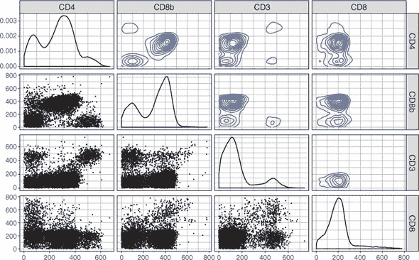

#### 在本节中，我将向您展示如何定义聚类任务和聚类学习器。在 mlr 中，我们通过使用`makeClusterTask()`函数来创建聚类任务（这里没有惊喜）。我们将我们的缩放数据（转换为数据框）作为`data`参数提供。

|

| |
| --- |

##### 重要

注意，与创建监督学习任务（用于分类或回归）不同，我们不再需要提供`target`参数。这是因为在不监督学习任务中，没有标签变量可以用作目标。

| |
| --- |

16.2.2\. 定义我们的任务和学习器

现在让我们定义我们的 k-means 学习器。我们使用熟悉的`makeLearner()`函数来完成这个任务，这次我们将`"cluster.kmeans"`作为学习器的名称。我们使用`par.vals`参数向学习器提供两个参数：`iter.max`和`nstart`。

| |
| --- |

##### 注意

就像分类和回归学习者的前缀分别是`classif.`和`regr.`一样，聚类学习者的前缀是`cluster`。

| |
| --- |

##### 让我们使用您在第三章中了解到的`listLearners()`函数，看看 mlr 包目前实现了哪些算法。在撰写本文时，我们目前只有九种聚类算法可用。诚然，这比分类和回归中可用的算法数量要少得多，但 mlr 仍然为聚类提供了一些有用的工具。如果您想使用 mlr 目前没有包装的算法，您始终可以自己实现它（访问 mlr 网站了解如何：[`mng.bz/E1Pj`](http://mng.bz/E1Pj))。

```
gvhdTask <- makeClusterTask(data = as.data.frame(gvhdScaled))

listLearners("cluster")$class

[1] "cluster.cmeans"        "cluster.Cobweb"        "cluster.dbscan"
[4] "cluster.EM"            "cluster.FarthestFirst" "cluster.kkmeans"
[7] "cluster.kmeans"        "cluster.SimpleKMeans"  "cluster.XMeans"

kMeans <- makeLearner("cluster.kmeans",
                      par.vals = list(iter.max = 100, nstart = 10))
```

`iter.max`参数为算法遍历数据的次数设置一个上限（默认为 10）。k-means 算法会在案例停止移动簇时停止，但为大数据集设置最大值可能很有用，因为这些数据集收敛需要很长时间。在本节稍后，我将向您展示如何判断聚类模型是否在达到此限制之前已经收敛。

`nstart` 参数控制函数将随机初始化中心的次数。回想一下，初始中心通常在特征空间中随机初始化：这可能会影响最终的质心位置，因此也会影响最终的簇成员资格。将 `nstart` 参数设置高于默认值 1 将随机初始化这么多中心。对于每一组初始中心，案例被分配到每个组中最近中心所在的簇，然后使用具有最小簇内平方误差和的组作为聚类算法的其余部分。这样，算法会选择与数据中的真实簇质心最相似的中心集。增加 `nstart` 可能比增加迭代次数更重要。

| |
| --- |

##### 小贴士

如果你的数据集具有非常明显可分离的簇，将 `nstart` 设置高于 1 可能是计算资源的浪费。然而，除非你的数据集非常大，否则通常将 `nstart` 设置为大于 1 是一个好主意；在 列表 16.4 中，我将它设置为 10。

| |
| --- |

#### 16.2.3. 选择簇的数量

在本节中，我将向你展示我们如何合理地选择 *k* 的值，它定义了我们的模型将识别的中心数量和簇数量。选择 *k* 的必要性常被引用为 k-means 聚类的弱点。这是因为选择 *k* 可能是主观的。如果你有先验领域知识，知道数据集中理论上应该有多少簇，那么你应该使用这些知识来指导你的选择。如果你在使用聚类作为监督学习算法（例如分类）之前的预处理步骤，那么选择相当简单：将 *k* 调整为整个模型构建过程的超参数，并将最终模型的预测与原始标签进行比较。

但如果我们没有先验知识，也没有可比较的标记数据怎么办？如果我们选择错误会发生什么？嗯，就像分类和回归一样，聚类也受到偏差-方差权衡的影响。如果我们想将聚类模型推广到更广泛的群体，那么我们既不能过度拟合也不能欠拟合训练数据。图 16.3 展示了聚类问题中欠拟合和过拟合可能看起来像什么。当我们欠拟合时，我们未能识别和分离数据中的真实簇；但当我们过拟合时，我们将真实簇分割成更小、无意义的簇，这些簇在更广泛的群体中根本不存在。

##### 图 16.3。聚类任务中欠拟合和过拟合的外观。在左侧图表中，簇欠拟合（识别的簇比实际存在的簇少）。在右侧图表中，簇过拟合（真实簇被分解成更小的簇）。在中间图表中，找到了一个最优的聚类模型，它忠实地代表了数据中的结构。

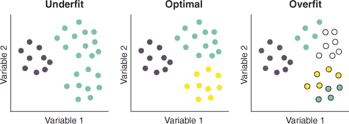

避免过拟合和欠拟合的聚类问题并不简单。人们提出了许多不同的方法来避免过拟合和欠拟合，并且它们对于特定问题不会完全一致。许多这些方法依赖于内部聚类指标的计算，这些指标是旨在量化聚类结果“质量”的统计数据。

| |
| --- |

##### 注意

“高质量”簇的构成定义不明确，有些主观，但人们通常意味着每个簇尽可能紧凑，而簇之间的距离尽可能大。

| |
| --- |

这些指标是“内部”的，因为它们是从聚类数据本身计算出来的，而不是通过与任何外部标签或真实情况进行比较。选择聚类数量的常见方法是在一系列聚类数量范围内训练多个聚类模型，并比较每个模型的聚类指标，以帮助选择最佳拟合模型。以下三种常用的内部聚类指标如下：

+   戴维斯-博尔丁指数

+   Dunn 指数

+   伪 F 统计量

##### 使用戴维斯-博尔丁指数评估聚类性能

戴维斯-博尔丁指数（以其创造者 David Davies 和 Donald Bouldin 命名）量化了每个簇与其最近邻簇的平均分离度。它是通过计算簇内方差（也称为*散度*）与簇质心之间的分离度之比来实现的（参见图 16.4）。

##### 图 16.4。戴维斯-博尔丁指数计算了簇内（聚类内）方差（左侧图表）和每个簇质心的距离（右侧图表）。对于每个簇，确定其最近邻簇，并将它们的簇内方差之和除以它们质心之间的差异。这个值对每个簇进行计算，戴维斯-博尔丁指数是这些值的平均值。

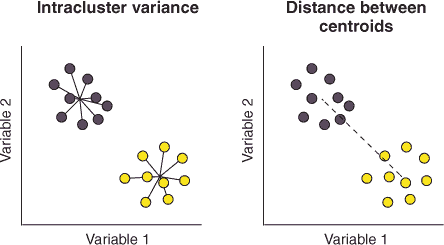

如果我们固定聚类之间的距离，但使每个聚类内部的案例更加分散，戴维斯-博尔丁指数将变大。相反，如果我们固定聚类内的方差，但使聚类彼此之间距离更远，则指数将变小。理论上，值越小（介于零和无穷大之间），聚类之间的分离度越好。用简单的话来说，戴维斯-博尔丁指数量化了每个聚类与其最相似对应物之间的平均分离度。

| |
| --- |

**计算戴维斯-博尔丁指数**

你不需要记住 Davies-Bouldin 指数的公式（实际上，它相当复杂）。如果你感兴趣，我们可以将簇内的散布定义为

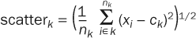

其中 scatter*[k]* 是簇 *k* 内部散布的度量，*n[k]* 是簇 *k* 中的案例数量，*x[i]* 是簇 *k* 中的第 *i* 个案例，而 *c[k]* 是簇 *k* 的质心。

簇之间的分离可以定义为

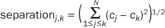

其中 separation*[j]*[,*k*] 是簇 *j* 和 *k* 之间分离的度量，*c[j]* 和 *c[k]* 是它们各自的质心，而 *N* 是簇的总数。

然后计算簇内散布与两个簇之间的分离比

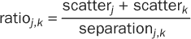

这个比率是针对所有簇对计算的，对于每个簇，将其与其他簇之间的最大比率定义为 *R[k]*。然后，Davies-Bouldin 指数就是这些最大比率的平均值：

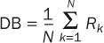


##### 使用 Dunn 指数来评估聚类性能

Dunn 指数是另一个内部簇度量，它量化了不同簇中点之间最小距离与任何簇内最大距离（称为簇的 *直径*）之间的比率（参见 图 16.5）。这些可以是任何距离度量，但通常是欧几里得距离。

##### 图 16.5\. Dunn 指数量化了不同簇中案例之间最小距离（左侧图表）与簇内最大距离（右侧图表）之间的比率。

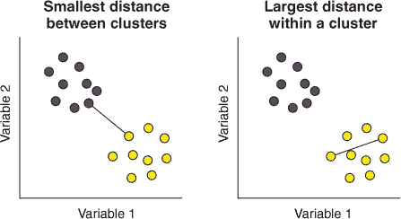

这里的直觉是，如果我们保持簇的直径不变但将最近的成对案例分开，Dunn 指数将会变大。相反，如果我们保持簇中心之间的距离不变但缩小簇的直径（通过使簇更密集），Dunn 指数也会增加。因此，产生最大 Dunn 指数的簇数量是产生簇之间最大最小距离和簇内案例之间最小最大距离的簇。


**计算 Dunn 指数**

你不需要记住 Dunn 指数的公式。如果你感兴趣，我们可以将 Dunn 指数定义为

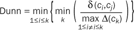

其中 δ(*c[i]*,*c[j]*) 表示簇 *i* 和 *j* 中案例之间的所有成对差异，而 δ(*c[i]*) 表示簇 *k* 中案例之间的所有成对差异。


##### 使用伪 F 统计量来评估聚类性能

伪 F 统计量是簇间平方和与簇内平方和的比率（见图 16.6）。簇间平方和是每个簇质心与总体质心（数据如果全部在一个大簇中，其质心）之间的平方差，按该簇中的案例数量加权，并在每个簇中累加。这是衡量簇之间分离程度的一种方法（簇质心彼此越远，簇间平方和越小）。簇内平方和是每个案例与其簇质心之间的平方差，在每个簇中累加。这是衡量每个簇内方差或分散度的一种方法（簇越密集，簇内平方和越小）。

##### 图 16.6。伪 F 统计量是簇间平方和（右侧图表）与簇内平方和（左侧图表）的比率。总体质心在右侧图表中以正方形表示。

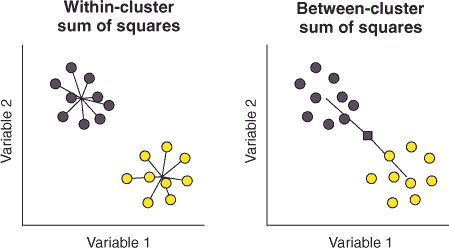

因为伪 F 统计量也是一个比率，如果我们保持相同的簇方差但使簇彼此更远，伪 F 统计量将增加。相反，如果我们保持簇质心之间的相同分离度但使簇更加分散，伪 F 统计量将减少。因此，导致最大伪 F 统计量的簇数量，在理论上，是最大化簇之间分离度的那个。

| |
| --- |

**计算伪 F 统计量**

您不需要记住伪 F 统计量的公式。如果您感兴趣，我们可以将伪 F 统计量定义为

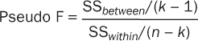

SS*[between]* 和 SS*[within]* 的计算方法如下

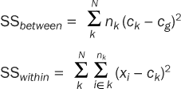

其中，有 *N* 个簇，*n[k]* 是簇 *k* 中的案例数量，*c[k]* 是簇 *k* 的质心，*c[g]* 是所有案例的总体质心。

| |
| --- |

这些只是众多常用内部簇度量指标中的三个，此时你可能想知道为什么没有只有一个指标能告诉我们簇之间的分离程度。原因是，当我们有非常清晰、定义良好的簇时，这些指标往往会相互一致，但当解决方案变得更加模糊时，它们将开始相互不一致，某些指标在特定情况下表现优于其他指标。例如，依赖于计算平方和的内部簇度量指标可能更喜欢选择直径相等的簇的数量。如果真实簇的直径非常不均匀，这可能不是最佳簇数量。因此，在确定簇数量时，考虑多个内部簇度量指标作为证据通常是一个好主意。

因此，像这样的内部聚类指标可以帮助我们找到最佳聚类数量。但仍然始终存在一种风险，我们可能会通过过度聚类来过度拟合训练数据。避免过度聚类的一种方法是从数据中抽取多个自助样本（有放回地抽取案例），对每个样本应用聚类算法，并比较样本之间聚类成员资格的一致性。如果稳定性很高（换句话说，聚类结果在样本之间是*稳定的*），那么我们更有信心我们不是在拟合数据中的噪声。

对于能够预测新数据聚类的聚类算法，如 k-means 算法，另一种方法是使用类似于交叉验证的程序。这涉及到将数据分为训练集和测试集（例如使用 k 折），在训练集上训练聚类算法，预测测试集中案例的聚类成员资格，并计算预测聚类的内部聚类指标。这种方法的好处是，它既允许我们测试聚类稳定性，又可以在算法从未见过的数据上计算指标。这是我们将在本章中使用 k-means 选择最佳聚类数量的方法。

| |
| --- |

##### 注意

在 k-means 聚类中，可以通过简单地将新案例分配到最近的质心所在的聚类来将新数据投影到现有的聚类模型上。

| |
| --- |

#### 16.2.4. 调整 k 和 k-means 模型的选择算法

在本节中，我将向您展示我们可以如何使用类似于交叉验证的方法，通过将内部聚类指标应用于预测聚类来调整*k*（聚类数量）和我们的 k-means 算法选择。让我们首先使用`makeParamSet()`函数定义我们的超参数搜索空间。我们定义了两个离散超参数，我们将搜索它们的值：`centers`，这是算法将搜索的聚类数量（*k*），以及`algorithm`，它指定我们将使用哪个算法来拟合模型。

| |
| --- |

##### 小贴士

正如我们之前看到的，我们可以使用`getParamSet(kMeans)`来找到我们可用的所有超参数。

| |
| --- |

然后，我们将搜索方法定义为网格搜索（尝试每个超参数组合），并将交叉验证方法定义为 10 折。

##### 列表 16.5. 定义超参数的调整方式

```
kMeansParamSpace <- makeParamSet(
  makeDiscreteParam("centers", values = 3:8),
  makeDiscreteParam("algorithm",
                    values = c("Hartigan-Wong", "Lloyd", "MacQueen")))

gridSearch <- makeTuneControlGrid()

kFold <- makeResampleDesc("CV", iters = 10)
```

现在我们已经定义了搜索空间，让我们进行调优。要使用 Davies-Bouldin 指数和伪 F 统计性能度量，您首先需要安装 clusterSim 包。

| |
| --- |

##### 小贴士

mlr 实现了另外两个内部聚类指标：轮廓和 G2（使用`listMeasures("cluster")`列出可用的指标）。这两个指标的计算成本更高，所以我们在这里不会使用它们，但它们是额外的指标，帮助我们决定合适的聚类数量。

| |
| --- |

要执行调整，我们使用 `tuneParams()` 函数。因为我们没有在本书的降维部分使用此函数，让我们刷新一下对这个函数参数的记忆：

+   第一个参数是学习器的名称。

+   `task` 参数是我们聚类任务的名称。

+   `resampling` 参数是我们交叉验证策略的名称。

+   `par.set` 参数是我们的超参数搜索空间。

+   `control` 参数是我们的搜索方法。

+   `measures` 参数允许我们定义我们想要为搜索的每一迭代计算哪些性能度量。在这里，我们请求 Davies-Bouldin 指数（`db`）、Dunn 指数（`dunn`）和伪 F 统计量（`G1`），按此顺序。

| |
| --- |

##### 提示

我们可以提供我们想要的任何性能度量标准列表。所有这些度量标准都将为搜索的每一迭代计算，但优化列表中第一个度量标准值的超参数组合将始终从调整中返回。mlr 包还“知道”哪些度量标准应该最大化，哪些应该最小化以获得最佳性能。

| |
| --- |

只是为了重申：当我们执行调整时，对于每个超参数组合，数据将被分成 10 个折叠，k-means 算法将在每个折叠的训练集上训练。测试集中的案例将被分配到最近的簇中心，内部簇度量标准将在这些测试集簇上计算。调用调整的结果显示，具有四个簇的 Lloyd 算法给出了最低（最优化）的 Davies-Bouldin 指数。

##### 列表 16.6\. 执行调整实验

```
install.packages("clusterSim")

tunedK <- tuneParams(kMeans, task = gvhdTask,
                     resampling = kFold,
                     par.set = kMeansParamSpace,
                     control = gridSearch,
                     measures = list(db, dunn, G1))

tunedK

Tune result:
Op. pars: centers=4; algorithm=Lloyd
db.test.mean=0.8010,dunn.test.mean=0.0489,G1.test.mean=489.5331
```

| |
| --- |

##### 注意

在调整过程的最后，你是否收到了“在 100 次迭代后没有收敛”的警告？这是判断你在学习器定义中是否将 `iter.max` 参数设置得太低的方法。你的选择是接受结果，这可能是也可能不是接近最优的解决方案，或者如果你有计算预算，增加 `iter.max`。

| |
| --- |
| |

**练习 1**

修改我们的 `kmeans` 定义（在代码列表 16.4 中创建），将 `iter.max` 的值设置为 200。重新运行代码列表 16.6 中的调整程序。关于无法收敛的错误消失了吗？

| |
| --- |

为了更好地理解我们的三个内部度量标准如何随着簇数量和算法选择的变化而变化，让我们绘制调整过程。回想一下，为了做到这一点，我们首先需要使用 `generateHyperParsEffectData()` 函数从调整结果中提取调整数据。从 `kMeansTuningData` 对象中调用 `$data` 组件，以便您可以查看其结构（这里我不会打印它，为了节省空间）。

| |
| --- |

##### 注意

注意，我们有一个我们没有请求的度量标准：`exec.time`，它记录了使用每个超参数组合训练模型所需的时间，以秒为单位。

| |
| --- |

让我们绘制这些数据，以便每个性能指标有一个不同的面，每个算法有一条不同的线。为此，我们首先需要收集数据，使得每个性能指标的名字在一列，而指标值在另一列。我们使用`gather()`函数，将键列命名为`"Metric"`，将值列命名为`"Value"`。因为我们只想收集*这些*列，所以我们提供了一个我们不希望收集的列的向量。打印新的收集数据集以确保你理解我们所做的。以这种格式拥有数据允许我们按算法进行分面，并为每个指标绘制单独的线条。

要绘制数据，我们使用`ggplot()`函数，将`centers`（聚类数量）映射到 x 美学，将`Value`映射到 y 美学。通过将`algorithm`映射到`col`美学，将为每个算法（不同颜色）绘制不同的`geom_line()`和`geom_point()`层。我们使用`facet_wrap()`函数为每个性能指标绘制一个单独的子图，设置`scales = "free_y"`参数以允许每个面有不同的 y 轴（因为它们的刻度不同）。最后，我们添加`geom_line()`和`geom_point()`层以及一个主题。

##### 列表 16.7\. 绘制调整实验

```
kMeansTuningData <- generateHyperParsEffectData(tunedK)

kMeansTuningData$data

gatheredTuningData <- gather(kMeansTuningData$data,
                             key = "Metric",
                             value = "Value",
                             c(-centers, -iteration, -algorithm))

ggplot(gatheredTuningData, aes(centers, Value, col = algorithm)) +
  facet_wrap(~ Metric, scales = "free_y") +
  geom_line() +
  geom_point() +
  theme_bw()
```

最终的图表显示在图 16.7 中。每个面展示了一个不同的性能指标，而每条单独的线表示三种算法之一。请注意，具有四个聚类（中心）的聚类模型中，Davies-Bouldin 指数最小化，而 Dunn 指数和伪 F 统计量（G1）最大化。因为 Davies-Bouldin 指数的较低值和 Dunn 指数以及伪 F 统计量的较高值（理论上）表示聚类分离得更好，所以这三个内部指标都一致认为四个是此数据集的最佳聚类数量。不同算法之间也存在很少的分歧，尤其是在四个聚类的最优值时。

##### 图 16.7\. 绘制我们的调整过程。每个子图显示了不同的内部聚类指标。不同的线条表示三种不同算法的性能。

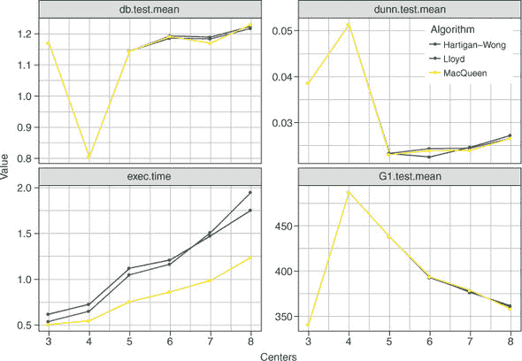

算法之间最大的差异是它们的训练时间。请注意，MacQueen 算法始终比其他任何一种都要快。这是因为该算法比 Lloyd 算法更频繁地更新其质心，并且比 Hartigan-Wong 算法更少地重新计算距离。Hartigan-Wong 算法在低聚类数量时似乎计算量最大，但随着聚类数量超过七个，它超过了 Lloyd 算法。


##### 注意

调整过程选择了 Lloyd 算法，因为它的 Davis-Bouldin 指数略小于其他算法。对于非常大的数据集，计算速度可能对你来说比这种小的性能提升更重要，在这种情况下，你可能会更喜欢选择 MacQueen 算法，因为它有更短的训练时间。

| |
| --- |

#### 16.2.5\. 训练最终的调整后的 k-means 模型

在本节中，我们将使用调整后的超参数来训练我们的最终聚类模型。你会注意到我们**不会**使用嵌套交叉验证来交叉验证整个模型构建过程。虽然 k 均值算法能够预测新数据的聚类成员资格，但它通常不作为预测技术使用。相反，我们可能会使用 k-means 来帮助我们更好地定义数据集中的类别，我们可以在以后使用这些类别来构建分类模型。

让我们首先创建一个使用调整后的超参数值的 k-means 学习器，使用`setHyperPars()`函数。然后我们使用`train()`函数在`gvhdTask`上训练这个调整后的模型，并使用`getLearnerModel()`函数提取模型数据以便绘制聚类。通过调用`kMeansModel-Data`打印模型数据，并检查输出；它包含大量有用的信息。通过提取对象的`$iter`组件，我们可以看到算法只用了三次迭代就收敛了（远少于`iter.max`）。

##### 列表 16.8\. 使用调整后的超参数训练模型

```
tunedKMeans <- setHyperPars(kMeans, par.vals = tunedK$x)

tunedKMeansModel <- train(tunedKMeans, gvhdTask)

kMeansModelData <- getLearnerModel(tunedKMeansModel)

kMeansModelData$iter

[1] 3
```

寻找最佳聚类数量不是一个定义明确的问题；因此，尽管内部指标提供了关于正确聚类数量的证据，但你仍然应该始终尝试通过视觉验证你的聚类模型，以了解你得到的结果是否合理（至少）。这可能会显得主观，确实是这样的，但使用你的专业判断比完全依赖内部指标要好得多。我们可以通过绘制数据（如图 16.2 所示）并按其聚类成员资格着色来实现这一点。

| |
| --- |

##### 小贴士

如果确定正确的聚类数量对你来说很困难，可能是因为数据中根本不存在定义良好的聚类，或者你可能需要进行进一步的探索，包括生成更多数据。尝试不同的聚类方法可能值得考虑：例如，不寻找像 k-means 那样球形聚类的算法，或者可以排除异常值（如你将在第十八章中遇到的 DBSCAN）。

| |
| --- |

要做到这一点，我们首先使用`mutate()`函数将每个案例的聚类成员资格添加为`gvhdTib` tibble 的新列。我们从模型数据的`$cluster`组件中提取聚类成员资格的向量，并使用`as.factor()`函数将其转换为因子，以确保在绘图时应用离散的颜色方案。

我们随后使用 `ggpairs()` 函数来绘制所有变量之间的对比图，将 `kMeansCluster` 映射到颜色美学。我们使用 `upper` 参数在主对角线以上的图表上绘制密度图，并应用黑白主题。

##### 列表 16.9\. 使用 `ggpairs()` 绘制簇

```
gvhdTib <- mutate(gvhdTib,
                  kMeansCluster = as.factor(kMeansModelData$cluster))

ggpairs(gvhdTib, aes(col = kMeansCluster),
        upper = list(continuous = "density")) +
  theme_bw()
```

##### 图 16.8\. 将 k-means 簇成员资格映射到颜色美学的 `ggpairs()` 图。箱线图和直方图显示了连续变量值在簇之间的变化情况。

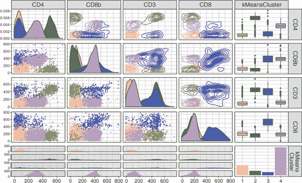

结果图表显示在 图 16.8。从直观上看，我们的 k-means 模型在整体上很好地捕捉了数据中的结构。但看看 CD8 与 CD4 的对比图：第三个簇似乎被分割了。这表明我们可能对数据进行得 **过聚类**，或者这些案例被分配到了错误的簇中；或者也许它们仅仅是异常值，其重要性被密度图高估了。

#### 16.2.6\. 使用我们的模型预测新数据的聚类

在本节中，我将向您展示如何使用现有的 k-means 模型来预测新数据的簇成员资格。正如我之前提到的，聚类技术并不打算用于预测数据类别——我们有一些在分类方面表现卓越的算法。但 k-means 算法 **可以**处理新数据并将新案例最接近的簇输出出来。这在您仍在探索并试图理解数据中的结构时非常有用，所以让我来演示一下。

让我们从创建一个包含新案例数据的 tibble 开始，包括模型训练数据集中每个变量的值。因为我们已经对训练数据进行了缩放，所以我们需要对新案例的值进行缩放。记住，根据用于训练模型的数据的均值和标准差缩放通过模型传递的新数据非常重要。最简单的方法是使用 `attr()` 函数从缩放数据中提取 `center` 和 `scale` 属性。因为 `scale()` 函数返回一个类为 `matrix` 的对象（如果给它一个矩阵，`predict()` 函数将抛出错误），我们需要将缩放数据通过 `as_tibble()` 函数管道，将其转换回 tibble。

要预测新案例属于哪个簇，我们只需调用 `predict()` 函数，将模型作为第一个参数，将新案例作为 `newdata` 参数。我们可以从输出中看到，这个新案例最接近簇 2 的质心。

##### 列表 16.10\. 预测新数据的簇成员资格

```
newCell <- tibble(CD4 = 510,
                  CD8b = 26,
                  CD3 = 500,
                  CD8 = 122) %>%
  scale(center = attr(gvhdScaled, "scaled:center"),
        scale = attr(gvhdScaled, "scaled:scale")) %>%
  as_tibble()

predict(tunedKMeansModel, newdata = newCell)

Prediction: 1 observations
predict.type: response
threshold:
time: 0.01
  response
1        2
```

你现在已经学会了如何将 k-means 聚类应用于你的数据。在下一章中，我将介绍 *层次聚类*，这是一组有助于揭示数据中层次结构的聚类方法。我建议你保存你的 .R 文件，因为我们将在下一章继续使用相同的数据集。这样我们可以比较 k-means 和层次聚类在相同数据集上的性能。

### 16.3\. k-means 聚类的优势和劣势

虽然对于给定的任务很难判断哪种算法会表现良好，但以下是一些优势和劣势，这将帮助你决定 k-means 聚类是否适合你。

k-means 聚类的优势如下：

+   案例可以在每次迭代中在聚类之间移动，直到找到稳定的结果。

+   当有多个变量时，它可能比其他算法计算更快。

+   它的实现相当简单。

k-means 聚类的劣势如下：

+   它无法原生地处理分类变量。这是因为计算分类特征空间上的欧几里得距离没有意义。

+   它不能选择最佳数量的聚类。

+   它对不同尺度的数据敏感。

+   由于初始质心的随机性，聚类可能在运行之间略有不同。

+   它对异常值敏感。

+   它优先找到等直径的球形聚类，即使基础数据不符合这种描述。

| |
| --- |

**练习 2**

以与我们处理 GvHD.control 数据集相同的方式对 GvHD.pos 数据集进行聚类。聚类数量的选择是否同样简单？你可能需要手动提供 `centers` 参数的值，而不是依赖于调整过程的输出。

| |
| --- |

### 概述

+   聚类是一种无监督的机器学习技术，它关注于在数据集中找到彼此之间比其他集合中的案例更相似的案例集。

+   k-means 聚类涉及创建随机放置的质心，这些质心会迭代地移动到数据集中聚类的中心。

+   最常用的三种 k-means 算法是 Lloyd 的、Mac-Queen 的和 Hartigan-Wong 的。

+   k-means 的聚类数量需要由用户选择。这可以通过图形化方式完成，并且可以通过结合内部聚类指标与交叉验证和/或自助法来完成。

### 练习题的解答

1.  将我们的 k-means 学习者的 `iter.max` 增加到 200：

    ```
    kMeans <- makeLearner("cluster.kmeans",
                          par.vals = list(iter.max = 200, nstart = 10))

    tunedK <- tuneParams(kMeans, task = gvhdTask,
                         resampling = kFold,
                         par.set = kMeansParamSpace,
                         control = gridSearch,
                         measures = list(db, dunn, G1))

    # The error about not converging disappears when we set iter.max to 200.
    ```

1.  使用 k-means 对 GvHD.pos 数据集进行聚类：

    ```
    gvhdPosTib <- as_tibble(GvHD.pos)

    gvhdPosScaled <- scale(gvhdPosTib)

    gvhdPosTask <- makeClusterTask(data = as.data.frame(gvhdPosScaled))

    tunedKPos <- tuneParams(kMeans, task = gvhdPosTask,
                            resampling = kFold,
                            par.set = kMeansParamSpace,
                            control = gridSearch,
                            measures = list(db, dunn, G1))

    kMeansTuningDataPos <- generateHyperParsEffectData(tunedKPos)

    gatheredTuningDataPos <- gather(kMeansTuningDataPos$data,
                                    key = "Metric",
                                    value = "Value",
                                    c(-centers, -iteration, -algorithm))

    ggplot(gatheredTuningDataPos, aes(centers, Value, col = algorithm)) +
      facet_wrap(~ Metric, scales = "free_y") +
      geom_line() +
      geom_point() +
      theme_bw()

    tunedKMeansPos <- setHyperPars(kMeans, par.vals = list("centers" = 4))

    tunedKMeansModelPos <- train(tunedKMeansPos, gvhdPosTask)

    kMeansModelDataPos <- getLearnerModel(tunedKMeansModelPos)

    mutate(gvhdPosTib,
           kMeansCluster = as.factor(kMeansModelDataPos$cluster)) %>%
      ggpairs(mapping = aes(col = kMeansCluster),
              upper = list(continuous = "density")) +
      theme_bw()

    # The optimal number of clusters is less clear than for GvHD.control.
    ```

## 第十七章\. 层次聚类

*本章涵盖*

+   理解层次聚类

+   使用链接方法

+   测量聚类结果的不稳定性

在上一章中，我们看到了 k-means 聚类如何在特征空间中找到*k*个质心，并迭代更新它们以找到一组集群。层次聚类采用不同的方法，正如其名称所暗示的，可以在数据集中学习集群的层次结构。与提供“平坦”的集群输出不同，层次聚类给我们提供了一个集群内部的集群树。因此，层次聚类比 k-means 这样的平坦聚类方法提供了对复杂分组结构的更多洞察。

通过迭代计算每个案例或集群与数据集中每个其他案例或集群之间的距离来构建集群树。根据算法，要么将彼此最相似的案例/集群对合并成一个集群，要么将彼此最不相似的案例/集群集分割成单独的集群。我将在本章后面向您介绍这两种方法。

到本章结束时，我希望您能理解层次聚类的工作原理。我们将应用这种方法来处理上一章的 GvHD 数据，以帮助您了解层次聚类与 k-means 的不同之处。如果您在全局环境中不再定义`gvhdScaled`对象，只需重新运行列表 16.1 和 16.2。

### 17.1. 什么是层次聚类？

在本节中，我将为您更深入地了解层次聚类是什么以及它与 k-means 的不同之处。我将向您展示我们可以采取的两种不同的方法来执行层次聚类，如何解释学习到的层次结构的图形表示，以及如何选择要保留的集群数量。

当我们在上一章查看 k-means 聚类时，我们只考虑了单层聚类。但有时，我们的数据集中存在层次结构，单层平坦的聚类无法突出显示。例如，想象一下我们正在查看管弦乐队的乐器集群。在最高层，我们可以将每个乐器放入四个不同的集群之一：

+   打击乐器

+   铜管乐器

+   木管乐器

+   弦乐器

但我们可以根据它们演奏的方式进一步将这些集群细分为子集群：

+   打击乐器

    +   用木槌演奏

    +   手吹

+   铜管乐器

    +   阀门

    +   滑音

+   木管乐器

    +   有哨片的

    +   无哨片的

+   弦乐器

    +   弹拨

    +   弓弦乐器

接下来，我们可以根据它们发出的声音进一步将这一层次的集群细分为子集群：

+   打击乐器

    +   用木槌演奏

        +   定音鼓

        +   锣

    +   手吹

        +   手镲

        +   铃鼓

+   铜管乐器

    +   阀门

        +   小号

        +   法式号

    +   滑音

        +   长号

+   木管乐器

    +   有哨片的

        +   单簧管

        +   巴松管

    +   无哨片的

        +   长笛

        +   短笛

+   弦乐器

    +   弹拨

        +   竖琴

    +   弓弦乐器

        +   小提琴

        +   大提琴

注意到我们形成了一个层次结构，其中包含其他簇中的乐器簇，从非常高级的聚类一直到底层的每个单独的乐器。可视化此类层次结构的一种常见方法是使用称为*树状图*的图形表示。我们管弦乐队层次结构的一个可能的树状图如图 17.1 所示图 17.1。

##### 图 17.1\. 显示管弦乐队中乐器假想聚类的树状图。水平线表示簇的合并。合并的高度表示簇之间的相似性（合并高度越低，相似性越高）。

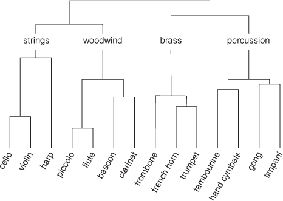

注意到在树状图的底部，每种乐器都由其自己的垂直线表示，在这个层面上，每种乐器都被认为是*位于自己的簇中*。随着我们向上移动层次结构，同一簇中的乐器通过水平线连接。簇合并的这种高度与簇之间的相似性成反比。例如，我（主观上）绘制了这个树状图，以表明短笛和小号之间的相似性比双簧管和长笛之间的相似性更大。

通常，当我们寻找此类数据中的层次结构时，树状图的一端显示每个案例都位于自己的簇中；这些簇向上合并，最终所有案例都被放置在单个簇中。因此，我已经指出了我们的字符串、木管乐器、铜管乐器和打击乐器簇的位置，但我已经继续对这些簇进行聚类，直到只有一个包含所有案例的簇。

因此，层次聚类算法的目的是在数据集中学习这种聚类层次结构。与 k-means 聚类相比，层次聚类的优点在于我们能够获得对数据结构更细致的理解，并且这种方法通常能够重建自然界中的真实层次结构。例如，假设我们测序了所有犬种（所有 DNA）的基因组。我们可以安全地假设一个犬种的基因组将比它所没有衍生的犬种的基因组更相似于它所衍生的犬种的基因组。如果我们对这份数据应用层次聚类，这个层次结构，可以将其可视化为树状图，可以直接解释为显示哪些犬种是从其他犬种衍生的。

层次结构非常有用，但我们如何将树状图划分为有限簇集？嗯，在树状图的任何高度上，我们都可以水平地*切割*树，并取该层的簇数。另一种想象方式是，如果我们切割树状图的一个切片，那么掉落的分支数量就是簇的数量。回顾一下 图 17.1。如果我们切割我在标签处标记的弦乐器、木管乐器、铜管乐器和打击乐器，我们会得到四个单独的簇，案例将被分配到它们所在的这四个簇中。我将在本节的后面部分向您展示如何选择切割点。

| |
| --- |

##### 注意

如果我们更靠近树顶切割，我们会得到更少的簇。如果我们更靠近树底切割，我们会得到更多的簇。

| |
| --- |

好的，我们已经了解了层次聚类算法试图实现的目标。现在让我们谈谈它们是如何实现这一目标的。在尝试学习数据中的层次结构时，我们可以采取两种方法：

+   聚类

+   划分

聚类层次聚类是从每个案例都孤立（且孤独）地位于其自己的簇中开始的，然后按顺序合并簇，直到所有数据都位于单个簇中。划分层次聚类则相反：它从所有案例都位于单个簇开始，并递归地将它们划分为簇，直到每个案例都位于其自己的簇中。

#### 17.1.1\. 聚类层次聚类

在本节中，我将向您展示聚类层次聚类是如何学习数据中的结构的。算法的步骤相当简单：

1.  计算每个簇与其他所有簇之间的某些距离度量（由我们定义）。

1.  将最相似的簇合并成一个簇。

1.  重复步骤 1 和 2，直到所有案例都位于单个簇中。

图 17.2 展示了这种情况的一个例子。我们开始时有九个案例（因此有九个簇）。算法计算每个簇之间的距离度量（稍后将有更多关于此的信息），并将最相似的簇合并。这个过程一直持续到所有案例都被最终的超簇吞噬。

##### 图 17.2\. 聚类层次聚类在每次迭代中将彼此最近的簇合并。椭圆表示每次迭代中簇的形成，从左上角到右下角。

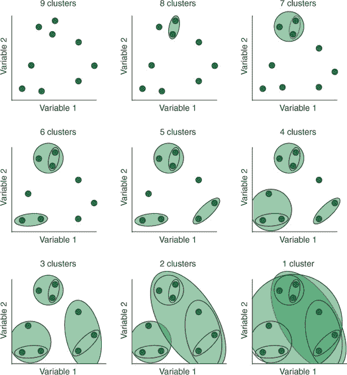

那么，我们如何计算簇之间的距离呢？我们需要做的第一个选择是我们要计算哪种类型的距离。像往常一样，欧几里得距离和曼哈顿距离是最受欢迎的选择。第二个选择是如何计算簇之间的这种距离度量。计算两个案例（两个向量）之间的距离是相当明显的，但一个簇包含多个案例；我们如何计算，比如说，两个簇之间的欧几里得距离？嗯，我们有几种可供选择的方法，称为*链接方法*：

+   质心链接

+   单链接

+   完全链接

+   平均链接

+   沃德方法

这些链接方法在图 17.3 中均有说明。质心链接计算每个簇质心与每个其他簇质心之间的距离（例如，欧几里得距离或曼哈顿距离）。单链接取两个簇中最近案例之间的距离作为这些簇之间的距离。完全链接取两个簇中最远案例之间的距离作为这些簇之间的距离。平均链接取两个簇中所有案例之间的平均距离作为这些簇之间的距离。

##### 图 17.3. 定义簇之间距离的不同链接方法。质心链接计算簇质心之间的距离。单链接计算簇之间的最小距离。完全链接计算簇之间的最大距离。平均链接计算两个簇中案例之间的所有成对距离并找到平均值。沃德方法计算每个候选合并的簇内平方和，并选择具有最小值的那个。

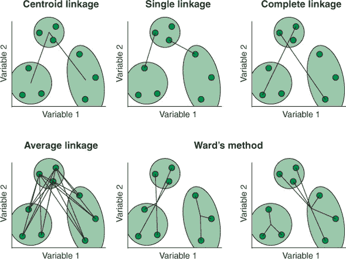

沃德方法稍微复杂一些。对于每个可能的簇组合，沃德方法（有时称为沃德最小方差方法）计算簇内的平方和。请查看图 17.3 中沃德方法的示例。算法有三个簇需要考虑合并。对于每个候选合并，算法计算每个案例与其簇质心之间的平方差之和，然后将这些平方和相加。在每一步选择导致最小平方差之和的候选合并。

#### 17.1.2. 分层聚类

在本节中，我将向您展示分层聚类是如何工作的。与聚合聚类不同，分层聚类从单个簇中的所有案例开始，并递归地将这些案例划分为越来越小的簇，直到每个案例都位于自己的簇中。在聚类的每个阶段找到最佳分割是一个困难的任务，因此分层聚类使用启发式方法。

在聚类的每个阶段，选择具有最大 *直径* 的集群。回想一下图 16.5，集群的直径是集群内任何两个案例之间的最大距离。然后算法找到这个集群中与集群内所有其他案例的平均距离最大的案例。这个最不相似的案例开始其自己的 *分裂小组*（就像一个没有原因的叛逆者）。然后算法遍历集群中的每个案例，根据它们与哪个集群最相似将案例分配到分裂小组或原始集群。本质上，分裂聚类在每个层次级别应用 k-means 聚类（其中 *k* = 2），以分割每个集群。这个过程重复进行，直到所有案例都位于自己的集群中。

分裂聚类只有一个实现：DIANA（DIvisive ANAlysis）算法。凝聚聚类比 DIANA 算法更常用，并且计算成本更低。然而，在层次聚类早期犯下的错误无法在树的下层得到修正；因此，虽然凝聚聚类可能在发现小集群方面做得更好，但 DIANA 在发现大集群方面可能做得更好。在本章的其余部分，我将向您介绍如何在 R 中执行凝聚聚类，但其中一项练习是重复使用 DIANA 进行聚类，并比较结果。

### 17.2. 构建您的第一个凝聚层次聚类模型

在本节中，我将向您展示如何在 R 中构建一个凝聚层次聚类模型。遗憾的是，mlr 包并没有对层次聚类进行封装的实现，因此我们将使用内置的 stats 包中的 `hclust()` 函数。

我们将要使用的 `hclust()` 函数执行凝聚层次聚类时，期望输入的是一个 *距离矩阵*，而不是原始数据。距离矩阵包含了每个元素组合之间的成对距离。这种距离可以是任何我们指定的距离度量，在这种情况下，我们将使用欧几里得距离。由于计算案例之间的距离是层次聚类的第一步，您可能会期望 `hclust()` 为我们完成这项工作。但这个创建我们自己的距离度量并将其提供给 `hclust()` 的两步过程确实给了我们使用各种距离度量的灵活性。

我们在 R 中使用 `dist()` 函数创建距离矩阵，将我们想要计算距离的数据作为第一个参数提供，以及我们想要使用的距离类型。请注意，我们正在使用我们的缩放数据集，因为层次聚类对变量之间的尺度差异也很敏感（任何依赖于连续变量之间距离的算法也是如此）：

```
gvhdDist <- dist(gvhdScaled, method = "euclidean")
```

| |
| --- |

##### 小贴士

如果你想更直观地了解距离矩阵的样子，运行`dist(c(4, 7, 11, 30, 16))`。*不要*尝试打印本节中创建的距离矩阵——它包含超过 2.3 × 10⁷个元素！


现在我们有了距离矩阵，我们可以运行算法来学习数据中的层次结构。`hclust()`函数的第一个参数是距离矩阵，`method`参数允许我们指定我们希望用来定义聚类之间距离的链接方法。可用的选项有`"ward.D"`、`"ward.D2"`、`"single"`、`"complete"`、`"average"`、`"centroid"`以及一些不太常用的选项，我没有定义（如果你对这些选项感兴趣，请参阅`?hclust`）。注意，对于 Ward 方法似乎有两个选项：选项`"ward.D2"`是 Ward 方法的正确实现，如我之前所述。在这个例子中，我们将首先使用 Ward 方法（`"ward.D2"`），但我会在本章的练习中让你比较这个结果与其他方法：

```
gvhdHclust <- hclust(gvhdDist, method = "ward.D2")
```

现在`hclust()`已经学习了数据的层次聚类结构，让我们用树状图来表示这一点。我们可以通过简单地调用聚类模型对象的`plot()`方法来实现这一点，但如果我们首先将我们的模型转换为树状图对象并绘制它，树会显得更清晰。我们可以使用`as.dendrogram()`函数将我们的聚类模型转换为树状图对象。要绘制树状图，我们将它传递给`plot()`函数。默认情况下，图表将为原始数据中的每个案例绘制一个标签。由于我们的数据集很大，让我们使用`leaflab = "none"`参数来抑制这些标签。

##### 列表 17.1. 绘制树状图

```
gvhdDend <- as.dendrogram(gvhdHclust)

plot(gvhdDend, leaflab = "none")
```

生成的图表显示在图 17.4 中。这里的 y 轴表示基于我们使用的链接方法（和距离度量）的聚类之间的距离。因为我们使用了 Ward 方法，这个轴的值是聚类内的平方和。当两个聚类合并在一起时，它们通过一条水平线连接，这条线在 y 轴上的位置对应于这些聚类之间的距离。因此，在树的下部合并的案例聚类（在聚合聚类中较早）比在树上部合并的聚类更相似。x 轴上案例的顺序被优化，以便相似的案例被绘制在一起，以帮助解释（否则，分支会交叉）。正如我们所看到的，树状图递归地合并聚类，从每个案例都在自己的聚类到所有案例都属于一个超聚类。

##### 图 17.4. 表示我们层次聚类模型的树状图。y 轴表示案例之间的距离。水平线表示案例/聚类合并的位置。合并得越高，聚类之间的相似度越低。

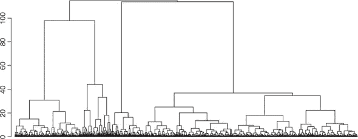


**练习 1**

重复聚类过程，但这次在创建距离矩阵时指定`method = "manhattan"`（不要覆盖任何现有对象）。绘制簇层次结构的树状图，并将其与我们使用欧几里得距离得到的树状图进行比较。

| |
| --- |

层次聚类算法已经完成了它的任务：它已经学会了层次结构，而我们如何使用它取决于我们自己。我们可能想直接解释树的结构，从而对自然界中可能存在的层次结构做出一些推断，尽管在我们（大型）数据集中，这可能相当具有挑战性。

层次聚类的另一种常见用途是对热图的行和列进行排序，例如，用于基因表达数据。使用层次聚类对热图的行和列进行排序有助于研究人员同时识别基因簇和患者簇。

最后，我们的主要动机可能是识别数据集中对我们最有兴趣的有限数量的簇。这就是我们将如何处理我们的聚类结果。

#### 17.2.1\. 选择簇的数量

在本节中，我将向您展示如何从层次结构中提取多少个簇的方法。另一种思考方式是我们正在决定使用层次结构的哪个级别进行聚类。

为了在层次聚类后定义有限数量的簇，我们需要在我们的树状图上定义一个切割点。如果我们接近树顶进行切割，我们将得到较少的簇；如果我们接近树底进行切割，我们将得到更多的簇。那么我们如何选择一个切割点呢？嗯，我们的朋友戴维斯-鲍尔丁指数、邓恩指数和伪 F 统计量可以在这里帮助我们。对于 k-means 聚类，我们执行了一个类似于交叉验证的程序来估计不同簇数量的性能。遗憾的是，我们无法使用这种方法进行层次聚类，因为与 k-means 不同，层次聚类*不能预测新案例的簇成员资格*。

| |
| --- |

##### 注意

层次聚类算法本身不能预测新案例的簇成员资格，但你可以*尝试*将新数据分配到最近的质心所在的簇。你可以使用这种方法来创建单独的训练集和测试集，以评估内部簇度量。

| |
| --- |

相反，我们可以利用自助法。回想一下第八章，自助法是从自助样本中抽取样本，对每个样本应用一些计算，并返回一个统计量（s）。我们自助统计量的平均值告诉我们最可能的价值，而分布则给我们提供了关于统计量（s）稳定性的指示。

| |
| --- |

##### 注意

记住，为了获得自助样本，我们随机从数据集中选择案例，有放回地，以创建一个与旧样本相同大小的新的样本。有放回地采样简单地说就是，一旦我们采样了一个特定的案例，我们就将其放回，这样它就有可能再次被抽取。

| |
| --- |

在层次聚类的背景下，我们可以使用自助法从我们的数据生成多个样本，并为每个样本生成一个单独的层次结构。然后，我们可以从每个层次结构中选择一系列聚类数量，并计算每个的内部聚类度量。使用自助法的优点是，在完整数据集上计算内部聚类度量并不给我们提供估计稳定性的指示，而自助样本则可以。聚类度量的自助样本将围绕其平均值有一些变化，因此我们可以选择具有最优化和最稳定度量的聚类数量。

首先，我们定义一个自己的函数，该函数接受我们的数据和包含聚类成员资格向量的向量，并返回数据的三种熟悉的内部聚类度量：戴维斯-博尔丁指数、邓恩指数和伪 F 统计量。因为我们使用的函数来计算邓恩指数期望一个距离矩阵，所以我们在函数中包含一个额外的参数，我们将提供一个预先计算的距离矩阵。

##### 列表 17.2\. 定义`cluster_metrics`函数

```
cluster_metrics <- function(data, clusters, dist_matrix) {
  list(db       = clusterSim::index.DB(data, clusters)$DB,
       G1       = clusterSim::index.G1(data, clusters),
       dunn     = clValid::dunn(dist_matrix, clusters),
       clusters = length(unique(clusters))
  )
}
```

跟随我一起查看函数的主体，这样我们就能理解我们在做什么。我们使用`function()`参数来定义一个函数，将其分配给名称`cluster_metrics`（这将允许我们使用`cluster_metrics()`调用该函数）。我们为函数定义了三个强制参数：

+   `data`，我们将传递我们正在聚类的数据

+   `clusters`，一个包含`data`中每个案例聚类成员资格的向量

+   `dist_matrix`，我们将传递`data`的预计算距离矩阵

函数的主体（告诉函数做什么的指令）定义在花括号`{}`内。我们的函数将返回一个包含四个元素的列表：戴维斯-博尔丁指数（`db`）、伪 F 统计量（`G1`）、邓恩指数（`dunn`）和聚类数量。我们不是从头开始定义它们，而是使用来自其他包的预定义函数来计算内部聚类度量。戴维斯-博尔丁指数是通过 clusterSim 包中的`index.DB()`函数计算的，它接受`data`和`clusters`参数（统计量本身包含在`$DB`组件中）。伪 F 统计量是通过 clusterSim 包中的`index.G1()`函数计算的，它接受与`index.DB()`相同的参数。邓恩指数是通过 clValid 包中的`dunn()`函数计算的，它接受`dist_matrix`和`clusters`参数。

我们定义这个函数的动机是，我们将从我们的数据集中抽取自助样本，学习每个样本中的层次结构，从每个样本中选择一系列聚类数量，并使用我们的函数来计算每个自助样本中每个聚类数量的这三个指标。所以现在，让我们创建我们的自助样本。我们将从我们的 `gvhdScaled` 数据集中创建 10 个自助样本。我们使用 `map()` 函数重复抽样过程 10 次，以返回一个列表，其中每个元素都是不同的自助样本。

##### 列表 17.3\. 创建自助样本

```
gvhdBoot <- map(1:10, ~ {
  gvhdScaled %>%
    as_tibble() %>%
    sample_n(size = nrow(.), replace = TRUE)
})
```

| |
| --- |

##### 备注

记住，`~` 只是 `function()` 的简称。

| |
| --- |

我们正在使用 dplyr 包中的 `sample_n()` 函数来创建样本。这个函数可以从数据集中随机抽取行。因为这个函数无法处理矩阵，我们首先需要将我们的 `gvhdScaled` 数据通过 `as_tibble()` 函数进行管道处理。通过设置参数 `size = nrow(.)`，我们要求 `sample_n()` 随机抽取与原始数据集行数相等的案例数量（`.` 是“被管道传输的数据集”的简称）。通过将 `replace` 参数设置为 `TRUE`，我们告诉函数进行有放回的抽样。创建简单的自助样本实际上就像这样简单！

现在，让我们使用我们的 `cluster_metrics()` 函数来计算我们刚刚生成的每个自助样本的三个内部指标，对于一系列的聚类数量。看看下面的列表，不要眯着眼睛！我会一步一步地带你通过这段代码。

##### 列表 17.4\. 计算聚类模型的性能指标

```
metricsTib <- map_df(gvhdBoot, function(boot) {
  d <- dist(boot, method = "euclidean")
  cl <- hclust(d, method = "ward.D2")

  map_df(3:8, function(k) {
    cut <- cutree(cl, k = k)
    cluster_metrics(boot, clusters = cut, dist_matrix = d)
  })
})
```

| |
| --- |

##### 小贴士

`map_df()` 函数就像 `map()`，但它不是返回一个列表，而是将每个元素按行组合起来返回一个数据框。

| |
| --- |

我们首先调用 `map_df()` 函数，这样我们就可以将一个函数应用到我们的自助样本列表中的每个元素上。我们定义一个匿名函数，它只接受 `boot`（当前正在考虑的元素）作为其唯一参数。

对于 `gvhdBoot` 中的每个元素，匿名函数计算其欧几里得距离矩阵，将其存储为对象 `d`，并使用该矩阵和 Ward 方法进行层次聚类。一旦我们有了每个自助样本的层次结构，我们就使用另一个 `map_df()` 函数调用来在三个和八个聚类之间选择，然后将数据分割成这些聚类，并在每个结果上计算三个内部聚类方法。我们将使用这个过程来查看在三个和八个之间哪个数量的聚类给出了最佳的内部聚类指标值。

使用`cutree()`函数从层次聚类模型中选择要保留的簇数量。我们使用这个函数在返回簇数量的地方切割我们的树状图。我们可以通过指定一个切割的高度，使用`h`参数，或者通过指定要保留的特定簇数量，使用`k`参数（如这里所示）来完成这个操作。第一个参数是调用`hclust()`函数的结果。`cutree()`函数的输出是一个向量，表示分配给数据集中每个案例的簇编号。一旦我们有了这个向量，我们就可以调用我们的`cluster_metrics()`函数，提供 bootstrap 数据，簇成员资格的向量，以及距离矩阵。


##### 警告

这在我的机器上运行了近 3 分钟！


如果你对我们刚才所做的不太清楚，请打印`metricsTib` tibble 以查看输出。我们有一个 tibble，其中每列对应一个内部簇指标，还有一个列表示计算这些指标的簇数量。

让我们绘制我们的 bootstrap 实验的结果。我们将为每个内部簇指标创建一个单独的子图（使用分面）。每个子图将显示 x 轴上的簇数量，y 轴上的内部簇指标值，每个单独的 bootstrap 样本的线条，以及连接所有 bootstrap 均值值的线条。

##### 列表 17.5\. 转换数据，准备绘图

```
metricsTib <- metricsTib %>%
  mutate(bootstrap = factor(rep(1:10, each = 6))) %>%
  gather(key = "Metric", value = "Value", -clusters, -bootstrap)
```

我们首先需要创建一个新列，表示每个案例所属的 bootstrap 样本。由于有 10 个 bootstrap 样本，每个样本针对 6 个不同的簇数量进行评估（3 到 8），我们通过使用`rep()`函数重复 1 到 10 的每个数字六次来创建这个变量。我们将这个变量包裹在`factor()`函数中，以确保在绘图时它不被视为连续变量。接下来，我们收集数据，使得内部指标的选择包含在单个列中，而该指标的价值保持在另一个列中。我们指定`-clusters`和`-bootstrap`来告诉函数不要收集这些变量。打印这个新的 tibble，并确保你理解我们是如何到达这里的。

现在我们数据已经以这种格式，我们可以创建图表。

##### 列表 17.6\. 计算指标

```
ggplot(metricsTib, aes(as.factor(clusters), Value)) +
  facet_wrap(~ Metric, scales = "free_y") +
  geom_line(size = 0.1, aes(group = bootstrap)) +
  geom_line(stat = "summary", fun.y = "mean", aes(group = 1)) +
  stat_summary(fun.data="mean_cl_boot",
               geom="crossbar", width = 0.5, fill = "white") +
  theme_bw()
```

我们将簇数量（作为一个因子）映射到 x 美学，将内部簇指标的值映射到 y 美学。我们添加一个`facet_wrap()`层，通过内部簇指标进行分面，设置`scales = "free_y"`参数，因为指标处于不同的尺度。接下来，我们添加一个`geom_line()`层，使用`size`参数使这些线条不那么突出，并将 bootstrap 样本编号映射到 group 美学。因此，这个层将为每个 bootstrap 样本绘制一条单独的细线。


##### 提示

注意，当你指定 `ggplot()` 函数层内的美学映射时，该映射会被所有使用该美学的附加层继承。然而，你可以在每个 geom 函数内部使用 `aes()` 函数指定美学映射，并且映射只会应用于该层。


我们接着添加另一个 `geom_line()` 层，该层将连接所有自助样本的均值。默认情况下，`geom_line()` 函数喜欢连接单个值。如果我们想让函数连接一个汇总统计量（如均值），我们需要指定 `stat = "summary"` 参数，然后使用 `fun.y` 参数告诉函数我们想要绘制哪个汇总统计量。在这里，我们使用了 `"mean"`，但你也可以提供任何返回输入 `y` 的单个值的函数名称。

最后，可视化自助样本的 95%置信区间会很好。95%置信区间告诉我们，如果我们重复进行这个实验 100 次，预期有 95 个构建的置信区间将包含该指标的真正值。自助样本之间的估计越一致，置信区间就越小。我们想要使用灵活的 `stat_summary()` 函数来可视化置信区间。这个函数可以以许多不同的方式可视化多个汇总统计量。为了绘制均值 ± 95% 置信区间，我们使用 `fun.data` 参数指定我们想要 `"mean_cl_boot"`。这将绘制自助置信区间（默认为 95%）。


##### 注意

另一个选项是使用 `"mean_cl_normal"` 来构建置信区间，但这假设数据是正态分布的，这可能并不正确。


现在我们已经定义了我们的汇总统计量，让我们指定我们将使用 `geom` 参数来表示它们的几何形状。`"crossbar"` 几何形状绘制看起来像箱线图的箱体部分，其中通过我们指定的中心趋势度量（在这种情况下是均值）绘制一条实线，箱体的上下限延伸到我们请求的分散度度量范围（在这种情况下是 95%置信限）。然后，根据我的偏好，我们将交叉条的宽度设置为 0.5，填充颜色设置为白色。

生成的图示显示在 图 17.5 中。花点时间欣赏一下我们刚刚投入大量努力后的结果是多么美丽。回顾 列表 17.6 确保你理解了我们是如何创建这个图的（`stat_summary()` 可能是最令人困惑的部分）。看起来导致最小的平均戴维斯-博尔丁指数和最大的平均邓恩指数以及平均伪 F 统计量的聚类数量是四个。看看代表每个单独自助聚类的细线，你能看出其中一些可能使我们得出不同数量的聚类是最佳选择的结论吗？这就是为什么对这些度量进行自助比仅使用单个数据集计算每个度量一次更好。

##### 图 17.5\. 绘制我们的自助实验的结果。每个子图显示了不同内部聚类度量的结果。x 轴显示聚类编号，y 轴显示每个度量的值。淡线连接每个单独的自助样本的结果，而粗线连接平均值。每个十字线的顶部和底部表示该特定值的 95% 置信区间，水平线表示平均值。


| |
| --- |

**练习 2**

让我们尝试另一种可视化这些结果的方法。从以下使用 dplyr 的操作开始（将每个步骤管道输入到下一个）：

1.  按 `Metric` 对 `metricsTib` 对象进行分组。

1.  使用 `mutate()` 将 `Value` 变量替换为 `scale(Value)`。

1.  按 `Metric` 和 `clusters` 进行分组。

1.  创建一个新列 `Stdev`，等于 `sd(Value)`。

然后，将这个 tibble 管道输入到 `ggplot()` 调用中，并使用以下美学映射：

+   `x = clusters`

+   `y = Metric`

+   `fill = Value`

+   `height = Stdev`

最后，添加一个 `geom_tile()` 层。回顾一下你的代码，确保你理解了如何创建这个图以及如何解释它。

| |
| --- |

#### 17.2.2\. 剪切树以选择一组平坦的聚类

在本节中，我将向你展示我们如何最终剪切树状图以返回我们所需数量的聚类标签。我们的自助实验使我们得出结论，四个是我们用 GvHD 数据集表示结构的最佳聚类数量。为了提取表示这四个聚类的聚类成员资格向量，我们使用 `cutree()` 函数，提供我们的聚类模型和 `k`（我们想要返回的聚类数量）。我们可以通过像以前一样绘制树状图并调用 `rect.hclust()` 函数来使用与 `cutree()` 相同的参数来可视化我们的树状图是如何被切割以生成这四个聚类的。

##### 列表 17.7\. 剪切树

```
gvhdCut <- cutree(gvhdHclust, k = 4)

plot(gvhdDend, leaflab = "none")

rect.hclust(gvhdHclust, k = 4)
```

这个函数在现有的树状图上绘制矩形，以显示哪些分支被剪切以产生我们指定的聚类数量。生成的图示显示在 图 17.6 中。

##### 图 17.6\. 与图 17.4 相同的图表，但这次用矩形表示通过切割树得到的聚类


接下来，让我们使用 `ggpairs()` 来绘制聚类，就像我们在第十六章中为我们的 k-means 模型所做的那样，第十六章。

##### 列表 17.8\. 绘制聚类

```
gvhdTib <- mutate(gvhdTib, hclustCluster = as.factor(gvhdCut))

 ggpairs(gvhdTib, aes(col = hclustCluster),
        upper = list(continuous = "density"),
        lower = list(continuous = wrap("points", size = 0.5))) +
  theme_bw()
```

##### 图 17.7\. `ggpairs()` 图显示我们的层次聚类模型的结果。将这些聚类与图 16.8 中通过 k-means 得到的聚类进行比较。

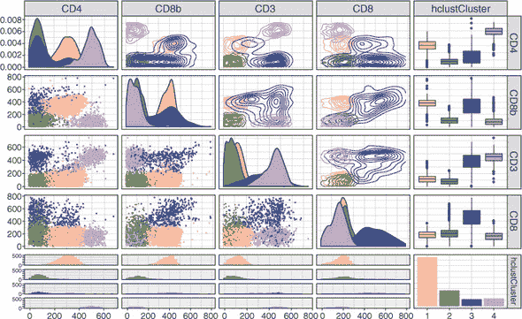

结果图显示在图 17.7 中。将这些聚类与我们在图 16.8 中得到的 k-means 模型返回的聚类进行比较。两种方法都产生了相似的聚类成员资格，而且我们的层次聚类得到的聚类似乎也低估了聚类 3。

### 17.3\. 我们的聚类有多稳定？

在本节中，我将向您展示一个评估我们的聚类模型性能的更多工具。除了在 bootstrap 实验中计算每个 bootstrap 样本的内部聚类度量外，我们还可以量化聚类成员资格在 bootstrap 样本之间的一致性。这种一致性被称为聚类*稳定性*。量化聚类稳定性的常见方法是通过一个称为*Jaccard 指数*的相似性度量（以发表它的植物学教授命名）。

Jaccard 指数量化了两个离散变量集合之间的相似性。它的值可以解释为两个集合中存在的总值的百分比，其范围从 0%（没有共同值）到 100%（两个集合都有的所有值）。Jaccard 指数在方程 17.1 中定义。

##### 方程 17.1\.

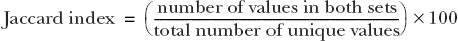

例如，如果我们有两个集合

a = {3, 3, 5, 2, 8}

b = {1, 3, 5, 6}

那么，Jaccard 指数是

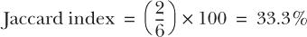

如果我们在多个 bootstrap 样本上进行聚类，我们可以计算“原始”聚类（所有数据的聚类）与每个 bootstrap 样本之间的 Jaccard 指数，并取平均值。如果平均 Jaccard 指数低，那么聚类成员资格在 bootstrap 样本之间变化很大，这表明我们的聚类结果是*不稳定的*，可能无法很好地推广。如果平均 Jaccard 指数高，那么聚类成员资格变化很小，这表明聚类结果是稳定的。

幸运的是，fpc 包中的 `clusterboot()` 函数已经被编写来执行这项操作！让我们首先将 fpc 包加载到我们的 R 会话中。因为 `clusterboot()` 作为副作用产生了一系列基础 R 图表，让我们将绘图设备分成三行四列，以便容纳输出，使用 `par(mfrow = c(3, 4))`。

##### 列表 17.9\. 使用 `clusterboot()` 计算 Jaccard 指数

```
library(fpc)

par(mfrow = c(3, 4))

clustBoot <- clusterboot(gvhdDist, B = 10,
                         clustermethod = disthclustCBI,
                         k = 4, cut = "number", method = "ward.D2",
                         showplots = TRUE)

clustBoot

Number of resampling runs:  10

Number of clusters found in data:  4

 Clusterwise Jaccard bootstrap (omitting multiple points) mean:
[1] 0.9728 0.9208 0.8348 0.9624
```

`clusterboot()`函数的第一个参数是数据。该参数将接受原始数据或类`dist`的距离矩阵（它将适当地处理任一）。`B`参数是我们希望计算的自助样本数量，我将其设置为 10 以减少运行时间。`clustermethod`参数是我们指定希望构建哪种聚类模型的地方（有关可用方法的列表，请参阅`?clusterboot`；包括了许多常见方法）。对于层次聚类，我们将此参数设置为`disthclustCBI`。`k`参数指定我们想要返回的聚类数量，`method`允许我们指定用于聚类的距离度量，而`showplots`给我们提供了抑制打印图的机会。该函数可能需要几分钟才能运行。

我已经截断了`clusterboot()`函数输出的结果，以显示最重要的信息：聚类层面的 Jaccard 自助样本均值。这四个值是每个聚类，原始聚类和每个自助样本之间的平均 Jaccard 指数。我们可以看到，所有四个聚类在不同自助样本中都有良好的一致性（> 83%），这表明聚类具有较高的稳定性。

结果图示在图 17.8 中展示。第一个（左上角）和最后一个（右下角）图展示了原始、完整数据集上的聚类。在这两个图之间的每个图展示了不同自助样本上的聚类。这种图示是图形化评估聚类稳定性的有用方式。

##### 图 17.8. `clusterboot()`函数的图形输出。第一和最后一个图展示了完整、原始的数据聚类，而中间的图展示了自助样本上的聚类。每个案例的聚类成员资格由一个数字表示。注意聚类的相对高稳定性。

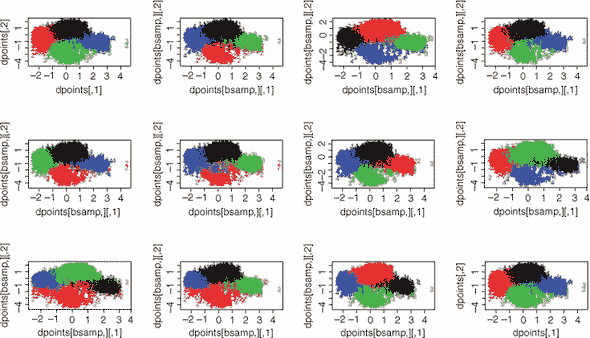

### 17.4. 层次聚类的优缺点

虽然通常不容易判断哪种算法会对特定任务表现良好，但以下是一些优势和劣势，这将帮助您决定层次聚类是否适合您。

层次聚类的优势如下：

+   它学习到的层次结构本身可能很有趣且可解释。

+   它的实现相当简单。

层次聚类的劣势如下：

+   它无法原生地处理分类变量。这是因为在一个分类特征空间上计算欧几里得距离是没有意义的。

+   它无法选择“平坦”聚类的最佳数量。

+   它对不同尺度的数据敏感。

+   它无法预测新数据的聚类成员资格。

+   一旦案例被分配到某个聚类，它们就不能再移动。

+   对于大数据集，它可能会变得计算成本高昂。

+   它对异常值敏感。

| |
| --- |

**练习 3**

使用 `clusterboot()` 函数对 k-means 聚类（四个簇）的 Jaccard 指数进行自助法，就像我们对层次聚类所做的那样。这次，`clustermethod` 应该等于 `kmeansCBI`（使用 k-means），并且你应该将 `method` 参数替换为 `algorithm = "Lloyd"`。哪种方法会导致更稳定的簇：k-means 还是层次聚类？

| |
| --- |
| |

**练习 4**

使用聚类包中的 `diana()` 函数对 GvHD 数据进行分裂层次聚类。将输出保存为对象，并通过传递给 `as.dendrogram()` %>% `plot()` 来绘制树状图。将其与聚合层次聚类的树状图进行比较。警告：在我的机器上这几乎花了 15 分钟！

| |
| --- |
| |

**练习 5**

使用聚合层次聚类重复我们的自助法实验，但这次将簇的数量固定为四个，并在每个自助法上比较不同的链接方法。哪种链接方法表现最好？

| |
| --- |
| |

**练习 6**

使用 `hclust()` 重新聚类数据，使用 练习 5 中指示的最佳链接方法。使用 `ggpairs()` 绘制这些簇，并将它们与我们使用 Ward 方法生成的簇进行比较。这种新的链接方法在发现簇方面做得好吗？

| |
| --- |

### 摘要

+   层次聚类使用案例之间的距离来学习簇的层次结构。

+   这些距离是如何计算的由我们选择的链接方法控制。

+   层次聚类可以是自下而上（聚合）或自上而下（分裂）。

+   通过在特定高度“切割”树状图，可以从层次聚类模型中返回一个平面的簇集。

+   通过在自助样本上进行聚类并使用 Jaccard 指数量化样本之间簇成员资格的一致性来衡量聚类稳定性。

### 练习题的解答

1.  使用曼哈顿距离创建层次聚类模型，绘制树状图，并进行比较：

    ```
    gvhdDistMan <- dist(gvhdScaled, method = "manhattan")

    gvhdHclustMan <- hclust(gvhdDistMan, method = "ward.D2")

    gvhdDendMan <- as.dendrogram(gvhdHclustMan)

    plot(gvhdDendMan, leaflab = "none")
    ```

1.  以另一种方式绘制自助法实验：

    ```
    group_by(metricsTib, Metric) %>%
      mutate(Value = scale(Value)) %>%
      group_by(Metric, clusters) %>%
      mutate(Stdev = sd(Value)) %>%

      ggplot(aes(as.factor(clusters), Metric, fill = Value, height = Stdev)) +
      geom_tile() +
      theme_bw() +
      theme(panel.grid = element_blank())
    ```

1.  使用 `clusterboot()` 评估 k-means 模型的稳定性：

    ```
    par(mfrow = c(3, 4))

    clustBoot <- clusterboot(gvhdScaled,
                             B = 10,

                             clustermethod = kmeansCBI,
                             k = 4, algorithm = "Lloyd",
                             showplots = TRUE)

    clustBoot

    # k-means seems to give more stable clusters.
    ```

1.  使用 `diana()` 函数对数据进行聚类：

    ```
    library(cluster)

    gvhdDiana <- as_tibble(gvhdScaled) %>% diana()

    as.dendrogram(gvhdDiana) %>% plot(leaflab = "none")
    ```

1.  重复自助法实验，比较不同的链接方法：

    ```
    cluster_metrics <- function(data, clusters, dist_matrix, linkage) {
      list(db   = clusterSim::index.DB(data, clusters)$DB,
           G1   = clusterSim::index.G1(data, clusters),
           dunn = clValid::dunn(dist_matrix, clusters),
           clusters = length(unique(clusters)),
           linkage = linkage
      )
    }

    metricsTib <- map_df(gvhdBoot, function(boot) {
      d <- dist(boot, method = "euclidean")
      linkage <- c("ward.D2", "single", "complete", "average", "centroid")

      map_df(linkage, function(linkage) {
        cl <- hclust(d, method = linkage)
        cut <- cutree(cl, k = 4)
        cluster_metrics(boot, clusters = cut, dist_matrix = d, linkage)
      })
    })

    metricsTib

    metricsTib <- metricsTib %>%
      mutate(bootstrap = factor(rep(1:10, each = 5))) %>%
      gather(key = "Metric", value = "Value", -clusters, -bootstrap, -linkage)

    ggplot(metricsTib, aes(linkage, Value)) +
      facet_wrap(~ Metric, scales = "free_y") +
      geom_line(size = 0.1, aes(group = bootstrap)) +
      geom_line(stat = "summary", fun.y = "mean", aes(group = 1)) +
      stat_summary(fun.data="mean_cl_boot",
                   geom="crossbar", width = 0.5, fill = "white") +
      theme_bw()

    # Single linkage seems the best, indicated by DB and Dunn,
    # though pseudo F disagrees.
    ```

1.  使用 练习 5 中的获胜链接方法对数据进行聚类：

    ```
    gvhdHclustSingle <- hclust(gvhdDist, method = "single")

    gvhdCutSingle <- cutree(gvhdHclustSingle, k = 4)

    gvhdTib <- mutate(gvhdTib, gvhdCutSingle = as.factor(gvhdCutSingle))

    select(gvhdTib, -hclustCluster) %>%
      ggpairs(aes(col = gvhdCutSingle),
              upper = list(continuous = "density"),
              lower = list(continuous = wrap("points", size = 0.5))) +
      theme_bw()

    # Using single linkage on this dataset does a terrible job of finding
    # clusters! This is why visual evaluation of clusters is important:
    # don't blindly rely on internal metrics only!
    ```

## 第十八章\. 基于密度的聚类：DBSCAN 和 OPTICS

*本章涵盖*

+   理解基于密度的聚类

+   使用 DBSCAN 和 OPTICS 算法

无监督学习技术的最后一站带我们来到了基于密度的聚类。基于密度的聚类算法旨在实现与 k-means 和层次聚类相同的目标：将数据集划分为有限个簇，揭示数据中的分组结构。

在最后两章中，我们看到了 k-means 和层次聚类是如何使用距离来识别聚类的：案例之间的距离，以及案例与其质心之间的距离。基于密度的聚类包括一系列算法，正如其名称所示，它使用案例的*密度*来分配聚类成员资格。有多种测量密度的方法，但我们可以将其定义为特征空间单位体积中的案例数量。特征空间中包含许多紧密排列的案例的区域可以被认为是高密度区域，而特征空间中包含少量或没有案例的区域可以被认为是低密度区域。我们的直觉表明，数据集中的不同聚类将由高密度区域表示，这些区域由低密度区域分隔。基于密度的聚类算法试图学习这些独特的高密度区域并将它们划分为聚类。基于密度的聚类算法具有一些很好的特性，可以克服 k-means 和层次聚类的某些局限性。

在本章结束时，我希望你能对两种最常用的基于密度的聚类算法的工作原理有一个牢固的理解：DBSCAN 和 OPTICS。我们还将应用你在前几章中学到的技能，帮助我们评估和比较不同聚类模型的表现。

### 18.1. 什么是基于密度的聚类？

在本节中，我将向你展示两种最常用的基于密度的聚类算法是如何工作的：

+   基于噪声的密度聚类（DBSCAN）

+   使用点排序来识别聚类结构（OPTICS）

除了名字看起来像是精心设计以形成有趣的缩写外，DBSCAN 和 OPTICS 都在数据集中学习高密度区域，这些区域由低密度区域分隔。它们以相似但略有不同的方式实现这一点，但两者都比 k-means 和层次聚类有一些优势：

+   它们不倾向于寻找球形聚类，实际上可以找到形状各异且复杂的聚类。

+   它们不倾向于寻找等直径的聚类，并且可以在同一数据集中识别非常宽和非常紧密的聚类。

+   它们在聚类算法中似乎是独一无二的，因为那些不足以形成高密度区域的情况被放入一个单独的“噪声”聚类中。这通常是一个理想的属性，因为它有助于防止数据过拟合，并允许我们专注于证据更强的聚类案例。

| |
| --- |

##### 小贴士

如果将案例分为噪声聚类对于你的应用来说不是理想的（但使用 DBSCAN 或 OPTICS 是），你可以使用一种启发式方法，例如根据它们最近的聚类质心对噪声点进行分类，或者将它们添加到它们的 k 个最近邻的聚类中。

| |
| --- |

这三个优点都可以在图 18.1 中看到。三个子图分别展示了相同的数据，使用 DBSCAN、k-means（Hartigan-Wong 算法）或层次聚类（完全连接）进行聚类。这个数据集确实很奇怪，你可能认为不太可能遇到类似的真实世界数据，但它说明了基于密度的聚类相对于 k-means 和层次聚类的优势。数据中的聚类形状和直径非常不同（当然不是球形的）。虽然 k-means 和层次聚类学习到的聚类将真实聚类分割和合并，但 DBSCAN 能够忠实地找到每个形状作为独立的聚类。此外，请注意，k-means 和层次聚类将每个案例都放入一个聚类中。DBSCAN 创建了一个名为“0”的聚类，将任何它认为是噪声的案例放入其中。在这种情况下，所有那些几何形状的聚类之外的案例都被放入噪声聚类中。然而，如果你仔细观察，你可能会注意到数据中有一个正弦波，而这三个算法都没有将其识别为聚类。

##### 图 18.1\. 一个具有挑战性的聚类问题。每个面展示的数据集包含形状和直径各不相同、可能被认为是噪声的案例的聚类。三个子图展示了使用 DBSCAN、层次聚类（完全连接）和 k-means（Hartigan-Wong）进行聚类的数据。在这三个算法中，只有 DBSCAN 能够忠实地将这些形状表示为独立的聚类。

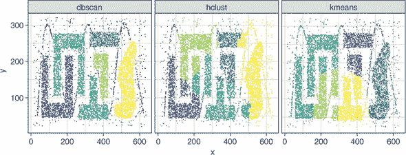

那么基于密度的聚类算法是如何工作的呢？DBSCAN 算法相对容易理解，所以我们将从它开始，并在此基础上理解 OPTICS。

#### 18.1.1\. DBSCAN 算法是如何学习的？

在本节中，我将向您展示 DBSCAN 算法是如何在数据中学习高密度区域以识别聚类的。为了理解 DBSCAN 算法，您首先需要了解它的两个超参数：

+   *epsilon*（ϵ）

+   *minPts*

算法首先在数据中选择一个案例，并在搜索半径内寻找其他案例。这个半径是*epsilon*超参数。所以*epsilon*就是算法在点周围搜索其他案例的距离（在一个*n*-维球体中）。Epsilon 以特征空间的单位表示，默认情况下是欧几里得距离。更大的值意味着算法将搜索距离每个案例更远的地方。

*minPts*超参数指定了一个聚类必须拥有的最小点数（案例），以便它被视为一个聚类。因此，*minPts*超参数是一个整数。如果一个特定的案例在其*epsilon*半径内（包括自身）至少有*minPts*个案例，那么这个案例被认为是*核心点*。

让我们一起通过查看 图 18.2 来了解 DBSCAN 算法。算法的第一步是从数据集中随机选择一个案例。算法在一个 *n*-维球体（其中 *n* 是数据集中特征的数量）内搜索其他案例，半径等于 *epsilon*。如果这个案例在其搜索半径内包含至少 *minPts* 个案例，它被标记为核心点。如果案例在其搜索空间内不包含 *minPts* 个案例，它不是核心点，算法继续到另一个案例。

##### 图 18.2\. DBSCAN 算法。随机选择一个案例，如果其 *epsilon* 半径（ϵ）包含至少 *minPts* 个案例，它被认为是核心点。这个核心点的可达案例以相同的方式进行评估，直到没有更多的可达案例。这个密度连接案例的网络被认为是簇。可以从核心点到达但自身不是核心点的案例是边界点。算法继续到下一个未访问的案例。既不是核心点也不是边界点的案例被标记为噪声。

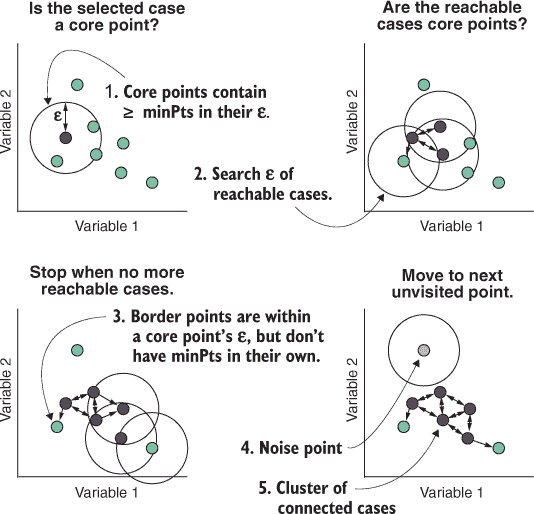

假设算法选择了一个案例，并发现它是一个核心点。然后算法访问核心点周围 *epsilon* 范围内的每个案例，并重复相同的任务：查看这个案例是否在其自身的搜索半径内有 *minPts* 个案例。两个位于彼此搜索半径内的案例被称为 *直接密度连接* 并可以从彼此那里 *可达*。搜索递归地进行，跟随从核心点出发的所有直接密度连接。如果算法找到一个可以到达核心点但自身没有 minPts-可达案例的案例，这个案例被认为是 *边界点*。算法 *只* 搜索核心点的搜索空间，而不是边界点的搜索空间。

如果两个案例不是直接密度连接，但通过一系列直接密度连接的案例链或系列连接在一起，则称这两个案例为 *密度连接*。一旦搜索完成，并且访问过的案例没有更多的直接密度连接可以探索，所有相互密度连接的案例都被放入同一个簇中（包括边界点）。

现在算法在数据集中选择一个不同的案例——它之前没有访问过的案例——然后相同的流程再次开始。一旦数据集中的每个案例都被访问过，那些既不是核心点也不是边界点的孤立案例将被添加到噪声簇中，并被认为是离高密度区域太远，无法自信地将它们与其它案例聚类。因此，DBSCAN 通过在特征空间的高密度区域找到案例链来找到簇，并将占据特征空间稀疏区域的案例排除在外。

| |
| --- |

##### 注意

从边界点向外搜索有助于防止噪声事件被包含到簇中。

| |
| --- |

我刚刚介绍了很多新的术语！让我们快速回顾一下，以便这些术语能留在你的脑海中，因为它们对 OPTICS 算法也很重要：

+   ***Epsilon—*** 案例周围的*n*-维球体的半径，算法在其中搜索其他案例

+   ***minPts—*** 簇中允许的最小案例数，以及必须在一个案例的*epsilon*范围内才能成为核心点的案例数

+   ***核心点—*** 至少有*minPts*个可到达案例的案例

+   ***可到达/直接密度连接—*** 当两个案例彼此之间在*epsilon*范围内时

+   ***密度连接—*** 当两个案例通过一系列直接密度连接的案例连接，但它们本身可能不是直接密度连接时

+   ***边界点—*** 可以从核心点到达但本身不是核心点的案例

+   ***噪声点—*** 既不是核心点也从未被核心点到达的案例

#### 18.1.2\. OPTICS 算法是如何学习的？

在本节中，我将向你展示 OPTICS 算法如何学习数据集中的高密度区域，它与 DBSCAN 的相似之处以及不同之处。从技术上来说，OPTICS 实际上不是一个聚类算法。相反，它以某种方式对数据中的案例进行排序，以便我们可以从中提取簇。这听起来有点抽象，所以让我们来看看 OPTICS 是如何工作的。

DBSCAN 算法有一个重要的缺点：它难以识别具有不同密度的簇。OPTICS 算法试图缓解这一缺点，并识别具有不同密度的簇。它是通过允许每个案例周围的搜索半径动态扩展，而不是固定在预定的值来实现的。

为了理解 OPTICS 是如何工作的，我需要介绍两个新术语：

+   核心距离

+   可达性距离

在 OPTICS 中，一个案例周围的搜索半径不是固定的，而是扩展到至少包含*minPts*个案例。这意味着特征空间中密集区域的案例将具有较小的搜索半径，而稀疏区域的案例将具有较大的搜索半径。包含至少*minPts*个其他案例的案例与该案例的最小距离称为*核心距离*，有时简称为ϵ′。实际上，OPTICS 算法只有一个强制性的超参数：*minPts*。


##### 注意

我们仍然可以提供*epsilon*，但它主要用于通过充当最大核心距离来加速算法。换句话说，如果核心距离达到*epsilon*，只需将*epsilon*作为核心距离，以防止数据集中的所有案例都被考虑。


**可达距离**是指一个核心点与其 epsilon 范围内的另一个核心点之间的距离，但不能小于核心距离。换句话说，如果一个案例的核心点在其核心距离**内部**，那么这些案例之间的可达距离**就是**核心距离。如果一个案例的核心点在其核心距离**外部**，那么这些案例之间的可达距离就是它们之间的欧几里得距离。

| |
| --- |

##### 注意

在 OPTICS 中，如果一个案例在其 epsilon 范围内有*minPts*个案例，则该案例是核心点。如果我们不指定 epsilon，则所有案例都将被视为核心点。一个案例与非核心点之间的可达距离是未定义的。

| |
| --- |

看一下图 18.3 中的示例。你可以看到围绕深色阴影案例的两个圆圈。半径较大的圆圈是*epsilon*，半径较小的圆圈是核心距离（ϵ'）。这个例子展示了值为 4 的*minPts*的核心距离，因为核心距离已经扩展以包含四个案例（包括所讨论的案例）。箭头指示核心点与其 epsilon 范围内的其他案例之间的可达距离。

##### 图 18.3\. 定义核心距离和可达距离。在 OPTICS 中，*epsilon*（ϵ）是最大搜索距离。核心距离（ϵ′）是需要包含*minPts*个案例（包括所讨论的案例）的最小搜索距离。一个案例的可达距离是该案例的核心距离和与另一个在其 epsilon 范围内的案例之间的距离中的较大者。

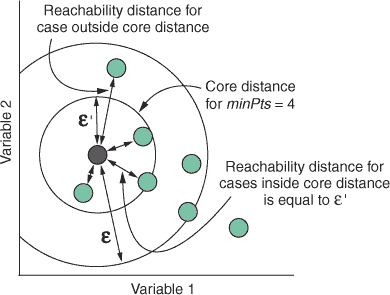

因为可达距离是一个核心点与其 epsilon 范围内的另一个核心点之间的距离，所以 OPTICS 需要知道哪些案例是核心点。因此，算法首先遍历数据中的每个案例，并确定其核心距离是否小于 epsilon。这如图 18.4 所示。如果一个案例的核心距离小于或等于 epsilon，则该案例是核心点。如果一个案例的核心距离大于 epsilon（我们需要扩展到 epsilon 之外以找到*minPts*个案例），则该案例**不是**核心点。两种情况都在图 18.4 中展示。

##### 图 18.4\. 在 OPTICS 中定义核心点。核心距离（ϵ′）小于或等于最大搜索距离（ϵ）的案例被认为是核心点。核心距离大于最大搜索距离的案例不被认为是核心点。

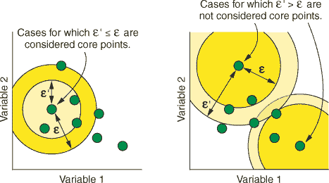

现在你已经理解了核心距离和可达距离的概念，让我们看看 OPTICS 算法是如何工作的。第一步是访问数据集中的每个情况，并标记它是否为核心点。算法的其余部分在图 18.5 中展示，所以假设这部分已经完成。OPTICS 选择一个情况，并计算它与所有在其*epsilon*（最大搜索距离）内的情况的可达距离。

在移动到下一个情况之前，算法做两件事：

+   记录情况的*可达分数*

+   更新情况的处理顺序

情况的可达分数与可达距离不同（术语很不幸地令人困惑）。一个情况的可达分数定义为它的核心距离或其最小可达距离中的较大者。让我们重新表述：如果一个情况在其*epsilon*内没有*minPts*个情况（它不是核心点），那么它的可达分数将是到其最近核心点的可达距离。如果一个情况在其*epsilon*内确实有*minPts*个情况，那么它的最小可达距离将小于或等于其核心距离，所以我们只需将核心距离作为该情况的可达分数。

##### 图 18.5\. OPTICS 算法。选择一个情况，并测量其核心距离（ϵ′）。计算该情况与其最大搜索距离（ϵ）内的所有情况的可达距离。更新数据集的处理顺序，以便访问最近的下一个情况。记录该情况的可达分数和处理顺序，然后算法继续处理下一个情况。

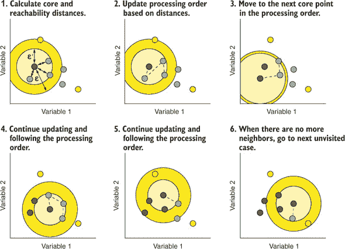

| |
| --- |

##### 注意

因此，情况的可达分数永远不会小于其核心距离，除非核心距离大于最大值*epsilon*，在这种情况下，*epsilon*将是可达分数。

| |
| --- |

一旦记录了特定情况的可达性，算法随后更新它将要访问的下一个情况的序列（处理顺序）。它更新处理顺序，以便接下来访问与当前情况具有最小可达距离的核心点，然后是下一个最远的点，依此类推。这可以在图 18.5 的第 2 步中看到。

然后算法按照更新后的处理顺序访问下一个情况，并重复相同的过程，可能会再次更改处理顺序。当当前链中没有更多可达情况时，算法将移动到数据集中下一个未访问的核心点，并重复该过程。

一旦访问了所有案例，算法将返回处理顺序（每个案例被访问的顺序）和每个案例的可达性分数。如果我们绘制处理顺序与可达性分数的关系图，我们得到类似于图 18.6 顶部的图。为了生成这个图，我使用具有四个簇的模拟数据集应用了 OPTICS 算法（你可以在这个[www.manning.com/books/machine-learning-with-r-the-tidyverse-and-mlr](http://www.manning.com/books/machine-learning-with-r-the-tidyverse-and-mlr)找到重现此图的代码）。注意，当我们绘制处理顺序与可达性分数的关系图时，我们得到四个浅谷，每个谷之间都由高可达性的尖峰隔开。图中的每个谷对应于高密度区域，而每个尖峰表示这些区域通过低密度区域进行分离。

##### 图 18.6\. 模拟数据集的可达性图。上面的图显示了 OPTICS 算法从下面图中所示的数据中学习到的可达性图。图被着色以表示特征空间中的每个簇映射到可达性图的位置。

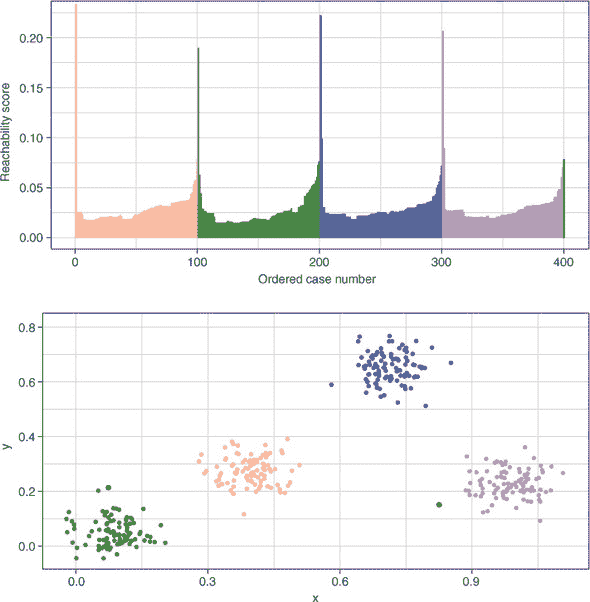

| |
| --- |

##### 注意

谷越深，密度越高。

| |
| --- |

OPTICS 算法实际上并没有进一步做。一旦它生成了这个图，它的任务就完成了，现在是我们使用图中包含的信息来提取簇成员的工作。这就是为什么我说 OPTICS 在技术上不是一个聚类算法，而是创建了一个数据排序，使我们能够在数据中找到簇。

那么，我们如何提取簇呢？我们有几种选择。一种方法是在可达性图上简单地画一条水平线，在某个可达性分数处，并将簇的开始和结束定义为图下降并再次上升至该线以下的位置。任何在直线以上的案例可以分类为噪声，如图 18.7 顶部的图所示。这种方法将导致与 DBSCAN 算法产生的聚类非常相似，但某些边界点更有可能被放入噪声簇中。

##### 图 18.7\. 从可达性图中提取不同方式簇的示意图。在上面的图中，定义了一个单一的可达性分数截止值，任何被高于此截止值的峰值包围的谷都被定义为簇。在下面的图中，根据可达性变化的陡峭程度定义了一个簇的层次结构，允许簇中有簇。

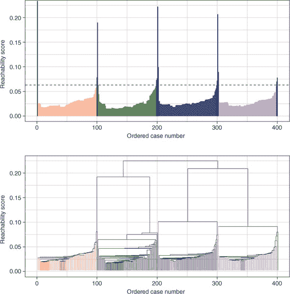

另一种（通常更有用）的方法是在可达性图中定义特定的*陡度*作为簇开始和结束的指示。我们可以将簇的开始定义为当我们有一个至少这种陡度的下坡时，其结束定义为当我们有一个至少这种陡度的上坡时。我们稍后将使用的方法将陡度定义为 1 – ξ（xi，发音为“zy”，“sigh”或“kzee”，取决于你的偏好和数学老师），其中两个连续案例的可达性必须改变一个 1 – ξ的因子。当我们有一个满足这个陡度标准的下坡时，簇的开始就被定义了；当我们有一个满足这个陡度的上坡时，簇的结束就被定义了。

| |
| --- |

##### 注意

因为ξ无法从数据中估计出来，它是一个我们必须自己选择/调整的超参数。

| |
| --- |

使用这种方法有两个主要好处。首先，它使我们能够克服 DBSCAN 只能找到相同密度簇的限制。其次，它使我们能够在簇内找到簇，从而形成层次结构。想象一下，我们有一个开始簇的下坡，然后在簇结束前还有一个*另一个*下坡：我们有一个簇内的簇。这种从可达性图中提取簇的层次结构在图 18.7 的底部图中显示。

| |
| --- |

##### 注意

注意，这两种方法都不能直接应用于原始数据。它们会从 OPTICS 算法生成的顺序和可达性分数中提取所有信息来分配簇成员资格。

| |
| --- |

### 18.2. 构建第一个 DBSCAN 模型

在本节中，我将向你展示如何使用 DBSCAN 算法对数据集进行聚类。然后，我们将使用你在第十七章（kindle_split_030.html#ch17）中学到的一些技术来验证其性能并选择最佳性能的超参数组合。

| |
| --- |

##### 注意

mlr 包确实有 DBSCAN 算法的学习器（`cluster.dbscan`），但我们不会使用它。它没有问题；但正如你稍后将会看到的，噪声簇的存在会给我们内部簇度量带来问题，所以我们将要在 mlr 之外进行自己的性能验证。

| |
| --- |

#### 18.2.1. 加载和探索纸币数据集

让我们从加载 tidyverse 和加载数据开始，这些数据是 mclust 包的一部分。我们将使用瑞士纸币数据集，我们在第十三章（kindle_split_025.html#ch13）和第十四章（kindle_split_026.html#ch14）中对其应用了 PCA、t-SNE 和 UMAP。一旦我们加载数据，我们将将其转换为 tibble，并在对数据进行缩放后创建一个单独的 tibble（因为 DBSCAN 和 OPTICS 对变量尺度敏感）。因为我们将假设我们没有地面实况，所以我们移除了`Status`变量，该变量指示哪些纸币是真钞，哪些是假钞。回想一下，tibble 包含 200 张瑞士纸币，有 6 个关于其尺寸的测量值。

##### 列表 18.1\. 加载 tidyverse 包和数据集

```
library(tidyverse)

data(banknote, package = "mclust")

swissTib <- select(banknote, -Status) %>%
  as_tibble()

swissTib

# A tibble: 200 x 6
   Length  Left Right Bottom   Top Diagonal
    <dbl> <dbl> <dbl>  <dbl> <dbl>    <dbl>
 1   215\.  131   131\.    9     9.7     141
 2   215\.  130\.  130\.    8.1   9.5     142.
 3   215\.  130\.  130\.    8.7   9.6     142.
 4   215\.  130\.  130\.    7.5  10.4     142
 5   215   130\.  130\.   10.4   7.7     142.
 6   216\.  131\.  130\.    9    10.1     141.
 7   216\.  130\.  130\.    7.9   9.6     142.
 8   214\.  130\.  129\.    7.2  10.7     142.
 9   215\.  129\.  130\.    8.2  11       142.
10   215\.  130\.  130\.    9.2  10       141.
# ... with 190 more rows

swissScaled <- swissTib %>% scale()
```

让我们使用 `ggpairs()` 绘制数据，以提醒自己数据的结构。

##### 列表 18.2\. 绘制数据

```
library(GGally)

ggpairs(swissTib, upper = list(continuous = "density")) +
  theme_bw()
```

结果图显示在 图 18.8。看起来数据中至少有两个高密度区域，在低密度区域有一些散布的案例。

#### 18.2.2\. 调整 epsilon 和 minPts 超参数

在本节中，我将向您展示如何为 DBSCAN 选择合理的 *epsilon* 和 *minPts* 范围，以及我们如何手动调整它们以找到最佳性能组合。选择 *epsilon* 超参数的值可能并不明显。我们应该搜索多远？幸运的是，我们可以使用一种启发式方法来至少得到正确的范围。这包括计算每个点到其第 *k* 个最近邻的距离，然后根据这个距离在图中对点进行排序。在密度高和密度低区域的数据中，这往往会产生一个包含“拐点”或“肘部”（取决于您的偏好）的图。*epsilon* 的最佳值就在那个拐点/肘部附近。因为 DBSCAN 中的核心点在其 *epsilon* 内有 *minPts* 个案例，所以在该图的拐点选择 *epsilon* 的值意味着选择一个搜索距离，这将导致高密度区域的案例被视为核心点。我们可以使用 dbscan 包中的 `kNNdistplot()` 函数创建此图。

##### 图 18.8\. 使用 `ggpairs()` 绘制瑞士银行钞票数据集。2D 密度图显示在对角线以上。

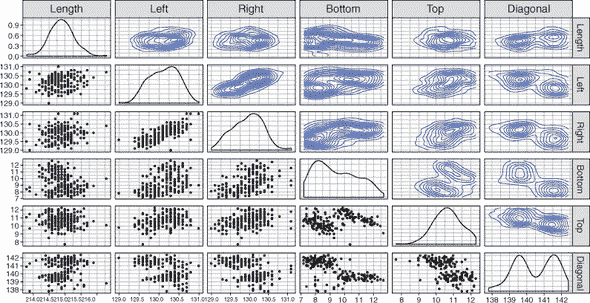

##### 列表 18.3\. 绘制 kNN 距离图

```
library(dbscan)

kNNdistplot(swissScaled, k = 5)

abline(h = c(1.2, 2.0))
```

我们需要使用 `k` 参数来指定我们想要计算距离的最近邻的数量。但我们还不知道我们的 *minPts* 参数应该是多少，所以我们如何设置 `k`？我通常会选择一个我认为大约正确的合理值（记住 *minPts* 定义了最小聚类大小）：这里，我选择了 5。图中拐点的位置对 `k` 的变化相对稳健。

`kNNdistplot()` 函数将创建一个矩阵，其行数与数据集中的案例数（200）相同，有 5 列，每一列代表每个案例与其 5 个最近邻之间的距离。这些 200 × 5 = 1,000 个距离将在图中绘制。

我们随后使用 `abline()` 函数在膝部的起始和结束位置绘制水平线，以帮助我们确定将要调整的 *epsilon* 值的范围。生成的图表显示在 图 18.9 中。注意，从左到右读取图表，在最初的急剧增加之后，5 个最近邻的距离仅逐渐增加，直到再次急剧增加。曲线向上弯曲的这个区域是膝部/肘部，在这个弯曲点处的 *epsilon* 的最佳值。使用这种方法，我们选择 1.2 和 2.0 作为调整 *epsilon* 的上下限。

##### 图 18.9\. *k* = 5 的 k-最近邻距离图。使用 `abline()` 绘制了水平线，以突出显示图表中膝部/肘部起始和结束位置的 5-NN 距离。

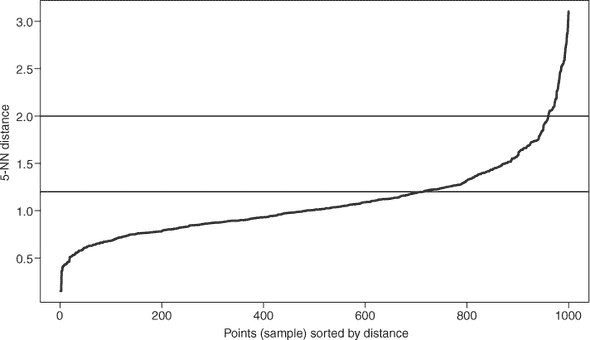

让我们手动定义我们的 *epsilon* 和 *minPts* 的超参数搜索空间。我们使用 `expand.grid()` 函数创建一个数据框，包含我们想要搜索的 *epsilon* (`eps`) 和 *minPts* 的所有值组合。我们将搜索 1.2 和 2.0 之间的 *epsilon* 值，步长为 0.1；我们将搜索 1 和 9 之间的 *minPts* 值，步长为 1。

##### 列表 18.4\. 定义我们的超参数搜索空间

```
dbsParamSpace <- expand.grid(eps = seq(1.2, 2.0, 0.1),
                             minPts = seq(1, 9, 1))
```

| |
| --- |

**练习 1**

打印 `dbsParamSpace` 对象，以更好地理解 `expand .grid()` 正在做什么。

| |
| --- |

现在我们已经定义了我们的超参数搜索空间，让我们对每个不同的 *epsilon* 和 *minPts* 组合运行 DBSCAN 算法。为此，我们使用 purrr 包中的 `pmap()` 函数将 `dbscan()` 函数应用于 `dbsParamSpace` 对象的每一行。

##### 列表 18.5\. 对每个超参数组合运行 DBSCAN

```
swissDbs <- pmap(dbsParamSpace, dbscan, x = swissScaled)

swissDbs[[5]]

DBSCAN clustering for 200 objects.
Parameters: eps = 1.6, minPts = 1
The clustering contains 10 cluster(s) and 0 noise points.

  1   2   3   4   5   6   7   8   9  10
  1 189   1   1   1   3   1   1   1   1

Available fields: cluster, eps, minPts
```

我们将缩放后的数据集作为 `dbscan()` 的参数 `x` 的参数。`pmap()` 的输出是一个列表，其中每个元素都是对特定 *epsilon* 和 *minPts* 组合运行 DBSCAN 的结果。要查看特定排列的输出，我们只需对列表进行子集化。

当打印 `dbscan()` 调用的结果时，输出告诉我们数据中的对象数量，*epsilon* 和 *minPts* 的值，以及识别出的簇和噪声点的数量。也许最重要的信息是每个簇内的案例数量。在这个例子中，我们可以看到簇 2 中有 189 个案例，而在大多数其他簇中只有一个案例。这是因为这个排列运行时 *minPts* 等于 1，这允许簇只包含一个案例。这很少是我们想要的，并且会导致一个聚类模型，其中没有案例被识别为噪声。

现在我们有了聚类结果，我们应该通过视觉检查聚类，看看哪些（如果有的话）排列给出了合理的结果。为此，我们想要从每个排列中提取聚类成员的向量作为一列，然后将这些列添加到我们的原始数据中。

第一步是从 tibble 中提取聚类成员作为单独的列。为此，我们使用 `map_dfc()` 函数。我们之前已经遇到过 `map_df()` 函数：它将函数应用于向量的每个元素，并将输出作为 tibble 返回，其中每个输出形成 tibble 的不同行。这实际上与使用 `map_dfr()` 相同，其中 *r* 代表行绑定。如果我们想使每个输出形成 tibble 的不同 *列*，我们则使用 `map_dfc()`。

| |
| --- |

##### 注意

这里为了节省空间，已截断输出。

| |
| --- |

##### 列表 18.6\. DBSCAN 排列的聚类成员关系

```
clusterResults <- map_dfc(swissDbs, ~.$cluster)

clusterResults

# A tibble: 200 x 81
      V1    V2    V3    V4    V5    V6    V7    V8    V9   V10   V11
   <int> <int> <int> <int> <int> <int> <int> <int> <int> <int> <int>
 1     1     1     1     1     1     1     1     1     1     0     0
 2     2     2     2     2     2     2     2     2     2     1     1
 3     2     2     2     2     2     2     2     2     2     1     1
 4     2     2     2     2     2     2     2     2     2     1     1
 5     3     3     3     3     3     3     3     3     2     0     0
 6     4     4     4     4     4     2     2     2     2     0     0
 7     5     2     2     2     2     2     2     2     2     0     1
 8     2     2     2     2     2     2     2     2     2     1     1
 9     2     2     2     2     2     2     2     2     2     1     1
10     6     2     2     2     2     2     2     2     2     2     1
# ... with 190 more rows, and 70 more variables
```

现在我们有了聚类成员的 tibble，让我们使用 `bind_cols()` 函数来，嗯，绑定 `swissTib` tibble 和我们的聚类成员 tibble 的列。我们称这个新的 tibble 为 `swissClusters`，听起来像是一种早餐谷物。请注意，我们有原始变量，以及包含每个排列的聚类成员输出的额外列。

| |
| --- |

##### 注意

再次，为了节省空间，我稍微截断了输出。

| |
| --- |

##### 列表 18.7\. 将聚类成员绑定到原始数据

```
swissClusters <- bind_cols(swissTib, clusterResults)

swissClusters

# A tibble: 200 x 87
   Length  Left Right Bottom   Top Diagonal    V1    V2    V3    V4
    <dbl> <dbl> <dbl>  <dbl> <dbl>    <dbl> <int> <int> <int> <int>
 1   215\.  131   131\.    9     9.7     141      1     1     1     1
 2   215\.  130\.  130\.    8.1   9.5     142\.     2     2     2     2
 3   215\.  130\.  130\.    8.7   9.6     142\.     2     2     2     2
 4   215\.  130\.  130\.    7.5  10.4     142      2     2     2     2
 5   215   130\.  130\.   10.4   7.7     142\.     3     3     3     3
 6   216\.  131\.  130\.    9    10.1     141\.     4     4     4     4
 7   216\.  130\.  130\.    7.9   9.6     142\.     5     2     2     2
 8   214\.  130\.  129\.    7.2  10.7     142\.     2     2     2     2
 9   215\.  129\.  130\.    8.2  11       142\.     2     2     2     2
10   215\.  130\.  130\.    9.2  10       141\.     6     2     2     2
# ... with 190 more rows, and 77 more variables
```

为了绘制结果，我们希望按排列进行分面，这样我们就可以为超参数的每个组合绘制一个单独的子图。为此，我们需要 `gather()` 数据以创建一个新列，指示排列编号，另一个列指示聚类编号。

##### 列表 18.8\. 收集数据，准备绘图

```
swissClustersGathered <- gather(swissClusters,
                                key = "Permutation", value = "Cluster",
                                -Length, -Left, -Right,
                                -Bottom, -Top, -Diagonal)
swissClustersGathered

# A tibble: 16,200 x 8
   Length  Left Right Bottom   Top Diagonal Permutation Cluster
    <dbl> <dbl> <dbl>  <dbl> <dbl>    <dbl> <chr>         <int>
 1   215\.  131   131\.    9     9.7     141  V1                1
 2   215\.  130\.  130\.    8.1   9.5     142\. V1                2
 3   215\.  130\.  130\.    8.7   9.6     142\. V1                2
 4   215\.  130\.  130\.    7.5  10.4     142  V1                2
 5   215   130\.  130\.   10.4   7.7     142\. V1                3
 6   216\.  131\.  130\.    9    10.1     141\. V1                4
 7   216\.  130\.  130\.    7.9   9.6     142\. V1                5
 8   214\.  130\.  129\.    7.2  10.7     142\. V1                2
 9   215\.  129\.  130\.    8.2  11       142\. V1                2
10   215\.  130\.  130\.    9.2  10       141\. V1                6
# ... with 16,190 more rows
```

太好了——现在我们的 tibble 已经处于绘图格式。回顾 图 18.8，我们可以看到最明显区分数据中聚类的变量是 `Right` 和 `Diagonal`。因此，我们将这些变量分别映射到 x 和 y 美学，以相互绘制。我们将 `Cluster` 变量映射到颜色美学（将其包裹在 `as.factor()` 中，以便颜色不会绘制成单一渐变）。然后按 `Permutation` 分面，添加 `geom_point()` 层，并添加一个主题。由于一些聚类模型有大量的聚类，我们通过添加 `theme(legend.position = "none")` 行来抑制绘制非常大的图例。

##### 列表 18.9\. 绘制排列的聚类成员关系

```
ggplot(swissClustersGathered, aes(Right, Diagonal,
                                  col = as.factor(Cluster))) +
  facet_wrap(~ Permutation) +
  geom_point() +
  theme_bw() +
  theme(legend.position = "none")
```

| |
| --- |

##### 小贴士

`theme()` 函数允许您控制图表的外观（例如更改背景颜色、网格线、字体大小等）。要了解更多信息，请调用 `?theme`。

| |
| --- |

结果图显示在图 18.10 中。我们可以看到，不同的**epsilon**和**minPts**组合导致了实质上不同的聚类模型。许多这些模型捕捉到了数据集中的两个明显的聚类，但大多数没有。

| |
| --- |

**练习 2**

让我们还将可视化每个排列返回的聚类数量和大小。将我们的`swissClustersGathered`对象传递给`ggplot()`，并使用以下美学映射：

+   `x = reorder(Permutation, Cluster)`

+   `y = fill = as.factor(Cluster)`

还添加一个`geom_bar()`层。现在再次绘制相同的图表，但这次添加一个`coord_polar()`层。将 x 美学映射仅设置为`Permutation`。你能看到`reorder()`函数做了什么吗？

| |
| --- |

##### 图 18.10。可视化我们的调整实验的结果。每个子图显示了**epsilon**和**minPts**的不同排列下，`Right`和`Diagonal`变量相互之间的绘图。案例根据其聚类成员进行着色。

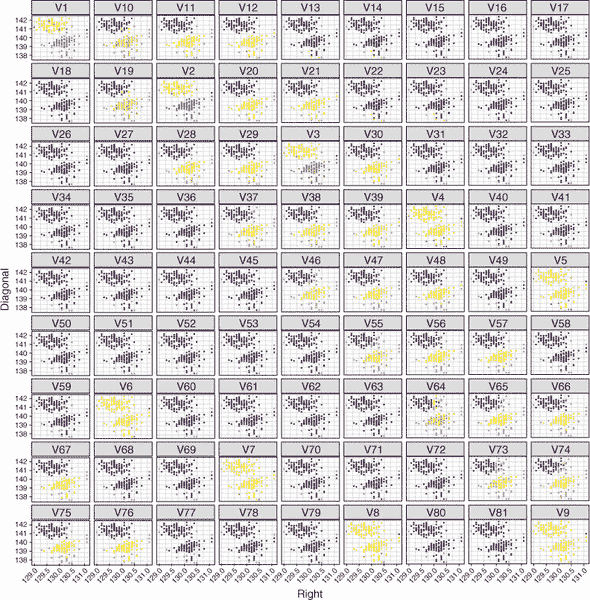

我们将如何选择表现最佳的**epsilon**和**minPts**组合？嗯，正如我们在第十七章中看到的，确保聚类是有意义的视觉检查很重要，但我们还可以计算内部聚类指标以帮助我们的选择。

在第十七章中，我们定义了自己的函数，该函数将接受聚类模型中的数据和聚类成员，并计算 Davies-Bouldin 和 Dunn 指数以及伪 F 统计量。让我们重新定义这个函数以刷新你的记忆。

##### 列表 18.10。定义`cluster_metrics()`函数

```
cluster_metrics <- function(data, clusters, dist_matrix) {
  list(db   = clusterSim::index.DB(data, clusters)$DB,
       G1   = clusterSim::index.G1(data, clusters),
       dunn = clValid::dunn(dist_matrix, clusters),
       clusters = length(unique(clusters))
  )
}
```

为了帮助我们选择哪个聚类模型最能捕捉数据中的结构，我们将从我们的数据集中抽取自举样本，并对每个自举样本使用所有 81 种**epsilon**和**minPts**的组合来运行 DBSCAN。然后我们可以计算每个性能指标的均值，并查看它们的稳定性。

| |
| --- |

##### 注意

从第十七章回顾，自举样本是通过从原始数据中抽取案例（有放回）来创建的，以创建一个与原始样本大小相同的新样本。

| |
| --- |

让我们从我们的`swissScaled`数据集中生成 10 个自举样本开始。我们这样做就像在第十七章中做的那样，使用`sample_n()`函数，并将`replace`参数设置为`TRUE`。

##### |

```
swissBoot <- map(1:10, ~ {
  swissScaled %>%
    as_tibble() %>%
    sample_n(size = nrow(.), replace = TRUE)
})
```

在我们运行调整实验之前，DBSCAN 在计算内部聚类度量时可能存在潜在问题。正如我们在第十六章中讨论的那样，这些度量通过比较簇之间的分离和簇内的扩散（无论它们如何定义这些概念）来工作。思考一下噪声簇，以及它将如何影响这些度量。因为噪声簇不是一个占据特征空间一个区域的独立簇，而是通常分布在整个特征空间中，它对内部聚类度量的影响可能会使度量难以解释和比较。因此，一旦我们得到聚类结果，我们将移除噪声簇，这样我们就可以只使用非噪声簇来计算我们的内部聚类度量。

| |
| --- |

##### 注意

这并不意味着在评估 DBSCAN 模型性能时考虑噪声簇不重要。理论上，两个聚类模型可能给出相同的聚类度量，但一个模型可能将案例放置在噪声簇中，而你认为这些案例很重要。因此，你应该始终视觉评估你的簇结果（包括噪声案例），特别是当你对你的任务有领域知识时。

| |
| --- |

在下面的列表中，我们在 bootstrap 样本上运行调整实验。代码相当长，所以我们将一步一步地讲解。

##### 列表 18.12\. 执行调整实验

```
metricsTib <- map_df(swissBoot, function(boot) {
  clusterResult <- pmap(dbsParamSpace, dbscan, x = boot)

  map_df(clusterResult, function(permutation) {
    clust <- as_tibble(permutation$cluster)
    filteredData <- bind_cols(boot, clust) %>%
      filter(value != 0)

    d <- dist(select(filteredData, -value))

    cluster_metrics(select(filteredData, -value),
                    clusters = filteredData$value,
                    dist_matrix = d)
  })
})
```

首先，我们使用`map_df()`函数，因为我们希望将匿名函数应用于每个 bootstrap 样本，并将结果行绑定到一个 tibble 中。我们使用`pmap()`函数，通过`dbsParamSpace`中的每个*epsilon*和*minPts*的组合来运行 DBSCAN 算法，就像我们在列表 18.5 中所做的那样。

现在簇结果已经生成，代码的下一部分将`cluster_metric()`函数应用于每个*epsilon*和*minPts*的排列。同样，我们希望它返回一个 tibble，所以我们使用`map_df()`来迭代匿名函数，遍历`clusterResult`中的每个元素。

我们首先从每个排列中提取簇成员资格，将其转换为 tibble（单列），并使用`bind_cols()`函数将簇成员资格的这一列粘接到 bootstrap 样本上。然后，我们将这个结果传递到`filter()`函数中，以移除属于噪声簇（簇 0）的案例。因为 Dunn 指数需要一个距离矩阵，所以我们接下来定义距离矩阵`d`，使用过滤后的数据。

在这一点上，对于特定 bootstrap 样本中特定*epsilon*和*minPts*的排列，我们有一个包含缩放变量和簇成员资格列的 tibble（单列）。然后，我们将这个 tibble 传递给我们的`cluster_metrics()`函数（对于第一个参数移除`value`变量，并从第二个参数提取它）。我们将距离矩阵作为`dist_matrix`参数传递。

呼！这需要相当多的专注力。我强烈建议你重新阅读代码，确保每一行对你来说都有意义。打印出 `metricsTib` tibble。我们最终得到一个包含四个列的 tibble：每个内部聚类指标一个，还有一个包含聚类数量的列。每一行包含单个 DBSCAN 模型的结果，总共 810 个（81 个 *epsilon* 和 *minPts* 的排列组合，以及每个组合的 10 个 bootstrap 样本）。

现在我们已经完成了调优实验，评估结果的最简单方法就是绘制它们。

##### 列表 18.13\. 准备绘图调优结果

```
metricsTibSummary <- metricsTib %>%
  mutate(bootstrap = factor(rep(1:10, each = 81)),
         eps = factor(rep(dbsParamSpace$eps, times = 10)),
         minPts = factor(rep(dbsParamSpace$minPts, times = 10))) %>%

  gather(key = "metric", value = "value",
         -bootstrap, -eps, -minPts) %>%

  mutate_if(is.numeric, ~ na_if(., Inf)) %>%
  drop_na() %>%

  group_by(metric, eps, minPts) %>%
  summarize(meanValue = mean(value),
            num = n()) %>%
  group_by(metric) %>%
  mutate(meanValue = scale(meanValue)) %>%
  ungroup()
```

我们首先需要 `mutate()` 指示特定案例使用了哪个 bootstrap、使用了哪个 *epsilon* 值以及使用了哪个 *minPts* 值的列。阅读到 列表 18.13 的第一行换行处以查看这一点。

接下来，我们需要收集数据，以便有一个列指示行表示我们四个指标中的哪一个，这样我们就可以按每个指标进行分面。我们使用 `gather()` 函数在 列表 18.13 的第二次换行之前完成此操作。

在这一点上，我们遇到了一个问题。一些聚类模型只包含一个聚类。为了返回一个合理的值，我们的三个内部聚类指标需要至少有两个聚类。当我们将 `cluster_metrics()` 函数应用于聚类模型时，对于只包含一个聚类的任何模型，函数将返回 Davies-Bouldin 指数和伪 F 统计量的 `NA` 值，以及 Dunn 指数的 `INF` 值。


##### 小贴士

运行 `map_int(metricsTib, ~sum(is.na(.)))` 和 `map_int(metricsTib, ~sum(is.infinite(.)))` 以确认这一点。


因此，让我们从我们的 tibble 中移除 `INF` 和 `NA` 值。我们首先将 `INF` 值转换为 `NA`。我们使用 `mutate_if()` 函数仅考虑数值变量（我们也可以使用 `mutate_at(.vars = "value", ...)`），并使用 `na_if()` 函数将当前为 `INF` 的值转换为 `NA`。然后我们将这个操作通过管道传递到 `drop_na()` 以一次性移除所有 `NA` 值。

最后，为了为每个指标生成平均值，对于每个 *epsilon* 和 *minPts* 的组合，我们首先按 `metric`、`eps` 和 `minPts` 进行 `group_by()`，然后对 `value` 变量的平均值和数量进行 `summarize()`。由于指标处于不同的尺度上，我们接着按 `metric` 进行 `group_by()`，对 `meanValue` 变量进行 `scale()`，然后进行 `ungroup()`。

这是一些严肃的 dplyring！再次提醒，不要只是匆匆浏览这段代码。从头开始，重新阅读 列表 18.13 以确保你理解它。同时，请放心，我并不是第一次就写出了所有这些；我知道我想要达到的目标，并且我逐行解决了问题。在每一步，我都会查看输出以确保我所做的是正确的，并确定下一步需要做什么。打印出 `metricsTibSummary` 以了解我们最终得到的结果。

太棒了。现在我们的调整数据已经以正确的格式，让我们来绘制它。我们将创建一个热图，其中 *epsilon* 和 *minPts* 被映射到 x 和 y 视觉效果，指标值被映射到热图中每个瓷砖的填充。每个指标将有一个单独的子图。此外，因为我们移除了包含 `NA` 和 `INF` 值的行，所以 *epsilon* 和 *minPts* 的某些组合的自举样本数量少于 10。为了帮助我们选择超参数，我们将每个组合的样本数量映射到 alpha 视觉效果（透明度），因为我们可能对具有较少自举样本的超参数组合的信心较低。我们将在下面的列表中完成所有这些操作。

##### 列表 18.14\. 调整实验结果的绘图

```
ggplot(metricsTibSummary, aes(eps, minPts,
                              fill = meanValue, alpha = num)) +
  facet_wrap(~ metric) +
  geom_tile(col = "black") +
  theme_bw() +
  theme(panel.grid.major = element_blank())
```

除了将 `num` 变量映射到 alpha 视觉效果之外，这里唯一的新事物是 `geom_tile()`，它将为 x 和 y 变量的每个组合创建矩形瓷砖。将 `col = "black"` 设置为简单地围绕每个单独的瓷砖绘制黑色边框。为了防止绘制主要网格线，我们添加了层 `theme(panel.grid.major = element_blank())`。

结果图表显示在图 18.11。我们有四个子图：一个用于我们三个内部聚类指标中的每一个，一个用于聚类数量。每个内部指标子图的右上角有一个孔，显示了超参数调整空间这个区域只产生了一个聚类（我们移除了这些值）。围绕孔的瓷砖是半透明的，因为这些组合的 *epsilon* 和 *minPts* 的某些自举样本只产生了一个聚类，因此被移除。

##### 图 18.11\. 可视化聚类性能实验。每个子图显示了聚类模型返回的聚类数量、Davies-Bouldin 指数 (`db`)、Dunn 指数 (`dunn`) 和伪 F 统计量 (G1) 的热图。每个瓷砖代表 *epsilon* 和 *minPts* 的组合，瓷砖的阴影深度表示其每个指标的价值。指标图右上角的空白区域表示没有数据，半透明瓷砖表示样本数量少于 10。

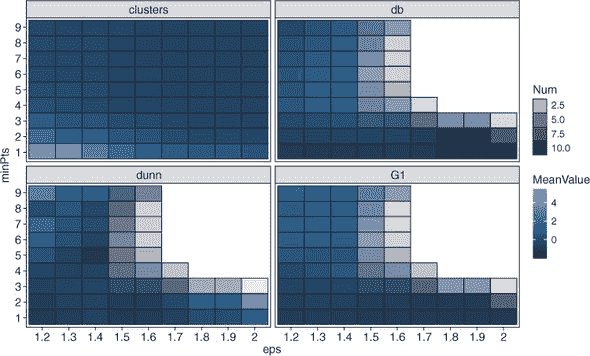

| |
| --- |

##### 注意

你的图表看起来和我有点不同？这是因为我们用来创建自举样本的随机抽样。然而，应该存在一个类似的模式。

| |
| --- |

让我们使用这个图表来指导我们最终选择 *epsilon* 和 *minPts*。这并不一定简单，因为没有单一、明显的组合是所有三个内部指标都同意的。首先，让我们避免图表中的洞附近或其中的组合——我认为这是一个很明确的起点。接下来，让我们提醒自己，从理论上讲，最佳的聚类模型将是具有最低的 Davies-Bouldin 指数、最大的 Dunn 指数和伪 F 统计量的模型。因此，我们正在寻找一个最能满足这些标准的组合。考虑到这一点，在继续阅读之前，请查看图表并尝试决定你会选择哪个组合。

我想我会选择 *epsilon* 为 1.2，*minPts* 为 9。你能看到，在这个值组合（每个子图的左上角）中，Dunn 和伪 F 统计量接近最高，而 Davies-Bouldin 指数处于最低。让我们找出 `dbsParamSpace` tibble 中哪个行对应于这个值组合：

```
which(dbsParamSpace$eps == 1.2 & dbsParamSpace$minPts == 9)

[1] 73
```

接下来，让我们使用 `ggpairs()` 绘制最终的聚类。因为我们计算了内部聚类度量，没有考虑噪声聚类，所以我们将结果绘制为有噪声和无噪声案例的图表。这将使我们能够直观地确认将案例分配为噪声是否合理。

##### 列表 18.15\. 绘制带异常值的最终聚类

```
filter(swissClustersGathered, Permutation == "V73") %>%
  select(-Permutation) %>%
  mutate(Cluster = as.factor(Cluster)) %>%
  ggpairs(mapping = aes(col = Cluster),
          upper = list(continuous = "density")) +
  theme_bw()
```

我们首先过滤 `swissClustersGathered` tibble，只包含属于排列 73 的行（这些是使用我们选择的 *epsilon* 和 *minPts* 组合进行聚类的案例）。接下来，我们删除表示排列编号的列，并将聚类成员资格的列转换为因子。然后，我们使用 `ggpairs()` 函数创建图表，将聚类成员资格映射到颜色美学。

##### 图 18.12\. 使用 `ggpairs()` 绘制我们的最终 DBSCAN 聚类模型。此图包括噪声聚类。

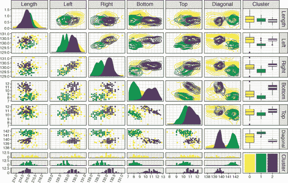

结果图表显示在图 18.12 中。模型似乎很好地捕捉到了数据集中的两个明显聚类。相当多的案例被分类为噪声。这是否合理将取决于你的目标和你想有多严格。如果你认为将更少的案例放在噪声聚类中很重要，你可能想选择不同的 *epsilon* 和 *minPts* 组合。这就是为什么仅仅依赖指标是不够好的：在可用的情况下，应始终考虑专家/领域知识。

现在，让我们做同样的事情，但不绘制异常值。这里我们做的唯一改变是在 `filter()` 调用中添加 `Cluster != 0`。

##### 列表 18.16\. 绘制不带异常值的最终聚类

```
filter(swissClustersGathered, Permutation == "V73", Cluster != 0) %>%
  select(-Permutation) %>%
  mutate(Cluster = as.factor(Cluster)) %>%
  ggpairs(mapping = aes(col = Cluster),
          upper = list(continuous = "density")) +
  theme_bw()
```

结果图表显示在图 18.13 中。查看这个图表，我们可以看到 DBSCAN 模型识别的两个聚类非常整洁且分离良好。

##### 图 18.13\. 使用 `ggpairs()` 绘制我们的最终 DBSCAN 聚类模型。此图排除了噪声聚类。

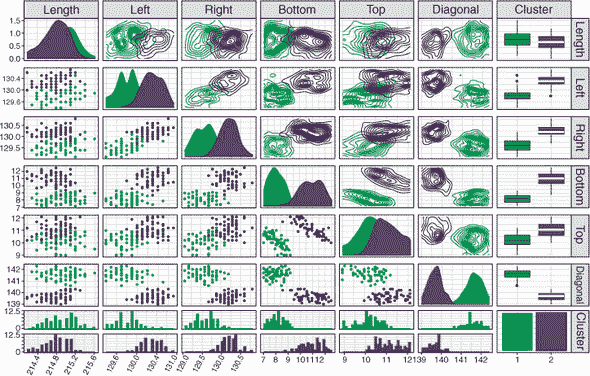

| |
| --- |

##### 警告

确保你总是查看你的异常值。当移除异常值时，DBSCAN 可能会使聚类看起来比实际更重要。

| |
| --- |

我们的聚类模型看起来相当合理，但它有多稳定？为了评估我们的 DBSCAN 模型的表现，我们将要做的最后一件事是计算多个自助样本中的 Jaccard 指数。回想一下第十七章（kindle_split_030.html#ch17），Jaccard 指数量化了在不同自助样本上训练的聚类模型之间聚类成员资格的一致性。

要做到这一点，我们首先需要加载 fpc 包。然后我们使用`clusterboot()`函数，就像我们在第十七章中做的那样。第一个参数是我们将要聚类的数据（我们的缩放 tibble），`B`是自助样本的数量（越多越好，取决于您的计算预算），`clustermethod = dbscanCBI`告诉函数使用 DBSCAN 算法。然后我们设置*epsilon*和`MinPts`（注意：这次是大写的*M*），并将`showplots = FALSE`设置为避免绘制 500 个图表。

| |
| --- |

##### 注意

我已截断输出以显示最重要的信息。

| |
| --- |

##### 列表 18.17. 在自助样本中计算 Jaccard 指数

```
library(fpc)

clustBoot <- clusterboot(swissScaled, B = 500,
                         clustermethod = dbscanCBI,
                         eps = 1.2, MinPts = 9,
                         showplots = FALSE)

clustBoot

Number of resampling runs:  500

Number of clusters found in data:  3

Clusterwise Jaccard bootstrap (omitting multiple points) mean:
[1] 0.6893 0.8074 0.6804
```

我们可以看到三个聚类（其中聚类 3 令人困惑地是噪声聚类）的 Jaccard 指数。聚类 2 的稳定性相当高：原始聚类 2 中有 80.7%的案例在自助样本中达成一致。聚类 1 和 3 的稳定性较低，大约有 68%的一致性。

我们现在已经以三种方式评估了我们的 DBSCAN 模型的表现：使用内部聚类指标，检查聚类的外观，以及使用 Jaccard 指数来评估它们的稳定性。对于任何特定的聚类问题，您需要将所有这些证据综合起来，以决定您的聚类模型是否适合当前的任务。

| |
| --- |

**练习 3**

使用`dbscan()`对`swissScaled`数据集进行聚类，将*epsilon*设置为 1.2，但将*minPts*设置为 1。噪声聚类中有多少案例？为什么？`fpc`包也有一个`dbscan()`函数，所以使用`dbscan::dbscan()`来使用 dbscan 包中的函数。

| |
| --- |

### 18.3. 构建第一个 OPTICS 模型

在本节中，我将向您展示我们如何使用 OPTICS 算法对数据集中的案例进行排序，以及我们如何从这个排序中提取聚类。我们将直接比较使用 OPTICS 得到的结果和使用 DBSCAN 得到的结果。

要做到这一点，我们将使用来自 dbscan 包的`optics()`函数。第一个参数是数据集；与 DBSCAN 一样，OPTICS 对变量尺度很敏感，所以我们使用我们的缩放 tibble。

##### 列表 18.18. 使用 OPTICS 对案例进行排序并提取聚类

```
swissOptics <- optics(swissScaled, minPts = 9)

plot(swissOptics)
```

就像`dbscan()`函数一样，`optics()`有`eps`和*minPts*参数。因为*epsilon*是 OPTICS 算法的可选参数，并且仅用于加速计算，我们将它保留为默认的`NULL`，这意味着没有最大*epsilon*。我们将*minPts*设置为 9，以匹配我们最终 DBSCAN 模型中使用的值。

一旦我们创建了我们的顺序，我们可以通过在`optics()`函数的输出上调用`plot()`来检查可达性图；参见图 18.14。注意，我们有两个明显分离的低谷，由高峰值隔开。记住，这表明在特征空间中由低密度区域分隔的高密度区域。

##### 图 18.14。从应用 OPTICS 算法到我们的数据生成的可达性图。x 轴显示案例的处理顺序，y 轴显示每个案例的可达距离。我们可以看到图中有两个主要低谷，由更高的可达距离峰值所包围。

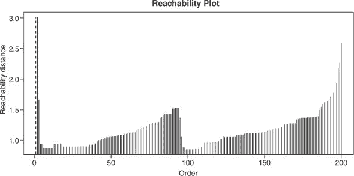

现在，让我们使用陡度法从这个顺序中提取簇。为此，我们使用`extractXi()`函数，将`optics()`函数的输出作为第一个参数传递，并指定*xi*参数：

```
swissOpticsXi <- extractXi(swissOptics, xi = 0.05)
```

回想一下，*xi*（ξ）是一个超参数，它决定了在可达性图中开始和结束簇所需的最小陡度（1 – ξ）。我们如何选择ξ的值？嗯，在这个例子中，我简单地选择了一个能给出合理聚类结果的ξ值（你很快就会看到）。正如我们所知，这不是一个非常科学或客观的方法；对于你自己的工作，你应该像我们对*epsilon*和*minPts*进行 DBSCAN 调整一样，将ξ作为超参数进行调整。


##### 注意

ξ超参数介于 0 和 1 之间，因此这为您在搜索空间内提供了一个固定的范围。


让我们绘制聚类结果，以便我们可以将其与我们的 DBSCAN 模型进行比较。我们在数据集中添加一个新列，包含我们使用陡度法提取的簇。然后我们将这些数据通过管道传递到`ggpairs()`函数。

##### 列表 18.19。绘制 OPTICS 簇

```
swissTib %>%
  mutate(cluster = factor(swissOpticsXi$cluster)) %>%
  ggpairs(mapping = aes(col = cluster),
          upper = list(continuous = "points")) +
  theme_bw()
```


##### 注意

因为我们只有一个噪声案例，这导致密度图的计算失败。因此，我们将上部分设置为简单地显示`"points"`而不是密度。


结果图显示在图 18.15 中。我们的 OPTICS 聚类主要识别出与 DBSCAN 相同的两个簇，但还识别出一个似乎分布在特征空间中的额外簇。这个额外的簇对我来说并不令人信服（但我们可以计算簇内指标和簇稳定性来加强这个结论）。为了改进聚类，我们应该调整*minPts*和ξ超参数，尽管我们在这里不会这样做。

你已经学会了如何使用 DBSCAN 和 OPTICS 算法来聚类你的数据。在下一章中，我将向你介绍 *混合模型聚类*，这是一种聚类技术，它将一组模型拟合到数据中，并将案例分配给最可能的模型。我建议你保存你的 .R 文件，因为我们将继续在下一章中使用同一个数据集。这样我们可以比较我们的 DBSCAN 和 OPTICS 模型的性能与我们的混合模型输出的结果。

##### 图 18.15\. 使用 `ggpairs()` 绘制我们的最终 OPTICS 聚类模型

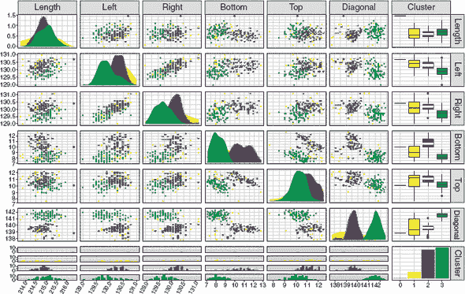

### 18.4\. 基于密度的聚类的优缺点

虽然通常不容易判断哪些算法会对给定的任务表现良好，但以下是一些优势和劣势，这将帮助你决定基于密度的聚类是否适合你。

基于密度的聚类的优点如下：

+   它可以识别不同直径的非球形聚类。

+   它能够原生地识别异常案例。

+   它可以识别复杂、非球形的聚类。

+   OPTICS 能够学习层次聚类结构，并且不需要调整 *epsilon*。

+   OPTICS 能够找到不同密度的聚类。

+   通过设置合理的 *epsilon* 值可以加快 OPTICS 的速度。

基于密度的聚类的缺点如下：

+   它不能原生地处理分类变量。

+   这些算法不能自动选择最佳聚类数量。

+   它对数据的不同尺度敏感。

+   DBSCAN 倾向于寻找密度相等的聚类。

| |
| --- |

**练习题 4**

使用 `dbscan()` 对未缩放的 `swissTib` 数据集进行聚类，将 *epsilon* 设置为 1.2，将 *minPts* 设置为 9。这些聚类是否相同？为什么？

| |
| --- |
| |

**练习题 5**

从我们的 `swissOptics` 对象中提取聚类，使用 *xi* 值 0.035、0.05 和 0.065。使用 `plot()` 来查看这些不同的值如何改变从可达性图中提取的聚类。

| |
| --- |

### 摘要

+   基于密度的聚类算法，如 DBSCAN 和 OPTICS，通过在特征空间中搜索由低密度区域分隔的高密度区域来找到聚类。

+   DBSCAN 有两个超参数，*epsilon* 和 *minPts*，其中 *epsilon* 是每个案例周围的搜索半径。如果一个案例在其 *epsilon* 范围内有 *minPts* 个案例，那么这个案例就是一个核心点。

+   DBSCAN 递归地扫描任何聚类中从起始案例开始的与所有案例密度连接的 *epsilon*，将案例分类为核心点或边界点。

+   DBSCAN 和 OPTICS 为那些离高密度区域太远的案例创建一个噪声聚类。

+   OPTICS 通过创建一个案例的顺序来提取聚类，这个顺序可以可视化为可达性图，其中峰谷之间的低谷表示聚类。

### 练习题的解答

1.  打印 `expand.grid()` 的结果，并检查结果以了解该函数的功能：

    ```
    dbsParamSpace

    # The function creates a data frame whose rows make up
    # every combination of the input vectors.
    ```

1.  绘制调整实验图，以可视化每个排列的簇的数量和大小：

    ```
    ggplot(swissClustersGathered, aes(reorder(Permutation, Cluster),
                 fill = as.factor(Cluster))) +
      geom_bar(position = "fill", col = "black") +
      theme_bw() +
      theme(legend.position = "none")

    ggplot(swissClustersGathered, aes(reorder(Permutation, Cluster),
                                      fill = as.factor(Cluster))) +
      geom_bar(position = "fill", col = "black") +
      coord_polar() +
      theme_bw() +
      theme(legend.position = "none")

    ggplot(swissClustersGathered, aes(Permutation,
                                      fill = as.factor(Cluster))) +
      geom_bar(position = "fill", col = "black") +
      coord_polar() +
      theme_bw() +
      theme(legend.position = "none")

    # The reorder function orders the levels of the first argument
    # according to the values of the second argument.
    ```

1.  使用`dbscan()`，设置*epsilon*为 1.2 和*minPts*为 1：

    ```
    swissDbsNoOutlier <- dbscan::dbscan(swissScaled, eps = 1.2, minPts = 1)

    swissDbsNoOutlier

    # There are no cases in the noise cluster because the minimum cluster
    # size is now 1, meaning all cases are core points.
    ```

1.  使用`dbscan()`对未缩放的数据进行聚类：

    ```
    swissDbsUnscaled <- dbscan::dbscan(swissTib, eps = 1.2, minPts = 9)

    swissDbsUnscaled

    # The clusters are not the same as those learned for the scaled data.
    # This is because DBSCAN and OPTICS are sensitive to scale differences.
    ```

1.  使用不同的*xi*值从`swissOptics`中提取不同的簇：

    ```
    swissOpticsXi035 <- extractXi(swissOptics, xi = 0.035)
    plot(swissOpticsXi035)

    swissOpticsXi05 <- extractXi(swissOptics, xi = 0.05)
    plot(swissOpticsXi05)

    swissOpticsXi065 <- extractXi(swissOptics, xi = 0.065)
    plot(swissOpticsXi065)
    ```

## 第十九章。基于混合建模的分布聚类

*本章涵盖*

+   理解混合模型聚类

+   理解硬聚类和软聚类的区别

在无监督学习技术的最后，我们来到了寻找数据中簇的另一种额外方法：*混合模型聚类*。就像我们之前讨论的其他聚类算法一样，混合模型聚类旨在将数据集划分为有限个簇。

在第十八章中，我向你展示了 DBSCAN 和 OPTICS 算法，以及它们如何通过学习特征空间中高密度和低密度的区域来找到簇。混合模型聚类采用另一种方法来识别簇。*混合模型*是任何通过结合两个或更多概率分布来描述数据集的模型。在聚类的上下文中，混合模型通过将有限数量的概率分布拟合到数据，并迭代修改这些分布的参数，直到它们最好地拟合底层数据来帮助我们识别簇。然后，案例被分配到它们最有可能属于的分布的簇中。混合建模最常见的形式是*高斯混合建模*，它将高斯（或正态）分布拟合到数据。

到本章结束时，我希望你能对混合模型聚类的工作原理及其与我们已经讨论的一些算法的异同有一个牢固的理解。我们将应用这种方法来处理第十八章中的瑞士纸币数据（第十八章），以帮助你理解混合模型聚类与基于密度的聚类有何不同。如果你在你的全局环境中不再定义`swissTib`对象，只需重新运行列表 18.1。

### 19.1. 什么是混合模型聚类？

在本节中，我将向您展示混合模型聚类是什么，以及它是如何使用一个称为*期望最大化*的算法来迭代地改进聚类模型的拟合。我们之前遇到的聚类算法都被认为是*硬聚类*方法，因为每个案例完全分配给一个簇，而不是另一个簇。混合模型聚类的优势之一是它是一种*软聚类*方法：它将一组概率模型拟合到数据中，并为每个案例分配属于每个模型的概率。这使得我们可以量化每个案例属于每个簇的概率。因此，我们可以这样说：“这个案例有 90%的概率属于簇 A，有 9%的概率属于簇 B，有 1%的概率属于簇 C。”这很有用，因为它为我们提供了做出更好决策所需的信息。比如说，一个案例有 51%的概率属于一个簇，有 49%的概率属于另一个簇，我们有多高兴将其包含在其最可能的簇中？也许我们并不足够自信将这些案例包含在我们的最终聚类模型中。


##### 注意

混合模型聚类本身并不像 DBSCAN 和 OPTICS 那样识别异常案例，但如果我们愿意，我们可以手动设置一个概率截止值。例如，我们可以说，任何属于其最可能簇的概率低于 60%的案例应被视为异常。


因此，混合模型聚类将一组概率模型拟合到数据中。这些模型可以是各种概率分布，但最常见的是高斯分布。这种聚类方法被称为混合模型，因为我们拟合多个（混合的）概率分布到数据中。因此，高斯混合模型简单地说就是拟合多个高斯分布到一组数据中的模型。

混合模型中的每个高斯分布代表一个潜在的簇。一旦我们的高斯混合模型尽可能好地拟合了数据，我们就可以计算每个案例属于每个簇的概率，并将案例分配给最可能的簇。但我们是怎样找到拟合底层数据的高斯混合模型呢？我们可以使用一个称为期望最大化（EM）的算法。

#### 19.1.1. 使用 EM 算法计算概率

在本节中，我将向您介绍您需要了解的一些先验知识，以便理解 EM 算法。这主要关注算法如何计算每个案例来自每个高斯分布的概率。

想象一下，我们有一个一维数据集：一个分布有案例的数线（参见图 19.1 的上部分）。首先，我们必须预先定义在数据中要寻找的簇的数量；这设置了我们将要拟合的高斯分布的数量。在这个例子中，让我们假设我们相信数据集中存在两个簇。

##### 图 19.1.两个一维高斯分布的期望最大化算法。点代表数轴上的案例。沿线随机初始化两个高斯分布。在期望步骤中，计算每个案例对于每个高斯分布的后验概率（用阴影表示）。在最大化步骤中，根据计算的后验概率更新每个高斯分布的均值、方差和先验概率。这个过程一直持续到似然收敛。

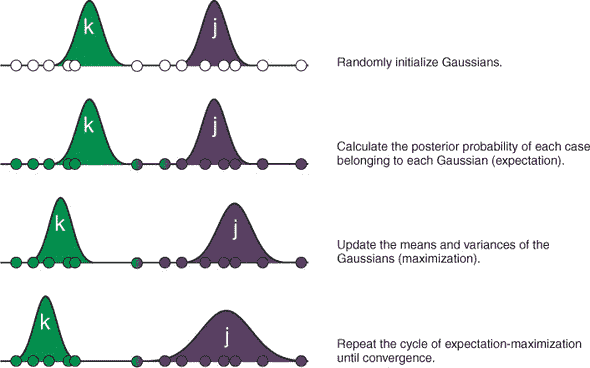

| |
| --- |

##### 注意

这是混合模型聚类与 k-means 相似的一种方式。我将在本章后面展示它们相似的其他方式。

| |
| --- |

一维高斯分布需要两个参数来定义它：均值和方差。因此，我们通过选择它们的均值和方差的随机值，在数轴上随机初始化两个高斯分布。让我们称这些高斯分布为 *j* 和 *k*。然后，给定这两个高斯分布，我们计算每个案例属于一个簇而不是另一个簇的概率。为此，我们可以使用我们的好朋友，贝叶斯定理。

回想一下第六章，我们可以使用贝叶斯定理来计算给定似然(*p*(*x*|*k*))、先验(*p*(*k*))和证据(*p*(*x*))的事件的后验概率(*p*(*k*|*x*))。

##### 方程 19.1

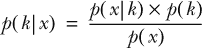

在这种情况下，*p*(*k*|*x*)是案例 *x* 属于高斯分布 *k* 的概率；*p*(*x*|*k*)是在从高斯分布 *k* 中采样时观察到案例 *x* 的概率；*p*(*k*)是随机选择的案例属于高斯分布 *k* 的概率；*p*(*x*)是从整个混合模型中采样时抽取案例 *x* 的概率。因此，证据*p*(*x*)是从任一高斯分布中抽取案例 *x* 的概率。

当计算一个事件或另一个事件发生的概率时，我们只需将每个事件独立发生的概率相加。因此，从高斯分布 *j* 或 *k* 中抽取案例 *x* 的概率是从高斯分布 *j* 中抽取的概率加上从高斯分布 *k* 中抽取的概率。从高斯分布中抽取案例 *x* 的概率是似然乘以该高斯分布的先验概率。考虑到这一点，我们可以更完整地写出贝叶斯定理，如方程 19.2 所示。

##### 方程 19.2

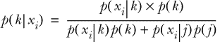

注意，证据已经被扩展，更具体地显示了从任一高斯分布中抽取案例 *x[i]* 的概率是独立抽取的概率之和。方程 19.2 使我们能够计算案例 *x[i]* 属于高斯分布 *k* 的后验概率。方程 19.3 展示了相同的计算，但针对案例 *x[i]* 属于高斯分布 *j* 的后验概率。

##### 方程 19.3


到目前为止，一切顺利。但我们如何计算似然和先验概率呢？似然是高斯分布的概率密度函数，它告诉我们从具有特定均值和方差组合的高斯分布中抽取具有特定值的案例的相对概率。高斯分布 *k* 的概率密度函数在方程式 19.4 中显示，但不需要你记住它：

##### 方程式 19.4。

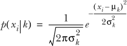

其中 μ*[k]* 和 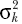 分别是高斯 *k* 的均值和方差。

在算法开始时，先验概率是随机生成的，就像高斯分布的均值和方差一样。这些先验概率在每次迭代中都会更新，成为每个高斯分布后验概率的总和除以案例数。你可以将这视为所有案例中特定高斯分布的后验概率均值。

#### 19.1.2. EM 算法的期望和最大化步骤

现在你已经拥有了理解后验概率如何计算的知识，让我们看看 EM 算法如何迭代地拟合混合模型。EM 算法（正如其名称所暗示的）有两个步骤：期望和最大化。期望步骤是计算每个案例、每个高斯分布的后验概率。这可以在图 19.1 从上数第二部分中看到。

在这个阶段，算法使用我们之前设定的贝叶斯定理来计算后验概率。图 19.1 中数轴上的案例被阴影覆盖，以表示它们的后验概率。

接下来是最大化步骤。最大化步骤的任务是更新混合模型的参数，以最大化潜在数据的似然。这意味着更新高斯分布的均值、方差和先验概率。

更新特定高斯分布的均值涉及将每个案例的值加起来，并乘以它们对该高斯分布的后验概率，然后除以所有后验概率的总和。这可以在方程式 19.5 中看到。

##### 方程式 19.5。

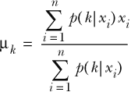

想想看。接近分布均值的案例将具有该分布的高后验概率，因此会对更新的均值贡献更多。远离分布的案例将具有较小的后验概率，对更新的均值贡献较少。结果是高斯分布会向在此高斯分布下最可能的案例均值移动。你可以在图 19.1 的第三部分中看到这一过程的说明。

每个高斯分布的方差以类似的方式更新。我们计算每个案例与高斯均值之间的平方差，乘以该案例的后验概率，然后除以后验概率的总和。这可以在方程 19.6 中看到。结果是，高斯分布将根据在此高斯下最可能案例的分布范围变宽或变窄。你还可以在图 19.1 的第三部分中看到这一点的说明。

##### 方程 19.6.

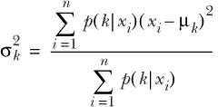

最后要更新的是每个高斯分布的先验概率。如前所述，新的先验是通过将特定高斯的后验概率总和除以案例数量来计算的，如方程 19.7 所示。这意味着对于许多案例具有大后验概率的高斯分布，其先验概率将很大。

相反，对于很少案例具有大后验概率的高斯分布，其先验概率将很小。你可以将其视为将先验设置为属于每个高斯案例比例的软或概率等价物。

##### 方程 19.7.

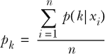

一旦最大化步骤完成，我们进行期望步骤的另一次迭代，这次计算每个案例在新高斯下的后验概率。完成此操作后，我们再次运行最大化步骤，再次根据后验更新每个高斯分布的均值、方差和先验。这种期望-最大化循环迭代进行，直到达到指定的迭代次数或模型下数据的整体似然变化小于指定的量（称为*收敛*）。

#### 19.1.3. 如果我们有多于一个变量呢？

在本节中，我们将扩展你关于一维 EM 算法工作原理的知识，将其扩展到多维聚类。遇到一元（一维）聚类问题的情况很少。通常，我们的数据集包含多个变量，我们希望使用这些变量来识别聚类。我在上一节中限制了高斯混合模型 EM 算法的解释，因为一元高斯只有两个参数：其均值和方差。当我们有一个多维高斯分布（多元高斯）时，我们需要使用其质心和其*协方差矩阵*来描述它。

我们在之前的章节中遇到了质心：质心简单地是一个均值向量，对于数据集中的每个维度/变量都有一个。协方差矩阵是一个方阵，其元素是变量之间的*协方差*。例如，协方差矩阵的第二行第三列的值表示数据中变量 2 和变量 3 之间的协方差。协方差是衡量两个变量一起变化的非标准化度量。正协方差表示当一个变量增加时，另一个变量也增加。负协方差表示当一个变量增加时，另一个变量减少。零协方差通常表示变量之间没有关系。我们可以使用方程 19.8 计算两个变量之间的协方差。

##### 方程 19.8。

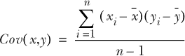

| |
| --- |

##### 注意

虽然协方差是两个变量之间关系的非标准化度量，但相关系数是两个变量之间关系的标准化度量。我们可以通过除以变量标准差的乘积将协方差转换为相关系数。

| |
| --- |

协方差矩阵中一个变量与自身的协方差简单地是该变量的方差。因此，协方差矩阵的对角线元素是每个变量的方差。

| |
| --- |

##### 小贴士

由于这个原因，协方差矩阵通常被称为*方差-协方差*矩阵。

| |
| --- |

如果 EM 算法只估计每个高斯分布在每个维度上的方差，那么高斯分布将与特征空间的轴垂直。换句话说，这会迫使模型假设数据中的变量之间没有关系。通常更有意义的是假设变量之间将存在某种程度的关系，并且估计协方差矩阵允许高斯分布在特征空间中对角线排列。

| |
| --- |

##### 注意

由于我们估计协方差矩阵，高斯混合模型聚类对不同尺度的变量不敏感。因此，我们*不需要*在训练模型之前对变量进行缩放。

| |
| --- |

当我们在多个维度上进行聚类时，EM 算法会随机初始化每个高斯分布的质心、协方差矩阵和先验概率。然后，在期望步骤中，它计算每个案例的每个高斯分布的后验概率。在最大化步骤中，每个高斯分布的质心、协方差矩阵和先验概率都会更新。EM 算法会继续迭代，直到达到最大迭代次数或算法收敛。二元情况的 EM 算法在图 19.2 中展示。

##### 图 19.2. 两个二维高斯的双向期望最大化算法。在特征空间中随机初始化两个高斯。在期望步骤中，为每个高斯计算每个案例的后验概率。在最大化步骤中，根据后验，更新每个高斯的中心、协方差矩阵和先验。这个过程一直持续到似然收敛。


**多元情况下的数学**

更新均值和（协）方差的方程比我们在单变量情况中遇到的要复杂一些。如果你感兴趣，这里它们是。

对于变量 a 的高斯 k 的均值是

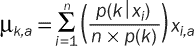

因此，高斯的重心就是一个向量，其中每个元素是不同变量的均值。

对于高斯 k 的变量 a 和 b 之间的协方差是

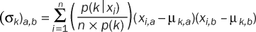

其中 σ*[k]* 是高斯 k 的协方差矩阵。

最后，在多元情况下，现在需要考虑协方差，因此现在变为


这个过程看起来熟悉吗——基于数据中的案例与聚类位置的距离，迭代更新聚类的位置？我们在第十六章中看到了类似的过程，即 k-means 算法。因此，高斯混合模型聚类扩展了 k-means 聚类，允许非球形聚类或不同直径（由于协方差矩阵）以及软聚类。实际上，如果你约束高斯混合模型，使得所有聚类都有相同的方差、没有协方差和相等的先验，你会得到与 Lloyd 算法提供的结果非常相似的结果！

### 19.2. 构建您的第一个用于聚类的高斯混合模型

在本节中，我将向您展示如何构建用于聚类的高斯混合模型。我们将继续使用瑞士银行纸币数据集，以便我们可以将结果与 DBSCAN 和 OPTICS 聚类结果进行比较。混合模型聚类相对于 DBSCAN 和 OPTICS 的一个直接优势是它对不同尺度的变量不变，因此我们不需要先对数据进行缩放。


##### 注意

为了正确性，我应该说明，只要我们没有对模型组件的协方差做出先前的指定，就没有必要对数据进行缩放。我们可以指定我们对组件的均值和协方差的先验信念，尽管我们在这里不会这样做。如果我们这样做，考虑数据的尺度对于协方差来说是很重要的。


mlr 包没有我们即将使用的混合建模算法的实现，因此我们将使用 mclust 包中的函数。让我们首先加载这个包：

```
library(mclust)
```

我特别喜欢使用 mclust 包进行聚类的几个方面。首先，它是唯一我知道在加载时会打印出酷炫标志的 R 包。其次，它显示一个进度条来指示聚类还需要多长时间（对于判断是否有时间泡一杯茶非常重要）。第三，它的模型拟合函数会自动尝试一系列聚类数量，并尝试选择最佳拟合数量。如果我们认为我们知道得更好，我们也可以手动指定聚类数量。

让我们使用`Mclust()`函数进行聚类，然后对结果调用`plot()`函数。

##### 列表 19.1。执行并绘制混合模型聚类

```
swissMclust <- Mclust(swissTib)

plot(swissMclust)
```

绘制`Mclust()`输出的结果有些奇怪（而且对我来说有些恼人）。它提示我们输入一个 1 到 4 的数字，对应以下选项之一：

1.  BIC

1.  分类

1.  不确定性

1.  密度

输入数字将绘制包含有用信息的相应图表。让我们依次查看这些图表。

我们可以获得的第一个图表显示了`Mclust()`函数尝试的聚类数量和模型类型的贝叶斯信息准则（BIC）。此图表显示在图 19.3。BIC 是用于比较不同模型拟合度的指标，它会对模型中过多的参数进行惩罚。BIC 通常定义为方程式 19.9。

##### 方程式 19.9。


其中 *n* 是案例数量，*p* 是模型中的参数数量，*L* 是模型的总体似然值。

因此，对于固定的似然值，随着参数数量的增加，BIC 会增加。相反，对于固定的参数数量，随着模型似然值的增加，BIC 会减少。因此，BIC 越小，我们的模型越好和/或越简洁。想象一下，我们有两个模型，它们都能同样好地拟合数据集，但一个有 3 个参数，另一个有 10 个。具有 3 个参数的模型将具有较低的 BIC。

##### 图 19.3。我们的 mclust 模型的 BIC 图。x 轴显示聚类数量，y 轴显示贝叶斯信息准则（BIC），每条线表示不同的模型，三位代码表示对协方差矩阵施加了哪些约束。在这个 BIC 排列中，较高的值表示更好的拟合和/或更简洁的模型。


图表中显示的 BIC 形式实际上是相反的，其形式如方程式 19.10 所示。经过这样的重新排列后，更好的拟合和/或更简洁的模型实际上会有更高的 BIC 值。

##### 方程式 19.10。


现在我们知道了 BIC 是什么以及如何解释它，但图 19.3 中的所有线条代表什么？嗯，`Mclust()`函数尝试了不同模型类型和簇数量的范围，为我们。对于模型类型和簇数量的每一种组合，该函数都会评估 BIC。这些信息通过我们的 BIC 图传达。但我说的是*模型类型*是什么意思？在我向您展示高斯混合模型如何工作时，我没有提到这一点。当我们训练混合模型时，我们可以对协方差矩阵施加约束，以减少描述模型所需的参数数量。这有助于防止数据过拟合。

每种模型类型在图 19.3 中由不同的线条表示，并且每种都有代表它的奇怪的三字母代码。每个代码的第一个字母指的是每个高斯分布的*体积*，第二个字母指的是*形状*，第三个字母指的是*方向*。这些组件中的每一个都可以取以下值之一：

+   *E*代表*相等*

+   *V*代表*变量*

形状和方向分量也可以取值为*I*，代表*恒等*。这些值对模型的影响如下：

+   体积分量：

    +   *E*—等体积的高斯分布

    +   *V*—不同体积的高斯分布

+   形状分量：

    +   *E*—具有相等纵横比的高斯分布

    +   *V*—具有不同纵横比的高斯分布

    +   *I*—完美球形的簇

+   方向分量：

    +   *E*—通过特征空间具有相同方向的高斯分布

    +   *V*—不同方向的高斯分布

    +   *I*—与特征空间轴正交的簇

因此，实际上，`Mclust()`函数为我们进行了一次调整实验，并会自动选择具有最高 BIC 值的模型。在这种情况下，最佳模型是使用三个高斯分布的 VVE 协方差矩阵的模型（使用`swissMclust$modelName`和`swissMclust$G`来提取此信息）。

##### 图 19.4。我们 mclust 模型的分类图。原始数据中的所有变量都在散点图矩阵中相互绘制，案例根据其簇进行着色和形状设计。椭圆表示每个高斯分布的协方差，星号表示它们的质心。


那是第一个图表，当然很有用。然而，最有用的图表可能是从选项 2 获得的图表。它显示了所选模型的最终聚类结果；请参见图 19.4。椭圆表示每个簇的协方差，每个簇中心的星号表示其质心。模型似乎很好地拟合了数据，并且似乎与我们的 DBSCAN 模型识别的两个簇相比，识别了三个相当有说服力的簇（尽管我们应该使用内部簇指标和 Jaccard 指数来更客观地比较模型）。

第三张图与第二张图类似，但它根据每个案例的不确定性设置其大小（见图 19.5）。如果一个案例的后验概率不是由单个高斯分布主导，那么它将具有高不确定性，而这个图有助于我们识别可能被视为异常值的案例。

##### 图 19.5. 我们 mclust 模型的不确定性图。这个图与分类图类似，但每个案例的大小对应于最终模型下的不确定性。


第四张和最后一张图显示了最终混合模型的密度（见图 19.6）。我发现这个图不太有用，但它看起来相当酷。要退出`Mclust()`的`plot()`方法，您需要输入`0`（这就是为什么我觉得这很烦人的原因）。

### 19.3. 混合模型聚类的优缺点

虽然通常不容易判断哪些算法会对特定任务表现良好，但以下是一些优点和缺点，这将帮助您决定混合模型聚类是否适合您。

混合模型聚类的优点如下：

+   它可以识别不同直径的非球形聚类。

+   它估计一个案例属于每个聚类的概率。

+   它对不同尺度的变量不敏感。

##### 图 19.6. 我们 mclust 模型的密度图。这个图的矩阵显示了特征空间中每个变量组合的最终模型的二维密度。


混合模型聚类的缺点如下：

+   虽然聚类不需要是球形的，但它们确实需要是椭圆形的。

+   它不能原生地处理分类变量。

+   它不能自动选择最佳聚类数量。

+   由于初始高斯分布的随机性，它有可能收敛到一个局部最优模型。

+   它对异常值敏感。

+   如果聚类不能由多元高斯近似，那么最终模型不太可能拟合良好。

| |
| --- |

**练习 1**

使用`Mclust()`函数训练模型，将`G`参数设置为`2`，将`modelNames`参数设置为`"VVE"`以强制使用两个聚类的 VVE 模型。绘制结果，并检查聚类。

| |
| --- |
| |

**练习 2**

使用`clusterboot()`函数，计算从双聚类和三聚类 VVE 模型生成的聚类的稳定性。提示：将`clustermethod`参数设置为`noisemclustCBI`以使用混合模型。比较不同数量聚类的 Jaccard 指数容易吗？

| |
| --- |

### 摘要

+   高斯混合模型聚类将一组高斯分布拟合到数据中，并估计数据来自每个高斯分布的概率。

+   使用期望最大化（EM）算法迭代更新模型，直到数据的似然收敛。

+   高斯混合建模是一种软聚类方法，它为我们提供了每个案例属于每个聚类的概率。

+   在一维中，EM 算法只需要更新每个高斯分布的均值、方差和先验概率。

+   在超过一维的情况下，EM 算法需要更新每个高斯分布的重心、协方差矩阵和先验概率。

+   可以对协方差矩阵施加约束，以控制高斯分布的体积、形状和方向。

### 练习题的解答

1.  使用两个簇训练 VVE 混合模型：

    ```
    swissMclust2 <- Mclust(swissTib, G = 2, modelNames = "VVE")

    plot(swissMclust2)
    ```

1.  比较两个簇和三个簇混合模型的聚类稳定性：

    ```
    library(fpc)

    mclustBoot2 <- clusterboot(swissTib, B = 10,
                             clustermethod = noisemclustCBI,
                             G = 2, modelNames = "VVE",
                             showplots = FALSE)

    mclustBoot3 <- clusterboot(swissTib, B = 10,
                               clustermethod = noisemclustCBI,
                               G = 3, modelNames = "VVE",
                               showplots = FALSE)

    mclustBoot2

    mclustBoot3

    # It can be challenging to compare the Jaccard indices between models with
    # different numbers of clusters. The model with three clusters may better
    # represent nature, but as one of the clusters is small, the membership is
    # more variable between bootstrap samples.
    ```

## 第二十章。最后的笔记和进一步阅读

*本章涵盖*

+   我们所涵盖内容的简要总结

+   进一步拓展知识的路线图

抽空回顾一下本书中涵盖的所有主题。我们涵盖了大量的信息，现在我们接近本书的结尾，我想将所有这些内容整合起来，给你一个更全面的视角。在大学时，我常常对那些认为因为他们教了我们某些东西，我们就应该简单地记住它们的讲师感到沮丧。我知道这并不是大多数人学习的方式，你很可能已经忘记了我在本书中试图教授的许多细节。没关系——我希望你觉得你可以将这本书作为你未来可能从事的机器学习项目的参考。在本章中，我还总结了本书中涉及到的许多广泛而重要的概念。

完成本书后，你将在工具箱中拥有大量的机器学习算法——足够解决各种各样的问题。我也希望你现在知道了一种通用的机器学习方法，并且更重要的是，如何客观地评估你的模型构建过程的表现。虽然我为你提供了“面包和黄油”算法以及现代算法，但机器学习研究进展迅速。还有许多我没有涵盖的算法，例如深度学习、强化学习和异常检测中使用的算法。因此，在本章中，我还为你提供了几个未来学习的潜在途径。当我学到新东西时，当我到达教科书结尾却不知道下一步该去哪里时，我会感到沮丧；所以，我会推荐额外的书籍和资源来进一步你的学习。

### 20.1\. 机器学习概念的简要回顾

在本节中，我将总结本书中涵盖的通用机器学习概念，并在进行过程中引用相关的章节。这些概念包括以下内容：

+   机器学习算法的类型

+   偏差-方差权衡

+   模型验证

+   超参数调整

+   缺失值插补

+   特征工程和特征选择

+   集成技术

+   正则化

我希望现在你已经完成了本书，这些概念将更具体地融入你对机器学习的整体理解中。

#### 20.1.1\. 监督学习、无监督学习和半监督学习

根据算法是否有访问标记数据的权限：在训练模型时我们是否可以访问真实值，可以将机器学习任务分为**监督学习**和**无监督学习**。那些在数据中学习可用于预测真实值的模式的算法被称为**监督学习**。根据它们预测的输出变量的类型，监督机器学习算法可以进一步区分。预测分类变量（或类别）的监督学习算法被称为**分类算法**，而预测连续变量的算法被称为**回归算法**。


##### **注意**

一些算法——如 k 近邻、随机森林和 XGBoost——可以用于**分类**和**回归**。


**无监督**算法在没有任何形式真实值的情况下学习数据中的模式。我们可以根据它们的目的来区分这些算法。可以将将高维数据集中的信息压缩到低维表示的无监督学习算法称为**降维算法**。将找到比其他组中的案例更相似的案例组的无监督学习算法称为**聚类算法**。

您第一次遇到这些定义是在第 1.2 节，早在第一章。我在图 20.1 中重新绘制了图 1.5：它总结了监督学习和无监督学习之间的差异。

##### 图 20.1\. 监督学习与无监督学习。监督算法使用已经标记有真实值的标签数据来构建一个可以预测新、未标记数据标签的模型。无监督算法使用未标记的数据，并学习其中的模式，以便可以将新数据映射到这些模式上。


##### **注意**

尽管我在第一章中没有提到这一点，但并非所有无监督算法都能对新数据进行预测。例如，层次聚类和 t-SNE 模型无法对新数据进行预测。


在**监督学习**和**无监督学习**之间有一个被称为**半监督学习**的方法。半监督学习是一种方法，而不是一种算法，当我们可以访问部分标记的数据时很有用。如果我们能够尽可能精确地标记数据集中的案例，那么我们可以仅使用这些标记数据构建一个监督模型。我们使用这个模型来预测数据集中其余部分的标签。现在我们将数据与手动标签和伪标签结合起来，并使用这些数据来训练一个新的模型。

图 20.2 展示了本书中使用的所有机器学习算法，将它们分为监督学习和无监督学习，以及分类、回归、降维和聚类。我的希望是，当你在决定哪些算法最适合当前任务时，可以参考这个图，并且随着你知识的增长，你将添加更多列在这里的算法。

##### 图 20.2\. 本书涵盖的算法总结，无论它们是监督学习器还是无监督学习器，以及它们是否可用于分类、回归、降维或聚类


#### 20.1.2\. 平衡模型性能的偏差-方差权衡

在训练预测模型时，评估它在现实世界中的表现非常重要。在评估我们模型的表现时，我们*永远*不应该使用我们用来训练模型的数据来评估它们。这是因为模型在预测用于训练它们的数据时几乎总是表现得比在预测未见数据时更好。

在第三章中，你了解到在评估模型性能时，一个重要的概念是偏差-方差权衡。随着模型复杂性的增加，以及它对训练集的拟合程度越紧密，它在未见数据上的预测将变得更加多变。过于简单且无法很好地捕捉数据中关系的模型倾向于做出持续较差的预测。当我们增加模型的复杂性时，其方差会增加，其偏差会减少；反之亦然。

因此，偏差-方差权衡描述了过拟合（训练一个拟合训练集噪声的模型）和欠拟合（训练一个拟合训练集较差的模型）之间的平衡。在过拟合模型和欠拟合模型之间，存在一个最优拟合模型，其预测可以很好地推广到未见数据。判断我们是否欠拟合或过拟合的方法是使用交叉验证。然而，即使只是将训练集再次通过模型，也会告诉你你是否欠拟合，因为模型的表现会较差。

#### 20.1.3\. 使用模型验证来识别过拟合/欠拟合

为了评估模型在新数据上预测的效果，我们需要将新的、未见过的数据通过模型，并查看其预测与真实值之间的匹配程度。一种方法是在手头的数据上训练模型，然后，随着新数据的生成，将数据通过模型来评估其预测。这个过程可能会使模型构建过程持续数年，因此一个更现实的方法是将数据分为训练集和测试集。这样，模型使用训练集进行训练，并给出测试集以进行预测。这个过程被称为*交叉验证*，你已经在第三章中了解过它。

将数据集分为训练集和测试集有多种方法。保留法交叉验证是最简单的，其中数据集中的案例比例被“保留”为测试集，模型在剩余的案例上进行训练。由于分割通常是随机的，因此保留法交叉验证的结果高度依赖于测试集中保留的案例比例以及进入测试集的案例。因此，保留法交叉验证在多次运行时可能会给出相当可变的结果，尽管它是计算成本最低的方法。我在图 20.3 中重现了图 3.12：它展示了一个说明保留法交叉验证的示意图。

##### 图 20.3\. 保留法交叉验证。数据被随机分为训练集和测试集。训练集用于训练模型，然后用于在测试集上做出预测。预测与测试集真实值之间的相似性用于评估模型性能。


K 折交叉验证将案例随机划分为近等大小的*k*个折。对于每个折，折内的案例用作测试集，而剩余的数据用作训练集。然后返回所有折的平均性能指标。K 折交叉验证相对于保留法交叉验证的优势在于，因为每个案例只被用作测试集一次，所以结果变化较小，尽管结果将对我们选择的折数敏感。为了使结果更加稳定，我们可以使用重复 K 折交叉验证，其中整个 K 折过程重复多次，每次重复随机打乱案例。我在图 20.4 中重现了图 3.13：它说明了 K 折交叉验证。

##### 图 20.4\. K 折交叉验证。数据被随机分为近等大小的折。每个折被用作测试集一次，其余数据用作训练集。预测与测试集真实值之间的相似性用于评估模型性能。


留一法交叉验证是 k 折交叉验证的极端情况，其中折数等于数据集中的案例数。这样，数据集中的每个案例都作为测试集使用一次，模型使用所有其他案例进行训练。留一法交叉验证通常比 k 折交叉验证给出更多变动的性能估计，除非数据集很小，在这种情况下，k 折交叉验证可能由于训练集小而给出更多变动的估计。我在图 20.5 中重现了图 3.14；它说明了留一法交叉验证。

许多人在训练机器学习模型时犯的一个最常见的错误是没有将他们的数据依赖预处理步骤包含在交叉验证过程中。如果这个预处理包括任何超参数的调整，那么使用嵌套交叉验证是非常重要的。这样做可以确保我们用于模型最终评估的数据完全没有被模型看到过。

嵌套交叉验证首先将数据分成训练集和测试集（可以使用保留法、k 折法或留一法来完成）。这种划分称为*外层循环*。训练集用于交叉验证超参数搜索空间中的每个值。这称为*内层循环*。从每个内层循环中给出最佳交叉验证性能的超参数传递到外层循环。在外层循环的每个训练集上训练一个模型，使用其内层循环的最佳超参数，并使用这些模型在其测试集上进行预测。然后报告这些模型在外层循环中的平均性能指标，作为模型在未见数据上表现的一个估计。我在图 20.6 中重现了图 3.16；它说明了嵌套交叉验证。在这个例子中，我们使用 3 折交叉验证作为外层循环，4 折作为内层循环。

##### 图 20.5\. 留一法交叉验证是 k 折交叉验证的极端情况，其中我们保留一个案例作为测试集，并在剩余数据上训练模型。使用测试集的真实值来评估模型性能的相似性。


##### 图 20.6\. 嵌套交叉验证。数据集被分成几个折。对于每个折，使用训练集创建内层 k 折交叉验证的集合。这些内层集合中的每一个通过将数据分成训练集和测试集来交叉验证单个超参数值。对于这些内层集合中的每个折，使用训练集训练一个模型，并在测试集上评估，使用该集合的超参数值。从每个内层交叉验证循环中给出最佳性能模型的超参数用于在外层循环中训练模型。


| |
| --- |

**训练集、测试集和...验证集？**

你可能会看到其他人将他们的数据分为训练集、测试集和*验证集*。我想向你展示这只是一个嵌套交叉验证的特殊情况。当使用这种方法时，人们使用具有一系列超参数值的训练集来训练模型，并使用测试集来评估这些超参数值的性能。然后，具有最佳性能超参数值的模型被赋予验证集来进行预测。模型在验证集上的性能被用作模型构建过程性能的最终指标。这一点的重要性在于，验证集在训练过程中没有被模型看到，包括在超参数调整期间，因此模型不会泄露有关验证集中存在的模式的信息。

现在再次看看图 20.6 中的示意图。你能看到将数据分为训练集、测试集和验证集只是嵌套交叉验证，其中内循环和外循环都使用保留交叉验证吗？我使用“嵌套”这个术语是因为它为我们提供了一个比仅仅将数据分为训练集、测试集和验证集更灵活的工具集来评估模型性能。例如，它允许我们在内循环和外循环中使用更复杂的交叉验证策略，甚至可以在它们之间混合不同的策略。


#### 20.1.4. 使用超参数调整最大化模型性能

许多机器学习算法都有控制它们如何学习的超参数。*超参数*是一个变量、设置或选项，不能直接从数据本身估计出来。为任何给定的算法和数据集选择最佳超参数组合的最佳方式是使用超参数调整。

超参数*调整*是迭代尝试不同超参数组合的模型，并选择给出最佳性能模型的组合的过程。调整过程应伴随着交叉验证，其中，对于每个超参数组合，模型在训练集上训练并在测试集上评估。

如果我们需要搜索的超参数值范围较小，那么使用网格搜索方法通常是有益的。在网格搜索中，我们简单地尝试搜索空间中定义的每个超参数值的组合。网格搜索是唯一保证能够从我们的搜索空间中选择最佳超参数组合的搜索方法。

但是，当处理多个超参数，或者搜索空间变得非常大时，网格搜索可能会变得过于缓慢。在这种情况下，我们可以采用随机搜索。随机搜索从搜索空间中随机采样超参数的组合，进行尽可能多的迭代。随机搜索不能保证找到最佳性能的超参数组合，但它通常可以在网格搜索所需时间的一小部分内找到接近的近似值。

无论我们使用哪种搜索方法，作为一个数据依赖的前处理步骤，将超参数调整纳入我们的交叉验证策略中，以嵌套交叉验证的形式，是至关重要的。

#### 20.1.5\. 使用缺失值插补处理缺失数据

*缺失值插补* 是使用合理值填充数据集中缺失数据的一种实践，这样我们仍然可以使用完整的数据集来训练模型。另一种选择是丢弃任何缺失数据的案例。

一种简单的插补缺失值的方法是将缺失值简单地替换为连续变量的均值或中位数（正如我们在 第四章 中所做的那样）或分类变量的众数。问题是这种方法会给任何你训练的模型添加偏差，并丢弃关于数据中可能具有预测价值的关系的信息。因此，更好的方法是使用另一个机器学习算法来估计缺失数据的合理值，基于该案例其他变量的值（正如我们在 第九章 和 第十章 中所做的那样）。例如，我们可以使用 k 最近邻算法找到与问题案例最相似的案例的缺失值。作为一个数据依赖的前处理步骤，缺失值插补应包含在交叉验证过程中。

#### 20.1.6\. 特征工程和特征选择

*特征工程* 是从现有变量中提取有用/预测信息的一种实践，当数据目前处于不太有用的格式时。例如，这可能包括从转录的医疗记录中提取性别，或者将各种财务指标结合起来创建市场稳定性的指数。特征工程通常需要一些领域知识，以及对哪些特征可能影响结果变量的思考。我们首次在 第四章 中介绍了特征工程，并在 第十章 中再次使用它。

另一方面，*特征选择* 关注的是移除对模型贡献很少或没有预测信息的变量。通过这样做，我们可以防止过拟合和维度诅咒。你曾在 第九章 中了解到，特征选择可以以两种不同的方式进行：过滤方法和包装方法。

过滤方法在计算上成本较低，但不太可能得到特征选择的最佳结果。它们依赖于计算每个特征与结果变量之间关系的一些度量。这个度量可以简单地是每个特征与结果之间的相关性，例如。然后我们可以筛选掉与结果关系较弱的特定数量或比例的特征。

包装方法在计算上成本较高，但更有可能得到拟合度更好的模型。它们包括迭代地拟合和评估不同排列的预测变量模型。选择给出最佳性能模型变量组合。

特征工程和选择非常重要——可以说比我们选择算法更重要。我们可以使用最前沿、性能最高的算法，但如果我们的特征没有充分利用它们所包含的预测信息，或者数据中有许多无关变量，我们的模型的表现可能不会像预期的那样好。如果我们的特征工程/选择过程依赖于数据，那么在交叉验证中包含它们是很重要的。

#### 20.1.7\. 使用集成技术提高模型性能

大多数监督机器学习算法的性能可以通过结合集成技术来提高。*集成*是指，而不是训练单个模型，我们训练多个模型，这些模型帮助我们减少过拟合并提高预测的准确性。有三种类型的集成技术：

+   分袋法

+   提升法

+   堆叠

你在第八章和第十二章中分别学习了分类和回归的集成技术。

*分袋法*（也称为*自助聚合*）包括从原始数据集中创建多个自助样本，并在每个样本上并行训练模型。然后，将新数据传递给每个单独的模型，并返回模型或平均预测（对于分类和回归问题分别）。分袋法帮助我们避免过拟合，因此可以减少我们模型的方差。分袋法几乎可以用于任何监督学习算法（以及一些聚类算法），但它在随机森林算法中最著名的实现，该算法使用分类/回归树。

当 bagging 并行训练模型时，*boosting*按顺序训练模型，其中每个后续模型都试图改进现有模型链中的错误。在自适应提升中，现有集成模型错误分类的案例被赋予更高的权重，这样它们在下一迭代中更有可能被采样。AdaBoost 是自适应提升的唯一知名实现。在梯度提升中，每个额外模型通过最小化现有集成模型的残差误差。XGBoost 是使用分类/回归树进行梯度提升的著名实现；但就像 bagging 一样，boosting 可以与任何监督学习算法一起使用。

在*堆叠*中，我们创建了一些基础模型，这些模型擅长学习特征空间中的不同模式。一个模型可能在特征空间的一个区域预测得很好，但在另一个区域犯错误。其他模型中的一个可能在做得不好的特征空间区域中预测值做得很好。基础模型做出的预测被用作预测变量（连同所有原始预测变量）由最终的堆叠模型使用。这个堆叠模型随后能够从基础模型的预测中学习，以做出更准确的预测。

#### 20.1.8\. 使用正则化防止过拟合

*正则化*描述了一组技术，用于限制模型参数的幅度，以防止过拟合。正则化对于防止由于包含预测值很小或没有预测价值的预测因子而导致的过拟合尤为重要。你在第十一章中了解到，最常见的形式是 L2 和 L1 正则化。

在 L2 正则化中，模型的损失函数增加了一个惩罚项，即模型参数的 L2 范数，通过可调的超参数*lambda*加权。模型参数的 L2 范数是参数值的平方和。L2 正则化的效果是模型参数可以被缩小到零（但永远不会缩小到零，除非普通最小二乘[OLS]估计为零），预测能力较弱的预测因子会受到更大的惩罚。岭回归是使用 L2 正则化来防止线性回归中过拟合的一个例子。

在 L1 正则化中，我们向损失函数中添加 L1 范数，通过*lambda*加权。L1 范数是参数值的绝对值之和。L1 正则化的效果是模型参数可以被缩小到零，从而有效地从模型中移除它们。因此，L1 正则化是一种自动特征选择的形式。LASSO 是使用 L1 正则化来防止线性回归中过拟合的一个例子。

### 20.2\. 从这里你可以走向何方？

你可能想知道你在机器学习教育中的下一步是什么。这完全取决于你想要实现的目标，但在本节中，我会为你指明一些你可以用来进一步发展你的知识和技能的优秀资源。然而，我坚信，巩固新知识最好的方式是使用它——所以，在你的工作中使用本书中学到的技术和算法，并将它们教授给你的同事！

#### 20.2.1\. 深度学习

如我在本书开头所提到的，我省略了深度学习（使用人工神经网络的机器学习），因为我认为它值得一本单独的书籍。但任何机器学习教育如果没有涉及这个非凡领域，都不能算是全面的。神经网络是任何机器学习任务的强大工具，但如果你的工作将围绕计算机视觉、图像/视频的分类，或构建其他复杂数据（如音频文件）的模型，那么深度学习是你必须探索的重要途径。对于 R 语言，我非常推荐 Francois Chollet 和 Joseph J. Allaire 的《用 R 进行深度学习》（Manning, 2018, [www.manning.com/books/deep-learning-with-r](http://www.manning.com/books/deep-learning-with-r)）。这本书对非专业人士来说很容易理解，并将加强我们在本节中介绍的一些基本机器学习概念。

#### 20.2.2\. 强化学习

*强化学习*是机器学习研究和应用的前沿领域，其中的算法通过在做出良好决策时获得奖励来从经验中学习。通常与监督学习和无监督学习算法并列为机器学习算法的第三类，它已被用于创建能够战胜世界冠军棋手的棋类机器人。如果你对强化学习感兴趣，我强烈推荐 Max Pumperla 和 Kevin Ferguson 的《深度学习与围棋》（Manning, 2019, [www.manning.com/books/deep-learning-and-the-game-of-go](http://www.manning.com/books/deep-learning-and-the-game-of-go)）。

#### 20.2.3\. 通用 R 数据科学和 tidyverse

如果你想要提高你的 R 数据科学技能，以及更熟练地使用 tidyverse 工具（包括我们未使用的一些工具），我推荐 Garrett Grolemund 和 Hadley Wickham 的《R 数据科学》（O’Reilly Media, 2016）。

如果你想要成为 ggplot2 的大师，那么请购买 Hadley Wickham 的《ggplot2》（Springer International Publishing, 2016）。

如果你已经具备相当好的 R 技能，并想了解更多关于语言的工作原理以及如何进行更高级的编程（例如面向对象编程），你将喜欢 Hadley Wickham 的《高级 R》（CRC Press, 2019）。你可能注意到这个人 Hadley 经常出现；如果你想跟上 R 社区和 tidyverse 的发展，跟随他是个不错的选择。

#### 20.2.4\. mlr 教程和创建新的学习器/度量

在书中，我提到过几次，某个特定的算法尚未在 mlr 中实现。mlr 包旨在使你的机器学习体验更加流畅，而不是减少灵活性；所以，如果你希望在另一个包（或你自己的）或新的性能度量中实现算法，实际上自己来做并不难。你可以在 mlr 网站上找到如何做到这一点的教程（以及其他有用的信息和资源）：[`mng.bz/5APD`](http://mng.bz/5APD)。

#### 20.2.5\. 广义加性模型

如果你的工作将涉及回归任务中的非线性关系建模，我建议你深入了解广义加性模型（GAMs）的内部工作原理。对于 R 语言，一个很好的地方是西蒙·伍德的《广义加性模型：R 语言导论》（Chapman and Hall/CRC，2017）。

#### 20.2.6\. 集成方法

对集成方法感到兴奋吗？在这本书中，我们只是触及了表面，使用了基于树的模型进行集成。如果你确信集成几乎总是可以使模型变得更好，我建议你阅读周志华的《集成方法：基础与算法》（Chapman and Hall/CRC，2012）。

#### 20.2.7\. 支持向量机

对支持向量机（SVMs）如何扭曲特征空间以创建线性边界感到兴奋吗？SVMs 非常受欢迎，其理论相当复杂。为了了解更多关于如何利用它们的预测能力，我推荐安德烈亚斯·克里斯曼和英戈·斯坦瓦特的《支持向量机》（Springer，2008）。

#### 20.2.8\. 异常检测

有时候你可能对数据中的常见模式不感兴趣。有时候，你真正感兴趣的是那些不寻常的、异常的案例。例如，你可能正在尝试识别信用卡上的欺诈活动，或者尝试识别来自恒星的罕见辐射爆发。在数据集中识别这样的罕见事件可能具有挑战性，但机器学习中的一个领域称为*异常检测*正是致力于解决这些问题。这本书中你遇到的一些算法可以重新用于异常检测，例如 SVM 算法。如果你对罕见和异常的事物有偏好，可以看看基山·G·梅赫罗特拉、奇卢库里·K·莫汉和华明·黄合著的《异常检测原理与算法》（Springer，2017）。

#### 20.2.9\. 时间序列

本书没有涉及的是时间序列预测。这是机器学习和统计学中关注基于变量的先前状态预测其未来状态的领域。时间序列预测的常见应用包括预测股票市场变量的波动和预测天气模式。如果你想致富或保持干燥，我会从保罗·科珀特韦特和安德鲁·梅特卡夫合著的《R 语言时间序列导论》（Springer，2009）开始。

#### 20.2.10\. 聚类

在聚类方面，我们已经覆盖了相当多的内容，但还有更多内容等待您去深入研究。要了解更多信息，我推荐 Charu Aggarwal 的《数据聚类：算法与应用》（Chapman & Hall/CRC，2013 年）。

#### 20.2.11. 广义线性模型

对广义线性模型能够扩展到预测类别，就像我们在逻辑回归中所做的那样感到印象深刻吗？我们可以使用同样的原理来预测计数数据（如泊松回归）或百分比（如贝塔回归）。当我们的结果不是一个正态分布的连续变量时，广义线性模型是处理这种情况的扩展形式。它在构建预测模型时提供了非凡的灵活性，同时仍然允许完全解释模型参数。要了解更多信息，我推荐 Peter K. Dunn 和 Gordon K. Smyth 的《广义线性模型及其在 R 中的应用》（Springer，2018 年），尽管如果您在线性建模方面没有良好的数学基础，可能会觉得这本书很难读。

#### 20.2.12. 半监督学习

如果您有手动标记数据既耗时又昂贵的问题，您可能可以从半监督学习的应用中受益。要了解更多信息，我推荐 Olivier Chapelle、Bernhard Scholkopf 和 Alexander Zien 的《半监督学习》（MIT Press，2006 年）。

#### 20.2.13. 光谱数据建模

如果您将要处理光谱数据，或者可以用平滑函数表示的数据，您将需要具备功能数据分析的良好基础（在第十章中简要提及）。功能数据分析是我们将函数作为模型中的变量使用，而不是使用单个值。要了解更多信息，我推荐 James Ramsay 的《功能数据分析》（Springer，2005 年）。

### 20.3. 最后一个词

我真心希望，通过阅读这本书，您所获得的技术能够帮助您深入理解您正在研究的那部分自然，帮助您优化和改进您的商业实践，或者只是帮助您从您的数据科学项目爱好中获得更多。我还希望，书中使用的 tidyverse 技能能够帮助您编写更简单、更易读的代码，而您的新 mlr 技能将继续使您的机器学习项目变得更加简单。

感谢您的阅读！
