## 附录. 统计概念复习

如果你没有统计学背景，或者只是想复习一下某些统计概念，这个附录旨在帮助你掌握阅读本书所需的基本知识。如果你不确定是否需要使用这个复习资料，翻阅一下章节标题，确保没有你不自信的内容。你不需要记住任何这些材料，只需了解重要的概念。此外，在阅读本书的过程中，你也可以随时参考这里的任何定义。

## A.1\. 数据词汇

让我们从我们将用来描述数据的某些基本词汇开始。数据科学家和统计学家在术语使用上存在一些差异，所以我将尽力说明哪些术语是等效的，以及我在整本书中选择的术语。在本节中，我们将讨论

+   样本与总体的区别

+   我们所说的行、列、案例和变量的含义

+   不同类型变量及其区别

#### A.1.1\. 样本与总体

在数据科学和统计学中，我们通常试图了解现实世界中的某些内容，或者预测某些内容。比如说，我们对河马的獠牙长度感兴趣。不可能测量世界上每只河马的獠牙长度——数量太多，而且它们并不愿意我们把尺子放进它们的嘴里。因此，我们测量尽可能多的河马獠牙，从财务和时间成本的角度来看都是可行的。这个更小、更易于管理的河马数量被称为我们的*样本*。我们希望样本中的獠牙长度能够很好地代表世界上所有河马的獠牙长度，这是我们试图推广发现的*总体*。样本与总体之间的区别在图 A.1 中得到了说明。

##### 图 A.1\. 总体与样本的区别。总体是我们希望将结果推广到的所有单位的集合。总体通常被认为几乎是无限的。样本是我们测量的一个更易于管理的子集，我们希望它能代表总体。

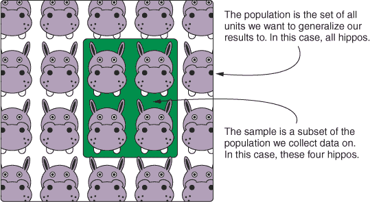

样本与总体之间的差异被称为*抽样误差*，它产生的原因是样本几乎永远不会是总体的完美代表。我们希望通过使用尽可能大的样本，并在创建样本时避免引入偏差（例如，不是选择较小的河马因为它们不那么可怕）来使抽样误差尽可能小。如果抽样误差太大，我们就无法将我们的发现推广到更广泛的总体。

#### A.1.2\. 行与列

收集到我们的数据后，大多数情况下我们可以将其结构化为带有行和列的表格格式。在 R 中，表示此类数据的一种常见方式是使用数据框。

如 第二章 所解释的，我们通常需要根据我们的目标重新排列表格数据的结构，但大多数时候，我们希望以这样的方式格式化数据，即每一行代表我们样本的单个单位，每一列代表不同的 *变量*。在我们的河马例子中，每只河马都是数据集中的单个单位，因此每一行将对应于对单个河马进行的测量，如 表 A.1 所示。

##### 表 A.1\. 数据以表格格式排列的示例，其中每一行对应一只单独的河马，每一列对应不同的变量。请注意，从文化角度来看，河马给它们的孩子起名时以 *H* 开头。

| Name | TuskLength | Female |
| --- | --- | --- |
| Harry | 32 | FALSE |
| Hermione | 15 | TRUE |
| Hector | 45 | FALSE |
| Heidi | 20 | TRUE |

我们可以在 R 中使用 `data.frame()` 函数创建类似的数据框，如下面的列表所示。

##### 列表 A.1\. 创建我们的河马数据框

```
hippos <- data.frame(
  Name = c("Harry", "Hermione", "Hector", "Heidi"),
  TuskLength = c(32, 15, 45, 20),
  Female = c(FALSE, TRUE, FALSE, TRUE)
  )
```

在统计学中，当数据以这种方式格式化时，每一行都对应数据中的一个 *主体*，这里的主体是指一只单独的河马。在数据科学和机器学习中，更常见的是使用术语 *案例* 来描述数据中的单个单位，因此我在整本书中使用了这个术语。

包含对每个案例进行测量的列被称为 *变量*。当我们试图根据与其他变量的关系预测一个变量的值时，我们使用术语来区分我们想要预测的变量和用于预测的变量。统计学家将我们试图预测的变量称为 *因变量*，而用于做出这些预测的变量称为 *自变量*。在数据科学中，你更有可能听到术语 *结果变量* 或 *响应变量* 来指代因变量，以及 *预测变量* 或 *特征* 来指代自变量。我在整本书中使用了数据科学的术语。

#### A.1.3\. 变量类型

不同的变量可能使用不同的尺度进行测量，这意味着我们需要以不同的方式处理它们。在整本书中，我提到了连续变量、分类变量，有时还有逻辑变量。

连续变量代表在数值连续体上的某种测量。例如，河马的獠牙长度可以用连续变量来表示。我们可以对连续变量应用数学变换。在 R 中，连续变量最常见地表示为 *整数* 或 *双精度浮点数*。整数变量只能有整数，而双精度浮点数可以在小数点后包含非零数字。在 表 A.1 中显示的数据中，`TuskLength` 变量是数值型的。

分类别变量有*级别*，每个级别代表一组或一类不同的对象。例如，假设我们正在比较河马和侏儒河马的獠牙长度。我们的数据将包含一个类别变量，指示数据中的每个案例属于哪种河马物种。在 R 中，通常将类别变量表示为*因子*，其中因子的可能级别是预定义的。在表 A.1 中显示的数据中，`Name`变量是类别变量。

逻辑变量可以取`TRUE`或`FALSE`的值，以表示二元结果。例如，我们可以包含一个逻辑变量来指示河马是否试图咬我们。逻辑变量作为函数的参数最有用，以控制它们的行为，或选择对我们最有兴趣的案例。在表 A.1 中显示的数据中，`Female`变量是逻辑变量。

下面的列表显示了我们可以如何使用`class()`函数来确定我们正在处理什么类型的变量。

##### 列表 A.2. 使用`class()`确定变量类型

```
class(hippos$Name)
[1] "factor"

class(hippos$TuskLength)
[1] "numeric"

class(hippos$Female)
[1] "logical"
```

## A.2. 向量

##### 图 A.2. 一个位于 x = 3, y = 5 点的二维向量的示例。箭头显示了向量如何编码大小，我们可以将其表示为它们与原点（或另一个向量）的距离。表示 x 轴与箭头之间角度的曲线线表示向量如何编码方向。

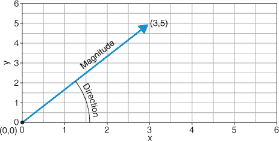

*向量*是一组编码大小和方向的数字。想象一个有 x 轴和 y 轴的坐标系，如图 A.2 所示。如果我们在这个坐标系中选取一个点，这个点将具有每个轴的值：比如说 x = 3 和 y = 5。我们可以将这个点表示为向量(3,5)。向量编码大小，因为我们可以计算由这个向量定义的点与坐标系原点（0,0）之间的距离。向量也编码方向，因为如果我们从原点（0,0）画一条线连接到这个点（3,5），我们可以计算这条线与坐标系轴之间的角度。图 A.2 是一个二维向量的示例，但向量可以有我们想要的任意维度。

我们可以使用向量执行操作，如加法、减法和乘法，以创建新的向量。在本书中，我们不会使用向量进行任何复杂的数学运算，但有时当我们处理超过两个维度的概念时，我会提到向量。例如，在本书的一些部分，我提到了均值向量，其中向量的每个元素是不同变量的均值。

令人困惑的是，R 有一个称为*原子向量*的数据结构，它可能或可能不表示数学向量。R 中的原子向量包含一组必须都是相同类型的值（这就是名字中“原子”一词的来源）。如果原子向量的元素是数值的，那么它也将是数学意义上的向量，因为值编码了大小和方向。但是，如果我们有包含字符或逻辑元素的原子向量，这些元素都无法编码大小和方向；因此，尽管我们在 R 中称它们为向量，但在数学意义上它们并不是向量。以下是使用`c()`函数创建数值、字符和逻辑原子向量的方法。

##### 列表 A.3。在 R 中创建原子向量

```
numericVector <- c(1, 31, 10)

characterVector <- c("common hippo", "pygmy hippo")

logicalVector <- c(TRUE, TRUE, FALSE)
```

## A.3。分布

当我们测量一个变量时，通常希望检查变量所取值的范围。例如，我们可以使用直方图来做这件事，其中我们将变量的可能值与观察到的每个值的频率进行对比。从绘制此类直方图得到的形状代表我们变量的*分布*，并告诉我们有关变量中心位置、分散程度、其值是否围绕中心对称分布以及它有多少个峰值等信息。

我们可以使用各种统计量来总结变量的分布，例如那些总结分布中心趋势的统计量，那些总结分散度的统计量，以及那些总结形状和对称性的统计量。然而，检查我们变量的分布对于帮助我们决定处理不同变量的最佳方式非常重要。

一些分布在大自然中出现的频率非常高，以至于数学家们已经正式定义了它们并研究了它们的性质。这很有用，因为如果我们发现我们的变量很好地近似了这些定义明确的分布之一，我们可以通过假设底层群体中的变量遵循这种分布来简化我们的统计建模。常见的定义明确的分布例子包括高斯分布（也称为正态分布），这是许多钟形分布之一，以及泊松分布，通常表示离散计数的变量遵循这种分布。

如果我们测量了 1,000 个河马獠牙并绘制了它们的长度直方图，我们可能会得到类似于图 A.3 中显示的分布。直方图的条形表示特定獠牙长度在数据集中出现的频率。我在直方图上叠加了一个理论上的正态分布（平滑的线），其均值和标准差与数据相对应。

##### 图 A.3。一个显示假想河马獠牙长度分布的直方图。该分布近似于高斯分布。曲线代表具有与样本相同的均值和标准差的高斯分布的概率密度函数。

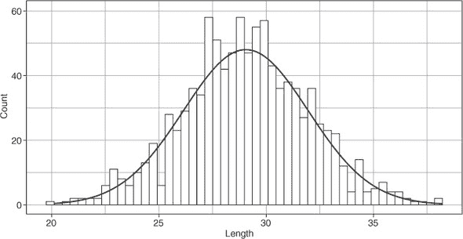

在数学上定义的分布通常被称为 *概率分布*，并且它们有一个定义的 *概率密度函数*。特定分布的概率密度函数是一个方程，我们可以用它来计算特定值来自该分布的概率。例如，假设我们测量到河马獠牙的长度为 32 厘米。如果我们知道最能代表所有河马獠牙长度的分布，我们可以使用概率密度函数来估计发现 32 厘米獠牙的河马的概率。在阅读本书之前，你不需要知道或记住任何概率密度函数，但我会偶尔提到它们，因此了解它们是什么很有用。回顾一下 图 A.2：我覆盖在直方图上的平滑线是具有相同均值和标准差的高斯分布的概率密度函数。

## A.4\. 西格玛符号

对于没有正式接受过其使用的培训的人来说，数学符号可能看起来令人畏惧。但数学符号实际上是为了让我们的生活更简单。虽然这本书中有一些方程，但没有任何一个方程比加法、减法、乘法和除法更复杂。然而，我确实使用了一个使我的生活变得容易得多的符号；一旦你掌握了它，它也会让你的生活变得更简单（并且让许多方程看起来不那么难以理解）。这个符号是大写希腊字母 *西格玛*，它看起来像奇怪的“E”（Σ）。

在方程中，大写西格玛简单地意味着对其右侧的任何内容进行求和。你通常会看到西格玛符号上方和下方的索引，告诉我们从哪里开始和停止求和。例如，我们不必写 1 + 2 + 3 + 4 + 5 = 15，我们可以使用方程 A.1 中显示的西格玛符号。

##### 方程式 A.1\.

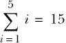

我们可以在 R 中使用 `sum()` 函数来完成这个操作。

##### 列表 A.4\. 在 R 中使用 `sum()` 函数

```
sum(1:5)

[1] 15
```

我们可以使用西格玛符号来写出更复杂的表达式，并且索引给了我们控制我们想要求和的值范围的权限。看看方程 A.2 并尝试找出 x 的值。

##### 方程式 A.2\.

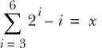

如果答案对你来说不清楚，也许像程序员一样思考会帮到你。你可以将西格玛符号视为一个加法的 `for` 循环。如果我要大声朗读方程 A.2，我会说，“对于所有介于 3 和 6 之间的 *i* 值，取 2 的 *i* 次幂并减去 *i*，然后将所有这些值加起来。” 这就变成了

+   2³ – 3 = 5

+   2⁴ – 4 = 12

+   2⁵ – 5 = 27

+   2⁶ – 6 = 58

以及 5 + 12 + 27 + 58 = 102.

我们可以在 R 中通过创建一个计算西格玛符号右侧值的函数，并将其传递给 `sum()` 函数来完成这个操作。

##### 列表 A.5\. 使用 `sum()` 进行更复杂的函数

```
fun <- function(i) (2^i) - i

sum(fun(3:6))

[1] 102
```

使用 sigma 符号意味着当我们需要求和数十、数百甚至数千个数字时，我们不必全部写出它们。所以我希望你能看到 sigma 符号是如何使我们的生活变得更简单的！我在这里向你介绍它，因为我将在下一节中使用它来提醒你如何计算算术平均数。

## A.5\. 集中趋势

当处理变量时，了解它们分布的中心往往很重要。我们可以使用多种统计量来总结分布的中心；它们提供不同的信息，适用于不同的情境。提供此类信息的统计量被称为**集中趋势**度量，其中最常见的是**算术平均数**、**中位数**和**众数**。

#### A.5.1\. 算术平均数

让电子表格用户感到惊讶的是，没有“平均”的正式数学概念。但当人们口语中提到“平均”时，他们通常指的是算术平均数。**算术平均数**（或简称**平均数**）只是向量中所有值的总和除以元素的数量。例如，如果我测量 5 只河马的象牙长度为 32、15、45、20 和 54，那么平均数是(32 + 15 + 45 + 20 + 54) / 5 = 33.2。

仅用五个河马象牙的例子来写出这些已经足够繁琐，但想象一下，如果我要为数十个象牙写出这些！相反，我们可以使用我们新认识的朋友，sigma 符号。算术平均数的 sigma 符号表示在方程 A.3 中。

##### equation A.3\.

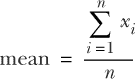

对于我们的河马例子，*x*代表我们象牙长度的向量，*i*是一个索引，告诉我们考虑该向量的哪个元素，而*n*是向量中的元素总数。然后我们可以大声朗读方程 A.3，即“对于*x*中从第一个元素到最后一个元素之间的每个元素，加上*x*的值。然后将此值除以*x*中的元素数量。”我们可以在 R 中使用`mean()`函数来完成这个操作。

##### 列表 A.6\. 在 R 中使用`mean()`函数

```
mean(c(32, 15, 45, 20, 54))

[1] 33.2
```


##### 注意

为什么我要费心指出这是**算术**平均数？那是因为还有两种其他类型的平均数，适用于其他情境，称为**几何平均数**和**调和平均数**。我在书中没有提到它们，所以不会详细说明，但我建议你了解它们的使用。


算术平均数对于总结具有单个峰值的对称分布（如高斯分布）的中心很有用。然而，对于不对称、具有多个峰值或包含异常值的分布，平均数可能不是分布中心趋势的良好代表。


##### 注意

术语**异常值**用于描述与大多数案例相当不同的案例。它是一个对于一个或多个变量具有异常高或低值的案例。有许多方法可以用来识别一个案例是否是异常值，但这实际上取决于手头的任务。


#### A.5.2. 中位数

中位数是*稳健*的集中趋势度量，这意味着它不像均值那样会受到分布中的不对称或异常值的影响。中位数还有一个非常简单的解释：它是使得 50% 的案例大于它，50% 的案例小于它的值。为了计算中位数，我们只需按大小顺序排列向量的元素，然后选择中间的值。

让我们回顾一下之前提到的象牙长度：32, 15, 45, 20, 和 54。将象牙按大小顺序排列后得到 15, 20, 32, 45, 和 54，因此中位数是 32，因为它是最中间的值。如果一个向量有偶数个元素，中位数是位于它们中间的值。所以如果我们测量到另一只河马的象牙长度仅为 5，现在按顺序排列元素得到 5, 15, 20, 32, 45, 和 54。这意味着中位数位于 20 和 32 之间，即 26。我们可以在 R 中使用 `median()` 函数来计算中位数。

##### 列表 A.7. 在 R 中使用 `median()` 函数

```
median(c(32, 15, 45, 20, 54))

[1] 32

median(c(32, 15, 45, 20, 54, 5))

[1] 26
```

#### A.5.3. 众数

众数通常用于与均值和中位数略有不同的情境。均值和中位数总结了分布的中心，而众数告诉我们分布中最常观察到的单个值是哪一个。


##### 注意

在基础 R 中没有用于计算众数的函数，但如果你需要，可以自己编写一个。


## A.6. 离散度度量

除了总结分布的中心之外，通常还很重要要总结分布值的分散或分布情况。有许多不同的离散度度量，它们告诉我们稍微不同的信息，适用于不同的情境，但它们都给我们提供了一个关于我们的值分布是瘦还是宽的指示。我将提醒你四个这样的度量：*平均绝对偏差*、*标准差*、*方差*和*四分位距*。

#### A.6.1. 平均绝对偏差

让我们先来谈谈我所说的*偏差*（这并不是你祖父母在责备不道德行为时可能使用的意思）。一个分布中元素的偏差是指该元素值与分布均值的距离。所以如果我们河马象牙的平均长度是 33.2 厘米，那么 16.1 厘米长象牙的偏差是 –17.1 厘米。请注意，这个偏差是有符号的：如果元素小于均值，则偏差为负，如果元素大于均值，则偏差为正。


##### 注意

一个值与估计值之间的偏差称为*残差*，我在本书的主体部分对此有更详细的阐述。


为了了解所有元素与分布均值之间的平均（又是那个不明确的词）差异，我们可以取所有偏差的平均值。这个问题在于，在近似对称的分布中，正偏差和负偏差会相互抵消，我们得到的平均偏差接近于零。

相反，我们可以通过改变负偏差的符号为正，并取这些偏差的平均值来获取绝对偏差。这给出了平均绝对偏差，当数据分布较广时，它将更大；当数据集中在分布的中心附近时，它将更小。平均绝对偏差的方程式在方程式 A.4 中展示，其中垂直线表示它们之间表达式的绝对值，而 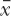 表示平均值。

##### 方程式 A.4\.


我们可以使用 R 中的 `mad()` 函数来计算平均绝对偏差。默认情况下，此函数计算的是 *中位数绝对偏差*，这也是常用的，因此我们使用 `center` 参数来指定我们想要的是平均值。

##### 列表 A.8\. 在 R 中使用 `mad()` 函数

```
tusks <- c(32, 15, 45, 20, 54)

mad(tusks, center = mean(tusks))

[1]
```

#### A.6.2\. 标准偏差

虽然平均绝对偏差是一个非常直观和合理的分散度度量，但你不会经常看到它被报告。这是因为人们更常用并报告标准偏差。标准偏差与平均绝对偏差相似，但有一些不同之处。首先，我们不是对均值与绝对偏差求和，而是对平方偏差求和。然后，我们将这个总和除以 *n* – 1（小于向量中元素的数量）并取平方根。你可以在方程式 A.5 中看到这一点，其中 *S* 是标准偏差。

##### 方程式 A.5\.

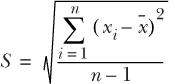

我们可以使用 R 中的 `sd()` 函数来计算这个值。

##### 列表 A.9\. 在 R 中使用 `sd()` 函数

```
sd(c(32, 15, 45, 20, 54))

[1] 16.42
```

为什么使用标准偏差，而不是更直观的平均绝对偏差呢？因为标准偏差有一些很好的数学特性，使得它更方便使用。使用标准偏差而不是平均绝对偏差的一个重要后果是，由于差异被平方，它对远离均值的案例影响更大。标准偏差的另一个便利之处是，如果数据遵循高斯（正态）分布，那么已知比例的数据将落在均值的特定标准偏差范围内。这在上文图 A.4 中进行了详细说明，该图显示，对于完美的正态分布，68%，95%，和 99.7%的案例分别落在均值的 1 个，2 个和 3 个标准偏差内。

#### A.6.3\. 方差

方差的计算非常简单：它仅仅是标准差的平方。其公式与标准差的公式相同，当然，我们省略了平方根符号。这可以在方程 A.6 中看到，其中*S*²是方差。

##### 方程 A.6。

![eqa-6.jpg]

如果方差和标准差是彼此的转换，为什么我们还需要两者？实际上我们不需要；但是，虽然方差使某些统计计算稍微简单一些，但标准差的优势在于它具有与所计算变量相同的单位。

##### 图 A.4. 对于一个完美的、高斯分布的变量，68%的情况位于均值的一个标准差范围内。95%和 99.7%的情况分别位于两个和三个标准差内。

![app-4_alt.jpg]

我们可以使用 R 中的`var()`函数或通过取标准差的平方来计算方差。

##### 列表 A.10. 在 R 中使用`var()`函数

```
var(c(32, 15, 45, 20, 54))

[1] 269.7

sd(c(32, 15, 45, 20, 54))²

[1] 269.7
```

#### A.6.4. 四分位距

尽管标准差和方差，尤其是标准差，非常适合总结没有异常值的对称分布的离散程度，但我们还需要总结不遵循这些规则分布的离散程度的方法。在这种情况下，四分位距（IQR）是一个很好的选择，因为它是一个稳健的统计量，不受异常值和不对称性的严重影响。简单来说，IQR 是第一四分位数和第三四分位数之间的差值。

如果我们按照向量的值对向量元素进行排序，向量的四分位数是那些使得其他 25%、50%、75%和 100%的元素值较小的元素。第一四分位数是最小元素和中间值之间的中间值：它将向量分成两部分，其中 25%的元素位于其下方，75%的元素位于其上方。第二四分位数是中间值，将向量分成两部分，其中 50%的元素位于其上方，50%的元素位于其下方。第三四分位数是中间值，位于中间值和最大元素之间，将向量分成两部分，其中 75%的元素位于其下方，25%的元素位于其上方。零四分位数和第四四分位数分别是最小元素和最大元素。

| |
| --- |

##### 注意

我将第一四分位数和第三四分位数的定义相对模糊，因为至少有九种不同的方法来计算它们的精确值！这些方法并不总是相互一致，但它们总是将向量的元素分成 25%和 75%，所以我们在这里不会过分纠结于它们。

| |
| --- |

一种常见的图形方法来展示四分位数是使用箱线图（有时简称为箱形图）。一个箱线图的例子显示在图 A.5 中，其中包含三个不同河马物种的獠牙长度的假设数据。粗的水平线表示每个河马物种的第二四分位数（中位数）。箱子的上下边缘分别代表第一和第三四分位数。箱须（从箱子延伸出来的垂直线）连接每个物种的最小和最大值，因此代表数据的全范围。

##### 图 A.5\. 假设河马獠牙数据的箱线图。粗的水平线是中位数，箱子的边缘代表第一和第三四分位数，垂直的箱须代表数据的全范围。

![app-5_alt.jpg]


##### 注意

有时箱须*不*代表全范围。通常它们表示*图克范围*，即分别位于第一和第三四分位数以下和以上的 1.5 倍四分位数范围。任何超出这个范围的案例都会以点状绘制，以突出显示它们作为潜在异常值。


IQR 是向量第一和第三四分位数之间的差值，因此告诉我们向量中中间 50%的元素的范围。它在存在异常值和/或非高斯分布数据的情况下很有用。

我们可以使用 R 中的`IQR()`函数来计算四分位数范围（这个函数名称首字母大写是不寻常的）。

##### 列表 A.11\. 在 R 中使用`IQR()`函数

```
IQR(c(32, 15, 45, 20, 54))

[1] 25
```

## A.7\. 变量之间关系的度量

在我们处理的一对变量之间找到关系是很常见的。即使两个变量之间没有因果关系，它们之间有关系的现象也不少见。这可能是一种正相关，即当一个变量的值增加时，另一个变量也会增加；或者是一种负相关，即当一个变量增加时，另一个变量会减少。

能够用变量对之间的关系来总结它们的方向（正的、负的或无关系）和幅度（无关系到完全关系）是很重要的。用于总结两个变量之间关系方向和幅度的两种最常见统计量是*协方差*和*皮尔逊相关系数*。

#### A.7.1\. 协方差

两个变量之间的协方差告诉我们它们是如何共变的。如果一对变量一起增加和减少，协方差是正的；如果一个变量增加而另一个变量减少，协方差是负的。如果一对变量之间没有关系，协方差为零（但在现实世界中这种情况几乎从未发生）。

两个变量可能具有零（或接近零）的协方差，但实际上存在非线性关系。运行以下代码并亲自查看（注意协方差值有多小）：

```
x <- seq(-1, 1, length = 1e6)

y <- x⁴

plot(x, y, type = "l")

cov(x, y)
```

要计算协方差，我们考虑单个案例，并找出它相对于第一个变量的均值和第二个变量的偏差。然后我们找到这些偏差的乘积。这个过程在数据集中的所有案例中都会进行，这些偏差的乘积会被加起来，然后除以 *n* – 1（向量中元素数量减一）。这个过程在方程式 A.7 中得到了说明。

##### 方程式 A.7\.

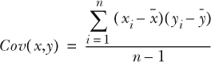

我们可以使用 R 中的 `cov()` 函数计算两个向量之间的协方差。

##### 列表 A.12\. 在 R 中使用 `cov()` 函数

```
tusks <- c(32, 15, 45, 20, 54)

weight <- c(18, 11, 19, 15, 18)

cov(tusks, weight)

[1] 44.7
```

协方差在数学上非常有用，但因为它是以两个变量的值相乘为单位的，其大小可能难以解释。因此，协方差被称为变量之间关系的*非标准化*度量，这意味着我们无法比较不同尺度上测量的变量对的协方差。协方差的标准版本是相关系数——或者更正式地说，是皮尔逊相关系数。

#### A.7.2\. 皮尔逊相关系数

皮尔逊相关系数（或简称相关系数）是协方差的无单位标准化版本，其值介于 –1 和 +1 之间。相关系数为 –1 表示变量对之间存在完美的负相关关系，相关系数为 +1 表示完美的正相关关系，相关系数为零表示完全没有关系。这三个极端在现实世界中很少发生（如果你得到 +1，请检查你是否计算了变量与自身的相关系数），而介于它们之间的值则更可能。

| |
| --- |

##### 注意

我特意将其称为皮尔逊相关系数（以统计学家卡尔·皮尔逊的名字命名），以区别其他可能不太常用的类型：肯德尔等级相关、斯皮尔曼相关和点二列相关。这些其他类型在变量不是连续且遵循高斯分布的情况下很有用，这是皮尔逊相关系数所假设的，但我们在这本书中不考虑它们。

| |
| --- |

如果我们知道如何计算协方差，计算皮尔逊相关系数很简单；我们只需将协方差除以变量的标准差乘积。这可以在方程式 A.8 中看到。

##### 方程式 A.8\.

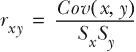

因为相关系数（通常用 *r* 表示）是标准化的且无单位的，我们可以比较不同尺度上变量对的值。我们可以在 R 中使用 `cor()` 函数计算两个向量之间的皮尔逊相关系数。

##### 列表 A.13\. 在 R 中使用 `cov()` 函数

```
tusks <- c(32, 15, 45, 20, 54)

weight <- c(18, 11, 19, 15, 18)

cor(tusks, weight)

[1] 0.8321
```

## A.8\. 对数

对数，或称为 logs，是指数运算的逆运算。例如，如果 2⁵ = 32，那么 log²(32) = 5。在这个例子中，对数的 *底数* 是 2。换句话说，log²(32) 的结果是 2 必须被提升到多少次幂才能得到 32。对数可以有任何我们喜欢的底数，这取决于我们想要使用对数函数的原因。最常见的三个选择是底数为 2、10 和欧拉数 (*e*) 的对数，欧拉数是一个重要的常数，其值约为 2.718。对数的底数通常在 log 符号后面表示为下标（例如，log² 或 log¹⁰）；但是当底数是 *e* 时，对数被称为 *自然对数*，通常表示为 *ln*。


##### 注意

您可能会看到类似 log(*x*) 的表达式，但没有下标。根据目标受众的不同，这可能被解释为 log¹⁰(*x*) 或 log^e(*x*)。明确指出您指的是哪一个会更好。


对数在数学和统计学中具有许多有用的特性。其中之一是它们可以用来将极大值和极小值一起压缩到同一个尺度上。例如，向量 1, 10, 100, 1,000, 10,000, 100,000 的 log¹⁰ 是 0, 1, 2, 3, 4, 5。所以如果我们有一个包含非常小和非常大的数字的变量，如果我们对它进行 log¹⁰-变换，这个变量就可以更容易地处理了。

对数，尤其是自然对数，的另一个有用特性是，如果两个变量之间存在指数关系（例如，时间和细菌生长），取其中一个变量的对数可以将关系线性化。在变量之间工作线性关系通常在数学上更简单。

查看图 A.6 中的示例。figure A.6。左侧图表显示了具有非常小和非常大的值的 *y* 变量，其中 *x* 和 *y* 变量之间的关系是指数增长的。右侧图表显示了相同的数据，但经过对 *y* 变量的 log¹⁰-变换。您可以看到，变换后，*y* 变量现在可以更容易地在图表上可视化，并且 *x* 和 *y* 变量之间的关系已经被线性化。

##### 图 A.6\. 对数[10]变换对变量的影响。左侧图表显示了具有非常小和非常大的值的 *y* 变量。在右侧图表中，*y* 变量已经进行了 log[10]-变换。

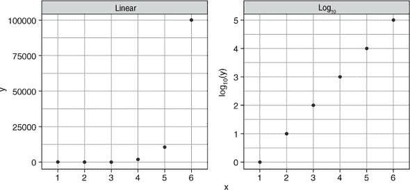

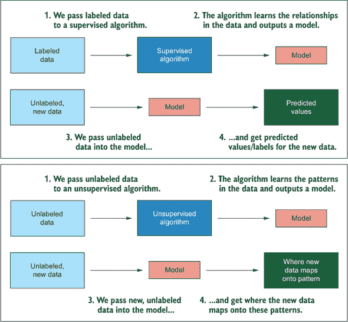

**监督学习与无监督学习。监督算法使用已经标记有真实标签的数据来构建一个可以预测未标记、新数据标签的模型。无监督算法使用未标记的数据，并从中学习模式，以便新数据可以映射到这些模式上。**

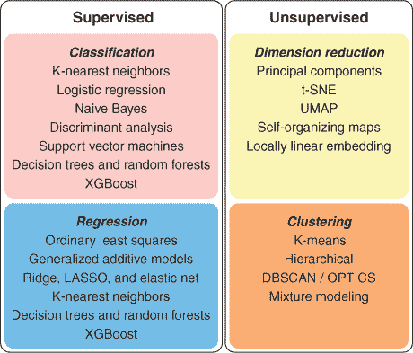

**本书涵盖的算法概要，无论它们是监督学习器还是无监督学习器，以及它们是否可用于分类、回归、降维或聚类**
