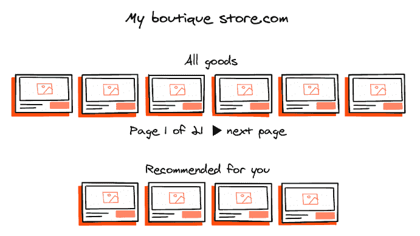

# 第四章：4 设计文档

### 本章涵盖

+   设计文档周围最常见的神话

+   定义反目标以更尖锐地关注核心目标

+   根据现有信息起草设计文档

+   审查设计文档

+   设计文档的演变

一旦你定义了系统应解决的问题、利益相关者列表，以及对于产品最合适的技术和解决方案的初步理解，如第三章所述，就到了准备设计文档的时候了。

值得注意的是，在创建机器学习（ML）系统的早期阶段，并没有固定的行动顺序。一旦你确定了问题和目标（尤其是在初创公司工作，交付速度往往比遵循流程更重要的情况下），你就可以开始准备设计文档。但鉴于本书以清单的形式呈现，行动列表也以传统顺序展示。

就像一位作者的管理者曾经说过的那样，没有任何花哨的推荐算法能打败一个拿着购物清单的客户。这些人有一个目标和实现它的计划，没有什么能阻止他们。

如果你仔细想想，编写代码只是提供一组特定的指令以实现一个特定的目标。从某种意义上说，设计文档是一个元算法集，用于实现一个特定的目标，其中涉及许多子算法。尽管如此，设计文档仍然被许多人质疑，要么是官僚化的四个恶兆之一，要么是惯性使用的基础。

在本章中，我们将检查设计文档周围最常见的神话。我们将介绍并定义反目标的概念，作为引导你朝着项目目标前进的额外指南，并将开始本书的实践部分，由基于接近现实生活场景的两个设计文档代表。

## 4.1 围绕设计文档的常见误区

在过去的几年里，设计文档经历了许多错误的假设和误解，可能会阻止你为项目准备一份有组织、合适的论文。接下来，我们将检查最常见的误解，并解释为什么你不应该过分关注它们。

### 4.1.1 误区#1\. 设计文档只适用于大公司，不适用于初创公司

你可能会认为，将部分工作量用于准备设计文档只对大型公司有意义。在这个反论点中有一个合理的假设：成熟的组织需要投入更多的时间和资源来编写设计文档，与拥有十几名员工的初创公司相比。但这并不意味着小型公司应该完全不准备设计文档：正如一句著名的谚语所说，“计划没有用；规划才有用。”编写设计文档的美丽之处在于揭示你在产品和技术方面的盲点，这将让你在中期内节省很多，尤其是如果你切掉了不相关的数据。对于后者，我们推荐应用我们称之为“反目标”的方法，我们将在稍后的单独章节中详细介绍。

当这本书处于早期访问阶段时，我们的早期读者有一个共同的评论：“嗯，这很好，但在初创公司中并不是这样运作的。”虽然我们同意初创公司的交付节奏是不同的，但我们仍然坚持设计阶段是必要的。确实，联合创始人和早期工程师可以在咖啡休息时间达成共识，而一个大型企业可能会在同一范围内浪费 6 个月的时间。我们也同意编写正式文档可能效率不高，但这并不是我们倡导的。一旦你确信它能让所有合作者达成一致，一个简单的笔记加上简短的描述就足够了。在黑客马拉松中寻找奖品时，忽略软件和机器学习工程的良好实践是可以的，但黑客马拉松风格在更长的距离上几乎不起作用。

### 4.1.2 误区 #2：设计文档仅适用于复杂项目

如果从经典意义上来看设计文档：一个涉及最终产品所有细节的庞大、劳动密集型工作，从总体范围到部署后的风险验证，这个说法中确实有一丝真理。毕竟，仅编制这样一份文档本身可能需要的时间比项目的整个生命周期还要长！

通常，这样的论点可能来自缺乏灵活性的人，或者是一个热衷于反对设计文档、急于利用任何有利于自己的论据的坚决反对者。

实践表明，即使是小型项目，一个结构良好的设计文档也能确保早期识别潜在风险，如果项目最终扩展，可以作为未来改进的参考，最重要的是，它有助于防止范围蔓延，当每个利益相关者都倾向于添加一个新功能时。

即使是简单的倡议，也能从具有相应详细程度的设计文档中受益。

### 4.1.3 误区 #3：每个设计文档都应该基于模板

许多公司，尤其是那些已经建立起来的企业，会保持其推荐的模板具有严格、僵化的结构，考虑到他们的业务规模，这可能是有用的。然而，我们建议避免将设计文档模板固定化。根据我们的经验，模板永远不应该是神圣的教条。这样的模板可能会试图同时实现太多目标，因此变得臃肿，并使人失去准备和研究这些文档的动力。这就是为什么我们建议保持核心模板的简约性，并根据系统特定的需求和上下文进行扩展。

初看之下，创建设计文档的过程可能看起来直接且简单。实际上，从一开始，你将遇到许多因素，如果忽视它们，将会干扰过程并使你退后几步。

记住：你的任务不是创建一个草案文档并说服每个人都相信其纯洁性和正确性。你的任务是尽可能多地找出弱点（包括激励你的利益相关者找出它们），这样最终，经过多次迭代，你将有一个文档，它允许你开始开发你的机器学习系统。

### 4.1.4 误区 #4：每个设计文档都应该导致一个部署的系统

如果你是一名工程师，需要建造一台机器，你需要从蓝图开始。其他工程师将审查它并提供反馈，这可能会导致蓝图的其他迭代——一次又一次，直到你的设计最终准备好付诸实施。

同样的原则适用于设计机器学习系统。机器学习系统是一个高度复杂的互联领域机器，在实施前，你的设计文档需要经过多次迭代才能进行彻底的准备。然而，更常见的情况是，一个好的设计文档最终导致根本没有任何机器学习项目。

这可能听起来很荒谬，但让我们想象你面临两个选项的选择：

+   在模型、特征、损失函数和数据集上不懈努力 6 个月，结果只是将你的项目放在架子上（这是大多数机器学习项目最终会发现自己所在的地方）

+   花费 2 到 4 周的时间试图描述

    +   我们为什么要进行这个项目？

    +   我们如何做到这一点？

    +   我们是否拥有所需的一切？

    +   我们能否用一个更不高效但更省力的解决方案？

    +   是否可以达到预期的结果？

发现 90%的结果可以来自两个 IF 语句可能会令人沮丧，但仍然比两个选项中的第一个要好得多。

## 4.2 目标和反目标

设计文档的一个目标是通过设定基石和边界来减少对问题的不确定性。在文档起草之前，所有相关人员对问题和解决方案的理解水平都较低且不一致。一种可以帮助解决此类问题的技术是使用反目标——这些逆命题可以帮助我们缩小问题和解决方案的空间。

设计文档的每一部分都可以被视为对多个问题的回答：潜在系统的目标是什么，关键成功标准是什么，我们应该关注哪些技术方面，我们如何解决给定的子问题，等等。一个新手错误就是忽略权衡，并为系统列举无休止的目标：例如，它应该做 X、Y 和 Z；具有高性能；精确；易于维护且开发成本低；并且直观易懂。显然，不可能成功地将所有良好的属性都融入一个系统中，你需要一种方法来平衡这种可能的过度性。

设置反目标使我们能够划掉我们并不真正关心的方面，并额外突出我们认为至关重要的方面。比如说，我们正在构建一个将用于内部的系统，输出工件是供执行团队和分析人员阅读的各种报告。我们可以立即假设处理时间对于这样一个系统来说不会是关键——只需确保报告能在早上准备好即可。因此，“处理时间”将首先加入反目标列表，这样我们就不会在这个参数上浪费时间。或者想象一下为精品店构建推荐引擎：如果当前商品数量只有三位数（见图 4.1），那么你肯定不需要支持数百万件商品，这意味着对于最终解决方案来说，过度的生产力是不行的。

##### 图 4.1 对于销售商品数量少于 1,000 件且流量较低的商店，在构建推荐系统时不应追求可扩展性，因为如今几乎任何技术解决方案都能处理其负载。

这样的反目标有助于我们只关注重要方面，并放弃那些对实现系统主要目标没有积极影响的方面。

以下示例说明了精品店推荐引擎的目标和反目标列表可能是什么样子：

+   目标：

    +   从查看到加入购物车步骤的转化率提高

    +   为用户提供的多样化推荐

    +   为用户提供的低延迟

+   反目标：

    +   以处理商品数量为尺度的可扩展性

    +   以并发用户数量为尺度的可扩展性

    +   支持新的商品类别

类似的逻辑也适用于设计文档的其他部分。如果你在实施过程中形成了一个想法，后来发现它存在内在的致命缺陷，那么在文档中提及这个问题作为反例是有意义的。想象一下，你正在设计一个可扩展的系统，并考虑大量使用云基础设施，直到你了解到最大的潜在客户由于隐私原因对其硬件的使用有严格的限制。在这种情况下，一句像“云解决方案 X 可能是一个好的数据存储选项，但由于 Y 的云隐私限制，不适用于这种情况”的话，可以设定重要的限制，并可能激发对替代技术实现的思考：“如果 X 从技术角度来看是可行的，那么是否有可以安装在我们自己服务器上的开源 X 替代方案？”

目标缺失不应该被视为设计文档中的主要信息来源，但可以成为增添缺失风味的调料，逐渐成为文档结构的重要组成部分。

##### 有疑问的目标及其对最终结果的影响

我们有两个故事来强调目标设定不明确如何影响机器学习系统的发展。

2016 年，瓦列里在一个大型银行的收款部门工作。到那时，银行的管理层已经决定将机器学习引入其日常运营，并依赖算法支持而不是依靠一套僵化的规则和直觉。瓦列里的一项首要任务是创建一个模型，选择银行必须接触的下一位用户以最大化产出——一个可以通过激励（支付承诺、费用豁免、折扣）激活的用户。现有的流程涉及大量的人工工作，转换率大约为 50%。在接下来的两个月内，测试了一个基于大约 100 个工程特征的相当基本的非线性模型，其结果令人惊讶地达到了 80%的转换率，而旧的流程仍然提供 50%的转换率。

团队很高兴也很兴奋地向他们的高级副总裁展示结果。在我们完成演示的第二秒钟，她说：“这些客户有什么特别之处？我想知道他们的动机。”在 2016 年，用 100 个特征的非线性模型来回答这样的问题并不容易，更不用说人们的行为和他们的动机是两件完全不同的事情了。例如，从一开始，高级副总裁的目标就是理解“为什么”，而企业的目标就是理解“谁”。因此，团队必须完全不同地设计和构建系统及模型，旨在回答这两个问题，即使这样做可能不如只回答一个问题那么高效。因此，一开始设定的一个糟糕（或不恰当）的目标让团队落后了 3 个月。

第二个例子涵盖了我们在第二章中讨论的定价算法。一开始，我们的目标是基于周转率最大化商品总销售额，同时保持利润率在给定水平。

在某个时刻，该模型找到了一种巧妙的方法来实现目标。产品目录中有一个音响扬声器，该模型开始以低于购买价格的价格出售。结果，24 小时内销售的扬声器数量比之前 90 天还要多。公平地说，这仍然在利润率限制之内，因为我们不介意利润率为负作为任务的一部分。

然而，你可以想象这和我们真正想要的完全不同（正确的目标应该是增加收入同时保持利润率，影响 X%的类别，其中包含 Y%的 SKU，且侵占率不超过 Z）。当然，收入确实上升了，利润率也保持在给定的限制内，但最终，每个人都只是跑去购买那一个型号。没有购买其他扬声器。

幸运的是，那是一个带有少量动态定价商品的测试发布，这表明初始目标设计得不好，我们需要开发一个更全面的目标设定方法。幸运的是，整体设计是解耦的，易于调整。

## 4.3 设计文档结构

在本节中，我们本可以专注于关于经典设计文档内容和结构的理论信息，但事实是，为机器学习系统准备的设计文档几乎不会依赖于传统软件开发中应用的实践。除此之外，其结构可能因公司而异，所以我们认为过分关注布局的细微差别是没有意义的。相反，我们建议更多地关注需要涵盖的项目。此外，我们的目标是展示设计文档作为机器学习系统设计中的一个实体。因此，从本节开始，在本书的其余部分，每个章节的结尾将有一个大型的实践块，代表设计文档的一部分，它包含了给定章节的主要信息。我们认为这是本书的一个关键组成部分，它将与理论与篝火故事并驾齐驱，同时提供了一个将现实生活中的解决方案应用于问题的示例。

在接下来的内容中，我们将向您介绍两个虚构案例，每个案例都有其独特的具体细节、特征、问题和背景。这两个案例将成为两个不同设计文档的基础，这些文档将随着章节的逐步展开和演变而逐渐增长和进化，增加更多的深度和复杂性。最终，我们将拥有两个完整的文档可供使用。

在本节中，我们开始概述一个可能在实际生活中编写的项目设计文档。为此，我们引入了一个虚构公司，超级零售商（Supermegaretail），这是一家零售公司，有一个需求预测项目即将推出。

在第 4.4 节中，我们给出了设计文档第一章节可能看起来的一个非常简短的例子。我们将只包括主要主题；否则，它将无法放入一本书中。

备注：设计文档正文中用*斜体*写的任何文本都包含我们的支持性评论，但不属于文档本身。

#### 设计文档：超级巨零售（Supermegaretail）

#### 问题定义

#### i. 来源

超级巨零售（Supermegaretail）是一家零售连锁店，通过遍布不同地区数千家商店的网络运营。该连锁店的客户购买各种商品，主要是杂货、家居必需品、个人护理、运动补充品等等。

为了销售这些商品，超级巨零售（Supermegaretail）必须在将它们运送到商店位置之前购买或生产它们。购买商品的数量是需要定义的关键数字，这里有不同的可能情况。

为了便于计算，我们假设超级巨零售（Supermegaretail）为特定商店购买了 1,000 个单位的产品 A：

1.  超级巨零售（Supermegaretail）在下一批交付前购买了 1,000 个单位并售出了 999 个单位。这是一个理想的情况。只有 0.1%的剩余，零售商接近最优的收入和利润。

1.  超级巨零售（Supermegaretail）在下一批交付前购买了 1,000 个单位并售出了 100 个单位。这通常是一个糟糕的情况，原因很明显。超级巨零售（Supermegaretail）希望售出与购买数量几乎相等的单位，而不缺货。差距越大，超级巨零售（Supermegaretail）的损失就越大。

1.  超级巨零售（Supermegaretail）购买了 1,000 个单位并售出了 1,000 个单位。这应该被视为一种糟糕的情况，因为我们不知道如果人们有机会购买，他们会购买多少个单位。可能是 1,001 个、2,000 个或 10,000 个。这种缺货情况模糊了我们对世界的理解。更糟糕的是——它驱使客户从超级巨零售（Supermegaretail）转向其竞争对手，在那里他们可以购买到没有缺货的商品。

另一个约束条件是我们有很多易腐食品，它们不能长时间放在商店货架上：它们要么被售出，要么被浪费。

项目目标是缩小已交付和已售出商品之间的差距，使其尽可能窄，同时避免出现缺货情况，具体的服务水平协议将在后续规定。为此，我们计划在 ML 系统的帮助下，预测特定商店在特定时期内特定商品的需求数量。

#### ii. 相关性和原因

*本节强调了问题的相关性，并基于探索性数据分析进行了支持。*

##### A. 现有流程分析

超级巨零售（Supermegaretail）目前是如何订购、配送和销售商品的？

对于超级巨零售（Supermegaretail）来说，可能的情况列表可能如下：

1.  与商品制造商达成交易的计划范围：

    +   这是一个为期 1 年的合同，在前 9 个月的前 90 天内有机会进行调整。

1.  增加销量时的额外折扣：

    +   每增加 2,000 万美元，额外优惠 2%。

1.  作为制造商和商店之间物流枢纽的配送中心数量：

    +   全国共有 47 个配送中心，这使得它们成为预测的实体存在和聚合点。

1.  配送中心和商店之间的交付节奏：

    +   通常，每两天就有一辆卡车连接配送中心和商店。

1.  店内仓库的有无：

    +   大多数商店没有仓库。然而，装卸区可以（并且确实）有效地用于储存卸载的物品 2 到 3 天。

1.  谁在什么阶段决定什么和在哪里交付？

    +   配送中心将有一个交付计划下达。商店经理可以覆盖并调整它。

1.  预测范围：

    +   主要预测范围是每周和每月。然而，在处理商品制造商时，需要一年的预测范围。

1.  流程的商务负责人：

    +   物流部门

    +   采购部门

    +   运营部门（店长）

##### B. Supermegaretail 在预测需求和实际需求之间的差距上损失了多少？

虽然计算因库存过剩和过期商品造成的损失相对容易，但计算因缺货情况造成的损失则要困难得多。后者可以通过一系列 A/B 测试或专家意见来估算，这通常比运行这些测试更快、更便宜。

总损失可以通过将这两个因素相加来估算，提供一个理想但无法实现的解决方案的收益估计。

初始计算显示，去年损失约为 8 亿美元。

*从以下设计文档的下一部分（但仅限于本章）开始，我们已经勾勒出了一些问题，以避免内容过于庞大。回答这些问题将帮助您决定进一步行动，答案将在我们通过系统的不同阶段时在后面的章节中揭晓。*

##### C. 其他原因

+   其他团队可以使用我们的解决方案，使开发更具吸引力和合理性吗？

+   也许我们可以将需求预测解决方案卖给其他零售公司（显然不是直接竞争对手）。

#### iii. 前期工作

*本节涵盖这是否是一个全新的问题，或者之前是否已经做过某些事情。通常，这是一系列你提出的问题，以避免重复工作或犯以前的错误。*

+   如果 Supermegaretail 已经意识到这个问题并实施了一些需求预测方法，会怎样？它在不同地点有各种商店，其需求预测可能已经相当高效。公司是如何做到的？

    +   滚动窗口？

    +   专家委员会？

    +   规则加额外快速交付？

    +   我们是否有一些限制需要考虑，比如最小或最大订单量？

+   我们能否快速改进现有的解决方案，或者我们需要一个全新的解决方案？

+   如果超级大零售的当前预测在某些类别中足够好，而在其他类别中却毫无用处，那会怎样？换句话说，我们是否可以在这里采用混合方法，至少在最初，从最不成功的类别开始，这些类别中预测和实际销售额之间的差距最大？

+   如果我们的方法无意中破坏了某些东西，那并不危险。我们正在测试那些我们一直都有问题的类别，而没有触及那些一切都很顺利的类别。

+   换句话说，我们需要对现有解决方案进行广泛的、全新的探索性数据分析。

#### iv. 其他问题和风险

+   我们是否有必需的基础设施，或者我们需要构建它？

+   如果我们选择复杂的东西，它可能会失控。我们需要实施哪些必要的检查和平衡措施来避免灾难？如果我们遇到问题，我们是否有回退方案？

+   我们有多确定可以显著提高质量并减少人工负担？我们真的能解决这个问题吗？

+   一次错误的代价是什么？缺货和过剩库存很可能有不同的错误成本。

+   如果我们处理缺货情况，我们能否处理增加的流量？

+   我们需要多久进行一次预测？预测的粒度是多少？

正如你所见，即使是解决问题的简要概述和使用之前收集的数据进行的研究，也可能会轻易地让我们写出 10 页的文档。这份草案将帮助我们决定是否需要进一步深入，或者最好是现在就停止，避免复杂的机器学习解决方案。

本章的下一段内容同样重要：它提供了一个如何审查设计文档的实际例子。如果你对机器学习系统设计还不太熟悉，你可能还没有达到职业生涯中拥有足够经验和信誉以参与这种工作流程的阶段。然而，审查你的第一个设计文档只是时间问题，所以最好提前做好准备，你将看到一些关于审查基础的实际建议。

## 4.4 审查设计文档

> *Audi alteram partem* [让另一方也有发言权]——拉丁谚语

到目前为止，我们还没有看到由单一个人编写的、足以从一开始就实施的完整草案设计文档。然而，我们已经遇到了一些非常好的草案，在第一次迭代之后，这已经足够了。

这个事实是至关重要的，并且很容易解释。复杂的系统需要来自具有不同专业知识和背景的许多人的输入。作为设计文档的作者，你的部分工作是使所有相关方都能更容易地导航。用章节和子章节概述你的文档将帮助领域专家从一开始就知道该去哪里。否则，当大多数人看到 10 页以上的文档时，他们的自然反应可能是关闭它并忘记它。

下面是前两个关键点：设计文档必须对尽可能多的人可访问和可见，并且对所有参与者来说易于导航。

当人们开始审阅任何类型的内容时，他们就开始批评并提出替代方案。作为作者，你希望鼓励这种行为。毕竟，你在第一次迭代后就有最佳和最合适的设计的可能性有多大？

尝试为每个命题/固定点推导出解释，因为它们可能来自不同的条件：

+   审稿人之前使用过这个工具，并认为它是处理所有事情的最佳工具。

+   当前基础设施存在局限性。例如，我们无法提供实时支持，但可以每 60 秒执行批量作业。这会影响流程吗？

+   我们有能够维护技术 A 的人，但没有人维护技术 B。因此，从设计中的技术 B 转移到技术 A 会更好。

+   审稿人希望炫耀他们对技术的了解，并向更广泛的受众展示这种知识。

+   审稿人看到了解决特定任务的其他方法，并提出了替代方案。

尝试理解每个输入背后的推理，并征求更多信息，直到你完全理解原因。根据我们的个人经验，第一轮迭代中最无帮助的输入可能听起来像是“看起来不错。”尝试找到你看起来最可疑的部分，并向审稿人询问，表达你的担忧。一个普遍的好做法是列出一系列担忧，包括你不确定的事情，以吸引审稿人的注意并促进请求。

设计文档的一个常见失败模式是过于泛泛而谈。这对设计文档来说是一个巨大的缺点，通常这是由于一个人可能没有足够的背景知识来填补所有空白。作为初始作者，你需要促进他人的输入——例如，突出一些缺乏必要信息的问题区域，并鼓励审稿人补充拼图的缺失部分。

我们讨论了如何创建设计文档以及期望审稿人提供什么，但由于本节的标题是“审阅设计文档”，让我们尝试反转我们的建议，并从审稿人的角度应用它们：

+   看一下设计文档，并尝试通过概述进行导航。哪些章节让你感到最有信心？

+   如果文档中没有概述，检查文档末尾是否有开放的问题/需要考虑的事项。

+   如果不存在，请要求设计文档的所有者提供这些信息。

+   当添加评论时，尝试回答自己你添加了什么价值，以及你希望通过它实现什么。

+   如果你倾向于写“看起来不错”，请三思。你是真的觉得它看起来不错，还是只是想节省时间或依赖他人的意见？如果是这样，也许最好根本不发表评论。

### 4.4.1 设计文档审查示例

我们为第二个示例设计文档选择的情况是第三章中提到的股票照片公司。认识一下 PhotoStock Inc.，我们被雇佣来构建一个现代化的搜索工具，该工具能够在客户文本查询的基础上找到最相关的照片，同时提供出色的性能并显示最相关的库存图片。

生意实际上是一个市场：摄影师加入平台并上传他们的照片；寻找特定图像用于说明目的的客户（编辑、设计师、广告专业人士）购买这些照片的权利。市场通过销售佣金赚钱。公司非常重视在其网站上建立一个有效的搜索系统。

我们基于前几章讨论的内容，提供了一部分原始且书写不佳的设计文档，并像审查文档一样对其进行评论。这次，用斜体加粗的文字表示审查者的评论。

#### 设计文档：PhotoStock Inc.

#### I. 问题

PhotoStock Inc.的 90%用户通过我们网站上的搜索栏找到图片。这使得搜索栏成为用户体验的核心组件。

目前，搜索引擎基于由 Elasticsearch 驱动的模糊搜索算法，其索引每周一晚上自动更新。我们假设它处理同义词的能力较差。此外，用户还可以应用产品团队手动创建的预设中的额外过滤器。

许多用户对搜索质量不满意，这一点通过客户访谈和基于点击流的分析得到了证明。只有一小部分搜索会转化为购买。

*审查者：确切有多少用户？请添加链接到现有的报告和仪表板以提供更多背景信息。*

*审查者：搜索到购买的转化率是许多变量的函数，搜索结果的相关性只是其中一个因素。我建议进一步分解问题，这样我们可以更有效地估计由搜索结果不佳造成的损失收入。*

*审查者：请提供更多关于当前搜索解决方案的信息，因为它的工作方式和与其他系统的交互并不清楚。主要故障模式是什么？*

*审查者：我们如何衡量用户满意度？请添加具体标准。*

#### II. 目标

将搜索到购买的转化率提高 100%。

*审查者：为什么是 100%？有没有任何理由要达到这个确切的增长水平？*

*审查者：如前所述，搜索到购买的漏斗不仅由搜索质量决定。让我们缩小目标范围。*

*审查者：有没有任何重要的非技术要求，比如延迟？*

*审查者：我们目前如何衡量转化率？我们如何衡量这项努力是否提高了转化率？*

*审查者：您定义了反目标来突出我们不需要关注的区域吗？*

#### III. 风险

我们可能会失去许多忠诚的现有客户，因为他们无法遵循他们当前的行为模式。

如果我们发布有缺陷的软件，我们可能会失去一个重要的收入来源。

*审阅者：关于行为模式的一个有趣的观点。有没有用户如何适应搜索引擎缺陷的例子？*

*审阅者：凭借我们的蓝绿部署和 A/B 测试平台的基础设施，我们应该能够逐步推出新系统；我们应该利用它来减轻此类风险。*

#### IV. 参考文献

+   [链接到 YourPowerfulSearch，一个面向市场的企业级搜索系统]

+   [链接到 Bing 搜索相关性团队的学术论文]

+   [链接到 Google Analytics 仪表板，显示与 PhotoStock 搜索相关的各种指标]

*审阅者：请添加更多与内部搜索相关的工件，例如 PhotoStock BI 仪表板和 UX 研究。*

*审阅者：我相信 YourPowerfulSearch 不是市场上唯一的相关解决方案；我们能否获得更广泛的概述？Bing 的论文也是如此。*

*审阅者：我们如何估计搜索相关性对我们商业指标的影响？这可能会对可能的预算产生很大影响。*

你可以在评论中看到一些模式，例如

+   尽早提出合法的问题

+   建议缺失的部分，无论是以问题还是陈述的形式

在设计评审阶段尽早提供反馈可以在后期阶段节省大量时间。问题应该启动并促进健康讨论，并解锁更好的解决方案，而不应该是具有侵略性或有害的。

## 4.5 设计文档是一个活生生的东西

这个部分最初计划作为本章开头的列表中的第 5 个神话，但我们认为这个观点很重要，足以成为一个独立的章节。

那么为什么在任何阶段编辑或批评设计文档时都没有恐惧或犹豫呢？答案是设计文档确实是一个活生生的东西。

通常，设计文档的演变看起来是这样的：

1.  第一次迭代

1.  同行的反馈

1.  重写文档的 60%

1.  同行的反馈

1.  重写文档的 30%

1.  同行的反馈

1.  重写文档的 10%

1.  开始实施系统

1.  （三个月后）来自现实世界的反馈

1.  重写文档的 30%

这样的演变，你需要预期你能够完成设计文档的唯一时间是在你完成系统实施之后，但这也不一定保证。

一旦你的系统实施，生活就会暴露其缺陷，你必须解决这些问题；或者产品经理决定需要新的功能，系统必须扩展；或者政府发布新的立法，你必须考虑；或者有基础设施迁移或新的用例。无论是什么情况。为了执行这些更改，工程师需要理解系统并阅读设计文档。到那时，可能已经出现了一种新的模式或技术，它完美地符合系统。

如果情况不是这样，新的功能和重构需要反映在设计文档中，这把我们带到了前面提到的设计文档演变。

正因如此，设计文档永远不会结束。它是一个活生生的东西，只要它描述的服务存在。即使你离开了公司，其他人也需要从你那里接过旗帜，如果他们不想最终得到一个完全无法支持的系统。

重写相当一部分设计文档可能会让人感到沮丧，但从长远来看，这是一件你可以从中受益的事情。对于复杂的系统来说，甚至有理由实践“设计两次”的方法——承认你的第一个设计可能不是最好的，然后采用两种截然不同的方法进行设计。正如实践所表明的，这种方法可以揭示隐藏的问题和机会。让我们引用约翰·奥尔特豪特（John Outerhout）的《软件设计哲学》（Yaknyam，2018）：

> 我注意到，对于那些真正聪明的人来说，接受“设计两次”的原则有时是困难的。在他们成长的过程中，聪明的人会发现，对于任何问题，他们的第一个快速想法就足以获得好成绩；没有必要考虑第二个或第三个可能性。这使得他们很容易养成不良的工作习惯。然而，随着这些人变老，他们会被提升到更困难的环境中。最终，每个人都会达到一个点，即你的第一个想法不再足够好；如果你想取得真正出色的成果，你必须考虑第二个可能性，或者也许是一个第三个，无论你多么聪明。大型软件系统的设计就属于这一类：没有人足够聪明，能够第一次就做对。

一个好的设计（以及一个好的设计文档）应该减少系统的各种复杂性方面，无论是理解、构建、修改还是维护。如果系统从一开始就承诺要复杂，那么通过多次迭代提前减少这种复杂性通常是一个很好的投资。

倾向于建造而非思考的人可能会对此感到烦恼：“喂，你先是建议写文档而不是写代码，现在又建议反复做这件事？”好吧，一旦你不再收到新信息，多次迭代就没什么意义了，有时在写出一些概念证明之前，你甚至无法改进设计。然而，设计两次通常是敏捷性和准备性之间的一种公平权衡。

## 摘要

+   就像正确设定的目标是你的系统的基准一样，反目标代表了一些需要避免的区域。确保记住它们，并让它们被指出。

+   一个组织良好的设计文档将帮助你理解你是否真的需要一个机器学习系统。

+   让所有利益相关者参与审查设计文档草案。

+   当你看到“看起来不错”的回答时，总是再次联系你的同事，以获得更清晰、更精确的反馈。在草案阶段的不明确性很可能导致后期出现变更请求。

+   如果你正在对你的设计文档进行评审，鼓励人们批评现有的想法并提出替代方案。

+   考虑邀请具有不同背景和经验的审阅者，以收集多样化的反馈。

+   在评审设计文档时，提出具体问题以指出薄弱或不必要的部分。

+   不要害怕多次迭代，因为没有任何初稿会在未经编辑的情况下达到最终阶段。

+   记住，设计文档是一个活生生的东西，即使在你的系统发布后，也可能会受到编辑。
