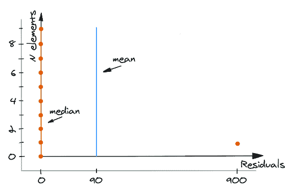
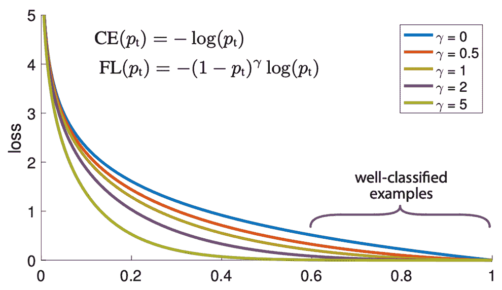
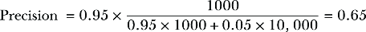
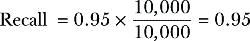
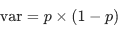
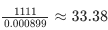
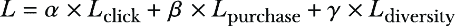

# 第五章：5 损失函数和指标

### 本章涵盖了

+   为你的机器学习系统选择合适的指标和损失函数

+   定义和利用代理指标

+   应用指标层次结构

在上一章中，我们首先触及了为你的机器学习（ML）系统创建设计文档的主题。我们弄清楚了为什么设计文档需要不断编辑，以及为什么你在其中实施的每一个变化不仅不可避免，而且是必要的。

很不幸，一个机器学习系统不能直接解决问题，但它可以通过优化特定任务来尝试近似它。为了有效地做到这一点，它必须得到适当的调整、指导和监控。

为了指导机器学习系统的努力，我们使用其算法的损失函数来奖励或惩罚以减少或增加特定的错误。然而，损失函数用于训练模型，通常必须是可微分的，这意味着可用的损失函数选择范围较窄。因此，为了评估模型的表现，我们使用指标；虽然每个损失函数都可以用作指标（一个很好的例子是均方根误差 [RMSE]，它经常用作指标，尽管我们不确定这是否是最好的决定），但并非每个指标都可以用作损失函数。

在本章中，我们将讨论如何选择最佳拟合的指标和损失函数，重点关注如何在设计过程中进行适当的研究并提供选择动机。

## 5.1 损失

*损失函数*，也称为*目标函数*或*代价函数*，有效地定义了模型如何了解世界以及因变量和自变量之间的联系，它最关注什么，它试图避免什么，以及它认为什么是可接受的。因此，损失函数的选择可以极大地影响你模型的总体性能，即使其他所有因素——特征、目标、模型架构、数据集大小——保持不变。切换到不同的损失函数可以完全重塑整个系统。

选择合适的损失函数（即，选择模型从其错误中学习的方式）是设计机器学习系统中最关键的决定之一。回忆一个永恒的轶事，我们可以在计算酒吧访客的平均工资时对均值进行优化，直到比尔·盖茨走进来（[`mng.bz/M1w8`](https://mng.bz/M1w8)）。

很不幸，并非每个函数都可以用作损失函数。一般来说，损失函数具有两个特性：

+   它在全局上是连续的（预测的变化会导致损失的变化）。

+   它是可微分的（其梯度可以用于基于梯度下降的优化算法）。有一个例外：在特殊情况下，无梯度优化方法适用，尽管实践者通常更喜欢避免它们，因为基于梯度的方法通常收敛得更好。

虽然这两个点对任何损失函数都相关，但选择一个最适合你特定情况并且最接近你系统最终目标的损失函数是很重要的。

这就是高级损失函数发挥作用的地方，提供了改进你的模型的有吸引力的方法。与对特征或模型本身的操作不同，它们通常不会影响运行时方面，这意味着所有代码更改都仅与训练管道相关，将更改隔离到系统的小部分总是设计的一个好特性。但更常见的是，我们见证了机器学习工程师（尤其是应届毕业生）坚持使用特定的损失函数，仅仅因为他们习惯了将其应用于类似的问题。一个臭名昭著的例子是，回归问题中默认选择均方误差（MSE）或平均绝对误差（MAE）损失函数，并且很多时候，这是许多从业者*唯一的选择*。

同时，虽然选择一个合适的损失函数（或一组损失函数）是一个可能大大提高你的模型性能的决定，但这并不是万能的解决方案。我们曾与几位机器学习工程师（他们通常拥有令人尊敬的学术背景和博士学位）合作，他们试图仅通过一个优雅的损失函数来解决他们遇到的所有问题。这种方法与完全不关注损失函数的方法正好相反，但仍然远非理想。一个好的机器学习系统设计者会考虑许多工具，而不是过分依赖一个。总的来说，经验法则是这样的：你的系统研究越深入，你越有可能需要投入时间来寻找或设计一个非平凡的损失函数。

几年前，瓦列里与一名实习生合作，构建了一个预测加密货币交易量的模型。像往常一样，他要求实习生在开始任何工作之前准备一个设计文档，这是一个富有洞察力的练习。实习生没有考虑地跳过了损失函数章节，列出了一些他将用来评估系统性能的指标，而没有给出任何理由。

为什么这不可接受？通过一个例子，我们可以回顾一个简化的情况，其中关于回归问题的损失函数知识被缩小到两个最广泛使用的损失函数：MSE 和 MAE。

想象一下，我们有一个目标值向量 Y = [100, 100, 100, 100, 100, 100, 100, 100, 100, 1000]和一个对所有样本都相同的独立变量 X 向量。

如果我们使用 MSE 作为损失函数来训练一个模型，它将输出一个预测向量：

```py
Y_hat = [190, 190, 190, 190, 190, 190, 190, 190, 190, 190]
```

如果我们使用 MAE 作为损失函数来训练一个模型，它将输出一个预测向量：

```py
Y_hat = [100, 100, 100, 100, 100, 100, 100, 100, 100, 100]
```

备注：请注意，这是一个思想实验，旨在突出这个想法并使其更容易理解。如果我们需要，我们可以创建合成数据来重现整个过程——特征、目标和模型，但为了简单起见，我们将只使用前面的数字。

当我们使用 RMSE 损失函数计算模型的 MSE 和 MAE 时，会得到以下数字：MSE = 72,900，MAE = 162，残差的均值为 0，残差的中位数为-90（图 5.1）。


##### 图 5.1 优化均值后的残差

当我们使用 MAE 损失函数计算模型的 MSE 和 MAE 时，结果将是 MSE = 81,000，MAE = 90，残差的均值为 90，残差的中位数为 0（图 5.2）。



##### 图 5.2 优化中位数后的残差

没有什么好奇怪的，优化 MSE 的模型得到了更好的 MSE，因为 MSE 试图最小化均值，所以均值残差更好。另一方面，优化 MAE 的模型提供了更好的 MAE，因为 MAE 试图优化中位数，所以中位数残差更好。但这对我们意味着什么呢？哪个损失函数更好？这取决于我们的应用。

假设我们正在优化一个飞机的导航系统，任何大于 850 的错误都意味着飞机将偏离着陆场并坠毁。在这种情况下，优化 MAE 不是一个理想的选择。当然，我们可以有 9 次中有 10 次得到完美的结果，只有 1 次车辆被摧毁，但这无论如何都是不可接受的。我们必须不惜一切代价避免异常值或对它们进行惩罚，因此使用 MSE 甚至是一些更高阶的修改。

但假设我们正在优化一个加密货币交易所每天交易所需的流动性数量。*流动性*指的是加密货币在没有损失价值的情况下转换为现金或其他加密货币的能力，这对所有加密货币交易所都是至关重要的。高流动性意味着一个动态且稳定的市场，允许参与者以合理的价格快速交易。然而，过多的流动性意味着分配的资源没有得到利用。在这种情况下，有 9 次中有 10 次预留比所需的现金更多，这远远不是我们想要的。我们可以从不同的角度来审视这个问题：优化 MSE 的模型多分配了 810 个单位，少分配了 810 个单位，而优化 MAE 的模型有 10 次中有 9 次准确无误，并且只少分配了 900 个单位，这似乎是一个更好的决策（如果少分配不如多分配糟糕 9 倍的话），向模型传达我们需要的信息。

很容易看出，尽管我们使用了均方误差（MSE）和平均绝对误差（MAE）来训练模型，但我们应用了不同的标准来评估它们。对于飞机导航系统，我们计算实际值与预测值之差大于 850 的次数。对于流动性优化，这是我们在现场或过度分配加权求和的次数。这表明，训练模型以优化特定的损失函数并评估该模型的表现可以代表两个不同的任务，我们将在第 5.2 节“指标”中讨论这些任务。在继续之前，我们想分享一些关于确定深度学习模型损失函数的细微差别和方面的见解。

### 5.1.1 深度学习模型的损失技巧

在基于深度学习的系统中，尤其是在处理文本、图像或音频数据的系统中，损失函数的选择更为关键。

正确选择的损失函数可以帮助解决与模型训练相关的许多问题，尤其是对于复杂模型和/或数据领域。例如，交叉熵损失是分类问题的经典解决方案。其中一个问题与类别不平衡有关。如果一个类别被过度代表，通过熵损失优化的模型可能会遇到所谓的*模式崩溃*——即对于任何输入都输出一个常数（流行类别）的情况。这些问题已经通过多种方式得到解决（例如，数据欠采样/过采样、为类别设置自定义权重等），但所有这些都需要大量的手动调整，并且不可靠。研究人员通过尝试设计一个解决该问题的损失函数来解决这个问题；最引人注目的成果可能是林等人（“密集目标检测的焦点损失”，[`arxiv.org/abs/1708.02002`](https://arxiv.org/abs/1708.02002)），现在这种损失函数在帮助解决数据不平衡问题的工具中占据了其应有的位置。

焦点损失（见图 5.3）是一种动态缩放的交叉熵损失，其中缩放因子随着对正确类别的信心增加而衰减到零。直观上，这个缩放因子可以自动降低训练过程中简单示例的贡献，并快速将模型集中在困难示例上（更多信息可以在[`paperswithcode.com/method/focal-loss`](https://paperswithcode.com/method/focal-loss)找到）。



##### 图 5.3 建议的焦点损失函数更关注误分类示例，同时减少对正确分类示例的相对损失（来源：林等人）。

最初，这种损失函数是为计算机视觉中特定于对象检测的问题引入的，后来，该方法扩展到许多其他领域，包括与图像无关的领域，如音频或自然语言处理。我们发现的焦点损失最远的应用是在论文“自然语言处理能否帮助区分中国的炎症性肠病？”（Tong 等人；[`mng.bz/aV9X`](https://mng.bz/aV9X)）中介绍的，这证实了思想在不同领域之间的传播。

在某些情况下，合理的解决方案可能是将多个损失函数结合用于单个模型。这种方法的必要性可能出现在复杂问题中，这些问题通常是多模态的，并且通常与多个并发数据集相关联。在这里，我们不会提供太多关于使用组合损失函数的细节，因为它研究密集，但我们愿意给出一些例子：

1.  “从手机扫描中生成逼真的体积型虚拟人”（Cao 等人；[`dl.acm.org/doi/abs/10.1145/3528223.3530143`](https://dl.acm.org/doi/abs/10.1145/3528223.3530143)）。作者结合了三种损失函数家族（分割、重建、感知）。生成计算机视觉模型通常需要考虑组合损失。

1.  “使用 AlphaFold 进行高度精确的蛋白质结构预测”（Jumper 等人；[`www.nature.com/articles/s41586-021-03819-2`](https://www.nature.com/articles/s41586-021-03819-2)）。著名的 AlphaFold 2 模型能够以令人印象深刻的准确性从蛋白质的遗传序列中预测其 3D 形状。这对生物技术界来说是一个巨大的进步，它在其内部使用了多个辅助损失函数。例如，一个掩码语言模型的目标，可能是受到 BERT 类似架构中使用的损失函数的启发，是自然语言处理模型中流行的一类。

1.  “GrokNet：用于商业的统一计算机视觉模型主干和嵌入”（Bell 等人；[`mng.bz/Xxr6`](https://mng.bz/Xxr6)）。这是我们能够回忆起的组合损失示例中的瑰宝。作者的目标是构建一个可以解决多个问题的单一模型，因此他们使用了 7 个商品数据集和 83（80 个分类和 3 个嵌入）损失函数！

通常，多个损失函数要么用于帮助模型收敛，要么用于使用单个模型解决多个调整问题。

当损失函数有助于设置和微调准确性、效率，并在训练过程中最小化错误时，度量标准则用于评估其在一定参数集内的性能。

## 5.2 度量标准

我们优化的损失函数和用于评估模型性能的度量标准可能彼此非常不同。回想一下，在第四章中，Supermegaretail 的需求预测系统的最终目标是减少交付和销售物品之间的差距，使其尽可能窄，同时避免缺货情况。如果我们尝试可视化这个流程，它可能看起来像图 5.4。

我们知道合适的损失函数是必不可少的，但关于指标呢？我们能不能选择一些标准指标，评估各种模型，选择最好的，部署它，并通过 A/B 测试来估计潜在的成功？


##### 图 5.4 一个适用于需求预测系统的一般性管道，完美契合超级大零售案例

很遗憾，不行。选择正确的指标集必须像选择损失函数一样仔细。更重要的是，虽然流行的损失函数集是有限的，但总有机会为特定的业务领域定制一个指标。选择错误的指标，反过来，当我们设置我们的模型训练无关值时，会导致误导性的优化，最终导致在实际场景中的性能不佳。结果，我们不得不在模型开发中回滚几步，导致时间和资源的巨大浪费。但即使为您的机器学习系统选择了正确的指标，也不能保证项目的成功。

##### 瓦列里营火故事

以前，我为一家经常遇到不付款债务人问题的银行开发了一个机器学习系统。我们准备好的系统有两个主要目标：

+   减少逾期付款的数量

+   让客户更加响应

我们选择将客户从非付款者转变为付款者的转化率作为指标。

我们首先实施了一个承诺支付系统，其工作方式如下。假设史密斯先生接到银行的电话：“史密斯先生，您没有按时支付您的贷款。我们能否期待您在三天内支付所需金额？” “哦，当然，我会的，我会的，”史密斯先生说。银行的人挂断电话并勾选“承诺支付”框。但然后史密斯先生就会违背承诺，一分钱也不付。

我们开始工作时，转化率为 0.5，这意味着这种情况发生了一半。这不算太糟糕，但绝对不算出色。

考虑到人们对银行此类电话的态度以及他们尽快挂断电话的愿望，违约承诺是一个非常常见的案例。但事实是，这是一个双刃剑。一方面，客户可能不会觉得和银行交谈愉快，尤其是如果他们没有发起对话的话。但银行也对无用的沟通不感兴趣，不得不在呼叫中心和员工身上花费过多的资金。

作为解决方案，我们建立了一个系统来预测客户同意支付并履行承诺的概率。我们用短信取代了人工电话。这样我们就不用打电话给我们的客户，说服他们做出承诺。该系统还应该预测客户行为。

在验证阶段，系统显示的转化率为 0.9——几乎是人工操作的近两倍！然而，两周后，在实战条件下，转化率骤降至 0.35，而我们只剩下了一周的时间向副总裁提交报告。

显然出了些问题，我们需要找出原因。我们回顾了之前这个指标是如何工作的，它相当简单：如果客户承诺在某个月的一天偿还债务，但 3 天内没有这样做，他们就会被标记为债务人。为什么是 3 天？答案是，实际操作与在银行数据库中获得关于此操作信息之间的差距是 3 天。

假设你应在 3 月 1 日 EOD（截至当日）支付下一笔贷款。在 3 月 1 日当天工作结束后，你下班后去银行支付所需金额。到了 3 月 2 日，系统检查数据库并发现尚未支付（难怪，因为信息要到 3 月 4 日才能到达）。系统认为：“看起来我们有逾期未付款项了，”并启动了一条短信，因为根据系统收集的数据，你收到短信后支付所需金额的概率很高（90%！）。3 月 2 日稍后，你收到了银行发来的要求你支付贷款的短信。“他们肯定搞错了。我会告诉他们我已经支付了，”你想，并开始填写回复短信中的表格。问题是，这个表格不允许你输入早于当前日期的还款日期。你只能指定你将在 3 月 2 日或之后支付。但你已经在 3 月 1 日支付了。你该怎么办？你表明你在 3 月 2 日支付了，并提交了表格。三天后，系统检查了非付款者名单，打开你的个人资料，看到你承诺在 3 月 2 日支付，但在此日期后的 3 天内并未支付。

当我们重新配置系统时，转化率几乎达到了初始值，高达 0.8，但我们在过程中遇到的问题显示了达到你的指标可能会受到整体系统行为缺陷的阻碍。

表面上，选择正确指标框架的方法非常直接：选择最接近最终目标的那个。然而，正如接下来的篝火故事将展示的，这可能非常棘手。你可以尝试自己找到这个指标，或者寻求一些外部帮助。以下是我们推荐考虑的一些选项：

+   如果你很幸运，有一个指标层级，我们将在本章后面讨论，请使用它来导航到你需要的数据指标。

+   一些公司有一个专门负责指标的部门；如果是这样的话，请使用他们的帮助。

+   如果这两种情况都不适用，你可能需要使用产品经理和数据科学家来开发最佳的指标。

+   如果你打算解决的问题类似于以前解决的问题，并且解决方案被证明是稳固和高效的，那么自然地，如果需要，可以从一个项目转移到另一个项目，并对其进行某些修改。

+   如果你有一个 A/B 测试团队，他们通常也具备足够的知识来选择或创建一个度量标准。

如果你没有这里提到的事情的奢侈，你可以做以下事情：

+   参考设计中的目标部分并与之对齐（重要的是要刷新最终目标是什么，而不是你如何记住它们）。了解你的目标将帮助你理解哪些度量标准将帮助你实现这些目标，或者至少帮助你排除明显不合适的度量标准。

+   尝试通过编写类似于度量标准层次结构的地图来分解最终目标。这可能需要超过一个阶段才能实现，但这种练习将帮助你将你的大目标分解成几个较小的组成部分，每个部分都有自己的度量标准。拥有许多小部分在手将有助于组装更大的整体。

+   找到描述每个阶段成功最佳表现的度量标准。

+   如果某些东西难以直接衡量，可以用代理度量标准来代替（参见 5.2.2 节）。代理度量标准将允许你在系统发布之前收集必要且非常重要的信息。

+   使用这张地图，选择最能代表最关键阶段或以最佳方式总结地图的度量标准。

在下一个篝火故事中，我们将回顾经典的二元分类问题。

##### Valerii 的篝火故事

最近，我和我的一个朋友就欺诈模型的评估进行了交谈。欺诈模型通常试图解决二元分类任务，其中 0 表示非欺诈，1 表示欺诈。

没有度量标准是理想的，这总是取决于最终目标。然而，当我们谈论欺诈模型时，我们通常希望保持欺诈交易与合法交易的一定比例。如果我们有 10 倍多的交易，那么有 10 倍多的欺诈是可以接受的，但不是 20 倍或 30 倍。换句话说，我们希望有一个概率模型。

此外，欺诈通常属于类别不平衡问题，而且这种平衡在时间上是不稳定的。有一天比率可能是 1:100（欺诈交易激增），第二天，1:1000（普通一天），第三天，1:10,000（欺诈者休假了）。

这个模型族最流行的度量标准集是精确度和召回率，这可能不是最佳选择。

精确度的问题在于其计算同时考虑了两个类别：


假设我们有一个模型，它有 95%的概率预测欺诈是欺诈（真阳性[TP]），5%的概率预测非欺诈是欺诈（假阳性[FP]）。

让我们回顾三个场景，其中 P 是正样本的数量，N 是负样本的数量：

+   P = 10,000, N = 10,000，


+   P = 100,000, N = 10,000,


+   P = 1000, N = 10,000,



如您所见，即使其他什么都没有改变，类别平衡也会对指标产生显著影响。

现在我们来看看召回率（召回率 = TP/(TP+FN) = TP/P = 真正例率 [TPR]）并检查相同的三个场景：

+   P = 10,000, N = 10,000,



+   P = 100,000, N = 10,000,


+   P = 1000, N = 10,000,


在这种情况下，类别平衡根本不影响指标。

还有一个称为特异性的指标可以替代精确率：


同样的三个例子显示了以下内容：

+   P = 10,000, N = 10,000,


+   P = 100,000, N = 10,000,


+   P = 1000, N = 10,000,


由于类别不平衡，召回率和特异率不会改变，因为这些指标对类别平衡不敏感。

最初，我的朋友创建了一个笔记本([`mng.bz/5Ov8`](https://mng.bz/5Ov8))来证明我是错的。以下代码展示了他的思路：

```py
import numpy as np

def gen_labels_preds(fraud, genuine, fraud_predicted, correct_fraud_predicted):
  labels = np.concatenate([np.repeat(True, fraud), np.repeat(False, genuine)])
  preds = np.concatenate([
    np.repeat(True, correct_fraud_predicted), # TP
    np.repeat(False, fraud - correct_fraud_predicted), # FP
    np.repeat(True, fraud_predicted - correct_fraud_predicted), # FN
    np.repeat(False, genuine - (fraud_predicted - correct_fraud_predicted)) # TN
    ])

  return labels, preds

def calculate_metrics(labels, preds):
  TP = (preds & labels).sum()
  FP = (preds & ~labels).sum()
  TN = (~preds & ~labels).sum()
  FN = (~preds & labels).sum()

  recall = TP / (TP + FN)
  precision = TP / (TP + FP)
  FPR = FP / (FP + TN)

  return recall, precision, FPR
```

他设计了两个具有以下指标的模型：

+   A 有 20 个误报，并且 80%的欺诈被捕获。

+   B 有 920 个误报，并且 80%的欺诈被捕获。

然后他在三个不同交易数量和欺诈案件数量的场景中尝试了他的两个模型。在场景 1 中，交易数量为 100,000。总体来说，有 100 起欺诈案件，因此类别平衡为 1:1,000：

```py
fraud = 100 # high imbalance
genuine = 100000
model_A_FP = 20
model_B_FP = 920

# Model A
a_total_fraud_predicted = model_A_FP + fraud*0.8
a_correct_fraud_predicted = fraud*0.8

a_labels, a_preds = gen_labels_preds(fraud, genuine,
a_total_fraud_predicted, a_correct_fraud_predicted)
a_recall, a_precision, a_FPR = calculate_metrics(a_labels, a_preds)

# Model B

b_total_fraud_predicted = model_B_FP + fraud*0.8 
# Flags many more transactions
b_correct_fraud_predicted = fraud*0.8
b_labels, b_preds = gen_labels_preds(fraud, genuine,b_total_fraud_predicted, b_correct_fraud_predicted)
b_recall, b_precision, b_FPR = calculate_metrics(b_labels, b_preds)

print("Model A Performance Metrics:")
print('TPR:', a_recall)
print("Precision:", a_precision)
print("FPR:", a_FPR)

print("\nModel B Performance Metrics:")
print('TPR:', b_recall)
print("Precision:", b_precision)
print("FPR:", b_FPR)

Model A Performance Metrics:
TPR: 0.8
Precision: 0.8
FPR: 0.0002

Model B Performance Metrics:
TPR: 0.8
Precision: 0.08
FPR: 0.0092
```

在场景 2 中，他使用了与场景 1 相同的指标。交易数量为 100,000。总体来说，有 10 起欺诈案件，因此类别平衡为 1:10,000：

```py
fraud = 10 # high imbalance
genuine = 100000

# Model A
a_total_fraud_predicted = model_A_FP + fraud*0.8
a_correct_fraud_predicted = fraud*0.8

a_labels, a_preds = gen_labels_preds(fraud, genuine, a_total_fraud_predicted, a_correct_fraud_predicted)
a_recall, a_precision, a_FPR = calculate_metrics(a_labels, a_preds)

# Model B
b_total_fraud_predicted = model_B_FP + fraud*0.8 # Flags many more transactions
b_correct_fraud_predicted = fraud*0.8

b_labels, b_preds = gen_labels_preds(fraud, genuine, b_total_fraud_predicted, b_correct_fraud_predicted)
b_recall, b_precision, b_FPR = calculate_metrics(b_labels, b_preds)
print("Model A Performance Metrics:")
print('TPR:', a_recall)
print("Precision:", a_precision)
print("FPR:", a_FPR)

print("\nModel B Performance Metrics:")
print('TPR:', b_recall)
print("Precision:", b_precision)
print("FPR:", b_FPR)

Model A Performance Metrics:
TPR: 0.8
Precision: 0.2857142857142857
FPR: 0.0002

Model B Performance Metrics:
TPR: 0.8
Precision: 0.008620689655172414
FPR: 0.0092
```

在场景 3 中，他又使用了相同的指标和 100,000 笔交易。总体来说，有 1,000 起欺诈案件，因此类别平衡为 1:100：

```py
fraud = 1000 # high imbalance
genuine = 100000

# Model A
a_total_fraud_predicted = model_A_FP + fraud*0.8
a_correct_fraud_predicted = fraud*0.8

a_labels, a_preds = gen_labels_preds(fraud, genuine, a_total_fraud_predicted, a_correct_fraud_predicted)
a_recall, a_precision, a_FPR = calculate_metrics(a_labels, a_preds)

# Model B
b_total_fraud_predicted = model_B_FP + fraud*0.8 # Flags many more transactions
b_correct_fraud_predicted = fraud*0.8

b_labels, b_preds = gen_labels_preds(fraud, genuine, b_total_fraud_predicted, b_correct_fraud_predicted)
b_recall, b_precision, b_FPR = calculate_metrics(b_labels, b_preds)

print("Model A Performance Metrics:")
print('TPR:', a_recall)
print("Precision:", a_precision)
print("FPR:", a_FPR)
print("\nModel B Performance Metrics:")
print('TPR:', b_recall)
print("Precision:", b_precision)
print("FPR:", b_FPR)
Model A Performance Metrics:
TPR: 0.8
Precision: 0.975609756097561
FPR: 0.0002

Model B Performance Metrics:
TPR: 0.8
Precision: 0.46511627906976744
FPR: 0.0092
```

根据接收者操作特征曲线下面积（ROC AUC）和精确率-召回率 AUC（PR AUC）指标，模型 A 表现更好。模型 B 是一个糟糕的模型，但仍然得到了一个非常好的 FPR（0.0092），即使如果将其投入生产，预测结果将是垃圾（1000 个欺诈预测中有 920 个是错误的）。精确率使我们能够看到这一点。对于模型 B 来说，它只有 0.08，所以我们永远不会考虑将其接近生产环境。

这里的谬误是什么？

首先，模型 B 的 FPR 为 0.0092，是模型 A 的 FPR（0.0002）的 46 倍。没有好的或坏的 FPR。它取决于你的量级，即使是微小的差异也可能变得很大。例如，0.99 的案例比率比 0.999（1:100 与 1:1000）高 10 倍。

但即使在笔记本示例中，虽然精确率只有 10 倍糟糕，模型 B 的 FPR 却糟糕了 46 倍；这很难称得上是一个非常好的 FPR。

如您从前面的计算和笔记本中看到的那样，当类别平衡发生变化时，精确率会显示一个非常不同的数字，即使模型的性能保持不变。相比之下，TPR 和 FPR 保持不变。

我们如何结合这些信息并将其应用于选择合适的指标？

在我们服务的一家公司中，我们的目标是每天处理超过 1000 亿个事件以减少垃圾邮件和欺诈行为。我们将特异性设置为至少 0.999999（特异性 = TNR = 1 – FPR，换句话说，我们对于每 100 万个事件中有一个误报是可以接受的）并在此特异性率下最大化召回率（TPR）。这证明比使用标准的召回率-精确率对更有益，考虑到底层数据的波动性。

然而，有些情况迫使你必须即兴发挥，以找到能够从你的系统中获得所需行为模式的指标。

##### 阿尔谢尼的篝火故事

我曾为一家制造优化公司工作，需要改进其检测系统中的缺陷，但在过程中，另一个问题出现了：指标不够敏感。运行计划场景所需的数据集太小——每个客户产品只有 10 到 20 个有缺陷的样本。而且我们无法获取更多数据，因为根本不存在更多的现有有缺陷单元。缺陷率太低，多亏了高工程品质。

除了数据集大小外，我们的客户对中间结果不感兴趣（例如，我们的模型中缺陷概率的校准程度如何）。他们的判断非常直接。为了简单起见，让我这样描述：

+   有 10 个有缺陷的单元和 N 个常规单元。

+   理想的情况是没有任何错误。

+   1 个误报或 1 个漏报已经足够好。

+   否则，系统将无法使用。

我尝试改进现有系统的多数努力都徒劳无功，直到某个时刻我决定设计一个定制的连续指标，该指标利用了内部指标并设置了合理的阈值。这个指标看起来非常离散：

+   “0”意味着“完美的系统”。

+   “1”代表“足够好”。

+   “2”代表“垃圾”。

在这个指标到位后，我能够逐步、逐步地改进系统，同时有信心我在正确的方向上前进。

经过一系列的小幅改进，累积效应将系统从“垃圾”转变为“足够好”，再从“足够好”转变为对多个客户来说的“完美”。

在你的机器学习系统成功中，一个重要因素始终是其一致性。为了实现这一点，存在一个单独的指标类别，我们将在下一节中介绍。

### 5.2.1 一致性指标

在应用 ML 中，当模型面对略微干扰的输入时，通常希望模型有一致的输出。这个属性在不同的子领域中被称为一致性、鲁棒性、稳定性或平滑性，可以形式化地定义为模型在特定变换下不变的要求，即模型在原始输入和干扰输入上的输出差异趋向于零。换句话说，我们可以将这个属性数学上表达为


其中 *f* 代表模型，*x* 代表原始输入，而 *eps* 代表应用于输入的干扰。一致性指标在学术 ML 中通常不常讨论，但在实际应用中，输入的微小变化可能会对模型输出产生重大影响，因此这是一个重要的考虑因素。

干扰可能不同。例如，对于一个固态计算机视觉模型，轻微的光照变化通常不应该改变模型输出，或者情感分析模型不应该对同义词的变化敏感。我们将在第十章讨论 ML 系统测试时，更详细地讨论这类干扰和不变性。

另有一个类似的属性：当模型重新训练（例如，通过添加新数据或使用其他种子）时，我们期望它在输入保持不变的情况下产生相同或接近的输出。对于一个反欺诈系统，如果同一个用户今天被认为是欺诈者，明天是合法用户，下周又再次被认为是欺诈者，这是不可接受的：


当模型输出随时间变化时，新模型的发布（对于大多数 ML 系统来说应该是一个常规程序）可能会影响下游系统或系统的最终用户，扰乱他们的常见使用场景。人们很少喜欢工具和环境中的意外变化。

这些属性可能和我们对模型期望的默认特征（如准确的预测）一样重要，因为它们塑造了期望。正如我们在前面的章节中讨论的，如果一个模型不可信，它的效用就会降低。因此，我们需要特定的指标来衡量这种行为。

幸运的是，我们把这些属性严格地表述出来，所以剩下的最大未解问题是估计前述公式中适当的噪声或干扰类型：什么是不变性，以及预期的条件如何随时间变化？

在这些估计到位后，你可以将常规度量标准附加到估计一致性上。例如，对于搜索引擎示例（Photostock Inc.），我们不希望文档在系统发布之间因某些查询而改变其排名，因此一致性度量标准可以是（查询，文档）对在一段时间内文档和查询语料库中的排名方差。显然，方差越小，对系统越好。然而，你也不能忘记处理不明确的情况——比如说，一个虚拟常数模型往往提供最低的方差，但这并不是机器学习工程师通常追求的一致性。

一致性通常是机器学习系统的一个重要属性（见图 5.5）。如果你的系统是这样，考虑添加一个度量标准，反映你的系统如何对输入数据、训练数据或训练过程调整的变化做出响应。


##### 图 5.5 新模型发布在估计用户（U）欺诈（F）的概率（P）时相当一致。

最终，你将能够基于清晰的离线和在线度量标准层次结构形成一个单一的度量系统。

### 5.2.2 离线和在线度量标准、代理度量标准和度量标准层次结构

设置和改进适当的度量标准是构建高效机器学习系统的重要步骤。但即使这样，也不是我们的最终目标，因为我们还需要深入一层。当我们有计划减少垃圾邮件和欺诈行为时，目标并不是在给定的特异性下达到最高的召回率。而是通过减少垃圾邮件的数量，降低欺诈行为的风险，从而改善用户体验。

在 Supermegaretail 案例中，目标是减少因缺货和过剩情况导致的损失，这可以用现金等价物来表示，但不能用绝对误差（MAE）、均方误差（MSE）、加权平均绝对百分比误差（wMAPE）、加权绝对百分比误差（WAPE）或其他任何度量标准来表示。

换句话说，我们在训练/测试/验证阶段以及最终评估模型时使用的度量标准通常并不相同（见表 5.1）。

之前讨论的集合也被称为*离线度量标准*，因为我们可以在不将模型部署到生产环境中时应用和计算它们。相比之下，一些度量标准，通常是我们的目标度量标准，只能在实施系统并使用其业务输出后才能计算。尽管有时离线和在线度量标准可能一致，但我们仍然必须分别评估它们。评估在线度量标准（变化/改进）的最常见方式是通过 A/B 测试。

我们使用离线指标的原因很简单：我们可以在部署系统之前使用它们。这种方法快速且可重复，而且不需要昂贵的模型部署过程。离线指标必须具备一个特点：它们必须是对在线指标的良好预测器。换句话说，离线指标的增加或减少必须与在线指标的增加/减少有强烈的关联性或成比例。离线指标充当在线指标的代理指标，可以用作在线指标的效率预测器。

##### 表 5.1 离线和在线指标示例

| 离线指标 | 在线指标 |
| --- | --- |
| 对于垃圾邮件消息分类的给定特定性召回率 | 用户对垃圾邮件消息的投诉数量 |
| 1.5、25、50、75、95 和 99 的百分位数 | 过期商品的价值，总销售额 |
| 均值倒数排名，归一化折现累积增益 | 搜索引擎结果页面的点击率 |

但如果我们能找到与我们的在线指标有强烈关联且改进具有传递性的离线指标，我们也可以对离线指标做同样的事情。让我们用一个例子来回顾这一点。

想象一下，我们正在为一家电子商务网站构建一个推荐系统。我们的最终目标是增加总商品交易额（GMV；这是一个衡量给定期间内销售总价值的指标）。不幸的是，正如之前提到的，这并不是我们可以在将系统部署到生产环境中并运行 A/B 测试之前测量的东西。我们相信，增加购买商品的数量将增加 GMV。为了实现这一点，我们希望通过提供有更高购买可能性的优惠来提高转化率（假设这将增加购买商品的总数量）。

平均而言，3%的优惠被点击，其中 3%导致购买：3%乘以 3%意味着如果我们展示 10,000 个优惠，只有 9 个会导致购买。这有两个相互关联的负面影响：

+   类 1 数据（购买）数量少，类别不平衡严重

+   增加 A/B 测试的持续时间

例如，对于成功率与尝试次数比为 9/10,000 的 A/B 测试，我们需要比 90/10,000 的比率多 100 倍的数据（最小可检测效应与样本数量之间的二次依赖性；请参阅以下示例）。

为了减轻这种情况，我们可以使用一个代理指标，点击率（CTR），同时考虑到以下背景：

+   没有点击就无法进行购买。我们可以预期 CTR（点击率）与 CR（转化率）之间存在正相关，甚至可以计算出它。

+   点击次数比购买次数多 33.3 倍，这意味着我们将有 33.3 倍的训练数据用于系统的第 1 类，A/B 测试将快 1,111（33.3²）倍。（为了精确起见，我们可以预期方差也会发生变化，如，所以根据，var = 0.000899，根据，var = 0.0291，这意味着总体上我们将通过倍增加收敛速度。）

使用 CTR 而不是 CR 可以帮助我们更快、更敏感地迭代，无论是在离线（对于感兴趣类别的数据，估计指标和损失更容易）还是在在线（至少部分通过 A/B 测试）。

我们可以用以下关系表示：

+   CTR → CR →（购买物品的总数）→ GMV

我们可以通过构建一组指标层次结构进一步概括：

1.  全局、公司范围内的指标是收入。

1.  全球收入（GMV）由不同产品的收入组成，包括我们负责的产品。

1.  我们的产品收入受以下因素影响

    +   平均购买价格

    +   购买频率

    +   用户数量（它们相互关联并相互影响，因此用虚线表示）

1.  购买频率受 CR 影响。

1.  转化率受 CTR 影响。

一组指标层次结构（见图 5.6）有助于找到合适的代理指标。尽管创建它超出了设计机器学习系统的范围，但在设计过程中拥有一个现成的指标体系并参考它将非常方便。使用共同的基础有助于证明选择并降低失败的风险。


##### 图 5.6 指标层次结构

当系统足够成熟，以至于某些指标可能相互矛盾时，一组指标层次结构尤为重要。我们的一位朋友曾经告诉我们一个关于构建推荐系统的简短轶事：一个内部用户参与度更高的变体（他们更喜欢新推荐而不是旧版本）在更广泛的受众中似乎利润较低。

一组指标和代理指标的概念与我们之前讨论的多组件损失相关。例如，当为 Supermegaretail 构建这个推荐引擎时，我们可以定制一个特定的损失函数，该函数将考虑多个级别的用户活动（点击、购买、购买物品的总数）并在指标之间平衡我们的利益。

##### 来自阿列克谢的篝火故事

之前，我曾基于计算机视觉开发了一个全新的产品功能。提出的解决方案被分解为组件，每个组件和子组件都仔细标注了指标。由于该功能的创新性，指标是定制的——主要是各种可能结果之间的比率。我们与产品高管合作设计了指标层次结构。在针对一个指标进行多次实验以推动其进展后，我产生了直觉，认为它是不平衡的。为了测试这一点，我通过用具有特定参数生成的随机噪声替换模型预测来运行了一个对抗性实验。令人惊讶的是，随机模型得分完美！该指标最初是为了在召回率和精确率之间进行权衡而设计的，但如此极端的不平衡显然是不理想的，因此我们必须尽快重新设计它。

## 5.3 设计文档：添加损失和指标

从第四章开始，我们开始介绍两个虚构案例的设计文档：Supermegaretail 和 PhotoStock Inc. 在这里，我们继续详细阐述每个案例的机器学习解决方案的开发，并涵盖损失函数和损失的选择。我们首先介绍 Supermegaretail，然后是 PhotoStock Inc.

### 5.3.1 Supermegaretail 的指标和损失函数

让我们重温一下 Supermegaretail 案例。在那里，我们的目标是减少交付和销售物品之间的差距，使其尽可能小，同时避免因特定的服务等级协议（SLA）而出现缺货情况。

#### 设计文档：Supermegaretail

#### II. 指标和损失

#### i. 指标

在我们自行选择指标之前，进行一些初步研究是有意义的。幸运的是，有许多与这个问题相关的论文，但最突出的是 Stephen Kolassa 的“在零售销售预测中评估预测计数数据分布”([`mng.bz/eVl9`](https://mng.bz/eVl9))。

让我们回顾一下项目目标，即减少交付和销售物品之间的差距，使其尽可能小，同时避免因特定服务等级协议（SLA）而出现缺货情况。为此，我们计划使用机器学习系统来预测特定商店在特定期间内对特定物品的需求。

在这个案例中，这篇论文的摘要看起来几乎完美匹配：

> 计算能力的巨大提升和新数据库架构使得数据可以以越来越细的粒度存储和处理，从而产生了计数数据时间序列，其计数越来越低。这些序列不能再使用适用于连续概率分布的近似方法来处理。此外，仅仅计算点预测是不够的：我们需要预测整个（离散）预测分布，特别是对于供应链预测和库存控制，但也包括其他规划过程。

（计数数据是整数值的时间序列。对于我们所面临的供应链预测来说，这是至关重要的，因为大多数产品都是以单位销售的。）考虑到这一点，我们可以简要回顾这篇论文（以下字母列表中），并挑选出最适合我们最终目标的指标。

##### A. 基于绝对误差的度量

MAE 优化了中位数；加权平均绝对百分比误差（wMAPE）是 MAE 除以样本外实现值的平均值，通过将 MAE 除以随机游走预测的样本内 MAE，可以得到平均绝对缩放误差。

在对称预测分布中，优化中位数与优化均值没有太大区别。然而，适用于低量计数数据的预测分布通常远非对称，这种区别在这种情况下会产生差异，并导致有偏预测。

##### B. 百分比误差

如果任何未来的实现值为零，则平均绝对百分比误差（MAPE）未定义，因此它对于计数数据来说特别不合适。

对称的 MAPE 是对 MAPE 的“对称化”版本，如果点预测和实际值在所有未来时间点都不是零，则定义。然而，在任何一个实际值为零的时期，无论点预测如何，其贡献都是 2，这使得它对于计数数据来说不合适。

##### C. 基于平方误差的度量

最小化平方误差自然会引导到无偏的点预测。然而，由于对非常高的预测误差敏感，MSE（均方误差）不适用于间歇性需求项目。同样的论点也适用于非间歇性计数数据。

##### D. 相对误差

显著的变化是中位数相对绝对误差和几何平均相对绝对误差。

在预测计数数据的特定背景下，这些度量存在两个主要弱点：

+   相对误差通常与绝对误差进行比较。因此，它们与基于 MAE（平均绝对误差）的误差一样，受到相同的批评，如前所述。

+   在每个时期的基础上，简单的基准，如简单的随机游走，可能没有错误地预测，因此，这个时期的相对误差由于除以零而未定义。

##### E. 基于率的误差

Kourentzes（2014）最近提出了两种新的间歇性需求误差度量：MSR 和 MAR，旨在评估间歇性需求点预测是否在增加的时间段内正确地捕捉了平均需求。这是一个有趣的建议，但这些度量中的一个特性是它们隐含地更重视短期未来而不是中到长期未来。有人可能会说，这正是我们在预测时想要做的，但即使如此，也可以提出这样的加权应该明确——通过在平均未来时间期间使用适当的加权方案来实现。

##### F. 缩放误差

Petropoulos 和 Kourentzes（2015）建议使用 MSE 的缩放版本，即 sMSE，它是通过预测期内的实际值的平方平均值缩放的平方误差的平均值。sMSE 除非所有实际值都是零，否则是良好定义的，通过*f*的期望最小化，并且由于缩放，可以比较不同时间序列。此外（同样由于缩放），它对高预测误差的敏感性不如 MSE。具体来说，它对剧烈的低预测更为稳健，尽管它对高预测误差仍然敏感。

##### G. 功能和损失函数

另一种看待预测的方法是集中在预测分布的功能性点预测。可以争论说，零售商的目标是达到一定的服务水平（比如说 95%），因此他们只对预测分布的相应分位数感兴趣。这可以通过适当的损失函数或评分规则来得出。这种方法与将预测视为库存控制系统一部分的想法密切相关。从这个角度来看，分位数预测被用作标准库存控制策略的输入，预测的质量通过评估随时间变化的库存总价值并权衡缺货来评估。

尽管作者们认为这不是最佳解决方案并提出了一个替代方案，但论文的最后一段相当有前景。从商业角度来看，预测不同的分位数以维持服务水平协议（SLA）是有意义的，而且从损失函数等于指标的角度来看也是可取的。因此，对于 1.5、25、50、75、95 和 99 的分位数，分位数指标看起来是一个合适的选择。此外，如果我们需要更多地关注特定的 SKU、商品组或聚类。在这种情况下，分位数指标支持计算对象/组权重（例如，商品价格）。

#### i.ii. 选择指标

对于 1.5、25、50、75、95 和 99 的分位数，以及与 SKU 价格相等的权重和必要的额外惩罚（如果认为有必要）的分位数指标，都计算为点估计值，并带有 95%的置信区间（使用自助法或交叉验证）。此外，我们可以进一步转换这个指标，将其表示为给定分位数的绝对百分比误差。必须考虑 Petropoulos 和 Kourentzes 文章中关于百分比误差的所有考虑。最终，一系列实验将有助于决定最终形式。我们可能两者都会使用，因为检查绝对值（金钱/件数）和百分比误差都是有意义的。

在 A/B 测试期间感兴趣的在线指标是

+   收入——预期会增加

+   库存水平——预期会下降或保持不变

+   利润率——预期会增加


+   Alpha——用于基于分位数的损失系数

+   W—权重

+   I—指示函数

+   A—模型输出

+   T—标签

#### ii. 损失函数

当指标等于我们的损失函数时，选择后者是直接的。我们将使用 1.5、25、50、75、95 和 99 的量级损失来训练六个模型，从而产生六个不同的模型，为我们提供对预测分布相应量级的各种保证。

作为实验的第二阶段，我们还将审查 Tweedie 损失函数。Tweedie 分布是一族概率分布，包括纯连续的正态分布、伽马分布和逆高斯分布；纯离散的缩放泊松分布；以及具有零点正质量的复合泊松-伽马分布，其他方面都是连续的。这些特性使其成为我们计数数据的理想候选者。

### 5.3.2 PhotoStock Inc.的指标和损失函数

接下来是 PhotoStock Inc.的设计文档，其中应根据业务案例的性质和要解决的问题应用一套完全不同的损失和指标。在 PhotoStock Inc.的情况下，我们被雇佣来构建一个现代搜索工具，该工具可以根据客户的文本查询找到最相关的照片，同时提供卓越的性能并显示最相关的库存图片。

#### 设计文档：PhotoStock Inc.

#### II. 指标和损失函数

#### i. 指标

在选择新的 PhotoStock 搜索引擎的指标时，我们应该记住系统的预期行为，包括以下内容：

+   用户点击搜索结果中的链接，结果越靠前，点击越多。这种行为可以通过 CTR 指标反映出来，该指标评估了多少用户点击了搜索结果。

+   用户通过搜索购买图片。这种行为可以通过 CR 指标反映出来，该指标评估了多少点击导致了购买。

+   用户在搜索引擎结果页面（SERP）上看到各种建议。这里没有现成的解决方案，因为我们没有对多样性有一个明确定义。让我们稍后与用户体验团队讨论这个问题。作为一个基线，我们可以使用在 SERP 上表示的不同图像类别的数量作为多样性的衡量标准。在未来，我们应该研究其他公司的经验——Airbnb 的论文“在 Airbnb 学习如何进行多样性排序”([`arxiv.org/abs/2210.07774`](https://arxiv.org/abs/2210.07774))。

+   从人类的角度来看，搜索结果看起来是合理的。这种行为可以通过人类评估指标反映出来，该指标显示有多少用户认为搜索结果是合理的。

点击率（CTR）和转化率（CR）是在线指标，这意味着它们只能在系统运行时进行测量。多样性是一个无监督的离线指标，这意味着它不需要任何额外的数据，并且可以定期免费测量。另一方面，人工评估是一个监督的离线指标，这意味着它需要额外的数据（人工评估），因此收集数据需要时间和精力。

为了引入 CTR 和 CR 的离线代理指标，我们可以使用经典的排序问题指标，如平均倒数排名（MRR）和归一化折现累积增益（NDCG）。MRR 是一个计算给定结果集的倒数排名平均值的指标，它是第一个相关结果的排名倒数平均值的一个度量。NDCG 是一个计算给定结果集的折现累积增益（DCG）平均值的指标，它是从第一个 N 个结果中取出的相关性分数的总和除以理想的 DCG。而 DCG 是按照相关性递减的顺序在前 N 个结果中的相关性分数的总和。

MRR 和 NDCG 都需要为每个查询提供一个相关结果列表来计算指标。我们可以为 MRR 和 NDCG 使用相同的列表，但我们需要通过众包来创建这个列表，以确保它能够代表用户可能看到的结果。虽然 MRR 可能适合作为 CTR 的离线指标，但它可能不是 CR 的良好代理，因为众包的相关结果列表不能代表真实的购买数据。因此，为了准确测量 CR，我们应该考虑使用真实的购买数据。然而，对于系统的第一个版本，我们可能只能通过 A/B 测试和逐步推出在线监控 CR。

总结一下，以下是我们可以如何划分指标的方法：

+   快速离线指标：MRR、NDCG、多样性

+   慢速离线指标：人工评估

+   在线指标：点击率（CTR）、转化率（CR）

#### ii. 损失

要使用损失函数来训练搜索引擎，重要的是要考虑可用的数据和期望的结果。在这种情况下，我们希望优化的三个主要方面是点击、购买和多样性。

对于点击和购买方面，我们可以使用二元交叉熵损失作为成功度的衡量标准。然而，需要注意的是，点击和购买的数据可能存在不平衡，这意味着某一类别的示例可能比另一类多。在这种情况下，使用对类别不平衡更鲁棒的损失函数可能更有益，例如焦点损失或其他为此目的设计的损失函数。

焦点损失（Focal Loss）是在论文“Focal Loss for Dense Object Detection”（[`arxiv.org/abs/1708.02002v2`](https://arxiv.org/abs/1708.02002v2)）中提出的一种损失函数。它是分类任务中常用二元交叉熵损失函数的推广。焦点损失与二元交叉熵损失的关键区别在于，焦点损失降低了容易样本的权重，这些样本被以高置信度正确分类。这在数据不平衡的情况下很有用，因为它有助于模型关注困难样本，这些样本通常对提高模型的整体性能更为重要，因此对于 PhotoStock 搜索引擎来说似乎相关。

关于多样性方面，我们可以在损失函数中添加一个惩罚结果相似性的项。一种潜在的方法是使用结果类别分布的熵作为多样性的度量。然而，这种方法可能并不总是可行，因此多样性损失应被视为可选的。

总体而言，最终的损失函数可以写成



在这里，alpha、beta 和 gamma 被表示为超参数，它们控制着三个组件的相对重要性。这些超参数可以被调整以找到三个方面的最佳平衡。

### 5.3.3 总结

这两个设计文档中的示例展示了选择正确的指标和损失函数有多么重要。就像构建 ML 系统中的任何其他关键元素一样，指标和损失函数应与你的项目目标相一致。如果你觉得需要更多时间来定义适当的参数，请在你的日程中安排几天时间来做这件事，这样你就不必在一个月或更长时间内退回几步。

下一章涵盖了数据收集、数据集、数据与元数据之间的区别，以及如何实现健康的数据管道。

## 摘要

+   不要因为它们在之前的（项目）中有效而陷入使用经过时间考验的损失函数的诱惑。

+   损失函数必须全局连续且可导。

+   损失函数的选择是一个重要的步骤，但在基于深度学习的系统中，它甚至更为关键。

+   考虑在输入的小变化可能对模型输出产生重大影响时应用一致性指标，从产品角度来看。

+   在将项目投入生产之前，可以应用离线指标，并充当在线指标的代理指标。

+   确保手头有指标层次结构，因为它在系统设计过程中将非常有用。
