## 第一部分\. 反应式机器学习基础

反应式机器学习结合了几个不同的技术领域，这本书的这一部分是确保你在所有这些领域都有足够的了解。在整个书中，你将查看和构建机器学习系统，从第一章开始。如果你没有机器学习经验，了解一些它如何工作的基础知识是很重要的。你还将了解机器学习系统在现实世界中构建时遇到的所有问题。有了这些知识，你将准备好学习另一个重要主题：反应式系统设计。将反应式系统设计的技巧应用于构建机器学习系统的挑战是本书的核心主题。

在你对本书将要做什么有一个概述之后，第二章将专注于*如何*去做。本章介绍了你将在整本书中使用的三种技术：Scala 编程语言、Akka 工具包和 Spark 数据处理库。这些是强大的技术，你只能在单章中开始学习。本书的其余部分将更深入地探讨如何使用它们来解决实际问题。

## 第一章\. 学习反应式机器学习

*本章涵盖*

+   介绍机器学习系统的组件

+   理解反应式系统设计范式

+   构建机器学习系统的反应式方法

这本书全部关于如何构建*机器学习系统*，这些系统是一系列能够从数据中学习并预测未来的软件组件。本章讨论了构建机器学习系统所面临的挑战，并提供了一些克服这些挑战的方法。我们将研究的例子是一个从头开始尝试构建机器学习系统的初创公司，发现这非常、非常困难。

如果你之前从未构建过机器学习系统，你可能会觉得这很有挑战性，也有些令人困惑。我的目标是减少这个过程的一些痛苦和神秘感。我无法教你关于机器学习技术的一切知识；那需要一大堆书籍。相反，我们将专注于如何构建一个能够利用机器学习力量的系统。

我将向你介绍一种全新的、更好的构建机器学习系统的方法，称为*反应式机器学习*。反应式机器学习代表了反应式系统和机器学习独特挑战的结合。通过理解这些系统所遵循的原则，你将了解如何构建在软件和预测系统方面都更强大的系统。本章将介绍这种方法的动机思想，为你在本书其余部分学习的技术打下基础。

### 1.1. 一个机器学习系统的例子

考虑以下场景。Sniffable 是“狗狗的 Facebook”。它是一家位于纽约充满狗狗的阁楼中的初创公司。使用 Sniffable 应用程序，狗主人发布他们狗狗的照片，其他狗主人会点赞、分享和评论这些照片。这个网络正在良好地增长，团队觉得这里可能有一个爆炸性的机会。但如果 Sniffable 真的要起飞，很明显，他们必须构建的不仅仅是标准的社交网络功能。

#### 1.1.1. 构建原型系统

可嗅闻的用户，被称为*嗅探者*，他们的一切都是为了推广他们特定的狗。许多嗅探者希望他们的狗能够达到犬类名人的地位。团队有一个想法，那就是嗅探者真正想要的是帮助他们的帖子，称为*pupdates*，更具病毒性的工具。他们为新功能设计的初步概念是一种针对犬类舞台妈妈的竞争情报工具，内部称为*犬窝妈妈*。他们相信犬窝妈妈们拍摄了很多关于他们狗的照片，并试图找出哪张照片会在 Sniffable 上获得最大的反响。团队打算用这个新工具预测某个 pupdate 可能会获得的点赞数，基于使用的标签。他们把这个工具命名为*Pooch Predictor*。他们希望这个工具能够吸引犬窝妈妈们，帮助他们创造病毒性内容，并整体上扩大 Sniffable 网络。

团队转向他们唯一的数据科学家，以启动这个产品。最小可行产品的初步规格相当模糊，而数据科学家已经非常忙碌——毕竟，他是整个数据科学部门。在接下来的几周里，他构建了一个看起来像图 1.1 的系统。

##### 图 1.1. Pooch Predictor 1.0 架构

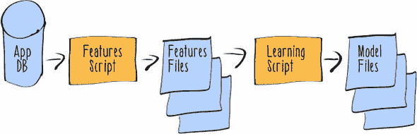

应用程序已经将所有原始用户交互数据发送到应用程序的关系数据库中，因此数据科学家决定从这些数据开始构建他的模型。他编写了一个简单的脚本来将所需的数据导出到平面文件。然后，他使用另一个脚本处理这些交互数据，以产生数据的派生表示，即特征和概念。这个脚本产生了一个 pupdate 的结构化表示，它获得的点赞数，以及其他相关数据，如与帖子相关的标签。同样，这个脚本只是将输出导出到平面文件。然后，他在文件上运行他的模型学习算法，以产生一个模型，该模型根据标签和其他关于帖子的数据预测点赞数。

团队对这个预测产品的原型感到非常惊讶，他们推动它通过工程路线图，尽快将其推出。他们指派一位初级工程师负责将数据科学家的原型整合到整个系统中运行。工程师决定直接将数据科学家的模型嵌入到应用程序的创建后代码中。这使得在应用程序中显示预测的点赞数变得容易。

在 Pooch Predictor 上线几周后，数据科学家偶然注意到预测结果变化不大，于是他询问工程师关于建模管道的重新训练频率。工程师对数据科学家所说的内容毫无头绪。他们最终弄清楚数据科学家原本打算让他的脚本每天基于系统最新的数据运行。每天系统中都应该有一个新的模型来替换旧的模型。这些新的要求改变了系统构建的方式，导致了图 1.2 所示的架构。

##### 图 1.2. Pooch Predictor 1.1 架构

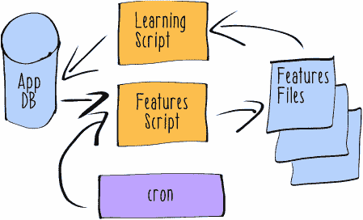

在这个版本的 Pooch Predictor 中，脚本每晚通过 cron 计划运行。它们仍然将中间结果输出到文件中，但现在它们需要将模型插入到应用程序的数据库中。现在后端服务器负责生成应用程序中显示的预测。它会从数据库中提取模型，并使用它为应用程序的用户提供预测。

这个新系统无疑比初始版本要好，但在其运营的前几个月里，团队发现了几个与之相关的痛点。首先，Pooch Predictor 并不非常可靠。经常数据库中会有变化，导致某个查询失败。有时服务器负载很高，建模任务会失败。随着社交网络和建模系统所使用的数据集规模的增加，这种情况越来越多。有一次，应该运行数据处理任务的服务器失败了，所有相关数据都丢失了。这种类型的故障在没有建立更复杂的监控和警报基础设施的情况下很难检测到。即使有人检测到系统中的故障，除了再次启动任务并希望这次成功之外，也没有什么可以做的。

除了这些大的系统级故障之外，数据科学家开始在 Pooch Predictor 中找到其他问题。一旦他获得了数据，他就意识到一些特征没有被正确地从原始数据中提取出来。要理解提取的特征的变化如何影响建模性能也非常困难，因此他感觉在改进系统方面有些受阻。

还有一个重大问题涉及到整个团队。在接下来的几周里，团队看到他们的互动率稳步下降，但没有找到任何合理的解释。然后有人在测试应用的实时版本时注意到了 Pooch Predictor 的问题。对于基于美国以外的用户，Pooch Predictor 总是预测一个负数的点赞数。在互联网上的论坛中，愤怒的用户表达了对他们的爱犬被 Pooch Predictor 功能侮辱的不满。一旦 Sniffable 团队检测到这个问题，他们能够迅速找出这是建模系统基于位置的功能问题。数据科学家和工程师提出了一个解决方案，问题得以解决，但他们的信誉在国外嗅探器中受到了严重损害。

在那之后不久，Pooch Predictor 遇到了更多问题。这一切始于数据科学家为了提高建模性能而尝试实现更多的特征提取功能。为了做到这一点，他得到了工程师的帮助，将更多来自用户应用的数据发送回应用程序数据库。在新功能推出当天，团队立即发现了问题。首先，应用速度大幅下降。现在发布内容成了一个极其费力的过程——每个按钮点击似乎需要几秒钟才能注册。嗅探器对这些问题感到非常烦恼。当 Pooch Predictor 开始在发布方面引起更多问题时，情况变得更糟。结果发现，新功能导致服务器抛出异常，这导致 pupdates 被丢弃。

到这个时候，大家都在全力以赴地扑灭这场大火。他们意识到新功能存在两个主要问题：

+   将应用中的数据发送回服务器需要事务处理。当数据科学家和工程师将更多数据添加到用于建模的数据总量中时，这个事务处理过程耗时过长，无法在应用中保持合理的响应速度。

+   支持该应用的服务器内的预测功能没有正确处理新特性。每当预测功能看到应用另一部分添加的新特性时，服务器都会抛出异常。

在了解问题出在哪里之后，团队迅速回滚了所有新功能，并将应用恢复到正常操作状态。

#### 1.1.2\. 构建一个更好的系统

团队中的每个人都认为他们在构建机器学习系统的方式上出了问题。他们举行了一次回顾会议，以找出问题所在，并确定未来如何做得更好。结果是以下关于 Pooch Predictor 替代品的愿景：

+   无论预测系统存在任何其他问题，Sniffable 应用都必须保持响应。

+   预测系统必须与系统其他部分的耦合程度大大降低。

+   无论系统负载高或系统本身存在错误，预测系统都必须表现出可预测的行为。

+   应该让不同的开发者更容易地对预测系统进行更改，而不会破坏系统。

+   代码必须使用不同的编程风格，以确保在持续使用时性能更佳。

+   预测系统必须更好地衡量其建模性能。

+   预测系统应该支持演变和变化。

+   预测系统应该支持在线实验。

+   应该让人类能够监督预测系统，并迅速纠正任何异常行为。

### 1.2. 反应式机器学习

在先前的例子中，Sniffable 团队似乎错过了什么重要的事情，对吧？他们构建了一个最初看起来很有用的机器学习系统，为他们的核心产品增加了价值。但他们在实现过程中遇到的所有问题显然都有代价。他们机器学习系统的生产问题经常使团队从改进系统功能的工作中分心。尽管房间里有一群聪明的人正在努力思考如何预测基于狗的社会网络的动态，但他们的系统反复未能完成其任务。

#### 1.2.1. 机器学习

构建能够完成预期任务的机器学习系统是**困难的**，但并非不可能。在我们的示例故事中，数据科学家知道如何**做**机器学习。Pooch Predictor 在他的笔记本电脑上完全工作；它从数据中做出预测。但数据科学家并没有将机器学习视为**应用**——他只理解机器学习作为一种**技术**。Pooch Predictor 并没有持续地产生可信、准确的预测。它作为一个预测系统和软件都失败了。

本书将向您展示如何构建与最佳 Web 和移动应用一样出色的机器学习系统。但理解如何构建这些系统需要您将机器学习视为应用，而不仅仅是技术。我们将构建的系统不会在其任务上失败。

在下一节中，我们将探讨构建机器学习系统的反应式方法。但首先，我想明确什么是机器学习系统，以及它与仅仅将机器学习作为一种技术使用有何不同。为此，我必须介绍一些术语。如果你有机器学习的经验，其中一些可能看起来很基础，但请耐心听我说。与机器学习相关的术语定义和使用可能相当不一致，所以我想要明确我们正在讨论的内容。

| |
| --- |

**功能性与实现**

这简短的介绍仅关注确保你在机器学习系统*功能*方面有足够的定位。本书专注于机器学习系统的*实现*，而不是机器学习本身的原理。如果你发现自己需要更好的机器学习技术和算法的介绍，我推荐阅读 Henrik Brink、Joseph W. Richards 和 Mark Fetherolf 合著的《Real-World Machine Learning》（Manning，2016）。

| |
| --- |

在最简单的形式下，机器学习是一种从数据中学习和进行预测的技术。至少，要*进行*机器学习，你必须获取一些数据，学习一个模型，并使用该模型进行预测。使用这个定义，我们可以想象一个更粗糙的 Pooch Predictor 示例。这可能是一个程序，它会查询应用程序数据库中最受欢迎的狗品种（结果证明是法国斗牛犬），并告诉应用程序说，所有包含法国斗牛犬的帖子都会获得很多点赞。

这种对机器学习的最小定义省略了很多相关的细节。大多数现实世界的机器学习系统需要做的不仅仅是这些。它们通常需要所有显示在图 1.3 中的组件或阶段。

##### 图 1.3\. 机器学习的阶段

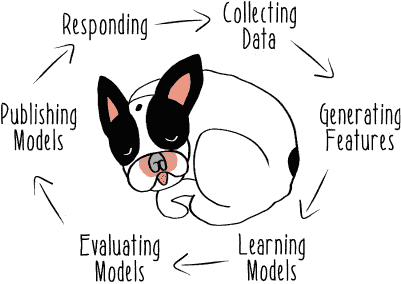

从一开始，机器学习系统必须从外部世界收集数据。在 Pooch Predictor 示例中，团队试图通过使用他们应用程序已有的数据来跳过这个担忧。毫无疑问，这种方法很快，但它将 Sniffable 应用程序数据模型与 Pooch Predictor 数据模型紧密耦合。如何收集和持久化机器学习系统的数据是一个大而重要的主题，所以我将在第三章中展示如何设置你的系统以取得成功。

一旦系统中有数据，这些数据很少准备好发送到机器学习算法。大多数机器学习算法都是应用于原始数据的派生表示，称为*实例*。图 1.4 展示了实例的各个部分在一个常见的语法（LIBSVM）中。

##### 图 1.4\. 实例的结构

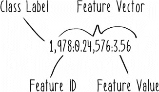

可以使用许多不同的语法来表达实例，所以我们不会太担心任何特定语法的具体细节。然而无论它们如何表达，实例总是由相同的组件组成。

*特征*是从与预测实体相关的原始数据中提取的有意义的数据点，在尝试进行预测时。一个可嗅探的特征的例子是给定狗的朋友数量。在图 1.4 中，特征使用唯一的 ID 字段和特征值来表示。特征编号 978 可能代表嗅探者男性狗朋友的比例，其值为 0.24。通常，机器学习系统将从其可用的原始数据中提取许多特征。给定实例的特征值集称为*特征向量*。

*概念*是系统试图预测的东西。在 Pooch Predictor 的上下文中，一个概念将是给定帖子收到的点赞数。当一个概念是*离散的*（非连续的）时，它可以被称为*类别标签*，你经常会在机器学习库的相关部分看到仅使用单词*标签*，例如我们将在本书中使用的 MLlib。

只有某些类型的机器学习问题涉及到以类别标签的形式提供概念。这种机器学习环境被称为*监督学习*，本书的大部分内容都集中在这种机器学习问题上，尽管反应式机器学习也可以应用于无监督学习问题。

定义和实现最佳特征和概念来表示你试图解决的问题，构成了现实世界机器学习工作中很大一部分。从应用的角度来看，这些任务是你的数据管道的开始。构建可靠、一致且可扩展地完成这项工作的管道需要一种原则性的应用架构和编程风格。第四章（[kindle_split_015.html#ch04](https://wiki.example.org/kindle_split_015.html#ch04)）致力于讨论在特征生成方面机器学习系统中的反应式方法。

使用刚刚描述的数据准备，你现在可以开始学习一个模型了。你可以将*模型*想象成一个将特征映射到预测概念的程序，如下面的简单 Scala 实现所示。

##### 列表 1.1. 一个简单的模型

```
def genericModel(f: FeatureVector[RawData]): Prediction[Concept] = ???
```

模型学习发生在数据管道的后半部分。Pooch Predictor 生成的模型将是一个程序，它接受作为输入的标签数据的特征表示，并返回给定更新可能收到的预测点赞数，如下面的列表所示。

##### 列表 1.2. Pooch Predictor 模型

```
def poochPredictorModel(f: FeatureVector[Hashtag]): Prediction[Like] = ???
```

在管道的这个相同阶段，你需要开始处理在模型构建中出现的几种不同类型的未知因素。因此，管道中的模型学习阶段不仅涉及学习模型。在第五章（[kindle_split_016.html#ch05](https://wiki.example.org/kindle_split_016.html#ch05)）中，我讨论了在机器学习系统的模型学习子系统中你需要考虑的各种问题。

接下来，你需要通过发布它来使这个模型变得有用。*模型发布*意味着使模型程序在它被学习到的环境中可用，以便它可以在之前未见过的数据上进行预测。很容易忽略机器学习系统这一部分的困难，Sniffable 团队在他们的原始实现中很大程度上跳过了这部分。他们甚至没有设置系统定期重新训练模型。他们实施模型重新训练的下一个方法也遇到了困难，导致他们的模型与特征提取器不同步。有更好的方法来做这件事（提示：考虑不可变性），我在第六章中讨论了它们。

最后，你需要实现功能，以便你的学习模型能够用于从新的实例中预测概念，这在本书稍后我称之为*响应*。这是机器学习系统中真正考验其性能的地方，在 Pooch 预测系统中，它经常是汽车突然起火的地方。鉴于 Sniffable 团队之前从未真正构建过这样的机器学习系统，他们遇到一些痛点并不奇怪，这些痛点源于他们的想法与残酷的现实相遇。他们的一些问题源于将他们的预测系统视为需要记录购买的交易业务应用程序。依赖于强一致性保证的方法不适用于现代分布式系统，并且与机器学习系统中普遍存在的内在不确定性不一致。Sniffable 团队遇到的其他问题与没有从动态角度考虑他们的系统有关。机器学习系统必须发展，并且它们必须通过实验能力支持这种发展的并行路径。最后，没有太多功能来支持处理预测请求。

Sniffable 团队在架构方面的随意方法并不罕见。许多机器学习系统看起来与图 1.5 中的架构非常相似。

##### 图 1.5. 一个简单的机器学习系统


从如此简单的事物开始并没有什么不妥。但这种方法缺少了许多最终将需要的系统组件，并且已实现的组件边界不佳。此外，对于这个系统必须具备的各种属性，并没有给予太多的思考，如果它要为超过几个用户服务的话。总之，这是一种天真（naive）的做法。

本书介绍了一种构建机器学习系统的方法，这种方法绝对不是天真的。这种方法基于许多与机器学习系统挑战相关的现实世界经验。本书中我们将要查看的系统不是微不足道的，通常具有复杂的架构。在一般层面上，它们将符合图 1.6 中所示的方法。

##### 图 1.6. 一个反应性机器学习系统

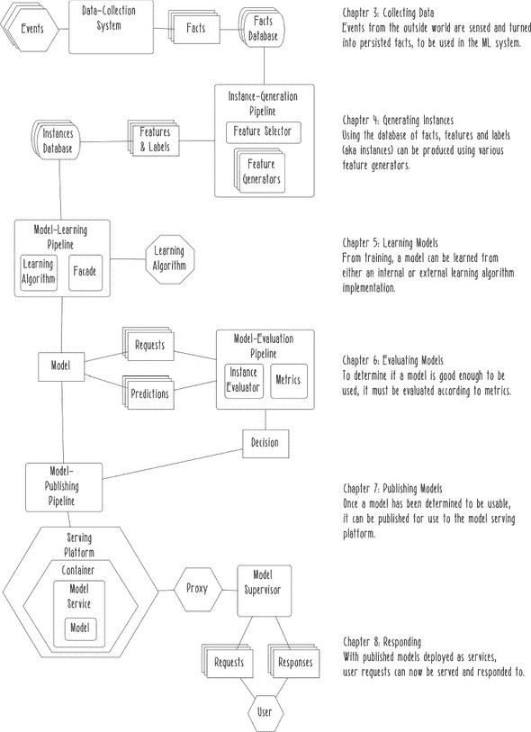

为什么我们需要使用如此复杂的架构来构建机器学习系统可能并不明显，但我请求你的耐心。在每一章中，我都会向你展示系统这一部分必须解决的问题，以及更反应性的机器学习方法将如何更好地工作。为了做到这一点，我可能需要给你更多关于反应性系统是什么的背景信息。

#### 1.2.2. 反应性系统

现在你对机器学习系统有了更多的了解，我想给你概述一下我们将使用的一些想法和方法，我们将构建成功的系统。我们将从**反应性系统范式**开始。反应性系统由四个特征和三个策略定义。这个范式整体上是一种将构建能够满足现代用户对交互性和可用性等事物期望的方法编码化的方式。

##### 反应性系统的特征

反应性系统优先考虑四个特征（见图 1.7）。

##### 图 1.7. 反应性系统的特征

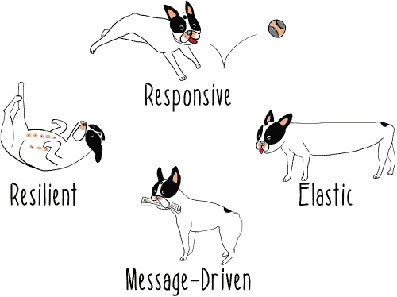


首先，也是最重要的，反应性系统是**响应性**的，这意味着它们会持续地及时对用户做出响应。响应性是所有未来开发努力的基础。如果一个系统不对用户做出响应，那么它就是无用的。想想 Sniffable 团队由于他们的机器学习系统响应性差，导致 Sniffable 应用出现大规模减速的情况。


为了支持响应性的目标，反应性系统必须是**健壮**的；它们需要在面对失败时保持响应性。无论原因是硬件故障、人为错误还是设计缺陷，软件总是会出现问题，正如 Sniffable 团队所发现的。即使在事情没有按计划进行的情况下，提供某种可接受的反应也是确保用户将系统视为响应性的关键部分。如果应用程序在损坏一半的时候运行得非常快，那么它就无关紧要了。


反应性系统也必须是**弹性**的；即使在负载变化的情况下，它们也需要保持响应性。弹性的概念与可扩展性并不完全相同，尽管两者相似。弹性系统应该对负载的增加或减少做出响应。Sniffable 团队在他们的流量激增时看到了这一点，当时 Pooch Predictor 系统无法跟上负载。这正是缺乏弹性的样子。


最后，反应式系统是**消息驱动的**；它们通过异步、非阻塞的**消息传递**进行通信。与直接进程内通信或其他紧密耦合形式相比，消息传递方法更容易理解。如何确保松散耦合的更明确的方法可能解决 Sniffable 示例中的一些问题。围绕消息传递组织松散耦合的系统可以更容易地检测到故障或负载问题。此外，具有这种特性的设计有助于将错误的影响仅限于关于坏消息的消息，而不是像 Pooch Predictor 那样需要立即解决的燃烧生产问题。

反应式方法当然可以应用于 Sniffable 团队在与他们的机器学习系统遇到的问题。这四个原则代表了一种连贯且完整的方法，可以构建出根本更好的系统。这样的系统比盲目设计的系统更好地满足其要求，并且它们更有趣。毕竟，谁愿意在可以发送令人惊叹的新机器学习功能给忠诚的嗅探者时去灭火呢？

这些特性听起来确实很吸引人，但它们并不是一个很好的计划。你如何构建一个真正具有这些特性的系统？消息传递是答案的一部分，但不是全部。正如你所看到的，机器学习系统可能很难正确实现。它们具有独特的挑战，可能需要独特的解决方案，这些解决方案在传统的商业应用中并不常见。

##### 反应式策略

本书构建反应式机器学习系统的关键部分是使用图 1.8 中展示的三个反应式策略。

##### 图 1.8\. 反应式策略


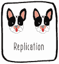

首先，反应式系统使用**复制**。它们在同一时间在多个地方执行相同的组件。更普遍地说，这意味着数据，无论是静止的还是运动的，都应该进行冗余存储或处理。

在 Sniffable 示例中，曾经有一段时间，运行模型学习作业的服务器失败了，没有学习到任何模型。显然，复制可以在这里有所帮助。如果有两个或更多的模型学习作业，一个作业的失败影响就会小得多。复制可能听起来很浪费，但它是一个解决方案的开始。正如你将在第四章和第五章中看到的，你可以使用 Spark 将复制构建到你的建模管道中。Spark 并不要求你始终有两个管道在执行，它提供了自动、细粒度的复制，以便系统可以从故障中恢复。本书重点介绍使用像 Spark 这样的高级工具来管理分布式系统的挑战。通过依赖这些工具，你可以轻松地将复制用于你的机器学习系统的每个组件。


接下来，反应式系统使用*隔离*来防止系统任何单个组件的故障影响其他组件。术语*隔离*可能会让你想到像 Docker 和 rkt 这样的特定技术，但这一策略并非关于任何一种实现。隔离可以通过许多不同的系统实现，包括自制的系统。关键是要防止我们在 Pooch Predictor 中看到的级联故障，并在结构层面上做到这一点。

考虑 Pooch Predictor 中模型和特征不同步的问题，导致在模型服务期间出现异常。这仅仅是因为模型服务功能没有得到足够的隔离。如果模型被部署为一个隔离的服务，通过消息传递与 Sniffable 应用程序服务器通信，那么这种故障就不会像现在这样传播。图 1.9 展示了这种架构的一个例子。

##### 图 1.9. 一个隔离的模型服务架构


最后，反应式系统依赖于*监督*策略来组织组件。当使用这种策略实现系统时，你明确标识可能失败的组件，并确保有其他组件负责它们的生命周期。监督策略为你提供了一个控制点，你可以确保通过系统的真实运行时行为实现反应性特质。

Pooch Predictor 系统没有系统级监督。这个不幸的遗漏使得 Sniffable 团队在系统出现问题时手忙脚乱。更好的方法是将监督直接构建到系统本身中，就像图 1.10 中展示的那样。

##### 图 1.10. 一个监督架构


在这个结构中，发布的模型被模型监督器观察。如果它们的行为超出可接受的界限，监督器将停止发送请求预测的消息。实际上，模型监督器甚至可以完全销毁它知道是坏模型，使系统可能实现自我修复。我将在第六章和第七章中开始讨论如何实现模型监督，并且我们将在本书的剩余部分继续探索监督策略的强大应用。

#### 1.2.3. 使机器学习系统具有反应性

在对反应式系统有一定了解之后，我可以开始讨论如何将这些想法应用于机器学习系统。在一个反应式机器学习系统中，我们仍然希望我们的系统具有与反应式系统相同的所有特性，并且可以使用所有相同的策略。但我们可以做更多的事情来应对机器学习系统的独特特性。到目前为止，我已经解释了很多基础设施问题，但还没有向你展示这是如何使新的*预测*能力成为可能的。最终，一个反应式机器学习系统赋予你通过不断改进的预测来创造价值的能力。这就是为什么反应式机器学习值得理解和应用。

反应式机器学习方法基于对机器学习系统中数据特性的两个关键洞察：它是不确定的，并且实际上是无限的。从这两个洞察中，产生了四种策略，如图 1.11 所示，这些策略将帮助我们构建一个反应式机器学习系统。


##### 图 1.11. 反应式机器学习数据和策略

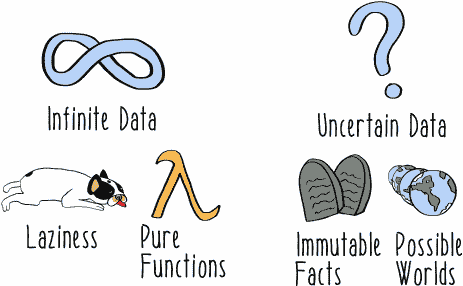

首先，让我们思考一下 Pooch Predictor 系统可能需要处理多少数据。理想情况下，凭借其新的机器学习能力，Sniffable 将起飞并看到大量的流量。但即使那样没有发生，也无法知道用户可能想要考虑并因此发送到 Pooch Predictor 系统的可能 pupdates 数量。想象一下，你必须预测 Sniffable 上可能发布的每一个可能的帖子。一些帖子会有大狗；另一些，小狗。一些帖子会使用过滤器，而另一些则更自然。一些帖子会包含丰富的标签，而另一些则没有任何注释。一旦你考虑了任意参数对特征值的影响，可能的数据表示范围实际上就变成了*无限*。

无论 Pooch Predictor 系统需要处理多少原始数据都没有关系。我们始终假设数据量对于单个线程或单个服务器来说太多。但面对这种无界范围，反应式机器学习采用两种策略来管理无限数据。


首先，它依赖于*懒惰*，也称为*延迟执行*，将函数的组成与其实际执行分离。懒惰并非坏习惯，而是一种强大的评估策略，可以极大地提高数据密集型应用程序的设计。

通过在机器学习系统的实现中使用懒惰，你会发现，用*无限流*来构想数据流比用*有限批次*要容易得多。这种转换可以为系统的响应性和实用性带来巨大的好处。我在第四章中展示了如何使用懒惰来构建机器学习管道。


类似地，反应式机器学习系统通过将转换表示为*纯函数*来处理无限数据。一个函数要成为纯函数意味着什么？首先，评估函数时不能产生某种副作用，例如改变变量的状态或执行 I/O 操作。此外，当给定相同的参数时，函数必须始终返回相同的值。这个后者的特性被称为*引用透明性*。编写保持这一特性的机器学习代码可以使数学变换的实现看起来和表现与数学表达式非常相似。

纯函数是称为*函数式编程*的编程风格中的基础概念，我们将在这本书中一直使用它。在本质上，函数式编程完全是关于使用函数进行计算。在函数式代码中，函数可以作为参数传递给其他函数。这样的函数被称为*高阶函数*，我们将在本书的代码示例中一直使用这个习语。像高阶函数这样的函数式编程习语是使 Scala 和 Spark 等反应式工具如此强大的关键部分。

本书对函数式编程的强调并不仅仅是风格上的。函数式编程是驯服需要关于数据进行推理的复杂系统（特别是无限数据）的最强大工具之一。函数式编程最近流行度的增加在很大程度上是由其在大数据基础设施中的应用所驱动的。使用函数式编程的技术，我们将能够正确地构建我们的系统，并将其扩展到下一个级别。正如我在第四章和 6 章中讨论的那样，纯函数可以为实现特征提取和预测功能的问题提供真正的解决方案。


接下来，让我们考虑 Pooch Predictor 对 Sniffable 及其用户所发生的事情的了解。它有关于嗅探器创建、查看和喜欢 pupdates 的记录。这些知识来自主应用程序数据库。正如我们所见，由于操作问题，应用程序有时会丢失嗅探器对特定 pupdate 的点赞努力，这种数据丢失改变了 Pooch Predictor 旨在学习的概念。同样，Pooch Predictor 对在给定时间看到的特征值的看法常常受到其代码或主应用程序代码中的错误阻碍。这一切都是因为*不确定性*在机器学习系统中是内在的且普遍存在的。

机器学习模型及其做出的预测总是近似的，并且只有在总体上才有用。Pooch Predictor 并不知道一个特定的 pupdate 可能会获得多少个赞。即使在做出预测之前，机器学习系统也必须处理机器学习系统外部的现实世界的不确定性。例如，使用 #adorabull 标签的嗅探者和使用 #adorable 标签的嗅探者是否意味着相同的事情，或者这些应该被视为不同的特征？

一个真正反应灵敏的机器学习系统会将这种不确定性纳入系统设计，并使用两种策略来管理它：**不可变事实**和**可能世界**。使用事实来管理不确定性听起来可能很奇怪，但这正是我们要做的。考虑一个嗅探者从哪里发布 pupdate 的位置。记录这种位置数据以便以后在地理特征中使用的一种方法是将应用程序报告的确切位置记录下来，如表 1.1 所示。

##### 表 1.1\. Pupdate 位置数据模型

| pupdate_id | 位置 |
| --- | --- |
| 123 | 华盛顿广场公园 |

但在 pupdate 时刻应用程序确定的位置是不确定的；它只是手机上传感器读取的结果，其精度非常粗糙。嗅探者可能或可能不在华盛顿广场公园。此外，如果未来的功能试图捕捉东格林威治村和西格林威治村之间的独特差异，这个数据模型将给出精确但可能不准确的观点，即这个 pupdate 从东或西方向有多远。

记录这些数据的一种更丰富、更准确的方法是使用原始位置读取和预期的不确定半径，如表 1.2 所示。

##### 表 1.2\. 修订后的 pupdate 位置数据模型

| pupdate_id | 纬度 | 经度 | 半径 |
| --- | --- | --- | --- |
| 123 | 40.730811 | -73.997472 | 1.0 |


这个修订后的数据模型现在可以表示**不可变的事实**。这些数据一旦写入就永远不会修改；它们是刻在石头上的。不可变事实的使用允许我们在特定时间点对世界的不确定观点进行推理。这对于在机器学习系统中创建准确的实例以及许多其他重要的数据转换至关重要。拥有系统整个生命周期中发生的所有事实的完整记录，也使得重要的机器学习，如模型实验和自动模型验证成为可能。

要了解处理不确定性的另一种策略，让我们考虑一个相当简单的问题：关于法国斗牛犬的 pupdate 在下一个小时内会获得多少个赞？为了回答这个问题，让我们将其分解成几个部分。

首先，下一个小时内会有多少次更新提交？回答这个问题有多种方式。我们可以简单地取历史平均速率——比如说，6,500 次。但是，提交的更新数量随时间变化，因此我们也可以将一条线拟合到数据上，看起来像图 1.12。使用这个模型，我们可能预计下一个小时会有 7,250 次更新。

##### 图 1.12.每小时点赞模型

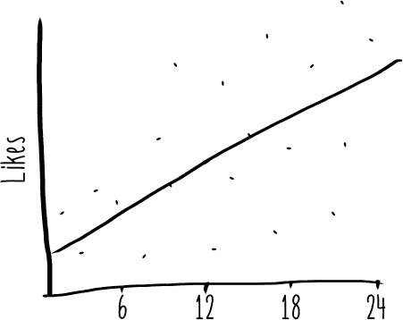

除了这些，我们还需要知道这些更新将获得多少点赞。同样，我们可以取历史平均数，在这种情况下，每更新将获得 23 个点赞。或者我们可以使用一个模型。这个模型必须应用于一些最近的数据样本，以了解最近流量获得的点赞情况。这个模型的结果是，平均每次更新将获得 28 个点赞。

现在，我们需要以某种方式结合这些信息。表 1.3 显示了我们可以用于最终预测的预测值。

##### 表 1.3.可能的预测值

| 模型类型 | 更新次数 | 每更新点赞数 |
| --- | --- | --- |
| 历史数据 | 6,500 | 23 |
| 机器学习模型 | 7,250 | 28 |


我们可以决定使用历史值来回答下一个小时预期的点赞数是 6,500 乘以 23 等于 149,500。或者我们可以决定使用机器学习模型，得到一个值为 7,250 乘以 28 等于 203,300。我们甚至可以决定将历史更新次数与基于模型的每更新点赞数预测相结合，得到 6,500 乘以 28 等于 182,000。这些对我们不确定数据的不同看法可以被视为*可能的世界*。

我们不知道在 Sniffable 的交通中，我们最终会在哪个世界中度过接下来的一个小时，但我们可以利用这些信息做出决策，例如确保服务器准备好在接下来的一个小时处理超过 20 万次点赞。可能的世界将成为我们查询机器学习系统中所有不确定数据的依据。这种策略的应用范围有限，因为无限的数据可以产生无限的可能世界。但通过构建我们的数据模型和查询，以可能替代世界的概念为基础，我们将能够更有效地推理系统中的潜在结果范围。

使用我讨论的所有策略，可以很容易地想象 Sniffable 团队将 Pooch 预测器系统重构为一个功能更强大的系统。反应式机器学习方法使得构建一个问题更少、允许进化和改进的机器学习系统成为可能。这确实与我们在原始 Pooch 预测器示例中看到的方法不同，这种方法建立在更坚实的基础之上。反应式机器学习将分布式系统、函数式编程、不确定数据和其他领域中的思想统一在构建现实世界机器学习系统的一种连贯、实用方法中。

#### 1.2.4. 不应使用反应式机器学习的情况

合理地询问是否所有机器学习系统都应该使用反应式方法构建。答案是：不。

在机器学习系统的设计和实现过程中，考虑反应式机器学习的原则是有益的。根据定义，机器学习问题必须与处理不确定性有关。以不可变事实和纯函数为前提进行思考是实现任何类型应用程序的有用视角。

但本书中讨论的方法是一种轻松构建复杂系统的方式，并且一些机器学习系统不需要非常复杂。一些系统可能不会从使用假设几个独立执行进程的消息传递语义中受益。一个研究原型是机器学习系统不需要反应式机器学习系统强大功能的完美例子。当你构建一个临时系统时，我建议打破或违反我在本书中提出的所有规则。构建可能被丢弃的机器学习系统的谨慎方法是比反应式方法做出更多极端的妥协。如果你正在构建这样的临时系统，请参阅我在黑客马拉松中构建机器学习系统的指南：[`mng.bz/981c`](http://mng.bz/981c)。

### 摘要

+   即使是简单的机器学习系统也可能失败。

+   机器学习应该被视为一个应用，而不是一种技术。

+   一个机器学习系统由五个组件或阶段组成：

    +   数据收集组件将外部世界的数据摄入到机器学习系统中。

    +   数据转换组件将原始数据转换为有用的派生数据表示：特征和概念。

    +   模型学习组件从特征和概念中学习模型。

    +   模型发布组件使模型可用于进行预测。

    +   模型服务组件将模型与预测请求连接起来。

+   反应式系统设计范式是构建更好系统的一种连贯方法：

    +   反应式系统是响应的、弹性的、可伸缩的，并且以消息驱动。

    +   反应式系统使用复制、隔离和监督策略作为维护反应式特性的具体方法。

+   反应式机器学习是反应式系统方法的一个扩展，它解决了构建机器学习系统的特定挑战：

    +   机器学习系统中的数据实际上是无限的。惰性，或执行延迟，是构思无限数据流的方式，而不是有限批次。无副作用的纯函数通过确保函数在无论何种情况下都表现出可预测性来帮助管理无限数据。

    +   不确定性是机器学习系统中数据固有的和普遍存在的。将所有数据以不可变事实的形式写入，使得在时间点对不确定数据的视图进行推理变得更容易。不确定数据的不同视图可以被视为可以查询的可能世界。

在下一章中，我将介绍一些用于构建反应式机器学习系统的技术和技巧。您将看到反应式编程技术如何让您在不编写复杂代码的情况下处理复杂的系统动态。我还会介绍两个强大的框架，Akka 和 Spark，您可以使用它们轻松快速地构建极其复杂的反应式系统。

## 第二章\. 使用反应式工具

*本章涵盖*

+   使用 Scala 管理不确定性

+   使用 Akka 实现监督和容错

+   将 Spark 和 MLlib 作为分布式机器学习管道的框架使用

为了准备好构建全规模的反应式机器学习系统，您需要熟悉 Scala 生态系统中的几个工具：Scala 本身、Akka 和 Spark。在这本书中，我们将使用 Scala 编写应用程序，因为它为函数式编程提供了出色的支持，并且已经在构建各种类型的反应式系统中取得了成功。有时，您会发现 Akka 可以作为提供弹性和弹性的工具，这是通过其实施的演员模型实现的。其他时候，您可能想使用 Spark 来构建大规模的管道作业，如特征提取和模型学习。在这一章中，您将开始熟悉这些工具，从第三章开始，我将向您展示如何使用它们构建反应式机器学习系统的各个组件。

这些并不是构建反应式机器学习系统可以使用的唯一工具。反应式机器学习是一套思想，而不是一个特定的实现。但本章中展示的技术对于反应式机器学习非常有用，在很大程度上是因为它们在设计时对反应式技术的支持非常强大。尽管我将向您介绍这些工具如何工作的具体细节，但您绝对可以将这些方法应用于使用其他语言和工具构建的系统。

我将在解决世界上一个最关键问题的背景下向你介绍这本书的工具链：寻找下一个爆红流行歌星。*Howlywood Star*是一个犬类现实歌唱竞赛。每周，来自全国各地的未知犬只将在三位评委面前唱歌。然后，在家中的观众投票决定哪只狗具备成为下一个 Howlywood Star 的潜质。这种投票机制是节目取得巨大成功的关键。观众每周都会观看比赛，就像观看歌唱表演一样。

一套复杂的应用支持这种观众参与动态，你将在本章中关注这些应用。你将主要处理处理投票功能性的挑战。由于比赛的流行和不可预测性，将出现一些棘手的情况。一旦你处理完今天的投票，我们将尝试使用机器学习预测未来的投票模式。

### 2.1\. Scala，一种响应式语言

在这本书中，所有的示例都是用 Scala 编写的。如果你之前没有使用过 Scala，不要担心。如果你熟悉 Java 或类似的通用语言，你可以快速学习足够的 Scala 知识，开始构建强大的机器学习系统。确实，Scala 是一个庞大且丰富的语言，可能需要相当长的时间才能掌握。但大多数情况下，你将利用 Scala 的强大功能，而不必自己编写非常复杂的代码。而不是试图向你介绍 Scala 中所有令人惊叹的特性，这一节将专注于支持响应式编程和不确定性推理的语言特性。

要开始学习 Scala 编程，你将构建*Howlywood Star*投票应用的一些组件。该应用的架构如图 2.1 所示。

##### 图 2.1\. Howlywood Star 投票应用架构

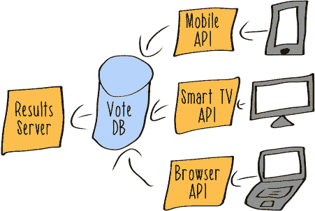

各种面向用户的移动和 Web 应用负责将全球*Howlywood Star*观众的投票发送到后端服务器。服务器负责接收这些投票并将它们转发到应用数据库。然后，其他可视化应用负责查询该数据库并展示当前结果。这些应用从复杂的内部分析仪表板到简单的面向公众的移动应用（如图 2.2 所示）不等。

##### 图 2.2\. 投票结果移动应用


这个系统非常简单，但即使是如此简单的系统也隐藏着复杂的部分。考虑以下问题：

+   记录每一票需要多长时间？

+   服务器在等待每一票被持久化期间会做什么？

+   如何使可视化应用保持尽可能的新鲜？

+   如果负载急剧增加会发生什么？

*Howlywood Star* 的受欢迎程度最近因社交媒体上的大量关注而急剧上升。这个投票应用必须为即将到来的第二季度的狂热关注做好准备。当观众锁定下一个爆红明星时，合理地预期投票应用将面临巨大的流量。

但你无法提前知道流量峰值会有多大。试图预测未来会有一定程度的内在不确定性。


尽管如此，投票应用必须为那个不确定的未来做好准备。幸运的是，Scala 有处理不确定性和适当反应的工具。

#### 2.1.1\. 在 Scala 中应对不确定性

在我们讨论更复杂的分布式系统之前，让我们讨论一些基本技术，你可以使用这些技术来管理 Scala 中的不确定性。让我们从一些相当简单的代码开始，这将帮助你开始探索 Scala 的丰富性。你的初始实现不会代表生产级别的 Scala 代码，而是一个基本的探索，了解 Scala 中不同对象类型是如何工作的。

在下面的列表中，你创建了一个简单的 Howlers 集合及其当前拥有的投票数。然后，你尝试检索一个受欢迎的 Howler 的投票数。

##### 列表 2.1\. 投票地图

```
val totalVotes = Map("Mikey" -> 52, "nom nom" -> 105)                 *1*

val naiveNomNomVotes: Option[Int] = totalVotes.get("nom nom")         *2*
```

+   ***1* 到目前为止收到的投票集合**

+   ***2* 必须“展开”以获取投票数的选项**

这个简单的例子展示了 Scala 的 `Option` 类型概念。在这个例子中，语言允许你向投票地图传递任何字符串键，但它不知道是否有人为 nom nom 投过票，直到执行查找。`Option` 类型可以被视为在操作中编码内在不确定性的方式。它们涵盖了给定操作可能返回值、给定类型的 `Some` 或 `None` 的可能性。

因为 Scala 已经告诉你投票地图的内容存在一些不确定性，你现在可以编写处理不同可能性的代码。

##### 列表 2.2\. 使用模式匹配处理无投票

```
def getVotes(howler: String) = {                     *1*
  totalVotes.get(howler) match {                     *2*
    case Some(votes) => votes
    case None => 0
  }
}

val nomNomVotes: Int = getVotes("nom nom")           *3*
val indianaVotes: Int = getVotes("Indiana")          *4*
```

+   ***1* 处理可能还没有人为某个特定狗投票的情况的函数**

+   ***2* 用于处理两种可能性的模式匹配表达式**

+   ***3* 返回 105**

+   ***4* 返回 0**


这个简单的辅助函数使用*模式匹配*来表示两种可能性：要么你收到了某个 Howler 的投票，要么你没有。在后一种情况下，这意味着正确的投票数是 0。这允许投票值的类型都是`Int`，即使没有人还为印第安纳州投票。模式匹配是一种语言特性，用于编码给定操作可能产生的可能值。在这种情况下，你正在表达`get`操作返回的值可能匹配的可能情况。模式匹配是 Scala 中常见且有用的技术，我们将在整本书中使用它。

当然，这种非常简单的形式的不确定性非常普遍，Scala 为你提供了在集合内处理它的工具。在列表 2.2 中的辅助函数可以通过在投票映射上设置默认值来消除。

##### 列表 2.3\. 在映射上设置默认值

```
val totalVotesWithDefault = Map("Mikey" -> 52, "nom nom" -> 105)
   .withDefaultValue(0)
```

#### 2.1.2\. 时间的不可确定性

基于这种思考方式，让我们考虑一种更相关的形式的不确定性。如果投票计数存储在你所在的服务器之外，那么检索这些投票将需要时间。以下列表使用随机延迟来近似这个想法。

##### 列表 2.4\. 一个远程“数据库”

```
def getRemoteVotes(howler: String) = {                *1*
  Thread.sleep(Random.nextInt(1000))
  totalVotesWithDefault(howler)
}

val mikeyVotes = getRemoteVotes("Mikey")              *2*
```

+   ***1* 一个检索投票的函数，但带有不同的延迟量**

+   ***2* 最终总是返回 52**

这种不确定性对于投票可视化应用来说是一个大问题。它的服务器将什么也不做，只是等待，直到调用被处理。你可以想象这根本无法帮助实现始终如一的反应性。

这个性能问题的根源在于对`getRemoteVotes`的调用是*同步的*。解决这个问题的方法是使用*未来*，这将确保这个调用不再以同步、阻塞的方式执行。使用未来，你将能够立即从这样的远程调用中返回，并在调用完成后收集结果。以下列表展示了如何做到这一点，以回答“目前哪个 Howler 最受欢迎？”这个问题。

##### 列表 2.5\. 基于未来的远程调用

```
import scala.concurrent._
import ExecutionContext.Implicits.global

def futureRemoteVotes(howler: String)= Future {                            *1*
  getRemoteVotes(howler)
}

val nomNomFutureVotes = futureRemoteVotes("nom nom")                       *2*
val mikeyFutureVotes = futureRemoteVotes("Mikey")
val indianaFutureVotes = futureRemoteVotes("Indiana")

val topDogVotes: Future[Int] = for {                                       *3*
  nomNom <- nomNomFutureVotes
  mikey <- mikeyFutureVotes
  indiana <- indianaFutureVotes
} yield List(nomNom, mikey, indiana).max                                   *4*

topDogVotes onSuccess {                                                    *5*
  case _ => println("The top dog currently has" + topDogVotes + "votes.")  *6*
}
```

+   ***1* 一个返回投票计数未来的函数**

+   ***2* 每个这些未来的创建都会立即返回，而不是在远程调用上阻塞。**

+   ***3* 这种语法称为 for 表达式。**

+   ***4* 一个最终将包含最大投票数的未来**

+   ***5* 这将在 for 表达式中所有值都被检索后执行。**

+   ***6* 打印“目前最受欢迎的狗有 105 票。”**

在这个实现中，对远程投票计数收集的三个调用是并发处理的。创建未来的操作不会在远程调用上阻塞，等待工作完成。相反，未来的创建会立即返回，允许后续的并发处理。使用未来来抽象时间是一个基础技术，你将反复使用它来扩展你的响应式机器学习系统，以处理大量数据和复杂的操作行为。

对远程数据源的一个给定请求的响应时间可能平均来说相当小。但随着数据量的增加，实际上可以保证某些响应时间不会接近平均值。这是基本统计学的结果。在正态分布的数据集中，会有异常值。在聚合操作中，如列表 2.5 中的最大投票计算，平均请求延迟对总延迟没有影响。相反，总延迟完全由单个最慢请求决定，如图图 2.3 所示。

##### 图 2.3\. 请求时间分布

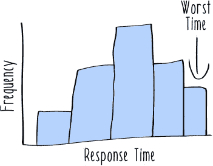

那个最慢请求所需的时间通常被称为 *尾部延迟*。这是各种大规模数据处理系统（包括机器学习系统）中一个非常现实的问题。但现在你知道尾部延迟是一个问题，你可以使用响应式编程技术来管理它。

##### 列表 2.6\. 基于未来的超时

```
val timeoutDuration = 500                                       *1*
val AverageVotes = 42                                           *2*

val defaultVotes = Future {                                     *3*
  Thread.sleep(timeoutDuration)
  AverageVotes
}

def timeOutVotes(howler: String) = Future.firstCompletedOf(     *4*
  List(getRemoteVotes(howler), defaultVotes))
```

+   ***1* 允许返回值之前的时间量**

+   ***2* 历史平均投票数**

+   ***3* 一个在超时后完成平均投票数的未来**

+   ***4* 一个函数，在远程调用超时时返回实际投票数或默认值**

在这个实现中，你接受现实并不完美，一些远程调用可能会表现出不可接受的延迟。与其将这种延迟传递给用户，你选择返回降级响应，即历史平均投票数。这个数字并不完全准确，但在这个情况下，它比什么也不返回要好。在真实系统中，你可能有多种选择来返回降级响应。例如，你可能有一个其他应用程序来查找这个值，比如缓存。那个缓存中的值可能已经过时，但这个降级值可能比什么也没有更有用。在其他情况下，你可能想要编码重试逻辑。这取决于你决定什么最适合你的应用程序。


你可能不喜欢有时计划失败，如果这样，我可以理解你的疑虑。作为工程师，我们习惯于构建每次都能返回完全正确答案的系统。但在机器学习系统中，不确定性是普遍和固有的。结果发现，分布式系统也是如此。如果我们想让我们的系统具有反应性和响应性，我们有时将不得不使用这些策略。

正如你将在第五章及以后看到的那样，有几个机器学习特定的场景，我们需要以某种方式退回到一个不太完美的响应。像这样的谨慎风险缓解策略将帮助我们驯服我们机器学习系统的一些复杂性。

### 2.2\. Akka，一个反应式工具包

我接下来要介绍的工具是 Akka。了解它非常重要，因为它为你提供了可重用的组件来构建弹性且具有弹性的系统。正如你在第一章中看到的，构建一个无法应对真实世界规模和失败挑战的机器学习系统可能很容易。Akka 及其背后的理念为这些问题提供了一些解决方案。

但首先，我会花些时间让你熟悉 Akka 的基本用法。与书中后面的 Akka 材料相比，本节是入门级的，主要目的是给你提供一些背景和了解 Akka 是如何工作的。一旦你熟悉了基于 Akka 构建的系统如何实现其保证，我们就可以继续使用 Akka 作为主要依赖库，为高级抽象提供动力。不用担心 Akka 中的一些内容对你来说仍然是神秘的。我们只会在这本书的某些部分使用 Akka。它是一个强大且复杂的工具包；本节只是触及了它所能做到的一小部分。这里的主要目标是建立一个心理模型，了解 Akka 系统是如何履行其保证的。但在你理解 Akka 是如何工作之前，你需要了解行为者是如何工作的。

#### 2.2.1\. 行为者模型

行为者模型是一种看待世界的方式，它将每一件事物都视为一个行为者。什么是行为者？行为者是一个非常简单的东西。在接收到一条消息后，它只能做三件事：

+   发送消息

+   创建新的行为者

+   决定在接收到下一条消息时如何表现

这可能听起来有些限制，但实际上非常有用。


首先，让我们考虑通过发送消息进行沟通。你在第一章的 Sniffable 示例中看到了这种沟通方式。我提出，如果模型服务通过消息传递与主应用进行通信，它将更好地能够控制其失败，如图 2.4 所示。

##### 图 2.4\. 一个封装的模型服务架构


消息传递本身就能给系统带来一些完整 actor 系统的益处。这是因为消息传递是实现封装的有效方法。

通过实施只能通过消息跨越的强大边界，当 actor（或像 actor 一样行为的服务）失败时，它们不能污染系统的其他组件。在大规模系统重构中，通常一个好的开始是分离组件，使它们只能通过消息传递进行通信。对于第一章中 Pooch Predictor 系统的开发者来说，那将是一个很好的下一步。机器学习系统的良好封装组件更容易操作，并在向反应性进军的道路上进行改进。


接下来，actor 也可能拥有创建新 actor 的能力。这对于创建监督层次结构等重要事情来说很重要。你将在本书中看到几个关于监督层次结构的例子，包括 Akka actor 和其他相关概念。

你在第一章的 Sniffable 示例中也看到了这一点。在那个部分，我提出整个系统将受益于一个监督层次结构，如图 2.5 所示。

##### 图 2.5\. 一个监督架构

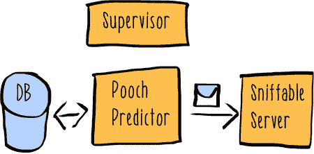


在这个架构中，监督者对被监督服务拥有生死大权。这正是 actor 模型中的工作方式。监督的好处与这种环境下的封装好处相似。通过将故障概念构建到架构中，你现在拥有了针对不可避免故障的系统级解决方案。

最后，actor 可以做你以前没见过的事情：它们可以改变自己的行为。在接收到给定消息后，actor 将决定在下次收到消息时做不同的事情。这意味着 actor 是有状态的，有点像命令式面向对象编程（如 Java、Python 等）中的对象。到目前为止，你看到的代码大多遵循尝试避免显式状态操作的函数式编程风格。但系统中的组件，如远程服务，有当前状态，你会发现 actor 模型是推理该状态的有用方法。actor 模型有一个关于如何封装该状态并提供与外界交互方法的一致概念。但这并不意味着你会放弃所有不可变事实和纯函数的优势。只有需要处理状态的代码才会是有状态的。但一个完全反应性的机器学习系统有许多具有许多不同需求的组件。幸运的是，Scala 是一种强大且实用的语言，它优先考虑不可变性和纯函数的优势，但在必要时允许你处理状态。

#### 2.2.2\. 使用 Akka 确保弹性

理论已经足够了；让我们用一个真实的问题来应用演员模型：确保在 *Howlywood Star* 上的投票记录的可靠性。你仍然处于之前在 图 2.1 中展示的相同的 *Howlywood Star* 投票系统。但现在你特别关注从远程投票数据库中的 API 服务器写入接收到的投票。这显然是一个相当常见的软件开发场景，所以我将稍微复杂化它。在这个场景中，一只吉娃娃被指派负责维护数据库，但它做得非常糟糕。有时数据库会记录投票，而有时数据库会因为抛出异常而“自己拉屎”。这种基本的不可靠性意味着你需要实现 图 2.6 中所示的演员层次结构。

##### 图 2.6\. 投票写入演员层次结构

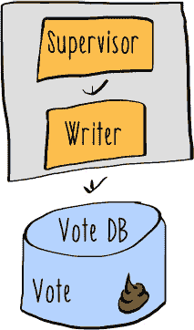

所有远程资源，如数据库，都有一定的不可靠性，但这个比大多数都要糟糕。每次投票发送时，数据库都会有一半的时间无法记录写入操作。

##### 列表 2.7\. 不可靠的数据库

```
class DatabaseConnection(url: String) {                    *1*
  var votes = new mutable.HashMap[String, Any]()           *2*

  def insert(updateMap: Map[String, Any]) = {
    if (Random.nextBoolean()) throw new Exception          *3*

    updateMap.foreach {
      case (key, value) => votes.update(key, value)        *4*
    }
  }
}
```

+   ***1* 用于表示数据库的简单对象**

+   ***2* 用于存储投票的哈希表**

+   ***3* 这将有一半的时间抛出异常。**

+   ***4* 使用模式匹配表达式将映射条目解构为键和值。**


**可变对象**

列表 2.7 使用了一个 `var`，一个可变对象。在惯用的 Scala 代码中，可变对象使用得非常少。在这个例子中，使用可变性的目的只是为了简化这个例子。在这里使用可变性是不必要的，我们在这本书中通常会避免使用 `var`，而是选择不可变对象。但 Scala 给我们提供了使用可变和不可变数据的选择，这有助于探索相关设计选择的权衡。


如果我说过一次，我就说过一百次：你绝对不能把关键的系统管理任务交给看家狗——它们没有专注力。数据库管理显然是牧羊犬的工作。

这种情况一团糟。你想要在这个数据库中记录投票的实例。

##### 列表 2.8\. 投票案例类

```
case class Vote(timestamp: Long, voterId: Long, howler: String)
```

但那只吉娃娃让这一切变得更加困难。一些投票会被数据库丢失。更糟糕的是，如果你不保护你的投票写入代码，它会在接收到第一个异常时失败。


然而，我有一些好消息。在 *Howlywood Star* 上的投票是一个大规模数据处理应用。任何单个投票并不那么重要。管理层告诉你，丢失一些这些投票是完全可以接受的，甚至是可以预期的。关键的是，投票应用在面对底层故障时仍然保持响应。


当你继续构建大规模机器学习系统时，你会看到类似的情况。任何一个特征或实例的价值都不会很大，因为你将处理大量的聚合数据来学习模型和做出预测。有时数据可以被丢弃。记住，你假设在反应式机器学习系统中数据实际上是*无限的*。

事实上，这种权衡优先级和牺牲数据的技巧将结合成一个非常有用的反应式编程技术，称为*断路器*模式，我将在本书的后面讨论。

让我们看看即使在不可靠的投票数据库中，你如何完成你有限的使命。使用 Akka，创建一个作为 actor 的投票写入器。

##### 列表 2.9\. 一个投票写入 actor

```
class VoteWriter(connection: DatabaseConnection) extends Actor {        *1*
  def receive = {                                                       *2*
    case Vote(timestamp, voterId, howler) =>
      connection.insert(Map("timestamp" -> timestamp,
        "voterId" -> voterId,
        "howler" -> howler))
  }
}
```

+   ***1* 一个简单的 actor，接收投票并将它们写入数据库**

+   ***2* 将接收 actor 消息的方法**

现在创建另一个 actor 来监督这个 actor，如下所示。它将负责处理由于不可靠的数据库导致的`VoteWriter`的故障。这个监督 actor 只需从错误中恢复，而不必担心可能丢失的任何数据。

##### 列表 2.10\. 一个监督 actor

```
class WriterSupervisor(writerProps: Props) extends Actor {     *1*
  override def supervisorStrategy = OneForOneStrategy() {      *2*
    case exception: Exception => Restart                       *3*
  }

  val writer = context.actorOf(writerProps)                    *4*

  def receive = {
    case message => writer forward message                     *5*
  }
}
```

+   ***1* 使用 Props 和一个 actor 的配置对象实例化的监督 actor**

+   ***2* 监督 actor 将为 VoteWriter 使用的监督策略**

+   ***3* 策略是在失败时重启；这将清除 actor 中的任何内部状态。**

+   ***4* 在给定上下文中创建 writer actor**

+   ***5* 将所有消息传递给被监督的 VoteWriter actor**

注意你使用了`Restart`，这是 Akka 的`Directive`，是 Akka 工具包提供的一个方便的构建块。列表 2.11 展示了如何将这些元素组合在一起。首先，为应用程序创建一个新的 actor 系统。然后连接到你的数据库。然后，构建由`WriterSupervisor`监督的`VoteWriter`actor 层次结构。在所有这些元素就绪后，你现在可以使用 actor 系统向数据库发送投票。这个应用程序以打印数据库中的投票数量结束。

##### 列表 2.11\. 完整投票应用程序

```
object Voting extends App {
  val system = ActorSystem("voting")                                 *1*

  val connection = new DatabaseConnection("http://remotedatabase")   *2*
  val writerProps = Props(new VoteWriter(connection))                *3*
  val writerSuperProps = Props(new WriterSupervisor(writerProps))    *4*

  val votingSystem = system.actorOf(writerSuperProps)                *5*

  votingSystem ! Vote(1, 5, "nom nom")                               *6*
  votingSystem ! Vote(2, 7, "Mikey")
  votingSystem ! Vote(3, 9, "nom nom")

  println(connection.votes)
}
```

+   ***1* 实例化一个新的 actor 系统**

+   ***2* 连接到数据库**

+   ***3* 为 VoteWriter 创建一个 Props 配置对象**

+   ***4* 为 WriterSupervisor 创建一个 Props**

+   ***5* 从 Props 对象创建 actor**

+   ***6* 在 Akka 中使用!方法发送消息。**

这种方法在面临失败时确实实现了一定的弹性。此外，它展示了你如何从最简单的基础开始构建失败的可能性。但你可能对这个解决方案不满意：

+   数据库使用可变性。

+   应用程序可以并且确实会丢失数据。

+   显式构建这个 actor 层次结构需要你深入思考底层数据库可能出现的故障情况。

+   在数据库中记录数据听起来像是一个别人可能已经解决的问题。

如果您认为这些问题是设计中的缺陷，那么您 100%是对的。这个简单的示例并不是在数据库中记录数据的理想方式。第三章的全部内容都是致力于收集和持久化数据的一种更好的方法。在那里，我将基于本章中您所看到的方法，作为我们如何与数据库交互的指南。我们仍然会使用 Akka actors，但我们将提升到一个更高层次的抽象，这样就可以将重点放在我们的应用程序逻辑上，而不是在低级故障处理问题上。Akka 工具包非常强大，许多库和框架都很好地利用它来构建应用程序的反应性。下一节将介绍这些最佳框架之一：Spark。

### 2.3\. Spark，一个反应式大数据框架

Spark 是本章我们将考虑的最后一个工具。它是一个用 Scala 编写的用于大规模数据处理的框架。有许多原因使用 Spark 来处理大量数据：

+   它是一个极快的数据处理引擎。

+   当在集群上使用时，它可以处理大量数据。

+   由于优雅的函数式 API，它易于使用。

+   它拥有支持常见用例的库，如数据分析、图分析和机器学习。

我们将在第四章和第五章中使用 Spark 来构建机器学习系统的一个核心组件：特征生成和模型学习管道。Spark 是反应式系统的教科书示例，后续章节将解释 Spark 反应性的许多如何和为什么。但在我们深入探索 Spark 之前，我想用一个简单的示例问题让您开始：预测未来。

Spark 框架是我们将在本书中使用的几个高级工具之一，用于构建反应式机器学习系统。在这个例子中，我们将解决预测在投票截止前几小时内*Howlywood Star*系统将收到的投票数量的问题。从历史上看，一周投票的最后几个小时在负载方面是最紧张的，所以*Howlywood Star*工程团队希望为即将到来的赛季的流量峰值做好准备。您有一些描述投票活动基本数据的历史文件，以及 Spark，您可以使用这些文件构建一个模型来预测随时间推移将投下的投票数量。

首先，您需要做一些基本设置才能开始构建 Spark 应用。具体来说，您将创建一个配置对象来保存所有设置，以及一个上下文对象，该对象定义了从这些设置中特定的执行上下文。

##### 列表 2.12\. 基本 Spark 设置

```
val session = SparkSession.builder.appName("Simple ModelExample")
   .getOrCreate()                                                 *1*
import session.implicits._                                          *2*
```

+   ***1* 为您的应用设置会话**

+   ***2* 在您的会话中导入原始数据类型的序列化器**

你在这里创建的 `SparkSession` 对象用作你与 Spark 管理的对象之间的连接，这些对象可能位于集群上。接下来的列表显示了如何使用 `SparkSession` 来处理诸如 I/O 操作等问题。

这些设置步骤为你提供了许多选项，当你扩展到大型集群时尤其相关。但就目前而言，大多数这些功能都是不相关的，所以我们将忽略它们。在第四章及以后，我们将更深入地探讨如何利用 Spark 提供的丰富可能性。目前，我们将利用 API 的简单性，以最少的样板代码开始。

加载你将用于构建模型的两个数据集的数据。

##### 列表 2.13\. 处理数据路径

```
val inputBasePath = "example_data"                                       *1*
val outputBasePath = "."                                                 *2*
val trainingDataPath = inputBasePath + "/training.txt"
val testingDataPath = inputBasePath + "/testing.txt"
val currentOutputPath = outputBasePath + System.currentTimeMillis()      *3*
```

+   ***1* 将存储库中的示例文件放置的路径**

+   ***2* 你想将此管道的建模输出写入的位置**

+   ***3* 为每次执行创建一个唯一的路径，以便重新运行更简单**

在模型学习管道中，用于学习模型的数据称为 *训练集*。用于评估学习模型的称为 *测试集*。

关于这些数据集的一个重要细节是，训练数据来自比测试数据更早的节目。在处理此类时间序列数据时，始终重要的是要清楚地分离用于训练的 *样本内* 数据和用于测试的 *样本外* 数据。如果你未能做到这一点，那么你的测试数据就不再代表模型在真正新数据上发布时的行为预期。在这种情况下，我已经为你准备好了数据，所以你不会犯这种数据处理错误，除非你混淆了训练集和测试集。

接下来，你需要将这些文件加载到 Spark 的数据集内存表示中，称为 *弹性分布式数据集*（RDDs）。RDDs 是 Spark 的核心抽象。它们在内存中提供大量数据，分布在集群上，而你无需显式实现这种分布。实际上，RDDs 甚至可以处理由于集群节点故障导致某些数据消失的情况，而你无需担心处理这种故障。

首先，你将使用 Spark 的数据加载实用程序加载数据。然后，你将一个函数作为参数传递给数据。

##### 列表 2.14\. 加载训练和测试数据

```
val trainingData = session.read.textFile(trainingDataPath)              *1*
val trainingParsed = trainingData.map { line =>                         *2*
  val parts = line.split(',')
  LabeledPoint(parts(0).toDouble,  Vectors.dense(parts(1).split(' ')
   .map(_.toDouble)))                                                 *3*
}.cache()                                                               *4*

val testingData = session.read.textFile(testingDataPath)                *5*

val testingParsed = testingData.map { line =>
  val parts = line.split(',')
  LabeledPoint(parts(0).toDouble, Vectors.dense(parts(1).split(' ')
   .map(_.toDouble)))
}.cache()
```

+   ***1* 从文件中加载数据。支持常见的数据格式，包括机器学习特定的格式。**

+   ***2* 映射函数将高阶函数应用于 RDD。**

+   ***3* LabeledPoint 是一种专门为机器学习设计的类型，用于编码由特征向量和概念组成的实例。**

+   ***4* 缓存方法告诉 Spark 你打算重用这些数据，因此如果可能的话，请将其保留在内存中。**

+   ***5* 与训练集相同的代码，重复用于测试集，以清晰展示**


在这个小代码列表中，有几件事情值得指出。首先，它使用了一个高阶纯函数。

| |
| --- |

##### 注意

可以作为其他函数参数传递的函数被称为*高阶函数*。在 Scala 编程和 Spark 应用中使用它们是一种普遍的技术。

| |
| --- |

这是与 Spark RDDs 交互的标准模式。Spark 使用这种函数式编程模型，其中你将函数传递给数据，作为在集群中分配数据处理工作负载的方式。这不仅仅是一种语法；Spark 实际上会序列化这个函数并将其发送到存储 RDD 中数据的所有节点。从*将数据发送到函数*到*将函数发送到数据*的转变，是使用像 Hadoop 和 Spark 这样的大数据堆栈时所做的改变之一。


此外，尽管可能不太明显，所有前面的 Spark 代码都是懒加载的。在发出这些命令时不会读取任何数据。回顾第一章，懒加载是有意延迟执行。确保在执行数据处理任务时获得最佳性能是 Spark 策略的关键部分。通过等待最后一刻才进行评估，Spark 可以做出明智的选择，决定处理哪些数据以及将数据发送到何处。

加载数据后，你现在可以使用 MLlib 的学习算法之一来学习数据的线性模型。以下列表使用线性回归推导出线性模型。

##### 列表 2.15\. 训练模型

```
val numIterations = 100                                                *1*
val model = LinearRegressionWithSGD.train(trainingParsed.rdd,
 numIterations)                                                      *2*
```

+   ***1* 算法应该运行的迭代次数的最大值**

+   ***2* 在训练集上学习到的模型**

到目前为止，你仅仅学习了一个模型——你不知道这个模型是否足够好，足以解决预测未来犬类歌唱感的关键问题。你无法在实时系统中使用它进行预测。

| |
| --- |

**线性回归**

对于那些不熟悉线性模型的人来说，它们只是寻找最接近所有数据点的线的统计技术。我们不会在第五章中详细介绍不同的模型学习算法。如果你对线性回归特别感兴趣，维基百科有一个很好的介绍：[`en.wikipedia.org/wiki/Linear_regression`](https://en.wikipedia.org/wiki/Linear_regression)。

| |
| --- |

为了了解这个模型有多有用，你现在应该使用它尚未见过的数据——测试集来评估它。

##### 列表 2.16\. 测试模型

```
val predictionsAndLabels = testingParsed.map {
   case LabeledPoint(label, features) =>             *1*
  val prediction = model.predict(features)
  (prediction, label)
}
```

+   ***1* 另一个高阶函数，它使用模式匹配来解构测试集中的 LabeledPoints。**

| |
| --- |

**解构**

解构是 Scala 和其他函数式编程语言中的一种常见技术。它是实例化数据结构的逆操作。当与模式匹配一起使用时，它提供了一种方便的语法，用于给数据结构的部分命名。

| |
| --- |

现在你已经将此模型应用于新数据，你可以使用 MLlib 的更多实用工具来报告模型的性能。

##### 列表 2.17\. 模型指标

```
val metrics = new MulticlassMetrics(predictionsAndLabels.rdd)   *1*
val precision = metrics.precision                               *2*
val recall = metrics.recall                                     *3*
println(s"Precision: $precision Recall: $recall")               *4*
```

+   ***1* 一个可以计算各种性能统计的指标对象**

+   ***2* 模型在测试集上的精确度**

+   ***3* 模型在测试集上的召回率**

+   ***4* 将性能统计信息打印到控制台**

最后，你可以将此模型保存到磁盘。

##### 列表 2.18\. 保存模型

```
model.save(session.SparkContext, currentOutputPath)
```

一旦深入研究，如何保存学习模型是一个棘手的话题。我在第六章（kindle_split_017.html#ch06）和第七章（kindle_split_018.html#ch07）中对此进行了更多讨论。目前，在磁盘上保存模型的版本将足够。如果你将来想在其他数据上使用此模型，这将很有用。

现在，可以使用该模型来预测未来的投票数。给定一个特征向量，可以使用该模型来预测预期的投票数。*Howlywood Star* 工程团队可以围绕模型预测的峰值负载可能达到的预测值来制定计划。

该预测可能正确也可能不正确，但对于规划目的仍然很有用。报告的指标，即精确度和召回率，让你对可以信任模型预测的程度有所了解。本书后面将讨论更复杂的建模方法，这些方法需要你对学习模型的性能进行更多推理。但这些方法建立在你在本节中看到的过程中：训练一个模型，然后在测试集上评估它以查看其性能。你甚至将看到如何将这些模型指标与反应式技术相结合，以创建为你完成一些工作的机器学习系统。

预测未来绝对是一项艰巨的工作，但如果你使用正确的工具，构建执行这项工作的管道相当简单。使用本章中展示的技术，*Howlywood Star* 团队能够构建一个相当令人印象深刻的犬类现实秀的后端。使用 Spark，他们能够预测观众参与度的极端高水平，导致投票系统负载巨大，并相应地进行规划。但他们无法预测 Tail-Chaser Swift 在第二季的成功突破。谁能呢？那个赛季，观众喜欢贵宾犬。他们可以为他们喜爱的应用程序支持的每个歌曲、舞蹈和技巧投票，多亏了支持这些应用程序的反应式系统。


**资源**

本章简要介绍了某些极其复杂且强大的技术。如果你想了解更多关于这些三种技术中的任何一种，Manning 有几本相关的书籍供你选择：

+   *Scala*—*Scala 中的函数式编程*：[www.manning.com/books/functional-programming-in-scala](http://www.manning.com/books/functional-programming-in-scala)；*Scala 实战*：[www.manning.com/books/scala-in-action](http://www.manning.com/books/scala-in-action)；*Scala 深入解析*：[www.manning.com/books/scala-in-depth](http://www.manning.com/books/scala-in-depth)

+   *Akka*—*Akka 实战*：[www.manning.com/books/akka-in-action](http://www.manning.com/books/akka-in-action)

+   *Spark*—*Spark 实战*：[www.manning.com/books/spark-in-action](http://www.manning.com/books/spark-in-action)

| |
| --- |

### 摘要

+   Scala 为您提供帮助您推理不确定性的结构：

    +   选项抽象了某物存在或不存在的可能性。

    +   Futures 抽象了需要时间执行的动作的不确定性。

    +   Futures 让您能够实现超时，这有助于通过限制响应时间来确保响应性。

+   使用 Akka，您可以使用 actor 模型的力量将故障保护构建到应用程序的结构中：

    +   通过消息传递进行通信有助于您将系统组件保持在一个范围内。

    +   监督层次结构可以帮助确保组件的弹性。

    +   利用 actor 模型力量的最佳方式之一是在幕后使用它的库，而不是直接在代码中大量定义 actor 系统。

+   Spark 为您提供构建数据处理管道的合理组件：

    +   Spark 管道使用纯函数和不可变转换构建。

    +   Spark 使用惰性来确保高效、可靠的执行。

    +   MLlib 提供了构建和评估模型的有用工具，代码量最少。

在下一章中，我们将开始构建一个真实的大规模机器学习系统。我会向您展示如何在数据模型中处理现实世界数据的内在不确定性。此外，我会展示如何使用不可变的事实数据库实现水平扩展。作为其中的一部分，我会介绍一个名为 Couchbase 的分布式数据库。最后，我会展示您如何使用反应式编程惯用用法来处理处理时间和故障的不确定性。
