## 第二部分：构建反应式机器学习系统

这是本书的核心。这一部分将从原始数据开始，构建你对机器学习系统组件的知识，一直循环到对现实世界产生影响。

第三章 讲述了收集数据的内容。这不是一本机器学习书籍的正常章节：我们不会对数据来源进行泛泛而谈，而是会认真审视一系列数据问题，重点关注数据量大、速度快、复杂度高的情况。

第四章 探讨了推导数据的有效表示，称为 *特征*。这是机器学习系统开发者最重要的技能之一，通常是工作中最大的一部分。

一旦你到达 第五章，你应该准备好做机器学习中大家关注的重点：学习一些模型。关于学习模型有整本书的讨论，但这一章节提供了一个独特的视角，并将帮助你理解这一步骤如何与前后的内容相连接。我会介绍一些有用的技术，当你的系统组件难以连接时可以采用。

第六章 涵盖了如何对你生产的机器学习模型做出决策的丰富主题。并非所有模型都是平等的。在学习模型时，你可能会犯一系列常见的错误，因此我将尝试为你提供一些工具，帮助你区分好模型和坏模型之间的差异。

第七章 讨论了如何将你生产的模型用于实际场景。坐在你笔记本电脑上的模型可能对任何人都没有太大用处；它们必须可供你的客户、同事等使用。这一章节将向你展示如何构建能够使用你的模型的服务。

最后，在第八章 chapter 8 中，你可以使用你的模型来影响现实世界。这是“真金不怕火炼”的地方：你通过响应完成了用户的请求，实现了闭环。反应式系统设计完全关乎如何满足用户期望。因此，在第八章 chapter 8 中，我们将视角坚定地转向你的机器学习系统用户，看看你如何实现这些期望。

## 第三章：收集数据

*本章涵盖*

+   收集本质上不确定的数据

+   处理大规模的数据收集

+   查询不确定数据的聚合

+   避免在数据写入数据库后更新数据

本章开始我们探索机器学习系统组件或阶段的旅程（图 3.1）。在你机器学习系统中没有数据之前，你什么也做不了，因此我们将从收集数据开始。正如你在第一章中看到的，将数据引入机器学习系统的天真方法可能导致各种问题。本章将向你展示一种更好的数据收集方法，这种方法基于记录不可变的事实。本章中的方法还假设正在收集的数据本质上是不确定的，并且实际上是无限的。

##### 图 3.1. 机器学习的阶段

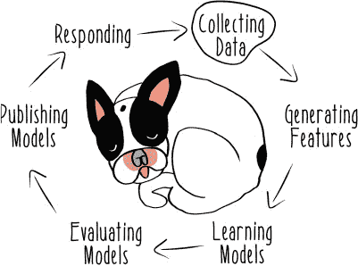

许多人讨论构建机器学习系统时甚至不提数据收集。乍一看，这似乎不如学习模型或做出预测那么令人兴奋。但收集数据至关重要，而且比看起来要困难得多。在变化的环境中，没有简单的捷径可以构建能够收集大量高度可变数据的生产级应用程序。我们需要将反应式机器学习的全部力量应用于这个问题，以确保我们有良好、可用的数据，可以被我们机器学习系统的其他组件消费。

要深入了解反应式机器学习系统，我们必须超越普通家宠的问题。我们必须冒险深入非洲的荒野。你将面临的挑战是记录地球上最大的陆地哺乳动物迁徙期间动物的运动。塞伦盖蒂的大迁徙充满了庞大、快速且复杂的数据。让我们看看这些数据是如何被收集的。

### 3.1. 感知不确定数据

在本章中，你将扮演一位尊贵的母狮王后。作为族群的族长，你非常认真地对待你的工作。

尽管你有一个古老的问题：你的食物不会静止不动。每年春天，你赖以生存的角马和斑马都有一种令人烦恼的习惯，那就是离开南部的草原平原向北迁徙。然后，每年秋天，这些食草动物就会转身向南，回到雨季。


作为一位负责任的王后和母亲，你必须跟踪你猎物的这种大规模迁徙运动。如果你不这样做，你的族群将一无所有可吃。但这项工作的数据管理问题非常严重，如图 3.2 所示。

##### 图 3.2. 大迁徙数据

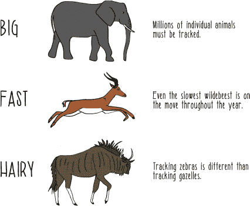

要对这种庞大、快速且复杂的数据有所把握，你需要部署一些先进的技术。你有一个长期愿景，有一天你将能够使用这些数据来构建一个大规模的机器学习系统，该系统能够预测猎物将在哪里，以便你的母狮们可以等待它们。但在你甚至考虑在这个数据之上构建系统之前，你需要收集并以某种方式持久化这些数据。

感谢与技术顾问鹰科公司签订的最新合同，你现在可以访问一些关于陆生动物运动的数据（图 3.3）。

##### 图 3.3\. 鹰科公司。


鹰科公司的“天空之眼”系统基于空中部署的分布式传感器网络。这些传感器结合体温检测和运动模式来报告任何给定位置的动物数量和种类。以下是这个系统提供的原始动物-传感器数据的一个示例：

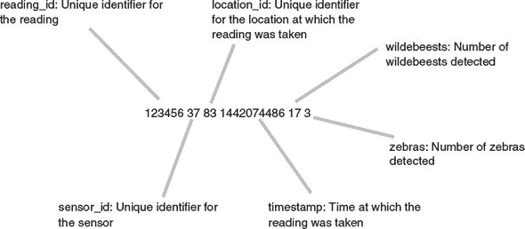


但这个原始模式并不是“天空之眼”系统真正理解下面动物的方式。传感器仅通过体温和运动提供一个对发生情况的近似视图。在这个过程中总会有一些不确定性。

在与（恐吓）你的技术顾问进行了一些进一步的谈判后，你获得了更丰富的数据流访问权限。这里显示的数据流，对于像这样的原始传感器数据的精确性难度有更明确的说明：

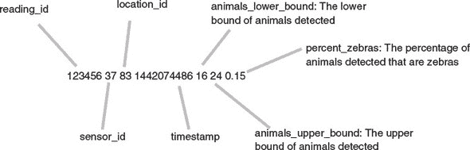

这种数据模型具有更多的统计丰富性。它表明在那个位置可能远少于或远多于 20 只动物。查阅“天空之眼”API 文档可以发现，这些是感知数据的概率分布的上限和下限，置信水平为 95%。


**置信区间**

图表中显示的不确定性数据模型使用的是*置信区间*。这是衡量传感器读数周围不确定性的量度。置信水平指的是所有可能读数中预期包含真实动物数量的百分比。目前，你不需要担心这些值的计算方法——我们在这本书中不会花太多时间在基本统计技术，如置信区间上。相反，我们将专注于如何构建能够表达和响应不确定性的系统。对于更深入的统计学介绍，有许多书籍和课程可供选择。“像数据科学家一样思考”由 Brian Godsey（Manning，2017）所著，是一本在数据科学工作中加深对统计学理解的优秀书籍。


16 和 24 个猎物动物之间的差异可能听起来不大，在某些情况下可能确实如此。有些读数的下限为零，上限不为零。对于这些位置，你可以派遣母狮前往，预期会找到一两只角马，但到达时却一个也没有找到。多亏了这个明确的不确定性数据模型，你现在作为狮后，可以就如何分配你稀缺的狩猎资源做出更明智的决定。

这两种数据模型之间的差异是一个**数据转换**的例子。在数据处理系统，就像在机器学习系统中，系统的许多操作实际上都是数据转换。转换数据是一项如此常见的任务，以至于我将在第四章中全部讨论如何在反应式机器学习系统中完成它。来自“天空之眼”系统的原始传感器数据流是对 Vulture Corp 内部最初保留的更原始数据形式的转换。正如你所见，转换这些原始数据导致你失去了关于传感器读数内在不确定性的信息。这是人们在实施数据处理系统时常见的错误：人们通过只持久化原始数据的某些派生版本来破坏有价值的数据。

考虑以下来自一位正在处理“天空之眼”系统转换后传感器数据的年轻狮子的提议：

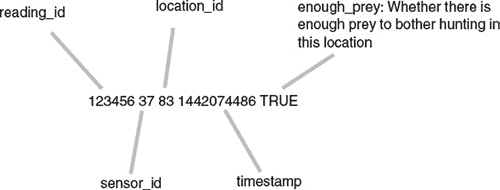

在这个高度转换的数据版本中，年轻的狮子开发者决定将事情简化为仅用一个布尔值来表示在特定位置是否有超过 10 只角马。这就是你最近用来决定是否应该狩猎某个位置的截止值。她的想法是，这实际上是你做出决定所需了解的一切。

但你是一位经验丰富的狮子王后。在不好的年份，你可能会出去捕猎一只单独的斑马幼崽。生命之圈总是在转动，你不可能总是知道未来会带来什么。当需要做出艰难决定时，你可能需要之前图中展示的数据模型的所有丰富性。


这是一种数据收集的基本策略的说明。你应该始终以不可变的事实收集数据。

一个**事实**仅仅是关于某件事情发生过的真实记录。在“天空之眼”系统的例子中，发生的事情是一个空中传感器检测到了一些动物。要知道这个事实发生的时间，你应该记录它发生的时间，尽管关于如何表达这个时间有一些有趣的选择。到目前为止的例子使用了简单的时间戳来说明传感器读数被记录的时间。

类似地，记录与事实相关联的实体或实体通常是一个好主意。在动物-传感器数据中，你记录了事实起源的实体——传感器——以及事实中描述的实体：位置。尽管收集到的传感器数据周围存在一些不确定性，但事实永远不会需要更改。它们将始终是关于系统在那个时间点对世界看法的事实。

不变事实是构建反应式机器学习系统的重要组成部分。它们不仅帮助你构建一个可以管理不确定性的系统，而且也是处理数据收集问题的策略的基础，这些问题只有在你的系统达到一定规模后才会出现。

### 3.2\. 规模化收集数据

大迁徙的惊人之处在于其规模。数百万动物同时移动。斑马是这些动物中最多的，但也有数十万只瞪羚和斑马。除了这些蹄类动物的前三种主要食物外，还有许多其他较小的动物需要考虑。从你在狮子岩总部的高处，你能看到的有限。天空之眼系统为你理解草原的状态提供了一个起点，但这只是一个起点。显然，如果你想对任何数据进行行动，你需要开始将这些数据加工成更有用的表示形式。

你将从探索如何构建 *数据聚合* 开始，这是从多个数据点产生的派生数据。下一节将展示构建数据聚合系统的初步方法，这不会是你最终使用的策略。所使用的所有技术都将在一个特定的规模级别上工作，但随着规模的增加会遇到问题。这些构建分布式数据处理系统的方法是解决规模问题的起点，你将在此基础上构建，以处理更大规模的第 3.3 节。

#### 3.2.1\. 在分布式系统中维护状态

作为第一个项目，你决定尝试追踪每个区域的猎物密度。区域是一个地理上连续的地点集合，每个地点都有自己的传感器数据。你希望保持的密度统计信息可以简单地表达如下。

##### 列表 3.1\. 计算位置密度

```
case class LocationReading(animals: Integer, size: Double)       *1*
val reading1 = LocationReading(13, 42.0)                         *2*
val reading2 = LocationReading(7, 30.5)
val readings = Set(reading1, reading2)                           *3*
val totalAnimals = readings.foldLeft(0)(_ + _.animals)           *4*
val totalSize = readings.foldLeft(0.0)(_ + _.size)               *5*
val density = totalAnimals/totalSize                             *6*
```

+   ***1* 表示特定位置和位置大小的动物数量读取的案例类**

+   ***2* 读取示例实例**

+   ***3* 读取集合**

+   ***4* 区域内所有动物的总和**

+   ***5* 区域内所有位置的平方英里总和**

+   ***6* 动物/平方英里的密度——本例中为 27.6**


**折叠**

代码清单 3.1 中的求和操作使用的是折叠。*折叠*是一种常见的函数式编程技术。使用的`foldLeft`操作符从零开始一个初始和。第二个参数是要应用于读数集中每个项目的的高阶函数。在求和中，这个高阶函数是运行总和与下一个项目的相加。但折叠是一种强大的技术，可以用于不仅仅是求和。你将在后面的章节中再次看到它，特别是在使用 Spark 的章节中。如果你想要深入了解为什么折叠是一种如此强大的技术，可以查看 Graham Hutton 的论文“关于折叠的普遍性和表达力的教程”：[www.cs.nott.ac.uk/~pszgmh/fold.pdf](http://www.cs.nott.ac.uk/~pszgmh/fold.pdf)。


这种方法在某些方面是合理的。在代码清单 3.1 中的代码仅使用不可变数据结构，因此所有用于计算的价值都可以被视为事实。求和操作使用的是纯函数，高阶函数`+`，因此在求和函数中不会出现副作用导致未预见到的问题。但今晚狮子们还不能休息。事情将会很快变得复杂起来。

为了知道哪些区域有最多的猎物密度，而不必外出到传感器读数报告的地方，你需要将这些读数汇总到一个单一的位置——你的总部在狮子岩。为此，你已经与猎豹邮递公司签订了合同(图 3.4)。

##### 图 3.4\. 猎豹邮递


他们将前往每个数据收集站，获取最新的读数。然后他们将会把有关该信息的消息迅速带回狮子岩。然后，最新的传感器读数将被添加到所有位置的聚合视图中。

预见到一群猎豹来回奔跑可能带来的问题，你决定做任何经验丰富的领导者都会做的事情：你让穿山甲负责。作为你同意不食用它的交换，穿山甲同意维持图 3.5 中所示系统的当前密度数据状态。

##### 图 3.5\. 简单的密度数据系统架构


穿山甲在代码清单 3.2 中实现了状态管理过程，该清单展示了如何维护萨凡纳的这种聚合视图的示例。示例更新场景是收到有关区域 4 动物密度高的消息。

##### 列表 3.2\. 聚合区域密度

```
case class Region(id: Int)                          *1*

import collection.mutable.HashMap
var densities = new HashMap[Region, Double]()       *2*

densities.put(Region(4), 52.4)                      *3*
```

+   ***1* 表示区域的案例类**

+   ***2* 存储最新密度值的可变哈希表**

+   ***3* 此更新将用新值覆盖区域 4 的先前值。**

通过让一个穿山甲负责这个过程，你确保猎豹永远不会争夺更新。此外，通过让所有猎豹排队与穿山甲交谈，你确保所有更新都是按照到达顺序处理的。


但是，不断移动的动物数量导致有更多更新比最初计划的猎豹数量。记录这些更新的过程很快变得对一个穿山甲来说过于繁重。

你决定再雇佣一个穿山甲。现在有两个穿山甲和两个队列，猎豹可以排队等待应用他们的更新，如图图 3.6 所示。

##### 图 3.6\. 添加队列

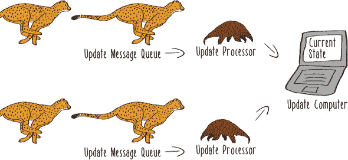


起初这似乎是一个不错的解决方案。毕竟，随着数据收集规模的扩大，你可以继续雇佣更多的穿山甲。这让你能够在增加负载的同时，继续在相同的时间内应用更新。

但最初的弹性很快就会消失。部分原因是，当一个穿山甲正在对系统进行更新时，另一个穿山甲只能等待。尽管穿山甲确实会花费一些时间在猎豹队列和更新计算机之间来回走动，但他们很快就会花大部分时间等待访问单台计算机。这意味着一个区域的更新会阻塞另一个区域的更新。

你决定尝试添加更多的穿山甲和更多的计算机，并实现了如图图 3.7 所示的系统。

##### 图 3.7\. 对共享可变状态的并发访问

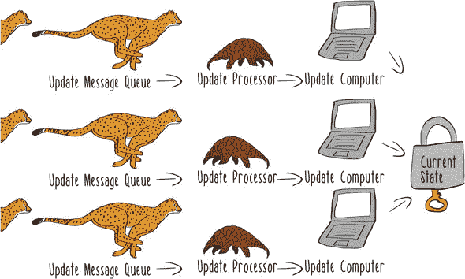

为了使多个穿山甲能够同时进行更新，你决定改变存储密度数据的所用数据结构。

##### 列表 3.3\. 可并发访问的密度

```
import collection.mutable._

var synchronizedDensities = new LinkedHashMap[Region, Double]()
 with SynchronizedMap[Region, Double]
```

这种实现现在允许通过一个确保每个执行线程都有数据最新视图的锁系统来并发访问密度数据以进行更新。不同的穿山甲可以在不同的计算机上做出不同的更新，但每个穿山甲在更新期间都持有锁。起初，这似乎是一个改进，但性能最终与旧系统相似。同步过程及其锁定机制最终证明与旧的单机瓶颈非常相似。你只是将稀缺资源的范围缩小到对可变数据结构的锁。有了这个瓶颈，你不能再添加更多的穿山甲来获得更多的吞吐量；他们只会争夺密度哈希表的锁。

这个新系统还有一个不幸的后果。猎豹可以进入他们想要的任何队列。有些穿山甲的工作速度比其他穿山甲快。这个系统现在允许一些更新以非顺序的方式处理。

例如，今天早上，草原的 6 号区域动物密度很高，因为所有的斑马都已经移动了。如果按照列表 3.4 中的方式应用这些传感器读数的更新，你将能够准确看到这个区域，如下面的列表所示。

##### 列表 3.4\. 有序更新

```
densities.put(Region(6), 73.6)          *1*
densities.put(Region(6), 0.5)           *2*
densities.get(Region(6)).get            *3*
```

+   ***1* 上午更新**

+   ***2* 下午更新**

+   ***3* 返回值 0.5**

但现在更新也可能被乱序应用。一系列乱序更新会给你一个完全不同的局面观。

##### 列表 3.5\. 乱序更新

```
densities.put(Region(6), 0.5)           *1*
densities.put(Region(6), 73.6)          *2*
densities.get(Region(6)).get            *3*
```

+   ***1* 下午更新**

+   ***2* 上午更新**

+   ***3* 返回值 73.6**

在这个第二种场景中，你正在派遣你宝贵的雌狮去一个你应该已经知道所有动物都已经移动过的区域狩猎。

如果你回顾一下第一次更新序列，它也存在缺陷。在下午，如果你按照列表 3.4 中的方式应用更新，你将能够准确看到 6 号区域捕食物的缺失。但早上发生了什么？在这个捕食丰富的区域，应该有雌狮在那里，但她们只是闲逛。到了下午，你所知道的就是 6 号区域已经没有捕食物了。你不知道几只懒散的雌狮错过了当天最好的狩猎机会。必须有一种更好的组织狩猎的方式。

#### 3.2.2\. 理解数据收集

预捕密度项目出了什么问题？这个系统原本是用来回答关于动物在草原上位置的基本问题的。当然，秃鹫顾问们提出了一个后续项目，其中将使用这些捕食数据来创建未来捕食位置的学习模型。但你不先找出当前系统的问题并修复它，就无法开始考虑未来的项目。

你召集团队剖析捕食密度系统，并找出你们在收集数据方面学到了什么。你得出以下结论：

+   简化真实不确定性的数据模型会丢弃有价值的数据。

+   单个数据收集处理器无法扩展以处理你的实际工作负载。

+   如果你使用共享可变状态和锁来分配你的工作负载，那么扩展并不会好多少。

+   使用变异来更新数据会破坏历史知识，甚至可能导致你用旧数据覆盖新数据。

团队为了上线这个捕食数据收集系统付出了巨大的努力，然而它确实存在一些真正的缺陷。他们是否能够应对修复这个系统并将其提升到下一个级别的挑战？他们不会无缘无故地把一群狮子称为*雄狮群*！当然，他们可以基于所学的内容进行建设。他们已经学到了很多关于如何收集数据的知识。他们已经准备好进入构建数据收集应用程序的下一阶段：存储这些数据。

### 3.3\. 持久化数据

要构建你其余的数据管理系统，你需要一个数据库。正如你将在下一章中看到的，机器学习管道通常从一些原始数据数据库开始。尽管这看起来很明显，但让我们试着理解你需要从数据库中得到什么。你可能已经了解了一些这方面的内容，但请耐心听我解释，我从响应式系统的角度来解释数据库。

人们通常会从数据库支持的操作来讨论数据库，因此首先，数据库应该允许你存储你的数据。在数据库术语中，这通常被称为 *创建* 操作。为了数据库能够存储你的数据，这些数据最终必须是 *持久化的*——在程序关闭后，数据仍然应该存在于数据库中。持久化还意味着你的数据应该能够经受住诸如数据库服务器重启等事件。


数据库需要为你做的另一件事是在你请求时返回你的数据。这被称为 *读取* 操作。在响应式术语中，这仅仅是响应性再次。

如果数据库不能始终如一地及时响应你的查询，那么数据库的其他任何属性都不会重要。人们对如何从数据库中读取数据有不同的想法，我们将在本章后面考虑这些选项。


数据库还可以做其他一些你不需要做的事情。一些数据库支持 *更新* 操作，这会改变数据。正如你所看到的，修改数据可能导致各种问题，所以你会避免 *更新* 操作。你不会改变已经持久化的数据，而是依赖于写入新的不可变事实。


同样，一些数据库支持一个名为 *删除* 的操作。我知道！这真是太可怕了。在响应式机器学习范式下，我们假设我们的数据实际上是无限的。

你不需要那个错误的 *删除* 操作，因为你会从构建你的系统开始，以处理无界的数据量。现在让我们永远不再谈论删除。

#### 3.3.1. 弹性和弹性数据库

现在你已经理解了如何使用数据库的一些基本知识，让我们更具体地了解什么会使数据库在响应式数据处理系统中工作得很好。毕竟，你有一个宏伟的愿景，你最终能够使用这些猎物数据来构建一个大规模的机器学习系统，该系统能够预测未来的猎物移动。面对所有这些庞大、快速、复杂的数据，如果你希望达到那个目标，你需要在技术选择上考虑响应式原则。


正如你在收集猎物数据的初始尝试中看到的，实现弹性是困难的。你不能只是添加更多的数据处理单元，但这个想法是正确的方向。

你将需要一个 *分布式数据库*，其中多个服务器协同工作以作为一个单一数据库运行。而不是一群争相写入同一只河马控制的计算机的猎豹，你理想上会使用一个数据库，其中多个服务器既可以写入也可以读取，就像图 3.8 所示。`创建`和`读取`操作的真正分布式是数据库可以扩展的唯一方式。


##### 图 3.8\. 分布式数据库

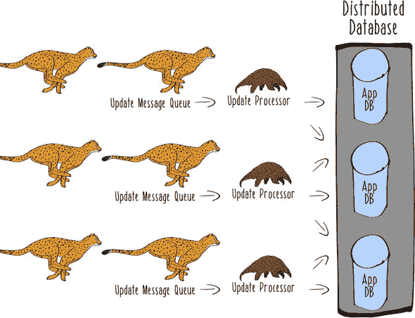

另一个需要考虑的反应式原则是弹性。在塞伦盖提，你知道资源可能会消失。有些日子河流会泛滥，水源充足。其他时候，地面会被炽热的非洲太阳烤焦，你需要走几天才能找到水。

不幸的是，这正是分布式数据库的工作方式。由于许多服务器负责存储和检索你的数据，其中之一必然会失败。也许它只是像一只懒惰的母狮在午睡时忽视她的狩猎职责一样，短暂地陷入沉睡。或者也许更糟，那个服务器就像最后被一只饥饿的猎豹吞噬的河马。这就是生命的循环。


你最终会回到你在弹性追求中的同一个地方：你需要一个分布式数据库，你的数据在多个服务器上冗余存储。在构建反应式机器学习系统时，复制是一个始终相关的策略。

幸运的是，有许多数据库具有我刚刚描述的许多属性。我们将在这本书中使用的是 Couchbase。它是一个可以处理大迁徙规模的分布式数据库，并且可以处理沿途服务器不可避免的故障。Couchbase 具有丰富的功能，远远超出了创建和读取大量记录的最低要求。实际上，许多其他数据库也可以用于本章的示例。反应式机器学习的技巧并不绑定到任何特定的技术。但 Couchbase 将使你轻松开始构建你的事实数据库，并且可以轻松支持任何未来的项目，如猎物移动预测系统。作为额外的优势，Couchbase 本身是一个非常反应式的系统，使用了多种反应式策略。在本章的后面，我们将快速看一下 Couchbase 作为高度反应式数据库如何支持构建反应式数据处理系统。

#### 3.3.2\. 事实数据库


你将使用的一种工具来扩展猎物移动系统是 *基于事实的数据模型*。在本章的早期，我谈到了事实作为原始数据捕获的有用技术。你可以将之前看到的丰富数据模型表达为标准的案例类。

##### 列表 3.6\. 传感器读数案例类

```
case class PreyReading(sensorId: Int,
                       locationId: Int,
                       timestamp: Long,
                       animalsLowerBound: Double,
                       animalsUpperBound: Double,
                       percentZebras: Double)
```

这个案例类代表了一个单独的传感器读数。

你将以 JSON 文档的形式存储你的数据。支持这种数据模型风格的数据库有时被称为*文档存储*。Couchbase 使用文档数据模型，其中文档存储在桶中。*桶*在传统的关系数据库中类似于表的作用，但它们不需要在数据库本身中定义这些文档的结构。它们将接受你选择的任何文档。在能够接受你的读数文档以进行持久化之前，你不需要对数据库进行任何操作。不必提前规划数据模型的各个方面可以使处理数据模型的变化（例如，当你添加有关传感器不确定性的更丰富信息时）变得更加容易。第十一章讨论了更多关于处理反应式机器学习系统演变的内容。

为了持久化传感器读数案例类的实例，你必须定义一个可以将这些实例转换为等效的 JSON 表示的格式化器，该表示可以存储在数据库中。

##### 列表 3.7\. 创建传感器读数文档

```
import play.api.libs.json._
import scala.concurrent.ExecutionContext
import org.reactivecouchbase.ReactiveCouchbaseDriver

val driver = ReactiveCouchbaseDriver()
val bucket = driver.bucket("default")                                          *1*
implicit val ec = ExecutionContext.Implicits.global                            *2*

implicit val preyReadingFormatter = Json.format[PreyReading]                   *3*

def readingId(preyReading: PreyReading) = {                                    *4*
  List(preyReading.sensorId,
    preyReading.locationId,
    preyReading.timestamp).mkString("-")
}

val reading = PreyReading(36, 12, System.currentTimeMillis(), 12.0, 18.0, 0.60)*5*

val setDoc = bucket.setPreyReading, reading)              *6*

setDoc.onComplete {
  case Success(status) => println(s"Operation status: ${status.getMessage}")   *7*
  case _ => throw new Exception("Something went wrong")
}
```

+   ***1* 创建到默认桶的数据库连接**

+   ***2* 用于 future 的执行上下文**

+   ***3* 用于将案例类转换为 JSON 的格式化器**

+   ***4* 用于为 PreyReading 文档创建复合主键的辅助函数**

+   ***5* 示例传感器读数**

+   ***6* 将读数作为文档插入并返回 Future 的操作**

+   ***7* 为了说明目的打印插入操作的结果**


**隐式转换**

你可能已经注意到列表 3.7 使用了*隐式转换*。你创建的隐式格式化器定义了一种将`PreyReading`案例类转换为 JSON 的方式。如果你没有创建这个格式化器，你用来与数据库交互的库将不知道如何执行这种转换，并且无法将传感器读数实例保存到数据库中。`implicit`关键字使得这种转换可以在不要求你显式执行转换的情况下使用。编译器将在编译你的程序时推断出应该使用格式化器来执行这种转换，并插入转换代码。隐式转换是 Scala 的一个独特而强大的特性。你会在编写 Scala 代码时经常遇到它们。要更深入地了解隐式转换及其用法，请参阅 Joshua D. Suereth（Manning Publications，2012 年）所著的《Scala 深度》。


将一个动作的定义与其执行分离通常是一个有用的习语。在这种情况下，它有助于你编码插入操作将花费时间并且可能失败的可能性。例如，你可以在模式匹配中的失败情况替换为重试逻辑或一些有意义的通知。识别并编码失败的可能性是构建系统弹性的关键步骤。


这种数据库交互风格依赖于未来（futures），这是你在第二章中看到的技术。这种编程风格的主要好处之一来自于数据库插入的非阻塞操作。`bucket.set`的调用会立即返回。因为远程数据库的插入需要时间，驱动程序不会阻塞程序的主执行线程等待数据传输到远程数据库以及成功插入消息返回。这种基于未来的非阻塞编程风格非常适合在变化负载下保持一致操作的目标。

在这种数据收集方法中，还有更多支持弹性的内容。许多不同的数据收集程序实例可以同时向许多不同的数据库节点写入数据，而无需锁定单个项目并协调访问。这与你在上一节中看到的多个猎豹与多个穿山甲通信的最终架构类似，但更好。多亏了非阻塞驱动程序的力量，几乎就像是猎豹们可以放下他们的消息然后跑掉。它们不需要等待慢吞吞的穿山甲实际进行更新。猎豹们当然不需要等待穿山甲们自己之间协调对共享可变状态对象的访问，因为根本不存在共享可变状态。但是，你如何从一个充满原始事实的数据库中确定撒哈拉草原的当前状态呢？

#### 3.3.3\. 查询持久事实

在你的数据库中查看数据的最简单方法是为你已插入的数据定义一些结构。在你插入数据后能够定义这种结构是现代灵活数据库的独特特性之一，与你可能熟悉的更严格的数据库关系型数据库相比。你一直以 JSON 文档的形式记录数据，现在你需要使用 JavaScript 来表示一些关于文档结构的信息。如果你不熟悉 JavaScript，请不要担心。你只需编写简单的 JavaScript 来定义在原始数据之上的视图结构。列表 3.8 定义了一个视图，该视图允许你通过传感器 ID 检索文档。这个视图将以*设计文档*的形式定义，这另一种说法就是*存储查询*。

##### 列表 3.8\. 创建传感器 ID 视图

```
import scala.concurrent.Await
import scala.concurrent.duration.Duration
import java.util.concurrent.TimeUnit

val timeout = Duration(10, TimeUnit.SECONDS)

Await.result(                                                               *1*
  bucket.createDesignDoc("prey",                                            *2*
    """
      | {
      |     "views":{                                                       *3*
      |        "by_sensor_id": {                                            *4*
      |            "map": "function (doc, meta) { emit(doc.sensorId, doc); }*5*
      |        }
      |     }
      | }
    """.stripMargin), timeout)
```

+   ***1* 用于等待未来完成的阻塞操作，仅用于说明**

+   ***2* 创建一个名为“prey”的设计文档（JavaScript 格式）**

+   ***3* 在这个设计文档中定义视图**

+   ***4* 通过传感器 ID 创建视图**

+   ***5* 创建一个函数来发射所有具有传感器 ID 的文档**

通过定义这个视图，你已经在文档的传感器 ID 上创建了索引。这将使得通过传感器 ID 查找文档变得简单快捷。


**阻塞**

我一直在强调基于非阻塞、未来交互的好处，所以看到这些好处需要阻塞可能看起来很奇怪。你可能想在这样一个小型的探索性环境中使用阻塞，因为这样可以强制未来完成，从而看到你正在工作的那小段代码的结果。在一个完全实现且正确组合的系统里，你不会想依赖于对 `Await.result` 的调用。你主要想在这个探索或调试的上下文中使用这种技术。


在支持真实应用程序的完全填充的数据库中，这个视图创建可能需要花费相当长的时间来创建返回视图中所表达数据所需的数据结构。在 Couchbase 中，这个问题通过将开发视图（你刚刚创建的）与生产视图分开来管理。不同的分布式数据库选择以不同的方式实现视图或根本不实现，所以在实现真实系统时了解你使用的数据库的具体细节是值得的。但这个以查询为中心的工作流程在广泛的分布式非关系数据库中是常见的。


注意，Couchbase 视图是用 map-reduce 语法定义的，其中 map 和 reduce 阶段都表示为高阶函数。如果你在关系数据库中经验丰富，那么用 map-reduce 操作来定义视图可能会让你感到奇怪。现代分布式非关系数据库通常模糊了应用程序执行的数据处理和数据库执行的数据处理之间的界限。当然，你可以在 Scala 应用程序代码中实现这个完全相同的视图，但这将要求你有效地处理数据库的整个内容以进行任何给定的查询。当你的分布式数据库的使用简化为查询的全表扫描时，通常意味着你的应用程序（或数据库）在设计层面存在问题！如果只是为了视图维护工作只做一次而不是每次查询都做一次，那么让数据库自己承担这项工作会更好。

一旦你有了这个视图，你可以检索你在列表 3.7 中记录的最后一次读取。为此，你可以使用以下列表中的代码找到匹配的传感器 ID 的读取。

##### 列表 3.9\. 一个传感器的所有记录

```
val retrievedReading = Await.result(
    bucket.searchValues[PreyReading]                *1*
      ("prey", "by_sensor_id")                      *2*
      (new Query().setIncludeDocs(true)             *3*
        .setKey("36"))                              *4*
      .toList,                                      *5*
    timeout)
    .head                                           *6*

println(retrievedReading)                           *7*
```

+   ***1* 搜索 PreyReading 值**

+   ***2* 设计文档和视图以使用**

+   ***3* 创建一个新的查询**

+   ***4* 定义查询的文档键为传感器 36**

+   ***5* 强制结果转换为列表**

+   ***6* 强制结果转换为列表**

+   ***7* 打印检索到的读取**

如果你只从列表 3.7 中写入了传感器读取，那么这个查询将只在这个文档上操作。但非常相似的查询语法将返回该传感器所有曾经记录的读取。

为了了解对大量事实的操作如何工作，下一个列表创建了一些用于玩耍的合成数据。

##### 列表 3.10\. 插入大量随机记录

```
import _root_.scala.util.Random
import play.api.libs.iteratee.Enumerator

val manyReadings = (1 to 100) map { index =>                               *1*
  val reading = PreyReading(
    36,
    12,
    System.currentTimeMillis(),
    Random.nextInt(100).toDouble,
    Random.nextInt(100).toDouble,
    Random.nextFloat())
  (readingId(reading),
    reading)
}

val setManyReadings = bucket.setStream(Enumerator.enumerate(manyReadings)) *2*

setManyReadings.map { results =>                                           *3*
    results.foreach(result => {
      if (result.isSuccess)
       println(s"Persisted: ${Json.prettyPrint(result.document.get)}")
      else println(s"Can't persist: $result")
    }
    )
  }
```

+   ***1* 生成 100 个随机传感器读数**

+   ***2* 将所有随机读数作为流插入**

+   ***3* 遍历每个结果并打印结果**

现在你应该有更多的事实在你的数据库中可以工作。


**枚举器**

列表 3.10 使用 Play 网络框架中的 `Enumerator`。一个 *enumerator* 是一个将输入推送到某个接收者的数据源。枚举就是逐个操作集合中的每个项目。当完成时，Play 的 `Enumerator` 将使用基于未来的编程技术 `Promise`（本书稍后讨论）返回接收者的最终状态。在这种情况下，你使用枚举器作为将值流式传输到数据库以进行持久化的方式。在实际系统中，枚举的数据将来自多个发送传感器读数数据的传感器。


你可以使用这个事实数据库来回答关于萨瓦纳当前状态的问题。例如，你可以使用以下列表中的视图定义传感器 36 的基于时间的读数视图。

##### 列表 3.11\. 基于时间的传感器读数视图

```
Await.result(
  bucket.createDesignDoc("prey_36",
    """
      |{
      |    "views":
      |    {
      |        "by_timestamp":
      |        {
      |            "map":
      |            "function (doc, meta)  { if (doc.sensorId == 36)    *1*
       { emit(doc.timestamp, doc); }  }"
      |        }
      |    }
      |}
    """.stripMargin), timeout)
```

+   ***1* 仅为此传感器 36 定义此视图**

由于你没有通过修改某些状态而丢弃任何数据，因此很容易了解最近的读数和事物的发展趋势。

##### 列表 3.12\. 最近的十个传感器读数

```
val lastTen = Await.result(
  bucket.searchValues[PreyReading]
    ("prey_36", "by_timestamp")
    (new Query().setIncludeDocs(true)
      .setDescending(true)                         *1*
      .setLimit(10))                               *2*
    .toList,
  timeout)
```

+   ***1* 按最近读数排序**

+   ***2* 只取最近的十个读数**

或者你可以跳回到特定的时间点。

##### 列表 3.13\. 单个旧传感器读数

```
val tenth = Await.result(
  bucket.searchValues[PreyReading]
    ("prey_36", "by_timestamp")
    (new Query().setIncludeDocs(true)
      .setDescending(true)
      .setSkip(9)                                  *1*
      .setLimit(1))                                *2*
    .toList,
  timeout)
```

+   ***1* 跳过最近的九个读数**

+   ***2* 只返回第十个最近的读数**

重要的是要注意，这种设计绕过了你在 列表 3.5 中遇到的乱序更新的问题。在之前的系统中，由于你将数据收集系统扩展到有多个猎豹向多个穿山甲提供更新，一个旧更新可能会覆盖一个较新的更新并破坏该事实的任何记录。在修订后的系统中，这是不可能的，因为你存储了所有传感器读数，从未丢弃任何数据。以下列表中的代码显示了如何有意地乱序插入记录。

##### 列表 3.14\. 插入乱序读数

```
val startOfDay = System.currentTimeMillis()
val firstReading = PreyReading(36, 12, startOfDay, 86.0, 97.0, 0.90)          *1*
val fourHoursLater = startOfDay + 4 * 60 * 60 * 1000
val secondReading = PreyReading(36, 12, fourHoursLater, 0.0, 2.0, 1.00)       *2*

val outOfOrderReadings = List(
  (readingId(secondReading), secondReading),
  (readingId(firstReading), firstReading))                                    *3*

val setOutOfOrder = bucket.setStream(Enumerator.enumerate(outOfOrderReadings))*4*

setOutOfOrder.map { results =>
  results.foreach(result => {
    if (result.isSuccess)
     println(s"Persisted: ${Json.prettyPrint(result.document.get)}")
    else println(s"Can't persist: $result")
  }
  )
}
```

+   ***1* 第一次收集读数**

+   ***2* 第二次收集读数**

+   ***3* 定义了一个顺序错误的读数列表**

+   ***4* 按顺序插入读数**

插入顺序现在不重要，所以这里显示的所有查询，无论是按顺序还是乱序插入记录，都完全相同。你可以通过检索最后两个传感器读数来看到这一点。

##### 列表 3.15\. 获取最后两个读数

```
val lastTwo = Await.result(
  bucket.searchValues[PreyReading]
    ("prey_36", "by_timestamp")
    (new Query().setIncludeDocs(true)
      .setDescending(true)
      .setLimit(2))
    .toList,
  timeout)
```

这个查询返回的结果不受记录是按顺序还是无序插入的影响，因为没有任何数据丢失，排序由查询决定。你不再需要冒险通过用新数据覆盖旧数据来破坏你对萨凡纳视图的有序更新。你可以自由地扩展你的数据收集操作到任意规模，而不必担心更新的插入顺序。

#### 3.3.4\. 理解分布式事实数据库


现在你已经控制了你的猎物数据收集，可能有助于放大视角，理解为什么这种替代方法工作得如此之好。首先，你保留了你对源数据所有丰富知识。传感器读数是不确定的，这种不确定性被保存在你的数据库中。

通过在持久化之前不转换原始数据，你保留了传感器收集数据的真实记录。这个事实的历史比单个突变值要丰富得多，也更有用。不可变事实数据库可以告诉你关于萨凡纳状态的任何你想要知道的事情。

接下来，你通过良好的数据架构和非常弹性的数据库的组合实现了真正的水平扩展。你可以继续添加数据收集应用程序，你的数据模型和数据库现在将支持任意规模的增加。在这方面，Couchbase 给你比许多数据库更强的保证。你数据库集群中的每个节点都有相同的职责和能力，因此最终系统的架构非常接近原始分布式数据库图中的理想，如图 3.9 所示。


##### 图 3.9\. 分布式数据库


读取或写入没有单一的吞吐量瓶颈。基于事实的数据模型确保多个操作不会争夺共享的可变值，因此你扩展能力的限制仅限于你的基础设施预算。


这种架构还具有重要的容错能力。如果网络以某种方式分区你的节点，你的数据库仍然可用。

对网络分区容忍度是数据库设计难以支持的一个特性。提高分区容忍度的策略是数据库发展中一些最重要的创新之一。此外，你的数据模型与数据库基础设施提供的功能协同工作。在网络分区的情况下，数据库返回的事实数据将是一个准确、可能不完整的收集数据的视图。在具有分区容忍度的分布式数据库中，数据不完整视图的可能性是不可避免的。当网络阻止集群间的通信时，你的数据中的一部分将不可用；没有任何数据库可以改变这一点。与降低响应性不同，像 Couchbase 这样的数据库选择返回可用的数据。这对你的应用程序来说不是问题。考虑关于位置 55 上被认为存在的斑马数量的传感器读取序列，如图 3.10 所示。

##### 图 3.10。完整的斑马传感器读取


这一系列的读取依赖于数据库集群中所有节点存储的数据。由于网络的不可靠性，你可能会失去对集群中某些节点的访问权限（图 3.11）。

##### 图 3.11。网络分区

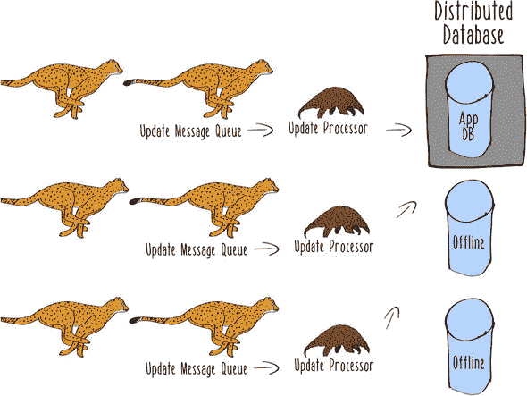

更新处理器程序实例中使用的数据库客户端库将路由到仍然可达的节点。但是，由于你的数据在集群中分布，你可能只能临时访问部分数据。例如，你可能只有图 3.12 中显示的读取。

##### 图 3.12。不完整的斑马传感器读取


对于许多应用来说，这个数据库的部分视图完全可以使用。毕竟，记录的事实并没有反映出当前在位置 55 确实有特定数量的斑马存在。如果你想要的话，甚至可以使用线性模型来插补缺失的值。趋势是相同的，查询读取所提供的整体图景将呈现类似的视图。当你看到这些不完整的数据时，你可能会采取的行动与看到完整数据集时采取的行动相同：你会派出一些带有条纹的雌狮去为你找一些午餐。通过使用基于事实的数据模型和显式的不确定性，你已经在数据库的使用中构建了处理数据不完整视图的能力。


这个系统还有更多值得强调的特性。数据库的内部**并发模型**是其协调多个用户的计划。Couchbase 使用一种称为**多版本并发控制**（MVCC）的并发模型。使用 MVCC 的系统在内部不会锁定记录以进行变更，而是复制数据。


正如你所看到的，锁定会阻碍写操作的扩展。Couchbase 集群没有在节点之间尝试保持锁的问题，因为在集群内部，操作是通过消息传递进行协调的。


这种消息传递是在一个 actor 系统中使用监督层次结构进行的。正如你之前看到的，我们将在未来的章节中进一步讨论，使用监督层次结构是确保面对失败时具有弹性的优秀策略。


**Erlang 和 OTP**

Couchbase 中的 actor 模型实现不是 Akka。相反，它是使用 Erlang 语言和 OTP 库构建的。Erlang 和 OTP（开放电信平台）最初是为电信应用而构建的。最近，Erlang 和 OTP 在像 Couchbase 和 Riak 这样的分布式数据库实现中变得流行。但这两个系统中的 actor 模型实现密切相关（例如，频繁使用模式匹配）。事实上，Jonas Bonér 就是基于他在 Erlang 和 OTP 方面的经验创建了 Akka。


数据库功能的所有这些特性都与您构建反应式机器学习系统的更大目标相一致。这种愿景的一致性对您可以从数据库中期望的性能和它提供的保证有实际影响。因为您的数据模型不再依赖于必须使用锁来维护的共享可变状态，您可以利用围绕大量并发性构建的数据库的极端可扩展性能力。

最后，这种数据架构之所以如此有效，主要原因是它基于在现实中有效，而不仅仅是软件中的想法：

+   *事实总是真实的*。未来的事实不会抹去旧的事实。如果今天早上河边的羚羊还在，那么这个陈述就始终是真实的，即使羚羊已经离开了。你不需要因为不再去那里吃它们而忘记早上的羚羊。

+   *中央控制导致竞争*. 即使你是狮子女王，也无法让不可能的事情成为可能。穿山甲只能跑得这么快，猎豹对数据录入也没有耐心。它们不能通过一个控制点进行协调，同时还能在草原上四处游荡。这也是为什么你不会让所有的母狮都回来问你，是否应该捕杀行动缓慢的角马。如果所有的事情都必须通过一个控制点进行，无论这个控制点是您还是任何其他狮子，那么什么都不会完成。

+   *你无法确定任何事情*。草原是一个广阔、混乱、分布式的系统，狮子岩的视野也只有那么远。也许猎豹并没有真正吃掉帕特里克· pangolin。谁又能说呢？你或任何其他狮子所能做的就是记录所有不确定的事实，并尽你所能利用你所拥有的知识。作为一个负责任的皇后，意味着承认你所知道的局限，因为非洲的真实世界是不确定的。承认你不是全知全能的是代表家族做出良好决策的一部分。

你在构建数据收集能力时所采取的既原则又实际的方法已经得到了回报。你能够更一致地满足你的自豪感，并更有效地利用你的时间。非洲的捕食者对你的整个草原观都感到羡慕。你在本章中使用的方法也使你处于一个极好的位置，可以未来构建新的能力。接下来，你正在考虑构建一个特征提取系统来支持机器学习预测。狮后女王的工作永远不会结束，但你已经为你的家族做得很好。你应该感到自豪。

### 3.4. 应用

你可能不住在塞伦盖提。你可能不会操作分布式传感器网络。你可能甚至不是一只狮子。你还能应用本章中使用的技巧吗？当然可以。

各种系统产生大量数据，这些数据必须被收集起来才能投入使用。手机中充满了各种传感器，其中许多会将数据发送回远程服务器。例如，手机收集位置数据，用于提供特定位置的建议。即使没有使用传感器硬件，大多数移动应用也会将各种数据发送回远程服务器，关于与应用程序的交互：滑动、通知取消等。这些数据可以用来确定应用程序的使用模式，并将用户群体（例如，地铁通勤者）联系起来。

不仅限于手机和野生动物。现在，大量传统产品现在产生可以收集并用于机器学习系统中的数据。我们生活在一个机器人吸尘器和电动汽车真实甚至常见的世界里。作为物种，我们在过去几十年中产生的大量数据已经爆炸式增长。正如你在本章中看到的，大规模处理数据是不同的。本章中展示的技术为大规模处理数据的问题提供了真正的解决方案。如果你正在开发一个使用不同方法处理数据的现有系统，可能并不清楚本章中使用的所有技术都是必要的。你可能正在处理的数据并不像追踪大迁徙的传感器网络中的数据那样大、快或复杂。在这种情况下，你可能不需要使用本章中展示的所有技术。

但是，即使是像手表这样无害的东西现在也能产生大量任意复杂性的数据。一旦你开始寻找可以应用这些技术的应用，找到它们并不难。任何具有用户概念的系统，如电子商务网站，都可以使用基于事实的数据模型来记录用户的行为。即使是记录客户交易的低速业务应用也可能从移除对锁定数据项的竞争中获得潜在的好处。本章中的工具在规模上工作得非常好，但它们并不 *要求* 你的应用达到规模。现在你了解了数据收集的反应式方法，我预计你会找到很多可以应用它的地方。

### 3.5. 反应性


是时候独立探索反应式数据收集的世界了。本节中的“反应性”旨在引导你进一步探索塞伦盖提平原之外的领域。这些问题没有正确答案；它们只是你可以探索的问题，这些问题比我在这本书的空间里讨论的还要多：

+   *实现你自己的反应式数据收集系统。* 真的。从记录事实的基本开始。你可以使用任何你想要的数据库。选择你最熟悉的数据库。然后考虑这个选择可能带来的后果：

    +   数据库的哪些属性将支持使你的系统更具响应性、弹性、弹性和消息驱动？特别是，思考数据库如何处理负载的大幅增加。

    +   什么会减慢速度，原因是什么？

    +   想想你为事实使用的数据模型——它是否包括不确定性？

    +   如果之前没有，添加一个明确的不确定性数据模型有多难？

    +   你能对你的数据库编写哪些类型的查询？

    +   如果你删除了大量记录，这些查询的结果会如何变化？

+   *探索其他开源数据收集系统。* 它们不必是明确反应式的。如果你想专注于本章中展示的设计模式，它通常被称为 *事件溯源*。甚至有专门为支持事件溯源而构建的数据库。收集大量事实数据的思想在监控应用中很常见。你能找到任何将监控系统中所有事件持久化为不可变事实数据库的监控应用吗？尝试回答关于这些其他数据收集系统实现的一些相同问题，就像你对自己的实现提出的问题一样：

    +   这个系统有多反应？

    +   如果某些东西失败了，会发生什么？

    +   如果系统被流量淹没，我还能查询数据吗？

    +   我在写完“事实”之后，是否需要或需要重写它？

    +   如果我永远向这个系统推送数据，会发生什么？

| |
| --- |

##### 备注

你在本章中熟悉了 Couchbase，作为了解数据库的一般方式。你不需要对这本书的其余部分有更多关于这个数据库的特定知识，但如果你对这项技术感兴趣，有几本书可以阅读。


### 摘要

+   事实是不可变记录，记录了发生的事情及其发生的时间：

    +   在数据收集过程中对事实进行转换会导致信息丢失，这是绝对不应该做的。

    +   事实应该编码关于该信息的任何不确定性。

+   数据收集无法通过共享可变状态和锁进行大规模操作。

+   事实数据库解决了大规模收集数据的问题：

    +   事实可以无阻塞或使用锁来编写。

    +   事实可以按任何顺序编写。

+   基于未来的编程处理操作可能需要时间甚至失败的可能性。

在下一章中，我们将利用这些原始事实数据，通过从中提取语义上有意义的特征来将其投入使用。这些特征将是我们的数据洞察提取过程中的第一步。我们将再次使用 Spark 来展示如何构建既优雅又大规模可扩展的特征提取管道。

## 第四章\. 生成特征

*本章涵盖*

+   从原始数据中提取特征

+   将特征转换为更有用的形式

+   在你创建的特征中选择

+   如何组织特征生成代码

本章是我们探索机器学习系统组件或阶段旅程的下一步，如图 4.1 所示。本章重点在于将原始数据转换为有用的表示，称为*特征*。构建能够从数据中生成特征的系统（有时称为*特征工程*）的过程可能具有欺骗性的复杂性。通常，人们从对*想要系统中的特征是什么*的直观理解开始，而对*如何产生这些特征*的计划很少。没有坚实的计划，特征工程的过程很容易偏离轨道，正如你在第一章的 Sniffable 示例中看到的那样。

##### 图 4.1\. 机器学习阶段

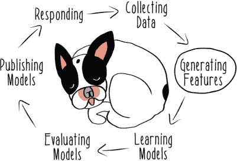

在本章中，我将指导你了解特征管道中的三种主要操作类型：提取、转换和选择。并非所有系统都执行本章中显示的所有类型的操作，但所有特征工程技术都可以被视为属于这三个类别之一。我将使用类型签名将技术分配到组中，并为我们的探索提供一些结构，如图 4.1 表所示。

##### 表 4.1\. 特征生成阶段

| 阶段 | 输入 | 输出 |
| --- | --- | --- |
| 提取 | 原始数据 | 特征 |
| 转换 | 特征 | 特征 |
| 选择 | 特征集 | 特征集 |

现实世界的特征管道可能具有非常复杂的结构。您将使用这些分组来帮助您理解如何以最佳方式构建特征生成管道。当我们探索这三种特征处理操作类型时，我将介绍一些常见的技巧和设计模式，以防止您的机器学习系统变得混乱、难以维护。最后，在讨论第五章第五章中机器学习系统的下一个组件——模型学习管道时，我们将考虑数据管道的一些一般特性。

| |
| --- |

**类型签名**

您可能不熟悉使用*类型*来指导您思考程序和实现程序的方法。这种技术在 Scala 和 Java 等静态类型语言中很常见。在 Scala 中，函数是通过它们接受的输入、返回的输出以及两者的类型来定义的。这被称为*类型签名*。在这本书中，我主要使用一种相当简单的签名符号，看起来像这样：`Grass => Milk`。您可以将其读作，“一个从类型为 Grass 的输入到类型为 Milk 的输出的函数。”这将是某些行为类似于牛的函数的类型签名。

| |
| --- |

![pidgn.jpg]

为了涵盖这个庞大的功能范围，我们需要超越它，以获得对特征本质的一些洞察。为此，我们将加入 Pidg’n 团队，这是一个为树栖动物设计的微型博客社交网络，与 Twitter 没有太大区别。

我们将探讨如何从短格式、基于文本的社交网络的混乱中提取有意义的活动表示。就像森林本身一样，特征的世界是多样且丰富的，充满了隐藏的复杂性。然而，我们可以开始透过树叶窥视，利用反应式机器学习的力量捕捉关于树栖动物生活的洞察。

### 4.1. Spark ML

在我们开始构建特征之前，我想向您介绍更多的 Spark 功能。`spark.ml`包，有时称为 Spark ML，定义了一些高级 API，可用于创建机器学习管道。此功能可以减少您需要自行实现的机器学习特定代码的数量，但使用它确实涉及您数据结构的变化。

Spark ML API 在特征提取、转换和选择方面主要使用与我本章中使用的相同的命名约定，尽管存在细微的差异。如果你阅读 Spark ML 文档，可能会看到称为 *转换* 操作的内容，而我称之为 *提取* 操作。这些通常是微不足道的、不重要的差异，你可以忽略它们。不同的技术对这一功能的命名和结构不同，你会在机器学习文献中看到各种不同的命名约定。我在本章中使用的基于类型签名的框架来划分特征生成功能，只是一个帮助你实现和组织代码的工具。一旦你掌握了本章中的特征生成概念，你将更好地能够透过命名差异看到功能上的相似性。

Spark 中大部分机器学习功能都是设计用来与 DataFrames 一起使用，而不是你迄今为止看到的 RDDs。DataFrames 简单来说是在 RDDs 之上的一个高级 API，它为你提供了一组更丰富的操作。你可以将 DataFrames 想象成关系数据库中的表格。它们有不同的列，你可以定义并查询这些列。Spark 在性能和功能方面的最近进展主要集中在 DataFrames 上，因此要完全访问 MLlib 的机器学习功能，你将需要使用 DataFrames 进行某些操作。好消息是，它们与你在其他语言中可能使用过的 RDDs 和表格数据结构非常相似，例如 Python 中的 pandas DataFrames 或 R 的数据框。

### 4.2. 提取特征

现在我已经介绍了一些工具，让我们开始解决问题。我们将从最开始的原始数据开始探索特征工程过程。在本章中，你将扮演 Lemmy 的角色，他是 Pidg’n 数据团队的一名工程师。


你的团队知道它想要构建关于用户活动的各种预测模型。尽管如此，你才刚刚开始，你只有应用数据的基础：squawks（140 个字符或更少的文本帖子）、用户资料和关注者关系。这确实是一个丰富的数据集，但你从未对其进行过太多的分析性使用。首先，你决定专注于预测哪些新用户将成为 *超级 Squawkers*，即拥有超过一百万关注者的用户。

要开始这个项目，你需要提取一些特征来用于你机器学习系统的其余部分。我将特征提取的过程定义为接收某种原始数据并返回一个特征。使用 Scala 类型签名，特征提取可以表示为：`RawData => Feature`。这个类型签名可以读作，“一个接收原始数据并返回特征的函数。”如果你定义了一个满足该类型签名的函数，它可能看起来像以下列表中的存根。

##### 列表 4.1\. 提取特征

```
def extract(rawData: RawData): Feature = ???
```

换句话说，从原始数据产生的任何输出都是潜在的特征，无论它是否被用来学习模型。

Pidg’n 数据团队自应用程序的第一天起就开始收集数据，作为保持网络运行的一部分。你拥有 Pidg’n 用户所采取的所有行动的完整、未更改的记录，就像在第三章中讨论的数据模型一样。你的团队已经为基本分析目的构建了一些数据的聚合。现在你希望通过生成原始数据的语义上有意义的派生表示——特征——将这个系统提升到下一个水平。一旦你有了任何类型的特征，你就可以开始学习模型来预测用户行为。特别是，你感兴趣的是了解是什么使得某些 squawks 和 squawkers 比其他更受欢迎。如果一个 squawker 有可能变得非常受欢迎，你希望为他们提供一个更流畅的体验，无广告，以鼓励他们更多地 squawk。

让我们从提取 squawks 文本的原始数据特征开始。你可以通过定义一个简单的案例类并为几个 squawks 提取单个特征来开始。列表 4.2 展示了如何提取由给定 squawk 文本中的单词组成的特征。这个实现将使用 Spark 的 `Tokenizer` 将句子拆分成单词。分词只是 Spark 内置的几种常见文本处理工具之一，它使得编写这样的代码变得快速且简单。对于高级用例，你可能想使用更复杂的文本解析库，但拥有易于访问的常用工具可能非常有帮助。

##### 列表 4.2\. 从 squawks 中提取单词特征

```
case class Squawk(id: Int, text: String)                        *1*

val squawks = session.createDataFrame(Seq(                      *2*
  Squawk(123, "Clouds sure make it hard to look
   on the bright side of things."),                           *3*
  Squawk(124, "Who really cares who gets the worm?
   I'm fine with sleeping in."),
  Squawk(125, "Why don't french fries grow on trees?")))
   .toDF("squawkId", "squawk")                                *4*

val tokenizer = new Tokenizer().setInputCol("squawk")
 .setOutputCol("words")                                      *5*

val tokenized = tokenizer.transform(squawks)                   *6*

tokenized.select("words", "squawkId").show()                   *7*
```

+   ***1* 案例类以保存 squawk 的基本数据模型**

+   ***2* 从序列创建 DataFrame**

+   ***3* 实例化 squawks 的示例实例**

+   ***4* 为放置值的 DataFrame 命名列**

+   ***5* 设置分词器以将 squawks 的文本拆分成单词并将它们放入输出列**

+   ***6* 执行分词器并填充 DataFrame 中的单词列**

+   ***7* 执行分词器并填充 DataFrame 中的单词列**

列表 4.2 中的操作为您提供了一个包含名为`words`的列的`DataFrame`，该列包含叫声文本中的所有单词。您可以将`words`列中的值称为*特征*。这些值可以用来学习模型。但让我们使用 Scala 类型系统来使管道的语义更清晰。

使用列表 4.3 中的代码，您可以定义什么是特征以及您产生了哪种特定类型的特征。然后，您可以从那个`DataFrame`的`words`列中提取它，并使用它来实例化这些特征类的实例。这些就是`Tokenizer`为您生成的相同单词，但现在您有了更丰富的表示，您可以使用它来帮助构建特征生成管道。

##### 列表 4.3\. 从叫声中提取单词特征

```
trait FeatureType {                                       *1*
  val name: String                                        *2*
  type V                                                  *3*
}

trait Feature extends FeatureType {                       *4*
  val value: V                                            *5*
}

case class WordSequenceFeature(name: String, value: Seq[String])
 extends Feature {                                      *6*
  type V = Seq[String]                                    *7*
}

val wordsFeatures = tokenized.select("words")             *8*
  .map(row =>                                             *9*
  WordSequenceFeature("words",                            *10*
    row.getSeqString))                               *11*

wordsFeatures.show()                                      *12*
```

+   ***1* 定义所有特征类型的基特质**

+   ***2* 要求特征类型必须有名称**

+   ***3* 类型参数用于存储由特征生成的值的类型**

+   ***4* 定义所有特征的基特质作为特征类型的扩展**

+   ***5* 要求特征具有在特征类型中指定的类型的值**

+   ***6* 定义由单词序列组成的特征的 case 类**

+   ***7* 指定生成的特征类型是一个字符串（单词）序列**

+   ***8* 从 DataFrame 中选择 words 列**

+   ***9* 对行进行映射并应用函数**

+   ***10* 创建名为 words 的 WordSequenceFeature 实例**

+   ***11* 从行中提取单词**

+   ***12* 打印用于检查的特征**

通过这段额外的代码，您可以以更明确和与原始`DataFrame`中的原始数据具体细节更少的方式定义您的特征。结果值是一个`WordSequenceFeature`的 RDD。您将在后面看到如何继续使用这个`Feature`特质，以及使用特定 case 类定义管道中不同类型的特征。


还要注意，当在`DataFrame`上操作时，您可以使用一个纯的、匿名的、高阶函数来创建您特征的实例。当我在第一章介绍这些概念时，纯度、匿名函数和高阶函数的概念可能听起来相当抽象。但现在您已经看到它们在几个地方被使用，我希望您已经清楚它们可以非常简单易写。现在您已经掌握了一些 Scala 和 Spark 编程，我希望您发现用纯函数和没有副作用的方式来思考数据转换，如特征提取，是直截了当的。

现在，您和 Pidg’n 数据团队的其他成员可以使用这些特征在机器学习管道的下一阶段——模型学习——中，但它们可能不足以学习超级叫声者的模型。这些初始单词特征只是开始。您可以将更多关于什么使叫声者超级的理解编码到特征本身中。

为了清晰起见，有一些复杂的模型学习算法，如神经网络，对它们所消耗的数据进行非常少的特征工程。您 *可以* 使用您刚刚生成的值作为模型学习过程中的特征。但许多机器学习系统在您想要可接受的预测性能之前，将需要您对特征进行更多的处理。不同的模型学习算法有不同的优势和劣势，我们将在第五章中探讨，但所有这些算法都将从将基本特征以简化模型学习过程的方式进行转换中受益。我们需要继续前进，看看如何将特征转换为其他特征。

### 4.3\. 转换特征

现在您已经提取了一些基本特征，让我们来看看如何使它们变得有用。这个过程是从一个特征中提取并生成一个新特征，称为 *特征转换*。在本节中，我将向您介绍一些常见的转换函数，并讨论它们如何被构建。然后，我将向您展示一个非常重要的特征转换类别：将特征转换为概念标签。

什么是特征转换？以类型签名形式，特征转换可以表示为 `Feature => Feature`，这是一个函数，它接受一个特征并返回一个特征。下面是一个转换函数（有时称为 *transform*）的示例实现。

##### 列表 4.4\. 转换特征

```
def transform(feature: Feature): Feature = ???
```

在 Pidg’n 数据团队的情况下，您决定通过创建一个由哨声中的给定单词频率组成的特征来构建在您之前特征工程工作之上的内容。这个数量有时被称为 *词频*。Spark 内置了计算这个值的功能。

##### 列表 4.5\. 将单词转换为词频

```
val hashingTF = new HashingTF()                       *1*
  .setInputCol("words")                               *2*
  .setOutputCol("termFrequencies")                    *3*

val tfs = hashingTF.transform(tokenized)              *4*

tfs.select("termFrequencies").show()                  *5*
```

+   ***1* 实例化一个类来计算词频**

+   ***2* 定义在消费 DataFrame 时读取的输入列**

+   ***3* 定义将词频放入的输出**

+   ***4* 执行转换**

+   ***5* 打印词频以供检查**

值得注意的是，词频的 `hashingTF` 实现是为了消耗您之前生成的 `DataFrame`，而不是您后来设计的特征。Spark ML 的管道概念专注于连接对 `DataFrame` 的操作，因此它不能在没有更多转换代码的情况下消耗您之前生成的特征。


**特征哈希**

在 Spark 库中使用术语*哈希*指的是*特征哈希*技术。尽管它并不总是在特征生成管道中使用，但特征哈希对于构建大量特征可能是一个至关重要的技术。在基于文本的特征，如词频中，事先无法知道所有可能的特征。在 Pidg’n 的尖叫中，尖叫者可以写任何他们想写的内容。即使是一部英语词典也不会包含尖叫者可能使用的所有俚语。自由文本输入意味着可能的术语宇宙实际上是无限的。

一种解决方案是定义一个哈希范围，其大小为你想在模型中使用的不同特征总数的哈希范围。然后你可以对每个输入应用一个确定的哈希函数，在哈希范围内产生一个独特的值，为你每个特征提供一个唯一标识符。例如，假设`hash("trees")`返回`65381`。这个值将被传递给模型学习函数作为特征的标识符。这可能看起来并不比仅仅使用`"trees"`作为标识符更有用，但实际上是有用的。当我讨论第七章中的预测服务时，我会谈到为什么你想要能够识别系统可能从未见过的特征。


让我们看看 Spark ML 的`DataFrame`关注 API 是如何打算用于连接此类操作的。你将无法在第五章中充分利用 Spark ML，在那里你将开始学习模型，但它在特征生成方面仍然很有用。一些前面的代码可以使用 Spark ML 的`Pipeline`重新实现。这将允许你将分词器和词频操作作为管道中的阶段来设置。

##### 列表 4.6\. 使用 Spark ML 管道

```
val pipeline = new Pipeline()                              *1*
  .setStages(Array(tokenizer, hashingTF))                  *2*

val pipelineHashed = pipeline.fit(squawksDF)               *3*

println(pipelineHashed.getClass)                           *4*
```

+   ***1* 实例化一个新的管道**

+   ***2* 设置此管道的两个阶段**

+   ***3* 执行管道**

+   ***4* 打印管道结果的类型，一个 PipelineModel**

这个`Pipeline`不会产生一组特征，甚至不是一个`DataFrame`。相反，它返回一个`PipelineModel`，在这种情况下，它将无法执行任何有用的操作，因为你还没有学习到一个模型。我们将在第五章中重新审视这段代码，在那里我们可以从特征生成一直学习到模型学习。目前需要注意的主要是，你可以在应用程序中将管道编码为一个清晰的抽象。机器学习工作中很大一部分涉及处理类似管道的操作。使用 Spark ML 的管道方法，你可以通过按顺序设置管道的阶段来非常明确地指定你的管道是如何组成的。

#### 4.3.1\. 常见特征转换

有时候你不会有你需要的特征转换的库实现。给定的特征转换可能具有特定于你应用的语义，所以你通常需要自己实现特征转换。

考虑如何构建一个特征来指示一个特定的 Pidg’n 用户是超级 squawker（拥有超过一百万追随者的用户）。特征提取过程将给你关于给定 squawker 有多少追随者的原始数据。如果你使用追随者数量作为特征，那么这将被称为*数值*特征。这个数字将是追随者图数据的准确快照，但并不一定容易为所有模型学习算法使用。因为你的意图是表达超级 squawker 的概念，你可以使用一个更简单的表示：一个布尔值，表示 squawker 是否拥有超过一百万的追随者。

松鼠，一个相当普通的用户，追随者很少。但树懒是一个出色的超级 squawker。为了产生关于这两个 squawker 之间差异的有意义特征，你需要遵循从原始数据到数值特征，再到布尔特征的相同过程。这一系列数据转换在图 4.2 中展示。

##### 图 4.2\. 特征转换

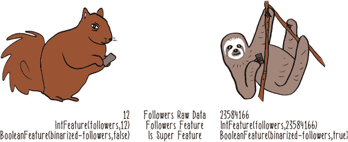

以下列表展示了如何实现这种二值化方法以生成超级 squawker 特征。

##### 列表 4.7\. 对数值特征进行二值化

```
case class IntFeature(name: String, value: Int) extends Feature {          *1*
  type V = Int                                                             *2*
}

case class BooleanFeature(name: String, value: Boolean) extends Feature {  *3*
  type V = Boolean                                                         *4*
}

def binarize(feature: IntFeature, threshold: Double): BooleanFeature = {   *5*
  BooleanFeature("binarized-" + feature.name, feature.value > threshold)   *6*
}

val SUPER_THRESHOLD = 1000000                                              *7*

val squirrelFollowers = 12                                                 *8*
val slothFollowers = 23584166

val squirrelFollowersFeature = IntFeature("followers", squirrelFollowers)  *9*
val slothFollowersFeature = IntFeature("followers", slothFollowers)

val squirrelIsSuper = binarize(squirrelFollowers, SUPER_THRESHOLD)         *10*
val slothIsSuper = binarize(slothFollowers, SUPER_THRESHOLD)               *11*
```

+   ***1* 表示数值特征的案例类，其中值是整数**

+   ***2* 指定这些是整数特征**

+   ***3* 表示布尔特征的案例类**

+   ***4* 指定这些是布尔特征**

+   ***5* 函数接受一个数值整数特征和阈值，并返回一个布尔特征**

+   ***6* 将转换函数的名称添加到生成的特征名称中**

+   ***7* 定义 squawker 成为超级 squawker 的截止值的常数**

+   ***8* 松鼠和树懒的原始追随者数量**

+   ***9* 表示追随者数量的数值整数特征**

+   ***10* 表示松鼠不是超级 squawker 的布尔特征**

+   ***11* 表示树懒是超级 squawker 的布尔特征**


`binarize`函数是一个很好的可重用转换函数的例子。它还通过将转换函数的名称附加到生成的特征上来确保生成的特征具有一定的自描述性。确保我们可以识别应用于生成特征的操作是我们将在后续章节中重新审视的想法。最后，请注意，转换函数`binarize`是一个纯函数。

在特征转换中仅使用纯函数是建立特征生成代码一致结构的重要部分。在代码库中分离特征提取和特征转换可能很困难，两者之间的边界可能很难划分。理想情况下，任何 I/O 或副作用操作都应包含在管道的特征提取阶段，所有转换功能都应作为纯函数实现。正如你稍后将会看到的，纯转换易于扩展，并且易于在特征和特征提取环境中（模型学习和预测）重用。

常用的转换函数范围非常广泛。与二值化类似，一些方法将连续值减少到离散标签。例如，一个旨在表达嘈杂声发布时间的特征可能不会使用完整的时间戳。相反，一个更有用的表示方法是将所有时间转换成有限标签集，如表 4.2 所示。

##### 表 4.2\. 将时间转换为时间标签

| 时间 | 标签 |
| --- | --- | --- |
| 7:02 | 早晨 |
| 12:53 | 中午 |
| 19:12 | 夜间 |

实现这种转换是微不足道的，并且自然是一个纯函数。

将连续数据减少到标签的一种另一种变体称为 *分箱（binning）*，其中源特征被减少到一些任意标签，这些标签由它所落入的值范围定义。例如，你可以取一个特定用户发出的嘈杂声的数量，并将其减少到三个标签之一，以指示嘈杂声的活跃程度，如表 4.3 所示。

##### 表 4.3\. 分箱

| 嘈杂声 | 标签 | 活跃程度 |
| --- | --- | --- |
| 7 | 0_99 | 最不活跃的嘈杂声发布者 |
| 1,204 | 1000_99999 | 中度活跃的嘈杂声发布者 |
| 2,344,910 | 1000000_UP | 最活跃的嘈杂声发布者 |

再次强调，这种转换的实现将是微不足道的，并且自然是一个纯函数。转换应该是容易编写的，并且应与数学符号中的公式紧密对应。在实现转换时，你应该始终遵守 KISS 原则：简单至上，Sparrow。在没有实现复杂的转换的情况下，实现反应式机器学习系统已经足够困难。通常，过长的转换实现是一个信号，表明有人放了一个臭鸡蛋。在少数特殊情况下，你可能想实现一个具有更复杂语义的转换器。我们将在本章和本书的后续部分考虑这种情况。

#### 4.3.2\. 转换概念

在我们离开转换主题之前，我们需要考虑一个非常常见且关键的特性转换类别：那些产生概念的转换。如第一章中所述，*概念*是机器学习模型试图预测的事物。尽管一些机器学习算法可以学习连续概念的模型，例如，在接下来的一个月内，特定用户将写多少次尖叫，但许多机器学习系统是构建来执行分类的。在*分类*问题中，学习算法试图学习一组离散的类别标签，而不是连续值。在这样的系统中，概念必须从原始数据中产生，在特征提取过程中，然后通过转换减少到类别标签。概念类别标签并不完全等同于特征，但通常差异只是我们如何使用数据片段的问题。通常，理想情况下，可能将特征二值化的相同代码也将概念二值化。

在列表 4.7 中的代码基础上，在下一个列表中，提取关于超级尖叫者的布尔特征，并生成一个布尔概念标签，将尖叫者分类为超级或非超级。

##### 列表 4.8\. 从特征创建概念标签

```
trait Label extends Feature                                               *1*

case class BooleanLabel(name: String, value: Boolean) extends Label {     *2*
  type V = Boolean
}

def toBooleanLabel(feature: BooleanFeature) = {                           *3*
  BooleanLabel(feature.name, feature.value)
}

val squirrelLabel = toBooleanLabel(squirrelIsSuper)                       *4*
val slothLabel = toBooleanLabel(slothIsSuper)

Seq(squirrelLabel, slothLabel).foreach(println)                           *5*
```

+   ***1* 将标签定义为特征的子类型**

+   ***2* 创建布尔标签的案例类**

+   ***3* 定义一个从布尔特征到布尔标签的简单转换函数**

+   ***4* 将超级尖叫者特征值转换为概念标签**

+   ***5* 打印标签值以供检查**

在此代码中，您已将概念标签定义为特征的特殊子类型。这并不是特征和标签通常讨论的方式，但在机器学习系统中进行代码重用时，这可能是一个有用的约定。无论您是否打算这样做，任何给定的特征值都可以用作概念标签，如果它代表要学习的概念类别。在列表 4.8 中的`Label`特性不会改变特征中的数据的基本结构，但它确实允许您在将特征用作概念标签时进行注释。其余的代码相当简单，您再次得出相同的结论：人们并不那么感兴趣，想知道松鼠有什么要说的。

### 4.4\. 选择特征

再次，您发现自己处于相同的情况：如果您到目前为止已经完成了所有工作，您现在可能已经完成了。您可以使用您已经生成的特征来学习模型。但有时在开始学习模型之前对特征进行额外的处理是值得的。在前两个特征生成阶段，您已经生成了您可能想要用于学习模型的全部特征，有时称为*特征集*。现在您有了这个特征集，您可以考虑将这些特征中的某些扔进垃圾桶。

从特征集中选择要使用的特征的过程称为 *特征选择*。在类型签名形式中，它可以表示为 `Set[Feature] => Set[Feature]`，这是一个函数，它接受一组特征并返回另一组特征。下一个列表显示了特征选择器的占位符实现。

##### 列表 4.9\. 特征选择器

```
def select(featureSet: Set[Feature]): Set[Feature] = ???
```


你为什么想要丢弃特征？它们不是有用且宝贵的吗？从理论上讲，一个健壮的机器学习算法可以接受包含任意数量特征的输入特征向量，并学习给定概念的模式。然而，在现实中，向机器学习算法提供过多的特征只会使它学习模型的时间更长，并可能降低该模型的表现。你可能会很容易地需要在特征之间进行选择。通过改变转换过程中使用的参数，你可以用很少的代码创建无限数量的特征。

使用现代分布式数据处理框架，如 Spark，可以轻松处理任意大小的数据集。在特征提取和转换阶段考虑大量特征肯定对你有益。一旦你生成了特征集中的所有特征，你可以使用 Spark 中的一些功能将特征集缩减到模型学习算法将用于学习模型的那些特征。其他机器学习库中也有特征选择功能的实现；Spark 的 MLlib 是许多选项之一，当然不是最老的一个。在某些情况下，MLlib 提供的特征选择功能可能不足以满足需求，但无论你使用库实现还是更定制的解决方案，特征选择的原理都是相同的。如果你最终编写了自己的特征选择版本，它仍然在概念上与 MLlib 的实现相似。

使用 Spark 功能将再次要求你放弃特征案例类和静态类型保证，以使用围绕高级 DataFrame API 实现的机器学习功能。首先，你需要构建一个包含训练实例的 `DataFrame`。这些实例将包括三个部分：一个任意标识符、一个特征向量和概念标签。以下列表显示了如何构建这个实例集合。你将不会使用真实特征，而是使用一些合成数据，你可以想象这些数据是关于 Squawkers 的各种属性。

##### 列表 4.10\. 实例的 DataFrame

```
val instances = Seq(                                           *1*
  (123, Vectors.dense(0.2, 0.3, 16.2, 1.1), 0.0),              *2*
  (456, Vectors.dense(0.1, 1.3, 11.3, 1.2), 1.0),
  (789, Vectors.dense(1.2, 0.8, 14.5, 0.5), 0.0)
)

val featuresName = "features"                                  *3*
val labelName = "isSuper"

val instancesDF = session.createDataFrame(instances)           *4*
  .toDF("id", featuresName, labelName)                         *5*
```

+   ***1* 定义实例集合**

+   ***2* 硬编码一些合成特征和概念标签数据**

+   ***3* 特征和标签列的名称**

+   ***4* 从实例集合创建 DataFrame**

+   ***5* 设置 DataFrame 中每列的名称**

一旦你有了实例的`DataFrame`，你就可以利用 MLlib 内置的特征选择功能。你可以应用卡方统计测试来对每个特征对概念标签的影响进行排序。这有时被称为*特征重要性*。在根据这一标准对特征进行排序后，可以丢弃影响较小的特征，然后再进行模型学习。下面的列表展示了如何从你的特征向量中选择两个最重要的特征。

##### 列表 4.11\. 基于卡方的特征选择

```
val selector = new ChiSqSelector()                             *1*
  .setNumTopFeatures(2)                                        *2*
  .setFeaturesCol(featuresName)                                *3*
  .setLabelCol(labelName)                                      *4*
  .setOutputCol("selectedFeatures")                            *5*

val selectedFeatures = selector.fit(instancesDF)               *6*
  .transform(instancesDF)                                      *7*

selectedFeatures.show()                                        *8*
```

+   ***1* 创建一个新的特征选择器**

+   ***2* 设置要保留的特征数量为 2**

+   ***3* 设置特征所在的列**

+   ***4* 设置概念标签所在的列**

+   ***5* 设置放置结果的列，即选定的特征**

+   ***6* 将卡方模型拟合到数据**

+   ***7* 选择最重要的特征并返回一个新的 DataFrame**

+   ***8* 打印结果 DataFrame 以供检查**

正如你所见，在库调用中提供标准特征选择功能使得特征选择变得非常方便。如果你不得不自己实现基于卡方的特征选择，你会发现实现代码比刚才写的代码要长得多。

### 4.5\. 结构化特征代码

在本章中，你已经编写了特征生成管道所有最常见组件的示例实现。正如你所见，其中一些组件很简单，很容易构建，你可能会发现自己在没有任何困难的情况下构建了很多。如果你保持了简单性，那么在系统中生产大量的特征提取、转换和选择功能不应该让你感到害怕。或者，你应该感到害怕吗？

在机器学习系统中，特征生成代码在某些度量上可能会成为代码库中最大的一部分。一个典型的 Scala 实现可能为每个提取和转换操作有一个类，随着类数量的增加，这会很快变得难以管理。为了防止特征生成代码变成一个包含各种任意操作的混乱集合，你需要开始在实现特征生成功能的结构中更多地融入你对特征生成语义的理解。下一节介绍了一种结构化你的特征生成代码的策略。

#### 4.5.1\. 特征生成器

在最基本层面上，你需要定义一个实现，即特征生成功能单元的实现。让我们称这个为*特征生成器*。特征生成器可以包括提取或提取和转换操作。提取和转换操作的实施可能与之前看到的没有太大区别，但这些操作都将封装在一个独立可执行的代码单元中，该单元生成一个特征。你的特征生成器将是能够接受原始数据并生成你想要用于学习模型的特征的东西。

让我们使用特质（trait）来实现你的特征生成器。在 Scala 中，*特质*用于以类型的形式定义行为。一个典型的特质将包括方法的签名和可能实现，这些方法定义了特质共有的行为。Scala 的特质与 Java、C++和 C#中的接口非常相似，但使用起来比这些语言的接口更容易、更灵活。

为了本节的目的，让我们假设你的原始数据，从你的特征生成系统角度来看，由鸣叫组成。特征生成将是将鸣叫转换为特征的过程。相应的特征生成器特质可以定义为。

##### 列表 4.12。一个特征生成器特质

```
trait Generator {

  def generate(squawk: Squawk): Feature

}
```

`Generator`特质定义了一个特征生成器为一个实现`generate`方法的对象，该方法接受一个鸣叫并返回一个特征。这是定义特征生成行为的一种具体方式。特征生成的给定实现可能需要所有 sorts 的其他功能，但这是所有特征生成实现中都会共有的部分。让我们看看这个特质的其中一个实现。

你的团队对了解鸣叫长度如何影响鸣叫受欢迎程度很感兴趣。有一种直觉认为，即使是 140 个字符对于一些鸣叫者来说也太多，比如蜂鸟。它们很快就感到无聊。相反，秃鹫被知会长时间盯着同一个鸣叫，因此对于它们来说，长篇帖子很少是问题。为了能够构建一个推荐模型，该模型可以向这些不同的受众展示相关内容，你需要将关于鸣叫长度的某些数据编码为特征。这可以很容易地使用`Generator`特质来实现。

如前所述，可以使用分箱技术来捕捉长度的概念，将你的数值数据减少到类别。72 个字符的鸣叫和 73 个字符的鸣叫之间没有太大区别；你只是在尝试捕捉鸣叫的大致大小。你将根据长度将鸣叫分为三类：短、中、长。你将在类别之间定义阈值，使其位于总可能长度的三分之一处。根据你的`Generator`特质实现，你将得到以下类似列表。

##### 列表 4.13\. 一个分类特征生成器

```
object SquawkLengthCategory extends Generator {                            *1*

  val ModerateSquawkThreshold = 47                                         *2*
  val LongSquawkThreshold = 94

  private def extract(squawk: Squawk): IntFeature = {                      *3*
    IntFeature("squawkLength", squawk.text.length)
  }

  private def transform(lengthFeature: IntFeature): IntFeature = {         *4*
    val squawkLengthCategory = lengthFeature match {                       *5*
      case IntFeature(_, length) if length < ModerateSquawkThreshold => 1  *6*
      case IntFeature(_, length) if length < LongSquawkThreshold => 2
      case _ => 3                                                          *7*
    }

    IntFeature("squawkLengthCategory", squawkLengthCategory)               *8*
  }

  def generate(squawk: Squawk): IntFeature = {                             *9*
    transform(extract(squawk))
  }
}
```

+   ***1* 定义一个生成器为一个扩展 Generator 特质的对象**

+   ***2* 用于比较的常量阈值**

+   ***3* 提取：使用叫声的长度来实例化一个 IntFeature**

+   ***4* 转换：接收长度的 IntFeature，返回类别的 IntFeature**

+   ***5* 使用模式匹配结构来确定叫声长度所属的类别**

+   ***6* 返回一个类别 Int（为了在模型学习中易于使用）**

+   ***7* 在所有其他情况下返回一个类别 3，一个长而尖锐的叫声**

+   ***8* 返回一个作为新 IntFeature 的类别**

+   ***9* 生成：从叫声中提取一个特征，然后将其转换为分类的 IntFeature**


这个生成器是以一个单例对象定义的。你不需要使用类的实例，因为所有的生成操作本身都是纯函数。

在你的特征生成器实现内部，你仍然使用了提取和转换的概念，尽管你现在只公开了一个`generate`方法作为此对象的公共 API。尽管这可能并不总是必要的，但使用基于特征的类型签名以一致的方式定义所有提取和转换操作可能是有帮助的。这可以使代码的组合和重用更容易。

代码重用是特征生成功能中的一个重大问题。在给定的系统中，许多特征生成器将执行非常相似的操作。

如果将一个转换因子化并使其可重用，它可能被使用数十次。如果你一开始没有考虑这样的问题，你可能会发现你的团队在特征生成代码库中微妙地以不同的方式重复实现了某些转换，比如平均五次。这可能导致棘手的错误和臃肿的代码。

你不希望你的特征生成代码比满树松鼠还要混乱！让我们更仔细地看看你的生成器功能结构。在列表 4.13 中的`transform`函数正在做你可能在代码库中经常做的事情：根据某个阈值进行分类。让我们再看一遍。

##### 列表 4.14\. 使用模式匹配进行分类

```
private def transform(lengthFeature: IntFeature): IntFeature = {
  val squawkLengthCategory = lengthFeature match {
    case IntFeature(_, length) if length < ModerateSquawkThreshold => 1
    case IntFeature(_, length) if length < LongSquawkThreshold => 2
    case _ => 3
  }
```

你绝对不应该多次实现比较阈值，所以让我们找到一种方法来提取这段代码并使其可重用。而且，你不得不自己定义类标签整数也很奇怪。理想情况下，你只需担心你的阈值，而无需担心其他任何事情。

让我们提取这段代码的公共部分以供重用，并在过程中使其更通用。下一段列表中的代码展示了这样做的一种方法。它有点密集，所以我们将详细地解释它。

##### 列表 4.15\. 广义分类

```
object CategoricalTransforms {                                   *1*

  def categorize(thresholds: List[Int]): (Int) => Int = {        *2*
    (dataPoint: Int) => {                                        *3*
      thresholds.sorted                                          *4*
        .zipWithIndex                                            *5*
        .find {                                                  *6*
        case (threshold, i) => dataPoint < threshold             *7*
      }.getOrElse((None, -1))                                    *8*
        ._2                                                      *9*
    }
  }
}
```

+   ***1* 单例对象来保存一个纯函数**

+   ***2* 只接受一个阈值列表作为输入**

+   ***3* 返回一个匿名分类函数，它接受 Int 作为参数**

+   ***4* 确保阈值列表是有序的，因为分类依赖于它**

+   ***5* 将一系列阈值和相应的索引（用作类别标签）组合在一起**

+   ***6* 找到一个满足情况子句谓词的条目**

+   ***7* 定义通过的情况为数据点小于阈值**

+   ***8* 从选项中获取匹配的值，或者在匹配失败时返回一个哨兵值 –1**

+   ***9* 从元组中取出第二个元素，即类别标签（以整数形式）**

这个解决方案使用了一些你可能之前没有见过的技术。首先，这个函数的返回类型是 `(Int) => Int`，这是一个接受一个整数并返回一个整数的函数。在这种情况下，返回的函数将根据之前提供的阈值对给定的整数进行分类。

阈值和类别也被组合在一起，以便它们可以作为一对相关值（以元组的形式）进行操作。*组合*，或者有时被称为*卷积*，是一种在 Scala 和其他函数式编程传统语言中常用的强大技术。*zip* 这个名字来源于与拉链动作的相似性。在这种情况下，你使用一种特殊的 zip 操作，它方便地为你提供与正在 zip 的集合中的元素数量相对应的索引。这种生成索引的方法比在其他语言（如 Java 和 C++）中看到的 C 风格迭代使用可变计数器的方法要优雅得多。

在对值进行 zip 操作之后，你使用另一个新函数 `find`，你可以用 *谓词* 来定义你正在寻找的集合中的元素。谓词是布尔函数，根据它们的值可以是真或假。它们在数学、逻辑以及各种形式的编程（如逻辑和函数式编程）中常用。在这个用法中，谓词为你提供了定义构成落入类别桶的清晰语法。

这段代码还以你之前没有见过的处理方式处理外部使用中的不确定性。具体来说，它对类别进行排序，因为它们可能不是按顺序提供的，但你的算法依赖于按顺序操作它们。此外，`find` 函数返回一个 `Option`，因为 `find` 操作可能找到或不找到匹配的值。在这种情况下，你使用值 `–1` 来表示不可用的类别，但如何处理分类失败在很大程度上取决于客户端生成代码中的功能如何集成。当你将常见的特征转换提取到共享函数（如这个函数）中时，你应该考虑到转换未来广泛使用的可能性。通过实施这些额外的保证，你减少了将来有人使用你的分类功能却得不到他们想要的结果的可能性。

列表 4.15 中的代码可能比 列表 4.13 和 4.14 中的原始实现更难理解。您重构的版本做了更多工作，为您提供了一个更通用和健壮的分类版本。您可能不会期望每个特征生成器的实现者都会为这样一个简单的转换做这么多工作，但因为你已经将这个功能分解为共享的可重用代码，他们不必这样做。现在，任何需要根据一系列阈值对值进行分类的特征生成功能都可以调用这个函数。列表 4.13 和 4.14 中的转换现在可以用 列表 4.16 中的非常简单的版本替换。您仍然有一个相对复杂的分类实现 列表 4.15，但现在，这个复杂的实现已经被分解到一个单独的组件中，这个组件更通用和可重用。正如您在下一条列表中可以看到的，该功能的调用者，如这个转换函数，可以相当简单。

##### 列表 4.16\. 重构的分类转换

```
import CategoricalTransforms.categorize

private def transform(lengthFeature: IntFeature): IntFeature = {
  val squawkLengthCategory = categorize(Thresholds)
   (lengthFeature.value)                                           *1*
  IntFeature("squawkLengthCategory", squawkLengthCategory)
}
```

+   ***1* 创建分类函数并将其应用于分类值**

一旦您有数十个分类特征，这种设计策略将使您的生活变得更加容易。现在，分类简单到可以插入，如果您决定更改实现方式，也容易重构。

#### 4.5.2\. 特征集组成

您已经看到了如何从您产生的特征中选择，但实际上在某些机器学习系统中有一个必要的零步。在您开始特征生成过程之前，您可能想要选择应该执行哪些特征生成器。不同的模型需要提供不同的特征。此外，有时您需要根据业务规则、隐私问题或法律原因对您的数据正常使用应用特定的覆盖。

在 Pidg’n 的情况下，由于您的全球规模，您面临一些独特的挑战。不同地区有不同的监管制度来管理其公民数据的用途。最近，巴拿马的雨林中出现了一个新政府。

新任商业部长，一只不屈不挠的毒箭蛙，宣布了一项新规定，限制将社交媒体用户数据用于非雨林目的。在与您的律师协商后，您决定新法律意味着使用雨林用户数据的特性应仅用于应用于雨林居民推荐模型的上下文中。

让我们看看这个变化可能对您的代码库产生什么影响。为了使事情更加简洁，让我们定义一个简单的特性，以便您快速创建简化的生成器。这将是一个辅助工具，允许您跳过与特征集组成无关的生成器实现细节。下一个列表定义了一个存根特征生成器，它返回随机整数。

##### 列表 4.17\. 存根特征生成器特性

```
trait StubGenerator extends Generator {
  def generate(squawk: Squawk) = {                        *1*
    IntFeature("dummyFeature", Random.nextInt())          *2*
  }
}
```

+   ***1* 特性实现者的 generate 方法实现**

+   ***2* 返回随机整数**

使用这个简单的辅助特性，您现在可以探索雨林数据使用规则可能对您的特征生成代码产生的一些可能影响。假设负责组装您的特征生成器的代码如下所示。

##### 列表 4.18\. 初始特征集组成

```
object SquawkLanguage extends StubGenerator {}                   *1*

object HasImage extends StubGenerator {}                         *2*

object UserData extends StubGenerator {}                         *3*

val featureGenerators = Set(SquawkLanguage, HasImage, UserData)  *4*
```

+   ***1* 关于哨声编写语言的正常特征生成器**

+   ***2* 关于哨声是否包含图像的正常特征生成器**

+   ***3* 必须更改的用户数据特征生成器**

+   ***4* 需要执行以生成数据的所有特征生成器集**

现在，您需要重构此代码，以便为您的正常、全局模型生成一个特征集，并为您的雨林模型生成一个特征集，如图 4.3 所示。以下列表显示了定义这两个不同特征生成器集的方法。

##### 图 4.3\. 多个特征生成器集

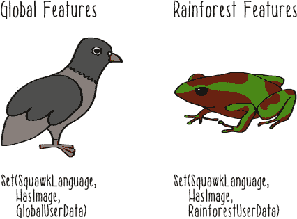

##### 列表 4.19\. 多个特征集

```
object GlobalUserData extends StubGenerator {}                          *1*

object RainforestUserData extends StubGenerator {}                      *2*

val globalFeatureGenerators = Set(SquawkLanguage, HasImage,
 GlobalUserData)                                                      *3*

val rainforestFeatureGenerators = Set(SquawkLanguage, HasImage,
 RainforestUserData)                                                  *4*
```

+   ***1* 仅访问非雨林数据的用户数据特征生成器**

+   ***2* 仅访问雨林数据的用户数据特征生成器**

+   ***3* 可用于全局模型上的特征集**

+   ***4* 可用于雨林模型上的特征集**

如果您选择停止此实现，也可以。只要雨林特征生成器用于雨林模型，您就完成了青蛙的要求。但是，继续解决这个问题有原因。机器学习系统的实现非常复杂。常见的特征生成功能可以在各种地方重用。在列表 4.19 中的实现是正确的，但随着 Pidg’n 的快速增长，不熟悉此数据使用问题的新的工程师可能会以这种方式重构此代码，从而误用雨林特征数据。

让我们看看您是否可以通过定义一个特性来标记代码中包含雨林用户数据，从而使误用此数据变得更加困难。

##### 列表 4.20\. 确保正确使用雨林数据

```
trait
   RainforestData {                                            *1*
  self =>                                                        *2*
  require(rainforestContext(),                                   *3*
    s"${self.getClass} uses rainforest data outside of a
     rainforest context.")                                     *4*

  private def rainforestContext() = {                            *5*
    val environment = Option(System.getenv("RAINFOREST"))        *6*
    environment.isDefined && environment.get.toBoolean           *7*
  }
}

object SafeRainforestUserData extends StubGenerator
 with RainforestData {}                                        *8*

val safeRainforestFeatureGenerators = Set(SquawkLanguage,
 HasImage, SafeRainforestUserData)                             *9*
```

+   ***1* 定义了雨林数据使用的特性**

+   ***2* 表示此特性的所有实例都必须执行以下代码**

+   ***3* 需要雨林环境验证通过**

+   ***4* 如果不在雨林环境中，则打印一条解释不允许使用的消息**

+   ***5* 验证方法确保代码在雨林环境中被调用**

+   ***6* 获取雨林环境变量**

+   ***7* 检查值是否存在且为真**

+   ***8* 为雨林用户数据定义一个特征生成器**

+   ***9* 组装用于雨林数据的特征生成器**

如果你没有明确定义环境变量 `RAINFOREST` 并将其设置为 `TRUE`，此代码将抛出异常。如果你想看到这个开关的作用，如果你使用 macOS 或 Linux，你可以在终端窗口中导出该变量。

##### 列表 4.21\. 导出环境变量

```
export RAINFOREST=TRUE
```

然后，你可以在相同的终端窗口中再次执行列表 4.20 中的代码，而不会出现异常。这类似于你如何在生产特征生成作业中使用它。通过配置、构建或作业编排功能中的任何几种不同机制，你可以确保这个变量为雨林特征生成作业正确设置，而不是为全局特征生成作业设置。一个创建新特征生成作业的新工程师可能没有理由设置这个变量。如果那位工程师误用了雨林特征生成器，那么这种误用将在作业以任何形式执行时立即显现。

| |
| --- |

**配置**

使用环境变量是配置您机器学习系统组件的多种不同方法之一。它的优点是易于入门且广泛支持。

随着你的机器学习系统复杂性增加，你将想要确保你有一个周全的计划来处理配置。毕竟，作为配置设置的机器学习系统的属性可以决定很多关于它是否在面对错误或负载变化时保持响应的问题。第三部分本书讨论了这些问题中的大多数，其中我们考虑了操作机器学习系统的挑战。好消息是，你将发现来自 Scala 和大数据生态系统的许多多功能工具，这些工具将帮助你驯服处理配置的一些复杂性。

| |
| --- |

### 4.6\. 应用

你可能不是一种树栖动物，甚至可能没有运营一个微博服务。但如果你在做机器学习，你可能在某个时候构建特征。

在广告系统中，你可以构建捕捉用户与各种类型产品过去互动的特征。如果一个用户整个下午都在看不同的笔记本电脑，你可能想展示给他一台笔记本电脑或可能是一个外壳的广告，但一件毛衣的广告可能就没有太多意义。关于用户查看过哪些类型产品的这个特征将帮助机器学习模型弄清楚这一点，并做出正确的推荐。

在一个政治民意调查组织中，你可以构建与不同选民人口统计相关的特征。像平均收入、教育和家庭房产价值这样的东西可以编码到关于选区的特征中。然后，这些特征可以用来学习关于哪个政党给定的选区可能投票的模型。

特征的应用与机器学习作为技术的方法的应用一样无限。它们允许你以模型学习算法可以使用的方式编码关于问题的人类智能。机器学习系统不是执行魔术的黑色盒子系统。你，作为系统开发者，是指导它如何解决问题的那个人，而特征是你编码这些信息的重要组成部分。

### 4.7. 反应性


本章涵盖了大量的内容，但如果你仍然想了解更多关于特征的知识，肯定还有更多可以探索。以下是一些反应性，可以带你更深入地了解特征的世界：

+   *实现两个或更多的自定义特征提取器*。为此，你可能需要选择某种类型的基数据集来工作。如果你手头没有有意义的东西，你通常可以使用文本文件，然后从文本中提取特征。Spark 内置了一些基本的文本处理功能，这可能对你有帮助。或者，随机数字组织成表格数据也可以用于此类活动。如果你确实想使用真实数据，UCI 机器学习仓库[`archive.ics.uci.edu/ml/index.php`](https://archive.ics.uci.edu/ml/index.php)是数据集的最佳来源之一。无论你使用什么数据，关键是你自己决定可能对数据集应用的一些有趣的转换。

+   *实现特征选择功能*。使用你在前面的反应性（或某些其他提取器）中创建的特征提取器，为包含或排除最终输出中的给定特征定义一些基础。这可能包括以下标准：

    +   非零值的比例。

    +   独特值的数量。

    +   外部定义的业务规则/政策。目标是确保你特征提取功能产生的实例只包含你定义为有效的特征。

+   *评估现有特征提取管道的反应性*。如果你完成了前面的两个练习，你可以评估自己的实现。或者，你可以检查来自像 Spark 这样的开源项目的示例。在检查特征提取管道时，你可以问自己以下问题：

    +   我能找到特征转换函数吗？它是作为纯函数实现的，还是有某种副作用？我能否轻松地在其他特征提取器中重用这个转换？

    +   如何处理不良输入？是否会向用户返回错误？

    +   当管道需要处理成千上万条记录时，它会如何表现？一百万条？十亿条？

    +   我能从持久化的输出中辨别出关于特征提取器的哪些信息？我能否确定特征是在何时被提取的？使用的是哪些特征提取器？

    +   我如何使用这些特征提取器对新实例的未见数据做出预测？

### 摘要

+   就像小鸡破壳而出，进入真实鸟类的世界一样，特征是我们进入将智能构建到机器学习系统过程中的切入点。尽管它们并未总是得到应有的关注，但特征是机器学习系统中的一个庞大且关键的部分。

+   开始编写特征生成功能很容易。但这并不意味着你的特征生成管道应该用低于你在实时预测应用中应用的同样严谨性来实现。特征生成管道可以是并且应该是符合所有反应特性的优秀应用。

+   特征提取是将原始数据转换为具有语义意义的派生表示的过程。

+   特征可以通过各种方式转换，使其更容易学习。

+   你可以从所有你拥有的特征中选择，使模型学习过程更容易、更成功。

+   特征提取器和转换器应该具有良好的结构，以便于组合和重用。

+   特征生成管道应该组装成一系列不可变的转换（纯函数），这些转换可以轻松序列化和重用。

+   依赖于外部资源的特征应该具有容错性。

我们在特征方面还没有完成。在第五章中，你将在模型学习中使用特征。在第六章中，你将在对未见数据进行预测时生成特征。除此之外，在本书的第三部分中，我们将探讨生成和使用特征的更高级方面。

## 第五章\. 学习模型

*本章涵盖*

+   实现模型学习算法

+   使用 Spark 的模型学习功能

+   处理第三方代码

在我们穿越机器学习系统阶段的旅程中继续前进，我们现在到达了模型学习阶段（见图 5.1）。你可以将这部分想象成你很小的时候仰望黑暗的天空，并基于过去的经验决定，它可能真的会下雨。你学到的模型是*乌云带来降雨*。尽管你可能记得不是很清楚，但你通过推理你过去对阴暗和晴朗的日子以及你是否被雨淋到的经验，得出了这个模型。

##### 图 5.1\. 机器学习的阶段

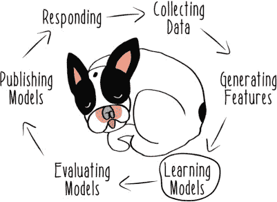

你通过推理过去经历来开发一个可以应用于未来情境的模型的过程，这与我们在机器学习系统的模型学习阶段所做的工作类似。正如我在第一章中定义的，机器学习是从数据中学习，而这个步骤就是我们进行学习的阶段。我们将运行一个模型学习算法来处理我们的特征，从而生成一个模型。在机器学习系统的背景下，一个*模型*是编码特征到概念映射的方式。它是一种将训练实例中的所有信息进行归纳的方法。

从软件的角度来说，一个模型是一个实例化的程序，它可以现在在调用特征时返回预测。这个定义在下面的列表中展示了其简化的实现。

##### 列表 5.1. 一个简化的模型

```
class Model(features: List[Instance]) {                 *1*

  def predict(features: Set[Feature]): Label = ???      *2*

}
```

+   **1** 使用实例列表（特征和概念标签）实例化模型

+   **2** 当给定新的特征集时预测标签

模型学习算法的实现当然比这个简化的实现要复杂得多，但从软件的角度来看，这就是我们正在做的所有事情。在实例化新模型的过程中可能存在极其复杂的算法，我将在本章中讨论其中的一些。但模型学习算法如何从数据中学习是一个巨大的主题，也是无数其他书籍的焦点。因此，我将尽力涵盖足够的内容，以便你能够理解模型学习算法做什么。

然后，我们将做大多数工程师在实现机器学习系统时所做的事情：调用标准库中常见模型学习算法的实现。Spark 在它的机器学习库 MLlib 中提供了一些用于学习模型的有用功能。我们将基于第四章中我们对 MLlib 的使用，将我们的管道一直扩展到学习模型。

MLlib 不是世界上唯一的机器学习库，因此我们还将花时间探索如何使用那些不容易从用 Scala 编写的 Spark 管道中使用的库。这是数据团队必须经常面对的常见但具有挑战性的问题，我们将探讨一些减少相关痛苦的方法。

能够从数据中学习模型是一种令人难以置信的能力。这是计算机科学史上最重大的成就之一。这就是为什么，在本章中，我们将将其用于一个崇高的目标：寻找爱情。

### 5.1. 实现学习算法

Timber 是一个专为熊设计的移动约会应用。单身男性和雌性熊可以在 Timber 的资料上发布他们的照片。然后他们可以看到应用推荐给他们的其他单身熊的照片。如果熊喜欢看到的东西，它就会在该熊的照片上向右滑动。

在所有这些毛茸茸的浪漫背后，是一个由 Timber 的数据科学团队构建的复杂推荐模型。本章将随着你开始构建这个模型而展开。团队的目标是预测哪些熊会相互喜欢，以便 Timber 应用可以向用户做出推荐。只有当两只熊互相右滑时，它们才会连接，因此对于应用的健康来说，用户不断被介绍给想要见面的新熊至关重要。

当两只熊相互喜欢并且都右滑，表示他们想要见面时，你的 Timber 数据科学团队称之为*匹配*。团队计划将所有可能的活跃用户对通过模型运行，并预测哪些可能是匹配的。只有预测为匹配的（配对）用户才会被展示给用户。

要开始构建他们的模型，你的团队只有关于他们的用户是谁以及哪些用户最终匹配的历史数据。他们决定将预测哪些熊会匹配的问题框架为一个二元分类问题。是否匹配将作为类别标签使用。所有关于用户的数据都将用于构建特征。

正如你在第四章中看到的，构建特征可能是一个非常复杂的过程。Timber 团队决定从围绕用户相似性构建特征开始。当一只熊在 Timber 上注册时，他们回答各种问题以填写他们在应用上的个人资料：

+   你最喜欢的食物是什么？

+   你喜欢外出还是更喜欢洞穴生活？

+   你将来想要有小熊吗？

在他们特征生成功能的第一版中，你的团队比较了每一对用户的答案，以产生表示他们的答案是否相同的特征。例如，如果两只熊都回答说他们的最爱食物是三文鱼，那么这将记录为一个`true`特征值，但如果一只熊喜欢三文鱼而另一只熊喜欢浆果，那么这将记录为一个`false`特征值。这产生了类似于表 5.1 中所示的一些实例，其中使用 0 表示假，1 表示真。

##### 表 5.1\. 相似性实例

| Favorite food | Go out | Cubs | Match |
| --- | --- | --- | --- |
| 1 | 0 | 0 | 0 |
| 1 | 1 | 1 | 1 |
| 0 | 1 | 1 | 1 |
| 0 | 1 | 0 | 0 |
| 1 | 1 | 1 | 0 |

使用这样的相似性数据，你可以执行各种临时的分析和制定手动规则。但 Timber 拥有大量用户，并且发展迅速。它需要一个自动化的系统来大规模地推理这些数据。

#### 5.1.1\. 贝叶斯建模

在他们模型学习系统的第一次实现中，团队使用了一种称为*朴素贝叶斯*的技术。在我们深入探讨朴素贝叶斯是如何工作以及如何实现它之前，我们需要了解*贝叶斯定理*，它是朴素贝叶斯技术的基石。贝叶斯定理是某些形式统计学中使用的基石技术。

为了理解贝叶斯定理，让我们进一步简化你的数据。假设你只知道两只熊是否分享了相同的喜爱食物，以及它们是否匹配。那么你的团队可以讨论两只熊如果分享了相同的喜爱食物，它们匹配的概率。

以下列表介绍了一些符号，以讨论在这种情况下如何使用贝叶斯定理。

##### 列表 5.2\. 贝叶斯定理的符号

```
F                                     *1*
M                                     *2*
P(F|M)                                *3*
P(M|F)                                *4*
P(M|F) = P(F|M)*P(M)÷P(F)             *5*
```

+   ***1* 相同喜爱食物的符号**

+   ***2* 应用程序中匹配的符号**

+   ***3* 在匹配的情况下拥有相同喜爱食物的概率**

+   ***4* 在两只熊有相同的喜爱食物的情况下匹配的概率**

+   ***5* 这个概率的计算方法**

贝叶斯定理表明，这个概率可以按照以下方式计算：`P(F| M)*P(M)÷P(F)`，即在它们匹配的情况下拥有相同喜爱食物的概率，乘以匹配的概率，除以拥有相同喜爱食物的概率。

使用 表 5.1 中的数据，你可以计算出这些值。

##### 列表 5.3\. 贝叶斯定理的应用计算

```
2/5 = 0.4                             *1*
3/5 = 0.6                             *2*
1/2 = 0.5                             *3*
0.5 * 0.4 ÷ 0.6 = 0.33                *4*
```

+   ***1* 该数据集中匹配的概率**

+   ***2* 拥有相同喜爱食物的概率**

+   ***3* 在匹配的情况下拥有相同喜爱食物的概率**

+   ***4* 在两只熊分享了相同的喜爱食物的情况下匹配的概率**

这个计算结果是在两只熊分享了相同的喜爱食物的情况下，匹配的概率为 1/3。

贝叶斯定理可以通过朴素贝叶斯技术推广到许多不同的特征。让我们用 `G` 来表示两只熊更喜欢出去还是待在洞穴里，用 `C` 来表示是否同意生小熊。让我们还用 `V` 来指代特征值的特定组合。这意味着要提供一个方式来讨论喜欢相同食物并且都喜欢出去，但不同意养小熊的概率（`true, true, false`）与所有事情都同意的熊（`true, true, true`）是不同的。

使用这种符号后，你现在可以使用贝叶斯定理，将你团队的所有原始特征作为 `P(F|M)*P(G|M)*P(C|M)*P(M)÷P(V)` 来使用。通过将所有概率相乘，你可以得到给定所有特征值的匹配概率。


**独立性**

在统计学上，通常**不**成立假设你可以将所有这些概率相乘。这样做假设每个特征值的概率是相互独立的——它们永远不会一起变化。这就是为什么这种技术被称为**朴素**，因为它没有考虑到特征之间可能存在依赖性的可能性。尽管有这个限制，朴素贝叶斯已经被实证证明是一种有用的技术。


表 5.2 展示了基于你的数据集的所有这些概率。

##### 表 5.2\. 概率

| 术语 | 分数 | 概率 |
| --- | --- | --- |
| P(F | M) | 1/2 | 0.5 |
| P(G | M) | 2/2 | 1.0 |
| P(C | M) | 2/2 | 1.0 |
| P(M) | 2/5 | 0.4 |

为了能够计算给定特征值组合的概率 `P(V)`，你必须尝试在数据上预测。

假设你正在尝试计算 Ping，一只熊猫，和 Greg，一只灰熊，是否会匹配（图 5.2）。他们在食物或是否希望将来有幼崽的问题上意见不一致，但他们都是洞穴生物，不喜欢外出。数据表明这两个人在 Timber 上很可能匹配吗？

##### 图 5.2\. 木材剖面屏幕


在这种情况下，`P(V)` 是 0.2、0.1 和 0.2 的总和，即 0.5。现在你可以评估贝叶斯定理。将 表 5.2 中的值代入，你得到 `0.5 * 1.0 * 1.0 * 0.4 / (0.2 + 0.1 + 0.2) = 0.4`。贝叶斯定理对这两个人可能会相互吸引持适度信心，因此应用可能会根据他们其他候选匹配的分数向他们推荐对方。

#### 5.1.2\. 实现朴素贝叶斯

现在你已经看到了朴素贝叶斯是如何工作的，让我们看看你如何实现它，以便它可以作为 Timber 的生产模型学习流程的一部分运行。首先，你需要构建一些训练实例来训练你的模型。你将基于你在第四章中学到的处理特征的技术，并扩展那段代码。以下列表显示了你在之前用来管理特征和标签的一些类型，以及将它们组合成实例的方法。

##### 列表 5.4\. 特征、标签和实例

```
trait FeatureType[V] {                                                        *1*
  val name: String
}

trait Feature[V] extends FeatureType[V] {                                     *2*
  val value: V
}

trait Label[V] extends Feature[V]                                             *3*

case class BooleanFeature(name: String, value: Boolean) extends
 Feature[Boolean]                                                           *4*

case class BooleanLabel(name: String, value: Boolean) extends Label[Boolean]  *5*

case class BooleanInstance(features: Set[BooleanFeature], label: BooleanLabel)*6*
```

+   ***1* 来自第四章的特征类型实现，需要一个类型和一个名称**

+   ***2* 之前的特征实现，需要一个给定类型的值**

+   ***3* 之前的标签实现，将类标签定义为特殊类型的特征**

+   ***4* 定义布尔特征**

+   ***5* 定义布尔标签**

+   ***6* 定义布尔实例以包含布尔特征的集合和布尔标签**

这一切都是对第四章的复习。有了这些类型，你将能够设置你的模型学习算法，以实例的形式推理特征和标签。

现在你可以实现朴素贝叶斯模型了。首先，你将假设你可以使用一些训练实例的列表来初始化你的实现。列表 5.5 创建了一个简单的训练实例，让你开始编写处理实例的代码。你很快会将这个参数提取出来，但这个数据集的固定版本将允许你开始编写处理实例的代码。

##### 列表 5.5\. 训练实例

```
val instances = List(BooleanInstance(               *1*
    Set(BooleanFeature("food", true),               *2*
      BooleanFeature("goOut", true),
      BooleanFeature("cubs", true)),
    BooleanLabel("match", true)))                   *3*
```

+   ***1* 创建一个只包含单个实例的列表**

+   ***2* 创建一组所有特征**

+   ***3* 创建一个标签值**

然后，你将在训练集中操作具有 `true` 标签的实例，并计算 `P(M)`，匹配的整体概率。

##### 列表 5.6\. 正面训练实例

```
val trueInstances = instances.filter(i => i.label.value)                 *1*
val probabilityTrue = trueInstances.size.toDouble / instances.size       *2*
```

+   ***1* 过滤实例，仅保留具有真实类标签的实例**

+   ***2* 计算匹配的整体概率 P(M)**

然后你可以构建每个给定特征的概率，给定一个匹配（例如，`P(F|M)`，即一对匹配的情侣有相同最喜欢的食物的概率）。因为你可能有任意数量的特征，所以首先构建所有特征的唯一集合，然后为找到的每个特征生成概率。

##### 列表 5.7\. 特征概率

```
val featureTypes = instances.flatMap(i => i.features.map(f => f.name)).toSet *1*

val featureProbabilities = featureTypes.toList.map {                         *2*
  featureType =>
    trueInstances.map { i =>                                                 *3*
      i.features.filter { f =>                                               *4*
        f.name equals featureType
      }.count {                                                              *5*
        f => f.value
      }
    }.sum.toDouble / trueInstances.size                                      *6*
}
```

+   ***1* 构建训练集中所有唯一特征类型的集合**

+   ***2* 遍历所有不同的特征类型**

+   ***3* 对于每个特征，遍历所有具有真实类标签的实例**

+   ***4* 使用过滤器通过名称匹配当前特征**

+   ***5* 如果特征值为真，则计算特征值**

+   ***6* 将所有正例相加，除以真实实例总数**

现在你已经计算了方程分子中的所有项，你可以计算整个分子。下面的列表使用乘法`*`作为高阶函数，在乘以`P(M)`，即匹配的概率之前，对特征概率列表进行归约。

##### 列表 5.8\. 分子

```
val numerator = featureProbabilities.reduceLeft(_ * _) * probabilityTrue
```

现在，你只需要能够计算`P(V)`，即给定特征向量的概率。下面的列表显示了执行该计算的一个简单函数，用于任意一组特征。

##### 列表 5.9\. 特征向量

```
def probabilityFeatureVector(features: Set[BooleanFeature]) = {
  val matchingInstances = instances.count(i => i.features == features)    *1*
  matchingInstances.toDouble / instances.size                             *2*
}
```

+   ***1* 计算具有匹配特征值的实例数量**

+   ***2* 将匹配实例的数量除以实例总数以获得 P(V)**

现在所有部件都已就绪，编写`predict`函数就很简单了。给定一个新的特征向量，计算分母，然后除以分子。

##### 列表 5.10\. 预测函数

```
def predict(features: Set[BooleanFeature]) = {
  numerator / probabilityFeatureVector(features)        *1*
}
```

+   ***1* 通过将给定实例的预计算分子除以分母来计算概率**

作为最后的重构，让我们将这些代码放入一个类中，并在构造时传递实例。下面的列表显示了之前的所有建模代码，重构为一个类。

##### 列表 5.11\. 简单贝叶斯模型

```
class NaiveBayesModel(instances: List[BooleanInstance]) {                 *1*

  val trueInstances = instances.filter(i => i.label.value)
  val probabilityTrue = trueInstances.size.toDouble / instances.size

  val featureTypes = instances.flatMap(i => i.features.map(f => f.name)).toSet

  val featureProbabilities = featureTypes.toList.map {
    featureType =>
      trueInstances.map { i =>
        i.features.filter { f =>
          f.name equals featureType
        }.count {
          f => f.value
        }
      }.sum.toDouble / trueInstances.size
  }

  val numerator = featureProbabilities.reduceLeft(_ * _) * probabilityTrue

  def probabilityFeatureVector(features: Set[BooleanFeature]) = {
    val matchingInstances = instances.count(i => i.features == features)
    matchingInstances.toDouble / instances.size
  }

  def predict(features: Set[BooleanFeature]) = {
    numerator / probabilityFeatureVector(features)
  }

}
```

+   ***1* 使用训练实例实例化模型**

此实现对于预测新特征向量时不需要做太多工作。作为类实例化的部分，模型已经得到了有效训练，并且模型参数、各种概率现在被保存在给定模型实例的内部状态中。

你可以通过编写一个简单的测试来尝试这段代码。

##### 列表 5.12\. 测试简单贝叶斯模型

```
test("It can learn a model and predict") {                               *1*
  val trainingInstances = List(                                          *2*
    BooleanInstance(
      Set(BooleanFeature("food", true),
        BooleanFeature("goOut", true),
        BooleanFeature("cubs", true)),
      BooleanLabel("match", true)),
    BooleanInstance(
      Set(BooleanFeature("food", true),
        BooleanFeature("goOut", true),
        BooleanFeature("cubs", false)),
      BooleanLabel("match", false)),
    BooleanInstance(
      Set(BooleanFeature("food", true),
        BooleanFeature("goOut", true),
        BooleanFeature("cubs", false)),
      BooleanLabel("match", false)))

    val testFeatureVector = Set(BooleanFeature("food", true),            *3*
        BooleanFeature("goOut", true),
        BooleanFeature("cubs", false))

    val model = new NaiveBayesModel(trainingInstances)                   *4*

    val prediction = model.predict(testFeatureVector)                    *5*

    assert(prediction == 0.5)                                            *6*
}
```

+   ***1* 设置模型学习和预测的测试**

+   ***2* 创建一些训练实例以学习模型**

+   ***3* 创建一个测试特征向量进行预测**

+   ***4* 实例化一个类，从而训练模型**

+   ***5* 在测试特征向量上进行预测**

+   ***6* 断言结果为 0.5**

这种实现很好地代表了你在手工操作之前所经历的数学过程。Timber 数据科学团队花了一些时间才弄清楚这个实现。尽管它确实可以预测匹配，但这种实现并不完美。首先，它只能处理布尔特征值和布尔标签。它也不处理诸如现在尝试预测的训练实例中找不到精确特征向量等问题。

对于这种数据分析方法，有很多值得喜欢的地方。通过将朴素贝叶斯的数学实现为可运行的代码，你可以运行它，处理尽可能多的训练实例和特征，只要你的服务器能够处理。当然，这种实现的方法是一致的，与任何临时、手动分析的方法形成对比。这种实现的另一个优点是它是可验证的——你可以编写更多的测试来证明这种实现是正确的。

我希望你们同意，使用机器学习来构建推荐模型有很多好处。当然，你可以更进一步。朴素贝叶斯只是一个算法；没有理由相信它是这个问题的最佳算法。如果你想探索更多的学习算法（我希望你确实如此！），你可能不想自己实现它们所有。没有必要从头开始构建一切。像 Spark 和 MLlib 这样的工具有很多功能，你可以使用它们来进一步探索模型学习算法。

### 5.2\. 使用 MLlib

在第二章和第四章中，你通过 MLlib，Spark 的机器学习库，体验了 Spark 的机器学习功能。它具有广泛的机器学习功能，可以帮助你探索各种建模技术。


例如，MLlib 已经有一个非常强大和复杂的朴素贝叶斯实现。也许最重要的是，你可以使用 Spark 的弹性能力在任意大小的数据集上训练 MLlib 的朴素贝叶斯实现。上一节中比较简单的实现仅限于在单个服务器上运行的单一 Java 进程。

工程师们通常很兴奋地将传统的模型学习实现迁移到 Spark 实现。代码变得更简单，工作可以变得更具可扩展性，利用其他大数据工具也变得更容易。数据科学家也能从这种过渡中受益。当生产机器学习系统使用 MLlib 功能时，数据科学家可以尝试 MLlib 的广泛算法。当一种建模方法效果良好时，将其纳入生产数据管道变得容易。

#### 5.2.1\. 构建机器学习管道

让我们回到构建更好的推荐模型以帮助寻求爱情的熊的问题。Timber 团队开始构建他们模型功能的第二个版本。此管道消耗上游特征生成管道生成的特征和标签。用于训练和测试模型的实例以 LIBSVM 格式保存在平面文件中。在未来，团队希望将这些数据放入数据库中，但在这个早期开发阶段，LIBSVM 格式的文件工作得很好。下面的列表显示了该数据的一个样本。

##### 列表 5.13\. LIBSVM 格式的实例

```
1 1:3 2:4 3:2
0 1:2 2:4 3:1
0 1:1 2:2 3:2
```

如 第一章 中所述，实例记录标签值在第一个位置，其后是特征标识符与特征值的成对出现。

列表 5.13 中的第一行数据是一个真实实例，第一个特征值为 `3`，第二个特征值为 `4`，第三个特征值为 `2`。用于存储特征如 LIBSVM 的格式称为 *稀疏格式*，这意味着如果特征值为 `0` 或未知，则特征可以不存在。稀疏格式是 *密集格式* 的替代品，在密集格式中，所有特征都必须存在，无论其值如何。稀疏格式本质上更灵活，因此 Timber 团队决定现在使用 LIBSVM。他们希望这将在他们最终将数据架构调整为以文档数据库的形式持久化这些数据，并使用其特征的稀疏表示时，会更容易。

以这种方式格式化的数据可以轻松加载到新的 Spark 管道中，一旦您为作业建立了标准配置。

##### 列表 5.14\. 加载 LIBSVM 实例

```
val session = SparkSession.builder.appName("TimberPipeline").getOrCreate() *1*

val instances = sqlContext.read.format("libsvm").load("/match_data.libsvm")*2*
```

+   ***1* 为作业创建一个新的 Spark 会话***

+   ***2* 将实例数据加载到 DataFrame 中***

加载 LIBSVM 数据的功能理解该格式的结构，因此将自动创建名为 `features` 和 `label` 的列。

加载此数据后，根据您想要学习模型的方式，您可以直接使用此 `DataFrame`。在这种情况下，让我们充分利用 Spark ML 包的功能进行一些预处理。您可以使用两个索引器来处理实例 `DataFrame` 中的特征和标签。这些索引器将分析它看到的不同特征和标签值，并将这些元数据放回 `DataFrame` 中。在这个示例数据中，您有所有分类特征，因此索引器将检测到这一点，并在 `DataFrame` 的元数据中记录下来。这些类别值以及标签值将被映射到值的内部表示，这可以改善模型学习过程。这些值及其关联的元数据将随后由模型学习算法使用。

##### 列表 5.15\. 检测特征和标签值

```
val labelIndexer = new StringIndexer()                  *1*
  .setInputCol("label")                                 *2*
  .setOutputCol("indexedLabel")                         *3*
  .fit(instances)                                       *4*

val featureIndexer = new VectorIndexer()                *5*
  .setInputCol("features")                              *6*
  .setOutputCol("indexedFeatures")                      *7*
  .fit(instances)                                       *8*
```

+   ***1* 为 DataFrame 中的实例设置 StringIndexer 以处理标签***

+   ***2* 从标签列读取***

+   ***3* 将转换后的标签写入 indexedLabel 列**

+   ***4* 设置要处理的 DataFrame**

+   ***5* 设置 VectorIndexer 以处理 DataFrame 实例中的特征向量**

+   ***6* 从读取并转换为 DataFrame 的 LIBSVM 文件创建的特征列中读取**

+   ***7* 将处理后的特征写入 indexedFeatures 列**

+   ***8* 将 DataFrame 设置为处理**


值得注意的是，目前还没有进行任何处理。这些都是你将在稍后完全组合并执行的`PipelineStage`。这更多的是 Spark 的懒式组合风格。

接下来，你需要将你的数据分成训练集和测试集，如代码清单 5.16 所示。使用测试集，你将在模型尚未见过的数据上执行预测。第六章更详细地讨论了测试模型的话题。目前，将你数据的 20% 随机留出以备后用就足够了。

##### 代码清单 5.16\. 将实例分割为训练集和测试集

```
val Array(trainingData, testingData) = instances.randomSplit(Array(0.8, 0.2)) *1*
```

+   ***1* 分割数据：80% 用于训练，20% 用于测试**

现在，你最终可以设置你的模型学习算法了。Timber 团队决定从决策树模型开始。*决策树*是一种将分类决策分解为一系列关于每个特征的决策的技术。决策树与像你正在使用的这样的分类特征很好地工作，因此团队乐观地认为决策树可能是一个好的起点。

##### 代码清单 5.17\. 决策树模型

```
val decisionTree = new DecisionTreeClassifier()       *1*
  .setLabelCol("indexedLabel")                        *2*
  .setFeaturesCol("indexedFeatures")                  *3*
```

+   ***1* 设置一个新的决策树分类器**

+   ***2* 设置标签所在的列**

+   ***3* 设置特征所在的列**

再次强调，这里还没有学习到任何东西；这只是一个另一个的`PipelineStage`。

在你将此管道组合并执行之前，你需要添加一个最后的阶段，将标签的内部表示转换为原始表示。你在代码清单 5.16 中使用的索引器能够为提供的特征和标签生成新的标识符。但该信息并未丢失，因此你可以将模型做出的所有预测转换回你的原始表示，其中 1 对应于匹配。这个阶段，将内部标签表示转换回原始标签，在下面的代码清单中展示。

##### 代码清单 5.18\. 转换标签

```
val labelConverter = new IndexToString()                *1*
  .setInputCol("prediction")                            *2*
  .setOutputCol("predictedLabel")                       *3*
  .setLabels(labelIndexer.labels)                       *4*
```

+   ***1* 设置转换器，将内部标签值转换回原始值**

+   ***2* 设置可以找到预测的列**

+   ***3* 设置写入转换后的标签的列**

+   ***4* 使用标签索引器设置原始标签**

现在，可以使用 Spark ML 的 `Pipeline` 构造来组合管道。下一个代码清单将你定义的四个 `PipelineStage` 组合成一个可运行的单元。

##### 代码清单 5.19\. 组合管道

```
val pipeline = new Pipeline()                                       *1*
  .setStages(Array(labelIndexer, featureIndexer , decisionTree,
   labelConverter))                                               *2*
```

+   ***1* 设置 Pipeline**

+   ***2* 设置要按顺序执行的阶段**

这种声明式方法组装管道阶段以便运行，使得创建可重用的管道阶段和构建使用这些阶段的管道的变体版本变得非常容易。有了这个组合管道，你现在可以通过处理你的特征和学习模型来执行管道。

##### 列表 5.20\. 学习模型

```
val model = pipeline.fit(trainingData)          *1*
```

+   ***1* 执行管道并学习模型**

在所有这些结构和组合之后，这个`fit`方法的调用是运行整个模型并最终学习模型的步骤。

现在你已经有一个模型了，让我们展示它能够做一些有用的事情。通常，在这个管道的这一点，人们会尝试在未见过的数据上评估模型。这个阶段被称为*测试*模型，与*训练*模型相对。第六章讨论了这一过程，但让我们看看你的模型能做什么，通过让它预测一些你的测试数据来一探究竟。

##### 列表 5.21\. 预测

```
val predictions = model.transform(testingData)                           *1*

predictions.select("predictedLabel", "label", "features").show(1)        *2*
```

+   ***1* 使用模型对测试数据进行预测**

+   ***2* 打印出一个预测结果、真实标签和使用的特征**

这表明你的模型已经学习到了，你现在可以预测未见过的数据。在这个时候，你可能对模型的确切内容感到好奇。并非所有的模型学习算法都能产生易于人类推理的模型。但你所使用的决策树是你可以查看并理解模型将做出的决策的学习结构的。

##### 列表 5.22\. 检查模型

```
val decisionTreeModel = model.stages(2)                      *1*
  .asInstanceOf[DecisionTreeClassificationModel]             *2*

println(decisionTreeModel.toDebugString)                     *3*
```

+   ***1* 从执行管道中获取决策树模型**

+   ***2* 将其转换为 DecisionTreeClassificationModel 的实例**

+   ***3* 打印出结果模型**

打印模型应该会产生如下列表中所示的内容。

##### 列表 5.23\. 检查模型

```
DecisionTreeClassificationModel (uid=dtc_f0924358349f) of depth 1 with 3 nodes *1*
  If (feature 0 in {0.0,1.0})                                                  *2*
   Predict: 0.0
  Else (feature 0 not in {0.0,1.0})
   Predict: 1.0
```

+   ***1* 描述模型的类型和结构**

+   ***2* 解释决策树模型在预测新数据时将做出的决策**

这是一个简单的模型；你并没有处理很多数据，也没有定义太多特征。但你所写的所有代码都可以用来扩展到更复杂的模型，这些模型是在更多特征上学习到的，你将在下一节中看到。

除了是一个灵活的实现，可以支持建模方法中的轻松更改之外，这个管道还非常具有反应性，这得益于它建立在 Spark 提供的所有强大基础设施之上。你可以像对任何其他 Spark 应用程序一样轻松快速地将这个管道部署到生产环境中。

#### 5.2.2\. 演化建模技术


团队对此设计兴奋的另一个方面是，将他们的方法演变成特定的建模问题既快又简单。在完成这个第一个决策树模型学习流程之后，你的团队决定尝试一个相关但更复杂的技术：*随机森林*。这项技术仍然使用决策树，但它结合使用了多个决策树。使用多个模型结合在一起，称为*集成*，是机器学习中最强大的技术之一。而不是试图使用单一的数据集和单一组模型学习参数来学习单个模型，集成建模技术通过创建不同的模型，可能具有不同的组合优势来提高性能。这是一种可能世界的技术，你假设不同的模型可能在概念的不同方面是正确的。

尽管这项技术更为复杂，算法的实现也更加复杂，但这并不比之前的基本决策树模型更难使用。代码几乎与你之前写的完全相同。

##### 列表 5.24\. 学习随机森林模型

```
val randomForest = new RandomForestClassifier()                       *1*
  .setLabelCol("indexedLabel")
  .setFeaturesCol("indexedFeatures")

val revisedPipeline = new Pipeline()                                  *2*
  .setStages(Array(labelIndexer, featureIndexer, randomForest,
   labelConverter))

val revisedModel = revisedPipeline.fit(trainingData)                  *3*

val randomForestModel = revisedModel.stages(2)                        *4*
  .asInstanceOf[RandomForestClassificationModel]

println(randomForestModel.toDebugString)                              *5*
```

+   ***1* 设置随机森林分类器**

+   ***2* 创建了一个略微不同的流程，使用随机森林分类器**

+   ***3* 执行流程**

+   ***4* 从流程中提取学习到的模型以进行检查**

+   ***5* 打印出学习到的模型表示**

如果你执行了列表 5.24 中的代码，你应该会看到一个比简单决策树模型更大的模型被打印出来。

##### 列表 5.25\. 随机森林模型

```
RandomForestClassificationModel (uid=rfc_fbfe64b4a427) with 20 trees    *1*
  Tree 0 (weight 1.0):                                                  *2*
    If (feature 1 in {0.0})
     Predict: 0.0
    Else (feature 1 not in {0.0})
     Predict: 1.0
  Tree 1 (weight 1.0):                                                  *3*
    If (feature 0 in {0.0})                                             *4*
     Predict: 0.0                                                       *5*
    Else (feature 0 not in {0.0})                                       *6*
     Predict: 1.0                                                       *7*
  Tree 2 (weight 1.0):
    If (feature 0 in {1.0})
     Predict: 0.0
    Else (feature 0 not in {1.0})
     Predict: 1.0
  Tree 3 (weight 1.0):
    If (feature 0 in {0.0,1.0})
     Predict: 0.0
    Else (feature 0 not in {0.0,1.0})
     Predict: 1.0
  Tree 4 (weight 1.0):
    Predict: 1.0
  Tree 5 (weight 1.0):
    If (feature 1 in {0.0})
     Predict: 0.0
    Else (feature 1 not in {0.0})
     If (feature 0 in {1.0})
      Predict: 0.0
     Else (feature 0 not in {1.0})
      Predict: 1.0
  Tree 6 (weight 1.0):
    If (feature 2 in {0.0})
     Predict: 0.0
    Else (feature 2 not in {0.0})
     Predict: 1.0
  Tree 7 (weight 1.0):
    Predict: 1.0
  Tree 8 (weight 1.0):
    Predict: 0.0
  Tree 9 (weight 1.0):
    If (feature 0 in {1.0})
     Predict: 0.0
    Else (feature 0 not in {1.0})
     Predict: 1.0
  Tree 10 (weight 1.0):
    If (feature 0 in {0.0,1.0})
     Predict: 0.0
    Else (feature 0 not in {0.0,1.0})
     Predict: 1.0
  Tree 11 (weight 1.0):
    If (feature 1 in {0.0})
     Predict: 0.0
    Else (feature 1 not in {0.0})
     Predict: 1.0
  Tree 12 (weight 1.0):
    If (feature 0 in {0.0,1.0})
     Predict: 0.0
    Else (feature 0 not in {0.0,1.0})
     Predict: 1.0
  Tree 13 (weight 1.0):
    Predict: 1.0
  Tree 14 (weight 1.0):
    Predict: 0.0
  Tree 15 (weight 1.0):
    Predict: 0.0
  Tree 16 (weight 1.0):
    If (feature 0 in {0.0})
     Predict: 0.0
    Else (feature 0 not in {0.0})
     Predict: 1.0
  Tree 17 (weight 1.0):
    Predict: 0.0
  Tree 18 (weight 1.0):
    Predict: 0.0
  Tree 19 (weight 1.0):
    If (feature 2 in {0.0})
     Predict: 0.0
    Else (feature 2 not in {0.0})
     If (feature 1 in {0.0})
      Predict: 0.0
     Else (feature 1 not in {0.0})
      Predict: 1.0
```

+   ***1* 描述了模型类型和结构**

+   ***2* 解释了更大随机森林模型中的各种决策树模型**

+   ***3* 在森林中的决策树内，与其他树具有相同的权重**

+   ***4* 给定决策树的第一分支，测试特征是否为 0**

+   ***5* 预测为 0，或假**

+   ***6* 决策树的第二分支，当特征为 1 时**

+   ***7* 预测为 1，或真**

这是对你代码中一个微小的变化所增加的更多建模复杂性！这对于一个快速增长的约会应用初创公司来说是一种非常强大的功能。你可以轻松尝试各种建模策略，而无需自己实现它们，当你找到有效的方法时，它可以迅速部署到整个数据集上。这应该会带来更多快乐的熊熊情侣！

### 5.3\. 建立立面

在你的模型学习流程中有了所有这些改进之后，团队正在寻找承担更具挑战性的技术任务。他们决定他们想要能够使用像*深度学习*这样的尖端技术。深度学习是机器学习领域最近发展起来的技术，它建立在早期关于*神经网络*的工作之上，这是一种构建学习算法的技术，模仿动物大脑的结构。

虽然 MLlib 支持某些形式的神经网络，但它并不提供您可能希望开箱即用的许多深度学习功能，因此您需要找出如何使其工作。有一些努力旨在在 Spark 上启用深度学习，但你们团队真正希望能够在发生时利用最新的进展。深度学习研究中的当前趋势是使用通过 Python 访问的技术，因此，理想情况下，您应该找到一种方法，将这些技术与现有的 Scala 应用程序合作使用。让您的 Scala 代码驱动最前沿的 Python 研究代码可能确实很棘手，但您可以使用一种称为“外观”的模式来实现这一点。

外观模式（也称为*包装器*、*适配器*或*连接器*）是一种相对成熟的集成第三方库的技术。想法是在您的应用程序中编写一些新的代码，其唯一责任是作为您应用程序和第三方库之间的中介。这个中介是外观，它负责协调底层库的 API 与您应用程序的期望（图 5.3）。

##### 图 5.3. 外观模式

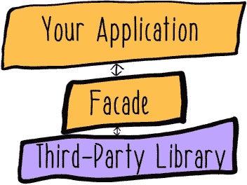

#### 5.3.1. 学习艺术风格

在您首次进入深度学习的世界时，您将把用户照片转换成著名画家的风格。这个想法是帮助人们超越肤浅的第一印象，并考虑可能隐藏在皮毛之下的内在美。为了执行这些图像转换，您将使用一种名为“艺术风格神经网络算法”的新颖算法，简称“风格网”。风格网技术是将给定图像的艺术风格转移到另一个图像的内容上。

所有开源的 style-net 算法实现都依赖于各种深度学习框架。你们团队选择使用依赖于 TensorFlow 框架的实现。TensorFlow 是一个强大的机器学习框架，特别支持深度学习。它最初是在谷歌公司作为公司对机器学习和深度学习研究的一部分而开发的。

要安装 TensorFlow，请遵循[www.tensorflow.org](http://www.tensorflow.org)上的最新说明。一旦您安装了 TensorFlow，您将想要克隆我提供的 style-net 算法的实现（[`github.com/jeffreyksmithjr/neural-art-tf`](https://github.com/jeffreyksmithjr/neural-art-tf)）。这是一个名为 neural-art-tf 的实现（[`github.com/woodrush/neural-art-tf`](https://github.com/woodrush/neural-art-tf)）的改编版本，其中包含一些重要的更改。如果您想为了比较而克隆这两个存储库，您也可以这样做。

要开始学习新的模型，你首先需要下载一个现有模型。你将使用此模型作为学习给定风格图像的新模型的一部分输入——在这种情况下，是一幅著名的画作。你将使用的方法依赖于牛津大学视觉几何组（VGG）的预训练模型。你可以从 [`mng.bz/iYlL`](http://mng.bz/iYlL) 下载此模型。你需要 .caffemodel 文件，即模型本身，以及 .prototxt 文件，它描述了模型的架构。

这个模型，一个原本打算用于图像识别的大型深度模型，以 Caffe 格式提供。Caffe 是另一个深度学习框架，与 TensorFlow 有不同的优势和劣势。

要使此模型可通过 TensorFlow 实现，你需要使用 neural-art-tf 项目中的简单转换实用程序。

##### 列表 5.26\. 将 Caffe 模型转换为 TensorFlow

```
> python ./kaffe/kaffe.py [path.prototxt] [path.caffemodel] vgg          *1*
```

+   ***1* 转换模型并将其保存到名为 vgg 的文件中**

一旦你转换了模型文件，你就可以开始学习给定绘画的艺术风格模型，并将其应用于熊的图片，使用原始的 neural-art-tf 实现。它最初是打算通过作为具有各种参数的命令行实用程序来使用的，例如模型路径、文件和迭代次数。而不是从命令行获取这些参数，让我们首先将它们提升为方法中的参数。

##### 列表 5.27\. 方法参数

```
def produce_art(content_image_path, style_image_path, model_path,
   model_type, width, alpha, beta, num_iters):
```

然后你需要找到一种方法，使这个方法对你的 Scala 代码可用。让我们尝试将这个简单的脚本转换为运行代码的服务，以便你的主管道可以调用它。为此，你将使用一个名为 Pyro 的 Python 库。像大多数 Python 库一样，使用 `pip` 安装它相当简单。

##### 列表 5.28\. 安装 Pyro

```
> pip install Pyro4
```

使用 Pyro，你可以将 neural-art-tf 脚本中的 Python 功能提供给通过网络访问它的客户端。

##### 列表 5.29\. 设置

```
class NeuralServer(object):                                                *1*
    def generate(self, content_image_path, style_image_path, model_path,
    model_type, width, alpha, beta, num_iters):                          *2*
        produce_art(content_image_path, style_image_path, model_path,
         model_type, width, alpha, beta, num_iters)                      *3*
        return True                                                        *4*

daemon = Pyro4.Daemon()                                                    *5*
ns = Pyro4.locateNS()                                                      *6*
uri = daemon.register(NeuralServer)                                        *7*
ns.register("neuralserver", uri)                                           *8*
daemon.requestLoop()                                                       *9*
```

+   ***1* 创建一个表示你的服务器类的类**

+   ***2* 定义一个方法以向客户端公开**

+   ***3* 将参数传递给底层的 produce_art 方法**

+   ***4* 在作业完成后返回 True 作为状态**

+   ***5* 设置 Pyro 守护进程**

+   ***6* 定位名称服务器**

+   ***7* 将服务器类注册到 Pyro 守护进程作为 Pyro 对象**

+   ***8* 将 Pyro 对象注册到名称服务器**

+   ***9* 启动事件循环以等待对 Pyro 对象的调用**

所有 列表 5.29 都使得 Pyro 的其他用户可以轻松找到并使用运行模型学习作业的方法。该脚本将作为 *守护进程* 运行，这是一个在后台运行的小型实用程序，等待服务请求。你将其命名为 `neuralserver` 并尝试将其注册到名称服务器。名称服务器将负责在请求按名称请求此 Pyro 对象时路由请求。为了使所有这些工作，你需要启动 Pyro 名称服务器，然后启动修改后的服务器脚本。

##### 列表 5.30\. 启动一个名称服务器

```
> pyro4-ns                           *1*

> python neural-art-tf.py            *2*
```

+   ***1* 启动一个名称服务器**

+   ***2* 启动一个作业运行服务器**

现在我们来了解一下如何从你的 Scala 客户端应用程序向这个 Python 服务器应用程序发送运行作业的请求。Pyro 的一个很好的特性是它为其他运行时提供了客户端库。你可以在 Scala 代码中使用 Java Pyrolite 客户端库（[`pythonhosted.org/Pyro4/pyrolite.html`](https://pythonhosted.org/Pyro4/pyrolite.html)）。这将允许你围绕 Python 代码和长期运行作业固有的问题构建一个界面，并使用本书其他地方使用过的所有相同的反应式技术。

要构建一个更反应灵敏的界面，你可以首先确保传递的参数具有更高的类型安全性。例如，neural-art-tf 的命令行版本使用了一组强类型参数，用于指定所使用的模型类型。有效的模型类型数量与可能的字符串范围相比非常小。在 Scala 中，你可以将只能取已知集合中一个值的参数捕获为枚举。

##### 列表 5.31\. 一个模型类型枚举

```
object ModelType extends Enumeration {           *1*
  type ModelType = Value                         *2*
  val VGG = Value("VGG")                         *3*
  val I2V = Value("I2V")                         *4*
}
```

+   ***1* 创建一个名为 ModelType 的枚举**

+   ***2* 定义一个用于类型系统的 ModelType 值**

+   ***3* 定义 VGG 为一种有效的模型类型**

+   ***4* 定义 I2V（Image2Vector）为另一种模型类型**

然后，你可以使用类型安全性来创建一个更好的定义，以确定你的作业的有效配置。让我们使用案例类来封装有效的作业配置。此外，在下面的列表中，让我们设置一些默认值，这样你就不必每次运行作业时都传递所有关于作业设置的知识。

##### 列表 5.32\. 一个作业配置案例类

```
case class JobConfiguration(contentPath: String,                     *1*
                            stylePath: String,                       *2*
                            modelPath: String,                       *3*
                            modelType: ModelType,                    *4*
                            width: Integer = 800,                    *5*
                            alpha: java.lang.Double = 1.0,           *6*
                            beta: java.lang.Double = 200.0,          *7*
                            iterations: Integer = 5000)              *8*
```

+   ***1* 内容图像的路径，用户图片**

+   ***2* 风格图像的路径，著名画作**

+   ***3* 要使用的预训练模型的路径**

+   ***4* 预训练模型的类型**

+   ***5* 结果图像的宽度，默认为 800 像素**

+   ***6* Alpha 参数，用于内容权重，默认为 1.0**

+   ***7* Beta 参数，用于风格权重，默认为 200.0**

+   ***8* 学习模型所需的迭代次数，默认为 5000**

注意，由于 Pyrolite 客户端库是一个 Java 库，你的案例类需要使用 Java 类型来表示双精度和整数。但除了在案例类类型签名中指定这一点之外，你不需要做任何事情；Scala 将自动执行从 Scala 类型到底层 Java 类型的转换。

使用这种配置案例类，你可以更容易地确保你的配置是有效的。有了有效的配置，例如下述列表中的配置，你可以更有信心地提交你的作业，因为参数对于 Python 服务器应用程序来说是足够的。

##### 列表 5.33\. 一个作业配置

```
val jobConfiguration = JobConfiguration("./sloth_bear.png",     *1*
  "./senecio.jpg",                                              *2*
  "./vgg",                                                      *3*
  ModelType.VGG,                                                *4*
  iterations = 1000)                                            *5*
```

+   ***1* 创建一个包含吸引人的树懒图像的内容图像配置**

+   ***2* 将风格图像设置为著名画作**

+   ***3* 模型文件**

+   ***4* 类型安全的模型类型**

+   ***5* 覆盖迭代次数**

然后定位名称服务器并连接到你的作业服务器的 Pyro 对象。在这个例子中，你只使用 Pyro 的网络功能，以便在 Python 程序和 Scala 程序之间进行通信，因此你不需要处理任何网络复杂性，尽管在分布式实现中这个过程将是相似的。

##### 列表 5.34\. 连接到服务器

```
val ns = NameServerProxy.locateNS(null)                                *1*
val remoteServer = new PyroProxy(ns.lookup("neuralserver"))            *2*
```

+   ***1* 在同一台机器上查找名称服务器，传入一个空主机**

+   ***2* 通过名称查找 Pyro 对象，neuralserver**

现在，你可以将你的配置发送出去进行处理——但首先让我们思考一下这意味着什么。这个请求是针对一个独立运行的过程，它同样可能是在另一台机器上的一个独立过程。这个任务可能需要相当长的时间才能运行完成。深度学习技术因其需要非常强大的硬件和执行时间较长而闻名。如果你真的想让你的应用程序具有反应性，你应该实现某种超时机制。这个超时时间的长度应该基于你对模型学习算法正常运行时间的预期。在列表 5.35 的例子中，我任意选择了一个小时。有了超时机制，你可以检测模型学习过程是否耗时过长，并应该被视为失败。

##### 列表 5.35\. 使用超时

```
val timeoutDuration = 60 * 60 * 1000                            *1*

def timedOut = Future {                                         *2*
  Thread.sleep(timeoutDuration)
  false                                                         *3*
}

def callServer(remoteServer: PyroProxy, jobConfiguration:
 JobConfiguration) = {                                        *4*
  Future.firstCompletedOf(                                      *5*
    List(
      timedOut,                                                 *6*
      Future {                                                  *7*
        remoteServer.call("generate",
          jobConfiguration.contentPath,
          jobConfiguration.stylePath,
          jobConfiguration.modelPath,
          jobConfiguration.modelType.toString,
          jobConfiguration.width,
          jobConfiguration.alpha,
          jobConfiguration.beta,
          jobConfiguration.iterations).asInstanceOf[Boolean]    *8*
      }))
}
```

+   ***1* 设置一个一小时的超时（以毫秒为单位**）

+   ***2* 创建一个超时未来**

+   ***3* 返回一个 false 值以指示未能及时完成**

+   ***4* 创建一个函数来包装调用 Python 服务器应用程序**

+   ***5* 将超时设置为两个未来中先完成的第一个**

+   ***6* 超时未来**

+   ***7* 设置一个未来来调用 Pyro 对象上的方法**

+   ***8* 将结果值转换为 Boolean**

因为你在处理这个调用另一端的 Python 程序，你无法获得任何关于它将返回什么类型的保证，所以你需要将返回值类型转换为 `Boolean`。由于模型学习过程将在一个完全独立的进程中发生，这个 Scala 程序将只会知道那个 Python 程序是否返回一个 true 值来表示它已经成功。考虑到这种有限的知识，这个超时机制防止了 Scala 应用程序在模型学习过程出现问题时永远等待。

最后，你可以调用这个函数：

```
val result = callServer(remoteServer, jobConfiguration)            *1*
```

+   ***1* 使用样本配置调用服务器调用函数**


`result`中的值是一个`Boolean`的`Future`，因此你可以将未来的值在完成时与其他的响应式 Scala 应用程序集成。Python 实现的详细工作原理都被抽象成一个小的接口。Scala 管道代码理解有效的作业配置以及它们应该花费多长时间。如果在 TensorFlow 实现 style-net 算法的执行过程中发生任何错误，Scala 应用程序将使用超时检测它们并相应地做出反应。模型学习过程中的这些错误将被完全包含在一个完全独立的进程中。Python 应用程序中的任何错误都不能传播回门面或其消费者。

### 5.4. 反应性


+   *实现一个模型学习算法*。机器学习教科书通常会详细描述各种你可以使用的学习算法，无论是伪代码还是其他语言。例如，许多基于决策树的算法实现起来相当简单。一旦你有了基本的实现，你就可以开始思考你的实现如何反应或可能如何反应。你的学习算法是否总是能在给定时间内完成？如果不是，你该如何改变这一点？

+   *深入构建门面*。在本章中，你为机器学习算法构建了一个简单的门面。特别是，你使用了一个来自 Scala 代码库的 Python 模型学习算法。这是一个相当常见的现实世界场景。许多机器学习技术的开发都是使用 Python 进行的。你可以用来构建机器学习模型的最强大的技术之一是来自 Google 的 TensorFlow。尽管它的大部分是用 C++编写的，但主要的用户 API 是用 Python 编写的。由于 TensorFlow 非常受欢迎，许多人已经尝试了从 Scala 调用它的不同方法。检查允许你从 Scala 访问 TensorFlow 的几个库之一。其中一些可能专注于 Spark。值得注意的例子包括 Yahoo!的 TensorFlowOnSpark、Databricks 的 TensorFrames 和 MLeap。当你研究这些实现时，问问自己关于模型学习实现的行为有哪些保证。使用多语言运行时如何改变你对使用这些工具之一编写的模型学习管道行为的信心？你能编写一个测试来证明关于库对错误或高负载响应的某些事情吗？

如果你想要更深入地了解 TensorFlow，可以查看 Nishant Shukla（Manning，2018）所著的《Machine Learning with TensorFlow》（[www.manning.com/books/machine-learning-with-tensorflow](http://www.manning.com/books/machine-learning-with-tensorflow)）。

### 摘要

+   模型是一个可以预测未来的程序。

+   模型学习包括处理特征并返回一个模型。

+   模型学习必须实施时考虑到失败模式（例如，超时）。

+   使用外观模式进行封装是集成第三方代码的关键技术。

+   封装在外观中的代码可以使用标准的响应式编程技术集成到你的数据管道中。

在下一章中，我们将分析你学到的模型，以了解它们的性能，这样你可以决定是否使用它们。

## 第六章. 评估模型

*本章涵盖*

+   计算模型指标

+   训练数据与测试数据

+   将模型指标记录为消息

我们已经完成了对机器学习系统阶段探索的一半以上（图 6.1）。在本章中，我们将考虑如何评估模型。在机器学习系统的背景下，*评估*一个模型意味着在将其用于预测之前考虑其性能。在本章中，我们将对模型提出许多问题。

##### 图 6.1. 机器学习阶段

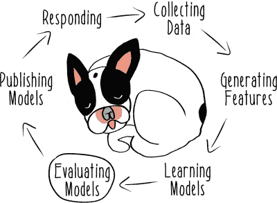


评估模型的大部分工作可能听起来并不那么必要。如果你急于构建原型系统，你可能试图用一些相当粗糙的东西应付过去。但在使用输出之前理解你的机器学习系统上游组件的输出确实具有实际价值。机器学习系统中的数据本质上是不确定的，并且普遍存在。

当你考虑是否想使用模型进行预测时，你必须直面这种不确定性。没有其他地方可以查找答案。你需要实现你的系统组件，以便它们做出正确的决定——或者承担后果。

使用机器学习模型可能是一项高风险的任务。机器学习系统被用于处理具有实际后果的决策，失败可能意味着用户会遭受实际损失。我们将考虑这样一个问题，一个成功或失败具有非常具体财务后果的问题：欺诈检测。

### 6.1. 欺诈检测

Kangaroo Kapital 是澳大利亚最大的信用卡公司。整个大陆的动物都使用 Kangaroo Kapital 信用卡进行日常购物，为公司奖励系统积累积分。由于澳大利亚动物传统上穿得很少，携带现金的挑战很大。只需跟踪一张信用卡对普通工作袋鼠来说已经是一个很大的帮助；然而，澳大利亚动物在跟踪一张信用卡时仍然会遇到问题。卡片经常丢失，导致盗窃和欺诈使用的问题。

Kangaroo Kapital 的欺诈团队负责检测这些欺诈案例。他们使用复杂的分析技术来尝试确定客户的卡片何时被盗。如果他们能够有足够的信心确定一张卡片被盗，他们就会锁定这张卡片并联系客户。快速且正确的好处是巨大的。在最佳情况下，欺诈团队的系统在卡片第一次被滥用时检测到欺诈，锁定卡片，然后不再遭受进一步的损失（图 6.2）。

##### 图 6.2\. 成功检测欺诈

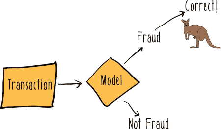

但如果系统太慢，公司会承担那些欺诈交易的成本，而不是客户。这可能会变得很昂贵，因为没有人愿意像偷了信用卡的鸭嘴兽那样花钱（图 6.3）。

##### 图 6.3\. 未检测到欺诈

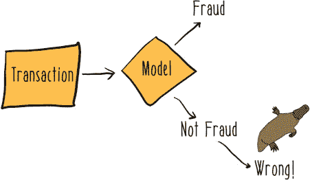

过于急切也可能对公司造成不利。如果团队判断错误，那么他们可能已经锁定了一张客户正在尝试使用的卡片，这给客户带来了极大的不便。一个因为信用卡被拒绝而无法支付晚餐账单的塔斯马尼亚魔鬼将是一个不快乐的客户。他可能会取消他的信用卡，这也会导致公司损失金钱（图 6.4）。

##### 图 6.4\. 错误检测欺诈

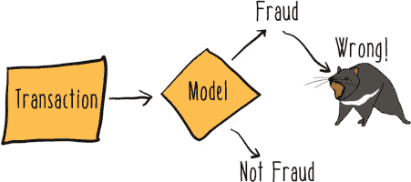

这种权衡在机器学习环境中经常被讨论，使用各种可以针对给定模型计算的指标。本章的大部分内容都集中在不同的模型指标上，因为指标是现实世界机器学习系统操作的关键部分。

### 6.2\. 保留数据

要理解用于评估模型的模型指标，你需要从使用一些不同于你以前使用过的数据开始。在之前的章节中，你看到了如何收集和使用数据来训练机器学习模型。但通常你不会使用你收集的所有数据来仅用于训练模型。相反，你通常将一些数据留出用于其他目的。这些数据被称为*保留数据*，意味着它没有被包括在用于学习模型的数据中。根据你试图用你的机器学习系统做什么，你可能会对保留数据做几件不同的事情，但通常你需要它用于某些目的。

在决定保留哪些数据以及使用哪些数据来学习模型时，存在很大的风险。如果你在系统层面上不仔细处理你的数据，你可能会发现，当你的模型在生产系统中用于实时预测时，会做出可怕的事情。Kangaroo Kapital 的“袋鼠”们是一个非常保守的群体，所以他们尽可能地安全地使用保留数据。他们的方法依赖于一个全球性的概念，即什么是保留数据，什么是训练数据。

要理解 Kangaroo Kapital 的实现，我们首先为信用卡处理系统设置一个基本版本的领域模型。以下列表显示了构建可以处理信用卡交易代码所需的一些基础知识。

##### 列表 6.1\. 信用卡交易工具

```
type TransactionId = Long                                   *1*
type CustomerId = Long                                      *2*
type MerchantId = Long                                      *3*

case class Transaction(transactionId: TransactionId,        *4*
                       customerId: CustomerId,
                       merchantId: MerchantId,
                       dateTime: DateTime,
                       amount: BigDecimal)
```

+   ***1* 事务标识符的类型别名**

+   ***2* 客户标识符的类型别名**

+   ***3* 商家标识符的类型别名**

+   ***4* 事务的案例类**


**类型别名**

事务、客户和商家的标识符使用 *类型别名* 进行类型化。我们之前没有使用过它们，但类型别名是简单的实用工具。它们允许你使用有意义的名称来定义任意数值标识符，而不改变任何基础类型的底层属性。`CustomerId` 只是一个 `Long`。你可以在 `CustomerId` 上执行与在 `Long` 上相同的所有操作。但你可以实现你的代码来描述给定 `Long` 实际上是客户标识符还是商家标识符。能够分配这些描述性类型通常有助于使用类型构建更丰富的领域描述，如列表 6.1 所示。


使用在列表 6.1 中建立的基领域模型，你现在可以实施你的代码版本，以从保留数据中分离出训练数据。该实现应用了一个基于稳定标识符（客户的账户号码）的确定性哈希函数。给定客户的全部交易总是位于训练数据或保留数据中。在数据较少的系统上，这可能不是正确的方法。一个替代方案是在训练数据和保留数据之间分割交易。但 Kangaroo Kapital 在澳大利亚拥有巨大的市场份额，因此按客户分割对他们来说是一个可接受的选择。

下一个列表显示了给定事务是如何分配到训练数据或保留数据的。

##### 列表 6.2\. 将客户分配到训练集

```
val TrainingPercent = 80                                                   *1*

def trainingCustomer(id: CustomerId): Boolean =                            *2*
  val hashValue = id.hashCode() % 100                                      *3*
  hashValue < TrainingPercent                                              *4*
}

val sampleTransaction = Transaction(123, 456, 789,
 DateTime.now(), 42.01)                                                  *5*

val datasetResult = trainingCustomer(sampleTransaction.customerId)         *6*

println(s"Is the sample transaction in the training set?
 $datasetResult")                                                        *7*
```

+   ***1* 分配到训练集的客户百分比**

+   ***2* 确定客户是否应用于训练集的函数**

+   ***3* 使用客户 ID 的哈希值的 100 取模值来生成哈希值**

+   ***4* 将客户的哈希值与一个常数百分比进行比较**

+   ***5* 用于测试的示例事务**

+   ***6* 样例事务的结果数据集**

+   ***7* 打印结果以供检查**

`trainingCustomer` 函数可以在几个不同的地方实现。目前，你关注的是交易，因此你可以在 `Transaction` 类上实现它。因为这是关于客户的信息，你可以将其放在可能存在于某处（但你尚未实现）的 `Customer` 类上。但 `trainingCustomer` 是一个纯函数，可以在整个系统中广泛使用。

类型签名确保它将始终仅操作于客户 ID，正如你的意图，所以让我们将其保留在工具对象上，并允许消费者按需导入。如果你有面向对象编程的经验，这可能会让你觉得这是一种不好的风格。但 Scala 结合了面向对象和函数式编程范式，所以在 Scala 中这是完全可以接受的。在函数式编程风格的代码中，拥有“函数包”并不罕见，其中对象可能是一些函数的容器，这些函数可能彼此独立使用。对象仅仅作为一个*命名空间*——用于组织代码的标识符。这与传统的面向对象编程形成对比，后者创建的是强内聚单元的对象，旨在整体使用。


因为你的哈希函数遵循某些属性，允许函数在代码库中传递是没有害处的。它显然是*纯函数*，意味着它不会产生副作用。该函数也是*引用透明*的，意味着当用相同的参数调用时，它将始终返回相同的值。这是数学函数的一个重要属性，你的函数必须遵守。当你能够以纯、引用透明的函数结构化代码时，这可以使代码重用变得非常容易和自然，正如你可以从你的哈希函数中看到的那样。

注意，你的哈希函数是以一种方式实现的，它会根据训练比例参数设定的比例随机将实例分配到训练集或测试集。这种分割训练集和测试集的策略避免了可能导致模型性能不佳的各种常见数据准备问题。

### 6.3. 模型度量

现在你有了划分数据的能力，你可以用其中一部分来训练你的模型，其余的用于测试或评估任何学习到的模型。你已经看到了如何在第五章中训练模型。列表 6.3 回顾了该模型学习过程，再次使用 Spark 的 MLlib。你将开始时不使用 MLlib 的新功能。相反，你将专注于第五章中描述的模型学习过程如何与当前的工作相关联。在这个例子中，你将使用逻辑回归学习一个二元分类模型。


**逻辑回归**

尽管你在这本书中没有见过它，但*逻辑回归*是一种常见的模型学习算法。它是一种回归模型，用于预测分类变量（例如，欺诈与非欺诈信用卡交易）。对算法细节的深入讨论超出了本书的范围，但像往常一样，维基百科有一个很好的介绍([`en.wikipedia.org/wiki/Logistic_regression`](https://en.wikipedia.org/wiki/Logistic_regression))。

当涉及到构建机器学习系统时，逻辑回归有几个优点：它被广泛实现，有高效的分布式实现，模型大小与特征数量成线性比例，模型中特征的重要性易于分析，等等。在这种情况下，使用逻辑回归允许你使用比不流行的或更复杂的模型学习算法更多的 MLlib 库功能来评估你的学习模型。


##### 列表 6.3\. 学习一个模型

```
val session = SparkSession.builder.appName("Fraud Model").getOrCreate()    *1*
import session.implicits._                                                 *2*

val data = session.read.format("libsvm")
 .load("src/main/resources/sample_libsvm_data.txt")                      *3*

val Array(trainingData, testingData) = data.randomSplit(Array(0.8, 0.2))   *4*

val learningAlgo = new LogisticRegression()                                *5*

val model = learningAlgo.fit(trainingData)                                 *6*

println(s"Model coefficients: ${model.coefficients}
 Model intercept: ${model.intercept}")                                   *7*
```

+   ***1* 创建一个新的会话**

+   ***2* 导入一些用于与 DataFrames 一起使用的有用隐式转换**

+   ***3* 加载一些存储在 LIBSVM 格式的示例数据**

+   ***4* 随机将样本数据分割成训练集和测试集**

+   ***5* 实例化一个新的逻辑回归分类器**

+   ***6* 在训练集上学习一个模型**

+   ***7* 打印模型的参数以供检查**

在这种情况下，你将使用一些标准样本数据来代替 Kangaroo Kapital 信用卡数据。你可以稍后重构此代码以从你的静态类型事务数据中获取数据。使用这些样本数据，你可以快速设置你的训练和测试过程的基本设置。请注意，你也在使用比之前更简单的方法来分割训练和测试数据。再次强调，这只是为了给你一个简单但可运行的原型，你可以重构它以使用信用卡数据。样本数据和随机训练/测试分割函数都由 Spark 项目提供，以简化开始构建模型的过程。

在 列表 6.3 的末尾，你创建了一个 `LogisticRegressionModel` 的实例。现在你可以使用一些库功能来检查和推理你的模型。在这个处理阶段，你绝对不知道你的模型是什么样的。模型学习过程的结果在定义上是不可确定的——你可能有一个非常有用的模型，或者完全是垃圾。

首先，我们可以了解一些可以计算关于模型在训练集上性能的指标，但要做到这一点，我们需要了解如何衡量分类器的性能。回顾一下 第五章，在二元分类问题中，我们通常将两个类别称为 *正* 和 *负*。在 Kangaroo Kapital 的例子中，正例是欺诈发生，负例是没有欺诈发生。然后，给定的分类器可以在这些类别中的性能上进行评分。这适用于分类器是一个基于嗅觉做出决策的野狗，或者只是一个澳大利亚一元硬币的翻转。传统术语将正确的预测称为 *真*，错误的预测称为 *假*。将这些放在一起，就得到了 图 6.5 中所示的二维矩阵，称为 *混淆矩阵*。

##### 图 6.5\. 混淆矩阵

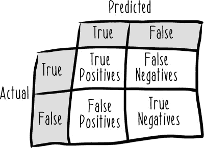

*真阳性* 是指模型正确预测欺诈。*假阳性* 是指模型错误地预测欺诈。*真阴性* 是指模型正确预测正常（非欺诈）交易。最后，*假阴性* 是指模型错误地预测正常交易，而实际上存在欺诈。

使用这四个统计量，我们可以计算许多统计量来帮助我们评估模型。首先，我们可以评估模型的 *精确度*，定义为真阳性数量除以所有正预测的总和：

> *精确度 = 真阳性 / (真阳性 + 假阳性)*

精确度对于 Kangaroo Kapital 团队来说很重要。如果他们的欺诈模型精确度不够高，他们将花费所有欺诈调查预算来调查正常、非欺诈交易。

另有一个统计量，称为 *召回率*，对于袋鼠来说也非常重要。如果袋鼠的欺诈模型召回率不够高，动物们将很容易进行信用卡欺诈而不会被抓住，这将变得非常昂贵。

召回率定义为真阳性数量除以集合中所有正数的总和：

> *召回率 = 真阳性 / (真阳性 + 假阴性)*

根据上下文，召回率也有其他名称，例如 *真正阳性率*。与召回率相关的另一个统计量称为 *假阳性率*，或 *流失率*，定义为假阳性数量除以集合中所有负数的总和：

> *假阳性率 = 假阳性 / (真阴性 + 假阳性)*

您可以使用称为 *ROC 曲线* 的图表来可视化模型在真正阳性率（召回率）与假阳性率之间的权衡。


##### 注意

*ROC* 代表 *接收者操作特征*。这种技术和名称起源于二战期间对雷达的研究。尽管这种技术仍然有用，但名称与其当前常见用法无关，因此很少用其他名称来提及，除了其缩写 ROC。


一个典型的 ROC 曲线图可能看起来像 图 6.6。

##### 图 6.6\. ROC 曲线

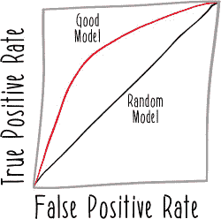

假阳性率位于 x 轴上，真阳性率位于 y 轴上。对角线 *x = y* 代表随机模型的预期性能，因此可用的模型曲线应该高于该线。MLlib 有一些内置的、很好的功能来计算二元分类器的 ROC 曲线。

##### 列表 6.4\. 训练性能摘要

```
val trainingSummary = model.summary                       *1*

val binarySummary = trainingSummary.asInstanceOf
 [BinaryLogisticRegressionSummary]                      *2*

val roc = binarySummary.roc                               *3*

roc.show()                                                *4*
```

+   ***1* 生成模型性能摘要**

+   ***2* 将该摘要转换为适当的类型，BinaryLogisticRegressionSummary**

+   ***3* 模型的 ROC 曲线**

+   ***4* 打印用于检查的 ROC 曲线**

模型摘要功能是 MLlib 中相对较新的功能，因此并非所有模型类别都可用。它的实现也有一些限制，例如需要使用`asInstanceOf`将摘要转换为正确的类型。不要误解，像这样使用`asInstanceOf`是不好的 Scala 风格；它代表了类型系统的颠覆。但 MLlib 仍在快速发展，所以这种转换操作只是 MLlib 中不完整实现的一个标志。MLlib 的开发非常活跃，但机器学习是一个庞大的领域，任何库都无法支持。新功能正在以快速的速度添加，并且总体抽象正在得到显著改进。期待未来版本的 Spark 中像这种类别转换这样的粗糙边缘消失。

我们正在构建大规模可扩展的机器学习系统，这些系统主要自主运行，那么谁有时间去查看图表并决定什么构成一个足够好的模型呢？嗯，ROC 曲线的一个用途就是得到关于模型性能的单个数字：ROC 曲线下的面积。这个数字越高，模型的性能越好。你甚至可以使用这个计算对模型的效用做出强有力的断言。记住，随机模型预计会在 ROC 曲线上的*x = y*线上表现。其下的面积是 0.5，所以任何曲线下面积（AUC）小于 0.5 的模型都可以安全地丢弃，因为它们比随机模型更差。

图 6.7，6.8 和 6.9 展示了良好、随机和劣于随机模型的曲线下面积差异。

##### 图 6.7\. 良好模型

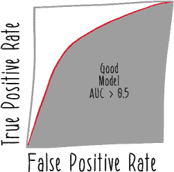

##### 图 6.8\. 随机模型

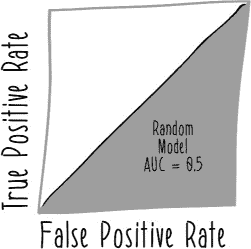

##### 图 6.9\. 恶劣模型

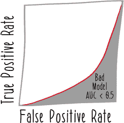

下一个列表展示了验证性能优于随机模型的实现。

##### 列表 6.5\. 验证训练性能

```
def betterThanRandom(model: LogisticRegressionModel) = {              *1*
  val trainingSummary = model.summary                                 *2*

  val binarySummary = trainingSummary.asInstanceOf
   [BinaryLogisticRegressionSummary]                                *3*

  val auc = binarySummary.areaUnderROC                                *4*

  auc > 0.5                                                           *5*
}

betterThanRandom(model)                                               *6*
```

+   ***1* 定义一个函数以验证模型是否优于随机模型**

+   ***2* 训练摘要**

+   ***3* 类别转换**

+   ***4* ROC 曲线下的面积**

+   ***5* 测试曲线下面积是否大于随机模型**

+   ***6* 验证模型的示例调用**

这种验证可以作为机器学习系统中的一个有用的安全特性，防止你发布可能造成严重损害的模型。在 Kangaroo Kapital 的例子中，由于欺诈比正常交易要少得多，一个未能通过这项测试的模型很可能错误地指控许多愤怒的动物进行信用卡欺诈。

这种技术可以扩展到基本的合理性检查之外。如果你记录了你已发布模型的性能历史，你可以将新训练的模型的性能与它们进行比较。那么，一个合理的验证方法就是不要发布与当前已发布模型性能有显著差异的模型。我稍后会讨论一些关于模型验证的更多技术。

你还没有完成对模型的提问。你可以考虑其他模型指标。你迄今为止看到的指标试图捕捉模型性能的一个方面。特别是，不难想象一个在精确度上做得更好但在召回率上没有或反之亦然的模型。*F 度量*（有时也称为*F1 分数*）是一个统计量，试图在同一个指标中结合精确度和召回率的关注点。具体来说，它是精确度和召回率的调和平均值。下一个列表显示了两种表述 F 度量的方式。

##### 列表 6.6\. F 度量

```
F measure = 2 * (precision * recall) / (precision + recall)

F measure = (2 * true positives) /
 (2 * true positives + false positives + false negatives)
```

使用 F 度量作为模型指标可能并不总是合适的。它均衡地权衡了精确度与召回率，这可能与该情况下的建模和业务目标不符。但它确实有一个优点，即它是一个单一的数字，可以用来实现自动化决策。

例如，F 度量的一种用途是设置逻辑回归模型用于二元分类的*阈值*。在内部，逻辑回归模型正在生成概率。要将它们转换为预测的类别标签，你需要设置一个阈值来区分正（欺诈）预测和负（非欺诈）预测。图 6.10 显示了一些来自逻辑回归模型的示例预测值以及如何使用不同的阈值值将它们分为正预测和负预测。

##### 图 6.10\. 阈值设置

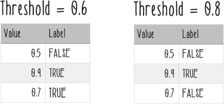

F 度量不是设置阈值的唯一方法，但它是有用的，所以让我们看看如何做。以下列表显示了如何使用训练集上的模型 F 度量来设置阈值。

##### 列表 6.7\. 使用 F 度量设置阈值

```
val fMeasure = binarySummary.fMeasureByThreshold                         *1*

val maxFMeasure = fMeasure.select(max("F-Measure"))
 .head().getDouble(0)                                                  *2*

val bestThreshold = fMeasure.where($"F-Measure" === maxFMeasure)         *3*
  .select("threshold").head().getDouble(0)

model.setThreshold(bestThreshold)                                        *4*
```

+   ***1* 获取每个可能阈值的 F 度量**

+   ***2* 找到最大的 F 度量**

+   ***3* 找到对应于最大 F 度量的阈值**

+   ***4* 在模型上设置该阈值**

现在，学习到的模型将使用基于 F 度量的阈值来区分正预测和负预测。

### 6.4\. 测试模型

在列表 6.3 中，作为准备学习数据的一部分，你留出了一部分数据用于测试过程。现在，是时候使用这些预留数据来测试你的模型了。当我们测试模型时，我们的目标是获得模型在野外性能的准确图景。为了做到这一点，我们必须使用模型从未见过的数据：我们的预留数据。

你可以使用你已学到的现有模型并设置一个阈值，对预留数据进行预测。下一个列表显示了如何生成预测并检查它们。

##### 列表 6.8\. 在预留数据上预测

```
val predictions = model.transform(testingData)            *1*

predictions.show(5)                                       *2*
```

+   ***1* 预测测试数据集中的每一行**

+   ***2* 打印一些预测结果以供检查**

接下来，你将做类似之前的事情：计算关于模型性能的一些指标。在这种情况下，让我们再次看看精确度和召回率。回顾一下：低精确度的模型会导致许多愤怒的塔斯马尼亚恶魔因为完全正常的、非欺诈性的使用而卡片被拒绝。低召回率的模型会导致许多快乐的鸭嘴兽带着所有袋鼠资本的钱游走，因为它们的欺诈没有被检测到。两者都很重要，所以我们希望模型在这两个方面的权衡都很好。为了可视化模型在精确度和召回率方面的表现，我们可以查看另一个图表：精确度-召回率曲线，如图 6.11 所示。

##### 图 6.11\. 精确度-召回率曲线

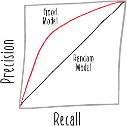

与我们之前看到的 ROC 曲线相比，唯一的区别是坐标轴上的指标。召回率在 x 轴上，精确度在 y 轴上。同样，对角线* x = y* 代表随机模型的预期性能，因此可用模型的曲线应该高于该线。

与之前一样，你想要确保学习到的模型在所选模型指标上优于随机模型，因此你将计算精确度-召回率曲线下的面积。

##### 列表 6.9\. 使用评估器

```
val evaluator = new BinaryClassificationEvaluator()           *1*
  .setLabelCol("label")                                       *2*
  .setRawPredictionCol("rawPrediction")                       *3*
  .setMetricName("areaUnderPR")                               *4*

val areaUnderPR = evaluator.evaluate(predictions)             *5*
```

+   ***1* 实例化一个新的评估器**

+   ***2* 设置包含类别标签的列**

+   ***3* 设置包含预测的列**

+   ***4* 设置要计算的指标，即精确度-召回率曲线下的面积**

+   ***5* 执行评估器**

随机模型的精确度-召回率曲线下的面积是 0.5，与 ROC 曲线中的随机模型相同，因此你可以以相同的方式定义你的验证函数。

##### 列表 6.10\. 验证模型

```
def betterThanRandom(area: Double) = {          *1*
  area > 0.5                                    *2*
}
```

+   ***1* 定义一个函数来检查精确度-召回率曲线下的面积**

+   ***2* 确保曲线下的面积大于随机模型**

从你不得不编写的代码的角度来看，在保留数据上计算的指标与在训练数据上计算指标几乎相同。但重要的是要注意，在训练数据上计算的指标与在保留数据上计算的指标给出的画面非常不同。你在训练集上计算的指标代表了模型**最佳可能**的性能。在训练过程中，模型学习算法可以访问特征和类别标签。根据模型学习算法和训练数据集，模型在训练数据集上可能达到 100%的准确率。

保留数据为你提供了一个非常不同且更真实的视角，了解你的模型有多好。因为模型从未见过这些数据，它的行为应该与你在现实世界中发布并使用它时非常相似。你可以将这视为对模型真实性能的早期访问，就像 Manning Early Access Program ([www.manning.com/meap-program](http://www.manning.com/meap-program))，它允许读者在书籍真正印刷成纸之前就获得像这样一本书的访问权限。

提前了解模型性能至关重要。它允许你保护你的生产系统免受基本损坏的模型的影响，这些模型可能会对你的整体系统造成破坏。确保你不破坏测试过程的完整性非常重要。如果你未能充分分离用于训练和测试过程的数据，你可能会对你的模型性能有一个根本不准确的认识。否则，你可能会遇到下一节讨论的问题。

### 6.5. 数据泄露

一种常见的数据处理错误被称为“数据泄露”。它的工作原理大致如下。你已经将数据分开用于训练和测试，但有一个微妙的问题。关于保留数据中包含的内容——特别是类别标签——的知识以某种方式“泄露”到了训练数据中。结果将在训练和测试数据上表现良好，但在现实世界数据上可能表现非常糟糕。

在 Kangaroo Kapital 的情况下，考虑一个数据科学家正在基于长期客户的交易数据构建模型，用于检测欺诈。因为科学家有这些客户的大量历史数据，他决定为某个用户构建一个关于欺诈历史的特征。其逻辑是，客户账户上过去发生的欺诈事件表明她可能不太擅长保管她的卡片。数据科学家编写了一个特征来查询客户的欺诈报告历史数量，这类似于以下列表中的简略实现。

##### 列表 6.11. 过去欺诈报告特征

```
def pastFraudReports(customer: Customer): Int = ???
```

问题在于，在数据科学家的实现中，他的查询没有日期范围限制。他查询的存储欺诈报告数据的后端数据库采用可变数据模型。结果是，最近报告的欺诈行为被包含在这个特征中，因此模型可以看到这些欺诈行为，并在训练过程中偏向欺诈。这种方法在测试集中仍然表现良好，其中关于“过去”欺诈的特征继续很好地预测“未来”欺诈的发生地点。我们查看的所有模型指标似乎都表明这是一个高性能的模型——但它们是错误的。一旦模型发布，其性能将远低于之前计算的任何指标。这是因为模型无法再看到特征中的未来数据，因此它无法再依赖这个特征来人为地提高其性能。

数据泄露也可能比这更为微妙。记住，Kangaroo Kapital 将客户分为训练客户或测试客户。这通常是一个合理的策略，但并不一定足以确保数据得到妥善处理。

不久前发生了一起涉及一群考拉诈骗犯的事件。他们慢慢地积累了 Kangaroo Kapital 许多客户的账户凭证。然后，他们突然发起大量收费，给公司造成了数百万的损失。这可是很多桉树啊！

与这个历史数据集合作的问题在于，它发生在特定的时间点，针对特定的用户子集。出于某种原因，考拉诈骗犯主要针对野狗。当数据在客户之间按训练和测试用途分开时，大量的野狗将最终出现在训练集中，模型很可能学会野狗持有的账户可能被用于欺诈。问题是这种知识对未来是无用的。这是一个单一事件，发生在特定的时间点。所有罪犯随后都被逮捕（在低速警察追捕后）。这种知识是无用的，以野狗为中心的模型现在在野外表现会很差。

在这种底层数据集中发生大型事件的情况下，你可以使用各种技术来减轻这种异常数据的影响。一种方法是将数据按时间划分，使用较早的数据进行训练，同时保留较晚的数据。这种方法在测试阶段可能会产生相当差的表现，但那是准确的。机器学习模型很难预测不可预测的事情。

或者，你可以完全忽略这个时间段，理由是你试图构建一个针对“正常规模欺诈”概念标签的模型，这通常会在各种客户群体中更均匀地分布。这并不意味着你必须完全忽略这种形式的欺诈。你仍然可以实施其他类型的模型或甚至确定性系统（例如，速率限制）来检测这种主要欺诈事件。这种方法让你的“正常规模欺诈”专注于你最初就关注的那些小而常规的欺诈事件。

无论你采取什么方法，你总是想确保任何相关的知识都完全排除在训练数据之外。如果你能成功做到这一点，你的模型评估过程应该是准确和有用的。

### 6.6. 记录来源

现在你已经提出了各种关于模型的问题以确保它们具有预测性，你需要开始使用这些模型。在第七章中，我们将关注发布模型的过程，使它们可用于预测。但在我们这样做之前，让我们快速看一下如何捕捉本章中考虑的所有有用信息。


如果你回顾第四章、第 4.5 节，你可以看到你需要根据无法在源代码中建立并编译时验证的上下文信息来做出决定，哪些特征数据可以使用。我们在模型上也面临类似的问题。由于模型学习过程的内在不确定性，我们在学习模型并评估其结果之前不知道我们的模型会变得多好。

本章展示了通过使用统计技术评估模型性能来处理这种不确定性的几种技术。然而，这些计算的结果需要被某些东西消费。在这本书中，我们将考虑模型评估期间产生的数据的两个下游消费者：发布过程和预测服务应用的监督组件。

这些其他系统需要考虑的信息是一种 *来源信息*（也称为 *血缘*）。在这个上下文中，模型的来源信息是指关于模型是如何产生的信息，包括用于确定模型应该发布的性能指标等。

传递这种信息的一种方法是将计算出的指标附加到某种包装对象中的模型本身。下面的列表显示了本章中计算的一些统计信息的一种实现方式。

##### 列表 6.12. 评估结果案例类

```
case class Results(model: LogisticRegressionModel,        *1*
                   evaluatedTime: DateTime,               *2*
                   areaUnderTrainingROC: Double,          *3*
                   areaUnderTestingPR: Double)            *4*
```

+   ***1* 模型本身**

+   ***2* 模型评估的时间**

+   ***3* 训练集下的 ROC 曲线下面积**

+   ***4* 测试集上的精确度-召回率曲线下的面积**

这些可能不是你为特定模型学习管道记录的精确指标。曲线下的面积对于决定是否使用模型是有用的，但下游系统可能更关心该模型将如何表现。你可能会选择在选择的阈值上记录测试集上的精确度和召回率。

此外，你可能不会传递包含其元数据的模型对象。有时你可能会选择只通过一个唯一的标识符来引用模型，并将元数据存储在模型的不同位置，例如数据库中。下一个列表显示了建模评估结果的另一种方法。

##### 列表 6.13\. 重构的评估结果案例类

```
case class ResultsAlternate(modelId: Long,                  *1*
                            evaluatedTime: DateTime,        *2*
                            precision: Double,              *3*
                            recall: Double)                 *4*
```

+   ***1* 模型标识符**

+   ***2* 模型评估的时间**

+   ***3* 测试集上模型的精确度**

+   ***4* 测试集上模型的召回率**


这种替代方法更接近于在反应式机器学习系统中首选的消息导向的理想。这种案例类可以很容易地通过任何数量的技术作为消息传递：队列、事件总线、数据库等等。不需要任何下游系统比简单的消息传递更紧密地耦合来消费这些数据。从任何消费者（`ResultsAlternate`消息的接收者）的角度来看，模型可能是由任何库、任何语言学习的。


如果我们的模型评估过程显示我们学到了一个无用的模型，我们可以将这一信息作为关于低精确度和/或召回率模型的短信发送。这种信息传递的通信方式可以很好地控制我们模型学习过程失败的风险。正如你将在下一章中看到的，我们可以构建可以处理关于模型信息的模型发布系统，并采取适当的措施来保持我们机器学习系统的反应性。

### 6.7\. 反应性


+   *计算给定数据集上给定模型的性能统计指标*。信不信由你，你可以计算更多的性能统计指标。你可以尝试计算正负似然比、G 度量或其他指标。你将在各种统计参考书籍和在线资源中找到不同统计的描述。然后你可以将这些值与其他我们在本章中探索的计算结果进行比较。这对你关于模型性能的直觉有什么启示？

+   *尝试在训练集上构建一个“完美”的模型*。这比听起来容易。通过一点工作，许多技术可以为给定的数据集实现完美或接近完美的性能。一般来说，如果你的模型具有与训练实例相同的数量或更多的参数，那么每个参数最终可能有效地代表一个特定的实例。如果你给你的数据集中的每个实例分配一个任意的标识符作为特征，那么几种模型学习技术可以使用这个单一特征作为“记住”哪个实例具有哪个类标签的方式。如果你得到一个以这种方式训练的模型，对其有趣的事情就是测试它。将模型应用于测试集，并计算其性能。因为你已经构建了一个过度拟合的模型，所以性能可能（但不保证）相当糟糕。你的模型在测试集上的表现如何？如果它的表现不是太糟糕，你还能如何检测它可能在未来的未见数据上表现不佳？

### 摘要

+   可以在保留数据上评估模型以评估其性能。

+   准确率、精确度、召回率、F 值和曲线下面积等统计数据可以量化模型性能。

+   未将用于训练的数据与测试数据分开可能导致模型缺乏预测能力。

+   记录模型的来源允许你向其他系统传递关于其性能的消息。

在下一章中，你将了解如何使你的学习模型可用于预测。

## 第七章\. 发布模型

*本章涵盖*

+   持久化学习模型

+   使用 Akka HTTP 模拟微服务

+   使用 Docker 容器化服务

在本章中，我们将考虑如何发布模型（见图 7.1）。在整个本书中，你一直在学习和使用模型，但使模型可用于实际机器学习系统可能涉及一些你尚未看到的复杂性。当你在一个像 Spark shell 这样的 REPL 中探索模型时，你可以直接调用内存中已存在的模型实例的方法。但在现实世界的系统中，一个模型通常是在管道中学习，正如你在第四章和第五章中看到的，在完全不同的应用中使用之前。本章将向你展示如何在现实世界的复杂机器学习系统中使模型可用。我们将通过将模型打包成服务，然后使这些服务成为可独立部署的单元的方法来操作。

##### 图 7.1\. 机器学习的阶段

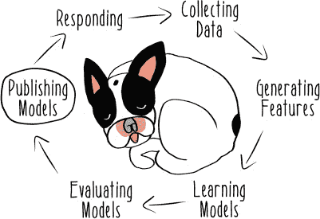

### 7.1\. 农业的不可预测性

机器学习被应用于各种行业中，而不仅仅是那些你认为涉及大量技术的行业。例如，农业领域就需要大量的技术复杂性。以 Hareloom 农场为例，这是一个有机农场，完全由兔子运营。兔子种植水果和蔬菜，包括芹菜、番茄，当然还有胡萝卜。

农业业务充满了不确定性。在 Hareloom，早霜可能会摧毁他们的番茄。生产的甘蓝少于需求量可能会意味着错过潜在的收入。芜菁价格的突然下降可能会让他们手中的作物几乎不值得收获。

由于所有这些原因，Hareloom 农场需要预测能力来运营他们主要非技术性的业务。他们有一个由数据科学家和工程师（包括你）组成的数据团队，这些人的智慧比普通兔子要高。你们使用之前见过的工具：Scala、Spark 和 MLlib，为所有这些问题构建机器学习模型。让我们看看你在农场里准备了些什么。


### 7.2\. 持久化模型

Hareloom 的农民非常关注他们的作物*产量*——每单位农田产生的作物量。最近，他们一直在尝试建模种植胡萝卜种子数量的问题。胡萝卜种子本身是他们运营中成本相当低的原料，所以他们历史上使用它相当自由。当他们使用太少胡萝卜种子时，他们生产的胡萝卜没有他们想要的那么多。但当他们使用太多时，他们遇到了拥挤的问题，导致胡萝卜尺寸不令人满意。

你们团队将所有这些历史数据以简单实例的形式记录下来用于训练。对于你的单个特征，你选择了每英寸土壤种植的种子数量。对于你的概念标签，你选择使用单个布尔值来指示该特定收获是否被认为是成功的。这个成功标签是通过汇总关于收获的胡萝卜数量、胡萝卜的大小以及收获它们的难度的主观判断手动产生的。

在定义了建模任务后，你可以开始构建你的 Spark 管道。

##### 列表 7.1\. 加载数据

```
val session = SparkSession.builder
   .appName("ModelPersistence").getOrCreate()             *1*

val data = Seq(                                             *2*
  (0, 18.0, 0),                                             *3*
  (1, 20.0, 0),
  (2, 8.0, 1),
  (3, 5.0, 1),
  (4, 2.0, 0),
  (5, 21.0, 0),
  (6, 7.0, 1),
  (7, 18.0, 0),
  (8, 3.0, 1),
  (9, 22.0, 0),
  (10, 8.0, 1),
  (11, 2.0, 0),
  (12, 5.0, 1),
  (13, 4.0, 1),
  (14, 1.0, 0),
  (15, 11.0, 0),
  (16, 7.0, 1),
  (17, 15.0, 0),
  (18, 3.0, 1),
  (19, 20.0, 0))

val instances = session.createDataFrame(data)               *4*
  .toDF("id", "seeds", "label")                             *5*
```

+   ***1* 设置 SparkSession**

+   ***2* 训练和评估的实例序列**

+   ***3* 实例包括一个标识符、每英寸土壤使用的种子数量，以及收获成功的二进制标签。**

+   ***4* 从实例创建 DataFrame**

+   ***5* 在 DataFrame 中命名列**

Hareloom 的兔子有更多历史数据，但这个样本应该足以让你开始实现你的模型。请注意，你将再次使用以`DataFrame`为中心的 Spark ML API。

一旦您加载数据，您需要从该数据中生成特征。在这种情况下，您将应用的特征转换是来自第四章的分组技术，这次使用一些 MLlib 库功能，将特征值减少到三个分组，如下一列表所示。有关分组特征技术的更多信息，请参阅 4.3 节。

##### 列表 7.2\. 准备特征

```
val discretizer = new QuantileDiscretizer()               *1*
  .setInputCol("seeds")                                   *2*
  .setOutputCol("discretized")                            *3*
  .setNumBuckets(3)                                       *4*

val assembler = new VectorAssembler()                     *5*
  .setInputCols(Array("discretized"))                     *6*
  .setOutputCol("features")                               *7*
```

+   ***1* 设置 QuantileDiscretizer 以用于特征工程**

+   ***2* 以种子密度数据作为输入**

+   ***3* 为离散化数据设置输出列**

+   ***4* 告诉离散化器使用三个桶**

+   ***5* 设置一个 VectorAssembler 以格式化数据作为特征**

+   ***6* 设置要格式化的输入列**

+   ***7* 定义输出列**

`QuantileDiscretizer`为您执行分组（或离散化）操作，而无需在桶之间有预定义的边界。相反，您指定桶的数量，离散化器通过采样数据推断合理的桶。

在离散化器之后，您还从 Spark 中调用了一些辅助功能，即`VectorAssembler`。它的目的是为您的新`DataFrame`添加一个包含特征值的列，这些特征值被封装在 ML 管道功能其他部分所需的`Vector`类型中。

在此之后，您现在可以组合您学习管道的其余部分。在这个例子中，您将使用一种称为*交叉验证*的技术来探索多个模型，以确定哪个表现最好。交叉验证是一种基于将数据分成随机子样本的技术，以便模型学习过程的结果可以在数据的不同部分上评估。然后，可以使用不同的超参数重复此过程。

您需要设置一个对象来保存将在模型学习过程的多次执行中使用的参数。然后，您可以根据该模型的表现选择产生最佳模型的参数。寻找模型学习过程中最有效的参数的问题通常被称为*超参数优化*。示例代码中使用的技巧被称为*网格搜索*，因为参数网格正在迭代。与您可能看到的某些其他搜索应用不同，这里使用的搜索形式是简单的*穷举搜索*，这意味着您的管道将尝试您提供的所有参数。尽管您可以实施更复杂的超参数优化方法，但 MLlib 提供的简单参数网格穷举搜索对于小尺寸的参数网格来说非常方便且有效。

以下列表显示了这些概念如何在您管道实现的其余部分中结合在一起。

##### 列表 7.3\. 组合管道

```
val classifier = new LogisticRegression()                        *1*
  .setMaxIter(5)                                                 *2*

val pipeline = new Pipeline()                                    *3*
  .setStages(Array(discretizer, assembler, classifier))          *4*

val paramMaps = new ParamGridBuilder()                           *5*
  .addGrid(classifier.regParam, Array(0.0, 0.1))                 *6*
  .build()                                                       *7*

val evaluator = new BinaryClassificationEvaluator()              *8*

val crossValidator = new CrossValidator()                        *9*
  .setEstimator(pipeline)                                        *10*
  .setEvaluator(evaluator)                                       *11*
  .setNumFolds(2)                                                *12*
  .setEstimatorParamMaps(paramMaps)                              *13*
```

+   ***1* 实例化一个分类器以学习逻辑回归模型**

+   ***2* 限制模型学习过程中使用的迭代次数**

+   ***3* 实例化一个管道**

+   ***4* 设置管道的阶段**

+   ***5* 实例化一个 ParamGridBuilder 来设置一些参数**

+   ***6* 添加正则化参数**

+   ***7* 构建参数映射**

+   ***8* 设置用于评估学习模型的 BinaryClassificationEvaluator**

+   ***9* 设置一个 CrossValidator 来评估不同的模型**

+   ***10* 设置要使用的 Estimator：之前实例化的 pipeline**

+   ***11* 设置要使用的评估器；之前实例化的 BinaryClassificationEvaluator**

+   ***12* 设置交叉验证中使用的折数**

+   ***13* 使用之前定义的正则化参数**

前面的示例使用不同的正则化参数在不同的模型上执行交叉验证。*正则化*是一种旨在生成更简单且更通用的模型的技巧，如下一列表所示。

##### 列表 7.4\. 学习和保存模型

```
val model = crossValidator.fit(instances)           *1*

model.save("my-model")                              *2*
```

+   ***1* 学习模型，执行管道中的所有步骤**

+   ***2* 将学习到的模型持久化到名为 my-model 的目录**

在此管道中的最终`save`操作依赖于 Spark 2.0 中添加的新功能。这使得保存和重用模型变得非常容易。在之前的章节中，您必须为工作输出定义 case 类。这些通常被结构化为纯数据，并且通常旨在用作不可变消息。Spark 的模型持久化功能在单个`save`调用中为您完成这项工作。

要确切了解它在做什么，请检查您创建的 my-model 目录。您会发现两种类型的文件。第一种是 JSON 格式的元数据文件。您第一次在第三章中看到 JSON 格式，当时您将其用作结构，以便将 Scala case 类转换为，以便它们可以持久化到您的 Couchbase 文档数据库中。在这里，JSON 用于记录有关管道各个方面的元数据。例如，您可以打开 my-model/bestModel/metadata 目录并找到一个名为 part-00000 的文件。它应该包含类似以下列表中的模型。

##### 列表 7.5\. 管道元数据

```
{
    "class": "org.apache.spark.ml.PipelineModel",              *1*
    "timestamp": 1467653845388,                                *2*
    "sparkVersion": "2.0.0-preview",                           *3*
    "uid": "pipeline_6b4fb08e8fb0",                            *4*
    "paramMap": {                                              *5*
      "stageUids": ["quantileDiscretizer_d3996173db25",        *6*
          "vecAssembler_2bdcd79fe1cf",
          "logreg_9d559ca7e208"]
    }
}
```

+   ***1* 正在持久化的模型类型：PipelineModel**

+   ***2* 模型产生的时间**

+   ***3* 生成该模型的 Spark 版本**

+   ***4* 该模型的唯一标识符**

+   ***5* 管道的相关参数**

+   ***6* 管道中每个阶段的唯一标识符**

在查看这些元数据之后，您可以检查 my-model/bestModel/stages 目录，其中应该包含与元数据文件中列出的每个阶段的标识符相对应的目录。如果您查看 logistic-regression 阶段的目录，您应该会看到类似下一列表的内容。

##### 列表 7.6\. Logistic-regression 模型元数据

```
{
    "class": "org.apache.spark.ml.classification
     .LogisticRegressionModel",                     *1*
    "timestamp": 1467653845650,
    "sparkVersion": "2.0.0-preview",
    "uid": "logreg_9d559ca7e208",
    "paramMap": {                                     *2*
        "threshold": 0.5,                             *3*
        "elasticNetParam": 0.0,
        "fitIntercept": true,
        "tol": 1.0E-6,
        "regParam": 0.0,
        "maxIter": 5,
        "standardization": true,
        "featuresCol": "features",                    *4*
        "rawPredictionCol": "rawPrediction",
        "predictionCol": "prediction",
        "probabilityCol": "probability",
        "labelCol": "label"
    }
}
```

+   ***1* 正在持久化的预测模型类型：LogisticRegressionModel**

+   ***2* 模型的相关参数**

+   ***3* 模型的阈值**

+   ***4* 用于生成模型的 DataFrame 的各种列**

管道的其他阶段也会产生类似的文件。

使用类似 JSON 这样的人可读格式可以更容易地探索这些数据，但这不是这些文件的主要目的，这些文件的主要目的是让您能够加载已保存的先前学习的模型。实际上，这些元数据文件不是模型。这就是其他类型文件产生的用武之地。

其他文件使用 Parquet 格式。Apache Parquet 最初是 Cloudera 和 Twitter 的工程师之间的联合项目。它常用于使用 Hadoop 或 Spark 的大数据项目中，因为它是一种高效的数据序列化方法，具有广泛的支持。存储在 Parquet 格式中的数据可以非常容易地用于不同类型的数据处理系统中。在这种情况下，您可以使用它来存储建模管道中任何阶段的数据。对于像您构建的没有许多特征的简单逻辑回归模型，模型中的数据量相当有限，但 Parquet 的高效压缩能力对于需要持久化更多参数的大型模型可能更有用。

所有这些的目的都是为了让您在持久化模型后能够加载它，如下面的列表所示。

##### 列表 7.7\. 加载持久化的模型

```
val persistedModel = CrossValidatorModel.load("./my-model")
```

在这个例子中，只需这样做就可以从您检查的文件中恢复之前学习的模型。在完整的系统实现中，这将允许 Hareloom 农场的兔子们使用在节点集群上运行的分布式模型学习管道学习一个模型，然后稍后在该模型中预测微服务中使用该模型，就像下一章中讨论的那样。

### 7.3\. 提供模型服务

现在您已经看到了如何持久化和加载模型，让我们看看您如何使用模型进行预测。您现在需要构建的机器学习系统的组件被各种名称所称呼，如*模型服务器*或*预测服务*，具体取决于组件的设计。通常，模型服务器是能够使用*模型库*（一组先前学习的模型）进行预测的应用程序。相比之下，预测服务只为单个模型提供预测。但无论其设计如何，模型服务组件对于拥有有用的机器学习系统至关重要。没有这个组件，兔子们就没有使用他们的模型对新问题进行预测的方法。

Hareloom 数据科学堆栈已经通过不同的技术和设计进行了演变。在原始模型服务器中，所有曾经学习过的模型都存储并从单个服务器端应用程序中提供。这种方法有几个问题：它不够灵活，模型结构的更改通常意味着模型服务器的更改，并且它需要围绕模型库的管理构建大量基础设施。

#### 7.3.1\. 微服务

最终，当团队发现他们的负载过高，预测在峰值规模下无法快速检索时，他们决定放弃他们旧的模型服务实现。在重新设计时，他们决定尝试使用一些新的工具和技术采取不同的方法。他们选择为每个模型创建一个微服务，而不是拥有包含所有模型的单体服务器。*微服务*是一个具有非常有限职责的应用程序。在最极端的情况下，一个微服务可能只做一件事，坚持*单一职责原则*。当这个原则最初被开发出来时，它的意图是应用于像类或函数这样的小组件。原则是，一个给定的系统组件应该只做一件事。当你将这个原则扩展到系统设计时，你可以创建一个只做一件事的服务。

在机器学习的背景下，你希望你的微服务做的一件事是暴露模型函数。团队喜欢这种“模型函数作为服务”设计的简单性，因为每个微服务可以专注于特定类型模型的特定需求，而不是让一个应用程序处理所有类型的模型。

将他们的模型库拆分成单独的微服务已经解决了他们的一些性能问题。如果一个给定的预测服务无法跟上其负载，团队可以部署另一个实例。团队模型的纯函数是无状态的，因此你可以同时运行许多实例，而无需在实例之间进行任何协调。稍后，我将讨论一些可能有助于处理服务数组的基础设施组件。

#### 7.3.2\. Akka HTTP

即使考虑到这些优势，团队仍然想看看他们是否能够提出一个高性能的模型微服务实现。他们转向我们老朋友 Akka，以帮助构建围绕他们模型的包装基础设施。Akka HTTP 是 Akka 中专注于构建 Web 服务的模块。它不是一个像 Play 那样的 Web 应用程序框架。相反，它对于构建像通过 HTTP 暴露 API 的服务这样的东西更有用。它是从一个基于 Akka 构建的先前框架演变而来的，这个框架具有很多相同的目标，称为 Spray。请注意，你将在本章中使用的一些功能来自较旧的 Spray 项目。使用 Akka 构建预测服务的好处是你可以利用 Akka 强大的并发能力。Akka 的 actor 模型提供了使用硬件高效构建高性能服务的能力。例如，你可以使用比线程更多的 actor 来模拟应用程序中的并发。这意味着你可以同时处理许多预测请求，而 Akka 框架则承担了处理所有并发请求的大部分繁重工作。

让我们从设置预测将如何看起来开始，在一个 case class 中，就像往常一样。这还将用于定义你的预测如何被序列化为 JSON 并反序列化回 case classes。

##### 列表 7.8\. 预测数据

```
case class Prediction(id: Long, timestamp: Long, value: Double)       *1*

trait Protocols extends DefaultJsonProtocol {                         *2*
  implicit val predictionFormat = jsonFormat3(Prediction)             *3*
}
```

+   ***1* 预测的 case class**

+   ***2* 使用 Spray JSON 的 JSON 格式化功能**

+   ***3* 使用 Spray JSON 辅助函数定义预测案例类的隐式格式化器**

然后，你可以设置预测功能本身。在这个例子中，你将使用一个虚拟模型和特征的一个简化表示。特征的字符串表示从 API 调用中解析出来，并转换为一个实现为 `Map` 的特征向量。

##### 列表 7.9\. 模型和特征

```
def model(features: Map[Char, Double]) = {                       *1*
  val coefficients = ('a' to 'z').zip(1 to 26).toMap             *2*
  val predictionValue = features.map {                           *3*
    case (identifier, value) =>                                  *4*
      coefficients.getOrElse(identifier, 0) * value              *5*
  }.sum / features.size                                          *6*

  Prediction(Random.nextLong(), System.currentTimeMillis(),
   predictionValue)                                            *7*
}

def parseFeatures(features: String): Map[String, Double] = {     *8*
  features.parseJson.convertTo[Map[Char, Double]]                *9*
}

def predict(features: String): Prediction = {                    *10*
  model(parseFeatures(features))                                 *11*
}
```

+   ***1* 定义一个操作特征为字符到双精度浮点数映射的虚拟模型**

+   ***2* 创建一个特征标识符到“系数”的映射**

+   ***3* 通过操作所有特征值生成预测值**

+   ***4* 使用情况语句将名称绑定到每个特征标识符和特征值**

+   ***5* 获取一个特征的特征系数，并将其乘以特征值**

+   ***6* 对特征值求和，然后除以特征数量以产生平均预测值**

+   ***7* 实例化，返回一个预测实例**

+   ***8* 定义一个函数，将作为字符串传递的特征转换为字符串到双精度浮点数的映射**

+   ***9* 使用解析器和 Spray JSON 的转换器将特征字符串转换为映射**

+   ***10* 定义一个预测函数**

+   ***11* 组合模型和特征解析器以生成预测**

现在，你可以在服务定义中包装这些函数。使用 Akka HTTP，以下列表定义了一个名为 `predict` 的 API 路由，它将接收特征序列化的字符串表示，并通过你的模型返回预测。

##### 列表 7.10\. 带有路由的服务

```
trait Service extends Protocols {                               *1*
  implicit val system: ActorSystem                              *2*
  implicit def executor: ExecutionContextExecutor               *3*
  implicit val materializer: Materializer                       *4*

  val logger: LoggingAdapter                                    *5*

  val routes = {                                                *6*
    logRequestResult("model-service") {                         *7*
      pathPrefix("predict") {                                   *8*
        (get & path(Segment)) {                                 *9*
          features: String =>                                   *10*
            complete {                                          *11*
              ToResponseMarshallable(predict(features))         *12*
          }
        }
      }
    }
  }
}
```

+   ***1* 创建一个包含你的格式化功能的 Service 特质**

+   ***2* 需要一个 Akka 的隐式 actor system**

+   ***3* 需要一个 Akka 的隐式 ExecutionContextExecutor**

+   ***4* 需要一个 Akka 的隐式 Materializer**

+   ***5* 需要一个日志记录器**

+   ***6* 定义服务的路由**

+   ***7* 将每个请求和结果记录到服务中**

+   ***8* 定义路由的前缀为 predict**

+   ***9* 定义此路径仅接收 GET 请求**

+   ***10* 接受作为 JSON 字符串的特征**

+   ***11* 定义如何完成请求**

+   ***12* 调用一个预测函数并将其转换为响应**

最后，下一个列表实例化了该服务的实例，启动了日志记录，并将你的服务与它的 `predict` 路由绑定到本地机器上的一个给定端口。

##### 列表 7.11\. 模型服务

```
object ModelService extends App with Service {                  *1*
  override implicit val system = ActorSystem()                  *2*
  override implicit val executor = system.dispatcher            *3*

  override implicit val materializer = ActorMaterializer()      *4*

  override val logger = Logging(system, getClass)               *5*

  Http().bindAndHandle(routes, "0.0.0.0", 9000)                 *6*
}
```

+   ***1* 定义一个作为可运行的 App 使用你定义的 Service 特质的模型服务**

+   ***2* 实例化一个 Akka 的 actor 系统**

+   ***3* 实例化一个 Akka 的 executor**

+   ***4* 实例化一个 Akka 的 materializer**

+   ***5* 实例化一个日志记录器**

+   ***6* 在指定的 IP 和端口启动一个新的带有定义路由的 HTTP 服务器**

此服务现在可以接受来自网络上任何可以产生包含必要特征的规范`GET`请求的程序（例如，网页浏览器、移动应用程序等）的预测请求，并返回模型的预测。这将使 Hareloom 团队在他们的应用程序中使用预测模型变得更加容易，甚至可以超出数据团队维护的应用程序。他们需要做的只是将这个微服务在某台服务器上运行起来。

### 7.4\. 容器化应用程序

JVM 生态系统有一种构建和分发可运行应用程序的方法。应用程序可以被构建为 JAR 文件——代码的归档，然后在任何有 Java 运行时的地方执行。Scala 从 Java 继承了所有这些功能，并且它们运行得很好。

但还有其他选择。最近，许多团队以最大化可移植性和适用于所有类型运行时的方式打包和分发应用程序，这被称为容器。*容器*是一种虚拟化整个服务器的方式，使得生成的容器可以在另一个操作系统上运行，同时内部看起来就像它是在服务器上直接运行，没有中间主机。容器可以保证系统状态的完整静态快照，因为运行被包含的应用程序所需的所有必要资源都在容器内部。容器是直接在运行其他程序的操作系统中的服务器上安装应用程序的替代方案。


当使用传统的在服务器上安装应用程序的方法时，服务器状态的各个方面都可能影响应用程序的运行，例如环境变量、已安装的库、网络配置，甚至系统时间。当使用容器时，开发者可以完全控制应用程序视图中的内容，并防止基础操作系统或其他正在运行的应用程序干扰应用程序的正常运行。同样，应用程序在容器内可以非常严格地限制它们可以消耗的资源，因此容器化的应用程序干扰其他应用程序的机会更小。

Hareloom 农场团队选择使用 Docker，这是一种流行的容器实现，作为他们打包应用程序的标准方法。选择 Docker 的具体原因之一是围绕 Docker 构建了大量工具和基础设施，其中一些将在本章和下一章中看到。

有关如何安装 Docker 的最新说明，请访问 Docker 网站：[www.docker.com](http://www.docker.com)。这项技术发展迅速，根据操作系统设置细节有很大差异。无论你选择如何设置 Docker，一旦你可以运行 `docker run hello-world` 并看到成功的结果，你的安装就完成了，你就可以开始容器化应用程序了！

接下来，你需要在构建中设置一些功能来帮助你容器化你的模型服务。Sbt 是一个复杂的构建工具，你可以用它来完成许多与构建和部署你的代码相关的任务。有关如何开始使用 sbt 的说明，请参阅 sbt 网站的下载部分 ([www.scala-sbt.org/download.html](http://www.scala-sbt.org/download.html))。在这种情况下，你将使用一个名为 sbt-docker 的 sbt 插件，这将帮助你与 Docker 一起工作。要安装此插件，请将其添加到你的 /project/plugins.sbt 文件中。

##### 列表 7.12\. 添加 sbt 插件

```
addSbtPlugin("se.marcuslonnberg" % "sbt-docker" % "1.4.0")
```

然后，你将通过编辑 build.sbt 中的构建定义来在你的构建中启用此插件。

##### 列表 7.13\. 启用 sbt 插件

```
enablePlugins(DockerPlugin)
```

现在你已经准备好了工具，你需要为项目定义一个构建。这是无论你是否使用 Docker，如果你想定义如何将你的代码构建成可运行工件时都需要做的事情。对于这个构建，你将使用 sbt 默认定义的标准的 `package` 构建任务。但是，多亏了 sbt-docker，你可以更进一步，定义你希望构建的 JAR 如何被打包进 Docker 容器中。

##### 列表 7.14\. 在 sbt 中构建 Docker 镜像

```
dockerfile in docker := {                                         *1*
  val jarFile: File = sbt.Keys.`package`
   .in(Compile, packageBin).value                               *2*
  val classpath = (managedClasspath in Compile).value             *3*
  val mainClass = "com.reactivemachinelearning.PredictiveService" *4*
  val jarTarget = s"/app/${jarFile.getName}"                      *5*
  val classpathString = classpath.files.map("/app/" + _.getName)  *6*
    .mkString(":") + ":" + jarTarget

  new Dockerfile {                                                *7*
    from("java")                                                  *8*
    add(classpath.files, "/app/")                                 *9*
    add(jarFile, jarTarget)                                       *10*
    entryPoint("java", "-cp", classpathString, mainClass)         *11*
  }
}
```

+   ***1* 定义了如何构建由 docker build 任务生成的 Dockerfile**

+   ***2* 将 JAR 放入输出位置的路径**

+   ***3* 查找类路径**

+   ***4* 定义了主类，构建的可运行入口点为 PredictiveService**

+   ***5* 查找生成的 JAR 文件的位置**

+   ***6* 构建包含 JAR 文件的类路径字符串**

+   ***7* 定义了构建 Dockerfile 的说明**

+   ***8* 构建的基础 Docker 镜像**

+   ***9* 在类路径上添加所有依赖文件以及在应用程序目录中的其他资源**

+   ***10* 添加构建的 JAR**

+   ***11* 定义了应用程序的入口点，以运行 Java 并使用类路径来执行主类**

现在，有了这个构建定义，运行 `sbt docker` 以在 Docker 容器内构建应用程序作为 JAR 文件，该容器将在初始化时启动预测服务。

使用 `sbt docker`，你跳过了构建 Docker 镜像过程中可能手动执行的部分之一：定义 Dockerfile。Dockerfile 实质上是关于如何从其他 Docker 镜像以及你在镜像中使用的独特资源构建你的 Docker 镜像的指令。你可以在项目的 target/docker 目录中找到你生成的 Dockerfile。当你打开它时，它应该看起来像以下列表（但更长）。

##### 列表 7.15\. Dockerfile

```
FROM java                                                     *1*
ADD 0/spark-core_2.11-2.0.0-preview.jar 1/avro-mapred-1.7.7
 -hadoop2.jar ...                                           *2*
ADD 166/chapter-7_2.11-1.0.jar /app/chapter-7_2.11-1.0.jar    *3*
ENTRYPOINT ["java", "-cp", "\/app\/spark-core_2.11-2.0.0
 -preview.jar ...                                           *4*
 "com.reactivemachinelearning.PredictiveService"]             *5*
```

+   ***1* 正在构建的基础镜像**

+   ***2* 添加了依赖 JAR**

+   ***3* 添加了应用 JAR**

+   ***4* 定义了要运行的应用的入口点，Java**

+   ***5* 指示 Java 应在预测服务上运行以启动应用**

你的 Dockerfile 会更长，但它的复杂度不应该比 列表 7.15 更高。Dockerfile 列出了要包含在镜像中的所有依赖项，然后使用 `-cp`（类路径）参数指示 Java 它们的位置。

使用这个 Dockerfile，Docker 将构建一个包含在容器内运行你的预测服务的所有必需内容的镜像，然后将该镜像放置在你的本地 Docker 仓库中。在 Hareloom 的生产流程中，你的团队使用他们的持续交付基础设施，在构建过程中将他们的 Docker 镜像推送到远程仓库，这与你刚才进行的本地构建非常相似。

你可以通过调用 `docker run default/chapter-7` 或 Docker 告诉你它用标签标记的构建镜像的名称来运行服务。然后 Docker 将从你的本地 Docker 仓库检索你构建的镜像并运行它。

现在你已经将这个预测微服务打包到 Docker 容器中，你可以做很多事情。它可以部署到各种环境中，在巨大的规模上运行，利用复杂的容器管理系统。但我们将把如何在你的实时系统中使用机器学习系统的讨论留给第八章。

如果你想要深入了解如何使用 Docker，这本书绝对不应该成为你的最后一站。《Jeff Nickoloff 著的 *Docker in Action*》（Manning, 2016, [www.manning.com/books/docker-in-action](http://www.manning.com/books/docker-in-action)）提供了对使用 Docker 模型更大过程的更深入介绍，而 Ian Miell 和 Aidan Hobson Sayers 著的《Docker in Practice》（Manning, 2016, [www.manning.com/books/docker-in-practice](http://www.manning.com/books/docker-in-practice)，即将推出新版本）可以展示使用 Docker 部署应用的更高级方面。除了这些书籍之外，还有越来越多的在线资源可以用来处理容器。

### 7.5\. 反应性


+   *构建微服务*。本书包含了许多构建服务的示例。正如你之前所做的那样，你可以实现自己的微服务。你可以选择一些你想要部署的真正功能，比如包装机器学习模型，或者你可以选择一个虚拟函数，仅为了关注服务基础设施。通常当我构建系统时，我会采取后一种方法，做一些像随机返回 true 或 false 的服务。这个“随机模型”让我能够专注于服务实现的属性，而与服务的功能无关。像 Akka HTTP 这样的工具使得将给定的函数作为服务暴露到网络上变得非常简单，因此这种反应性可以像你选择的那样简单或复杂。有了这个微服务，你就可以开始思考如何部署以应对高负载，如何检测和管理失败，它如何与其他服务协同工作等问题。

+   *容器化一个应用程序*。你可以选择之前反应性示例中的微服务或某个其他应用程序，并将其构建成一个容器。如果你真的想深入了解这个过程，首先需要确定你的基础镜像的需求。你的镜像将包含什么操作系统？如果你有一个 Scala 服务，JVM 是如何安装和配置的？你从哪里获取你的依赖项？当你对你的服务进行更改时，镜像的哪些部分来自之前构建的层，而哪些部分需要重新构建？你能判断你的应用程序是否在容器构建中正确构建了吗？你如何在容器内启动你的应用程序？

### 摘要

+   模型，甚至整个训练管道，都可以持久化以供以后使用。

+   微服务是具有非常狭窄职责的简单服务。

+   模型，作为纯函数，可以被封装到微服务中。

+   你可以通过仅通过消息传递来通信，从而仅包含预测服务的失败。

+   你可以使用演员层次结构来确保服务内的弹性。

+   应用程序可以使用像 Docker 这样的工具进行容器化。

模型发布的完整过程看起来与在 Spark shell 这样的 REPL 中重用你刚刚学习的模型大不相同。本章中你学到的工具和技术将允许你在各种复杂的实时系统中使用机器学习模型，这是第八章的主题。第八章。

## 第八章。响应

*本章涵盖*

+   使用模型响应用户请求

+   管理容器化服务

+   设计用于失败

现在我们来到了机器学习系统的最后一个组成部分——负责使用模型响应用户请求并在现实世界中采取行动的部分（见图 8.1）。在上章中，我们开始以一种比仅仅在笔记本电脑上玩模型更现实的方式使用模型。我们采取的方法是构建预测微服务，将模型包装起来，然后将这些微服务放入容器中。本章继续采用这种方法，在暴露于真实预测请求的系统中使用容器化的预测服务。

##### 图 8.1\. 机器学习的阶段

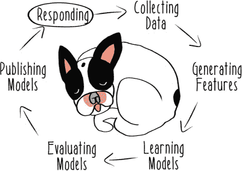

在现实世界中使用模型是困难的。为了了解在现实世界中使用模型的复杂性，我们需要从农场中的宁静转移到大城市的喧嚣。我们将考虑城市中移动最快的动物：乌龟。

### 8.1\. 以乌龟的速度移动

在整个动物王国中，龟出租车是其中最成功的初创公司之一，它是对出租车商业模式的一种技术化改造。在许多主要城市，他们已经很大程度上取代了像 Caribou Cabs 这样的传统交通业务。


他们成功的一部分归功于用户友好的移动应用程序，这使得乘客可以在任何时间、任何地点叫车。但成功的一个不那么明显的原因是机器学习。龟出租车雇佣了一支由半水生数据科学家和工程师（包括你）组成的大型团队，他们负责对交通基础设施进行复杂的在线优化。与城市公交或铁路系统相比，龟出租车车队是一个更难管理的系统。因为司机没有固定的日程，可以随时驾驶，因此可供客户服务的车辆车队总是在变化。同样，客户在需要时选择叫车，因此在传统公共交通系统中没有静态的日程。

这个高度动态的环境为龟出租车数据团队带来了巨大的挑战。他们需要回答重要的业务问题，包括以下内容：

+   是否有足够的司机在路上满足需求？

+   哪位司机应该服务哪个请求？

+   出租车价格应该根据需求上涨还是下降？

+   客户得到的是好服务还是坏服务？

+   司机是否在城镇的合适位置以满足需求？

龟出租车团队投入了大量的时间和精力确保他们的机器学习系统保持反应性。他们学习了许多模型，以帮助系统就所有这些复杂业务问题做出自主决策，并且他们的基础设施帮助他们*使用*这些模型在实时、大规模的情况下。我们将从对该基础设施的简化视图开始，将一些更复杂的现实世界问题留到本章的后面讨论。

### 8.2\. 使用任务构建服务

在前面的章节中，你已经看到了构建不同类型服务的各种技术和工具。特别是在第七章中，你使用了 Akka HTTP，这是 Akka 工具集的一个组件，来构建你的服务。尽管 Akka HTTP 对于许多应用来说是一个很好的选择，但本章介绍了一个用于构建服务的替代库，称为 http4s。

与从使用并发 actor 模型的工作中发展而来的 Akka HTTP 不同，http4s 提供了一个更多受到函数式编程影响的编程模型。这两种设计哲学之间的主要区别体现在用户 API 上。当你使用 http4s 时，你不会使用 actor 或为 actor 系统设置执行上下文。Http4s 是 Typelevel 项目家族的一部分([`typelevel.org`](http://typelevel.org))，并在其实现中使用了该组中的许多其他库。你可以使用 http4s 构建非常复杂的服务，但在这里你将主要使用它的简单性。

在探索如何使用 http4s 构建服务之前，我们应该先了解一个新概念。*任务*与未来相关，但是一个更复杂的结构，它允许你推理诸如失败和超时等问题。如果正确实现和使用，由于它们与 JVM 提供的底层并发设施如何交互，任务也可以比标准的 Scala 未来更高效。特别是，使用任务，你可以表达你可能永远不会执行的计算。本节将向你展示如何在程序中使用这种功能。

本章中任务的实现来自流行的 scalaz 项目。对于那些不熟悉 scalaz 的人来说，它是一个专注于在 Scala 中提供高级函数式编程特性的项目，类似于 Typelevel 项目家族的目标。不幸的是，scalaz 对任务的实现因其著名的文档不完整而闻名，所以我会为你提供在这里使用它所需的基本信息。


##### 注意

任务，就像未来一样，是一种强大的并发抽象，可以以各种不同的方式实现。Monix ([`monix.io`](https://monix.io))，也是 Typelevel 项目家族的一部分，是任务概念的另一种实现。


与未来一样，任务允许你执行异步计算，但与默认的懒惰不同，未来是贪婪的。在这个上下文中，*贪婪*意味着立即开始执行。假设未来是懒惰的是一个常见且合乎逻辑的错误，但尽管它们是异步的，实际上它们是贪婪的。它们会立即开始执行，即使你可能希望延迟执行的开始。列表 8.1 演示了这种有时不希望的特性。在这个列表和列表 8.2 中，假设`doStuff`是一个昂贵且运行时间长的计算，你只想在你准备好时触发它。

##### 列表 8.1\. 贪婪未来

```
import scala.concurrent.ExecutionContext.Implicits.global                *1*
import scala.concurrent.Future

def doStuff(source: String) = println(s"Doing $source stuff")            *2*

val futureVersion = Future(doStuff("Future"))                            *3*

Thread.sleep(1000)                                                       *4*

println("After Future instantiation")                                    *5*
```

+   ***1* 导入用于 Future 的执行上下文**

+   ***2* 定义表示你昂贵工作的函数**

+   ***3* 实例化一个 Future（并开始工作）**

+   ***4* 等待 1 秒以明显显示上一行已经开始执行**

+   ***5* 显示下一行代码只有在将未来的工作提交给执行后才会执行**

如果你在这个控制台执行这段代码，你应该会看到以下类似的输出：

```
Doing Future stuff
After Future instantiation
```

有时这个属性并不是问题，但有时它就是。例如，如果你想要为服务接收到的所有请求定义长时间运行的计算，但只想在 1%的时间内运行这个计算，那么一个`Future`会让你的服务做 100 倍于你想要做的工。在一个有多个模型可供预测的系统里，你可能只想对任何给定模型的合格请求的小子集进行预测。有一个不执行你不想让系统执行的工作的另一个选项会很好。

下一个列表显示了任务与 Future 的不同行为。

##### 列表 8.2. 懒任务

```
import scalaz.concurrent.Task

val taskVersion = Task(doStuff("Task"))            *1*

Thread.sleep(1000)                                 *2*

println("After Task instantiation")                *3*

taskVersion.run                                    *4*
```

+   ***1* 实例化一个 Task 但不开始工作**

+   ***2* 等待 1 秒以明显显示上一行尚未开始执行**

+   ***3* 显示整个第二秒已经过去**

+   ***4* 执行 Task**

与列表 8.1 相比，如果执行此代码，应该会产生以下类似的输出：

```
After Task instantiation
Doing Task stuff
```


现在你控制了何时以及是否执行像长时间运行的计算这样的工作。这显然是任务的一个强大功能，也是许多其他更高级任务特性的基础，比如可取消性。当你使用 http4s 构建服务时，你不需要了解太多关于任务的知识，但理解库的性能属性的基础是有帮助的。


任务只是 http4s 为构建高性能服务提供的功能的一个方面。该库还使用 scalaz streams 来处理任意数量的数据。

这只是你可以用这些库做到的一小部分，但应该足够你开始构建预测服务。

### 8.3. 预测交通

现在我已经介绍了工具，让我们回到解决问题上来。特别是，让我们考虑匹配出租车司机与乘客的问题。Turtle Taxi 团队使用机器学习来预测成功的司机-乘客匹配。对于给定的乘客，他们的系统将尝试从一组可用的司机中预测乘客最有可能享受与之共乘的司机（如通过移动应用上的司机评分记录）。本节将介绍你的团队如何创建一个服务来对这种司机-乘客匹配成功问题进行预测。

首先，你需要创建一些模型来工作。由于前面的章节已经介绍了多种生成机器学习模型的方法，我不会在这里重复所有这些内容。为了构建本章所需的架构，你可以使用简单的 *桩*（模拟）模型。

Turtle Taxi 团队使用了大量模型，因此你将从一开始就构建对多个模型的支持。如第五章所述（kindle_split_016.html#ch05），组合使用多个模型称为集成。在本节中，你将做一些与集成略有不同的事情。你不会在任意的预测请求中使用你的模型组合，而是会根据需要使用一个或另一个模型。正如你在前面的章节中看到的，现实世界的机器学习系统以许多不同的方式使用模型。像 Turtle Taxi 这样的大数据团队通常会为不同的目的生产许多模型。这些模型可能具有不同的优势和劣势，团队通过使用这些模型来找出这些优势和劣势。对不同建模技术的实验是机器学习过程中的一个重要部分。你的 Turtle Taxi 团队已经构建了一个系统，允许他们在生产环境中测试不同的学习模型，所以你在这里将模拟这种实现。特别是，你将构建一个简单的模型实验系统，将一些流量发送到一个模型，一些发送到另一个模型，以评估模型性能。图 8.2 展示了你将要构建的简单形式。

##### 图 8.2\. 模型实验架构

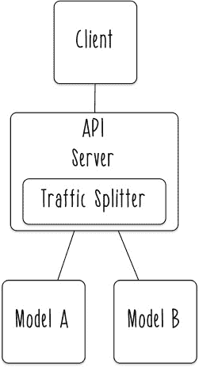

列表 8.3 展示了如何创建两个简单的桩模型，这些模型以服务的形式预测真或假。它们代表了两种不同的司机-乘客匹配成功模型。

##### 列表 8.3\. 桩模型

```
import org.http4s._
import org.http4s.dsl._

object Models {
  val modelA = HttpService {                          *1*
    case GET -> Root / "a" / inputData =>             *2*
      val response = true                             *3*
      Ok(s"Model A predicted $response.")             *4*
  }

  val modelB = HttpService {                          *5*
    case GET -> Root / "b" / inputData =>
      val response = false                            *6*
      Ok(s"Model B predicted $response.")
  }

}
```

+   ***1* 定义模型为一个 HTTP 服务**

+   ***2* 使用模式匹配来确定是否收到了对模型 A 的请求**

+   ***3* 模型 A 总是响应为真**

+   ***4* 返回一个包含模型预测的 OK 状态码**

+   ***5* 为模型 B 定义了一个类似的桩模型服务**

+   ***6* 模型 B 总是返回假**

注意，这些模型被构建为 HTTP 服务。一旦你完成所有必要的基础设施建设，它们将通过任何能够通过网络发送 HTTP 请求到它们的客户端（例如，你的本地计算机）独立访问。

虽然你还没有完成所有必要的步骤来将这些模型作为服务公开，但让我们先了解一下你希望如何调用这些服务。出于开发目的，让我们假设你从本地计算机（localhost）的 8080 端口提供所有预测功能。我们还使用名为 *models* 的路径下给定模型的名称来命名所有你的模型。

使用这些假设，你可以创建一些客户端辅助函数，从系统的其他部分调用你的模型。重要的是要注意，你将这个客户端功能定义在 Scala 项目中，纯粹是为了方便。因为你是将这些服务构建为可网络访问的 HTTP 服务，其他客户端可以很容易地是使用 Swift 或 Java 实现的移动应用，或者使用 JavaScript 实现的前端网页。下一个列表中的客户端功能是一个成功匹配预测功能消费者可能看起来像的例子。

##### 列表 8.4\. 预测客户端

```
import org.http4s.Uri
import org.http4s.client.blaze.PooledHttp1Client

object Client {                                                 *1*

  val client = PooledHttp1Client()                              *2*

  private def call(model: String, input: String) = {            *3*
    val target = Uri.fromString(s"http://localhost:8080/
     models/$model/$input").toOption.get                      *4*
    client.expectString                               *5*
  }
  def callA(input: String) = call("a", input)                   *6*

  def callB(input: String) = call("b", input)                   *7*

}
```

+   ***1* 创建一个对象来包含客户端辅助函数**

+   ***2* 实例化一个 HTTP 客户端以调用建模服务**

+   ***3* 将调用模型的公共步骤提取到一个辅助函数中**

+   ***4* 危险技术：从动态输入创建一个调用模型的 URI 并强制立即乐观解析**

+   ***5* 创建一个任务来定义请求**

+   ***6* 创建一个调用模型 A 的函数**

+   ***7* 创建一个调用模型 B 的函数**

在列表 8.6 中使用 `.toOption.get` 的做法并不好——我只是在开发中用它作为一个便利。http4s 中 URI 构建功能的实现试图对动态生成的值（如模型名称和输入数据）更加安全。未来对这个代码的重构可能会关注更复杂的错误处理或使用静态定义的路由，但就目前而言，你将接受可能会收到无法处理的输入，这会导致错误。

你希望公开一个 API，该 API 抽象化了你可能在任何给定时间发布到服务器上的模型数量。目前，海龟们希望模型 A 接收 40% 的预测请求，模型 B 接收剩余的 60%。这是他们为了在模型 A 展现出优越性能之前更偏好模型 B 而做出的任意选择。你将使用一个简单的分割函数来根据输入数据的哈希码来划分流量，类似于你在第六章中划分数据的方式。下一个列表展示了这个哈希函数的实现。

##### 列表 8.5\. 分割预测请求

```
def splitTraffic(data: String) = {                   *1*
  data.hashCode % 10 match {                         *2*
    case x if x < 4 => Client.callA(data)            *3*
    case _ => Client.callB(data)                     *4*
  }
}
```

+   ***1* 根据输入分割流量的函数**

+   ***2* 对输入进行哈希处理并取模以确定使用哪个模型**

+   ***3* 使用模式匹配在 40% 的时间内选择模型 A**

+   ***4* 在剩余情况下使用模型 B**

如果你部署了更多模型，你可以根据部署的总模型数量和它们应该接收的流量量来扩展这种方法，使其更加动态。

现在你已经有了这些组件，你可以将它们全部整合到一个统一模型服务器中。在这种情况下，你将定义你的公共 API 位于名为 *api* 的路径上，预测功能位于 api 的 predict 路径下。

##### 列表 8.6\. 一个模型服务

```
import org.http4s.server.{Server, ServerApp}
import org.http4s.server.blaze._
import org.http4s._
import org.http4s.dsl._

import scalaz.concurrent.Task

object ModelServer extends ServerApp {                       *1*
  val apiService = HttpService {                             *2*
    case GET -> Root / "predict" / inputData =>              *3*
      val response = splitTraffic(inputData).run             *4*
      Ok(response)                                           *5*
  }

  override def server(args: List[String]): Task[Server] = {  *6*
    BlazeBuilder                                             *7*
      .bindLocal(8080)                                       *8*
      .mountService(apiService, "/api")                      *9*
      .mountService(Models.modelA, "/models")                *10*
      .mountService(Models.modelB, "/models")                *11*
      .start                                                 *12*
  }

}
```

+   ***1* 将模型服务定义为 ServerApp 以实现优雅的关闭**

+   ***2* 定义另一个 HttpService 作为外部使用的 API 主端点**

+   ***3* 使用模式匹配来定义何时收到预测请求**

+   ***4* 将输入数据传递给一个流量分配函数，立即调用它**

+   ***5* 通过具有 OK 状态的响应进行 5 次传递**

+   ***6* 定义服务器的行为**

+   ***7* 使用 Blaze 内置的后端构建服务器**

+   ***8* 绑定到本地机器上的 8080 端口**

+   ***9* 在/api 路径上挂载 API 服务**

+   ***10* 将模型 A 的服务附加到/models 服务器上**

+   ***11* 将模型 B 的服务附加到/models 服务器上**

+   ***12* 启动服务器**

现在，你可以看到你的模型服务器正在运行。如果你已经定义了构建应用程序的方法，你可以构建并运行它。

关于如何为这个应用程序设置构建的示例，请参阅本书的在线资源([www.manning.com/books/reactive-machine-learning-systems](http://www.manning.com/books/reactive-machine-learning-systems)或[`github.com/jeffreyksmithjr/reactive-machine-learning-systems`](https://github.com/jeffreyksmithjr/reactive-machine-learning-systems))。一旦你的应用程序可以构建，你可以发出`sbt run`命令，你的服务应该启动并绑定到本地机器上的 8080 端口。

你可以使用标准的网络浏览器测试你的服务，并通过各种端点调用 API 端点。例如，如果字符串`abc`代表这个服务的有效特征向量，那么在 http://localhost:8080/api/predict/abc 上调用将产生模型 B 的预测结果（不匹配）。


回顾你刚刚构建的内容，你会发现一些有用的功能。它有一种简单的方式来处理多个模型。此外，很明显，你可以通过启动更多模型服务的实例并可能将它们放在负载均衡器后面来获得至少一些弹性。

你可以在图 8.3 中看到这种架构的草图。这不是一个坏的方法，但它仍然缺乏一些现实感。乌龟是坚韧的生物，知道如何为生活中可能发生的最糟糕的事情做好准备。让我们看看它们是如何使他们的机器学习系统变得坚韧的。

##### 图 8.3\. 负载均衡的模型服务

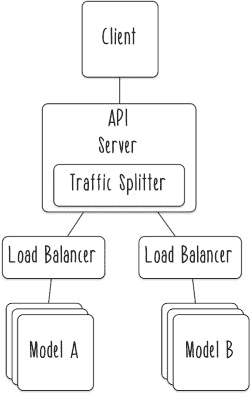

### 8.4\. 处理故障

正如你在本书中多次看到的，事情会失败。无论是穿山甲、毒箭蛙，还是普通的数据库，没有错误就不会运行。

模型服务也没有不同。从你的系统不同组件中分离出一些很好的属性，如封装和监督组件的能力。但你的当前实现仍然容易受到失败后果的影响。

让我们看看如何通过构建一个一半时间会失败的模型来处理故障。这应该会给你很多处理故障的机会。列表 8.9 是另一个像你之前构建的简化占位符模型，但有一个重要的区别：它将所有请求中的一半视为无效请求，并无法返回预测。

##### 列表 8.7\. 一个不可靠的模型

```
import scala.util.Random

val modelC = HttpService {                               *1*
  case GET -> Root / "c" / inputData => {                *2*

    val workingOk = Random.nextBoolean()                 *3*

    val response = true                                  *4*

    if (workingOk) {                                     *5*
      Ok(s"Model C predicted $response.")                *6*
    } else {
      BadRequest("Model C failed to predict.")           *7*
    }
  }
}
```

+   ***1* 为模型 C 创建了一个 HttpService**

+   ***2* 定义与其它模型相同的 GET 端点**

+   ***3* 使用随机的布尔值模拟偶尔的故障**

+   ***4* 当服务正常工作时始终预测为真**

+   ***5* 确定服务是在工作状态还是非工作状态**

+   ***6* 返回正常的成功预测**

+   ***7* 无法预测，返回 BadRequest 状态码**

这个令人烦恼的不可靠模型是系统中真实可能发生故障的良好替代品，那么你该如何处理这种故障的可能性呢？你可以通过监督层次结构将故障的可能性构建到你的系统中，正如你在第二章和第三章中看到的。

下一个列表通过调整调用模型服务的方式开始了这次重构。

##### 列表 8.8\. 重构的调用服务

```
private def call(model: String, input: String): Task[Response] = {   *1*
  val target = Uri.fromString(
    s"http://localhost:8080/models/$model/$input"
    ).toOption.get
  client(target)                                                     *2*
}

def callC(input: String) = call("c", input)                          *3*
```

+   ***1* 重新定义了调用辅助函数**

+   ***2* 使用客户端调用目标并返回 Task[Response]**

+   ***3* 定义了一个用于调用模型 C 的辅助函数**

在这次重构之后，对服务的调用返回一个 `Task[Response]`。我认为这种方法更直接地说明了你正在做什么工作。具体来说，这个新的类型签名编码了两个知识点：这个调用将花费时间，并且这个调用将返回一个 `Response`，这可能不是一个成功的响应。

接下来，让我们看看你如何在上层处理故障的可能性。在此之前，你只有一个简单的 `ModelServer`，其工作只是处理从请求到模型以及返回的数据。随着这些更改，你开始构建一个 `ModelSupervisor`，它具有层次责任，在出现不理想结果时决定要做什么。在这种情况下，你想要识别模型何时失败，并将有关该故障的消息传递回用户。这是一个设计选择。在其他情况下，你可能想要做不同的事情，例如返回默认响应。重点是，你现在明确地处理故障，并在源代码中做出关于如何处理它的决定。

##### 列表 8.9\. 一种了解故障模式的模型管理员

```
import org.http4s.server.{Server, ServerApp}
import org.http4s.server.blaze._
import org.http4s._
import org.http4s.dsl._

import scalaz.concurrent.Task

object ModelSupervisor extends ServerApp {

  def splitTraffic(data: String) = {                             *1*
    data.hashCode % 10 match {
      case x if x < 4 => Client.callA(data)
      case x if x < 6 => Client.callB(data)
      case _ => Client.callC(data)                               *2*
    }
  }

  val apiService = HttpService {
    case GET -> Root / "predict" / inputData =>
      val response = splitTraffic(inputData).run

      response match {                                           *3*
        case r: Response if r.status == Ok =>
         Response(Ok).withBody(r.bodyAsText)                   *4*
        case r => Response(BadRequest).withBody(r.bodyAsText)    *5*
      }
  }

  override def server(args: List[String]): Task[Server] = {
    BlazeBuilder
      .bindLocal(8080)
      .mountService(apiService, "/api")
      .mountService(Models.modelA, "/models")
      .mountService(Models.modelB, "/models")
      .mountService(Models.modelC, "/models")                    *6*
      .start
  }

}
```

+   ***1* 重新定义了流量分配函数**

+   ***2* 将最后 40% 的流量分配给模型 C**

+   ***3* 在调用服务的结果上匹配模式**

+   ***4* 返回包含模型预测作为响应体的成功响应**

+   ***5* 返回包含故障消息作为响应体的失败响应**

+   ***6* 将模型 C 添加到正在提供的服务中**


再次强调，你可以在定义如何处理失败的`case`子句中做任何你想做的事情，因为现在你有通过监督结构进行明确控制的能力。

现在我们来看看这个结构是如何工作的。为了进行下一阶段的测试，我建议我们停止编写 Scala 代码，而是使用命令行工具。具体来说，让我们使用 cURL，这是一个有用的开源工具，你可能已经安装在你的系统上（如果你使用的是 macOS 或 Linux）。如果你使用的是 Windows，你可能需要从 cURL 网站下载最新版本（[`curl.haxx.se`](https://curl.haxx.se)）。

使用 cURL，你可以以与之前使用网络浏览器相同的方式向你的 API 服务器和模型服务发送数据。使用 cURL 的优点是，你可以设置更多选项，以确定你如何与服务器端应用程序交互以及如何检查它们的结果。在以下示例中，你将使用`-i`选项来检查从你的服务返回的 HTTP 头部。

下一个列表介绍了如何通过调用映射到表现正常的模型的 API 端点来使用 cURL。

##### 列表 8.10\. 成功的响应

```
$ curl -i http://localhost:8080/api/predict/abc       *1*
HTTP/1.1 200 OK                                       *2*
Content-Type: text/plain; charset=UTF-8               *3*
Date: Sun, 02 Oct 2016 21:07:31 GMT
Content-Length: 114

Model B predicted false.                              *4*
```

+   ***1* 调用预测并显示头部**

+   ***2* 从头部返回的 OK 状态码**

+   ***3* 返回响应的信息**

+   ***4* 模型 B 的预测**

所有这些都工作得很好，但如果你使用的是定期不可靠的模型 C 呢？在某些情况下，它会表现得像这样。

##### 列表 8.11\. 可能的成功响应

```
$ curl -i http://localhost:8080/api/predict/abe       *1*
HTTP/1.1 200 OK                                       *2*
Content-Type: text/plain; charset=UTF-8
Date: Sun, 02 Oct 2016 21:12:32 GMT
Transfer-Encoding: chunked

Model C predicted true.                               *3*
```

+   ***1* 调用不同的预测，映射到不同的模型**

+   ***2* 成功的响应**

+   ***3* 模型 C 的预测**

一切正常，你看到的就是你期望看到的内容。但另一半的时间，你应该看到一个失败的请求，看起来像这样。

##### 列表 8.12\. 可能的失败响应

```
$ curl -i http://localhost:8080/api/predict/abe
HTTP/1.1 400 Bad Request                            *1*
Content-Type: text/plain; charset=UTF-8
Date: Sun, 02 Oct 2016 21:27:33 GMT
Transfer-Encoding: chunked

Model C failed to predict.                          *2*
```

+   ***1* 来自预测请求的失败响应**

+   ***2* 失败信息**

如预期的那样，有时模型 C 完全掉链子。这对出租车乌龟来说是个坏消息。这种预测失败可能对整个系统产生非常负面的影响，具体取决于调用者的实现方式。在最坏的情况下，这种失败可能会使匹配乘客和司机的整个过程崩溃，这可能导致收入损失。

然而，这种失败，就像许多现实世界的失败一样，是短暂的；模型并不总是预测失败。当它返回预测时，你没有理由不使用它。模型应该是一个纯的、无状态的函数。你仍然可以构建一个能够适应失败可能性的解决方案——这只需要更多的努力。一个可能的解决方案可能如下所示，它设置了重试逻辑。

##### 列表 8.13\. 在调用模型时添加重试

```
private def call(model: String, input: String) = {
  val target = Uri.fromString(s"http://localhost:8080/
   models/$model/$input").toOption.get
  client(target).retry(Seq(1 second), {_ => true})             *1*
}
```

+   ***1* 所有失败在 1 秒后重试**

使用这种方法，通过重试一次，你可以立即将失败率减半。对于这个不靠谱的模型，这种重试策略可以渐近地接近完全可靠性。

### 8.5\. 架构响应系统

本章介绍了一些使用模型来响应来自你机器学习系统外用户请求的策略。我尽量使内容足够现实，以便有用，包括多个模型和失败的可能性等复杂情况。但信不信由你，真实的 Turtle Taxi 机器学习系统比这更复杂。它拥有数百万用户，同时有数万到数十万用户活跃。乘客需要在几秒钟内连接到他们所在地区的可用司机，并在几分钟内被接走——否则，Turtle Taxi 业务将陷入停滞并失败。面对这些苛刻的现实需求，团队的真正基础设施看起来更像图 8.4。

##### 图 8.4\. 模型服务架构

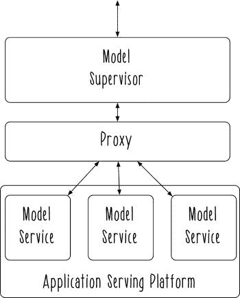

正如你在本章中实施的那样，所有模型都是独立的服务，但每个服务都以某种形式独立打包。Docker 是一个常见的选择，使用你在上一章中探索的技术。但 JVM 也包含一种打包方法——构建 JAR 文件，这可以在某些应用服务平台上使用。你在第七章中稍微接触过 JAR 文件，而在第九章中你将更详细地使用它们。


这些模型服务都托管在我称之为“应用服务平台”的地方，但有时也被称为“容器编排平台”（通常，当它专注于使用 Docker 或其他形式的容器时）。这类平台的例子有 Marathon ([`mesosphere.github.io/marathon`](https://mesosphere.github.io/marathon)) 和 Kubernetes ([`kubernetes.io`](http://kubernetes.io))，都是开源软件；亚马逊的 EC2 容器服务 ([`aws.amazon.com/ecs`](https://aws.amazon.com/ecs))；微软的 Azure 容器服务 ([`azure.microsoft.com/en-us/services/container-service`](https://azure.microsoft.com/en-us/services/container-service))；以及 Kubernetes 引擎 ([`cloud.google.com/kubernetes-engine`](https://cloud.google.com/kubernetes-engine))，这些都是云托管服务。这些解决方案的关键方面是它们允许你托管打包的应用程序，并使用某种界面来管理它们。它们都提供了一定程度的基本隔离，通过将任何单个应用程序使用的资源与其他所有应用程序隔离开来，从而限制了错误传播等问题发生的可能性。


正如你在本章中看到的，一旦有了可用的模型，还有很多事情需要弄清楚。图 8.4 展示了本章中作为模型监督者所工作的许多功能。它还清楚地表明，在本章中用 Scala 实现的许多网络组件通常由另一个组件处理，该图称之为*代理*。这个组件的作用纯粹是路由预测请求到应该提供服务的特定服务。可以承担这种角色的应用程序示例包括 NGINX([www.nginx.com](http://www.nginx.com))和 HAProxy([www.haproxy.org](http://www.haproxy.org))。在实践中，许多面向容器的平台也可以处理一些网络复杂性。请注意，模型监督者和代理原则上可以托管在与模型服务相同的同一个应用服务平台上。然而，无论其实现方式如何，这个组件的工作职责是相同的：赋予模型监督者管理模型及其接收到的流量的能力。

这种架构的实现并不简单。通常情况下，你需要一支由聪明的小海龟组成的团队来搭建所有这些组件，并使它们有效地协同工作。

但你当然可以从本章中实现的简化设计中逐步构建到更复杂的方法。反应式设计的底层原则保持不变。

### 8.6. 反应性


+   *使用任务构建数据转换的管道*。现在你已经看到了它们在实际中的应用，你可能对使用任务做更多的事情感兴趣。任务的一个合理用例是计算密集型的数据转换管道。这种管道在机器学习中很常见，尤其是在（但不限于）特征生成管道中。任务的一个优点是它们可以以各种方式组合，然后并发运行。你可以在管道中尝试实现像 Y 形操作图这样的东西，其中两个依赖步骤必须并发执行，然后第三个步骤才能开始。如果你想深入了解管道的行为，尝试通过不良数据或其他技术将故障引入其中一个步骤：

    +   当你的管道遇到不良输入时，它会如何反应？

    +   那种行为是你想要的吗？

    +   如果不是，你该如何改变它？

+   *将容器化服务部署到应用程序服务平台上*。如果你一直跟随这本书学习，你应该有一个在容器内构建的服务。容器的好处在于它们是可移植的，所以可以将该服务部署到任何地方。许多不同的云供应商提供容器托管服务，通常你的初始使用是免费的（有关一些选项，请参阅第 8.5 节）。你也可以选择将你的容器部署到你自己托管的应用程序服务平台上。这稍微复杂一些，但如果你在办公室的 Mesos 集群上已经运行了类似 Marathon 的东西，你也可以使用这些选项之一。一旦部署了服务，你可以思考一下持续运营它可能意味着什么：

    +   如果对服务的请求急剧增加，会发生什么？

    +   你如何知道部署的服务正在执行它应该执行的操作？

    +   你如何回滚到服务的先前版本？

    +   如果应用程序服务平台的一个底层服务器消失了，你的服务会发生什么？（如果你不知道答案，你总是可以向你控制的服务器发送关机命令，看看会发生什么！）

### 摘要

+   任务是有用的懒惰原语，用于结构化昂贵的计算。

+   将模型作为服务构建可以使弹性架构更容易构建。

+   模型服务失败可以由模型管理员处理。

+   隔离和监督的原则可以应用于系统设计的多个层面，以确保反应性。

这本书的第二部分到此结束。在第三部分中，我们将探讨一些与保持机器学习系统运行、改变和扩展相关的一些更高级的问题。
