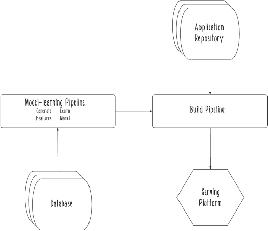
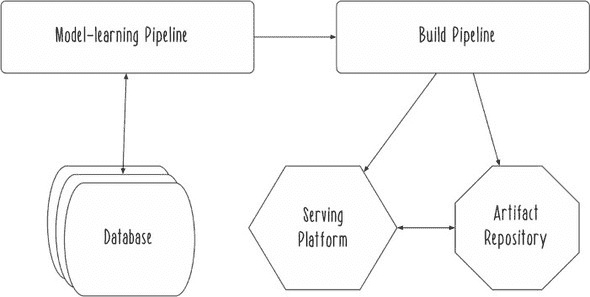
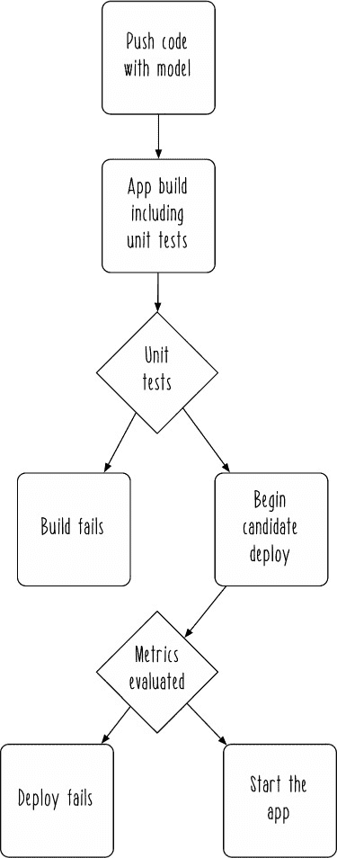
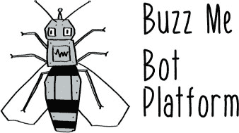
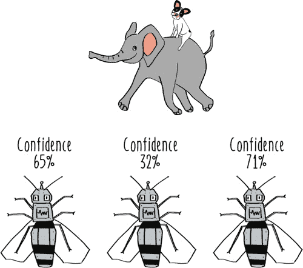

## 第三部分\. 运营机器学习系统

虽然本书的一部分专注于达到拥有整个机器学习系统的目标，第三部分则是关于接下来会发生什么。在机器学习系统运行的过程中，必须完成各种工作，使你们能够改变和改进系统。

第九章深入探讨了如何构建和部署机器学习系统。它涵盖了为其他类型的软件应用程序开发的最佳实践，并将它们应用于反应式机器学习系统的独特责任。

第十章探讨了如何逐步提升系统的智能能力。它介绍了人工智能平台的长远目标。本章提供了本书对系统设计最全面的视角。我鼓励你们将这种广阔的视角作为一种思考方式，来考虑作为反应式机器学习系统架构师所培养的技能。

## 第九章\. 交付

*本章涵盖*

+   使用 sbt 构建 Scala 代码

+   评估部署应用程序

+   部署策略

现在你们已经看到了机器学习系统所有组件如何协同工作，是时候考虑一些系统级挑战了。在本章中，我们将探讨如何向系统的最终用户交付一个机器学习系统。我们将用于这个挑战的方法被称为*持续交付*。持续交付背后的思想是在机器学习环境之外发展的，但正如你们将看到的，它们完全适用于使机器学习系统反应式化的挑战。

持续交付实践者寻求通过定期构建和部署新代码的循环，快速交付新的功能单元。采用这种方法的团队通常试图快速行动同时保持用户满意。持续交付的技术提供了允许团队实现这些竞争目标的策略。鉴于你们所看到的机器学习系统可能失败的所有方式，我希望很明显，在这些系统中保持一致的行为是件困难的事情。不确定性在机器学习系统中普遍存在且固有其本质。

### 9.1\. 发货水果

本章中你们将要加入的团队由整个丛林中最以客户为中心、最有同理心的动物组成：大猩猩。丛林果汁盒（JJB）是一家专注于喜欢在自己家中制作水果冰沙的灵长类动物创业公司（图 9.1）。每个月，丛林果汁盒的订阅者都会收到一个装有新鲜水果的盒子，这些水果是根据当季水果和客户的感知偏好为他们单独挑选的。

##### 图 9.1\. 丛林果汁盒


与今天的大多数初创公司一样，Jungle Juice Box 的巨猿们使用复杂的数据技术来满足他们的客户。特别是，他们定期收集所有订阅者的反馈评分，以便他们可以使用机器学习为每个订阅者提供独特的推荐水果。关注水果推荐部分的系统架构看起来类似于图 9.2。

##### 图 9.2\. 水果选择架构



过去的水果选择订阅者评分，存储在数据库中，用于生成训练实例的特征和概念标签。然后，从这些实例中学习模型，这些模型包含在构建管道中更大应用程序的构建中。构建管道生成一个工件，然后部署到应用程序服务平台的实际生产系统上，用于实时水果选择决策。所有这些在书的第二部分中看起来相对熟悉。本章重点介绍系统的关键部分，即新模型的评估和部署决策。在 JJB 系统中，这个点就是构建和部署管道。

### 9.2\. 构建和打包

在这一点上，值得快速回顾一下我所说的*构建代码*的含义。在这本书中，你主要使用 Scala 构建应用程序，Scala 运行在 Java 虚拟机（JVM）之上。至少，你的源代码文件需要编译成字节码，以便由 JVM 执行，但你通常需要做的不仅仅是编译你的代码。有时，会有资源文件，比如你在第七章中生成的 Parquet 和 JSON 模型文件。这些其他类型的工件是你运行代码所需的一部分，即使它们是由`scalac`编译器直接输出的。通常，你只需要确保这些文件可以与其他代码一起传递。这个过程通常被称为*打包*。

第七章展示了使用 Docker 容器的一个强大的打包方法。但当然还有其他方法可以打包你的应用程序。任何能给你一种连贯的方式来分组所有应用程序的可执行代码和必要资源的都是一种潜在可行的选择。

由于 JJB 的巨猿们在 Scala 中构建机器学习系统，他们使用来自 JVM 生态系统的打包方法：构建 JAR 文件。正如第七章中讨论的，JAR 文件是编译的 JVM 代码和相关资源的归档。当使用 Scala 时，你有几种方法可以生成 JAR 文件。Jungle Juicers 使用一种从 sbt 执行的方法，并依赖于一个插件来扩展 sbt 生成可部署工件的能力。

Juicers 分发他们应用程序的可执行版本的方式是包含所有必需依赖（库）的 JAR 文件。这种打包方式产生的工件有时被称为 *fat JAR*，意味着它包含了所有可能由执行环境提供的依赖。他们选择这种方法是因为它简化了分发和执行他们应用程序的一些方面。

要开始，你需要将 `sbt-assembly` 插件添加到你的项目中。在你的项目内部，创建一个名为 *project* 的目录，并在该目录中创建一个名为 *assembly.sbt* 的文件。该文件应包含添加 `sbt-assembly` 插件的指令。

##### 列表 9.1\. 添加 `sbt-assembly`

```
addSbtPlugin("com.eed3si9n" % "sbt-assembly" % "0.14.3")
```

然后，你需要定义一个构建，如下一个列表所示，它展示了 JJB 团队如何设置构建。

##### 列表 9.2\. 一个 SBT 构建

```
lazy val http4sVersion = "0.14.6"

libraryDependencies ++= Seq(                                   *1*
  "org.http4s" %% "http4s-dsl" % http4sVersion,
  "org.http4s" %% "http4s-blaze-server" % http4sVersion,
  "org.http4s" %% "http4s-blaze-client" % http4sVersion,
  "org.http4s" %% "http4s-argonaut" % http4sVersion
)

mainClass in Compile := Some
 ("com.reactivemachinelearning.ModelServer")                  *2*
```

+   ***1* 定义依赖**

+   ***2* 设置主类，当存档运行时将被执行**

如果你已经正确完成了所有这些步骤，你现在可以通过发出命令 `sbt assembly` 来构建你的项目。这个命令将生成一个包含所有你的代码和资源，以及你的代码所需的全部依赖的 JAR 文件。汇编任务会通过一条类似“打包 /your-app/target/scala-2.11/your-app-assembly-1.0.jar....”的消息告诉你这个 JAR 文件的位置。现在这个单一的存档可以被传递到任何可以运行 JVM 代码的执行环境中。

### 9.3\. 构建管道

这个构建和打包步骤只是现实世界中构建管道（例如 Jungle Juice Box 中的管道）所执行的可能步骤之一。在他们自己的管道中，他们需要获取代码，构建它，测试它，打包它，并发布生成的工件。这个管道还必须在已经安装了必要软件（如 Git 和 sbt）的某种构建服务器上执行。该管道还期望执行环境中存在某些环境变量。有关环境变量使用的更多信息，请参阅第四章的讨论。chapter 4。最后，该管道假定它正在 Unix-like 环境中（例如，Ubuntu Linux）执行。下面的列表显示了如何将这些步骤组合成管道的 shell 脚本近似。

##### 列表 9.3\. 构建管道

```
#!/bin/sh

cd $PROJECT_HOME                                                           *1*

git pull                                                                   *2*

sbt compile                                                                *3*

sbt test                                                                   *4*

sbt assembly                                                               *5*

rsync -a $PROJECT_HOME/target/scala-2.11/fruit-picker-assembly-1.0.jar \
    username@artifact_server:~/jars/fruit-picker/$VERSION_NUMBER           *6*
```

+   ***1* 使用环境变量导航到根项目目录**

+   ***2* 拉取代码的最新版本**

+   ***3* 编译项目**

+   ***4* 测试项目**

+   ***5* 将项目打包成一个 fat JAR**

+   ***6* 使用 rsync 在带版本号的目录下将 JAR 发布到远程服务器**

为了明确起见，这是一个简化的构建管道版本。请注意，调用`sbt test`本身就会触发编译，从而消除了`sbt compile`步骤的需要。这两个步骤只是为了清晰展示过程中的步骤。使用`rsync`，这是一个 Unix 工具，用于在远程服务器等位置之间复制数据，是一个简单但粗略的方法。这个发布步骤使用目录结构和名称来组织不同版本应用程序的不同工件，而不是使用更复杂的技术，如发布到 Maven 仓库。如果你对构建管道很了解，这个可能看起来很粗略，但即使是这样一个简单的构建管道也可以是说明性的。

首先，你有一个专门用于评估应用程序的步骤，即`test`步骤。这是一个放置任何评估模型的测试的绝佳位置，类似于你在第六章中看到的技巧。如果这些测试中的任何一个失败，构建管道将停止，不会发布应用程序。其次，你只是在管道的末端进行发布。就像你之前多次做的那样，你使新工件可用于使用，但不会立即改变运行应用程序的状态。相反，你将这个决定留给另一个系统组件。

### 9.4\. 评估模型

现在你已经构建了一个最小版本的构建管道，让我们考虑如何在管道中做出一些决策。在第六章中，你学习了如何评估模型并确定它们是否应该被使用。现在你可以将这些技能应用到构建和部署机器学习系统组件的更大任务中。

就像大多数机器学习团队的成员一样，《丛林榨汁机》团队不想部署有缺陷的功能。在他们的情况下，后果会很严重——无法预测他们的订阅者想要哪种水果——因此他们开发了一系列旨在保持他们的机器学习系统稳定的机制。其中之一就是他们在部署过程中的模型评估步骤。

在这个步骤中，模型在部署之前被验证为优于某些标准。如果模型通过测试，则应用程序可以在生产中使用。如果没有，则不应使用此版本的应用程序，生产系统也不应更新。

在第六章中，我展示了如何评估模型相对于随机模型的性能。这不是你确定模型是否可以在你的生产系统中使用的唯一方法。表 9.1 显示了某些替代方案的优势和劣势。

##### 表 9.1\. 模型部署标准

| 标准 | 优点 | 缺点 |
| --- | --- | --- |
| 优于随机 | 很不可能拒绝一个有用的模型 | 性能门槛低 |
| 优于某些固定值 | 可以设计来满足业务需求 | 需要一个任意的参数 |
| 优于之前的模型 | 保证单调递增的性能 | 需要准确了解之前模型部署后的性能 |

在 Jungle Juice Box 的案例中，他们计划使用一个固定值，90% 的精确度，来决定是否应该部署学习模型。90% 的选择是任意的，但它很好地符合他们对模型映射到水果推荐用户满意度直觉的认识。缺点是，手动执行这种评估并检查每个学习模型的这些值将是一个费力的过程，所以让我们看看这一步如何集成到一个更自动化的流程中。

### 9.5\. 部署

在这一点上，你可能对自己的模型有信心，因为构建管道中的验证为你提供了保证。你可能会继续进行部署。在这种情况下，“部署”意味着发布你的机器学习系统组件并开始对真实用户请求进行操作，正如我们在第八章中探讨的那样。对于你的 JJB 团队来说，这一步骤的组件系统看起来就像图 9.3 所示。

##### 图 9.3\. 模型部署



测试通过后，应用程序 JAR 被推送到远程工件存储库。然后构建管道调用应用程序服务平台的 API 以开始应用程序的部署。服务平台将需要配置必要的资源，将 JAR 下载到沙盒中，然后启动应用程序。

你应该多久部署一次系统？什么决定了你应该进行部署？这实际上是一个非常复杂的话题。粗略地说，有四种方法来决定何时部署以及为什么部署，如表 9.2 所示。

##### 表 9.2\. 部署方法

| 风格 | 标准 | 频率 | 优点 | 缺点 |
| --- | --- | --- | --- | --- |
| 临时 | 无 | 可变，但通常不频繁 | 简单灵活 | 由于部署技能和/或自动化程度低，部署可能很困难 |
| 在里程碑时 | 达到一些有意义的发展里程碑 | 周到月 | 清晰的部署规划 | 非计划部署可能很困难 |
| 定期 | 达到确定的时间量 | 天到周 | 规律性建立技能和速度 | 可能很费工 |
| 持续 | 承诺到主分支 | 每天多次 | 快速响应变化 | 需要投资于预部署启用能力 |

如您所见，在决定如何构建您的部署流程时需要考虑一些复杂的权衡。Jungle Juice Box 团队在早期公司历史中使用了其他流程之后，选择了持续部署流程。在他们尝试表 9.2 中方法的变化时，他们发现较少的部署导致他们在构建和部署基础设施上的投资不足。他们并不经常部署，而且每次部署都如此痛苦，以至于一旦部署完成，他们更愿意做任何其他事情，而不是改进部署流程。当他们决定需要更快地将更新发送到水果推荐系统时，他们意识到他们需要实施能够使他们能够持续部署系统的功能。

在基本层面上，他们需要可靠的测试来告诉他们应用程序是否可以部署。这些测试需要由一个自动构建管道使用，该管道能够确定应用程序是否应该部署，然后继续进行部署。

他们最终得到一个看起来像图 9.4 的流程，其中一系列自动化决策被做出以确保特定的部署是安全的。请注意，预测系统的能力在两个层面上进行测试。首先，单元测试验证了无需使用大量数据即可评估的系统属性。然后，在构建了可部署的应用程序版本之后，该候选版本在更大的数据集上进行评估。在这一步中，评估系统的性能指标以确保整个系统能够足够好地完成其核心任务：预测订阅者的水果偏好。这种特定的技术有时被称为基于指标的部署。只有当两个测试级别都通过后，你才调用命令启动应用程序。


##### 图 9.4\. 水果预测系统的自动部署



在确保应用程序安全性的方法到位后，Jungle Juice Box 团队能够以强大的方式开始工作。应用程序仓库主分支的所有提交都会触发一次部署，因此这些部署是持续进行的，通常每天进行多次。这意味着水果预测系统始终反映了 JJB 数据团队的最新和最佳成果。当出现问题时，团队能够快速响应并在相对较短的时间内修复系统。通常，不会出现任何问题——测试正在做所有确保事情顺利进行的工作，因此团队可以做一些其他事情，而不是担心部署是否顺利。大多数情况下，他们根本不思考部署，而是专注于构建更好的机器学习系统的艰苦工作。

### 9.6\. 反应性活动


这里有一些反应性活动，可以帮助您深入了解构建和部署机器学习系统的丛林：

+   *尝试使用不同的构建工具构建你的应用程序*。 很多的构建工具针对 JVM，如 Ant、Maven 和 Gradle。另一个构建工具是如何处理构建可部署 JAR 的任务的？

+   *添加验证*。 使用本章中的 sbt 构建或你之前反应性的替代构建，向你的构建中添加额外的验证。这些验证可以是任何你想要的任意“业务逻辑”。例如：

    +   只在工作日构建和部署。

    +   测试集的性能必须高于任意阈值。

    +   没有添加新的依赖项。

+   *编写部署脚本并定期执行它*。 在这种反应性中，你并不一定专注于应用程序的功能，因此你的部署可以是简单的东西，比如发送一封邮件给自己说明部署已发生，或者使用你电脑内置的语音宣布，“部署完成！”一旦你实现了你的部署脚本，问问自己关于其行为的问题：

    +   如果部署失败会发生什么？

    +   我该如何“回滚”一个部署？

    +   部署需要多长时间？哪些功能保证了响应性期望？

    +   如果许多不同的进程同时运行这个部署会发生什么？

### 摘要

+   Scala 应用程序可以使用 sbt 打包成称为 JAR 的存档。

+   可以使用构建管道来执行机器学习功能，如模型的评估。

+   部署模型的决策可以根据与有意义值的比较来做出，如随机模型的性能、先前模型的性能或某些已知参数。

+   持续部署应用程序可以使团队快速交付新功能。

+   使用指标来确定新应用程序是否可部署可以使部署系统完全自动化。

本章讨论的许多技术本质上是防御性的——它们保护你免受部署损坏应用程序的可能性。在下一章中，我们将考虑当你的实时系统**确实**发生故障时会发生什么。

## 第十章\. 演化智能

*本章涵盖*

+   理解人工智能

+   与代理一起工作

+   代理复杂性的演化

我们在探索机器学习的旅程中已经覆盖了大量的领域，但在我们结束之前，我们将进一步拓宽我们的视野，考虑令人兴奋的人工智能世界。为了做到这一点，我们需要缩小范围，探索所有技术中最复杂的社会之一：使用即时通讯的蜜蜂。

### 10.1\. 聊天

Buzz Me 的蜜蜂们已经为昆虫世界打造了最受欢迎的应用之一。他们实际上拥有数万亿用户，所有这些用户都在他们工作日的大部分时间里通过即时通讯与蜂群伙伴协调。尽管即时通讯在蜜蜂年代已经存在了数千年，但 Buzz Me 最近凭借其流畅的设计，使得工作聊天变得像与朋友安排一个夜晚一样有趣（图 10.1）。

##### 图 10.1. Buzz Me


作为其扩展计划的一部分，Buzz Me 团队正在开发一个机器人（或代理）平台。这些机器人将实时与用户互动，承担各种简单、繁琐、重复的任务（图 10.2）。他们构建这些机器人的计划涉及一个复杂的系统，这个系统在机器学习之外还涉及更广泛的领域——人工智能。

##### 图 10.2. Buzz Me 机器人平台



### 10.2. 人工智能

*人工智能*（AI）是机器学习所属的更广泛领域。在这本书中，我们已经涵盖了通常被认为是机器学习范围之外的话题。通常，机器学习只关注模型从数据中学习的过程，并在学习过程之后展示其能够表现更好的能力，正如本书第四章（[kindle_split_015.html#ch04]）到第六章（[kindle_split_017.html#ch06]）所讨论的那样。数据收集和响应用户输入等领域在传统的机器学习文献中并不突出，但在更广泛的 AI 讨论中有所体现。你可以将*反应式人工智能*视为本书的主题。

我将开始用 AI 术语讨论事情的主要原因是为了讨论一个称为*代理*的 AI 概念。在最简单的情况下，代理是一个可以独立行动的软件应用程序。本章不讨论最简单的代理形式。相反，它讨论的是能够感知其环境中数据、对数据进行决策并在环境中根据这些决策采取行动的 AI 代理——所有这些都在坚持反应式设计原则的同时进行。

能够自主响应用户输入是 Buzz Me 平台上机器人初始实施的最基本要求。但随着你加入本章的蜜蜂团队，你会发现团队和机器人开发者普遍受益于追求更高功能水平。理想情况下，我们的代理将能够执行各种有用的事情，比如回答常见问题、安排会议和订购办公用品。我们可能无法构建像蜜蜂机器人一样聪明的机器人，但我们应该能够轻松开发出有用的机器人。

### 10.3. 反应式代理

要让你的代理做任何事情，你必须弄清楚它是如何决定做什么的。代理可以做出决定的 simplest way 是通过确定性规则。以这种方式运行的代理可以被称为 *反射代理*。严格来说，很多应用都满足成为反射代理的名义要求，但在这里我只是在谈论那些设计为作为代理运行的应用。

你将开始构建你的代理作为一个简单的反射代理。这个代理最终将成为一种昆虫伙伴，拥有各种喜好和厌恶，用户可以通过常规互动来了解。最终，你的团队希望代理能够承担有用的任务，但他们从简单的闲聊开始，帮助用户习惯与代理聊天的想法。通过引入具有某种“个性”的代理，团队相信用户会首先将代理视为玩具，然后后来将它们用作工具。

为了开始你的实现，下面的列表提供了代理的能力，以回答有关其喜好和厌恶的问题，作为其“个性”的证据。

##### 列表 10.1\. 反射代理

```
object ReflexAgent {                                 *1*

  def doYouLike(thing: String): Boolean = {          *2*
    thing == "honey"                                 *3*
  }

}
```

+   ***1* 为了方便定义代理为一个单例对象**

+   ***2* 将喜欢的事物表示为字符串，并将喜好表示为布尔值**

+   ***3* 定义一个只喜欢蜂蜜的代理**

这个反射代理现在可以接收以字符串形式提出的问题，并回答它是否喜欢它们。在这种情况下，代理的口味极其简单，只喜欢蜂蜜。即使在简单的实现中，你也可以使用函数式编程原则。具体来说，输入字符串是不可变数据，永远不会改变，而`doYouLike`函数是一个纯函数，没有副作用。下面的列表显示了如何询问这个代理它喜欢什么和不喜欢什么。

##### 列表 10.2\. 与反射代理交谈

```
scala> import com.reactivemachinelearning.ReflexAgent      *1*
import com.reactivemachinelearning.ReflexAgent

scala> ReflexAgent.doYouLike("honey")                      *2*
res0: Boolean = true                                       *3*

scala> ReflexAgent.doYouLike("flowers")                    *4*
res1: Boolean = false                                      *5*
```

+   ***1* 导入代理以在本控制台会话中使用**

+   ***2* 询问代理是否喜欢蜂蜜**

+   ***3* true 表示代理喜欢蜂蜜。**

+   ***4* 询问代理是否喜欢花朵**

+   ***5* false 表示代理不喜欢花朵。**

你的反射代理显然是有效的，尽管它显然非常有限。但即使是简单的反射代理也可能是有用的。例如，为 Buzz Me 机器人平台开发的某些代理正在使用文本作为调用命令的方式。它们不需要包含任何智能；它们只需要将用户数据发送回某些后端服务并做出响应。

人们已经构建了处理简单任务如设置提醒和显示随机 GIF 的代理。无论开发者是否将他们的软件视为代理，我们甚至可以对此类简单应用采取这种观点。但我们不感兴趣的是这样的简单代理。我们可以用更智能的代理做更多有趣的事情。

### 10.4\. 智能代理

我们接下来要考虑的更复杂的一层是一个不仅做事，而且实际上**知道**事情的代理。如果一个代理被设计成具有知识库，那么它可以被称为**智能代理**。从软件的角度来看，如果一个反射代理本质上是一个函数，那么智能代理必须是一个函数，它作用于除了输入参数之外的其他数据。

在整本书中，我们一直在研究包含事实数据库的机器学习系统。智能代理的知识组件更多的是同样的东西。理想情况下，智能代理中的知识被实现为一个不可变的事实日志。如果那个数据库中的事实是以一种不确定性感知的方式表达的，承认在给定时间可能存在各种可能的场景，那将是有帮助的。

但这些都并非严格满足你定义的必要条件。至于这个知识库，甚至不必是一个数据库。它可以是简单的内存数据结构，你将在接下来的列表中开始使用它。

##### 列表 10.3\. 一个智能代理

```
class IntelligentAgent(likes: Set[String]) {           *1*

  def doYouLike(thing: String): Boolean = {            *2*
    likes.contains(thing)                              *3*
  }

}
```

+   **1** 使用一组喜好构建一个智能代理**

+   **2** 仍然以字符串的形式接收喜欢的事物，并返回一个布尔结果**

+   **3** 将喜好定义为已知事物集合中的一个存在

这个代理相对于前一个代理来说实现起来稍微复杂一些，但它有意义地扩展了代理可能的功能范围。不再是将喜好固定在代理本身的实现中，现在代理的喜好被分解为可以在构建时传递的数据。这意味着你可以实例化任意数量的此类代理，选择你想要的任何喜好，而不是像使用反射代理那样被限制为单例。

下一个列表展示了如何实例化和与这个智能代理交互。

##### 列表 10.4\. 与智能代理交谈

```
scala> import com.reactivemachinelearning.IntelligentAgent                 *1*
import com.reactivemachinelearning.IntelligentAgent

scala> val aBeesLikes = Set("honey", "flowers")                            *2*
aBeesLikes: scala.collection.immutable.Set[String] = Set(honey, flowers)

scala> val agent = new IntelligentAgent(aBeesLikes)                        *3*
agent: com.reactivemachinelearning.IntelligentAgent =
 com.reactivemachinelearning.IntelligentAgent@2bdf3b2

scala> agent.doYouLike("honey")                                            *4*
res0: Boolean = true

scala> agent.doYouLike("flowers")                                          *5*
res1: Boolean = true

scala> agent.doYouLike("birds")                                            *6*
res2: Boolean = false
```

+   **1** 在控制台会话中导入智能代理以供使用**

+   **2** 定义一组特定蜜蜂可能喜欢的事物**

+   **3** 使用那些喜好实例化一个新的智能代理**

+   **4** 智能代理仍然喜欢蜂蜜。**

+   **5** 它也喜欢花朵。**

+   **6** 它不知道关于鸟类的信息，所以它不喜欢它们。**

这只是你创建的代理的一个可能配置。你可以继续创建更多代理，每个代理都有适合该代理的喜好。在这个复杂度级别，你已经在你的代理中实现了与许多现实世界产品中称为**聊天机器人**的智能一样多的智能。代理有固定数量的知识，不会改变，但原则上你可以用你拥有的所有数据来填充它。许多聊天机器人的能力并不比这个简单的智能代理更强大。它们在实现中可能有更多的知识，以提供预定义的响应的形式，但这些响应不会随时间改变。

Buzz Me 平台上的开发者们讨论了使用这种能力来处理简单客户服务等情况，其中智能代理从一组常见问题解答（FAQs）中检索最佳答案。对于这样的简单应用，机器学习并不总是必需的——用户问题可以使用字符串匹配技术直接与 FAQs 中的答案匹配。使用这种技术还可以构建娱乐聊天机器人，用于游戏和玩具等。在任何情况下，代理的实现者最终都会做出所有关于代理将如何响应的决定。智能代理肯定比反射代理更有用，但如果你想构建更强大的代理，你可以做到。

### 10.5\. 学习代理

一旦你构建了一个智能代理，值得思考的是它的局限性。批判性地审视你的代理，你应该清楚它将始终在一定程度上受你所实现的代理核心功能的限制。当然，它可以继续吸收新的事实，但它永远不会真正因为新的输入而大幅改变其行为。要看到新能力出现，你必须运用你的机器学习技能，并教会这个代理如何学习。

与机器学习的定义本身相似，*学习代理*的定义是一个在接触更多数据的情况下能够提高其性能的代理。这听起来与一个智能代理应有的样子相似，但有一个重要的区别。一个缺乏学习能力的智能代理无法改变输入（特征）到输出（概念标签）的映射。我们希望在学习代理中构建的是一个仅通过获取更多数据就能变得更好的代理，就像我们人类一样。

要开始构建你的学习代理，让我们超越原始字符串，创建一些有意义的类型。你的代理已经回答了它们是否喜欢各种事物，所以，在下面的列表中，让我们将这些回复称为*情感*，并创建共享一个共同情感类型的案例对象。

##### 列表 10.5\. 情感类型

```
object LearningAgent {                             *1*

  sealed trait Sentiment {                         *2*
    def asBoolean: Boolean                         *3*
  }

  case object LIKE extends Sentiment {             *4*
    val asBoolean = true
  }

  case object DISLIKE extends Sentiment {          *5*
    val asBoolean = false
  }

}
```

+   ***1* 个伴随对象来持有一些学习代理的功能**

+   ***2* 定义一个密封特质作为情感类型的基础**

+   ***3* 个此类对象具有布尔表示。**

+   ***4* 如情感以布尔中的真值表示**

+   ***5* 不喜欢情感以布尔中的假值表示**

如果你熟悉 C++、Java 或 C#，这个实现可能会让你想起*枚举*的概念。这个具有两个实现的`sealed`特质发挥着类似的作用。只有这个源文件中的两个实现将能够实现情感特质，使它们成为情感类型集合中所有成员的全部。`sealed`功能将确保，即使你想添加未来的实现，你也必须在这个相同的源文件中完成。

使用这些类型，你现在可以开始构建学习代理了。

##### 列表 10.6\. 一个简单的学习代理

```
class LearningAgent {                                            *1*

  import com.reactivemachinelearning.LearningAgent._             *2*

  val knowledge = new mutable.HashMap[String, Sentiment]()       *3*

  def observe(thing: String, sentiment: Sentiment): Unit = {     *4*
    knowledge.put(thing, sentiment)                              *5*
  }

  def doYouLike(thing: String): Boolean = {                      *6*
    knowledge.getOrElse(thing, DISLIKE).asBoolean                *7*
  }

}
```

+   ***1* 定义学习代理类**

+   ***2* 从伴随对象导入类型**

+   ***3* 创建关于事物及其喜好的可修改的观察集合**

+   ***4* 观察一个事物及其是否喜欢**

+   ***5* 将观察记录在知识的数据结构中**

+   ***6* 将要喜欢的事物作为字符串传入并返回布尔值**

+   ***7* 检查已知喜好中是否存在某个事物，如果不存在则返回 false**

这个简单的学习代理实现现在具有之前代理所不具备的新功能：可更改的知识集和接受新知识的接口（`observe` 函数）。正如这里所模拟的，学习是记录传递给代理的表达情感的过程。与之前的代理不同，这个学习代理一开始没有任何喜好或厌恶，但它可以通过摄入观察的过程积累情感。下一个列表展示了与学习代理的示例交互。

##### 列表 10.7\. 与简单学习代理对话

```
scala> import com.reactivemachinelearning.LearningAgent          *1*
import com.reactivemachinelearning.LearningAgent

scala> import com.reactivemachinelearning.LearningAgent._        *2*
import com.reactivemachinelearning.LearningAgent._

scala> val agent = new LearningAgent()                           *3*
agent: com.reactivemachinelearning.LearningAgent =
 com.reactivemachinelearning.LearningAgent@f7247de

scala> agent.observe("honey", LIKE)                              *4*

scala> agent.observe("flowers", LIKE)

scala> agent.doYouLike("birds")                                  *5*
res1: Boolean = false

scala> agent.observe("birds", LIKE)                              *6*

scala> agent.doYouLike("birds")                                  *7*
res1: Boolean = true
```

+   ***1* 导入代理**

+   ***2* 从伴随对象导入功能**

+   ***3* 实例化一个新的学习代理**

+   ***4* 观察一些常见的喜好**

+   ***5* 代理不知道鸟类，所以不喜欢它们。**

+   ***6* 观察到代理实际上应该喜欢鸟类**

+   ***7* 现在代理喜欢鸟类。**

如此会话所示，代理能够根据其看到的数据随时间改变其情感。代理确切地知道用户告诉了它什么——用户喜欢或不喜欢的事物——并假设任何新的数据将被不喜欢。

这种类型的代理可以用于诸如积累用户偏好或调查等场景。改变其行为很简单：向其展示更多数据。然而，这个代理对其观察到的数据并没有进行太多的*推断*。本书中你看到的这些学习算法试图从给定数据集中泛化出从特征到概念标签/值的映射。列表 10.7 中的简单学习代理并没有这样做，所以让我们快速构建一个能够做到这一点的代理。鉴于我们在第五章中花了大量时间讲解如何实现真正的学习算法，我将展示一个完全荒谬的例子，以改变节奏。在这种情况下，你将构建一个基于给定观察中单词元音所做推断的底层算法的分类器。这在现实世界中并不实用，但它应该有助于使机器学习模型在训练过程中的行为比在更复杂的模型中更明确易懂。你可以在列表 10.9 中看到这个工作原理的例子，但你需要从下一个列表开始实现代理。

##### 列表 10.8\. 一个更复杂的学习代理

```
class LearningAgent {                                           *1*

  val learnedDislikes = new mutable.HashSet[Char]()             *2*

  def learn() = {                                               *3*

    val Vowels = SetChar        *4*

    knowledge.foreach({                                         *5*
      case (thing: String, sentiment: Sentiment) => {           *6*
        val thingVowels = thing.toSet.filter(Vowels.contains)   *7*
        if (sentiment == DISLIKE) {                             *8*
          thingVowels.foreach(learnedDislikes.add)              *9*
        }
      }
    }
    )
  }

  def doYouReallyLike(thing: String): Boolean = {               *10*
    thing.toSet.forall(!learnedDislikes.contains(_))            *11*
  }

}
```

+   ***1* 向现有代理类添加新功能**

+   ***2* 厌恶以元音字符的形式存储。**

+   ***3* 调用学习过程的功能**

+   ***4* 参考元音的集合**

+   ***5* 遍历知识库中的所有条目**

+   ***6* 在事物及其已知情感上匹配模式**

+   ***7* 在给定的事物中找到喜欢的元音**

+   ***8* 确定事物是否被厌恶**

+   ***9* 如果不喜欢某个项目，将其元音添加到不喜欢元音的集合中。**

+   ***10* 新功能以访问另一种形式的喜爱**

+   ***11* 只喜欢没有厌恶元音的事物**

再次，代理中的知识是动态的，可以通过观察进行更改。但这个代理的 API 与你在前几章中使用的一些机器学习库的 API 更接近。具体来说，它将观察数据中模型的学习视为一个独立的步骤，必须通过`learn`方法调用。下面的列表显示了如何与这个代理交互。

##### 列表 10.9\. 与更复杂的学习代理交谈

```
scala> val agent = new LearningAgent()                  *1*
agent: com.reactivemachinelearning.LearningAgent =
 com.reactivemachinelearning.LearningAgent@61cc707b

scala> agent.observe("ants", DISLIKE)                   *2*

scala> agent.observe("bats", DISLIKE)

scala> agent.doYouReallyLike("dogs")                    *3*
res7: Boolean = true

scala> agent.doYouReallyLike("cats")                    *4*
res8: Boolean = false
```

+   ***1* 创建一个新的代理**

+   ***2* 建立一些观察到的厌恶**

+   ***3* 代理从过去的观察中归纳出它喜欢狗。**

+   ***4* 代理从过去的观察中归纳出它不喜欢猫。**

这个代理，尽管它从未听说过狗或猫，假设它会喜欢狗，不喜欢猫。在这个阶段，你拥有真正使用机器学习的东西（即使学习算法很愚蠢）。这就是传统机器学习文献停止讨论代理设计工作的地方。但在现实世界中，你的代理可能会遇到更多问题。让我们看看你如何可能使用反应技术来增强你的代理设计。

### 10.6\. 反应式学习代理

就像你在本书中多次做的那样，你现在将采取一个机器学习系统的基本设计，并尝试通过应用反应系统设计原则来改进它。从这些原则出发，让我们对你的当前设计提出问题。

#### 10.6.1\. 反应原则

代理有反应性吗？它是否在一致的时间范围内向用户返回情感？我没有看到任何保证这方面的功能，所以让我们用否来回答。

代理有弹性吗？即使在系统出现故障的情况下，它也会继续向用户返回响应吗？再次，我没有看到支持这个特性的功能，所以让我们称之为否。

关于弹性如何？代理在面对负载变化的情况下是否会保持响应？这并不完全清楚，所以，再次，我们得到一个否。

最后，代理是否依赖于消息传递来通信？这也不太像是真的，所以，没有。

看起来代理基本上没有通过我们的评估。代理不一定是一个*坏*的设计，但它没有尝试提供我们在本书中一直关注的保证，所以让我们着手解决这个问题。

#### 10.6.2\. 反应策略

从你的反应策略工具箱中汲取灵感，让我们尝试利用你所知道的知识来识别改进代理设计的机遇。

看到复制，有没有办法使用数据的多个副本来提高代理的反应性？知识库是主要的数据部分，所以这可能可以卸载到外部分布式数据库。你也可以复制代理本身，拥有你整个学习代理的多个副本。

关于封装，有没有办法包含代理可能犯的任何错误？看起来代理可能会得到一些形式的不良数据，所以如果你引入了消息传递，你可能会在代理内部获得更大的错误封装。

最后，监督如何能有所帮助呢？通常，监督在错误处理或管理负载方面最有用。如果代理是可复制的，它就可以被监督，并且当任何给定代理失败时，可以生成新的代理。同样，如果现有的代理不足以应对当时的负载，管理者也可以生成新的代理。

#### 10.6.3\. 反应式机器学习

你在这本书中不仅学习了通用的反应性原则和策略。通过反应式机器学习的视角看世界，你已经学会了欣赏机器学习系统中数据的属性。

机器学习系统中的数据在大小和定义上都是无限和不确定的。

如果你想在设计中使用惰性，你可能会提高系统的响应性和弹性。

你已经在适当的地方使用了纯函数，但你可能需要寻找更多可以使用它们的地方。纯函数的伟大之处在于它们与复制很好地配合，可以处理任意数量的数据。

不变的事实始终是存储机器学习知识的一个很好的方法，而你已经在很大程度上使用了这种方法。代理做出的观察永远不会被丢弃或以任何方式改变。

如果你愿意，你可以通过考虑你的机器学习系统试图建模的概念可能存在的各种可能世界来给你的设计增加更多的复杂性。

### 10.7\. 反应性


在写完一整本书关于构建反应式机器学习系统之后，你现在应该知道足够多的知识来为这些蜜蜂和它们的机器人平台构建一些真正出色的东西。我不会展示一个特定的解决方案。我会把这个留给你，作为最后的反应性。接下来的几节将更详细地介绍你在实现你的机器人平台时可以考虑的维度。即使你只设计而不实现解决方案，这种反应性也是值得探讨的，因为其中许多问题涉及到你设计中的高级架构问题。

#### 10.7.1\. 库

你在这本书中使用了各种库/框架/工具。通常，这些库会给你的应用程序带来一些其他情况下难以实现的特性。在这个机器人平台上，有没有可能帮助你使这个系统更具反应性的库？

让我们从 Spark 开始。在这本书中，你主要使用 Spark 来构建弹性、分布式、数据处理管道，但这并不是它所能做的全部。Spark 通常是一个构建分布式系统的优秀工具，而不仅仅是批量作业。你当然可以在 Spark 数据结构中持有你系统中的代理。这将允许你使用复制策略。

在集群中保持你的代理数据分布，应该有助于弹性，因为代理的请求可以从集群中的多个节点提供服务。同样，Spark 内置的监督能力可以帮助提高容错性。

如果集群中的一个节点宕机，Spark 主节点不会给它发送工作，并且可能会根据你的实现与底层集群管理器的交互方式启动新的节点。

尽管 Spark 非常有用，但它并不是你工具箱中的唯一工具。Akka 具有许多相同的优势——正如你所期望的，因为 Spark 在库的早期版本中内部使用了 Akka。在某些方面，Akka 实现的机器人平台可能更为自然。你可以将代理建模为演员，这些概念有些相似；一个*演员*就像一个只使用消息传递作为其动作形式的代理。但是，正如你所看到的，消息驱动应用程序可以具有非常优秀的特性。

由于采用了消息驱动的设计，Akka 实现可以轻松地包含平台上的代理错误。如果两个代理都被建模为不同的演员，那么在给定代理中出现的错误不应该会污染另一个代理，这是没有道理的。因此，Akka 演员与你在第七章 chapter 7 中构建的模型微服务并没有太大的不同。

所有演员系统都是围绕监督层次结构组织的。这种做法的好处是，监督演员可以在高负载的情况下通过产生新的演员来提高系统的弹性和容错性，或者在演员行为不当时将其终止。

当然，不用设计如何使用像 Akka HTTP 这样的库来组合所有这些演员是非常好的。尽管 Akka 强大且灵活，但它抽象了系统设计中各种复杂性，允许你最小化在消息传递机制和如何管理监督树等方面所花费的关注。

#### 10.7.2. 系统数据

最后，让我们看看你系统中的数据，看看可以做出哪些设计选择。首先，如果你假设你的数据在规模上是有效无限的，那么这应该如何影响系统的设计？

通常情况下，这意味着你正在构建一个分布式系统。在这本书中，你已经花费了不少时间学习 Spark 和 Akka，它们都可以用来构建高度反应性的分布式系统。但这种关于数据规模的担忧并不仅仅关乎数据 *处理*；它同样与数据 *存储* 相关。正如在第三章 中所讨论的，确保你的系统后端数据存储是一个高度复制的分布式数据库有很多原因。你的选择包括自托管数据库，如 Cassandra、MongoDB 和 Couchbase，以及作为服务提供的云原生数据库，如 DynamoDB、Cosmos DB 和 Bigtable。所有提到的数据库（以及更多无法一一列举的数据库）都使用复制和监督等技术来确保弹性、弹性和响应性。没有一种最佳选择；有很多选择。但你的设计无需从传统的非分布式关系数据库开始。通过简单的 API 调用云服务提供商，你可以找到更好的构建系统的方法。这并不是说你不应该考虑使用关系模型来存储你的数据，但如果你这样做，肯定要考虑使用分布式关系数据库，如 Spanner 或 CockroachDB。

当你在思考无限大数据集的有效后果时，让我们再深入思考一下如何使用工具箱中的其他工具。例如，你将如何设计一个开发工作流程，允许你在本地迭代系统设计的同时，仍然与大规模生产部署保持一致性？

正如你之前所看到的，你可以使用的一种技术是惰性。例如，如果你使用 Spark 在不可变数据集上的一系列转换来组合你的特征生成和模型学习管道，那么这个管道将以惰性方式组合，并且只有在调用 Spark 动作时才会执行。你在第四章 和 5 章 中广泛使用了这种方法来组合管道。

同样，你已经看到了许多使用纯函数作为在不可变数据集上实现转换的方法。正如你在几个章节中看到的，纯函数的使用使得处理任意大小数据集的各种技术成为可能。在你的系统实现中，你可以在哪里使用纯函数？你当然已经看到了纯函数在特征生成中的应用。在你的机器人平台实现中，模型本身作为函数是否有意义？例如，你能否将 列表 10.6 重构为使用纯函数来结构化类似项？

让我们也考虑一下你数据的确定性。在这本书的整个过程中，你采取了这样的方法：机器学习系统中的数据不能被视为确定的——机器学习系统中的所有数据都受到不确定性的影响。而不是将情感的概念视为布尔值，它可以被建模为对积极情感的置信度水平，如下面的列表所示。

##### 列表 10.10\. 情感的不确定数据模型

```
object Uncertainty {

  sealed trait UncertainSentiment {                                 *1*
    def confidence: Double                                          *2*
  }

  case object STRONG_LIKE extends UncertainSentiment {              *3*
    val confidence = 0.90                                           *4*
  }

  case object INDIFFERENT extends UncertainSentiment {
    val confidence = 0.50                                           *5*
  }

  case object DISLIKE extends UncertainSentiment {
    val confidence = 0.30                                           *6*
  }

}
```

+   ***1* 定义一个密封特质来结构化不同的情感级别**

+   ***2* 要求所有不确定的情感都有一个置信度级别**

+   ***3* 不确定情感的一个实例，代表强烈的喜爱情感**

+   ***4* 强烈的喜爱情感建模为 90%的积极情感置信度**

+   ***5* 无所谓情感建模为 50%的积极情感置信度**

+   ***6* 厌恶情感建模为 30%的积极情感置信度**

这个列表是数据模型中编码一些不确定性的简单方法的一个草图。一个更复杂的方法可能涉及计算任何给定情感预测的置信度水平，就像你在书中之前看到的那样。

通过将你的数据建模为不确定的，你打开了推理可能状态范围的门，这些状态是正在建模的概念可能处于的状态。你的系统设计如何演变以包含这种推理风格？一个特定的代理可以通过返回基于置信度的前*N*个结果来将一些不确定性返回给用户。或者，如果有多个代理可以针对用户执行特定任务，那么 Buzz Me 机器人平台可以为每个代理开发自己的置信度模型。然后，监督组件（它本身可能被建模为代理）可以根据每个代理的置信度水平动态选择哪个代理最适合完成给定的用户任务，就像图 10.3 中所示。

##### 图 10.3\. 代理监督



在考虑了所有这些问题和工具之后，你现在可以为与昆虫通过即时消息进行对话的人工智能代理构建一个相当复杂的解决方案。

### 10.8\. 反应性探索

在每一章的结尾，我都要求你们通过反应性来将反应性机器学习的概念应用于新的挑战中。本节探讨了如何通过使用我称之为*反应性探索*的工具，带领他人通过反应性技术进行一次旅程。

在反应性探索中，你向现有系统或组件提出问题，并与其实施者/维护者一起检查它。你可以通过只是把这本书放在某人的桌子上，告诉他们在你谈话之前把它全部读完来开始这次探索——或者你可以通过进行更广泛的对话来逐渐引入这个话题。

#### 10.8.1\. 用户

我喜欢先尝试弄清楚用户是谁。这个问题可能比听起来更复杂。用户并不总是公司的直接客户。对于许多机器学习组件，用户是其他依赖机器学习系统执行有用功能的开发人员或团队。确定这个人的一个方法是通过问，“如果我们所有人都停止上班会发生什么？”一旦你确定了这个人，你就可以在板上放置一个卡通动物或其他表示（图 10.4）。

##### 图 10.4. 一个不满意的非反应式机器学习系统用户


然后你需要确定这个用户是如何与你的系统互动的。具体来说，你想要识别请求-响应周期中的所有组件。请求-响应周期的例子可能包括以下内容：

+   对于一个广告定位系统，用户可以发送一个包含一些浏览器数据的广告请求，并得到要显示的广告的 ID 号。

+   对于一个垃圾邮件过滤器，用户可以发送一封电子邮件，并得到垃圾邮件或非垃圾邮件的分类。

+   对于一个音乐推荐系统，用户可以发送订阅者的收听历史记录，并得到一串推荐歌曲列表。

#### 10.8.2. 系统维度

如果你已经正确地定义了它，这个请求-响应周期就是你的系统与用户之间承诺的基础。这允许你在不首先介绍这本书和其他关于反应式设计的讨论中所使用的所有术语的情况下，提出由反应式设计原则激发的问题。

这里有一些关于给定系统你可以提出问题的四个维度。首先，你可以询问系统中的 *响应时间*：

+   这个系统何时会向用户返回响应？

+   用户期望多快得到响应？

+   响应时间会有多大的变化？

+   系统中哪个功能负责确保系统在规定时间内响应？

+   如果在预期时间内没有返回响应，用户端会发生什么？

+   你是否有关于实际响应时间的任何数据？

+   如果系统立即返回响应会发生什么？

接下来，你可以询问关于系统在 *不同负载级别* 下的行为：

+   你预计这个系统会有什么样的负载？

+   你对过去历史负载有什么数据？

+   如果系统承受的负载是你预期的 10 倍？100 倍？更多呢？

+   在没有负载的情况下，系统会做什么？

+   什么类型的负载会导致系统在预期时间内无法向用户返回响应？

之后，你可以继续探讨关于 *错误处理* 的问题：

+   这个系统经历过哪些过去的错误？

+   在这些错误存在的情况下，系统表现出了什么样的行为？

+   过去的错误是否导致系统违反了用户在请求-响应周期中的期望？

+   系统中存在哪些功能来确保错误不会违反用户期望？

+   系统连接到哪些外部系统？

+   那些外部系统中可能发生哪些类型的错误？

+   在存在来自外部系统的那些错误的情况下，这个系统会如何表现？

最后，你可以询问系统内部的*通信模式*：

+   如果系统的一部分处于高负载状态，这是如何被传达的？

+   如果系统的一部分发生错误，这是如何传达给其他组件的？

+   系统中的组件边界在哪里？

+   组件之间如何共享数据？

#### 10.8.3\. 应用反应性原则

对于细心的读者来说，上一节中提到的系统行为的四个维度应该听起来非常熟悉。它们是对你在整本书中一直在使用的反应性原则的重申，正如你在表 10.1 中可以看到的那样。

##### 表 10.1\. 从系统维度到反应性原则的映射

| 系统维度 | 反应性原则 |
| --- | --- |
| 时间 | 响应性 |
| 负载 | 弹性 |
| 错误 | 弹性 |
| 通信 | 消息驱动 |

通过对机器学习系统行为的合法好奇心完成这项练习，你应该会有很多有趣的后续问题去尝试回答。非常经常，你实际上并不知道系统在特定条件下会如何表现，你也不能指出任何负责确保系统在特定场景下满足用户期望的功能。这给了你一个机会，去弄清楚如何应用你在本书中学到的所有工具和技术，这些工具和技术是由你在反应式探索中发现的用户需求所指导的。

### 摘要

+   代理是一种可以独立行动的软件应用。

+   反射代理根据静态定义的行为行事。

+   智能代理根据它所拥有的知识行事。

+   学习代理能够学习——它可以通过接触更多数据来提高其在任务上的性能。

这就是本书的结尾。我已经向你展示了我能做到的一切。现在轮到你了，向我展示你构建的机器学习系统将有多么神奇。祝你好运！
