# 1 机器学习之旅

本章涵盖

+   机器学习基础

+   数据表示、特征和向量范数

+   为什么选择 TensorFlow？

你是否曾想过计算机程序能解决的问题是否有极限？如今，计算机似乎能做很多事情，不仅仅是解开数学方程。在过去半个世纪里，编程已经成为自动化任务和节省时间的终极工具。但我们能自动化多少，我们如何去做？

计算机能否观察一张照片并说，“啊哈——我看到一对可爱的情侣在雨中走过一座桥下”？软件能否像训练有素的专家一样准确做出医疗决策？软件能否比人类做出更好的关于股市表现的预测？过去十年的成就暗示，所有这些问题的答案都是响亮的“是”，并且这些实现似乎有一个共同的策略。

近期的理论进步加上新技术的可用性，使得任何能够访问计算机的人都可以尝试自己解决这些极其困难的问题。（好吧，不仅仅是任何人，这就是你为什么在阅读这本书，对吧？）

程序员不再需要了解问题的复杂细节就能解决问题。考虑将语音转换为文本。传统的方法可能涉及理解人类声带的生物结构，通过许多手设计的、特定领域的、不可通用的代码片段来解码语音。如今，人们可以编写代码，通过观察许多示例，并在足够的时间和示例的帮助下找出解决问题的方法。

再举一个例子：识别一本书或推文中文本的情感是正面还是负面。或者你可能想更细致地识别文本，比如暗示作者喜欢或热爱的事物，他们讨厌的事物，或者他们愤怒或悲伤的事物。过去执行这项任务的方法仅限于扫描相关的文本，寻找像*丑陋*、*愚蠢*和*悲惨*这样的严厉词汇来表示愤怒或悲伤，或者像感叹号这样的标点符号，这可能意味着快乐或愤怒，但并不完全介于两者之间。

算法从数据中学习，类似于人类从经验中学习的方式。人类通过阅读书籍、观察情况、在学校学习、交流对话和浏览网站等多种方式学习。一台机器怎么可能发展出具有学习能力的“大脑”？这没有确切的答案，但世界级的学者们从不同的角度开发了智能程序。在这些实现中，学者们注意到了解决这类问题时的一些重复出现的模式，这导致了今天我们称之为*机器学习*（ML）的标准化领域。

随着机器学习研究的成熟，执行机器学习的工具变得更加标准化、稳健、高性能和可扩展。这就是 TensorFlow 的作用所在。这个软件库具有直观的界面，让程序员能够深入使用复杂的 ML 概念。

跟随版本更新：TensorFlow 2 及以上版本

本书基于 TensorFlow 1.x 系列的两个版本进行标准化。版本 1.15，是 1.x 系列中的最新发布版本，与 Python 3 兼容良好。在第七章和第十九章中，你会读到一些需要 Python 2 的例子；因此，需要 TensorFlow 1.14。

此外，在本书开发期间，还发布了针对 TensorFlow 2 的完整代码列表和代码的移植。（详情见附录。）你会发现，85-90% 的在 TensorFlow 2 中运行的代码列表代码是相同的。主要原因在于数据清洗、收集、准备和评估代码完全可重用，因为它使用了伴随的 ML 库，如 Scikit 和 Matplotlib。

TensorFlow 2 版本的代码列表包含了新特性，包括始终启用急切执行和优化器及训练更新的包名。新的代码列表在 Python 3 中运行良好；如果你尝试了它们，欢迎你对它们提出反馈。你可以在 [`github.com/chrismattmann/MLwithTensorFlow2ed/tree/master/TFv2`](http://github.com/chrismattmann/MLwithTensorFlow2ed/tree/master/TFv2/) 找到 TensorFlow 2 的代码列表。

第二章介绍了这个库的方方面面，之后的每一章都解释了如何使用 TensorFlow 进行各种机器学习应用。

## 1.1 机器学习基础

你有没有尝试向某人解释如何游泳？描述节奏性的关节运动和流体模式在复杂性上令人难以置信。同样，一些软件问题对我们来说过于复杂，难以轻易理解。对于这个任务，机器学习可能是我们使用的工具。

全速前进！

机器学习是一项相对较新的技术，所以想象一下，你是欧几里得时代的几何学家，正在开辟一个新领域的道路。或者，设想一下，你是牛顿时代的物理学家，可能正在思考机器学习领域的广义相对论等价物。

精心手工调整算法以完成任务曾经是构建软件的唯一方式。从简单观点来看，传统编程假设每个输入都有一个确定性的输出。另一方面，机器学习可以解决一类输入输出对应关系不明确的难题。

机器学习的特点是软件能够从以往的经验中学习。这样的计算机程序随着更多例子的可用而提高性能。希望如果你向这个机器投入足够的数据，它将学会模式并为新输入产生智能结果。

信任和解释机器学习输出

模式检测不再是人类独有的特性。计算机时钟速度和内存的爆炸性增长导致了一种异常情况：现在可以使用计算机进行预测、捕捉异常、排序项目和自动标记图像。这一套新工具为不明确的问题提供了智能答案，但代价是信任的微妙损失。你会信任一个计算机算法提供诸如是否进行心脏手术等至关重要的医疗建议吗？更重要的是，它会解释为什么给你提供了这样重要的医疗建议吗？

没有平庸的机器学习解决方案的余地。人类的信任太脆弱了，我们的算法必须能够抵御怀疑。请仔细跟随本章的指导。

机器学习的另一个名称是*归纳学习*，因为代码试图仅从数据中推断结构。这个过程就像在外国度假时阅读当地时尚杂志来了解如何着装一样。你可以从穿着当地服装的人的图片中发展出对文化的看法。你是在*归纳性地*学习。

你在编程时可能从未使用过这种方法，因为归纳学习并不总是必要的。考虑一下确定两个任意数之和是偶数还是奇数的任务。当然，你可以想象训练一个机器学习算法，使用数百万个训练示例（如图 1.1 所示），但你当然知道这种方法会过度。一个更直接的方法可以轻松地完成这个任务。

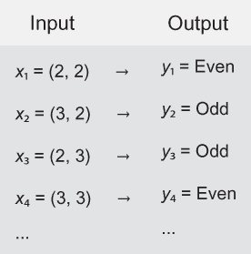

图 1.1 每对整数相加的结果是偶数或奇数。列出的输入和输出对应关系称为真实数据集。

两个奇数之和总是偶数。请你自己验证一下：取任意两个奇数，将它们相加，检查和是否为偶数。以下是直接证明这一事实的方法：

+   对于任何整数*n*，公式 2*n* + 1 会产生一个奇数。此外，任何奇数都可以写成 2*n* + 1 的形式，其中*n*是某个值。数字 3 可以写成 2(1) + 1。数字 5 可以写成 2(2) + 1。

+   假设我们有两个奇数，2*n* + 1 和 2*m* + 1，其中*n*和*m*是整数。两个奇数相加得到(2*n* + 1) + (2*m* + 1) = 2*n* + 2*m* + 2 = 2(*n* + *m* + 1)。这个数是偶数，因为任何数的两倍都是偶数。

同样，我们看到两个偶数之和也是偶数：2*m* + 2*n* = 2(*m* + *n*)。最后，我们还推断出偶数与奇数之和是奇数：2*m* + (2*n* + 1) = 2(*m* + *n*) + 1。图 1.2 更清楚地展示了这一逻辑。

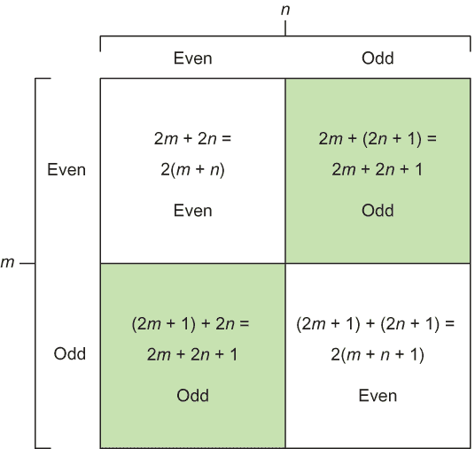

图 1.2 输出响应与输入对之间内在逻辑的示意图

就这样！在完全不使用机器学习的情况下，你可以在任何一对整数上解决这个问题。直接应用数学规则可以解决这个问题。但在机器学习算法中，我们可以将内部逻辑视为*黑盒*，这意味着内部发生的逻辑可能不明显，如图 1.3 所示。

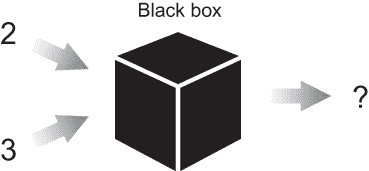

图 1.3 将机器学习解决问题的方法视为调整黑盒的参数，直到它产生令人满意的结果。

### 1.1.1 参数

有时候，设计一个将输入转换为相应输出的算法可能过于复杂。例如，如果输入是一系列代表灰度图像的数字，你可以想象编写一个算法来标记图像中每个对象的难度。当内部工作原理不为人所知时，机器学习就派上用场了。它为我们提供了一个工具包，可以编写软件而无需定义算法的每个细节。程序员可以留一些值未定，让机器学习系统自行找出最佳值。

未确定的值被称为*参数*，描述被称为*模型*。你的任务是编写一个算法，通过观察现有示例来找出如何最佳调整参数以实现最佳模型。哇，这话说得有点多！但别担心；这个概念将会反复出现。

机器学习可能在没有太多洞察力的情况下解决问题

通过掌握归纳问题解决的艺术，我们掌握了一把双刃剑。虽然机器学习算法在解决特定任务时可能表现良好，但追溯推理步骤以了解为什么产生结果可能并不那么清晰。一个复杂的机器学习系统学习成千上万的参数，但解开每个参数背后的含义有时并不是首要任务。考虑到这一点，我向你保证，有一个充满魔法的世界等待我们去探索。

**练习 1.1**

假设你已经收集了三个月的股票市场价格。你希望预测未来的趋势，以获得经济收益。在不使用机器学习的情况下，你将如何解决这个问题？（正如你将在第十三章中看到的，这个问题可以通过机器学习技术来解决。）

**答案**

信不信由你，硬编码的规则是定义股票市场交易策略的常见方式。像“如果价格下跌 5%，就买一些股票”这样简单的算法经常被使用。请注意，这里没有涉及机器学习——只有传统逻辑。

**练习 1.2**

美国国家航空航天局（NASA）将卫星发射到太空，卫星收集的数据我们称之为遥测数据。有时，收集到的数据中的异常表明仪器或收集数据时的条件出现了问题。为了简化，假设遥测数据是基于时间的数字序列。为了检测今天的异常，大多数方法使用简单的阈值，或者这些数字的最大或最小值来触发警报。使用机器学习来触发警报和检测异常，有什么更好的方法吗？

**答案**

你可以在每个时间步记录一系列名义上的 NASA 遥测数据——比如说，5 秒。然后取数据值，每当它们触发警报时，记录 1（异常）；否则，记录 0（正常）。恭喜你——你已经建立了一个可以喂入你将在本书后面学习到的任何预测模型的真实数据集，例如回归或分类。你甚至可以构建一个深度学习模型。看，机器学习不是很有趣吗？

### 1.1.2 学习和推理

假设你正在尝试在烤箱里烘焙甜点。如果你对厨房不熟悉，可能需要几天时间才能找到正确的组合和完美的配料比例，以制作出美味的甜点。通过记录食谱，你可以记住如何重复制作甜点。

机器学习分享了食谱的想法。通常，我们分两个阶段来检查一个算法：*学习*和*推理*。学习阶段的目标是描述数据，这被称为*特征向量*，并在*模型*中总结它。模型是我们的食谱。实际上，模型是一个具有几个开放解释的程序，数据有助于消除歧义。

注意：*特征向量*是数据的实际简化。你可以将其视为一个属性列表中现实世界对象的充分总结。学习和推理步骤依赖于特征向量而不是直接的数据。

与食谱可以被其他人分享和使用的方式类似，学习到的模型被其他软件重用。学习阶段是最耗时的。运行一个算法可能需要数小时，甚至数天或数周才能收敛到一个有用的模型，正如你在第三章开始构建自己的模型时将会看到的。图 1.4 概述了学习流程。

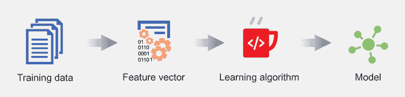

图 1.4 学习方法通常遵循一个结构化的食谱。首先，数据集需要被转换成一个表示形式——通常是特征列表——学习算法可以使用。然后，学习算法选择一个模型并高效地搜索该模型的参数。

推理阶段使用模型对从未见过的新数据进行智能评论。这个阶段就像使用你在网上找到的食谱一样。推理过程通常比学习快得多；推理可以快到足以处理实时数据。推理完全是关于在新的数据上测试模型并在过程中观察性能，如图 1.5 所示。

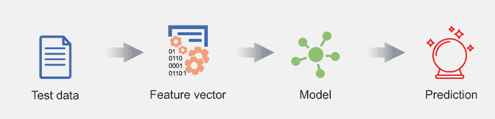

图 1.5 推理方法通常使用已经学习或给出的模型。在将数据转换为可用的表示形式，例如特征向量之后，这种方法使用模型来产生预期的输出。

## 1.2 数据表示和特征

数据是机器学习的第一公民。计算机不过是非常复杂的计算器，所以我们提供给机器学习系统的数据必须是数学对象，如标量、向量、矩阵和图。

所有表示形式的基本主题是 *特征*，这是对象的可观察属性：

+   *向量* 具有扁平且简单的结构，是大多数现实世界机器学习应用中数据的典型体现。*标量* 是向量中的一个单个元素。向量有两个属性：一个表示向量维度的自然数，以及一个类型（例如实数、整数等）。整数的二维向量示例有 (1, 2) 和 (-6, 0)；同样，标量可以是 1 或字符 *a*。实数的三维向量示例有 (1.1, 2.0, 3.9) 和 (∏, ∏/2, ∏/3)。你明白了：同一类型的数字集合。在一个使用机器学习的程序中，向量衡量数据的某个属性，如颜色、密度、响度或邻近性——任何可以用一系列数字描述的东西，每个数字对应于被测量的一个事物。

+   此外，向量的向量是一个 *矩阵**.* 如果每个特征向量描述了数据集中一个对象的特征，那么矩阵描述了所有对象；外部向量中的每个项目都是一个节点，它是一个对象的特征列表。

+   另一方面，图（graphs）更具表现力。*图* 是一组可以与 *边* 相连的对象（*节点*），用以表示网络。图形结构能够表示对象之间的关系，例如在社交网络或地铁系统的导航路线中。因此，在机器学习应用中，它们的管理要困难得多。在这本书中，我们的输入数据很少会涉及图形结构。

特征向量是现实世界数据的实用简化，这些数据可能过于复杂而难以处理。使用特征向量而不是关注数据项的每一个细节是一种实用的简化。例如，现实世界中的汽车远不止用来描述它的文本。汽车销售员试图卖给你的是汽车，而不是无形的话语或文字。这些话语是抽象概念，类似于特征向量是数据的摘要。

以下场景进一步解释了这一概念。当你打算购买一辆新车时，密切关注不同品牌和型号的每一个细节是至关重要的。毕竟，如果你即将花费数千美元，你最好勤奋地去做。你可能会记录下每辆车的特征列表并进行比较。这个有序的特征列表就是特征向量。

当你在购买汽车时，你可能发现比较油耗比比较一些不那么相关的因素（如重量）更有利可图。要跟踪的特征数量也必须恰到好处——既不能太少，否则你会失去你关心的信息，也不能太多，否则它们将难以管理且耗时。这种选择测量数量和比较哪些测量的巨大努力被称为*特征工程*或*特征选择*。根据你检查的特征，你系统的性能可能会大幅波动。选择正确的特征进行跟踪可以弥补一个弱学习算法的不足。

例如，当训练一个模型来检测图像中的汽车时，如果你首先将图像转换为灰度，你将获得巨大的性能和速度提升。通过在预处理数据时提供一些自己的偏见，你最终帮助了算法，因为它不需要学习颜色在检测汽车时并不重要。算法可以专注于识别形状和纹理，这将导致比尝试处理颜色更快的学习。

在机器学习（ML）中的一般经验法则是，更多的数据会产生更好的结果。但拥有更多特征并不总是如此。也许出人意料的是，如果你跟踪的特征数量过高，性能可能会受到影响。随着特征向量维度的增加，用代表性样本填充所有数据的空间需要指数级更多的数据。因此，如图 1.6 所示的特征工程是机器学习中最重要的问题之一。

维度诅咒

为了准确地对现实世界数据进行建模，我们显然需要不止一个或两个数据点。但数据量取决于许多因素，包括特征向量的维度数。添加过多的特征会导致描述空间所需的数据点数量呈指数增长。这就是为什么我们不能设计一个包含一百万维度的特征向量来耗尽所有可能的因素，然后期望算法学习到一个模型。这种现象被称为维度诅咒**。

你可能一开始不会意识到这一点，但当你决定哪些特征值得观察时，会发生一些重要的事情。几个世纪以来，哲学家们一直在思考*同一性*的含义；你可能不会立刻意识到，通过选择特定的特征，你已经对*同一性*给出了一种定义。

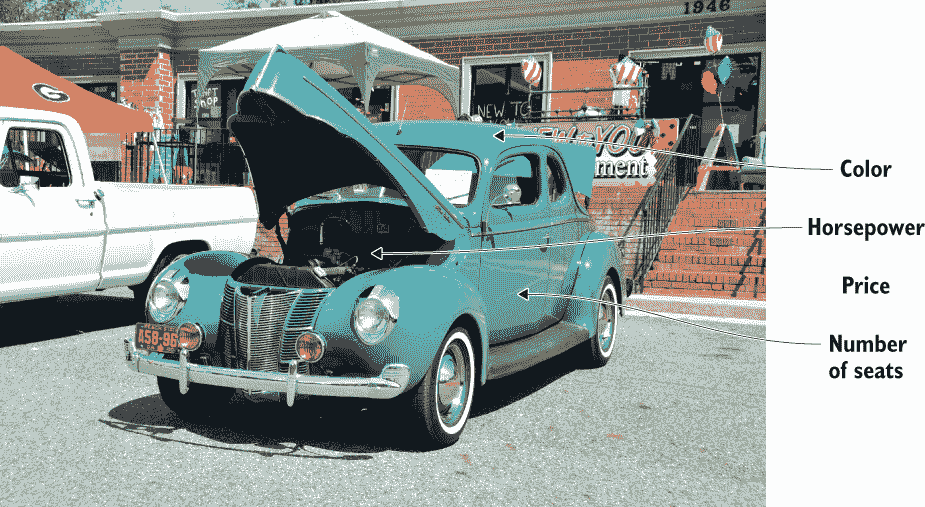

图 1.6 特征工程是选择与任务相关的特征的过程。

想象一下编写一个机器学习系统来检测图像中的面部。假设面部的一个必要特征是存在两只眼睛。隐含地，面部现在被定义为有眼睛的东西。你是否意识到这种定义可能会给你带来什么样的麻烦？如果一张照片显示某人正在眨眼，你的检测器将找不到面部，因为它找不到两只眼睛。当一个人眨眼时，算法将无法检测到面部。面部的定义从一开始就不准确，从糟糕的检测结果中可以明显看出。

现在，尤其是在智能车辆和自主无人机等能力以惊人的速度发展的今天，机器学习中的身份偏差，或者简单地说偏差，已经成为一个重大的问题，因为这些能力如果出错可能会导致人员伤亡。考虑一辆从未见过轮椅中的人的智能车辆，因为训练数据中从未包含这些例子，所以当轮椅进入人行横道时，智能汽车不会停车。如果一家公司用于递送包裹的无人机训练数据从未见过戴帽子的女性，而所有其他看起来像帽子的训练实例都是着陆点，会怎样呢？帽子和，更重要的是，戴帽子的人可能会处于极大的危险中！

物体的身份被分解为其组成的特征。如果你跟踪的一辆车的特征与另一辆车的对应特征相匹配，那么从你的角度来看，它们可能无法区分。你需要向系统中添加另一个特征来区分这些车辆；否则，你会认为它们是同一件物品（比如无人机落在那位不幸女士的帽子上）。在手工制作特征时，你必须非常小心，不要陷入这种关于身份的哲学困境。

练习 1.3

假设你正在教机器人如何叠衣服。感知系统看到衬衫躺在桌子上，如图所示。你希望将衬衫表示为特征向量，以便你可以将其与不同的衣服进行比较。决定哪些特征最有用进行追踪。（提示：零售商在线描述他们的服装时使用哪些类型的词语？）

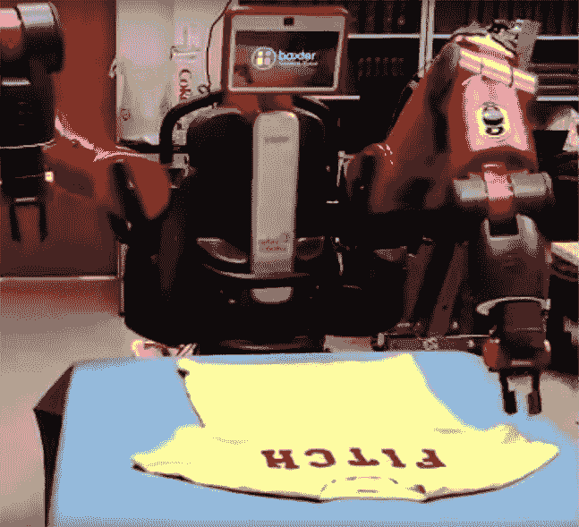

一台机器人正在尝试叠衬衫。衬衫有哪些好的特征可以追踪？

**答案**

在叠衣服时，观察宽度、高度、x 对称得分、y 对称得分和平坦度是很好的特征。颜色、布料纹理和材料大多无关紧要。

练习 1.4

现在，你雄心勃勃地决定检测任意物体；以下图显示了几个示例。有哪些显著的特征可以轻松区分物体？

这里展示了三个物体的图像：一盏灯、一条裤子和一只狗。你应记录哪些好的特征来比较和区分物体？

**答案**

观察亮度和反射可能有助于区分灯和其他两个物体。裤子的形状通常遵循一个可预测的模板，因此形状将是另一个很好的追踪特征。最后，纹理可能是区分狗的图像与其他两个类别的显著特征。

特征工程是一项令人耳目一新的哲学追求。对于那些喜欢思考自我意义的探险者，我邀请你们沉思于特征选择，因为它仍然是一个未解之谜。幸运的是，对于你们其他人来说，为了缓解广泛的争论，最近的研究进展使得自动确定要追踪哪些特征成为可能。你们将在第七章中亲自尝试这个过程。

现在考虑这样一个问题：一位医生正在查看一组 N 张 244×244（宽度×高度）的鳞状细胞图像，就像图 1.7 中所示的那样，并试图确定它们是否表明患者存在癌症。一些图像明确表明有癌症；而另一些则没有。医生可能有一组历史患者图像，他可以随着时间的推移进行检查和学习，这样当他看到新的图像时，他就能发展出自己关于癌症外观的表征模型。

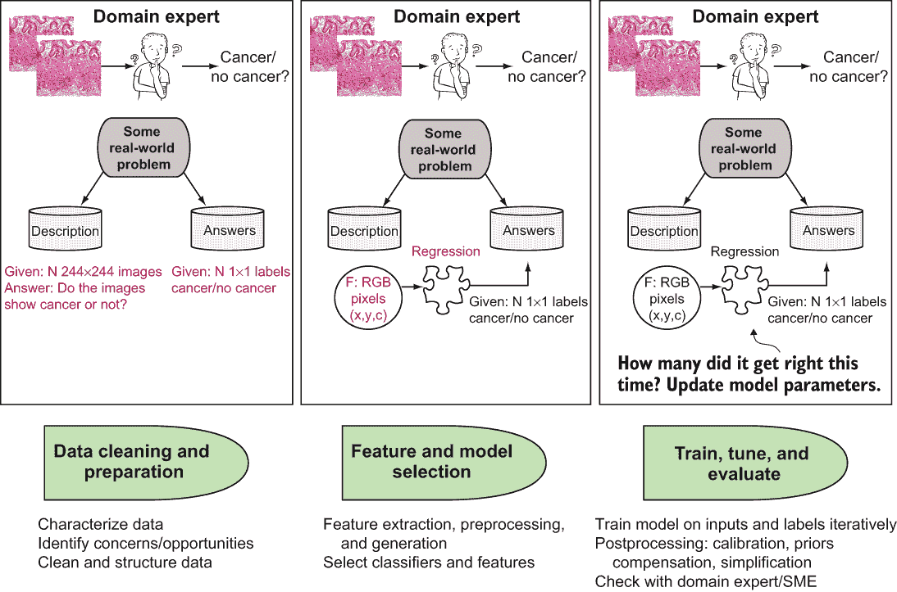

图 1.7 机器学习过程。从左到右，医生试图确定代表细胞活检的图像是否表明他们的患者有癌症**。**

特征向量在学习和推理中都得到应用

学习和推理之间的相互作用为机器学习系统提供了一个完整的图景，如下所示。第一步是将现实世界数据表示为特征向量。例如，我们可以通过像素强度对应的数字向量来表示图像。（我们将在未来的章节中更详细地探讨如何表示图像。）我们可以向学习算法展示与每个特征向量相关的真实标签（如鸟或狗）。有了足够的数据，算法就会生成一个学习模型。我们可以使用这个模型来处理其他现实世界数据，以揭示之前未知的标签。

特征向量是机器学习的学习和推理组件使用的现实世界数据的表示。算法的输入不是直接的现实世界图像，而是其特征向量。

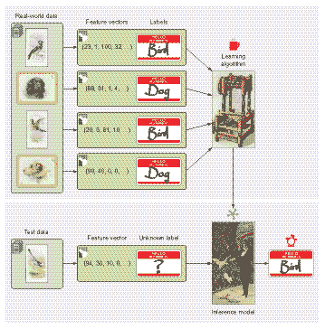

特征向量是机器学习的学习和推理组件使用的现实世界数据的表示。算法的输入不是直接的现实世界图像，而是其特征向量。

在机器学习中，我们试图模拟这个模型构建过程。首先，我们从历史患者数据中获取 N 张 244 × 244 的鳞状癌细胞图像，并通过将图像与其关联的标签（癌症或无癌症）排列起来来准备问题。我们称这个阶段为机器学习的数据清洗和准备阶段。接下来是识别重要特征的过程。特征包括图像像素强度，或每个 x, y, 和 c 的早期值，或 (244, 244, 3)，代表图像的高度、宽度和三个通道的红/绿/蓝 (RGB) 颜色。模型创建这些特征值与所需标签输出（癌症或无癌症）之间的映射。

## 1.3 距离度量

如果你有一系列你想要购买的特征向量，你可以在特征向量上定义一个距离函数，以确定哪两辆车最相似。比较对象之间的相似性是机器学习的一个基本组成部分。特征向量使我们能够以各种方式表示对象，以便进行比较。一种标准的方法是使用 *欧几里得距离*，这是你在思考空间中的点时可能发现最直观的几何解释。

假设我们有两个特征向量，*x* = (*x*[1], *x*[2], ..., *x*[n]) 和 *y* = (*y*[1], *y*[2], ..., *y*[n])。欧几里得距离 ||*x* - *y* || 使用以下公式计算，学者们称之为 *L2 范数*：

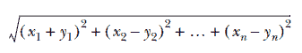

点 (0, 1) 和 (1, 0) 之间的欧几里得距离是

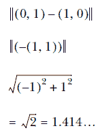

然而，这个函数只是许多可能的距离函数之一。L0、L1 和 L-infinity 范数也存在。所有这些范数都是测量距离的有效方式。以下是更详细的说明：

+   *L0 范数*计算向量的总非零元素数。例如，原点(0, 0)和向量(0, 5)之间的距离是 1，因为只有一个非零元素。(1, 1)和(2, 2)之间的 L0 距离是 2，因为两个维度都不匹配。想象一下，第一和第二维度分别代表用户名和密码。如果登录尝试和真实凭证之间的 L0 距离是 0，则登录成功。如果距离是 1，则用户名或密码错误，但不是两者都错误。最后，如果距离是 2，则数据库中找不到用户名或密码。

+   *L1 范数*，如图 1.8 所示，定义为Σ*x*[*n*]。在 L1 范数下，两个向量之间的距离也被称为*曼哈顿距离*。想象一下生活在像曼哈顿这样的市中心地区，街道形成了一个网格。从一个交叉口到另一个交叉口的最短距离是沿着街区。同样，两个向量之间的 L1 距离是沿着正交方向。在 L1 范数下，(0, 1)和(1, 0)之间的距离是 2。计算两个向量之间的 L1 距离是每个维度绝对差分的总和，这是一个有用的相似度度量。

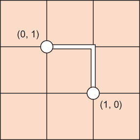

图 1.8 L1 距离被称为曼哈顿距离（也称为出租车距离），因为它类似于在像曼哈顿这样的网格状社区中汽车行驶的路线。如果一辆车从点(0, 1)行驶到点(1, 0)，最短路线需要 2 个单位的长度。

+   *L2 范数*，如图 1.9 所示，是向量的欧几里得长度，(Σ(x[n])²)^(1/2)。这是在几何平面上从一点到另一点可以采取的最直接路线。对于数学爱好者来说，这个范数实现了高斯-马尔可夫定理预测的最小二乘估计。对于其他人来说，它是空间中两点之间的最短距离。

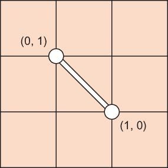

图 1.9 点(0, 1)和(1, 0)之间的 L2 范数是两点之间单一直线段的长度。

+   *L-N 范数*将这种模式推广，结果为(Σ(|x[n]|)^N)^(1/N)。我们很少使用 L2 以上的有限范数，但这里列出是为了完整性。

+   *L 无穷范数*是(Σ(|x[n]|)^∞)^(1/∞)。更自然地说，它是每个元素中的最大幅度。如果向量是(-1, -2, -3)，则 L 无穷范数是 3。如果一个特征向量代表各种物品的成本，最小化向量的 L 无穷范数是尝试减少最昂贵物品的成本。

## 1.4 学习类型

现在您可以使用特征向量进行比较，您有了使用数据为实际算法提供工具的必要条件。机器学习通常分为三个视角：监督学习、无监督学习和强化学习。一个新兴的新领域是元学习，有时称为 AutoML。以下几节将检查所有四种类型。

在现实生活中，我什么时候会使用 L2 范数以外的度量标准？

假设你正在为一家搜索引擎初创公司工作，试图与谷歌竞争。你的老板分配给你一个任务，就是使用机器学习来为每个用户个性化搜索结果。

一个好的目标可能是用户每月不应看到五个或更多的错误搜索结果。一年的用户数据是一个 12 维向量（每年的每个月份是一个维度），表示每月显示的错误结果的数目。你试图满足这个条件，即这个向量的 L-无穷范数必须小于 5。

假设你的老板改变了要求，说整个年度内允许的错误搜索结果少于五个。在这种情况下，你试图实现 L1 范数低于 5，因为整个空间中所有错误的和应该小于 5。

现在老板再次改变了要求：错误搜索结果的月份数量应少于 5。在这种情况下，你试图实现 L0 范数小于 5，因为非零错误的月份数量应少于 5。

### 1.4.1 监督学习

根据定义，一个监督者是命令链中的高级人员。当我们犹豫不决时，我们的监督者会指示我们做什么。同样，*监督学习*完全是关于从监督者（如教师）提供的示例中学习。

一个监督机器学习系统需要标记数据来发展有用的理解，我们称之为其*模型*。例如，给定许多人的照片和记录的相应种族，我们可以训练一个模型来对任意照片中从未见过的人的种族进行分类。简单来说，模型是一个函数，通过使用一组称为*训练数据集*的先前示例作为参考，为数据分配标签。

通过数学符号来谈论模型是一种方便的方式。设*x*为数据的一个实例，例如一个特征向量。与*x*相关联的标签是*f*(*x*)，通常被称为*x*的*真实值*。通常，我们使用变量*y* = *f*(*x*)，因为它写起来更快。在通过照片对人的种族进行分类的例子中，*x*可以是一个包含各种相关特征的 100 维向量，而*y*是代表各种种族的一组值之一。因为*y*是离散的，值很少，所以该模型被称为*分类器*。如果`y`可以产生许多值，并且这些值有自然顺序，则该模型被称为*回归器*。

让我们用*g*(*x*)表示模型对*x*的预测。有时，你可以调整模型以显著改变其性能。模型有参数，可以由人类或自动调整。我们用向量来表示参数。将所有这些放在一起，*g*(*x*|)更完整地表示了模型，读作“*g* of *x* given。”

**注意** 模型也可能有*超参数*，这是模型的一些额外临时属性。*超参数*中的*超*字眼一开始可能显得有些奇怪。更好的名字可能是*元参数*，因为参数类似于关于模型的元数据。

模型预测 g(x|) 的成功取决于它与真实值 y 的吻合程度。我们需要一种方法来衡量这两个向量之间的距离。例如，L2 范数可以用来衡量两个向量之间的接近程度。真实值与预测值之间的距离称为*成本*。

监督机器学习算法的本质是找出导致最小*成本*的模型参数。从数学上讲，我们正在寻找一个 θ*（读作 theta star），它在所有数据点 x ∈ X 中最小化成本。将这个优化问题形式化的一个方法如下方程：

θ^(* )= argmin[θ]*Cost*(θ|X)

其中

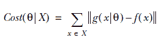

显然，穷举所有可能的 x 组合（也称为*参数空间*）最终会找到最优解，但运行时间将无法接受。**机器学习**的一个主要研究领域是编写高效搜索这个参数空间的算法。一些早期的算法包括*梯度下降*、模拟退火**和*遗传算法**.* TensorFlow 自动处理这些算法的低级实现细节，因此我不会过多地深入这些细节。

无论通过何种方式学习参数后，你最终可以评估模型以了解系统从数据中捕获模式的效果如何。一个经验法则是不要在用于训练的数据上评估你的模型，因为你已经知道它对训练数据有效；你需要判断模型是否对*未*包含在训练集中的数据进行有效处理，以确保你的模型是通用型的，而不是对训练数据有*偏见*。使用大部分数据用于训练，其余的用于测试。例如，如果你有 100 个标记的数据点，随机选择其中的 70 个来训练一个模型，并保留其余的 30 个来测试它，这样就创建了一个 70-30 的分割。

为什么需要分割数据？

如果 70-30 的分割看起来很奇怪，可以这样思考。假设你的物理老师给你一份练习考试，并告诉你真正的考试将与这次没有区别。你不妨记住答案，而不理解概念就能得到满分。同样，如果你在训练数据集上测试你的模型，你并没有给自己带来任何好处。你可能会产生一种虚假的安全感，因为模型可能只是记住结果。那么，这种所谓的“智慧”在哪里呢？

与使用 70-30 的分割不同，机器学习从业者通常将他们的数据集分成 60-20-20。训练消耗 60%的数据集，测试使用 20%，剩下的 20%用于验证，这在第二章中有解释。

### 1.4.2 无监督学习

*无监督学习* 是关于对没有相应标签或响应的数据进行建模。我们能够在原始数据上得出任何结论都感觉像是魔法。有了足够的数据，可能可以发现模式和结构。机器学习从业者从数据本身学习时使用的两个最强大的工具是聚类和维度降低。

*聚类* 是将数据分割成相似项的单独桶的过程。从某种意义上说，聚类就像在没有知道任何对应标签的情况下对数据进行分类。例如，当你将你的书组织在三个书架上时，你可能会将相似类型的书籍放在一起，或者可能按作者姓氏分组。你可能有一个斯蒂芬·金区域，另一个用于教科书，第三个用于其他任何东西。你不在乎所有书籍是否由相同的特征分开，只在乎每本书都有一些独特的东西，这让你能够将其组织到几个大致相等、易于识别的组中。最流行的聚类算法之一是 *k-means*，它是称为 *E-M 算法* 的更强大技术的一个特定实例。

*维度降低* 是关于操纵数据以便从更简单的角度来观察它——机器学习中的“保持简单，愚蠢”这一短语的等价物。例如，通过去除冗余特征，我们可以用更低维度的空间来解释相同的数据，并看到哪些特征是重要的。这种简化也有助于数据可视化或预处理以提高性能效率。最早的算法之一是 *主成分分析* (PCA)，而较新的一个是 *自编码器*，这些内容在第七章中有介绍。

### 1.4.3 强化学习

监督学习和无监督学习似乎暗示了教师的存在要么全部要么没有。但在机器学习的一个研究得很好的分支中，环境充当教师，提供提示而不是明确的答案。学习系统对其行为获得反馈，没有具体的承诺表明它在正确的方向上进步，这可能是指解决迷宫或完成一个明确的目标。

探索与利用：强化学习的核心

想象一下玩一个你从未见过的视频游戏。你在控制器上点击按钮，发现某个特定的按键组合逐渐提高你的分数。太棒了！现在你反复利用这个发现，希望能打破高分。然而，在你的潜意识里，你却在想是否错过了更好的按键组合。你应该利用你当前的最佳策略，还是冒险探索新的选项？

与监督学习不同，在监督学习中，训练数据由“教师”方便地标注，*强化学习*则通过观察环境对动作的反应来收集信息进行训练。强化学习是一种与环境交互以学习哪种动作组合能产生最理想结果的机器学习方法。因为我们已经通过使用“环境”和“动作”这些词将算法拟人化了，学者们通常将这个系统称为自主的*代理*。因此，这种机器学习方法自然地体现在机器人领域。

为了在环境中推理代理，我们引入了两个新概念：状态和动作。在特定时间冻结的世界状态称为状态。代理可以通过执行许多动作之一来改变当前状态。为了驱动代理执行动作，每个状态都会产生相应的奖励。代理最终会发现每个状态的预期总奖励，称为该状态的价值。

与任何其他机器学习系统一样，性能随着数据的增加而提高。在这种情况下，数据是经验的历史。在强化学习中，我们不知道一系列动作的最终成本或奖励，直到这一系列动作被执行。这些情况使得传统的监督学习变得无效，因为我们不知道在动作序列的历史中，哪个动作导致了最终的低价值状态。代理所知道的确切信息只是它已经采取的一系列动作的成本，这是不完整的。代理的目标是找到一系列动作，以最大化奖励。如果你对这个主题更感兴趣，你可能想查看 Manning Publications 家族的另一本相关书籍：Miguel Morales 所著的*Grokking Deep Reinforcement Learning*（Manning，2020；[`www.manning.com/books/grokking-deep-reinforcement-learning`](https://www.manning.com/books/grokking-deep-reinforcement-learning)）。

### 1.4.4 元学习

相对较近，一个新的机器学习领域——元学习——出现了。这个想法很简单。数据科学家和机器学习专家花费大量时间执行机器学习的步骤，如图 1.7 所示。如果这些步骤——定义和表示问题、选择模型、测试模型和评估模型——本身可以被自动化，那会怎样？为什么不限制于只探索一个或一小组模型，而是让程序本身尝试所有模型呢？

许多企业将领域专家（如图 1.7 中的医生）、数据科学家（负责建模数据和可能提取或选择重要特征的人员，例如图像的 RGB 像素）以及机器学习工程师（负责调整、测试和部署模型）的角色分开，如图 1.10a 所示。正如你从本章前面的内容中记得的那样，这些角色在三个基本领域进行互动：数据清洗和准备，这两个领域领域专家和数据科学家都可能提供帮助；特征和模型选择，主要是数据科学家的工作，ML 工程师提供一些帮助；然后是训练、测试和评估，主要是 ML 工程师的工作，数据科学家提供一些帮助。我们还增加了一个新的复杂因素：将我们的模型部署出去，这在现实世界中会发生，并且带来了一组自己的挑战。这就是你正在阅读本书第二版的原因之一；它将在第二章中讨论，我将讨论部署和使用 TensorFlow。

如果我们能够让系统自动在可能模型的范围内搜索，并尝试所有模型，而不是让数据科学家和 ML 工程师选择模型、训练、评估和调整它们，会怎么样呢？这种方法克服了将你的整体 ML 经验限制在少量可能解决方案中的限制，你可能会选择第一个表现合理的解决方案。但如果系统能够找出哪些模型最好以及如何自动调整模型呢？这正是你在图 1.10b 中看到的内容：元学习的过程，或自动机器学习（AutoML）。

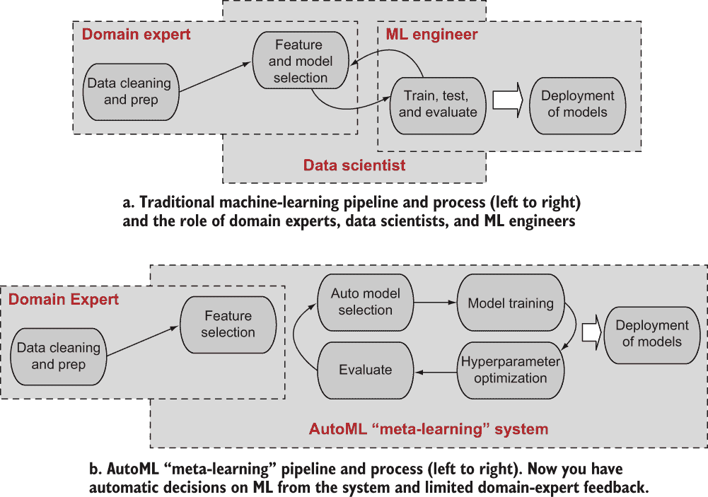

图 1.10 传统机器学习及其演变为元学习，其中系统自行进行模型选择、训练、调整和评估，以从众多候选模型中选择最佳机器学习模型

数据科学家，你们被取消了！

今天的取消文化非常适合元学习这一概念，其根源源于数据科学本身——创建和实验多种类型的机器学习管道的过程，包括数据清洗、模型构建和测试——可以自动化的想法。与之相关的一个高级研究计划局（DARPA）项目，数据驱动模型发现（D3M），声称目标是废除数据科学家，而是自动化他们的活动。尽管那个 DARPA 项目以及元学习领域的成果是有希望的，但我们还没有准备好完全取消数据科学家……至少现在还没有。别担心；你很安全！

**练习 1.5**

你会使用监督学习、无监督学习、强化学习还是元学习来解决以下问题？（a）找到最佳机器学习算法，该算法使用棒球统计数据并预测一名球员是否会进入名人堂。（b）根据没有其他信息的情况，将各种水果组织到三个篮子里。（c）根据传感器数据预测天气。（d）在多次尝试和错误后学会下棋。

**答案**

（a）元学习；（b）无监督学习；（c）监督学习；（d）强化学习。

## 1.5 TensorFlow

谷歌在 2015 年底以 Apache 2.0 许可证开源了其机器学习框架 TensorFlow。在此之前，它被谷歌在语音识别、搜索、照片和 Gmail 等应用中私有使用。

一点历史

一个名为 DistBelief 的早期可扩展分布式训练和学习系统是 TensorFlow 当前实现的主要影响。你有没有写过一团糟的代码，希望可以重新开始？这就是 DistBelief 和 TensorFlow 之间的动态。TensorFlow 不是谷歌基于内部项目开源的第一个系统。谷歌著名的 Map-Reduce 系统和 Google File System（GFS）是现代 Apache 数据处理、网络爬虫和大数据系统（包括 Hadoop、Nutch 和 Spark）的基础。此外，谷歌的大表系统是 Apache Hbase 项目的基础。

该库是用 C++实现的，具有方便的 Python API，以及一个不太受欢迎的 C++ API。由于依赖关系更简单，TensorFlow 可以快速部署到各种架构。

与 Theano——一个你可能熟悉的流行的 Python 数值计算库——类似——计算被描述为流程图，将设计从实现中分离出来。几乎无需麻烦，这种二分法使得相同的设计可以在移动设备以及拥有数千个处理器的庞大训练系统中实现。单一系统覆盖了广泛的平台。TensorFlow 也与各种新开发的类似机器学习库兼容得很好，包括 Keras（TensorFlow 2.0 完全集成了 Keras），以及 PyTorch（[`pytorch.org`](https://pytorch.org/)）等库，这些库最初由 Facebook 开发，以及更丰富的机器学习应用程序编程接口，如 Fast.Ai。你可以使用许多工具包来做机器学习，但你正在读一本关于 TensorFlow 的书，对吧？让我们专注于它！

TensorFlow 最令人印象深刻的特性之一是其**自动微分**功能。你可以在不重新定义许多关键计算的情况下实验新的网络。

注意自动微分使得实现**反向传播**变得容易得多，这是一种在机器学习的一个分支——**神经网络**中使用的计算密集型计算。TensorFlow 隐藏了反向传播的细节，这样你可以专注于更大的图景。第十一章介绍了 TensorFlow 中的神经网络简介。

所有数学都被抽象出来，在幕后展开。使用 TensorFlow 就像使用 WolframAlpha 来解决微积分问题集。

该库的另一个特点是它的交互式可视化环境，称为**TensorBoard**。这个工具显示了数据转换的流程图，随着时间的推移显示总结日志，并追踪性能。图 1.11 显示了 TensorBoard 的外观；第二章介绍了如何使用它。

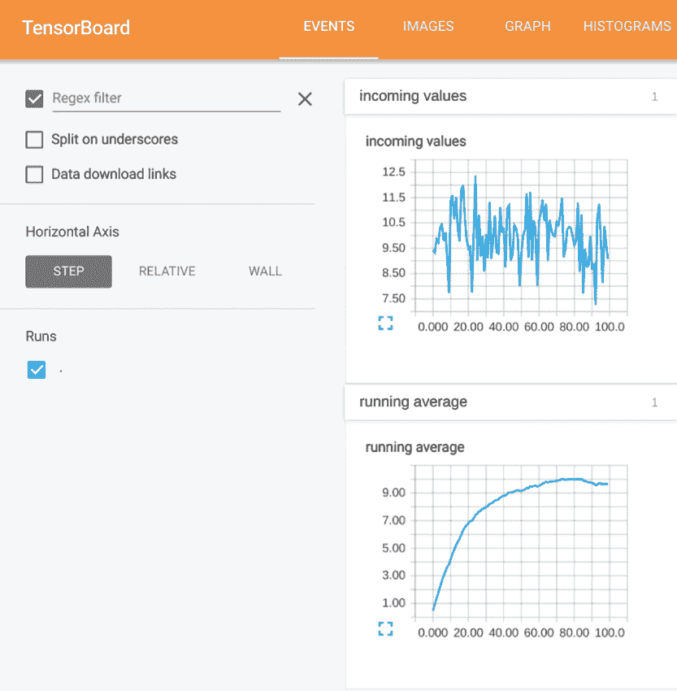

图 1.11 TensorBoard 的实际应用示例

在 TensorFlow 中进行原型设计比在 Theano 中快得多（代码启动只需几秒钟，而不是几分钟），因为许多操作都是预编译的。由于子图执行，调试代码变得容易；整个计算段可以重用而无需重新计算。

因为 TensorFlow 不仅仅关于神经网络，它还提供了现成的矩阵计算和操作工具。大多数库，如 PyTorch、Fast.Ai 和 Caffe，都是专门为深度神经网络设计的，但 TensorFlow 更加灵活和可扩展。

该库得到了良好的文档记录，并得到了 Google 的官方支持。机器学习是一个复杂的话题，因此有一个非常值得信赖的公司支持 TensorFlow 是令人欣慰的。

## 1.6 未来章节概述

第二章演示了如何使用 TensorFlow 的各种组件（见图 1.12）。第 3-10 章展示了如何在 TensorFlow 中实现经典机器学习算法，第 11-19 章涵盖了基于神经网络的算法。这些算法解决了广泛的问题，如预测、分类、聚类、降维和规划。

图 1.12 本章介绍了基本的机器学习概念，第二章开始了你在 TensorFlow 中的旅程。其他工具可以应用机器学习算法（如 Caffe、Theano 和 Torch），但你在第二章中会看到为什么 TensorFlow 是最佳选择。

许多算法可以解决同一个实际世界问题，许多实际世界问题也可以由同一个算法解决。表 1.1 涵盖了本书中阐述的内容。

表 1.1 许多实际世界问题可以通过在其相应章节中找到的相应算法来解决。

| 实际世界问题 | 算法 | 章节 |
| --- | --- | --- |
| 预测趋势，将曲线拟合到数据点，描述变量之间的关系 | 线性回归 | 3, 4 |
| 将数据分类为两个类别，找到分割数据集的最佳方式 | 逻辑回归 | 5, 6 |
| 将数据分类到多个类别 | Softmax 回归 | 5, 6 |
| 揭示观察到的隐藏原因，找到一系列结果最可能的隐藏原因 | 隐藏马尔可夫模型（维特比） | 9, 10 |
| 将数据聚类到固定数量的类别，自动将数据点划分到不同的类别中 | k-means | 7, 8 |
| 将数据聚类到任意类别，在低维嵌入中可视化高维数据 | 自组织映射 | 7, 8 |
| 降低数据的维度，学习导致高维数据的潜在变量 | 自动编码器 | 11, 12 |
| 使用神经网络在环境中规划动作（强化学习） | Q 策略神经网络 | 13 |
| 使用监督神经网络对数据进行分类 | 感知器 | 14, 15 |
| 使用监督神经网络对现实世界图像进行分类 | 卷积神经网络 | 14, 15 |
| 使用神经网络产生与观察结果匹配的模型 | 循环神经网络 | 16, 17 |
| 预测对自然语言查询的自然语言响应 | Seq2seq 模型 | 18 |
| 通过学习它们的效用对项目进行排序 | 排序 | 19 |

TIP 如果你对 TensorFlow 的复杂架构细节感兴趣，最佳资源是官方文档中的[`www.tensorflow.org/tutorials/customization/basics`](https://www.tensorflow.org/tutorials/customization/basics)。本书迅速前进，在调整低级性能的同时，不减速地使用 TensorFlow。如果你对云服务感兴趣，你可能想考虑谷歌针对专业级规模和速度的解决方案([`cloud.google.com/products/ai`](https://cloud.google.com/products/ai))。

## 摘要

+   TensorFlow 已经成为专业人士和研究人员实现机器学习解决方案的首选工具。

+   机器学习使用示例来开发一个专家系统，该系统能对新的输入做出有用的陈述。

+   机器学习的一个关键特性是，性能往往随着更多训练数据的增加而提高。

+   几年来，学者们已经构建了三个主要原型，大多数问题都符合这些原型：监督学习、无监督学习和强化学习。元学习是机器学习的一个新领域，它专注于自动探索整个模型、解决方案和调整技巧的空间。

+   在从机器学习角度对现实世界问题进行表述后，会出现几种算法。在众多可以完成实现的软件库和框架中，我们选择了 TensorFlow 作为我们的银弹。由谷歌开发并得到其繁荣社区的支撑，TensorFlow 为我们提供了一种轻松实现行业标准代码的方法。
