# 3 线性回归及其扩展

本章涵盖了

+   将线拟合到数据点上

+   将任意曲线拟合到数据点上

+   测试回归算法的性能

+   将回归应用于实际数据

还记得高中时的科学课程吗？可能已经过去很久了，或者谁知道呢——也许你现在还在高中，早早地开始了机器学习的旅程。无论如何，无论你学习的是生物学、化学还是物理学，分析数据的一个常见技术是绘制一个变量如何影响另一个变量的变化。

想象一下绘制降雨频率与农业生产之间的相关性。你可能观察到降雨量的增加会导致农业生产率的增加。将这些数据点拟合到一条线上，使你能够预测在不同降雨条件下的生产率：稍微少一点雨，稍微多一点雨，等等。如果你从几个数据点中发现了潜在的函数，那么这个学到的函数将使你能够预测未见数据的价值。

*回归* 是研究如何最佳拟合曲线以总结数据的一种方法，是监督学习算法中最强大、研究最深入的类型之一。在回归中，我们试图通过发现可能生成这些数据点的曲线来理解数据点。在这个过程中，我们寻求解释为什么给定的数据会以这种方式分散。最佳拟合曲线为我们提供了一个模型，解释了数据集可能是如何产生的。

本章将向你展示如何将实际问题用回归来解决。正如你将看到的，TensorFlow 是正确的工具，提供了最强大的预测器之一。

## 3.1 正式符号

如果你有一把锤子，每个问题看起来都像钉子。本章展示了第一个主要的机器学习工具，回归，并使用精确的数学符号正式定义它。首先学习回归是一个很好的主意，因为你在未来章节中遇到的其他类型的问题中，许多技能都会得到应用。到本章结束时，回归将成为你机器学习工具箱中的“锤子”。

假设你有一些关于人们购买啤酒瓶花费的数据。爱丽丝购买了 2 瓶啤酒，花费了 4 美元，鲍勃购买了 3 瓶啤酒，花费了 6 美元，克莱尔购买了 4 瓶啤酒，花费了 8 美元。你想要找到一个方程来描述瓶数对总成本的影响。如果线性方程 *y* = 2*x* 描述了购买特定数量瓶子的成本，例如，你可以计算出每瓶啤酒的成本。

当一条线看起来很好地拟合了一些数据点时，你可能会声称你的线性模型表现良好。但你可以尝试许多可能的斜率，而不仅仅是选择 2 这个值。斜率的选择是 *参数*，包含参数的方程是 *模型*。用机器学习的术语来说，最佳拟合曲线的方程来自于学习模型的参数。

作为另一个例子，方程 *y* = 3*x* 也是一个直线，只是斜率更陡。你可以用任何实数（让我们称它为 *w*）替换那个系数，方程仍然会产生一条直线：*y* = *wx*。图 3.1 展示了改变参数 *w* 如何影响模型。以这种方式生成的所有方程的集合表示为 *M* `=` `{`*y* `=` *wx* `|` *w* ∈ ℝ}，这读作“所有 *y* `=` *wx* 的方程，其中 *w* 是一个实数。”

*M* 是所有可能模型的集合。选择一个 *w* 的值生成候选模型 *M*`(`*w*`):` *y* `=` *wx*。你将在 TensorFlow 中编写的回归算法将迭代收敛到模型参数 *w* 的更好值。最优参数，我们称之为 *w** (发音为 *w star*)，是最拟合方程 *M*(*w**) : *y* = *w***x*。*Best-fit* 意味着模型产生的误差或预测值与实际值之间的差异最小，通常称为 *ground truth*。我们将在本章中更多地讨论这一点。

在最一般的意义上，回归算法试图设计一个函数，我们可以称之为 *f*，它将输入映射到输出。该函数的定义域是实值向量 ℝ^d，其值域是实数集 ℝ。

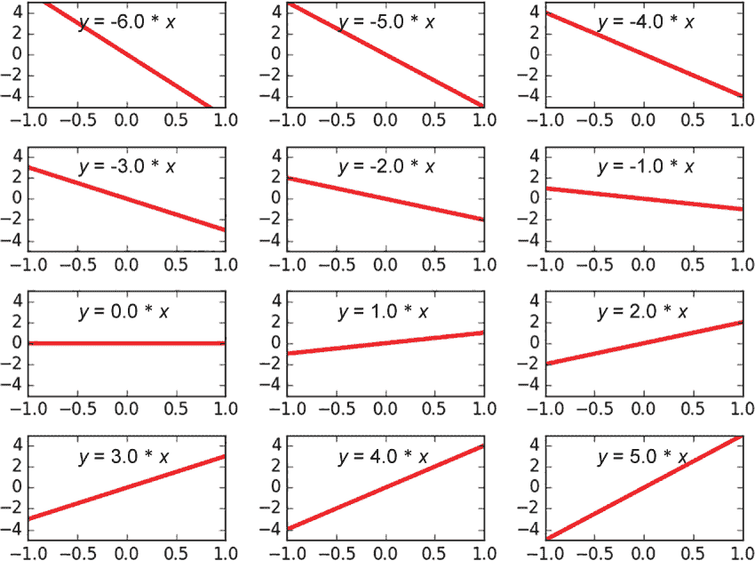

图 3.1 参数 *w* 的不同值导致不同的线性方程。这些所有线性方程的集合构成了线性模型 M。

note 回归也可以有多个输出，而不是一个实数。在这种情况下，我们称之为 *多元回归**.*

函数的输入可以是连续的或离散的。但输出必须是连续的，如图 3.2 所示。

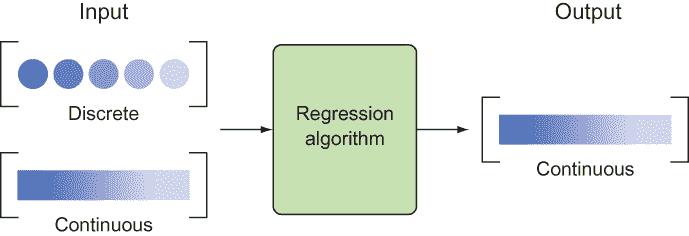

图 3.2 回归算法旨在产生连续输出。输入可以是离散的或连续的。这种区别很重要，因为离散值输出更适合由分类处理，这在第五章和第六章中讨论。

note 回归预测连续输出，但有时这过于冗余。有时，我们想要预测一个离散输出，例如 0 或 1，中间没有其他值。分类是一种更适合此类任务的技巧，将在第五章中讨论。

我们希望找到一个函数 *f*，它与给定的数据点（本质上是一组输入/输出对）很好地吻合。不幸的是，可能函数的数量是无限的，所以逐个尝试它们是没有希望的。有太多选择通常是一个坏主意。我们有必要缩小我们想要处理的函数的范围。例如，如果我们只考虑直线来拟合一组数据点，搜索就会变得容易得多。

练习 3.1

有多少种可能的函数可以将 10 个整数映射到 10 个整数？设 f(x)是一个可以接受从 0 到 9 的数字并产生从 0 到 9 的数字的函数。一个例子是恒等函数，它模仿其输入——例如，f(0) = 0，f(1) = 1，以此类推。还有多少其他函数存在？

**答案**

10¹⁰ = 10,000,000,000

### 3.1.1 你如何知道回归算法是有效的？

假设你正在尝试向一家房地产公司销售一个房价预测算法。该算法根据诸如卧室数量和地块大小等属性预测房价。房地产公司可以轻易地利用此类信息赚取数百万，但在从你那里购买之前，他们需要一些证明该算法有效的证据。

要衡量学习算法的成功，你需要了解两个重要的概念：

+   *方差*表示预测对所使用的训练集的敏感度。理想情况下，你选择训练集的方式不应该很重要，这意味着希望方差更低。

+   *偏差*表示对训练数据集所做假设的强度。做出太多的假设可能会使模型无法泛化，因此你应该偏好低偏差。

如果一个模型过于灵活，它可能会意外地记住训练数据而不是解决有用的模式。你可以想象一个曲线函数穿过数据集的每一个点，看起来没有产生错误。如果发生这种情况，我们说学习算法*过拟合*了数据。在这种情况下，最佳拟合曲线将与训练数据很好地吻合，但在测试数据上的表现可能非常糟糕（见图 3.3）。

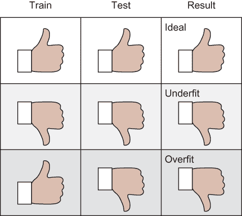

图 3.3 理想情况下，最佳拟合曲线在训练数据和测试数据上都拟合得很好。如果我们看到它与测试数据拟合得不好，而与训练数据拟合得很好，那么我们的模型可能欠拟合。另一方面，如果它在测试数据上表现不佳，但在训练数据上表现良好，我们知道该模型是过拟合的。

迁移学习和过拟合

今天，一个大的过拟合挑战来自于迁移学习的过程：将模型在一个领域学到的知识应用到另一个领域。令人惊讶的是，这个过程在计算机视觉、语音识别和其他领域工作得非常好。但许多迁移学习模型都存在过拟合问题。例如，考虑著名的 MNIST（*修改后的国家标准与技术研究院）数据集和问题，用于识别 1 到 10 的黑白数字。从 MNIST 学到的模型可以应用于其他非黑白数字（如街牌），但需要微调，因为即使是最好的 MNIST 模型通常也会表现出一些过拟合。

在光谱的另一端，一个不太灵活的模型可能对未见过的测试数据泛化得更好，但在训练数据上的得分相对较低。这种情况被称为*欠拟合*。过于灵活的模型具有高方差和低偏差，而过于严格的模型具有低方差和高偏差。理想情况下，你希望模型同时具有低方差误差和低偏差误差。这样，模型既能泛化到未见过的数据，又能捕捉数据的规律。参见图 3.4，了解模型在二维空间中对数据欠拟合和过拟合的示例。

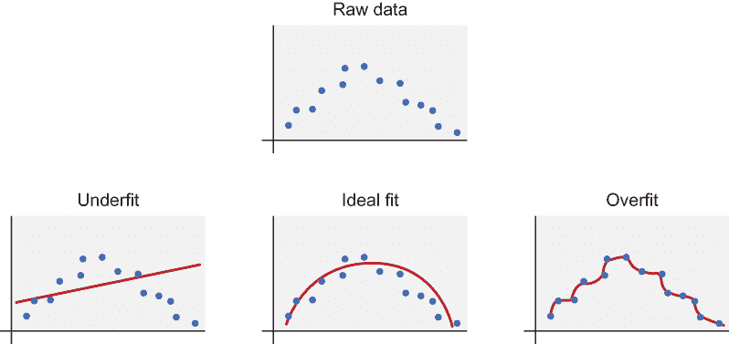

图 3.4 欠拟合和过拟合数据的示例

具体来说，模型的*方差*是衡量响应波动程度的一个指标，而*偏差*是衡量响应偏离真实值程度的一个指标，正如本章前面所讨论的。你希望你的模型实现准确（低偏差）以及可重复（低方差）的结果。

练习 3.2

假设你的模型是 M(w)：y = wx。如果权重参数 w 的值必须是介于 0 和 9（包含）之间的整数，你能生成多少个可能的功能？

**答案**

只有 10 个：`{y = 0, y = x, y = 2x, ..., y = 9x}`

总结来说，衡量你的模型在训练数据上的表现并不是衡量其泛化能力的一个很好的指标。相反，你应该在单独的一批测试数据上评估你的模型。你可能会发现，你的模型在你训练的数据上表现良好，但在测试数据上表现糟糕，在这种情况下，你的模型很可能是对训练数据过拟合。如果测试错误与训练错误大致相同，并且两个错误相似，那么你的模型可能拟合得很好，或者（如果那个错误很高）欠拟合。

这就是为什么，为了衡量机器学习中的成功，你需要将数据集分成两组：训练数据集和测试数据集。模型使用训练数据集学习，性能在测试数据集上评估。（第 3.2 节描述了如何评估性能。）在你可以生成的许多可能的权重参数中，目标是找到最适合数据的那个。你通过定义一个成本函数来衡量最佳拟合，该函数在第 3.2 节中进行了更详细的讨论。成本函数还可以驱动你将测试数据分成另一个调整成本的参数和一个评估数据集（这是真正的未见数据）。我们将在接下来的章节中进一步解释。

## 3.2 线性回归

让我们先创建一些假数据，以便深入理解线性回归。创建一个名为 regression.py 的 Python 源文件，并按照列表 3.1 初始化数据。该代码将生成类似于图 3.5 的输出。

列表 3.1 可视化原始输入

```
import numpy as np                                               ❶
import matplotlib.pyplot as plt                                  ❷
x_train = np.linspace(-1, 1, 101)                                ❸
y_train = 2 * x_train + np.random.randn(*x_train.shape) * 0.33   ❹
plt.scatter(x_train, y_train)                                    ❺
plt.show()                                                       ❺
```

❶ 导入 NumPy 以帮助生成初始原始数据

❷ 使用 Matplotlib 可视化数据

❸ 输入值是-1 和 1 之间 101 个等间距的数字。

❹ 输出值与输入成正比，但增加了噪声。

❺ 使用 Matplotlib 的函数生成数据的散点图

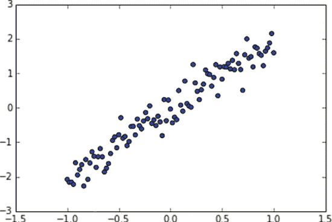

图 3.5 y = x + (噪声)的散点图

现在你有一些数据点可用，你可以尝试拟合一条线。至少，你需要为 TensorFlow 提供的每个候选参数提供一个分数。这种评分分配通常称为*成本函数*。成本越高，模型参数就越差。如果最佳拟合线是*y* = 2*x*，参数选择 2.01 应该有低成本，但选择-1 应该有更高的成本。

在将情况定义为成本最小化问题后，如图 3.6 所示，TensorFlow 负责内部工作，尝试以高效的方式更新参数，最终达到最佳可能值。遍历所有数据以更新参数的每个步骤称为一个*epoch*。

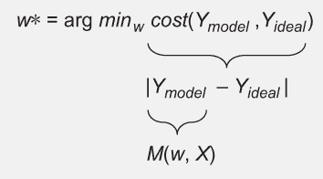

图 3.6 任何参数 w 最小化，成本就是最优的。成本定义为理想值与模型响应之间的误差范数。最后，响应值是从模型集中的函数计算得出的。

在这个例子中，你通过误差的总和定义*成本*。预测*x*的误差通常通过实际值*f*(*x*)与预测值*M*(*w*, *x*)之间的平方差来计算。因此，成本是实际值和预测值之间平方差的和，如图 3.7 所示。

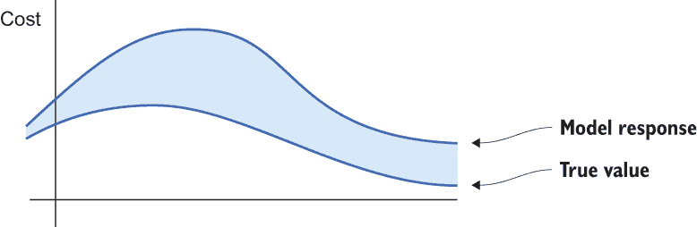

图 3.7 成本是模型响应与真实值之间逐点差异的范数。

更新你的代码，使其看起来像列表 3.2。此代码定义了成本函数并请求 TensorFlow 运行一个优化器来找到模型参数的最佳解决方案。

列表 3.2 解决线性回归

```
import tensorflow as tf                                                    ❶
import numpy as np                                                         ❶
import matplotlib.pyplot as plt                                            ❶

learning_rate = 0.01                                                       ❷
training_epochs = 100                                                      ❷

x_train = np.linspace(-1, 1, 101)                                          ❸
y_train = 2 * x_train + np.random.randn(*x_train.shape) * 0.33             ❸

X = tf.placeholder(tf.float32)                                             ❹
Y = tf.placeholder(tf.float32)                                             ❹

def model(X, w):                                                           ❺
    return tf.multiply(X, w)  

w = tf.Variable(0.0, name="weights")                                       ❻

y_model = model(X, w)                                                      ❼
cost = tf.square(Y-y_model)                                                ❼

train_op = tf.train.GradientDescentOptimizer(learning_rate).minimize(cost) ❽

sess = tf.Session()                                                        ❾
init = tf.global_variables_initializer()                                   ❾
sess.run(init)                                                             ❾

for epoch in range(training_epochs):                                       ❿
  for (x, y) in zip(x_train, y_train):                                     ⓫
    sess.run(train_op, feed_dict={X: x, Y: y})                             ⓬

w_val = sess.run(w)                                                        ⓭

sess.close()                                                               ⓮
plt.scatter(x_train, y_train)                                              ⓯
y_learned = x_train*w_val                                                  ⓰
plt.plot(x_train, y_learned, 'r')                                          ⓰
plt.show()                                                                 ⓰
```

❶ 导入 TensorFlow 用于学习算法。你需要 NumPy 来设置初始数据，并使用 Matplotlib 来可视化你的数据。

❷ 定义学习算法使用的常数。这些常数称为超参数。

❸ 设置用于找到最佳拟合线的假数据

❹ 将输入和输出节点设置为占位符，因为值将由 x_train 和 y_train 注入

❺ 定义模型为 y = w*X

❻ 设置权重变量

❼ 定义成本函数

❽ 定义学习算法每次迭代将调用的操作

❾ 设置会话并初始化所有变量

❿ 每个 epoch 多次遍历数据集

⓫ 遍历数据集中的每个项目

⓬ 更新模型参数以尝试最小化成本函数

⓭ 获得最终参数值

⓮ 关闭会话

⓯ 绘制原始数据

⓰ 绘制最佳拟合线

如图 3.8 所示，你刚刚使用 TensorFlow 解决了线性回归问题！方便的是，回归中的其余主题都是列表 3.2 的微小修改。整个流程涉及使用 TensorFlow 更新模型参数，如图 3.9 总结所示。

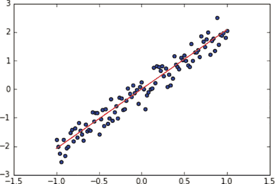

图 3.8 通过运行列表 3.2 显示的线性回归估计

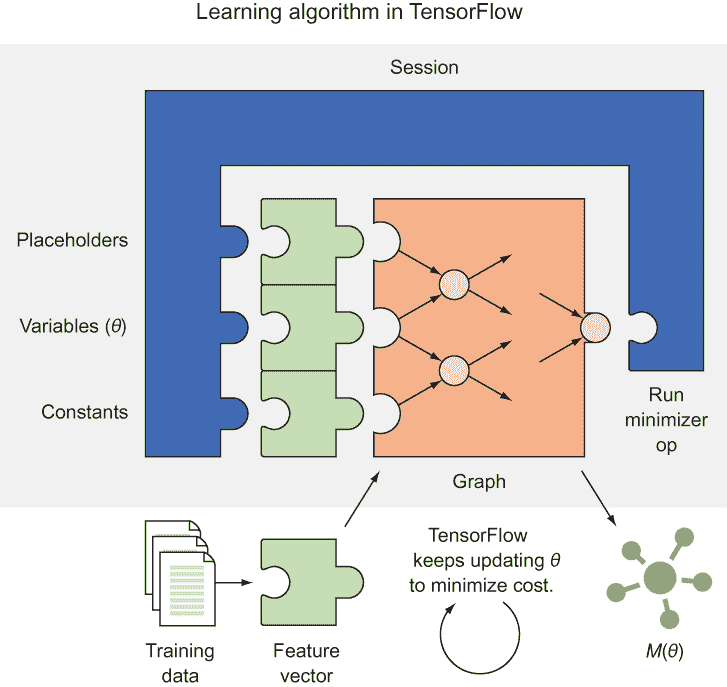

图 3.9 学习算法通过更新模型参数来最小化给定的成本函数。

你已经学会了如何在 TensorFlow 中实现一个简单的回归模型。进一步改进是一个简单的问题，只需通过前面讨论的正确混合方差和偏差来增强模型即可。你迄今为止设计的线性回归模型负担着强烈的偏差；它只表达了一组有限的函数，例如线性函数。在第 3.3 节中，你将尝试一个更灵活的模型。你会注意到，只需要重新布线 TensorFlow 图；其他所有事情（如预处理、训练和评估）都保持不变。

## 3.3 多项式模型

线性模型可能是一个直观的第一选择，但现实世界的相关性很少如此简单。例如，导弹在空间中的轨迹相对于地球上的观察者来说是弯曲的。Wi-Fi 信号强度随着平方反比定律而减弱。一朵花在其一生中的高度变化当然不是线性的。

当数据点似乎形成平滑曲线而不是直线时，你需要将你的回归模型从直线改为其他东西。一种方法就是使用多项式模型。*多项式*是线性函数的推广。*n* 次多项式看起来如下所示：

*f* (*x*) = *w*[n] *x*^n *+ ... + w*[1] *x* + w[0]

注意：当 *n* = 1 时，多项式只是一个线性方程 *f* (*x*) = *w*[1] *x* + w[0]。

考虑图 3.10 中的散点图，其中 x 轴表示输入，y 轴表示输出。正如你所看到的，一条直线不足以描述所有数据。多项式函数是线性函数的更灵活的推广。

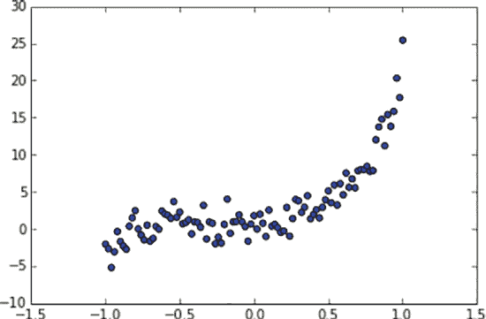

图 3.10 这样的数据点不适合线性模型。

让我们尝试将多项式拟合到这类数据。创建一个名为 polynomial.py 的新文件，并按照列表 3.3 进行操作。

列表 3.3 使用多项式模型

```
import tensorflow as tf                                                    ❶
import numpy as np                                                         ❶
import matplotlib.pyplot as plt                                            ❶

learning_rate = 0.01                                                       ❷
training_epochs = 40                                                       ❷

trX = np.linspace(-1, 1, 101)                                              ❷

num_coeffs = 6                                                             ❸
trY_coeffs = [1, 2, 3, 4, 5, 6]                                            ❸
trY = 0                                                                    ❸
for i in range(num_coeffs):                                                ❸
    trY += trY_coeffs[i] * np.power(trX, i)                                ❸

trY += np.random.randn(*trX.shape) * 1.5                                   ❹

plt.scatter(trX, trY)                                                      ❺
plt.show()                                                                 ❺

X = tf.placeholder(tf.float32)                                             ❻
Y = tf.placeholder(tf.float32)                                             ❻

def model(X, w):                                                           ❼
    terms = []                                                             ❼
    for i in range(num_coeffs):                                            ❼
        term = tf.multiply(w[i], tf.pow(X, i))                             ❼
        terms.append(term)                                                 ❼
    return tf.add_n(terms)                                                 ❼

w = tf.Variable([0.] * num_coeffs, name="parameters")                      ❽
y_model = model(X, w)                                                      ❽

cost = (tf.pow(Y-y_model, 2))                                              ❾
train_op = tf.train.GradientDescentOptimizer(learning_rate).minimize(cost) ❾

sess = tf.Session()                                                        ❿
init = tf.global_variables_initializer()                                   ❿
sess.run(init)                                                             ❿

Jr epoch in range(training_epochs):                                        ⓫
    for (x, y) in zip(trX, trY):                                           ⓫
        sess.run(train_op, feed_dict={X: x, Y: y})                         ⓫

w_val = sess.run(w)                                                        ⓫
print(w_val)                                                               ⓫

sess.close()                                                               ⓫

plt.scatter(trX, trY)                                                      ⓬
trY2 = 0                                                                   ⓬
for i in range(num_coeffs):                                                ⓬
    trY2 += w_val[i] * np.power(trX, i)                                    ⓬

plt.plot(trX, trY2, 'r')                                                   ⓬
plt.show()                                                                 ⓬
```

❶ 导入相关库并初始化超参数

❷ 设置伪造的原始输入数据

❸ 基于五次多项式设置原始输出数据

❹ 添加噪声

❺ 显示原始数据的散点图

❻ 定义节点以保存输入/输出对的值

❼ 定义了你的多项式模型

❽ 将参数向量设置为全零

❾ 定义了与之前相同的成本函数

❿ 按照之前的方式设置会话并运行学习算法

⓫ 完成后关闭会话

⓬ 绘制结果图

代码的最终输出是一个五次多项式，如图 3.11 所示，它拟合了数据。

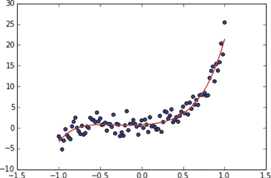

图 3.11 最佳拟合曲线与非线性数据平滑对齐。

## 3.4 正则化

不要被多项式的美妙灵活性所迷惑，如第 3.3 节所示。仅仅因为高阶多项式是低阶多项式的扩展，并不意味着你应该总是偏好更灵活的模型。

在现实世界中，原始数据很少形成类似于多项式的平滑曲线。假设你正在绘制随着时间的推移的房价。数据可能包含波动。回归的目标是用一个简单的数学方程表示复杂性。如果你的模型过于灵活，模型可能会过度复杂化对输入的解释。

以图 3.12 中展示的数据为例。你试图将八次多项式拟合到似乎遵循方程 *y* = *x*²的点。这个过程失败得很惨，因为算法尽力更新多项式的九个系数。

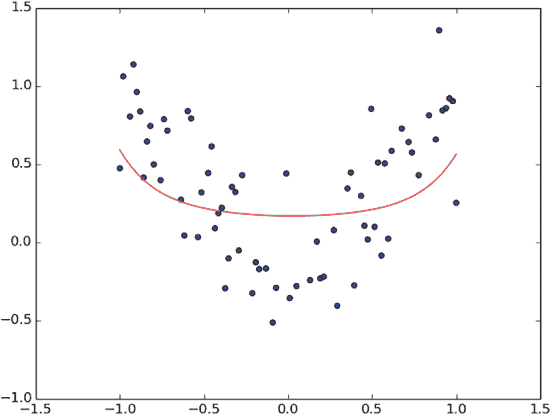

图 3.12 当模型过于灵活时，最佳拟合曲线可能看起来复杂或难以直观理解。我们需要使用正则化来改善拟合，以便学习到的模型在测试数据上表现良好。

*正则化*是一种技术，可以将参数结构化为你偏好的形式，通常用于解决过拟合问题（见图 3.13）。在这种情况下，你预计学习到的系数除了第二项外，其他地方都为 0，从而产生曲线 *y* = *x*²。回归算法可能会产生得分较高的曲线，但看起来过于复杂。


图 3.13 正则化的概述。建模过程以数据（X）作为输入，并试图学习模型参数（W），这些参数最小化成本函数或模型预测与真实值之间的距离。顶部黄色象限显示一个二维模型参数空间，用于选择权重以简化问题。正则化确保训练算法不会选择低于理想（黄色）区域的权重，而是保持在理想权重值的白色圆圈内部。

为了影响学习算法产生一个更小的系数向量（让我们称它为 *w*），你将这个惩罚项加到损失项中。为了控制你想要多显著地权衡惩罚项，你将惩罚乘以一个常数非负数，λ，如下所示：

*成本*(*X*, *Y* ) = *损失*(*X*, *Y* ) + λ

如果λ设置为 0，则正则化不起作用。随着你将λ设置为更大的值，具有较大范数的参数将受到严重惩罚。范数的选择因情况而异，但参数通常通过它们的 L1 或 L2 范数来衡量。简单来说，正则化减少了模型本应容易纠缠的灵活性。

为了找出正则化参数λ的最佳值，你必须将数据集分割成两个不相交的集合。大约 70%的随机选择的输入/输出对将组成训练数据集；剩余的 30%将用于测试。你将使用列表 3.4 中提供的函数来分割数据集。

列表 3.4 将数据集分割为测试集和训练集

```
def split_dataset(x_dataset, y_dataset, ratio):         ❶
    arr = np.arange(x_dataset.size)                     ❷
    np.random.shuffle(arr)                              ❷
    num_train = int(ratio * x_dataset.size)             ❸
    x_train = x_dataset[arr[0:num_train]]               ❹
    x_test = x_dataset[arr[num_train:x_dataset.size]]   ❹
    y_train = y_dataset[arr[0:num_train]]               ❺
    y_test = y_dataset[arr[num_train:x_dataset.size]]   ❺
    return x_train, x_test, y_train, y_test             ❻
```

❶ 以输入输出数据集以及期望的分割比率为输入

❷ 打乱数字列表

❸ 计算训练示例的数量

❹ 使用打乱后的列表来分割 x_dataset

❺ 同样，分割 y_dataset

❻ 返回分割后的 x 和 y 数据集

练习 3.3

一个名为 SK-learn 的 Python 库支持许多有用的数据处理算法。你可以调用 SK-learn 中的一个函数来完成列表 3.4 所实现的功能。你能在库的文档中找到这个函数吗？（提示：见[`mng.bz/7Grm`](http://mng.bz/7Grm)。）

**答案**

它被称为`sklearn.model_selection.train_test_split`。

使用这个便捷的工具，你可以开始测试哪个值在你的数据上表现最佳。打开一个新的 Python 文件，并按照列表 3.5 进行操作。

列表 3.5 评估正则化参数

```
import tensorflow as tf                                                      ❶
import numpy as np                                                           ❶
import matplotlib.pyplot as plt                                              ❶

learning_rate = 0.001                                                        ❶
training_epochs = 1000                                                       ❶
reg_lambda = 0\.                                                              ❶

x_dataset = np.linspace(-1, 1, 100)                                          ❷

num_coeffs = 9                                                               ❷
y_dataset_params = [0.] * num_coeffs                                         ❷
y_dataset_params[2] = 1                                                      ❷
y_dataset = 0                                                                ❷
for i in range(num_coeffs):                                                  ❷
    y_dataset += y_dataset_params[i] * np.power(x_dataset, i)                ❷
y_dataset += np.random.randn(*x_dataset.shape) * 0.3                         ❷

(x_train, x_test, y_train, y_test) = split_dataset(x_dataset, y_dataset, 0.7)❸

X = tf.placeholder(tf.float32)                                               ❸
Y = tf.placeholder(tf.float32)                                               ❸

def model(X, w):                                                             ❹
    terms = []                                                               ❹
    for i in range(num_coeffs):                                              ❹
        term = tf.multiply(w[i], tf.pow(X, i))                               ❹
        terms.append(term)                                                   ❹
    return tf.add_n(terms)                                                   ❹

w = tf.Variable([0.] * num_coeffs, name="parameters")                        ❺
y_model = model(X, w)                                                        ❺
cost = tf.div(tf.add(tf.reduce_sum(tf.square(Y-y_model)),                    ❺
                     tf.multiply(reg_lambda, tf.reduce_sum(tf.square(w)))),  ❻
              2*x_train.size)                                                ❻
train_op = tf.train.GradientDescentOptimizer(learning_rate).minimize(cost)   ❻

sess = tf.Session()                                                          ❼
init = tf.global_variables_initializer()                                     ❼
sess.run(init)                                                               ❼

for reg_lambda in np.linspace(0,1,100):                                      ❽
    for epoch in range(training_epochs):                                     ❽
        sess.run(train_op, feed_dict={X: x_train, Y: y_train})               ❽
    final_cost = sess.run(cost, feed_dict={X: x_test, Y:y_test})             ❽
    print('reg lambda', reg_lambda)                                          ❽
    print('final cost', final_cost)                                          ❽

sess.close()                                                                 ❾
```

❶ 导入相关库并初始化超参数

❷ 创建一个假数据集，y = x²

❸ 使用列表 3.4 将数据集分割为 70%训练和 30%测试

❹ 设置输入/输出占位符

❺ 定义你的模型

❻ 定义正则化成本函数

❼ 设置会话

❽ 尝试各种正则化参数

❾ 关闭会话

如果你绘制列表 3.5 中每个正则化参数对应的输出，你可以看到曲线如何随着λ的增加而变化。当λ为 0 时，算法倾向于使用高阶项来拟合数据。当你开始惩罚具有高 L2 范数的参数时，成本降低，表明你正在从过拟合中恢复，如图 3.14 所示。

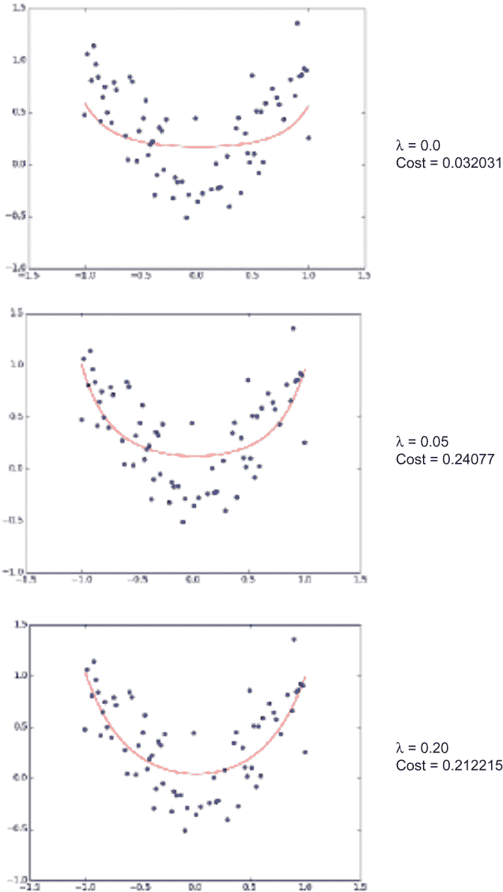

图 3.14 随着正则化参数的增加，成本降低。这一结果意味着模型最初过度拟合了数据，而正则化有助于增加结构

TensorFlow 库对正则化的支持

TensorFlow 是一个完全能够支持机器学习的库，尽管本节的重点是如何自己实现正则化，但该库提供了自己的函数来计算 L2 正则化。你可以使用函数`tf.nn.l2_loss(weights)`通过将正则化损失添加到每个权重的成本函数中，来产生等效的结果。

## 3.5 线性回归的应用

在假数据上运行线性回归就像买了一辆新车却从未驾驶过。这神奇的机械渴望在现实世界中展现自己！幸运的是，许多数据集都可在网上找到，以测试你对回归的新发现知识：

+   马萨诸塞大学阿默斯特分校在 [`scholarworks.umass.edu/data`](https://scholarworks.umass.edu/data/) 提供了各种类型的小型数据集。

+   Kaggle 在 [`www.kaggle.com/datasets`](https://www.kaggle.com/datasets) 提供了所有类型的大规模数据，用于机器学习竞赛。

+   Data.gov ([`catalog.data.gov`](https://catalog.data.gov)) 是美国政府的一项开放数据倡议，其中包含许多有趣且实用的数据集。

许多数据集包含日期。例如，你可以在 [`www.dropbox.com/s/naw774olqkve7sc/311.csv?dl=0`](https://www.dropbox.com/s/naw774olqkve7sc/311.csv?dl=0) 找到加利福尼亚州洛杉矶所有 311 非紧急电话的数据集。一个很好的跟踪特征可能是每天、每周或每月的通话频率。为了方便起见，列表 3.6 允许你获得数据项的每周频率计数。

列表 3.6 解析原始 CSV 数据集

```
import csv                                              ❶
import time                                             ❷

def read(filename, date_idx, date_parse, year, bucket=7):

    days_in_year = 365

    freq = {}                                           ❸
    for period in range(0, int(days_in_year / bucket)):
        freq[period] = 0

    with open(filename, 'rb') as csvfile:               ❹
        csvreader = csv.reader(csvfile)
        csvreader.next()
        for row in csvreader:
            if row[date_idx] == '':
                continue
            t = time.strptime(row[date_idx], date_parse)
            if t.tm_year == year and t.tm_yday < (days_in_year-1):
                freq[int(t.tm_yday / bucket)] += 1

    return freq

freq = read('311.csv', 0, '%m/%d/%Y', 2014              ❺
```

❶ 为了轻松读取 CSV 文件

❷ 为了使用有用的日期函数

❸ 设置初始频率映射

❹ 读取数据并按周期汇总计数

❺ 获取 2014 年 311 电话通话的每周频率计数

这段代码为你提供了线性回归的训练数据。`freq` 变量是一个字典，将周期（如一周）映射到频率计数。一年有 52 周，所以如果你将 `bucket=7` 保持不变，你将会有 52 个数据点。

现在你有了数据点，你正好有输入和输出，可以使用本章介绍的技术来拟合回归模型。更实际地说，你可以使用学习到的模型来插值或外推频率计数。

## 摘要

+   回归是一种监督机器学习方法，用于预测连续值输出。

+   通过定义一组模型，你大大减少了可能函数的搜索空间。此外，TensorFlow 通过运行其高效的梯度下降优化器来利用函数的可微性，从而学习参数。

+   你可以轻松地将线性回归修改为学习多项式和其他更复杂的曲线。

+   为了避免数据过拟合，通过惩罚较大值的参数来正则化成本函数。

+   如果函数的输出不连续，则使用分类算法代替（参见第四章）。

+   TensorFlow 使你能够有效地解决线性回归机器学习问题，并因此对诸如农业生产、心脏病和房价等重要问题做出有用的预测。
