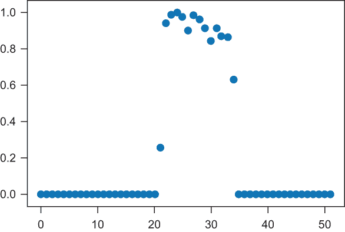
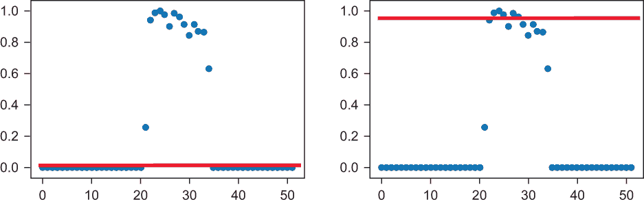
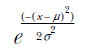
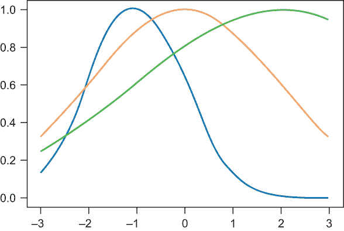
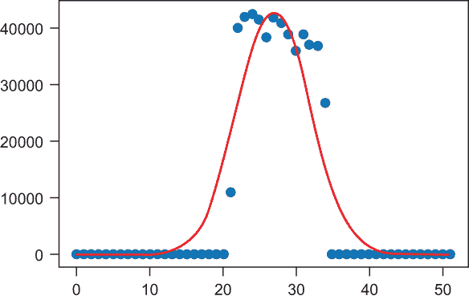
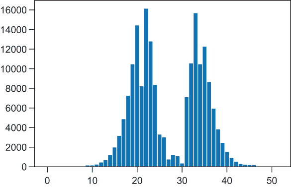
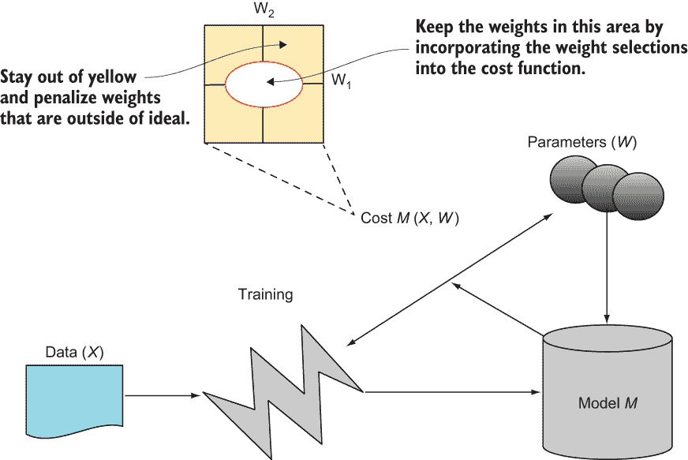

# 4 使用回归进行呼叫中心量预测

本章涵盖

+   将线性回归应用于现实世界数据

+   清洗数据以适应你之前未见过的曲线和模型

+   使用高斯分布并预测沿其的点

+   评估你的线性回归如何预测预期值的效果

借助基于回归的预测和 TensorFlow 的力量，你可以开始处理涉及机器学习过程中更多步骤的现实世界问题，例如数据清洗、将模型拟合到未见过的数据，以及识别那些不一定是容易发现的最佳拟合线或多项式曲线的模型。在第三章中，我向你展示了如何在控制机器学习过程的每个步骤时使用回归，从使用 NumPy 生成适合线性函数（一条线）或多项式函数（一条曲线）的假数据点开始。但在现实生活中，当数据点不适应你之前见过的任何模式时，比如图 4.1 中的点集，会发生什么呢？仔细看看图 4.1。线性回归模型在这里是一个好的预测器吗？



图 4.1 一组数据点，对应于年份的周数（x 轴上的 0-51）和归一化呼叫量（特定一周的呼叫次数/所有周的最大呼叫次数）

图 4.2 给出了两个最佳拟合线，使用线性回归模型对呼叫数据进行拟合，这似乎非常不合适。你能想象图 4.2 左右两侧图中预测值和实际值之间的误差吗？多项式模型也会同样糟糕，因为数据没有整齐地适合曲线，y 值在 x 轴上看似随机的时刻同时增加和减少。通过绘制二阶或三阶多项式来证明自己。你能让它拟合数据吗？如果你做不到，那么计算机程序可能也会遇到类似的困难。在这种情况下，问自己这些问题是完全正常的：

+   回归还能帮助我预测下一组点吗？

+   除了直线和多项式曲线之外，还存在哪些回归模型？

+   因为现实生活中的数据通常不是以容易绘制和用回归等模型表示的漂亮的(x, y)点形式出现，我该如何准备数据，以便它能够干净地适合特定的模型，或者找到更适合混乱数据的模型？



图 4.2 对图 4.1 中所示数据点的两个线性最佳拟合模型

在第三章和整本书中，有时为了说明，我生成了一些假数据，例如 NumPy `np.random.normal`函数的输出，但必须强调的是，真实数据很少看起来是这样的。

注意：我知道有几位作者正在撰写关于机器学习数据清洗主题的书籍。尽管血腥的细节超出了本书的范围，但我不会向你隐藏数据清洗步骤；你将有机会使用使此过程更简单的 TensorFlow 技术来获得经验。

在将回归应用于现实世界问题时，另一个出现的问题是，如何通过计算偏差，即模型预测值与实际值之间的差异来评估预测的准确性。图 4.2 中回归模型生成的线似乎有些偏离，但你可以通过定量测量和评估模型预测与真实值之间的误差来做出更强烈的陈述。TensorFlow 通过其数据流图提供易于使用的结构，可以在几行代码中计算误差。Matplotlib 同样提供了能力，让你可以通过几行代码直观地检查和评估模型误差。

线性回归在许多现实世界问题中是一个好的预测器，因此很难选择一个。一般来说，具有时间性质的问题为历史数据训练提供了数据在 x 轴上的自然排序，以及一个未来状态（例如未来 N 小时或几周），这形成了一个良好的预测目标，可以用来测试回归。因此，选择一个涉及时间作为因变量的问题非常适合回归模型。

对于机器学习，存在大量的基于时间的数据集，许多使用这些数据集的开放数据挑战在 Kaggle（[`www.kaggle.com`](https://www.kaggle.com)）上免费提供，Kaggle 是一个广泛使用的开放机器学习平台。Kaggle 提供了数据集、文档、可分享的代码以及执行机器学习的平台，包括对基于 TensorFlow 的笔记本和代码的一流支持。Kaggle 拥有大量的时间数据集，可以尝试回归机器学习模型，例如房地产价格挑战（[`mng.bz/6Ady`](http://mng.bz/6Ady)）和纽约市（NYC）311 开放数据集（[`mng.bz/1gPX`](http://mng.bz/1gPX)）。NYC 311 数据集很有趣，因为它基于时间，需要一些清洗，并且不适合线性或多项式曲线回归模型。

纽约市开放数据平台

纽约市有一个开放数据计划，它提供了易于使用的应用程序编程接口（API），可以下载用于机器学习和其他用途的数据。您可以通过[`opendata.cityofnewyork.us`](http://opendata.cityofnewyork.us/)访问开放数据门户。

纽约市的 311 数据是收集居民向城市客服中心打电话请求关于城市和其他政府非紧急服务信息的一系列信息，例如废物处理、法规执行和建筑维护。想象一下，像这样的客服中心每天会接到很多电话，因为它们能帮助人们及时获取所需信息。但是，客服中心一周会接到多少电话？一年呢？有没有某些月份或周，客服中心可以预期接到更多或更少的电话？

假设你负责此类服务的员工配置，尤其是在假日期间。你应该有更多还是更少的客服代表接听电话？电话激增是否与季节有关？你应该允许额外的季节性员工，还是全职员工就足够了？回归分析和 TensorFlow 可以帮助你找到这些问题的答案。

## 4.1 什么是 311？

311 是美国和加拿大的一项全国性服务，提供有关非紧急市政服务的信息。该服务允许您报告垃圾收集员没有来取垃圾，或者了解如何清除您住宅前公共区域内的树叶和灌木。311 的电话量各不相同，但在大城市和市政区，每月的电话量可以从几千到几万不等。

这些客服中心及其相关信息服务必须处理的一个关键问题是，在特定月份会有多少电话进来。这些信息可能有助于服务在假日期间规划人员配备水平，或者决定为他们的资源和服务目录存储和计算成本。此外，它还可能帮助 311 倡导者提供关于它预期在任意一年为多少人提供服务的信息，这将有助于证明对关键服务的持续支持是合理的。

第一个 311

第一个 311 服务于 1996 年在马里兰州巴尔的摩开业。该服务的两个主要目标是建立政府与其公民之间更紧密的联系，并创建客户关系管理（CRM）能力，以确保更好地为社区提供服务。CRM 功能今天适合我们将在本章中探讨的数据驱动预测。

能够预测任意月份的电话量对于任何 311 服务来说都将是一项极其有用的能力。你可以通过查看一年的电话及其相关日期和时间来完成这项预测，然后将这些电话按周汇总，构建一系列点，其中 x 值是周数（1-52，或每周 7 天除以 365 天），y 值是特定周的电话计数。然后你会做以下事情：

+   在 y 轴上绘制电话数量，在 x 轴上绘制周数（1-52）。

+   检查趋势，看它是否类似于一条线、一个曲线或其他东西。

+   选择并训练一个最适合数据点（周数和调用次数）的回归模型。

+   通过计算和可视化其错误来评估你的模型表现如何。

+   使用您的新模型来预测 311 在任何给定周、季节和年份可以期待多少次调用。

这个预测看起来像是线性回归模型和 TensorFlow 可以帮助你完成的，这正是你将在本章中要做的。

## 4.2 为回归清理数据

首先，从[`mng.bz/P16w`](http://mng.bz/P16w)下载这些数据——2014 年夏纽约市 311 服务的一组电话调用。Kaggle 有其他 311 数据集，但你会使用这个特定的数据，因为它具有有趣的特征。这些调用以逗号分隔值（CSV）文件格式化，具有几个有趣的特征，包括以下内容：

+   一个唯一的调用标识符，显示调用创建的日期

+   报告事件或信息请求的位置和 ZIP 代码

+   代理在通话中采取的具体行动以解决问题

+   调用是从哪个区（如布朗克斯或皇后区）打来的

+   调用的状态

这个数据集包含大量对机器学习有用的信息，但在这个练习中，你只关心调用创建日期。创建一个名为 311.py 的新文件。然后编写一个函数来读取 CSV 文件中的每一行，检测周数，并按周汇总调用次数。

你的代码需要处理这个数据文件中的一些混乱。首先，将单个调用（有时一天内多达数百次）聚合到一个七天或每周的桶中，如列表 4.1 中的`bucket`变量所标识。`freq`（频率的简称）变量包含每周和每年的调用次数。如果 311 CSV 包含超过一年的数据（如你可以在 Kaggle 上找到的其他 311 CSV 文件），编写代码以允许按年份选择用于训练的调用。列表 4.1 中代码的结果是一个`freq`字典，其值是按年份和周数通过`period`变量索引的调用次数。`t.tm_year`变量包含从调用创建时间值（在 CSV 中索引为`date_idx`，一个定义日期字段所在列号的整数）和`date_parse`格式字符串传递给 Python 的`time`库的`strptime`（或字符串解析时间）函数后解析出的年份。`date_parse`格式字符串是一个模式，定义了日期在 CSV 中作为文本出现的方式，以便 Python 知道如何将其转换为 datetime 表示。

列表 4.1 从 311 CSV 中读取和汇总按周计算的调用次数

```
def read(filename, date_idx, date_parse, year=None, bucket=7):            ❶
    days_in_year = 365                                                    ❶

    freq = {}
    if year != None:                                                      ❷
         for period in range(0, int(days_in_year / bucket)):              ❷
            freq[period] = 0                                              ❷

    with open(filename, 'r') as csvfile:
        csvreader = csv.reader(csvfile)
        next(csvreader)
        for row in csvreader:
            if row[date_idx] == '':                                       ❸
                continue

            t = time.strptime(row[date_idx], date_parse)
            if year == None:
                if not t.tm_year in freq:
                     freq[t.tm_year] = {}                                 ❹
                     for period in range(0, int(days_in_year / bucket)):  ❹
                        freq[t.tm_year][period] = 0                       ❹

                if t.tm_yday < (days_in_year - 1):
                    freq[t.tm_year][int(t.tm_yday / bucket)] += 1         ❺

            else:
                if t.tm_year == year and t.tm_yday < (days_in_year-1):
                    freq[int(t.tm_yday / bucket)] += 1                    ❺

    return freq
```

❶ 一周有 7 天，一年有 365 天，因此有 52 周。

❷ 如果指定了年份，则仅选择该年的调用。

❸ 如果调用数据中不存在年份列，则跳过该行。

❹ 如果 CSV 文件包含超过一年的数据，则将（年，周）单元格的值初始化为 0。

❺ 对于每一行，将 1 次调用添加到（年，周）或（周）索引单元格的前一个计数（从 0 开始）。

列表 4.1 中的大部分代码处理的是现实世界中的数据，而不是由 NumPy 调用生成的随机（x, y）数据点，这些数据点沿正态分布——这是本书中的一个主题。机器学习期望干净的数据来执行其所有黑魔法，而现实世界中的数据并不干净。从纽约市开放数据门户（[`data.cityofnewyork.us/browse?q=311`](https://data.cityofnewyork.us/browse?q=311)）随机选取 311 个 CSV 文件，您会发现很多差异。有些文件包含来自多个年份的调用，因此您的代码需要处理这种情况；有些文件有缺失的行，或者特定单元格缺失年份和日期值，而您的代码仍然需要保持稳定。编写健壮的数据清理代码是机器学习的基本原则之一，因此编写此代码将是本书许多示例中的第一步。

调用列表 4.1 中定义的 `read` 函数，您将得到一个以（年，周数）或简单地以（周数）为索引的 Python 字典，具体取决于您是否将年份作为最后一个功能参数传递。在您的 311.py 代码中调用此函数。该函数接受列索引（第二列，索引为 0）和看起来像的字符串作为输入。

```
freq = read('311.csv', 1, '%m/%d/%Y %H:%M:%S %p', 2014)
```

告诉函数日期字段位于索引 1（或基于 0 索引的第二列），您的日期格式为类似 `'month/day/year hour:minutes:seconds AM/PM'` 或 `'12/10/2014 00:00:30 AM'` 的字符串（对应于 2014 年 12 月 10 日午夜过后的 30 秒），并且您希望从 CSV 中获取 2014 年的日期。

如果您使用 Jupyter，可以通过检查 `freq` 字典来打印频率桶中的值。结果是每周调用次数的 52 周直方图（从 0 索引，因此为 0-51）。如您从输出中可以看出，数据从第 22 周到第 35 周聚集，即 2014 年 5 月 26 日至 8 月 25 日：`

```
freq
{0: 0,
 1: 0,
 2: 0,
 3: 0,
 4: 0,
 5: 0,
 6: 0,
 7: 0,
 8: 0,
 9: 0,
 10: 0,
 11: 0,
 12: 0,
 13: 0,
 14: 0,
 15: 0,
 16: 0,
 17: 0,
 18: 0,
 19: 0,
 20: 0,
 21: 10889,
 22: 40240,
 23: 42125,
 24: 42673,
 25: 41721,
 26: 38446,
 27: 41915,
 28: 41008,
 29: 39011,
 30: 36069,
 31: 38821,
 32: 37050,
 33: 36967,
 34: 26834,
 35: 0,
 36: 0,
 37: 0,
 38: 0,
 39: 0,
 40: 0,
 41: 0,
 42: 0,
 43: 0,
 44: 0,
 45: 0,
 46: 0,
 47: 0,
 48: 0,
 49: 0,
 50: 0,
 51: 0}
```

国际标准化组织（ISO）机构，该机构定义了计算机代码、数据和软件的标准，发布了常用的 ISO-8601 标准，用于将日期和时间作为字符串表示。Python 的 `time` 和 `iso8601` 库实现了此标准，该标准包括与以星期一为开始日期的周数相关的日期和时间的规范（[`www.epochconverter.com/weeknumbers`](https://www.epochconverter.com/weeknumbers)），这对于 311 数据似乎是一个有用的表示。尽管其他周数表示方法也可用，但它们大多数都有不同的周起始日，例如星期日。

通过将基于时间的日期转换为 x 轴上的周数，你得到一个表示时间的整数值，它可以很容易地进行排序和可视化。这个值与回归函数将预测的调用频率 y 轴值相匹配。

将周数转换为日期

你将要处理的大部分基于时间的数据有时用周数表示会更好。处理一个从 1 到 52 的整数，比如字符串值`'周三，2014 年 9 月 5 日'`，要好得多。EpochConverter 网站可以轻松地告诉你某年某周的周数。要查看列表 4.1 中 2014 年输出映射到周数的日期列表，请访问[`www.epochconverter.com/weeks/2014`](https://www.epochconverter.com/weeks/2014)。

你可以通过使用`datetime`库在纯 Python 中获取相同的信息：

```
import datetime
datetime.date(2010, 6, 16).isocalendar()[1]
```

这段代码输出 24，因为 2010 年 6 月 16 日是该年的第 24 周。

不用谢！

打开一个 Jupyter 笔记本，并将列表 4.2 粘贴进去，以可视化从你的`freq`字典（由`read`函数返回）中按周计算的调用频率的分组直方图，并生成图 4.3，这是本章开头讨论的点分布。通过检查点分布，你可以决定在 TensorFlow 中编码的回归预测器的模型。列表 4.2 设置了你的输入训练值为第 1-52 周，你的预测输出为该周预期的调用次数。`X_train`变量包含频率字典的键（0-51 的整数，代表 52 周），而`Y_train`变量包含每周的 311 次调用次数。`nY_train`包含标准化后的 Y 值（除以`maxY`），介于 0 到 1 之间。我将在本章后面解释原因，但预览是它在训练过程中简化了学习过程。代码的最后几行使用 Matplotlib 创建了一个（周数，调用频率）点的散点图。

列表 4.2 可视化和设置输入数据

```
X_train = np.asarray(list(freq.keys()))     ❶
Y_train = np.asarray(list(freq.values()))   ❷
print("Num samples", str(len(X_train)))
maxY = np.max(Y_train)                      ❸
nY_train = Y_train / np.max(Y_train)        ❸

plt.scatter(X_train, nY_train)              ❹
plt.show()
```

❶ 定义输入训练数据 X 为周数，这是 Python freq 字典的键

❷ 定义输入训练数据 Y 为特定周的调用次数

❸ 将调用值之间的数量标准化到 0 到 1 之间，以简化学习过程

❹ 绘制数据以学习

列表 4.2 的输出显示在图 4.3 中。它与我们在第三章中尝试拟合模型的线条和曲线相当不同。记得我说过现实世界的数据并不总是那么完美吗？直观上看，数据告诉我们，在年初的前两个季度的大部分时间里，没有调用；春季出现的大峰值一直延续到夏天；在秋冬季节，没有调用。也许夏天是纽约许多人在 2014 年使用 311 的季节。更有可能的是，这些数据只是可用实际信息的一个子集，但让我们看看我们是否可以从中构建一个好的模型。


图 4.3 在 y 轴上显示呼叫频率计数，与 x 轴上的年份周数（0-51）进行比较。活动在 2014 年 5 月期间增加，在 2014 年 8 月下旬减少。

如果你曾经查看过测试分数的分布，描述从 0 到 100 排序的分数分布的常见模型是曲线或钟形曲线。结果证明，我们将在本章的剩余部分教会我们的 TensorFlow 预测器模仿这种类型的模型。

## 4.3 钟形曲线中有什么？预测高斯分布

钟形曲线或正态曲线是描述我们所说的符合正态分布的数据的常用术语。数据中最大的 Y 值出现在中间或统计上的均值 X 值，而较小的 Y 值出现在分布的早期和尾部 X 值。我们也将这种分布称为高斯分布，以纪念著名的德国数学家卡尔·弗里德里希·高斯，他负责描述正态分布的高斯函数。

我们可以使用 NumPy 方法`np.random.normal`在 Python 中生成从正态分布中抽取的随机点。以下方程显示了该分布背后的高斯函数：



方程包括参数μ（发音为 mu）和σ（发音为 sigma），其中 mu 是分布的均值，sigma 是分布的标准差。Mu 和 sigma 是模型的参数，正如你所看到的，TensorFlow 将在训练模型的过程中学习这些参数的适当值。

为了让你相信你可以使用这些参数来生成钟形曲线，你可以将列表 4.3 中的代码片段输入到名为 gaussian.py 的文件中，然后运行它以生成随后的图表。列表 4.3 中的代码生成了图 4.4 中所示的高斯曲线可视化。请注意，我选择了 mu 在-1 和 2 之间的值。你应该在图 4.4 中看到曲线的中心点，以及标准差（sigma）在 1 和 3 之间，因此曲线的宽度应该对应这些值。代码绘制了 120 个线性间隔的点，X 值在-3 和 3 之间，Y 值在 0 和 1 之间，这些点根据 mu 和 sigma 符合正态分布，输出应该类似于图 4.4。



图 4.4 三个均值在-1 和-2 之间（它们的中心点应该接近这些点）且标准差在 1 和 3 之间的钟形曲线。曲线是由在-3 和 3 之间线性分布的 120 个点生成的。

列表 4.3 生成一些高斯分布并可视化它们

```
def gaussian(x, mu, sig):
    return np.exp(-np.power(x - mu, 2.) / (2 * np.power(sig, 2.)))  ❶
x_values = np.linspace(-3, 3, 120)                                  ❷
for mu, sig in [(-1, 1), (0, 2), (2, 3)]:
    plt.plot(x_values, gaussian(x_values, mu, sig))

plt.show()
```

❶ 使用 mu 和 sigma 实现高斯曲线。

❷ 随机选择 X 在-3 和 3 之间的 120 个线性间隔样本。

## 4.4 训练你的呼叫预测回归器

现在，你已准备好使用 TensorFlow 将你的纽约市 311 数据拟合到这个模型。通过观察曲线，它们似乎自然地与 311 数据相符，特别是如果 TensorFlow 能够找出 mu 的值，使曲线的中心点接近春季和夏季，并且具有相当大的调用量，以及近似最佳标准差的 sigma 值。

列表 4.4 设置了 TensorFlow 训练会话、相关超参数、学习率和训练时代数。我使用了一个相当大的学习率步长，以便 TensorFlow 在稳定下来之前能够通过足够大的步长适当地扫描 mu 和 sig 的值。时代数——5,000——为算法提供了足够的训练步骤以确定最佳值。在我的笔记本电脑上的本地测试中，这些超参数达到了强准确性（99%），并且用时不到一分钟。但我可以选择其他超参数，例如学习率为 0.5，并给训练过程更多的步骤（时代）。机器学习的乐趣之一是超参数训练，这与其说是科学不如说是艺术，尽管元学习和 HyperOpt 等算法可能会在未来简化这一过程。超参数调整的全面讨论超出了本章的范围，但在线搜索应该会找到成千上万的相关介绍。

当超参数设置好之后，定义占位符 X 和 Y，它们将分别用于输入周数和相关的调用次数（归一化）。之前我提到过对 Y 值进行归一化并在列表 4.2 中创建 `nY_train` 变量以简化学习。原因是由于指数 e，我们试图学习的模型 Gaussian 函数的 Y 值仅在 0 和 1 之间。`model` 函数定义了要学习的 Gaussian 模型，相关的变量 `mu` 和 `sig` 随机初始化为 `1`。`cost` 函数定义为 L2 范数，训练使用梯度下降。在训练回归器 5,000 个时代后，列表 4.4 中的最后几步打印出 mu 和 sig 的学习值。

列表 4.4 设置和训练 TensorFlow 模型以拟合你的 Gaussian 曲线

```
learning_rate = 1.5                                                        ❶
training_epochs = 5000                                                     ❷

X = tf.placeholder(tf.float32)                                             ❸
Y = tf.placeholder(tf.float32)                                             ❸

def model(X, mu, sig):
    return tf.exp(tf.div(tf.negative(tf.pow(tf.subtract(X, mu), 2.)), 
    ➥ tf.multiply(2., tf.pow(sig, 2.))))

mu = tf.Variable(1., name="mu")                                            ❹
sig = tf.Variable(1., name="sig")                                          ❹
y_model = model(X, mu, sig)                                                ❺

cost = tf.square(Y-y_model)                                                ❻
train_op = tf.train.GradientDescentOptimizer(learning_rate).minimize(cost) ❻

sess = tf.Session()                                                        ❼
init = tf.global_variables_initializer()                                   ❼
sess.run(init)                                                             ❼

for epoch in range(training_epochs):
    for(x, y) in zip(X_train, nY_train):
        sess.run(train_op, feed_dict={X:x, Y:y})                           ❽

mu_val = sess.run(mu)
sig_val = sess.run(sig)
print(mu_val)                                                              ❾
print(sig_val)                                                             ❾
sess.close()                                                               ❿
```

❶ 为每个时代设置学习率

❷ 训练 5,000 个时代

❸ 设置输入（X）和预测值（Y）

❹ 定义模型的学习参数 mu 和 sig

❺ 基于 TensorFlow 图创建模型

❻ 定义成本函数为 L2 范数并设置训练操作

❼ 初始化 TensorFlow 会话

❽ 执行训练并学习 mu 和 sig 的值

❾ 打印 mu 的学习值

❿ 关闭会话

列表 4.4 的输出应类似于以下内容，它对应于 mu 和 sig 的学习值：

```
27.23236
4.9030166
```

当你完成打印值并将它们保存在局部变量 `mu_val` 和 `sig_val` 中后，不要忘记关闭你的 TensorFlow 会话，以便你可以释放它用于其 5,000 次训练迭代的资源。你可以通过调用 `sess.close()` 来处理这个任务。

提示：列表 4.4 展示了如何使用 TensorFlow 1.x 构建呼叫中心体积预测算法。如果你想知道算法在 TensorFlow 2.x 中的样子，请跳转到附录，我在那里用 TensorFlow 2.x 的语言讨论并重新工作了模型。有一些细微的差异，但它们值得一看。其他你迄今为止看到的数据清理和准备代码保持不变，即将看到的验证和错误计算也是如此。

## 4.5 可视化结果和绘制误差图

你的线性回归在预测每周 311 呼叫频率方面做得怎么样？从 `mu_val` 和 `sig_val` 中获取均值和标准差值，并使用它们在列表 4.5 和图 4.5 中绘制学习到的模型。Matplotlib 会处理初始的周数（X 轴）与呼叫频率（Y 轴）归一化的散点图。然后，你将 `mu_val` 和 `sig_val` 的学习参数插入到列表 4.4 中的模型方程的一行展开中。这样做而不是重用模型函数并将 `mu_val` 和 `sig_val` 作为参数传递的原因是，当 TensorFlow 学习到最佳参数值时，你不需要再次设置 TensorFlow 图或传递会话来评估模型值。相反，你可以使用 NumPy 及其类似函数，如 `np.exp`（指数）和 `np.power`。这些函数与 TensorFlow 的同名函数等效，但 NumPy 不需要 TensorFlow 会话及其相关资源来评估每个点的值。`trY2` 包含了结果学习到的呼叫频率预测；因为它们被归一化到 0 和 1 之间以学习高斯函数，所以你必须将学习值乘以 `maxY` 来区分每周的实际未归一化呼叫频率预测。结果是红色绘制在原始训练数据旁边，并且打印出任意周的呼叫数量预测并与原始训练数据值进行比较，以测试模型。



图 4.5 学习到的 TensorFlow 模型（以红色显示），预测每年每周（0-51）的呼叫量，对于第 1-52 周（索引为 0）。每周的实际呼叫数据量以蓝色显示。

列表 4.5 可视化学习到的模型

```
plt.scatter(X_train, Y_train)                                 ❶
trY2 = maxY * (np.exp(-np.power(X_train - mu_val, 2.) / (2 * np.power(sig_val, 2.))))                                 ❷
plt.plot(X_train, trY2, 'r')                                  ❸
plt.show() 
print("Prediction of week 35", trY2[33])
print("Actual week 35", Y_train[33])
```

❶ 以蓝色散点点绘制周数（X）按呼叫数量（Y）的训练数据点

❷ 使用学习到的均值和标准差参数拟合高斯函数模型

❸ 以红色绘制学习到的模型

列表 4.5 的结果应类似于以下内容：

```
Prediction of week 35 21363.278811768592
Actual week 35 36967
```

虽然你的模型预测的呼叫量可能比实际值低 15,000 个呼叫，看起来可能有些疯狂，但请记住第三章中关于偏差和方差的讨论。你并不是在寻找一个过度拟合数据并且扭曲各种方式以确保它穿过每个点的模型。这些模型表现出高偏差和低方差，因此它们过度拟合了训练数据。相反，你想要的是表现出低偏差和低方差，并且在未见数据上表现良好的模型。

提供新的未见呼叫数据，只要纽约市 311 人口在春季和夏季似乎具有季节性，你的模型就拟合得很好，并且会表现良好。它甚至可以处理分布变化（季节间呼叫量的变化），只要输入在标准差内和/或特定的中心均值对应于最大呼叫数。你可以更新你的模型，让它学习新的`mu`和`sig`值；然后你就准备好了。

尽管你可能对这个讨论有一个疑问。你通过讨论预测值与实际值之间的差异来评估你的模型性能。你可以使用你已经看到的一些工具——Jupyter 和 Matplotlib——来定量地测量误差。运行列表 4.6 来计算模型的误差、平均误差和准确性，然后如图 4.6 所示可视化模型。`error`变量定义为预测数据与训练数据（如你可能在第一章中回忆的那样，是 L2 范数）之间平方差的平方根。这个误差变量为每周的每个预测呼叫频率提供了距离，最好以条形图的形式可视化。`avg_error`是通过将`trY2`中的每个预测点与`Y_train`之间的方差除以总周数来计算的，以获得每周预测呼叫的平均误差。算法的整体准确性为 1（每周呼叫预测的平均误差除以每周的最大呼叫数）。结果存储在`acc`变量中，并在列表末尾打印出来。

列表 4.6 计算误差并可视化它

```
error = np.power(np.power(trY2 - Y_train, 2), 0.5)              ❶
plt.bar(X_train, error)                                         ❷
plt.show()                                                      ❷

avg_error = functools.reduce(lambda a,b: a+b, (trY2-Y_train))   ❸
avg_error = np.abs(avg_error) / len(X_train)                    ❸
print("Average Error", avg_error)
acc = 1\. - (avg_error / maxY)                                   ❹
print("Accuracy", acc)                                          ❹
```

❶ 误差是模型预测值与实际值之间平方差的平方根。

❷ 以每周值误差的直方图形式显示误差

❸ 通过使用 Map Reduce 来求和差异并除以总周数来计算整体平均误差（每周呼叫差异数）

❹ 通过从 1 中减去平均误差除以整个数据集的最大呼叫数量来计算准确性

生成的图表，显示了每周电话预测的误差，也类似于预测曲线。



图 4.6 展示了每周预测呼叫数量的误差可视化。模型在呼叫量高的周表现相当好。

虽然整体误差可能看起来很高——它确实在分布的尾部——但平均误差仅为每周 205 个呼叫的方差，这是由于模型在关键时刻（高呼叫量周）的预测非常准确。你可以在列表 4.6 的输出中看到模型的平均误差和准确率（99%）：

```
Average Error 205.4554733031897
Accuracy 0.9951853520187662
```

你在第三章中学习了正则化和训练测试分割。我在第 4.6 节中简要介绍了它们。

## 4.6 正则化和训练测试分割

正则化的概念可能最好在图 4.7 中描述。在训练过程中，一个机器学习模型（`M`），给定一些用于成本函数的输入数据（`X`），训练过程会探索参数（`W`）的空间，以最小化模型响应（预测）与实际训练输入值（`X`）之间的差异。这种成本被捕获在函数`M(X, W)`中。挑战在于，在训练和参数探索过程中，算法有时会选择局部最优但全局较差的参数值`W`。正则化可以通过惩罚较大的`W`值来影响这种选择，并试图将权重探索保持在图 4.7 中标记的优化区域（白色带红色轮廓的圆形区域）。

当模型对输入数据欠拟合或过拟合，或者在训练过程中权重探索过程需要帮助惩罚参数空间`W`中的较高或黄色区域时，你应该考虑使用正则化。你为 311 创建的新高斯钟形曲线模型具有相当高的准确度，尽管它在呼叫量分布的尾部存在一些误差。正则化能帮助消除这些误差吗？



图 4.7 回顾正则化的概念。在训练过程中提供的输入数据（`X`）通过学习参数（`W`）的训练过程与模型（`M`）相匹配，通过测量这些参数的预测与成本函数`M(X, W)`进行比较。在训练过程中，你希望参数空间`W`（左上角）的探索集中在白色区域，并避开黄色区域。正则化使得这种结果成为可能。

虽然这可能看起来有些反直觉，但答案是：不，这是由于四个概念：我们训练过程的超参数、学习率、训练步数（周期）以及列表 4.4 中 mu 和 sig 的初始值。为了方便起见，我将它们复制在这里：

```
learning_rate = 1.5
training_epochs = 5000
mu = tf.Variable(1., name="mu")
sig = tf.Variable(1., name="sig")
```

这些是模型的超参数和学习的参数。初始值非常重要，并不是随意选择的。提前知道`mu`（均值）和`sig`（标准差）的最佳值（分别为`~27`和`~4.9`）会很好，但你没有那个知识。相反，你将它们设置为默认值（每个为`1`），并允许学习率 1.5 控制探索的步骤。将学习率设置得太低（如`0.1`或`0.001`），算法可能需要数十万个训练周期，却永远无法达到学习参数的最佳值。将学习率设置超过 1.5（比如 3.5），算法将跳过特定训练步骤中的最佳值。

小贴士：尽管事先不知道`mu`（均值）和`sigma`（标准差），你可以通过观察数据并部分地推导出它们。接近第 27 周是分布的峰值或均值。至于标准差，将其估计为~5 很困难但并非不可能。标准差是衡量每个单位中数字从均值扩散开来的度量。低标准差意味着分布的尾部接近均值。能够使用你的眼睛探索输入和预期值并调整初始模型参数将为你节省大量的时间和训练周期。

在这个特定情况下，不需要正则化，因为直观上，你已经探索了你的训练数据，可视化了它，并将呼叫频率归一化到`0`到`1`之间以简化学习，因为你的模型适合数据并且没有过拟合或欠拟合。惩罚参数探索步骤在这种情况下会产生净负面影响，可能阻止你更精确地拟合模型。

此外，鉴于数据的稀疏性——这是你在可视化和执行探索性数据分析过程中才发现的——将数据分为训练/测试集是不可行的，因为你将失去模型所需的大量信息。假设你的 70/30 分割去除了分布的尾部以外的所有内容。信息损失可能导致你的回归模型看到的不是钟形曲线，而是直线或小的多项式曲线，并学习到错误的模型——或者更糟糕的是，学习到错误数据的正确模型，例如图 4.2 中的图表。在这里，训练/测试分割没有意义。

欢呼！你已经训练了一个真实世界的回归器，它在可用数据上达到了 99%的准确率和合理的误差。你帮助 311 开发了一个季节性准确的呼叫量预测器，帮助它预测需要多少呼叫代理来接听电话，并通过每周处理的通话数量证明了其对社区的价值。这个任务是你认为机器学习和 TensorFlow 可以帮助你完成的吗？它们可以，并且做到了。

在第五章中，我们深入探讨如何通过使用 TensorFlow 构建分类器来开发对离散输出的强大预测能力。继续前进！

## 摘要

+   在 TensorFlow 中将线性回归应用于直线和多项式假设所有数据都是干净且整齐地适合直线和点。本章向您展示了看起来不像第三章中看到的那样真实世界的数据，并解释了如何使用 TensorFlow 来拟合模型。

+   可视化你的输入数据点有助于你选择适合回归的模型——在这种情况下，高斯模型。

+   学习如何通过可视化来评估你的偏差和误差是使用 TensorFlow 和调整你的机器学习模型的关键部分。

+   在这个模型上应用正则化并不能帮助更好地拟合数据。当训练步骤产生超出学习步骤边界的参数时，使用正则化。
