# 5 对分类的温和介绍

本章涵盖

+   编写正式符号

+   使用逻辑回归

+   使用混淆矩阵

+   理解多类别分类

想象一个广告机构收集有关用户互动的信息，以决定显示哪种类型的广告。这不是不常见的事情。谷歌、推特、Facebook 和其他依赖广告的大科技公司拥有令人毛骨悚然的优秀用户个人资料，以帮助提供个性化广告。最近搜索过游戏键盘或显卡的用户可能更有可能点击关于最新和最伟大的视频游戏的广告。

向每个人发送专门定制的广告可能很困难，因此将用户分组到类别中是一种常见的技术。例如，一个用户可能被归类为游戏玩家，以接收相关的视频游戏相关广告。

机器学习是实现此类任务的常用工具。在最基本层面上，机器学习从业者希望构建一个工具来帮助他们理解数据。将数据项标记为属于不同的类别是针对特定需求表征数据的一种绝佳方式。

第四章讨论了回归，这是关于将曲线拟合到数据上。正如你所回忆的，最佳拟合曲线是一个函数，它接受一个数据项作为输入，并给它分配一个来自连续分布的数字。创建一个将离散标签分配给其输入的机器学习模型称为*分类*。分类是处理离散输出的监督学习算法。（每个离散值称为一个*类别*。）输入通常是特征向量，输出是一个类别。如果只有两个类别标签（`True`/`False`，`On`/`Off`，`Yes`/`No`），我们称这种学习算法为*二元分类器*；否则，它被称为*多类别分类器*。

有许多种类的分类器，但本章重点介绍表 5.1 中概述的类别。每个都有其优点和缺点，我们将在开始在每个 TensorFlow 中实现每个类别之后更深入地探讨。

线性回归是最容易实现的类型，因为我们已经在第三章和第四章中做了大部分艰苦的工作，但正如你将看到的，它是一个糟糕的分类器。一个更好的分类器是逻辑回归算法。正如其名所示，它使用对数属性来定义更好的成本函数。最后，softmax 回归是解决多类别分类的直接方法。它是逻辑回归的自然推广，被称为 softmax 回归，因为最后一步应用了一个名为`softmax`的函数。

表 5.1 分类器

| 类型 | 优点 | 缺点 |
| --- | --- | --- |
| 线性回归 | 实现简单 | 不保证有效支持只支持二元标签 |
| 逻辑回归 | 高度准确灵活的方式对模型进行正则化以进行自定义调整模型响应是概率的度量。易于用新数据更新模型 | 只支持二元标签 |
| 软最大化回归 | 支持多类分类模型响应是概率的度量。 | 实现起来更复杂 |

## 5.1 形式化表示

在数学符号中，分类器是一个函数 *y* = *f*(*x*)，其中 *x* 是输入数据项，而 *y* 是输出类别（图 5.1）。从传统的科学文献中借鉴，我们通常将输入向量 *x* 称为 *自变量*，将输出 *y* 称为 *因变量*。

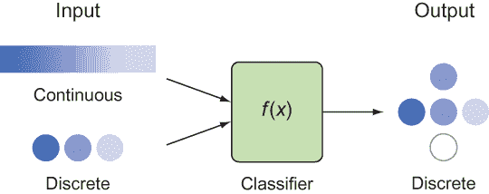

图 5.1 分类器产生离散输出，但可能接受连续或离散输入。

形式上，类别标签被限制在可能的值范围内。你可以将二元标签视为 Python 中的布尔变量。当输入特征只有一组可能的值时，你需要确保你的模型能够理解如何处理这些值。因为模型中的函数通常处理连续的实数，你需要预处理数据集以考虑离散变量，这些变量可以是序数或名义的（图 5.2）。

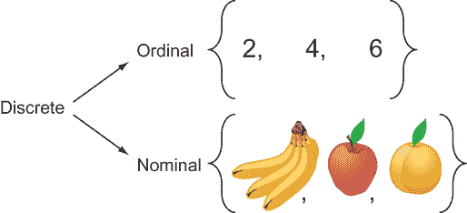

图 5.2 存在两种类型的离散集合：那些可以排序的值（序数）和那些不能排序的值（名义）。

如其名所示，序数类型的值可以排序。例如，从 1 到 10 的偶数集合中的值是序数，因为整数可以相互比较。另一方面，来自 `{banana,` `apple,` `orange}` 水果集合的元素可能没有自然的排序。我们称此类集合的值为 *名义值*，因为它们只能通过其名称来描述。

在数据集中表示名义变量的一个简单方法是为每个标签分配一个数字。集合 `{banana,` `apple,` `orange}` 可以被处理为 `{0,` `1,` `2}`。但是，某些分类模型可能对数据的行为有强烈的偏见。例如，线性回归会将我们的苹果解释为香蕉和橙子的中间值，这没有任何自然的意义。

为了表示因变量的名义类别，一个简单的解决方案是为名义变量的每个值添加虚拟变量。在这个例子中，`fruit` 变量将被移除，并替换为三个单独的变量：`banana`、`apple` 和 `orange`。每个变量持有 `0` 或 `1` 的值（图 5.3），具体取决于该水果的类别是否为真。这个过程通常被称为 *独热编码*。

正如第三章和第四章中的线性回归一样，学习算法必须遍历底层模型支持的可能的函数，该模型称为`M`。在线性回归中，模型由`w`参数化。因此，函数`y = M(w)`可以尝试来衡量其成本。最终，我们选择具有最小成本的`w`值。回归和分类之间的唯一区别是输出不再是连续的谱，而是一组离散的类别标签。

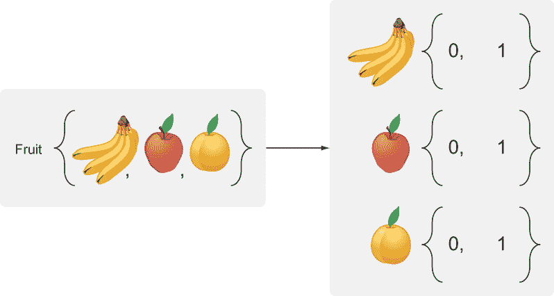

图 5.3 如果变量的值是名义的，可能需要进行预处理。一个解决方案是将每个名义值视为一个布尔变量，如图中所示；“香蕉”、“苹果”和“橙子”是三个新添加的变量，每个变量都有`0`或`1`的值。原始的`fruit`变量被移除。

练习 5.1

将以下每个任务视为回归或分类任务，哪个更好？

(a) 预测股票价格

(b) 决定你应该买入、卖出或持有的股票

(c) 在 1-10 的尺度上评估计算机的质量

**答案**

(a) 回归

(b) 分类

(c) 或者

由于回归的输入/输出类型比分类更通用，没有任何东西阻止你在分类任务上运行线性回归算法。实际上，这正是你将在第 5.3 节中做的事情。

在开始实现 TensorFlow 代码之前，然而，重要的是要评估分类器的强度。第 5.2 节涵盖了衡量分类器成功度的最先进方法。

## 5.2 衡量性能

在开始编写分类算法之前，你应该能够检查你结果的成功率。本节涵盖了在分类问题中衡量性能的基本技术。

### 5.2.1 准确度

你还记得高中或大学时的那些多项选择题吗？机器学习中的分类问题与此类似。给定一个陈述，你的任务是将其分类为给定的多项选择题“答案”之一。如果你只有两个选择，就像在是非考试中一样，我们称之为*二元分类器*。在学校里的评分考试中，衡量你的分数的典型方式是计算正确答案的数量，并将其除以总问题数。

机器学习采用相同的评分策略，称之为*准确度*。准确度通过以下公式来衡量：

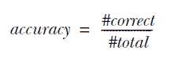

这个公式提供了一个粗略的性能总结，如果你只关心算法的整体正确性，这可能就足够了。但准确度度量并没有揭示每个标签的正确和错误结果的细分。

为了弥补这一限制，混淆矩阵为分类器的成功提供了更详细的报告。描述分类器表现好坏的一个有用方法是检查它在每个类别上的表现。

考虑一个具有正负标签的二分类器，例如。如图 5.4 所示，*混淆矩阵*是一个表格，它比较了预测响应与实际响应的比较。被正确预测为正的数据项称为*真阳性*（TP）。那些被错误预测为正的数据项称为*假阳性*（FP）。如果算法错误地将一个元素预测为负，而实际上它是正的，我们称这种情况为*假阴性*（FN）。最后，当预测和现实都认为一个数据项是负标签时，我们称之为*真阴性*（TN）。正如你所看到的，混淆矩阵使你能够轻松地看到模型在区分两个类别时混淆的频率。

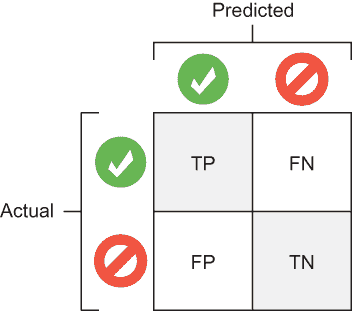

图 5.4 你可以通过使用正（绿色勾号）和负（红色禁止）标签的矩阵来比较预测结果与实际结果。

注意：本书中包含许多彩色图形，这些图形可以在电子书版本中查看。要获取免费电子书（PDF、ePub 或 Kindle 格式），请访问[`mng.bz/JxPo`](http://mng.bz/JxPo)注册您的印刷版书籍。

### 5.2.2 精确度和召回率

虽然真阳性（TP）、假阳性（FP）、真阴性（TN）和假阴性（FN）的定义都是单独有用的，但它们的相互作用才是力量的源泉。

真阳性与总正例的比率是*精确度*——一个衡量正预测可能正确的分数。图 5.4 中的左侧列是总正预测数（TP + FP），因此精确度的方程是

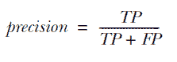

真阳性与所有可能正性的比率是*召回率*，它衡量了找到真阳性的比率。这是一个衡量成功预测（即召回）多少真阳性的分数。图 5.4 中的顶部行是正性的总数（TP + FN），因此召回率的方程是

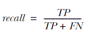

简而言之，*精确度*是算法预测正确的预测的度量，而*召回率*是算法在最终集中识别出的正确事物的度量。如果精确度高于召回率，则模型在成功识别正确项目方面比未识别某些错误项目方面做得更好，反之亦然。

这里有一个快速示例。假设你正在尝试识别一组 100 张图片中的猫，其中 40 张是猫，60 张是狗。当你运行你的分类器时，10 只猫被识别为狗，20 只狗被识别为猫。你的混淆矩阵看起来像图 5.5。

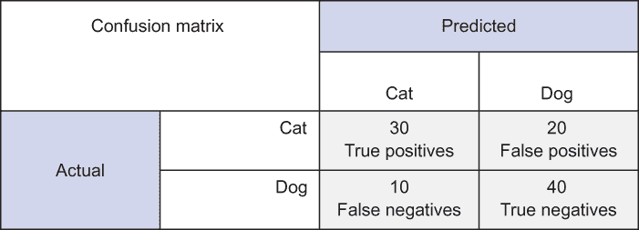

图 5.5 用于评估分类算法性能的混淆矩阵示例

你可以在预测列的左侧看到猫的总数：30 个被正确识别，10 个未被识别，总共 40 个。

练习 5.2

猫的精确度和召回率是多少？系统的准确率是多少？

**答案**

对于猫，精确度是 30 / (30 + 20) 或 3/5，或 60%。召回率是 30 / (30 + 10) 或 3/4，或 75%。准确率是(30 + 40) / 100，或 70%。

### 5.2.3 受试者工作特征曲线

因为二元分类器是最受欢迎的工具之一，所以存在许多成熟的测量它们性能的技术，例如*受试者工作特征（ROC）曲线*，这是一种让你比较假正例和真正例之间权衡的图表。x 轴是假正例值的度量，y 轴是真正例值的度量。

二元分类器将输入特征向量减少到一个数字，然后根据这个数字是否大于或小于指定的阈值来决定类别。当你调整机器学习分类器的阈值时，你会在图表上绘制各种假正例和真正例率的值。

比较各种分类器的一种稳健方法是比较它们的 ROC 曲线。当两条曲线不相交时，一种方法肯定比另一种方法好。好的算法远高于基线。对于两种选择，它们比随机选择或 50/50 的猜测要好。比较分类器的一种定量方法是测量 ROC 曲线下的面积。如果一个模型的曲线下面积（AUC）值高于 0.9，它是一个优秀的分类器。随机猜测输出的模型将有一个大约 0.5 的 AUC 值。见图 5.6 的示例。

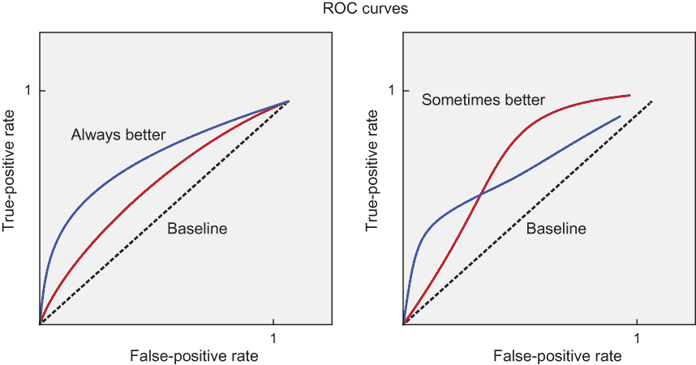

图 5.6 比较算法的原理方法是通过检查它们的 ROC 曲线。当每个情况下的真正率都大于假正率时，可以简单地声明一个算法在性能方面占主导地位。如果真正率小于假正率，图表会低于由虚线表示的基线。

练习 5.3

100%正确率（所有真正例，没有假正例）在 ROC 曲线上看起来会是什么样子？

**答案**

100%正确率的点将位于 ROC 曲线的正 y 轴上，如图 5.7 所示。

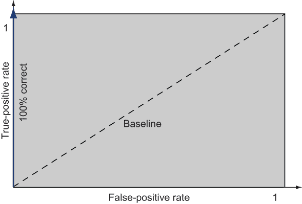

图 5.7 具有蓝色 ROC 曲线的 100%正确分类器，与垂直的真正例（y）轴并排

## 5.3 使用线性回归进行分类

实现分类器的一种最简单的方法是调整线性回归算法，如第三章所述。作为提醒，线性回归模型是一组看起来线性的函数：`f(x) = wx`。函数`f(x)`接受连续的实数作为输入，并产生连续的实数作为输出。记住，分类全都是关于离散输出的。因此，强制回归模型产生一个双值（二元）输出的方法之一是将高于某个阈值的值设置为数字（例如`1`），将低于该阈值的值设置为不同的数字（例如`0`）。

我们将使用以下激励性示例继续进行。假设 Alice 是一位热衷的国际象棋玩家，你拥有她胜负历史的记录。此外，每场比赛都有一个从 1 到 10 分钟的时间限制。你可以将每场比赛的结果绘制成如图 5.8 所示。横轴代表比赛的时间限制，纵轴表示她是否获胜（`y` `= 1`）或失败（`y` `= 0`）。

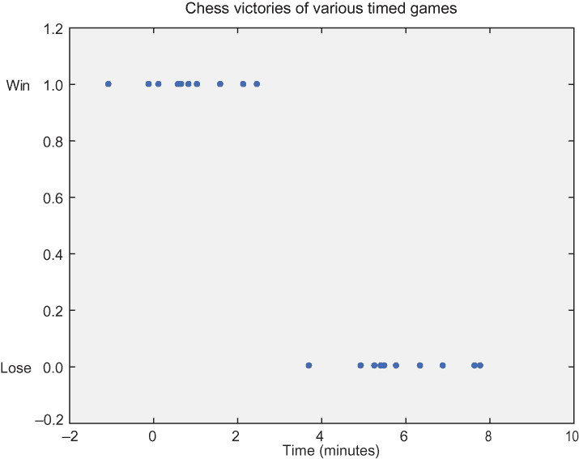

图 5.8 二元分类训练数据集的可视化。值被分为两类：所有 y = 1 的点以及所有 y = 0 的点。

从数据中可以看出，Alice 是一位思维敏捷的人：她总是赢得短局比赛。但她通常会在时间限制较长的比赛中失败。从图中，你可能会想要预测决定她是否会赢的关键比赛时间限制。

你想挑战她进行一场你确信能赢的比赛。如果你选择一个明显很长的比赛，比如 10 分钟，她会拒绝比赛。让我们将比赛时间设定得尽可能短，这样她就会愿意和你比赛，同时将平衡倾斜到你这边。

数据上的线性拟合为你提供了一些可以工作的东西。图 5.9 显示了使用列表 5.1（本节稍后出现）中的线性回归计算出的最佳拟合线。对于 Alice 可能会赢的比赛，这条线的值更接近`1`而不是`0`。看起来如果你选择一个当线的值小于`0.5`的时间（即 Alice 更有可能输而不是赢的时候），你就有很大的赢的机会。

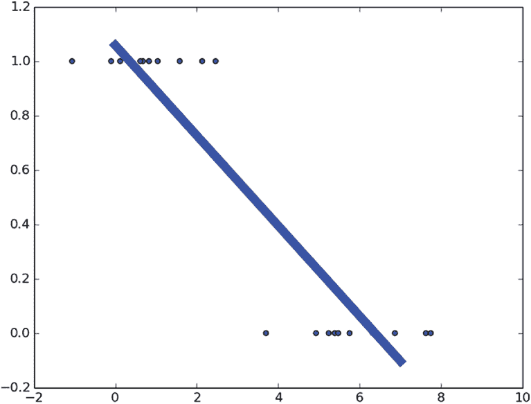

图 5.9 在分类数据集上的最佳拟合线。显然，这条线并不很好地拟合数据，但它为分类新数据提供了一个不精确的方法。

这条线试图尽可能好地拟合数据。由于训练数据的性质，模型将对正例响应值为接近 `1`，对负例响应值为接近 `0`。由于你使用线来模拟这些数据，某些输入可能产生介于 `0` 和 `1` 之间的值。正如你可能想象的那样，太靠近某一类别的值将导致值大于 `1` 或小于 `0`。你需要一种方法来决定一个项目属于某一类别更多。通常，你选择中点 `0.5` 作为决定边界（也称为 *阈值*）。正如你所见，此过程使用线性回归进行分类。

练习 5.4

使用线性回归作为分类工具的缺点是什么？（参见列表 5.4 以获取提示。）

**答案**

线性回归对数据中的异常值敏感，因此它不是一个准确的分类器。

让我们编写你的第一个分类器！打开一个新的 Python 源文件，并将其命名为 linear.py。使用列表 5.1 编写代码。在 TensorFlow 代码中，你首先需要定义占位符节点，然后从 `session.run()` 语句中注入值。

列表 5.1 使用线性回归进行分类

```
import tensorflow as tf                                                    ❶
import numpy as np                                                         ❶
import matplotlib.pyplot as plt                                            ❶

x_label0 = np.random.normal(5, 1, 10)                                      ❷
x_label1 = np.random.normal(2, 1, 10)                                      ❷
xs = np.append(x_label0, x_label1)                                         ❷
labels = [0.] * len(x_label0) + [1.] * len(x_label1)                       ❸

plt.scatter(xs, labels)                                                    ❹

learning_rate = 0.001                                                      ❺
training_epochs = 1000                                                     ❺

X = tf.placeholder("float")                                                ❻
Y = tf.placeholder("float")                                                ❻

def model(X, w):                                                           ❼
    return tf.add(tf.multiply(w[1], tf.pow(X, 1)),                         ❼
                  tf.multiply(w[0], tf.pow(X, 0)))                         ❼

w = tf.Variable([0., 0.], name="parameters")                               ❽
y_model = model(X, w)                                                      ❾
cost = tf.reduce_sum(tf.square(Y-y_model))                                 ❿

train_op = tf.train.GradientDescentOptimizer(learning_rate).minimize(cost) ⓫
```

❶ 导入 TensorFlow 用于核心学习算法，NumPy 用于数据处理，以及 Matplotlib 用于可视化

❷ 初始化假数据，每个标签有 10 个实例，分别以 5 和 2 为中心，stddev 为 1

❸ 初始化相应的标签

❹ 绘制数据

❺ 声明超参数

❻ 设置输入/输出对的占位符节点

❼ 定义线性模型 y = w1 * x + w0

❽ 设置参数变量

❾ 定义一个辅助变量，因为你将多次引用它

❿ 定义成本函数

⓫ 定义学习参数的规则

在设计 TensorFlow 图之后，参见列表 5.2 了解如何打开新会话并执行图。`train_op` 更新模型的参数以更好地猜测。你通过循环多次运行 `train_op`，因为每一步都会迭代地改进参数估计。列表 5.2 生成与图 5.8 类似的图表。

列表 5.2 执行图

```
sess = tf.Session()                                               ❶
init = tf.global_variables_initializer()                          ❶
sess.run(init)                                                    ❶

for epoch in range(training_epochs):                              ❷
    sess.run(train_op, feed_dict={X: xs, Y: labels})              ❷
    current_cost = sess.run(cost, feed_dict={X: xs, Y: labels})   ❸
    if epoch % 100 == 0:
        print(epoch, current_cost)                                ❹

w_val = sess.run(w)                                               ❺
print('learned parameters', w_val)                                ❺

sess.close()                                                      ❻

all_xs = np.linspace(0, 10, 100)                                  ❼
plt.plot(all_xs, all_xs*w_val[1] + w_val[0])                      ❼
plt.show()                                                        ❼
```

❶ 打开一个新的会话并初始化变量

❷ 多次运行学习操作

❸ 记录使用当前参数计算的成本

❹ 在代码运行时打印日志信息

❺ 打印学习到的参数

❻ 当不再使用时关闭会话

❼ 显示最佳拟合线

要衡量成功，你可以计算正确预测的数量并计算成功率。在列表 5.3 中，你向之前的 linear.py 代码中添加了两个节点：`correct_prediction` 和 `accuracy`。然后你可以打印 `accuracy` 的值来查看成功率。代码可以在关闭会话之前执行。

列表 5.3 测量准确率

```
correct_prediction = tf.equal(Y, tf.to_float(tf.greater(y_model, 0.5)))  ❶
accuracy = tf.reduce_mean(tf.to_float(correct_prediction))               ❷

print('accuracy', sess.run(accuracy, feed_dict={X: xs, Y: labels}))      ❸
print('correct_prediction', predict_val)                                 ❹
```

❶ 当模型的响应大于 0.5 时，它应该是一个正标签，反之亦然。

❷ 计算成功率

❸ 打印从提供的输入中得出的成功度量

❹ 打印正确的预测

列表 5.3 中的代码产生了以下输出：

```
('learned parameters', array([ 1.2816, -0.2171], dtype=float32))
('accuracy', 0.95)
correct_prediction [ True False  True  True  True  True  True  True  True  
➥ True  True  True
  True  True  True  True  True  True  True False]
```

如果分类那么简单，这一章现在就已经结束了。不幸的是，如果你在更极端的数据（也称为 *异常值*）上训练，线性回归方法会彻底失败。

假设 Alice 失去了一场耗时 20 分钟的游戏。你在一个包含这个新异常数据点的数据集上训练分类器。列表 5.4 将游戏时间中的一个值替换为 `20`。让我们看看引入异常值如何影响分类器的性能。

列表 5.4 线性回归在分类中彻底失败

```
x_label0 = np.append(np.random.normal(5, 1, 9), 20)
```

当你使用这些更改重新运行代码时，你会看到一个类似于图 5.10 的结果。

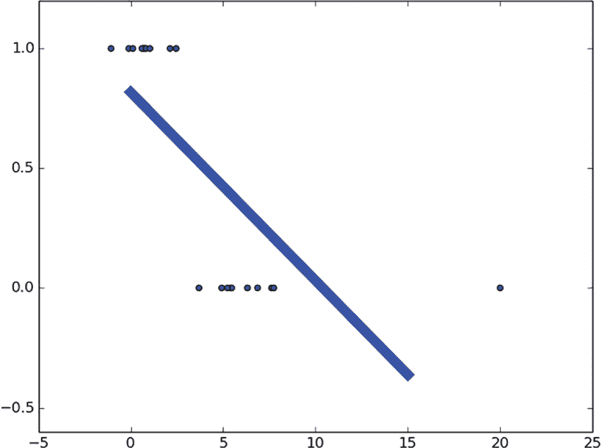

图 5.10 新的训练元素值 `20` 对最佳拟合线有重大影响。该线对异常值数据过于敏感；因此，线性回归是一个粗略的分类器。

原始分类器建议你可以在三分钟的游戏中打败 Alice。她可能会同意玩这样短的游戏。但修订后的分类器，如果你坚持相同的 `0.5` 阈值，则暗示她最短会输掉的游戏是五分钟的。她可能会拒绝玩这么长时间的游戏！

## 5.4 使用逻辑回归

逻辑回归提供了一个具有关于准确性和性能的理论保证的分析函数。它类似于线性回归，只是你使用不同的代价函数并对模型响应函数进行轻微变换。

让我们重新审视这里显示的线性函数：

*y* (*x) = wx*

在线性回归中，具有非零斜率的线可能从负无穷大到无穷大。如果分类的唯一合理结果是 `0` 或 `1`，那么拟合具有该特性的函数将是直观的。幸运的是，图 5.11 中描绘的 Sigmoid 函数迅速收敛到 `0` 或 `1`。

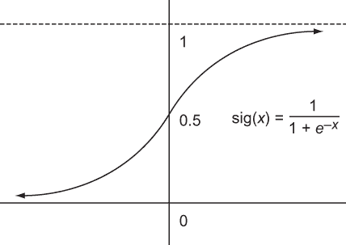

图 5.11 Sigmoid 函数的可视化

当 `x` 为 `0` 时，Sigmoid 函数的结果为 `0.5`。随着 `x` 的增加，函数收敛到 `1`。而当 `x` 减少到负无穷大时，函数收敛到 `0`。

在逻辑回归中，我们的模型是 `sig(linear(``x``))`。结果证明，该函数的最佳拟合参数暗示了两个类别之间的线性分离。这条分离线也称为 *线性决策边界*。

### 5.4.1 解决一维逻辑回归

在逻辑回归中使用的成本函数与你在线性回归中使用的不同。虽然你可以使用之前相同的成本函数，但它不会那么快，也不能保证得到最优解。这里的罪魁祸首是 sigmoid 函数，因为它使得成本函数有很多“峰值”。TensorFlow 和大多数其他机器学习库与简单的成本函数配合得最好。学者们已经找到了一种巧妙的方法来修改成本函数，以便在逻辑回归中使用 sigmoid 函数。

实际值(`y`)和模型响应(`h`)之间新的成本函数将是一个两部分方程：

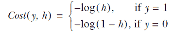

你可以将这两个方程压缩成一个长方程：

*Cost*(*y, h*) = *–y*log(*h*) – (1 – *y*)log(1 – *h*)

这个函数恰好具有高效和最优学习的所需品质。具体来说，它是凸的，但不必过于担心这意味着什么。你试图最小化成本：把成本想成高度，把成本函数想成地形。你试图找到地形中的最低点。如果没有任何地方可以向上爬，那么在地形中找到最低点会容易得多。这样的地方被称为*凸性*。这里没有山丘。

你可以把这个函数想象成一个球从山上滚下来。最终，球会落在底部，这是*最优点*。非凸函数可能有一片崎岖的地形，这使得很难预测球会滚到哪里。它甚至可能不会落在最低点。你的函数是凸的，所以算法会很容易地找出如何最小化这个成本并将“球滚下山”。

凸性很好，但在选择成本函数时，正确性也是一个重要的标准。你怎么知道这个成本函数确实做了你想要它做的事情呢？为了直观地回答这个问题，请看图 5.12。当你希望你的期望值为`1`时，你使用`-log(x)`来计算成本（注意：-log(1) = 0）。算法不会将值设置为 0，因为成本会趋向于无穷大。将这些函数相加得到一个曲线，在`0`和`1`处都趋向于无穷大，负的部分相互抵消。

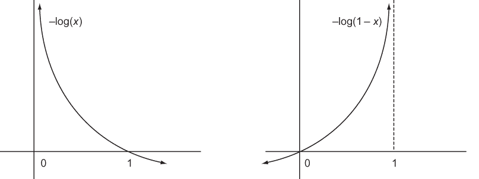

图 5.12 这里展示了两个成本函数如何惩罚`0`和`1`处的值。注意，左边的函数对`0`的惩罚很重，但在`1`处没有成本。右边的成本函数显示了相反的现象。

当然，图表是一种非正式的方式来说服你选择成本函数时凸性的重要性，但关于为什么成本函数是最优的技术的讨论超出了本书的范围。如果你对数学感兴趣，你可能会对学习到成本函数是从最大熵原理推导出来的感到兴趣，你可以在网上任何地方查找相关信息。

请参阅图 5.13，以查看一维数据集上逻辑回归的最佳拟合结果。你生成的 sigmoid 曲线将提供比线性回归更好的线性决策边界。

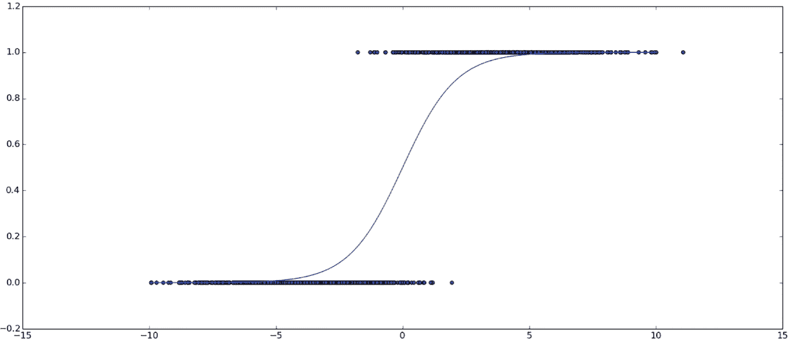

图 5.13 这里是一个二元分类数据集的最佳拟合 sigmoid 曲线。注意曲线位于`y` `=` `0`和`y` `=` `1`之间。这样，这条曲线对异常值不太敏感。

你会开始注意到代码列表中的模式。在 TensorFlow 的简单/典型使用中，你生成一个假数据集，定义占位符，定义变量，定义模型，在该模型上定义一个成本函数（通常是均方误差或均方对数误差），通过使用梯度下降创建`train_op`，迭代地提供示例数据（可能带有标签或输出），并最终收集优化值。创建一个新的源文件名为 logistic_1d.py，并将列表 5.5 复制到其中，它生成了图 5.13。

列表 5.5 使用一维逻辑回归

```
import numpy as np                                                         ❶
import tensorflow as tf                                                    ❶
import matplotlib.pyplot as plt                                            ❶
learning_rate = 0.01                                                       ❷
training_epochs = 1000                                                     ❷

def sigmoid(x):                                                            ❸
    return 1\. / (1\. + np.exp(-x))                                          ❸

x1 = np.random.normal(-4, 2, 1000)                                         ❹
x2 = np.random.normal(4, 2, 1000)                                          ❹
xs = np.append(x1, x2)                                                     ❹
ys = np.asarray([0.] * len(x1) + [1.] * len(x2))                           ❹

plt.scatter(xs, ys)                                                        ❺

X = tf.placeholder(tf.float32, shape=(None,), name="x")                    ❻
Y = tf.placeholder(tf.float32, shape=(None,), name="y")                    ❻
w = tf.Variable([0., 0.], name="parameter", trainable=True)                ❼
y_model = tf.sigmoid(w[1] * X + w[0])                                      ❽
cost = tf.reduce_mean(-Y * tf.log(y_model) - (1 - Y) * tf.log(1 - y_model))❾

train_op = tf.train.GradientDescentOptimizer(learning_rate).minimize(cost) ❿

with tf.Session() as sess:                                                 ⓫
    sess.run(tf.global_variables_initializer())                            ⓫
    prev_err = 0                                                           ⓬
    for epoch in range(training_epochs):                                   ⓭
        err, _ = sess.run([cost, train_op], {X: xs, Y: ys})                ⓮
        print(epoch, err)
        if abs(prev_err - err) < 0.0001:                                   ⓯
            break
        prev_err = err                                                     ⓰
    w_val = sess.run(w, {X: xs, Y: ys})                                    ⓱

all_xs = np.linspace(-10, 10, 100)                                         ⓲
plt.plot(all_xs, sigmoid((all_xs * w_val[1] + w_val[0])))                  ⓲
plt.show()                                                                 ⓲
```

❶ 导入相关库

❷ 设置超参数

❸ 定义一个辅助函数来计算 sigmoid 函数

❹ 初始化假数据

❺ 可视化数据

❻ 定义输入/输出占位符

❼ 定义参数节点

❽ 使用 TensorFlow 的 sigmoid 函数定义模型

❾ 定义交叉熵损失函数

❿ 定义要使用的最小化器

⓫ 打开一个会话并定义所有变量

⓬ 定义一个变量来跟踪前一个错误

⓭ 迭代直到收敛或达到最大 epoch 数

⓮ 计算成本并更新学习参数

⓯ 检查收敛性。如果你每次迭代的改变小于< .01%，则完成。

⓰ 更新前一个错误值

⓱ 获取学习到的参数值

⓲ 绘制学习到的 sigmoid 函数

就这样！如果你在与 Alice 下棋，你现在将有一个二元分类器来决定何时棋局可能赢得或输掉。

TensorFlow 中的交叉熵损失

如列表 5.5 所示，使用`tf.reduce_mean`操作对每个输入/输出对进行交叉熵损失的求平均值。TensorFlow 库还提供了一个方便且更通用的函数，称为`tf.nn.softmax_cross_entropy_with_logits`[。你可以在官方文档中了解更多信息，链接为](http://mng.bz/8mEk) http://mng.bz/8mEk。

### 5.4.2 解决二维回归

现在我们将探索如何使用多个独立变量进行逻辑回归。独立变量的数量对应于维度数。在我们的情况下，二维逻辑回归问题将尝试标记一对独立变量。本节中你学到的概念可以推广到任意维度。

注意：假设你在考虑购买一部新手机。你唯一关心的属性是（1）操作系统，（2）尺寸和（3）成本。目标是决定一部手机是否值得购买。在这种情况下，有三个独立变量（手机的属性）和一个因变量（是否值得购买）。因此，我们将这个问题视为一个分类问题，其中输入向量是 3D。

考虑图 5.14 所示的数据集，它代表了一个城市中两个帮派的犯罪活动。第一维是 x 轴，可以认为是纬度，第二维是 y 轴，代表经度。在 (3, 2) 附近有一个簇，在 (7, 6) 附近还有一个簇。你的任务是决定哪个帮派最有可能对发生在位置 (6, 4) 的新犯罪负责。

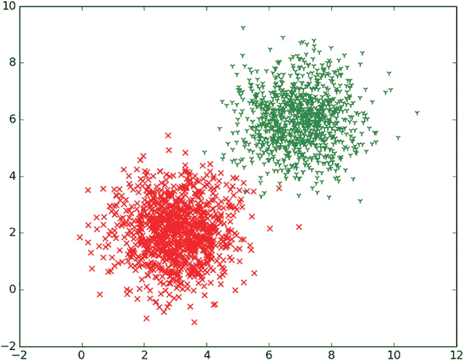

图 5.14 x 轴和 y 轴代表两个独立变量。因变量持有两个可能的标签，由绘制点的形状和颜色表示。

另一种可视化图 5.14 的方法是，将独立变量 `x=latitude` 和 `y=longitude` 投影为 2D 平面，然后绘制垂直轴作为 sigmoid 函数的结果，该函数代表了一热编码的类别。你可以将函数可视化如图 5.15 所示。

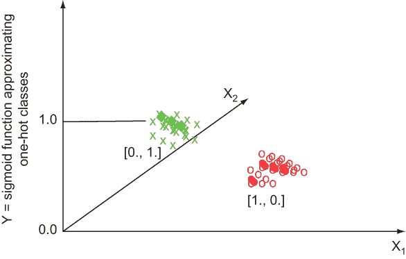

图 5.15 另一种可视化两个独立变量的方法，这次考虑了由 sigmoid 函数定义的因变量，该函数代表帮派 1（绿色）和帮派 2（红色）的一热编码类别。

创建一个名为 logistic_2d.py 的新源文件，并按照列表 5.6 进行操作。

列表 5.6 设置 2D 逻辑回归数据

```
import numpy as np                                               ❶
import tensorflow as tf                                          ❶
import matplotlib.pyplot as plt                                  ❶

learning_rate = 0.1                                              ❷
training_epochs = 2000                                           ❷
def sigmoid(x):                                                  ❸
    return 1\. / (1\. + np.exp(-x))                                ❸

x1_label1 = np.random.normal(3, 1, 1000)                         ❹
x2_label1 = np.random.normal(2, 1, 1000)                         ❹
x1_label2 = np.random.normal(7, 1, 1000)                         ❹
x2_label2 = np.random.normal(6, 1, 1000)                         ❹
x1s = np.append(x1_label1, x1_label2)                            ❹
x2s = np.append(x2_label1, x2_label2)                            ❹
ys = np.asarray([0.] * len(x1_label1) + [1.] * len(x1_label2))   ❹
```

❶ 导入相关库

❷ 设置超参数

❸ 定义一个辅助 sigmoid 函数

❹ 初始化假数据

你有两个独立变量 (`x[1]` 和 `x[2]`)。一个简单的方式来建模输入 `x` 和输出 `M(x)` 之间的映射是以下方程，其中 `w` 是 TensorFlow 要找到的参数：

*M*(*x, v*) = *sig*(*w[2]x[2]* + *w[1]x[1]* + *w[0]*)

在列表 5.7 中，你将实现方程及其相应的成本函数来学习参数。

列表 5.7 使用 TensorFlow 进行多维逻辑回归

```
X1 = tf.placeholder(tf.float32, shape=(None,), name="x1")                  ❶
X2 = tf.placeholder(tf.float32, shape=(None,), name="x2")                  ❶
Y = tf.placeholder(tf.float32, shape=(None,), name="y")                    ❶
w = tf.Variable([0., 0., 0.], name="w", trainable=True)                    ❷

y_model = tf.sigmoid(w[2] * X2 + w[1] * X1 + w[0])                         ❸
cost = tf.reduce_mean(-tf.log(y_model * Y + (1 - y_model) * (1 - Y)))      ❹
train_op = tf.train.GradientDescentOptimizer(learning_rate).minimize(cost) ❹

with tf.Session() as sess:                                                 ❺
    sess.run(tf.global_variables_initializer())                            ❺
    prev_err = 0                                                           ❺
    for epoch in range(training_epochs):                                   ❺
        err, _ = sess.run([cost, train_op], {X1: x1s, X2: x2s, Y: ys})     ❺
        print(epoch, err)                                                  ❺
        if abs(prev_err - err) < 0.0001:                                   ❺
            break                                                          ❺
        prev_err = err                                                     ❺
    w_val = sess.run(w, {X1: x1s, X2: x2s, Y: ys})                         ❻

x1_boundary, x2_boundary = [], []                                          ❼
for x1_test in np.linspace(0, 10, 100):                                    ❽
    for x2_test in np.linspace(0, 10, 100):                                ❽
        z = sigmoid(-x2_test*w_val[2] - x1_test*w_val[1] - w_val[0])       ❾
        if abs(z - 0.5) < 0.01:                                            ❾
            x1_boundary.append(x1_test)                                    ❾
            x2_boundary.append(x2_test)                                    ❾

plt.scatter(x1_boundary, x2_boundary, c='b', marker='o', s=20)             ❿
plt.scatter(x1_label1, x2_label1, c='r', marker='x', s=20)                 ❿
plt.scatter(x1_label2, x2_label2, c='g', marker='1', s=20)                 ❿

plt.show()                                                                 ❿
```

❶ 定义输入/输出占位符节点

❷ 定义参数节点

❸ 定义 sigmoid 模型，使用两个输入变量

❹ 定义学习步长

❺ 创建一个新的会话，初始化变量，并学习参数直到收敛

❻ 在关闭会话之前获取学习到的参数值

❼ 定义用于存储边界点的数组

❽ 遍历点窗口

❾ 如果模型响应接近 0.5，则更新边界点

❿ 显示边界线以及数据

图 5.16 描述了从训练数据中学习到的线性边界线。发生在这条线上的犯罪事件，被两个帮派犯下的可能性是相等的。

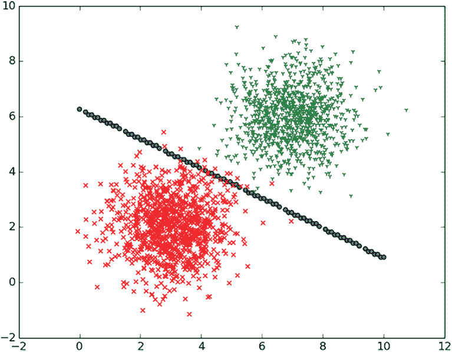

图 5.16 对角虚线表示两个决策之间的概率平均分割。当数据点远离该线时，决策的信心增加。

## 5.5 多类分类器

到目前为止，你已经处理了多维输入，但没有处理多变量输出，如图 5.17 所示。在数据上不是二进制标签，而是有 3、4 或 100 个类别怎么办？逻辑回归需要两个标签——不再多了。

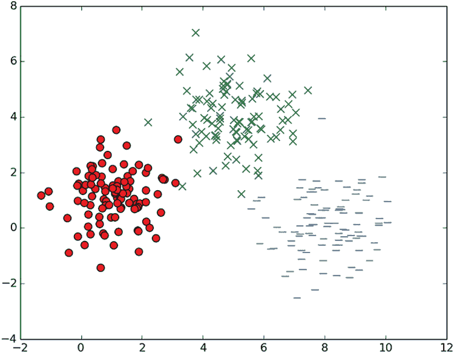

图 5.17 独立变量是二维的，由 x 轴和 y 轴表示。因变量可以是三个标签之一，由数据点的颜色和形状表示。

例如，图像分类是一个流行的多变量分类问题，因为目标是决定图像的类别。一张照片可能被归类到数百个类别之一。

要处理超过两个标签，你可以巧妙地重复使用逻辑回归（使用一对多或一对一方法）或开发一种新的方法（softmax 回归）。我们将在以下各节中查看每种方法。逻辑回归方法需要相当多的临时工程，所以让我们专注于 softmax 回归。

### 5.5.1 一对多

首先，为每个标签训练一个分类器，如图 5.18 所示。如果有三个标签，你就有三个可用的分类器：`f1`、`f2` 和 `f3`。要在新数据上进行测试，运行每个分类器以查看哪个分类器产生了最自信的响应。直观地说，通过响应最自信的分类器的标签来标记新的点。


图 5.18 一对多是一种多类分类方法，它需要每个类别的检测器。

### 5.5.2 一对一

然后，为每对标签训练一个分类器（见图 5.19）。如果有三个标签，那就是三个独特的对。但对于 *k* 个标签，那就是 *k*(*k* - 1)/2 对标签。在新数据上，运行所有分类器并选择获胜最多的类别。


图 5.19 在一对一多类分类中，每个类别对都有一个检测器。

### 5.5.3 Softmax 回归

*Softmax* *回归*是以传统的 `max` 函数命名的，它接受一个向量并返回最大值。但 softmax 并不是 `max` 函数，因为它具有连续性和可微分的额外优势。因此，它具有对随机梯度下降有效工作的有益特性。

在这种多类分类设置中，每个类别对每个输入向量都有一个置信度（或概率）分数。softmax 步骤选择得分最高的输出。

打开一个名为 softmax.py 的新文件，并按照列表 5.8 进行操作。首先，你将可视化假数据以重现图 5.17（也在此处重现为图 5.20）

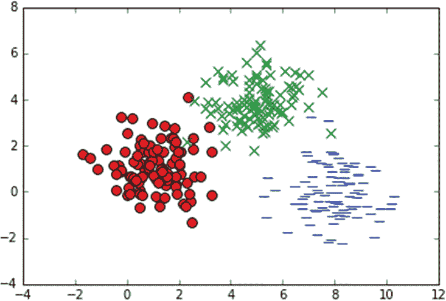

图 5.20 多输出分类的 2D 训练数据

列表 5.8 可视化多类数据

```
import numpy as np                                           ❶
import matplotlib.pyplot as plt                              ❶

x1_label0 = np.random.normal(1, 1, (100, 1))                 ❷
x2_label0 = np.random.normal(1, 1, (100, 1))                 ❷
x1_label1 = np.random.normal(5, 1, (100, 1))                 ❸
x2_label1 = np.random.normal(4, 1, (100, 1))                 ❸
x1_label2 = np.random.normal(8, 1, (100, 1))                 ❹
x2_label2 = np.random.normal(0, 1, (100, 1))                 ❹

plt.scatter(x1_label0, x2_label0, c='r', marker='o', s=60)   ❺
plt.scatter(x1_label1, x2_label1, c='g', marker='x', s=60)   ❺
plt.scatter(x1_label2, x2_label2, c='b', marker='_', s=60)   ❺
plt.show()                                                   ❺
```

❶ 导入 NumPy 和 Matplotlib

❷ 生成靠近（1, 1）的点

❸ 生成靠近（5, 4）的点

❹ 生成靠近（8, 0）的点

❺ 在散点图上可视化三个标签

接下来，在列表 5.9 中，你设置了训练和测试数据，为 softmax 回归步骤做准备。标签必须表示为一个向量，其中只有一个元素是 1，其余都是 0。这种表示称为*one-hot 编码*。如果有三个标签，它们将表示为以下向量：[1, 0, 0]，[0, 1, 0]，和[0, 0, 1]。

练习 5.5

One-hot 编码可能看起来是一个不必要的步骤。为什么不使用 1D 输出，其中值为`1`、`2`和`3`来表示三个类别呢？

**答案**

回归可能在输出中诱导出语义结构。如果输出相似，回归意味着它们的输入也相似。如果你使用一个维度，你就是在暗示标签 2 和 3 比 1 和 3 更相似。你必须小心不要做出不必要的或错误的假设，因此使用 one-hot 编码是一个安全的赌注。

列表 5.9 设置多类分类的训练和测试数据

```
xs_label0 = np.hstack((x1_label0, x2_label0))                                ❶
xs_label1 = np.hstack((x1_label1, x2_label1))                                ❶
xs_label2 = np.hstack((x1_label2, x2_label2))                                ❶
xs = np.vstack((xs_label0, xs_label1, xs_label2))                            ❶
labels = np.matrix([[1., 0., 0.]] * len(x1_label0) + [[0., 1., 0.]] * 
➥ len(x1_label1) + [[0., 0., 1.]] * len(x1_label2))                         ❷

arr = np.arange(xs.shape[0])                                                 ❸
np.random.shuffle(arr)                                                       ❸
xs = xs[arr, :]                                                              ❸
labels = labels[arr, :]                                                      ❸

test_x1_label0 = np.random.normal(1, 1, (10, 1))                             ❹
test_x2_label0 = np.random.normal(1, 1, (10, 1))                             ❹
test_x1_label1 = np.random.normal(5, 1, (10, 1))                             ❹
test_x2_label1 = np.random.normal(4, 1, (10, 1))                             ❹
test_x1_label2 = np.random.normal(8, 1, (10, 1))                             ❹
test_x2_label2 = np.random.normal(0, 1, (10, 1))                             ❹
test_xs_label0 = np.hstack((test_x1_label0, test_x2_label0))                 ❹
test_xs_label1 = np.hstack((test_x1_label1, test_x2_label1))                 ❹
test_xs_label2 = np.hstack((test_x1_label2, test_x2_label2))                 ❹

test_xs = np.vstack((test_xs_label0, test_xs_label1, test_xs_label2))        ❹
test_labels = np.matrix([[1., 0., 0.]] * 10 + [[0., 1., 0.]] * 10 + [[0., 0.,❹
➥ 1.]] * 10)    

train_size, num_features = xs.shape                                          ❺
```

❶ 将所有输入数据合并到一个大矩阵中

❷ 创建相应的 one-hot 标签

❸ 打乱数据集

❹ 构建测试数据集和标签

❺ 数据集的形状告诉你每个示例的示例数量和特征数量。

你在列表 5.9 中看到了`hstack`和`vstack`方法的用法，分别对应水平堆叠和垂直堆叠——这两个函数来自 NumPy 库。`hstack`函数接收数组并将它们按顺序水平（列向）堆叠，而`vstack`函数接收数组并将它们按顺序垂直（行向）堆叠。例如，列表 5.8 中的`x1_label0`和`x2_label0`打印出来时看起来像这样：

```
print(x1_label0)
 [[ 1.48175716]
 [ 0.34867807]
 [-0.35358866]
...
 [ 0.77637156]
 [ 0.9731792 ]]

print(x2_label0)
 [[ 2.02688   ]
 [ 2.37936835]
 [ 0.24260849]
 ...
[ 1.58274368]
 [-1.55880602]]
```

`xs_label0`变量的结果值可能看起来像这样：

```
array([[ 1.48175716,  2.02688   ],
       [ 0.34867807,  2.37936835],
       [-0.35358866,  0.24260849],
       [ 0.60081539, -0.97048316],
       [ 2.61426058,  1.8768225 ],
...
       [ 0.77637156,  1.58274368],
       [ 0.9731792 , -1.55880602]])
```

最后，在列表 5.10 中，你使用了 softmax 回归。与逻辑回归中的 sigmoid 函数不同，这里你使用了 TensorFlow 库提供的`softmax`函数。`softmax`函数类似于`max`函数，它从一系列数字中输出最大值。它被称为*softmax*，因为它是对`max`函数的“软”或“平滑”近似，而`max`函数是不平滑或不连续的（这是不好的）。连续且平滑的函数通过反向传播促进了神经网络正确权重的学习。

练习 5.6

以下哪个函数是连续的？

```
f(x) = x2
f(x) = min(x, 0)
f(x) = tan(x)
```

**答案**

前两个是连续的。最后一个 `tan(x)` 有周期性渐近线，因此对于某些值没有有效的结果。

列表 5.10 使用 softmax 回归

```
import tensorflow as tf

learning_rate = 0.01                                                       ❶
training_epochs = 1000                                                     ❶
num_labels = 3                                                             ❶
batch_size = 100                                                           ❶

X = tf.placeholder("float", shape=[None, num_features])                    ❷
Y = tf.placeholder("float", shape=[None, num_labels])                      ❷

W = tf.Variable(tf.zeros([num_features, num_labels]))                      ❸
b = tf.Variable(tf.zeros([num_labels]))                                    ❸
y_model = tf.nn.softmax(tf.matmul(X, W) + b)                               ❹

cost = -tf.reduce_sum(Y * tf.log(y_model))                                 ❺
train_op = tf.train.GradientDescentOptimizer(learning_rate).minimize(cost) ❺

correct_prediction = tf.equal(tf.argmax(y_model, 1), tf.argmax(Y, 1))      ❻
accuracy = tf.reduce_mean(tf.cast(correct_prediction, "float"))            ❻
```

❶ 定义超参数

❷ 定义输入/输出占位符节点

❸ 定义模型参数

❹ 设计 softmax 模型

❺ 设置学习算法

❻ 定义一个操作来测量成功率

现在你已经定义了 TensorFlow 计算图，从会话中执行它。这次你将尝试一种新的迭代更新参数的形式，称为 *批量学习*。你不会一次只传递一个数据片段，而是会对数据批次运行优化器。这种技术可以加快速度，但引入了收敛到局部最优解而不是全局最优解的风险。使用列表 5.11 以批量运行优化器。

列表 5.11 执行图

```
with tf.Session() as sess:                                             ❶
    tf.global_variables_initializer().run()                            ❶

    for step in range(training_epochs * train_size // batch_size):     ❷
        offset = (step * batch_size) % train_size                      ❸
        batch_xs = xs[offset:(offset + batch_size), :]                 ❸
        batch_labels = labels[offset:(offset + batch_size)]       
        err, _ = sess.run([cost, train_op], feed_dict={X: batch_xs, Y: 
        ➥ batch_labels})                                              ❹
        print (step, err)                                              ❺

    W_val = sess.run(W)                                                ❻
    print('w', W_val)                                                  ❻
    b_val = sess.run(b)                                                ❻
    print('b', b_val)                                                  ❻
    print("accuracy", accuracy.eval(feed_dict={X: test_xs, Y: 
    ➥ test_labels}))                                                  ❼
```

❶ 打开一个新的会话并初始化所有变量

❷ 仅循环足够次数以完成对数据集的单次遍历

❸ 获取与当前批次对应的数据集子集

❹ 在这个批次上运行优化器

❺ 打印持续结果

❻ 打印最终的学到的参数

❷ 打印成功率

在数据集上运行 softmax 回归算法的最终输出是

```
('w', array([[-2.101, -0.021,  2.122], 
             [-0.371,  2.229, -1.858]], dtype=float32))
('b', array([10.305, -2.612, -7.693], dtype=float32))
Accuracy 1.0
```

你已经学会了模型的权重和偏差。你可以使用这些学习到的参数来对测试数据进行推断。这样做的一个简单方法是使用 TensorFlow 的 `Saver` 对象（见 [`www.tensorflow.org/guide/saved_model`](https://www.tensorflow.org/guide/saved_model)）保存和加载变量。你可以运行模型（在我们的代码中称为 `y_model`）以获得测试数据上的模型响应。

## 5.6 分类应用

情感是一个难以量化的概念。快乐、悲伤、愤怒、兴奋和恐惧是主观性情感的例子。对某个人来说可能令人兴奋的事情，对另一个人来说可能显得讽刺。对一些人来说似乎传达愤怒的文本，对其他人来说可能传达恐惧。如果人类都有这么多麻烦，那么计算机又能有什么运气呢？

至少，机器学习研究人员已经找到了在文本中分类正面和负面情感的方法。假设你正在构建一个类似亚马逊的网站，每个商品都有用户评论。你希望你的智能搜索引擎优先选择正面评论的商品。你可能拥有的最佳指标是平均星级评分或点赞数量。但如果你有很多没有明确评分的重文本评论怎么办呢？

情感分析可以被视为一个二元分类问题。输入是自然语言文本，输出是一个二元决策，推断出正面或负面情感。以下是一些你可以在线找到的用于解决这个确切问题的数据集：

+   大型电影评论数据集—[`mng.bz/60nj`](http://mng.bz/60nj)

+   情感标注句子数据集—[`mng.bz/CzSM`](http://mng.bz/CzSM)

+   Twitter 情感分析数据集—[`mng.bz/2M4d`](http://mng.bz/2M4d)

最大的挑战是如何将原始文本表示为分类算法的输入。在整个这一章中，分类的输入始终是一个特征向量。将原始文本转换为特征向量的最古老的方法之一被称为词袋模型。你可以在[`mng.bz/K8yz`](http://mng.bz/K8yz)找到关于它的良好教程和代码实现。

## 摘要

+   解决分类问题有许多方法，但在准确性和性能方面，逻辑回归和 softmax 回归是最稳健的两种。

+   在运行分类之前预处理数据是很重要的。例如，离散独立变量可以被调整为二元变量。

+   到目前为止，你都是从回归的角度来处理分类的。在后面的章节中，你将通过使用神经网络重新审视分类。

+   有多种方法可以处理多类分类。没有明确的答案说明你应该先尝试哪一种：一对多、多对一，还是 softmax 回归。但 softmax 方法稍微更少需要手动操作，并允许你调整超参数。
