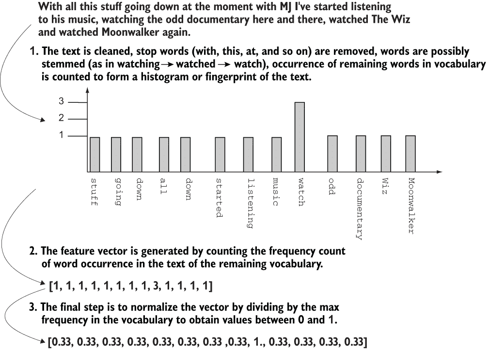
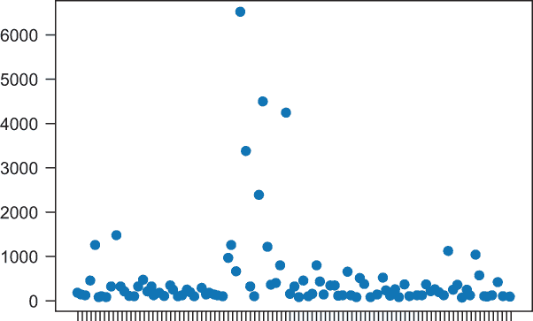
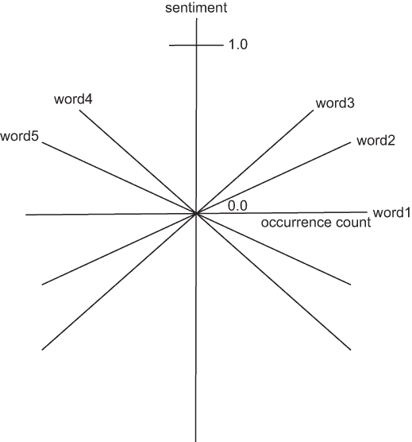
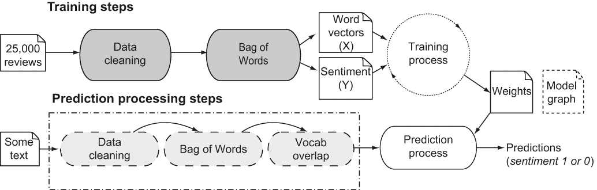
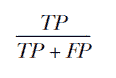
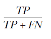
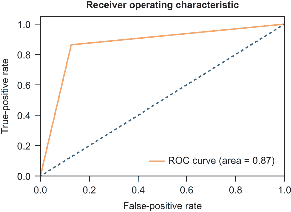
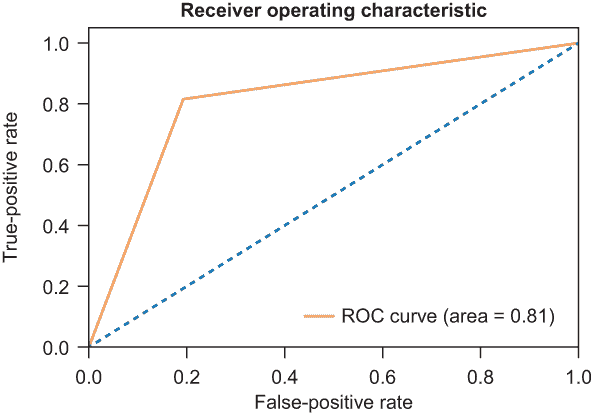
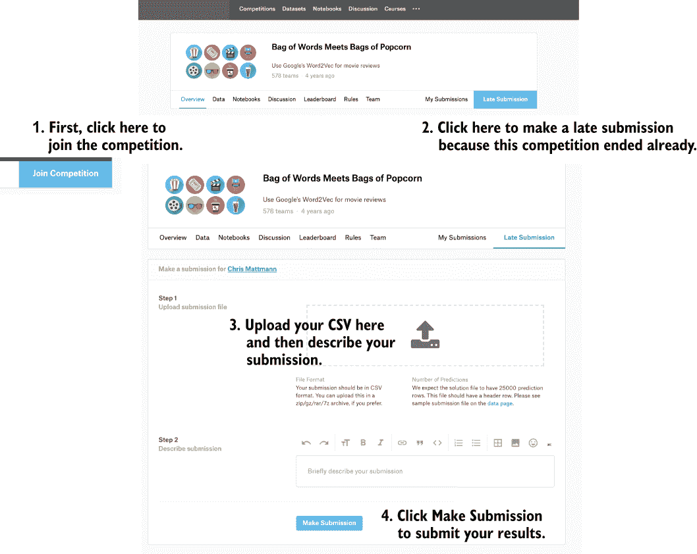

# 6 情感分类：大型电影评论数据集

本章涵盖

+   使用文本和词频（词袋模型）来表示情感

+   使用逻辑回归和 softmax 构建情感分类器

+   衡量分类精度

+   计算 ROC 曲线并衡量分类器的有效性

+   将你的结果提交到 Kaggle 的电影评论挑战赛

现在，机器学习的神奇用途之一，让每个人都印象深刻的是教会计算机从文本中学习。随着社交媒体、短信、Facebook Messenger、WhatsApp、Twitter 和其他来源每天产生数百亿条文本消息，可供学习的文本资源是充足的。

TIP 查看这个著名的信息图表，展示了每天从各种媒体平台到达的大量文本数据：[`mng.bz/yrXq`](https://shortener.manning.com/yrXq)。

社交媒体公司、电话提供商和应用程序制造商都在尝试使用你发送的消息来做出决策和分类你。你是否曾给你的另一半发送了一条关于你午餐吃的泰国菜的短信，然后后来在你的社交媒体上看到了弹出广告，推荐你去新的泰国餐厅？虽然听起来很可怕，好像大哥在试图识别和理解你的饮食习惯，但在线流媒体服务公司也在使用实际应用来尝试确定你是否喜欢他们的产品。

在观看一部电影后，你是否曾花时间发表一个简单的评论，比如“哇，那是一部很棒的电影！我喜欢比尔的表现！”或者“那部电影非常不合适，超过了三个小时，一开始对血腥场面感到厌恶，后来因为没有任何情节而睡着了！”（好吧，诚实地讲，我可能在上一个在线平台上写了最后那条评论。）YouTube 以其用户不仅来观看视频和病毒性内容，还参与阅读评论——查看电影、视频和其他数字媒体的内容的书面评论而闻名。这些评论很简单，因为你可以说一句话或两句话，表达你的感受，然后继续你的生活。有时，评论非常有趣，或愤怒，或极端积极；最终，它们涵盖了在线参与者观看内容时可能体验到的所有情绪范围。

这些情感对在线媒体服务公司非常有用。如果有一个简单的分类情感的方法，公司可以确定某个名人视频是否引发了极端的悲伤或极端积极的反应。反过来，如果公司能够首先分类，然后将这些情感与你接下来所做的事情相关联——如果你在看完电影后提供了一些积极的评论并点击了一个链接购买主演的电影，那么他们就有了一个完整的因果关系流程。媒体公司可以生成更多这样的内容或向你展示更多你感兴趣的内容类型。这样做可能会增加收入，比如如果你的积极反应导致你在之后购买了与该名人相关的东西。

你正在学习一种使用机器学习对输入数据进行分类的方法，并通过分类为该输入生成一些标签。情感可以有两种思考方式：首先作为二元情感（如正面/负面反应），然后作为多类情感（如仇恨、悲伤、中性、喜欢或爱）。你学习了以下两种处理这些情况的技术，你将在本章中尝试这些技术：

+   用于二元情感的逻辑回归

+   用于多类分类的 Softmax 回归

在这种情况下，输入的挑战在于它是文本，而不是像我们在第五章中由我们信任的 NumPy 库为我们生成的那些随机数据点那样的美好输入向量。幸运的是，文本和信息检索社区已经开发了一种将文本映射到数值特征向量的技术——非常适合机器学习。这种技术被称为词袋模型。

## 6.1 使用词袋模型

**词袋模型**是自然语言处理（NLP）中的一个方法，它将句子形式的文本作为输入，通过考虑提取的词汇和它们出现的频率，将其转换为一个特征向量。之所以命名为“词袋”，是因为每个单词的频率计数就像一个“袋子”，其中每个单词的出现都是一个袋子中的项目。词袋模型是一个最先进的模型，它允许你将电影评论转换为特征向量，这将用于对其情感进行分类。考虑以下关于迈克尔·杰克逊电影的评论片段文本：

```
With all this stuff going down at the moment with MJ i've started listening to his music, watching the odd documentary here and there, watched The Wiz and watched Moonwalker again.
```

将词袋模型应用于处理此评论的第一步是预处理文本，并仅提取具有实际意义的单词。通常，这个过程涉及删除任何非字母字符——如数字、HTML 标签等注释和标点符号——并将文本简化为其基本单词。之后，该方法将剩余的单词子集减少到名词、动词或形容词，并去除冠词、连词和其他停用词——这些词不是文本本身的区分性特征。

注意：许多现成的停用词列表可供使用。Python 自然语言工具包（NLTK）中使用的列表是一个很好的起点；您可以在[`gist.github.com/sebleier/554280`](https://gist.github.com/sebleier/554280)找到它们。停用词通常是语言特定的，因此您需要确保您使用的列表适合您正在处理的语言。幸运的是，NLTK 目前可以处理 21 种语言的停用词。您可以在[`mng.bz/MoPn`](http://mng.bz/MoPn)了解更多信息。

当这一步完成时，词袋模型生成剩余词汇词的计数直方图，该直方图成为输入文本的指纹。通常，通过将计数除以最大计数来归一化指纹，从而得到介于 0 和 1 之间的值特征向量。整个过程如图 6.1 所示。



图 6.1 词袋模型的视觉表示。文本被分析和清理，然后计数形成直方图，然后归一化以获得输入文本的特征向量表示。

### 6.1.1 将词袋模型应用于电影评论

要开始使用词袋模型，您需要一些评论文本。Kaggle 词袋模型与爆米花袋挑战是一个优秀的、已经完成的比赛，该比赛分析了来自互联网电影数据库（[IMDb.com](https://www.imdb.com/)）的 50,000 部电影评论，以生成这些电影评论的情感分类。您可以在[`mng.bz/aw0B`](http://mng.bz/aw0B)了解更多关于这个挑战的信息。您将在本章中使用这些评论来构建情感分类器。

要开始，从[`mng.bz/ggEE`](http://mng.bz/ggEE)获取 labeledTrainData.tsv 文件，并将其保存到您的本地驱动器上。您还想要下载 testData.tsv 文件，从[` mng.bz/emWv`](http://mng.bz/emWv)；您稍后会使用该文件。这些文件格式为制表符分隔值（TSV）文件，列对应于唯一标识符（`id`）、情感（`1` 表示正面或 `0` 表示负面）以及每行的 HTML 格式评论。

让我们尝试我们的词袋模型，并创建一个函数来处理从输入 labeledTrainData.tsv 文件创建机器学习准备好的输入特征。打开一个名为 sentiment_classifier.ipynb 的新笔记本，并创建一个 `review_to_words` 函数。该函数首先通过调用 Tika Python 库将 IMDb 的 HTML 评论转换为评论文本。Tika Python 是一个内容分析库，其主要功能包括文件类型识别、从 1400 多种格式中提取文本和元数据以及语言识别。

TIP Tika 的完整解释是我写的另一本 Manning 书籍的主题。认真地说，查看 Tika in Action ([`www.manning.com/books/tika-in-action`](https://www.manning.com/books/tika-in-action))。在这里，你使用它来移除文本中的所有 HTML 标签，使用`parser`接口和其`from_buffer`方法，该方法接受一个字符串缓冲区作为输入，并输出 HTML 解析器关联的提取文本。

拥有提取的评论文本后，使用 Python 的`re`（用于*正则表达式*）模块，使用一个常见的模式`[^a-zA-z]`，这意味着从字符串的开始（`^`符号）扫描并识别仅大写和小写字母`a`到`z`，并将其他所有内容替换为空白字符。

下一步是将文本全部转换为小写。单词的大小写对于解释句子或语言有含义，但对于独立于结构的单词出现次数计数则意义不大。接下来，通过 Python 的 NLTK 库移除停用词，包括连词和冠词。该库支持 21 种语言的停用词，因此你会使用英语的停用词，因为你正在处理 IMDb 的英语评论。最后一步是将剩余的单词作为一个字符串连接起来。列表 6.1 的输出是原始列表的简化版本，只包含有意义的单词和没有 HTML——换句话说，是干净的文本。这个干净的文本将是 Bag of Words 模型的实际输入。

列表 6.1 从评论的输入文本创建特征

```
from tika import parser
from nltk.corpus import stopwords
import re

def review_to_words( raw_review ):
    review_text = parser.from_buffer( "<html>" + raw_review + "</html>" 
    ➥ )["content"]                                                     ❶

    letters_only = re.sub("[^a-zA-Z]", " ", review_text)                ❷
    words = letters_only.lower().split()                                ❸

    stops = set(stopwords.words("english"))                             ❹
    meaningful_words = [w for w in words if not w in stops]             ❺
    return( " ".join( meaningful_words ))                               ❻
```

❶ 函数通过使用 Apache Tika 将原始评论转换为单词字符串

❷ 移除非字母字符

❸ 转换为小写，分割成单个单词

❹ 将停用词转换为集合，这比在列表中搜索要快得多

❺ 移除停用词

❻ 将单词重新组合成一个由空格分隔的字符串

有了我们生成干净评论文本的函数，你就可以开始在该标签化训练数据.tsv 中的 25,000 条评论上运行该函数。但首先，你需要将这些评论加载到 Python 中。

### 6.1.2 清理所有电影评论

一个方便的库是 Pandas 库，它可以高效地将 TSV 加载到 Python 中，用于创建、操作和保存数据框。你可以将数据框想象成一个机器学习就绪的表格。表格中的每一列都是一个可以用于机器学习的特征，而每一行是用于训练或测试的输入。Pandas 提供了添加和删除特征列的功能，以及以复杂方式增强和替换行值的功能。Pandas 是许多书籍的主题（我没有写它们！），Google 提供了关于此主题的数万个结果，但就你的目的而言，你可以使用 Pandas 从输入 TSV 文件创建一个机器学习就绪的数据框。然后 Pandas 可以帮助你检查输入中的特征数、行数和列数。

使用那个数据框，你运行你的文本清理代码以生成干净的评论，然后你可以应用词袋模型。首先，调用 Pandas 的 `read_csv` 函数，并告诉它你正在读取一个没有标题行的 TSV 文件，使用制表符（\t）作为分隔符，并且你不想引用特征值。当训练数据被加载时，打印其形状和列值，展示了使用 Pandas 检查数据框的便捷性。

由于清理 25,000 部电影评论可能需要一段时间，你将使用 Python 的 TQDM 辅助库来跟踪进度。TQDM 是一个可扩展的进度条库，它将状态打印到命令行或 Jupyter 笔记本。你将迭代步骤——列表 6.2 中的 `range` 函数——包装成一个 `tqdm` 对象。然后每个迭代步骤都会使进度条的增加对用户可见，无论是通过命令行还是在笔记本中。TQDM 是一种很好的方式，可以在长时间运行的机器学习操作中“发射并忘记”，同时当你回来检查时仍然知道有事情在进行。

列表 6.2 打印了训练数据的形状 `(25000, 3)`，对应于 25,000 条评论和 3 列（id、sentiment 和 review），以及输出 `array(['id', 'sentiment', 'review'], dtype=object)`，对应于那些列值。将列表 6.2 中的代码添加到你的 sentiment_classifier.ipynb 笔记本中，以生成 25,000 条干净的文本评论并跟踪进度。

列表 6.2 使用 Pandas 读取电影评论并应用你的清理函数

```
import pandas as pd
from tqdm import tqdm_notebook as tqdm

train = pd.read_csv("labeledTrainData.tsv", header=0, 
                    delimiter="\t", quoting=3)                           ❶
print(train.shape)                                                       ❷
print(train.columns.values)                                              ❷

num_reviews = train["review"].size                                       ❸
clean_train_reviews = []                                                 ❹

for i in tqdm(range( 0, num_reviews )):                                  ❺
    clean_train_reviews.append( review_to_words( train["review"][i] ) )
```

❶ 从输入 TSV 文件中读取 25,000 条评论

❷ 打印训练数据的形状和值数量

❸ 根据数据框列的大小获取评论数量

❹ 初始化一个空列表来保存干净的评论

❺ 遍历每个评论并使用你的函数清理它

现在你有了干净的评论，是时候应用词袋模型了。Python 的 SK-learn 库 ([`scikit-learn.org`](https://scikit-learn.org/)) 是一个可扩展的机器学习库，它提供了许多与 TensorFlow 相互补的功能。尽管一些功能有重叠，但我在这本书中相当多地使用了 SK-learn 的数据清理函数。你不必是纯粹主义者。SK-learn 随带了一个名为 `CountVectorizer` 的出色实现，例如；你将在列表 6.3 中使用它来应用词袋模型。

首先，使用一些初始超参数创建 `CountVectorizer`。这些超参数告诉 SK-learn 是否要执行任何文本分析，例如分词、预处理或移除停用词。我在这里省略了它，因为你已经在列表 6.1 中编写了自己的文本清理函数，并在 6.2 中将其应用于输入文本。

一个值得注意的参数是`max_features`，它控制从文本中学习到的词汇的大小。选择`5000`的大小可以确保你构建的 TensorFlow 模型具有足够的丰富性，并且每个评论的 Bag of Words 指纹可以在不耗尽你机器上的 RAM 的情况下学习。显然，你可以根据更大的机器和更多的时间在这个参数调整示例上玩耍。一个一般性的规则是，一个大约有数千个词汇的词汇表应该为英语电影的足够学习性提供支持。然而，对于新闻、科学文献和其他领域，你可能需要实验以找到最佳值。

调用`fit_transform`以提供你在列表 6.2 中生成的干净评论，并获取向量化的 Bag of Words，每行一个评论，行内容为每个评论中每个词汇的计数。然后将向量转换为 NumPy 数组；打印其形状；并确保你看到`(25000,5000)`，对应于 25,000 个输入行，每行有 5,000 个特征。将列表 6.3 中的代码添加到你的笔记本中。

列表 6.3 将 Bag of Words 模型应用于获取训练数据

```
from sklearn.feature_extraction.text import CountVectorizer           ❶
vectorizer = CountVectorizer(analyzer = "word",   \                   ❶
                             tokenizer = None,    \
                             preprocessor = None, \
                             stop_words = None,   \
                             max_features = 5000) 

train_data_features = vectorizer.fit_transform(clean_train_reviews)   ❷
train_data_features = train_data_features.toarray()                   ❸
print(train_data_features.shape)                                      ❹
```

❶ 导入 CountVectorizer 并实例化 Bag of Words 模型

❷ 调整模型，学习词汇，并将训练数据转换为向量

❸ 将结果转换为 NumPy 数组

❹ 打印结果输入特征形状（25000,5000）

### 6.1.3 对你的 Bag of Words 进行探索性数据分析

进行一些探索性数据分析始终是一件好事，你可能想检查`CountVectorizer`返回的词汇值，以了解所有评论中存在的单词。你将想要确信这里确实有东西可以学习。你想要寻找的是单词之间的某种统计分布和相关的模式，分类器将从这个分布中学习以识别。如果每个评论中的计数都相同，并且你无法通过肉眼区分它们，那么机器学习算法将面临相同的困难。

SK-learn 和`CountVectorizer`的伟大之处在于，它们不仅提供了一个简单的一行或两行 API 调用以创建 Bag of Words 输出，而且允许轻松检查结果。你可以获取已学习的词汇并打印它们，通过使用快速的 NumPy 求和方法按单词进行分箱，然后查看前 100 个单词及其在所有评论中的总和。执行这些任务的代码在列表 6.4 中。

列表 6.4 对返回的 Bag of Words 进行探索性数据分析

```
vocab = vectorizer.get_feature_names()         ❶
print("size %d %s " % (len(vocab), vocab))     ❶

dist = np.sum(train_data_features, axis=0)     ❷

for tag, count in zip(vocab, dist):            ❸
    print("%d, %s" % (count, tag))             ❸

plt.scatter(vocab[0:99], dist[0:99])           ❹
plt.xticks(vocab[0:99], rotation='vertical')   ❹
plt.show()
```

❶ 获取已学习的词汇并打印其大小和已学习的单词

❷ 求每个词汇的词频总和

❸ 打印词汇词及其在训练集中出现的次数

❹ 绘制前 100 个单词的词频图

图 6.2 显示了所有 25000 条评论中前 100 个单词的输出词集。我本可以随机选择词汇表中的任意 100 个单词，但为了使示例简单，我选择了前 100 个。即使在第一个 100 个单词中，这些单词在评论中的计数似乎也具有统计学意义；计数并不相同，也没有一致性。有些单词比其他单词使用得更频繁，还有一些明显的异常值，所以看起来似乎有一个信号供分类器学习。你可以在第 6.2 节开始构建逻辑回归分类器。



图 6.2 显示了所有 25000 条评论中提取的 5000 词词汇表中前 100 个单词的词汇计数总和

## 6.2 使用逻辑回归构建情感分类器

在第五章中，当处理逻辑回归时，你确定了因变量和自变量。在情感分析中，你的因变量是每条评论的 5000D 特征向量词袋，你有 25000 条数据用于训练。你的自变量是情感值：一个`1`对应 IMDb 中的正面评论，一个`0`对应用户对电影的负面情感。

那电影标题呢？

你有没有注意到你使用的 IMDb 数据是评论和情感，但没有标题？标题词在哪里？如果这些词包含映射到电影观众在评论中使用的单词的触发词，它们可能会影响情感。但总体来说，你不需要标题——只需要情感（要学习的东西）和评论。

尝试想象你的分类器将在给定的训练数据和特征空间中探索的解决方案空间。你可以想象一个矢量平面——称之为地面——将垂直轴称为从地面上方站立并向上看天空的垂直距离——情感。在地面上，有一个从你站立的原点开始的矢量，向每个方向延伸，对应于你的词汇表中的特定单词——如果你愿意，有 5000 个轴——射出与该矢量描述的特定单词的计数相对应的距离。这个平面上的数据点是每个单词轴上的特定计数，y 值是特定点的平面上的计数集合是否意味着情感为`1`或`0`。你的想象应该类似于图 6.3。



图 6.3 通过使用逻辑回归构建分类器的想象。你的特征空间是按三维排列的单词计数，其中值是发生次数。y 轴对应于情感结果（`0`或`1`）。

给定这种结构，我们可以使用以下方程来表示与这个分类器相对应的逻辑回归方程。目标是拥有一个线性函数，其中包含所有依赖变量及其相关权重（`1` 到 `5000`）作为 sigmoid (`sig`) 函数的参数，这将产生一个在 `0` 和 `1` 之间波动的平滑曲线，对应于情感独立变量：

*M*(*x, v*) = *sig*(*wx* + *w*)

情感 = *sig*(*w*[1]*x*[1] + *w*[2]*x*[2] + ⋅⋅⋅ + *w*[5000]*x*[5000] + *w*[0])

### 6.2.1 为你的模型设置训练

你已经准备好设置你的 TensorFlow 逻辑回归分类器了。开始时，可以设置一个任意的学习率 0.1，并训练 2,000 个周期（在我的笔记本电脑上效果很好），尤其是因为你将执行早期停止。*早期停止* 是一种技术，它测量前一个周期和当前周期之间损失（或错误率）的差异。如果错误率在周期之间通过某个小的阈值 epsilon 发生变化，则认为模型是稳定的，你可以在训练中提前终止。

你将设置 sigmoid 函数，这对于模型也是必需的。如第五章所述，这个函数确保在应用成本函数后，在每次训练步骤中学习适当的模型权重时，反向传播过程有一个在 `0` 和 `1` 之间波动的平滑梯度步骤。sigmoid 函数恰好具有这些属性。

在 TensorFlow 中创建用于你将学习的 Y 值的占位符，情感标签，以及你的 X 输入占位符 5,000 × 25,000 维度特征向量：每个电影评论一个词袋向量，共有 25,000 个电影评论。在列表 6.5 中，你使用一个 Python 字典来存储每个词袋向量，索引为 `X0-X4999`。`w` 变量（权重）对应于每个依赖变量 `X`，并在线性方程的末尾添加一个常数 `w`。

`cost` 函数与第五章中使用的相同凸交叉熵损失函数，你将使用梯度下降作为你的优化器。设置模型的完整代码在列表 6.5 中展示。

列表 6.5 设置逻辑回归情感分类器的训练

```
learning_rate = 0.1                                                           ❶
training_epochs = 2000                                                        ❶
def sigmoid(x): 
    return 1\. / (1\. + np.exp(-x))                                             ❷

Y = tf.placeholder(tf.float32, shape=(None,), name="y")                       ❸
w = tf.Variable([0.] * (len(train_data_features)+1), name="w", trainable=True)❸

ys = train['sentiment'].values                                                ❹
Xs = {} 
for i in range(train_data_features.shape[1]):
    Xs["X"+str(i)] = tf.placeholder(tf.float32, shape=(None,), 
    ➥ name="x"+str(i))

linear = w[0] 
for i in range(0, train_data_features.shape[1]):
    linear = linear + (w[i+1] * Xs["X"+str(i)])
y_model = tf.sigmoid(linear)                                                  ❺

cost = tf.reduce_mean(-tf.log(y_model * Y + (1 - y_model) * (1 - Y)))         ❻
train_op = tf.train.GradientDescentOptimizer(learning_rate).minimize(cost)    ❻
```

❶ 设置学习率和周期数的初始模型超参数

❷ 设置逻辑回归模型

❸ 定义 TensorFlow 占位符以注入实际的输入和标签值

❹ 从 Pandas 数据框中提取学习用的标签

❺ 构建要学习的逻辑回归模型

❻ 定义每个学习步骤的交叉熵成本函数和训练操作

在设置好你的模型后，你可以使用 TensorFlow 进行训练。如我之前提到的，你将执行早期停止以节省在 `loss` 函数和模型响应成本稳定时的无用周期。

### 6.2.2 对你的模型进行训练

创建一个`tf.train.Saver`来保存模型图和训练权重，以便你可以在以后重新加载它们，并使用训练好的模型进行分类预测。训练步骤与之前看到的大致相同：你初始化 TensorFlow，这次使用 TQDM 来跟踪和逐步打印训练进度，以便你有一些指标。训练可能需要 30 到 45 分钟，并且将消耗数 GB 的内存——至少，在我的相当强大的 Mac 笔记本电脑上是这样——所以 TQDM 是必不可少的，让你知道训练过程正在进行。

训练步骤将 5000 维的特征向量注入你创建的 X 占位符字典中，并将相关的情感标签注入到 TensorFlow 的 Y 占位符变量中。你将使用你的凸`loss`函数作为模型成本，并将前一个 epoch 的成本值与当前 epoch 的成本值进行比较，以确定你的代码是否应该在训练中执行早期停止以节省宝贵的周期。`0.0001`的阈值是任意选择的，但考虑到额外的周期和时间，它可能是一个可以探索的超参数。列表 6.6 显示了逻辑回归情感分类器的完整训练过程。

列表 6.6 执行逻辑回归情感分类器的训练步骤

```
saver = tf.train.Saver()                                                  ❶
with tf.Session() as sess:
    sess.run(tf.global_variables_initializer())
    prev_err = 0\.                                                         ❷
    for epoch in tqdm(range(training_epochs)):
        feed_dict = {}
        for i in range(train_data_features.shape[1]):
            feed_dict[Xs["X"+str(i)]] = train_data_features[:, i,  
            ➥ None].reshape(len(train_data_features))                    ❸
        feed_dict[Y] = ys                                                 ❸
        err, _ = sess.run([cost, train_op], feed_dict=feed_dict)
        print(epoch, err)
        if abs(prev_err - err) < 0.0001:                                  ❹
            break                                                         ❹
        prev_err = err

    w_val = sess.run(w, feed_dict)                                        ❺
    save_path = saver.save(sess, "./en-netflix-binary-sentiment.ckpt")    ❻

print(w_val)
print(np.max(w_val))
```

❶ 创建保存器以捕获你的模型图和相关训练权重

❷ 捕获先前的损失函数值以测试早期停止

❸ 提供了 25,000 条评论，5,000 维的特征向量和情感标签

❹ 测试先前的损失值是否与当前损失值有微小差异，并在有差异时中断

❺ 在模型图加载时获取训练权重

❻ 保存模型图和相关的训练权重

你已经通过使用逻辑回归训练了你的第一个文本情感分类器！

接下来，我将向你展示如何使用这个情感分类器对新未见的数据进行预测。你还将学习如何评估分类器的准确性和精确度，并通过运行 Kaggle 竞赛的测试数据来了解其性能，然后将你的结果提交到 Kaggle。

## 6.3 使用你的情感分类器进行预测

现在你已经构建了你的分类器，你该如何使用它来进行预测呢？当你调用`tf.train.Saver`来保存你的检查点文件时，会存储两个关键信息：

+   检查点包含你到达的模型权重——在这种情况下，对应于你的词袋模型中每个词汇的`sigmoid`线性部分的权重。

+   检查点包含模型图及其当前状态，以防你想从上次停止的地方继续训练并继续下一个 epoch。

进行预测就像加载检查点文件并将这些权重应用到模型上一样简单。正如我在第五章中向您展示的那样，您不需要重新使用列表 6.5 中的`y_model`函数的 TensorFlow 版本——`tf.sigmoid`函数——因为这样做会加载模型图，并需要额外的资源来准备 TensorFlow 以继续训练。相反，您可以将学习到的权重应用到模型的 NumPy 版本——列表 6.5 中的内联`sigmoid`函数——因为您不会对它进行任何进一步的训练。

看起来很简单，对吧？但我省略了一个需要首先解决的问题。这将在本书的其余部分得到推广，其中您执行机器学习、训练模型并使用它来做出辅助自动化决策的预测。考虑您为模型训练执行的步骤：

1.  对 25,000 条电影评论进行数据清洗。

    1.  去除 HTML 标签。

    1.  移除标点符号，并仅考虑`a-zA-Z.`。

    1.  移除停用词。

1.  应用词袋模型，将词汇限制在 5,000 个单词的特征向量中。

1.  使用 25,000 个大小为 5,000 的向量和相关的 25,000 个标签（情感 1、0 和逻辑回归）来构建分类模型。

现在假设您想使用您的模型对新文本进行预测，例如以下两个句子。第一个句子显然是负面评论，第二个是正面评论：

```
new_neg_review = "Man, this movie really sucked. It was terrible. I could not possibly watch this movie again!"
new_pos_review = "I think that this is a fantastic movie, it really "
```

您如何将这些句子提供给模型以进行情感预测？您需要在预测过程中应用您在训练期间使用的相同数据预处理步骤，这样您考虑文本的方式与您训练的方式相同。您是在 5,000 维特征向量上进行训练的，因此您需要做同样的事情来准备输入文本以进行预测。此外，您还需要注意一个额外的步骤。您在训练期间生成的权重是在由`CountVectorizer`生成的 5,000 个单词的共同共享词汇下产生的。您正在对其进行的预测的未见过输入文本可能具有与您的训练文本词汇不同的词汇。换句话说，那个未见过文本可能使用了您训练时没有使用的其他单词，可能更多或更少。然而，您花费了近 45 分钟来训练您的逻辑回归情感分类器，也许甚至更长的时间来准备训练的输入和标签。这项工作被无效化了吗？您是否必须从头开始进行训练？

记得我之前提到过，在`CountVectorizer`中将词汇大小设置为`5000`可以提供足够的丰富性，但你可能需要调整或探索以获得最佳匹配。所以词汇大小确实很重要，你用训练模型预测的内容也同样重要。在预处理步骤和数据清理后，词汇表中剩下 5,000 个单词可以在训练和未见数据上实现高准确率——在我的训练中高达 87%，你将在本章后面使用接收者操作特征（ROC）曲线时重现这一点。但谁能说 10,000 个单词不会达到更高的准确率呢？不是我！

事实上，使用更多词汇可能达到更高的准确率。结果取决于你打算进行预测的数据以及该数据的普遍性。它还会对你的整体内存和 CPU 以及 GPU 训练需求产生重大影响，因为为每个输入向量使用更多特征无疑会消耗更多资源。请注意，如果你的未见数据词汇与训练数据中的代表性词汇有足够的重叠，就没有必要增加其大小。

小贴士：确定最佳词汇大小是最好留给一个学期的统计学或 NLP 研究生课程的任务，但简单来说，你可能需要进一步探索这个超参数。这篇帖子有一些关于词汇大小的良好建议：[`mng.bz/pzA8`](http://mng.bz/pzA8)。

为了向前推进并实现本章重点关注的情感预测功能，你需要确定你新文本的词汇向量与训练中现有词汇的交集。然后，你将只考虑指纹中重叠术语在 Bag of Words 模型中的计数，并将这些计数与基于训练模型预测情感的新文本的计数进行比较。整个预测流程及其与训练流程的关系在图 6.4 中展示。



图 6.4 使用机器学习进行预测。在训练过程中（顶部），你通过清理文本、将其转换为 5,000 维特征向量，并使用它来学习 25,000 篇电影评论的情感标签（`1`或`0`）。要使用学习到的模型进行预测（右侧），你需要执行相同的数据清理步骤，并且还需要确定下一个文本及其词汇与你的训练集的交集。

让我们开始编写`predict`函数，该函数应接受未修改的评论文本作为输入，以及训练过程中的训练词汇和学到的权重。你需要应用相同的数据清理过程，因此你通过以下方式清理文本：

+   标记化

+   移除标点符号和非字符

+   移除停用词

+   重新组合标记

之后，再次应用词袋模型，并生成一个函数，该函数可以用于对未见过的输入文本进行情感预测。该函数应专注于确定从输入中学习的新词汇与训练词汇的重叠部分。对于每个重叠的单词，考虑单词计数；特征向量中的其他元素将为零。结果特征向量应输入到 sigmoid 函数中，用于你的逻辑回归模型，使用最优的学习权重。结果——情感的概率介于`0`和`1`之间——与阈值值`0.5`进行比较，以确定情感是`1`还是`0`。列表 6.7 显示了`predict`函数。

列表 6.7 使用逻辑回归情感分类器进行预测

```
def predict(test_review, vocab, weights, threshold=0.5):                   ❶

    test_review_c = review_to_words(test_review)                           ❷

    n_vectorizer = CountVectorizer(analyzer = "word",   \                  ❸
                             tokenizer = None,    \
                             preprocessor = None, \
                             stop_words = None,   \
                             max_features = 5000) 
    ex_data_features = n_vectorizer.fit_transform([test_review_c])
    ex_data_features = ex_data_features.toarray()                          ❹
    test_vocab = n_vectorizer.get_feature_names()                          ❹
    test_vocab_counts = ex_data_features.reshape(ex_data_features.shape[1])❹

    ind_dict = dict((k, i) for i, k in enumerate(vocab))                   ❺
    test_ind_dict = dict((k, i) for i, k in enumerate(test_vocab))         ❺
    inter = set(ind_dict).intersection(test_vocab)                         ❺
    indices = [ ind_dict[x] for x in inter ]                               ❺
    test_indices = [test_ind_dict[x] for x in inter]                       ❺

    test_feature_vec = np.zeros(train_data_features.shape[1])              ❻
    for i in range(len(indices)):                                          ❻
        test_feature_vec[indices[i]] = test_vocab_counts[test_indices[i]]  ❻

    test_linear = weights[0]                                               ❼
    for i in range(0, train_data_features.shape[1]):                       ❼
        test_linear = test_linear + (weights[i+1] * test_feature_vec[i])   ❼
    y_test = sigmoid(test_linear)                                          ❼

    return np.greater(y_test, threshold).astype(float)                     ❽
```

❶ 以参数形式接受用于测试的评论文本、训练词汇、学习权重和正负预测的阈值截止值

❷ 使用与训练相同的函数清理评论

❸ 创建测试词汇和计数

❹ 将词汇和计数转换为 NumPy 数组

❺ 确定评论词汇与实际完整词汇的交集

❻ 除了我们计数重叠索引的 5,000 特征向量外，其余都是零

❼ 使用学习到的权重应用你的逻辑回归模型

❽ 如果预测概率大于 0.5，则情感为 1；否则，为 0。

在以下测试评论`new_neg_review`和`new_pos_review`上尝试该函数。该函数正确地将负面评论预测为`0`，将正面评论预测为`1`。酷，对吧？

```
new_neg_review = "Man, this movie really sucked. It was terrible. I could not possibly watch this movie again!"
new_pos_review = "I think that this is a fantastic movie, it really "
predict(new_neg_review, vocab, w_val)
predict(new_pos_review, vocab, w_val)
```

现在你有了`predict`函数，你可以使用它来计算混淆矩阵（第三章）。创建真实阳性、假阳性、真实阴性和假阴性的混淆矩阵，这允许你衡量分类器预测每个类别的能力，并计算精确率和召回率。此外，你可以生成 ROC 曲线，并测试你的分类器比基线好多少。

## 6.4 测量你的分类器的有效性

现在你可以使用你的逻辑回归分类器预测未见过的文本的情感了，一个衡量其总体有效性的好方法是将其大规模应用于大量未见过的文本。你使用了 25,000 条 IMDb 电影评论来训练分类器，所以你会使用另外 25,000 条你保留用于测试的。当你使用 Kaggle 的 TSV 文件训练分类器时，你使用的是原始 IMDb 评论数据的合并版本。你并不总是有这个好处；有时，你需要预处理原始数据。为了确保你可以处理这两种数据准备和清理方法，使用原始的 aclImdb_v1.tar.gz 文件([`mng.bz/Ov5R`](http://mng.bz/Ov5R))并为其准备测试。

解压 aclImdb_v1.tar.gz 文件。你现在有一个看起来像这样的文件夹结构，其中每个条目下面要么是文件（如`README`），要么是目录（如`test`和`train`）：

```
README      imdb.vocab      imdbEr.txt      test/   train/
```

打开测试目录。里面包含更多文件（*.txt 和*.feat）和文件夹（neg 和 pos）：

```
labeledBow.feat             neg/    pos/    urls_neg.txt    urls_pos.txt
```

文件夹 pos（表示*正面*）和 neg（表示*负面*）包含 12,500 个文本文件，其中包含电影评论，每个文件对应于未见过的正面和负面评论，因此你将创建两个变量——`only_pos_file_contents`和`only_neg_file_contents`——来对应它们。通过使用两个循环将评论读取到这两个变量中。Python 的内置`os.isfile`函数确保在代码遍历和评估目录列表对象时，执行一个测试以确定该对象是否为文件（而不是目录）。`os.listdir`方法列出目录中的文件。列表 6.8 中的代码加载了测试 IMDb 评论。

列表 6.8：加载测试 IMDb 评论

```
from os import listdir
from os.path import isfile, join

pos_test_path = "aclImdb/test/pos/"                             ❶
neg_test_path = "aclImdb/test/neg/"                             ❶
only_pos_files = [f for f in listdir(pos_test_path) if          ❶
➥ isfile(join(pos_test_path, f))]                              ❶
only_neg_files = [f for f in listdir(neg_test_path) if          ❶
➥ isfile(join(neg_test_path, f))]                              ❶

only_pos_file_contents = []
for i in range(0, len(only_pos_files)):                         ❷
    with open(pos_test_path + only_pos_files[i], 'r') as file:
        r_data = file.read()
        only_pos_file_contents.append(r_data)

only_neg_file_contents = []                                     ❸
for i in range(0, len(only_neg_files)):
    with open(neg_test_path + only_neg_files[i], 'r') as file:
        r_data = file.read()
        only_neg_file_contents.append(r_data)

predictions_test = np.zeros(len(only_pos_file_contents) * 2)    ❹
```

❶ 遍历并识别正面和负面评论文本文件的路径

❷ 将正面评论读取到包含 12,500 个文本对象的列表中

❸ 将负面评论读取到包含 12,500 个文本对象的列表中

❹ 为 25,000 个情感值创建占位符

在将测试评论加载到内存中的`only_pos_file_contents`和`only_neg_file_contents`以及标签占位符`predictions_test`变量中后，你可以使用`predict`函数来计数真实和虚假正例以及真实和虚假负例，然后计算分类器的精确度和召回率。精确度定义为



召回率定义为



列表 6.9 中的代码遍历正面情感文件，调用你的`predict`函数，将结果存储在`predictions_test`变量中。随后，它通过在负面文件内容上调用`predict`函数来继续操作。由于调用`predict`函数可能每次需要几秒钟，这取决于你笔记本电脑的处理能力，你将再次使用`tqdm`库来跟踪每次迭代循环的进度。列表的最后部分打印出你的分类器的精确度和召回率，然后是真实和虚假正例以及真实和虚假负例的总数。真实和虚假正例以及负例是通过将你的分类器应用于未见过的测试评论来衡量的。运行列表 6.9 输出`精确度 0.859793 召回率 0.875200`，这对于你的第一个分类器来说是一个出色的结果！

列表 6.9：计算混淆矩阵、精确度和召回率

```
TP = 0\.                                                       ❶
TN = 0\.                                                       ❶
FP = 0\.                                                       ❶
FN = 0\.                                                       ❶

for i in tqdm(range(0, len(only_pos_file_contents))):         ❷
    sent = predict(only_pos_file_contents[i], vocab, w_val)   ❷
    predictions_test[i] = sent
    if sent == 1.:
        TP += 1
    elif sent == 0.:
        FN += 1

for i in tqdm(range(0, len(only_neg_file_contents))):         ❸
    sent = predict(only_neg_file_contents[i], vocab, w_val)   ❸
    predictions_test[len(only_neg_file_contents)+i] = sent
    if sent == 0.:
        TN += 1
    elif sent == 1.:
        FP += 1

precision = (TP) / (TP + FP)                                  ❹
recall = (TP) / (TP + FN)                                     ❹
print("precision %f recall %f" % (precision, recall))
print(TP)
print(TN)
print(FP)
print(FN)
```

❶ 初始化真实和虚假正例以及真实和虚假负例的计数

❷ 遍历正面情感文本文件并调用预测函数，并计算 TP 和 FN

❸ 遍历负面情感文本文件并调用预测函数，并计算 TN 和 FP

❹ 计算并打印精确度和召回率

给定生成的预测结果，您可以进行下一步：检查曲线下面积 (AUC) 并创建 ROC 曲线，以确定您的分类器比基线好多少。您不必自己实现这个过程，可以使用 SK-learn 的 `roc_curve` 函数，然后使用一些 Matplotlib 来绘制结果。

要使用 `roc_curve` 函数，您需要列表 6.9 中的 `predictions_test` 变量，这是在所有真正例上运行 `predict` 函数的结果，然后是在真正例上运行的结果。然后您需要一个您将称为 `outcomes_test` 的变量，这是真实情况。因为真实情况包括 12,500 个正面情感示例后面跟着 12,500 个负面情感示例，您可以通过初始化一个调用 `np.ones`（NumPy 函数，创建指定大小的数组，包含 12,500 个 `1`）的调用来创建 `outcomes_test` 变量，然后附加一个调用 `np.zeros`（NumPy 函数，创建指定大小的数组，包含 12,500 个 `0`）。

当这些变量生成后，您调用 `roc_curve` 函数；获取真正率 (`tpr`) 和假正率 (`fpr`)；然后将它们传递给 `auc` 函数，该函数将 AUC 存储在 `roc_auc` 变量中。列表 6.10 的剩余部分设置了带有基线分类器在 x 轴从 0 到 1、y 轴从 0 到 1 的虚线，然后使用 `tpr` 和 `fpr` 值在虚线上方的实线表示您的分类器实际结果（图 6.5）。

列表 6.10 使用 ROC 测量您的分类器性能与基线

```
from sklearn.metrics import roc_curve, auc

outcome_test = np.ones(len(only_pos_files))                             ❶
outcome_test = np.append(outcome_test, np.zeros(len(only_neg_files)))   ❶

fpr, tpr, thresholds = roc_curve(predictions_test, outcome_test)        ❷
roc_auc = auc(fpr, tpr)                                                 ❷

plt.figure()                                                            ❸
plt.plot(fpr, tpr, color='darkorange', lw=1, label='ROC curve           ❸
➥ (area = %0.2f)' % roc_auc)                                           ❸
plt.plot([0, 1], [0, 1], color='navy', lw=1, linestyle='—')            ❸
plt.xlim([0.0, 1.0])                                                    ❸
plt.ylim([0.0, 1.05])                                                   ❸
plt.xlabel('False Positive Rate')                                       ❹
plt.ylabel('True Positive Rate')                                        ❹
plt.title('Receiver operating characteristic')                          ❹
plt.legend(loc="lower right")                                           ❹
plt.show()                                                              ❺
```

❶ 创建一个大小与正面和负面文件数量成比例的标签数组（1 表示正面，0 表示负面）

❷ 计算假正率 (fpr)、真正率 (tpr) 和曲线下面积 (roc_auc)

❸ 初始化 Matplotlib 并设置基线 ROC 和分类器结果的线型和标签

❹ 创建图例和图表标题

❺ 显示图表



图 6.5 逻辑回归情感分类器的 ROC 曲线。性能比基线好得多，ROC 曲线/AUC 为 0.87，或 87%。

您已经评估了您的逻辑回归分类器的准确性，计算了其精确度、召回率和生成 ROC 和 AUC 曲线，并将其性能与基线进行了比较，基线表现相当好（几乎 90%）。正如我在第五章中提到的，任何具有这种性能的分类器很可能在实际应用中表现良好，因为它是在平衡数据集上训练并在具有相等平衡的未见数据上评估的。

在第五章中讨论的另一种技术是 softmax 回归，它具有自然地将预测扩展到两个类别以上的好处（或二分类）。尽管我们在这里没有 N>2 个类别进行训练，但探索如何创建情感分类器的 softmax 版本仍然值得，这样你可以获得一些实际构建它的经验。你可以重用本章中完成的大部分工作，让我们开始吧！

## 6.5 创建 softmax-regression 情感分类器

softmax-regression 方法的好处是它将分类扩展到预测超过两个类别的预测。分类方法的结构类似于逻辑回归。你有以下方程，其中你取一个线性相关变量集（你学习的权重 `w`）并通过 `sigmoid` 函数运行，该函数将值迅速解析为平滑曲线的 `0` 或 `1`。回想一下逻辑回归的结构：

*Y* = *sig*(*linear*)

*Y* = *sig*(*w*[1]*x*[1] + *w*[2]*x*[2] + ⋅⋅⋅ + *w*[0])

使用 softmax 回归，你有一个类似的结构，其中你学习 `num_features` × `num_labels` 大小的权重。在这种情况下，权重对应于乘以相关变量的权重，类似于逻辑回归。你还学习一个大小为 `num_labels` 的偏差矩阵，这同样类似于标准逻辑回归。与 softmax 回归的关键区别在于，你应用 `softmax` 函数而不是 `sigmoid` 函数来学习你试图预测的 *N* 个类别的概率分布。`softmax` 的方程式是

*Y* = *WX* + *B*

现在考虑在情感分类问题的背景下 `softmax` 分类器。你试图学习一组文本表示一个标签的概率，*Y*，这个标签可以是正标签或负标签，对于你将要测试的每一条 25,000 条评论。每条评论的文本集被转换为一个 5,000 维的特征向量，每个特征向量对应于 25,000 条评论中的一个 (*X* )。权重是与两个类别（正类别或负类别）相关联的权重，用于乘以 5,000 个相关变量，我们将其相关矩阵称为 *W*。最后，*B* 是两个类别（正类别和负类别）的偏差，用于添加，形成用于回归的线性方程。图 6.6 展示了这种结构。


图 6.6 softmax-regression 方法。输入 X 字段是 25,000 条评论和一个 5,000 维的词袋特征向量。模型学习 W，它是一个大小为 num features, 5000, by num labels 2 的矩阵，用于正负类别。

给定这种结构，您可以从一些代码开始，将这些矩阵组合起来，为您的分类器做准备。您将从创建标签矩阵的地面真实值开始。地面真实值中的每个条目都需要使用 one-hot 编码（第五章）。one-hot 编码是将类别标签如 `[0, 1]` 和 `[1,0]` 生成的过程，以表示类别 A 和 B——在这种情况下，表示积极情感和消极情感。因为 softmax 回归根据有序矩阵预测特定类别，如果您希望 `1` 对应于积极，`0` 对应于消极，那么该矩阵的列顺序应该是 0th 索引表示消极，1th 索引表示积极，因此您的标签编码应该是消极情感的 `[1,0]` 和积极情感的 `[0,1]`。

您将重用列表 6.2 中的 Pandas 数据框，并使用 Pandas 库的一些强大功能。数据框就像内存中的 Python 关系表，因此您可以使用类似 SQL 的结构查询它们。例如，要选择数据框中情感为积极（或 `1`）的所有行，您可以遍历数据框的长度，然后单独选择情感列值为 `1.0` 的行。您将使用此功能生成 one-hot 编码，然后从结果中创建一个大小为 25,000 × 2 的 NumPy 矩阵。

您的训练输入是来自列表 6.11 的 `CountVectorizer` 的输出，转换为一个大小为 (25000 × 5000) 的特征 NumPy 浮点矩阵。在列表 6.11 中，您创建了用于您的 softmax-regression 情感分类器的输入。列表的输出是 *X* 输入的形状 `xs.shape`，或 `(25000,5000)`，以及标签矩阵的形状 `labels.shape`，或 `(25000,2)`。

列表 6.11 创建 softmax-regression 分类器的输入

```
lab_mat = []
for i in range(len(train['sentiment'])):
    if train['sentiment'][i] == 1.0:       ❶
        lab_mat = lab_mat + [[0., 1.]]
    elif train['sentiment'][i] == 0.0:     ❷
        lab_mat = lab_mat + [[1., 0.]]

labels = np.matrix(lab_mat)                ❸
xs = train_data_features.astype(float)     ❹
train_size, num_features = xs.shape

print(xs.shape)                            ❺
print(labels.shape)                        ❺
```

❶ One-hot encodes the positive sentiment examples

❷ One-hot encodes the negative sentiment examples

❸ Converts the label matrix to a NumPy matrix for training

❹ Extracts the NumPy array of 25000 × 5000 Bag of Words vectors for the training reviews

❺ Prints the shape of the X input matrix (25000,5000) and of the label (25000,2) matrix

在创建 TensorFlow softmax-regression 分类器之前，下一步是对输入数据进行洗牌。这样做的一个原因是为了防止分类器记住输入和标签的顺序，而是学习输入 Bag of Words 向量到情感标签的映射才是重要的。您可以使用 NumPy 的 `arange` 方法，该方法根据给定的形状生成一系列数字索引，来处理这个任务。

你可以用训练样本的数量(`xs.shape[0]`，或`25000`)调用`arange`，然后使用 NumPy 的`random`模块及其`shuffle`方法`np.random.shuffle`来随机化这些索引。随机化的索引数组`arr`可以用来索引`xs`和`labels`数组，以随机打乱它们。你可以应用列表 6.12 中防止分类器记住数据顺序的代码，并使用它来设置你的训练过程。

列表 6.12 防止分类器记住输入的顺序

```
arr = np.arange(xs.shape[0])   ❶
np.random.shuffle(arr)         ❷
xs = xs[arr, :]                ❸
labels = labels[arr, :] 
```

❶ 生成一个大小为 25000 的索引数组

❷ 打乱索引并将结果存储在 arr 中

❸ 使用打乱的索引数组 arr 来打乱 X 和标签

你几乎准备好编写你的 softmax 分类器了。在模型构建和训练之前，最后一步是准备你的测试数据以进行准确度评估，你希望在训练后进行这项操作，并且你需要它来为你的 softmax-predict 函数提供支持，该函数看起来略有不同。因此，你不需要再次对你的评论进行整个清理过程（你在列表 6.2 中已经处理了这个任务），你需要创建一个函数，该函数假设你已经有了干净的评论，但会针对这些干净的评论单独运行 Bag of Words 模型以生成 25000 × 5000 大小的测试特征向量。

此外，在测试 softmax 分类器对未见数据时，你需要使用为 25000 条训练评论生成的训练词汇，因此，现在你有了训练好的情感分类器，你可以准备测试评论和标签以进行评估。如果你使用列表 6.7 中的`predict`函数，你可以将`review_to_words`的调用分开，然后执行相同的步骤。列表 6.13 执行此任务并为 25000 条测试评论生成测试特征向量。你将使用这些向量在训练后测量准确度，并在不久之后测量你新 softmax 分类器的性能。

列表 6.13 在训练后准备测试评论和标签以进行评估

```
def softmax_feat_vec_from_review(test_review, vocab):
    n_vectorizer = CountVectorizer(analyzer = "word",   \                   ❶
                             tokenizer = None,    \
                             preprocessor = None, \
                             stop_words = None,   \
                             max_features = 5000) 

    ex_data_features = n_vectorizer.fit_transform([test_review])            ❷
    ex_data_features = ex_data_features.toarray()                           ❷
    test_vocab = n_vectorizer.get_feature_names()                           ❸
    test_vocab_counts = ex_data_features.reshape(ex_data_features.shape[1]).❸

    ind_dict = dict((k, i) for i, k in enumerate(vocab))                    ❹
    test_ind_dict = dict((k, i) for i, k in enumerate(test_vocab))          ❹
    inter = set(ind_dict).intersection(test_vocab)                          ❹
    indices = [ ind_dict[x] for x in inter ]                                ❹
    test_indices = [test_ind_dict[x] for x in inter]                        ❹

    test_feature_vec = np.zeros(train_data_features.shape[1])               ❺
    for i in range(len(indices)):                                           ❺
        test_feature_vec[indices[i]] = test_vocab_counts[test_indices[i]]   ❺

    return test_feature_vec                                                 ❻

test_reviews = []
clean_test_reviews = []
test_reviews.extend(only_pos_file_contents)                                 ❼
test_reviews.extend(only_neg_file_contents)                                 ❼

for i in tqdm(range(len(test_reviews))):
    test_review_c = review_to_words(test_reviews[i])
    clean_test_reviews.append(test_review_c)                                ❽

test_xs = np.zeros((len(clean_test_reviews), num_features))                 ❾
for i in tqdm(range(len(clean_test_reviews))):                              ❾
    test_xs[i] = softmax_feat_vec_from_review(clean_test_reviews[i], vocab) ❾
```

❶ 假设评论是干净的，因此创建测试词汇表和计数。

❷ 运行 CountVectorizer 并生成 25000 × 5000 的特征矩阵

❸ 获取提供的测试评论集的词汇表以进行评估

❹ 找出评论的测试词汇与实际完整词汇的交集

❺ 对于 5000 个特征向量，除了我们计数的重叠索引外，所有值都是零

❻ 返回提供的单个评论和训练词汇的特征向量

❻ 创建一个包含 12500 条正面评论的新数组，然后追加 12500 条负面评论的文本

❽ 清理测试评论中的文本

❾ 创建一个(25000,5000)的特征向量来评估你的分类器

凭借用于评估你的分类器的数据，你准备好开始训练过程了。与之前的 TensorFlow 训练一样，你首先定义超参数。任意训练 1,000 个周期，使用学习率为 0.01，批量大小为 100。同样，通过一些实验和超参数调整，你可能找到更好的起始值，但列表 6.14 中的参数已经足够用于实验。训练过程在你的笔记本电脑上可能需要长达 30 分钟，所以你将再次使用你的朋友 TQDM 来确保你在离开电脑时可以跟踪进度。在模型训练完成后，你将使用 `tf.train.Saver` 来保存文件，并打印测试准确率，最终结果是 0.81064，或 82%。还不错！

列表 6.14 使用批量训练训练 softmax 回归分类器

```
learning_rate = 0.01                                                        ❶
training_epochs = 1000                                                      ❶
num_labels = 2                                                              ❶
batch_size = 100                                                            ❶

X = tf.placeholder("float", shape=[None, num_features])                     ❷
Y = tf.placeholder("float", shape=[None, num_labels])                       ❷
W = tf.Variable(tf.zeros([num_features, num_labels]))                       ❷
b = tf.Variable(tf.zeros([num_labels]))                                     ❷
y_model = tf.nn.softmax(tf.matmul(X, W) + b)                                ❸

cost = -tf.reduce_sum(Y * tf.log(tf.maximum(y_model, 1e-15)))               ❹
train_op = tf.train.GradientDescentOptimizer(learning_rate).minimize(cost)  ❹

saver = tf.train.Saver()                                                    ❺
with tf.Session() as sess:
    tf.global_variables_initializer().run()
    for step in tqdm(range(training_epochs * train_size // batch_size)):    ❻
        offset = (step * batch_size) % train_size                           ❻
        batch_xs = xs[offset:(offset + batch_size), :]                      ❻
        batch_labels = labels[offset:(offset + batch_size)]                 ❻
        err, _ = sess.run([cost, train_op], feed_dict={X: batch_xs, Y:      ❻
        ➥ batch_labels})                                                   ❻
        print (step, err)                                                   ❼

    W_val = sess.run(W)                                                     ❽
    print('w', W_val)                                                       ❽
    b_val = sess.run(b)                                                     ❽
    print('b', b_val)                                                       ❽
    print("accuracy", accuracy.eval(feed_dict={X: test_xs, Y: test_labels}))❾
    save_path = saver.save(sess, "./softmax-sentiment.ckpt")                ❿
    print("Model saved in path: %s" % save_path)                            ❿
```

❶ 定义超参数

❷ 定义 TensorFlow 占位符，用于输入向量、情感标签、权重和偏差

❸ 使用 TensorFlow softmax 和矩阵乘法 Y = WX+b 创建模型

❹ 定义对数损失成本和训练操作，并考虑当损失为零时防止 NaN 问题

❺ 创建一个保存模型图和权重的保存器

❻ 在 100 个输入 Bag of Words 向量和情感标签的批次上训练

❼ 计算并打印每个 250,000 步的批次损失

❽ 打印学习到的权重和偏差

❾ 通过评估未见过的 25,000 条评论和情感标签来打印准确率

❿ 保存 softmax 回归模型

除了相当不错的准确率之外，你还可以看到 softmax 分类器在二进制逻辑回归分类器上表现略差。但别担心；你没有进行任何参数调整。不过，通过生成 ROC 曲线和计算 AUC 来评估它，你可以确信你的分类器的强大。我将在下一部分带你完成这个过程。不过，在开始 ROC 之前，你需要一个新函数来进行预测。

此函数与列表 6.7 中显示的函数只有细微差别，而这个细微差别是你在未来机器学习任务中选择使用逻辑回归或 softmax 回归时需要掌握的关键要点之一。在列表 6.7 中，`predict` 函数的最后一步使用阈值来确定你的 sigmoid 输出是否应该映射到 `0` 或 `1`。正如你所回忆的，sigmoid 在其边缘在 `0` 和 `1` 之间振荡。你需要定义一个阈值——通常是中位数，`0.5`——来确定中间的点应该落在 `0` 或 `1` 的哪一侧。因此，二元逻辑回归的输出是 `0` 或 `1`，与之相伴的是实际值与定义的阈值之间的对应距离。你可以将这个距离视为显示算法对输入分类为 `1` 或 `0` 的决策的信心。

Softmax 逻辑回归略有不同。输出是一个大小为 `(num_samples, num_classes)` 或 `(行, 列)` 的矩阵。当你给算法一个评论或行并尝试将输入分类到两个类别或列时，你会得到一个如 `[[0.02 98.4]]` 的矩阵。这个矩阵表明算法有 0.02% 的信心认为输入是负面情绪（第 0 列）和 98.4% 的信心认为它是正面（第 1 列）。对于 25,000 条评论，你会得到一个包含每个类别的两个列置信值的 25,000 行矩阵。Softmax 输出不是 `0` 或 `1`，就像在二进制逻辑回归中那样。`predict_softmax` 函数需要考虑这个事实，并找出列维度上的最大值。

NumPy 提供了 `np.argmax` 函数来精确地做到这一点。你提供 NumPy 数组作为第一个参数；第二个参数标识要测试的维度轴。该函数返回具有最大值的轴索引。对于 `np.argmax([[0.02 98.4]],1)`，该函数将返回 `1.` 列表 6.15 与列表 6.7 类似；唯一的区别是你如何使用 `np.argmax` 解释输出。

列表 6.15 为你的 softmax 回归分类器创建 `predict` 函数

```
def predict_softmax(test_review, vocab):
    test_review_c = review_to_words(test_review)                           ❶

    n_vectorizer = CountVectorizer(analyzer = "word",   \                  ❷
                             tokenizer = None,    \                        ❷
                             preprocessor = None, \                        ❷
                             stop_words = None,   \                        ❷
                             max_features = 5000) 
    ex_data_features = n_vectorizer.fit_transform([test_review_c])         ❸
    ex_data_features = ex_data_features.toarray()                          ❸
    test_vocab = n_vectorizer.get_feature_names()                          ❸
    test_vocab_counts = ex_data_features.reshape(ex_data_features.shape[1])❸

    ind_dict = dict((k, i) for i, k in enumerate(vocab))                   ❹
    test_ind_dict = dict((k, i) for i, k in enumerate(test_vocab))         ❹
    inter = set(ind_dict).intersection(test_vocab)                         ❹
    indices = [ ind_dict[x] for x in inter ]                               ❹
    test_indices = [test_ind_dict[x] for x in inter]                       ❹

    test_feature_vec = np.zeros(train_data_features.shape[1])              ❺
    for i in range(len(indices)):                                          ❺
        test_feature_vec[indices[i]] = test_vocab_counts[test_indices[i]]  ❺

    predict = y_model.eval(feed_dict={X: [test_feature_vec], W: W_val,     ❻
    ➥ b: b_val})                                                          ❻
    return np.argmax(predict, 1)                                           ❼
```

❶ 清理评论

❷ 创建测试词汇表并计数

❸ 应用词袋模型并为测试评论生成词汇表

❹ 确定评论中的测试词汇与实际完整词汇的交集

❺ 对于 5,000 个特征的向量，除了我们计数重叠索引之外，所有值都是零

❻ 进行预测并获取 softmax 矩阵

❷ 使用 `np.argmax` 获取测试情感级别

有了你新的 `predict_softmax` 函数，你可以生成 ROC 曲线来评估你的分类器，这与列表 6.10 类似。不是对每个评论调用 `predict`，而是加载保存的 softmax 回归模型；将其预测应用于整个测试评论数据集，使用学习到的权重和偏差；然后使用 `np.argmax` 同时获取所有 25,000 条评论的预测集。输出的 ROC 曲线如列表 6.16 所示，当使用 softmax 分类器时，对测试数据的准确率为 81%。如果你有一些额外的时间和循环，可以尝试调整这些超参数；看看你是否可以将它们调整到比你的逻辑回归分类器更好的结果。不是很有趣吗？

列表 6.16 生成 ROC 曲线和评估你的 softmax 分类器

```
saver = tf.train.Saver()                                                   ❶
with tf.Session() as sess:                                                 ❶
    saver.restore(sess, save_path)                                         ❶
    print("Model restored.")                                               ❶
    predict_vals = np.argmax(y_model.eval(feed_dict={X: test_xs, W: W_val, ❷
    ➥ b: b_val}), 1)                                                      ❷

outcome_test = np.argmax(test_labels, 1)                                   ❸
predictions_test = predict_vals                                            ❹

fpr, tpr, thresholds = roc_curve(predictions_test, outcome_test)           ❺
roc_auc = auc(fpr, tpr)                                                    ❺

plt.figure()
plt.plot(fpr, tpr, color='darkorange', lw=1, 
➥ label='ROC curve (area = %0.2f)' % roc_auc)
plt.plot([0, 1], [0, 1], color='navy', lw=1, linestyle='—')
plt.xlim([0.0, 1.0])
plt.ylim([0.0, 1.05])
plt.xlabel('False Positive Rate')
plt.ylabel('True Positive Rate')
plt.title('Receiver operating characteristic')
plt.legend(loc="lower right")
plt.show()                                                                 ❻
```

❶ 加载并恢复 softmax 回归模型

❷ 同时预测所有 25,000 条评论的情感，并使用 `np.argmax` 生成所有情感

❸ 使用 `np.argmax` 获取测试情感级别

❹ 设置预测情感以进行测试

❺ 创建 ROC 曲线和 AUC，使用结果中的假阳性率和真阳性率

❻ 生成基线分类器和你的 softmax 分类器的图表

你可以在图 6.7 中看到运行列表 6.16 的结果，它描绘了评估你的分类器的 ROC 曲线。本着竞争的精神，为什么不将你的结果提交到机器学习竞赛平台 Kaggle 上的原始“单词袋遇见爆米花袋”挑战赛呢？这个过程非常简单，就像我在第 6.6 节中要展示的那样。



图 6.7 softmax 回归情感分类器的 ROC 曲线和 AUC 曲线，其表现略逊于你的逻辑回归分类器，准确率为 81%

## 6.6 将你的结果提交到 Kaggle

“单词袋遇见爆米花袋”挑战赛几年前就结束了，但 Kaggle 仍然允许你上传你的机器学习算法，看看它在排行榜上的位置。这个简单的流程展示了你的机器学习表现如何。你之前已经完成的所有工作的 Python 代码相当简单。

从原始的二进制逻辑回归情感分类器中调用你的`predict`函数。因为它比 softmax 分类器表现更好——87%对 81%——你将想要提交你的最佳作品。如果你使用原始的 Kaggle 测试 CSV 文件，你可以生成结果 Pandas 数据框 test，并在其上运行你的`predict`函数。然后你可以使用 Pandas 的另一个出色功能来添加一个完整的列，将其映射到相关的行。只要新列有相同数量的列，你就可以使用一个单行函数创建一个新的数据框，并添加额外的列。有了这个新的数据框，你可以使用 Pandas 的内置函数将数据框输出到 CSV，并获取你的`Bag_of_Words_model.csv`输出以上传到 Kaggle。列表 6.17 中的代码生成了那个 CSV 文件。

列表 6.17 生成 Kaggle 提交的情感分类结果

```
num_reviews = len(test["review"])                                    ❶
result = []                                                          ❶
for i in tqdm(range(0, num_reviews)):                                ❶
    r = predict(test["review"][i], vocab, w_val)                     ❷
    result.append(r)                                                 ❷

output = pd.DataFrame( data={"id":test["id"], "sentiment":result} )  ❸
output.to_csv( "Bag_of_Words_model.csv", index=False, quoting=3 )    ❹
```

❶ 生成 Kaggle 提交的空列表并逐个添加评论

❷ 调用 predict 函数以获取 1 或 0 的情感

❸ 将结果复制到包含 id 列和情感列的 Pandas 数据框中

❹ 使用 Pandas 写入逗号分隔的输出文件

现在你已经生成了 Kaggle 提交，你可以上传结果 CSV 文件到 Kaggle。假设你已经创建了你的账户，你可以访问[`www.kaggle.com/c/word2vec-nlp-tutorial`](https://www.kaggle.com/c/word2vec-nlp-tutorial)来提交你的作品。使用以下说明，你可以为未来的 Kaggle 比赛重复使用：

1.  点击蓝色的“加入比赛”功能。

1.  点击蓝色的“提交迟交作业”按钮。

1.  点击窗口区域，在运行列表 6.17 并生成 Bag_of_Words_model.csv 文件后进行文件选择，然后选择该文件。

1.  点击蓝色的“提交预测”按钮以提交你的预测并查看你在排行榜上的位置。

我不是告诉你很容易吗？你可以在图 6.8 中看到你提交 Kaggle 的结果。



图 6.8 提交你的 Kaggle 结果

就这样！你已经将你的结果提交到了 Kaggle，并且让你的结果进入了机器学习专家的世界，供他们查看。这些合理的成果应该让你在竞赛中稳居中上水平。（遗憾的是，比赛已经结束了。）

你在将逻辑回归和 softmax 回归应用于文本分析方面做得非常出色。在接下来的几章中，你将了解到如何使用无监督方法从无标签的数据中学习。

## 摘要

+   你可以通过创建词汇表并计算这些词的出现次数，将文本转换为 n 维特征。

+   通过文本和词频，你可以将自然语言处理中的著名“词袋”模型应用于代表 IMDb 电影评论文本语料库中的情感。

+   使用 Pandas 数据框，你可以使用 Python 机器学习库将矩阵和向量作为内存中的表来表示，以存储分类器输出和相关文本。

+   你使用逻辑回归和相关的流程构建了一个基于 TensorFlow 的文本电影评论情感分类器。你还使用逻辑回归和 softmax 构建了一个基于 TensorFlow 的情感分类器。它在数据准备步骤以及如何解释模型响应方面都有所不同。

+   测量分类准确度通常是通过识别和计数真正的阳性、假阳性、真正的阴性和假阴性来完成的。

+   计算 ROC 曲线可以让你衡量你训练的两个分类器的有效性及其有效性。

+   你将你的结果提交到了 Kaggle 的“电影评论”挑战，以查看你的得分与其他试图从文本中自动预测情感的机器学习研究人员相比如何。
