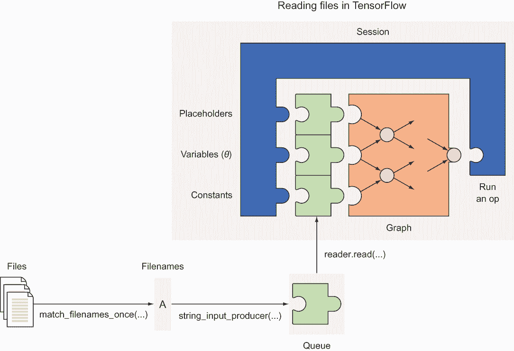
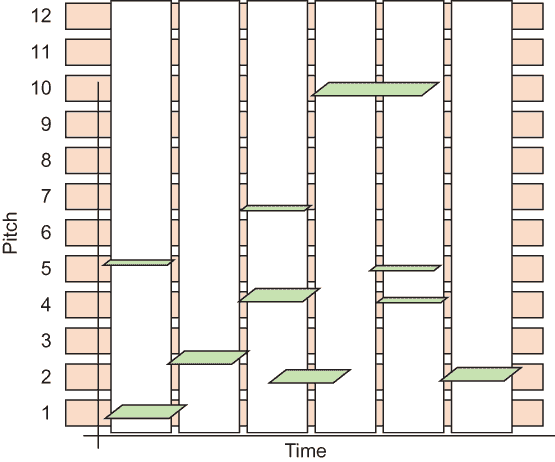
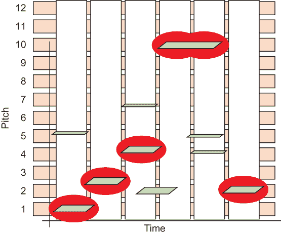
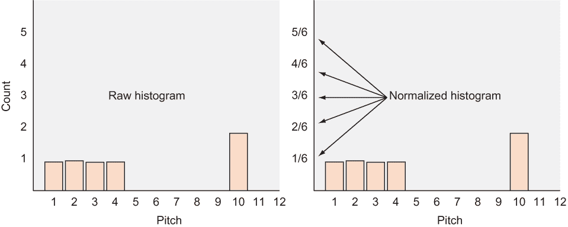
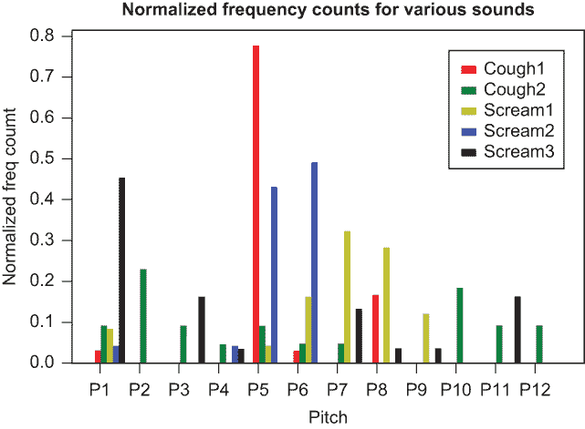
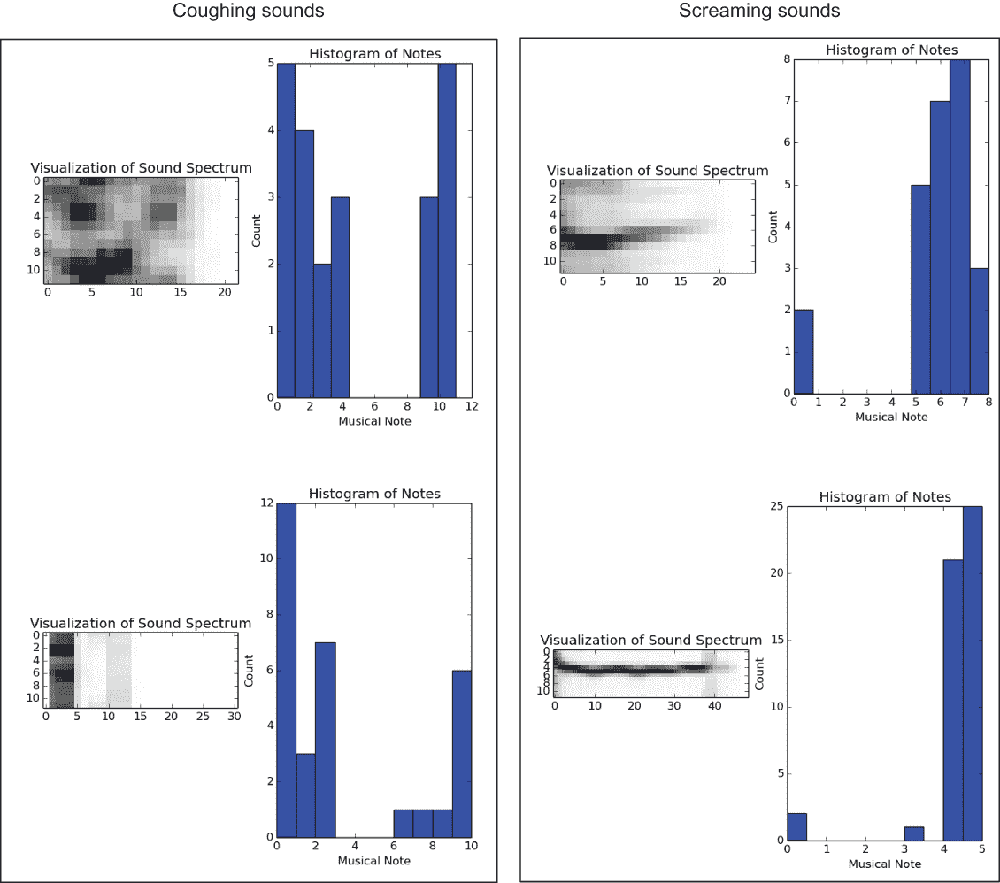
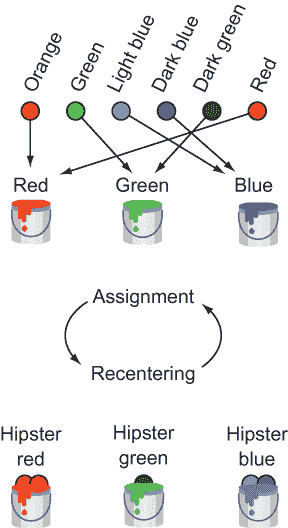
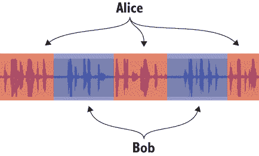
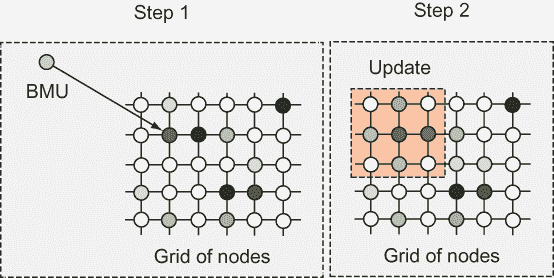
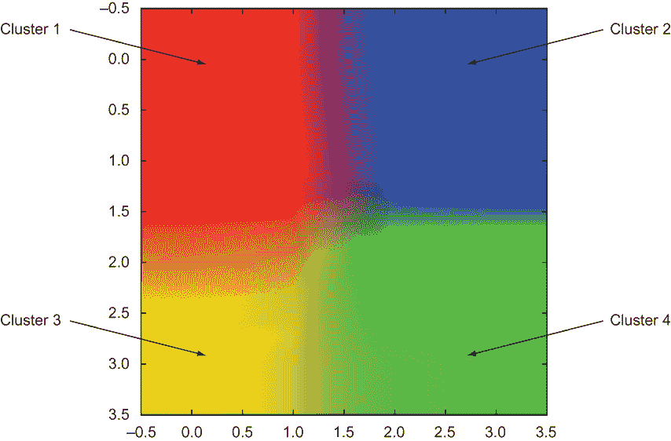

# 7 自动聚类数据

本章涵盖

+   使用 k-means 进行基本聚类

+   音频表示

+   音频分割

+   使用自组织图进行聚类

假设你在硬盘上有一个完全合法、非盗版的 MP3 音乐集合。所有歌曲都挤在一个巨大的文件夹中。也许自动将相似的歌曲分组到如乡村、说唱和摇滚等类别中，可以帮助组织它们。这种以无监督方式将项目分配到组（如 MP3 到播放列表）的行为被称为*聚类*。

第六章假设你有一个正确标记的训练数据集。不幸的是，当你收集现实世界中的数据时，你并不总是享有这种便利。假设你想要将大量音乐分割成有趣的播放列表。如果你无法直接访问它们的元数据，你如何可能将歌曲分组？

Spotify、SoundCloud、Google Music、Pandora 以及许多其他音乐流媒体服务试图解决这个问题，向客户推荐相似的歌曲。他们的方法包括各种机器学习技术的混合，但聚类通常是解决方案的核心。

*聚类*是将你的数据集中的项目智能分类的过程。总体思路是，同一聚类中的两个项目比属于不同聚类的项目“更接近”。这是一般定义，将*接近*的解释留给了读者。也许当以生物分类体系（家族、属和物种）中两种物种的相似性来衡量接近度时，猎豹和豹属于同一聚类，而大象属于另一个聚类。

你可以想象存在许多聚类算法。本章重点介绍两种类型：*k-means*和*自组织图*。这些方法是无监督的，意味着它们在没有地面实况示例的情况下拟合模型。

首先，你将学习如何将音频文件加载到 TensorFlow 中，并将它们表示为特征向量。然后，你将实现各种聚类技术来解决实际问题。

## 7.1 在 TensorFlow 中遍历文件

机器学习算法中的一些常见输入类型是音频和图像文件。这并不令人惊讶，因为录音和照片是语义概念的原始、冗余、通常嘈杂的表示。机器学习是一种帮助处理这些复杂性的工具。

这些数据文件有多种实现方式。例如，一张图片可以编码为 PNG 或 JPEG 文件，而音频文件可以是 MP3 或 WAV 格式。在本章中，你将研究如何将音频文件作为聚类算法的输入，以便自动将听起来相似的音乐分组。

练习 7.1

MP3 和 WAV 的优点和缺点是什么？PNG 与 JPEG 又如何？

**答案**

MP3 和 JPEG 显著压缩了数据，因此此类文件易于存储或传输。但因为这些文件是有损的，WAV 和 PNG 更接近原始内容。

从磁盘读取文件并不完全是机器学习特有的能力。你可以使用各种 Python 库，如 NumPy 或 SciPy，将文件加载到内存中，正如我在前面的章节中向你展示的那样。一些开发者喜欢将数据预处理步骤与机器学习步骤分开处理。管理管道没有绝对的对错之分，但你会尝试使用 TensorFlow 进行数据预处理和学习。

TensorFlow 提供了一个名为 `tf.train.match_filenames_once` 的操作符，用于列出目录中的文件。你可以将此信息传递给队列操作符 `tf.train.string_input_producer`。这样，你可以一次访问一个文件名，而不必同时加载所有内容。给定一个文件名，你可以解码文件以检索可用的数据。图 7.1 概述了使用队列的过程。



图 7.1 你可以使用 TensorFlow 中的队列来读取文件。队列是 TensorFlow 框架的一部分，你可以使用 `reader.read(...)` 函数来访问（并出队）它。

列表 7.1 展示了在 TensorFlow 中从磁盘读取文件的实现。

列表 7.1 遍历目录以获取数据

```
import tensorflow as tf

filenames = tf.train.match_filenames_once('./audio_dataset/*.wav')   ❶
count_num_files = tf.size(filenames)                                 ❷
filename_queue = tf.train.string_input_producer(filenames)         
reader = tf.WholeFileReader()                                        ❸
filename, file_contents = reader.read(filename_queue)   

with tf.Session() as sess:                                           ❹
    sess.run(tf.local_variables_initializer()) 
    num_files = sess.run(count_num_files)                            ❺

    coord = tf.train.Coordinator()                                   ❻
    threads = tf.train.start_queue_runners(coord=coord)              ❻

    for i in range(num_files):                                       ❼
        audio_file = sess.run(filename)                              ❼
        print(audio_file)                                            ❼
```

❶ 存储匹配模式的文件名

❷ 运行读取器以提取文件数据

❸ 在 TensorFlow 中原生读取文件

❹ 设置用于随机检索文件名的管道

❺ 计算文件数量

❻ 初始化文件名队列的线程

❼ 逐个遍历数据

## 7.2 从音频中提取特征

机器学习算法通常设计为使用特征向量作为输入，但声音文件使用不同的格式。你需要一种从声音文件中提取特征以创建特征向量的方法。

这有助于理解这些文件是如何表示的。如果你曾经见过黑胶唱片，你可能已经注意到音频在磁盘上以凹槽的形式表示。我们的耳朵通过空气中的振动来解释音频。通过记录振动特性，算法可以将声音存储在数据格式中。

真实世界是连续的，但计算机以离散值存储数据。声音通过模拟-数字转换器（ADC）数字化为离散表示。你可以将声音视为随时间波动的波动，但那些数据太嘈杂且难以理解。

表示波的另一种等效方式是检查每个时间间隔的频率。这种观点称为 *频域*。通过使用称为 *离散傅里叶变换* 的数学运算（通常通过称为 *快速傅里叶变换* 的算法实现），很容易在时域和频域之间进行转换（你将使用它从声音中提取特征向量）。

一个方便的 Python 库可以帮助你在频域中查看音频。从 [`mng.bz/X0J6`](http://mng.bz/X0J6) 下载它，解压，然后运行以下命令来设置它：

```
$ python setup.py install
```

需要 Python 2

Bregman Toolkit 在 Python 2 中官方支持。如果你使用 Jupyter Notebooks，你可以按照官方 Jupyter 文档中的说明（[`mng.bz/ebvw`](http://mng.bz/ebvw)）访问两个版本的 Python。

尤其是你可以使用以下命令包含 Python 2：

```
$ python2 -m pip install ipykernel
$ python2 -m -ipykernel install —user
```

一个声音可以产生 12 种音高。在音乐术语中，这 12 种音高是 C、C#、D、D#、E、F、F#、G、G#、A、A# 和 B。列表 7.2 展示了如何检索 0.1 秒间隔内每个音高的贡献，从而得到一个有 12 行的矩阵。列数随着音频文件长度的增加而增加。具体来说，对于 t 秒的音频，将有 10 × *t* 列。这个矩阵也称为音频的 *chromagram*。

列表 7.2 在 Python 中表示音频

```
from bregman.suite import *

def get_chromagram(audio_file):                                    ❶
    F = Chromagram(audio_file, nfft=16384, wfft=8192, nhop=2205)   ❷
    return F.X                                                     ❸
```

❶ 传入文件名

❷ 每 0.1 秒使用这些参数描述 12 个音阶

❸ 每秒 10 次表示一个 12 维向量的值

谱图输出是一个矩阵，如图 7.2 所示。音频片段可以读作谱图，谱图是生成音频片段的配方。现在你有了在音频和矩阵之间转换的方法。正如你所学的，大多数机器学习算法接受特征向量作为有效的数据形式。因此，你将要查看的第一个机器学习算法是 k-means 聚类。



图 7.2 谱图矩阵，其中 x 轴代表时间，y 轴代表音阶类别。绿色平行四边形表示在该时间存在该音阶。

要在您的 chromagram 上运行机器学习算法，首先您需要决定您将如何表示特征向量。一个想法是通过只查看每个时间间隔中最显著的音阶类来简化音频，如图 7.3 所示。



图 7.3 在每个时间间隔中突出的最有影响力的音高。你可以将其视为每个时间间隔中最响亮的音高。

然后你计算每个音高在音频文件中出现的次数。图 7.4 将这些数据作为直方图显示，形成一个 12 维向量。如果你将向量归一化，使得所有计数之和为 1，你可以轻松比较不同长度的音频。注意这种方法与你在第六章中使用的“词袋”方法类似，用于从任意长度的文本中生成词计数的直方图。



图 7.4 你计算在每个时间间隔内听到的最响亮音高的频率，以生成这个直方图，它作为你的特征向量。

练习 7.2

有哪些其他方法可以将音频片段表示为特征向量？

**答案**

你可以将音频剪辑可视化为图像（例如频谱图），并使用图像分析技术提取图像特征。

查看列表 7.3 以从图 7.4 生成直方图，这是你的特征向量。

列表 7.3 获取 k-means 的数据集

```
import tensorflow as tf
import numpy as np
from bregman.suite import *

filenames = tf.train.match_filenames_once('./audio_dataset/*.wav')
count_num_files = tf.size(filenames)
filename_queue = tf.train.string_input_producer(filenames)
reader = tf.WholeFileReader()
filename, file_contents = reader.read(filename_queue)

chroma = tf.placeholder(tf.float32)                                   ❶
max_freqs = tf.argmax(chroma, 0)                                      ❶

def get_next_chromagram(sess):
    audio_file = sess.run(filename)
    F = Chromagram(audio_file, nfft=16384, wfft=8192, nhop=2205)
    return F.X

def extract_feature_vector(sess, chroma_data):                        ❷
    num_features, num_samples = np.shape(chroma_data)
    freq_vals = sess.run(max_freqs, feed_dict={chroma: chroma_data})
    hist, bins = np.histogram(freq_vals, bins=range(num_features + 1))
    return hist.astype(float) / num_samples

def get_dataset(sess):                                                ❸
    num_files = sess.run(count_num_files)
    coord = tf.train.Coordinator()
    threads = tf.train.start_queue_runners(coord=coord)
    xs = []
    for _ in range(num_files):
        chroma_data = get_next_chromagram(sess)
        x = [extract_feature_vector(sess, chroma_data)]
        x = np.matrix(x)
        if len(xs) == 0:
            xs = x
        else:
            xs = np.vstack((xs, x))
    return xs
```

❶ 创建一个操作来识别贡献最大的音调

❷ 将音程图转换为特征向量

❸ 构建一个矩阵，其中每一行是一个数据项

注意：所有代码列表均可在本书的网站上找到，网址为 [`mng.bz/yrEq`](http://mng.bz/yrEq)，以及 GitHub 上 [`mng.bz/MoJn`](http://mng.bz/MoJn)。

按照我在其他章节中向您展示的内容，在准备您的数据集后，说服自己，列表 7.1 帮助您从磁盘读取并从列表 7.3 生成数据集的音程图中存在某种相关性。数据集由五个声音组成，对应两种不同的咳嗽声和三种不同的尖叫声。您可以使用您友好的 Matplotlib 库来可视化数据并检查列表 7.4 中的可学习性（底层数据的独特属性）。如果您能在声音文件中找到某种相关性，那么机器学习算法也有很大机会能找到。

你将为列表 7.4 中的 12 个音调创建一组标签 P1-P12。然后，因为你已经将数据转换为列表 7.3 中的五个 1 × 12 大小的矩阵，你将把这些矩阵展平成 12 个数据点，以便为每个五个音程图可视化。列表 7.4 的结果如图 7.5 所示。



图 7.5 探索五个声音——两个咳嗽声和三个尖叫声——及其在 12 个音调上的关系。如果你的眼睛能发现模式，那么计算机也有很大机会能发现。

列表 7.4 探索你的声音文件音程图

```
labels=[]
for i in np.arange(12):
    labels.append("P"+str(i+1))                                               ❶

fig, ax = plt.subplots()
ind = np.arange(len(labels))
width = 0.15 
colors = ['r', 'g', 'y', 'b', 'black']                                        ❷
plots = []

for i in range(X.shape[0]):
    Xs = np.asarray(X[i]).reshape(-1)                                         ❸
    p = ax.bar(ind + i*width, Xs, width, color=colors[i])
    plots.append(p[0])

xticks = ind + width / (X.shape[0])
print(xticks)
ax.legend(tuple(plots), ('Cough1', 'Cough2', 'Scream1', 'Scream2', 'Scream3'))❹
ax.yaxis.set_units(inch)
ax.autoscale_view()
ax.set_xticks(xticks)
ax.set_xticklabels(labels)

ax.set_ylabel('Normalized freq coumt')
ax.set_xlabel('Pitch')
ax.set_title('Normalized frequency counts for Various Sounds')
plt.show()
```

❶ 为每个 12 个音调频率生成标签。

❷ 为五个声音中的每一个选择不同的颜色。

❸ 将 1 × 12 矩阵展平成 12 个点，每个音调一个。

❹ 为五个声音创建一个图例：两个咳嗽声和三个尖叫声。

通过视觉探索图 7.5 来说服自己，这些声音之间存在音调相似性。咳嗽声的垂直条与音调 P1 和 P5 有关联，而尖叫声与音调 P5、P6 和 P7 的垂直条有很强的关联。其他不太明显的相似性是咳嗽声和尖叫声在 P5 和 P6 之间的关系。你会发现，如果你一次可视化一个声音，比如图 7.6，那么看到这些相关性有时会更容易，但这个例子是一个很好的开始。这里肯定有可以学习的东西，所以让我们看看计算机能告诉我们关于如何聚类这些文件的信息。

## 7.3 使用 k-means 聚类

**k-means 算法**是数据聚类中最古老且最稳健的方法之一。在**k-means**中的**k**代表一个自然数变量，因此你可以想象 3-means 聚类、4-means 聚类或任何其他**k**的值。因此，k-means 聚类的第一步是选择一个**k**的值。具体来说，让我们选择**k** = 3。考虑到这一点，3-means 聚类的目标是把数据集划分为三个类别（也称为**簇**）。

选择簇的数量

选择合适的簇数量通常取决于任务。假设你正在为数百人举办活动，既有年轻人也有老年人。如果你只有两个娱乐选项的预算，你可以使用 k-means 聚类，**k** = 2，将客人分成两个年龄组。在其他时候，确定**k**的值可能并不明显。自动确定**k**的值要复杂一些，所以在这个部分我们不会过多涉及。简单来说，确定最佳**k**值的一种直接方法是迭代一系列 k-means 模拟，并应用一个成本函数来确定哪个**k**值在最低**k**值时产生了最佳的簇间差异。

k-means 算法将数据点视为空间中的点。如果你的数据集是活动的客人集合，你可以通过他们的年龄来表示每个客人。因此，你的数据集是一组特征向量。在这种情况下，每个特征向量是 1 维的，因为你只考虑人的年龄。

对于通过音频数据进行音乐聚类，数据点是音频文件的特征向量。如果两个点彼此靠近，它们的音频特征相似。你希望发现哪些音频文件属于同一个“邻域”，因为这些簇可能是组织你的音乐文件的好方法。

一个簇中所有点的中点称为其**质心**。根据你选择的音频特征，质心可以捕捉到诸如响亮的声音、高音调的声音或类似萨克斯管的声音等概念。需要注意的是，k-means 算法分配了非描述性的标签，如簇 1、簇 2 和簇 3。图 7.6 展示了声音数据的示例。



图 7.6 展示了四个音频文件的示例。右侧的两个似乎具有相似的直方图，左侧的两个也具有相似的直方图。你的聚类算法将能够将这些声音分组。

k-means 算法通过选择与它最近的质心的簇来将特征向量分配给一个簇。k-means 算法首先猜测簇的位置，并随着时间的推移迭代地改进其猜测。算法要么在不再改进猜测时收敛，要么在尝试达到最大次数后停止。

算法的核心包括两个任务：

+   *任务* —将每个数据项（特征向量）分配到最近的质心类别。

+   *重新定位* —计算新更新的簇的中间点。

这两个步骤重复进行，以提供越来越好的聚类结果，算法在重复了期望的次数或分配不再改变时停止。图 7.7 说明了该算法。



图 7.7 k-means 算法的一次迭代。假设你正在将颜色聚类到三个桶（一种非正式地说成是类别的说法）。你可以从猜测红色、绿色和蓝色开始，以开始分配步骤。然后通过平均每个桶属于的颜色来更新桶的颜色。重复直到桶的颜色不再显著变化，达到每个簇的质心所代表的颜色。

列表 7.5 展示了如何通过使用列表 7.3 生成的数据集来实现 k-means 算法。为了简单起见，选择*k* = 2，这样你可以轻松验证你的算法将音频文件分割成两个不同的类别。你将使用前*k*个向量作为质心的初始猜测。

列表 7.5 实现 k-means

```
k = 2                                                      ❶
max_iterations = 100                                       ❷

def initial_cluster_centroids(X, k):                       ❸
    return X[0:k, :]

def assign_cluster(X, centroids):                          ❹
    expanded_vectors = tf.expand_dims(X, 0)
    expanded_centroids = tf.expand_dims(centroids, 1)
    distances = tf.reduce_sum(tf.square(tf.subtract(expanded_vectors, expanded_centroids)), 2)
    mins = tf.argmin(distances, 0)
    return mins

def recompute_centroids(X, Y):                             ❺
    sums = tf.unsorted_segment_sum(X, Y, k)
    counts = tf.unsorted_segment_sum(tf.ones_like(X), Y, k)
    return sums / counts

with tf.Session() as sess:
    sess.run(tf.global_variables_initializer())
    X = get_dataset(sess)
    centroids = initial_cluster_centroids(X, k)
    i, converged = 0, False
    while not converged and i < max_iterations:           ❻
        i += 1
        Y = assign_cluster(X, centroids)
        centroids = sess.run(recompute_centroids(X, Y))
    print(centroids)
```

❶ 决定簇的数量

❷ 声明运行 k-means 的最大迭代次数

❸ 选择簇质心的初始猜测

❹ 将每个数据项分配到最近的簇

❺ 更新簇质心到它们的中间点

❻ 迭代以找到最佳的簇位置

就这些了！如果你知道簇的数量和特征向量表示，你可以使用 7.5 列表来聚类任何东西。在 7.4 节中，你将应用聚类到音频文件内的音频片段。

## 7.4 分割音频

在 7.3 节中，您将各种音频文件进行了聚类以自动分组。本节是关于在一个音频文件内使用聚类算法。前一个过程被称为*聚类*，而后一个过程被称为*分割*。*分割*是*聚类*的另一种说法，但当我们把单个图像或音频文件分割成单独的组件时，我们通常说*分割*而不是*聚类*。分割与将句子分割成单词的方式不同，与将单词分割成字母的方式不同。尽管分割和聚类共享将更大的块分割成更小块的一般思想，但单词与字母是不同的。

假设你有一个长的音频文件，可能是播客或脱口秀。想象一下编写一个机器学习算法来识别音频访谈中哪两个人在说话。分割音频文件的目标是将音频剪辑的哪些部分关联到同一类别。在这种情况下，你将为每个人有一个类别，每个人的话语应该收敛到他们适当的类别，如图 7.8 所示。



图 7.8 音频分割是自动标记段的过程。

打开一个新的源文件，并按照列表 7.6 进行操作，这将通过组织音频数据以进行分割来开始。该代码将音频文件分割成大小为`segment_size`的多个段。一个长的音频文件可能包含数百甚至数千个段。

列表 7.6 为分割组织数据

```
import tensorflow as tf
import numpy as np
from bregman.suite import *

k = 2                                               ❶
segment_size = 50                                   ❷
max_iterations = 100                                ❸

chroma = tf.placeholder(tf.float32)
max_freqs = tf.argmax(chroma, 0)

def get_chromagram(audio_file):
    F = Chromagram(audio_file, nfft=16384, wfft=8192, nhop=2205)
    return F.X

def get_dataset(sess, audio_file):                  ❹
    chroma_data = get_chromagram(audio_file)
    print('chroma_data', np.shape(chroma_data))
    chroma_length = np.shape(chroma_data)[1]
    xs = []
    for i in range(chroma_length / segment_size):
        chroma_segment = chroma_data[:, i*segment_size:(i+1)*segment_size]
        x = extract_feature_vector(sess, chroma_segment)
        if len(xs) == 0:
            xs = x
        else:
            xs = np.vstack((xs, x))
    return xs
```

❶ 决定簇的数量

❷ 段落大小越小，结果越好（但性能越慢）。

❸ 决定何时停止迭代

❹ 通过提取音频片段作为单独的数据项来获取数据集

现在运行 k-means 聚类算法于这个数据集，以确定何时段相似。目的是让 k-means 将听起来相似的段归类为相同的标签。如果两个人的声音听起来显著不同，他们的声音片段将属于不同的标签。列表 7.7 说明了如何将分割应用于音频剪辑。

列表 7.7 分割音频剪辑

```
with tf.Session() as sess:
    X = get_dataset(sess, 'TalkingMachinesPodcast.wav')
    print(np.shape(X))
    centroids = initial_cluster_centroids(X, k)
    i, converged = 0, False
    while not converged and i < max_iterations:         ❶
        i += 1
        Y = assign_cluster(X, centroids)
        centroids = sess.run(recompute_centroids(X, Y))
        if i % 50 == 0:
            print('iteration', i)
    segments = sess.run(Y)
    for i in range(len(segments)):                      ❷
        seconds = (i * segment_size) / float(10)
        min, sec = divmod(seconds, 60)
        time_str = '{}m {}s'.format(min, sec)
        print(time_str, segments[i])
```

❶ 运行 k-means 算法

❷ 打印每个时间间隔的标签

运行列表 7.7 的输出是一个时间戳和簇 ID 的列表，对应于播客中谁在说话：

```
('0.0m 0.0s', 0)
('0.0m 2.5s', 1)
('0.0m 5.0s', 0)
('0.0m 7.5s', 1)
('0.0m 10.0s', 1)
('0.0m 12.5s', 1)
('0.0m 15.0s', 1)
('0.0m 17.5s', 0)
('0.0m 20.0s', 1)
('0.0m 22.5s', 1)
('0.0m 25.0s', 0)
('0.0m 27.5s', 0)
```

练习 7.3

你如何检测聚类算法是否收敛（以便你可以提前停止算法）？

**答案**

一种方法是通过监控簇中心的变化，并在不再需要更新时宣布收敛（例如，当迭代之间误差大小的差异没有显著变化时）。为此，你需要计算误差的大小并决定什么构成了显著变化。

## 7.5 使用自组织映射进行聚类

*自组织映射*（SOM）是一种将数据表示为低维空间中的模型。在这个过程中，SOM 会自动将相似的数据项移动得更近。假设你正在为一大群人点披萨。你不想为每个人点同一种类型的披萨，因为可能有人喜欢加有凤梨、蘑菇和辣椒的奢华披萨，而你可能更喜欢加有金枪鱼、芝麻菜和洋葱的披萨。

每个人的配料偏好可以用一个 3D 向量表示。SOM 让你将这些 3D 向量嵌入到二维空间中（只要你定义披萨之间的距离度量）。然后 2D 图的可视化揭示了簇数量的良好候选者。

虽然可能比 k-means 算法收敛得慢，但 SOM 方法对簇的数量没有假设。在现实世界中，很难选择簇的数量。考虑一个随着时间的推移簇会改变的聚会，如图 7.9 所示。


图 7.9 在现实世界中，我们经常看到人群在簇中聚集。应用 k-means 需要事先知道簇的数量。一个更灵活的工具是 SOM，它对簇的数量没有先入为主的观念。

SOM 仅将数据重新解释为有利于聚类的结构。算法工作原理如下：

1.  设计一个节点网格。每个节点持有与数据项相同维度的权重向量。每个节点的权重初始化为随机数，通常是标准正态分布。

1.  逐个向网络展示数据项。对于每个数据项，网络都会识别出权重向量与其最接近的节点。这个节点被称为 *最佳匹配单元* (BMU)。

在网络识别出 BMU 后，所有 BMU 的邻居都会更新，以便它们的权重向量更接近 BMU 的值。距离 BMU 更近的节点受到的影响比距离更远的节点更强。此外，BMU 周围邻居的数量会随着时间的推移以通常通过试错确定的速率减少。图 7.10 阐述了该算法。



图 7.10 SOM 算法的一次迭代。第一步是识别 BMU，第二步是更新相邻节点。您会继续使用训练数据迭代这两个步骤，直到达到某些收敛标准。

列表 7.8 展示了如何在 TensorFlow 中开始实现 SOM。通过打开一个新的源文件来跟随操作。

列表 7.8 设置 SOM 算法

```
import tensorflow as tf
import numpy as np

class SOM:
    def __init__(self, width, height, dim):
        self.num_iters = 100
        self.width = width
        self.height = height
        self.dim = dim
        self.node_locs = self.get_locs()

        nodes = tf.Variable(tf.random_normal([width*height, dim]))       ❶
        self.nodes = nodes

        x = tf.placeholder(tf.float32, [dim])                            ❷
        iter = tf.placeholder(tf.float32)                                ❷

        self.x = x                                                       ❸
        self.iter = iter                                                 ❸

        bmu_loc = self.get_bmu_loc(x)                                    ❹

        self.propagate_nodes = self.get_propagation(bmu_loc, x, iter)    ❺
```

❶ 每个节点是一个维度为 dim 的向量。对于 2D 网格，有 width × height 个节点；get_locs 在列表 7.11 中定义。

❷ 这两个操作在每个迭代中都是输入。

❸ 您需要从另一个方法中访问它们。

❹ 找到与输入最接近的节点（在列表 7.10 中）

❺ 更新邻居的值（在列表 7.9 中）

在列表 7.9 中，您定义了如何根据当前时间间隔和 BMU 位置更新相邻权重。随着时间的推移，BMU 的相邻权重受到的影响逐渐减小。这样，权重就会随着时间的推移逐渐稳定。

列表 7.9 定义如何更新邻居的值

```
    def get_propagation(self, bmu_loc, x, iter):
        num_nodes = self.width * self.height
        rate = 1.0 - tf.div(iter, self.num_iters)                          ❶
        alpha = rate * 0.5
        sigma = rate * tf.to_float(tf.maximum(self.width, self.height)) / 2.
        expanded_bmu_loc = tf.expand_dims(tf.to_float(bmu_loc), 0)         ❷
        sqr_dists_from_bmu = tf.reduce_sum(
          tf.square(tf.subtract(expanded_bmu_loc, self.node_locs)), 1)
        neigh_factor =                                                     ❸
          tf.exp(-tf.div(sqr_dists_from_bmu, 2 * tf.square(sigma)))
        rate = tf.multiply(alpha, neigh_factor)
        rate_factor = 
          tf.stack([tf.tile(tf.slice(rate, [i], [1]), 
                  [self.dim]) for i in range(num_nodes)])
        nodes_diff = tf.multiply(
          rate_factor, 
          tf.subtract(tf.stack([x for i in range(num_nodes)]), self.nodes))
        update_nodes = tf.add(self.nodes, nodes_diff)                      ❹
        return tf.assign(self.nodes, update_nodes)                         ❺
```

❶ 随着迭代的增加，该速率降低。此值影响 alpha 和 sigma 参数。

❷ 扩展 bmu_loc 以便您能够高效地将其成对地与 node_locs 中的每个元素进行比较

❸ 确保靠近 BMU 的节点变化更为显著

❹ 定义更新操作

❺ 返回一个操作以执行更新

列表 7.10 展示了如何根据输入数据项找到 BMU 位置。它搜索节点网格以找到最接近匹配的节点。这一步骤类似于 k-means 聚类中的分配步骤，其中网格中的每个节点都是一个潜在的聚类质心。

列表 7.10 获取最接近匹配的节点位置

```
    def get_bmu_loc(self, x):
        expanded_x = tf.expand_dims(x, 0)
        sqr_diff = tf.square(tf.subtract(expanded_x, self.nodes))
        dists = tf.reduce_sum(sqr_diff, 1)
        bmu_idx = tf.argmin(dists, 0)
        bmu_loc = tf.stack([tf.mod(bmu_idx, self.width), tf.div(bmu_idx,
        å self.width)])
        return bmu_loc
```

在列表 7.11 中，您创建了一个辅助方法来生成网格中所有节点的 (x, y) 位置列表。

列表 7.11 生成点矩阵

```
    def get_locs(self):
        locs = [[x, y]
                 for y in range(self.height)
                 for x in range(self.width)]
        return tf.to_float(locs)
```

最后，让我们定义一个名为 `train` 的方法来运行算法，如列表 7.12 所示。首先，你必须设置会话并运行 `global_variables_initializer` 操作。接下来，你循环 `num_iters` 次数来使用输入数据逐个更新权重。当循环结束时，你记录最终的节点权重及其位置。

列表 7.12 运行 SOM 算法

```
    def train(self, data):
        with tf.Session() as sess:
            sess.run(tf.global_variables_initializer())
            for i in range(self.num_iters):
                for data_x in data:
                    sess.run(self.propagate_nodes, feed_dict={self.x: data_x,
                    å self.iter: i})
            centroid_grid = [[] for i in range(self.width)]
            self.nodes_val = list(sess.run(self.nodes))
            self.locs_val = list(sess.run(self.node_locs))
            for i, l in enumerate(self.locs_val):
                centroid_grid[int(l[0])].append(self.nodes_val[i])
            self.centroid_grid = centroid_grid
```

就这样！现在让我们看看算法的实际应用。通过向 SOM 展示一些输入来测试实现。在列表 7.13 中，输入是一个 3D 特征向量的列表。通过训练 SOM，你将在数据中发现簇。你将使用一个 4 × 4 的网格，但最好尝试不同的值以进行交叉验证以找到最佳网格大小。图 7.11 显示了代码的输出。



图 7.11 SOM 将所有 3D 数据点放置在二维网格中。从图中，你可以选择簇中心（自动或手动）并在直观的低维空间中实现聚类。

列表 7.13 测试实现并可视化结果

```
from matplotlib import pyplot as plt
import numpy as np
from som import SOM

colors = np.array(
     [[0., 0., 1.],
      [0., 0., 0.95],
      [0., 0.05, 1.],
      [0., 1., 0.],
      [0., 0.95, 0.],
      [0., 1, 0.05],
      [1., 0., 0.],
      [1., 0.05, 0.],
      [1., 0., 0.05],
      [1., 1., 0.]])

som = SOM(4, 4, 3)        ❶
som.train(colors)

plt.imshow(som.centroid_grid)
plt.show()
```

❶ 网格大小为 4 × 4，输入维度为 3。

自组织映射（SOM）将高维数据嵌入到二维空间中，以便于聚类。这个过程充当了一个方便的预处理步骤。你可以通过观察 SOM 的输出手动指示簇中心，但也可以通过观察权重的梯度自动找到好的中心候选者。如果你喜欢冒险，我建议阅读 Juha Vesanto 和 Esa Alhoniemi 撰写的著名论文“自组织映射的聚类”，链接为[`mng.bz/XzyS`](http://mng.bz/XzyS)。

## 7.6 应用聚类

你已经看到了两个聚类的实际应用：组织音乐和分割音频片段以标记相似的声音。当训练数据集不包含相应的标签时，聚类特别有帮助。正如你所知，这种情况代表了无监督学习。有时，数据不便进行标注。

假设你想了解来自手机或智能手表加速度计的传感器数据。在每个时间步，加速度计提供一个 3D 向量，但你不知道人类是在行走、站立、坐着、跳舞、慢跑还是其他活动。你可以在[`mng.bz/rTMe`](http://mng.bz/rTMe)获得这样的数据集。

要对时间序列数据进行聚类，你需要将加速度计向量的列表总结成一个简洁的特征向量。一种方法是通过生成加速度连续幅度的差异直方图。加速度的导数称为 *jerk*，你可以应用相同的操作来获得描述 jerk 幅度差异的直方图。

从数据生成直方图的过程与本章中解释的音频数据预处理步骤非常相似。在你将直方图转换为特征向量之后，你可以使用本章中的代码列表（例如 TensorFlow 中的 k-means）。

注意：虽然前几章讨论了监督学习，但本章重点介绍无监督学习。在第九章中，您将看到一个既不属于监督学习也不属于无监督学习的机器学习算法。这个算法是一个建模框架，虽然程序员对其关注不多，但它是统计学家揭示数据中隐藏因素的必备工具。

## 摘要

+   聚类是一种用于在数据中寻找结构的无监督机器学习算法。

+   其中最容易实现和理解的算法之一是 k-means 聚类，它在速度和准确性方面也表现良好。

+   如果没有指定聚类数量，您可以使用 SOM 算法以简化的视角查看数据。
