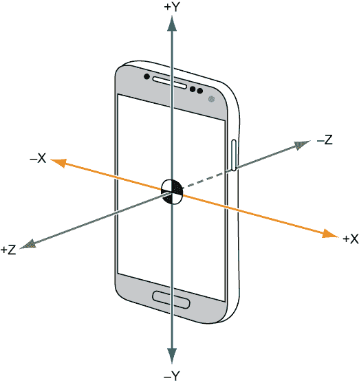
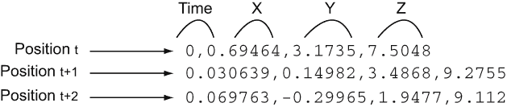
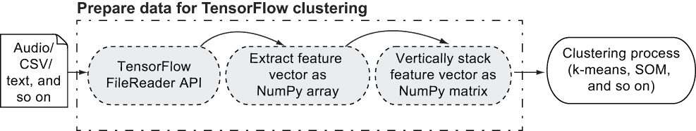
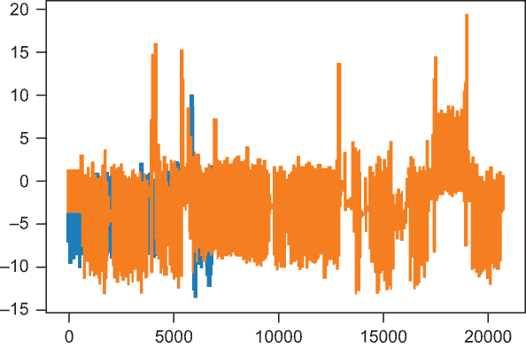
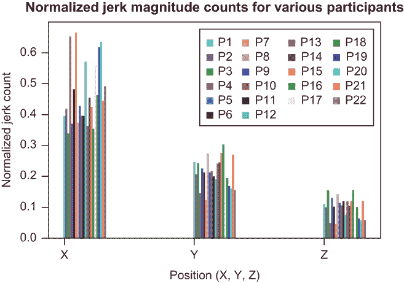
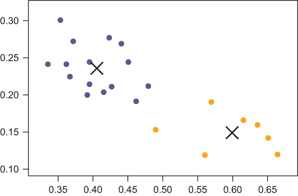
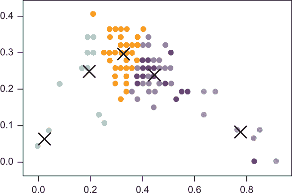

# 从安卓加速度计数据中推断用户活动

本章涵盖

+   在三维空间以及时间维度上可视化您的手机位置数据

+   对安卓手机用户进行探索性数据分析并识别模式

+   使用聚类自动将安卓手机用户根据其位置数据进行分组

+   可视化 K-means 聚类

现在，我们几乎无法与一个小巧、轻薄、通常为黑色的设备分开，这个设备将我们彼此以及与世界连接起来：我们的移动电话。这些设备是计算奇迹，微型芯片，拥有强大的微处理器，比十年前的台式计算机更加强大。再加上对 Wi-Fi 网络的广泛连接，以及允许与边缘设备进行窄带和近距离安全连接的蓝牙。不久，Wi-Fi 5G 和蓝牙 6 将使这些连接扩展到地理上分散的网络，到千兆字节的数据，以及构成物联网的数百万个互联设备。

这些强大的手机还附带了各种传感器，包括摄像头、温度传感器、光敏屏幕，以及在本章之前可能对您来说不太为人所知的：加速度计。*加速度计*可以检测和监控滚动机器的振动，并可用于在三维空间中随时间获取位置数据，这是四维数据。所有手机都配备了这些传感器，它们以下列形式提供位置数据：

(*X, Y, Z, t* )

当您行走、交谈、爬楼梯和开车时，加速度计会在手机的内存中收集和记录这些数据，通常是一个具有数百 GB 信息的大容量固态设备，很快将变成千兆字节(TB)。这些数据——您在执行各种活动（如行走、交谈和爬楼梯）时的时空位置——被记录下来，可以根据您在时空中的位置以无监督的方式推断这些活动。您可以想象手机捕获的位置数据如图 8.1 所示。一个人在平面上沿正负 X、Z 方向移动，而垂直位置由 Y 轴捕获。



图 8.1 在真实世界中，您的手机捕获的(X, Y, Z)位置数据看起来是怎样的。一个人在空间中沿着 x 轴或 z 轴正负移动，当这个人跳跃或弯腰时，y 轴上发生移动。

正如我在第七章中讨论的那样，机器学习不需要标签来做出预测。你可以通过应用无监督方法，如 k-means 聚类和自组织映射（SOM）到自然适合一起的数据点来做很多事情。就像你的孩子们把蓝光光盘扔得到处都是，在你家里到处都是（等等——这不会发生在你身上？），需要组织和仔细放置回你的媒体架子里一样，你为了组织目的而聚类的物品是有自然顺序的。对于这些蓝光光盘，顺序可能是按类型或演员来分类。

但是你如何在手机上对位置数据进行分类或组织呢？这些数据很可能具有自然组织性；请自己确信这一点。当你跑步、跳跃或驾驶时，所有位置数据很可能符合某种趋势或模式。也许从点 ti 到点 ti+1 的差异涉及速度或加速度的急剧变化。速度和加速度是位置（X，Y，Z）相对于时间（t）的 8.1 图中的第一和第二导数。许多研究人员发现，冲量——位置相对于时间的第三导数——代表了作用于物体上的力的变化率。这个冲量最终被证明是你转换活动时运动趋势和变化的适当趋势，正如你的位置数据所捕捉的那样。冲量的幅度差异为无监督地聚类基于时间的位置数据提供了很好的分类；这些聚类代表你的运动活动，如跑步、攀爬和行走。

在本章中，你将基于你已经学到的 k-means 和 SOM 技术，并将它们应用于实际的位置数据。这些数据来自加州大学欧文分校（UCI）的机器学习库，这是一个开放数据集的大杂烩，你可以应用机器学习技术来生成有用的见解。用户活动从行走数据集正是你可以应用 TensorFlow 和无监督聚类技术的数据类型。让我们开始吧！

## 8.1 用户活动从行走数据集

用户活动从行走数据集包含 22 名参与者和他们相关的基于 Android 的位置数据。数据是在 2014 年 3 月捐赠的，并且已经被访问超过 69,000 次。当参与者的 Android 手机放在胸前的口袋中时，加速度计收集了（X，Y，Z，t）位置和时间数据。参与者沿着预定义的路径在野外行走并执行各种活动。这些数据可以用于无监督地推断活动类型。这个数据集在机器学习领域是一个常用的基准，因为它为通过使用运动模式识别和验证人员提供了挑战。

你可以从[`mng.bz/aw5B`](https://shortener.manning.com/aw5B)下载数据集。数据集解压后，文件夹结构如下所示：

```
1.csv   10.csv  11.csv  12.csv  13.csv  14.csv  15.csv  16.csv  17.csv 
 18.csv  19.csv  2.csv   20.csv  21.csv  22.csv  3.csv   4.csv 
 5.csv   6.csv   7.csv   8.csv   9.csv   README 
```

每个 CSV 文件对应 22 个参与者中的一个，CSV 文件的内容看起来像图 8.2 中所示的(t, X, Y, Z)形式的位置数据。



图 8.2 展示了参与者数据在 CSV 文件中以一系列数据点的形式。

在对这个 CSV 数据进行操作的第一步是将它转换为 TensorFlow 可以用于机器学习的格式：一个 NumPy 数据集。为此，你可以使用 TensorFlow 的`FileReader` API。你在第七章中使用了这个 API 来从音频文件的色谱图中提取特征向量，并将它们组合成一个 NumPy 数据集用于聚类。

在本章中，我们不是通过将声音转换为数字（使用快速傅里叶变换）来创建特征向量，而是将你已有的数字——在(X, Y, Z)空间中的位置——转换为加速度大小。你可以使用 Pandas 及其巧妙的 dataframe API 将参与者 CSV 文件读入内存中的一个大表格结构；然后你可以从这个结构中获取 NumPy 数组。使用我在前面章节中展示的 NumPy 数组处理 TensorFlow 和机器学习会更容易，因为你可以将 22 个参与者和他们的位置数据组合成一个 TensorFlow 兼容的 NumPy 矩阵。工作流程可以概括为以下形式（图 8.3）：

1.  使用 TensorFlow 的`FileReader` API 获取文件内容和相关的文件名。

1.  使用诸如色谱图快速傅里叶变换或通过计算其*N*阶导数在位置数据上计算加速度大小的方法，为每个文件提取一个特征向量作为 NumPy 数组。

1.  将 NumPy 数组垂直堆叠成一个 NumPy 矩阵，创建一个 N × M 的数组，其中*N*是样本数量，*M*是特征数量。

1.  使用 k-means、SOM 或其他技术对 N × M 的 NumPy 矩阵进行聚类。



图 8.3 展示了为 TensorFlow 聚类准备数据的一般方法，从左到右依次为聚类过程的输入。

列表 8.1 执行了这个工作流程的第一步，使用 TensorFlow 遍历 CSV 文件，并为文件名及其内容创建成对的集合。

列表 8.1 获取 22 个参与者 CSV 文件的位置内容和文件名

```
import tensorflow as tf
filenames = tf.train.match_filenames_once('./User Identification From Walking 
➥ Activity/*.csv')                                                     ❶
count_num_files = tf.size(filenames)                                    ❷
filename_queue = tf.train.string_input_producer(filenames)              ❸
reader = tf.WholeFileReader()                                           ❸
filename, file_contents = reader.read(filename_queue)                   ❹
```

❶ 创建参与者 CSV 文件名的列表

❷ 计算 CSV 文件名的数量

❸ 使用 TensorFlow WholeFileReader API 读取文件内容

❹ 为所有参与者创建文件名/内容对

要开始对参与者的位置数据进行聚类，你需要一个 TensorFlow 数据集来工作。让我们使用 TensorFlow 的`FileReader` API 创建一个。

### 8.1.1 创建数据集

按照我在第七章中向你展示的，你可以通过创建一个`get_dataset`函数来组织你的代码，该函数依赖于一个`get_feature_vector`函数（图 8.3 中显示的工作流程中的步骤 2）将你的原始 CSV 位置数据转换为聚类特征向量。此函数的实现计算加速度并将其用作特征向量；加速度是位置对时间的三阶导数。当你计算了所有参与者的加速度后，你需要将这些特征向量垂直堆叠到一个大矩阵中，以便进行聚类（图 8.3 中工作流程的步骤 3），这正是`get_dataset`函数的目的。

在开始提取特征向量和计算加速度之前，一般良好的机器学习实践是进行一些数据探索分析，通过视觉检查来了解你正在处理的信息类型。为了获取一些你可以查看的样本位置数据，你应该首先尝试绘制出`get_dataset`函数。如你在图 8.2 中看到的，CSV 文件包含四个列（时间，X 位置，Y 位置和 Z 位置），因此你可以让 Pandas 根据其数据框命名列。不要担心你还没有编写你的`extract_feature_vector`函数。查看列表 8.2 中的代码以开始。

列表 8.2 将文件名和内容转换为 NumPy 矩阵数据集

```
def get_dataset(sess):
    sess.run(tf.local_variables_initializer())                            ❶
    num_files = sess.run(count_num_files)                                 ❶
    coord = tf.train.Coordinator()                                        ❶
    threads = tf.train.start_queue_runners(coord=coord)
    accel_files = []
    xs = []
    for i in range(num_files):
        accel_file = sess.run(filename)                                   ❷
        accel_file_frame = pd.read_csv(accel_file, header=None, sep=',', 
                  names = ["Time", "XPos", "YPos", "ZPos"])               ❸
        accel_files.append(accel_file_frame)                              ❸
        print(accel_file)        
        x = [extract_feature_vector(sess, accel_file_frame.values)]       ❹
        x = np.matrix(x)
        if len(xs) == 0:
            xs = x
        else:
            xs = np.vstack((xs, x))                                       ❺
    return xs   
```

❶ 创建一个 TensorFlow 会话并计算需要遍历的文件数量

❷ 使用 TensorFlow 获取文件名

❸ 将文件内容读取到具有命名列的 Pandas 数据框中，并将它们收集到一个列表中

❹ 提取特征向量

❺ 将向量垂直堆叠在 NumPy 矩阵中

在深入计算特征向量之前，你可以检查`accel_files`变量中创建的 Pandas 数据框中的数据。例如，前两个参与者的位置数据中的 X 值可以很容易地用 Matplotlib 绘制如下：

```
accel_files[0]["XPos"].plot.line()
accel_files[1]["XPos"].plot.line()
```

图 8.4 的结果，即使只沿 X 维度，也显示了重叠的模式，至少在 x 轴的前 5,000 个或更多时间步内。这为机器学习算法提供了学习的东西。



图 8.4 使用 Pandas 和 Matplotlib 显示前两个参与者的 X 位置数据。在最初的约 5,000 个时间步内（x 轴），点重叠现象很普遍。

如果你能够发现一个模式，机器学习算法应该能够在所有维度上发现类似的模式。算法应该能够识别出参与者 1 和 2 在前 5,000 个时间步内具有相似的 X 位置，例如。你可以通过使用 TensorFlow 利用这一信息，并轻松地将其扩展到处理所有三个位置维度，正如我将在下一节中向你展示的那样。

### 8.1.2 计算加速度并提取特征向量

让我们从计算所有数据的急动量开始。你可以使用 NumPy 的 `np.diff` 函数，该函数计算 `out = a[n+1] - a[n]` 对于你的数据中的所有 `n`，留下一个大小为 `n-1` 的数组。如果你有 `foo = [1., 2., 3., 4., 5.]` 并执行 `np.diff(foo)`，结果将是 `[1., 1., 1., 1.]`。计算一次 `np.diff` 给你输入位置数据的第一导数（速度）；计算第二次给你第二导数（加速度），依此类推。因为急动量是位置对时间的三阶导数，你需要调用 `np.diff` 三次，将每个前一个调用的结果传递给后续的调用。因为 `np.diff` 与多维输入一起工作，它计算输入矩阵中每个维度 M 的差异，而你的输入有三个维度，一个由 X、Y 和 Z 样本组成的位置。

探索你的 CSV 数据的下一个重要步骤是了解每个参与者的样本数量，这对应于你的 N × 3 参与者矩阵中的 N 参数。你可以通过取列表 8.1（一对 22 个参与者文件名及其内容）的结果，然后绘制每个参与者收集到的位置点数量的快速直方图，如图 8.3 所示，来找出每个参与者数据的样本数量。结果，如图 8.5 所示，显示了为 22 个参与者收集的位置数据的非均匀分布，这意味着你的 N 对于所有参与者及其输入来说并不相等，至少一开始是这样的。别担心，我会告诉你如何归一化样本。

列表 8.3 解码每个参与者的位置点

```
import matplotlib.pyplot as plt               ❶
num_pts = [len(a_f) for a_f in accel_files]   ❷
plt.hist(num_pts)                             ❸
```

❶ 导入 Matplotlib

❷ 统计 accel_files 中每个文件的位置点数量

❸ 绘制每个参与者文件位置点数量的均匀宽度直方图


图 8.5 所有 22 个参与者 CSV 文件中参与者样本的分布。有 9 个参与者的位置样本大约有 5,000 个，1 个有大约 17,000 个，另一个有 20,000 个，等等。

这个结果是一个问题，因为它在第七章中也是如此，因为聚类的目标是让一个 1 × M 特征向量代表你想要聚类的每个参与者。你可以观察到，在位置数据的所有时间步长中，X、Y、Z 位置维度中每个维度都有一个最大值或主导的急动量。回到急动量的定义——作用在物体上的力的变化率——在每个三个位置维度中选择最大值或主导值，可以得到三个轴上最高的力，以及最负责影响从一种活动切换到另一种活动的力。选择每个样本每个维度的最大急动量幅度，可以使你将矩阵减少到 N × 1 的大小，从而为每个参与者提供一个单一的 1D 点集。

要将这个矩阵转换回 3D 1 × 3 矩阵，你可以对 N 个样本的最大冲量大小进行直方图计数，然后在样本数量 N 上归一化，以产生每个参与者的特征向量作为 1 × 3 矩阵。这样做将为每个参与者产生一个有效的运动特征，用于独立于每个参与者样本数量的位置数据的聚类表示。执行此转换的代码是您的`get_feature_vector`函数。列表 8.4 有详细的说明。

列表 8.4 选择和计算每个维度的最大冲量大小

```
jerk = tf.placeholder(tf.float32)                                  ❶
max_jerk = tf.reduce_max(jerk, keepdims=True, axis=1)              ❶

def extract_feature_vector(sess, x):
    x_s = x[:, 1:]                                                 ❷

    v_X = np.diff(x_s, axis=0)                                     ❸
    a_X = np.diff(v_X, axis=0)                                     ❸
    j_X = np.diff(a_X, axis=0)                                     ❸

    X = j_X
    mJerk = sess.run(max_jerk, feed_dict = {jerk: X})              ❹
    num_samples, num_features = np.shape(X)                        ❺
    hist, bins = np.histogram(mJerk, bins=range(num_features + 1))
    return hist.astype(float) / num_samples                        ❻
```

❶ 初始化冲量矩阵和 TensorFlow 运算符，用于计算每个维度的最大冲量

❷ 我们不需要时间变量，因此考虑(t, X, Y, Z)中的(X, Y, Z)，通过截断 t 来考虑。

❸ 计算速度（v_X）、加速度（a_X）和冲量（j_X）

❹ 通过运行 TensorFlow 计算最大冲量

❺ 样本数量为 1；特征数量为 3。

❻ 返回按样本数量（总点数）归一化的最大冲量大小

您可以通过使用 Matplotlib 绘制结果归一化冲量大小并检查每个参与者的样本来确信，在进行此数据操作时，仍然可以从绘制归一化冲量大小和检查每个 22 名参与者的样本中学习到一些东西。列表 8.5 设置了绘图以执行此探索性数据分析。第一步是为每个参与者和他们的 3D X、Y、Z 归一化冲量大小创建子图，每个参与者的三个条形使用不同的随机颜色。正如您可以从图 8.6 中看出，存在一个明显的模式。某些参与者在某些维度上的条形紧密对齐，这意味着参与者要么改变了动作以执行相同的活动，要么从他们共同执行的活动中偏离。换句话说，您可以找到趋势，机器学习算法也可以找到聚类。现在您已经准备好对相似参与者进行聚类。

列表 8.5 可视化标准化冲量大小

```
labels=['X', 'Y', 'Z']                                                  ❶
fig, ax = plt.subplots()
ind = np.arange(len(labels))
width = 0.015 
plots = []
colors = [np.random.rand(3,1).flatten() for i in range(num_samples)]    ❷

for i in range(num_samples):                                            ❸
    Xs = np.asarray(X[i]).reshape(-1)
    p = ax.bar(ind + i*width, Xs, width, color=colors[i])
    plots.append(p[0])

xticks = ind + width / (num_samples)
print(xticks)
ax.legend(tuple(plots), tuple(['P'+str(i+1) for i in range(num_samples)]), 
➥ ncol=4)
ax.yaxis.set_units(inch)
ax.autoscale_view()
ax.set_xticks(xticks)
ax.set_xticklabels(labels)

ax.set_ylabel('Normalized jerk count')
ax.set_xlabel('Position (X, Y, Z)')
ax.set_title('Normalized jerk magnitude counts for Various Participants')
plt.show()
```

❶ X、Y、Z 中的位置的三维

❷ 为 22 名参与者的每个条形选择一个随机颜色

❸ 为所有 22 名参与者的每个 3 条柱子添加子图



图 8.6 所有 22 名参与者在 X、Y、Z 三维空间中的标准化冲量大小。如图所示，存在一个明显的模式：参与者的动作取决于他们在 X、Y 和 Z 方向上的活动。

## 8.2 基于冲量大小对相似参与者进行聚类

正如你在第七章中学到的，k-means 聚类是一种无监督聚类方法，它有一个单超参数 K，你可以用它来设置所需聚类的数量。通常，你可以选择不同的 K 值来观察结果，以及生成的聚类与提供的数据的拟合程度。由于我们对每个参与者在时间上成千上万的数据点的最大加速度大小进行了归一化，因此我们得到了该时间段内位置变化（加速度）的一种总结。

对于 K 的一个容易选择的值是 2，以查看是否存在参与者之间的自然分割线。也许有些参与者有极端的位置变化；他们跑得快然后停下来，或者从什么也不做到跳得很高。与那些逐渐改变运动的其他参与者相比，这些随时间变化的运动突然变化应该会产生较高的加速度大小，例如，在停下来之前减速，或者整个时间都在走路或轻快慢跑。

为了这个目的，选择 K = 2 意味着我们的参与者可能存在两个随时间变化的自然运动区间。让我们用 TensorFlow 来试一试。在第七章中，我向你展示了如何使用 TensorFlow 实现 K-means 算法，并在你的输入 NumPy 矩阵特征向量上运行它。你可以将相同的代码向前推进，并将其应用于调用列表 8.2 中的 `get_dataset` 函数得到的数据集。

列表 8.6 添加了在第七章中定义的函数，以实现 k-means，并在你的输入参与者数据上运行这些函数，对输入数据进行聚类。为了刷新你的记忆，首先定义以下内容：

+   超参数 `k` 和 `max_iterations`

+   聚类的数量

+   你将更新质心并将点分配到新聚类的最大次数，基于它们与质心的距离

`initial_cluster_centroids` 函数将数据集中的前 K 个点作为初始聚类猜测，这些猜测可能是随机的。然后，`assign_cluster` 函数使用 TensorFlow 的 `expand_dims` 函数为计算 X 数据集中点与最初猜测的质心之间的差异创建一个额外的维度。距离质心较远的点可能不在与距离相似的点相同的聚类中。

创建另一个维度允许你将这些距离分割成 `expanded_centroids` 变量中最初选择的 K 个聚类，该变量存储了通过算法的每次迭代，X 点与聚类质心之间的平方距离之和。

然后应用 TensorFlow 的`argmin`函数来识别哪个维度（0 到 K）是最小距离，并使用该掩码来识别特定的数据点和其组。数据点和组掩码相加并除以数据点计数以获得新的质心，这些质心是组中所有点平均距离。TensorFlow 的`unsorted_segment_sum`将质心组掩码应用于该聚类的特定点。然后 TensorFlow 的`ones_like`在每个数据点簇中创建一个计数元素掩码，并将每个数据点从质心到距离的总和除以计数以获得新的质心。

列表 8.6 在所有参与者的加速度大小上运行 k-means

```
k = 2                                                                 ❶
max_iterations = 100                                                  ❶

def initial_cluster_centroids(X, k):                                  ❷
    return X[0:k, :]

def assign_cluster(X, centroids):
    expanded_vectors = tf.expand_dims(X, 0)                           ❸
    expanded_centroids = tf.expand_dims(centroids, 1)                 ❹
    distances = tf.reduce_sum(tf.square(tf.subtract(expanded_vectors, 
    ➥ expanded_centroids)), 2)                                       ❺
    mins = tf.argmin(distances, 0)                                    ❻
    return mins

def recompute_centroids(X, Y):
    sums = tf.unsorted_segment_sum(X, Y, k)                           ❼
    counts = tf.unsorted_segment_sum(tf.ones_like(X), Y, k)           ❽
    return sums / counts                                              ❽

groups = None
with tf.Session() as sess:                                            ❾
    X = get_dataset(sess)                                             ❿
    centroids = initial_cluster_centroids(X, k)
    i, converged = 0, False
    while not converged and i < max_iterations:                       ⓫
        i += 1
        Y = assign_cluster(X, centroids)
        centroids = sess.run(recompute_centroids(X, Y))
    print(centroids)                                                  ⓬
    groups = Y.eval()
    print(groups)                                                     ⓬
```

❶ 定义超参数

❷ 初始时从 X 中取出前 K 个元素作为每个质心

❸ 创建一个扩展维度来处理计算每个点与质心的距离

❹ 创建一个扩展维度，将距离分为从每个质心开始的 K 组

❺ 计算距离

❻ 通过选择每个质心的最小距离来创建组掩码

❼ 通过使用掩码对每个数据点的最小距离求和

❽ 将总距离除以数据点的数量并重新计算新的质心

❾ 初始化 TensorFlow

❿ 获取参与者标准化加速度大小的初始数据集 22 × 3

⓫ 保持聚类 100 次迭代并计算新的中心点

⓬ 打印质心和组

在运行 k-means 和列表 8.6 中的代码后，你获得了两个质心点和聚类掩码：0 表示第一组；否则，标签为 1。你也可以使用一些简单的 Matplotlib 散点图功能来可视化参与者和两个聚类。你可以使用你的组掩码通过使用 0 和 1 索引到 X 数据集的点，并且你可以绘制质心点作为 X，表示每个组的中心。列表 8.7 有代码，图 8.7 显示了结果。虽然你不能确定每个聚类的标签，但很明显，参与者的运动清楚地符合两个不同的类别，因为每个组中的参与者数据有很好的分离。

```
 [[0.40521887 0.23630463 0.11820933]
 [0.59834667 0.14981037 0.05972407]]
[0 0 0 1 0 0 1 0 0 0 0 1 0 0 0 0 1 0 1 1 0 1]
```

列表 8.7 可视化两个参与者运动聚类

```
plt.scatter([X[:, 0]], [X[:, 1]], c=groups, s=50, alpha=0.5)          ❶
plt.plot([centroids[:, 0]], [centroids[:, 1]], 'kx', markersize=15)   ❷
plt.show()
```

❶ 使用你的组掩码索引 X 数据

❷ 使用质心点绘制 X 中心点



图 8.7 运动的两个参与者聚类。虽然你不知道每个聚类的精确标签，但你可以看到在时间上具有相似运动的参与者之间的清晰划分。

你已经使用了无监督聚类和表示参与者运动的加速度大小来将运动分为两类。你不确定哪一类涉及短促的运动，哪一类是渐进的运动，但你可以将这个确定留给未来的分类活动。

接下来，而不是查看所有参与者的动作，我将向您展示如何使用 k-means 将单个参与者的动作划分为动作类别。继续前进！

## 8.3 单个参与者的不同用户活动类别

在第七章中，我向您展示了如何对一个单独的声音文件进行分割，并在特定时间段内分离该声音文件中的说话者，并将他们分类到不同的组中。您可以通过使用 TensorFlow 和 k-means 聚类来对每个参与者的位置点数据进行类似操作。

UCI 的机器学习存储库，其中包含你在本章中使用的数据集“步行用户活动”，指向一篇题为“使用生物特征步行模式在可穿戴系统中进行个性化用户验证”的源论文。这篇论文指出，研究中的参与者执行了五类活动：爬楼梯、站立、行走、谈话和工作。（您可以在[`mng.bz/ggQE`](http://mng.bz/ggQE)获取源论文。）

从逻辑上讲，将单个参与者的 N 个样本位置数据段分组，然后尝试自动分割和聚类代表特定时间加速度读数的点，并将它们聚类到野外活动中发生的不同动作中是有意义的。您可以从数据集中提取一个 CSV 文件，并使用超参数`segment_size`对其进行位置分割。当文件被分割后，您可以使用列表 8.4 中的`extract_feature_vector`方法来计算每个大小为 50 个位置点的段的加速度幅度及其直方图，以实现沿 5 个可能的动作类别的表示位置加速度幅度聚类。列表 8.8 创建了一个使用`segment_size`修改后的`get_dataset`版本，因此命名为`get_dataset_segemented`。

列表 8.8 分割单个参与者 CSV

```
segment_size = 50                                                         ❶
def get_accel_data(accel_file):
    accel_file_frame = pd.read_csv(accel_file, header=None, sep=',', 
                  names = ["Time", "XPos", "YPos", "ZPos"])
    return accel_file_frame.values

def get_dataset_segmented(sess, accel_file):
    accel_data = get_accel_data(accel_file)                               ❷
    print('accel_data', np.shape(accel_data))
    accel_length = np.shape(accel_data)[0]                                ❸
    print('accel_length', accel_length)
    xs = []

    for i in range(accel_length / segment_size):
        accel_segment = accel_data[i*segment_size:(i+1)*segment_size, :]  ❹
        x = extract_feature_vector(sess, accel_segment)
        x = np.matrix(x)                                                  ❺

        if len(xs) == 0:
            xs = x
        else:
            xs = np.vstack((xs, x))
    return accel_data, xs   
```

❶ 定义超参数

❷ 获取 CSV 位置数据

❸ 样本数量

❹ 对于每个`segment_size`，切掉相应数量的点并提取加速度的幅度。

❺ 将加速度幅度堆叠成一个 N × 3 矩阵，其中 N 是样本数/分割大小

在准备好你的分割数据集后，你就可以再次运行 TensorFlow 了，这次使用一个 N × 3 的矩阵，其中*N*是`样本数` `of` `segment_size`。当你这次运行`k` `=` `5`的 k-means 时，你是在要求 TensorFlow 根据参与者可能执行的不同动作将 50 个位置点的时间表示进行聚类：爬楼梯、站立、行走、谈话或工作。代码看起来与列表 8.6 相似，但在列表 8.9 中略有修改。

列表 8.9 在不同的活动组中聚类单个参与者文件

```
k = 5                                                  ❶
with tf.Session() as sess:
    tf.global_variables_initializer()
    accel_data, X1 = get_dataset_segmented(sess, "./User Identification From 
    ➥ Walking Activity/11.csv")                       ❷

    centroids = initial_cluster_centroids(X1, k)
    i, converged = 0, False
    while not converged and i < max_iterations:
        i += 1
        Y1 = assign_cluster(X1, centroids)
        centroids = sess.run(recompute_centroids(X1, Y1))
        if i % 50 == 0:
            print('iteration', i)
    segments = sess.run(Y1)
    print('Num segments ', str(len(segments)))         ❸
    for i in range(len(segments)):
        seconds = (i * segment_size) / float(10)
        seconds = accel_data[(i * segment_size)][0]
        min, sec = divmod(seconds, 60)
        time_str = '{}m {}s'.format(min, sec)
        print(time_str, segments[i])                   ❹
```

❶ 从论文中提取的爬楼梯、站立、行走、谈话和工作

❷ 只需要一个参与者。

❸ 打印分割数量——在这种情况下，112

❹ 遍历段并打印活动标签，0-4

你会想可视化运行列表 8.9 的结果。看吧，那些 112 个段似乎在位置 50 时间步段上有有趣的分布。左下角的 X 组似乎只有几个段。中间的三个组代表各种活动，看起来密度最大，而远在右下角的组比左下角的组有更多的位置段。你可以通过运行生成图 8.8 的代码来查看结果：

```
plt.scatter([X1[:, 0]], [X1[:, 1]], c=segments, s=50, alpha=0.5)
plt.plot([centroids[:, 0]], [centroids[:, 1]], 'kx', markersize=15)
plt.show()
```



图 8.8 基于提供的位置数据，单个参与者的不同活动

当然，挑战在于确切知道每个 X 对应于哪个组标签，但这项活动最好留到你可以检查每个运动组的属性，并可能尝试根据真实情况对它们进行特征化的时候。也许最接近左下角组的加速度变化量对应于逐渐加速，并且很可能是行走活动。只有通过单独分析，你才能弄清楚每个标签（0-4）对应于哪些类别——行走、跳跃、跑步等等——但机器学习和 TensorFlow 能够自动将这些位置数据划分为那些组，而不需要任何真实情况，这确实非常酷！

## 摘要

+   从你的手机位置数据中，一个使用无监督机器学习和 k-means 聚类的机器学习算法可以推断出你执行的活动类型。

+   TensorFlow 可以轻松计算 k-means，你可以在转换数据后应用第七章中的代码。

+   对位置数据的指纹识别类似于对文本的指纹识别。

+   准备和清理数据是机器学习中的关键步骤。

+   使用 k-means 聚类和分割现有参与者的数据，可以轻松地发现活动模式，这在更大的群体中要困难一些。
