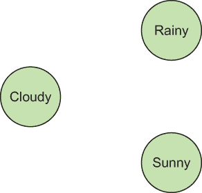
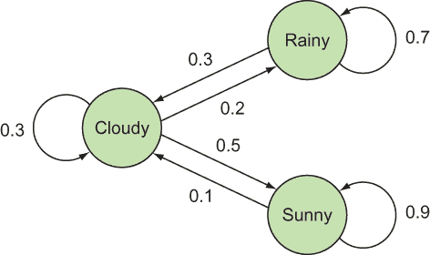
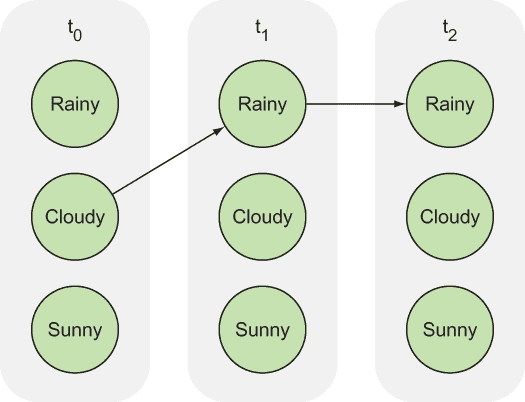
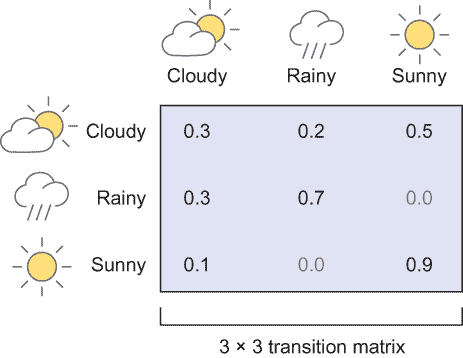
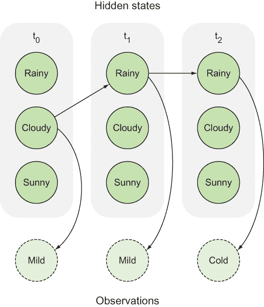
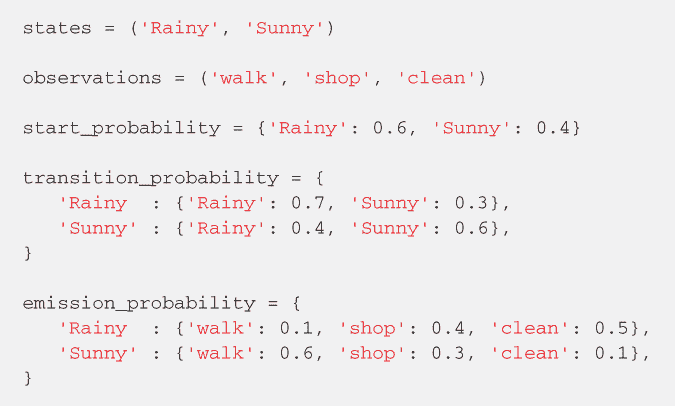

# 9 隐马尔可夫模型

本章涵盖

+   定义可解释模型

+   使用马尔可夫链建模数据

+   使用隐马尔可夫模型推断隐藏状态

如果火箭爆炸，可能有人会被解雇，因此火箭科学家和工程师必须能够对所有组件和配置做出自信的决定。他们通过物理模拟和从第一原理进行数学推导来实现这一点。您也通过纯粹的逻辑思维解决了科学问题。考虑波义耳定律：在固定温度下，气体的压力和体积成反比。您可以从这些简单的定律中得出关于已发现世界的深刻推论。最近，机器学习开始扮演演绎推理的重要配角。

*火箭科学*和*机器学习*并不是通常一起出现的短语，除非你真的走过我的一周。 （查看我的作者简介！）但如今，在航空航天行业中，使用智能数据驱动算法对现实世界的传感器读数进行建模更加可行。此外，机器学习技术在医疗保健和汽车行业中也得到了蓬勃发展。但为什么？

这种涌入部分可以归因于对*可解释*模型更好的理解，这些模型是机器学习模型，其中学习的参数具有明确的解释。例如，如果火箭爆炸，一个可解释的模型可能有助于追踪根本原因。

练习 9.1

使模型可解释的因素可能有些主观。您对可解释模型的评判标准是什么？

**答案**

我们喜欢将数学证明视为事实上的解释技术。如果有人要说服另一个人一个数学定理的真实性，一个无可辩驳地追踪推理步骤的证明就足够了。

本章是关于揭示观察背后的隐藏解释。考虑一个木偶大师拉动绳子使木偶看起来像是有生命的。仅分析木偶的动作可能会导致过于复杂的结论，关于一个非生命物体如何移动。在你注意到连接的绳子后，你会意识到木偶大师是解释逼真动作的最佳解释。

在这个话题上，本章介绍了*隐马尔可夫模型*（HMMs），它揭示了关于研究问题的直观属性。HMM 是“木偶大师”，它解释了观察结果。您通过使用第 9.2 节中描述的马尔可夫链来建模观察结果。

在详细阅读马尔可夫链和 HMMs 之前，考虑替代模型。在第 9.1 节中，你会看到可能不可解释的模型。

## 9.1 一个不太可解释的模型示例

黑盒机器学习算法的一个经典例子是图像分类，这种算法难以解释。在图像分类任务中，目标是给每个输入图像分配一个标签。更简单地说，图像分类通常被表述为一个多项选择题：列出的类别中哪一个最能描述图像？机器学习从业者在这方面的进步巨大，以至于今天的最佳图像分类器在某些数据集上与人类的表现相当。

在第十四章中，你将学习如何使用卷积神经网络（CNNs）来解决问题，这是一种学习大量参数的机器学习模型。但那些参数正是 CNN 的问题：如果不说成千上万，至少是数百万个参数分别代表什么意思？很难询问图像分类器它为什么会做出这样的决定。我们所能拥有的只是学习到的参数，这些参数可能无法轻易解释分类背后的推理。

机器学习有时会获得一个声誉，即它是一个黑盒工具，可以解决特定问题而不透露其结论是如何得出的。本章的目的是揭示机器学习中的一个具有可解释模型的领域。具体来说，你将了解 HMM（隐马尔可夫模型）并使用 TensorFlow 来实现它。

## 9.2 马尔可夫模型

安德烈·马尔可夫是一位俄罗斯数学家，他研究了在随机性的存在下系统随时间变化的方式。想象一下气体粒子在空气中弹跳。用牛顿物理学跟踪每个粒子的位置会变得非常复杂，因此引入随机性有助于简化物理模型。

马尔可夫意识到，进一步简化随机系统的是只考虑气体粒子周围的有限区域来对其进行建模。也许欧洲的气体粒子对美国的粒子几乎没有影响。那么为什么不去忽略它呢？当你只观察附近的邻域而不是整个系统时，数学就简化了。这种概念被称为*马尔可夫性质*。

考虑对天气进行建模。气象学家使用温度计、气压计和风速计等工具评估各种条件，以帮助预测天气。他们凭借卓越的洞察力和多年的经验来完成他们的工作。

让我们利用马尔可夫性质从一个简单的模型开始。首先，你确定你想要研究的可能情况，或者说*状态*。图 9.1 显示了三个天气状态作为图中的节点：Cloudy（多云）、Rainy（雨天）和 Sunny（晴天）。



图 9.1 以节点形式表示的天气条件（状态）

现在你有了状态，你想要定义一个状态如何转换到另一个状态。将天气建模为确定性系统是困难的。如果今天是晴天，明天肯定也是晴天的结论并不明显。相反，你可以引入随机性，并说如果今天是晴天，有 90%的可能性明天也是晴天，有 10%的可能性是多云。当你只使用今天的天气条件来预测明天的天气（而不是使用历史数据）时，马尔可夫性质就发挥作用了。

练习 9.2

一个仅基于其当前状态来决定采取何种行动的机器人被认为是遵循马尔可夫性质。这种决策过程的优点和缺点是什么？

**答案**

马尔可夫性质在计算上很容易处理，但马尔可夫模型无法推广到需要积累知识历史的情况。例如，在时间趋势很重要或了解多个过去状态能更好地预测下一个期望的情况中的模型。

图 9.2 展示了节点之间绘制的有向边，箭头指向下一个未来状态。每条边都有一个权重，表示概率（例如，如果今天是雨天，明天多云的概率为 30%）。两个节点之间没有边是一种优雅地表示那种转换概率几乎为零的方式。转移概率可以从历史数据中学习，但在此我们假设它们是给定的。



图 9.2 展示了不同天气条件之间的转移概率，用有向边表示。

如果你有三个状态，你可以用 3×3 矩阵来表示转移。矩阵中的每个元素（在第*i*行和第*j*列）对应于从节点*i*到节点*j*的边的概率。一般来说，如果你有*N*个状态，*转移矩阵*的大小将是*N*×*N*；参见图 9.4 的示例。

我们称这个系统为*马尔可夫模型*。随着时间的推移，状态会根据图 9.2 中定义的转移概率发生变化。在我们的例子中，晴天有 90%的可能性再次成为晴天，所以我们显示一个概率为 0.9 的边，回到自身。有 10%的可能性是晴天之后是多云，在图中表示为从晴天到多云的边 0.1。

图 9.3 是另一种可视化状态变化的方法，给出了状态转移概率。这种表示通常被称为*梯形图*，它最终证明是一个重要的工具，正如你将在我们实现 TensorFlow 算法时看到的。



图 9.3 展示了马尔可夫系统随时间变化的梯形表示

你已经看到了如何使用 TensorFlow 代码构建图来表示计算。你可能想将马尔可夫模型中的每个节点视为 TensorFlow 中的一个节点。但尽管图 9.2 和 9.3 很好地说明了状态转换，图 9.4 展示了在代码中实现它们的更有效方法。



图 9.4 一个转换矩阵传达了从左侧（行）到顶部（列）状态转换的概率。

记住，TensorFlow 图中的节点是张量，因此你可以将转换矩阵（让我们称其为 *T*）表示为 TensorFlow 中的一个节点。然后，你可以在 TensorFlow 节点上应用数学运算以实现有趣的结果。

假设你更喜欢晴天而不是雨天，因此你为每一天都有一个分数。你将每个状态的分数表示在一个名为 *s* 的 3 × 1 矩阵中。然后，使用 `tf.matmul(T*s)` 在 TensorFlow 中将这两个矩阵相乘，可以得到从每个状态转换的预期偏好。

在马尔可夫模型中表示一个场景可以极大地简化你对世界的看法。但通常，直接测量世界的状态很困难。通常，你必须使用来自多个观测的证据来弄清楚隐藏的意义。这正是 9.3 节旨在解决的问题。

## 9.3 隐藏马尔可夫模型

在 9.2 节中定义的马尔可夫模型在所有状态都是可观测时很方便，但情况并不总是如此。考虑只有获取一个城镇的温度读数。温度不是天气，但它与之相关。那么，你如何从这些间接的测量数据中推断出天气呢？

雨天天气很可能会造成温度读数较低，而晴天则很可能会造成温度读数较高。仅凭温度知识和转换概率，你仍然可以做出关于最可能天气的智能推断。

这种类型的问题在现实世界中很常见。一个状态可能会留下一些线索，而这些线索就是你所能拥有的全部。

这样的模型是 HMM，因为世界的真实状态（例如是否在下雨或晴天）是不可直接观测的。这些隐藏状态遵循马尔可夫模型，并且每个状态都会以一定的可能性发出可测量的观测值。例如，晴朗的隐藏状态通常可能会发出高温读数，但偶尔也可能因为某种原因发出低温读数。

在 HMM 中，你必须定义发射概率，这通常用一个称为 *发射矩阵* 的矩阵表示。矩阵的行数是状态的数量（晴朗、多云、雨天），列数是观测类型的数量（热、温和、冷）。矩阵中的每个元素都与发射相关的概率。

可视化 HMM 的典型方法是将观测值附加到梯形图上，如图 9.5 所示。



图 9.5 一个 HMM 框图，展示了天气条件可能产生的温度读数

所以，几乎就是这样。HMM 是对转移概率、发射概率以及另一件事的描述：初始概率。*初始概率* 是在模型没有先前知识的情况下每个状态发生的概率。如果你正在模拟洛杉矶的天气，那么晴朗的初始概率可能要大得多。或者让我们假设你正在模拟西雅图的天气；你知道可以将雨天的初始概率设置得更高。

HMM 允许你理解一系列观察结果。在这个天气建模场景中，你可能想知道观察特定温度读数序列的概率。我将使用前向算法来回答这个问题。

## 9.4 前向算法

*前向算法*计算观察到的概率。许多排列可能导致特定的观察结果，所以以天真方式枚举所有可能性将需要指数级的时间来计算。

相反，你可以通过使用 *动态规划* 来解决这个问题，这是一种将复杂问题分解成简单的小问题并使用查找表来缓存结果的策略。在你的代码中，你将查找表保存为 NumPy 数组，并将其馈送到 TensorFlow 操作以保持更新。

如列表 9.1 所示，创建一个 `HMM` 类来捕获 HMM 参数，包括初始概率向量、转移概率矩阵和发射概率矩阵。

列表 9.1 定义 `HMM` 类

```
import numpy as np                                          ❶
import tensorflow as tf                                     ❶

class HMM(object):
    def __init__(self, initial_prob, trans_prob, obs_prob):
        self.N = np.size(initial_prob)                      ❷
        self.initial_prob = initial_prob                    ❷
        self.trans_prob = trans_prob                        ❷
        self.emission = tf.constant(obs_prob)               ❷

        assert self.initial_prob.shape == (self.N, 1)       ❸
        assert self.trans_prob.shape == (self.N, self.N)    ❸
        assert obs_prob.shape[0] == self.N                  ❸

        self.obs_idx = tf.placeholder(tf.int32)             ❹
        self.fwd = tf.placeholder(tf.float64)               ❹
```

❶ 导入所需的库

❷ 将参数存储为方法变量

❸ 双重检查所有矩阵的形状是否合理

❹ 定义前向算法使用的占位符

接下来，你将定义一个快速辅助函数来访问发射矩阵中的一行。列表 9.2 中的代码是一个辅助函数，它能够有效地从任意矩阵中获取数据。`slice` 函数从原始张量中提取一部分。此函数需要输入相关的张量、由张量指定的起始位置以及由张量指定的切片大小。

列表 9.2 创建一个辅助函数以访问观察的发射概率

```
    def get_emission(self, obs_idx):
        slice_location = [0, obs_idx]                                 ❶
        num_rows = tf.shape(self.emission)[0]
        slice_shape = [num_rows, 1]                                   ❷
        return tf.slice(self.emission, slice_location, slice_shape)   ❸
```

❶ 如何切割发射矩阵

❷ 切片的形状

❸ 执行切片操作

你需要定义两个 TensorFlow 操作。第一个，在列表 9.3 中，将只运行一次以初始化前向算法的缓存。

列表 9.3 初始化缓存

```
    def forward_init_op(self):
        obs_prob = self.get_emission(self.obs_idx)
        fwd = tf.multiply(self.initial_prob, obs_prob)
        return fwd
```

下一个操作在每次观察时更新缓存，如列表 9.4 所示。运行此代码通常被称为 *执行前向步骤*。尽管看起来这个 `forward_op` 函数没有输入，但它依赖于需要馈送到会话中的占位符变量。具体来说，`self.fwd` 和 `self.obs_idx` 是此函数的输入。

列表 9.4 更新缓存

```
    def forward_op(self):
        transitions = tf.matmul(self.fwd, tf.transpose(self.get_emission(self.obs_idx)))
        weighted_transitions = transitions * self.trans_prob
        fwd = tf.reduce_sum(weighted_transitions, 0)
        return tf.reshape(fwd, tf.shape(self.fwd))
```

在`HMM`类之外，让我们定义一个函数来运行前向算法，如图 9.5 所示。前向算法为每个观察运行前向步骤。最后，它输出观察的概率。

列表 9.5 定义前向算法，给定`HMM`

```
def forward_algorithm(sess, hmm, observations):
    fwd = sess.run(hmm.forward_init_op(), feed_dict={hmm.obs_idx: 
    ➥ observations[0]})
    for t in range(1, len(observations)):
        fwd = sess.run(hmm.forward_op(), feed_dict={hmm.obs_idx: 
        ➥ observations[t], hmm.fwd: fwd})
    prob = sess.run(tf.reduce_sum(fwd))
    return prob
```

在主函数中，让我们通过提供初始概率向量、转移概率矩阵和发射概率矩阵来设置`HMM`类。为了保持一致性，列表 9.6 中的示例直接从维基百科上的 HMM 文章[`mng.bz/8ztL`](http://mng.bz/8ztL)中提取，如图 9.6 所示。



图 9.6 HMM 示例场景截图

通常，这三个概念定义如下：

+   *初始概率向量* —状态开始的概率

+   *转移概率矩阵* —给定当前状态，到达下一个状态的概率

+   *发射概率矩阵* —观察到的状态暗示你感兴趣的状态已经发生的可能性

给定这些矩阵，您将调用您定义的前向算法（列表 9.6）。

列表 9.6 定义`HMM`和调用前向算法

```
if __name__ == '__main__':
    initial_prob = np.array([[0.6], 
                             [0.4]])

    trans_prob = np.array([[0.7, 0.3], 
                           [0.4, 0.6]])

    obs_prob = np.array([[0.1, 0.4, 0.5], 
                         [0.6, 0.3, 0.1]])

    hmm = HMM(initial_prob=initial_prob, trans_prob=trans_prob, 
    ➥ obs_prob=obs_prob)

    observations = [0, 1, 1, 2, 1]
    with tf.Session() as sess:
        prob = forward_algorithm(sess, hmm, observations)
        print('Probability of observing {} is {}'.format(observations, prob))
```

当您运行列表 9.6 时，算法输出以下内容：

```
Probability of observing [0, 1, 1, 2, 1] is 0.0045403
```

## 9.5 维特比解码

*维特比解码算法*在给定观察序列的情况下找到最可能的隐藏状态序列。它需要一个类似于前向算法的缓存方案。您将命名缓存为`viterbi`。在 HMM 构造函数中，添加列表 9.7 中显示的行。

列表 9.7 将维特比缓存作为成员变量添加

```
def __init__(self, initial_prob, trans_prob, obs_prob):
  ...
  ...
  ...
  self.viterbi = tf.placeholder(tf.float64)
```

在列表 9.8 中，您将定义一个 TensorFlow 操作来更新`viterbi`缓存。这个操作将是`HMM`类中的一个方法。

列表 9.8 定义一个操作来更新前向缓存

```
def decode_op(self):
        transitions = tf.matmul(self.viterbi, tf.transpose(self.get_emission(self.obs_idx)))
        weighted_transitions = transitions * self.trans_prob
        viterbi = tf.reduce_max(weighted_transitions, 0)
        return tf.reshape(viterbi, tf.shape(self.viterbi))
```

您还需要一个操作来更新回溯指针（列表 9.9）。

列表 9.9 定义一个操作来更新回溯指针

```
def backpt_op(self):
    back_transitions = tf.matmul(self.viterbi, np.ones((1, self.N)))
    weighted_back_transitions = back_transitions * self.trans_prob
    return tf.argmax(weighted_back_transitions, 0)
```

最后，在列表 9.10 中，定义维特比解码函数，位于 HMM 之外。

列表 9.10 定义维特比解码算法

```
def viterbi_decode(sess, hmm, observations):
    viterbi = sess.run(hmm.forward_init_op(), feed_dict={hmm.obs: observations[0]})
    backpts = np.ones((hmm.N, len(observations)), 'int32') * -1
    for t in range(1, len(observations)):
        viterbi, backpt = sess.run([hmm.decode_op(), hmm.backpt_op()],
                                    feed_dict={hmm.obs: observations[t],
                                               hmm.viterbi: viterbi})
        backpts[:, t] = backpt
    tokens = [viterbi[:, -1].argmax()]
    for i in range(len(observations) - 1, 0, -1):
        tokens.append(backpts[tokens[-1], i])
    return tokens[::-1]
```

您可以在主函数中运行列表 9.11 中的代码来评估观察的维特比解码。

列表 9.11 运行维特比解码

```
seq = viterbi_decode(sess, hmm, observations)
print('Most likely hidden states are {}'.format(seq))
```

## 9.6 HMM 的应用

现在您已经实现了前向算法和维特比算法，让我们来看看您新获得的力量的一些有趣用途。

### 9.6.1 模型视频

想象一下仅根据一个人走路的方式（不是字面上的意思）来识别这个人。根据人的步态来识别人是一个相当酷的想法，但首先，你需要一个模型来识别步态。考虑一个 HMM，其中步态的隐藏状态序列为（1）休息位置，（2）右脚向前，（3）休息位置，（4）左脚向前，以及（5）休息位置。观察到的状态是从视频剪辑中提取的人行走/慢跑/跑步的轮廓。（此类示例的数据集可在[`mng.bz/Tqfx.`](http://mng.bz/Tqfx)找到）

### 9.6.2 模型 DNA

DNA 是一系列核苷酸，我们正在逐渐了解其结构。理解长 DNA 字符串的一个巧妙方法是对区域进行建模，如果你知道它们出现的概率顺序。就像雨天之后通常是多云的一天，也许 DNA 序列上的某个区域（*起始密码子*）在另一个区域（*终止密码子*）之前更常见。

### 9.6.3 建模图像

在手写识别中，我们的目标是从一个手写单词的图像中检索明文。一种方法是一次性解析字符，然后将结果连接起来。你可以利用字符是按序列书写的——单词——来构建一个 HMM。知道前一个字符可能有助于你排除下一个字符的可能性。隐藏状态是明文，观察结果是包含单个字符的裁剪图像。

## 9.7 HMM 的应用

当你知道隐藏状态是什么以及它们如何随时间变化时，HMM 工作得最好。幸运的是，在自然语言处理领域，使用 HMM 来标记句子的词性是可以解决的：

+   句子中的单词序列对应于 HMM 的观察结果。例如，句子“打开 pod 舱门，HAL”有六个观察到的单词。

+   隐藏状态是词性：动词、名词、形容词等等。前例中观察到的单词*open*应该对应于隐藏状态*verb*。

+   转换概率可以由程序员设计或通过数据获得。这些概率代表了词性的规则。例如，两个动词连续出现的概率应该是低的。通过设置转换概率，你可以避免算法穷举所有可能性。

+   每个单词的发射概率可以从数据中获得。一个传统的词性标注数据集被称为 Moby；你可以在[www.gutenberg.org/ebooks/3203](http://www.gutenberg.org/ebooks/3203)找到它。

注意：你现在已经有能力设计自己的 HMM 实验了。这些模型是强大的工具，我敦促你尝试在自己的数据上使用它们。预先定义一些转换和发射，看看你是否能恢复隐藏状态。我希望这一章能帮助你开始。

## 摘要

+   一个复杂、纠缠的系统可以用马尔可夫模型简化。

+   HMM 在现实世界应用中特别有用，因为大多数观察都是对隐藏状态的测量。

+   前向算法和维特比算法是用于 HMM 的最常见算法之一。
