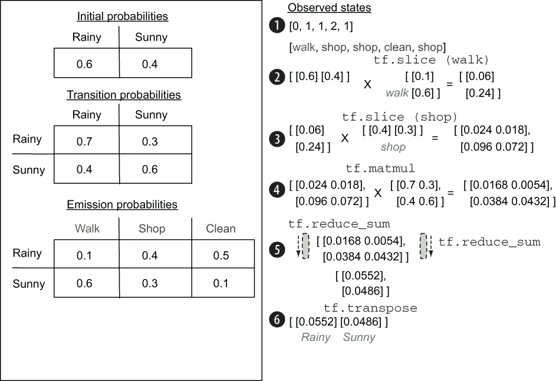
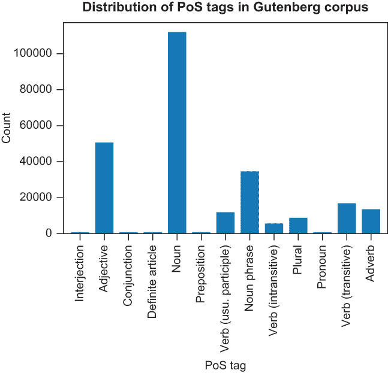
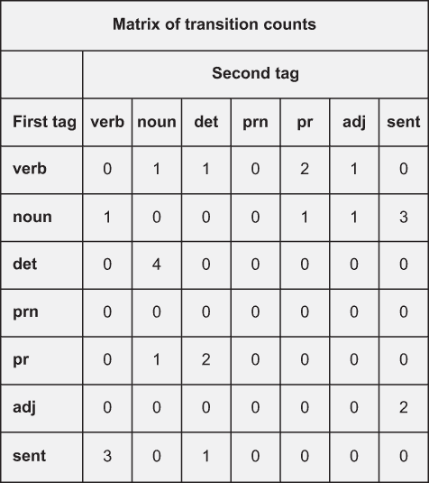
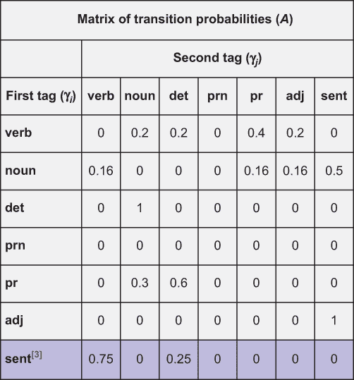
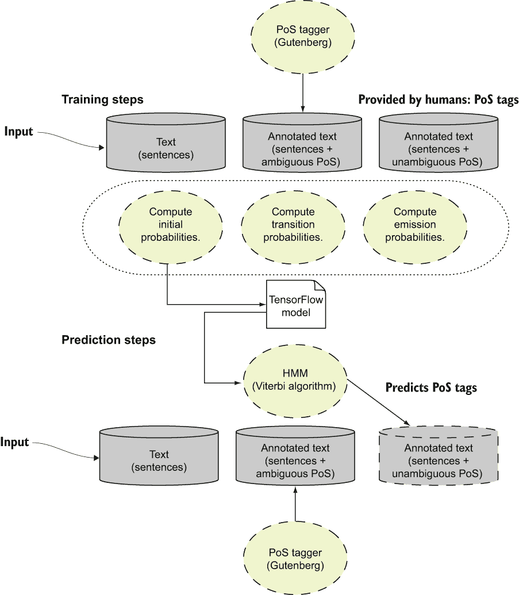
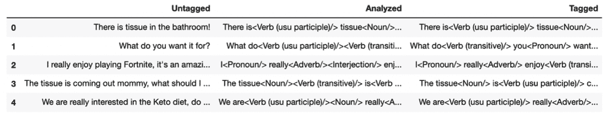
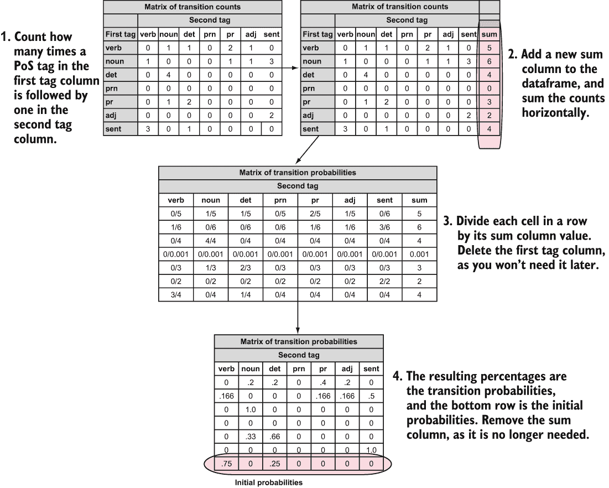
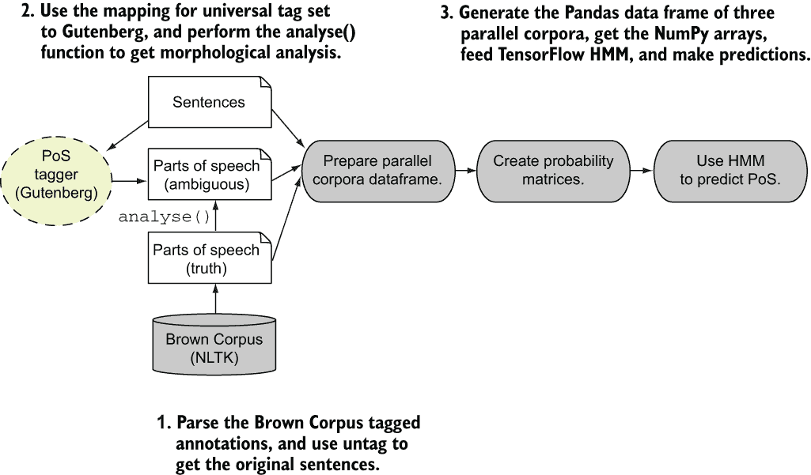
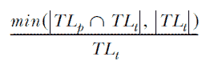
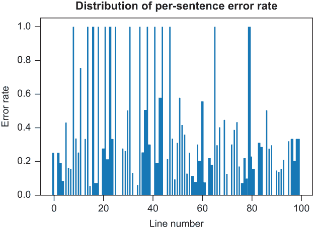

# 第十部分：词性标注和词义消歧

本章涵盖

+   通过从过去的数据中预测名词、动词和形容词来消歧语言

+   使用隐马尔可夫模型（HMMs）做出决策并解释它们

+   使用 TensorFlow 来建模可解释的问题并收集证据

+   从现有数据计算 HMM 的初始、转移和发射概率

+   从你自己的数据和更大的语料库中创建词性（PoS）标注器

你每天都在使用语言与他人沟通，如果你像我一样，有时你会挠头，尤其是如果你在使用英语。众所周知，英语有很多例外，这使得非母语者难以教授，包括那些正在努力自学的小家伙们。上下文很重要。在对话中，你可以使用诸如手势、面部表情和长暂停等工具来传达额外的上下文或意义，但当你阅读书面语言时，大部分上下文都缺失了，而且有很多歧义。词性（PoS）可以帮助填补缺失的上下文，以消歧义并使文本中的词语有意义。词性（PoS）告诉你一个词是否被用作动作词（动词），是否指代一个对象（名词），是否描述一个名词（形容词），等等。

考虑图 10.1 中的两个句子。在第一个句子——“我希望能设计一个未来的火星漫游车！”中——有人表示他们想要帮助设计（建造）下一个火星漫游车。现实生活中说这句话的人肯定对火星和行星科学之外的事情不感兴趣。第二个句子——“我喜欢成为一名工程师，并在 NASA JPL 的地球科学部门工作！”是由另一个人说的，关于享受在喷气推进实验室（NASA 的一部分）工作，我在那里工作。第二个句子是由一个喜欢在 NASA 工作并参与地球科学项目的研究工程师说的。


图 10.1 两个需要消歧的句子

这里的问题是：两个句子都以不同的方式使用了单词**engineer**。第一个句子将**engineer**用作动词——一个动作——而第二个句子将**engineer**用作名词来指代他的角色。动词和名词在英语中是不同的词性，而决定是名词还是动词并不局限于英语；词性存在于许多语言中，并在文本中的单词和字符之间划分意义。但正如你所看到的，问题是单词及其（意义）——简称为词义——通常需要去歧义以提供你通常通过口头交谈或视觉线索所理解的上下文线索。记住，当你阅读文本时，你无法听到说话者声音的语调。你看不到视觉线索来判断这个人是在说他们想要建造一个去火星的东西（使用锤子的手势）还是说他们喜欢从事地球科学项目（使用手势指向他们周围的世界）。

好消息是，语言学者们长期以来一直在人文科学领域研究词性，主要通过阅读文学作品并产生有用的指导和规则，这些规则传达了单词可以采取的特定词性。多年来，这些学者们检查了许多文本并记录了他们所看到的内容。这些努力的例子之一是古腾堡计划([`mng.bz/5pBB`](http://mng.bz/5pBB))，它包含超过 200,000 个单词和数十种可能的词性，这些词性可以在英语的多种书面文本中出现。你可以把古腾堡语料库想象成一个包含 200,000 个英语单词的表格；每个单词是一行，并作为主键，列值是该单词可能采取的不同词性（如形容词或名词）。

尝试将古腾堡计划应用于图 10.1 中的工程师句子，歧义就会跃然纸上。我已经用古腾堡的词性标注来注释这些句子以供说明（为了简洁，省略了第一句中的地球科学部分）：

```
I<Noun/> love<Adverb/> being<Verb/> an engineer<Noun/><Verb/> 
and<Conjunction/> working at<Preposition/> NASA<Noun/> JPL<Noun/>.
I<Noun/> am<Adverb/> hoping<Verb/> to engineer<Noun/><Verb/> a future 
Mars<Noun/> rover<Noun/> vehicle<Noun/>.
```

如您所清晰看到的，古腾堡告诉我们**engineer**可以是一个名词或动词。你如何通过观察文本并利用周围语境或阅读大量类似文本，自动地有信心地判断一个特定单词的词性，而不是猜测呢？

机器学习和概率模型，如第九章中你所学到的隐藏马尔可夫模型（HMMs），可以通过将词性标注（PoS）的过程建模为 HMM 问题来帮助你填补一些上下文。作为一个极其初步的草图，初始概率是基于研究一组输入句子而得到的，一个特定 PoS 类发生的概率。转移概率是在特定顺序中看到某个 PoS 类在另一个或一系列类之后发生的概率。最后，发射或可观察属性是基于所有其他句子程序所看到的，一个模糊类如`名词/动词`是名词还是`名词/动词`是动词的概率。

好消息是，第九章中所有的代码都可以在这里重用。你在这章中付出的巨大努力将为机器学习准备数据，计算模型，并设置 TensorFlow 以执行其任务！让我们开始吧。在我们跳入词性标注之前，我会快速回顾一下 HMM 正在做什么，使用第九章中的 Rainy 或 Sunny 示例。跟我来！

## 10.1 HMM 示例回顾：雨天或晴天

第九章中的 Rainy/Sunny 示例使用 HMM 来模拟天气的隐藏状态，如果你只能观察到间接活动，如走路、购物或清洁。要将代码作为 HMM 建模，你需要天气是雨天或晴天的初始概率——一个 2×1 矩阵。你需要天气是雨天然后是晴天的转移概率（反之亦然）——一个 2×2 矩阵。你还需要看到间接动作或发射概率的概率，即走路、购物或清洁对于隐藏状态 Rainy 和 Sunny 的概率——一个 3×2 矩阵。图 10.2 的左侧展示了这个问题的构建。



图 10.2 的左侧是 Rainy/Sunny 示例的 HMM 构建。右侧展示了 TensorFlow 和我们的 HMM 类如何接收一组观察到的状态并累积这些观察状态发生的概率。

在第九章中，我向你展示了如何在 Python 和 TensorFlow 中创建一个 HMM 类来表示初始、转移和发射概率的初始化，然后运行前向模型来计算事件序列发生的整体概率（例如走路、购物、购物、清洁），然后下一个事件是购物。这个计算在图 10.2 的右侧展示。TensorFlow 操作在 HMM 类的开发中表现出色，特别是 TensorFlow 的延迟评估和图构建过程。以下是方法：

+   HMM 类充当构建`tf.slice`操作图的代理，这些操作根据提供的观察结果提取特定的发射概率，以及`tf.matmul`操作，这些操作累积前向模型概率（如图 10.2 中的步骤 1-2、2-3 和 3-4）。

+   算法从初始概率开始，根据图 10.2 右侧的行事件右侧的第一个观测索引乘以发射概率。

+   接下来，算法累积前向模型概率并准备迭代剩余的观测（图 10.2 中的步骤 4-6）。

对于每个观测，HMM 类运行前向模型以重复执行以下步骤：

1.  使用`tf.slice`根据观测索引切片出特定的发射概率集，并将其与前向模型相乘（图 10.2 中的步骤 1-3）。

1.  根据乘以前向模型和转换概率，累积每个隐藏状态的前向模型概率（图 10.2 中的步骤 4）。

1.  使用`tf.reduce_sum`累积每个选择（雨天和晴天）基于观测和`tf.transpose`将 Rainy/Sunny 矩阵返回到原始前向模型结构（图 10.2 中的步骤 5-6）。

列表 10.1 创建了 HMM 类并运行前向模型。此列表对应于视觉步骤 1-6（图 10.2），你可以看到图 10.2 右侧的一系列变换展示了雨天和晴天的第一次迭代。

列表 10.1 HMM 类和前向模型

```
class HMM(object):
    def __init__(self, initial_prob, trans_prob, obs_prob):    ❶
        self.N = np.size(initial_prob)
        self.initial_prob = initial_prob
        self.trans_prob = trans_prob
        self.emission = tf.constant(obs_prob)
        assert self.initial_prob.shape == (self.N, 1)
        assert self.trans_prob.shape == (self.N, self.N)
        assert obs_prob.shape[0] == self.N
        self.obs_idx = tf.placeholder(tf.int32)
        self.fwd = tf.placeholder(tf.float64)

    def get_emission(self, obs_idx):                           ❷
        slice_location = [0, obs_idx]
        num_rows = tf.shape(self.emission)[0]
        slice_shape = [num_rows, 1]
        return tf.slice(self.emission, slice_location, slice_shape)

    def forward_init_op(self):                                 ❸
        obs_prob = self.get_emission(self.obs_idx)
        fwd = tf.multiply(self.initial_prob, obs_prob)
        return fwd

    def forward_op(self):
        transitions = tf.matmul(self.fwd,
        tf.transpose(self.get_emission(self.obs_idx)))
        weighted_transitions = transitions * self.trans_prob   ❹
        fwd = tf.reduce_sum(weighted_transitions, 0)
        return tf.reshape(fwd, tf.shape(self.fwd))

def forward_algorithm(sess, hmm, observations):                ❺
    fwd = sess.run(hmm.forward_init_op(), feed_dict={hmm.obs_idx:observations[0]})
    for t in range(1, len(observations)):
        fwd = sess.run(hmm.forward_op(), feed_dict={hmm.obs_idx:observations[t], hmm.fwd: fwd})
    prob = sess.run(tf.reduce_sum(fwd))
    return prob
```

❶ 使用初始概率、发射概率和转换概率初始化模型

❷ 使用 tf.slice 提取与观测索引对应的发射概率

在第一个观测上运行第一个前向操作并累积前向模型

在观测上累积发射概率和转换概率

在观测 2 及以后运行前向模型并累积概率

要使用前向模型，你创建初始概率、转换概率和发射概率，然后将它们输入到 HMM 类中，如列表 10.2 所示。程序输出是看到那些特定间接观测（或发射）以特定顺序出现的累积概率。

列表 10.2 使用 Rainy/Sunny 示例运行 HMM 类

```
initial_prob = np.array([[0.6],[0.4]])                                    ❶
trans_prob = np.array([[0.7, 0.3],
                       [0.4, 0.6]])
obs_prob = np.array([[0.1, 0.4, 0.5],
                     [0.6, 0.3, 0.1]])
hmm = HMM(initial_prob=initial_prob, trans_prob=trans_prob, 
➥ obs_prob=obs_prob)
observations = [0, 1, 1, 2, 1]                                            ❷
with tf.Session() as sess:
    prob = forward_algorithm(sess, hmm, observations)   
    print('Probability of observing {} is {}'.format(observations, prob)) ❸
```

创建表示初始、转换和发射概率的初始 NumPy 数组

❷ 行走、购物、购物、清洁和购物观测

❸ 运行前向模型并打印这些事件发生的累积概率

回想第九章，维特比算法是 HMM 模型和类的一个简单特化，它通过回溯指针跟踪状态之间的转换，并累积给定一组观察到的状态之间的概率转换。维特比算法不是提供一组状态发生的累积概率，而是提供每个间接观察到的隐藏状态的最可能状态。换句话说，它为每个间接观察到的行走、购物、购物、清洁和购物的状态提供最可能的状态（雨天或晴天）。您将在本章后面直接使用维特比算法，因为您将想要预测给定歧义类的 PoS。具体来说，您将想知道如果给定歧义类`名词/动词`，PoS 是名词还是动词。

现在我们已经完成了 HMM 的复习，是时候组装我们的初始歧义 PoS 标签器了。

## 10.2 PoS 标注

PoS 标注可以推广到将输入句子作为输入，然后尝试区分词性的歧义问题。Moby 项目是最大的免费音标数据库之一，它是作为 Project Gutenberg 的一部分进行镜像的。Moby 项目包含文件 mobypos.txt，这是一个包含英语单词及其可以接受的 PoS 的数据库。该文件（可在[`mng.bz/6Ado`](http://mng.bz/6Ado)获取）需要解析，因为它是一组以数据库中已知的单词开头的行，后面跟着一组标签（如`\A\N`），这些标签对应于词性——在这种情况下是形容词（`\A`）和名词（`\N`）。PoS 标签到 mobypos.txt 注释的映射在列表 10.3 中显示，您将在本章的其余部分重用此映射。单词在 mobypos.txt 中的形式如下：

```
word\PoSTag1\PoSTag2
```

下面是一个具体的例子：

```
abdominous\A
```

根据 mobypos.txt，英语单词*abdominous*作为形容词有一个单一的 PoS 用法。

列表 10.3 mobypos.txt 的 PoS 标签映射

```
pos_tags = {                           ❶
    "N" : "Noun",
    "p" : "Plural",
    "h" : "Noun Phrase",
    "V" : "Verb (usu participle)",
    "t" : "Verb (transitive)",
    "i" : "Verb (intransitive)",
    "A" : "Adjective",
    "v" : "Adverb",
    "C" : "Conjunction",
    "P" : "Preposition",
    "!" : "Interjection",
    "r" : "Pronoun",
    "D" : "Definite Article",
    "I" : "Indefinite Article",
    "o" : "Nominative"

}
pos_headers = pos_tags.keys()          ❷
pt_vals = [*pos_tags.values()]         ❸
pt_vals += ["sent"]                    ❹
```

❶ Project Gutenberg 中定义的 PoS 标签作为 mobypos.txt 的一部分

❷ PoS 标签键

❸ PoS 标签值

❹ 添加句尾标记，因为您稍后会用它来计算初始概率。

您可以在 Project Gutenberg 的 PoS 数据库的“数据库图例”标题下方找到完整的文档，链接为[`mng.bz/oROd`](http://mng.bz/oROd)。

要开始使用 TensorFlow 和 HMM 来区分词义，您将需要一些单词。幸运的是，我有一群充满活力的小伙子和一位妻子，他们有很多需要区分的谚语和短语。在编写这本书的过程中，我听了他们说的某些话，并记下了一些供您参考。我希望那些有青少年孩子的读者会喜欢这些：

+   “浴室里有纸巾！”

+   “你用它来做什么？”

+   “我真的喜欢玩《堡垒之夜》，这是一款令人惊叹的游戏！”

+   “纸巾出来了，妈妈，我应该用它来做什么？”

+   “我们真的很感兴趣于生酮饮食，你知道如何最好地开始它吗？”

现在，我将向您展示如何开始使用 Project Gutenberg 和 mobypos.txt 来标记词性。第一步是创建一个函数来解析完整的 mobypos.txt 文件并将其加载到 Python 变量中。因为解析文件相当于逐行读取，构建单词及其词性类别的表格，所以列表 10.4 中的简单函数就足够了。该函数返回 `pos_words`，这是英语单词及其词性类别的数据库，以及 `pos_tag_counts`——词性标签及其总出现次数的摘要。

列表 10.4 将 mobypos.txt 文件解析到词性数据库中

```
import tqdm

def parse_pos_file(pos_file):
    with open(pos_file, 'r') as pf:
        ftext = pf.readlines()                           ❶
        for line in tqdm(ftext):                         ❷
            l_split = line.split('\\')                   ❸
            word = l_split[0]
            classes=[]
            u_classes = l_split[1].strip()
            for i in range(0, len(u_classes)):
                if not u_classes[i] in pos_tags:         ❹
                    print("Unknown pos tag: "+u_classes[i]+" from line "+line)
                    continue
                classes.append(u_classes[i])

            pos_words[word] = classes                    ❺
            for c in classes:                            ❻
                if c in pos_tag_counts:                  ❻
                    cnt = pos_tag_counts[c]              ❻
                    cnt = cnt + 1                        ❻
                else:                                    ❻
                    cnt = 1                              ❻
                pos_tag_counts[c] = cnt                  ❻
```

❶ 逐行读取 mobypos.txt

❷ 使用 TQDM 在解析每一行时打印进度

❸ 按照单词及其后面的类别之后的 '\ ' 符号分割行

❹ 有时，您可能希望忽略某些词性类别或它们是未知的，因此跳过它们。

❺ 将英语单词与其词性类别集合相连接

❻ 累积语料库中词性标签的总数

当您执行 `parse_pos_file` 函数并获得 `pos_words` 和 `pos_tag_counts` 时，您可以分析 Project Gutenberg 语料库中词性标签的分布，看看是否有任何让您印象深刻的内容。特别是，您会看到一些频繁出现的词性标签和许多不太频繁出现的词性标签，这些标签在标记句子文本时可能不会出现。列表 10.5 中的简单 Matplotlib 列表揭示了词性标签的分布（图 10.3）。

列表 10.5 Project Gutenberg 中词性标签的分布

```
pos_lists = sorted(pos_tag_counts.items())     ❶
plists = []
for i in range(0, len(pos_lists)):
    t = pos_lists[i]
    plists.append((pos_tags[t[0]], t[1]))      ❷

x, y = zip(*plists)                            ❸
plt.xticks(rotation=90)
plt.xlabel("PoS Tag")
plt.ylabel("Count")
plt.title("Distribution of PoS tags in Gutenberg corpus")
plt.bar(x, y)
plt.show()                                     ❹
```

❶ 按键排序，返回一个列表

❷ 创建一个包含（标签，计数）元组的列表

❸ 将一对列表解包成两个元组

❹ 可视化图表

注意：形容词、名词、名词短语、动词（通常简称为 *usually* —分词）、复数、动词（及物）和副词是语料库中最频繁出现的词性标签。



图 10.3 Project Gutenberg 语料库中词性标签的分布

您可能还想知道有多少百分比英语单词被分配了多个词性类别，这样您就可以大致了解需要消歧义的内容，至少根据 Project Gutenberg 的数据。列表 10.6 提供了一个可能让您感到惊讶的答案：大约 6.5%。

列表 10.6 计算具有多个词性类别的英语单词的百分比

```
pc_mc = 0
for w in pos_words:
    if len(pos_words[w]) > 1:                                                ❶
        pc_mc = pc_mc +1                                                     ❶
pct = (pc_mc * 1.) / (len(pos_words.keys()) * 1.)                            ❷
print("Percentage of words assigned to multiple classes: {:.0%}".format(pct))❸
```

❶ 计算具有多个词性类别的单词数量

❷ 将具有多个词性类别的单词除以总单词数

❸ 打印结果百分比

重要的是要注意，在这 6.5% 被分配了多个词性类别的单词中，许多类别包括语言中最频繁出现的单词。总的来说，需要词义消歧。您很快就会看到需要多少。不过，在我们到达这个主题之前，我想让您先看到整体情况。

### 10.2.1 整体情况：使用 HMM 训练和预测词性

值得退一步考虑 HMM 和 TensorFlow 为 PoS 标签器提供了什么。如我之前提到的，PoS 标签可以推广到试图在 PoS 标签器无法确定一个单词应该有名词、动词或其他 PoS 标签时，尝试消除歧义性词性的问题。

与你在本书中遇到的其它机器学习过程类似，创建 HMM 以预测无歧义 PoS 标签的过程涉及一系列训练步骤。在这些步骤中，你需要创建一个基于 TensorFlow 的 HMM 模型；反过来，你需要一种学习初始概率、转移概率和发射概率的方法。你为 HMM 提供一些文本作为输入（例如一组句子）。训练的第一部分涉及运行一个 PoS 标签器，该标签器将以模糊的方式对句子中的单词进行标记，就像我之前在 Project Gutenberg 中展示的那样。在运行 PoS 标签器并获得标注的模糊文本后，你可以请求人类反馈以消除标签器的输出歧义。这样做会产生一个包含三个并行语料库数据的训练集，你可以用它来构建你的 HMM 模型：

+   输入文本，如句子

+   带有模糊 PoS 标签的标注句子

+   基于人类反馈消除歧义的标注句子

给定这些语料库，HMM 模型的概率可以按以下方式计算：

1.  构建转移计数的二元矩阵。

1.  计算每个标签的转移概率。

1.  计算发射概率。

你构建一个按 PoS 标签构建的转移计数的二元矩阵，或者一个计数成对 PoS 标签相互跟随次数的矩阵，反之亦然。矩阵的行是 PoS 标签列表，列也是 PoS 标签列表——因此称为*二元*（连续单元、单词或短语的成对）。表格可能看起来像图 10.4。



图 10.4 PoS 的转移计数示例二元矩阵

然后，你计算一个 PoS 标签在另一个标签之后出现的次数并将它们相加。转移概率是单元格值除以该特定行的值之和。然后，对于初始概率，你取图 10.4 中对应于句子结束标签（`sent`）的行的计算转移概率。这行的概率是完美的初始概率集合，因为该行中 PoS 标签出现的概率是它在句子开头或句子结束标签之后出现的概率，例如图 10.5 中突出显示的最后一行。



图 10.5 初始概率是句子结束/句子开头标签（sent）中 PoS 标签的计算转移概率。

最后，您通过计算歧义词性标签及其在歧义语料库中的出现次数与用户提供的消除歧义语料库中的标签之间的比率来计算发射概率。如果，在用户提供的消除歧义语料库中，一个单词应该被标注为动词七次，而词性歧义语料库将其标注为`Noun/Verb`三次，`Adjective`两次，`Noun`两次，那么当隐藏状态真正是`Noun`时，`Noun/Verb`的发射概率是 3 除以 7，即 43%，依此类推。

在此结构下，您可以构建您的初始、转换和发射矩阵，然后运行您的隐马尔可夫模型（HMM），使用列表 10.1 中的 TensorFlow 代码和维特比算法，该算法可以告诉您给定观察状态的实际隐藏状态。在这种情况下，隐藏状态是真实的词性标注（PoS），而观察到的标签是歧义类词性标注。图 10.6 总结了这次讨论，并指出了 TensorFlow 和 HMM 如何帮助您消除文本歧义。



图 10.6 基于 HMM 的词性标注器的训练和预测步骤。这两个步骤都需要输入文本（句子），词性标注器对它们进行歧义标注。在训练部分，人类为输入句子提供无歧义的词性以训练 HMM。在预测阶段，HMM 预测无歧义的词性。输入文本、带有歧义词性的标注文本和带有消除歧义词性的标注文本构成了构建 HMM 所需的三个语料库。

现在我已经介绍了机器学习问题的设置，您可以准备好编写函数来执行初始词性标注并生成歧义语料库。

### 10.2.2 生成歧义词性标注数据集

在自然语言处理领域，将文本输入并对其词性进行分析的过程称为形态分析。如果您考虑我孩子们之前说的句子，并对它们进行形态分析，您将得到开始词性标注所需的三个语料库中的前两个。请记住，形态分析的结果是歧义词性文本。

要进行此分析，您可以使用 Python 自然语言工具包（NLTK）库，它提供了方便的文本分析代码以供重用。`word_tokenize`函数将句子分解成单个单词。然后您可以将每个单词与列表 10.4 中计算的`pos_words`字典进行对比。对于每个歧义，您会得到一个具有多个词性标注的单词，因此您需要收集并输出它们作为输入单词的一部分。在列表 10.7 中，您将创建一个`analyse`函数，该函数执行形态分析步骤并返回歧义标注的句子。

列表 10.7 对输入句子进行形态分析

```
import nltk
from nltk.tokenize import word_tokenize                              ❶

def analyse(txt):
    words = word_tokenize(txt)                                       ❶
    words_and_tags = []

    for i in range(0, len(words)):                                   ❷
        w = words[i]
        w_and_tag = w                                                ❸
        if w in pos_words:                                           ❹
            for c in pos_words[w]:                                   ❹
                w_and_tag = w_and_tag + "<" + pos_tags[c] + "/>"     ❹
        elif w in end_of_sent_punc:
            w_and_tag = w_and_tag + "<sent/>"                        ❺

        words_and_tags.append(w_and_tag)
    return " ".join(words_and_tags)                                  ❻
```

❶ 导入 NLTK 并对输入句子进行分词

❷ 遍历每个单词

❸ 创建单词及其词性标签的组合字符串

❹ 如果单词已知来自 Project Gutenberg 的词性标签，检查其可能的词性。

❺ 如果单词是句子结束标签，添加那个特殊的词性。

❻ 返回由空格连接的分析单词及其词性

运行列表 10.7 中的代码会产生一个 Python 字符串列表。您可以对每个字符串运行`analyse`来生成平行语料库的前两部分。对于语料库的第三部分，您需要一个专家来为您消歧词性标签并告诉您正确答案。对于少数句子，几乎可以轻易地识别出某人是否将单词作为名词、动词或其他词性类别。因为我为您收集了数据，所以我提供了您可以教授 TensorFlow 的消歧词性标签（在`tagged_sample_sentences`列表中）。稍后您将看到，拥有更多知识和标记数据是有帮助的，但现在您会做得很好。瞧，列表 10.8 将三个平行语料库合并在一起，并为您准备好了。在构建三个语料库之后，您可以使用 Python Pandas 库创建一个数据框，然后您将使用它来提取一个概率的 NumPy 数组。然后，在提取概率之后，列表 10.9 中的代码将帮助从每个语料库中提取初始、转移和发射概率，并将结果存储在数据框中。

列表 10.8 创建句子、分析和标记的平行语料库

```
sample_sentences = [
    "There is tissue in the bathroom!",
    "What do you want it for?",
    "I really enjoy playing Fortnite, it's an amazing game!",
    "The tissue is coming out mommy, what should I use it for?",
    "We are really interested in the Keto diet, do you know the best way to start it?"
]                                                                        ❶

sample_sentences_a = [analyse(s) for s in sample_sentences]              ❷
tagged_sample_sentences = [
    "There is<Verb (usu participle)/> tissue<Noun/> in<Preposition/> the<Definite Article/> bathroom<Noun/> !<sent/>",
    "What do<Verb (transitive)/> you<Pronoun/> want<Verb (transitive)/> it<Noun/> for<Preposition/> ?<sent/>",
    "I<Pronoun/> really<Adverb/> enjoy<Verb (transitive)/> playing Fortnite , it<Pronoun/> 's an<Definite Article/> amazing<Adjective/> game<Noun/> !<sent/>",
    "The tissue<Noun/> is<Verb (usu participle)/> coming<Adjective/> out<Adverb/> mommy<Noun/> , what<Definite Article/> should<Verb (usu participle)/> I<Pronoun/> use<Verb (usu participle)/> it<Pronoun/> for<Preposition/> ?<sent/>",
    "We are<Verb (usu participle)/> really<Adverb/> interested<Adjective/> in<Preposition/> the<Definite Article/> Keto diet<Noun/> , do<Verb (usu participle)/> you<Pronoun/> know<Verb (usu participle)/> the<Definite Article/> best<Adjective/> way<Noun/> to<Preposition/> start<Verb (usu participle)/> it<Pronoun/> ?<sent/>"    
]                                                                        ❸
```

❶ 我收集的输入句子

❷ 在句子上运行 analyse，并将分析数据存储在列表中

❸ 我提供的消歧词性（PoS）标签

列表 10.9 构建平行语料库的 Pandas 数据框

```
import pandas as pd
def build_pos_df(untagged, analyzed, tagged):                            ❶
    pos_df = pd.DataFrame(columns=['Untagged', 'Analyzed', 'Tagged'])
    for i in range(0, len(untagged)):
        pos_df = pos_df.append({"Untagged":untagged[i], "Analyzed":analyzed[i], "Tagged": tagged[i]}, ignore_index=True)    ❷

    return pos_df

pos_df = build_pos_df(sample_sentences, sample_sentences_a, 
➥ tagged_sample_sentences)                                              ❸
```

❶ 创建一个用于构建数据框的函数

❷ 遍历五个句子中的每一个，并将三个平行语料库中的每个元素添加进去

❸ 返回数据框

使用 Pandas 数据框结构，您可以调用`df.head`并交互式地检查句子、它们的形态学分析标签和人类提供的标签，以跟踪您正在处理的数据。您可以轻松地切片出列或行来处理；对于您的目的来说，更好的是，您可以获取一个 NumPy 数组。您可以在图 10.7 中看到一个调用`df.head`的示例。



图 10.7 使用 Pandas 轻松查看您的三个平行语料库：未标记的原始句子、（形态学）分析的模糊语料库，以及用户提供的无歧义的标记语料库。

接下来，我将向您展示如何处理数据框并创建初始概率、转移概率和发射概率。然后您将应用 HMM 类来预测消歧的词性（PoS）类别。

## 10.3 用于构建 PoS 消歧的 HMM 算法

在 Pandas 数据框的条件下，计算发射、转换和初始概率矩阵证明是一项相当直接的活动。你可以从图 10.7 中的“分析”列等对应的列中切出，然后从中提取所有标签。实际上，从分析和标注的句子中提取词性标注是一个需要的实用函数。列表 10.10 中的`compute_tags`函数枚举了数据框分析或标注列中的所有句子，并按位置提取词性标注。

列表 10.10 从句子数据框中提取标签

```
def compute_tags(df_col):
    all_tags = []                                                         ❶

    for row in df_col:
        tags = []
        tag = None
        tag_list = None

        for i in range(0, len(row)):                                      ❷
            if row[i] == "<":
                tag = ""
            elif i+1 < len(row) and row[i] == "/" and row[i+1] == ">":    ❸
                if i+2 < len(row) and row[i+2] == "<":                    ❹
                    if tag_list == None:                                  ❹
                        tag_list = []                                     ❹

                    tag_list.append(tag)                                  ❹
                    tag = None                                            ❺
                else:
                    if tag_list != None and len(tag_list) > 0:
                        tag_list.append(tag)
                        tags.append(tag_list)
                        tag_list = None
                        tag = None
                    else:
                        tags.append(tag)
                        tag = None

            else:
                if tag != None:                                           ❻
                    tag = tag + row[i]                                    ❻
        all_tags.append(tags)
        tags = None
        tag = None
        tag_list = None

    return all_tags

a_all_tags = compute_tags(pos_df['Analyzed'])                             ❼
t_all_tags = compute_tags(pos_df['Tagged'])                               ❼
```

❶ 初始化要返回的标签列表——按遇到顺序排列的标签列表

❷ 枚举数据框中的句子，并对每个句子枚举其字符

❸ 捕获标签结束值并决定是否存在另一个标签或是否添加此标签

❹ 如果存在两个 <名词><动词> 标签（模糊），则添加两个标签。

❺ 捕获标签结束值并决定是否存在另一个标签或是否添加此标签

❻ 收集标签值

❼ 提取所有平行句子中的分析标签（`a_all_tags`）和人工标注标签（`t_all_tags`）

拥有 `compute_tags` 以及提取的分析标签（`a_all_tags`）和提取的人工标注标签（`t_all_tags`），你就可以开始计算转换概率矩阵了。你将使用 `t_all_tags` 来构建一个双词性标注句子出现次数的矩阵，如图 10.4 所示。Pandas 可以帮助你构建这样的出现矩阵。你已经从 Project Gutenberg（列表 10.3）获得了一组有效的词性标注标签（`pt_vals`变量）。如果你要打印该变量的值，你会看到类似以下的内容：

```
print([*pt_vals])
['Noun',
 'Plural',
 'Noun Phrase',
 'Verb (usu participle)',
 'Verb (transitive)',
 'Verb (intransitive)',
 'Adjective',
 'Adverb',
 'Conjunction',
 'Preposition',
 'Interjection',
 'Pronoun',
 'Definite Article',
 'Indefinite Article',
 'Nominative',
 'sent']
```

你的词性标注出现次数矩阵是一个二元矩阵，其中列是一个标签。列`FirstPOS`，后跟`pt_vals`中的词性标注，构成了列，行与图 10.4 中显示的相同值。如果你使数据框按`FirstPoS`的值索引，你可以轻松地使用词性标注作为切片数据框的键，例如通过除以列的总和值。列表 10.11 构建了一个未初始化的（所有单元格的值为`0`）转换概率矩阵。

列表 10.11 计算转换概率矩阵

```
def build_trans(pt_vals):
    trans_df = pd.DataFrame(columns=["FirstPoS"] + pt_vals)      ❶
    trans_df.set_index('FirstPoS')                               ❷
    for i in range(0, len(pt_vals)):
        pt_data = {}
        pt_data["FirstPoS"] = pt_vals[i]                         ❷
        for j in range(0, len(pt_vals)):
            pt = pt_vals[j]
            pt_data[pt] = 0                                      ❸
        trans_df = trans_df.append(pt_data, ignore_index=True)   ❸
    return trans_df                                              ❹
```

❶ 构建包含“FirstPoS”列的数据框，代表两个词性标注中的第一个

❷ 在词性标注（PoS）标签上创建数据框索引

❸ 初始化计数为零

❹ 返回转换概率矩阵数据框

当你拥有未初始化的数据框时，你需要统计你标记的句子语料库中 PoS 标签的出现次数。幸运的是，这些数据已经被捕获在`t_all_tags`中，这是你在第 10.10 列表中计算的。一个简单的算法可以从标记语料库中捕获 PoS 标签的计数，用于转换计数矩阵。你需要遍历所有句子中捕获的 PoS 标签，捕获共现的标签，然后计算它们的出现次数。两个特殊情况是第一个句子之后的句子开头（由一个句子结束标签 precede）和最后一个句子（以`snt` PoS 标签结束）。因为数据框是通过引用传递的，所以你可以更新其计数值（在指定数组 `[row_idx, col_idx]` 中的`cnt`变量）来填充单元格计数。第 10.12 列表中的`compute_trans_matrix`函数为你做了繁重的工作。

列表 10.12 计算标记语料库中 PoS 标签的出现次数

```
def compute_trans_matrix(t_df, tags):
    for j in range(0, len(pos_df['Tagged'])):                         ❶
        s = pos_df['Tagged'][j]
        tt_idx = []                                                   ❷

        for i in range(0, len(tags[j])):                              ❸
            tt_idx.append(tags[j][i])                                 ❹
            if j > 0 and i == 0:                                      ❺
                row_idx = "sent"                                      ❺
                col_idx = tags[j][i]
                cnt = t_df.loc[t_df.FirstPoS==row_idx, col_idx]
                cnt = cnt + 1                                         ❻
                t_df.loc[t_df.FirstPoS==row_idx, col_idx] = cnt

            if len(tt_idx) == 2:                                      ❼
                row_idx = tt_idx[0]
                col_idx = tt_idx[1]
                cnt = t_df.loc[t_df.FirstPoS==row_idx, col_idx]
                cnt = cnt + 1                                         ❼
                t_df.loc[t_df.FirstPoS==row_idx, col_idx] = cnt  
                tt_idx.clear()
            elif len(tt_idx) == 1 and tags[j][i] == "sent":           ❽
                row_idx = tags[j][i-1]
                col_idx = tags[j][i]
                cnt = t_df.loc[t_df.FirstPoS==row_idx, col_idx]
                cnt = cnt + 1
                t_df.loc[t_df.FirstPoS==row_idx, col_idx] = cnt   
                tt_idx.clear()
```

❶ 遍历 PoS 标记语料库数据框中的每个句子

❷ 将行和列索引（tt_idx）初始化为空列表。列索引将只有两个 PoS 标签。

❸ 遍历这个句子从标记语料库中的标签

❹ 将行和列索引的第一元素作为句子的当前 PoS 标签

❺ 对于第一个句子之后的任何句子和第一个标签，第一个元素总是前一个句子的句子结束标签。

❻ 在行索引和列索引处增加计数

❼ 如果我们有行和列索引的两个元素，我们就准备好在那里增加计数。

❽ 如果我们达到了列的句子结束 PoS 标签，我们就获取我们行索引的前一个标签并增加计数。

当你在矩阵中有共现 PoS 标签的计数时，你需要进行一些后处理，将它们转换为概率。你首先对 PoS 二元组计数矩阵中的每一行的计数进行求和，然后在该行的每个单元格计数上除以总和。这个过程计算了转换概率和初始概率。因为涉及很多步骤，我在图 10.8 中捕捉了关键部分，这是一个查看列表 10.13 的有用参考。

列表 10.13 后处理转换概率矩阵

```
compute_trans_matrix(trans_df, t_all_tags)                                 ❶
just_trans_df = trans_df.drop(columns='FirstPoS')                          ❷
just_trans_df['sum'] = just_trans_df.sum(axis=1)                           ❸
just_trans_df.loc[just_trans_df['sum']==0., 'sum'] = .001                  ❹
trans_prob_df = just_trans_df.loc[:,"Noun":"sent"].div(just_trans_df['sum'], 
➥ axis=0)                                                                 ❺
```

❶ 计算初始零计数转换概率矩阵

❷ 删除第一个 PoS 列，因为它不再需要（对应于图 10.8 步骤 3）

❸ 添加总和列——图 10.8 步骤 2——并对每行的计数进行水平求和

❹ 如果有零计数，避免除以零，而是除以一个非常小的数。

❺ 创建一个新的数据框，不包含总和列，并对所有有效的 PoS 标签（在名词和`snt`之间）在总和列的值上进行就地除法。

呼吁！这真是做了很多工作。现在你将处理发射概率。除了几个更多的算法之外，这个过程相当直接，这是你在运行 HMM 之前需要做的最后一件事。



图 10.8 计算操作步骤 1-4，在 Pandas 数据框上操作并将转换计数转换为转换概率和初始概率。

### 10.3.1 生成发射概率。

你可以通过创建一个发射概率的大矩阵来生成发射概率，类似于你在第 10.3 节中创建的矩阵。主要区别在于，你不仅列出每行的有效词性标记，还列出歧义类别——例如“名词/动词”、“名词/形容词/动词”和“动词/副词”这样的类别。看，HMM 的全部目的就是处理歧义。你不能直接观察到“名词”或“动词”的隐藏状态，所以你通过一些发射概率观察到模糊的类别，这些概率可以从构造中学习。发射概率计数的矩阵如下构建：

行是歧义类别，后面跟着来自标记语料库的有效词性标记。这些行是你观察到的发射变量，而不是隐藏状态。列是来自标记语料库的有效词性标记，对应于如果你能直接观察到它，隐藏的无歧义词性类别会是什么。

第一和第二标记的单元格值是歧义类别在形态分析句子语料库中出现的次数（对于第一标记）除以实际词性标记在标记语料库中出现的总次数。

因此，如果“名词/动词”在形态分析语料库中出现了四次，并在标记语料库中被明确标记为“动词”，那么你将标记语料库中“动词”出现的总次数，例如六次，得到 4/6，或 0.66。在标记语料库中，有六个“动词”的词性标记，其中四次在形态分析中词性标注器模糊地认为该词是“名词/动词”。

剩余的歧义类别可以以相同的方式进行计算。你将在列表 10.14 中创建一个`build_emission`函数，用`0`作为占位符创建初始发射矩阵；然后，像之前一样，你将创建一个函数来处理分析和标记语料库，并填写发射概率。

列表 10.14 构建初始发射计数矩阵。

```
def build_emission(pt_vals, a_all_tags):
    emission_df = pd.DataFrame(columns=["FirstPoS"] + pt_vals)  ❶
    emission_df.set_index('FirstPoS')                           ❶

    amb_classes = {}                                            ❷
    for r in a_all_tags:                                        ❷
        for t in r:                                             ❷
            if type(t) == list:                                 ❷
                am_class = str(t)                               ❷
                if not am_class in amb_classes:                 ❷
                    amb_classes[am_class] = "yes"               ❷

    amb_classes_k = sorted(amb_classes.keys())                  ❸

    for ambck in amb_classes_k:                                 ❹
        em_data = {}                                            ❹
        em_data["FirstPoS"] = ambck                             ❹
        for j in range(0, len(pt_vals)):
            em = pt_vals[j]
            em_data[em] = 0   
        emission_df = emission_df.append(em_data, ignore_index=True)

    for i in range(0, len(pt_vals)):                            ❺
        em_data = {}
        em_data["FirstPoS"] = pt_vals[i]
        for j in range(0, len(pt_vals)):
            em = pt_vals[j]
            em_data[em] = 0        
        emission_df = emission_df.append(em_data, ignore_index=True)

    return (emission_df, amb_classes_k)
```

❶ 为数据框添加第一个词性（PoS）索引和对应于标记语料库有效词性标记的列值。

❷ 提取所有标记后，将它们收集为字典的键。

❸ 对收集到的歧义类别进行排序，这些是字典 amb_classes 中的键。

❹ 将歧义类别作为行添加到发射概率矩阵中。

❺ 添加剩余的词性类别作为行，尽管你只需要标记歧义类别，但你需要标记为 1。

给定`build_emission`的输出，即`emission_df`或发射数据框，以及确定的歧义类别，你可以执行前面讨论的简单算法，以填充列表 10.15 中看到的发射概率矩阵作为开始。为了回顾，你将计算在标记语料库中某个标签（如`Verb`）在形态分析语料库中的歧义次数，并将词性标签识别为`Noun/Verb`，因为模型不确定。这种情况发生的次数与标记语料库中`Verb`出现的所有次数的比例是看到歧义类别`Noun/Verb`的发射概率。列表 10.15 在词性歧义类别的矩阵中创建初始计数。

列表 10.15 构建发射计数矩阵

```
def compute_emission(e_df, t_tags, a_tags):
    for j in range(0, len(t_tags)):
        for i in range(0, len(t_tags[j])):
            a_tag = a_tags[j][i]                                      ❶
            t_tag = t_tags[j][i]                                      ❷

            if type(a_tag) == list:                                   ❸
                a_tag_str = str(a_tag)                                ❸
                row_idx = a_tag_str                                   ❸
                col_idx = t_tag                                       ❸
                cnt = e_df.loc[e_df.FirstPoS==row_idx, col_idx]       ❸
                cnt = cnt + 1                                         ❸
                e_df.loc[e_df.FirstPoS==row_idx, col_idx] = cnt
            else:
                if a_tag != t_tag:
                    continue                                          ❹
                else:
                    row_idx = a_tag
                    col_idx = t_tag
                    cnt = e_df.loc[e_df.FirstPoS==row_idx, col_idx]
                    if (cnt < 1).bool():
                        cnt = cnt + 1
                        e_df.loc[e_df.FirstPoS==row_idx, col_idx] = cnt  
                    else:
                        continue                                      ❺
```

❶ 分析的歧义词性标签

❷ 人工标记语料库的词性标签

❸ 歧义类别将是列表类型，因为它们将具有多个可能的标签。将其转换为字符串，并使用它来索引 row_idx/col_idx 以更新其计数。

❹ 永远不会发生；标签在分析和标记语料库中不一致。

❺ 仅更新一次歧义词性类别的计数；否则，跳过更新。

将发射计数矩阵转换为发射概率矩阵，你再次进行一些最小化后处理。因为你需要确定标记语料库中标签的总数，所以编写一个辅助函数来计算它并将结果保存为`标签名称:计数`的字典是有意义的。列表 10.16 中的`count_tagged`函数执行此任务。该函数是通用的，可以从标记语料库或分析的语料库（稍后会有用）中进行计数。

列表 10.16 计算标记语料库中标签的计数

```
def count_tagged(tags):
    tag_counts = {}
    cnt = 0
    for i in range(0, len(tags)):
        row = tags[i]                         ❶
        for t in row:                         ❷
            if type(t) == list:               ❷
                for tt in t:
                    if tt in tag_counts:
                        cnt = tag_counts[tt]
                        cnt = cnt + 1
                        tag_counts[tt] = cnt
                    else:
                        tag_counts[tt] = 1
            else:                             ❸
                if t in tag_counts:
                    cnt = tag_counts[t]
                    cnt = cnt + 1
                    tag_counts[t] = cnt
                else:
                    tag_counts[t] = 1
    return tag_counts
```

❶ 获取一个句子的所有标签

❷ 遍历标签，如果是一个列表；那么它是一个歧义类别，并捕获其子标签计数

❸ 否则，汇总计数

经过另一项后处理，你就可以完成在数据框中计算发射概率。此处理（列表 10.17）在每个单元格中执行除法步骤，使用计算出的标签计数。

列表 10.17 将每个发射歧义类计数除以标记语料库的词性标签计数

```
def emission_div_by_tag_counts(emission_df, amb_classes_k, tag_counts):
    for pt in pt_vals:
        for ambck in amb_classes_k:                                       ❶
            row_idx = str(ambck)
            col_idx = pt

            if pt in tag_counts:
                tcnt = tag_counts[pt]                                     ❷
                if tcnt > 0:
                    emission_df.loc[emission_df.FirstPoS==row_idx, col_idx] = 
                    ➥ emission_df.loc[emission_df.FirstPoS==row_idx, 
                    ➥ col_idx] / tcnt                                    ❸
```

❶ 收集行索引（歧义类别）和列索引（词性标签）

❷ 获取特定词性标签的计数

❸ 将歧义类计数除以词性标记语料库的词性标签计数

现在你已经准备好完全计算发射概率数据框。在这个阶段，这个过程相当简单；你将你的处理步骤链接起来，如列表 10.18 所示。使用标记语料库中的词性标签作为列和从分析语料库中作为行的歧义类别构建初始零值发射数据框。然后你计算与标记语料库中类似歧义类别的发生次数，并计算这些计数的比例与在标记语料库中出现的无歧义词性类别的总次数。代码显示在列表 10.18 中。

列表 10.18 计算发射概率数据框

```
(emission_df, amb_classes_k) = build_emission(pt_vals, a_all_tags)     ❶
compute_emission(emission_df, t_all_tags, a_all_tags)                  ❷
tag_counts = count_tagged(t_all_tags)                                  ❸
emission_div_by_tag_counts(emission_df, amb_classes_k, tag_counts)     ❹
just_emission_df = emission_df.drop(columns='FirstPoS')                ❺
```

❶ 构建零值发射计数数据框

❷ 计算模糊类计数

❸ 计算标记语料库中 PoS 标签的总计数

❹ 将模糊类计数除以无歧义 PoS 类总计数并删除求和列

❺ 删除 FirstPoS 索引列

现在你已经计算了所有三个概率，你最终可以运行 HMM 了！我将在第 10.4 节中展示如何操作。

## 10.4 运行 HMM 并评估其输出

你已经编写了所有必要的代码（结果证明相当多）来准备你的三个并行语料库，并使用这些语料库作为 TensorFlow 中 HMM 的训练输入。现在是时候看到你劳动的成果了。回想一下，你现在有两个 Pandas 数据框：`just_trans_df`和`just_emission_df`。`just_trans_df`中与句子(`sent`)标签对应的行是初始概率，如前所述，因此你有了 HMM 模型所需的所有三个数据片段。

但正如你所记得的，TensorFlow 要发挥其魔力，你需要 NumPy 数组。好消息是，你可以通过方便的辅助函数`.values`轻松地从 Pandas 数据框中获取这些数组，该函数返回矩阵内部的值构成的 NumPy 数组。结合`.astype('float64')`函数，你就有了一个简单的方法来获取所需的三个 NumPy 数组。列表 10.19 中的代码为你处理了这个任务。唯一棘手的部分是将发射概率的值转置，以确保它是按 PoS 标签而不是模糊类索引的。（简而言之，你需要交换行和列。）

列表 10.19 获取 HMM 的 NumPy 数组

```
initial_prob = trans_prob_df.loc[15].values.astype('float64')   ❶
initial_prob = initial_prob.reshape((len(initial_prob), 1))     ❶
trans_prob = trans_prob_df.values.astype('float64')             ❷
obs_prob = just_emission_df.T.values.astype('float64')          ❸
```

❶ 获取句子行值并返回一个(16, 1)大小的 NumPy 数组

❷ 获取转移概率作为一个(16, 16)大小的 NumPy 数组

❸ 通过将(36, 16)的 PoS 模糊类数组转置为(16, 36)的数组，并按 PoS 类索引来获取发射概率

列表 10.19 中的代码为你提供了三个大小为(16, 1)、(16, 16)和(16, 36)的 NumPy 数组，分别对应初始概率、转移概率和发射概率。有了这些数组，你可以使用你的 TensorFlow HMM 类并运行 Viterbi 算法来揭示隐藏状态，即实际的 PoS 标签，考虑到模糊性。

你需要编写的一个辅助函数是将句子简单地转换为它的 PoS 模糊类观察值的一种方法。你可以使用你制作的原始发射数据框来查找从形态学分析的语料库中特定观察到的 PoS 标签/模糊类索引，然后收集这些索引到一个列表中。你还需要一个反向函数，将预测的索引转换为相应的 PoS 标签。列表 10.20 为你处理这些任务。

列表 10.20 将句子转换为其 PoS 模糊类观察值

```
def sent_to_obs(emission_df, pos_df, a_all_tags, sent_num):
    obs = []
    sent = pos_df['Untagged'][sent_num]                                    ❶
    tags = a_all_tags[sent_num]                                            ❶
    for t in tags:
       idx = str(t)                                                        ❷
       obs.append(int(emission_df.loc[emission_df.FirstPoS==idx].index[0]))❷
    return obs

def seq_to_pos(seq):                                                       ❸
    tags = []
    for s in seq:
        tags.append(pt_vals[s])                                            ❹

    return tags                                                            ❹
```

❶ 获取句子及其 PoS 标签/模糊类

❷ 从发射数据框中获取观察值的索引

❸ 接受一组预测的词性索引，并返回词性标签名称

❹ 计算词性标签名称，并将它们作为列表返回所有预测的观察结果

现在，你可以得到你的 HMM 并在你为我精心挑选的前五个随机句子上运行它。我选择了句子索引 3，首先以它的歧义分析形式展示，然后以它的标记消除歧义形式展示：

```
The tissue<Noun/><Verb (transitive)/> is<Verb (usu participle)/> coming<Adjective/><Noun/> out<Adverb/><Preposition/><Interjection/><Noun/><Verb (transitive)/><Verb (intransitive)/> mommy<Noun/> , what<Definite Article/><Adverb/><Pronoun/><Interjection/> should<Verb (usu participle)/> I<Pronoun/> use<Verb (usu participle)/><Verb (transitive)/><Noun/> it<Pronoun/><Noun/> for<Preposition/><Conjunction/> ?<sent/>
The tissue<Noun/> is<Verb (usu participle)/> coming<Adjective/> out<Adverb/> mommy<Noun/> , what<Definite Article/> should<Verb (usu participle)/> I<Pronoun/> use<Verb (usu participle)/> it<Pronoun/> for<Preposition/> ?<sent/>
```

不再拖延，你可以运行你的 TensorFlow HMM 类。在列表 10.21 中试一试。

列表 10.21 在你的平行语料库上运行 HMM

```
sent_index = 3                                                                ❶
observations = sent_to_obs(emission_df, pos_df, a_all_tags, sent_index)       ❷

hmm = HMM(initial_prob=initial_prob, trans_prob=trans_prob, obs_prob=obs_prob)❸
with tf.Session() as sess:                                                    ❸
    seq = viterbi_decode(sess, hmm, observations)                             ❹
    print('Most likely hidden states are {}'.format(seq))                     ❹
    print(seq_to_pos(seq))                                                    ❺
```

❶ 形态分析平行语料库中第三句话的索引

❷ 将句子的词性歧义类别转换为从发射矩阵到观察索引，或[9, 23, 1, 3, 20, 4, 23, 31, 18, 14, 13, 35]

❸ 使用计算出的初始、发射和转移概率初始化 TensorFlow HMM 模型

❹ 运行维特比算法并预测最可能的隐藏状态

❺ 将预测的内部状态索引转换为词性标签

当你运行列表 10.21 时，你会得到一些有趣的结果：

```
Most likely hidden states are [0, 3, 0, 0, 0, 0, 0, 0, 0, 0, 0, 0]
['Noun', 'Verb (usu participle)', 'Noun', 'Noun', 'Noun', 'Noun', 'Noun', 'Noun', 'Noun', 'Noun', 'Noun', 'Noun']
```

如果你比较预测的输出，你会发现前两个标签被正确预测了，但之后，每个其他的隐藏状态都被预测为`名词`，这显然是错误的。代码为什么做出了那些错误的预测？答案归结为数据不足和算法做出自信预测的能力。这是机器学习的一个老问题：没有足够的数据，模型无法进行精细调整。模型可以做出预测，但还没有看到足够的例子来正确划分必要的词性标签类别。你该如何解决这个问题？

一种方法是将更多句子写下来，然后用像 Gutenberg 这样的词性标注器逐句处理。之后，我可以自己消除歧义类别。

激励数据收集

过去十年中，激励收集注释的过程已经展开。蒂姆·伯纳斯-李在他的著名 2001 年《科学美国人》关于语义网的科学文章中预测了这一点([`www.scientificamerican.com/article/the-semantic-web`](https://www.scientificamerican.com/article/the-semantic-web/))，组织机构一直在尝试从用户那里众包有价值的注释。伯纳斯-李认为，拥有一个智能代理来处理你的日历，就像今天的 Siri 一样，将足以让普通网络用户为网页编写精心制作的 XML 注释，这个期望彻底失败了。后来，社交媒体公司通过提供一种让用户与亲戚、家庭成员和社会联系保持联系的服务来说服用户为网络内容提供注释。他们做得过火了，通过提供正确的激励，收集了一个惊人的社会语料库。在这种情况下，尽管我非常喜欢你们，但我没有时间收集超过几个词性标注。幸运的是，许多其他人已经做了这件事。继续阅读，了解如何使用他们的工作。

这种解决方案是可能的，尤其是在当前时代，孩子们在家的时间比以往任何时候都要多。但是，当有大量其他标记语料库来源时，为什么还要投入人力呢？其中一个来源是布朗语料库，它是 PNLTK 的一部分。

## 10.5 从布朗语料库获取更多训练数据

布朗语料库是 1961 年在布朗大学创建的第一个包含来自 500 多个信息来源（如新闻和社论）的百万词英语词汇电子语料库。语料库按体裁组织，并标注了词性标记和其他结构。您可以在[`www.nltk.org/book/ch02.html`](https://www.nltk.org/book/ch02.html)了解更多关于语料库的信息。

布朗语料库包含各种按体裁或章节组织的文本文章，其中包含标注的句子。例如，您可以从中提取第七章的 100 个句子及其相应的词性标记（列表 10.22）。一个注意事项是，并非所有语料库都使用相同的词性标记集。而不是使用您在本章中迄今为止看到的 Project Gutenberg 的词性标记集——16 个标记——布朗语料库使用的是通用标记集，这是一个由 Slav Petrov、Dipanjan Das 和 Ryan McDonald 在 2011 年的一篇论文中定义的 14 个词性标记集（[`arxiv.org/abs/1104.2086`](https://arxiv.org/abs/1104.2086)）。不过，我已经为您做了大量工作，将标记集之间的子集重叠映射并记录在列表 10.23 中。将来，您可以决定映射更多的重叠，但列表为您提供了这个过程的一个想法。

列表 10.22 从布朗语料库的 100 个句子中探索词性标记

```
import nltk                                                  ❶
nltk.download('brown')                                       ❶
nltk.download('universal_tagset')                            ❶
from nltk.corpus import brown                                ❶

print(brown.tagged_sents('ch07', tagset='universal'))        ❷
print(len(brown.tagged_sents('ch07', tagset='universal')))   ❸
```

❶ 导入布朗语料库及其在通用标记集中的词性标记

❷ 打印布朗语料库第七章的词性标记句子，以识别格式

❸ 打印第七章的句子数量（122）

列表 10.22 的输出值得一看，以了解布朗语料库的记录方式，因为您将像处理我的小例句集一样处理它并准备它在一个数据框中。输出是一系列列表；每个列表包含一个与单词及其关联的通用标记集中的词性标记相对应的元组。因为这些分配是无歧义的，您可以将其视为您从三个平行语料库集中提供的用户提供的标记语料库。通用标记集到 Gutenberg 标记集的映射在列表 10.23 中提供。

```
[[('Special', 'ADJ'), ('districts', 'NOUN'), ('in', 'ADP'), ('Rhode', 'NOUN'), ('island', 'NOUN'), ('.', '.')], [('It', 'PRON'), ('is', 'VERB'), ('not', 'ADV'), ('within', 'ADP'), ('the', 'DET'), ('scope', 'NOUN'), ('of', 'ADP'), ('this', 'DET'), ('report', 'NOUN'), ('to', 'PRT'), ('elaborate', 'VERB'), ('in', 'ADP'), ('any', 'DET'), ('great', 'ADJ'), ('detail', 'NOUN'), ('upon', 'ADP'), ('special', 'ADJ'), ('districts', 'NOUN'), ('in', 'ADP'), ('Rhode', 'NOUN'), ('Island', 'NOUN'), ('.', '.')], ...]
```

列表 10.23 通用标记集到 Project Gutenberg 标记集的映射

```
univ_tagset = {                                                         ❶
    "ADJ"     : "Adjective",
    "ADP"     : "Adposition", 
    "ADV"     : "Adverb",
    "CONJ"    : "Conjunction",
    "DET"     : "Determiner",
    "NOUN"    : "Noun",
    "NUM"     : "Numeral",
    "PRT"     : "Particle",
    "PRON"    : "Pronoun",
    "VERB"    : "Verb",
    "."       : "Punctuation marks",
    "X"       : "Other"
}

univ_gutenberg_map = {                                                  ❷
    "ADJ"  : "A",
    "ADV"  : "v",
    "CONJ" : "C",
    "NOUN" : "N",
    "PRON" : "r",
    "VERB" : "V",
    "."    : "sent"
}

univ_gutenberg_map_r = {v: k for k, v in univ_gutenberg_map.items()}    ❸
```

❶ 通用标记集中词性标记的标识符和全名集合

❷ 需要考虑从 Project Gutenberg 到通用标签集的重复标签映射，该标签集以通用标签集标识符为键

❸ 通过 Project Gutenberg 简短 PoS 标签标识符创建反向索引

通过 Project Gutenberg 和通用标签集之间的重叠映射，您有了标记语料库。但是，您需要一种方法来删除标签并返回原始句子，以便您可以在 Project Gutenberg 中运行它们并获取用于训练平行语料库的模糊句子。NLTK 提供了一个方便的`untag`函数，可以处理这个任务。对标记句子运行`untag`；它返回原始句子（不带元组）。因此，您有了原始句子和标记的注释语料库，但您需要更新您的形态分析器以处理 Project Gutenberg 和通用标签集之间的映射。

您在列表 10.7 中编写的方便的`analyse`函数需要在几个方面进行更新：

+   `white_list` *变量* — 能够接收 Gutenberg 到通用标签集映射，并使用它将 Gutenberg PoS 模糊标签器映射到您的`pos_words`映射，以便您的`pos_words`映射表示相应的通用标签集。

+   `tagged_sent` *变量* — 包含现有 PoS 标签的标记句子，来自 NLTK 的注释，用于确保您只考虑有对应 Gutenberg 标签的通用标签集真实标签。

+   `map_tags` *变量* — 一些有效的通用标签集 PoS 标签在 Gutenberg 中没有对应项，因此我擅自为您进行了映射。例如，`DET`（代表*限定词*）在 Gutenberg 中没有很好的映射，所以我将其映射到`CONJ`（代表*连词*）。这个例子可能需要改进，但为了说明目的，它工作得很好。

列表 10.24 包含更新的`analyse`函数，该函数将处理并从 Brown 语料库创建所有三个平行语料库。

列表 10.24 更新 analyse 函数以从 Brown 语料库学习三个平行语料库

```
 def analyse(txt, white_list=None, tagged_sent=None):
    map_tags = {                                                         ❶
        "ADP" : "ADJ",
        "DET" : "CONJ",
        "NUM" : "NOUN",
        "PRT" : "CONJ"
    }
    words = word_tokenize(txt)                                           ❷
    words_and_tags = []
    wl_keys = None
    if white_list != None:                                               ❸
        wl_keys = white_list.keys()
        white_list_r = {v: k for k, v in white_list.items()}
        wlr_keys = white_list_r.keys()                                   ❹

    for i in range(0, len(words)):
        w = words[i]
        w_and_tag = w
        if w in pos_words:
            for c in pos_words[w]:
                if wl_keys != None:
                    if c not in wl_keys:                                 ❺
                        continue                                         ❺
                    else:
                      if tagged_sent != None:                            ❻
                        if tagged_sent[i][1] in white_list_r:            ❼
                            ttag = white_list_r[tagged_sent[i][1]]
                            if ttag != "sent":
                                if ttag in pos_words[w]:
                                    w_and_tag += "<"+pos_tags[ttag]+"/>"
                                else:
                                    w_and_tag += "<"+pos_tags[c]+"/>"    ❽
                            else:
                                if tagged_sent[i][0] == ".":
                                    w_and_tag += "<"+ttag+"/>"
                            break
                        else:                                            ❾
                            mt = map_tags[tagged_sent[i][1]]
                            ttag = white_list_r[mt]
                            if ttag in pos_words[w]:
                                w_and_tag += "<"+pos_tags[ttag]+"/>"
                            else:
                                w_and_tag += "<"+pos_tags[c]+"/>"                            
                            break

                    else:
                        w_and_tag = w_and_tag + "<" + pos_tags[c] + "/>"
                else:
                    w_and_tag = w_and_tag + "<" + pos_tags[c] + "/>"

        elif w in end_of_sent_punc:
            w_and_tag = w_and_tag + "<sent/>"

        words_and_tags.append(w_and_tag)
    return " ".join(words_and_tags)
```

❶ 将一些通用标签集中的标签重新映射到 Project Gutenberg 标签，这些标签不相等

❷ 使用 NLTK 将句子分词成单词

❸ 白名单是 Project Gutenberg 和通用标签集都认可的允许标签集。

❹ 通过标识符创建白名单的反向索引

❺ PoS 标签不在白名单中，因此跳过它。

❻ Tagged_sent 是来自此句子的真实集的实际标签集合。

❼ 如果标签在白名单中，则考虑它。

❽ 标记语料库的标签与标签集不一致，因此选择其在 Project Gutenberg 中对应标识符的 PoS 标签。

❾ 标记的注释与 Gutenberg 不对应。

现在你可以创建三个并行语料库。我从 132 个句子中抓取了前 100 个句子来自布朗语料库进行训练。这个过程可能计算量很大，因为这些句子是之前使用数据的 20 倍，并且有更多的标签用于更新你的 HMM 模型。在实践中，如果你将布朗语料库中各个章节的所有内容都输入进去，这种方法会扩展得更好，但这样你将得到一个真实世界的例子，而且不需要等待数小时才能运行。列表 10.25 设置了并行语料库并创建了新的用于训练的词性标注数据框。

列表 10.25 准备布朗语料库以进行训练

```
brown_train = brown.tagged_sents('ch07', tagset='universal')[0:100] first 
➥ 100 sentences
brown_train_u = [" ".join(untag(brown_train[i])) for i in range(0, 
➥ len(brown_train))]
brown_train_a = [analyse(" ".join(untag(brown_train[i])), 
➥ white_list=univ_gutenberg_map_r) for i in range(0, len(brown_train))]
brown_train_t = [analyse(" ".join(untag(brown_train[i])), 
➥ white_list=univ_gutenberg_map_r, tagged_sent=brown_train[i]) for i in 
➥ range(0, len(brown_train))]

new_pos_df = build_pos_df(brown_train_u, brown_train_a, brown_train_t)
all_n_a_tags = compute_tags(new_pos_df['Analyzed'])
all_n_t_tags = compute_tags(new_pos_df['Tagged'])
```

为了提醒你在制作更好的词性消歧预测过程中的位置，回顾一下是值得的。你看到我的句子有限，没有足够的词性标签和标记语料库来学习。通过使用 NLTK 和像布朗语料库这样的数据集，它有数千个标记的句子和语料库，你开始从 100 个布朗句子学习并行语料库。

你不能直接使用句子；`analyse`函数需要更新以考虑布朗和其他语料库使用与 Project Gutenberg 语料库标签集不同的词性标注集的事实。我向你展示了如何创建一个映射来考虑这一事实，并确保 Gutenberg 词性标注器仅对句子进行形态分析，并输出存在于布朗标签中的标签。在列表 10.25 中，你使用这些信息回到你的三个并行语料库的词性标注数据框，并提取了分析和标记的语料库词性标签。你已经完成了图 10.9 的步骤 1 和 2。



图 10.9 使用真实世界数据集和词性标注（PoS）标签来创建和训练你的 TensorFlow HMM 进行词性消歧标注

要到达图 10.9 的步骤 3，你需要在对代表三个并行语料库的 Pandas 数据框上运行算法，生成转移、初始和发射矩阵。你在小的五句数据集上已经这样做过了，所以你可以使用那些现有的函数，再次在数据框上运行它们，为 HMM 做准备（列表 10.26）。

列表 10.26 生成转移和发射计数矩阵

```
n_trans_df = build_trans(pt_vals)                                          ❶
compute_trans_matrix(n_trans_df, all_n_t_tags)
n_just_trans_df = n_trans_df.drop(columns='FirstPoS')
n_just_trans_df['sum'] = n_just_trans_df.sum(axis=1)
n_just_trans_df.loc[n_just_trans_df['sum']==0., 'sum'] = .001              ❷
n_trans_prob_df = 
➥ n_just_trans_df.loc[:,"Noun":"sent"].div(n_just_trans_df['sum'], axis=0)

(n_emission_df, n_amb_classes_k)  = build_emission(pt_vals, all_n_a_tags)  ❸
compute_emission(n_emission_df, all_n_t_tags, all_n_a_tags)
n_tag_counts = count_tagged(all_n_t_tags)
emission_div_by_tag_counts(n_emission_df, n_amb_classes_k, n_tag_counts)
n_just_emission_df = n_emission_df.drop(columns='FirstPoS')
```

❶ 构建转移矩阵

❷ 避免除以零

❸ 构建发射矩阵

构建了转移和发射矩阵后，你提取 NumPy 数组并加载 HMM 模型。再次，你获取最后一个词性标签的位置。因为有 16 列，而数据框是通过 0 索引的，所以初始概率行是索引 15。然后从它们各自的数据框（列表 10.27）中提取转移和发射概率的值。

列表 10.27 生成 NumPy 数组

```
n_initial_prob = n_trans_prob_df.loc[15].values.astype('float64')   ❶
n_initial_prob = n_initial_prob.reshape((len(n_initial_prob), 1))   ❶
n_trans_prob = n_trans_prob_df.values.astype('float64')             ❷
n_obs_prob = n_just_emission_df.T.values.astype('float64')          ❸
```

❶ 从形状为（16，1）的转移概率中的句子词性行中提取初始概率

❷ 提取形状为（16，16）的转移概率。

❸ 提取形状为(16, 50)的发射概率

接下来，在列表 10.28 中，我再次随机选择了一个句子。为了说明，我选择了索引为 3 的句子，但也可以从布朗语料库中任意选择。句子以原始形式、模糊分析形式和标记形式展示供您参考：

```
There are forty-seven special district governments in Rhode Island (excluding two regional school districts, four housing authorities, and the Kent County Water Authority).

There are<Verb (usu participle)/><Noun/> forty-seven<Noun/><Adjective/> special<Adjective/><Noun/> district<Noun/> governments in<Adverb/><Adjective/><Noun/> Rhode<Noun/> Island<Noun/> ( excluding two<Noun/> regional<Adjective/> school<Noun/> districts , four<Noun/> housing<Noun/> authorities , and<Conjunction/><Noun/> the<Adverb/> Kent<Noun/> County Water Authority ) .<sent/>

There are<Verb (usu participle)/> forty-seven<Noun/> special<Adjective/> district<Noun/> governments in<Adjective/> Rhode<Noun/> Island<Noun/> ( excluding two<Noun/> regional<Adjective/> school<Noun/> districts , four<Noun/> housing<Noun/> authorities , and<Conjunction/> the<Adverb/> Kent<Noun/> County Water Authority ) .
```

列表 10.28 中的代码将句子通过 TensorFlow HMM 词性歧义消除步骤运行。它看起来很熟悉，因为它基本上与列表 10.21 相同。

列表 10.28 选择一个句子并运行 HMM

```
sent_index =                                                           ❶
observations = sent_to_obs(n_emission_df, new_pos_df, all_n_a_tags, 
➥ sent_index)                                                         ❷

hmm = HMM(initial_prob=n_initial_prob, trans_prob=n_trans_prob, 
➥ obs_prob=n_obs_prob)                                                ❸
with tf.Session() as sess:                                             ❹
    seq = viterbi_decode(sess, hmm, observations)                      ❹
    print('Most likely hidden states are {}'.format(seq))              ❺
    print(seq_to_pos(seq))                                             ❺
```

❶ 选择索引为 3 的句子

❷ 将模糊的词性标签转换为从索引[33, 23, 7, 34, 11, 34, 34, 34, 40, 34, 34, 34, 21, 41, 34, 49]的证据观察值

❸ 使用从布朗语料库学习到的初始、转移和发射概率创建 HMM

❹ 运行 TensorFlow 并做出预测以消除词性标签的歧义

❺ 输出预测的隐藏状态

这次运行 HMM 除了`名词`之外还生成了一些有效预测的元素，特别是两个更多的词性预测：

```
Most likely hidden states are [3, 0, 6, 0, 6, 0, 0, 0, 6, 0, 0, 0, 0, 0, 0, 0]
['Verb (usu participle)', 'Noun', 'Adjective', 'Noun', 'Adjective', 'Noun', 'Noun', 'Noun', 'Adjective', 'Noun', 'Noun', 'Noun', 'Noun', 'Noun', 'Noun', 'Noun']
```

HMM 的挑战与任何机器学习模型中的挑战相同：你展示的例子越多，表示变量就能更好地代表甚至未预见的情况。因为`名词`往往围绕句子结构中的许多其他词性，它们将是选择最多或最可能猜测的词性。话虽如此，从布朗语料库中得到的我们的 HMM 似乎比我们的五句示例表现更好，后者代表了一小部分词性及其共现。这次有 50 个词性和歧义类别，而第一个例子中只有 36 个，所以你可以推断你已经看到了更多的歧义示例，并且训练了你的 TensorFlow 模型来识别它们。

在展示你的模型随着更多数据而改进方面，你可以做得更好。让我们来衡量一下！

## 10.6 定义词性标注的错误条和度量标准

计算你的词性标注器表现如何的一个简单方法是定义几个简单的度量标准。第一个度量标准是每行或每句的错误率，这归结为你标注器预测正确的标签数量。这个度量标准测量如下：



其中 TLp 是句子或行 L 的预测 PoS 标记，TLt 是句子或行 L 的实际标记 PoS 标记。该方程从可能的总标记数中取出预测正确的标记数。然后除以要预测的有效标记总数。这种类型的方程通常被称为包含方程，因为分子表示预测捕获了分母中有效标记的多少。每句错误率对于衡量算法的准确度很有用，并且你可以添加一个超参数，即每句可接受的阈值。在实验了布朗语料库之后，我确定阈值值为 .4，即 40%，是每句可接受的比率。算法认为，如果至少正确预测了 60% 的 PoS 标记，则句子是正确的。

你可以使用另一个指标来评估你的 PoS 标记器，该指标捕获所有句子的所有差异，然后计算与所有句子要预测的总 PoS 标记数相比的总差异数。这种技术可以为你的算法提供一个整体准确度评估。运行列表 10.29 会告诉你，你的 HMM 正确预测了总 100 个句子中的 73 个（73%），错误率阈值为 40%，并且总体而言，你的算法错误地识别了可能预测的 1,219 个 PoS 标记中的 254 个，从而得到总体准确度为 79%。还不错！你是对的：你的模型表现更好。

再次运行 TensorFlow 和你的 HMM，这次按照列表 10.29 中所示捕获这些指标。

列表 10.29 捕获和打印每句错误率、差异和总体准确度

```
with tf.Session() as sess:                                                  ❶
    num_diffs_t = 0                                                         ❷
    num_tags_t = 0                                                          ❷
    line_diffs = []                                                         ❸
    for i in tqdm(range(0, len(brown_train))):
        observations = sent_to_obs(n_emission_df, new_pos_df, all_n_a_tags, i)
        seq = viterbi_decode(sess, hmm, observations)                       ❹
        sq_pos = seq_to_pos(seq)
        diff_list = intersection(sq_pos, all_n_t_tags[i])                   ❺
        line_diffs.append((min(len(diff_list),len(all_n_t_tags[i]))  * 1.) /❺
        ➥ (len(all_n_t_tags[i]) * 1.))                                     ❺
        num_diffs_t += min(len(diff_list), len(all_n_t_tags[i]))            ❻
        num_tags_t += len(all_n_t_tags[i])                                  ❼

p_l_error_rate = 0.4                                                        ❽
num_right = len([df for df in line_diffs if df < p_l_error_rate])           ❾
print("Num Lines Correct(threshold=%f) %d" % (p_l_error_rate, num_right))
print("Accuracy {0:.0%}".format(num_right*1\. / 100.))

print("Total diffs", num_diffs_t)                                           ❿
print("Num Tags Total", num_tags_t)                                         ❿
print("Overall Accuracy {0:.0%}".format(1 - (num_diffs_t*1\. /               ❿
num_tags_t*1.)))                                                            ❿
```

❶ 重新初始化 TensorFlow

❷ 定义你想要捕获的指标

❸ 记录每行/每句错误率结果

❹ 在布朗语料库中对 100 个句子运行 TensorFlow 和 HMM

❺ 计算每行错误率并将其添加到 line_diffs

❻ 保存 PoS 标记差异的数量

❼ 保存可能的 PoS 标记数量

❽ 定义每行的错误率阈值

❾ 根据错误率阈值计算正确预测的句子数量

❿ 打印总差异数、总可能的 PoS 标记数和总体准确度

你还可以做的一件事是可视化你的劳动成果，使用 Matplotlib 图形化地查看每行的错误率。在你开发了一个好的 PoS 标记器之后，查找某些句子上的任何特定趋势是值得的。列表 10.30 和图 10.10 显示了 Matplotlib Python 代码和可视化错误率的输出。

大约每 20 个句子评估一次图表，PoS 标签器的表现非常糟糕。但总体而言，性能很强。这种情况可能需要进一步评估。例如，您可以随机打乱布朗语料库中的句子，或者检查表现不佳的句子，以确定它们是否代表了您尚未很好地学习的 PoS 标签。但我将把那项分析留到以后。您在这章中一直跟着我，学习 HMMs 的实际应用，做得很好。继续前进！

列表 10.30 使用 Matplotlib 可视化每行错误率

```
l_d_lists = sorted([(i, line_diffs[i]) for i in range(0, len(line_diffs))])❶
d_lists = []
for i in range(0, len(l_d_lists)):
    t = l_d_lists[i]
    d_lists.append((t[0], t[1]))

x, y = zip(*d_lists)                                                       ❷
plt.xlabel("Line Number")
plt.ylabel("Error rate")
plt.title("Distribution of per sentence error rate")
plt.bar(x, y)
plt.show()                                                                 ❸
```

❶ 按键排序，返回形式为（行号，错误率）的元组列表

❷ 将一对列表拆分为两个元组

❸ 显示图表



图 10.10 您的 PoS 歧义消解标签器的每行错误率

## 摘要

+   词义消歧在日常生活中发生，您可以使用机器学习和 TensorFlow 来执行它。

+   标签数据可用；您需要使用 HMMs 来设置机器学习问题的方法。

+   HMMs 是可解释的模型，它们累积概率证据，并根据证据所表示的可能状态来引导决策。
