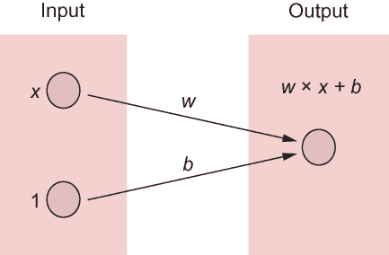
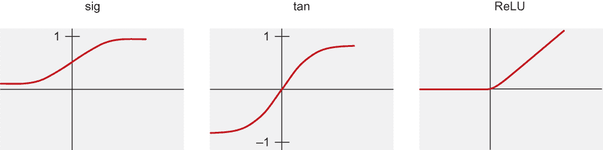
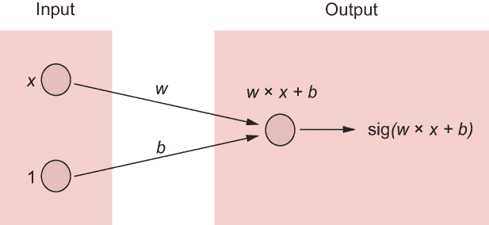
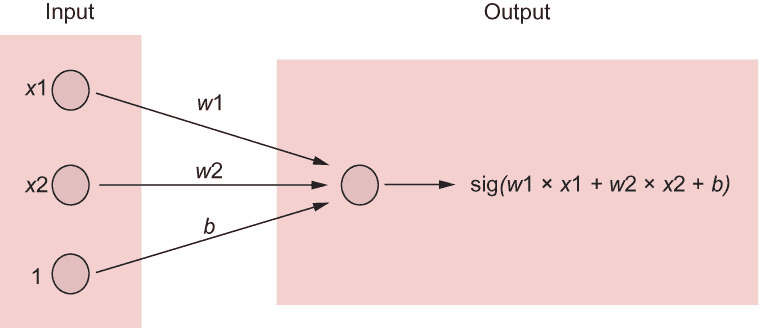
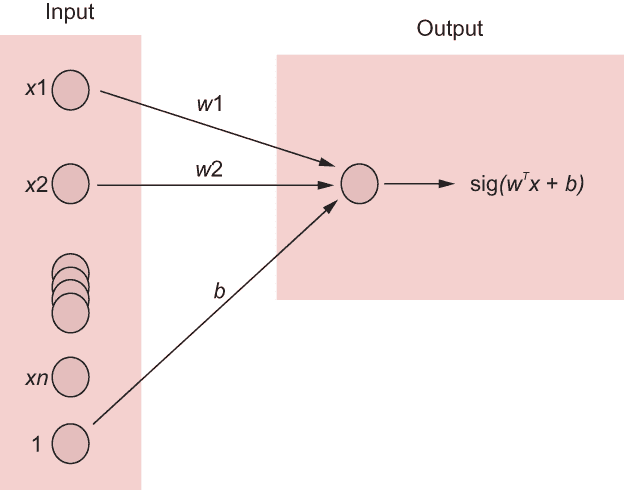
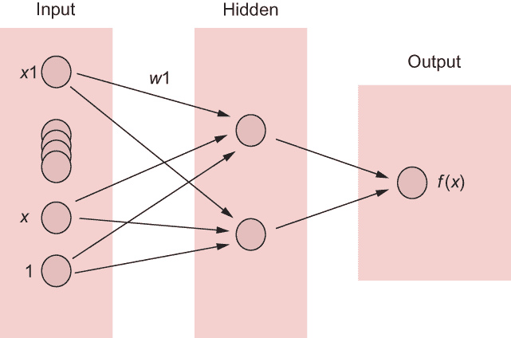
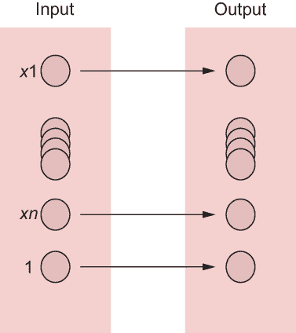
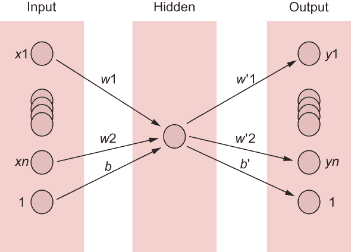
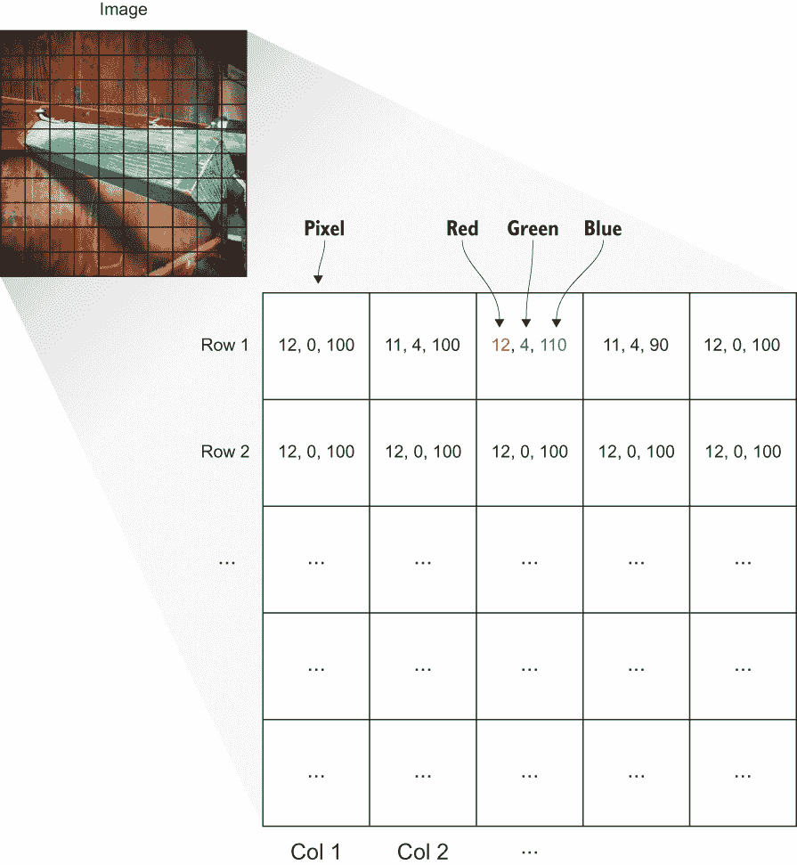
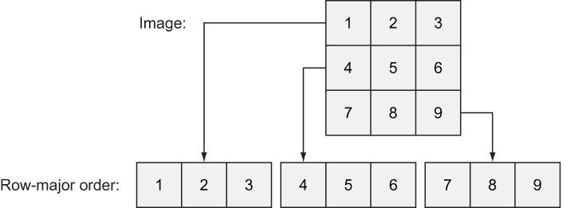

# 11 概览自动编码器

本章涵盖

+   了解神经网络

+   设计自动编码器

+   使用自动编码器表示图像

你是否曾经听到有人哼唱一段旋律并识别出这首歌？这可能对你来说很容易，但我在音乐方面幽默地没有音感。哼唱是对歌曲的一种近似。更好的近似可能是唱歌。加入一些乐器，有时，翻唱的歌曲听起来与原版几乎无法区分。

在本章中，你将不是处理歌曲，而是近似函数。*函数*是输入和输出之间关系的一般概念。在机器学习中，你通常想要找到将输入与输出关联起来的函数。找到最佳可能的函数拟合是困难的，但近似函数则容易得多。

人工神经网络（ANNs）是机器学习中的一个模型，可以近似任何函数。正如你所学的，你的模型是一个函数，它根据你拥有的输入给出你想要的输出。在机器学习的术语中，给定训练数据，你想要构建一个神经网络模型，它能最好地近似可能生成数据的隐含函数——这个函数可能不会给出确切的答案，但足够好以至于有用。

到目前为止，你通过明确设计一个函数来生成模型，无论是线性的；多项式的；还是更复杂的，如 softmax 回归或隐藏马尔可夫模型（HMMs）。神经网络在选择正确的函数和相应的模型时提供了一定的灵活性。理论上，神经网络可以模拟通用类型的转换，在这种情况下，你不需要了解太多关于被模拟的函数。

在 11.1 节介绍了神经网络之后，你将学习如何使用自动编码器，它们可以将数据编码成更小、更快的表示（11.2 节）。

## 11.1 神经网络

如果你听说过神经网络，你可能见过节点和边缘以复杂网格连接的图表。这种可视化主要受到生物学的启发——特别是大脑中的神经元。它也是可视化函数（如 f(x) = w × x + b）的一个方便方法，如图 11.1 所示。



图 11.1 线性方程 f(x) = w × x + b 的图形表示。节点用圆圈表示，边用箭头表示。边上的值通常称为权重，它们对输入进行乘法操作。当两个箭头指向同一个节点时，它们作为输入的总和。

作为提醒，**线性模型**是一组线性函数，例如 *f* (*x*) = *w* × *x* + *b*，其中 (*w*, *b*) 是参数向量。学习算法会在 *w* 和 *b* 的值周围漂移，直到找到最佳匹配数据的组合。算法成功收敛后，它会找到最佳可能的线性函数来描述数据。

线性是一个好的起点，但现实世界并不总是那么完美。因此，我们深入探讨了 TensorFlow 的起源。本章是介绍一种称为**人工神经网络**（ANN）的模型，它可以近似任意函数（不仅仅是线性函数）。

练习 11.1

f (x) = |x| 是线性函数吗？

**答案**

不，它是两个在零点缝合在一起的线性函数，而不是一条直线。

要引入非线性概念，对每个神经元的输出应用一个非线性函数，称为**激活函数**，是有效的。最常用的三个激活函数是 *sigmoid*（sig）、*双曲正切*（tan）和一种称为**ReLU**（Rectifying Linear Unit）的**斜坡**函数，如图 11.2 所示。



图 11.2 使用非线性函数，如 sig、tan 和 ReLU，向你的模型引入非线性。

你不必过于担心在什么情况下哪种激活函数更好。答案仍然是一个活跃的研究课题。请随意尝试图 11.2 中显示的三个函数。通常，最佳选择是通过交叉验证来确定哪个函数在给定的数据集上给出最佳模型。你还记得第五章中的混淆矩阵吗？你测试哪个模型给出的假阳性或假阴性最少，或者最适合你需求的任何其他标准。

sigmoid 函数对你来说并不陌生。你可能记得，第五章和第六章中的逻辑回归分类器将这个 sigmoid 函数应用于线性函数 *w* × *x* + *b*。图 11.3 中的神经网络模型表示函数 *f* (*x*) = sig(*w* × *x* + *b*)。该函数是一个单输入、单输出的网络，其中 *w* 和 *b* 是该模型的参数。



图 11.3 将非线性函数，如 sigmoid，应用于节点的输出。

如果你有两个输入 (*x*1 和 *x*2)，你可以修改你的神经网络，使其看起来像图 11.4 中的那样。给定训练数据和损失函数，要学习的参数是 *w*1、*w*2 和 b。当你试图建模数据时，函数有多个输入是很常见的。例如，图像分类将整个图像（像素逐像素）作为输入。



图 11.4 一个双输入网络将有三个参数（w 1、w 2 和 b）。指向同一节点的多条线表示求和。

自然地，你可以推广到任意数量的输入（*x*1, *x*2, ..., *xn*）。相应的神经网络表示函数 *f*`(`*x*1, ..., *xn*`)` = sig`(`*wn* × *xn* + ... + *w*1 × *x*1 + *b*`)`，如图 11.5 所示。



图 11.5 输入维度可以是任意长的。例如，灰度图像中的每个像素都可以有一个相应的输入 x1。这个神经网络使用所有输入生成一个单一的输出数字，你可能用它来进行回归或分类。符号 w^T 表示你正在将 w（一个 n × 1 的向量）转置成一个 1 × n 的向量。这样，你可以正确地与 x（具有 n × 1 的维度）相乘。这种矩阵乘法也称为点积，它产生一个标量（一维）值。

到目前为止，你只处理了输入层和输出层。没有任何阻止你在中间任意添加神经元。既不作为输入也不作为输出的神经元称为*隐藏神经元*。这些神经元被隐藏在神经网络的输入和输出接口后面，因此没有人可以直接影响它们的值。*隐藏层*是任何未连接的隐藏神经元集合，如图 11.6 所示。添加更多的隐藏层可以大大提高网络的表达能力。



图 11.6 不与输入和输出都接口的节点称为隐藏神经元。隐藏层是一组未连接的隐藏单元。

只要激活函数是非线性的，至少有一个隐藏层的神经网络可以逼近任意函数。在线性模型中，无论学习到什么参数，函数都保持线性。另一方面，具有隐藏层的非线性神经网络模型足够灵活，可以近似表示任何函数。这是一个多么美好的时代！

TensorFlow 附带许多辅助函数，可以帮助你以高效的方式获得神经网络的参数。当你开始使用你的第一个神经网络架构：自动编码器时，你将在本章中看到如何调用这些工具。

## 11.2 自动编码器

*自动编码器*是一种神经网络，它试图学习使输出尽可能接近输入的参数。一个明显的方法是直接返回输入，如图 11.7 所示。



图 11.7 如果你想创建一个输入等于输出的网络，你可以连接相应的节点并将每个参数的权重设置为 1。

但自动编码器比这更有趣。它包含一个小的隐藏层！如果这个隐藏层的维度比输入小，那么隐藏层就是你的数据压缩，称为*编码*。

在现实世界中编码数据

有几种音频格式，但最流行的可能是 MP3，因为它相对较小的文件大小。你可能已经猜到，这种高效的存储方式是有代价的。生成 MP3 文件的算法将原始未压缩音频缩小到一个听起来与你耳朵相似但文件大小小得多的文件。但是它是有损的，这意味着你将无法从编码版本完全恢复原始未压缩音频。

类似地，在本章中，我们希望降低数据的维度，使其更易于处理，但并不一定需要创建一个完美的复制。

从隐藏层重建输入的过程称为*解码*。图 11.8 展示了自动编码器的夸张示例。



图 11.8 在这里，你为尝试重建其输入的网络引入了一个限制。数据将通过一个狭窄的通道，如图中的隐藏层所示。在这个例子中，隐藏层只有一个节点。这个网络试图将一个 n 维输入信号编码（和解码）为一维，这在实践中可能很困难。

编码是减少输入维度的绝佳方式。例如，如果你能将 256 × 256 的图像表示为 100 个隐藏节点，那么你已将每个数据项减少了数千倍。

练习 11.2

让 x 表示输入向量（x1, x2, ..., xn），让 y 表示输出向量（y1, y2, ..., yn）。最后，让 w 和 w’分别表示编码器和解码器的权重。训练这个神经网络的可能成本函数是什么？

**答案**

请参阅列表 11.3 中的损失函数。

使用面向对象编程风格实现自动编码器是有意义的。这样，你可以在其他应用中重用这个类，而不用担心紧密耦合的代码。按照列表 11.1 中的概述创建你的代码可以帮助你构建更深的架构，例如*堆叠自动编码器*，这在经验上已被证明表现更好。

提示：通常，在神经网络中，如果你有足够的数据来避免模型过拟合，增加更多的隐藏层似乎可以提高性能。

列表 11.1 Python 类架构

```
class Autoencoder:
    def __init__(self, input_dim, hidden_dim):    ❶

    def train(self, data):                        ❷

    def test(self, data):                         ❸
```

❶ 初始化变量

❷ 在数据集上训练

❸ 对一些新数据的测试

打开一个新的 Python 源文件，并将其命名为 autoencoder.py。这个文件将定义你将在单独的代码中使用的`autoencoder`类。

构造函数将设置所有 TensorFlow 变量、占位符、优化器和算子。任何不需要立即会话的东西都可以放在构造函数中。因为你正在处理两组权重和偏差（一组用于编码步骤，另一组用于解码步骤），你可以使用 TensorFlow 的`tf.name`作用域来区分变量的名称。

列表 11.2 展示了在命名范围内定义变量的一个示例。现在你可以无缝地保存和恢复这个变量，而不用担心名称冲突。

列表 11.2 使用名称范围

```
with tf.name_scope('encode'):
    weights = tf.Variable(tf.random_normal([input_dim, hidden_dim], 
    ➥ dtype=tf.float32), name='weights')
    biases = tf.Variable(tf.zeros([hidden_dim]), name='biases')
```

接下来，实现构造函数，如列表 11.3 所示。

列表 11.3 `autoencoder`类

```
import tensorflow as tf
import numpy as np

class Autoencoder:
    def __init__(self, input_dim, hidden_dim, epoch=250, learning_rate=0.001):
        self.epoch = epoch                                               ❶
        self.learning_rate = learning_rate                               ❷

        x = tf.placeholder(dtype=tf.float32, shape=[None, input_dim])    ❸

        with tf.name_scope('encode'):                                    ❹
            weights = tf.Variable(tf.random_normal([input_dim, hidden_dim],  
            ➥ dtype=tf.float32), name='weights')
            biases = tf.Variable(tf.zeros([hidden_dim]), name='biases')
            encoded = tf.nn.tanh(tf.matmul(x, weights) + biases)
        with tf.name_scope('decode'):                                    ❺
            weights = tf.Variable(tf.random_normal([hidden_dim, input_dim], 
            ➥ dtype=tf.float32), name='weights')
            biases = tf.Variable(tf.zeros([input_dim]), name='biases')
            decoded = tf.matmul(encoded, weights) + biases

        self.x = x                                                       ❻
        self.encoded = encoded                                           ❻
        self.decoded = decoded                                           ❻

        self.loss = tf.sqrt(tf.reduce_mean(tf.square(tf.subtract(self.x,  
        ➥ self.decoded))))                                              ❼
        self.train_op = tf.train.RMSPropOptimizer(self.learning_rate).minimize(self.loss)   ❽
        self.saver = tf.train.Saver()                                    ❾
```

❶ 学习周期数

❷ 优化器的超参数

❸ 定义输入层数据集

❹ 在名称范围内定义权重和偏差，以便你能将它们与解码器的权重和偏差区分开来

❺ 解码器的权重和偏差定义在这个名称范围内。

❻ 这些将是方法变量。

❼ 定义重建成本

❽ 选择优化器

❾ 设置保存器以在学习过程中保存模型参数

现在，在列表 11.4 中，你将定义一个名为`train`的类方法，它将接收一个数据集并学习参数以最小化其损失。

列表 11.4 训练自动编码器

```
    def train(self, data):
        num_samples = len(data)
        with tf.Session() as sess:                               ❶
            sess.run(tf.global_variables_initializer())          ❶
            for i in range(self.epoch):                          ❷
                for j in range(num_samples):                     ❸
                    l, _ = sess.run([self.loss, self.train_op],  ❸
                    ➥ feed_dict={self.x: [data[j]]})            ❸
                if i % 10 == 0:                                  ❹
                    print('epoch {0}: loss = {1}'.format(i, l))  ❹
                    self.saver.save(sess, './model.ckpt')        ❺
            self.saver.save(sess, './model.ckpt')                ❺
```

❶ 启动 TensorFlow 会话并初始化所有变量

❷ 遍历构造函数中定义的周期数

❸ 一次训练一个样本，在数据项上训练神经网络

❹ 每 10 个周期打印一次重建误差

❺ 将已学习的参数保存到文件

现在你有足够的代码来设计一个从任意数据中学习自动编码器的算法。在你开始使用这个类之前，创建一个额外的方法。如列表 11.5 所示，`test`方法让你可以在新数据上评估自动编码器。

列表 11.5 在数据上测试模型

```
    def test(self, data):
        with tf.Session() as sess:
            self.saver.restore(sess, './model.ckpt')                      ❶
            hidden, reconstructed = sess.run([self.encoded, self.decoded], feed_dict={self.x: data})                                            ❷
        print('input', data)  
        print('compressed', hidden)
        print('reconstructed', reconstructed)
        return reconstructed
```

❶ 加载已学习的参数

❷ 重建输入

最后，创建一个新的 Python 源文件名为 main.py，并使用你的`autoencoder`类，如列表 11.6 所示。

列表 11.6 使用你的`autoencoder`类

```
from autoencoder import Autoencoder
from sklearn import datasets

hidden_dim = 1
data = datasets.load_iris().data
input_dim = len(data[0])
ae = Autoencoder(input_dim, hidden_dim)
ae.train(data)
ae.test([[8, 4, 6, 2]])
```

运行`train`函数将输出关于损失如何在各个时期减少的调试信息。`test`函数显示编码和解码过程的信息：

```
('input', [[8, 4, 6, 2]])
('compressed', array([[ 0.78238308]], dtype=float32))
('reconstructed', array([[ 6.87756062,  2.79838109,  6.25144577,  
➥ 2.23120356]], dtype=float32))
```

注意，你可以将一个 4D 向量压缩成 1D，然后通过一些数据损失将其解码回 4D 向量。

## 11.3 批量训练

如果你没有时间压力，一次训练一个样本是训练网络最安全的方法。但如果你的网络训练时间过长，一个解决方案是同时使用多个数据输入进行训练，称为*批量训练*。

通常，随着批量大小的增加，算法速度会加快，但成功收敛的可能性会降低。批量大小的比较是一把双刃剑。在列表 11.7 中运用它。你稍后会使用那个辅助函数。

列表 11.7 批量辅助函数

```
 def get_batch(X, size):
    a = np.random.choice(len(X), size, replace=False)
    return X[a]
```

要使用批量学习，你需要修改列表 11.4 中的`train`方法。批量版本，如列表 11.8 所示，为每个数据批次插入一个额外的内部循环。通常，批次数应该足够，以便在同一个时期内覆盖所有数据。

列表 11.8 批量学习

```
def train(self, data, batch_size=10):
        with tf.Session() as sess:
            sess.run(tf.global_variables_initializer())
            for i in range(self.epoch):
                for j in range(500):                               ❶
                    batch_data = get_batch(data, self.batch_size)  ❷
                    l, _ = sess.run([self.loss, self.train_op], 
                    ➥ feed_dict={self.x: batch_data})
                if i % 10 == 0:
                    print('epoch {0}: loss = {1}'.format(i, l))
                    self.saver.save(sess, './model.ckpt')
            self.saver.save(sess, './model.ckpt')
```

❶ 遍历各种批次选择

❷ 在随机选择的批次上运行优化器

## 11.4 处理图像

大多数神经网络，如您的自动编码器，只接受 1D 输入。另一方面，图像的像素由行和列索引。此外，如果一个像素是彩色的，它具有红色、绿色和蓝色浓度的值，如图 11.9 所示。



图 11.9 一幅彩色图像由像素组成，每个像素包含红色、绿色和蓝色的值。

管理图像高维度的便捷方法涉及两个步骤：

1.  将图像转换为灰度。将红色、绿色和蓝色的值合并到 *像素强度* 中，它是颜色值的加权平均值。

1.  将图像重新排列成行主序。*行主序*将数组存储为更长的单维集合；您将数组的所有维度放在第一个维度的末尾，这使得您可以用一个数字而不是两个数字来索引图像。如果一个图像是 3 × 3 像素，您将其重新排列成图 11.10 所示的结构。



图 11.10 图像可以用行主序表示。这样，您可以将二维结构表示为一维结构。

您可以使用多种方式在 TensorFlow 中使用图像。如果您在硬盘上有一堆图片，您可以使用 TensorFlow 中的 SciPy 加载它们。列表 11.9 展示了如何以灰度模式加载图像，调整大小，并以行主序表示它。

列表 11.9 加载图像

```
from scipy.misc import imread, imresize

gray_image = imread(filepath, True)                ❶
small_gray_image = imresize(gray_image, 1\. / 8.)   ❷
x = small_gray_image.flatten()                     ❸
```

❶ 以灰度模式加载图像

❷ 将其调整到更小的尺寸

❸ 将其转换为 1D 结构

图像处理是一个充满活力的研究领域，因此数据集很容易获得，您可以使用这些数据集而不是使用自己有限的图像。例如，名为 CIFAR-10 的数据集包含 60,000 个标记的图像，每个图像大小为 32 × 32。

练习 11.3

您能列出其他在线图像数据集吗？在网上搜索更多。

**答案**

深度学习社区中最常用的数据集可能是 ImageNet ([www.image-net.org](http://www.image-net.org))。您也可以在 [`deeplearning.net/datasets`](http://deeplearning.net/datasets) 找到一份很好的列表。

从 [www.cs.toronto.edu/~kriz/cifar.html](http://www.cs.toronto.edu/~kriz/cifar.html) 下载 Python 数据集。将提取的 cifar-10-batches-py 文件夹放置在您的当前工作目录中。列表 11.10 来自 CIFAR-10 网页；将代码添加到名为 main_imgs.py 的新文件中。

列表 11.10 从提取的 CIFAR-10 数据集中读取

```
import pickle

def unpickle(file):         ❶
    fo = open(file, 'rb')
    dict = pickle.load(fo, encoding='latin1')
    fo.close()
    return dict
```

❶ 读取 CIFAR-10 文件，返回加载的字典

您可以使用列表 11.10 中创建的 `unpickle` 函数读取数据集中的每个文件。CIFAR-10 数据集包含六个文件，每个文件以 `data_batch_` 开头，后跟一个数字。每个文件包含关于图像数据和相应标签的信息。列表 11.11 展示了如何遍历所有文件并将数据集附加到内存中。

列表 11.11 将所有 CIFAR-10 文件读取到内存中

```
import numpy as np

names = unpickle('./cifar-10-batches-py/batches.meta')['label_names']
data, labels = [], []
for i in range(1, 6):                                            ❶
    filename = './cifar-10-batches-py/data_batch_' + str(i)
    batch_data = unpickle(filename)                              ❷
    if len(data) > 0:
        data = np.vstack((data, batch_data['data']))             ❸
        labels = np.hstack((labels, batch_data['labels']))       ❹
    else:
        data = batch_data['data']
        labels = batch_data['labels']
```

❶ 遍历六个文件

❷ 加载文件以获取 Python 字典

❸ 数据样本的行代表每个样本，所以你垂直堆叠它。

❹ 标签是一维的，所以你水平堆叠它们。

每个图像都表示为一系列红色像素，接着是绿色像素，然后是蓝色像素。列表 11.12 创建了一个辅助函数，通过平均红色、绿色和蓝色值将图像转换为灰度。

注意：你可以用其他方法实现更逼真的灰度，但这种方法通过平均三个值来完成工作。人类对绿光的感知更敏感，所以在某些其他版本的灰度中，绿色值可能在平均中具有更高的权重。

列表 11.12 将 CIFAR-10 图像转换为灰度

```
def grayscale(a):
    return a.reshape(a.shape[0], 3, 32, 32).mean(1).reshape(a.shape[0], -1)

data = grayscale(data)
```

最后，收集某一类别的所有图像，例如“马”。你将在所有马的图片上运行你的自动编码器，如列表 11.13 所示。

列表 11.13 设置自动编码器

```
from autoencoder import Autoencoder

x = np.matrix(data)
y = np.array(labels)

horse_indices = np.where(y == 7)[0]     ❶

horse_x = x[horse_indices]

print(np.shape(horse_x))                ❷

input_dim = np.shape(horse_x)[1]
hidden_dim = 100
ae = Autoencoder(input_dim, hidden_dim)
ae.train(horse_x)
```

❶ 从用于索引数据数组 x 的索引集中选择马（标签 7）

❷ 大小为 (5000, 3072) 的矩阵，5,000 张图像和 32 × 32*3 个通道（R,G,B），或 3,072 个值

现在，你可以将类似于你的训练数据集的图像编码为 100 个数字。这个自动编码器模型是最简单的之一，所以很明显，编码将是损失性的。小心：运行此代码可能需要长达 10 分钟。输出将跟踪每 10 个周期的损失值：

```
epoch 0: loss = 99.8635025024
epoch 10: loss = 35.3869667053
epoch 20: loss = 15.9411172867
epoch 30: loss = 7.66391372681
epoch 40: loss = 1.39575612545
epoch 50: loss = 0.00389165547676
epoch 60: loss = 0.00203850422986
epoch 70: loss = 0.00186171964742
epoch 80: loss = 0.00231492402963
epoch 90: loss = 0.00166488380637
epoch 100: loss = 0.00172081717756
epoch 110: loss = 0.0018497039564
epoch 120: loss = 0.00220602494664
epoch 130: loss = 0.00179589167237
epoch 140: loss = 0.00122790911701
epoch 150: loss = 0.0027100709267
epoch 160: loss = 0.00213225837797
epoch 170: loss = 0.00215123943053
epoch 180: loss = 0.00148373935372
epoch 190: loss = 0.00171591725666
```

请参阅本书的网站 ([`mng.bz/nzpa`](http://mng.bz/nzpa)) 或 GitHub 仓库 ([`mng.bz/v9m7`](http://mng.bz/v9m7)) 以获取输出示例的完整示例。

## 11.5 自动编码器的应用

本章介绍了最直接的自动编码器类型，但其他变体也已被研究，每种都有其优点和应用。让我们看看几个例子：

+   一个 *堆叠自动编码器* 以与普通自动编码器相同的方式开始。它通过最小化重建误差来学习输入到较小隐藏层的编码。然后，将隐藏层作为新自动编码器的输入，该自动编码器试图将第一层隐藏神经元编码到一个更小的层（第二层隐藏神经元）。这个过程可以按需继续。通常，学习的编码权重被用作解决深度神经网络架构中的回归或分类问题的初始值。

+   一个 *去噪自动编码器* 接收的是经过噪声处理的输入而不是原始输入，并试图“去噪”它。成本函数不再用于最小化重建误差。现在你正在尝试最小化去噪图像与原始图像之间的误差。直觉是，即使照片上有划痕或标记，我们的人类大脑仍然可以理解照片。如果一台机器也能透过噪声输入来恢复原始数据，那么它可能对数据的理解更好。去噪模型已被证明能更好地捕捉图像的显著特征。

+   一种 *变分自动编码器* 可以直接根据隐藏变量生成新的自然图像。比如说，你将一张男人的照片编码为一个 100 维向量，然后将一张女人的照片编码为另一个 100 维向量。你可以取这两个向量的平均值，通过解码器处理，并生成一个合理的图像，代表一个介于男人和女人之间的形象。这种变分自动编码器的生成能力来源于一种称为 *贝叶斯网络* 的概率模型。它也是现代深度伪造和生成对抗网络中使用的某些技术之一。

## 摘要

+   当线性模型无法有效描述数据集时，神经网络是有用的。

+   自动编码器是一种无监督学习算法，试图重现其输入，并在这样做的同时揭示数据中的有趣结构。

+   通过展平和灰度化，图像可以轻松地作为输入馈送到神经网络中。
