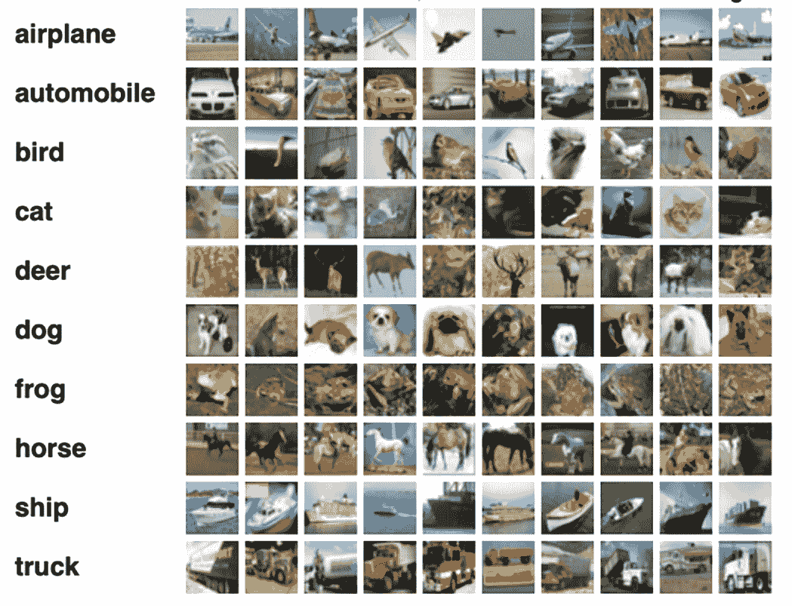
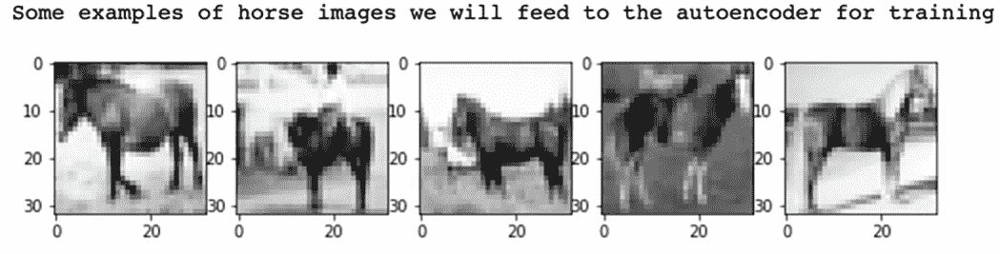
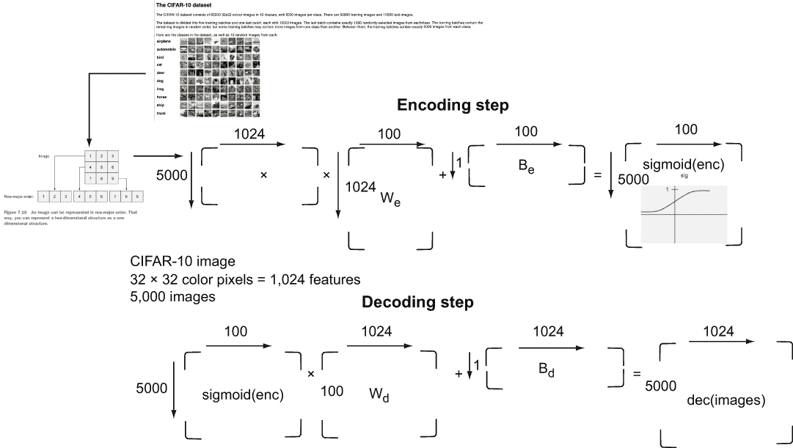
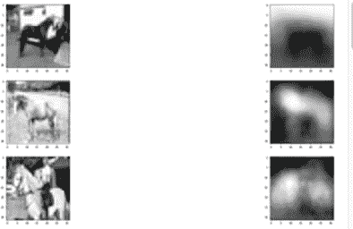
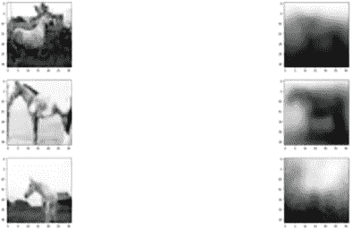
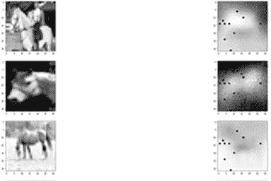

# 12 应用自动编码器：CIFAR-10 图像数据集

本章涵盖

+   导航和理解 CIFAR-10 图像数据集的结构

+   构建自动编码器模型以表示不同的 CIFAR-10 图像类别

+   将 CIFAR-10 自动编码器应用于图像分类

+   在 CIFAR-10 图像上实现堆叠和去噪自动编码器

自动编码器是学习任意函数的强大工具，这些函数可以将输入转换为输出，而不需要完整的规则集来完成。自动编码器得名于其功能：学习一个比其大小小得多的输入表示，这意味着使用更少的知识编码输入数据，然后解码内部表示以近似地回到原始输入。当输入是图像时，自动编码器有许多有用的应用。压缩是一个，例如使用隐藏层中的 100 个神经元，并以行顺序格式格式化你的 2D 图像输入（第十一章）。通过红、绿、蓝通道的平均值，自动编码器学习图像的表示，并能够将 32 × 32 × 3 高度 × 宽度 × 通道图像，或 3,072 个像素强度编码为 100 个数字，这是数据量减少了 30 倍。这压缩效果如何？尽管你在第十一章中训练了一个网络来展示这个用例，但你没有探索图像的最终学习表示，但你在本章中将会。

通过使用自动编码器的表示也可以进行分类。你可以在一个标记的训练数据集（如加拿大高级研究研究所的 CIFAR-10 数据）上训练一组马图像的自动编码器，然后比较自动编码器对马的表示——这些经过训练和加权的 100 个数字，在许多样本上训练——与自动编码器对另一个图像类别（如“青蛙”）的学习表示。表示将不同，你可以用它作为对图像类型进行分类（和聚类）的紧凑方式。此外，如果你可以用强大的表示来分类样本，你可以检测异常样本，从而在数据序列中检测到某些数据集的不同，或者执行异常检测。你将在本章中探索这些自动编码器的用途，本章重点介绍 CIFAR-10 数据集。

正如我在第十一章末尾所暗示的，存在不同类型的自动编码器，包括堆叠自动编码器，它使用多个隐藏层并支持用于分类的深度架构。此外，去噪自动编码器试图对输入（如图像）进行噪声处理，并查看网络是否仍然能够学习一个更鲁棒的表示，该表示对图像不完美具有弹性。你将在本章中探索这两个概念。

## 12.1 什么是 CIFAR-10？

CIFAR-10 的名字来源于其 10 个图像类别，包括`automobile`（汽车）、`plane`（飞机）和`frog`（青蛙）。CIFAR-10 是从大小为 32 × 32 和三通道 RGB 格式的 8000 万 Tiny Images 数据集中选出的标记图像的强大工具。每张图像代表 3,072 个全色像素和 1,024 个灰度像素。你可以在[`people.csail.mit.edu/torralba/publications/80millionImages.pdf`](https://people.csail.mit.edu/torralba/publications/80millionImages.pdf)了解更多关于 Tiny Images 的信息。

在深入研究自动编码器表示之前，详细探索 CIFAR-10 数据集是值得的。

CIFAR-10 被分为训练集和测试集，这是一个好的做法，正如我一直在向你宣扬的那样。遵循保留大约 80%的数据用于训练和 20%的数据用于测试的做法，该数据集由 60,000 张图像组成，分为 50,000 张训练图像和 10,000 张测试图像。每个图像类别——`airplane`（飞机）、`automobile`（汽车）、`bird`（鸟）、`cat`（猫）、`deer`（鹿）、`dog`（狗）、`frog`（青蛙）、`horse`（马）、`ship`（船）和`truck`（卡车）——在数据集中有 6,000 个代表性样本。训练集包括每个类别的 5,000 个随机样本，测试集包括每个 10 个类别的 1,000 个随机样本。数据以二进制文件格式存储在磁盘上，适用于 Python、Matlab 和 C 编程用户。50,000 张图像的训练数据集被分为五个批次，每个批次有 10,000 张图像，训练文件批次是一个包含 10,000 张图像的单个文件，图像顺序是随机的。图 12.1 显示了 CIFAR-10 及其 10 个类别的视觉表示，其中显示了随机选择的图像。

要转换为灰度还是不转换

你可能想知道为什么在第十章和第十一章中使用灰度图像而不是完整的 RGB 值。也许颜色属性是你希望你的神经网络学习的东西，那么为什么去掉 R(红色)、G(绿色)和 B(蓝色)，并用灰度代替它们？答案在于降维。转换为灰度可以将所需的参数数量减少 3 倍，这有助于训练和学习，而不会牺牲太多。但这并不是说你永远不会想训练一个以颜色为特征的神经网络。当你试图在一张同时有蓝色和红色杯子的图片中找到黄色杯子时，你必须使用颜色。但在本章的工作中，自动编码器对三分之二的数据量就足够满意了，你的电脑 CPU 风扇也是如此。



图 12.1 CIFAR-10 图像类别的每个类别随机挑选的 10 个样本。

在第十一章中，你构建了一个`autoencoder`类，它接受一个 CIFAR-10 批次的`horse`类图像；然后它学习图像的表示，以便将每个 1,024 像素（灰度 32 × 32）的图像减少到 100 个数字。编码性能如何？你将在 12.1.1 节中探索这个主题，同时刷新你对`autoencoder`类的记忆。

### 12.1.1 评估你的 CIFAR-10 自动编码器

你在第十一章中构建的 CIFAR-10 `autoencoder` 类有一个大小为 100 个神经元的单个隐藏层，输入是一个 5000 × 1024 的训练图像向量，使用 `tf.matmul` 和大小为 1024 × 100 的隐藏层对输入进行编码，并使用大小为 100 × 1024 的输出层对隐藏层进行解码。`autoencoder` 类使用 1,000 个 epoch 和用户指定的批次大小进行训练，并且还提供了方法通过打印隐藏神经元的值或编码以及原始输入值的解码表示来测试这个过程。列表 12.1 显示了该类及其实用方法。

列表 12.1 `autoencoder` 类

```
def get_batch(X, size):
    a = np.random.choice(len(X), size, replace=False)                       ❶
    return X[a]                                                             ❶

class Autoencoder:
    def __init__(self, input_dim, hidden_dim, epoch=1000, batch_size=50, 
    ➥ learning_rate=0.001):
        self.epoch = epoch
        self.batch_size = batch_size
        self.learning_rate = learning_rate

        x = tf.placeholder(dtype=tf.float32, shape=[None, input_dim])
        with tf.name_scope('encode'):                                       ❷
            weights = tf.Variable(tf.random_normal([input_dim, hidden_dim],  
            ➥ dtype=tf.float32), name='weights')
            biases = tf.Variable(tf.zeros([hidden_dim]), name='biases')
            encoded = tf.nn.sigmoid(tf.matmul(x, weights) + biases)         ❸
        with tf.name_scope('decode'):
            weights = tf.Variable(tf.random_normal([hidden_dim, input_dim], 
            ➥ dtype=tf.float32), name='weights')
            biases = tf.Variable(tf.zeros([input_dim]), name='biases')
            decoded = tf.matmul(encoded, weights) + biases                  ❹

        self.x = x
        self.encoded = encoded
        self.decoded = decoded

        self.loss = tf.sqrt(tf.reduce_mean(tf.square(tf.subtract(self.x,    ❺
        ➥ self.decoded))))                                                 ❺
        self.train_op =                                                     ❺
        ➥ tf.train.RMSPropOptimizer(self.learning_rate).minimize(self.loss)❺

        self.saver = tf.train.Saver()                                       ❻

    def train(self, data):
        with tf.Session() as sess:
            sess.run(tf.global_variables_initializer())
            for i in range(self.epoch):
                for j in range(np.shape(data)[0] // self.batch_size):       ❼
                    batch_data = get_batch(data, self.batch_size)
                    l, _ = sess.run([self.loss, self.train_op], 
                    ➥ feed_dict={self.x: batch_data})
                if i % 10 == 0:
                    print('epoch {0}: loss = {1}'.format(i, l))
                    self.saver.save(sess, './model.ckpt')
            self.saver.save(sess, './model.ckpt')

    def test(self, data):
        with tf.Session() as sess:
            self.saver.restore(sess, './model.ckpt')
            hidden, reconstructed = sess.run([self.encoded, self.decoded],  ❽
            ➥ feed_dict={self.x: data})                                    ❽
        print('input', data)                                                ❽
        print('compressed', hidden)                                         ❽
        print('reconstructed', reconstructed)                               ❽
        return reconstructed
```

❶ 使用索引从 X 中获取随机选择的批次大小，由于 replace=False，只选择唯一样本

❷ 使用 tf.scope 构造重用权重和偏差进行编码步骤

❸ 创建大小为 input_dim 和 hidden_dim 的编码

❹ 使用学习到的权重将编码从 hidden_dim 解码回 input_dim

❺ 使用均方根误差（RMSE）作为损失函数和优化器

❻ 重用保存器来保存和恢复模型

❼ 通过 num_batches 或 floor(dataset size/ batch_size) 迭代每个 epoch 并进行训练

❽ 计算编码和解码层以及输出，并打印它们的值

虽然你在第十一章中运行了这个类，但你没有查看它的输入或解码步骤的输出，以检查它如何学习输入的表示。为此，你可以使用第十一章中的代码，该代码在 CIFAR-10 网站上被推荐作为一种读取存储在 Pickle 格式的 Python 格式数据的简单方法。Pickle 是一个用于紧凑二进制表示的 Python 库，它将 Python 对象序列化为字节流，然后提供方法将对象反序列化回从该字节流中激活的 Python 动态对象。你可以使用 `unpickle` 函数和相关数据集加载代码，例如 `greyscale` 函数，该函数通过取每个图像的 RGB 值的平均值，将 50,000 张训练的三通道 RGB 图像转换为单通道灰度图像。CIFAR-10 加载代码的其余部分遍历下载的五个 10,000 张图像的训练文件。这些文件是 Python pickle 格式；数据存储在具有键 `data` 和键 `labels` 的 Python 字典中，`labels` 的有效值（0-9）对应于 10 个图像类别。10 个图像类别的名称填充到从 Python pickle batches.meta 文件中读取的 `names` 变量中，包括值 `automobile`、`bird` 等等。每套 10,000 张图像和标签分别垂直和水平堆叠在两个 NumPy 数组上——`data` 的大小为 `(50000,1024)` 和 `labels` `(5000,` `)`，分别，并可供训练使用。列表 12.2 将 CIFAR-10 数据准备好用于 `Autoencoder`。

列表 12.2 为 `Autoencoder` 准备 CIFAR-10 数据

```
def unpickle(file):                                                        ❶
    fo = open(file, 'rb')
    dict = pickle.load(fo, encoding='latin1')
    fo.close()

    return dict                                                            ❷

def grayscale(a):
    return a.reshape(a.shape[0], 3, 32, 32).mean(1).reshape(a.shape[0], -1)❸

names = unpickle('./cifar-10-batches-py/batches.meta')['label_names']      ❹
data, labels = [], []
for i in range(1, 6):                                                      ❺
    filename = './cifar-10-batches-py/data_batch_' + str(i)                ❺
    batch_data = unpickle(filename)                                        ❺
    if len(data) > 0:
        data = np.vstack((data, batch_data['data']))                       ❻
        labels = np.hstack((labels, batch_data['labels']))                 ❻
    else:                                                                  ❻
        data = batch_data['data']                                          ❻
        labels = batch_data['labels']                                      ❻
data = grayscale(data)                                                     ❼
```

❶ 加载 CIFAR-10 批量 Pickle 文件。共有五个用于训练的文件和一个用于测试的文件，每个文件包含 10,000 张图像和标签。

❷ 使用 Pickle 加载返回的是 Python 字典，键为 data 和 labels。

❸ 将 3 通道 RGB 图像输入转换为 1 通道灰度图，通过平均 RGB 值实现

❹ 根据标签索引的每个标签索引命名的图像类别

❺ 迭代五个训练批次并反序列化数据

❻ 数据在第一次迭代后垂直堆叠为(50000,1024)，标签在水平堆叠为(50000, )

❼ 在(50000,1024)的图像数据数组上应用灰度函数

在将 CIFAR-10 的图像数据加载到`data`数组中，相关命名数组中的`labels`以及`names`数组提供与标签值关联的图像类别后，你可以查看特定的图像类别，例如`horse`，就像在第十一章中做的那样。通过首先从标签数组中选择所有马标签的索引，然后你可以使用这些索引来索引数据数组中的标签`ID=7`（`horse`），然后你可以使用 Matplotlib（列表 12.3）显示从 50,000 张图像集中的一小部分马图像——每个类别训练中有 5,000 张，另外 10,000 张用于测试（每个类别 1,000 张）。

列表 12.3 选择 5,000 张马图像并显示它们

```
x = np.matrix(data)                                                     ❶
y = np.array(labels)                                                    ❷
horse_indices = np.where(y == 7)[0]                                     ❸
horse_x = x[horse_indices]                                              ❹
print('Some examples of horse images we will feed to the autoencoder for 
➥ training')
plt.rcParams['figure.figsize'] = (10, 10)                               ❺
num_examples = 5                                                        ❺
for i in range(num_examples):                                           ❺
    horse_img = np.reshape(horse_x[i, :], (32, 32))                     ❻
    plt.subplot(1, num_examples, i+1)                                   ❻
    plt.imshow(horse_img, cmap='Greys_r')                               ❻
plt.show()                                                              ❻
```

❶ 将数据转换为 NumPy 矩阵，以便稍后用于 Autoencoder

❷ 通过显式转换将标签转换为 NumPy 数组，以便可以使用 np.where

❸ 使用 np.where 选择马标签的索引（类别 ID=7）

❹ 使用马索引索引到大小为(5000,1024)的图像数据

❺ 设置 Matplotlib 以打印五张 10x10 大小的马图像

❻ 显示马图像

结果输出显示在图 12.2 中。现在你可以看到使用你的 autoencoder 学习到的 CIFAR-10 图像表示。



图 12.2 从 CIFAR-10 训练数据中的 5,000 个样本集中返回的前五张马图像

现在回顾列表 12.4，其中包含训练 100 神经元 autoencoder 以学习这些马图像表示所需的小段代码。你需要运行你的 TensorFlow 训练的 autoencoder。

列表 12.4 训练你的`Autoencoder`

```
input_dim = np.shape(horse_x)[1]          ❶
hidden_dim = 100                          ❷
ae = Autoencoder(input_dim, hidden_dim)   ❷
ae.train(horse_x)                         ❷
```

❶ 输入维度大小为 1024（32 × 32）的灰度 CIFAR-10 图像。

❷ 使用隐藏神经元作为编码大小来训练 Autoencoder 以处理马图像。

接下来，我将向你展示如何使用你学习到的表示来评估你的编码过程做得有多好，以及它如何捕捉`horse`图像类别。

## 12.2 自编码器作为分类器

审查你完成构建 autoencoder 和准备 CIFAR-10 数据以加载的步骤可能是有益的。我将为你总结：

1.  加载 CIFAR-10 的 50,000 个训练图像。每个图像类别有 5,000 个样本图像。图像及其相关标签从 Python 的 Pickle 二进制表示中读取。

1.  每个 CIFAR-10 图像的大小为 32 × 32，具有三个通道，或红色、绿色和蓝色像素的一个值。您通过平均它们的三个值将三个通道转换为单通道灰度。

1.  您创建了一个`autoencoder`类，它有一个包含 100 个神经元的单个隐藏层，该层以 5,000 个具有 1,024 个灰度强度的像素的图像集作为输入，在编码步骤中将大小减少到 100 个值。编码步骤使用 TensorFlow，通过训练学习，并使用均方根误差（RMSE）作为损失函数及其相关的优化器来学习隐藏层编码的编码权重（We）和偏置（Be）。

1.  自动编码器的解码部分也学习相关的权重（Wd）和偏置（Bd），并在`test`函数中编码，您将在本节中使用它。您还将创建一个`classify`函数，该函数将展示您的网络管理的马图像的学得表示。

您的图像数据的学得表示是自动编码器中的编码隐藏层及其相关的学得权重。整个过程流程如图 12.3 所示。



图 12.3 整个 CIFAR-10 自动编码过程。大小为 32 × 32，具有三个通道的图像被重塑为 1,024 个灰度像素。

现在让我们看看关于图像学得编码的一些信息。您可以使用`Autoencoder.test`函数打印隐藏层的值及其重建输入的值。您可以在 1,000 个测试 CIFAR-10 马图像上尝试它，但首先，您必须加载图像（列表 12.5）。CIFAR-10 的测试数据以 Python Pickle 格式提供。加载它并将其转换为灰度应该很熟悉，选择`horse`类索引（类`ID=7`）和从 1,000 个图像的测试集中选择马图像也是如此。然后您将运行`Autoencoder.test`以了解自动编码器的性能如何。如您从列表 12.1 中可能记得的那样，`test`函数加载隐藏编码层，运行解码步骤，并显示原始输入值。

列表 12.5 加载测试 CIFAR-10 图像并评估`Autoencoder`

```
test_data = unpickle('./cifar-10-batches-py/test_batch')   ❶
test_x = grayscale(test_data['data'])                      ❶
test_labels = np.array(test_data['labels'])                ❶
test_horse_indices = np.where(test_labels==7)[0]           ❷
test_horse = test_x[test_horse_indices]                    ❷
ae.test(test_horse)                                        ❸
```

❶ 通过读取序列化字典中的‘data’和‘labels’键，加载了 CIFAR-10 的 10,000 个测试图像的 pickle 格式

❷ 选择马类 ID=7 的索引，并索引到图像数据数组中的 1,000 个马图像

❸ 运行自动编码器测试方法来评估自动编码器

运行列表 12.5 的输出如下：

```
input [[ 34\.          60.66666667  36.33333333 ...   5\.           3.66666667
    5\.        ]
 [111.66666667 120\.         116\.         ... 205.66666667 204.33333333
  206\.        ]
 [ 48.33333333  66.66666667  86.66666667 ... 135.33333333 133.66666667
  140\.        ]
 ...
 [ 29\.          43.33333333  58.66666667 ... 151\.         151.33333333
  147.33333333]
 [100.66666667 108.66666667 109.66666667 ... 143.33333333 128.66666667
   85.33333333]
 [ 75.33333333 104.66666667 106.33333333 ... 108.33333333  63.66666667
   26.33333333]]
compressed [[0\. 1\. 1\. ... 1\. 1\. 1.]
 [0\. 1\. 1\. ... 1\. 1\. 1.]
 [1\. 1\. 1\. ... 1\. 1\. 1.]
 ...
 [0\. 1\. 1\. ... 1\. 1\. 1.]
 [0\. 1\. 1\. ... 1\. 1\. 1.]
 [1\. 1\. 1\. ... 1\. 1\. 1.]]
reconstructed [[ 88.69392   93.134995  93.69954  ...  49.1538    53.48016   
  57.427284]
 [104.61283  101.96864  102.228165 ... 159.11684  158.36711  159.06337 ]
 [205.88844  204.99907  205.80833  ... 106.32716  107.85627  110.11922 ]
 ...
 [ 77.93032   76.28443   76.910736 ... 139.74327  139.15686  138.78288 ]
 [171.00897  170.47668  172.95482  ... 149.24767  148.32034  151.43066 ]
 [185.52625  183.34001  182.78853  ... 125.33179  127.04839  129.3505  ]]
```

Python 和 NumPy 进行了可爱的总结：

+   1,000 个测试马图像中的每个图像包含 1,024 个图像像素，因此`input`中的每一行是 1,024 个数字。

+   `compressed`层有 100 个神经元，开启（`1.`）或关闭（`0.`）。

+   `reconstructed`值是自动编码器解码步骤之后恢复的值。

快速扫描图像值的重建显示出了相当大的差异。原始输入图像中的前三个数字——`34`、`60.66666667`和`36.33333333`——被自动编码器重建为`88.69392`、`93.134995`和`93.69954`。在其他图像和其他像素中存在类似差异，但不要过于担心它们。自动编码器默认训练了仅 100 个 epoch，学习率为 0.001。正如我在前面的章节中解释的，超参数调整是一个活跃的研究领域。您可以调整这些超参数并获得更好的值。您甚至可以执行其他优化和技巧，这些技巧我将在卷积神经网络（CNN）和数据增强出现时教给您，但到目前为止，使用`test`方法是一种快速而简单的方法来评估自动编码器。一种更好的方法可能是将图像的学习表示与其原始图像进行可视化比较，并直观地比较它们匹配得有多好。我会向您展示如何做，但首先，我将演示另一种计算方法来评估自动编码器。

### 12.2.1 通过损失使用自动编码器作为分类器

将重建图像的值与原始输入值进行比较，显示出重建像素值与原始像素值之间的差异。这种差异可以通过在训练过程中引导自动编码器的损失函数轻松测量。您使用了 RMSE。RMSE 是模型生成数据与输入之间的差异，平方后，通过平均值降低到标量，然后取平方根。RMSE 是评估训练损失的一个很好的距离度量。更好的是，它是一个很好的分类指示，因为结果证明，属于特定图像类的图像与原始值相比，模型值产生的损失是相似的。

马的图像有特定的损失，飞机的图像有不同的损失，等等。您可以通过向`autoencoder`类添加一个简单的方法来测试这种直觉：`classify`。这个方法的工作将是计算`horse`类的损失函数，然后比较这些图像产生的损失与其他图像类别的损失，看看是否存在差异。列表 12.6 向`autoencoder`类添加了`classify`方法，并返回隐藏和重建层以供以后使用。

列表 12.6 `Autoencoder.classify` 比较不同类别的损失

```
    def classify(self, data, labels):
        with tf.Session() as sess:
            sess.run(tf.global_variables_initializer())                     ❶
            self.saver.restore(sess, './model.ckpt')                        ❶
            hidden, reconstructed = sess.run([self.encoded, self.decoded], 
            ➥ feed_dict={self.x: data})                                    ❷
            reconstructed = reconstructed[0]                                ❷
            loss = np.sqrt(np.mean(np.square(data - reconstructed), axis=1))❸
            horse_indices = np.where(labels == 7)[0]                        ❹
            not_horse_indices = np.where(labels != 7)[0]                    ❹
            horse_loss = np.mean(loss[horse_indices])                       ❹
            not_horse_loss = np.mean(loss[not_horse_indices])               ❹
            print('horse', horse_loss)                                      ❺
            print('not horse', not_horse_loss)                              ❺
            return hidden
```

❶ 初始化并加载 TensorFlow 训练的模型

❷ 获取隐藏（编码）层及其重建，用于计算损失

❸ 使用 NumPy 计算所有图像的损失 RMSE

❹ 计算马的图像索引和所有其他类别的索引，并计算所有图像（马或非马）的平均损失值

❺ 打印出分类器的马损失和非马损失

下面的输出来自列表 12.6：

```
horse 63.19770728235271
not horse 61.771580430829474
```

尽管不是令人震惊的，但与其他图像类别相比，`horse`从图像到重构的损失值明显不同，并且具有统计学意义。所以尽管自动编码器可能没有足够的经验以少量损失重构图像，但它已经学会了足够多的马图像表示，能够从 CIFAR-10 中的其他九个图像类别中区分其结构。酷！

现在你可以查看一些图像重构的差异。一点 Matplotlib 就能走得很远。你可以将`classify`函数返回的隐藏层和一个小型的`decode`方法应用到你的自动编码器上，这将生成特定编码图像的重构，并将其从 1,024 像素重新转换为 32 × 32 的灰度图像。代码在列表 12.7 中。

列表 12.7 将编码图像转换回 CIFAR-10 的解码方法

```
    def decode(self, encoding):
        with tf.Session() as sess:
            sess.run(tf.global_variables_initializer())
            self.saver.restore(sess, './model.ckpt')                       ❶
            reconstructed = sess.run(self.decoded, feed_dict={self.encoded:❶
            ➥ encoding})                                                  ❶
        img = np.reshape(reconstructed, (32, 32))                          ❷
        return img                                                         ❷
```

❶ 加载 TensorFlow 和存储的自动编码器模型以生成图像重构

❷ 将重构的 1,024 像素数组重塑为 32 × 32 的灰度图像并返回

运行该代码后，你可以使用 Matplotlib（列表 12.8）生成 CIFAR-10 测试数据集中前 20 张马图像的一组重构，左侧是原始图像，右侧是自动编码器“看到”的图像。

列表 12.8 评估和可视化 CIFAR-10 重构马图像

```
plt.rcParams['figure.figsize'] = (100, 100)                ❶
plt.figure()                                               ❶
for i in range(20):                                        ❷
    plt.subplot(20, 2, i*2 + 1)
    original_img = np.reshape(test_horse[i, :], (32, 32))  ❸
    plt.imshow(original_img, cmap='Greys_r')               ❸

    plt.subplot(20, 2, i*2 + 2)
    reconstructed_img = ae.decode([encodings_horse[i]])    ❹
    plt.imshow(reconstructed_img, cmap='Greys_r')          ❹

plt.show()                                                 ❺
```

❶ 设置 Matplotlib 图表为 100 × 100 的图区域（行）

❷ 遍历 CIFAR-10 的前 20 张测试马图像

❸ 对于每个 CIFAR-10 测试马图像，在列的左侧显示

❹ 对于每个 CIFAR-10 测试马图像，在列的右侧显示自动编码器重构

❺ 显示图表

图 12.4 显示了结果。



图 12.4 显示列表 12.8 输出的一部分，展示了前 20 张 CIFAR-10 测试马图像中的 3 张：左侧是原始的 CIFAR-10 测试马图像，右侧是自动编码器“看到”的图像

现在你已经有了评估你的自动编码器的数值和视觉方法，我将向你展示另一种类型的自动编码器：去噪自动编码器。

如果您仔细思考，检查图 12.4 右侧的自动编码器表示的结果是非常有趣的。基于右侧的一些表示，自动编码器显然对马的特征与背景以及物体的一般形状有一些基本理解。我通常将自动编码器表示想象成当你闭上眼睛尝试重新想象你很久以前看到的东西时你会想到的东西。有时，想象力可以让你相当好地记住最近未来，但你对遥远过去的许多表示看起来就像图 12.4 右侧的自动编码器生成的图像——基本特征、形状和与背景的区别，但绝不是完美的重建。如果一个自动编码器能够学会在记住图像时考虑不完美，它就能构建一个更健壮的模型。这就是降噪自动编码器发挥作用的地方。

## 12.3 降噪自动编码器

在现实生活中，我们人类用我们的思维去思考一段时间，以改善我们记住东西的方式。假设你正在试图记住和家人狗狗玩接球的样子，你努力回忆起它看起来像什么，或者它玫瑰色鼻子下的黑色毛斑。看到更多在类似区域有黑色毛斑的狗，或者有略微不同毛斑的狗，可能是不同颜色的，可能会触发你记忆中更好的重建。

其中一部分原因是我们的思维构建视觉模型，通过看到更多例子而变得更好。我将在第十四章中更详细地讨论这个话题，该章涵盖了 CNN，这是一种专注于描绘低级和高级图像特征的学习方法和网络架构。与你要回忆的那张图像极其相似的其他图像——比如一只老宠物——有助于你关注那张图像的重要特征。更多不同图像的例子也有帮助。带有噪声的图像——比如光、色调、对比度或其他可重复差异的变化——构建了一个更健壮的模型和原始图像的记忆。

从这个灵感出发，去噪自编码器通过将像素值通过高斯函数或随机屏蔽一些像素（通过关闭或打开原始图像中的像素）来引入一些噪声，从而构建一个更健壮、更鲁棒的网络学习图像的表示。你需要稍微修改自动编码器原始类来创建去噪自编码器，并在你的 CIFAR-10 数据上尝试它。列表 12.9 通过对获取批量数据的函数进行轻微修改来设置 `Denoiser` 类。你的 `Denoiser` 将维护输入的并行噪声版本，因此需要在批量函数和类的其余部分中考虑这一点。你将记住的大多数其他方法——`train`、`test`、`classify` 和 `decode`——与本章其他列表中的方法工作方式相同，除了 `train`，这在列表 12.11 中突出显示。

列表 12.9 去噪自编码器

```
def get_batch_n(X, Xn, size):                                             ❶
    a = np.random.choice(len(X), size, replace=False)                     ❶
    return X[a], Xn[a]                                                    ❶

class Denoiser:

    def __init__(self, input_dim, hidden_dim, epoch=10000, batch_size=50, 
    ➥ learning_rate=0.001):
        self.epoch = epoch
        self.batch_size = batch_size
        self.learning_rate = learning_rate

        self.x = tf.placeholder(dtype=tf.float32, shape=[None, input_dim], 
        ➥ name='x')
        self.x_noised = tf.placeholder(dtype=tf.float32, shape=[None,     ❷
        ➥ input_dim], name='x_noised')                                   ❷
        with tf.name_scope('encode'):                                     ❸
            self.weights1 = tf.Variable(tf.random_normal([input_dim, 
            ➥ hidden_dim], dtype=tf.float32), name='weights')
            self.biases1 = tf.Variable(tf.zeros([hidden_dim]), name='biases')
            self.encoded = tf.nn.sigmoid(tf.matmul(self.x_noised, 
            ➥ self.weights1) + self.biases1, name='encoded')
        with tf.name_scope('decode'):                                     ❹
            weights = tf.Variable(tf.random_normal([hidden_dim, input_dim], 
            ➥ dtype=tf.float32), name='weights')
            biases = tf.Variable(tf.zeros([input_dim]), name='biases')
            self.decoded = tf.matmul(self.encoded, weights) + biases
        self.loss = tf.sqrt(tf.reduce_mean(tf.square(tf.subtract(self.x, 
        ➥ self.decoded))))
        self.train_op = 
        ➥ tf.train.AdamOptimizer(self.learning_rate).minimize(self.loss) ❺
        self.saver = tf.train.Saver()
```

❶ 获取一批训练数据输入，以及其噪声版本

❷ 设置输入数据噪声版本的占位符

❸ 使用 sigmoid 函数创建权重、偏置和编码数据层

❹ 创建权重、偏置和解码数据层，用于发射学习到的表示

❺ 使用 AdamOptimizer 设置损失和训练操作

对于去噪器的设置中最大的不同之处在于存储一个并行 TensorFlow 占位符，用于存储输入数据的噪声版本，编码步骤使用这个版本而不是原始输入。你可以采取几种方法。例如，你可以使用高斯函数并采样随机像素，然后根据某些频率屏蔽输入像素。这些随机像素——正如你所猜想的——是机器学习建模过程中的另一个超参数。没有最佳方法，所以尝试不同的方法，并选择最适合你用例的方法。你的 `Denoiser` 将在列表 12.10 中实现两种噪声方法——高斯和随机屏蔽。

列表 12.10 为你的 `Denoiser` 添加噪声的方法

```
    def add_noise(self, data, noise_type=’mask-0.2’):
        if noise_type == 'gaussian':                                             ❶
            n = np.random.normal(0, 0.1, np.shape(data))                         ❶
            return data + n                                                      ❶
        if 'mask' in noise_type:                                                 ❷
            frac = float(noise_type.split('-')[1])                               ❷
            temp = np.copy(data)                                                 ❷
            for i in temp:                                                       ❷
                n = np.random.choice(len(i), round(frac * len(i)), replace=False)❷
                i[n] = 0
            return temp                                                          ❸
```

❶ 在高斯随机函数上为每个像素添加介于 0 和 0.1 之间的值

❷ 根据提供的百分比 frac 选择整体输入像素的一部分随机设置为值 0

❸ 返回噪声数据

使用噪声数据，`train` 方法使用 `get_batch_n` 方法，该方法返回用于训练的噪声和常规批量输入数据。此外，`test`、`classify` 和 `decode` 的其余方法没有变化，除了提供噪声数据，以便返回适当的张量。列表 12.11 通过省略 `decode` 函数（与列表 12.7 中的相同）来完成 `Denoiser` 类。

列表 12.11 `Denoiser` 类的其余部分

```
    def train(self, data):
        data_noised = self.add_noise(data)                                 ❶
            with tf.Session() as sess:                                     ❷
                sess.run(tf.global_variables_initializer())
                for i in range(self.epoch):
                    for j in range(50):
                        batch_data, batch_data_noised = get_batch_n(data, 
                        ➥ data_noised, self.batch_size)                   ❸
                        l, _ = sess.run([self.loss, self.train_op],
                        ➥ feed_dict={self.x: batch_data, self.x_noised: 
                        ➥ batch_data_noised})
                    if i % 10 == 0:
                        print('epoch {0}: loss = {1}'.format(i, l))
                        self.saver.save(sess, './model.ckpt')
                        epoch_time = int(time.time())
                self.saver.save(sess, './model.ckpt')

    def test(self, data):
        with tf.Session() as sess:
            self.saver.restore(sess, './model.ckpt')
            data_noised = self.add_noise(data)                             ❹
            hidden, reconstructed = sess.run([self.encoded, self.decoded], 
            ➥ feed_dict={self.x: data, self.x_noised:data_noised})
        print('input', data)
        print('compressed', hidden)
        print('reconstructed', reconstructed)
        return reconstructed

    def classify(self, data, labels):
        with tf.Session() as sess:
            sess.run(tf.global_variables_initializer())
            self.saver.restore(sess, './model.ckpt')
            data_noised = self.add_noise(data)
            hidden, reconstructed = sess.run([self.encoded, self.decoded], 
            ➥ feed_dict={self.x: data, self.x_noised:data_noised})
            reconstructed = reconstructed[0]
            print('reconstructed', np.shape(reconstructed))
            loss = np.sqrt(np.mean(np.square(data - reconstructed), axis=1))
            print('loss', np.shape(loss))
            horse_indices = np.where(labels == 7)[0]
            not_horse_indices = np.where(labels != 7)[0]
            horse_loss = np.mean(loss[horse_indices])
            not_horse_loss = np.mean(loss[not_horse_indices])
            print('horse', horse_loss)
            print('not horse', not_horse_loss)
            return hidden
```

❶ 使用 `add_noise` 函数创建数据的噪声版本

❷ 创建一个新的 TensorFlow 会话用于训练

❸ 使用噪声数据

❹ 获取用于测试和分类的数据的噪声版本

当你查看测试函数的输出时，你会注意到，由于只有 1,000 个测试样本和噪声，`去噪器`在分类能力和区分图像类别方面的早期收益有所下降，因为在`马`和`非马`类别之间平均损失的差异很小：

```
data (10000, 1024)
reconstructed (1024,)
loss (10000,)
horse 61.12571251705483
not horse 61.106683374373304
```

但不必担心，因为随着时间的推移，`去噪器`自编码器将学会一个更鲁棒的特征模型，对训练数据中的波动和不完美具有抵抗力，以发展一个更稳固的模型。对于目前你拥有的`马`类别，你需要比 CIFAR-10 更多的数据。图 12.5 显示了`去噪器`从 CIFAR-10 测试集的前 20 张马图像中学习到的图像表示（左侧）。还有另一个自编码器需要了解：堆叠或深度自编码器。向着终点前进！



图 12.5 自编码器的噪声版本及其表示（右侧）和原始 CIFAR-10 测试马图像（左侧）

## 12.4 堆叠深度自编码器

另一类自编码器被称为堆叠或深度自编码器。与只有一个隐藏层处理输入端的编码步骤并在输出端以一个隐藏神经元的单层结束解码不同，堆叠自编码器有多个隐藏神经元层，使用前一层的参数化和调整来学习未来层的表示。这些自编码器的未来层具有更少的神经元。目标是创建和学会对输入数据进行更压缩解释的最佳设置。

在实践中，堆叠自编码器中的每一层隐藏层都学习一组最优特征的参数化，以在相邻层中实现最优的压缩表示。你可以将每一层视为代表一组高阶特征，因为你还不知道它们具体是什么，所以这个概念是简化问题复杂性的有用方法。在第十四章中，你将探索一些可视化这些表示的方法，但就目前而言，第十一章的教训仍然适用：随着你添加更多非线性的隐藏神经元，你的自编码器可以学习和表示任何函数。现在你可以接受输入并将其变得更小了！

您的 `StackedAutoencoder` 类是对之前自动编码器的相当直接的改编，正如您在列表 12.12 中看到的。您将创建具有与提供的输入数量一半的神经元的隐藏层。第一个隐藏层是 `input_dim` `/2`，第二个是 `input_dim` `/4`，依此类推。默认情况下，有三个隐藏层，您的自动编码器学习到的编码大小是原始输入的四分之一，因此对于 CIFAR-10，它学习了一个包含 256 个数字的输入表示。最后一个隐藏层的大小是 `input_dim` `/2`，最终的输出层大小是 `input_dim`。类方法与之前的自动编码器类似，只是它们在架构的 N-1 编码层上操作。

列表 12.12 `StackedAutoencoder` 类

```
class StackedAutoencoder:
    def __init__(self, input_dim, num_hidden_layers=3, epoch=100,        ❶
    ➥ batch_size=250, learning_rate=0.01):                              ❶
        self.epoch = epoch
        self.batch_size = batch_size
        self.learning_rate = learning_rate
        self.idim = [None]*num_hidden_layers                             ❷
        self.hdim = [None]*num_hidden_layers                             ❸
        self.hidden = [None]*num_hidden_layers                           ❹
        self.weights = [None]*num_hidden_layers                          ❺
        self.biases = [None]*num_hidden_layers                           ❻

        x = tf.placeholder(dtype=tf.float32, shape=[None, input_dim])
        initializer=tf.variance_scaling_initializer()
        output_dim = input_dim
        act=tf.nn.relu                                                   ❼

        for i in range(0, num_hidden_layers):                            ❽
            self.idim[i] = int(input_dim / (2*i)) if i else input_dim    ❾
            self.hdim[i] = int(input_dim / (2*(i+1))) if i <             ❿
            ➥ num_hidden_layers-1 else int(input_dim/2)                 ❿
            print('%s, weights [%d, %d] biases %d' % ("hidden layer "
            ➥ +str(i+1) if i else "input to hidden layer 1", self.idim[i], 
            ➥ self.hdim[i], self.hdim[i]))
            self.weights[i] = tf.Variable(initializer([self.idim[i],   
            ➥ self.hdim[i]]), dtype=tf.float32, name='weights'+str(i))
            self.biases[i] = tf.Variable(tf.zeros([self.hdim[i]]), 
            ➥ name='biases'+str(i))

            if i == 0:
                self.hidden[i] = act(tf.matmul(x, self.weights[i]) +     ⓫
                ➥ self.biases[i])                                       ⓫
            else:
                self.hidden[i] = act(tf.matmul(self.hidden[i-1], 
                ➥ self.weights[i]) + self.biases[i])

        #output layer
        print('output layer, weights [%d, %d] biases %d' % 
        ➥ (self.hdim[num_hidden_layers-1], output_dim, output_dim))
        self.output_weight = 
        ➥ tf.Variable(initializer([self.hdim[num_hidden_layers-1], 
        ➥ output_dim]), dtype=tf.float32, name='output_weight')         ⓬
        self.output_bias = tf.Variable(tf.zeros([output_dim]), 
        ➥ name='output_bias')
        self.output_layer = act(tf.matmul(self.hidden[num_hidden_layers-1], 
        ➥ self.output_weight)+self.output_bias)

        self.x = x
        self.loss = tf.reduce_mean(tf.square(self.output_layer-self.x))
        self.train_op = 
        ➥ tf.train.AdamOptimizer(self.learning_rate).minimize(self.loss)
        self.saver = tf.train.Saver()
```

❶ 创建一个具有 3 个隐藏层、批量大小为 250 和学习率为 0.01 的 StackedAutoencoder，并训练 100 个周期

❷ 每个隐藏层的输入维度

❸ 每个隐藏层的隐藏神经元数量

❹ 由激活函数（tf.nn.relu）激活的每个隐藏层的张量

❺ 每个隐藏层的权重

❻ 每个隐藏层的偏差

❼ 使用 tf.nn.relu（整流线性单元）激活函数

❽ 执行网络从输入层到隐藏层的构建

❾ 输入维度，最初是输入大小，然后是前一个隐藏层的输出大小

❿ 每个隐藏层的隐藏神经元数量（input_dim /2）

⓫ 隐藏层是输入 × 权重加上偏差的矩阵乘积，或者是前一层编码 × 权重加上偏差。

⓬ 创建输出层，其维度为 layer N-1 × 输出大小，或原始输入大小

`train` 方法相当直接，尽管我简要介绍了 TensorFlow `Dataset` API，这是一个用于轻松操作和准备训练数据的强大系统。您不必反复重写相同的批量方法，可以使用 `tf.Dataset` 和其方法来批量处理和打乱数据（以随机方式），以便为训练做准备。您将在第十四章中看到其他有用的方法。`tf.Dataset` 的关键要点是能够提前自动设置 `shuffle` 和 `batch` 参数，然后使用迭代器获取大小为 `batch_size` 的批次，这些批次会自动以随机顺序打乱，这样您的网络就不会记住输入数据的顺序。当迭代器耗尽时，您就完成了这个时代，您可以捕获一个 `tf.errors.OutOfRangeException` 来处理这种情况。

列表 12.13 `StackedAutoencoder` 和 `tf.Dataset` 的 `train` 方法

```
    def train(self, data):
        features = data
        features_placeholder = tf.placeholder(features.dtype, features.shape)
        dataset =                                                          ❶
        ➥ tf.data.Dataset.from_tensor_slices((features_placeholder))      ❶
        dataset = dataset.shuffle(buffer_size=100)                         ❷
        dataset = dataset.batch(self.batch_size)                           ❸

        with tf.Session() as sess:
            sess.run(tf.global_variables_initializer())
            for i in range(self.epoch):
                batch_num=0
                iter = dataset.make_initializable_iterator()               ❹
                sess.run(iter.initializer, feed_dict={features_placeholder: 
                ➥ features})
                iter_op = iter.get_next()                                  ❺

                while True:
                    try:
                        batch_data = sess.run(iter_op)
                        l, _ = sess.run([self.loss, self.train_op], 
                        ➥ feed_dict={self.x: batch_data})
                        batch_num += 1
                    except tf.errors.OutOfRangeError:                      ❻
                        break

                print('epoch {0}: loss = {1}'.format(i, l))
                self.saver.save(sess, './model.ckpt')
```

❶ 从这个案例中的张量切片创建一个新的 tf.Dataset，即输入数据是一个 NumPy 数组

❷ 设置从输入中进行随机样本选择的打乱大小

❸ 设置每个批量训练步骤中批量大小的参数

❹ 使用一个迭代器，该迭代器可以用每个批次的输入数据初始化

❺ 从原始输入集中随机打乱的大小获取下一个批次

❻ 捕获异常，指示在此个 epoch 中数据集已被耗尽，然后在保存模式后移动到保存的 epoch

TensorFlow 的 Dataset API 精美且简化了常见的批量训练技术，正如你在列表 12.13 中的 `train` 方法所看到的。`StackedAutoencoder` 的其余部分与其它自动编码器大致相同，只是你使用 N-1 层编码进行分类和解码步骤。列表 12.14 定义了其余的类。

列表 12.14 `StackedAutoencoder` 类的其余方法

```
    def test(self, data):
        with tf.Session() as sess:
            self.saver.restore(sess, './model.ckpt')
            hidden, reconstructed = sess.run([self.hidden[num_hidden_layers-1],❶
          ➥ self.output_layer], feed_dict={self.x: data})                     ❶
        print('input', data)                                                   ❷
        print('compressed', hidden)                                            ❸
        print('reconstructed', reconstructed)                                  ❹
        return reconstructed

    def classify(self, data, labels):
        with tf.Session() as sess:
            sess.run(tf.global_variables_initializer())
            self.saver.restore(sess, './model.ckpt')
            hidden, reconstructed = sess.run([self.hidden[num_hidden_layers-1],❺
          ➥ self.output_layer], feed_dict={self.x: data})                     ❺
            reconstructed = reconstructed[0]
            print('reconstructed', np.shape(reconstructed))
            loss = np.sqrt(np.mean(np.square(data - reconstructed), axis=1))
            print('loss', np.shape(loss))
            horse_indices = np.where(labels == 7)[0]
            not_horse_indices = np.where(labels != 7)[0]
            horse_loss = np.mean(loss[horse_indices])
            not_horse_loss = np.mean(loss[not_horse_indices])
            print('horse', horse_loss)                                         ❻
            print('not horse', not_horse_loss)                                 ❼
            return hidden

    def decode(self, encoding):
        with tf.Session() as sess:
            sess.run(tf.global_variables_initializer())
            self.saver.restore(sess, './model.ckpt')
            reconstructed = sess.run(self.output_layer, feed_dict={self.hidden[num_hidden_layers-1]: encoding})                  ❽
        img = np.reshape(reconstructed, (32, 32))
        return img
```

❶ 根据输入计算输出前的最后一层，然后解码该层

❷ 打印输入数据

❸ 打印激活的 N-1 层神经元值

❹ 打印重建的数据

❺ 使用最后一个 N-1 层进行分类

❻ 打印来自马测试类别的损失

❼ 打印来自所有其他图像类别的损失

❽ 使用 N-1 层来获取输出层并返回重建的 32 × 32 图像

测试方法的输出显示，`StackedEncoder` 的 N-1 层编码足以区分马类和其他图像类别，尽管编码显示的变异性比原始自动编码器少。然而，有趣的是，重建的图像显示了特征的整体更紧凑的表示，并且在图 12.6 中原始 CIFAR-test 马图像表示的右侧的遮挡区域中存在一些粗糙的高阶特征。



图 12.6 三张 CIFAR-10 测试图像（左）的堆叠自动编码器表示（右）。高阶特征在遮挡的粗糙区域中可见。

```
reconstructed (1024,)
loss (10000,)
horse 65.17236194056699
not horse 64.06345316293603
```

现在您已经探索了不同的自动编码器以及它们在图像分类和检测方面的优势和权衡，您已经准备好将它们应用于其他真实数据集了！

## 摘要

+   自动编码器可以通过使用神经网络隐藏层学习图像的表示来用于分类、排序和聚类图像。

+   CIFAR-10 是一个广泛使用的图像数据集，包含 10 类图像（包括 `horse`、`bird` 和 `automobile`）。CIFAR-10 包含每类 5,000 张训练图像（总计 50,000 张）和 10,000 张测试图像（每类 1,000 张）。

+   自动编码器的特殊化可以通过处理数据特征中的噪声或使用具有更多层的更密集架构来学习输入（如图像）的更鲁棒表示。这些自动编码器被称为去噪和堆叠自动编码器。

+   您可以通过比较通过手动或使用 Matplotlib 和其他辅助库学习到的表示值与它们的原始结果来评估图像数据上的自动编码器。
