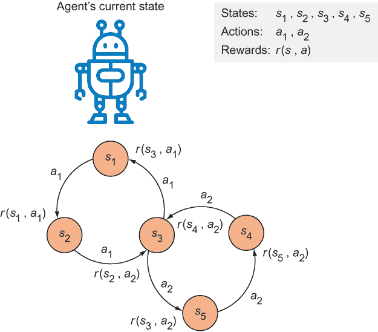
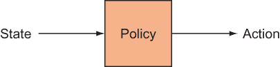
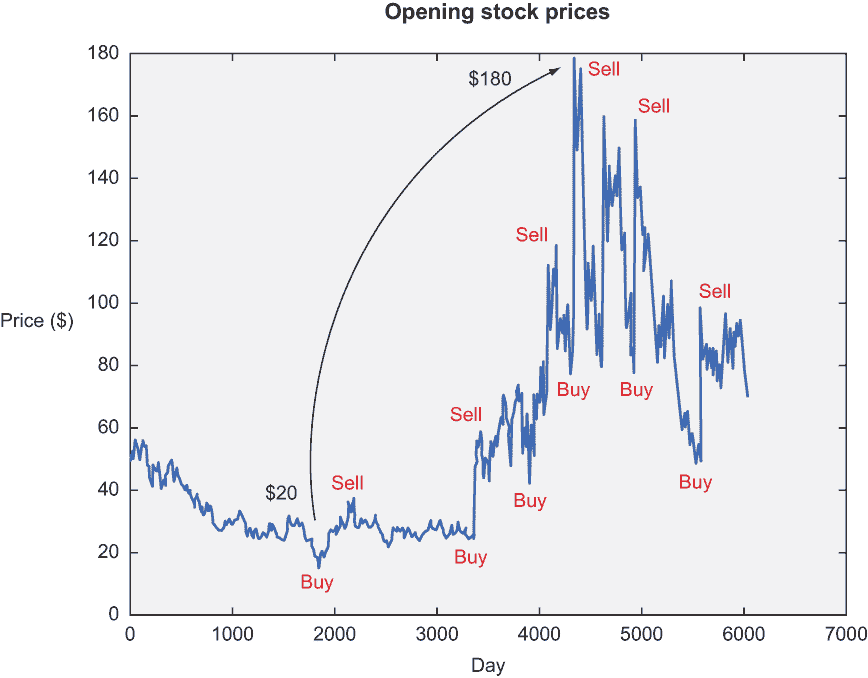
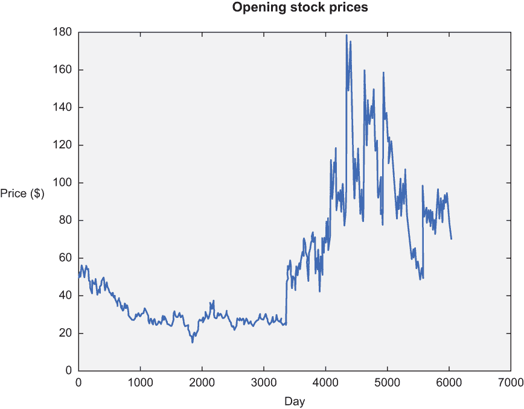
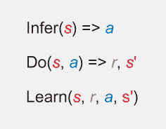
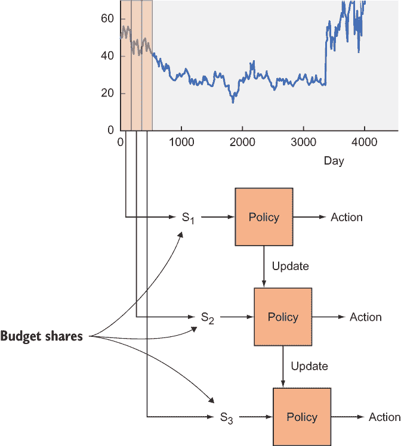
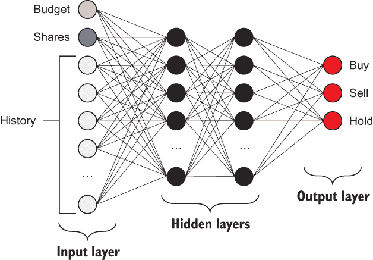
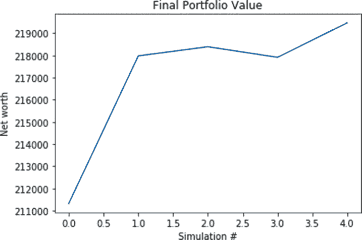
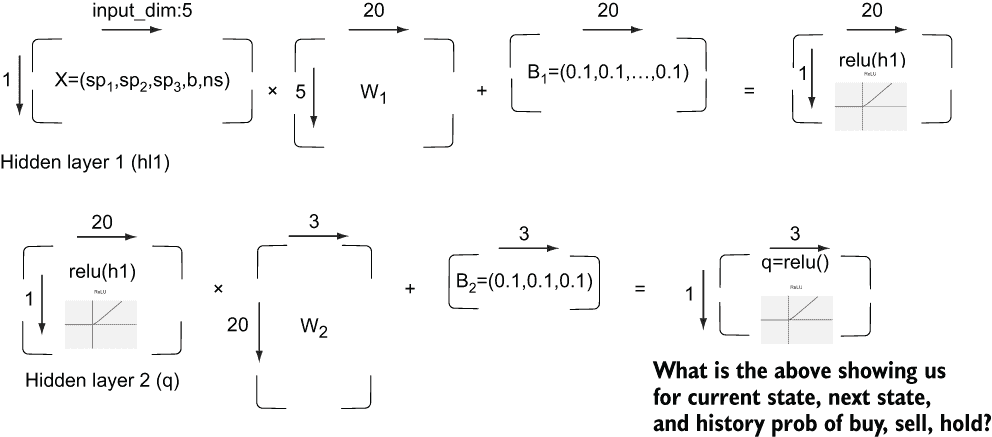

# 13 强化学习

本章涵盖

+   定义强化学习

+   实现强化学习

人类从经验中学习（或者至少*应该*）。你的迷人并不是偶然的。多年的正面赞美以及负面批评都帮助你塑造了今天的你。本章是关于设计一个由批评和奖励驱动的机器学习系统。

你通过与他人、家人或甚至陌生人的互动来学习什么让人们快乐，例如，通过尝试各种肌肉运动直到骑行变得顺畅，你就能学会如何骑自行车。当你执行动作时，你有时会立即得到奖励。例如，找到附近的美食可能会带来即时的满足感。有时，奖励不会立即出现；你可能需要长途跋涉才能找到一个出色的用餐地点。强化学习是关于在任何状态下选择正确的动作——例如，在图 13.1 中，它显示了一个人在交通和意外情况下导航以到达目的地。


图 13.1 在交通和意外情况下导航以到达目的地的人是一个强化学习的问题设置。

此外，假设你在从家到工作的路上，你总是选择同一条路线。但有一天，你的好奇心占了上风，你决定尝试一条不同的路线，希望缩短通勤时间。这种困境——尝试新路线或坚持已知的最佳路线——是*探索与利用*的一个例子。

注意 为什么尝试新事物和坚持旧事物之间的权衡被称为*探索与利用*？探索是有意义的，但你可以将利用视为通过坚持你所知道的东西来利用你对现状的了解。

所有这些例子都可以统一在一个通用公式下：在某个场景中执行一个动作可以产生一个奖励。对于场景的更技术性的术语是*状态*。我们称所有可能状态的集合为*状态空间*。执行一个动作会导致状态发生变化。如果你还记得第九章和第十章，它们讨论了隐马尔可夫模型（HMMs），那么这对你来说不应该太陌生。你根据观察从状态过渡到状态。但哪一系列动作会产生最高的预期奖励呢？

## 13.1 形式概念

与监督学习和无监督学习出现在光谱的两端不同，强化学习（RL）存在于中间某个位置。它不是监督学习，因为训练数据来自算法在探索和利用之间做出决定。它也不是无监督学习，因为算法从环境中接收反馈。只要你在执行动作在某个状态下产生奖励的情况下，你就可以使用强化学习来发现一个好的动作序列，以最大化预期奖励。

你可能会注意到，强化学习术语涉及将算法拟人化为在*情境*中采取*行动*以*获得奖励*。该算法通常被称为*代理*，它在环境中采取行动。在机器人学中应用大量的强化学习理论并不令人惊讶。图 13.2 展示了状态、行动和奖励之间的相互作用。



图 13.2 行动由箭头表示，状态由圆圈表示。对状态执行行动会产生奖励。如果你从状态 s1 开始，你可以执行行动 a1 来获得奖励 r(s1, a1)。

人类使用强化学习吗？

强化学习似乎是最好的方式来解释如何根据当前情况执行下一步行动。也许人类在生物学上也是以同样的方式行事。但让我们不要过于乐观；考虑以下例子。

有时候，人类会无意识地采取行动。如果我渴了，我可能会本能地抓起一杯水来解渴。我不会在脑海中迭代所有可能的联合动作，并在彻底计算后选择最优的一个。

最重要的是，我们采取的行动并不仅仅由我们每个时刻的观察所决定。否则，我们就不比细菌更聪明，因为细菌会根据其环境确定性地采取行动。似乎还有更多的事情在进行中，一个简单的强化学习模型可能无法完全解释人类的行为。

机器人通过执行行动来改变状态。但它如何决定采取哪种行动？第 13.1.1 节介绍了一个新概念来回答这个问题。

### 13.1.1 策略

每个人打扫房间的习惯都不同。有些人从整理床铺开始。我更喜欢顺时针打扫房间，这样就不会错过任何一个角落。你见过机器人吸尘器，比如 Roomba 吗？有人编写了一个机器人可以遵循的策略来清洁任何房间。在强化学习术语中，代理决定采取哪种行动的方式是一个*策略*：决定下一个状态的行动集合（图 13.3）。



图 13.3 一项策略建议在给定状态下采取哪种行动。

强化学习的目标是发现一个好的策略。创建该策略的一种常见方式是观察每个状态下行动的长期后果。*奖励*是采取行动结果的衡量标准。最佳可能的策略被称为*最优策略*，这是强化学习的圣杯。最优策略告诉你给定任何状态下的最佳行动——但就像现实生活中一样，它可能不会在当下提供最高的奖励。

如果你通过观察采取动作后的直接后果——即采取动作后的状态——来衡量奖励，那么计算起来很容易。这种策略被称为*贪婪策略*。但“贪婪地”选择提供最佳即时奖励的动作并不总是好主意。例如，当你打扫房间时，你可能会先整理床铺，因为床铺整理好了房间看起来更整洁。但如果你还有其他目标，比如洗床单，那么先整理床铺可能不是最佳的整体策略。你需要考虑接下来几个动作的结果以及最终的状态，才能得出最佳的方法。同样，在棋类游戏中，抓住对手的皇后可能会最大化棋盘上棋子的分数——但如果这让你在五步之后被将军，那么这并不是最佳的可能走法。

(马尔可夫) 强化学习的局限性

大多数 RL 公式假设你可以从知道当前状态中找出最佳动作，而不是考虑导致你到达该状态的更长期的状态和动作历史。这种决策方法被称为马尔可夫，而通用框架通常被称为马尔可夫决策过程（MDP）。我之前已经暗示过这一点。

当状态足够捕捉到下一步要做什么时，可以使用本章讨论的 RL 算法来建模这些情况。但大多数现实世界的情况都不是马尔可夫的，因此需要更现实的方法，例如状态和动作的分层表示。在极其简化的意义上，分层模型类似于上下文无关文法，而 MDPs 则类似于有限状态机。将问题建模为 MDP 而不是更分层的模型，这种建模的飞跃可以显著提高规划算法的有效性。

你也可以任意选择一个动作，这被称为*随机策略*。如果你提出了一种策略来解决强化学习问题，通常一个好的做法是检查你学习到的策略是否比随机和贪婪策略表现更好，后者通常被称为基线。

### 13.1.2 效用

长期奖励被称为*效用*。如果你知道在某个状态下执行动作的效用，使用强化学习来学习策略就很容易。为了决定采取哪个动作，你选择产生最高效用的动作。正如你可能猜到的，困难的部分是揭示这些效用值。

在某个状态(*s*)下执行动作(*a*)的效用被表示为函数*Q*(*s*, *a*)，称为*效用函数*，如图 13.4 所示。


图 13.4 给定一个状态和采取的动作，应用效用函数 Q 预测预期的和总奖励：即时奖励（下一个状态）加上随后通过遵循最佳策略获得的奖励。

练习 13.1

如果你被给出了效用函数 Q(s, a)，你如何使用它来推导策略函数？

**答案**

政策(s) = argmax_a Q(s, a)

计算特定状态-行动对(*s*, *a*)的效用的一种优雅方法是递归地考虑未来行动的效用。你当前行动的效用不仅受即时奖励的影响，还受下一个最佳行动的影响，如下公式所示。在公式中，*s*'是下一个状态，*a*'表示下一个行动。在状态*s*中采取行动*a*的奖励用*r*(*s*, *a*)表示：

*Q*(*s, a*) = *r* (*s, a*) + γmax *Q*(*s', a'*)

在这里，γ是一个你可以选择的超参数，称为*折现因子*。如果γ为 0，代理会选择最大化即时奖励的行动。γ的更高值会使代理更加重视考虑长期后果。你可以将公式读作“这个行动的价值是采取这个行动提供的即时奖励，加上折现因子乘以之后可能发生的最好事情。”

寻求未来奖励是你可以调整的一种超参数，但还有另一个。在一些强化学习应用中，新可获得的信息可能比历史记录更重要，反之亦然。如果期望机器人快速学习解决任务但不一定是最佳方案，你可能想要设置一个更快的学习率。或者如果允许机器人有更多时间探索和利用，你可能降低学习率。让我们称学习率为α，并按以下方式更改效用函数（注意当α = 1 时，方程式是相同的）：

*Q*(*s, a*) ← *Q*(*s, a*) + α (*r*(*s, a*) + γmax *Q*(*s', a'*) – *Q*(*s, a*))

如果你知道 Q 函数：*Q*(*s*, *a*)，强化学习就可以解决。对我们来说，*神经网络*（第十一章和第十二章）在足够训练数据的情况下可以近似函数。TensorFlow 是处理神经网络的完美工具，因为它附带了许多简化神经网络实现的必要算法。

## 13.2 应用强化学习

应用强化学习需要定义一种从状态执行行动后检索奖励的方法。股票市场交易者很容易满足这些要求，因为买卖股票会改变交易者的状态（现金在手），并且每个行动都会产生奖励（或损失）。

练习 13.2

使用强化学习进行买卖股票可能有哪些可能的缺点？

**答案**

通过在市场上执行行动，如买卖股票，你可能会影响市场，导致它从你的训练数据中发生剧烈变化。

在这种情况下，状态是一个包含当前预算、当前股票数量和最近股票价格历史（最后 200 个股票价格）信息的向量。每个状态是一个 202 维向量。

为了简单起见，只有三种行动：买入、卖出和持有：

+   以当前股价买入股票会减少预算，同时增加当前股票数量。

+   以当前股价卖出股票，将其换成现金。

+   持有既不增加也不减少预算，这个动作等待一个时间周期，不产生任何奖励。

图 13.5 展示了一种基于股票市场数据的可能策略。



图 13.5 理想情况下，我们的算法应该低位买入，高位卖出。像这里展示的那样做一次，可能会获得大约 160 美元的回报。但真正的利润来自于你更频繁地买卖。你听说过高频交易这个术语吗？这种交易涉及尽可能频繁地低位买入，高位卖出，以在给定期间内最大化利润。

目标是学习一种策略，从股票市场的交易中获得最大净收益。这难道不是一件很酷的事情吗？让我们试试吧！

## 13.3 实现强化学习

为了收集股票价格，你将使用 Python 中的 `ystockquote` 库。你可以通过使用 `pip` 或遵循官方指南（[`github.com/cgoldberg/ystockquote`](https://github.com/cgoldberg/ystockquote)）来安装它。使用 `pip` 安装它的命令如下：

```
$ pip install ystockquote
```

安装了该库后，让我们导入所有相关的库（列表 13.1）。

列表 13.1 导入相关库

```
import ystockquote                      ❶
from matplotlib import pyplot as plt    ❷
import numpy as np                      ❸
import tensorflow as tf                 ❸
import random
```

❶ 用于获取股票价格原始数据

❷ 用于绘制股票价格

❸ 用于数值操作和机器学习

创建一个辅助函数，使用 `ystockquote` 库获取股票价格。该库需要三块信息：股票符号、起始日期和结束日期。当你选择这三个值时，你会得到一个代表该期间每日股票价格的数字列表。

如果你选择的起始日期和结束日期相隔太远，获取这些数据将花费一些时间。将数据保存到磁盘上以便下次本地加载可能是个好主意。列表 13.2 展示了如何使用库和缓存数据。

列表 13.2 获取价格的帮助函数

```
def get_prices(share_symbol, start_date, end_date,
               cache_filename='stock_prices.npy', force=False):
    try:                                                              ❶
        if force:
            raise IOError
        else:
            stock_prices = np.load(cache_filename)
    except IOError:
        stock_hist = ystockquote.get_historical_prices(share_symbol,  ❷
        ➥ start_date, end_date)                                      ❷
        stock_prices = []
        for day in sorted(stock_hist.keys()):                         ❸
            stock_val = stock_hist[day]['Open']
            stock_prices.append(stock_val)            
        stock_prices = np.asarray(stock_prices)
        np.save(cache_filename, stock_prices)                         ❹

    return stock_prices.astype(float) 
```

❶ 尝试从文件中加载数据，如果它已经被计算过

❷ 从库中检索股票价格

❸ 从原始数据中提取相关信息

❹ 缓存结果

为了进行合理性检查，可视化股票价格数据是个好主意。创建一个图表，并将其保存到磁盘上（列表 13.3）。

列表 13.3 绘制股票价格的辅助函数

```
def plot_prices(prices):
    plt.title('Opening stock prices')
    plt.xlabel('day')
    plt.ylabel('price ($)')
    plt.plot(prices)
    plt.savefig('prices.png')
    plt.show()
```

你可以使用列表 13.4 获取一些数据并将其可视化。

列表 13.4 获取数据和可视化

```
if __name__ == '__main__':
  prices = get_prices('MSFT', '1992-07-22', '2016-07-22', force=True)
  plot_prices(prices)
```

图 13.6 展示了运行列表 13.4 生成的图表。



图 13.6 该图表总结了从 1992 年 7 月 22 日到 2016 年 7 月 22 日微软（MSFT）的开盘价。如果能在第 3,000 天左右买入，在第 5,000 天左右卖出，那岂不是很好？让我们看看我们的代码是否能够学会买入、卖出和持有以实现最佳收益。

大多数强化学习算法遵循类似的实现模式。因此，创建一个具有相关方法以供以后参考的类是一个好主意，例如一个抽象类或接口。请参阅列表 13.5 中的示例和图 13.7 中的说明。强化学习需要两个明确定义的操作：如何选择动作以及如何改进效用 Q 函数。



图 13.7 大多数强化学习算法归结为三个主要步骤：推断、执行和学习。在第一步中，算法根据到目前为止的知识，在给定状态（s）的情况下选择最佳动作（a）。接下来，它执行动作以找出奖励（r）以及下一个状态（s'）。然后它通过使用新获得的知识（s, r, a, s'）来提高对世界的理解。

列表 13.5 定义所有决策策略的超类

```
class DecisionPolicy:
    def select_action(self, current_state):                  ❶
        pass

    def update_q(self, state, action, reward, next_state):   ❷
        pass
```

❶ 给定一个状态，决策策略将计算下一步要采取的动作。

❷ 通过采取动作的新经验改进 Q 函数

接下来，让我们从这个超类继承以实现一个在随机决策的策略，也称为随机决策策略。你需要定义的只有 `select_action` 方法，该方法随机选择一个动作，甚至不查看状态。列表 13.6 展示了如何实现它。

列表 13.6 实现随机决策策略

```
class RandomDecisionPolicy(DecisionPolicy):     ❶
    def __init__(self, actions):
        self.actions = actions

    def select_action(self, current_state):     ❷
        action = random.choice(self.actions)
        return action
```

❶ 从 DecisionPolicy 继承以实现其函数

❷ 随机选择下一个动作

在列表 13.7 中，你假设有一个策略被提供给你（例如来自列表 13.6 的策略）并在现实世界的股票价格数据上运行它。这个函数负责在每个时间间隔处理探索和利用。图 13.8 展示了列表 13.7 中的算法。



图 13.8 某个大小的滚动窗口迭代通过股票价格，如图所示，分为状态 S1、S2 和 S3。策略建议采取的行动：你可以选择利用它或随机探索另一个行动。随着你为执行动作获得奖励，你可以随着时间的推移更新策略函数。

列表 13.7 使用给定的策略进行决策并返回性能

```
def run_simulation(policy, initial_budget, initial_num_stocks, prices, hist):
    budget = initial_budget                                              ❶
    num_stocks = initial_num_stocks                                      ❶
    share_value = 0                                                      ❶
    transitions = list()
    for i in range(len(prices) - hist - 1):
        if i % 1000 == 0:
            print('progress {:.2f}%'.format(float(100*i) / 
            ➥ (len(prices) - hist - 1)))
        current_state = np.asmatrix(np.hstack((prices[i:i+hist], budget, 
        ➥ num_stocks)))                                                 ❷
        current_portfolio = budget + num_stocks * share_value            ❸
        action = policy.select_action(current_state, i)                  ❹
        share_value = float(prices[i + hist])
        if action == 'Buy' and budget >= share_value:                    ❺
            budget -= share_value
            num_stocks += 1
        elif action == 'Sell' and num_stocks > 0:                        ❺
            budget += share_value
            num_stocks -= 1
        else:                                                            ❺
            action = 'Hold'
        new_portfolio = budget + num_stocks * share_value                ❻
        reward = new_portfolio - current_portfolio                       ❼
        next_state = np.asmatrix(np.hstack((prices[i+1:i+hist+1], budget, 
        ➥ num_stocks)))
        transitions.append((current_state, action, reward, next_state))
        policy.update_q(current_state, action, reward, next_state)       ❽

    portfolio = budget + num_stocks * share_value                        ❾
    return portfolio
```

❶ 初始化依赖于计算投资组合净值的值

❷ 状态是一个 hist + 2D 向量。你将强制它成为一个 NumPy 矩阵。

❸ 计算投资组合价值

❹ 从当前策略中选择一个动作

❺ 根据动作更新投资组合价值

❻ 执行动作后计算新的投资组合价值

❼ 计算在状态采取动作的奖励

❽ 在经历新的动作后更新策略

❾ 计算最终的投资组合价值

为了获得更稳健的成功测量，运行模拟几次并平均结果（列表 13.8）。这样做可能需要一段时间（可能需要 5 分钟），但你的结果将更可靠。

列表 13.8 运行多次模拟以计算平均性能

```
def run_simulations(policy, budget, num_stocks, prices, hist):
    num_tries = 10                                                         ❶
    final_portfolios = list()                                              ❷
    for i in range(num_tries):
        final_portfolio = run_simulation(policy, budget, num_stocks, prices, 
        ➥ hist)                                                           ❸
        final_portfolios.append(final_portfolio)
        print('Final portfolio: ${}'.format(final_portfolio))
    plt.title('Final Portfolio Value')
    plt.xlabel('Simulation #')
    plt.ylabel('Net worth')
    plt.plot(final_portfolios)
    plt.show()
```

❶ 决定重新运行模拟的次数

❷ 将每次运行的组合价值存储在这个数组中

❸ 运行此模拟

在 `main` 函数中，将列表 13.9 中的行添加到定义决策策略，然后运行模拟以查看策略的表现。

列表 13.9 定义决策策略

```
if __name__ == '__main__':
    prices = get_prices('MSFT', '1992-07-22', '2016-07-22')
    plot_prices(prices)
    actions = ['Buy', 'Sell', 'Hold']                           ❶
    hist = 3
    policy = RandomDecisionPolicy(actions)                      ❷
    budget = 100000.0                                           ❸
    num_stocks = 0                                              ❹
    run_simulations(policy, budget, num_stocks, prices, hist)   ❺
```

❶ 定义代理可以采取的动作列表

❷ 初始化一个随机决策策略

❸ 设置可用于使用的初始金额

❹ 设置已拥有的股票数量

❺ 多次运行模拟以计算最终净值的期望值

现在你有了比较结果的基准，让我们实现一个神经网络方法来学习 Q 函数。决策策略通常被称为 *Q-learning 决策策略*。列表 13.10 引入了一个新的超参数 `epsilon`，以防止在反复应用相同动作时解决方案“卡住”。`epsilon` 的值越低，随机探索新动作的频率就越高。Q 函数由图 13.9 所示的函数定义。



图 13.9 的输入是状态空间向量，有三个输出：每个输出的 Q 值一个

练习 13.3

你状态空间表示中忽略的其他可能影响股票价格的因素有哪些？你如何将它们纳入模拟？

**答案**

股票价格取决于多种因素，包括整体市场趋势、突发新闻和特定行业趋势。一旦量化，这些因素中的每一个都可以作为额外的维度应用于模型。

列表 13.10 实现更智能的决策策略

```
class QLearningDecisionPolicy(DecisionPolicy):
    def __init__(self, actions, input_dim):
        self.epsilon = 0.95                                              ❶
        self.gamma = 0.3                                                 ❶
        self.actions = actions
        output_dim = len(actions)
        h1_dim = 20                                                      ❷

        self.x = tf.placeholder(tf.float32, [None, input_dim])           ❸
        self.y = tf.placeholder(tf.float32, [output_dim])                ❸
        W1 = tf.Variable(tf.random_normal([input_dim, h1_dim]))          ❹
        b1 = tf.Variable(tf.constant(0.1, shape=[h1_dim]))               ❹
        h1 = tf.nn.relu(tf.matmul(self.x, W1) + b1)                      ❹
        W2 = tf.Variable(tf.random_normal([h1_dim, output_dim]))         ❹
        b2 = tf.Variable(tf.constant(0.1, shape=[output_dim]))           ❹
        self.q = tf.nn.relu(tf.matmul(h1, W2) + b2)                      ❺

        loss = tf.square(self.y - self.q)                                ❻
        self.train_op = tf.train.AdagradOptimizer(0.01).minimize(loss)   ❼
        self.sess = tf.Session()                                         ❽
        self.sess.run(tf.global_variables_initializer())                 ❽

    def select_action(self, current_state, step):
        threshold = min(self.epsilon, step / 1000.)
        if random.random() < threshold:                                  ❾
               # Exploit best option with probability epsilon
            action_q_vals = self.sess.run(self.q, feed_dict={self.x:  
            ➥ current_state})
            action_idx = np.argmax(action_q_vals)  
            action = self.actions[action_idx]
        else:                                                            ❿
            # Explore random option with probability 1 - epsilon
            action = self.actions[random.randint(0, len(self.actions) - 1)]
        return action

    def update_q(self, state, action, reward, next_state):               ⓫
        action_q_vals = self.sess.run(self.q, feed_dict={self.x: state})
        next_action_q_vals = self.sess.run(self.q, feed_dict={self.x: 
        ➥ next_state})
        next_action_idx = np.argmax(next_action_q_vals)
        current_action_idx = self.actions.index(action)
        action_q_vals[0, current_action_idx] = reward + self.gamma * 
        ➥ next_action_q_vals[0, next_action_idx]
        action_q_vals = np.squeeze(np.asarray(action_q_vals))
        self.sess.run(self.train_op, feed_dict={self.x: state, self.y: 
        ➥ action_q_vals})
```

❶ 从 Q 函数设置超参数

❷ 设置神经网络中的隐藏节点数量

❸ 定义输入和输出张量

❹ 设计神经网络架构

❺ 定义计算效用的操作

❻ 将损失设置为平方误差

❼ 使用优化器更新模型参数以最小化损失

❽ 设置会话并初始化变量

❾ 以概率 epsilon 利用最佳选项

❿ 以概率 1 - epsilon 探索随机选项

⓫ 通过更新其模型参数来更新 Q 函数

整个脚本的输出显示在图 13.10 中。`QLearningDecisionPolicy`中包含两个关键函数：`update_q`和`select_action`，这两个函数实现了随时间推移的动作学习值。五分之一的几率，这些函数会输出一个随机动作。在`select_action`中，大约每 1,000 个价格，函数会强制执行一个随机动作和探索，这由`self.epsilon`定义。在`update_q`中，智能体根据`q`策略值中那些状态的`argmax`定义当前状态和下一个期望动作。因为算法是用`tf.random_normal`初始化的 Q 函数和权重，所以智能体需要一段时间才能开始意识到真正的长期奖励，但再次强调，这种认识正是重点。智能体从随机理解开始，采取行动，并在模拟过程中学习最优策略。



图 13.10 算法学习了一个良好的交易微软股票的策略。

你可以想象 Q 策略函数学习的神经网络类似于图 13.11 所示的流程。X 是你的输入，代表三个股票价格的历史、当前余额和股票数量。第一层隐藏层（20, 1）学习特定动作的奖励随时间的历史，第二层隐藏层（3, 1）将这些动作映射到任何时间的`Buy`（买入）、`Sell`（卖出）、`Hold`（持有）的概率。



图 13.11 Q 策略函数的两个隐藏层的神经网络结构

## 13.4 探索强化学习的其他应用

强化学习比你想象的更常见。当你学习了监督学习和无监督学习方法时，很容易忘记它的存在。但以下例子将让你看到谷歌成功使用强化学习的案例：

+   *游戏玩法*——2015 年 2 月，谷歌开发了一个名为 Deep RL 的强化学习系统，用于学习如何从 Atari 2600 游戏机玩街机视频游戏。与大多数强化学习解决方案不同，这个算法具有高维输入；它感知视频游戏的原始帧帧图像。这样，相同的算法可以与任何视频游戏一起工作，而无需太多的重新编程或重新配置。

+   *更多游戏玩法*——2016 年 1 月，谷歌发布了一篇关于一个能够赢得棋盘游戏围棋的 AI 智能体的论文。由于可能的配置数量巨大（甚至比棋盘还多！），这款游戏因其不可预测性而闻名，但这个使用强化学习的算法能够击败顶级的人类围棋选手。最新版本 AlphaGo Zero 于 2017 年底发布，并在仅 40 天的训练后，以 100 比 0 的比分一致击败了早期版本。到你看这本书的时候，AlphaGo Zero 的表现将比 2017 年有显著提升。

+   *机器人学与控制* ——2016 年 3 月，谷歌展示了一种让机器人通过许多示例学习如何抓取物体的方法。谷歌使用多个机器人收集了超过 80 万个抓取尝试，并开发了一个模型来抓取任意物体。令人印象深刻的是，机器人仅通过摄像头输入就能抓取物体。学习抓取物体的简单概念需要聚合许多机器人的知识，花费许多天进行暴力尝试，直到检测到足够的模式。显然，机器人要能够泛化还有很长的路要走，但这个项目仍然是一个有趣的开始。

注意：现在你已经将强化学习应用于股市，是时候你从学校辍学或辞职，开始操纵系统了——亲爱的读者，你读到这本书的这一部分，你的回报就是！我在开玩笑。实际的股市是一个更加复杂的生物，但本章中的技术可以推广到许多情况。

## 摘要

+   强化学习是处理那些可以通过状态来框架化的问题的自然工具，这些状态会因为代理采取的行动而改变，以发现奖励。

+   实现强化学习算法需要三个主要步骤：从当前状态推断最佳行动，执行该行动，并从结果中学习。

+   Q-learning 是一种解决强化学习的方法，通过开发一个算法来近似效用函数（Q 函数）。在找到足够好的近似之后，你可以开始从每个状态推断出最佳的行动。
